# 如何在 WordPress 帖子和页面上显示最后更新日期

> 原文：<https://kinsta.com/blog/last-updated/>

当[在网上发布内容](https://kinsta.com/blog/evergreen-content/)时，你必须向用户展示博客帖子、页面或媒体是新鲜、准确和最新的。

揭示你的内容的时效性的一个方法是在 [WordPress 博客文章或者页面的某个地方显示“最后更新”日期，比如专题图片、标题或者整篇文章的上方或者下方。](https://kinsta.com/blog/wordpress-get-post-id/)

这样，用户可以看到最近更新的日期以及“发布”日期，或者您可以完全替换发布日期。

### 查看我们的视频指南[，显示 WordPress 帖子和页面的最后更新日期](https://www.youtube.com/watch?v=hb0_8WwzQMI)


简而言之，显示的日期更近，向读者(和[搜索引擎](https://kinsta.com/blog/alternative-search-engines/))表明你的内容是新的，你没有让太多时间过去(这可能会导致链接断开、信息不准确或图像过时)。

## 在哪里查看发布日期和最后更新日期

根据你的[主题风格](https://kinsta.com/blog/the-package-could-not-be-installed/)，发布日期可能会出现在[的帖子、页面或两者上](https://kinsta.com/knowledgebase/wordpress-private-page/)；最常见的位置是在标题之后，内容之前，并且经常有署名。


> Kinsta 把我宠坏了，所以我现在要求每个供应商都提供这样的服务。我们还试图通过我们的 SaaS 工具支持达到这一水平。
> 
> <footer class="wp-block-kinsta-client-quote__footer">
> 
> 
> 
> <cite class="wp-block-kinsta-client-quote__cite">Suganthan Mohanadasan from @Suganthanmn</cite></footer>

[View plans](https://kinsta.com/plans/)

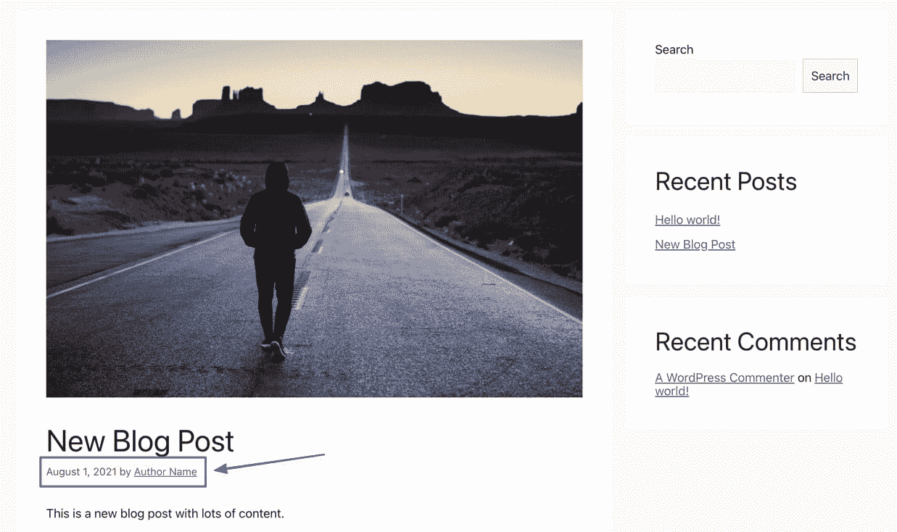

An example of the published date on an old post.


话虽如此，发布日期的造型和位置完全取决于你的主题。你可以在特色图片的上方看到它，还有一个图标，就像下面的主题一样。

[Make sure your posts are fresh & up to date with this guide! 🗓✅Click to Tweet](https://twitter.com/intent/tweet?url=https%3A%2F%2Fkinsta.com%2Fblog%2Flast-updated%2F&via=kinsta&text=Make+sure+your+posts+are+fresh+%26amp%3B+up+to+date+with+this+guide%21+%F0%9F%97%93%E2%9C%85&hashtags=WordPress%2CBloggingTips)

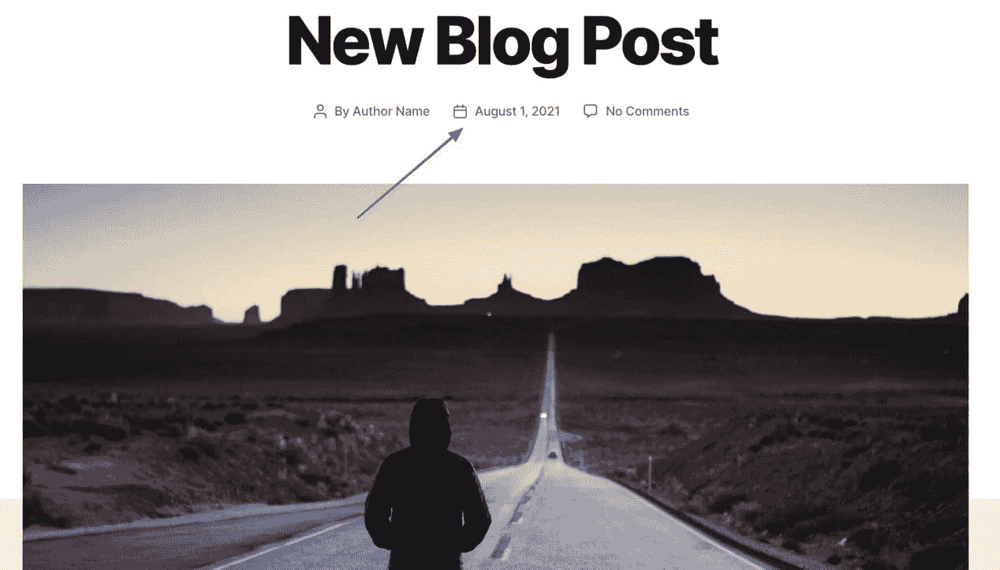

The Twenty Twenty theme offers a unique published date format.


一些主题甚至将发布和最后更新的日期放在内容的末尾，就在[评论框](https://kinsta.com/blog/wordpress-disable-comments/)之前。

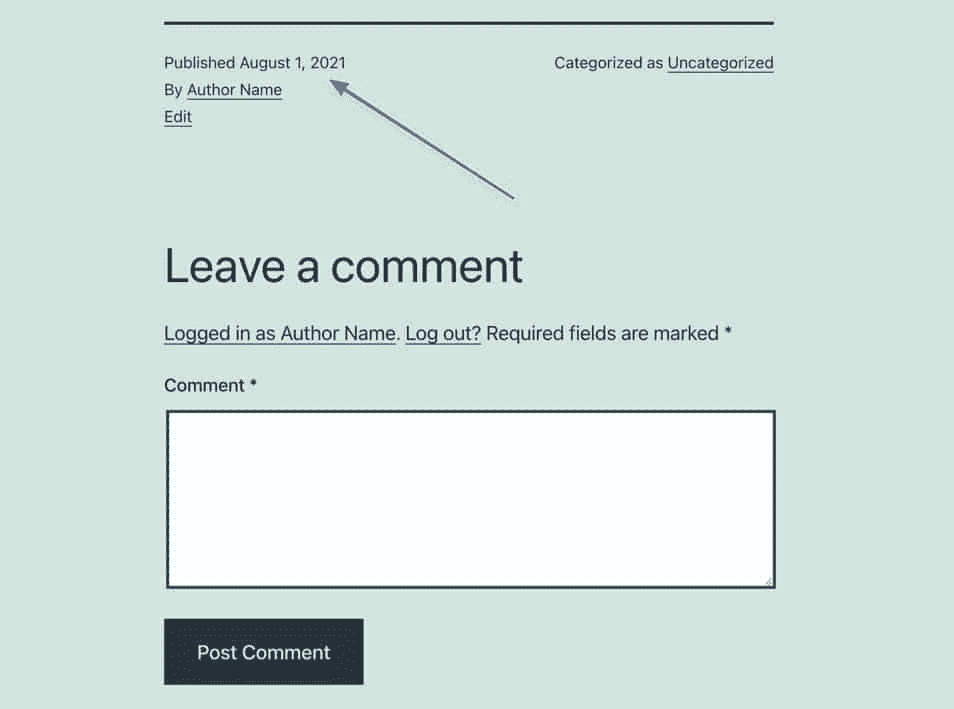

The date on this theme is displayed below the content.


你也可以通过进入你的**帖子**列表中的**日期**栏，在后台找到发布日期。

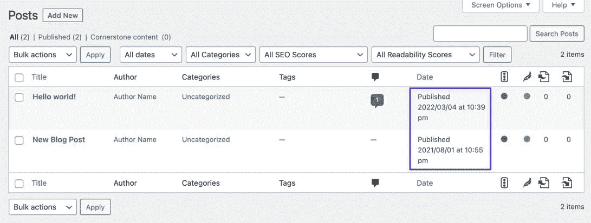

The Date column shows published dates in the WordPress dashboard.


WordPress 也在帖子编辑器中显示发布日期。

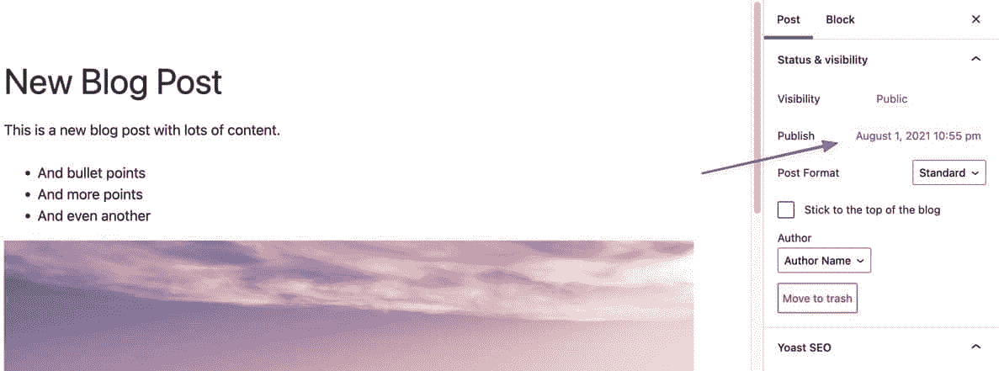

The Published date is the only date shown when editing a post in WordPress.


在本文中，我们解释了显示“最后更新”日期而不是发布日期的好处。我们还将向您介绍显示上次更新日期的各种方法，同时演示如何判断网站上次更新的时间。

请继续阅读，了解所有相关信息！

## 在你的网站上显示“最后更新”日期的好处

定期更新你的内容，并显示最后更新的日期，为网站所有者、搜索引擎用户和那些已经在你的网站上的人带来各种好处。考虑到搜索引擎在确定排名时会考虑新鲜感和相关性，这也有助于搜索引擎优化。

以下是在你的页面和文章上显示“最后更新”日期的主要好处。

*   **最近的日期比发布日期更准确，**它显示您的内容可能比不久前发布的内容更新。
*   **用户看到这是一篇更新的文章，不会认为这是一篇旧文章，**这可能会增加你的点击率和用户阅读的总时间。
*   **你的“最后更新”日期让你更有可能脱颖而出**,因为搜索引擎会在结果中显示这些日期，你的结果会被其他网站的列表放在右边。
*   这给了搜索引擎另一种识别帖子新鲜度的方法。 [当然是搜索引擎抓取内容](https://kinsta.com/blog/submit-website-to-search-engines/)；但是这种情况并不总是发生，而且“最后更新”的日期会加强你的网站上所做的任何更改。
*   **更近的日期提供了一种信任感，即你已经消除了内容问题**，如[断开的链接](https://kinsta.com/blog/broken-links/)，损坏的图像，以及任何不再真实的内容。
*   当内容(和日期)更新时，搜索引擎倾向于更频繁地索引你的网站。这不是一个硬性规定，但是众所周知，搜索引擎会记录不断更新内容的网站，更频繁地抓取它们。
*   **你[提高了整体搜索排名](https://kinsta.com/learn/blogging-tips/)** 的潜力，因为你的整个网站都从你更新的帖子中受益。
*   **它给你一个更新内容的视觉借口/提醒，**因为你可能会注意到一个更老的日期，并意识到需要更新。
*   搜索引擎更喜欢你更新旧的内容，而不是每次你有关于同一主题的新信息时就写一篇新文章。这消除了重复内容的可能性，也解释了为什么显示最近的日期对改善 SEO 最有好处。
*   一些出版物(如在线报纸)需要有“最后更新”日期，这样带有更正和新信息的内容就会显示在网站提要的顶部。这是为了让用户不会错过那些更新。

## 如何在 WordPress 中显示最后更新的日期

默认情况下，WordPress 不会显示新内容或更新内容的最后更新日期，而是显示发布日期。即使几年后这篇文章有了多次更新，这个发表日期依然存在。

一些现代主题提供了内置功能，只需点击几下鼠标就能显示最近更新的日期。首先检查 WordPress Customizer 的主题中的日期定制设置是一个好习惯。但是不能保证任何东西都是可用的。

如果你不能在 WordPress 定制器中添加最后更新日期，使用这些方法来添加它:

1.  通过编辑**functions.php**文件和 CSS
2.  通过修改和添加代码到你的主题模板中
3.  带插件

前两种方法需要你访问你的网站的主题文件，所以如果你还没有经验的话，请阅读 WordPress 文件层次结构(以及如何理解它们)。

查看以下三种方法，了解在您的情况下最佳的行动方案。

### 方法 1:在你的主题中编辑**functions.php**和 CSS

在 WordPress 中添加“最后更新”日期的第一种方法是访问你的主题的**functions.php**文件，并向该文件添加代码。或者，你可以[将代码添加到一个子主题](https://kinsta.com/blog/wordpress-child-theme/)或特定于站点的插件中，以避免当你切换或更新主题时代码消失的问题。

所有这些选项都使用相同类型的 CSS 代码，所以我们会给你一些代码来添加，并告诉你如何把它放在**functions.php**文件中。如果使用子主题或特定站点插件，只需使用相同的代码并修改这些文件。

首先，去你的主题的**functions.php**文件。访问**functions.php**最简单的方法是[使用](https://kinsta.com/help/connecting-with-sftp/)[FTP 客户端](https://kinsta.com/blog/best-ftp-clients/)与 SFTP 连接。你通常可以在你的 FTP 客户端找到它，方法是进入`/www`(或者你的网站名称)`> /public > /wp-content > /themes > /theme-name`(在本教程中我们使用的是`/twentytwentyone`)。

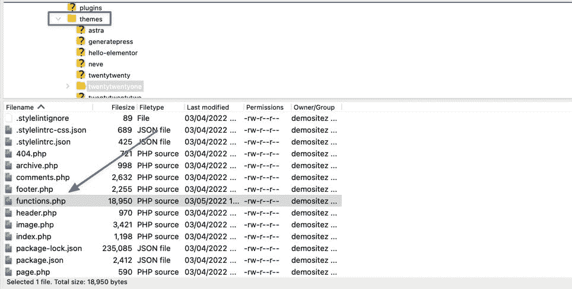

Open the functions.php file.


[使用文本](https://kinsta.com/blog/best-text-editors/)或 [markdown 编辑器](https://kinsta.com/blog/markdown-editor/)打开文件，然后添加以下代码(如果使用子主题/特定于站点的插件，该代码也应该有效):

```
function show_last_updated( $content ) {
  $u_time = get_the_time('U');
  $u_modified_time = get_the_modified_time('U');
  if ($u_modified_time >= $u_time + 86400) {
    $updated_date = get_the_modified_time('F jS, Y');
    $updated_time = get_the_modified_time('h:i a');
    $custom_content .= '<p class="last-updated-date">Recently updated on '. $updated_date . ' at '. $updated_time .'</p>';
  }
  $custom_content .= $content;
  return $custom_content;
}
add_filter( 'the_content', 'show_last_updated' );
```

保存文件并上传回您的服务器。因此，最后更新的日期就出现在文章内容的前面。代码首先检查发布日期和最后更新日期是否相同。

如果它们是相同的，您仍然可以看到发布日期本身。如果它们不同，最后更新日期将与发布日期一起显示。

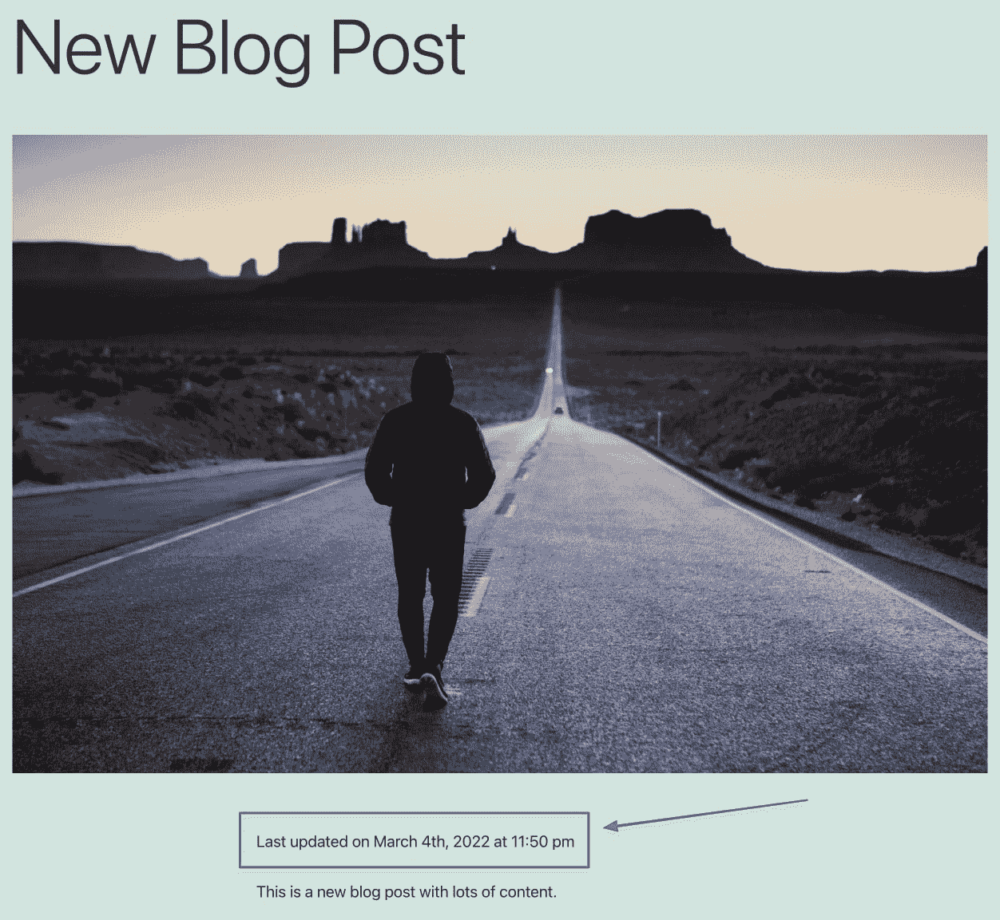

Frontend view of the last updated date.


### 重要的

所有的主题都有不同的表现，所以你可能会发现发布日期仍然在最后更新日期旁边；其他主题完全删除了发布日期，以便为最后更新的日期让路。


### 如何更改新的最后更新日期的样式

在**functions.php**中的新 PHP 代码缺乏风格，但是从你的主题风格来看，它仍然是可以接受的。如果没有，考虑通过[插入定制的 CSS 代码](https://kinsta.com/blog/wordpress-css/)来控制最后更新日期的外观。这里有一些示例代码可供尝试或扩展:

```
.last-updated-date {
  font-size: large;
  font-family: monospace;
  text-transform: uppercase;
  color: white;
  background-color: black;
}
```

注意，我们使用了与插入到**functions.php**中的 [PHP 代码](https://kinsta.com/blog/transpiling-php/)相关的`last-updated-date`类。您可以根据自己的需要更改这个类，但是要确保在您的 CSS 代码中也使用相同的类。

**注意:**完全可以根据需要更改 CSS 属性和值；这些只是例子。

在 WordPress 中进入**外观>定制>附加 CSS** 后，将 CSS 代码插入到字段中。这使得 CSS 能够覆盖整个网站，而不仅仅是在一个页面或帖子上。

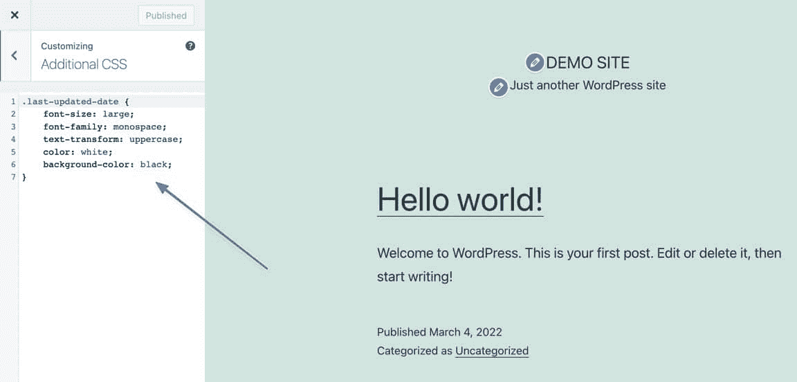

Add CSS code for styling.


在发布 CSS 代码之后，这些样式上的变化会反映在最后更新日期的所有前端实例上。例如，我们改变了背景颜色、字体颜色、[字体系列](https://kinsta.com/blog/best-programming-fonts/)、字体大小，还将所有内容都转换为大写字母。


Frontend view after CSS styling.


### 如何删除页面和其他非文章内容的最后更新日期

你现在可能会发现，你网站上的每个网页都有最后更新日期；考虑到你没有理由显示像[主页](https://kinsta.com/blog/wordpress-change-homepage/)、产品页面、[关于我们页面](https://kinsta.com/blog/about-us-page/)和购物车等页面上次更新的时间，这是没有用的。

例如，这个[隐私政策](https://kinsta.com/podcast/privacy-conscious-hosting-provider/)页面现在会显示它最后更新的时间，尽管对于登陆该页面的人来说这是无用的信息(而且主题一开始就没有显示发布日期)。

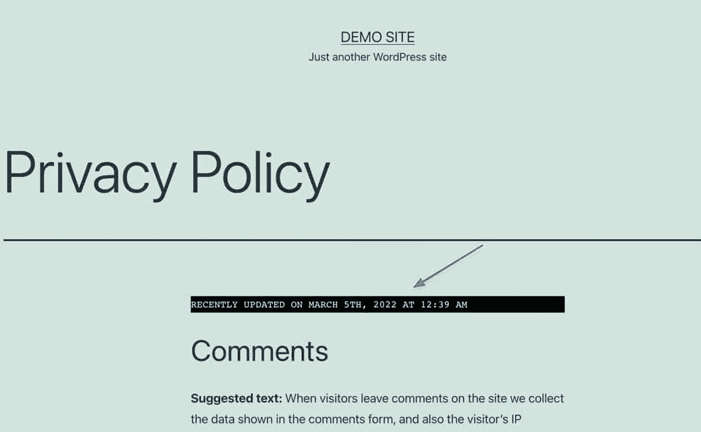

Some sites don’t need a last updated date on pages like a Privacy Policy.


如果你发现自己处于这种情况，很可能是因为你的主题。一些 WordPress 主题会自动删除页面的最后更新和发布日期，因为没有任何理由。但是你可能最终得到一个没有这些功能的主题。在这种情况下，您所需要的只是简单地添加前面实现的 PHP 代码。

所以，回到你的主题的 functions.php 的**文件，在`86400`和`)`之间添加这个。**

```
&& is_singular('post')
```

像这样:

```
function show_last_updated( $content ) {
  $u_time = get_the_time('U');
  $u_modified_time = get_the_modified_time('U');
  if ($u_modified_time >= $u_time + 86400 && is_singular('post')) {
    $updated_date = get_the_modified_time('F jS, Y');
    $updated_time = get_the_modified_time('h:i a');
    $custom_content .= '<p class="last-updated-date">Recently updated on '. $updated_date . ' at '. $updated_time .'</p>';
  }
  $custom_content .= $content;
  return $custom_content;
}
add_filter( 'the_content', 'show_last_updated' );
```

有了这个附加功能，最近更新的日期文本将从每一个 [WordPress 文章类型](https://kinsta.com/blog/wordpress-custom-post-types/)中隐藏，而不是一篇文章(比如页面或产品)。

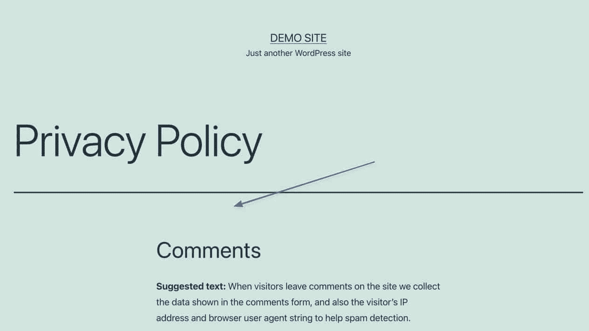

The date gets stripped from all pages, but remains on posts.


### 删除发布日期，仅显示最后更新日期

即使在您实现了添加最后更新日期的代码之后，发布日期仍然存在是很常见的。有些主题会删除它，但这并不常见。问题是，现在你有两个日期显示在你的 WordPress 帖子上:发布日期和最后更新日期。

虽然在某些情况下这是可以接受的，但是两个日期很可能会给读者造成混淆。因此，您可能希望隐藏发布日期，但保留最后更新日期。

有插件可以做到这一点，但是 CSS 的修复很简单，所以我们不建议[安装一个完整的插件](https://kinsta.com/knowledgebase/how-to-install-wordpress-plugins/)来删除你网站上的一个元素。

要去掉发布日期但保留最后更新的日期(之前从上面的方法中添加的)，在 WordPress 仪表盘中进入**外观>定制>附加 CSS** 。

将此代码粘贴到**附加 CSS** 字段:

```
.entry-date {
  display: none !important;
}
```

点击**发布**按钮，使这些更改生效。

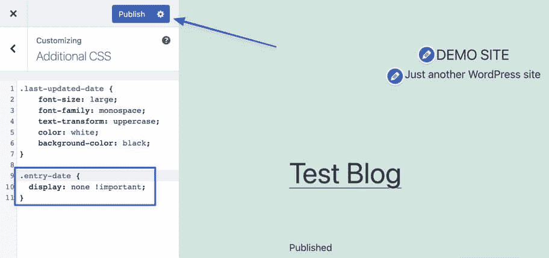

Add CSS in the WordPress Customizer.


您现在应该看到发布日期被删除了，但最后更新的日期仍然显示。

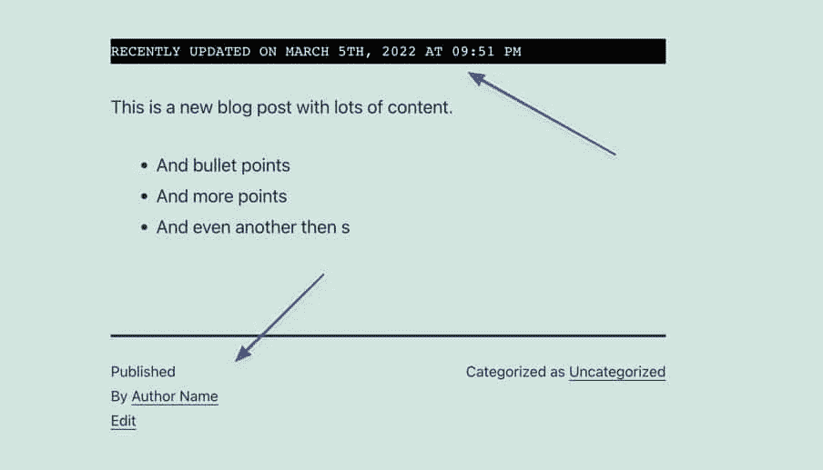

Frontend view of the last updated date still there without the published date.


请记住，尽管`.entry-date` CSS 类名在许多主题中都很常见，但并不是所有的主题都使用它。所以，如果这段代码不适合你，很可能是因为你的主题使用了一个不是`.entry-date`的类名。

但是 CSS 代码仍然很好，所以你所要做的就是找出你的主题用于发布日期的类名。为此，导航到一篇博客文章的前端，在当前显示的发布日期上右键单击。选择**检查**选项(这因你的浏览器而异:Chrome 使用**检查**，Firefox 使用**检查元素**，对于 Safari 你必须按下 **Option 键+ C** )

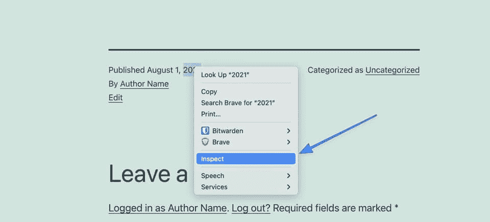

Right click on the date and choose the Inspect option.


这将显示浏览器的**开发者工具**部分，显示当前页面的编码元素，尤其是您刚刚单击的页面元素的 CSS 代码。

如果你点击了日期，它应该显示为主要元素，但是如果没有，寻找一个用于`<time class=`的部分。您的发布日期的 CSS 类应该紧接着出现；这种情况下是`entry-date`。但是开发者在创建主题时会使用很多变体，比如`post-date`、`posts-date`和`published-date`。

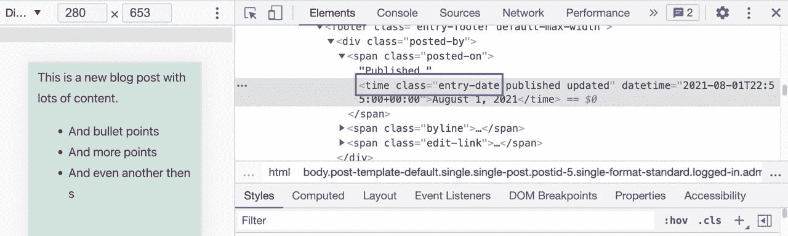

Look for the “time class=” snippet and the information after it.


仅复制该类(不复制括号或其他元素)。

将代码粘贴到下面的 CSS 片段中，替换掉`yourthemes-class-name`。确保在类名前保留句点。

```
.yourthemes-class-name {
  display: none;
}
```

这应该可以了！

#### 一种快速(但有时是有效的)摆脱发布日期的方法

一个快速和无代码的方法来删除发布日期，但仍然保留最近更新的日期(从前面的方法插入)，是通过完全删除 WordPress 通用设置中的日期格式。

在 WordPress 中，进入**设置>常规**，然后向下滚动到**日期格式**和**时间格式**部分。为两者选择**自定义**选项，并清除每个字段中的示例格式。点击底部的**保存更改**按钮。

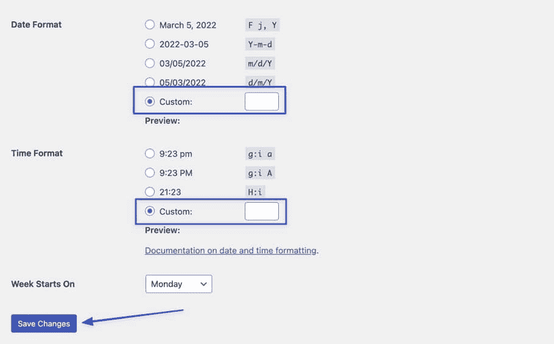

Choose Custom and clear out the fields.


因此，在您的[博客帖子](https://kinsta.com/blog/proofreading-tips/)(或任何类型的帖子)上不会出现更多的发布日期，然而最后更新的日期仍然存在，只要您已经实现了必要的代码来显示 functions.php 文件中的最后更新日期(如本文前面所示)。

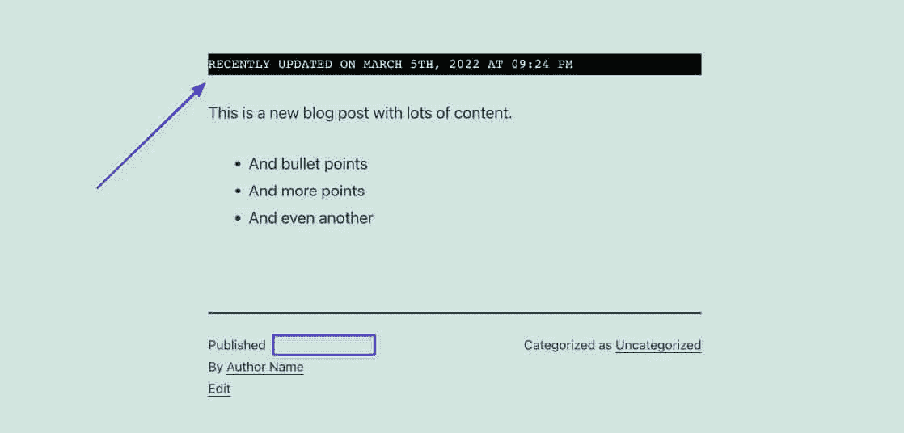

You should see the updated date without the published date on the frontend.


### 重要的

你所有的文章类型在后台仍然会收到一个“发布”的时间戳，所以你可以在 WordPress 的文章列表中找到那个日期，搜索引擎会记录一个发布日期。然而，您可能会发现这种方法对于某些主题并不适用，尤其是当发布日期中包含了一些额外的文本或图标而被遗漏时。我们的例子实际上留下了一些“已发布”的文本，但幸运的是这并不重要，因为它对“按作者姓名”的文本仍然有意义。我们还注意到，在删除默认设置后，一些主题会重新填充**自定义日期格式**字段，因此这并不适用于所有人。


### 方法 2:编辑你的主题模板

主题开发者在主题文件中使用不同的模板来显示信息。大多数情况下，主题模板决定了帖子元数据(如发布日期)在主题上显示的位置和方式。

您可能需要进行一些搜索，但想法是找到负责在前端共享帖子日期和时间的模板(以及该模板中的代码)。同样，开发人员在使用的模板上也有所不同，但是在这些模板中看到发布日期代码是很常见的:

*   index.php
*   page.php
*   single.php
*   archive.php
*   content.php
*   template-tags.php
*   template-functions.php
*   `/inc`文件夹中的一个 PHP 文件
*   `/post`文件夹中的一个 PHP 文件
*   `/content`文件夹中的一个 PHP 文件
*   `/excerpt`文件夹中的一个文件
*   `/template-parts`文件夹中的一个文件

这取决于开发人员的判断(以及他们自己的风格)，因此您必须四处挖掘，找出正确的代码所在的位置，或者找到与上面列出的不同名称的文件。

以下是找到正确主题文件的一些选项:

*   向主题开发人员发送消息，询问哪个主题模板控制帖子发布日期的输出。你也可以在网上或某个主题的用户论坛中完成搜索。
*   检查最常见的主题模板。对于更简单的主题，你可以从**index.php**、**page.php**、**single.php**开始，但大多数现代主题都使用类似于`/template-parts`、`/excerpts`和`/inc`的文件。
*   使用 FTP 客户端的搜索功能来查找文本实例，如`posted`、`time`、`date`、`get_the_time`或`get_the_date`。

对于这个例子，我们使用的是 [Twenty Twenty One 主题](https://kinsta.com/blog/twenty-twenty-one-theme/)，我们发现发布的日期代码位于 template-tags.php 的**文件中，让您了解主题开发人员没有多少标准化。**

## 注册订阅时事通讯


### 想知道我们是怎么让流量增长超过 1000%的吗？

加入 20，000 多名获得我们每周时事通讯和内部消息的人的行列吧！

[Subscribe Now](#newsletter)

本文件中发布日期的指标包括:

*   对时间类的引用
*   `get_the_date`代码
*   “已发布”文本

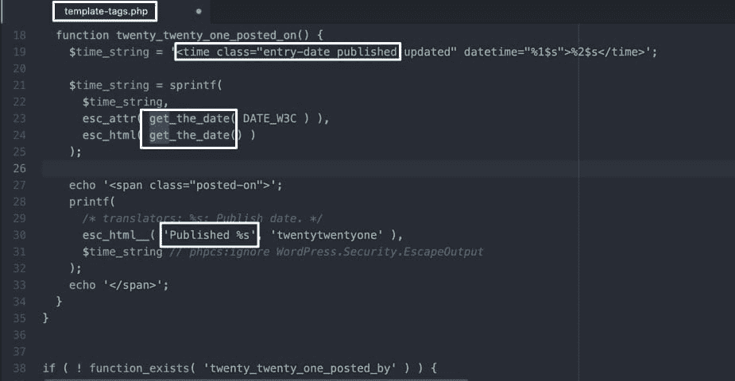

Various indicators to find the file that serves up dates.


当您发现类似的指示符时，请在代码中确定一个区域，以便放置最后更新的日期。通常最好在已经显示发布日期的部分之前或之后插入新代码。

复制这段代码并粘贴到您想要的位置:

```
$u_time = get_the_time('U');
$u_modified_time = get_the_modified_time('U');
if ($u_modified_time >= $u_time + 86400) {
  echo "<p>Last Updated on ";
  the_modified_time('F jS, Y');
  echo " at ";
  the_modified_time();
  echo "</p> ";
}
```

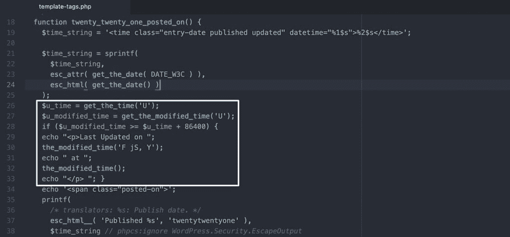

Paste the code into your template file.


使用模板文件往往会花更长的时间来找到正确的文件夹，但它有几个好处，主要是最后更新日期实际上会显示在多个区域中。

其中一个区域就是您插入帖子代码的地方。在这个例子中，我们现在可以在文章的底部看到最后更新的日期和文本，就在发表日期的上方。

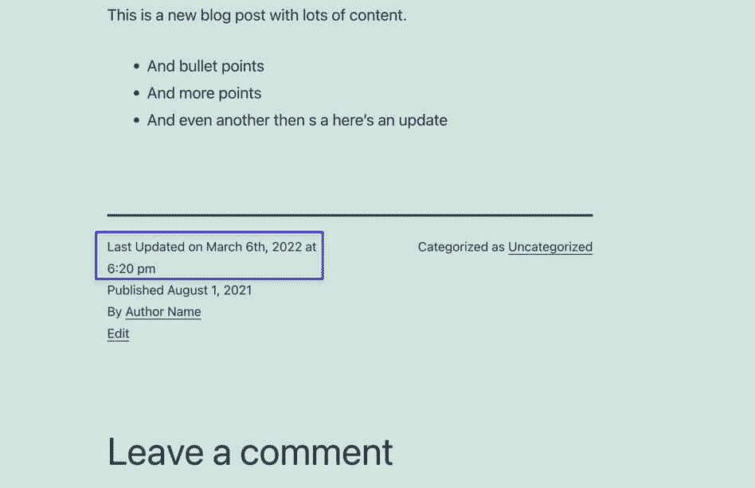

The last updated date now shows on each post.


更改主题模板还会在主**博客/存档**页面上提供最后更新的日期，所有 WordPress 的文章都会按顺序列出。因此，每个更新的帖子都会在列表中显示该日期，让站点访问者更加清楚地了解内容的新鲜程度。

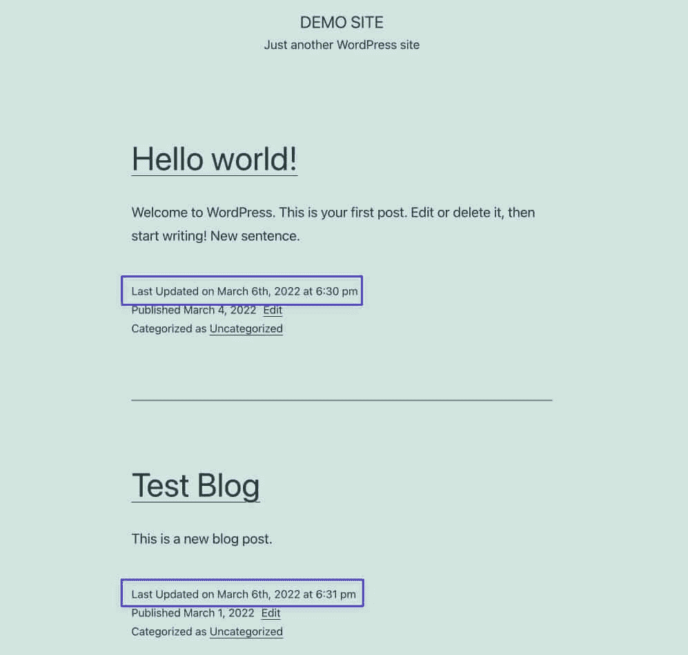

This method also reveals the last updated date on your main Blog/Archive page.


#### 更改上次更新日期出现的位置

主题模板决定了日期如何出现在 WordPress 帖子上，但是它们也决定了日期在帖子上的位置。

由于这取决于主题及其模板结构，您可能会发现一个主题在帖子的顶部显示了发布和最后更新的日期，就在标题的下方，内容的上方。其他主题开发者选择在底部显示日期，比如在作者传记之前，或者甚至在某个独特的地方，比如在[侧边栏](https://kinsta.com/blog/wordpress-database-how-sidebars-work/)中。

因此，需要使用主题模板来调整帖子的最后更新或发布日期。有时，这意味着简单地将您在方法 2 中插入的代码移动到同一个 PHP 文件中的其他地方。

其他时候，这个 PHP 文件实际上是一个“模板部分”文件，然后由一个主模板提取，这个主模板组织所有的模板部分，形成文章的格式。

使用我们之前的 Twenty Twenty One 主题示例，很明显,**template-tags.php**文件只是最终插入到主帖子主题文件中的一小部分。因此，您的工作是询问开发人员哪个主题模板处理帖子格式，或者自己做一些研究。

虽然我们不能保证这适用于每一个主题，但是寻找一个“主”主题模板是一个很好的起点，比如 single.php 的**、content-single.php 的**、甚至是 post.php 的**。**

 **对于 Twenty Twenty One 主题，我们实际上可以将最后更新的代码插入到 single.php 的**或者 content-single.php 的**或者 T2 的中，就像 single.php 的如何作为“主”模板文件一样，但是 content-single.php 的是从**single.php 的**中提取的模板部分。

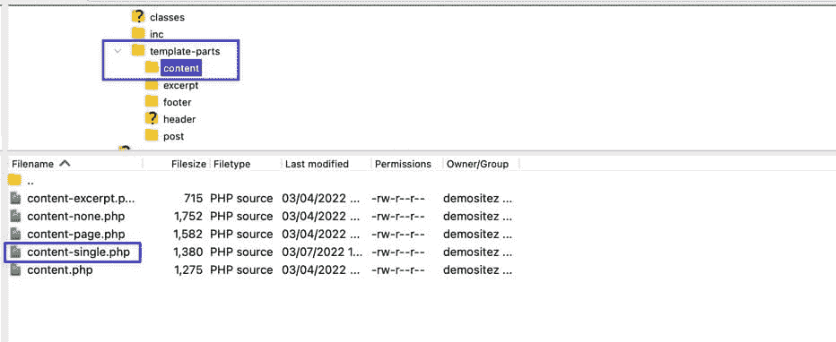

Open the content-single.php file, or whichever template part file has the code that displays dates.


要移动最后更新日期的位置，请将方法 2 中提到的代码粘贴到您想要的位置。我们可以看到这个文件有一个`header`部分和一个`the_content`的片段，所以我们将最后更新的日期代码放在这两个部分之间，将日期从内容下面的默认位置移到内容前面。

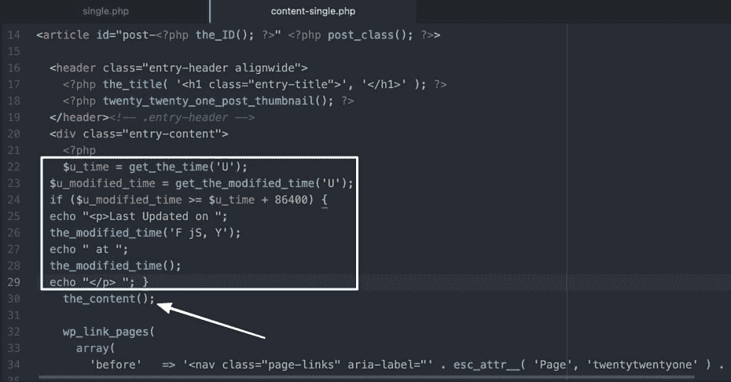

Move the code to a suitable position.


在前端，最后更新的日期现在出现在我们想要的位置，您可以从以前的位置(靠近底部)删除重复的日期，或者将它们都留在那里。

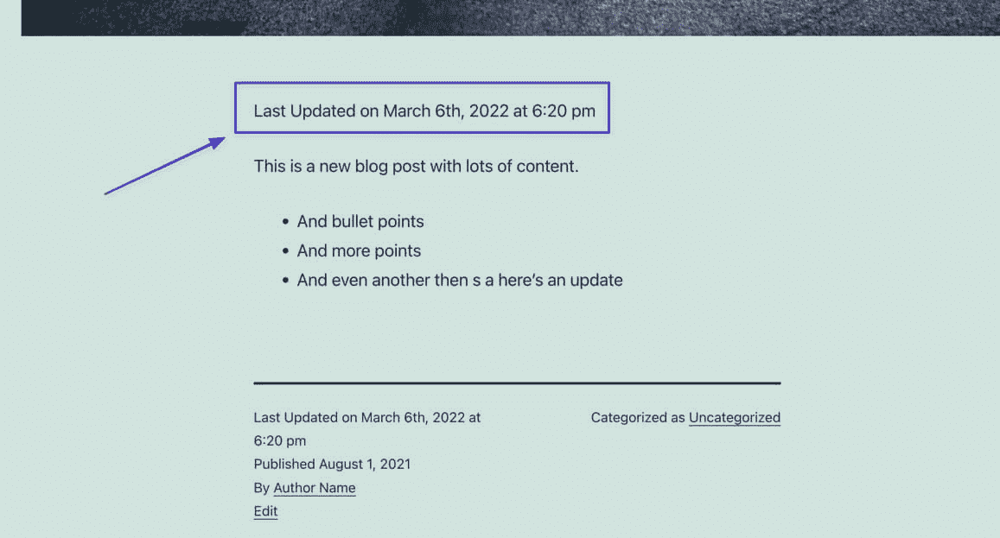

The last updated date is now at the top of the post.


#### 在 Astra 主题中添加最后更新日期

由于主题模板的用法(和名称)随着主题的不同而变化，我们将向您展示如何在几个因其多功能设计选项和速度而受欢迎的[主题中插入最后更新日期:Astra、Neve 和 Zakra。](https://kinsta.com/blog/fastest-wordpress-theme/)

第一个是 [Astra](https://kinsta.com/blog/generatepress-vs-astra/) ，这是一个众所周知的多用途主题，有一个免费的入门模板库。这些起始模板中的每一个都向主题模板目录添加了新文件，但是基本结构保持不变。对于本教程，我们安装了一个初学者模板，现在想在每篇文章的顶部添加一个最后更新日期。

为了让您了解每个主题的不同之处，Astra 主题(及其旅游博客启动模板)在默认情况下甚至不显示发布日期。无论如何，您仍然可以添加最后更新日期。要使用本文中的方法 1 插入日期，请在 FTP 客户端转到`/wp-content > /themes > /astra`。打开**functions.php**文件。

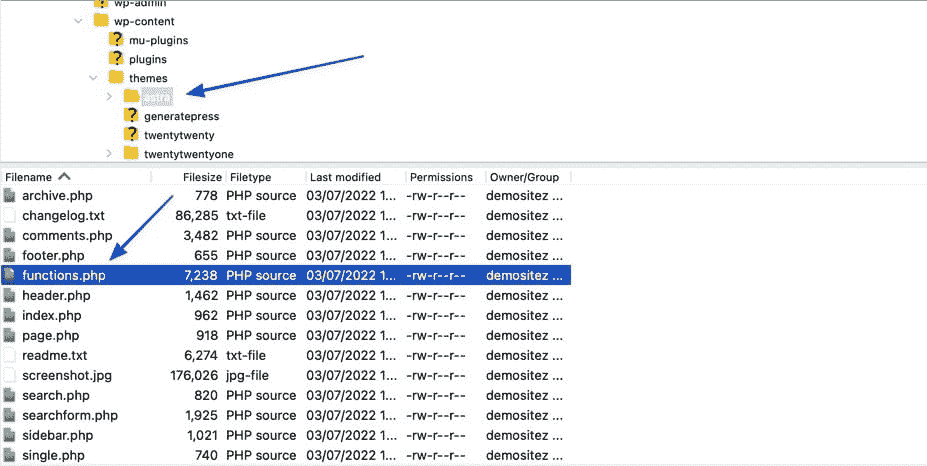

Open functions.php.


将方法 1 代码粘贴到文件的末尾，并保存到您的服务器。结果是最后更新的日期显示在你的博客文章的顶部。

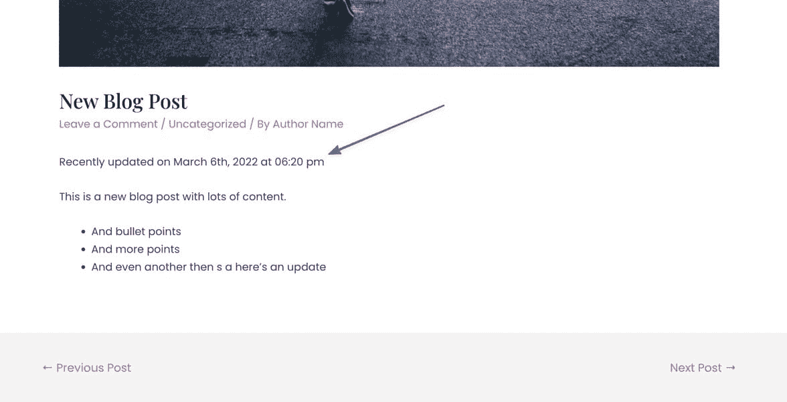

A frontend view of the last updated date in Astra.


使用方法 2，找到名为**single-layout.php**的主题模板。它位于`/astra > /template-parts > /single`下面。

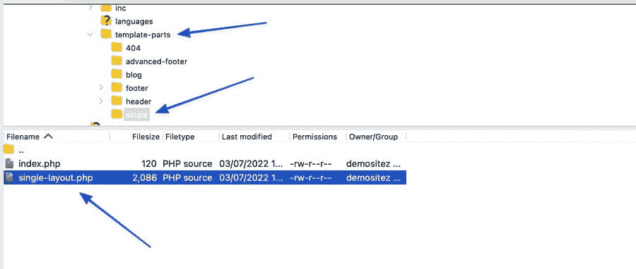

Open the single-layout.php file.


您使用的是相同的代码，但是一些主题模板要求您指定您使用的是 PHP 代码；因此，如果您在前端看到的是代码而不是呈现的日期，请在代码周围添加`括号。`

`Struggling with downtime and WordPress problems? Kinsta is the hosting solution designed to save you time! [Check out our features](https://kinsta.com/features/)

它应该是这样的:

```
<?php
function show_last_updated( $content ) {
  $u_time = get_the_time('U');
  $u_modified_time = get_the_modified_time('U');
  if ($u_modified_time >= $u_time + 86400) {
    $updated_date = get_the_modified_time('F jS, Y');
    $updated_time = get_the_modified_time('h:i a');
    $custom_content .= '<p class="last-updated-date">Recently updated on '. $updated_date . ' at '. $updated_time .'</p>';
  }
  $custom_content .= $content;
  return $custom_content;
}
add_filter( 'the_content', 'show_last_updated' );
```

将代码片段放在包含`the_content`代码的那一行的正上方。

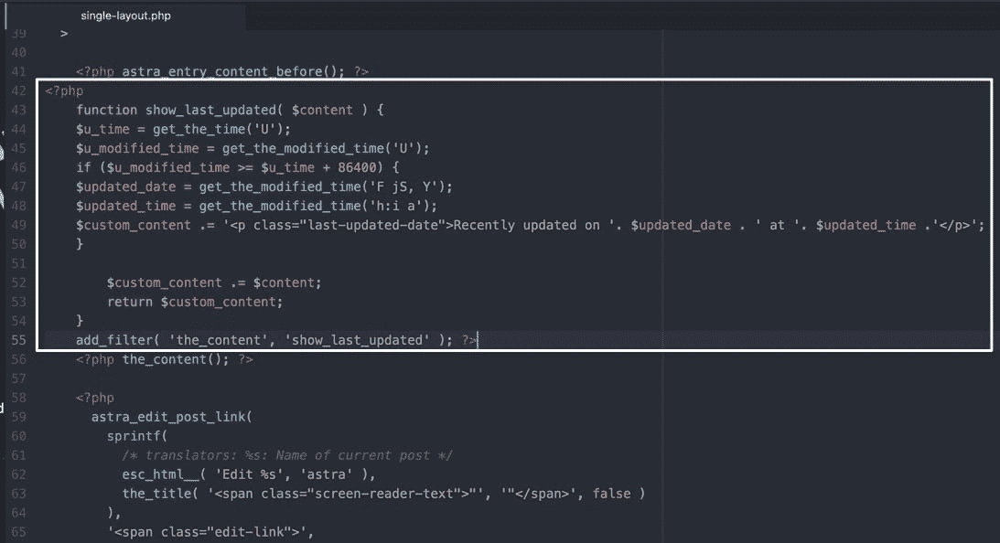

Insert code into single-layout.php.


在 Astra 主题的内容开始之前，保存并上传新文件到服务器会生成一个最近更新的行！

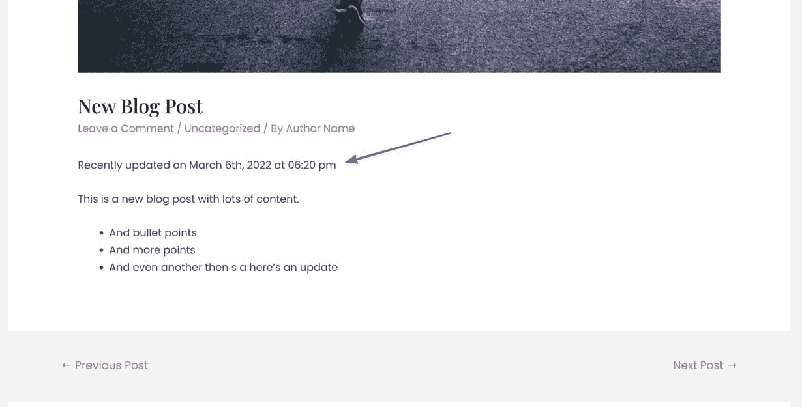

Last updated date result on the frontend of Astra.


#### 在 Neve 主题中添加最后更新日期

Neve 主题很好地提醒了[在修改任何代码之前，一定要检查 WordPress 定制器](https://kinsta.com/blog/how-to-customize-wordpress-theme/)。每个主题都在定制器中添加了自己的设置，所以您可能会发现一个开关，只显示最后更新的日期。Neve 就是这种情况。

要打开 WordPress 中的设置，请转到**外观>自定义>布局>博客/档案**。点击**帖子 Meta** 下拉菜单。确保**日期**在**元订单**下可见，然后打开选项“**使用最后更新的日期而不是发布的日期**”

最近的日期会显示在博客页面和每个帖子上。

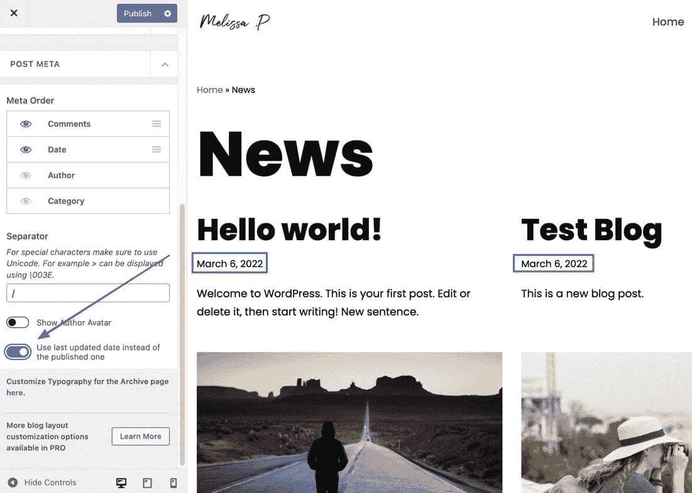

Neve makes it easy with a Customizer setting.


#### 在 Zakra WordPress 主题中添加最后更新的日期

Zakra 是另一个棘手的问题，你可能会想到去 WordPress 文件中的`/template-parts`文件夹，以便找到提供发布日期的代码。然而，正确的位置是在`/inc`文件夹中。

要将最后更新日期添加到 Zakra，通过 FTP 客户端连接并转到您站点的`/themes`文件夹。然后，导航至`/zakra > /inc > template-tags.php`。打开文件进行编辑。

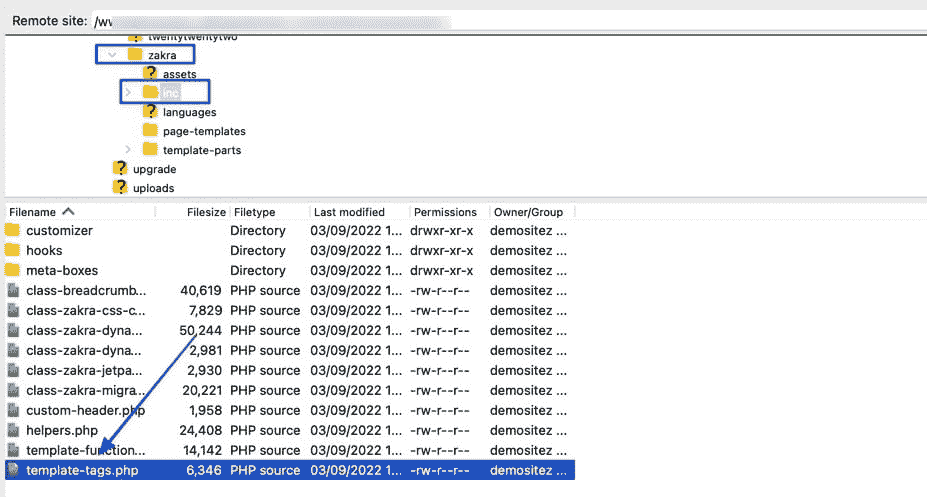

Open the template-tags.php file.


将之前讨论过的代码粘贴在`);`(来自`get_the_time`函数)和`$posted_on = sprintf(`之间。将文件保存回服务器。

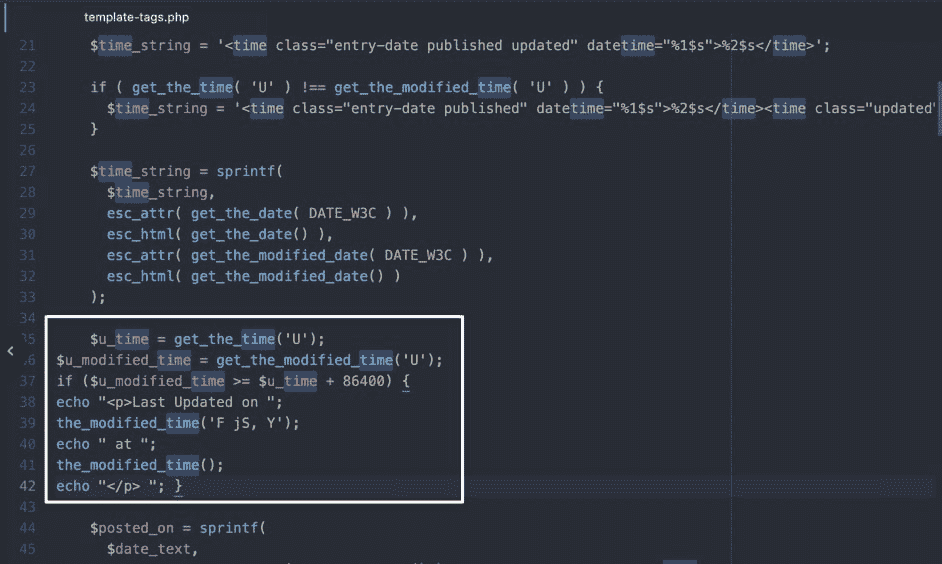

Paste the code inside the Zakra theme template.


这个日期现在出现在 Zakra 主题的所有帖子的前端。

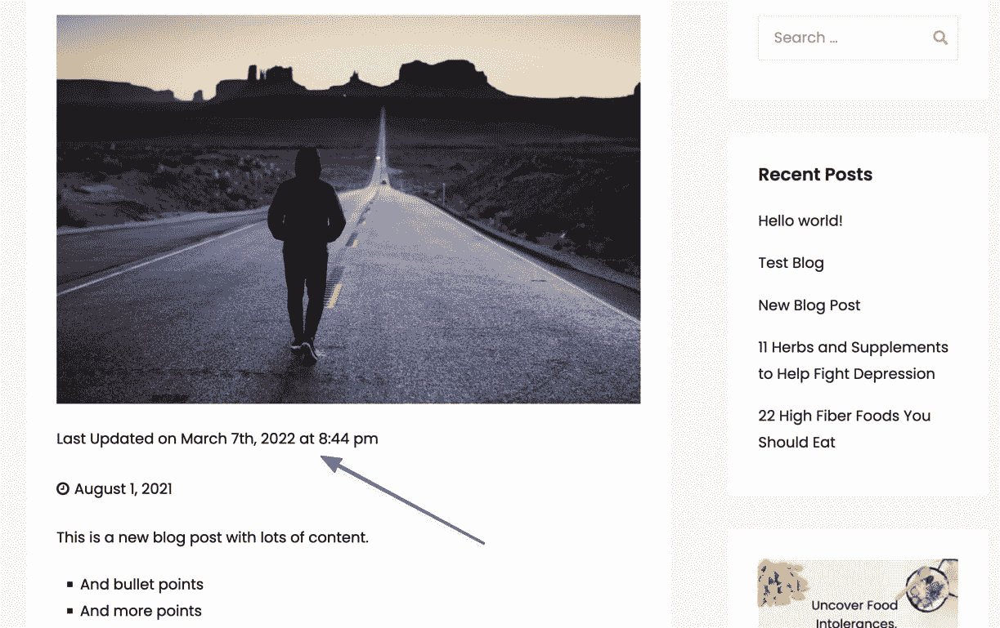

The last updated date on the frontend of Zakra.


#### 如果编辑主题设计时仍有问题

正如您在本文中多次注意到的，每个主题都有自己的内置样式、 [CSS 代码](https://kinsta.com/knowledgebase/edit-wordpress-code/)和 PHP 功能。因此，不可能说出每个主题如何响应我们的示例代码。此外，许多主题已经有了合适的样式，甚至可以显示上次更新的日期，而无需您做任何调整。

不管是哪种情况，处理最后更新日期时出现的大多数问题都是由于硬编码的主题文件，或者文件中的某种唯一性。因此，最好联系你的主题开发者，告诉他你想要达到的目标。他们通常可以提供一个快速的解决方案，为您的特定情况提供合适的 CSS 或 PHP 代码。

### 方法 3:使用插件

我们建议在依赖插件之前，使用上述方法之一来修改发布日期。这是因为你添加的每一个插件都会产生更多潜在的性能和安全问题；这个特殊的日期变化很小，所以当你所要做的就是编辑 functions.php 的 T2 文件或主题模板时，我们宁愿避免添加插件。

说到这里，你可能会发现上面的方法都不起作用，或者它们没有按照你想要的方式发挥作用。在这种情况下，考虑安装并激活 [WP 上次修改信息插件](https://wordpress.org/plugins/wp-last-modified-info/)。

这个插件消除了等式中的猜测，允许你添加最后更新日期，调整设置(比如替换发布日期)，以及格式化日期的外观和位置。

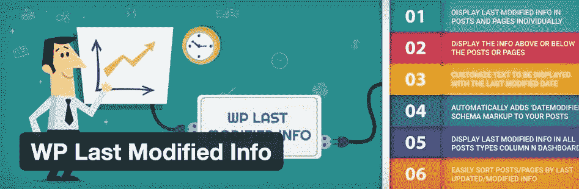

The WP Last Modified Info plugin.


一旦激活，进入 WordPress 仪表盘中的**设置> WP 最后修改信息**。在**帖子选项**页面，打开**开关“启用前端帖子/页面”**

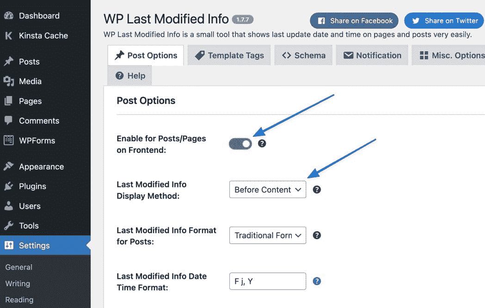

Enable for Posts and Pages on the frontend.


您也可以选择将显示方法更改为:

*   内容之前
*   内容之后
*   替换发布日期
*   手动([使用短代码](https://kinsta.com/blog/wordpress-shortcodes/))

向下滚动页面，找到其他设置:

*   日期格式
*   时间格式
*   时间间断


You can choose to replace the published date with the last updated date.


保存这些设置，以显示网站前端的最后更新日期。如果有些东西看起来不太对，回到设置，看看是否有什么东西可以修复到你想看到的样子。

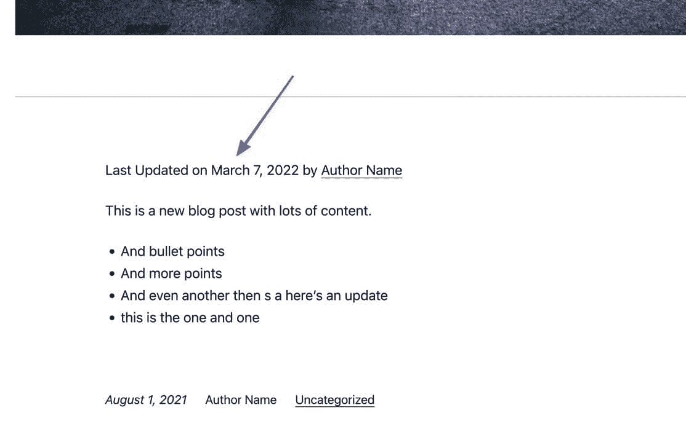

A frontend view of what the plugin displays.


该插件还会自动激活页面的最后更新日期。如果你想取消默认设置，回到插件设置，填写“**文章类型，显示修改信息**”字段。只需在字段中输入“Posts ”,以确保在**页面**的帖子类型中没有任何更新。设置好所有更改后，务必点击**保存设置**按钮。

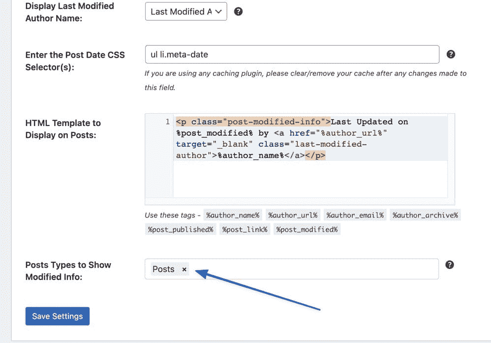

Only show the updated date on Posts.


## 如何判断 WordPress 文章或页面最后更新的时间

在 WordPress 帖子上显示最近更新的日期是一回事，但是实际查看帖子最后更新的时间呢？毕竟，这是识别你应该修改的旧帖子的重要部分。

 此外，查看发布日期和最后更新日期有助于解决您在添加最后更新日期时可能遇到的问题。例如，本文中的大部分代码要求实际上有一个最后更新的日期。这意味着如果帖子没有更新，你将看不到任何日期，直到在后端查找日期时你才知道。

要查看一篇 WordPress 文章或页面最后更新的时间(甚至是在实现上述方法的任何代码之前)，你可以转到 [WordPress 仪表盘](https://kinsta.com/knowledgebase/wordpress-admin/)的一个区域。

不幸的是，当你添加文章和页面时，WordPress 不会自动在后台显示**修改日期**或**最后更新日期**，即使你实现了我们上面方法中的一些代码。进入 WordPress 中的**帖子**列表只会显示一个**发表日期**栏。

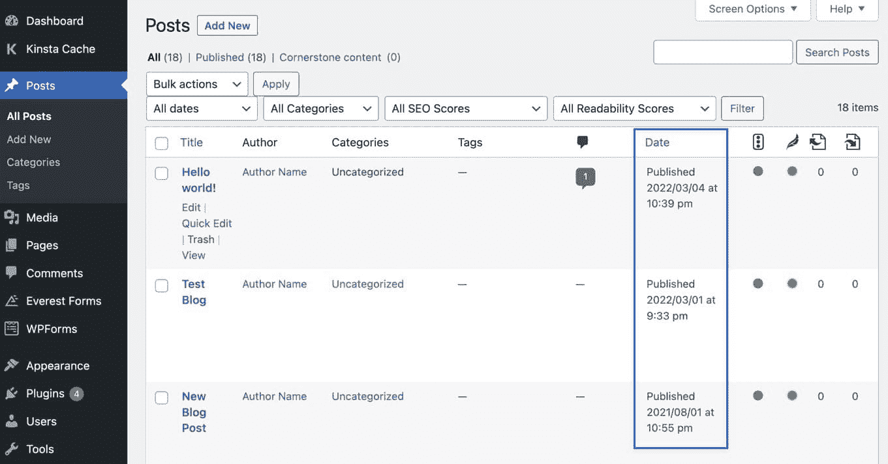

There’s only a Published Date column on the backend post list.


帖子和页面编辑也是如此；你可以查看**帖子**标签，查看**发布的**日期，但不知道最后一次更新是什么时候。

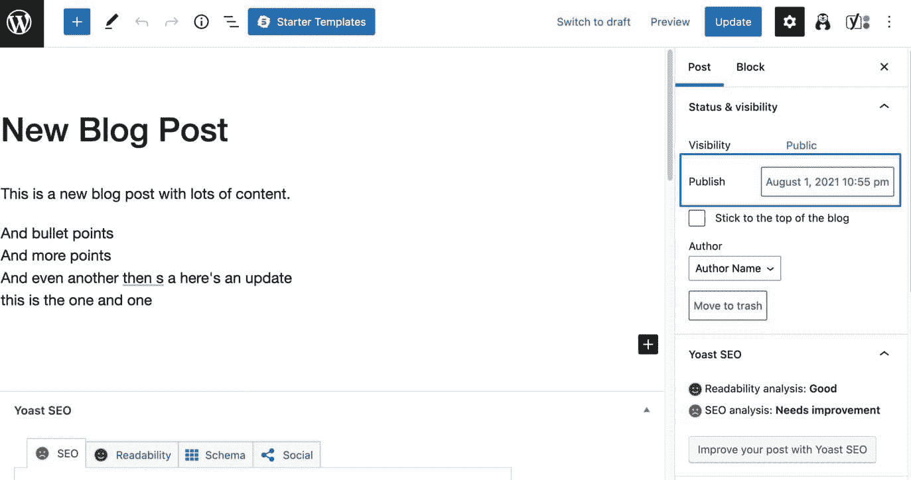

Only the Published date gets shown by default.


### 获得 WordPress 中最后更新日期的内置方法

在没有内置显示功能的帮助下，最好打开有问题的帖子，然后点击右边的**帖子**标签。向下滚动找到一个**修改**按钮。

*   如果你没有看到**修订**按钮，这意味着你从来没有更新过它。
*   如果你看到一个**修订**按钮，点击它。

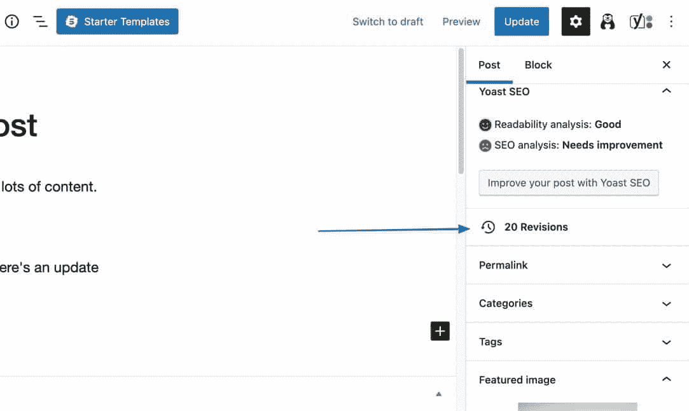

Click the Revisions button to view the list.


虽然这不能保证找到最后更新的日期，但它让你对这篇文章的活动有了一个很好的了解。

无论你是否发表文章，修改都会被保存到 WordPress 中，所以你可能会有一些修改日志，实际上并不是最后更新的日期。但是您可以查看过去的修订版，根据修订版中的内容，查看哪些是您最近发布的。

每个修订记录了日期和时间，您可以假定这也是最后一次更新的日期。

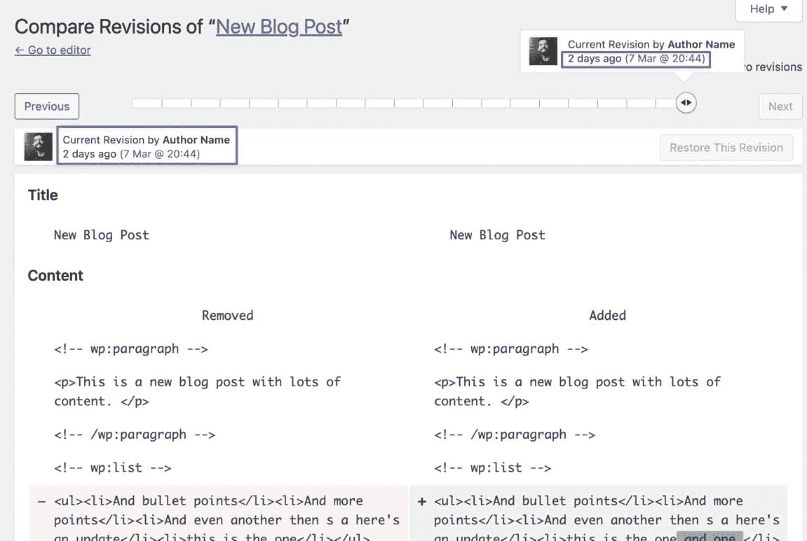

Check for the Last Modified date within the revisions.


如果您已经从前面的方法中实现了最后更新的日期代码，但是您没有在前端看到日期，这是一个查看帖子是否有更新日期的极好方法；如果没有，代码将不会显示任何内容。

### 或者使用插件在后端查找最后更新的日期

WP Last Modified Info 插件不仅将最后修改日期添加到前端，还在整个仪表板上创建了列和部分，以便更容易地发现你有一段时间没有更新的帖子。

安装了 WP 最后修改信息插件后，导航到 WordPress 中的**帖子**列表。插件会自动在**日期**旁边生成一个名为**最后修改日期**的新列。

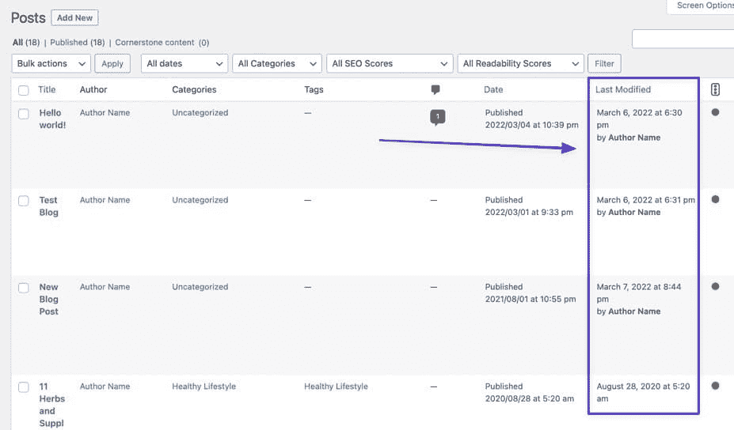

The plugin includes a new backend column for the Last Modified date.


该插件还在帖子编辑器中显示一个名为 **Last Updated** 的标签，显示每篇帖子的最后更新日期和时间。

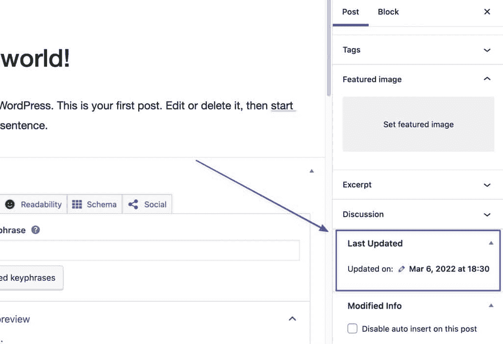

The Last Updated tab within the post editor.


[Keep your blog posts accurate and up to date with a little help from this guide ✍️Click to Tweet](https://twitter.com/intent/tweet?url=https%3A%2F%2Fkinsta.com%2Fblog%2Flast-updated%2F&via=kinsta&text=Keep+your+blog+posts+accurate+and+up+to+date+with+a+little+help+from+this+guide+%E2%9C%8D%EF%B8%8F&hashtags=WordPress%2CBloggingTips) ## 摘要

在本文中，您了解了:

*   如何判断网站上次更新的时间
*   在你的网站上显示最后更新日期的好处
*   如何使用以下方法在 WordPress 中显示最后更新日期:
    *   **方法一:**编辑【functions.php】和**你的主题中的 CSS**
    *   **方法二:**编辑主题模板
    *   **方法 3:** 使用类似 WP 上次修改信息的插件

我们还探讨了以下技巧:

*   如何更改上次更新日期的样式
*   如何删除页面和其他非文章的最后更新日期
*   删除发布日期，以便只显示最后更新的日期
*   更改帖子上最后更新日期的显示位置

最后，我们向您展示了如何将最后更新日期添加到几个流行的主题中，包括:

*   [二十二十](https://kinsta.com/blog/twenty-twenty-theme/)
*   二十二十一
*   阿斯特拉
*   从不
*   扎拉

如果你有任何关于如何在你的 WordPress 网站上显示最后更新日期的问题，请在评论中告诉我们！

* * *

让你所有的[应用程序](https://kinsta.com/application-hosting/)、[数据库](https://kinsta.com/database-hosting/)和 [WordPress 网站](https://kinsta.com/wordpress-hosting/)在线并在一个屋檐下。我们功能丰富的高性能云平台包括:

*   在 MyKinsta 仪表盘中轻松设置和管理
*   24/7 专家支持
*   最好的谷歌云平台硬件和网络，由 Kubernetes 提供最大的可扩展性
*   面向速度和安全性的企业级 Cloudflare 集成
*   全球受众覆盖全球多达 35 个数据中心和 275 多个 pop

在第一个月使用托管的[应用程序或托管](https://kinsta.com/application-hosting/)的[数据库，您可以享受 20 美元的优惠，亲自测试一下。探索我们的](https://kinsta.com/database-hosting/)[计划](https://kinsta.com/plans/)或[与销售人员交谈](https://kinsta.com/contact-us/)以找到最适合您的方式。`**