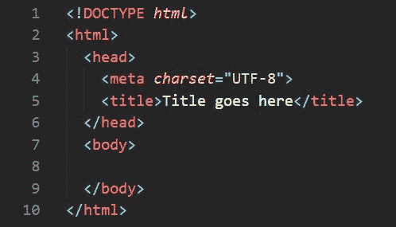
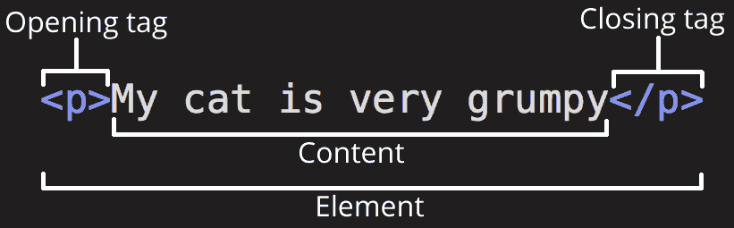
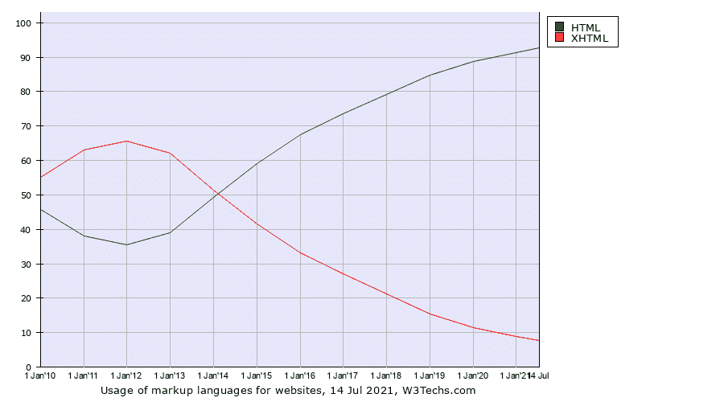
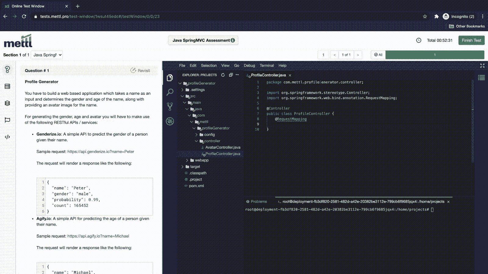
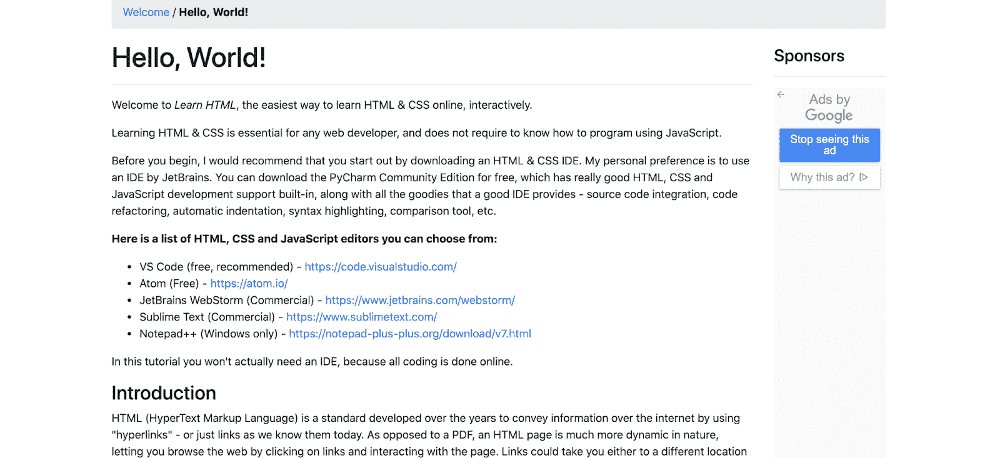
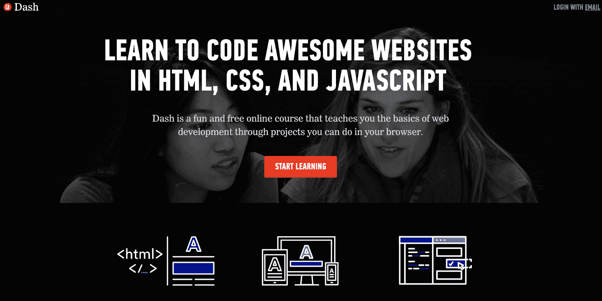

# 免费学习 HTML 的最佳方式(以及为什么你应该这样做)

> 原文：<https://kinsta.com/blog/learn-html/>

实现你的想法并不总是容易的。

你可能有一个完美的愿景，但是与你的开发者分享它是一个挑战。想法可能会在翻译中丢失，你的网站可能会错失目标。

更糟糕的是，你可能需要在发布前立即编辑，没有时间去找你的开发者。

这就是为什么学习 [HTML](https://kinsta.com/knowledgebase/what-is-html/) 如此重要的原因。有了适当的 HTML 知识和技能，你可以熟练地建立和编辑一个网站，使你的愿景成为现实。

这篇文章将向你展示学习 HTML 需要做些什么，以及为什么在你的工具包里有它是至关重要的。

T3】

## 什么是 HTML？

HTML 代表**H**yper**T**ext**M**arkup**L**语言。它是用于在标准浏览器中显示文档和各种作品的语言。

它被世界各地的企业用来驱动移动应用程序、软件和网站——几乎占所有网站的 92.8%。

学习 HTML 将为你和你的企业带来无数的机会。通过理解基本的 HTML，你将能够[编写网站代码和调整脚本](https://kinsta.com/blog/html-best-practices/)。

> 需要在这里大声喊出来。Kinsta 太神奇了，我用它做我的个人网站。支持是迅速和杰出的，他们的服务器是 WordPress 最快的。
> 
> <footer class="wp-block-kinsta-client-quote__footer">
> 
> 
> 
> <cite class="wp-block-kinsta-client-quote__cite">Phillip Stemann</cite></footer>

[View plans](https://kinsta.com/plans/)

起初，用 HTML 编写可能看起来很复杂。看看在这个 HTML 编辑器中编写的 HTML 代码行:

HTML 是一种独特的编码语言，需要高深的知识。

这可能现在对你来说没有意义，但是一旦你学习了 HTML 课程，你很快就会明白了。

当你学习和理解 HTML 的必要结构时，你将能够很快回忆起 HTML 的快捷方式。

在上面的例子中，您可以看到代码是为 HTML 页面编写的，包括页眉、标题和正文。括号内的标签开始给出文档结构，而实际内容可以添加到它们之间。

总的来说，标签和内容被认为是一个元素。理解 HTML 的第一步是学习所有最常用的标签和它们的作用。

例如，`
`标签表示一个段落。添加`
`开始一个新的段落，然后开始像这样键入您的内容:

理解不同的标签如何构成元素是学习 HTML 的关键一步。

所有开始标签都需要一个匹配的结束标签。您可以在标签前使用反斜杠来编写结束标签。例如，要结束一个段落，你可以在内容后面加上`
`。

这只是一个标签的例子。还有数百种其他标签可以帮助您创建更具活力的项目。将标签放在一起的顺序和方式决定了网页或资源的结构和风格。

一些最受欢迎的标签包括:

*   `<H1>`–第一个页眉文本大小
*   `<b>`–加粗文本
*   `<i>`–倾斜文本
*   `<a href=>`–向文档添加链接
*   ``–将字体增大到特定大小

一旦你开始对 HTML 的[研究，这些标签将成为你的第二天性。你将能够准确地回忆起你需要哪一个，而不必去查找它们。](https://kinsta.com/blog/html-vs-html5/)

这就是程序员在编写代码时速度如此之快的原因。他们知道标签，也知道如何将它们组合在一起，从而在头脑中创建动态的 HTML 编码资产。

你可能会想，“难道我不能雇人帮我写网站代码吗？”虽然答案是肯定的，但是仍然有很多理由让你学习 HTML。

让我们来看看为什么学习 HTML 是一项有价值的时间投资的几个最重要的原因。

[有了正确的 HTML 知识和技巧，你可以熟练地建立和编辑一个网站，让你的愿景成为现实...但是你从哪里开始呢？🤔 点击推文](https://twitter.com/intent/tweet?url=https%3A%2F%2Fkinsta.com%2Fblog%2Flearn-html%2F&via=kinsta&text=With+the+right+HTML+knowledge+and+skills%2C+you+can+proficiently+build+and+edit+a+website+to+make+your+vision+a+reality...+but+where+do+you+start%3F+%F0%9F%A4%94&hashtags=HTML%2CWebDev)

## 为什么你应该学习 HTML

简单地说:HTML 是你每天接触的大多数网站的基础。甚至这个网页也是一个 HTML 文档。

它在网络上如此普遍，以至于你至少了解 HTML 结构的基本知识是有意义的。你永远不知道它什么时候会派上用场。

了解这一点将有助于你成为更精明的商人、营销人员、产品开发人员和设计师。

当你理解 HTML 的时候，你可以做很多事情。坚实的 HTML 基础会让你从创建到编辑的过程中，从其他创始人、雇员和竞争者中脱颖而出。

通过理解基本的 HTML，您将能够:

*   构建您自己编码的自定义站点
*   [站点上的主机资产](https://kinsta.com/knowledgebase/wordpress-google-cloud-storage/)
*   考察遗址，了解它们是如何建造的
*   编写其他资产的代码，包括基本软件、应用程序等
*   无需开发人员即可管理网站编辑

随着 HTML 的使用持续增长，决定学习 HTML 从长远来看甚至会有回报。

例如，看一下这个图表，可以看到 HTML 的使用在过去几年中是如何增加的，而 XHTML(一种较老的标记语言)的使用却在减少:

HTML 和 XHTML 语言使用图表

凭借对 HTML 的扎实理解，你可以成为几乎任何职位的候选人。如果你自己是一名企业家，你可以用这些技能来改善你的业务。

## 谁需要学习 HTML？

如果你发现自己在这个页面上，你很可能是学习 HTML 的优秀候选人——也是将从中受益的人。

在你犹豫不决之前，要知道你的年龄和技能水平并不重要。从创始人到实习生，每个人都会从学习 HTML 中受益。

没有多少人有 HTML 的经验，所以从头开始也没关系。拥抱学习新事物的兴奋，让你的好奇心飙升。

如果你懂 HTML，一个新的世界向你敞开。您可以通过创建响应性网站、应用程序等来实现您的想法。

HTML 将在各种工作职能中帮助人们:

*   营销人员——知道如何改变网站
*   **产品开发**-编码产品的交互渲染
*   **客户服务**–帮助查找订单和编码定制信息
*   **设计师**——在网上发布他们的作品，并了解他们将如何被描绘
*   **销售人员**–自动过滤潜在客户数据，发送冷邮件等。
*   创始人们对他们的产品或网站进行编辑，并以一种更具体的方式分享他们对 HTML 丰富资源的愿景

正如您所看到的，学习 HTML 有很多好处，并且这些知识可以影响多个不同的业务部门。

你想改变你的日常工作吗？考虑学习 HTML 作为一项新技能，你可以提供给你的公司。

当你理解 HTML 的时候，有很多工作可以做。
T3】

## 学习 HTML 可以获得哪些工作？

通过学习 HTML，你可以让自己对任何组织都有独特的价值。

让我们面对现实吧:任何组织都需要一个能扑灭网站大火的员工。

你不会在一夜之间成为软件开发人员，但是学习 HTML 会让你走上成为软件开发人员的正确道路。

HTML 编码知识是全世界雇主都需要的专业技能。软件开发人员是最常见的使用 HTML 的工作之一。

在过去的几年里，对软件开发人员的需求不断增长。据估计，到 2024 年将需要 2870 万软件开发人员:

未来几年对软件开发商的需求将持续增长。

如果你学习 HTML，你可以成为很多不同的软件开发者。有了 HTML 技能，你可以得到以下工作:

*   **——对用户交互的网站部分进行编码**
***   [**后端开发人员**](https://kinsta.com/blog/backend-developer/)–对内容管理系统(CMS)进行编码，内容管理人员将资产输入到该系统中，以便资产出现在前端*   [**全栈开发者**](https://kinsta.com/blog/what-is-a-full-stack-developer/)——对网站的前端和后端都进行编码**

 **对做网页开发者不感兴趣？别担心。有很多其他的工作会从你的 HTML 知识中受益。

HTML 知识将使你成为一个全方位的更有市场的就业前景。你自然会在公司的不同部门找到不同的方法来运用你的技能。

即使只是一点 HTML 的基础知识对任何公司来说都是一笔财富。你将知道人们在谈论什么，以及如何向团队成员解释技术想法。

市场营销、商业智能和产品开发都可以从 HTML 中受益。以下是你可以在这些学科中找到的一些工作:

*   **电子邮件营销经理**——你可以[创建 HTML 格式的电子邮件](https://kinsta.com/blog/email-marketing-best-practices/)，这些邮件在视觉上更吸引最终收件人
*   **营销运营经理**–通常需要 HTML 来添加集成，以确保客户数据的安全传递
*   **数据科学/SQL 管理员**–您可以运行 HTML 脚本来合成大量数据和模型
*   **商业智能管理器**–您可以使用 HTML 模块挖掘客户数据中的趋势和见解
*   **产品经理**——你可以使用 HTML 来构建、测试和编码新产品

如果这些工作听起来很有趣，你应该考虑花时间学习 HTML。但是不要搞错:学习 HTML 可能是一项具有挑战性的任务。

## 注册订阅时事通讯

### 想知道我们是怎么让流量增长超过 1000%的吗？

加入 20，000 多名获得我们每周时事通讯和内部消息的人的行列吧！

[Subscribe Now](#newsletter)

这可能不是你马上就能理解的事情。相反，你可能必须努力确保你知道你正在学习的新语言的每一个组成部分。

但是对 HTML 有一个像样的理解到底有多难呢？让我们来看看新生应该期待什么。

## 学 HTML 有多难？

学习 HTML 需要练习，练习，再练习，就像任何新技能一样。

你学习 HTML 的方法应该像你学习一门新语言的方法一样。首先要明白，你是在没有任何先验知识的情况下开始的。即使是最有经验的工人也会感到羞愧。

然而，一旦你意识到你对这种新语言一无所知，你就可以开始钻研并发现它到底是关于什么的。

随着你的学习，HTML 对你来说会变得更加明显，你可以继续一点一点地学习每一课，每一课都会相互叠加。

很快，你就能把复杂的元素放在一起，制作出视觉效果惊人的 HTML 页面和应用程序。

### 学习 HTML 需要多长时间？

这个过程可能需要一段时间。如果简单的话，大家就都懂 HTML 了。

这确实是一项专业技能，你需要花时间去学习，以确保你慢慢理解一切。

有一些简短的课程可以在几天或一个月内教会你 HTML 的基础知识。然而，你不会一夜之间成为软件开发人员。

彻底理解 HTML 可能需要几个月或几年的时间来了解你需要了解的一切。

想知道如何开始？让我们来看看学习 HTML 的最佳方法。

## 学习 HTML 的最好方法

学习 HTML 的最好方法是指导练习。它可以在新兵训练营(面对面或在线)或有指导的模块。

一个模块提供了视频教学、讲座和指导练习的组合。有些甚至会在每节课结束时进行测试。

模块是实用的，因为它们使学生能够按照自己的速度学习，并对课程采取动手的方法。

下面是一个正在运行的模块示例:

有了 HTML 模块，你可以自我检查你的工作，确保你是在正确的轨道上。

理想情况下，你可以登录一个模块，学习一门关于 HTML 的课程，然后做一个练习来测试你新开发的技能。

随着时间的推移，这些课程应该相互借鉴。

厌倦了低于 1 级的 WordPress 托管支持而没有答案？试试我们世界一流的支持团队！[查看我们的计划](https://kinsta.com/plans/?in-article-cta)

你要确保你学习的媒介提供应用问题来测试你的技能。

它会帮助你理解你正在学习的概念和语言。

现在你知道了如何以及为什么要学习 HTML ，让我们来看看一些你可以免费使用的最好的 HTML 程序。

## 如何免费学习 HTML

在你的 HTML 教育之旅中，最关键的第一步是选择适合你的项目。

市场上有这么多不同的程序。你应该找到一个适合你的学习方式，并致力于它。

下面，我们列出了一些你可以在学习中使用的最好的免费 HTML 资源。

### 代码集

代码学院

Codecademy 有许多免费的项目为你提供你需要的技术技能。超过 5000 万学生使用 Codecademy 学习基本的 HTML 和编码。

该公司认为它已经“完善”了学生学习编码的方式。该计划包括三个不同的支柱:边做边学，获得即时反馈，并将所学付诸实践。这些将决定你如何用一种实际的、有指导的方法来发现 HTML。

该公司甚至提供论坛、聊天、章节和活动，以在您的教育之旅中获得更多帮助。你可以通过他们的界面实时聊天，或者在网上论坛发帖提问。

如果你在网上遇到志同道合的人，你甚至可以在一个 Codecademy 认可的活动中结识他们。通过将社区与实践学习结合起来，Codecademy 使自己与众不同。

### Learn-HTML.org

【Learn-HTML.org】T2

Learn-HTML.org 是你需要了解的关于 HTML 的一切的可靠来源。Learn-HTML.org 是一个免费的在线模块课程，它将带你一步一步地进入编码的世界。

该网站为 HTML 初学者提供教程，向他们展示如何从头开始构建 HTML 和 CSS 网站。教程从基础开始，随着课程的继续，变得更加密集和复杂。

课程包括基本元素、链接、图像、按钮、导航栏、表单、视频、响应式网页设计、应用缓存、本地存储、拖放等等。

如果你在网站的某个特定元素上需要额外的帮助，这个网站是一个很好的资源。您可以很容易地找到教程，并获得关于您想要构建的特定小部件的有价值的信息。

### 总装配仪表板

大会破折号

[General Assembly Dash](https://dash.generalassemb.ly/) 是一个开始学习 HTML 基础知识的热门网站。这个免费的在线课程利用项目来帮助你理解 HTML 的概念。

该计划是优秀的初学者谁想要一个基本的 HTML 概述或中间谁需要一个复习课程。

在同一门课程中，您还将学习 HTML5、CSS3 和 Javascript。它将使您能够制作具有多种布局和用户事件的令人惊叹的网站。

除了这个大会入门课程，你还可以继续深造。该公司提供了大量的教育课程和资源，以更好地了解 HTML 和其他感兴趣的相关主题。

### 麻省理工学院开放式课程

麻省理工学院开放式课程

麻省理工学院为想从国内领先的技术大学学习的有进取心的学生提供开放式课件课程。这些课程由著名的教师和学生设计，他们为在线内容做出贡献。

这些课程的形式类似于微型在线大学课程。您将能够观看视频讲座，查看课堂笔记，完成作业和项目，查看成绩单，并参加考试来测试您的技能。

完成后，您可以查看解决方案并了解自己的表现。这是一个很好的资源来补充你的 HTML 研究。像大学里教授的内容和付费课程一样，这些内容对学生是免费的。

## 你应该从 HTML 中学到什么

一旦你学会了 HTML，你的 web 开发教育就不会停止。要增强你的 HTML 知识并让它变得更有用，还有很多东西需要学习。

你还应该学习的另外两种语言包括 [CSS](https://kinsta.com/blog/wordpress-css/) 和 [Javascript](https://kinsta.com/knowledgebase/what-is-javascript/) 。

CSS(或层叠滑动表单)是一种编程语言，它更关注文档的风格，而不是像 HTML 那样的简单结构。

总之，CSS 和 HTML 的知识可以让你成为一个熟练的开发人员。

Javascript 是另一种编程语言，你应该学习它来提高你的技能。它是一种编程语言，可以让你制作动态内容。您可以制作动画图像或让不同的多媒体元素在屏幕上飞舞。

Javascript 将使任何网站更吸引终端用户，并有可能增加他们在你的网站上的时间。

HTML 是你的网络工具包中至关重要的一部分，学习它很容易(而且是免费的！😄)借助本指南⬇️ 点击推文

## 摘要

学习 HTML 感觉像是一项事业。你需要了解你想要完成的基本内容，并找到满足你需求的合适项目。

通常，你会感觉像在学习一门全新的语言。这就是为什么花时间对正确的项目进行适当的投资是如此重要。

幸运的是，市场上的许多免费选项可以通过课程、教程和指导模块帮助你成为 HTML 专业人员。无论你选择哪一个，你都将很快开启 HTML 的秘密。

*学完了 HTML？这只是你 web 开发之旅的开始。通过阅读我们关于学习的[最佳编程语言的帖子来进一步了解。](https://kinsta.com/blog/best-programming-language-to-learn/)*

* * *

让你所有的[应用程序](https://kinsta.com/application-hosting/)、[数据库](https://kinsta.com/database-hosting/)和 [WordPress 网站](https://kinsta.com/wordpress-hosting/)在线并在一个屋檐下。我们功能丰富的高性能云平台包括:

*   在 MyKinsta 仪表盘中轻松设置和管理
*   24/7 专家支持
*   最好的谷歌云平台硬件和网络，由 Kubernetes 提供最大的可扩展性
*   面向速度和安全性的企业级 Cloudflare 集成
*   全球受众覆盖全球多达 35 个数据中心和 275 多个 pop

在第一个月使用托管的[应用程序或托管](https://kinsta.com/application-hosting/)的[数据库，您可以享受 20 美元的优惠，亲自测试一下。探索我们的](https://kinsta.com/database-hosting/)[计划](https://kinsta.com/plans/)或[与销售人员交谈](https://kinsta.com/contact-us/)以找到最适合您的方式。**