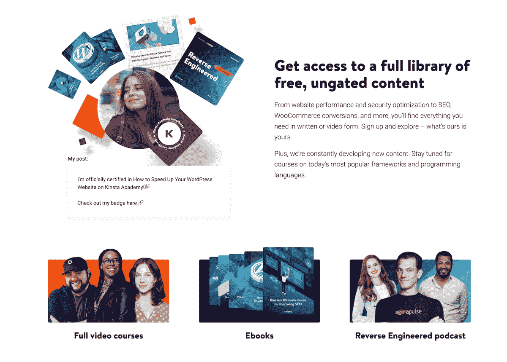
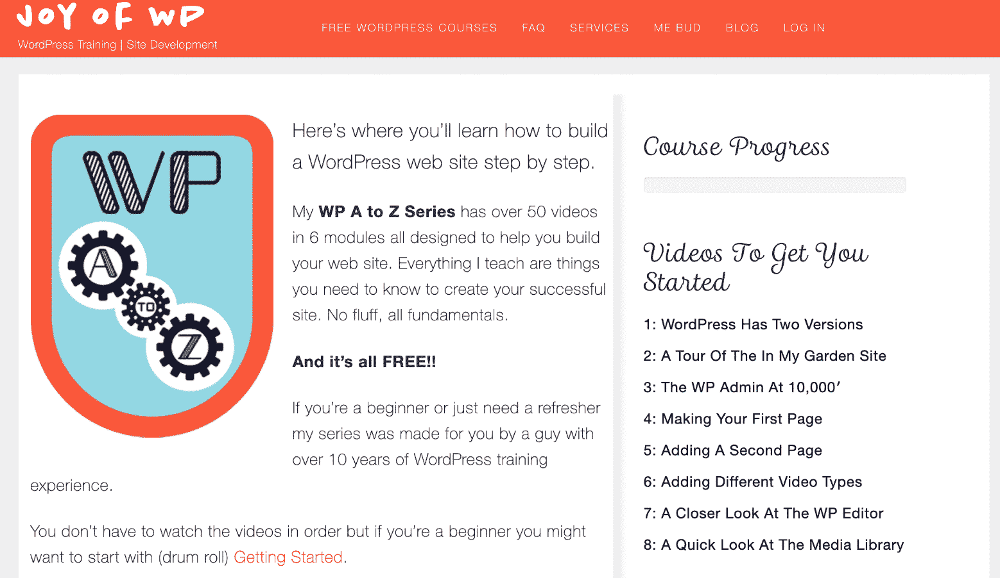

# 12 个可以学习 WordPress 的好地方

> 原文：<https://kinsta.com/blog/learn-wordpress/>

博客、论坛、在线课程、网络研讨会、会议、视频。这些只是学习 WordPress 的几种方法。但是你从哪里开始呢？你如何确定博客或在线课程是适合你的技能水平？

毕竟，一个[熟练的开发者](https://kinsta.com/blog/hire-wordpress-developer/)没有权利去阅读一个初学者的 WordPress 论坛。新手也一样。一些 WordPress 教程看起来很吸引人，但是如果你不小心的话，你可以进入一些非常高级的信息。

所以，对于如何学习 WordPress，你有很多选择。最大的问题是，哪些是最好的？

## 你想学习 WordPress 的哪些方面？

这是你需要回答的第一个问题，因为有太多你可能不感兴趣的技能水平和主题。你只是想推出一个基本的 WordPress 网站吗？如果是这样，初学者的课程就可以了。你想了解 WordPress 主题和[插件开发](https://kinsta.com/blog/publish-plugin-wordpress-plugin-directory/)吗？这是比普通用户感兴趣的更高级的课程。

从建立一个电子商务网站到[修复常见错误](https://kinsta.com/blog/error-establishing-a-database-connection/)，了解你学习 WordPress 的动机是很重要的。这样，你就不会对你的技能水平而言过于复杂或过于简单的在线课程感到困惑或支付费用。

## 什么是好的在线 WordPress 课程？

并非我们下面列出的所有在线资源都是课程形式的。有些是博客，有些是 YouTube 频道。有些是免费的，而有些是你必须付费的。不管成本如何，在评估 WordPress 资源是否有价值时，有某种标准可以参考是很好的。虽然这不是一个详尽的列表，但我们认为以下是允许我们彻底检查每一个 WordPress 资源的标准:

*   你以这个价格获得的内容的成本和价值。
*   它教授的技能水平。
*   无论资源和课程是否以视频、文章或两者的形式提供。
*   WordPress 内容的质量。
*   是否提供测验。
*   课程材料的结构有多好。
*   跟随和理解一个人的教学是多么容易。
*   是否有有用的可下载的资料。
*   课程内容是最新的吗？
*   学习在所有设备上都可用吗？

很自然，你会希望上面的许多标准都被检查出来。因此，一门既有视频又有文章的课程很可能比只有文章的博客更好。我们将对下面的每个资源使用所有这些标准。这样，当你想学习 WordPress 的时候，你就会知道哪一个最适合你。

> Kinsta 把我宠坏了，所以我现在要求每个供应商都提供这样的服务。我们还试图通过我们的 SaaS 工具支持达到这一水平。
> 
> <footer class="wp-block-kinsta-client-quote__footer">
> 
> 
> 
> <cite class="wp-block-kinsta-client-quote__cite">Suganthan Mohanadasan from @Suganthanmn</cite></footer>

[View plans](https://kinsta.com/plans/)

[Check out these awesome places to learn WordPress, from beginner courses to advanced development. 📚Click to Tweet](https://twitter.com/intent/tweet?url=https%3A%2F%2Fkinsta.com%2Fblog%2Flearn-wordpress%2F&via=kinsta&text=Check+out+these+awesome+places+to+learn+WordPress%2C+from+beginner+courses+to+advanced+development.+%F0%9F%93%9A&hashtags=WordPress%2CPHP)

> [2022 年 23 个最快的 WooCommerce 主题(基于全面测试)](https://kinsta.com/blog/fastest-woocommerce-theme/)

<iframe class="wp-embedded-content" sandbox="allow-scripts" security="restricted" style="position: absolute; clip: rect(1px, 1px, 1px, 1px);" title="“23 Fastest WooCommerce Themes in 2022 (Based on Thorough Testing)” — Kinsta®" src="https://kinsta.com/blog/fastest-woocommerce-theme/embed/#?secret=HnIkiBvIqR#?secret=l4SJlAmGb6" data-secret="l4SJlAmGb6" width="500" height="282" frameborder="0" marginwidth="0" marginheight="0" scrolling="no"> T2】
 <h3>1.用 Udemy 学习 WordPress</h3> 
当你试图学习 WordPress 时，Udemy 提供了最大的课程计划和课程集合。这有点像市场环境，任何老师都可以制作自己的课程，并在 Udemy 上出售。因此，您不会局限于某个个人或组织的观点或格式。
 
不仅如此，Udemy 还提供了漂亮的课程页面，支持视频、可下载的内容和大纲，这样你就可以在开始学习课程之前了解你将要学习的内容。
 Udemy WordPress theme development <h4>评定标准</h4> <ul> <li>你要花多少钱？这取决于课程。你可能会发现一笔 10 美元的交易，但大多数都在 100 美元到 200 美元之间。</li> <li>技能水平？从初级到高级的一切。</li> <li>你得到的是视频、文章，还是两者都有？<strong>视频。</strong></li> <li>这些课程是专业制作的吗？是的。一定要找一些评价高的。</li> <li>有测验来测试你的进步吗？这取决于老师，但是是的，通过平台支持测验。</li> <li>课程材料结构合理吗？是的。尤其是在课程评分很高的情况下。</li> <li>主讲人/编剧/老师是否通俗易懂？高课程评分通常意味着是的，老师是可靠的。既然任何人都可以开一门课，你可能会遇到一些非常糟糕的老师。好在收视率能帮你过滤掉这些。</li> <li>有什么可下载的材料吗？是的。我在 Udemy 上做过的大多数课程都有一些下载。</li> <li>课程内容是否保持最新？这取决于老师。跟着更高的收视率走。</li> <li>你能在所有设备上学习吗？所有视频都支持移动设备和电视。</li> <li>整体价值学 WordPress: <strong>高。只要你完成研究找到合适的课题和老师。</strong></li> </ul> <h3>2.和 Lynda.com 一起学习 WordPress</h3> 
Lynda.com 在质量上与 Udemy 不相上下，但它只是一个组织，而不是一个由不同教师出售视频的大杂烩。Lynda.com 已经存在了一段时间，它专注于开发各种主题的专业视频。想学习如何成为一名照片修图师？琳达会掩护你的。Lynda 上的类别包括:
 <ul> <li>3D +动画</li> <li>音频+音乐</li> <li>商业</li> <li>计算机辅助设计</li> <li>设计</li> <li>开发者</li> <li>教育+电子学习</li> <li>信息技术</li> <li>营销</li> <li>摄影</li> <li>录像</li> <li>网</li> </ul> 
这里有一整套“如何学习 WordPress”的课程，所有的课程都有可下载的材料、漂亮的视频和来自老师的指导，这些老师知道他们在说什么。Lynda.com 从未声称自己价格低廉，因为你通过 Lynda 获得的内容数量是无与伦比的。
 
  跟 Lynda.com 学文字
 <h4>评定标准</h4> <ul> <li>你要花多少钱？每月 19.99 美元或 29.99 美元。</li> <li>技能水平？<strong>从初级到高级。</strong></li> <li>你得到的是视频、文章，还是两者都有？<strong>视频和文字记录。</strong></li> <li>这些课程是专业制作的吗？是的。</li> <li>有测验来测试你的进步吗？是的。</li> <li>课程材料结构合理吗？是的。</li> <li>主讲人/编剧/老师是否通俗易懂？有不同的导师，但他们每个人都很棒。</li> <li>有什么可下载的材料吗？是的。</li> <li>课程内容是否保持最新？是的。Lynda 是您获取最新内容的最佳选择。</li> <li>你能在所有设备上学习吗？它支持所有设备，并支持通过互联网免费观看离线学习。</li> <li>整体价值学 WordPress: <strong>高。</strong></li> </ul> <h3>3.用 WP101 学习 WordPress</h3> 
<a href="https://www.wp101.com/" target="_blank" rel="noopener noreferrer"> WP101 </a>有专业的观感，有只专注 WordPress 的加成。它几乎没有涵盖很多 WordPress 主题(与 Lynda 和 Udemy 相比)，但它对初学者来说是一个干净友好的环境。
 
目前学习 WordPress 的教程包括:
 <ul> <li>WordPress 简介</li> <li>WordPress 101</li> <li><a href="https://kinsta.com/knowledgebase/wordpress-jetpack/">喷气背包</a>教程</li> <li>woo 商务教程</li> <li>Yoast SEO 教程</li> </ul> 
一些“即将推出”的选项包括:
 <ul> <li>iThemes 安全专业版</li> <li>备份伙伴</li> <li>海狸建造者</li> <li>WPForms 教程</li> <li>重力形式</li> <li>儿童主题</li> </ul> 
与我们看过的其他课程相比，课程选择看起来相当少。但是 WP101 确实涵盖了每个教程中的大多数初学者细节。会员是持续工作的，所以你可以得到所有当前的教程，以及任何将来发布的东西。你也可以使用帮助论坛和其他 WordPress 用户交流。
 
WP101 团队需要一段时间来发布新的课程。好消息是它们总是质量很高。我选择 WP101 的主要原因是价格。这是终身访问的一次性小额费用。Lynda 一个月价格不变。如果你是初学者，这是一个更好的交易。
 WP101 <h4>评定标准</h4> <ul> <li>你要花多少钱？<strong> $19(一次性费用)。它也有 39 美元和 79 美元的计划。</strong></li> <li>技能水平？<strong>初学者。几门中级课程。</strong></li> <li>你得到的是视频、文章，还是两者都有？视频和一个有文章的像样的博客。</li> <li>这些课程是专业制作的吗？是的。</li> <li>有测验来测试你的进步吗？<strong>号</strong></li> <li>课程材料结构合理吗？是的。</li> <li>主讲人/编剧/老师是否通俗易懂？是的。</li> <li>有什么可下载的材料吗？没有。不过有一些推荐的资源。</li> <li>课程内容是否保持最新？是的，但是更新的视频需要一段时间才能发布。</li> <li>你能在所有设备上学习吗？是的。</li> <li>学习 WordPress: <strong>整体价值高，尤其是对于那些不想为伟大的视频付出太多的初学者。</strong></li> </ul>  <h3>4.通过 WP 会话学习 WordPress</h3> 
如果你想作为高级或中级用户学习 WordPress，<a href="https://wpsessions.com/" target="_blank" rel="noopener noreferrer"> WP 会话</a>应该更适合你。WP Sessions 是一个面向业内人士的社区和视频集合。这对于启动你的新开发业务或磨练你的手艺来说是很棒的。
 
VIP 套餐是你的最佳选择，因为它提供了超过 78 小时的培训内容、会员专用视频以及 WordPress 产品的一些折扣。你也可以单独为视频或会议付费。但如果你已经在经营一家开发企业，这就没什么意义了。只需在纳税季节扣除 VIP 费用，将视频用于自己和培训客户。
 WP Sessions <h4>评定标准</h4> <ul> <li>你要花多少钱？一节课/课程从免费到大约 20 美元不等。VIP 计划(用于所有培训)的费用为 299 美元。</li> <li>技能水平？<strong>中级到高级。</strong></li> <li>你得到的是视频、文章，还是两者都有？<strong>主要是视频。</strong></li> <li>这些课程是专业制作的吗？是的。</li> <li>有测验来测试你的进步吗？<strong>号</strong></li> <li>课程材料结构合理吗？是的。</li> <li>主讲人/编剧/老师是否通俗易懂？是的。</li> <li>有什么可下载的材料吗？是的。主要是视频。</li> <li>课程内容是否保持最新？是的。</li> <li>你能在所有设备上学习吗？是的。</li> <li>学习 WordPress: <strong>整体价值高，适合高级用户。对初学者来说价值低。</strong></li> </ul> <h3>5.跟 WP 学徒学习 WordPress</h3> 
WP 学徒有一个像样的博客和一些扎实的课程。这是一个初学者培训网站，为那些可能没有任何 WordPress 使用经验的人提供绝对的基础知识。WP 学徒坚持一个系统，确保你的网站没有任何故障地启动和运行。
 
例如，课程组织如下:
 <ul> <li><strong> WordPress 快速入门</strong>–WordPress 初学者的十个视频。</li> <li>为初学者和中级用户准备的 50 个视频。</li> <li><strong>商业网站蓝图</strong>——面向企业主和专业人士。</li> <li>WordPress 商业蓝图+电子商务培训包——为那些希望在其网站上销售任何东西的人准备的。</li> </ul> 
甚至 WordPress Essentials 包也更像是一门初学者课程，但它有点像中级材料。不管怎样，关键是要快速推出你的网站。唯一的问题是，像 WP101 这样的产品以更低的价格提供给你相似的材料。
 WP Apprentice <h4>评定标准</h4> <ul> <li>你要花多少钱？终身通行证起价 47 美元。它还有 99 美元和 147 美元的捆绑包。</li> <li>技能水平？<strong>初学者。几个中间视频。</strong></li> <li>你得到的是视频、文章，还是两者都有？<strong>课程中的视频和博客中的文章。</strong></li> <li>这些课程是专业制作的吗？是的。</li> <li>有测验来测试你的进步吗？<strong>号</strong></li> <li>课程材料结构合理吗？是的。</li> <li>主讲人/编剧/老师是否通俗易懂？是的。</li> <li>有什么可下载的材料吗？是的。蓝图课程中有一些可下载的工作表。</li> <li>课程内容是否保持最新？是的。</li> <li>你能在所有设备上学习吗？是的。</li> <li>整体价值学 WordPress: <strong>中等。</strong></li> </ul> <h3>6.和 Kinsta 一起学习 WordPress</h3> 
正如你们许多人所知，我们在 Kinsta 分享了很多信息，从简单的操作指南到深入的学习文章。我们有一个新的<a href="https://kinsta.com/resources/" target="_blank" rel="noopener noreferrer">资源部分</a>，在那里你可以找到一切。

 
 <h2 class="heading--large text--center color--white mb--30">注册订阅时事通讯</h2>  
  
 
 <h3 class="heading" style="font-size: 2rem;">想知道我们是怎么让流量增长超过 1000%的吗？</h3> 
加入 20，000 多名获得我们每周时事通讯和内部消息的人的行列吧！
 
 <a href="#newsletter" data-dialog-src="#newsletter" class="button button--purple newsletter-cta__button"> Subscribe Now </a> 
 
 
因为我们是一家托管 WordPress 的公司，我们也把大量的内容集中在优化和性能上，因为这些是我们非常了解的东西，并且在增加你的收入方面可以为你的企业立竿见影。
 Kinsta 
以下是我们推荐阅读的几篇文章:
 <ul> <li><a href="https://kinsta.com/learn/page-speed/" target="_blank" rel="noopener noreferrer">网站速度优化初学者指南</a></li> <li><a href="https://kinsta.com/blog/pingdom-speed-test/" target="_blank" rel="noopener noreferrer">深入探究 Pingdom 速度测试工具</a></li> <li><a href="https://kinsta.com/blog/wordpress-security/" target="_blank" rel="noopener noreferrer">WordPress security——锁定你网站的 19 个以上步骤</a></li> <li><a href="https://kinsta.com/blog/optimize-images-for-web/" target="_blank" rel="noopener noreferrer">如何针对网页和性能优化图像</a></li> <li><a href="https://kinsta.com/blog/wordpress-seo/" target="_blank" rel="noopener noreferrer"> 45 个 WordPress SEO 提示让流量在 13 个月内增加 571%</a></li> </ul> 
我们还通过我们的<a href="https://kinsta.com/academy/">金斯塔学院</a>提供深入的视频课程。利用行业专业人士提供的免费在线培训课程，发展您的技能并拓展您的业务。
 Kinsta Academy 
Kinsta Academy 有几十个视频、<a href="https://kinsta.com/podcast/">播客</a>和<a href="https://kinsta.com/ebooks/">电子书可供下载</a>，是一个可以访问的宝贵资源。正在增加新的课程。以下是我们推荐的几个例子:
 
<a href="https://kinsta.com/academy/course/how-to-speed-up-your-wordpress-website/">如何加速你的 WordPress 网站</a>
 
<a href="https://kinsta.com/academy/course/the-basics-of-maintaining-client-sites-at-scale/">大规模维护客户网站的基础知识</a>
 
<a href="https://kinsta.com/academy/course/how-to-optimize-your-woocommerce-store/">如何优化你的 WooCommerce 商店</a>
 <h4>评定标准</h4> <ul> <li>你要花多少钱？没什么。</li> <li>技能水平？<strong>从初级到高级。</strong></li> <li>你得到的是视频、文章，还是两者都有？<strong>主要是深度文章和指南。</strong></li> <li>这些课程是专业制作的吗？我们所有的深度内容都是由实际的 WordPress 开发者创建的，他们在这些主题上有几十年的经验。</li> <li>有测验来测试你的进步吗？<strong>号</strong></li> <li>课程材料结构合理吗？是的。</li> <li>主讲人/编剧/老师是否通俗易懂？是的。</li> <li>有什么可下载的材料吗？是的。</li> <li>课程内容是否保持最新？是的。我们花费数百小时更新我们的内容。</li> <li>你能在所有设备上学习吗？<b>只要你有浏览器。</b></li> <li>学习 WordPress: <strong>整体价值高，适合初学者。</strong></li> </ul> <h3>7.通过 WordPress 官方指南学习 WordPress</h3> 
至少看看 WordPress 背后的<a href="https://learn.wordpress.com/" target="_blank" rel="noopener noreferrer">人怎么说</a>是明智的。这就是为什么我们建议至少浏览一下官方的 WordPress 指南。这些指南概述了一些基本情况，比如 WordPress.org 和 WordPress.com 之间的<a href="https://kinsta.com/blog/wordpress-com-vs-wordpress-org/" target="_blank" rel="noopener noreferrer">差异</a>。您还将学习如何定制您的站点，选择主题，以及选择合适的插件。
 
你能找到的最高级的指南是帮助创建主页的指南。因此，官方的 WordPress 指南是为最终的初学者准备的。这个网站很酷的一点是，你可以订阅一份指南，接受一些小作业，以提高你在一两个主题上的知识。
 WordPress.com <h4>评定标准</h4> <ul> <li>你要花多少钱？没什么。</li> <li>技能水平？<strong>极限初学者。</strong></li> <li>你得到的是视频、文章，还是两者都有？<strong>大多是文章。</strong></li> <li>这些课程是专业制作的吗？是的。</li> <li>有测验来测试你的进步吗？<strong>号</strong></li> <li>课程材料结构合理吗？是的。</li> <li>主讲人/编剧/老师是否通俗易懂？是的。</li> <li>有什么可下载的材料吗？是的，如果你注册了电子邮件通知的话。</li> <li>课程内容是否保持最新？是的。</li> <li>你能在所有设备上学习吗？是的。</li> <li>整体价值学 WordPress: <strong>中等。只针对初学者，即使对他们来说，内容量也很低。</strong></li> </ul> <h3>8.用 WordPress TV 学习 WordPress</h3> 
WordPress TV 就像是 WordPress 视频的 YouTube。课程，辅导，面试，讲座，上课，一塌糊涂。它们中的许多都非常有帮助和鼓舞人心，但是你确实会得到很大一部分直接从演讲大厅里拍摄的低质量视频。
 
 
 
 
厌倦了你的 WordPress 站点缓慢的主机？我们提供超快的服务器和来自 WordPress 专家的 24/7 世界级支持。<a onclick="gtag('event', 'click', {'event_category': 'blog-article', 'event_label': 'blog-inarticle-minimaltext'})" href="https://kinsta.com/plans/?in-article-cta">查看我们的计划</a>
 
 
 
 
例如，在背景中看到带有投影仪的 WordPress 电视视频是很常见的。阅读投影仪上的内容并不总是容易的。
 
不管怎样，这些视频是免费的，你得到的不仅仅是培训模块。我的一个抱怨是，我偶然发现了一些极其无聊的采访视频。
 WordPress.tv <h4>评定标准</h4> <ul> <li>你要花多少钱？没什么。</li> <li>技能水平？<strong>初学者到高级。</strong></li> <li>你得到的是视频、文章，还是两者都有？<strong>主要是视频，但是有一个 okay 的博客。</strong></li> <li>这些课程是专业制作的吗？<strong>大部分都不是。</strong></li> <li>有测验来测试你的进步吗？<strong>号</strong></li> <li>课程材料结构合理吗？一点也不。</li> <li>主讲人/编剧/老师是否通俗易懂？有时。很难听到许多采访和教程。</li> <li>有什么可下载的材料吗？<strong>号</strong></li> <li>课程内容是否保持最新？一直都有新的内容。你也可以回到档案馆。</li> <li>你能在所有设备上学习吗？是的。</li> <li>整体价值学习 WordPress: <strong>学习行业的高价值。●对于培训和如何学习 WordPress。</strong></li> </ul> <h3>9.用 WPKube 学习 WordPress</h3> 
WPKube 是另一个你应该考虑的博客，尽管他们组织内容的方式需要一些改进。我建议注册电子邮件时事通讯，以便在新文章发送到你的收件箱时偶尔阅读它们。
 
否则，你最好找一个结构更好的在线课程。
 WPKube <h4>评定标准</h4> <ul> <li>你要花多少钱？没什么。</li> <li>技能水平？<strong>初级到中级。</strong></li> <li>你得到的是视频、文章，还是两者都有？<strong>主要是文章。</strong></li> <li>这些课程是专业制作的吗？是的。</li> <li>有测验来测试你的进步吗？<strong>号</strong></li> <li>课程材料结构合理吗？文章结构很好，但是很难找到你想要的内容。</li> <li>主讲人/编剧/老师是否通俗易懂？大多数时候。</li> <li>有什么可下载的材料吗？<strong>号</strong></li> <li>内容是否保持最新？是的。</li> <li>你能在所有设备上学习吗？任何浏览器都可以。</li> <li>学习 WordPress: <strong>整体价值高，适合有一定经验的人。更多的是为了获取随机提示，并不完全是为了训练。</strong></li> </ul> <h3>10.通过 iThemes 培训学习 WordPress</h3> 
iThemes 公司开发了用于备份、安全等的插件。iThemes 培训分为几个部分，其中一些是免费的。其中一个部分是 iThemes 培训社区，在这里你可以加入并与其他专业人士交流。
 
有一系列免费的在线研讨会，以及超过 900 小时的 WordPress 培训教程。如果你已经在使用 iThemes 插件，或者你认为将来可能会使用，我建议你成为会员，这样你就可以访问培训资料。
 iThemes Training <h4>评定标准</h4> <ul> <li>你要花多少钱？有些网络研讨会是免费的，但你必须购买 iThemes 产品才能成为社区成员。</li> <li>技能水平？<strong>从初级到高级。</strong></li> <li>你得到的是视频、文章，还是两者都有？<strong>两者皆有。</strong></li> <li>这些课程是专业制作的吗？是的。</li> <li>有测验来测试你的进步吗？<strong>号</strong></li> <li>课程材料结构合理吗？是的。</li> <li>主讲人/编剧/老师是否通俗易懂？是的。</li> <li>有什么可下载的材料吗？<strong>一些。</strong></li> <li>课程内容是否保持最新？是的。</li> <li>你能在所有设备上学习吗？<b>只要你有浏览器。</b></li> <li>整体价值学 WordPress: <strong>高。</strong></li> </ul> <h3>11.用 Smashing 杂志学习 WordPress</h3> 
《粉碎》杂志是互联网上最受欢迎的综合性网站开发者杂志之一。这对于沉浸在 WordPress 之外的其他话题中是很棒的。例如，您可以探索关于 CSS、排版和设计模式的信息。
 
WordPress 部分组织得很好，但它是博客格式的，所以你最好注册电子邮件时事通讯，而不是搜索你需要的东西。
 Smashing Magazine <h4>评定标准</h4> <ul> <li>你要花多少钱？<strong>免费。但是公司出售书籍和其他培训材料。</strong></li> <li>技能水平？<strong>从初级到高级。</strong></li> <li>你得到的是视频、文章，还是两者都有？<strong>主要是文章。</strong></li> <li>这些课程是专业制作的吗？是的。</li> <li>有测验来测试你的进步吗？<strong>号</strong></li> <li>课程材料结构合理吗？<strong>是博客，具体内容不好找。</strong></li> <li>主讲人/编剧/老师是否通俗易懂？是的。</li> <li>有什么可下载的材料吗？是的。</li> <li>课程内容是否保持最新？是的。</li> <li>你能在所有设备上学习吗？是的。</li> <li>学习的总体价值很高，当你需要随机发送提示到你的收件箱时。</li> </ul> <h3>12.WP 的快乐</h3> 
WP 的乐趣为 WordPress 的新用户或者需要全面复习 WordPress 基础知识的人提供了两个免费的课程。
 Joy of WP 
WP A 到 Z 系列由这六个模块组成，有超过 50 个视频，你可以从头到尾学习如何建立一个典型的网站。课程内容包括:
 <ul> <li>入门指南</li> <li>链接</li> <li>主题</li> <li>博客</li> <li>插件</li> <li>虚拟主机</li> </ul> 
另一门课程是如何使用 WordPress ，它收集了一些视频，可以帮助你了解各种主题。它由这两个模块组成:
 <ul> <li>使用古腾堡</li> <li>WP 百花香</li> </ul> <h4>评定标准</h4> <ul> <li>你要花多少钱？这些课程是免费的。</li> <li>技能水平？<strong>初级到中级。</strong></li> <li>你得到的是视频、文章，还是两者都有？都有，但最重要的是视频。</li> <li>这些课程是专业制作的吗？是的，它们是由 Bud Kraus 专业编写和整理的，他是一位 10 年的 WordPress 讲师，已经在课堂和网上教了数千人。</li> <li>有测验来测试你的进步吗？<strong>号</strong></li> <li>课程材料结构合理吗？这些课程被设计成易于遵循的步骤。</li> <li>主讲人/编剧/老师是否通俗易懂？是的。</li> <li>有什么可下载的材料吗？<strong>号</strong></li> <li>课程内容是否保持最新？是的。</li> <li>你能在所有设备上学习吗？是的。</li> <li>学习 WordPress 的整体价值:<strong>WP 的 Joy 是开始学习如何使用 WordPress 的一个很好的方式，Bud 清楚地传达了一切，以便于理解。</strong></li> </ul> <h3>额外提示:学习 PHP</h3> 
如果你想提高你的技能，学习 PHP 是另一个好主意！PHP 是学习最好的编程语言之一<a href="https://kinsta.com/blog/best-programming-language-to-learn/#php">。为了帮助你，这里是我们精选的最好的 PHP 教程列表，你可以使用并从今天开始学习编程语言！</a>
 <h2>学习 WordPress 应该使用哪种在线资源？</h2> 
好消息是，如果你在做决定时遇到困难，你永远可以依靠乌代米和 Lynda.com。这两者涵盖了所有的技能水平，你知道生产价值将是一流的。Udemy 的价格比 Lynda.com 更实惠，但你必须做更多的研究。
 
我喜欢 WP 101，适合那些不想花太多钱，但仍然渴望优秀视频的初学者。巴德·克劳斯也做得很好。Kinsta 博客对于免费的高质量内容来说是很棒的，WP 会话对于高级开发者来说是最好的。如果你有任何关于如何使用在线资源学习 WordPress 的问题，欢迎在下面留言。此外，让我们知道你是否有任何上述学习网站的经验。
 
 
 
让你所有的<a data-track-ga-category="single-post" data-track-ga-label="bottom-cta" href="https://kinsta.com/application-hosting/">应用程序</a>、<a data-track-ga-category="single-post" data-track-ga-label="bottom-cta" href="https://kinsta.com/database-hosting/">数据库</a>和<a data-track-ga-category="single-post" data-track-ga-label="bottom-cta" href="https://kinsta.com/wordpress-hosting/"> WordPress 网站</a>在线并在一个屋檐下。我们功能丰富的高性能云平台包括:
 <ul> <li>在 MyKinsta 仪表盘中轻松设置和管理</li> <li>24/7 专家支持</li> <li>最好的谷歌云平台硬件和网络，由 Kubernetes 提供最大的可扩展性</li> <li>面向速度和安全性的企业级 Cloudflare 集成</li> <li>全球受众覆盖全球多达 35 个数据中心和 275 多个 pop</li> </ul> 
在第一个月使用托管的<a data-track-ga-category="single-post" data-track-ga-label="bottom-cta" href="https://kinsta.com/application-hosting/">应用程序或托管</a>的<a data-track-ga-category="single-post" data-track-ga-label="bottom-cta" href="https://kinsta.com/database-hosting/">数据库，您可以享受 20 美元的优惠，亲自测试一下。探索我们的</a><a data-track-ga-category="single-post" data-track-ga-label="bottom-cta" href="https://kinsta.com/plans/">计划</a>或<a data-track-ga-category="single-post" data-track-ga-label="bottom-cta" href="https://kinsta.com/contact-us/">与销售人员交谈</a>以找到最适合您的方式。
 
 </body> </html></iframe>