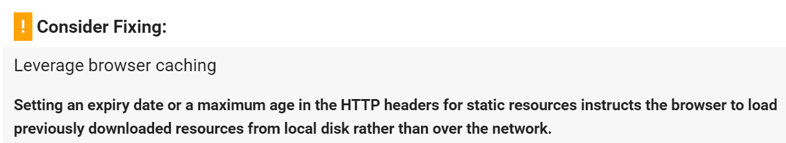
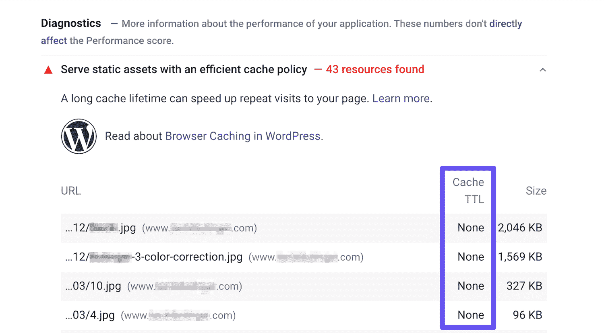
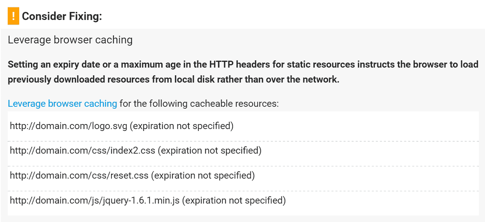
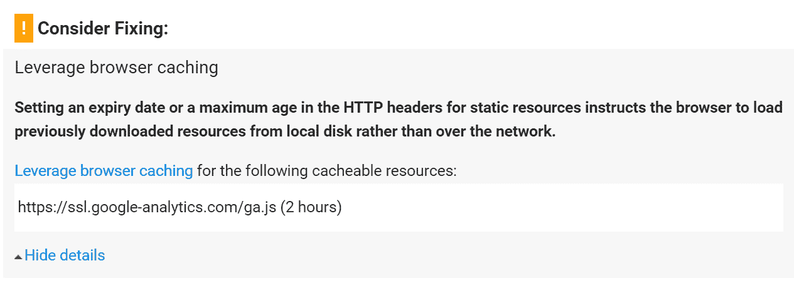
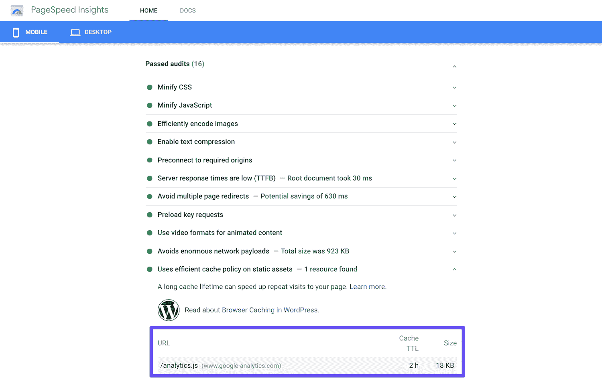
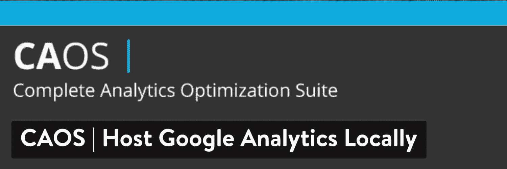
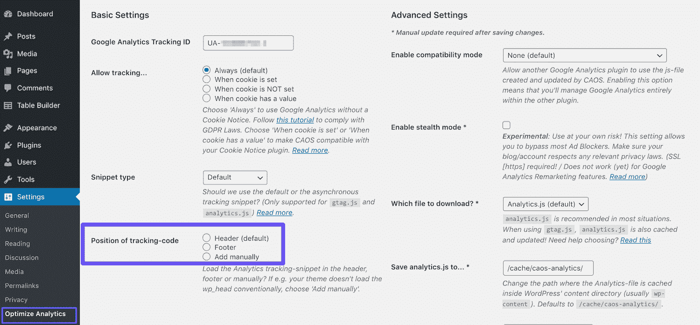
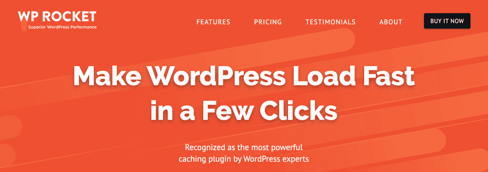

# 如何修复 WordPress 中的利用浏览器缓存警告

> 原文：<https://kinsta.com/blog/leverage-browser-caching/>

Google PageSpeed Insights 是衡量网站性能的几个有用工具之一。然而，它的一些建议——比如“利用浏览器缓存”的警告——可能会让没有经验的网站所有者感到困惑。

当你把它分解开来，缓存并不那么难理解。通过一些调整，您可以在您的站点上实现这种开发最佳实践，以减少加载时间并提高 PageSpeed 分数。

在本帖中，我们将首先介绍利用浏览器缓存警告。然后我们会分享一些在你的 WordPress 网站上解决这个问题的技巧。

让我们跳进来吧！

### 更喜欢[视频版](https://www.youtube.com/watch?v=O4cE3nbKvoM)？


## 什么是利用浏览器缓存警告？

为了理解利用浏览器缓存的警告，首先了解一下 Google PageSpeed Insights 会有所帮助。如果你是这个平台的新手，我们推荐阅读我们的完整指南， [Google PageSpeed Insights:用 WordPress 打分 100/100](https://kinsta.com/blog/google-pagespeed-insights/)。


利用浏览器缓存警告是 Google PageSpeed 用来返回的许多“诊断”之一，作为提高分数的建议，如下所示:



*Leverage Browser Caching warning in Google PageSpeed Insights*


在 Google PageSpeed Insights 的第 5 版中，[此消息被替换为](https://developers.google.com/speed/docs/insights/LeverageBrowserCaching)警告“使用高效缓存策略服务静态资产”:


Serve static assets with an efficient cache policy warning in Google PageSpeed Insights


尽管语言和外观发生了变化，但这些警告的解决方案是相同的。

谷歌建议使用浏览器缓存来减少页面加载时间并提高性能。简而言之，缓存就是用户的浏览器保存站点页面的静态副本。然后，在随后的访问中，这些内容可以更快地重新加载，因为浏览器不必为了访问所请求的资源而联系站点的服务器。

但是，每个缓存的资源都需要指定的过期时间。当你的网站上的内容过时时，它会告诉浏览器，所以它可以用更新的版本替换缓存的副本。

如果您在性能测试结果中看到“利用浏览器缓存”警告，这可能意味着以下两种情况之一:

*   您的站点服务器或第三方服务器上缺少 Cache-Control 或 Expires 标头。
*   必要的头是存在的，但是有效期很短，因此对性能没有太大影响。

此警告的解决方案包括修复其中一个或两个问题。

[🚨警告！利用浏览器缓存🚨如果阅读这些文字让你心跳加速，你会想看看这篇修复可怕的 message⚡️的指南 点击推特](https://twitter.com/intent/tweet?url=https%3A%2F%2Fkinsta.com%2Fblog%2Fleverage-browser-caching%2F&via=kinsta&text=%F0%9F%9A%A8Warning%21+Leverage+Browser+Caching%F0%9F%9A%A8+If+reading+those+words+makes+your+heart+race%2C+you%27ll+want+to+check+out+this+guide+to+fixing+that+dreaded+message%E2%9A%A1%EF%B8%8F&hashtags=pagespeed%2Cwebperf)


## 如何修复 WordPress 中的浏览器缓存警告(3 种方法)

有几种不同的方法可以修复 WordPress 中的利用浏览器缓存警告，这取决于是什么引起的。这里有三个解决方案，你可以试试。

### 1.添加缓存控制和过期头

浏览器缓存相关的头有两个: [Cache-Control 和 Expires](https://devcenter.heroku.com/articles/increasing-application-performance-with-http-cache-headers#http-cache-headers) 。至少要有一个来为您的站点启用浏览器缓存，因为这是浏览器决定在刷新资源之前应该保留多长时间的方式。

## 注册订阅时事通讯


### 想知道我们是怎么让流量增长超过 1000%的吗？

加入 20，000 多名获得我们每周时事通讯和内部消息的人的行列吧！

[Subscribe Now](#newsletter)

确定这是否是导致利用浏览器缓存警告的原因的一个简单方法是查看每个资源的详细信息。在 Google PageSpeed Insights 第 5 版中，您会看到“无”列在**缓存 TTL** 下:



Cache TTL listings in Google PageSpeed Insights


作为一个方便的参考，以前版本的 Google PageSpeed Insights 在缺少标题时会显示一条“未指定到期时间”的消息:



Resources listed in the Leverage Browser Caching warning


当 Cache-Control 标头打开客户端缓存并设置资源的最大年龄时，Expires 标头用于指定资源不再有效的时间点。

**您不一定需要添加两个**，因为这可能是多余的。缓存控制是较新的方法，通常是推荐的方法。然而，一些 web 性能工具，[如 GTmetrix](https://kinsta.com/blog/gtmetrix-speed-test/) ，仍然会检查 Expires 头。

如果你在 Kinsta 托管，[你不必担心](https://kinsta.com/blog/wordpress-cache/)设置这些标题。我们所有的 [Nginx 服务器](https://kinsta.com/blog/nginx-vs-apache/)已经包含了它们。那些使用[内容交付网络(CDN)](https://kinsta.com/help/kinsta-cdn/) 的用户也应该已经应用了这些报头。

如果你使用的是不同的托管服务提供商，请务必在执行以下步骤之前[备份你的网站](https://kinsta.com/help/wordpress-backups/)，如[编辑](https://kinsta.com/knowledgebase/wordpress-htaccess-file/)*T5】。如果你不小心，htaccess* 可能会破坏你的网站。

#### 如何在 Nginx 中添加缓存控制头

 **要在 Nginx 中添加缓存控制头，可以将以下内容添加到服务器的配置文件中:

```
location ~* \.(js|css|png|jpg|jpeg|gif|svg|ico)$ {
 expires 30d;
 add_header Cache-Control "public, no-transform";
} 
```

这告诉您的服务器，指定的文件类型至少在 30 天内不会更改。在刷新相关文件之前，它会将这些文件保存一段时间。

#### **如何在 Apache 中添加缓存控制头**

如果您有一个 Apache 服务器，您可以将下面的代码添加到您的 T2 中。htaccess 文件:

```
<filesMatch ".(ico|pdf|flv|jpg|jpeg|png|gif|svg|js|css|swf)$">
        Header set Cache-Control "max-age=84600, public"
</filesMatch&gt 
```

这段代码应该放在“#BEGIN WordPress”之前或“#END WordPress”之后。在这种情况下，缓存设置为在 84，600 秒后过期。

#### 如何在 Nginx 中添加过期头

您可以通过将以下内容添加到您的服务器块中，在 Nginx 中添加 Expires 头。在此示例中，您可以看到如何根据文件类型指定不同的到期时间:

```
 location ~*  \.(jpg|jpeg|gif|png|svg)$ {
        expires 365d;
    }

    location ~*  \.(pdf|css|html|js|swf)$ {
        expires 2d;
    }
```

#### **如何在 Apache 中添加 Expires 头**

您可以在 Apache 中添加 Expires 头，方法是将以下内容添加到您的*中。htaccess* 文件:

```
## EXPIRES HEADER CACHING ##
<IfModule mod_expires.c>
ExpiresActive On
ExpiresByType image/jpg "access 1 year"
ExpiresByType image/jpeg "access 1 year"
ExpiresByType image/gif "access 1 year"
ExpiresByType image/png "access 1 year"
ExpiresByType image/svg "access 1 year"
ExpiresByType text/css "access 1 month"
ExpiresByType application/pdf "access 1 month"
ExpiresByType application/javascript "access 1 month"
ExpiresByType application/x-javascript "access 1 month"
ExpiresByType application/x-shockwave-flash "access 1 month"
ExpiresByType image/x-icon "access 1 year"
ExpiresDefault "access 2 days"
</IfModule>
## EXPIRES HEADER CACHING ##
```

然后，您可以通过再次运行 Google PageSpeed Insights 来检查您的标题，并查看警告是否仍然存在。

专家 WordPress 全天候支持，让网站问题迎刃而解。[免费试用 kin sta](https://hubs.ly/H0pklC_0)。

### 2.利用浏览器缓存进行谷歌分析

具有讽刺意味的是， [Google Analytics](https://kinsta.com/blog/google-analytics-wordpress/) 有时是杠杆浏览器缓存警告和不完善的 PageSpeed 评分的原因。这是因为它的缓存过期时间很短，只有两个小时。这曾经是一个古老的警告:



Leverage Browser Caching warning for Google Analytics script


在 PageSpeed Insights 第 5 版中，此问题不再导致警告，但 Google Analytics 仍可能被列为未优化的资源:



Google PageSpeed Insights passed audits with Google Analytics script listing


您将无法使用 Cache-Control 或 Expires 标头更改此内容，因为该资源不在您的服务器上。然而，有一种方法可以通过本地托管脚本来利用浏览器缓存进行 Google Analytics。

但是请注意，谷歌不支持这种方法[。](https://support.google.com/analytics/answer/1032389?hl=en)

#### 通过完整的分析优化套件利用浏览器缓存进行谷歌分析

如果你想解决上述问题，你可以使用金奎大·范·登·伯格开发的一个名为[完整分析优化套件(CAOS)](https://wordpress.org/plugins/host-analyticsjs-local/) 的免费插件:



CAOS WordPress plugin


你可以从 WordPress 插件目录下载 Cao，或者在你的 WordPress 仪表盘的**插件>添加新的**下搜索。

在本地托管你的分析脚本的一些额外好处包括:它[将你对谷歌的外部 HTTP 请求](https://kinsta.com/blog/make-fewer-http-requests/)从两个减少到一个，并且它使你能够获得对文件缓存的完全控制。这意味着您可以像我们之前展示的那样使用缓存头。

要开始，安装插件，然后输入您的谷歌分析跟踪 ID。该插件为你的 WordPress 网站添加必要的谷歌分析跟踪代码，下载并保存 *analytics.js* 文件到你的服务器，并使用`wp_cron()`中的预定脚本保持更新。

我们还建议将其设置为在页脚中加载:



CAOS tracking code placement settings


请记住，CAOS 不能与其他 [Google Analytics WordPress 插件](https://kinsta.com/blog/google-analytics-wordpress/)一起使用。
T3】

#### 通过 WP-Rocket 利用浏览器缓存进行谷歌分析

或者，你可以使用 WordPress 缓存插件 [WP-Rocket](https://kinsta.com/partners/wp-rocket/) 来实现同样的目标:



WP-Rocket WordPress plugin


这个插件的[谷歌跟踪插件](https://docs.wp-rocket.me/article/1103-google-tracking-add-on)让你只需点击一个按钮就可以在本地托管你的分析脚本。只需在 **WP-Rocket >附件**下切换状态。

WP-Rocket 及其插件*与其他谷歌分析插件*兼容。作为一个高级工具，它的许可价格从每年 49 美元开始。

### 3.尽量减少使用第三方脚本

有时，谷歌分析脚本可能会给你的谷歌页面速度洞察评分带来问题，因为它托管在谷歌的服务器上，因此你无法控制缓存。

其他[第三方脚本](https://kinsta.com/blog/third-party-performance/)也是如此。如果你正在通过你的 WordPress 网站管理一项业务，很可能你有额外的第三方脚本运行到[轨道转换](https://kinsta.com/blog/conversion-tracking/)、 [A/B 测试](https://kinsta.com/blog/wordpress-ab-testing-tools/)等等。

这可能包括脚本，如[脸书转换像素](https://kinsta.com/blog/conversion-tracking/#fb-conversion-tracking)，疯狂鸡蛋，Hotjar，等等。不幸的是，除非您能找到一种方法在本地托管这些脚本，否则您无法控制它们。

脸书像素用户的一个选择是使用另一个 T2 WP-Rocket 插件。理想情况下，如果你想提高你的 Google PageSpeed 分数，你应该尽量少用第三方脚本。因此，对您的站点进行审核并删除任何运行它不必要的脚本可能是值得的。

[If you ever measured site performance, there's a high chance the Leverage Browser Caching warning isn't new to you. But how do you fix that to make your site faster? Learn how to do it with this in-depth guide! 🚀🗿Click to Tweet](https://twitter.com/intent/tweet?url=https%3A%2F%2Fkinsta.com%2Fblog%2Fleverage-browser-caching%2F&via=kinsta&text=If+you+ever+measured+site+performance%2C+there%27s+a+high+chance+the+Leverage+Browser+Caching+warning+isn%27t+new+to+you.+But+how+do+you+fix+that+to+make+your+site+faster%3F+Learn+how+to+do+it+with+this+in-depth+guide%21+%F0%9F%9A%80%F0%9F%97%BF&hashtags=speed%2Cwebperf)

## 摘要

虽然不是网站性能的决定性指标，Google PageSpeed Insights 仍然是一个不错的指标。通过解决显示在“使用高效缓存策略服务静态资产”下的警告来提高您的分数，有助于使您的网站更快，更便于访问者使用。

如果您在 Google PageSpeed Insights 中看到此警告，您可以通过以下方式解决:

1.  添加 Cache-Control 或 Expires 标头。
2.  利用浏览器缓存进行谷歌分析。
3.  尽量减少第三方脚本的使用。

关于解决浏览器缓存问题，你还有其他的建议吗？请在下面的评论区告诉我们！

* * *

让你所有的[应用程序](https://kinsta.com/application-hosting/)、[数据库](https://kinsta.com/database-hosting/)和 [WordPress 网站](https://kinsta.com/wordpress-hosting/)在线并在一个屋檐下。我们功能丰富的高性能云平台包括:

*   在 MyKinsta 仪表盘中轻松设置和管理
*   24/7 专家支持
*   最好的谷歌云平台硬件和网络，由 Kubernetes 提供最大的可扩展性
*   面向速度和安全性的企业级 Cloudflare 集成
*   全球受众覆盖全球多达 35 个数据中心和 275 多个 pop

在第一个月使用托管的[应用程序或托管](https://kinsta.com/application-hosting/)的[数据库，您可以享受 20 美元的优惠，亲自测试一下。探索我们的](https://kinsta.com/database-hosting/)[计划](https://kinsta.com/plans/)或[与销售人员交谈](https://kinsta.com/contact-us/)以找到最适合您的方式。**