# 如何修复 LinkedIn 上的链接预览(帖子检查提示)

> 原文：<https://kinsta.com/blog/linkedin-debugger/>

想在 LinkedIn 上分享的页面预览有问题？你可以使用 LinkedIn 调试器工具，即帖子检查器，在发帖前解决所有问题。

平台上有数以百万计的关键决策者，你最不想做的事情就是留下坏印象。

不要急于分享一个显示错误图片或标题的链接。这可能会大幅降低你的点击率和参与度，浪费你的帖子，并最终损害你的品牌。

相反，在使用 LinkedIn 帖子之前，按照我们的指南快速识别和修复任何问题。

## LinkedIn 上的链接预览如何工作

如果您仍然没有解决您的问题，让我们进一步检查链接预览功能以及 LinkedIn 如何使用它。

每当你在 LinkedIn 上创建一个新帖子并包含一个链接时，链接预览会使用你的 [URL](https://kinsta.com/knowledgebase/what-is-a-url/) 中页面上 meta 标签的数据创建一个预览。

例如，如果您从 [Kinsta 主页](https://kinsta.com/)共享一个链接，预览如下:

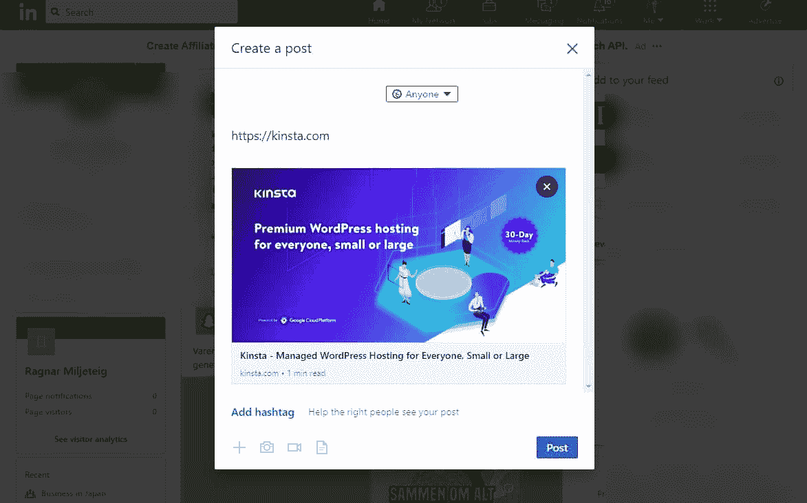

LinkedIn Link Preview

LinkedIn 使用一种叫做 Open Graph meta tags 的东西来获取与图片、标题和链接描述相关的数据。这些是你可以使用免费工具 Post Inspector 调试的。

LinkedIn 然后使用元数据中提供的图像和标题创建您在上面看到的框。

### 链接预览规格

*   **标题:**最多 150 个字符。
*   **图像:**图像被裁剪成 1.91:1 的比例和 1200(宽)x 627(高)像素。所以你需要一个兼容比例和宽度为 1200px+的图像。
*   最多 1300 个字符的可选注释。(这是你在链接外写的 LinkedIn 帖子。)

这些是 LinkedIn 上的有机帖子中包含的自动链接预览的规范。

如果你想知道在 LinkedIn 上分享图片的规格，或者想在你的广告中包含图片，请阅读我们关于[社交图片尺寸](https://kinsta.com/blog/social-media-image-sizes/)的指南。

## 什么是帖子检查器(LinkedIn 调试器工具)？

虽然你可能没有明确搜索过帖子检查器的[，但它是 LinkedIn 帖子唯一可用的调试工具。有时被称为 LinkedIn 调试器，这个免费工具解决了营销人员在 LinkedIn 上分享链接时面临的最大问题:生成正确的预览。](https://www.linkedin.com/post-inspector/)

*   如果您更新了帖子或页面，您可以刷新预览(标题和图像)。
*   你还可以调试 LinkedIn 上的链接预览的任何问题，比如错误的图片或标题显示。

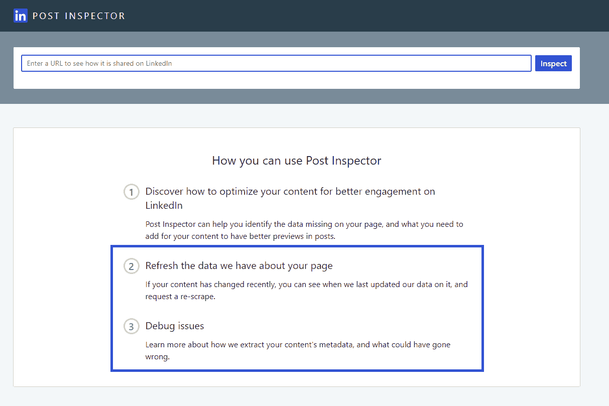

LinkedIn Post Inspector

### 其他涉及 LinkedIn 帖子检查工具的术语

以下术语实质上是同一工具的别名。

*   **LinkedIn Open Graph 调试器** : Open Graph meta 标签是 LinkedIn 用来创建共享帖子中链接预览的标签。这正是检查器让您深入了解并帮助您调试的内容。
*   LinkedIn 共享 URL 验证器:在你选择在帖子中共享链接之前，检查器还会帮助你检查你的链接是否显示正确。
*   LinkedIn 帖子链接检查器:它只是帖子检查器的另一个别名。
*   **LinkedIn 预览验证器:**另一个别名，你可以用 inspector 轻松预览和验证任何页面的链接。
*   **LinkedIn checker 或 LinkedIn Debugger:** 其他用于帖子检查器的术语。

如果你搜索他们中的任何一个，你实际上一直在寻找邮政检查员。

## 如何使用 LinkedIn 帖子检查器刷新 LinkedIn 缓存并对链接预览进行故障诊断

LinkedIn 在 2018 年推出了帖子检查员，以帮助使 [LinkedIn 营销](https://kinsta.com/blog/linkedin-marketing/)体验更好。

要立即清除和刷新页面的 LinkedIn 缓存版本，请键入 URL 并单击“inspect”按钮。

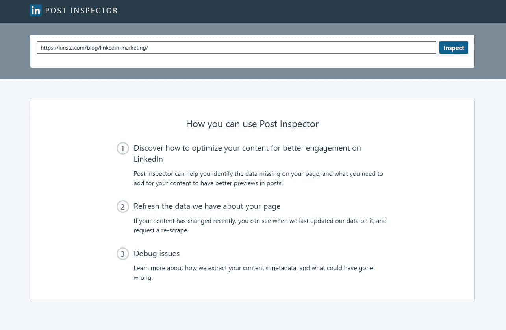

Post Inspector new URL

如果您只想刷新缓存，那么您已经完成了任务。就这么简单。

一种老方法是共享一个页面，在你的 URL 末尾添加一个类似于`?a`的虚假查询字符串，但这不会更新包含你的旧 URL 的帖子的预览。它只会刷新该特定共享链接的预览。

坚持岗位督察，是你的最佳选择，耗时三秒。如果您想调试结果并找出问题所在，请遵循接下来的几个步骤。

### 调试 LinkedIn 中的链接预览

在 LinkedIn 中调试你想要分享的页面的预览就像回答几个基本问题一样简单。

是否显示了正确的图像？如果没有，你必须改变你的文章或页面的元标签。

仅仅改变文章中照片的顺序是不够的(下一节将详细介绍如何解决这个问题)。

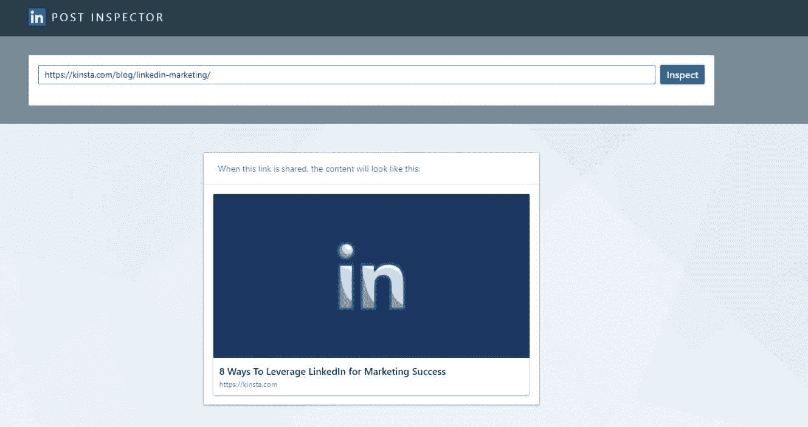

Post Inspector preview

**全标题可读性强吗？**检查[标题](https://kinsta.com/blog/headline-analyzer/)是否被截断，或者你是否可以包含更多关于你的帖子的信息。

LinkedIn 允许标题中最多包含 150 个字符，这意味着如果你愿意，你可以使用一个长的描述性标题。

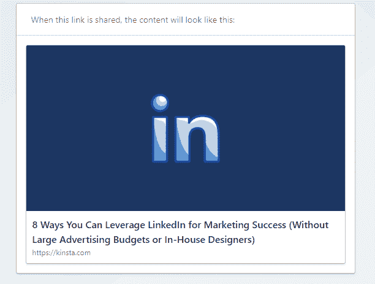

Link preview with a long title

你收到任何错误信息了吗？ LinkedIn 会让你知道，例如，你是否没有包括它抓取并用于预览的所有 OG 元标签。

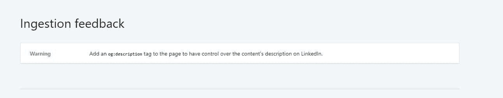

Post Inspector ingestion feedback

您可以在预览下方的“摄取反馈”部分找到错误消息和警告。

如果您的 URL 不包含任何错误，您将根本看不到该部分。除非它找到他们，否则它是隐藏的。

WordPress core 不包括你的帖子和页面的 OG 元数据。如果你没有一个支持开放图形标签的[插件，你肯定会在这里看到错误消息。](https://kinsta.com/blog/yoast-seo/#yoast-seo-social-media-tab)

这并不意味着您的安装或托管环境有任何问题。在大多数情况下，这仅仅意味着你需要安装正确的插件(稍后会详细介绍)。

### URL 信息和重定向

LinkedIn 还显示关于 URL 的基本信息、其重定向状态以及 LinkedIn 上次存储它的时间。

如果你已经设置了一个 [URL 重定向](https://kinsta.com/help/redirect-rules/)，这可能会影响你阅读时链接预览的显示。

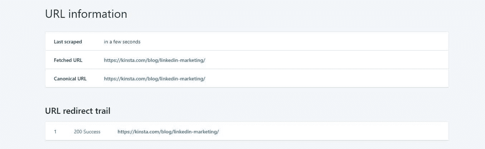

Post Inspector URL info

### 抓取的元数据

您还可以检查所有抓取的元数据，确保它与您网站上的内容相匹配。

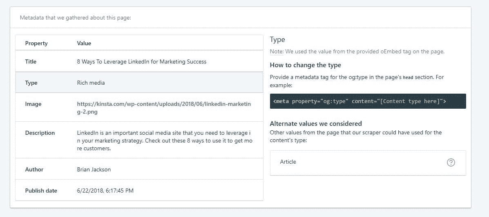

Scraped metadata

LinkedIn 抓取以下开放图形元标签:

*   **标题(og:Title):**页面、博客文章或视频的[标题。](https://kinsta.com/knowledgebase/hide-page-title-wordpress/)
*   **类型(og:type):** 内容的[类型](https://kinsta.com/learn/content-marketing/)，无论是文章、视频还是富媒体。
*   **Image(og:Image):**[预览缩略图](https://kinsta.com/blog/regenerate-thumbnails/)在链接预览中为帖子显示。
*   **描述(og:description):** 页面、文章或视频的摘要。
*   **Author(作者):**用于指定文章作者的常规 meta 标签。

但它在预览中仅显示以下元数据:

## 注册订阅时事通讯

### 想知道我们是怎么让流量增长超过 1000%的吗？

加入 20，000 多名获得我们每周时事通讯和内部消息的人的行列吧！

[Subscribe Now](#newsletter)

*   标题
*   图像

所以从技术上来说，你可以在你的文章和页面中只包含标题和图片标签。

但是有了像 WordPress 这样的 [CMS，正确的插件会自动生成其他标签。](https://kinsta.com/blog/cms-software/#1-wordpress--price-free)

## 如何更改链接预览图像和标题

当一个链接第一次被共享时，当一个 URL 被多次共享时，该数据被缓存以使用更少的资源。

第二次共享链接(或在 LinkedIn 提要中生成)时，LinkedIn 会提取缓存的版本。除非您手动刷新它，否则它不会改变。

这就是为什么即使在更新一篇文章后，你仍然可能在预览中看到一个过时的标题或图像。

要改变你的 WordPress 文章和页面的预览图片，你需要安装一个插件来包含 Open Graph meta 标签。

OG meta 标签不包含在 WordPress 核心中。但是你可能已经安装了一个插件，在你不知情的情况下激活了它们。

### 如何在 WordPress 中获得 OG Meta 标签

你已经安装了激活 OG 元标签的插件吗？

一个简单的检查方法是打开任何页面(比如你的主页)的页面源代码，在源代码中搜索“og:”即可。

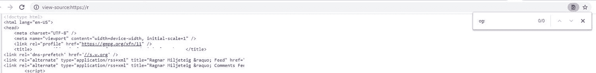

Page source

如果它显示 0 个结果，你需要[安装一个插件](https://kinsta.com/knowledgebase/how-to-install-wordpress-plugins/)来在你的页面上获得 OG 标签。

任何主要的 [SEO 插件](https://kinsta.com/blog/best-seo-plugins-for-wordpress/)都会提供这种能力，所以他们更愿意为 OG 标签安装一个单独的插件。

如果您还没有这些插件，请遵循以下步骤:

1.  搜索并安装 [Yoast SEO](https://kinsta.com/blog/yoast-seo/) 。
2.  安装完成后，点击同一个按钮激活插件(文本会改变)。
3.  然后前往菜单中新 SEO 项目下的社交设置。
4.  然后，单击脸书选项卡，并切换按钮以启用打开图表元数据。

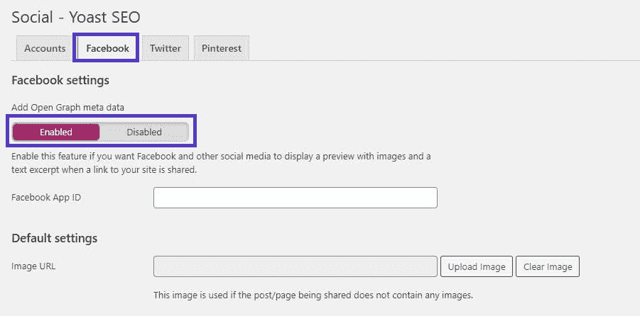

Yoast Facebook settings

不过，别担心。标签名称可能暗示了这一点，但是这些设置并不特定于脸书。2022 年，所有主要的社交媒体网站都在社交帖子中使用 OG 元数据进行预览，包括 LinkedIn、 [Twitter](https://kinsta.com/blog/twitter-marketing/) 、 [Pinterest](https://kinsta.com/blog/pinterest-marketing/) 等等。

如果您的帖子或页面中没有图像，您也可以设置使用默认图像。

厌倦了 WordPress 的问题和缓慢的主机？我们提供世界一流的支持，由 WordPress 专家提供 24/7 服务和超快的服务器。[查看我们的计划](https://kinsta.com/plans/?in-article-cta)

如果你的问题是你的 LinkedIn 帖子没有包括开放图表数据，你可以跳到前面检查你的社交预览。

### 如何在 OG 标签中获得正确的图像和文本

Yoast SEO 成功安装后，您现在可以为每个帖子设置单独的设置。

默认情况下，插件使用 WordPress 数据生成所有帖子的标签。

*   *og:image* 标签与你的特色图片相同，或者如果没有特色图片，则与文章或页面中包含的第一张图片相同。
*   标签与 WordPress 中文章或页面的标题相同。
*   *作者*等于帖子作者。

要编辑这些标签，你必须编辑有问题的文章或页面。然后，用右上角的按钮切换 Yoast 菜单，点击“脸书预览”链接。

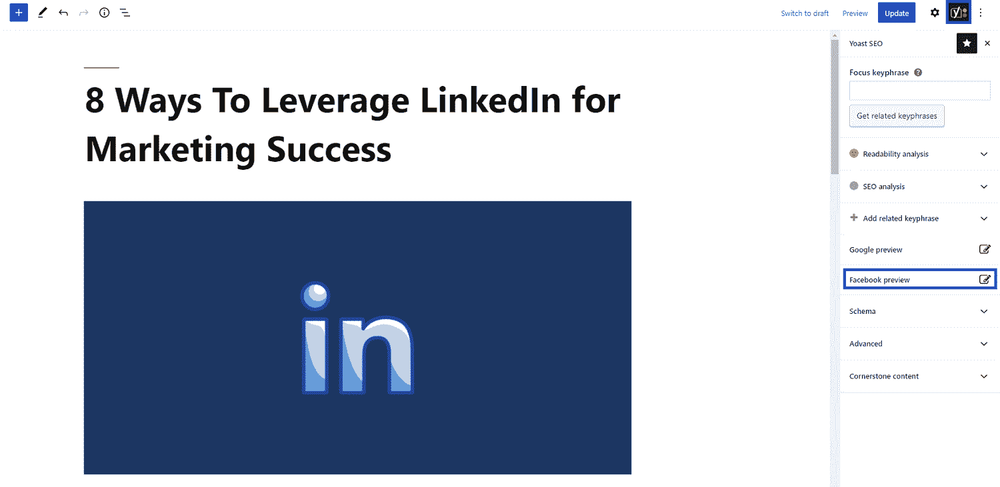

Yoast’s Facebook preview link

你现在可以开始编辑“脸书图像”和“脸书标题”字段。

这将改变帖子和 LinkedIn 链接预览各自的 OG 标签。

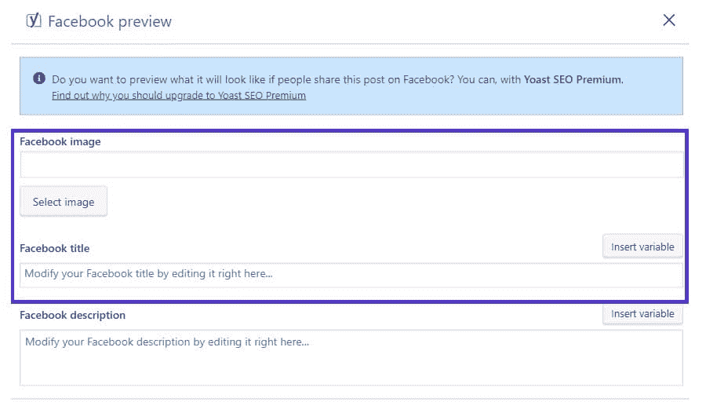

Yoast’s Facebook OG tag settings

例如，我们可能希望包含类似图表的东西，而不仅仅是简单的 LinkedIn 徽标，以便在社交媒体上共享。

在帖子中，我们强调了这张对比有机流量和赞助流量的图表，它显示了有机流量和付费流量随着时间推移的影响。

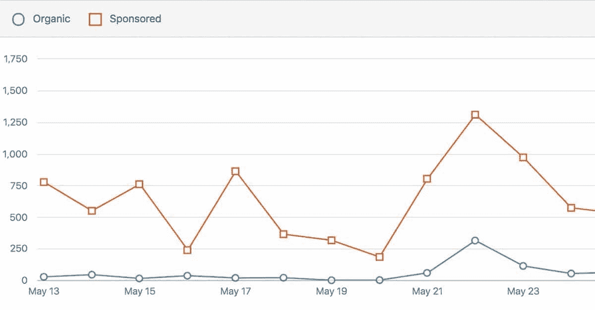

LinkedIn organic vs sponsored

单击“选择图像”按钮，从您的媒体库中选择相关图像。

如果是您想要编辑的标题，您也需要在这个阶段更改标题。你甚至可以使用像文章标题和类别这样的变量来设置它。

您还应该添加描述。LinkedIn 抓取了它，但没有将其包括在预览中(在桌面或移动应用程序上)，但一些社交媒体应用程序确实实现了它。

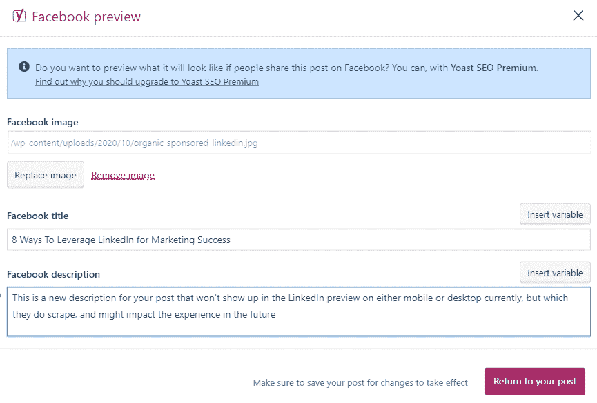

New OG metadata

正确填写字段后，点击“返回到您的岗位”按钮。

最后，更新帖子以使更改生效。

现在你已经准备好进入下一步了。

### 刷新您的页面(或站点)缓存

你使用一个 [WordPress 缓存插件](https://kinsta.com/blog/wordpress-caching-plugins/)吗？或者也许你使用一个高级的 WordPress 主机，比如 Kinsta，它为你处理 [WordPress 缓存](https://kinsta.com/blog/wordpress-cache/)？

无论哪种情况，您都需要[清除并刷新缓存的页面](https://kinsta.com/blog/wordpress-clear-cache/)(或您的整个缓存)以使更改影响您的实时站点。

### 刷新你的 LinkedIn 缓存，检查新图片是否显示

清空缓存后，是时候返回帖子检查器刷新 LinkedIn 的帖子缓存，看看你的更改是否有效。

如果您仍然在单独的浏览器选项卡中打开它，只需单击刷新按钮。如果没有，返回到检查器，复制并粘贴您的页面 URL，并运行另一个检查。

这一次你应该会看到新的图像和标题。

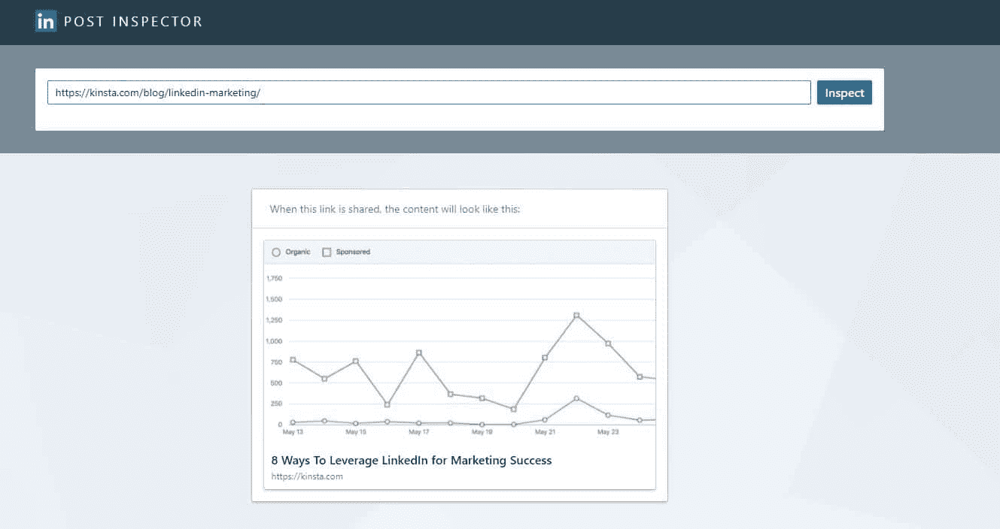

New link preview image

如果它确实显示了新的图片和标题，这意味着任何 LinkedIn 发布到相同 URL 的帖子看起来都是一样的。您已成功更改了链接预览。

如果这是你第一次在帖子中添加 OG meta 标签，你应该清洗并重复所有重要的帖子和页面。

## 如何用 HTML 改变图片和标题的开放图形元标签

你有一个静态 HTML 网站或者使用一个不支持 OG 标签的 CMS 吗？修复单个页面的 LinkedIn 预览很容易。

只需在您想要编辑的页面的 head 标签之间添加以下字段。因此，打开[最好的 HTML 编辑器之一](https://kinsta.com/blog/free-html-editor/)并添加这几行:

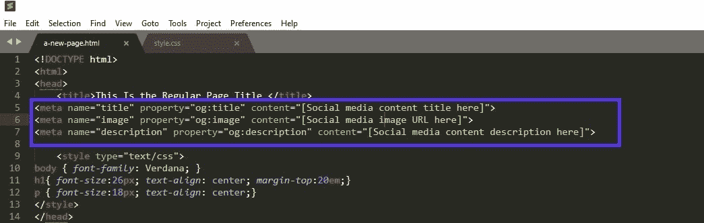

Open Graph meta tags

在那之后，确保你保存了文档并且把页面的新版本上传到你的服务器上。

[Don't let a broken link or the wrong article title derail your LinkedIn post. 😬 Use the Post Inspector tool to keep your CTR and post engagement high, with help from this guide ⬆️Click to Tweet](https://twitter.com/intent/tweet?url=https%3A%2F%2Fkinsta.com%2Fblog%2Flinkedin-debugger%2F&via=kinsta&text=Don%27t+let+a+broken+link+or+the+wrong+article+title+derail+your+LinkedIn+post.+%F0%9F%98%AC+Use+the+Post+Inspector+tool+to+keep+your+CTR+and+post+engagement+high%2C+with+help+from+this+guide+%E2%AC%86%EF%B8%8F&hashtags=LinkedIn%2CNetworkingTips)

## 摘要

当你在之后向你的 [LinkedIn 推广一个更新的页面时，你最不希望的就是帖子预览来抵消你的信息。错误的图片会传递错误的信息，降低你链接的点击率，降低你有机活动的有效性。](https://kinsta.com/blog/how-to-create-a-company-page-on-linkedin/)

多亏了 LinkedIn Post Inspector 工具，你可以发现任何问题并及时解决。如果你使用带有[右边插件](https://kinsta.com/best-wordpress-plugins)的 WordPress ，你只需要设置一次，然后忘记它，因为它将适用于你将来创建的每个页面(和链接)。

* * *

让你所有的[应用程序](https://kinsta.com/application-hosting/)、[数据库](https://kinsta.com/database-hosting/)和 [WordPress 网站](https://kinsta.com/wordpress-hosting/)在线并在一个屋檐下。我们功能丰富的高性能云平台包括:

*   在 MyKinsta 仪表盘中轻松设置和管理
*   24/7 专家支持
*   最好的谷歌云平台硬件和网络，由 Kubernetes 提供最大的可扩展性
*   面向速度和安全性的企业级 Cloudflare 集成
*   全球受众覆盖全球多达 35 个数据中心和 275 多个 pop

在第一个月使用托管的[应用程序或托管](https://kinsta.com/application-hosting/)的[数据库，您可以享受 20 美元的优惠，亲自测试一下。探索我们的](https://kinsta.com/database-hosting/)[计划](https://kinsta.com/plans/)或[与销售人员交谈](https://kinsta.com/contact-us/)以找到最适合您的方式。