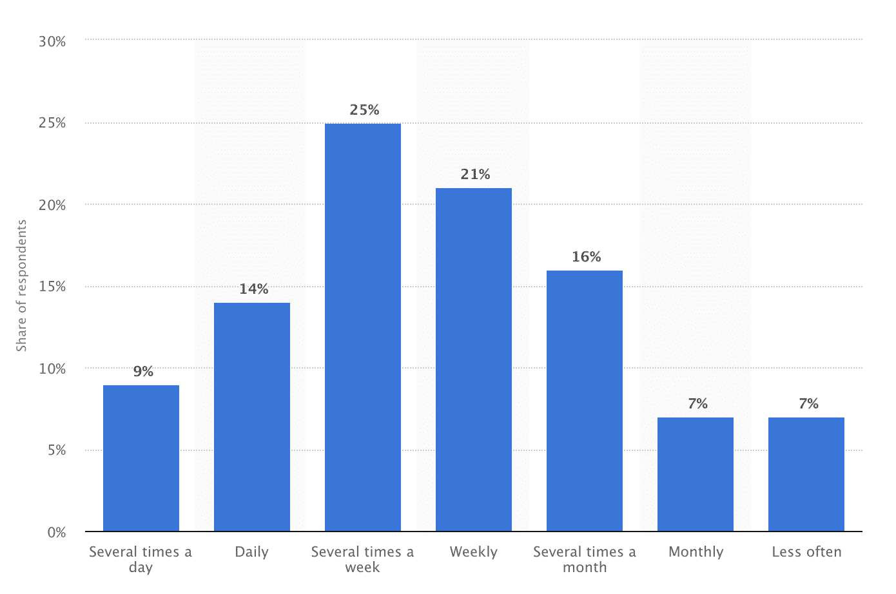
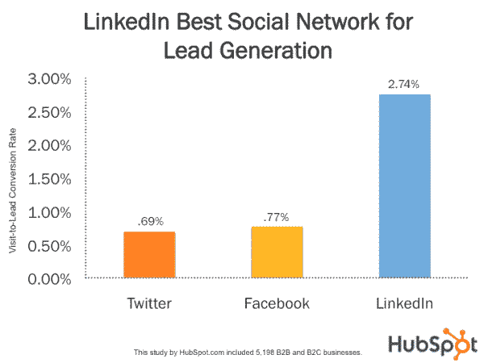

# 利用 LinkedIn 取得营销成功的 8 种方法

> 原文：<https://kinsta.com/blog/linkedin-marketing/>

早些年，LinkedIn 只是你的在线通讯录——一个你可以跟踪同事、业务关系和你网络中其他人的地方。今天，在它成立近 15 年后，它的地位更高了。

LinkedIn 于 2016 年被微软收购，现在是一个提供专业服务的市场，一个寻找新员工的地方，一个发布和展示你最好内容的地方，最重要的是，一个向 T4 推销你的企业的地方。

目前，LinkedIn 在全球拥有超过 5 . 62 亿用户，遍布 200 多个国家和地区。这些用户已经准备好了，等着你去利用。

LinkedIn 用户也登录、浏览并主动查看网站。最近的一项研究调查了美国移动用户使用 LinkedIn 的频率。截至 2017 年第二季度， **48%的用户每周查看网站几次**或更多。

Frequency of LinkedIn mobile users (Image source: [Statista](https://www.statista.com/statistics/199269/frequency-of-use-among-linkedin-users-in-the-united-states/))

在一项涉及 198 家 B2B 和 B2C 企业的所有社交媒体网站的实验中，LinkedIn 的访客到潜在客户转化率最高。 [LinkedIn 实现了 2.74%](https://blog.hubspot.com/blog/tabid/6307/bid/30030/linkedin-277-more-effective-for-lead-generation-than-facebook-twitter-new-data.aspx) 的转化率，而 [Twitter](https://kinsta.com/blog/twitter-marketing/) (.69%)和脸书(. 77%)落后。

LinkedIn lead generation (Image source: [HubSpot](https://blog.hubspot.com/blog/tabid/6307/bid/30030/linkedin-277-more-effective-for-lead-generation-than-facebook-twitter-new-data.aspx))

但是 LinkedIn 和其他社交媒体网站相比如何呢？尽管活跃用户比脸书和 Twitter 少，但在将访问者转化为潜在客户方面，它仍然遥遥领先。许多人在 LinkedIn 上看到了超高的管理水平。

> 我有一个可耻的自白:我已经成为一个定期 LinkedIn 海报。
> 
> 那里的订婚是不真实的。我得到了合法的投资机会，他们看重我的工作。
> 
> ——Joel klettke(@ jolklettke)[2018 年 7 月 12 日](https://twitter.com/JoelKlettke/status/1017210894273601536?ref_src=twsrc%5Etfw)