# 您应该知道的 40 个最常用的 Linux 命令

> 原文：<https://kinsta.com/blog/linux-commands/>

在撰写本文时，Linux 在桌面上的全球市场份额为 2.68% ，但超过 90%的云基础设施和[托管服务](https://kinsta.com/wordpress-hosting/)都运行在这个操作系统上。仅仅因为这个原因，熟悉流行的 Linux 命令是至关重要的。

根据 [2020 StackOverflow 调查](https://insights.stackoverflow.com/survey/2020#technology-platforms)，Linux 是专业开发人员使用最多的操作系统，拥有令人印象深刻的 55.9%的市场份额。这不仅仅是巧合。Linux 是免费和开源的，比其竞争对手有更好的安全性，并拥有强大的命令行，使开发人员和高级用户更有效。你还可以使用一个强大的包管理器和一些开发工具，比如 [DevKinsta](https://kinsta.com/devkinsta/) 。

无论您是经验丰富的系统管理员还是 Linux 新手，您都可以利用本指南。

我们开始吧！

## 什么是 Linux 命令？

Linux 命令是在命令行上运行的程序或实用程序。一个[命令行](https://kinsta.com/knowledgebase/devkinsta/wp-cli/)是一个接受文本行并把它们处理成你的计算机指令的界面。

任何图形用户界面(GUI)都只是命令行程序的抽象。例如，当你点击“X”关闭一个窗口时，在这个动作后面有一个命令在运行。

一个**标志**是我们传递选项给你运行的命令的一种方式。大多数 Linux 命令都有一个帮助页面，我们可以用标志`-h`调用它。大多数时候，标志是可选的。


> 需要在这里大声喊出来。Kinsta 太神奇了，我用它做我的个人网站。支持是迅速和杰出的，他们的服务器是 WordPress 最快的。
> 
> <footer class="wp-block-kinsta-client-quote__footer">
> 
> 
> 
> <cite class="wp-block-kinsta-client-quote__cite">Phillip Stemann</cite></footer>

[View plans](https://kinsta.com/plans/)

一个**变量**或参数是我们给一个命令的**输入**，这样它就能正确运行。在大多数情况下，参数是文件路径，但它可以是您在终端中键入的任何内容。

您可以使用连字符(`-`)和双连字符(`--`)调用标志，而参数的执行取决于您将它们传递给函数的顺序。

[您知道 90%的云基础设施和托管服务都使用 Linux 吗？🤯仅仅因为这个原因，熟悉流行的 Linux 命令是至关重要的。⬇️ 点击推文](https://twitter.com/intent/tweet?url=https%3A%2F%2Fkinsta.com%2Fblog%2Flinux-commands%2F&via=kinsta&text=Did+you+know+that+90%25+of+all+cloud+infrastructure+and+hosting+services+use+Linux%3F+%F0%9F%A4%AF+For+this+reason+alone%2C+it+is+crucial+to+be+familiar+with+popular+Linux+commands.+%E2%AC%87%EF%B8%8F&hashtags=Linux%2COS)


## 最常用的 Linux 命令

在进入最常用的 Linux 命令之前，确保启动一个**终端**。在大多数 Linux 发行版中，您会使用`Ctrl + Alt + T`来实现这一点。如果这不起作用，请在应用程序面板中搜索“终端”

[](https://kinsta.com/wp-content/uploads/2021/08/Linux-terminal-emulator.png)

The Linux terminal emulator.


现在让我们深入研究 40 个最常用的 Linux 命令。其中许多都有多个选项，你可以把它们串起来，所以请务必[查看命令手册](https://linux.die.net/man/1/cp)。

### 1. **`ls`** 命令

`ls`可能是每个 Linux 用户在终端上输入的第一个命令。它允许您列出所需目录(默认为当前目录)的内容，包括文件和其他嵌套目录。

```
ls
```

它有许多选项，所以使用`--help`标志获得一些帮助可能会很好。这个标志返回所有可以和 ls 一起使用的标志。

例如，要给`ls`命令的输出着色，可以使用下面的代码:

```
ls --color=auto
```

[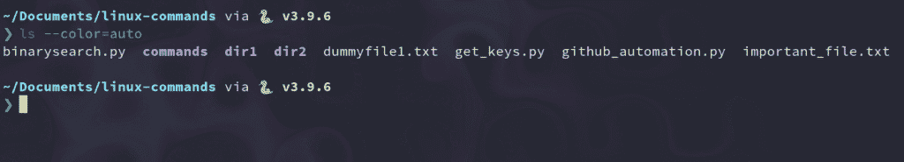](https://kinsta.com/wp-content/uploads/2021/08/ls-command-colorized.png)

The colorized ls command.


现在,`ls`命令输出是彩色的，您可以体会到目录和文件之间的区别。

但是用颜色标志键入`ls`将是低效的；这就是我们使用`alias`命令的原因。

### 2. **`alias`** 命令

`alias`命令允许您在 shell 会话中定义临时别名。创建别名时，您指示您的 shell 用一系列命令替换一个单词。

例如，要将`ls`设置为有颜色，而不是每次都键入`--color`标志，您可以使用:

```
alias ls="ls --color=auto"
```

如您所见，`alias`命令接受一个键值对参数:`alias NAME="VALUE"`。请注意，该值必须用引号括起来。

如果想列出 shell 会话中的所有别名，可以运行不带参数的`alias`命令。

```
alias
```

[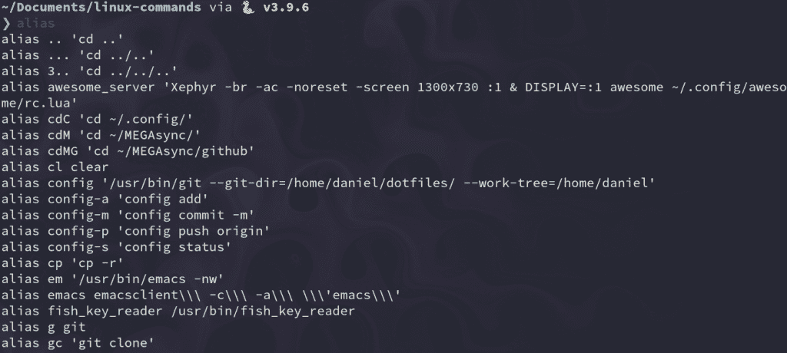](https://kinsta.com/wp-content/uploads/2021/08/alias-command.png)

The alias command.


### 3. **`unalias`** 命令

顾名思义，`unalias`命令旨在从已经定义的别名中删除一个`alias`。要删除以前的`ls`别名，可以使用:

```
unalias ls
```

### 4. **`pwd`** 命令

`pwd`命令代表“打印工作目录”，它输出你所在目录的绝对路径。例如，如果您的用户名是“john”，并且您在您的文档目录中，那么它的绝对路径将是:`/home/john/Documents`。

要使用它，只需在终端中键入`pwd`:

```
pwd

# My result: /home/kinsta/Documents/linux-commands
```

### 5. **`cd`** 命令

与`ls`一样，`cd`命令非常受欢迎。它指的是“**c**hange**d**I 目录”，顾名思义，它把你切换到你试图访问的目录。

例如，如果您在 Documents 目录中，并试图访问其中一个名为 **Videos** 的子文件夹，您可以通过键入:

```
cd Videos
```

您还可以提供文件夹的绝对路径:

```
cd /home/kinsta/Documents/Videos
```

使用`cd`命令时，有一些技巧可以帮你节省很多时间:

#### 1.前往个人文件夹

```
cd
```

#### 2.向上移动一级

```
cd ..
```

#### 3.返回到上一个目录

```
cd -
```

### 6. **`cp`** 命令

在 Linux 终端中直接复制文件和文件夹非常容易，有时它可以取代传统的文件管理器。

要使用`cp`命令，只需键入它以及源文件和目标文件:

```
cp file_to_copy.txt new_file.txt
```

还可以使用递归标志复制整个目录:

```
cp -r dir_to_copy/ new_copy_dir/
```

请记住，在 Linux 中，文件夹以正斜杠(`/`)结尾。

### 7. **`rm`** 命令

既然你已经知道如何复制文件，知道如何删除它们会很有帮助。

您可以使用`rm`命令删除文件和目录。不过，使用它时要小心，因为很难(但不是不可能)恢复以这种方式删除的文件。

要删除常规文件，您可以键入:

```
rm file_to_copy.txt
```

如果你想删除一个空目录，你可以使用递归(`-r`)标志:

```
rm -r dir_to_remove/
```

另一方面，要删除包含内容的目录，需要使用 force (-f)和递归标志:

```
rm -rf dir_with_content_to_remove/
```

小心这一点——误用这两个标志可以抹去一整天的工作！


### 8. **`mv`** 命令

您可以使用`mv`命令在文件系统中移动(或重命名)文件和目录。

要使用该命令，您需要在源文件和目标文件中键入其名称:

```
mv source_file destination_folder/

mv command_list.txt commands/
```

要利用绝对路径，您可以使用:

```
mv /home/kinsta/BestMoviesOfAllTime ./
```

…其中`./`是您当前所在的目录。

您还可以使用`mv`来重命名文件，同时将它们保存在同一个目录中:

```
mv old_file.txt new_named_file.txt
```

### 9. **`mkdir`** 命令

要在 shell 中创建文件夹，可以使用`mkdir`命令。只需指定新文件夹的名称，确保它不存在，就可以开始了。

例如，要创建一个目录来保存[您的所有图像](https://kinsta.com/blog/free-images-for-wordpress/)，只需键入:

```
mkdir images/
```

要使用简单的命令创建子目录，请使用 parent ( `-p`)标志:

```
mkdir -p movies/2004/
```

### 10. **`man`** 命令

另一个重要的 Linux 命令是`man`。它显示任何其他命令的手册页(只要它有一个)。

要查看`mkdir`命令的手册页，输入:

```
man mkdir
```

您甚至可以参考`man`手册页:

```
man man
```

[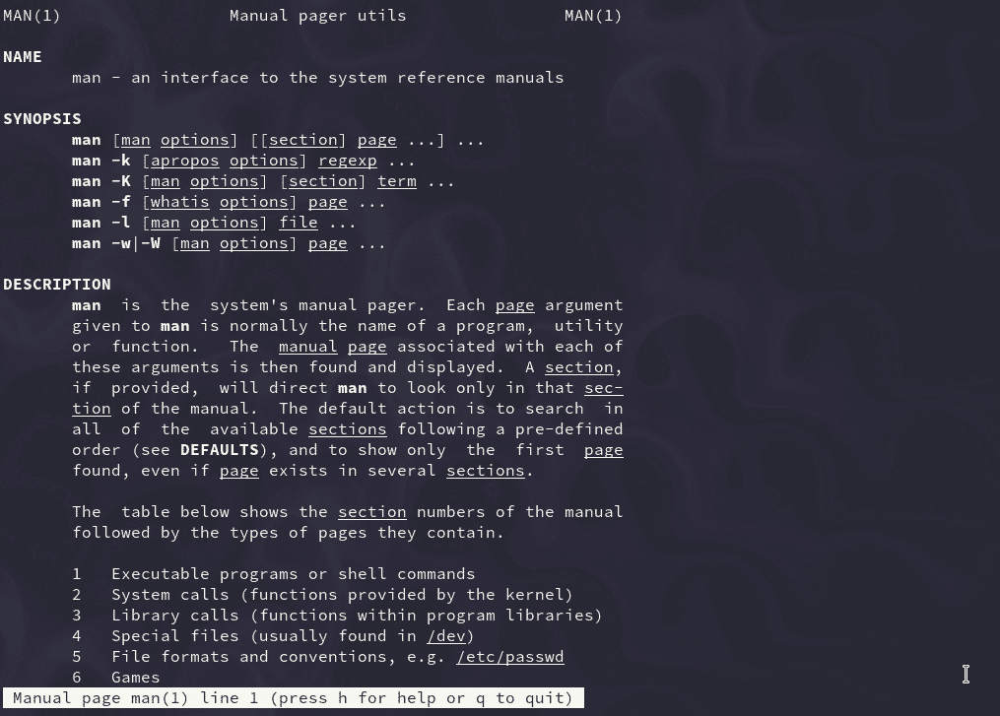](https://kinsta.com/wp-content/uploads/2021/08/Man-command.png)

The manual page of “man.”


### 11. **`touch`** 命令

`touch`命令允许您更新指定文件的访问和修改时间。

例如，我有一个旧文件，最后一次修改是在 4 月 12 日:

[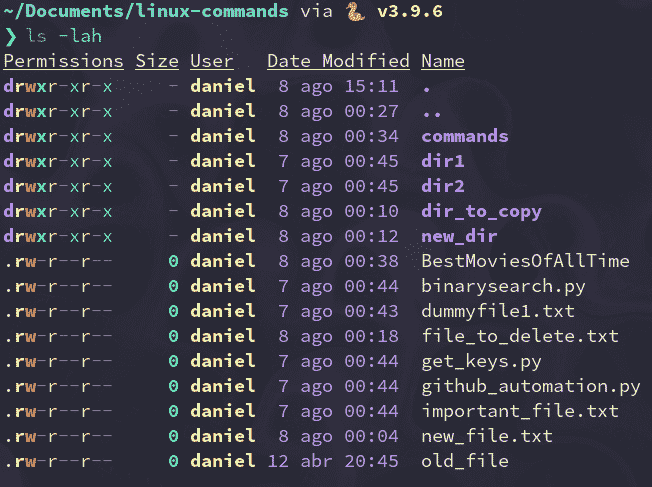](https://kinsta.com/wp-content/uploads/2021/08/old-date.png)

Old date.


要将其修改日期更改为当前时间，我们需要使用`-m` 标志:

```
touch -m old_file
```

现在日期与今天的日期相匹配(在撰写本文时是 8 月 8 日)。

[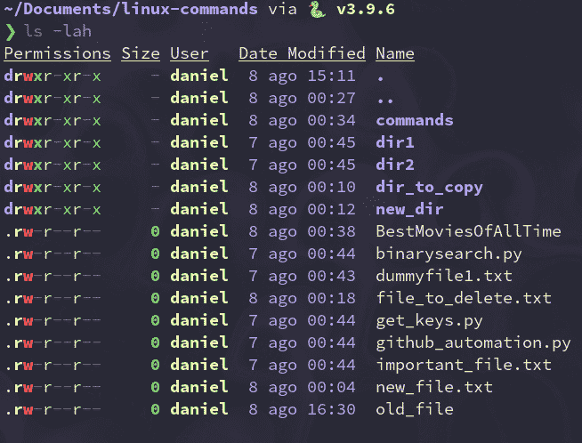](https://kinsta.com/wp-content/uploads/2021/08/new-date.png)

New date


尽管如此，大多数时候，您不会使用`touch`来修改文件日期，而是创建新的空文件:

```
touch new_file_name
```

### 12. **`chmod`** 命令

通过`chmod`命令，您可以快速更改文件(权限)的[模式。它有很多选项可用。](https://wiki.archlinux.org/title/File_permissions_and_attributes)

文件可以拥有的基本权限包括:

*   r(读取)
*   w(写)
*   x(执行)

`chmod`最常见的用例之一是让用户可以执行一个文件。为此，请键入`chmod`和标志`+x`，后跟您想要修改权限的文件:

```
chmod +x script
```

您用它来使脚本可执行，允许您通过使用`./`符号直接运行它们。

### 13. **`./`** 命令

也许`./`符号本身不是一个命令，但是在这个列表中值得一提。它让您的 shell 直接从终端运行安装在您系统中的任何解释程序的可执行文件。不再双击图形文件管理器中的文件！

例如，使用这个命令，您可以运行一个 [Python 脚本](https://kinsta.com/blog/python-object-oriented-programming/)或者一个只在中可用的程序。跑格式，像 [XAMPP](https://kinsta.com/blog/install-wordpress-locally/#how-to-install-wordpress-locally-using-xampp) 。当运行一个可执行文件时，确保它有可执行文件(x)权限，可以用`chmod`命令修改。

下面是一个简单的 Python 脚本，以及我们如何用`./`符号运行它:

```
#! /usr/bin/python3

# filename: script

for i in range(20):

print(f"This is a cool script {i}")
```

下面是我们如何将脚本转换成可执行文件并运行它:

```
chmod +x script

./script
```

### 14. **`exit`** 命令

`exit`命令正如其名所示:使用它，您可以结束一个 shell 会话，并且在大多数情况下，自动关闭正在使用的终端[:](https://kinsta.com/blog/how-to-use-ssh/)

```
exit
```

### 15. **`sudo`** 命令

这个命令代表“超级用户 do”，它允许您在运行特定命令时充当超级用户或根用户。这就是 Linux 如何保护自己，防止用户意外修改机器的文件系统或安装不适当的包。

Sudo 通常用于安装软件或编辑用户主目录之外的文件:

```
sudo apt install gimp

sudo `cd` /root/ 
```

在运行您键入的命令之前，它会要求您输入管理员的密码。

### 16. **`shutdown`** 命令

正如你可能猜到的，`shutdown`命令让你关闭你的机器。但是，它也可以用来停止和重新启动它。

要立即关闭计算机电源(默认为一分钟)，请键入:

```
shutdown now
```

您还可以计划以 24 小时制关闭系统:

```
shutdown 20:40
```

要取消之前的`shutdown`呼叫，您可以使用`-c`标志:

```
shutdown -c
```

### 17. **`htop`** 命令

`htop`是一个交互式流程查看器，可让您直接从终端管理机器资源。在大多数情况下，它不是默认安装的，所以请确保在它的下载页面上阅读更多关于它的信息。

## 注册订阅时事通讯


### 想知道我们是怎么让流量增长超过 1000%的吗？

加入 20，000 多名获得我们每周时事通讯和内部消息的人的行列吧！

[Subscribe Now](#newsletter)

```
htop
```

[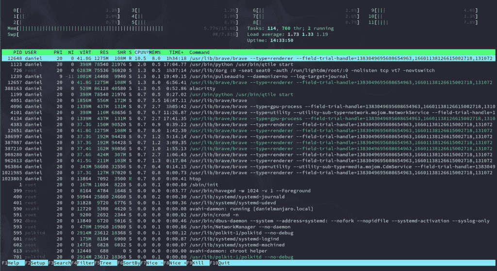](https://kinsta.com/wp-content/uploads/2021/08/htop-interface.png)

The “htop” interface.


### 18. **`unzip`** 命令

[unzip](https://kinsta.com/knowledgebase/unzip-zip-file/#step-3--unzip-the-zip-file-using-terminal) 命令允许你提取一个**的内容。从终端压缩**文件。同样，默认情况下这个包可能不会被安装，所以一定要用你的包管理器来安装它。

在这里，我们正在解压一个充满图像的. zip 文件:

```
unzip images.zip
```

### 19.`apt`、`yum`、`pacman`命令

无论您使用的是哪一个 Linux 发行版，您都可能使用软件包管理器来安装、更新和删除您每天使用的软件。

您可以通过命令行访问这些包管理器，您可以根据您的机器运行的发行版来使用其中的一个。

下面的例子将安装 [GIMP](https://www.gimp.org/) ，这是一个通常在大多数包管理器中可用的免费开源软件:

#### 1.基于 debian(Ubuntu，Linux Mint)

```
sudo apt install gimp
```

#### 2.基于红帽(Fedora，CentOS)

```
sudo yum install gimp
```

#### 3.基于 arch(Manjaro，Arco Linux)

```
sudo pacman -S gimp
```

### 20. **`echo`** 命令

`echo`命令在终端中显示定义的文本——就这么简单:

```
echo "Cool message"
```

[](https://kinsta.com/wp-content/uploads/2021/08/echo-command.png)

The echo command


它的主要用途是打印这些消息中的环境变量:

```
echo "Hey $USER"

# Hey kinsta
```

### 21. **`cat`** 命令

`Cat`(concatenate 的缩写)可让您直接从终端创建、查看和连接文件。它主要用于在不打开图形文本编辑器的情况下预览文件:

```
cat long_text_file.txt
```

[](https://kinsta.com/wp-content/uploads/2021/08/cat-command.png)

The cat command.


### 22. **`ps`** 命令

使用`ps`，您可以查看当前 shell 会话正在运行的进程。它打印出关于你正在运行的程序的有用信息，比如进程 ID、TTY(电传打字机)、时间和命令名。

```
ps
```

[](https://kinsta.com/wp-content/uploads/2021/08/ps-command.png)

The ps command.


如果你想要更具互动性的东西，你可以使用`htop`。

### 23. **`kill`** 命令

当一个程序没有反应的时候是很烦人的，你无论如何都无法关闭它。幸运的是，`kill`命令解决了这类问题。

简单地说，`kill`向一个进程发送一个 TERM 或 kill 信号来终止它。

您可以通过输入 PID(进程 ID)或程序的二进制名称来终止进程:

```
kill 533494

kill firefox
```

小心使用这个命令——使用`kill`,您可能会意外删除您一直在做的工作。

### 24. **`ping`** 命令

`ping`是最流行的网络终端实用程序，用于测试网络连接。`ping`有很多选项，但在大多数情况下，你会用它来请求一个域名或 [IP 地址](https://kinsta.com/tools/what-is-my-ip/):

```
ping google.com

ping 8.8.8.8
```

### 25. **`vim`** 命令

是一个免费的开源终端文本编辑器，从 90 年代就开始使用了。它允许你使用有效的按键来编辑纯文本文件。

有些人认为它很难使用— [退出 Vim](https://stackoverflow.com/questions/11828270/how-do-i-exit-the-vim-editor) 是最常见的 StackOverflow 问题之一——但是一旦你习惯了，它就会成为你在命令行中最好的盟友。

要启动 Vim，只需输入:

所有的 Kinsta 托管计划都包括来自我们资深 WordPress 开发者和工程师的 24/7 支持。与支持我们财富 500 强客户的同一个团队聊天。查看我们的计划！

```
vim
```

[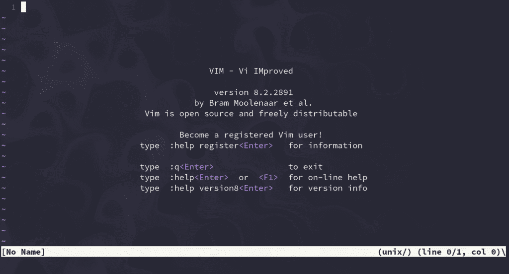](https://kinsta.com/wp-content/uploads/2021/08/vim-text-editor.png)

The vim text editor.


### 26. **`history`** 命令

如果你正在努力记住一个命令，`history`就派上用场了。此命令显示您过去使用过的命令的枚举列表:

```
history
```

[](https://kinsta.com/wp-content/uploads/2021/08/history-command.png)

The history command.


### 27. **`passwd`** 命令

`passwd`允许您[更改用户账户的密码](https://kinsta.com/blog/change-wordpress-password/)。首先，它会提示您输入当前密码，然后要求您输入新密码并进行确认。

它类似于您在其他地方看到的任何其他密码更改，但在这种情况下，它直接出现在您的终端中:

```
passwd
```

[](https://kinsta.com/wp-content/uploads/2021/08/passwd-command.png)

The passwd command


使用它时要小心——你不会想弄乱你的用户密码的！

### 28. **`which`** 命令

`which`命令输出 shell 命令的完整路径。如果它不能识别给定的命令，它将抛出一个错误。

例如，我们可以用它来检查 [Python](https://kinsta.com/blog/python-tutorials/) 和 [Brave web 浏览器](https://kinsta.com/blog/brave-browser-review/)的二进制路径:

```
which python

# /usr/bin/python

which brave

# /usr/bin/brave
```

### 29. **`shred`** 命令

如果你曾经想让一个文件几乎不可能被[恢复](https://kinsta.com/help/disaster-recovery/)，`shred`可以帮你完成这个任务。该命令会重复覆盖文件的内容，因此，给定的文件变得极难恢复。

这里有一个内容很少的文件:

[](https://kinsta.com/wp-content/uploads/2021/08/file-to-shred.png)

File to shred.


现在，让我们通过键入以下命令让`shred`完成它的工作:

```
shred file_to_shred.txt
```

[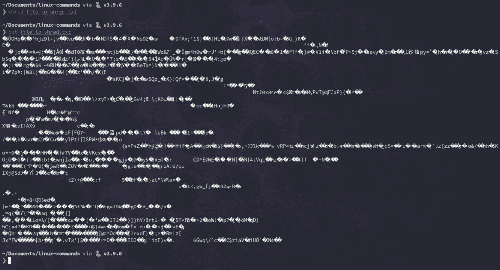](https://kinsta.com/wp-content/uploads/2021/08/Overwritten-content.png)

Overwritten content.


如果你想马上删除文件，你可以使用`-u`标志:

```
shred -u file_to_shred.txt
```

### 30. **`less`** 命令

`less`(与[相反，更多的](https://man7.org/linux/man-pages/man1/more.1.html))是一个让你向前和向后检查文件的程序:

```
less large_text_file.txt
```

[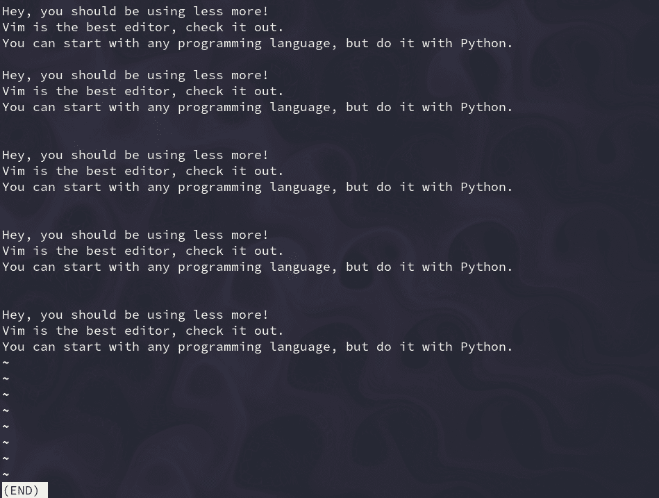](https://kinsta.com/wp-content/uploads/2021/08/less-command.png)

The less command.


关于`less`的巧妙之处在于，它在其界面中包含了更多的和`vim`命令。如果你需要比`cat`更具互动性的东西，`less`是个不错的选择。

### 31. **`tail`** 命令

类似于`cat` , `tail`打印文件的内容，但有一个主要的警告:它只输出最后几行。默认情况下，它会打印最后 10 行，但是您可以使用`-n`来修改这个数字。

例如，要打印一个大文本文件的最后几行，您可以使用:

```
tail long.txt
```

[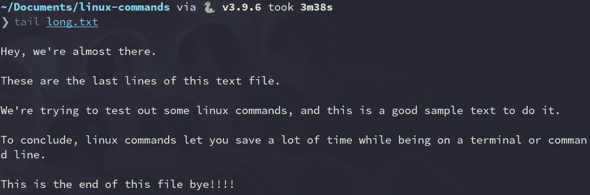](https://kinsta.com/wp-content/uploads/2021/08/tail-command.png)

The tail command.


要仅查看最后四行:

```
tail -n 4 long.txt
```

[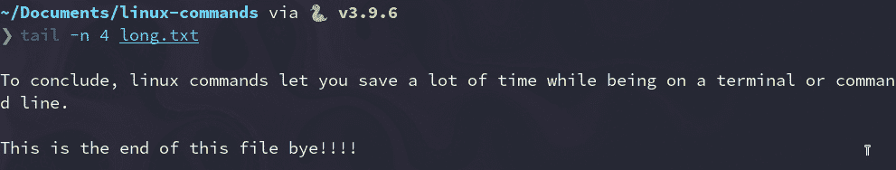](https://kinsta.com/wp-content/uploads/2021/08/tail-four-lines.png)

tail four lines.


### 32. **`head`** 命令

这是对`tail`命令的补充。`head`输出一个文本文件的前 10 行，但是您可以用`-n`标志设置想要显示的任意行数:

```
head long.txt

head -n 5 long.txt
```

[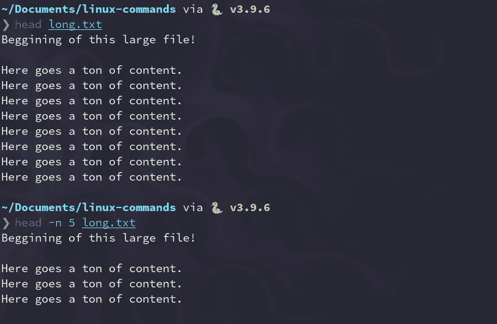](https://kinsta.com/wp-content/uploads/2021/08/head-command.png)

The head command.


### 33. **`grep`** 命令

Grep 是处理文本文件最强大的工具之一。它搜索匹配一个[正则表达式](https://regex101.com/)的行并打印它们:

```
grep "linux" long.txt
```

[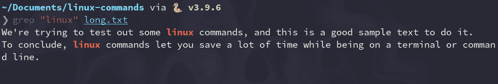](https://kinsta.com/wp-content/uploads/2021/08/grep-command.png)

The grep command.


您可以使用`-c`标志来计算图案重复的次数:

```
grep -c "linux" long.txt

# 2
```

### 34. **`whoami`** 命令

`whoami`命令(我是谁的缩写)显示当前使用的[用户名](https://kinsta.com/knowledgebase/change-wordpress-username/):

```
whoami

# kinsta
```

使用`echo`和环境变量$USER 会得到相同的结果:

```
echo $USER

# kinsta
```

### 35. **`whatis`** 命令

`whatis`打印任何其他命令的单行描述，使其成为有用的参考:

```
whatis python

# python (1) - an interpreted, interactive, object-oriented programming language

whatis whatis

# whatis (1) - display one-line manual page descriptions
```

### 36. **`wc`** 命令

Wc 代表“字数”，顾名思义，它返回文本文件中的字数:

```
wc long.txt

# 37 207 1000 long.txt
```

让我们分析一下这个命令的输出:

*   37 行
*   207 字
*   1000 字节大小
*   文件的名称(long.txt)

如果你只需要字数，使用`-w`标志:

```
wc -w long.txt

207 long.txt
```

### 37. **`uname`** 命令

`uname`(“Unix 名称”的缩写)打印可操作的系统信息，这在您了解当前的 Linux 版本时会很方便。

大多数情况下，您将使用`-a`(–all)标志，因为默认输出并不那么有用:

```
uname

# Linux

uname -a

# Linux kinstamanjaro 5.4.138-1-MANJARO #1 SMP PREEMPT Thu Aug 5 12:15:21 UTC 2021 x86_64 GNU/Linux
```

### 38. **`neofetch`** 命令

Neofetch 是一个 CLI(命令行界面)工具，它在 Linux 发行版的 ASCII 标志旁边显示关于您的系统的信息，如内核版本、外壳和硬件:

```
neofetch
```

[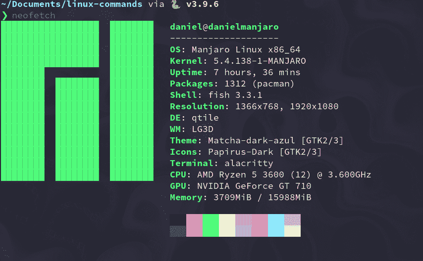](https://kinsta.com/wp-content/uploads/2021/08/neofetch.png)

The neofetch command.


在大多数机器上，这个命令在默认情况下是不可用的，所以请确保首先用您的软件包管理器安装它。

### 39. **`find`** 命令

`find`命令根据正则表达式在目录层次结构中搜索[文件。要使用它，请遵循以下语法:](https://kinsta.com/knowledgebase/wordpress-files/)

```
find [flags] [path] -name [expression]
```

要在当前目录中搜索名为 **long.txt** 的文件，请输入:

```
find `./` -name "long.txt" # ./long.txt 
```

搜索以**结尾的文件。py** (Python)扩展，可以使用以下命令:

```
find `./` -type f -name "*.py" ./get_keys.py ./github_automation.py ./binarysearch.py 
```

### 40. **`wget`** 命令

`wget`(万维网获取)是一个从互联网上检索内容的实用程序。那里有最大的旗帜收藏。

下面是你如何从一个 [GitHub](https://kinsta.com/knowledgebase/what-is-github/) repo 下载 Python 文件:

```
wget https://raw.githubusercontent.com/DaniDiazTech/Object-Oriented-Programming-in-Python/main/object_oriented_programming/cookies.py
```

## Linux 命令备忘单

每当你想快速参考，只需查看下表:

| 命令 | 使用 |
| --- | --- |
| `ls` | 列出目录的内容 |
| `alias` | 定义或显示别名 |
| `unalias` | 删除`alias`定义 |
| `pwd` | 打印工作目录 |
| `cd` | 更改目录 |
| `cp` | 复制文件和目录 |
| `rm` | 删除文件和目录 |
| `mv` | 移动(重命名)文件和目录 |
| `mkdir` | 创建目录 |
| `man` | 显示其他命令的手册页 |
| `touch` | 创建空文件 |
| `chmod` | 更改文件权限 |
| `./` | 运行可执行文件 |
| `exit` | 退出当前 shell 会话 |
| `sudo` | 以超级用户身份执行命令 |
| `shutdown` | 关闭您的机器 |
| `htop` | 显示进程和资源信息 |
| `unzip` | 提取[压缩的 ZIP 文件](https://kinsta.com/knowledgebase/unzip-zip-file/) |
| `apt`、`yum`、`pacman` | 包管理器 |
| `echo` | 显示文本行 |
| `cat` | 打印文件内容 |
| `ps` | 报告外壳进程状态 |
| `kill` | 终止程序 |
| `ping` | 测试网络连接 |
| `vim` | 高效的文本编辑 |
| `history` | 显示以前命令的列表 |
| `passwd` | 更改用户密码 |
| `which` | 返回程序的完整二进制路径 |
| `shred` | 覆盖文件以隐藏其内容 |
| `less` | 交互式检查文件 |
| `tail` | 显示文件的最后几行 |
| `head` | 显示文件的第一行 |
| `grep` | 打印与图案匹配的线条 |
| `whoami` | 输出用户名 |
| `whatis` | 显示单行描述 |
| `wc` | 字数统计文件 |
| `uname` | 显示操作系统信息 |
| `neofetch` | 显示操作系统和硬件信息 |
| `find` | 搜索符合某种模式的文件 |
| `wget` | 从互联网上检索文件 |

[截至 2020 年，Linux 是专业开发人员使用最多的操作系统😲通过这篇文章，学习 40 个最常用的命令，并开始利用这个强大的系统🚀](https://twitter.com/intent/tweet?url=https%3A%2F%2Fkinsta.com%2Fblog%2Flinux-commands%2F&via=kinsta&text=As+of+2020%2C+Linux+was+the+most-used+operating+system+by+professional+developers+%F0%9F%98%B2+Learn+the+40+most-used+commands+and+start+taking+advantage+of+this+powerful+system+with+this+post%F0%9F%9A%80)

## 摘要

学习 Linux 可能需要一些时间，但是一旦你掌握了它的一些工具，它就会成为你最好的盟友，你不会后悔选择它作为你的日常驱动。

Linux 的一个显著特点是，即使你是一个有经验的用户，你也不会停止学习使用它来提高效率。

还有很多更有用的 Linux 命令。如果我们遗漏了什么，请在下面的评论中分享你最喜欢的 Linux 命令！

* * *

让你所有的[应用程序](https://kinsta.com/application-hosting/)、[数据库](https://kinsta.com/database-hosting/)和 [WordPress 网站](https://kinsta.com/wordpress-hosting/)在线并在一个屋檐下。我们功能丰富的高性能云平台包括:

*   在 MyKinsta 仪表盘中轻松设置和管理
*   24/7 专家支持
*   最好的谷歌云平台硬件和网络，由 Kubernetes 提供最大的可扩展性
*   面向速度和安全性的企业级 Cloudflare 集成
*   全球受众覆盖全球多达 35 个数据中心和 275 多个 pop

在第一个月使用托管的[应用程序或托管](https://kinsta.com/application-hosting/)的[数据库，您可以享受 20 美元的优惠，亲自测试一下。探索我们的](https://kinsta.com/database-hosting/)[计划](https://kinsta.com/plans/)或[与销售人员交谈](https://kinsta.com/contact-us/)以找到最适合您的方式。