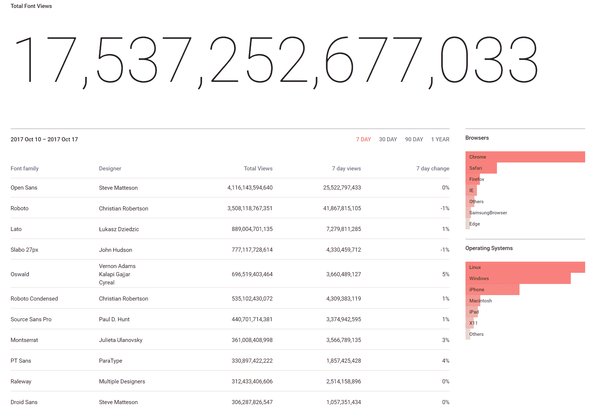

# 关于在 WordPress 中托管本地字体的深入指南

> 原文：<https://kinsta.com/blog/local-fonts/>

当谈到在你的 WordPress 网站上托管和使用字体时，有很多不同的选择。你可以把它们放在本地，你可以使用谷歌字体(现在大多数主题都集成了谷歌字体)，或者使用另一个第三方服务，比如 Adobe 字体。今天，我们想探究一下为什么在 WordPress 中托管本地字体会有优势。你不仅可以有更多的 HTML 字体选择，有时还会有 T2 的性能优势。查看我们下面关于如何在本地托管你的优质字体以及来自谷歌字体的任何[字体家族](https://kinsta.com/blog/best-programming-fonts/)的深入教程。

*   [什么是网页字体？](#web-fonts)
*   [托管本地字体 vs 第三方](#local-fonts-vs-3rd-party)
*   [如何在 WordPress 中托管本地字体](#host-local-fonts-wordpress)

## 什么是网页字体？

当你浏览某人的 WordPress 网站时，你会看到两种基本字体，[网页安全字体](https://kinsta.com/blog/web-safe-fonts/)或网页字体。或者他们也可以使用两者的混合物。

建议阅读:[如何在 WordPress](https://kinsta.com/blog/how-to-change-font-in-wordpress/) 中改变字体。

*   **网页安全字体**是预装在设备或操作系统上的字体。网页安全字体的一些例子包括 Arial、Times New Roman 和 Courier New 以及 serif、sans-serif(参见[现代字体](https://kinsta.com/blog/modern-fonts/))和 monospace 等通用字体系列。这些都是你见过很多年的字体。查看[网页安全字体的完整列表](https://kinsta.com/blog/web-safe-fonts/)。
*   **网页字体**是没有预装在设备上的字体，必须由用户的浏览器下载后才能显示。web 字体的一些例子包括 Google 的 Open Sans 和 Roboto 字体，以及 Adobe Fonts 公司流行的 Proxima Nova 字体。

Google Fonts 是一个开源的字体目录，在过去的几年里被广泛使用。据 BuiltWith 称，排名前 10，000 的网站中有超过 45%在其网站上使用谷歌字体。如果我们看看[谷歌字体分析](https://fonts.google.com/analytics)，我们可以看到他们已经有超过 17000 万次的浏览。太多了！Open Sans 和 Roboto 是他们使用最广泛的两个字体系列，Roboto 在过去的一年中增长了 77%。我们有一个关于最好的谷歌字体的帖子，一定要看看: [15 种最好的谷歌字体。](https://kinsta.com/blog/best-google-fonts/)

谷歌字体统计

## 托管本地字体与第三方

在我们深入本教程之前，了解托管本地字体和简单使用第三方服务之间的一些优缺点是很重要的。本地托管字体意味着你实际上在你自己的服务器上有字体文件(或者复制到你的 [CDN](https://kinsta.com/blog/wordpress-cdn/) 中，你也可以用它来管理你所有的其他资产)。而如果您使用第三方字体，如 Google 字体或 Adobe 字体，您只是通过链接到外部资源来包含这些字体。

> Kinsta 把我宠坏了，所以我现在要求每个供应商都提供这样的服务。我们还试图通过我们的 SaaS 工具支持达到这一水平。
> 
> <footer class="wp-block-kinsta-client-quote__footer">
> 
> 
> 
> <cite class="wp-block-kinsta-client-quote__cite">Suganthan Mohanadasan from @Suganthanmn</cite></footer>

[View plans](https://kinsta.com/plans/)

### 本地字体的优势

#### 1.更广泛的字体选择

使用本地字体的一个巨大优势是你有更广泛的字体选择！虽然 Google Fonts 和 Adobe Fonts 等第三方服务拥有庞大的库，但它们无法与高级字体商店相比，在高级字体商店中，您可以购买任何您想要的高级 web 字体并将其放在您的网站上。实际上，我们将在下面的教程中使用一种高级字体，你无法从任何第三方服务中获得这种字体。

#### 2.可以更好地整合

由于有更多的字体可供选择，本地托管这些字体可以让你选择一种能够更好地与你的品牌整合的字体，以保持整个网站的一致性。这完全取决于你的设计需求和偏好。

#### 3.不必依赖第三方服务

当你在本地托管字体时，**你不必依赖第三方服务**或他们的服务器。众所周知，Adobe Fonts(以前的 Typekit)等服务会下降，这反过来会让你看起来很糟糕。对 WordPress 站点的依赖越少越好。

> 当[https://t.co/Kde0okKlP0](https://t.co/Kde0okKlP0)停机时，网络停止工作[#海关](https://twitter.com/hashtag/customfontssuck?src=hash&ref_src=twsrc%5Etfw) [#第三方](https://twitter.com/hashtag/3rdpartyjs?src=hash&ref_src=twsrc%5Etfw)
> 
> —马克·⛔️🐝(@ markhealey)[2015 年 11 月 17 日](https://twitter.com/markhealey/status/666484210090176513?ref_src=twsrc%5Etfw)