# 如何在 WordPress 中创建优秀的长篇文章

> 原文：<https://kinsta.com/blog/long-form-articles/>

人们会在不到一秒钟的时间内形成对你的第一印象，甚至是对你的公司的第一印象。吓人。谢天谢地，在线文章有更多的回旋余地。大多数网页都有不到一分钟的[时间让访问者留下或离开。](https://www.crazyegg.com/blog/why-users-leave-a-website/)

但时间还是不多。如果你有不到 60 秒的时间来说服一个新用户你值得他们点击和分享，你最好简短明了，对吗？事实上，不是。事实证明，**越短并不总是越好**。如果你想在内容的海洋中脱颖而出，并让用户停留在你的页面上，长篇文章是一个不错的选择。👍

## 什么是长篇文章？

长篇文章指的是比你的普通文章更长的内容。虽然标准的文章长度在 1100 字左右，但长篇文章通常至少 2000 字，通常超过 2500 字。长篇文章是关于讲故事和吸引读者的。

Support

与标准的 500 字帖子相比，那些更有内涵、更有深度的文章通常更有趣、更吸引人、更值得分享。另外，它们很容易被翻译成常青树材料。长篇内容帮助一名营销人员在一年内为四个受众差异极大的网站吸引了近[25 万次访问](https://www.milesanthonysmith.com/blog/evergreen-content-long-form-content#case)。谈 SEO 牛逼。

但长篇内容不仅仅是营销人员的专利。如果你有一个网站，你有潜力用一篇好文章赚钱。而且，如果你使用 WordPress，创建一些真正的精彩内容是非常容易的。在本指南中，我们将讨论什么是长篇文章，为什么你应该写它们，以及你可以用来充分利用你的网站的第一印象的工具。

长篇内容适合所有人吗？不，大多数人会从给长篇文章一个机会中受益。如果有的话，我们强烈建议你在你的网站上测试长篇文章，看看会发生什么。

*   [钻研长篇文章](#long-form-articles)
*   [长篇文章的好处](#long-form-articles-benefits)
*   [长篇文章对搜索引擎优化有巨大的影响](#long-form-articles-seo)
*   7 个 WordPress 友好的工具和插件
*   [2 个长长的爱的主题](#long-form-wordpress-themes)

## 深入研究长篇文章

在最基本的层面上，与内容相关的术语“长格式”指的是比典型的普通帖子更长的书面文章和博客帖子。虽然如今标准的帖子长度似乎徘徊在 1100 字左右，但长篇阅读通常至少是 2000 字，而且往往超过 2500 字以上，然而，[内容长度](https://kinsta.com/blog/content-length/)并不总是最重要的因素。

> 需要在这里大声喊出来。Kinsta 太神奇了，我用它做我的个人网站。支持是迅速和杰出的，他们的服务器是 WordPress 最快的。
> 
> <footer class="wp-block-kinsta-client-quote__footer">
> 
> 
> 
> <cite class="wp-block-kinsta-client-quote__cite">Phillip Stemann</cite></footer>

[View plans](https://kinsta.com/plans/)

长篇写作已经成为一种趋势，这在很大程度上要归功于像 Medium.com 这样的网站，这是由推特联合创始人比兹·斯通和伊万·威廉姆斯创办的博客平台。虽然该网站没有发明长篇内容，但它确实将长篇文章放在了地图上，因为它与数字空间有关，并如何转化为更大的参与。

如果此时你还在挠头，不要担心。是什么让长篇大论奏效，这是值得思考的令人困惑的事情。毕竟，过去很多网站都有很长的内容。长篇大论的抨击对互联网来说并不陌生，最好的帖子大约 500 字的想法是从某个地方开始的，对吗？

是的，较短的字数在相当长的一段时间里被偏爱是有原因的。这里的想法是，注意力持续时间很短，潜在客户很忙，他们没有时间仔细阅读一页又一页的文本。他们宁愿对发生的事情有一个简单的了解，然后继续前进。不错，这听起来很有逻辑，但内容写作所呈现的公式化本质恰恰是长篇小说所反对的。

长篇内容是将创意带回内容营销的集中努力。**这是关于讲故事和吸引读者。那种事情很难定义。以《福布斯》撰稿人约书亚·斯泰姆勒为例，他[在一家设计公司 Teehan+Lax 的网站上阅读了一篇冗长的案例研究](http://www.forbes.com/sites/joshsteimle/2014/07/15/why-long-form-content-marketing-works-and-why-it-doesnt/)，这让他非常着迷——尽管他通常不阅读案例研究。这个漫长的案例研究到底是什么吸引了他？是的，它讲述了一个故事，但是 Steimle 说不止如此。答案？这项研究是为真实的人写的，最重要的是，这是 Teehan+Lax 团队想写和读的东西。**

虽然听起来不科学，但人类的方法却是如此有效。正如 Steimle 所写:

> …如果你创作了自己喜欢的内容，其他人可能也会喜欢。

## 长篇文章的好处

重要的是要明白长篇文章不仅仅是单词墙。因此，我们将深入了解下面的一些好处。

平均而言，2017 年的平均博文数量[略低于 1100 字](https://getcodeless.com/blogging-statistics/)。这个数字可能会继续攀升。与 2014 年相比，去年有六倍多的博客发布了超过 2000 字的帖子。

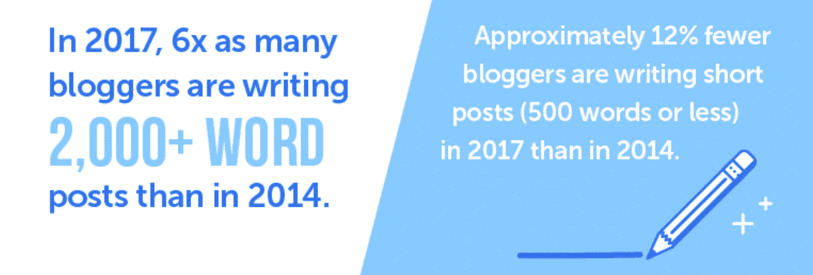

Word count in posts (Image source: [CoSchedule](https://coschedule.com/blog/how-long-should-a-blog-post-be/))

这是否意味着一般的文章现在被认为是长篇？看你问谁了。虽然很多人会说任何超过 1200 字的都属于长格式范畴，但这并不意味着它就是长格式。因为内容的[长度只有画面的一半。另一半在它的——你猜对了——**形式**。](https://kinsta.com/blog/content-length/)

### 视觉上吸引人

围绕长格式内容的许多负面观点强调了“天哪，这么多单词！”部分。但是长格式内容不仅仅是长。它还塞满了视觉刺激、副标题和简单的导航提示，以使[信息丰富但易于理解](https://commonsensemarketing.com.au/websites/long-form-content/)。其他可能破坏内容的东西包括 Tweet boxes(如下图所示)甚至是一个目录。

这些小小的接触对一部长篇作品的接受产生了巨大而累积的影响。增加视觉刺激有特别大的影响。将[视觉内容](https://kinsta.com/blog/visual-content-strategy/)融入高质量、有思想的文章中，将你的文字墙转变成令人敬畏、引人入胜的障碍课程。

添加图像也极大地增加了内容的覆盖范围。只需在文章中添加一张图片，你就可以获得高达 94%的份额。

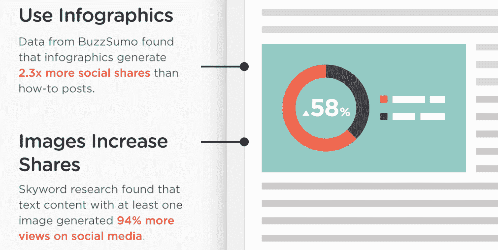

Images increase shares (Image source: [Backlinko](https://backlinko.com/viral-content))

但是加的越多越好。Canva 和 BuzzSumo 研究了超过 1 亿篇文章的数据。顶级演员都有一个共同点:形象无处不在。

他们发现每 75-100 个单词添加一张图片会获得最多的分享。每隔 125-150 个单词放置一张图片紧随其后。

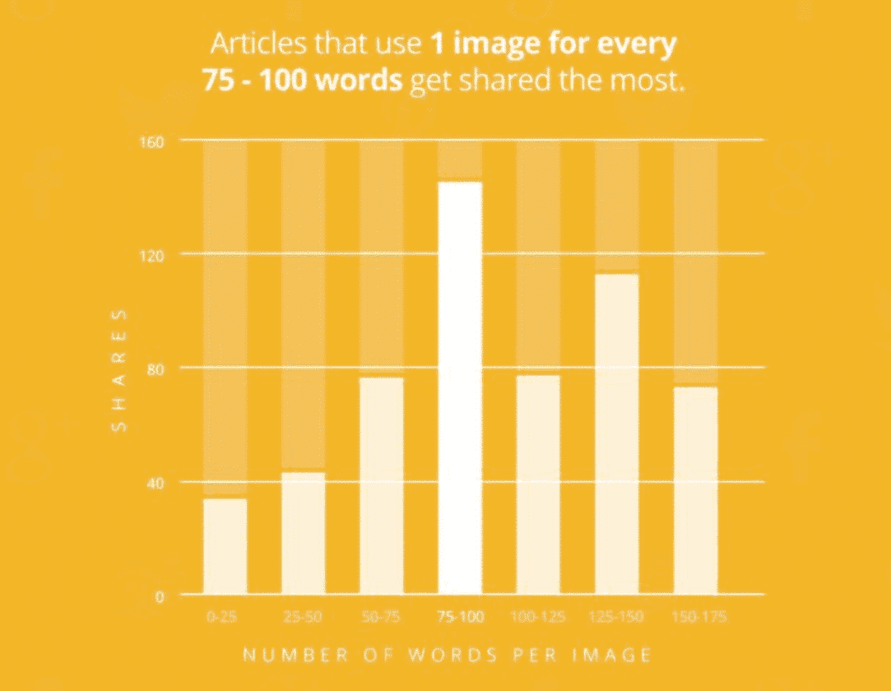

Words per image (Image source: [Canva](https://www.canva.com/learn/blog-traffic/))

这意味着一篇伟大的长篇文章仅仅有 1200 或更多的单词是不够的。还需要 10 到 12 张图片来拆分文案，防止文案成为文字墙。这就是它的形状，也是它区别于 20 世纪 90 年代早期大英百科全书系列的原因。

所以，如果你致力于创作长篇文章，确保你不会停留在字数上。添加一些视觉效果来保持内容的可读性*和*的共享性。

有时，长篇文章的内容甚至不包括在主博客提要中。相反，它链接到博客，并位于自己的静态页面上。一个很好的例子就是我们的 [Kinsta 学习部分](https://kinsta.com/learn/)。长篇内容通常能够经受住时间的考验**。**

[Long-form content is more often than not designed to stand the test of time. ⏳Click to Tweet](https://twitter.com/intent/tweet?url=https%3A%2F%2Fbit.ly%2F2BCfvuK&via=kinsta&text=Long-form+content+is+more+often+than+not+designed+to+stand+the+test+of+time.+%E2%8F%B3&hashtags=contentmarketing%2CSEO)

### 更高的质量

长格式的**允许你创建更好的内容**。有多少次，你看到一个承诺是“全面指导”的帖子，却发现它只是略述了一个主题？是啊，真令人沮丧。坚持传统的博文长度也是不可避免的。长篇内容可以让你更深入地研究一个主题，包括研究和采访反馈。它给了你一个彻底的机会，仅此一点就能产生更高质量的内容。

## 长篇文章有巨大的搜索引擎优化影响

现在，随着“什么”的方式，让我们谈论“为什么”你为什么要写长篇文章？你喜欢免费的搜索引擎流量吗？

当然，这个问题是一个陷阱。谁不喜欢免费流量？所以，让我们简单地说:如果你想让你的有机范围扩大，增加你的单词量。**谷歌喜欢长篇内容**。

根据 HubSpot 的研究，你的文章越长，你网站的反向链接就越多。

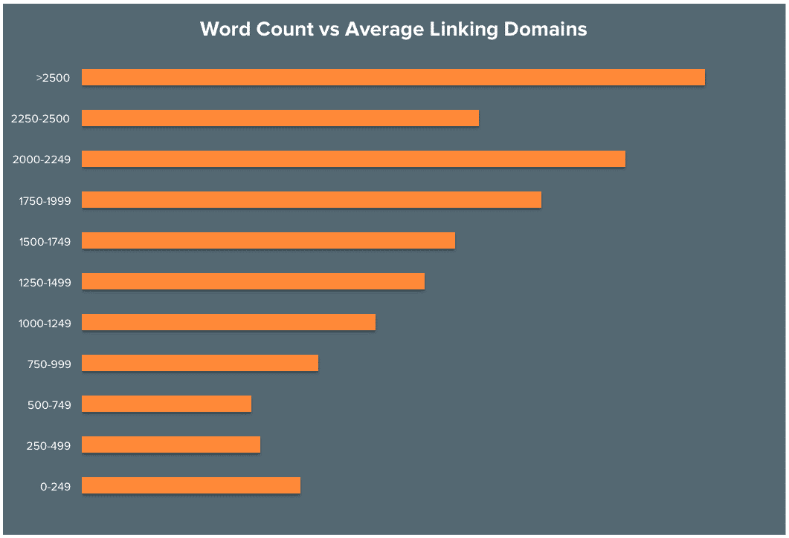

Word count vs linking domains (Image source: [Hubspot](https://blog.hubspot.com/marketing/seo-social-media-study))

这为你的排名创造了滚雪球效应。你的内容获得的链接越多(尤其是如果它们来自拥有大量域名权威的网站)，你的整体 T2 站外搜索引擎优化就变得越强。

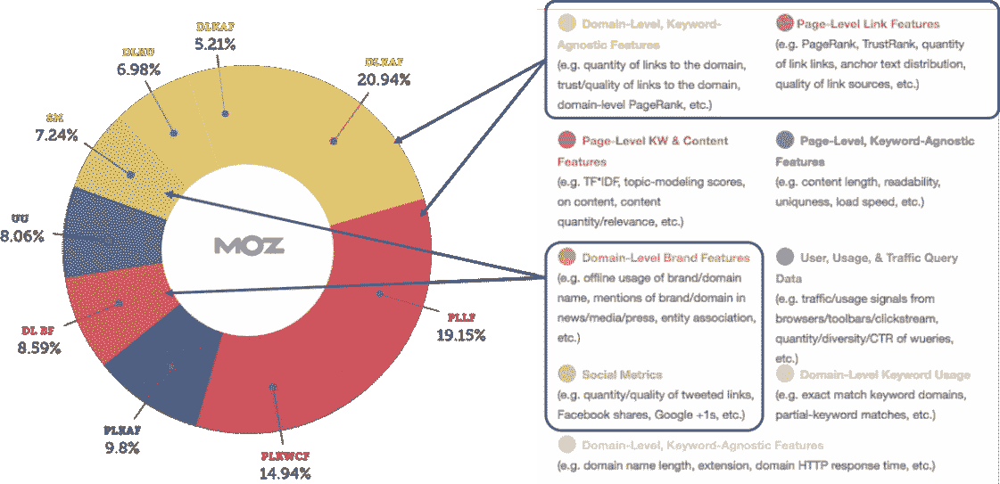

Off-site SEO (Image source: [Moz](https://moz.com/learn/seo/off-site-seo))

这也是为什么越长的内容在搜索引擎结果页面上的排名越靠前的原因之一。在由[协同计划](http://coschedule.com/blog/long-form-content/)进行的一项研究中，他们也发现了同样的结果；长格式内容的平均排名高于短页面。

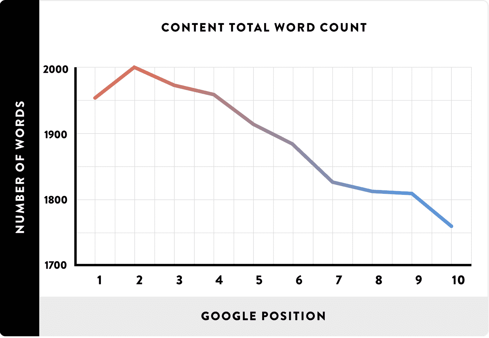

Word count vs Google position ([Backlinko](https://backlinko.com/search-engine-ranking))

搜索引擎优化专业机构 CanIRank 希望了解这种明显的滚雪球效应。因此，他们调查了内容长度和有机等级之间的相关性。他们的初步结果与其他研究惊人地相似。

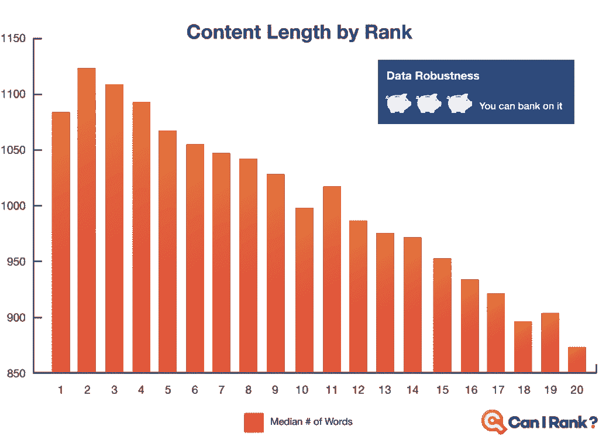

Content length vs rank (Image source: Can I Rank?)

该团队深入挖掘数据，寻找内容长度和搜索引擎排名之间明显关系的潜在解释。他们推测以下因素可能是原因:

*   拥有更多域权限的大型网站倾向于发布更长的内容。
*   内容越长关键词优化越多。
*   更长的内容赚取更多的外部链接。
*   专家内容创作者倾向于写更多相关的材料。

尽管如此，即使控制了这些因素，他们也无法解释内容长度和排名之间的明显联系。这让卡尼兰克得出结论，“……因此，谷歌直接在他们的算法中奖励较长的内容是合理的(尽管未经证实)，尽管效果相当小。”

但是，即使这种关系背后的“原因”还不清楚，但“结果”是清楚的。仅仅在你的内容策略中增加 1000 字的文章就能帮助你走得更远。HOTH 与一个新客户一起部署了这一策略，并看到了有机流量的惊人增长。

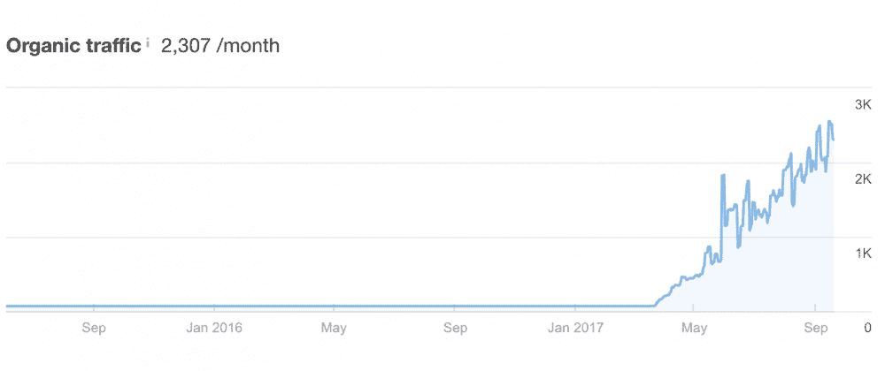

Content length impact on traffic (Image source: The HOTH)

这就把我们带回到了本节最初的问题:你喜欢免费的有机交通吗？如果是这样，那就扩充你的内容，提高你的字数。你的 SEO 会感谢你，随着越来越多的用户找到你的网站，你的底线也会表现出同样的感激。

现在，我们已经讨论了长篇文章背后的“是什么”和“为什么”这就把我们带到了内容三明治的核心:如何做。

## 7 个 WordPress 友好的工具和插件帮助长表单成功

优化内容对于获得最大收益至关重要。尼尔·帕特尔使用了这个策略，并取得了巨大的成功。2017 年，在 [MarketMuse 的内容优化软件](http://blog.marketmuse.com/how-marketmuse-helped-neil-patel-double-his-traffic-and-rankings?utm_source=Newsletter&utm_medium=Email&utm_campaign=NPLaunch&hsCtaTracking=39b58dc7-0505-4122-bbf7-5aa456365a1c%7Ce6a4a8c3-5c4e-48fb-94e9-93868d81e24f)的帮助下，他已经庞大的流量和排名翻了一番。

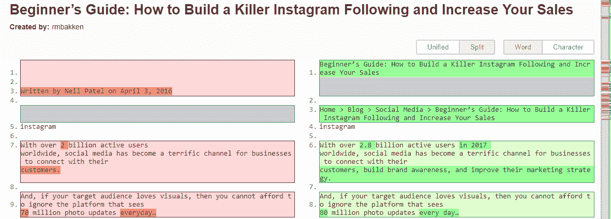

Content optimization (Image source: [Diffchecker](https://www.diffchecker.com/ptq58Tiw))

通过改变小标题等小事情，加倍他的写作字数，并更新他的内容，他的网站在一年的时间内获得了近 100，000 个关键词的排名和两倍的月流量。

而且，尽管这项工作对于他的网站规模来说仍然是巨大的，但这些变化本身很容易在你自己身上复制。如果你决定向你的站点添加长格式的内容，你一定要有合适的工具。这里有一个第三方工具和插件的列表，它们可以把你的长篇内容从单调乏味变成普利策式的精彩。或者更接近它。)

### 1.使用 Evernote 将你的想法保存在一个地方

把 Evernote 想象成一个你永远不需要填充的记事本。你可以通过 Evernote 保存录音、手写笔记、任务列表、屏幕帽，甚至整个网页。

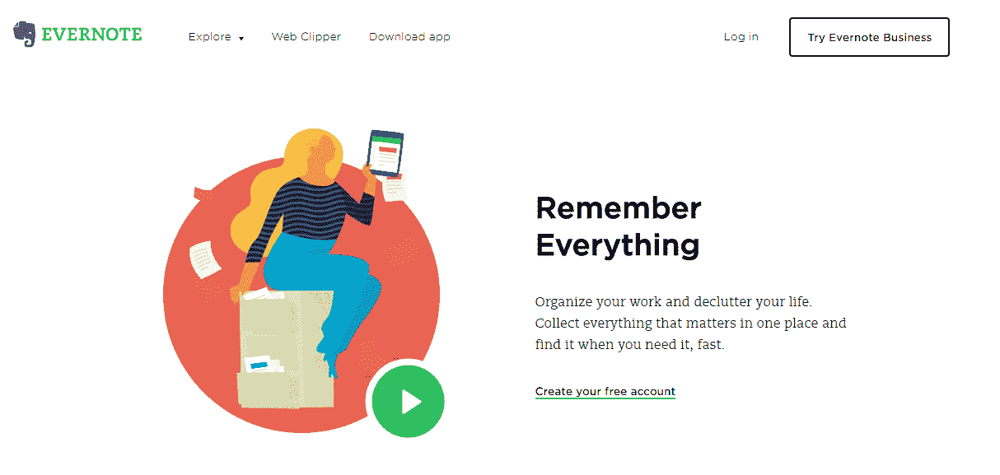

Evernote

它可以在你的不同设备上同步你的所有信息，这使得这个平台成为你的长期武器库的一个特别的工具(并且是一个重要的生产力助推器)。在另一个网站上看到一篇文章的想法？将它保存到 Evernote 的数字笔记本中。遇到一封很棒的电子邮件，可以作为营销技巧的范例？过会儿贴上标签。

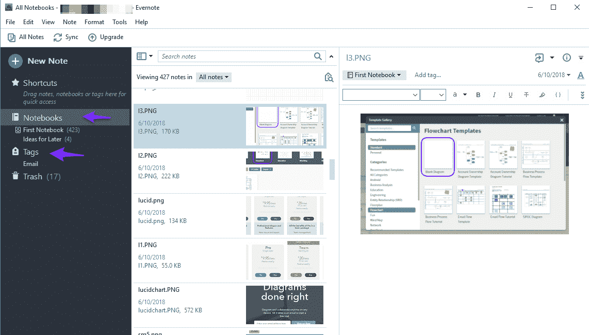

Organized Evernote

如果你独自工作，[基本计划](https://evernote.com/basic)是免费的，允许你每月上传高达 60 MB 的新笔记。它还有许多其他功能:

*   在两个设备间同步。
*   剪辑网页，图像，PDF 文件。
*   搜索图像中的文本。
*   与朋友和同事分享笔记。
*   使用密码锁定移动应用程序。

有团队？Evernote 的[商业包](https://evernote.com/business)提供了更多的灵活性和选择。CoSchedule 是我们稍后将谈到的公司之一，它使用 Evernote 来保持他们的团队[有组织，并在灾难发生时保持一致](https://evernote.com/business/customer-stories/coschedule)。CoSchedule 的公共关系主管 Eric Piela 说:

> 每个过程都有记录。如果任何系统出现故障，我们都有快速恢复的信息。这些都可以在笔记本上找到。

因此，如果你正努力把你的团队或文章想法放在一个地方，Evernote 绝对是你寻找和保存长篇研究的必备工具。另外，[整合 Evernote 和 WordPress](https://www.elegantthemes.com/blog/tips-tricks/ways-you-can-use-evernote-to-help-run-your-wordpress-business) 也不在话下。但是不要只相信我们的话。现在让我们来快速浏览一下 Evernote。

首先，去 [Evernote](https://evernote.com/) 用你的电子邮件或谷歌账户注册一个账户。

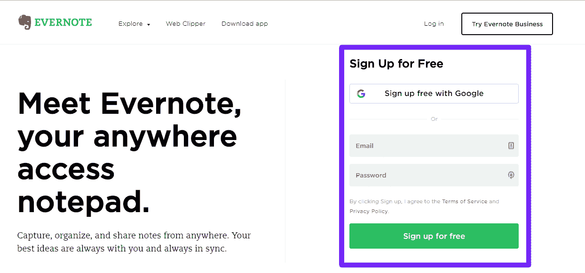

Evernote sign up

如果你使用谷歌账户，你可以登陆这个屏幕。如果是，请单击绿色的“创建帐户”按钮继续。

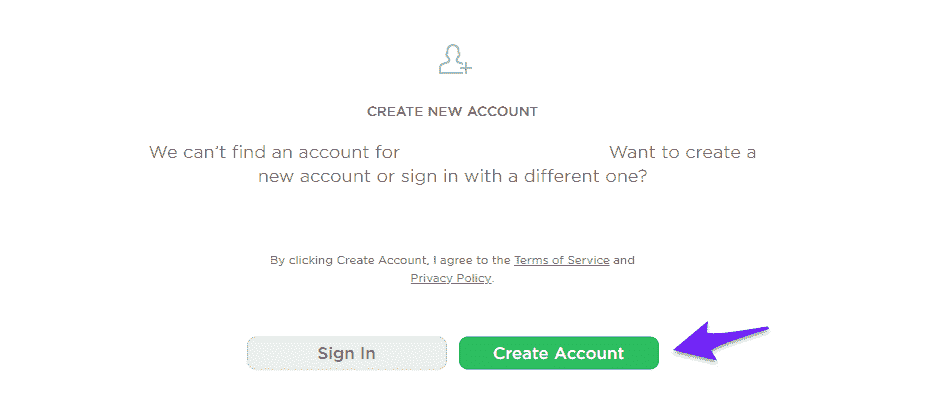

Create Evernote account

这将带您进入帐户设置的下一步。因为我们使用 Evernote 来保存我们文章的研究，所以选择右边的选项“组织内容”

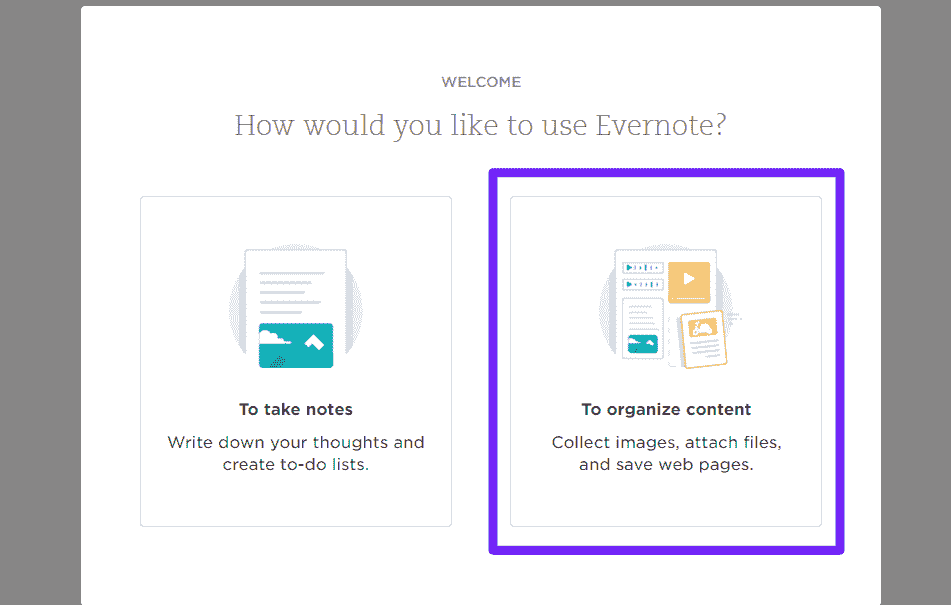

Evernote organize content

接下来，选择“获取 Web 裁剪器”

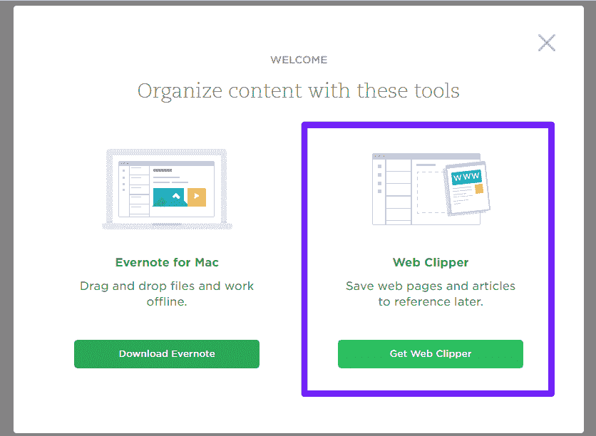

Evernote web clipper

如果您想使用桌面应用程序，您也可以选择左边的选项来下载并安装它。这两个选项都将在新标签页中打开。我们一会儿会回到这个标签，所以现在让它打开。

## 注册订阅时事通讯

### 想知道我们是怎么让流量增长超过 1000%的吗？

加入 20，000 多名获得我们每周时事通讯和内部消息的人的行列吧！

[Subscribe Now](#newsletter)

由于我们使用的是 Chrome，这是我们下一个屏幕的默认选项。Evernote 也是 ie 7+，Opera，微软 Edge 和 Firefox 的扩展版本。

Google Chrome Evernote web clipper

继续并在您选择的浏览器上完成安装。完成后，返回最初的欢迎屏幕，并使用右上角的“x”按钮关闭它。这是您的默认仪表板的外观。现在它有点简单，但是我们将在下一步中改变它。单击或最小化“入门”选项卡。

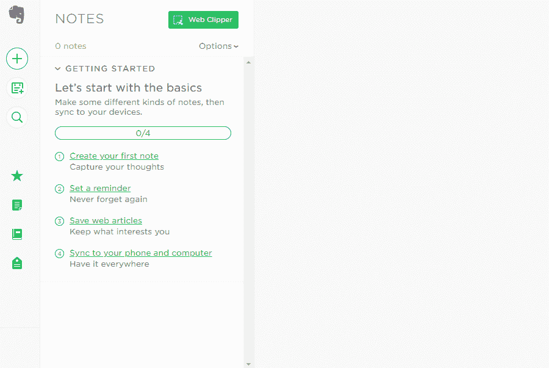

Evernote get started

现在，让我们做一些研究，并保存一个网页。举个例子，我们正在为最近的[网站可用性指南](https://kinsta.com/blog/website-usability-testing/)写一个后续。所以我们转向谷歌，输入我的[关键词](https://kinsta.com/blog/keyword-research/)(“用户体验提示”)，然后找到我们喜欢的页面。

我们选定了" [7 个技巧来改善你的 UX 设计实践](https://www.interaction-design.org/literature/article/7-tips-to-improve-your-ux-design-practice)。当你找到你想保存的东西时，点击右上角的 Evernote 图标。

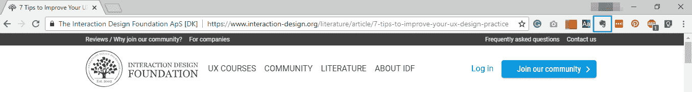

Evernote icon in Chrome

这将触发一个下拉菜单，使您能够以几种不同的方式保存页面:

*   文章作为一个整体(与网站的格式)
*   文章的简化版本
*   整版的铃声和汽笛声
*   一个书签
*   截图

现在，假设我们希望能够准确地引用这一页，选择第三个选项:“整页”当它创建和同步您的剪辑时，您会在右上角看到一个指示器。

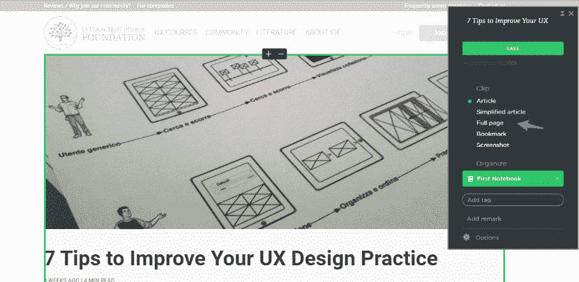

Evernote full page

完成后，回到 Evernote 仪表盘，选择倒数第二个图标来访问你的笔记本。你应该会看到你的完全剪辑的网页等着你。

Evernote clip

现在你知道了。无论晴雨，您现在都可以参考该网页及其所有导航和设计功能，无论原始来源发生了什么变化。其他一些你可能也想试试的替代工具有 [Google Keep](https://kinsta.com/blog/google-workspace/#google-keep) 和 [Trello vs Asana](https://kinsta.com/blog/trello-vs-asana/) 。

但是有什么比一个永远不会丢的笔记本更好呢？它会在你工作时自动修正。为此，转向我们的下一个工具。

### 2.让语法让你的写作更流畅，更聪明

如果你曾经试着写一篇文章，后来发现你的非常有用的文字处理器做出了行政决定，将“教授”改为“拉紧”，你会喜欢上[的语法](https://www.grammarly.com/)。

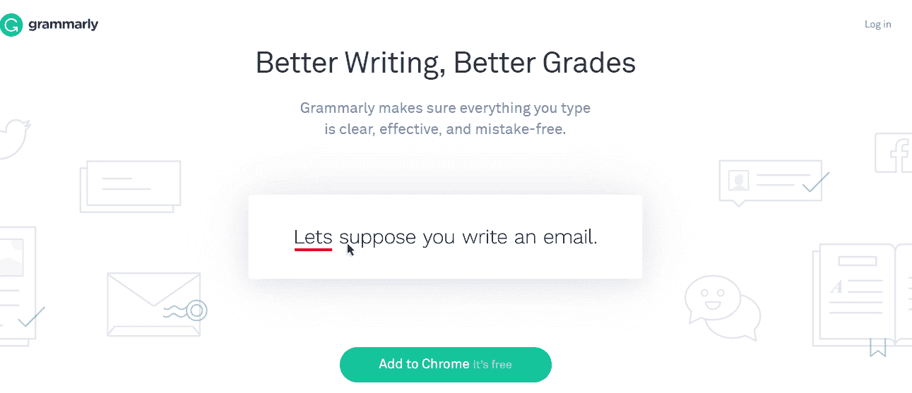

Grammarly

部分个人编辑器，部分写作助手，部分动机教练，Grammarly 是一个即插即用的浏览器扩展，可以与大多数文本框无缝集成。这意味着，与 [Jetpack](https://kinsta.com/knowledgebase/wordpress-jetpack/) 不同，你不必安装或启用 Grammarly 作为插件，在你打字时直接校对你的帖子。

真正让 Grammarly 从其他文字处理器中脱颖而出的是它的上下文智能。如果像“绷紧”和“教授”这样的同音词曾经给你带来麻烦，Grammarly 可以分析文本并[为潜在的混淆单词或风格错误做出智能的相关建议](https://www.grammarly.com/faq#toc1)。

不要把你写作的质量取决于运气或无效的文字处理器。尤其是长篇文章，无论你是多么优秀的作家，你肯定会错过一些东西。或者对于那些深夜写作的人来说。😉将语法添加到您的浏览器中进行[校样，并在工作时润色您的副本](https://kinsta.com/blog/proofreading-tips/)。它是免费的，快速的，易于安装。

当你完成了你的作品的来源和校对，使用这第三个工具，通过检查你的可读性和优化你的关键字来对它进行最后的润色。

想要更多的工具和建议，你可以看看我们的另一篇文章:[写作的最佳语法检查工具](https://kinsta.com/blog/grammar-checker-tools/)。

### 3.用 Yoast SEO 优化你的内容

试图了解 SEO 的来龙去脉就像试图在午餐前坐上迪士尼乐园的每一趟车。蒙着眼睛拉着一车盗窃癖狐猴。

也就是说，即使你是 SEO 专家或专业的狐猴饲养员，得到一点帮助也不会有坏处。这就是 Yoast SEO 插件的用武之地。

Struggling with downtime and WordPress problems? Kinsta is the hosting solution designed to save you time! [Check out our features](https://kinsta.com/features/)

Yoast SEO WordPress plugin

不要仅仅依靠你的字数来吸引有机流量。使用这个插件来分析和标记你的关键词密度，[元描述](https://kinsta.com/blog/meta-description-wordpress/)，被动语态，无关注链接等等。

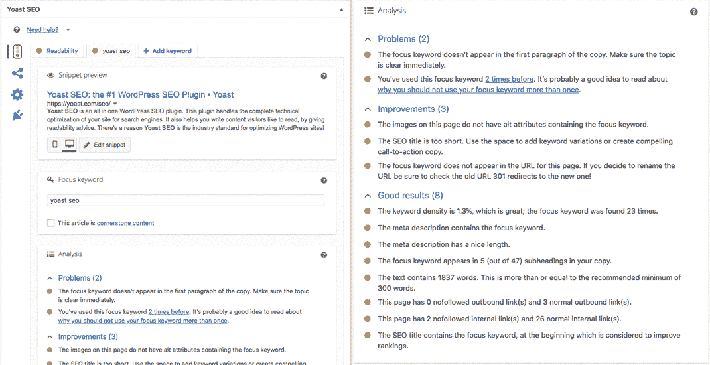

Yoast analyzer

这个插件经常出现在最佳 WordPress 插件的“十佳”名单中是有原因的。你可以在这里查看我们详细的安装和充分利用 Yoast SEO 的分步指南。

因此，如果你还没有使用它来做一般的搜索引擎优化，那么就把它添加到你的网站上，给你的内容一些急需的分析和优化帮助。看看这些你也可以使用的其他 [WordPress SEO 插件](https://kinsta.com/blog/best-seo-plugins-for-wordpress/)。

但是不要只是优化你的文案。忘记你的图片会对你的用户和排名产生灾难性的影响。

### 4.通过图像优化让您的图像更加流畅

根据 [HTTP Archive](http://httparchive.org/reports/state-of-images?start=2017_07_01&end=latest) 的数据，截至 2018 年 7 月，图片平均占整个网页权重的 **43%。对于长篇文章，它很可能比这还要高！**

所以，如果你的文章充满了视觉刺激，确保你的图片不会拖慢你的页面，弊大于利。没有适当优化的图像会使你的网页花费很长时间来加载。这对你的网站流量没有好处。

花 7 秒钟加载的页面很容易失去 30%的访问者。呀！

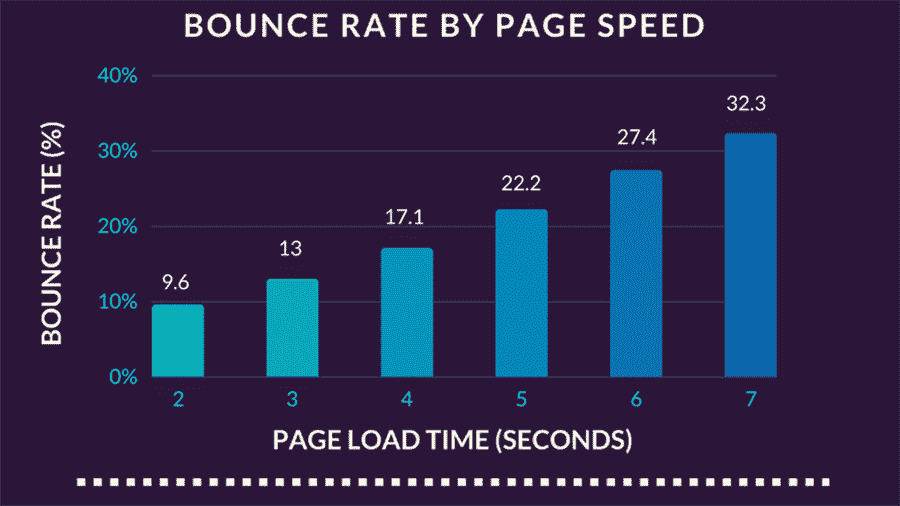

Bounce rate by page speed ([Section.io](https://www.section.io/blog/page-load-time-bounce-rate/))

就第一印象而言，长时间的加载对新访客来说是非常非常糟糕的。谢天谢地，这就是图像压缩插件的用武之地。你可以很容易地压缩你的图像而不牺牲它们的质量，这将使你的网页加载速度更快。

这里有几个我们推荐的 WordPress 图片压缩插件:

*   Imagify (这是我们在金斯塔使用的)
*   [短像素图像优化器](https://wordpress.org/plugins/shortpixel-image-optimiser/)
*   [Optimus 图像优化器](https://wordpress.org/plugins/optimus/)
*   [WP Smush](https://wordpress.org/plugins/wp-smushit/)
*   [EWWW 云](https://wordpress.org/plugins/ewww-image-optimizer-cloud/)

设置好插件后，它会自动优化你上传的所有内容。**重要提示:**上面提到的所有插件都在异地优化图片，因此在压缩过程中它们不会影响你的 WordPress 站点的性能。

对于你想知道但不敢问的关于图像优化的一切，请查看我们深入的[图像优化指南](https://kinsta.com/blog/optimize-images-for-web/)。

图像准备好了吗？现在你所需要的是一个“何时”和“何地”让你的长篇文章在路上展示。至于“何时”，请考虑尝试下一个工具。

### 5.用 CoSchedule 创建编辑日历

69%进行内容营销的企业依靠编辑日历来保持组织有序。📔无论你是作为一个独立创业者还是有一个小团队来发布你的内容，一个编辑日历可以帮助你规划何时、何地以及如何发布你的内容。

Asana 和 [Trello](https://trello.com) 都是流行的工具。这里有一个特雷罗日历快速窥视。

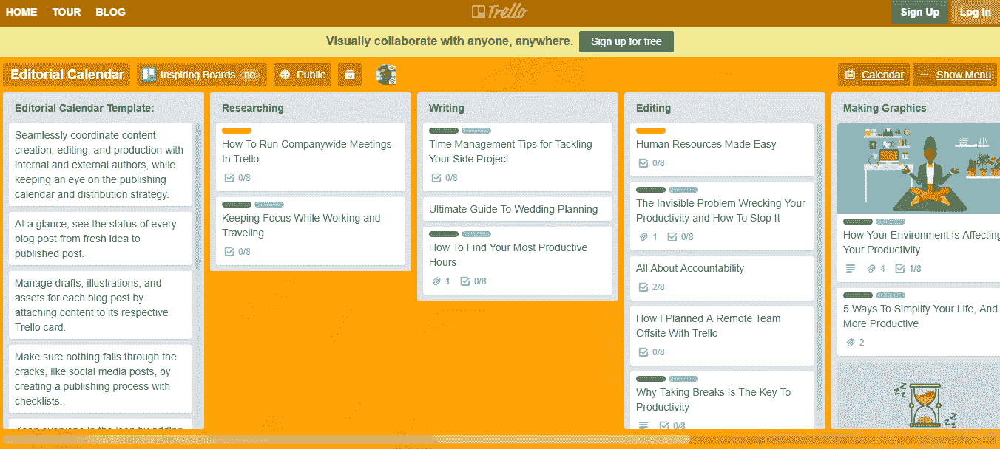

Trello editorial calendar (Image source: [Trello](https://trello.com/b/UQk1wa4a/editorial-calendar))

这是类似的阿萨纳日历。

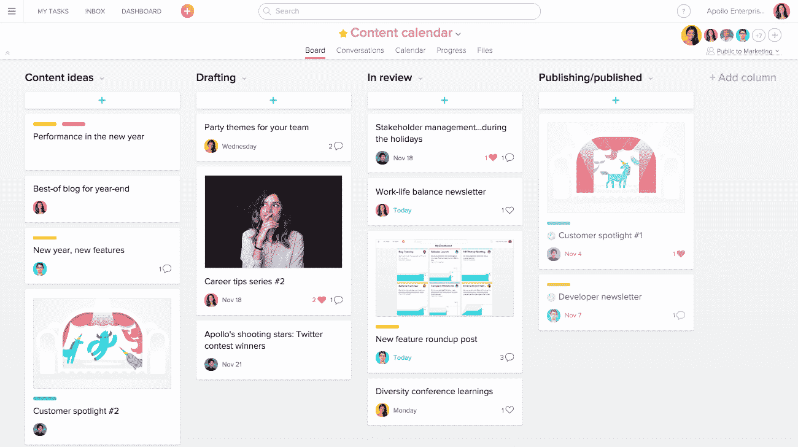

Asana editorial calendar (Image source: [Asana](https://asana.com/guide/examples/marketing/editorial-calendar))

这两个平台都很强大，并提供免费计划来满足大多数小型企业的需求。然而，它们都无法与[协同日程](https://coschedule.com/)相提并论，原因很简单:协同日程有一个本地的、[官方插件](https://wordpress.org/plugins/coschedule-by-todaymade/)，它直接与 WordPress 绑定。

这是它在你的 WordPress 仪表盘上的样子。

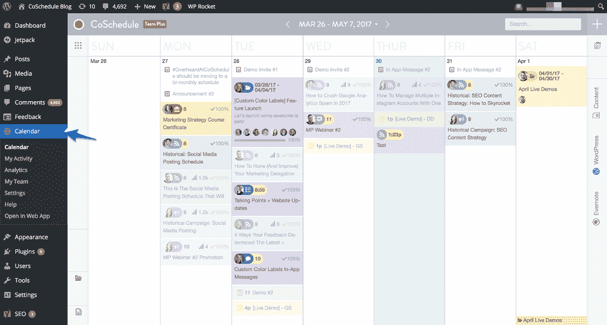

CoSchedule WordPress editorial calendar

整洁，对不对？此外，CoSchedule 的插件还附带了其他功能，比如它的[世界级标题分析器](https://kinsta.com/blog/headline-analyzer/#coschedule-headline-analyzer)，让你的文章尽可能吸引人。

### 6.目录

当处理冗长的内容时，你可以通过提供一个方便的目录来帮助你的读者。多亏了[简易目录插件](https://wordpress.org/plugins/easy-table-of-contents/)，这才成为可能。这是一个简单的解决方案，符合维基百科风格的格式，尽管它也可以通过定制 CSS 来满足您的需求。

[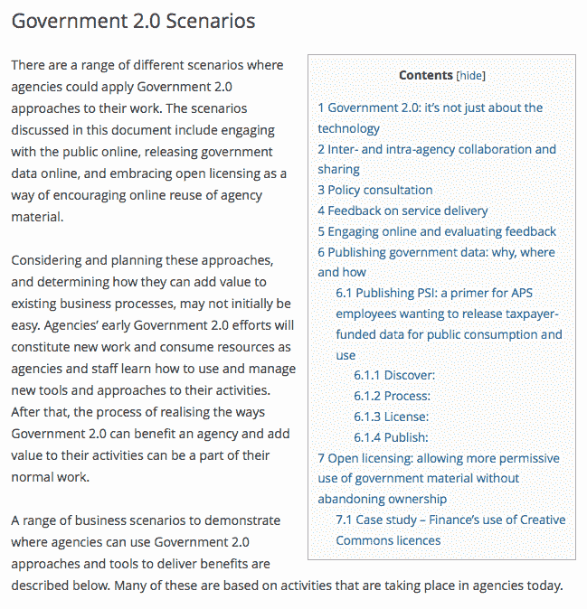](https://kinsta.com/wp-content/uploads/2014/10/table-of-contents-plus-1.png)

Table of contents

或者你可以手动创建一个目录，就像我们在博客上使用锚标签一样。

### 7.读后时间

如今，拥有长阅读量的网站有一个共同的趋势，那就是包含普通人阅读一篇文章的时间长度。使用[阅读时间 WP 插件](https://wordpress.org/plugins/reading-time-wp/)将它添加到你的站点。你可以用多种方式显示时间，让你的网站看起来更像媒体。双赢！

最后，让我们来看看一些令人敬畏的主题，它们让长篇内容轻而易举地展示出来。

## 2 个长格式的主题

如果你想在 WordPress 上创作出引人注目的长篇文章，你需要选择一个很棒的主题。这里有两个选项可以帮助你的内容吸引观众的注意力。当然，您可以创建任何主题的长篇文章，但这些文章完全是针对长篇内容构建的。

### 1.让你的作品闪耀类型学的光芒

恰如其名，[类型学](https://themeforest.net/item/typology-text-based-minimal-wordpress-blog-theme/19547842)是一个为写作做好准备的主题，它将你的文章放在基座上，让你的文字主宰页面。如果寻找特色图片的想法让你汗流浃背，这个主题非常适合你。它的特点是漂亮的布局，有或没有封面图片。

[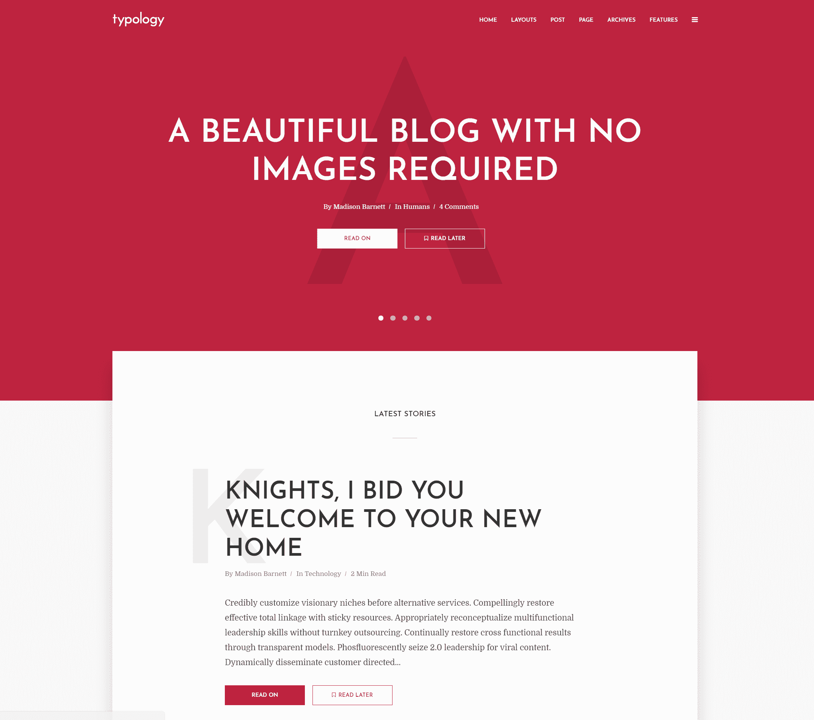](https://themeforest.net/item/typology-text-based-minimal-wordpress-blog-theme/19547842)

Typology WordPress theme

如果你包含了封面图片，你的文字仍然会占据中心位置。这个主题使用滚动效果来保持你的文本在用户注意的最前面。对于那些希望将长篇文章添加到其内容策略中，同时仍然享受无缝整合的好处的企业来说，类型学是理想的选择。而且，它完全移动响应。

《类型学》的平均评分为 4.96 分(5 颗星)，49 美元的价格对钱包来说也不算太贵。

### 2.保持它的简单和整洁

来自 Array 的 Typable 是一个极简主义者的梦想，被构建成一个方便的、以内容为中心的主题。它干净、明快，给你一流的留白构图。

除了漂亮简单的设计，这个主题很容易定制，非常适合展示较长的内容。

[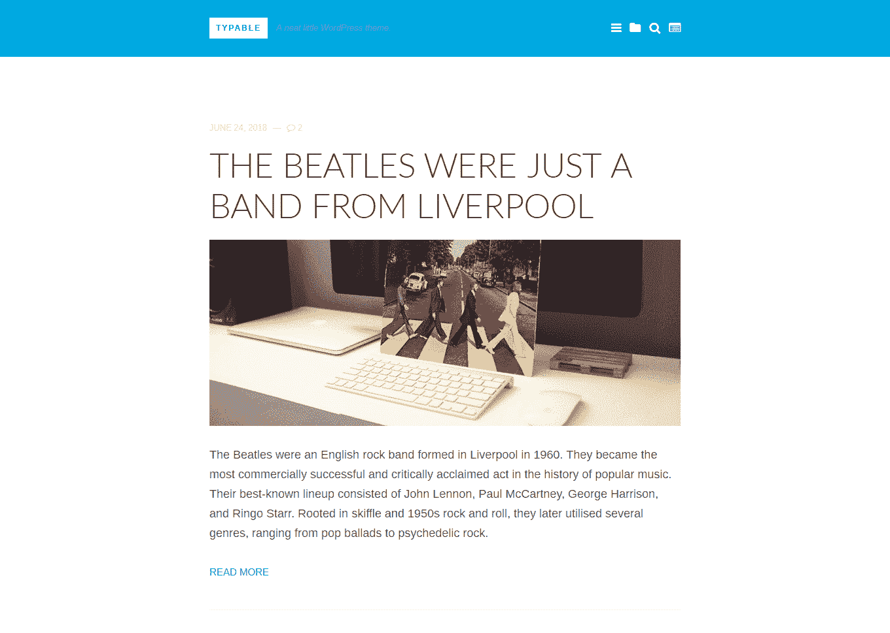](https://arraythemes.com/themes/typable-wordpress-theme/)

Typable WordPress theme

它有一个超级时尚的下拉导航菜单。凭借其平滑如丝的 AJAX 后期加载，这个主题开箱即用。如果你购买 Typable 作为独立产品，你将支付 49 美元。

## 摘要

太阳还没有落在矮柱子上。他们仍然有自己的位置。但是对长篇内容的旧禁令已经被大大解除了。新规则是这样的:如果你有话要说，尽可能多地说出来。基本上，不要让武断的指导方针决定你的内容的方向。相反，让你的内容成为你的向导。

[Don't let arbitrary guidelines dictate the direction of your content. ✍️ Instead, let the content be your guide.Click to Tweet](https://twitter.com/intent/tweet?url=https%3A%2F%2Fbit.ly%2F2BCfvuK&via=kinsta&text=Don%27t+let+arbitrary+guidelines+dictate+the+direction+of+your+content.+%E2%9C%8D%EF%B8%8F+Instead%2C+let+the+content+be+your+guide.&hashtags=contentmarketing%2Cblogging)

使用长篇文章让你自己更轻松，让你的用户更愉快。长篇文章不仅仅是大量的文字墙。如果他们觉得自己是一篇标准的博文，那他们就是标准的博文。副标题、视觉元素和简单导航都是这类内容的显著特征。

写更长文章的首要原因？[免费网络流量](https://kinsta.com/blog/how-to-drive-traffic-to-your-website/)和 SEO。字数和有机排名有很强的相关性。Evernote、Grammarly、Yoast SEO、图像优化插件和 CoSchedule 都是优秀的工具，可以添加到你的内容工具箱中，在 WordPress 上创建优秀的文章。

寻找一个能让你的内容说话的主题？如果你是极简主义者，那就选择类型学。如果你稍微靠近中心，Typable 是一个长期的最爱。但是如果你想要主要的多功能性，任何 WordPress 主题都可以。

记住，长篇文章很长，并不意味着它们一定很无聊。使用本文中的工具和技巧，让你的文章更流行，并保持搜索引擎优化友好。第一印象只会出现一次。做一个好的。有了这种心态，就不会出错。

如何在你的 WordPress 站点上实现长篇文章？你正在使用什么工具？到目前为止，你遇到什么困难了吗？我们希望在下面的评论中听到你所有的尝试和成功！

* * *

让你所有的[应用程序](https://kinsta.com/application-hosting/)、[数据库](https://kinsta.com/database-hosting/)和 [WordPress 网站](https://kinsta.com/wordpress-hosting/)在线并在一个屋檐下。我们功能丰富的高性能云平台包括:

*   在 MyKinsta 仪表盘中轻松设置和管理
*   24/7 专家支持
*   最好的谷歌云平台硬件和网络，由 Kubernetes 提供最大的可扩展性
*   面向速度和安全性的企业级 Cloudflare 集成
*   全球受众覆盖全球多达 35 个数据中心和 275 多个 pop

在第一个月使用托管的[应用程序或托管](https://kinsta.com/application-hosting/)的[数据库，您可以享受 20 美元的优惠，亲自测试一下。探索我们的](https://kinsta.com/database-hosting/)[计划](https://kinsta.com/plans/)或[与销售人员交谈](https://kinsta.com/contact-us/)以找到最适合您的方式。