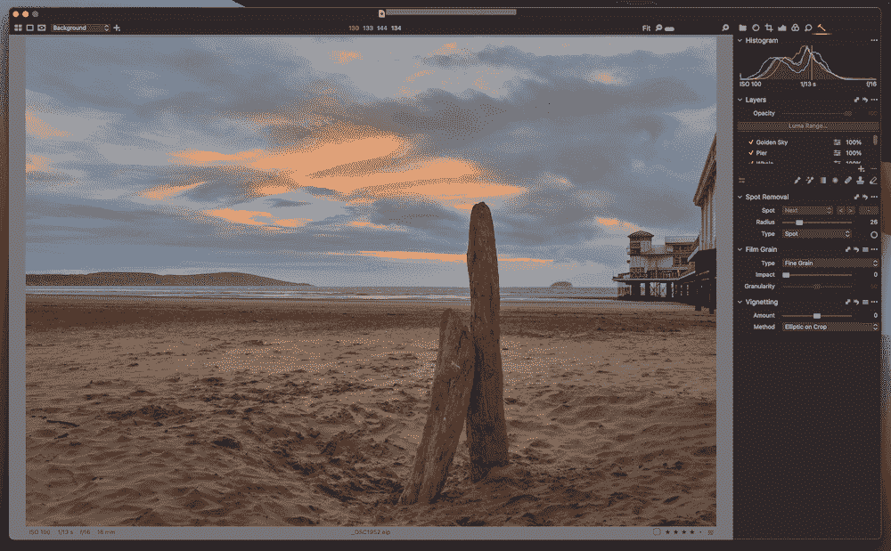
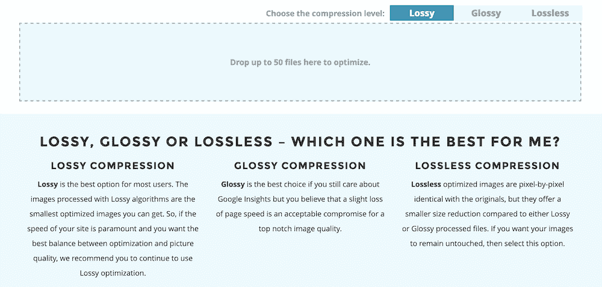
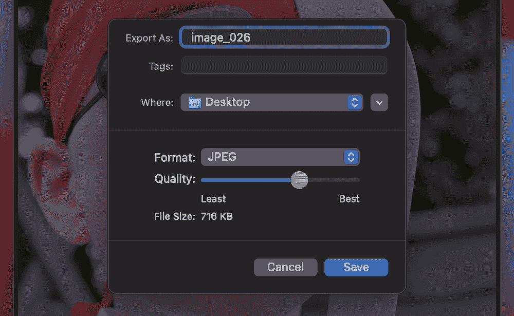
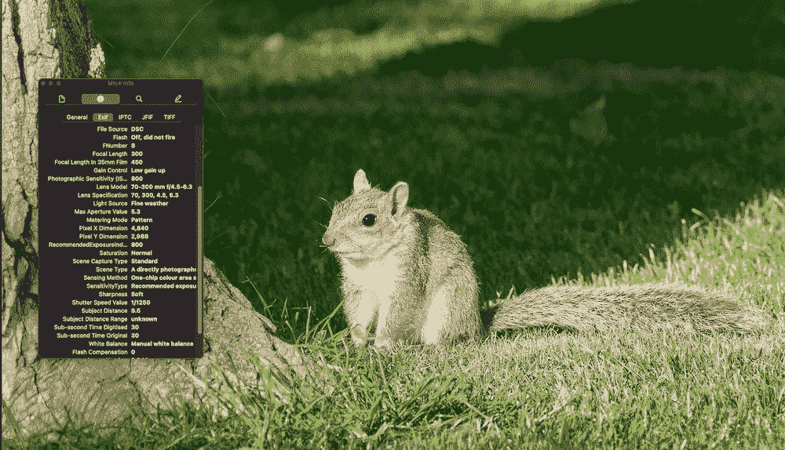
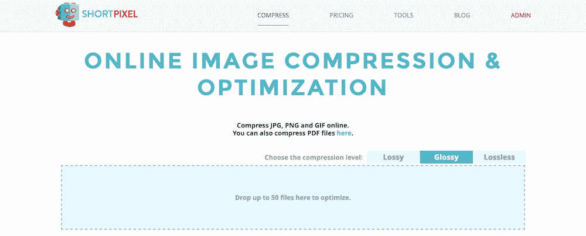
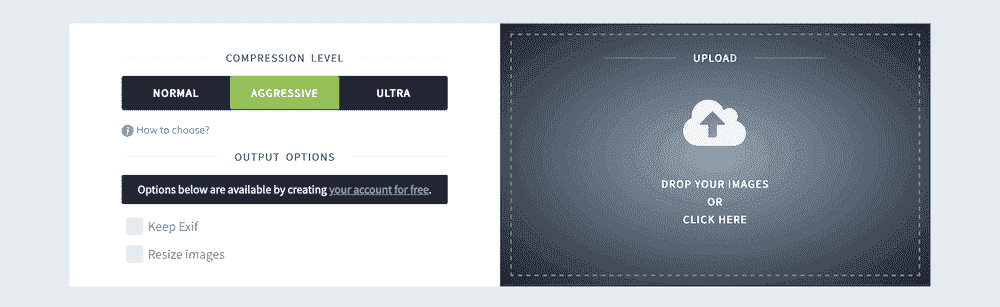
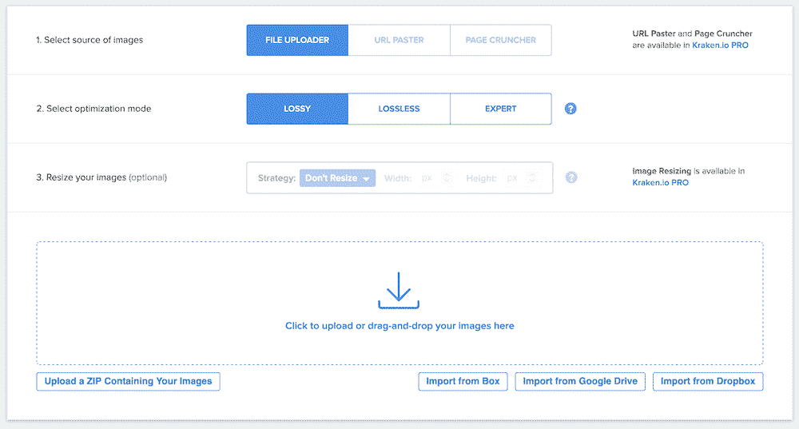
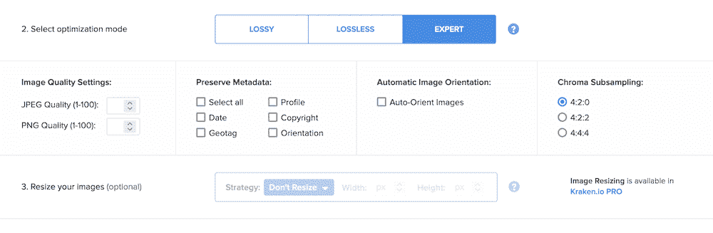

# 有损与无损压缩:两种格式的初学者指南

> 原文：<https://kinsta.com/blog/lossy-vs-lossless/>

数字图像是网络固有的一部分，没有一些媒体很难创造任何内容。不起眼的静止图像是为你的作品提供额外背景的绝佳方式。

但是，如果不进行优化，图像的文件大小可能会非常大。有损压缩和无损压缩是一个常见的考虑因素，因为它们都可以减小图像的大小，尽管也需要考虑质量的权衡。

您几乎总是需要对图像进行一些压缩。这可以将质量保持在您指定的可接受水平，同时降低文件大小。选择正确的压缩级别将取决于您的最终目标和要求。

在这篇文章中，我们将看看有损压缩和无损压缩。自始至终，我们将讨论图像“成形”的过程，什么是压缩，以及优化图像的许多其他方面。

### 查看我们的视频指南[有损与无损压缩](https://www.youtube.com/watch?v=X88vxU2o4f0)

## 有损和无损的区别

当谈到任何数字图像压缩，有几种不同的格式可供选择。有时这些会有其他的名字，这取决于许多因素。但是，在核心层，您会发现两种类型:

*   **有损压缩:**这里的目标是为图像提供尽可能小的文件大小。因此，图像质量通常在优先级列表中处于较低的位置。
*   **无损压缩:**使用这种压缩格式，您仍然会发现文件大小大幅减小，但图像不会出现伪像和其他问题。

在大多数情况下，您关于使用哪种格式的决定将归结为您的最终目标:您想要小文件，还是您的重点是保持质量？

有损压缩会从图像中永久删除它认为不必要的数据。它使用许多不同的技术来实现这一点，从而使文件变得更小。

无损压缩也会删除数据，但如果需要，它可以恢复原始数据。目标是保持高质量，同时减小文件大小。

有几种方法可以实现这一点，但结果往往是一样的。为了找到满足您需求的正确选项，让我们先后退一步，回顾一下图像和压缩的基本知识。

[有损与无损压缩-哪一种适合您的图像？🤔 点击推文](https://twitter.com/intent/tweet?url=https%3A%2F%2Fkinsta.com%2Fblog%2Flossy-vs-lossless%2F&via=kinsta&text=Lossy+vs+lossless+compression-+which+one+is+right+for+your+images%3F+%F0%9F%A4%94&hashtags=WPTips%2CWordPress)

## 数字图像的元素

像软件和网络开发一样，通常有一个“堆栈”将图像从相机上传到网络。

图像从“原始”数据开始(因此得名 raw)。这类似于应用程序的代码:代码片段、线条和值转化为带有颜色、图像占位符、动态元素等的背景。

对于图像，RAW 文件根据相机制造商、编辑软件、色彩空间算法等因素呈现略有不同的图像表示。在这里，您可以编辑图像并将其导出为几种文件格式之一(稍后将详细介绍):

An example of editing a RAW file in Capture One.

标准数码图像由几个不同的元素组成:

*   **文件类型:**不同的文件类型可能适合您的最终图像，也可能不适合。关键是为应用程序选择最合适的文件类型。
*   分辨率:你经常会看到用百万像素(MP)来表示，但你也会用到每英寸像素(PPI)或每英寸点数(DPI)。分辨率越高，质量越好，但也会增加初始文件的大小
*   **位深:**这个方面决定了一个图像中的颜色信息。低位深度只能呈现几种颜色，而高位深度可能一次呈现数百万种颜色。一般来说，越高越好。
*   **尺寸:**这是图像所占据的物理空间。例如，1，000 像素 x 500 像素可以定义图像的总大小。
*   **色彩空间:**这是一种决定色彩如何显示的算法。每个色彩空间的设置都不一样，往往会归结为摄影师的喜好。

这些元素结合在一起，形成不同质量的最终图像。例如，大尺寸、高分辨率、高位深度的 JPEG 照片将提供最高的质量和清晰度:

An image with high quality.

相比之下，即使图像尺寸很大并且能够显示大量颜色，但在低分辨率下看起来也很差:

An image with low quality.

这种平衡就是在应用压缩之前开发核心映像的方式。然而，您用于图像的格式对最终质量有很大的影响。

## 网络图像优化如何工作

因为图像压缩在一般意义上是相同的，所以您可以将标准规则应用到为 web 优化图像的方式中。

我们在 Kinsta 博客的其他地方讨论了很多这些概念[，但是有必要给出一个快速总结以供参考:](https://kinsta.com/blog/optimize-images-for-web/)

*   使用 72 PPI 分辨率，因为这是网络的标准。出于存档的原因，您可以使用更高的 PPI/DPI，但是我们假设您发布到 web。
*   将图像的“长边”设置为 2048 像素，因为这对于许多不同的应用程序来说是最佳的。
*   如果可以的话，使用 8 位颜色深度。
*   在发布之前，通过压缩和优化工具运行图像。

这是一个简单的格式，可以给你一致的结果，虽然压缩和优化是我们将在本文的其余部分展开。

为此，让我们来看看有损压缩和无损压缩的优缺点。

### 图像压缩如何帮助你的网络图像

一般来说，“压缩”将最小值和最大值挤压得更近。例如，压缩会提高音乐中的最低音量，降低最高音量。这使得平均音量对耳朵来说更大。

对于图像，压缩更多的是一个还原过程。这意味着在保持尽可能高的质量的同时，更加强调从图像中提取数据以减小文件大小。

有许多不同的专有算法来帮助减少图像文件的大小。在许多情况下，这些都是特定公司的专利。您会发现许多“有损”和“无损”压缩标准，每种标准都有独特的描述符:

The compressions options within ShortPixel.

尽管如此，应用图像压缩有很多好处，并不仅限于特定的格式:

*   您可以保持较小的文件大小，这将提高您的站点的性能。
*   通过扩展，您站点的服务器将有更少的工作要做，影响性能。
*   小文件有助于减少服务器排放。因此，你有助于创造一个可持续和道德的未来。
*   根据您选择的算法和压缩质量，您可以显示近乎完美和可比的质量。

就像创建一个可共享的图像，使用不同的压缩值，使用特定的公司，以及选择正确的算法，对于找到适合你的结果是至关重要的。

## 有损压缩的利与弊

[有损压缩](https://kinsta.com/blog/lossy-compression/)减小图像的文件大小，几乎排除了所有其他方面。该算法的工作方式是永久删除数据。这可能像听起来那样具有破坏性。

## 注册订阅时事通讯

### 想知道我们是怎么让流量增长超过 1000%的吗？

加入 20，000 多名获得我们每周时事通讯和内部消息的人的行列吧！

[Subscribe Now](#newsletter)

虽然我们不会过多讨论具体细节，但要知道有损压缩移除的一些数据在图像中是可见的。这个想法是以较轻的重量提供原始高质量图像的最佳表现，这意味着一些数据不会被削减。

一般来说，使用有损压缩有几个好处:

*   文件很小，在某些情况下，小于 10 千字节(KB)。
*   在许多情况下，质量的损失是可以接受的，尽管存在伪像。

这给我们带来了使用有损压缩的负面影响，即无论压缩多少，图像质量都会下降:

A compression slider for a JPEG image.

在某些情况下，您会发现色带(颜色阴影没有以正确的方式呈现)和边缘清晰度的损失是可见的。颜色越少的图像显示的越少，但是清晰度的降低仍然存在。

此外，图像质量下降是压缩过程的一个永久特征。这意味着以后没有办法逆转这种影响。

尽管有缺点，有损压缩对网站和你的站点的性能来说是极好的。微小的文件大小并不总是导致颗粒状的图像，尽管你可以(当然)走极端:

An example of an overly compressed image.

然而，有损并不是唯一的选择。无损压缩是注重质量的网站所有者的一种选择。

## 无损压缩的利弊

无损压缩做到了它在标签上所说的:在不影响视觉质量的情况下，尽可能压缩图像的文件大小。这是通过移除图像元数据来实现的，这会占用不必要的空间:

An image’s metadata.

无损压缩算法也寻找重复的像素序列，然后编码一个快捷方式来显示它们。比如说“命令行界面”您通常会定义它的缩写一次，然后使用“CLI”(或您选择的缩写)以闪电般的速度引用它

无损压缩以同样的方式工作，因为它的破坏性更小。虽然删除元数据是不可逆的，但一些压缩是可逆的，这使它成为一种适用于许多用途的灵活算法。

使用无损压缩的优势在于保持质量:

*   与所有其他算法相比，无损压缩保留了图像的最高质量。
*   无损对于存档来说是极好的。例如，摄影师可以用保存最多数据的图像来平衡存储资源。
*   无损是视觉艺术的首选压缩算法:摄影、图形设计、数字艺术等。将无损算法与适当的深度和分辨率相结合，可以实现几乎“一对一”的复制。

然而，关于无损压缩如何服务于特定领域，有一些事情需要注意:应用范围很小。这降低了它的整体可用性。

所有的 Kinsta 托管计划都包括来自我们资深 WordPress 开发者和工程师的 24/7 支持。与支持我们财富 500 强客户的同一个团队聊天。查看我们的计划！

以下是无损压缩的一些其他缺点:

*   如果网站使用许多图像，无损压缩可能不是显示它们的最佳方式。这是因为在大多数情况下，在这些类型的情况下，您会希望重视较小的文件大小。
*   虽然压缩会减小文件大小，但无损算法对图像数据的改变不如有损算法多。正因为如此，你可能只会看到微小的尺寸减小，而不是极端的瘦身效果。

接下来，我们将看看这样做的最快(也可能是最好的)方法。

## 如何在有损和无损之间做出选择

至此，您理解了有损压缩和无损压缩之间的区别。但是，您可能仍然不知道在您的站点上使用哪种算法是最好的。

有两种情况需要考虑:

1.  对于 web 上的大多数用例，有损压缩是可以接受的。
2.  如果您想要显示摄影或拍摄的艺术，无损压缩将为您提供更好的服务。

这些考虑依赖于使用一种标准的 web 图像格式，如 JPEG、PNG 或 GIF。但是，对于更现代的格式，如 HEIC 和 WebP，您的压缩需求可能会有所不同。

我们甚至可以说，除非你在网站上展示照片，否则有损压缩应该是你的默认选择。默认情况下，WordPress 压缩图像，这进一步说明有损压缩适用于几乎所有应用。

## 使用在线压缩服务优化您的图像

在网站上展示图片之前，有很多方法可以压缩图片。例如，您可以选择在编辑阶段应用压缩。无论如何，这可能是转换原始格式的副产品。

然而，一个受欢迎的选择是许多在线服务之一。每一个都将提供一个算法选择和一个典型的用户界面(UI)。更重要的是，大多数都有一些免费服务，至少在你提交之前可以试用一下。

我们在关于[图像优化](https://kinsta.com/blog/optimize-images-for-web/#image-optimization-wordpress-plugins)的文章中介绍了一些选项，尽管这些是连接到应用程序编程接口(API)的特定于 WordPress 的插件。好消息是许多插件也提供了在线界面。例如，考虑[短像素](http://shortpixel.com):

The ShortPixel interface.

在这里，您将把图像拖到上传器上，然后等待应用程序压缩和处理它们。但是，您需要首先选择算法，因为这个过程会立即开始。

选择很简单:两种形式的有损压缩(“有损”和“光泽”)，以及一个无损选项。ShortPixel 的界面很好地解释了每种算法之间的差异，你可以在几秒钟内下载图像。

虽然两者都能满足你的需求，但相比 ShortPixel，Imagify 的界面看起来更光滑、更专业。此处还有三个“压缩级别”—普通、激进和超级:

The Imagify interface.

这里稍有不同的是，Imagify 从无损压缩开始，逐步发展到带有大量伪像的有损算法。然而，有几个其他选项是你在其他解决方案中找不到的。

首先，您可以为您的图像保留完整的 EXIF 数据，甚至在转换后调整它们的大小。这有时是非常宝贵的，尤其是如果您想要应用可能会移除 EXIF 数据或限制调整图像大小的压缩级别。

就像它神话中的名字一样，北海巨妖可以处理你的图像并应用各种类型的压缩。大多数用户会选择有损或无损类型。

The Kraken interface.

然而，还有一种专家模式:

The Kraken Expert mode options.

这使您可以根据自己的需要调整压缩，以及其他选项。例如，您可以调整 JPEG 和 PNG 压缩级别，选择保留图像中的元数据，甚至可以使用色度二次采样来进一步更改颜色。

## 摘要

图像可能看起来像是你网站的一个简单方面:你拿一个文件，把它上传到 WordPress，然后添加一个图像块来显示它。

然而，在为网络准备图片的过程中，有比你可能意识到的更多的东西。您选取的压缩格式会影响文件大小、图像质量等。

这篇文章讨论了有损压缩和无损压缩，并总结了你应该选择哪一种。尽管在质量和大小之间走钢丝，有损压缩对于网络上的大多数用例来说是完美的。摄影师或那些担心篡改图像质量的人会希望使用无损压缩，尽管在文件大小方面好处较少。

在有损压缩和无损压缩的斗争中，你站在哪一边？请在下面的评论区告诉我们你的想法！

* * *

让你所有的[应用程序](https://kinsta.com/application-hosting/)、[数据库](https://kinsta.com/database-hosting/)和 [WordPress 网站](https://kinsta.com/wordpress-hosting/)在线并在一个屋檐下。我们功能丰富的高性能云平台包括:

*   在 MyKinsta 仪表盘中轻松设置和管理
*   24/7 专家支持
*   最好的谷歌云平台硬件和网络，由 Kubernetes 提供最大的可扩展性
*   面向速度和安全性的企业级 Cloudflare 集成
*   全球受众覆盖全球多达 35 个数据中心和 275 多个 pop

在第一个月使用托管的[应用程序或托管](https://kinsta.com/application-hosting/)的[数据库，您可以享受 20 美元的优惠，亲自测试一下。探索我们的](https://kinsta.com/database-hosting/)[计划](https://kinsta.com/plans/)或[与销售人员交谈](https://kinsta.com/contact-us/)以找到最适合您的方式。