# 如何为 WordPress 选择加入表单和电子邮件营销配置 Mailchimp

> 原文：<https://kinsta.com/blog/mailchimp-for-wordpress/>

WordPress 是占统治地位的内容管理系统，Mailchimp 是其 T2 电子邮件营销软件的对等物。

那么，为什么不把两者结合起来呢？

在本指南中，你将学习如何为 WordPress 配置 Mailchimp。有了它，你可以在你的网站上启用选择加入表单，设置电子邮件营销活动，并在你发布新的博客帖子时发送电子邮件。

让我们开始学习如何将 Mailchimp 添加到 WordPress！

## WordPress 为什么要用 Mailchimp？

WordPress 插件库已经提供了广泛的电子邮件营销和[列表构建插件](https://kinsta.com/blog/wordpress-lead-generation/)和小工具。

这就引出了一个问题:是什么让 Mailchimp 比几十种替代品更受欢迎？为什么你应该在你的 WordPress 网站上使用 Mailchimp？

原因如下:

*   Mailchimp 为多达 2000 个联系人提供免费帐户。许多高级电子邮件营销应用没有免费计划，即使有，也很难击败 Mailchimp 的功能。
*   您可以通过手动方式或使用插件使用 Mailchimp 制作电子邮件选择加入表单。这两个选项使得设置有些灵活。WordPress 支持自定义编码，并且有大量的 Mailchimp 插件，所以可以使用任何让你更舒服的插件。
*   也可以[使用 Mailchimp 进行网站注册表单](https://kinsta.com/blog/wordpress-registration-form/)。用户访问您的网站并创建用户配置文件；这些经常在[会员](https://kinsta.com/blog/create-a-membership-website/)、[电子商务](https://kinsta.com/blog/ecommerce-platforms/)和[论坛网站](https://kinsta.com/blog/wordpress-forum-plugins/)上使用。
*   Mailchimp 电子邮件设计流程是无与伦比的。其漂亮的模板和拖放编辑器意味着你不必是一个设计师或电子邮件营销专家来构建惊人的活动。您还可以获得一个丰富的模板库。
*   几个自动化工具将 WordPress 更新链接到 Mailchimp 电子邮件，允许你发送电子邮件，比如新帖子，以及当人们注册你的名单时作为欢迎电子邮件或点滴活动。
*   Mailchimp 带有先进的定位工具，让你的 WordPress 读者/客户有机会选择他们想要接收的电子邮件。你也可以根据你自己的用户类型来定位。
*   如果你不喜欢将 Mailchimp 与 WordPress 集成的主要插件或方法，你可以随时转向第三方扩展，看看市场上有多少这样的插件。这只是 Mailchimp 作为一个相当受欢迎的电子邮件营销工具的优势之一。
*   你可以在你的 WordPress 仪表盘上显示 Mailchimp 统计数据，但是它们包含了重要的信息，比如邮件打开率、点击率和用户位置。
*   Mailchimp 与 WooCommerce 网站很好地集成在一起，帮助你发送自动交易电子邮件，比如废弃的购物车信息、收据和优惠券代码。
*   Mailchimp 和 WordPress 的集成意味着你可以利用除了通常的电子邮件营销之外的各种自动化和营销功能。例如，你可以链接你的社交媒体账户，根据电子邮件运行数字广告，设置登陆页面，等等。

如您所见，Mailchimp 提供了一套非常可靠的工具。但是当你为 WordPress 优化 Mailchimp 并整合整个过程时，它会成为一个对你的网站更有帮助的营销平台。

[WordPress is the king of content management systems. And Mailchimp is the king of email marketing programs. 👑 So, why not combine the two? 🤝Click to Tweet](https://twitter.com/intent/tweet?url=https%3A%2F%2Fkinsta.com%2Fblog%2Fmailchimp-for-wordpress%2F&via=kinsta&text=WordPress+is+the+king+of+content+management+systems.+And+Mailchimp+is+the+king+of+email+marketing+programs.+%F0%9F%91%91+So%2C+why+not+combine+the+two%3F+%F0%9F%A4%9D&hashtags=WordPress%2CMailchimp)

## 如何设置 Mailchimp 帐户

为 WordPress 设置 Mailchimp 的第一步是:

*   拥有一个 WordPress 站点
*   创建 Mailchimp 帐户

在你建立了这两个账户后，我们可以继续用插件或代码将它们连接起来(更多内容见下文)。

我们的 Mailchimp 入门指南涵盖了访问 Mailchimp 网站以了解如何在 Mailchimp 仪表板上移动的大部分过程。

作为一个简短的提醒，以下是创建 Mailchimp 帐户的步骤，以及指南中未列出的一些额外提示:

首先[访问 Mailchimp.com 网站](https://mailchimp.com/)并检查其功能，以确保它正是你想要用于你的 WordPress 网站的电子邮件营销平台。

准备就绪后，点击**签约** **上线** **免费**或**获取** **开始** **今日**按钮—两者都会将您带到同一页面进行记账。

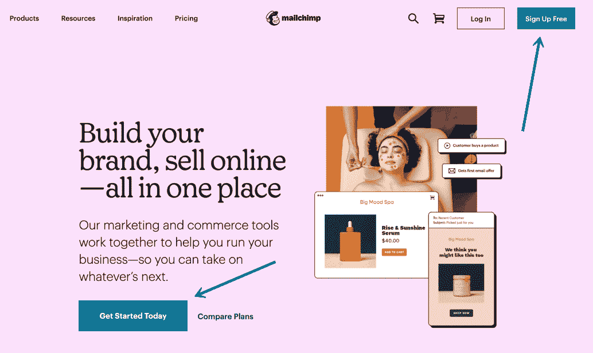

On the Mailchimp homepage, click one of the “Get Started” or “Sign Up” buttons

您需要选择一个 Mailchimp 定价方案。我们建议从免费计划开始，直到您超过 2，000 个用户的上限或需要一个高级功能。

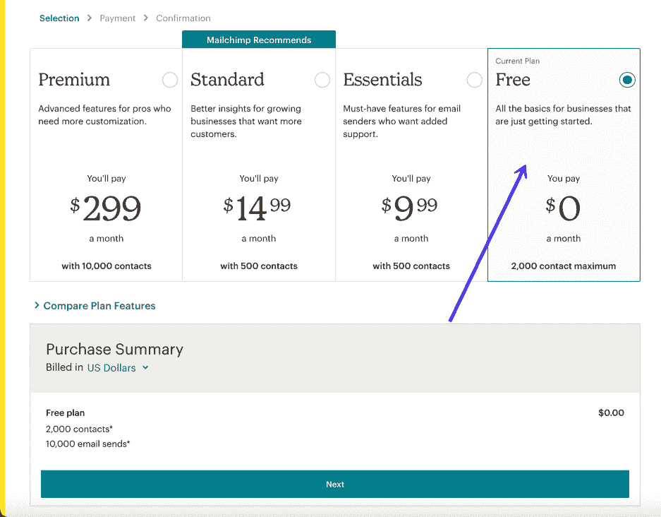

Go with the Free plan to start your Mailchimp account (Image Source: [Mailchimp.com](https://mailchimp.com/))

接下来的屏幕显示了您需要输入电子邮件以及所需用户名和密码的字段。系统还会提示您告诉 Mailchimp 您的名字、姓氏以及其他一些个人信息，以完成帐户配置。他们甚至有一个营销测试，你可以跳过，但它有助于在你的仪表板上放置正确的功能。

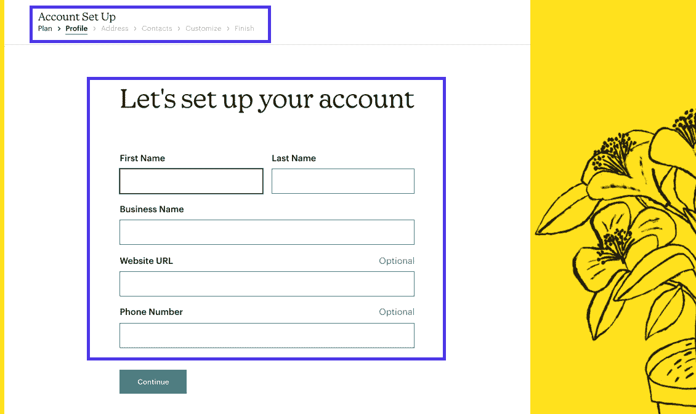

Fill in fields like your First Name, Business Name, and Website URL (Image Source: [Mailchimp.com](https://mailchimp.com/))

完成所有这些后，Mailchimp 会将你发送到主仪表板，在那里你会看到一个欢迎提示，发送活动后的快速统计，以及电子邮件列表大小的详细信息。

[阅读我们关于使用 MailChimp](https://kinsta.com/blog/how-to-use-mailchimp/) 的指南(并建立你的电子邮件列表)继续这个过程。

为 WordPress 设置 Mailchimp 意味着你将整合当前的 Mailchimp 帐户，在你的 WordPress 网站上放置一个 Mailchimp 表单——在你的主页、侧边栏或标题等区域。

有了站点上包含的表单，所有输入的用户数据都会从该站点表单推送到 Mailchimp 中的数据库。您可以从 Mailchimp 管理电子邮件列表的所有方面，包括定位、将用户分组和查看统计数据等选项。您还可以在 Mailchimp 中调整订阅表单的设计。

用于 WordPress 集成的 Mailchimp 的主要目标是建立一个电子邮件列表。之后的一切都取决于你的创造力、发送电子邮件的欲望以及你经营的企业类型。Mailchimp 提供了满足您所有需求的工具，例如:

*   您希望为那些在您的表单上注册的人自动发送欢迎电子邮件
*   为你的零售店制作每月简讯
*   将集成与您的电子商务商店链接，以交付收据
*   设置放弃的购物车消息
*   发送其他交易电子邮件

## 如何在 WordPress 上设置 Mailchimp

Mailchimp 集成有许多不同的形式，其中包括:

*   在你的 WordPress 站点上创建一个没有插件的 Mailchimp 注册表单。
*   用插件制作一个 Mailchimp 注册表单放在 WordPress 网站上。
*   在你的 WordPress 站点上插入一个 Mailchimp 注册表单作为一个窗口小部件——在侧边栏、页脚或其他窗口小部件区域。
*   链接你的 WordPress 站点，这样自动操作就可以发生，比如从你的 WordPress 站点发送博客文章更新或者电子商务消息。

在下一节中，我们将介绍如何将你的 WordPress 站点链接到 Mailchimp，并完成所有提到的集成类型。然后，您可以根据成本、技能水平要求以及最好看的表单和电子邮件来决定最适合您组织的方式。

### 如何在没有插件的情况下为 WordPress 创建 Mailchimp 注册表单

Mailchimp 提供了自己的 WordPress 插件(尽管我们不推荐)，你可以找到相当多的第三方插件来将 Mailchimp 表单添加到 WordPress。然而，每个人都应该知道如何在不安装插件的情况下将 Mailchimp 表单添加到 WordPress 或任何网站。

退出插件有它的好处，从最小化你的 WordPress 站点上的插件数量到缩短你设计表单和把它放到你的站点上的时间。

转到 Mailchimp 仪表板，选择**观众**菜单项。这将把你带到**观众** **仪表板**，它列出了不同的观众和每个列表上有多少订户。

Mailchimp 将“受众”称为电子邮件列表。通过电子邮件向受众发送记录所有客户联系信息的数据库列表。

要在 Mailchimp 上构建表单，您必须首先了解受众是直接链接到您的表单的。当您创建表单时，所有收集的数据都将进入您的一个访问者列表。

幸运的是，默认情况下，Mailchimp 的免费计划会自动将您的主要受众链接到您制作的任何表单(因为在免费计划中您只能有一个受众)。对于更高级的计划，您必须为每个表单分配一个受众。

**Mailchimp****Audience****Dashboard**页面显示的信息包括您的列表名称(在本例中，我们将受众命名为“WordPress List”)，以及受众中订阅者的数量。链接到**添加** **订阅者**，**导入** **联系人**，制作**签约** **表单**。

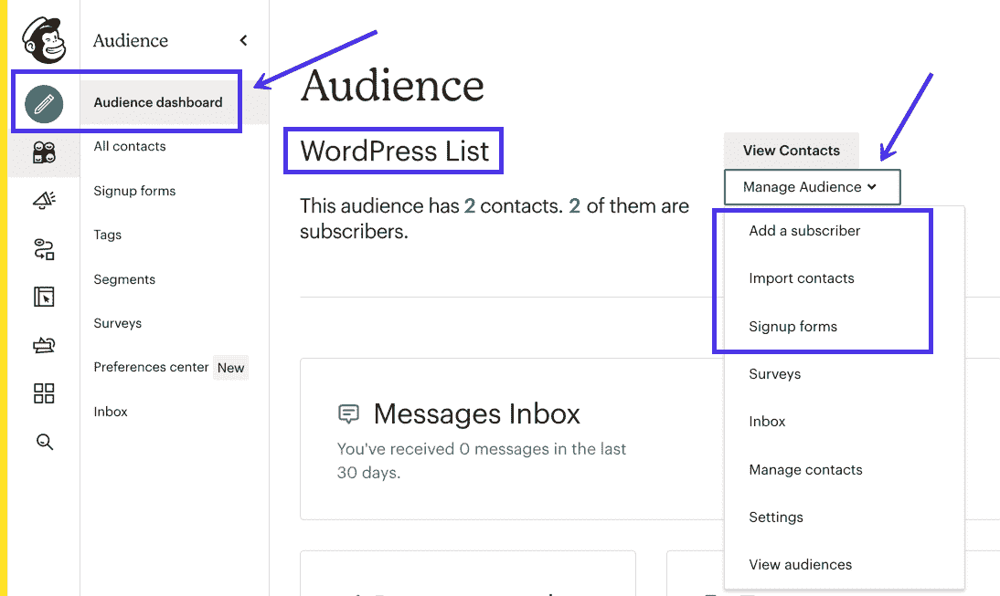

The “Audience Dashboard” shows multiple details about your audience.

现在您已经了解了受众，导航到**受众** **仪表板**选项卡下的**注册** **表单**菜单项。

此按钮将带您进入创建、定制和嵌入 Mailchimp 表单的页面。

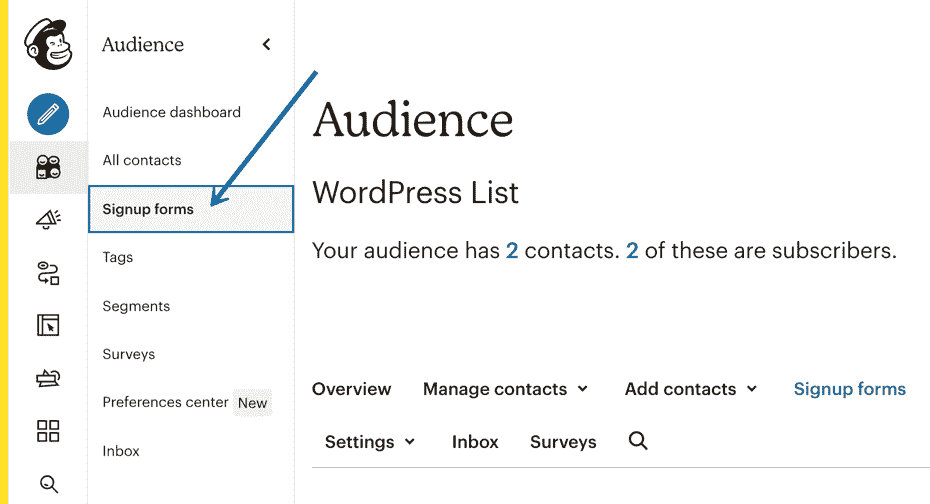

Go to the “Signup Forms” tab to create and embed forms for your WordPress site

Mailchimp 提供几种类型的注册表单。

我们将在本文中进一步讨论替代选项，但是将 Mailchimp 表单添加到 WordPress 的经典方法是使用**嵌入式** **表单**生成器。

因此，点击**选择**按钮旁边的**嵌入** **表格**选项。

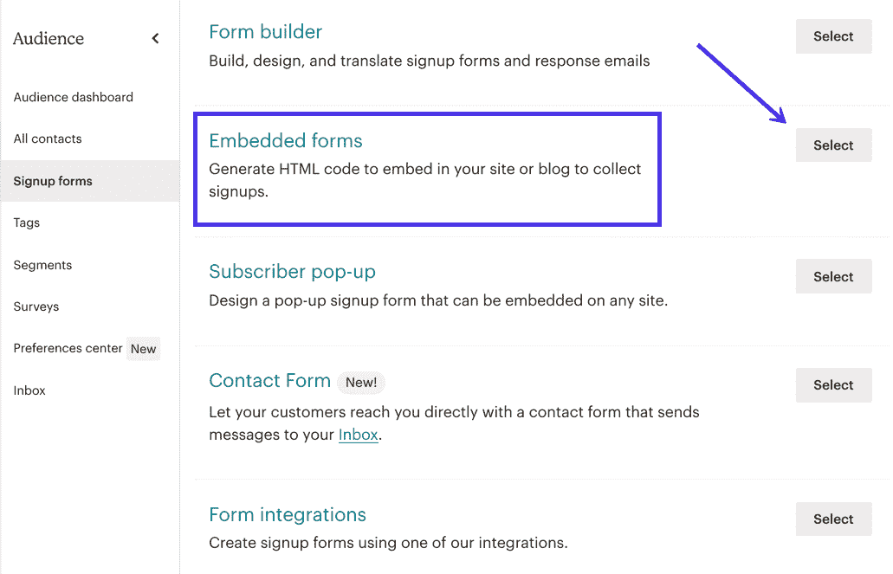

Use the “Embedded Forms” option to generate quick forms to embed with code on WordPress

在这个页面上，你会看到一个菜单，有**经典**、**浓缩**、**横排**、**非风格**和**高级**等表单样式。

请随意点击这些样式，查看它们各自的外观。经典的 T1 形式通常是一个明智的开始，但是 T2 浓缩的 T3 和 T4 水平的 T5 形式提供了更现代的设计。**非样式化的**和**高级的**表单标签很适合大量的定制工作。

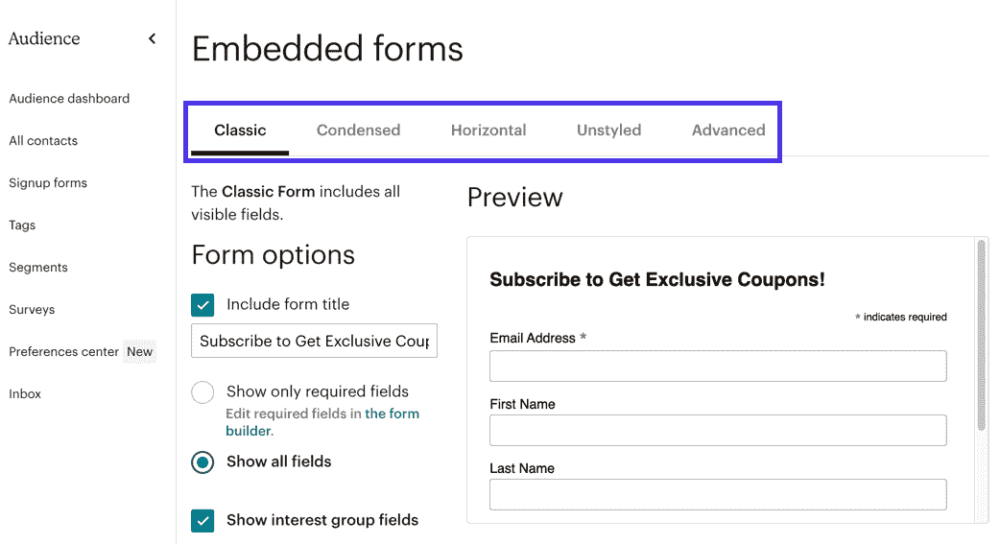

There are five forms types to choose from in Mailchimp

例如，切换到**压缩**标签会改变您在表单**预览**模块中看到的内容。

你可以看到它提供了一个稍微光滑的设计和更少的字段，这使得它非常适合你的网站中没有太多空间的区域。

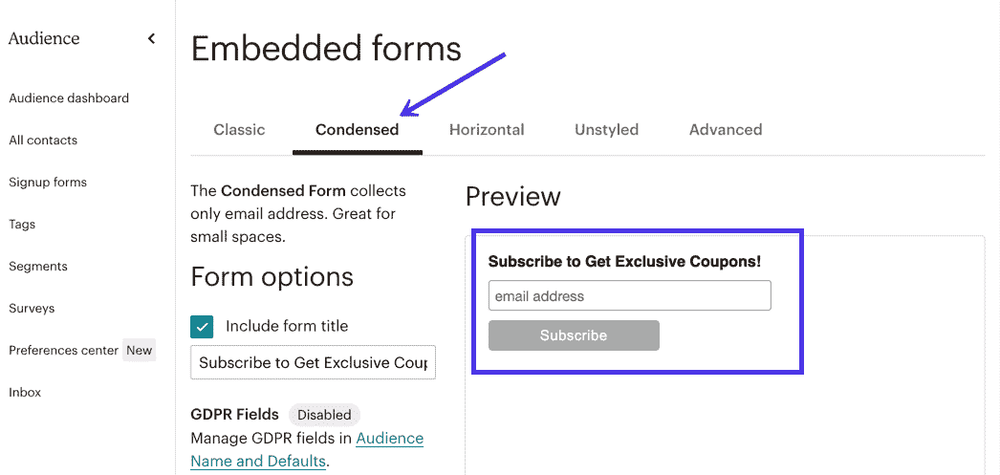

The “Condensed” tab gets rid of most fields and compresses the form’s size

另一方面，**非样式化的**标签去掉了所有样式化的整个表单，允许你把它放在你的 WordPress 网站上，或者保留它的原始形式，或者以后在 WordPress 中定制 CSS 以获得更有品牌感的外观。**高级**选项卡的工作方式类似于**非样式化**选项，因为它允许更复杂的定制。

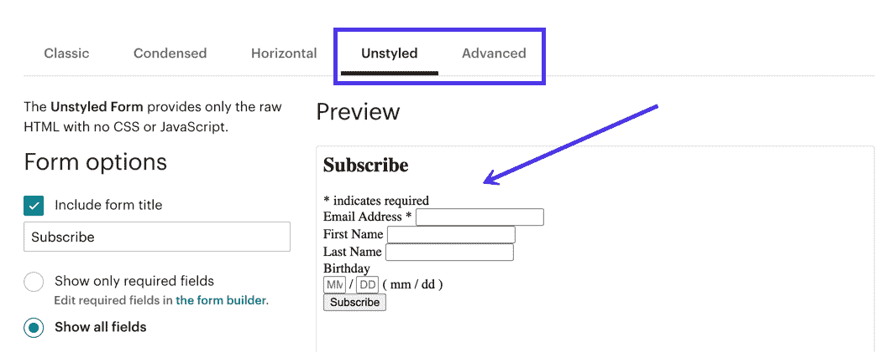

“Unstyled” and “Advanced” forms are for more complicated customizations

说了这么多，回到**经典**标签。

我们喜欢**经典**风格，因为它设计适中，能够集成到任何网站上，并且可以添加更多或更少的表单字段。

我们鼓励您探索**经典**选项卡下的各种设置，并观看每个设置调整**预览**部分中显示的样式。

例如，我们可以标记**显示** **仅** **必填** **字段**单选按钮，这导致**预览**隐藏除了**电子邮件** **地址**字段之外的所有字段。

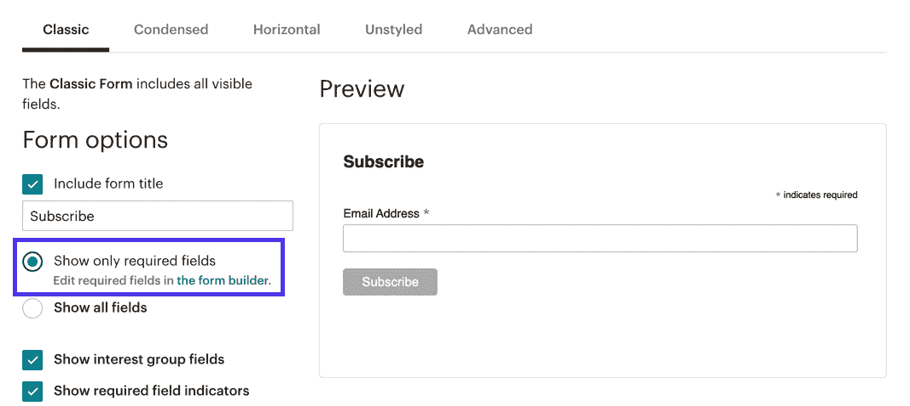

The “Classic” form has a setting to only show required fields

从另一个角度来看，您可能希望包含更多的字段。在这种情况下，选择**显示** **所有** **字段**单选按钮。

现在我们有了“非必需的”注册字段，如**第一个** **姓名**、**最后一个** **姓名**，甚至还有一个客户的**生日**。

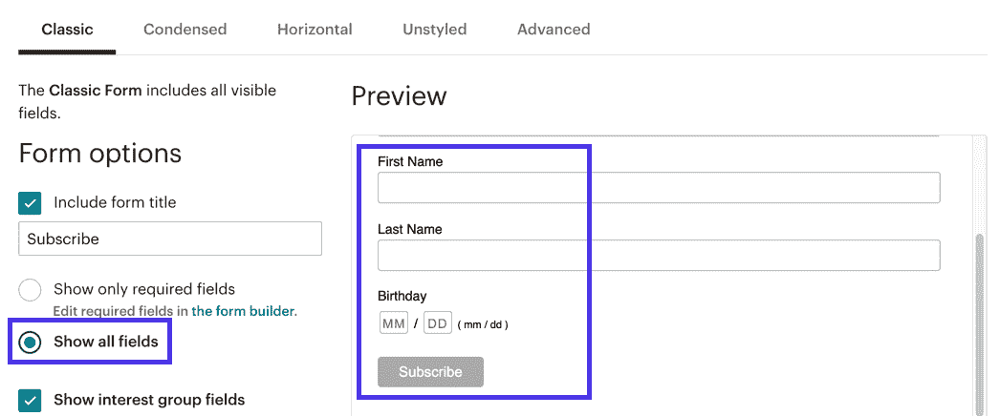

The “Show All Fields” button reveals fields like “First Name,” “Last Name,” and “Birthday”

筛选附加设置也是一个不错的主意，例如:

*   **显示兴趣组字段**
*   **显示必需的字段指示器**
*   **显示格式选项**
*   和**可选表格宽度**字段

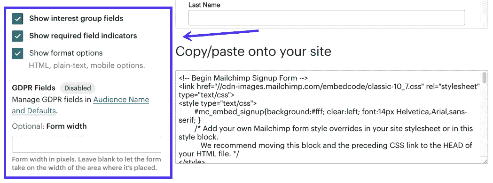

Creating Mailchimp’s form inserting code

完成 Mailchimp 表单的定制后，滚动到页面底部找到要**复制/粘贴到您的站点**的部分。

您不需要了解这段代码的任何内容，只需要知道它包含样式和数据库元素，以正确的方式显示表单并收集所有数据输入。

选择整个代码块，并将其复制到计算机的剪贴板上。

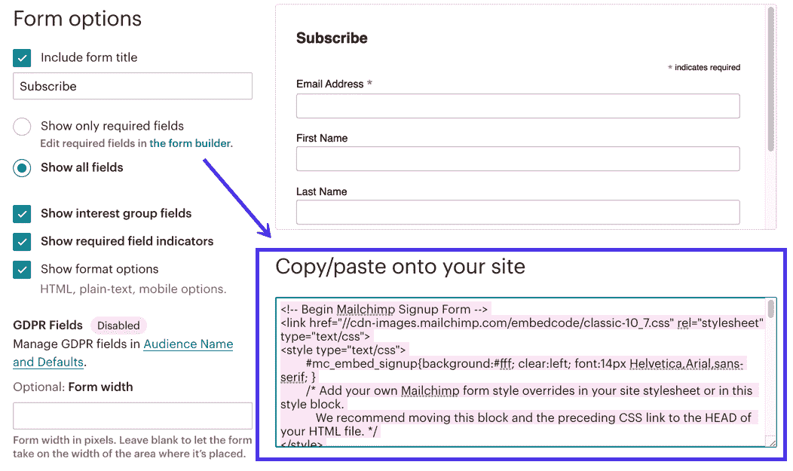

When you’re done designing, copy the form’s code

现在我们需要在你的 WordPress 站点上获取表单。

要完成这个任务，打开你的 WordPress 站点的后台仪表板。

Mailchimp 的可嵌入表单可以放在站点上任何接受可嵌入 HTML 代码的地方。因此，您可以创建一个新的帖子、页面、产品页面或小部件，所有这些都应该支持 HTML。您甚至可能希望打开以前发布的页面或帖子，在某个地方插入表单。

我们已经导航到该网站的教程的**主页，在这里我们将把表单放在页面底部的产品列表下面。**

要在可视块编辑器中实现这一点，请单击**添加** **块**按钮(它看起来像一个加号)。要么通过 WordPress 浏览可用的区块集合，要么考虑在**搜索**栏中输入“HTML”。

找到**自定义** **HTML** 块，并将其插入到你的 WordPress 页面或帖子中。

Click the “Add Block” button and find the “Custom HTML” block

**自定义** **HTML** 块允许你粘贴任何来源的 HTML。之后，WordPress 处理 HTML 以显示其真实设计。

将光标放在**自定义** **HTML** 块字段中，然后粘贴之前复制到剪贴板的 Mailchimp 表单代码。

您应该会看到代码块中的代码。

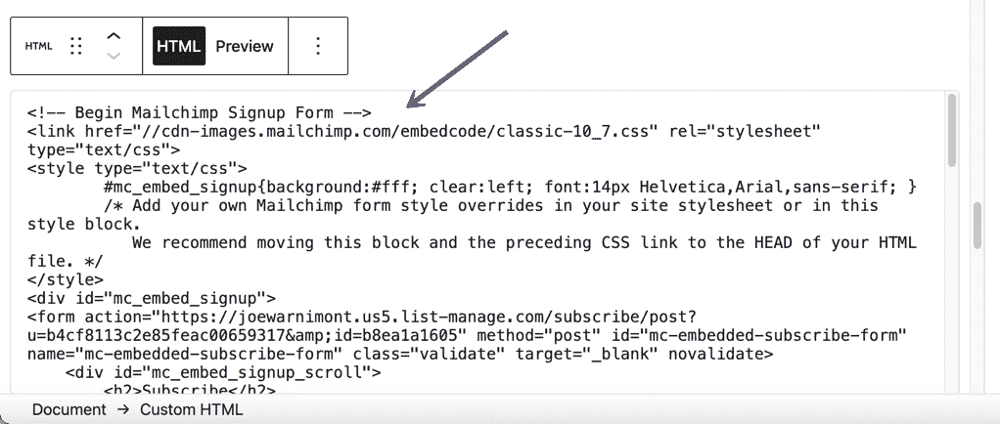

Paste the previously copied Mailchimp code into the “Custom HTML” block

在**自定义** **HTML** 块中选择**预览**按钮来测试表单的外观。

这表明我们已经成功地在网站上添加了一个 Mailchimp for WordPress 表单。

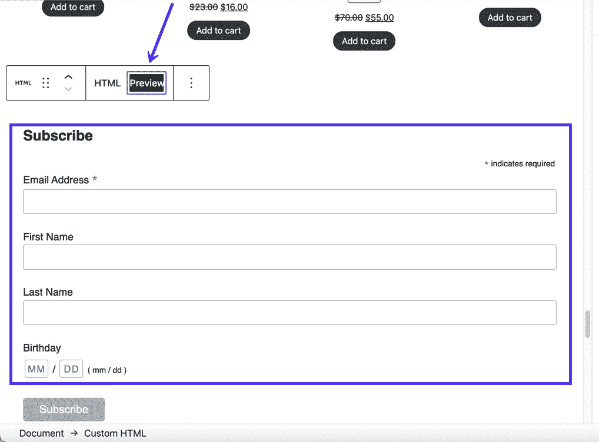

Select the “Preview” button to see what the HTML will look like on the frontend

要完成这个过程，点击 WordPress 中的**发布**或**更新**按钮。

导航到该页面的前端，检查是否一切正常。

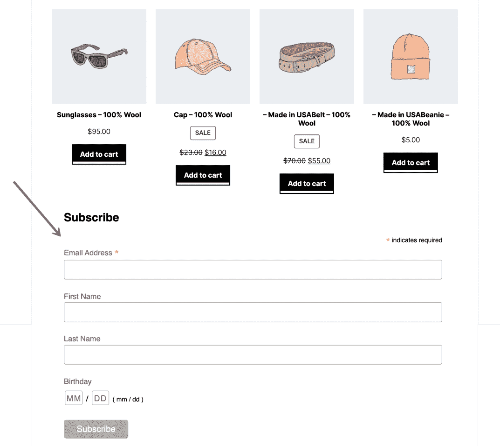

Make sure you check the frontend to view the new form and test it out

您还应该考虑测试表单功能本身。

输入假冒客户的信息——你的电子邮件地址和姓名——然后点击**订阅**按钮。

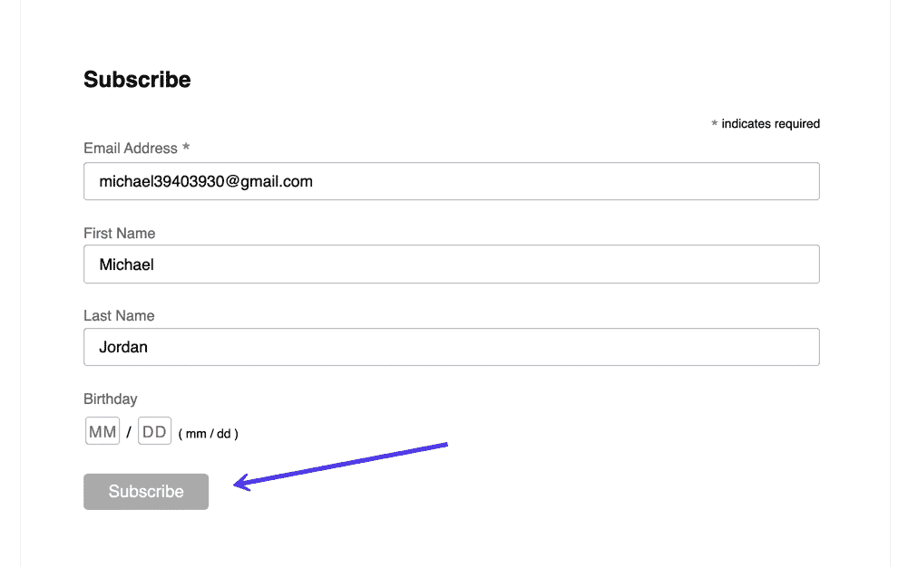

Fill in the information for a test customer, then click on the “Subscribe” button

您将看到一条**消息，感谢您订阅**消息，您可以在 Mailchimp 仪表盘中对其进行定制。

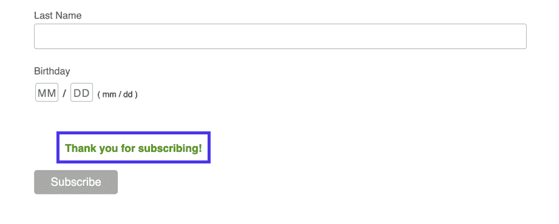

The form is working if you see the “Thank You” message

回到 Mailchimp，跳转到**受众**部分下的**所有** **联系人**标签，检查用户订阅测试是否成功。

正如所料，我们有了一个新的联系人(从 2 到 3)，页面底部的电子邮件地址列表包含了我们输入到表单中的电子邮件。

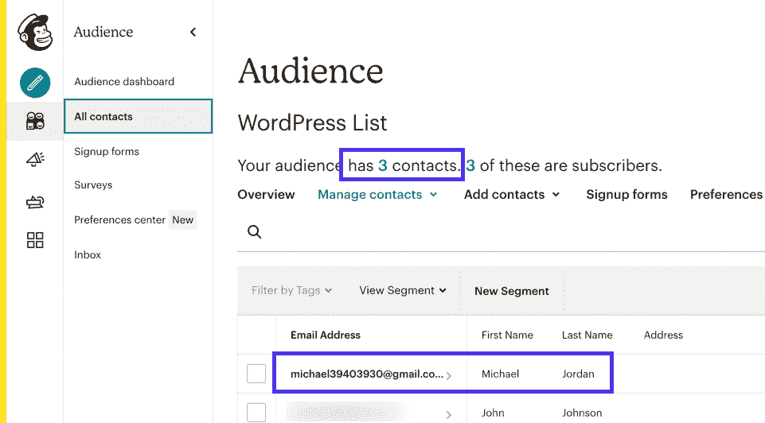

Be sure to check your contact list in Mailchimp (Image source: [Mailchimp.com](https://mailchimp.com/))

#### 其他风格的可嵌入 Mailchimp 注册表单

我们看到在 Mailchimp 的**注册** **表单**页面上有一些其他的表单样式。

不是所有的都适合嵌入你的 WordPress 网站。不过，它们都有一个用途，特别是如果你想为你的注册表单生成一个单独的、可共享的网页，或者当人们访问你的站点时出现一个弹出窗口。

在**注册** **表单**部分，您可以点击这些表单样式，看看哪些样式可能有助于您自己的设计需求。

例如，**表单** **构建器**链接提供了一个设计工具，用于构建我们用**嵌入式** **表单**创建的扩展版本。

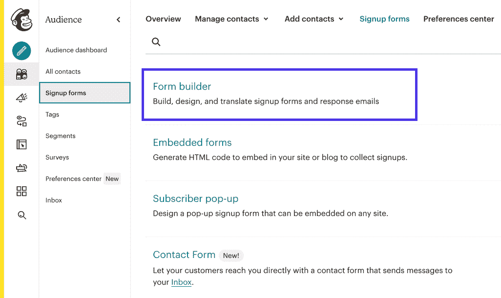

You can edit every aspect of a form’s design in the “Form Builder”

然而，我们应该注意到，**表单** **构建器**并没有生成一个可嵌入的 Mailchimp 表单，而是一个**注册** **表单** **URL** 用于与其他人分享，发布到你的社交媒体账户，或者潜在地链接到你网站上的一个按钮。

如果您需要快速将表单发送给某人，有这样的链接很好。**表单** **生成器**通过可定制的字段和字段设置提供完整的设计体验。

请记住，产生的链接会将用户发送到 Mailchimp 托管的网页，而不是您的网站。它仍然是你的表单，它继续收集客户信息并把它放到你的受众中，但是如果你想为 WordPress 配置 Mailchimp，你必须选择**可嵌入的** **表单**。您可以随时在**表单** **生成器**中设计一个表单，并跳转到**可嵌入** **表单**页面定位其代码。

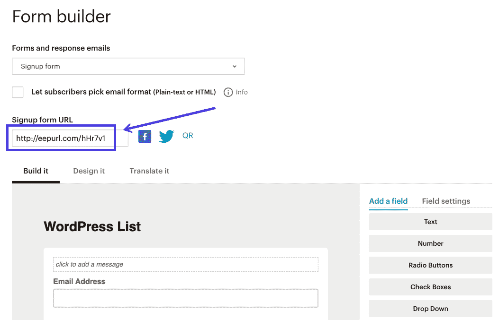

The “Form Builder” gives you a URL to share an external web page with your form on it

另一种表单样式，叫做**订户** **弹出**表单，可以让你在你的 WordPress 站点文件中嵌入隐藏代码，这样每当客户完成一个动作，比如在**主页**上向下滚动，试图离开你的网站，或者在某段时间内浏览网站，就会出现一个弹出表单。

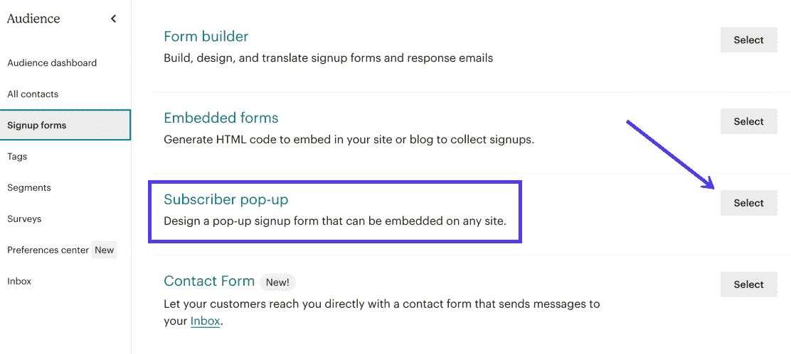

Choose the Subscriber Pop-up option to generate and customize pop-up forms

Mailchimp 提供了一个时尚的弹出表单生成器，可以调整从表单字段到成功消息的所有内容。

您还可以从以下设置中进行选择，以决定弹出表单何时出现:

*   立即
*   5 秒钟后
*   20 秒后
*   在用户滚动到页面中间之后
*   在用户滚动到页面末尾之后
*   当用户试图退出您的网站时

Mailchimp 中弹出表单的问题在于，你必须在你的 WordPress 站点文件中添加一些代码。虽然你不需要了解太多代码，但是这个过程需要一些 WordPress 文件架构的知识。如果你打算在你的网站上放一个 Mailchimp 弹出表单，我们推荐你阅读我们的指南 [WordPress 文件以及如何使用它们](https://kinsta.com/knowledgebase/wordpress-files/)。

在 Mailchimp 中，你需要点击**连接** **站点**链接，在 Mailchimp 中为 WordPress 制作一个弹出表单。

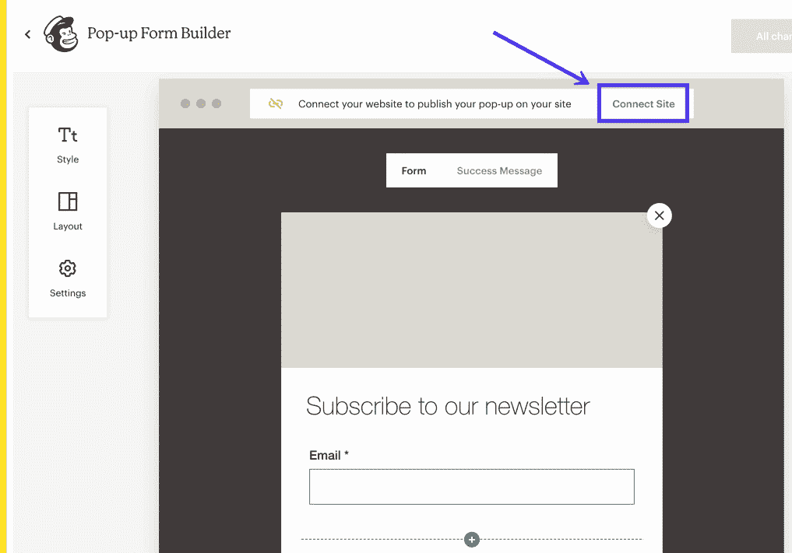

Select the “Connect Site” link to begin connecting a pop-up form to your WordPress site

之后，Mailchimp 继续在 WordPress 或任何其他[内容管理系统或网站构建者](https://kinsta.com/blog/wordpress-page-builders/)上发布弹出表单的详细指南。

有一些集成，但一般来说，需要访问你的 WordPress 站点文件的 **<头>** 部分，并粘贴推荐的代码。此外，Mailchimp 会要求您输入您的网站 URL。

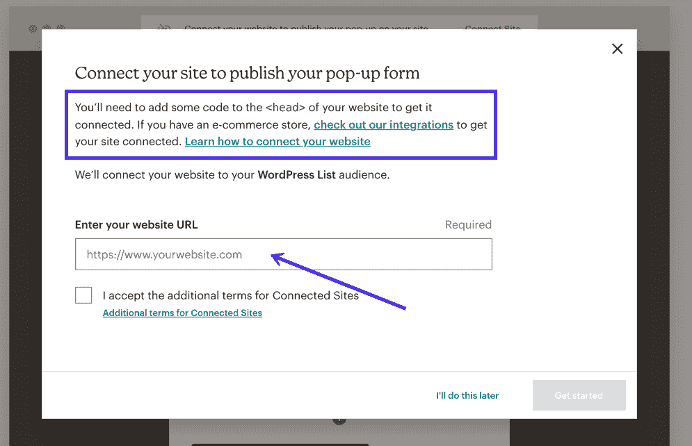

Activating a pop-up form on WordPress

### 如何用插件创建一个 Mailchimp 注册表单

许多人对使用代码向 WordPress 添加 Mailchimp 表单不感兴趣，尤其是当您必须进入 WordPress 文件时。虽然将 HTML 代码插入 WordPress 的基本过程相对简单，但是使用插件有很多好处。

首先，Mailchimp for WordPress 插件通过拖放编辑器、可视化设计器和表单模板消除了编码需求。尽管这不是什么大麻烦，但在使用插件时，你甚至不需要复制嵌入代码。那是相当奢侈的。

此外，Mailchimp for WordPress 插件扩展了 Mailchimp 仪表板中的基本表单构建功能，为您提供了更多的设计元素、预构建的主题和选项，以创建独特的通知、多种表单和其他表单样式，如顶栏。

此外，许多第三方开发者提供了他们自己的 Mailchimp 到 WordPress 的集成，这些集成具有你在其他地方找不到的独特功能。

本节将通过几个教程指导你使用插件为 WordPress 配置 Mailchimp。

我们将向你展示如何在 WordPress 上安装一个 WordPress Mailchimp 插件。之后，我们将解释如何为 WordPress.org(WordPress 的自托管版本)完成类似的过程。更多信息，请阅读 WordPress.com 和 WordPress.org 的差异。

WordPress.org 仍然有一个名为[邮件列表订阅表单](https://wordpress.org/plugins/mailchimp/)的官方插件，但它已经很多年没有更新了，可能是因为评论太差。甚至 Mailchimp 也在其文档中推荐了一些第三方插件，我们将在下面讨论。

#### 如何设置忍者形态的 Mailchimp

对于那些使用 WordPress.org(WordPress 的自托管版本)的用户，你需要使用第三方插件来激活 Mailchimp for WordPress，并在你的网站上放置一个表单。没有你可以在 WordPress.com 上使用的内置**连接**功能。尽管 Mailchimp 确实提供了它的官方 WordPress 插件，但是他们似乎已经放弃了它的开发。也许我们将来会看到更新，但你最好的选择是现在安装一个第三方插件。

其中一个插件叫做[忍者形态](https://wordpress.org/plugins/ninja-forms/)。

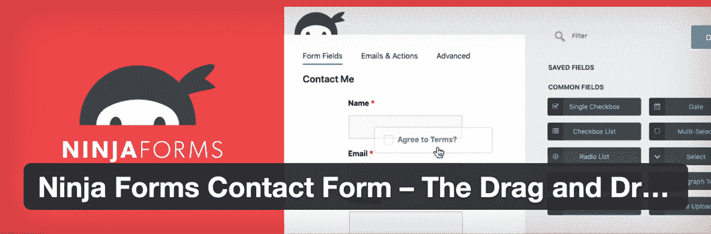

Use Ninja Forms to put Mailchimp forms on WordPress.org

Ninja Forms 插件提供了构建漂亮的联系、注册和潜在客户生成表单的特性，所有这些都不需要任何编码。您还可以添加额外的表单域，以从提交的客户处获取特定信息。此外，Ninja Forms 还集成了几个电子邮件营销提供商，包括 Mailchimp。有了这种集成，你就可以利用超级忍者形态的设计特性，同时还可以向优秀的老 **Mailchimp** **观众** **经理**发送订阅。

要使用 Ninja Forms 在 Mailchimp 和 WordPress 之间建立连接，进入你的 WordPress 仪表盘并安装 Ninja Forms 插件。这可以通过进入**插件>添加新的**并在搜索栏中键入“忍者形态”来完成。

安装并激活忍者形态。这个免费插件可以制作各种各样的联系人表单样式，但是你还必须[购买并安装 49 美元的 Mailchimp for Ninja Forms 扩展](https://ninjaforms.com/extensions/mailchimp/)来添加将这些表单链接到你的 Mailchimp 数据库的功能。

The Mailchimp for Ninja Forms extension is required

然后您可以从 Ninja Forms 网站查看文档，为您的 Mailchimp 邮件列表配置一个表单。

#### 如何用重力形式设置 Mailchimp

另一个表单插件叫做 Gravity Forms，它使得为 WordPress 配置 Mailchimp 变得容易，同时也提供了优秀的表单设计工具。

Gravity Forms 没有免费计划，但你可以每年花 59 美元获得基本版。你还需要激活 Mailchimp 插件，这是所有 Gravity Forms premium 计划免费提供的。

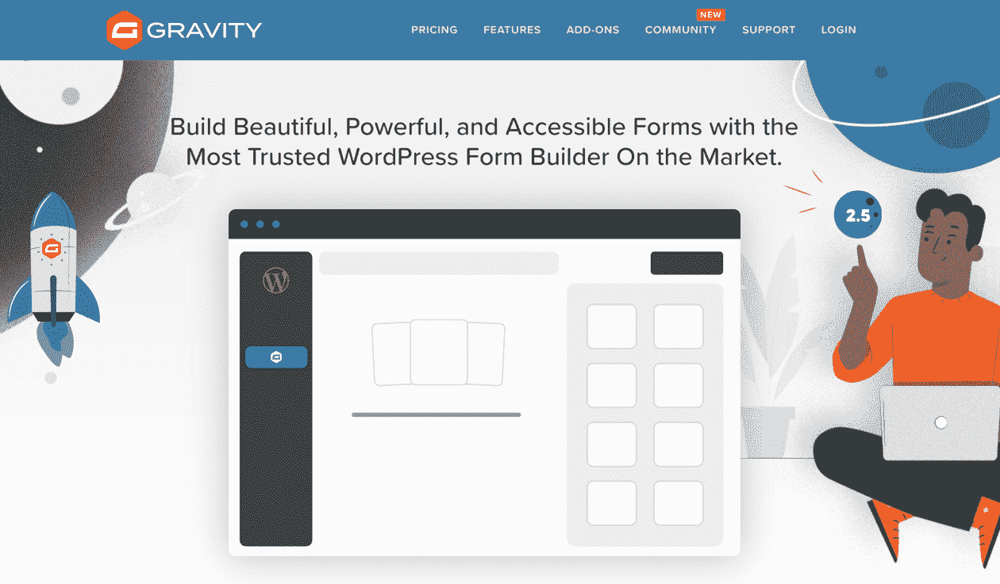

Think about using Gravity Forms to link Mailchimp to any WordPress.org site

Gravity Forms 没有免费的 WordPress 版本，所以你需要[在 Gravity Forms 网站](https://www.gravityforms.com/)注册一个账户。然后你为插件付费，下载到你的电脑，并上传到你的 WordPress 网站。

这可以通过进入 WordPress 仪表盘中的**插件>添加新的>上传插件**来完成。安装完成后，点击**激活**按钮使其运行。

在 Mailchimp 上使用重力形态的第一步是打开 Mailchimp 插件。在 WordPress 中，点击**表单>附加组件**。**形态**按钮是新的重力形态按钮。

找到 **Mailchimp** **附加**部分，点击**激活**按钮。这通常需要您登录您的 Gravity Forms 帐户来激活该功能。您应该会在 **Mailchimp** **附加模块**下方看到一个绿色的**活动**指示灯。

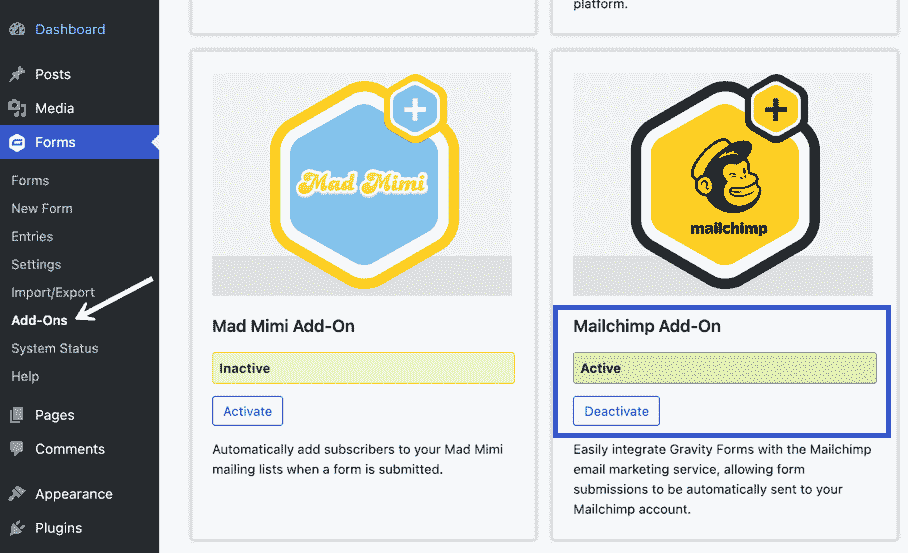

Locate and “Activate” the “Mailchimp Add-on” for Gravity Forms

您现在已经有了 Mailchimp 附加组件，但是仍然需要将您的 Mailchimp 帐户连接到该附加组件。

就像 Ninja Forms(以及每一个连接到你的 Mailchimp 账户的插件)，你需要在 Mailchimp 仪表板中生成一个 API 密匙；然后将该关键点粘贴到**重力形式设置**中以完成整合。

在 Mailchimp 中，点击屏幕左下角的个人资料头像。进入**账户>附加项目> API 密钥**，然后向下滚动找到**你的 API 密钥**部分。

对于每个新的应用程序集成，制作一个新的 API 密钥是明智的。例如，如果你已经测试了忍者形态的 Mailchimp 连接，你也应该为重力形态做一个新的。

点击**创建密钥**按钮继续。

下一个屏幕在第四列显示了一个 **API 键**，您应该将它复制到您的剪贴板上。

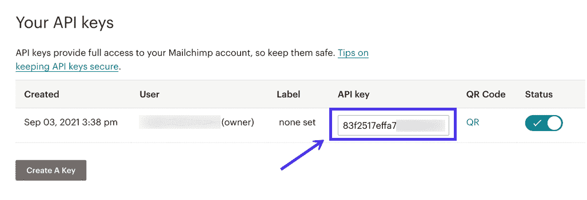

Your API key location.

关闭 Mailchimp 并返回 WordPress。

转到**表单>设置> Mailchimp** 。

在 **Mailchimp** **设置**面板下寻找**Mailchimp****API****Key**字段。

将您从 Mailchimp 复制的密钥粘贴到字段中。

确保点击**保存** **设置**激活整合。

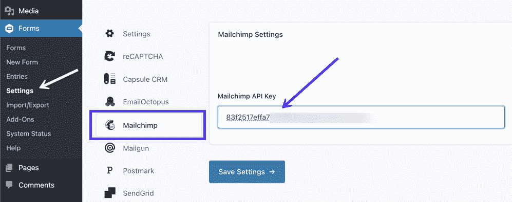

Go to “Settings” > “Mailchimp” under “Gravity Forms” to paste in your “Mailchimp API Key”

激活 Gravity Forms/Mailchimp 连接后，您可以在 Gravity Forms 编辑器中从 Mailchimp 访问所有受众电子邮件列表。

之后，[阅读 Gravity Forms 网站上的插件文档](https://www.gravityforms.com/add-ons/mailchimp/)以完成任务，如制作选择加入表单、分割电子邮件列表和启用双重选择加入表单。

### 如何为 WordPress 添加 Mailchimp 小部件

除了将 Mailchimp 表单放在 WordPress 页面或帖子上，您还可以插入一个 WordPress 小部件来显示表单。小工具有几个优点，特别是当涉及 Mailchimp 选择加入表单时:它们非常适合最小化表单占用的空间，并且小工具出现在大多数页面上，所以访问者不会只在一个页面上被提示注册您的电子邮件列表。

使用小部件为 WordPress 配置 Mailchimp 有几种方法:

1.  通过将 HTML 代码复制并粘贴到小部件中
2.  用短代码
3.  从插件

首先，我们将向您展示如何通过将 HTML 代码复制并粘贴到小部件中来添加 Mailchimp 表单小部件。这几乎与我们在本文前面介绍的方法相同——从 Mailchimp 获取 HTML 代码并将其粘贴到 HTML 块中——但是这一次，我们将代码粘贴到小部件中，而不是页面或 post 块中。

因此，去 Mailchimp，点击**观众>注册表格>嵌入式表格**。

随意选择想要嵌入到小部件中的表单的样式。经典的形式工作得很好，但是**浓缩的**版本更容易适应小部件提供的少量空间。你甚至会发现，根据你的 WordPress 主题的布局，**水平**形式看起来更好。

对于这个例子，我们将选择一个压缩的形式。

无论您使用哪种格式，配置所有需要的设置，然后在**复制/粘贴到您的站点**部分选择整个代码块。将代码复制到剪贴板。

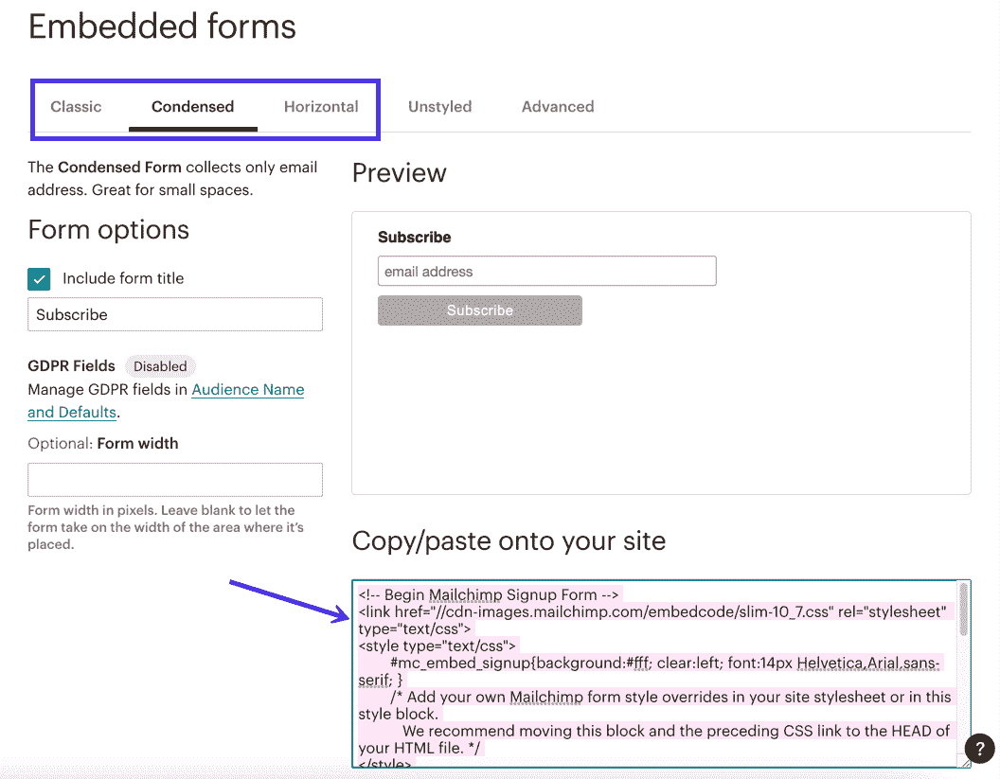

Design a form in the “Embedded Forms” section, then copy the code to bring it over to a WordPress widget

回到 WordPress，进入**外观>定制**。还有一个**小部件**按钮，可以把你带到同一个地方。

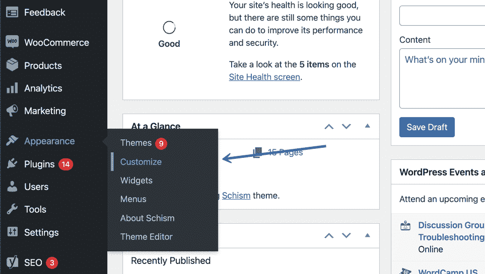

In WordPress, click on “Appearance” > “Customize”

一旦进入 WordPress 定制器，选择**窗口小部件**按钮。

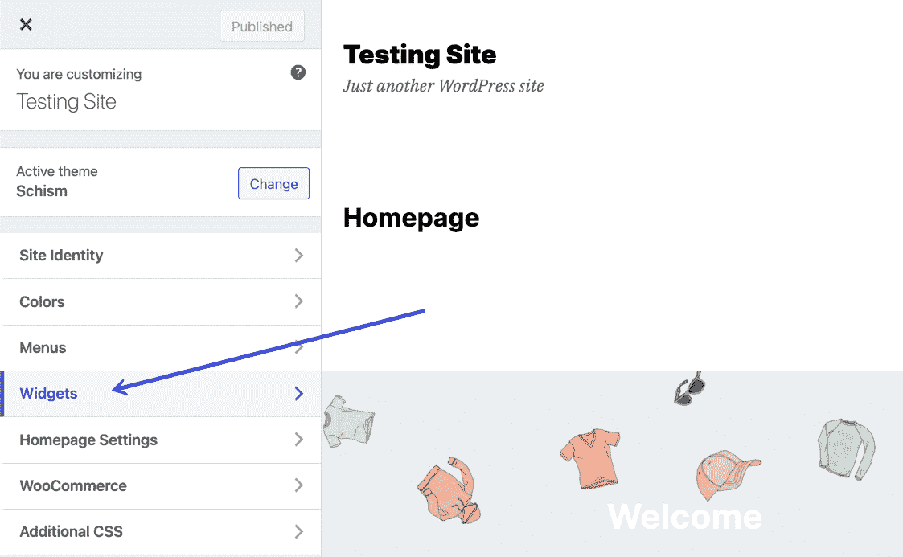

Open the “Widgets” section

这为当前安装的主题显示了几个指定的小部件区域。每个主题都有其独特的小部件支持，所以你可以在边栏、页眉或页脚看到小部件的选项。一些主题不允许窗口小部件，而另一些主题有许多窗口小部件的位置。

单击对 Mailchimp 表单最有意义的小部件区域。对于本教程，我们将使用**页脚** **列** **1** 位置。

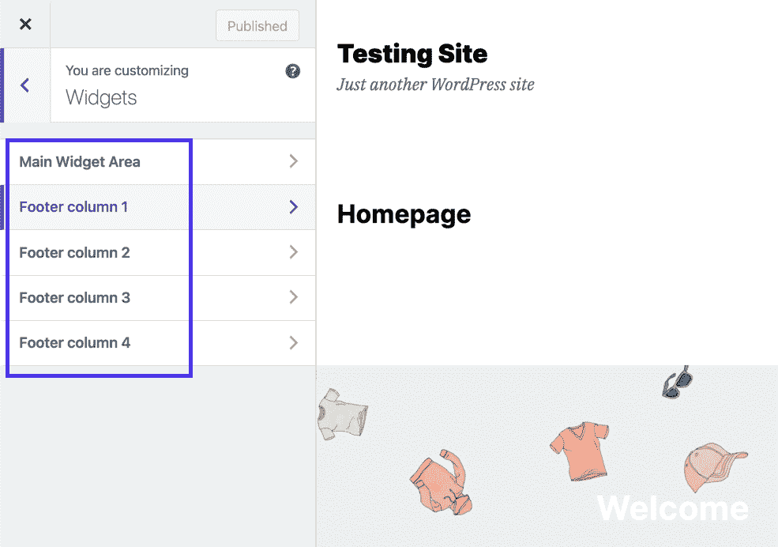

Pick one of the “Widget Areas”

您可以像在页面或帖子中插入块一样插入小部件。点击**添加** **块**(黑白加号按钮)以显示**添加** **块**库。

搜索“html”，然后点击看到的**自定义** **HTML** 阻止小工具。

Use the “Add A Block” search panel to find and choose the “Custom HTML” block

**自定义 HTML** 块提供了一个空白字段，可以粘贴您想要的任何 HTML。因此，将您之前复制的 Mailchimp 表单代码粘贴到剪贴板。

WordPress 定制器现在应该在屏幕的右侧呈现一个小部件表单的预览。

确保您点击了**发布**按钮来呈现对您的实时网站的更改。

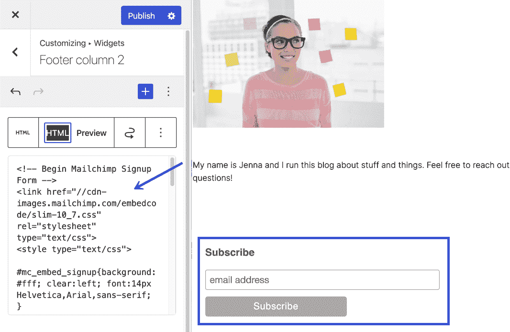

Paste the form code into the “Custom HTML” block to see a live preview

#### 使用短代码添加表单小部件

短代码是更简单、更容易理解的代码行，本质上与 HTML 代码块做同样的事情，只是它们更容易引用和复制到另一个位置。

## 注册订阅时事通讯

### 想知道我们是怎么让流量增长超过 1000%的吗？

加入 20，000 多名获得我们每周时事通讯和内部消息的人的行列吧！

[Subscribe Now](#newsletter)

我们只建议[使用短代码](https://kinsta.com/blog/wordpress-shortcodes/)，如果你已经安装了一个提供短代码特性的表单插件。否则，你还不如利用上面的免费 HTML 版本，或者考虑找一个插件，它也有一个 Gutenberg 块，可以更好地控制表单的设置。

因此，我们鼓励你检查你已经安装的任何当前表单插件。如果它有一个短代码特性，并且你发现这比其他方法更直观，请使用它们！

例如，Ninja Forms 为你用插件制作的每个表单提供了一个简码。

要将表单短代码插入到小部件中，请导航到所选的插件(在本例中是 Ninja Forms)。你可以通过进入**忍者形态>仪表盘**找到短码。滚动表单列表，复制想要插入到小部件中的表单旁边的短代码。

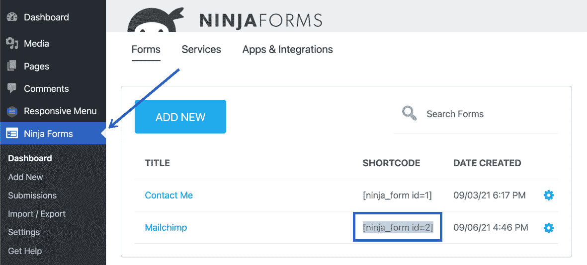

Ninja Forms generates shortcodes for every form you make

前往**外观>定制**。

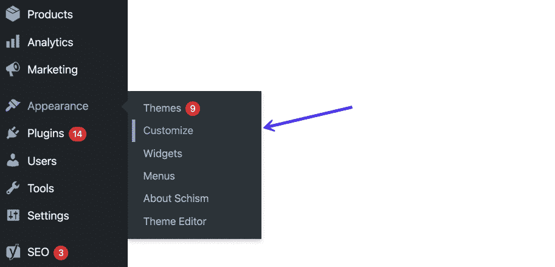

Take the copied shortcode and go to the “Customize” tab in WordPress

选择 **Widgets** 选项卡编辑您的 Widgets。

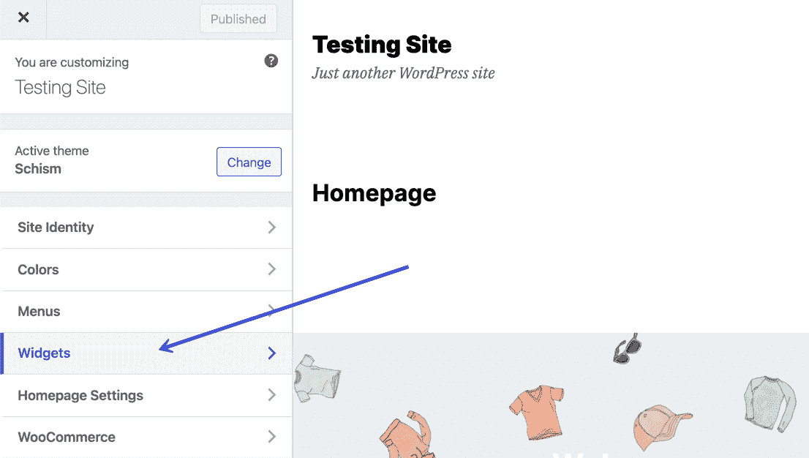

Navigate back to the “Widgets” panel

点击**添加** **块**按钮(黑白加号)，输入“shortcode”显示内置的 **Shortcode** 块。

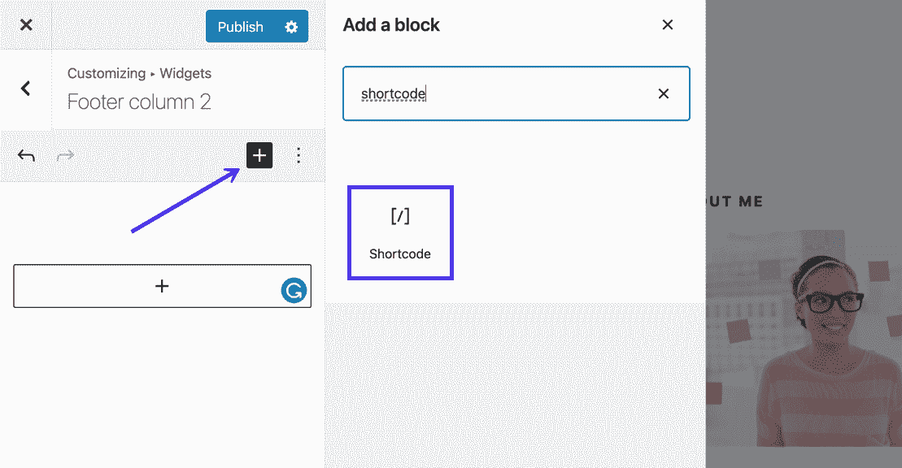

Use the “Add A Block” tool to find and insert the “Shortcode” block

将先前复制短代码粘贴到可用字段中。

WordPress 定制器应该在窗口小部件区域生成表单的预览。

请记住，用 HTML 代码或短代码发布的表单要求您在 Mailchimp 中编辑表单设置。没有办法在 WordPress 代码小部件中定制像字段或字段标题这样的元素。

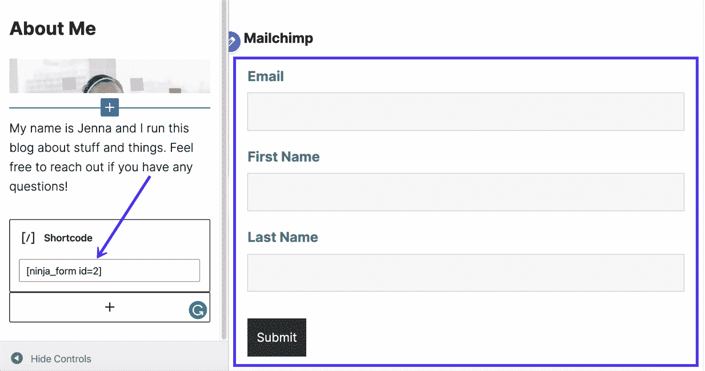

You can paste your shortcode into the “Shortcode” field; after that, a preview appears

#### 使用插件(带有 WordPress 块)将 Mailchimp 添加到小部件中

Mailchimp 表单插件包含 WordPress 块而不是 shortcodes 变得越来越普遍，这是因为块不那么吓人，提供内置设置，并且可以插入到帖子、页面和小部件中。

尽管我们建议跳过上面的 shortcode 方法，除非你已经安装了一个带有 short code 的插件，但对于带有块的插件，我们会说相反的话。这是因为不可否认的是，使用一个块要简单得多，所以用一个完全独立的插件来提供这种便利也没什么不好。

一个用来添加插件块的插件叫做[另一个 Mailchimp 插件叫做](https://wordpress.org/plugins/another-mailchimp-widget/)。我们将使用该插件来演示如何在小部件中放置块，但是还有许多其他插件可以考虑，它们都以相同的方式工作，至少是在小部件中插入块。然而，根据你选择的插件，这个模块会有不同的名字和独特的设置。

继续使用另一个 Mailchimp 插件，进入 WordPress 仪表板并安装该插件。

一旦激活，进入**设置>另一个 Mailchimp** 。

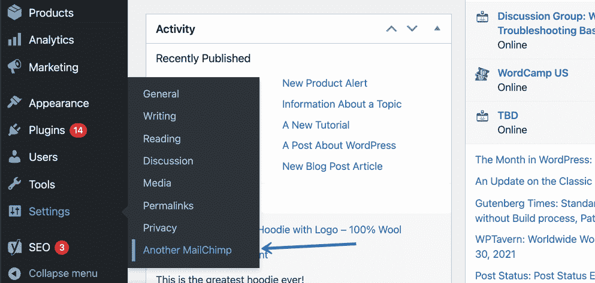

Find the “Another Mailchimp” tab in WordPress to manage all of the plugin’s settings

跳转到 Mailchimp 仪表板获取 API 密钥。

为此，点击屏幕左下角的**个人资料**图标。然后，进入**档案>附加> API 密钥**。点击**创建密钥**按钮，生成一个新密钥。

在**您的 API 密匙**部分，组合出现在 **API 密匙**列的下面。

As with most Mailchimp plugins, you must grab the “API Key” from Mailchimp first

导航回到 WordPress 仪表盘，在那里你应该打开插件的**设置**页面。

将 API 密钥粘贴到字段 **Mailchimp API 密钥**中。

点击**保存** **修改**。

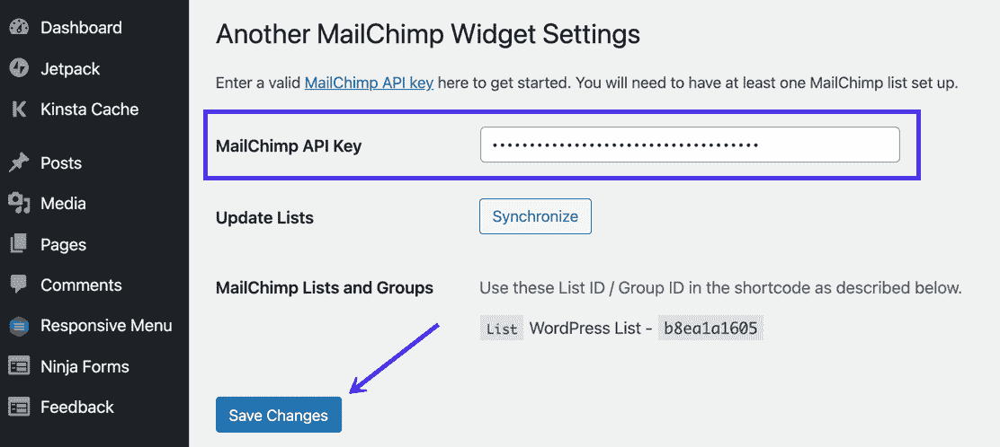

Paste in the key and click “Save Changes”

现在，这个插件已经链接到你的 Mailchimp 账户，用于选择合适的受众，并向电子邮件列表数据库发送新订户。

还是在 WordPress，去**外观>自定义> Widgets** 。选择你想要定制的窗口小部件区域，然后点击**添加** **块**(黑白加号)按钮打开可用 WordPress 块库。

输入“mailchimp”，然后选择另一个 Mailchimp 小工具。

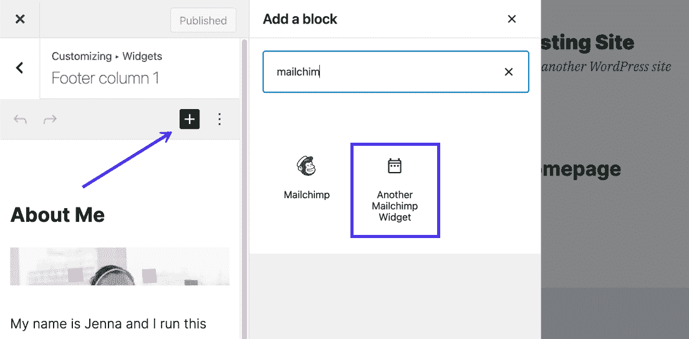

Add the “Another Mailchimp Widget” into the “Widgets” section

看到这是一个小部件，而不是一段粘贴的代码，您可以进行设置来定制 Mailchimp 表单的某些方面。例如，这个小工具要求你输入一个标题。您还需要选择用户列表和用户组(Mailchimp 受众)来生成右侧预览中的表单。例如，一旦我们选择了 **WordPress** **列表** **受众，**选择加入表单出现在 WordPress 定制器中。

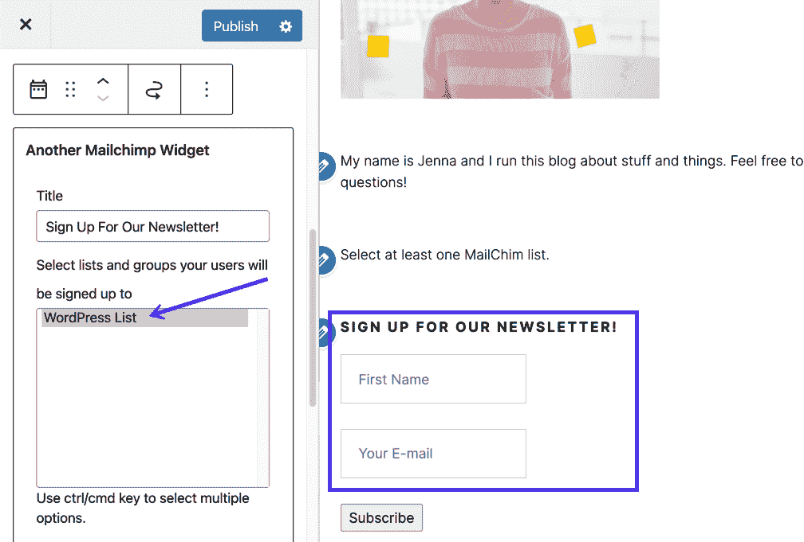

Select a Mailchimp list to render a form widget preview

最后，您可以使用这个小部件浏览所有设置。更改字段标签，决定不仅仅收集电子邮件地址，并写出自定义的成功消息。如前所述，这些设置只是在小部件中使用块比短代码或 HTML 代码更有优势的原因之一。

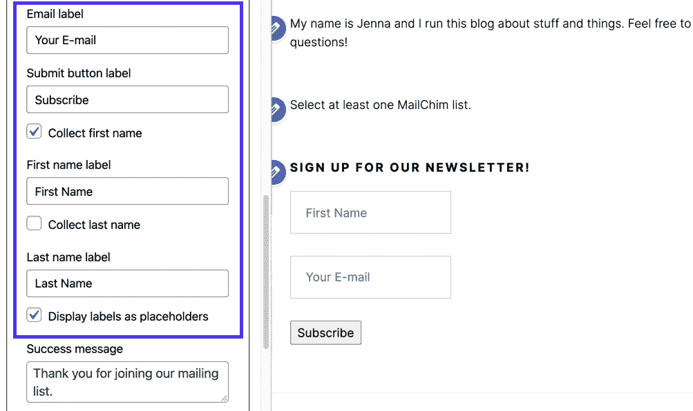

Customize parts of the form widget using form fields

## 如何将博客文章从 WordPress 自动发送到 Mailchimp

每当你在 WordPress 上发表一篇博客文章时，[自动发出一封电子邮件活动](https://kinsta.com/blog/email-marketing-automation/)不是很棒吗？

有很多方法可以实现这一功能，但是它们通常不能提供 Mailchimp 所提供的设计控制。我们希望确保我们将电子邮件发送给更新的 Mailchimp 受众列表。因此，配置 Mailchimp 来发送这些自动化的博文通知是有意义的。

幸运的是，如果你找到了博客的 RSS 源，设置起来很容易。首先，[找到 WordPress 博客的 RSS 订阅源](https://kinsta.com/blog/wordpress-rss-feed/#does-wordpress-have-rss-feeds-and-how-do-you-find-them),并检查以确保它正常工作。

WordPress 网站的主要 RSS 源位于 http://example.com/feed 的/。所以你可以把`/feed/`放在你的 URL 的末尾，看看是不是这样。

然而，情况并非总是如此，因此您可能需要测试其他选项，例如:

*   http://example.com/feed/rss/
*   http://example.com/feed/rss2/
*   http://example.com/feed/rdf/
*   http://example.com/feed/atom/

如果在下面的步骤中粘贴博客 URL 失败，Mailchimp 会尝试查找您的 RSS URL。

一旦有了 RSS 提要，就该把它粘贴到 Mailchimp 中了。

在 Mailchimp 仪表板上，点击**自动**菜单项。

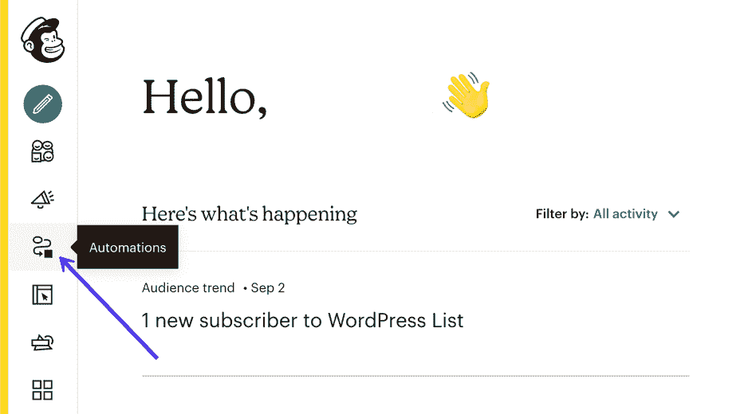

Go to “Automations” in Mailchimp to start sending out new blog post notifications

Mailchimp 上有几十个预建的自动化程序要创建，所以你必须向下滚动**自动化程序**页面，找到要**分享** **你的** **博客** **帖子**的那个。

这种特殊的自动化将一个 RSS 提要链接到一个电子邮件活动，这样您就再也不用手动为新的博客文章发送电子邮件了。你可以定制这些电子邮件的设计，而不是依赖另一个插件的通用设计。

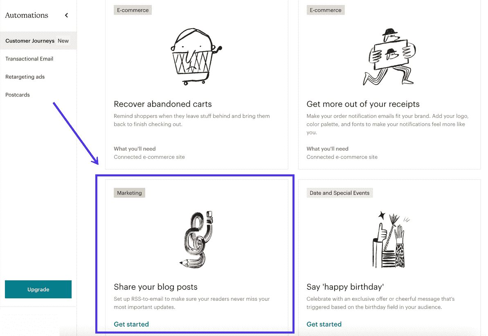

Click the “Get Started” link to “Share Your Blog Posts”

以下弹出模块要求您键入一个**活动** **名称**。你还应该选择哪个 **Mailchimp** **列表**应该接收你的自动 RSS 邮件。

点击**开始**按钮继续。

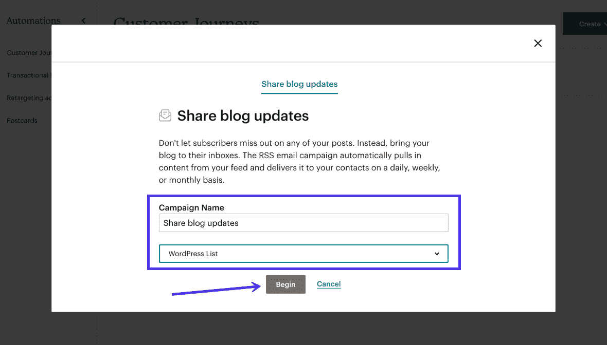

Make a “Campaign Name” and mark which “Mailchimp List” should receive the blog updates

你可以从这个特定的页面定制 **RSS 提要和发送定时**，但最关键的部分是粘贴在 **RSS** **提要** **URL** 中，以便 Mailchimp 从你的博客中提取数据。

之后，决定你的自动博客文章邮件的发送频率、日期和时间。

最后，指定你是否希望 Mailchimp 尝试为你的电子邮件活动调整****RSS****图片**的大小。我们已经从这个工具中看到了不同的结果，所以确保您最初运行的测试中只有您一个人在列表中。如果您看到拙劣的图像，您可以移除**调整大小** **RSS** **提要** **图像**设置。**

 **完成此页面后，选择**下一个**按钮。

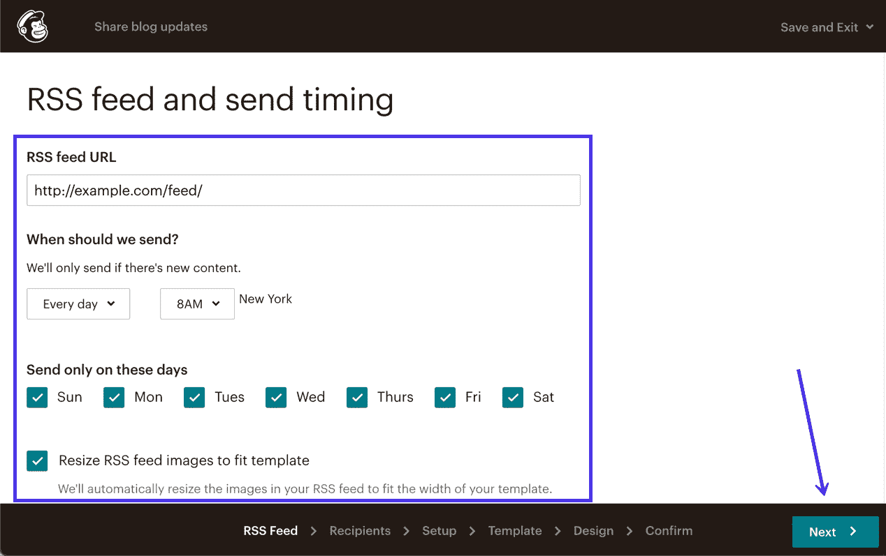

Paste in the “RSS Feed URL” and add your desired send timing settings

在**收件人**页面上，选择将您的博客更新发送给以下群组之一:

*   **全体观众**
*   **段或标签**
*   **组或新段**

通过向某个部门或群体发送邮件，你很可能会获得更好的结果，但许多公司只有一个电子邮件列表。如果是这样的话，用你的新博文更新整个****受众**是没有问题的。**

**Struggling with downtime and WordPress problems? Kinsta is the hosting solution designed to save you time! [Check out our features](https://kinsta.com/features/)

点击**下一步:设置**按钮前进。

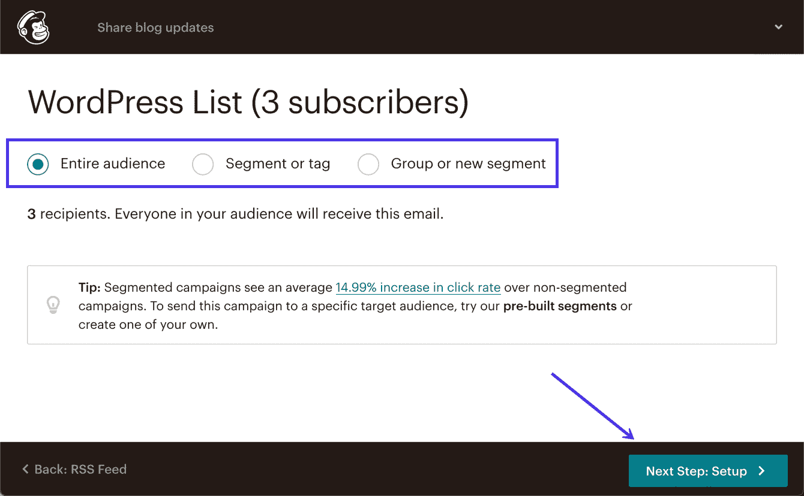

Pick the “Entire Audience” or a specific “Segment” or “Group” from that Audience

您可以在这里配置活动信息，如活动名称、电子邮件主题行和许多其他设置。

请记住，这种自动消息不会为您发布的每一篇独特的博客文章进行定制。正因为如此，你想创建一个邀请，但不具体的**电子邮件** **主题**和**预览** **文本**。

在该页面上可以配置的其他设置包括**发件人** **姓名**，**发件人** **电子邮件** **地址**，以及**个性化“收件人”字段**的选项。

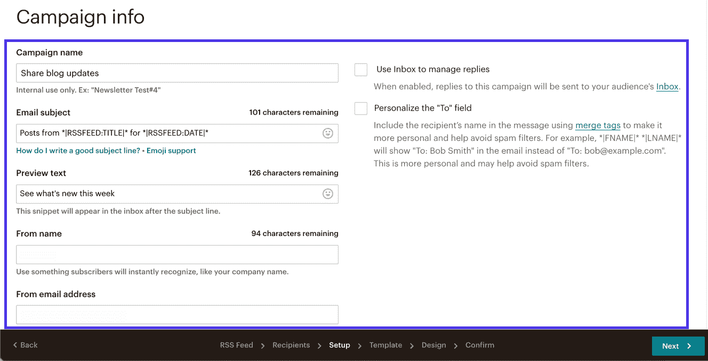

Go through the “Campaign Info” page to configure settings like the “Campaign Name,” “Email Subject,” and more

在点击**下一个**按钮之前，在页面上向下滚动，以标记您想要在电子邮件中包含的任何**跟踪**或**社交** **媒体**元素。你可能想要跟踪打开、点击和简单点击的文本，或者甚至链接到脸书或 Twitter 来自动发布。

完成所有操作后，点击下一个按钮**。**

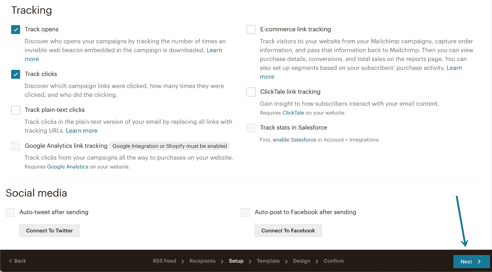

Set up everything from tracking to social media automation on this page

**选择模板**部分允许您从空白**布局**、**主题**、**保存的**、**模板**和**活动**中制作一个活动模板。如果你愿意，你甚至可以**编码** **你的** **拥有**。

自动化的博客文章邮件应该坚持基本原则:你的品牌的颜色、字体和标志。

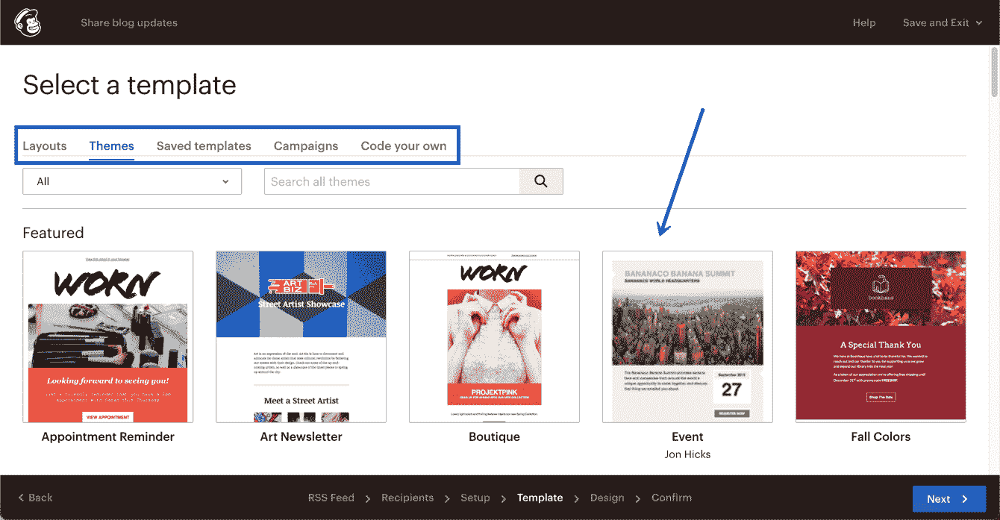

Decide on an email template for your automated blog post updates

一旦你进入 Mailchimp 设计器，你会想要去掉所有的填充内容，比如图像、示例文本和按钮。

Mailchimp 会自动将自动 RSS 订阅源中的每篇文章的图片、预览文本和按钮放入电子邮件中。除了你的商标和品牌颜色之外，其他任何东西看起来都不合适。

点击**下一个**按钮，查看最终确认页面。

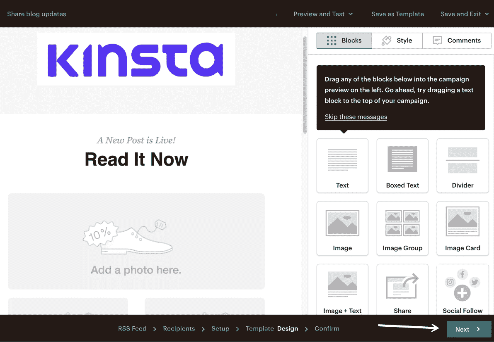

Make sure you insert brand elements like your logo and colors

如果你的活动有任何问题(比如 RSS 活动中填充内容太多)，Mailchimp 会在这个页面上告诉你。否则，它会告诉你，你已经准备好发送自动电子邮件。

点击**开始** **RSS** 按钮激活活动。记住，除非你在你的 WordPress 博客上发表了一篇文章，否则不会有任何东西发送给你的 Mailchimp 读者，就像 RSS 订阅是如何引发这场运动的。

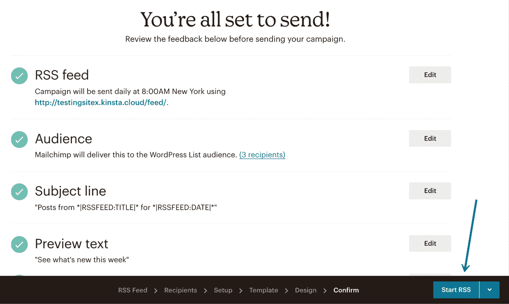

Check that everything is alright by Mailchimp, then click the “Start RSS” button

**注意:**WordPress.com 提供了和 WordPress.org 一样的 RSS 功能。所以，只要你弄清楚了 RSS URL，如果你使用的是 WordPress.com，这个过程是一样的。

## 为 WooCommerce 在线商店配置 Mailchimp

Mailchimp 为 WooCommerce 在线商店提供集成，允许商家在自动化、重定向电子邮件等帮助下增加收入潜力。

你想用 Mailchimp 设置的一些更标准的电子商务邮件包括废弃的购物车、产品重新定位、购买后电子邮件、收据、欢迎信息和促销优惠券通知。

这些对于经营一个网上商店是必不可少的，所以那些企业必须有一个可靠的集成。这就是 WooCommerce 插件 Mailchimp 发挥作用的地方。

这一节将概述如何为 WooCommerce 配置 Mailchimp，我们将触及如何运行您的自动化电子商务消息。

在 WordPress 仪表盘中安装 Mailchimp for WooCommerce 插件开始使用。该插件可用于 WordPress.org 和 WordPress.com 的网站。唯一的限制是，如果你使用 WordPress.com，你必须有一个安装这样一个插件的商业计划。

Install the Mailchimp for WooCommerce plugin for ecommerce automations

激活插件后，你会进入一个设置向导，将你的 WooCommerce 站点与 Mailchimp 链接起来。

点击**连接**T2 账户按钮开始该过程。

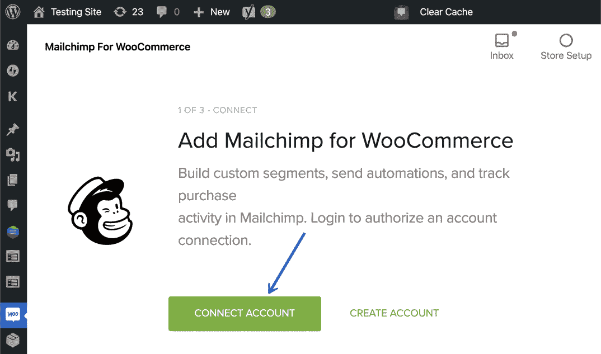

The plugin starts with a setup wizard, where you can click the “Connect Account” button

使用你的**用户名**和**密码**登录 Mailchimp。点击**日志** **中的**按钮后。

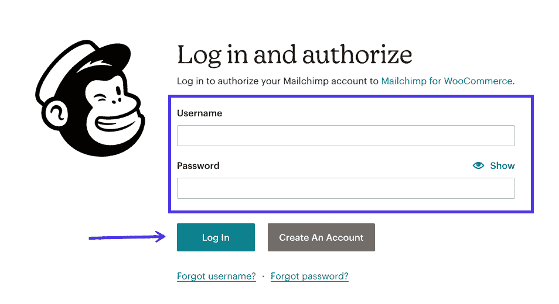

You will most likely have to log into your Mailchimp account once more

该插件提供了它如何访问你的 Mailchimp 账户的信息。

选择**允许**按钮来指定你信任这个插件。

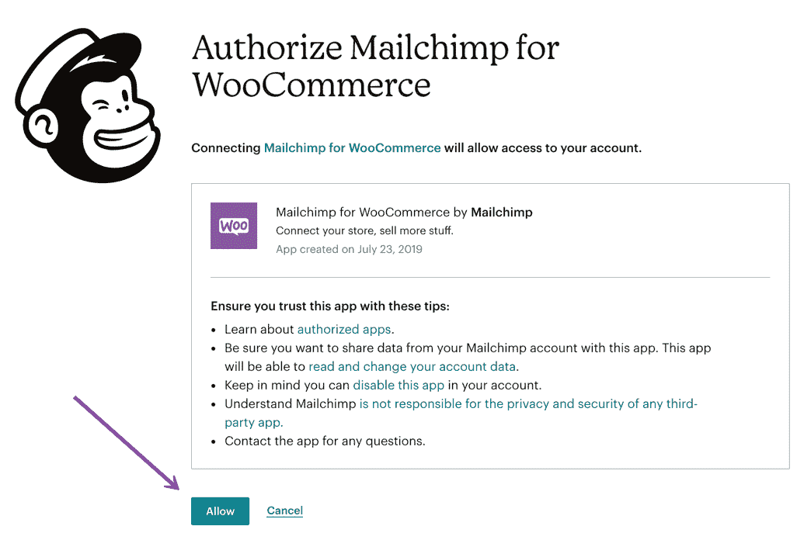

Choose “Allow” on the next screen

WooCommerce 的 Mailchimp 插件需要一些额外的信息来为它的电子邮件填充正确的内容，尤其是那些自动化的电子邮件。

因此，请在必填字段中填入您的**姓名**、**电子邮件**、**地址**和**电话**、**号码**等信息。

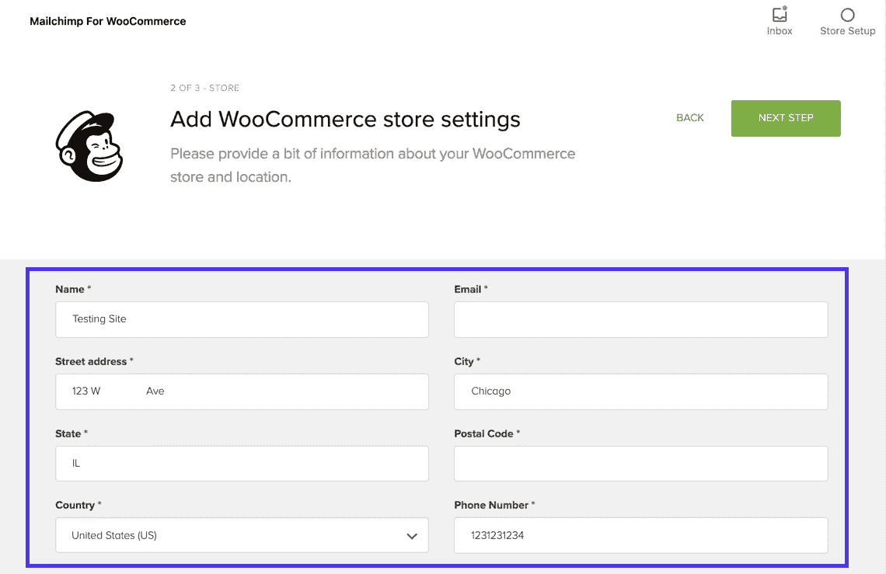

Complete the fields for all personal information

进入页面底部为插件设置商店**区域设置**和**权限** **设置**。您可以将访问权限授予**商店经理和管理员**或仅授予**管理员**。

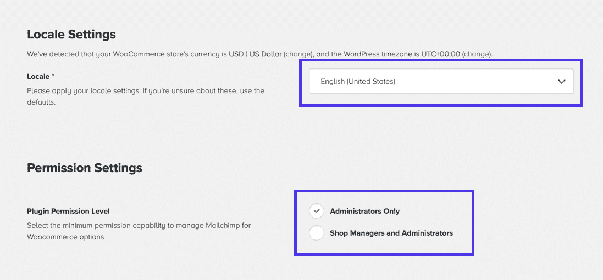

Modify the “Locale” and “Permission Settings”

返回页面顶部点击**下一步** **下一步**按钮。

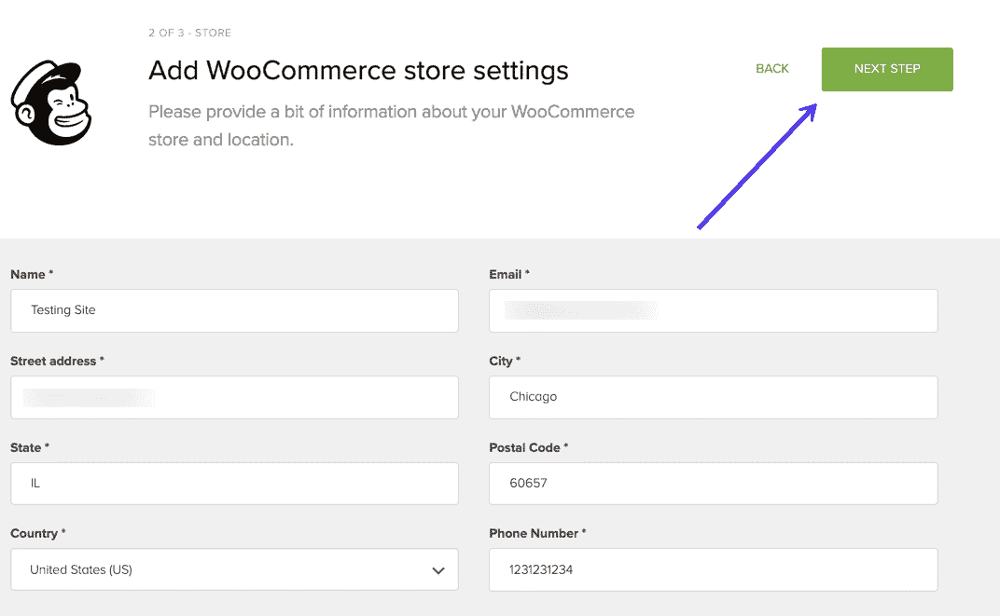

Go back to the beginning of the page to click the “Next Step” button

在**观众** **名字**下，选择你想要链接到插件的 **Mailchimp** **观众**。如果你只有一个(像我们一样)，那么默认情况下会选择**观众**。

你也可以选择自动订阅所有现有的订阅者，给你的电子邮件添加一个默认的**主题**，并包含一个**许可** **提醒** **消息**，这样人们就知道他们为什么会收到你公司的电子邮件。

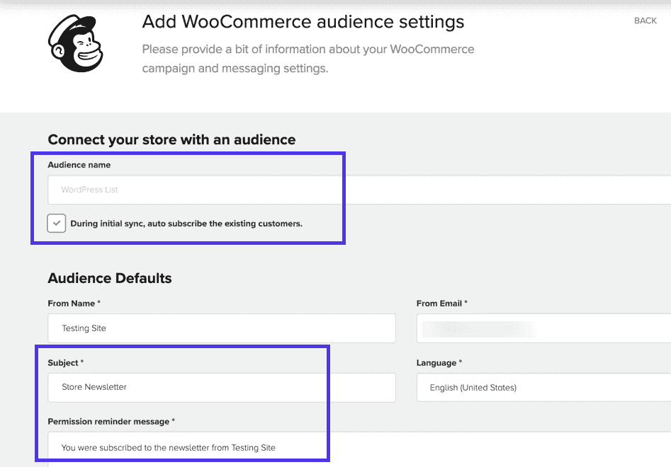

Pick the desired “Audience,” then complete things like the email “Subject,” “From Name,” and “Permission Reminder Message”

Mailchimp for WooCommerce 插件会自动在你的 WooCommerce 结账模块中添加一个**订阅**复选框。有一些设置可用于更改复选框的可见性以及人们看到的信息。

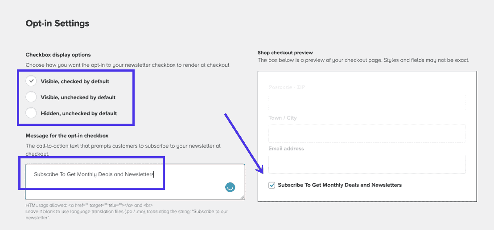

Under “Opt-in Settings,” change the look and feel of the Checkout page’s opt-in box

本页最后几个字段通常可以保持原样。如果您有 WooCommerce 表单操作的经验，请随意管理您的**option****复选框**的位置。您还可以在注册您的列表时给每个新订户一个标签。

最后，**产品** **设置**部分提供了一个下拉菜单来调整默认的**产品** **图片** **尺寸**当它们在你的邮件中自动生成时。这可能需要测试，看看不同尺寸的图像看起来如何。一般来说，坚持使用默认的**中等 300×300** 图像尺寸并不是一个坏主意。

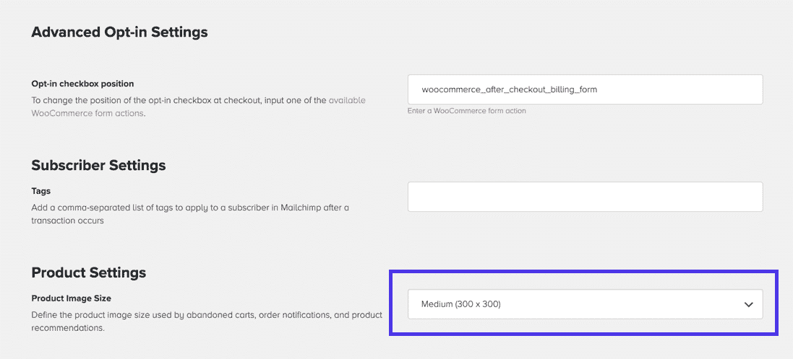

Don’t forget about deciding on a default “Product Image Size” for the WooCommerce emails

回到**观众** **设置**页面顶部，点击**开始** **同步**按钮。sync 开始从 Mailchimp 中提取所有必要的数据，以便与 WooCommerce 配合使用。

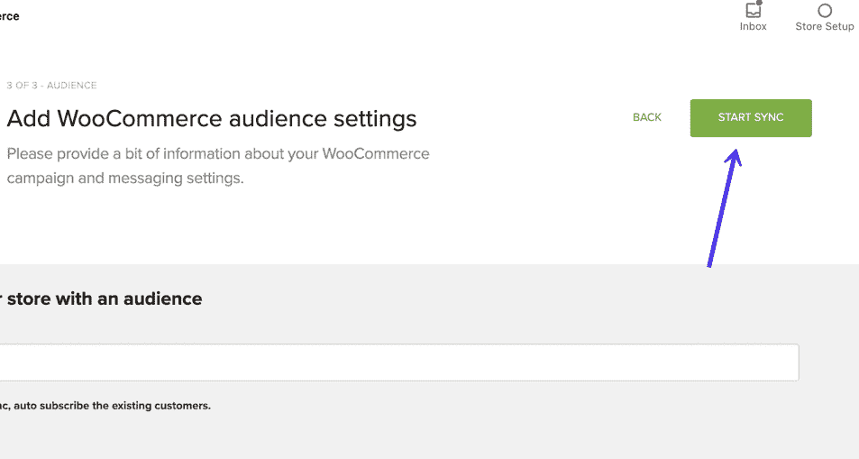

Click on the “Start Sync” button

您将看到一条**成功**消息，表明 Mailchimp 已连接到您的 WooCommerce 插件。

在此之下，该插件会呈现一些信息，比如你的商店中有多少产品、订阅用户的数量以及你的 Mailchimp 帐户中的交易电子邮件。

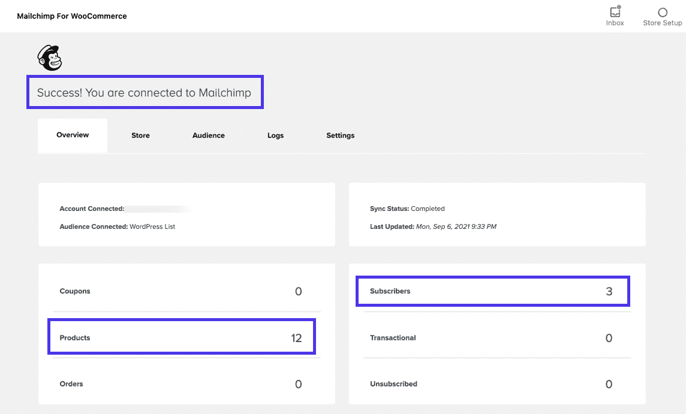

The “Success” page details products and subscribers count

就此打住是完全合理的。WooCommerce 的 Mailchimp 插件处于活动状态，当用户通过您的收银台时，它会收集用户的电子邮件地址。

然而，考虑到 Mailchimp 提供了大量通过该插件工作的自动化功能，我们鼓励您在拥有一个基本注册表单的基础上进行扩展。

好消息是，其中大多数都可以在 Mailchimp 仪表板中轻松管理。在 WordPress 中没有太多其他要完成的。

在 Mailchimp 中，点击**集成**菜单项。

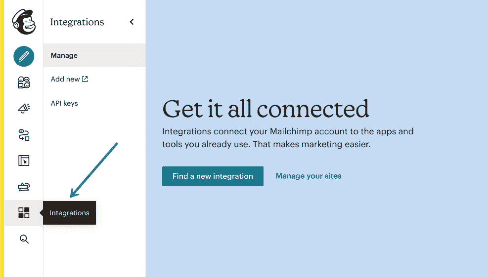

Go to the “Integrations” page in Mailchimp

**集成**页面提供了一长串第三方程序。向下滚动(或查看**电子商务**部分，找到并点击 **WooCommerce** 。它应该已经有一个绿色的勾号，表明你已经通过 Mailchimp for WooCommerce 插件集成了。

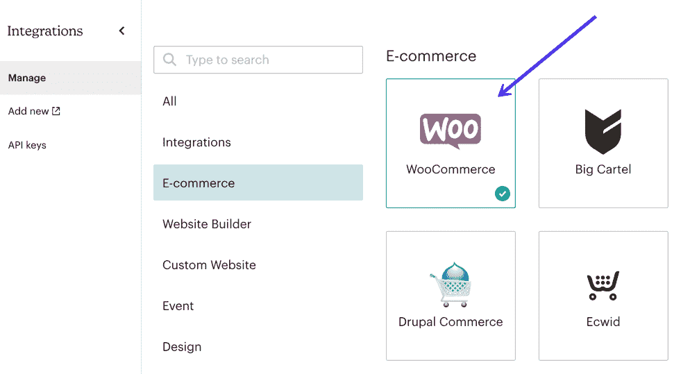

Find the “WooCommerce” button in the “Integrations” library

点击**管理** **贵** **站点**按钮。

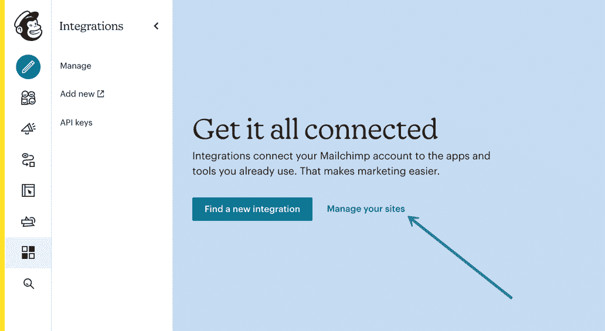

The “Manage Your Sites” link guides you to the sites you’ve connected to Mailchimp

你的网站名称显示在页面的顶部。这应该告诉你，你已经找到了适当的整合。它还会通知您 WooCommerce 何时连接，这可能会有所帮助。

总的来说，这个页面为你的新 WooCommerce/Mailchimp 集成提供了最流行的自动消息选项。

您可以点击**添加**按钮，为您的在线商店创建以下任何内容:

*   **弹出表单**
*   **废弃购物车邮件**
*   **产品重新定位电子邮件**
*   **订单通知**

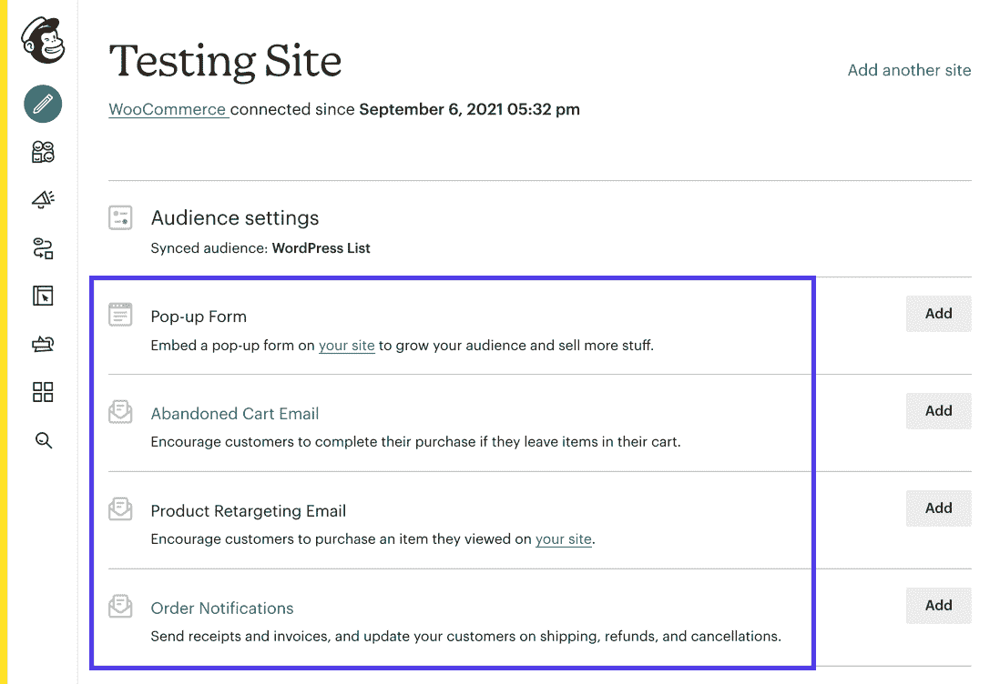

Quite a few tools are available for WooCommerce, including “Pop-up Forms,” “Abandoned Cart Emails,” and more

底部的小链接可以让你看到更多 WooCommerce 可用的自动化列表。点击**电子商务自动化**链接查看。

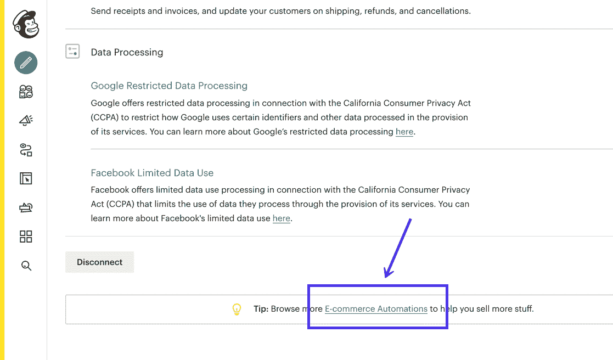

Don’t forget about the entire list of “E-Commerce Automations”

在列表中，您将看到针对以下内容的有用自动化电子邮件:

*   感谢新顾客
*   奖励你最好的顾客
*   重定向网站访问者
*   打开废弃购物车电子邮件
*   跟踪购买情况
*   赢回流失的顾客

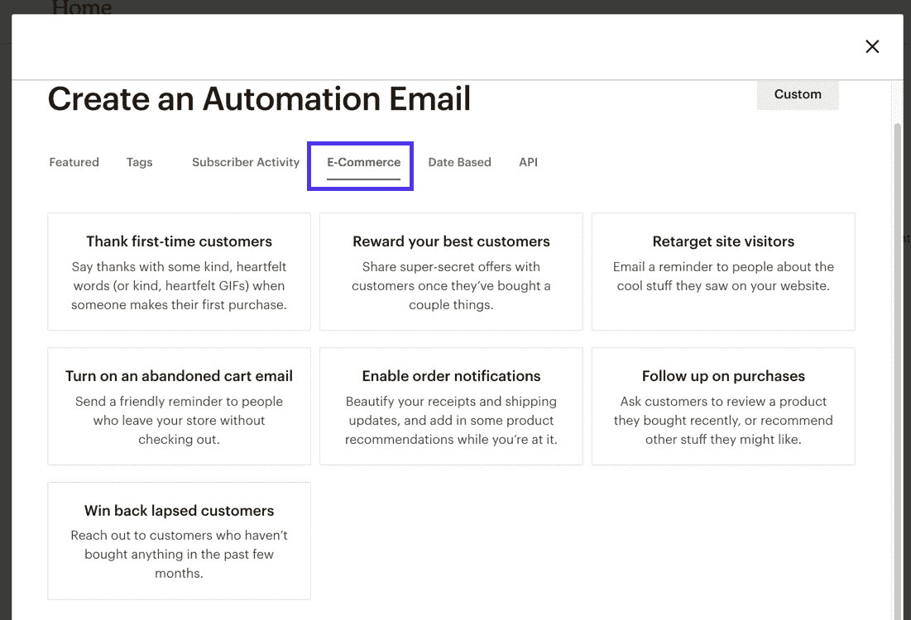

Consider automation like thanking first-time customers, following up on purchases, and retargeting

我们不会指导你完成这些潜在的电子商务自动化。相反，我们将创建一个快速的**废弃的** **购物车** **通知**来展示使用模板和已经实现的来自 Mailchimp 的合并标签进行配置是多么容易。

如果您选择了**废弃** **购物车** **通知**选项，Mailchimp 会为您填充绝大多数设置。

然而，您可以点击**编辑**按钮来调整以下任何一项:

*   **发送到**设置，决定发送邮件前等待多长时间
*   来自的**电子邮件地址**
*   您的每一条废弃购物车消息的主题
*   邮件的**内容**

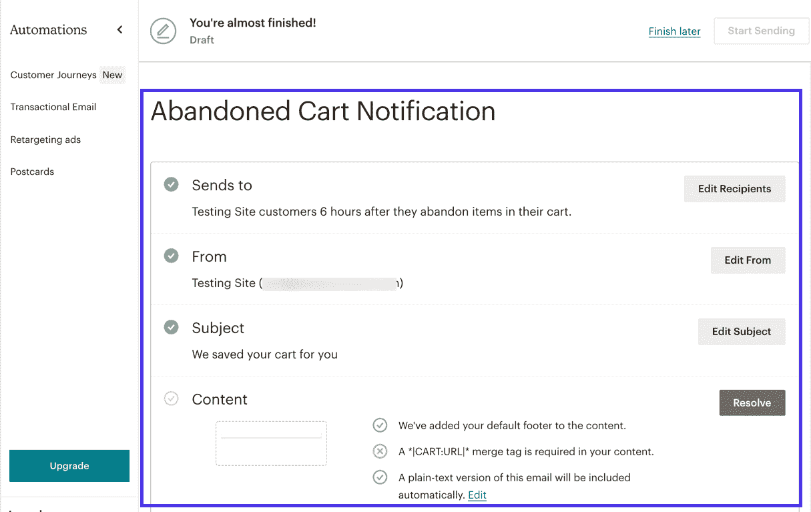

WooCommerce automation has similar setup pages

另外，Mailchimp 为所有类型的 WooCommerce 自动化提供了模板。

你必须选择一个**废弃的** **购物车**模板，然后移动到设计区域。

Go with an “Abandoned Cart” template

和大多数自动消息一样，除了你的徽标、品牌颜色和字体之外，你不需要定制太多。否则，当前模板中的所有内容都被设计为针对每个唯一的客户进行动态填充。合适的产品将会出现，同时还会显示价格、产品名称和链接，让人们再次光顾你的商店。

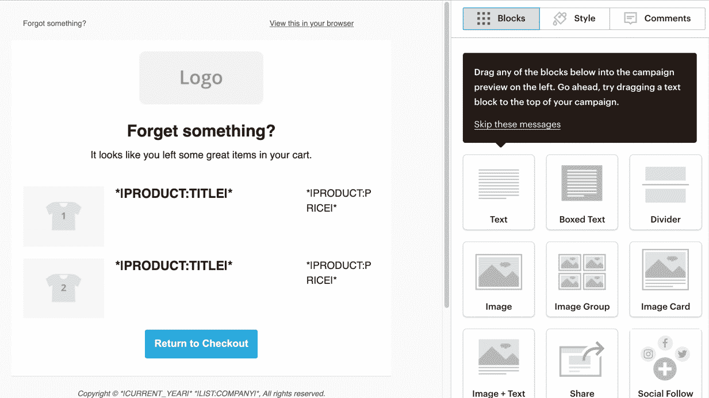

Each WooCommerce template in Mailchimp has several merge tags and automated content elements

当你完成设计后，进入下一页，确认从**发送到**字段到**内容**的所有内容都经过 Mailchimp 和你的审核流程的批准。

点击**启动** **发送**按钮激活此自动化。

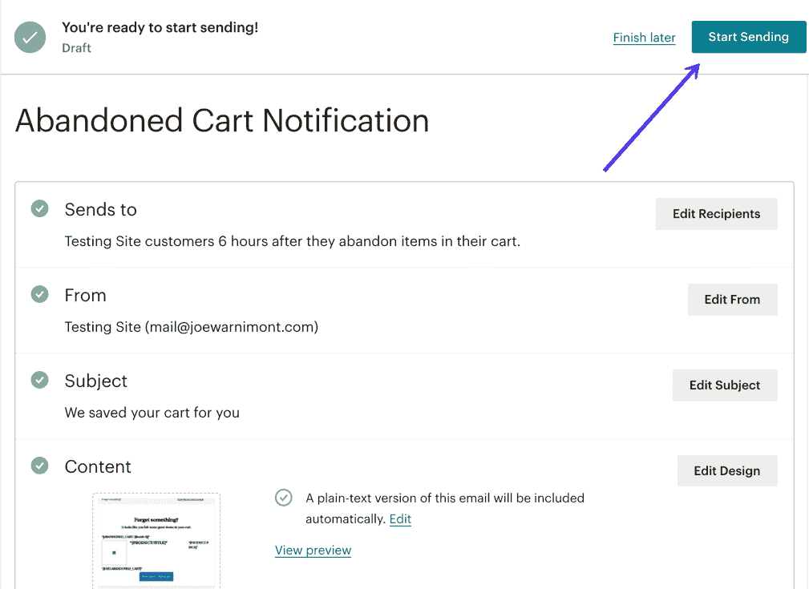

Check if everything looks good, then click the Start Sending button.

在所有这些之后，您的废弃购物车电子邮件将开始进入客户收件箱！

## 增加功能的 WordPress 插件最佳 Mailchimp

如果你已经承诺使用 Mailchimp 收集电子邮件，发送时事通讯，并有可能处理交易信息，你可能会发现你正在寻求扩展 Mailchimp 为你的网站服务的方式。

作为一个流行的电子邮件营销系统，您可以找到大量关于 Mailchimp 和第三方插件的资源，这些插件旨在向标准 Mailchimp 基础架构添加更多功能或集成。

这些插件仍然需要 Mailchimp 才能工作，但它们不一定是由 Mailchimp 公司制造的，也不一定符合你在 Mailchimp 仪表板上找到的常见功能。

您已经可以制作电子邮件选项表单、电子邮件简讯和其他对象，如网站、登录页面和客户旅程。尽管如此，下面的 Mailchimp 插件提供了更多的可能性。

 这里有一些其他的 Mailchimp 插件可以考虑。其中一两个可能会帮助你获得一些你一开始就希望 Mailchimp 拥有的随机特性。

### 1.MC4WP

[MC4WP](https://www.mc4wp.com/) 是最流行的第三方 Mailchimp 插件之一。它以每年 59 美元的高价插件出售，或者你可以[选择基本免费版本](https://wordpress.org/plugins/mailchimp-for-wp/)。

与 WordPress 集成的标准 Mailchimp 相比，MC4WP 在表单样式、电子商务集成和用户同步方面拥有更先进的功能。

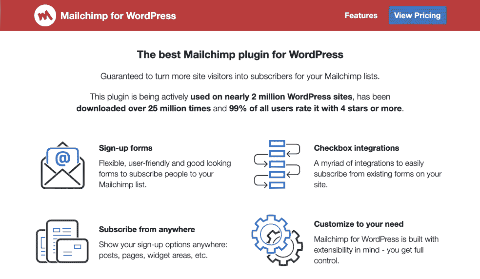

MC4WP offers stylish, advanced opt-in form designs

您可以生成无限数量的表单，并使用插件中的样式生成器来调整任何使用可视化生成器的表单元素。没有必要考虑特殊的编码，因为表单的所有方面都是使用可视控件字段来管理的。生成器旁边会出现一个表单预览，让您了解它的外观。

除此之外，MC4WP 提供了一个令人难以置信的报告部分，其中包含访问者使用的登录方法的独特指标，网站上的顶级表单等等。我们也喜欢你对你的电子商务商店所做的改进，看看 MC4WP 如何提供一个面板来查看每个订户从你的商店购买了什么，以及你发送给客户的每封电子邮件带来了多少收入。

### 2.MC4WP: Mailchimp 顶栏

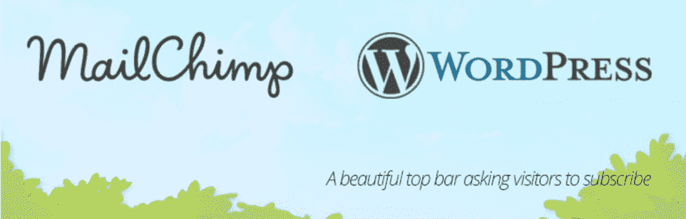

The MC4WP plugin

与上一个插件一样，由相同的 Ibericode 开发人员制作， [MC4WP: Mailchimp Top Bar](https://wordpress.org/plugins/mailchimp-top-bar/) 确实如其名。它集成了 MC4WP 插件，但提供了额外的功能，给你一个漂亮的顶部栏，当人们登陆你的网站时，你可以抓取电子邮件地址。

顶栏会保留在网站的每个页面上，除非你决定只在某些区域显示它。您可以自定义设置，如顶部栏的颜色、收集的数据以及出现在栏和**提交**按钮上的消息。

### 3.Mailchimp 的简易表格

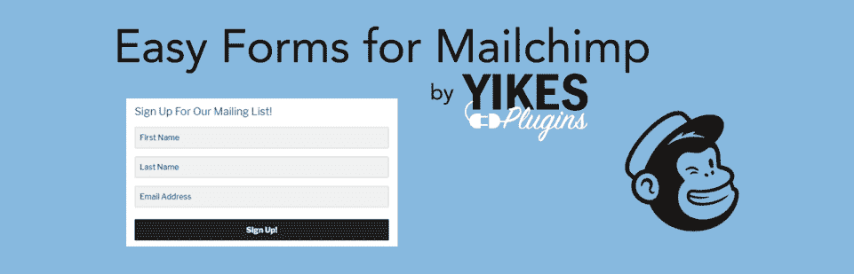

Easy Forms for Mailchimp

Mailchimp 插件的 [Easy Forms for Mailchimp 扩展了 Mailchimp 已经包含的内容，允许您为您的受众设计无限数量的表单——甚至为同一受众设计多个表单。在 Mailchimp 中，每个用户只能得到一个表单设计，因此 Easy Forms 插件为创造性提供了更多的机会。](https://wordpress.org/plugins/yikes-inc-easy-mailchimp-extender/)

该插件与 shortcode 和 block 模块一起工作，让你在页面、帖子和 widget 化区域中包含你的表单。我们还喜欢它为默认的 Mailchimp 表单设计器提供了一个替代方案，因为一些用户可能更喜欢这个插件中的设计，或者可能有一些模板或字段更适合你的品牌。

总的来说，所有需要做的就是在插件中插入 Mailchimp API 键来建立连接。您将收到一个可视化的表单生成器，其中包含用于合并标签、必填字段以及所有这些字段的标签的选项。插件中还有一个优秀的统计模块，用于查看你的列表的执行情况。

### 4.邮件蛋白

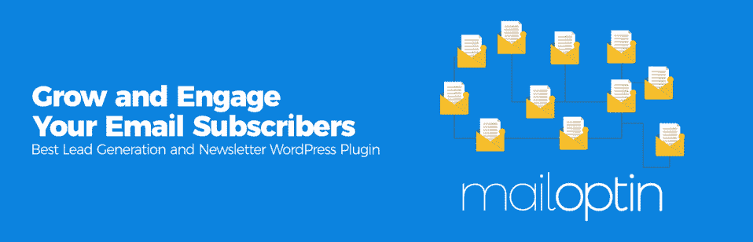

MailOptin

MailOptin 插件集成了几个电子邮件营销服务，如 Mailchimp、Hubspot 和 AWeber。特别是 Mailchimp 功能，它有工具可以直接从你的 WordPress 仪表盘上构建表单、生成弹出窗口和发送电子邮件简讯。因此，您不必登录您的 Mailchimp 帐户来完成此过程。

我们从 MailOptin 看到的主要优势是表单和销售线索生成框等元素的改进模板。您可以轻松地在整个网站上添加表单，包括出现在电子商务购物车中的表单，然后定制表单出现时从字体到颜色、从标题到效果的所有内容。我们认为 MailOptin 的形式比 Mailchimp 的基本形式更现代一些。我们还喜欢独特的设置，如广告拦截检测、推荐人检测和弹出表单的站点触发时间。

### 5.WooChimp

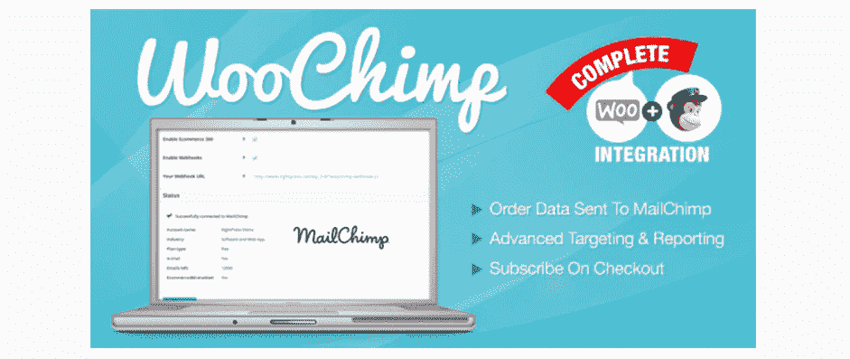

WooChimp

WooChimp 是一款高级插件，目前售价 59 美元。它提供了与 WooCommerce 的 Mailchimp 插件相似的功能，但增加了一些东西。例如，这个插件可以让你自动添加用户到组中，配置 webhooks，并使用小部件和短代码在你网站的任何地方实现表单。还有一些奇特的活动到订单跟踪，以更好地了解你的电子邮件营销活动如何影响销售。

### 6.Mailchimp 的联系表 7 分机

Contact Form 7 Extension for Mailchimp

一些 WordPress 用户喜欢[联系人表单 7 插件](https://wordpress.org/plugins/contact-form-7-mailchimp-extension/)，因为它免费、简单易用，而且你可以毫无麻烦地维护光滑、漂亮的表单。因此，看到 Mailchimp 插件的 Contact Form 7 扩展是有意义的，它允许您通过 Mailchimp 使用 Contact Form 7。

很像 Contact Form 7，这个扩展是完全免费的。您可以注册高级功能，但前提是您需要对生日字段、Mailchimp 类别或无限自定义字段的额外支持。

在免费版本中，该插件与 Contact Form 7 完美集成，您可以支持相当多的自定义字段、无限制的联系人表单，以及在双重和单一选择加入之间进行选择。

这与通过 Mailchimp 或任何其他表单插件制作表单没有太大区别，但我们知道 Contact Form 7 是最受欢迎的表单创建插件之一，所以很高兴看到有 Mailchimp 集成。

### 7.Mailchimp 的 RSS 特色图片及更多

Featured Images in RSS for Mailchimp & More

如果你在网站的 RSS 订阅源中生成特色图片有困难，那么 Mailchimp 插件中的[特色图片就派上用场了。有时这个问题是由于你的主题、你安装的插件有问题，或者仅仅是因为 RSS 源配置不正确。](https://wordpress.org/plugins/featured-images-for-rss-feeds/)

不管怎样，这里有一个插件，它为所有的图片问题增加了一个解决方法，并为你在 RSS 订阅中定制特色图片提供了更多的选择。之后，您可以将 RSS 提要连接到 Mailchimp，这样每当您发布新的博客帖子时，电子邮件就会发送出去。该插件允许您调整所有特色图像的填充、位置和[图像大小等设置。不仅如此，WooCommerce 还集成了插件，可以在必要时将产品照片即时添加到 RSS 提要中。](https://kinsta.com/blog/wordpress-image-sizes/)

[Learn how to configure Mailchimp for WordPress, set up email marketing campaigns and more in this guide ✅Click to Tweet](https://twitter.com/intent/tweet?url=https%3A%2F%2Fkinsta.com%2Fblog%2Fmailchimp-for-wordpress%2F&via=kinsta&text=Learn+how+to+configure+Mailchimp+for+WordPress%2C+set+up+email+marketing+campaigns+and+more+in+this+guide+%E2%9C%85&hashtags=WordPress%2CMailchimp)

## 摘要

为 WordPress 设置 Mailchimp 有几个好处。它是免费的(最多 2000 名用户)。您通常可以使用快速复制和粘贴来集成 WooCommerce。Mailchimp 还提供了电子商务自动化的冲击，以增加收入。

此外，Mailchimp 具有一些你可以从电子邮件营销计划中找到的最好的设计特征。这样，你的业务看起来很专业，但你不需要有编码经验就能做到。

你曾经使用 Mailchimp 在你的 WordPress 网站上收集电子邮件地址吗？

* * *

让你所有的[应用程序](https://kinsta.com/application-hosting/)、[数据库](https://kinsta.com/database-hosting/)和 [WordPress 网站](https://kinsta.com/wordpress-hosting/)在线并在一个屋檐下。我们功能丰富的高性能云平台包括:

*   在 MyKinsta 仪表盘中轻松设置和管理
*   24/7 专家支持
*   最好的谷歌云平台硬件和网络，由 Kubernetes 提供最大的可扩展性
*   面向速度和安全性的企业级 Cloudflare 集成
*   全球受众覆盖全球多达 35 个数据中心和 275 多个 pop

在第一个月使用托管的[应用程序或托管](https://kinsta.com/application-hosting/)的[数据库，您可以享受 20 美元的优惠，亲自测试一下。探索我们的](https://kinsta.com/database-hosting/)[计划](https://kinsta.com/plans/)或[与销售人员交谈](https://kinsta.com/contact-us/)以找到最适合您的方式。****