# 如何使用 MailHog 在本地测试电子邮件(分步指南)

> 原文:# t0]https://kinta . com/blog/mailhog/

在[本地开发环境](https://kinsta.com/knowledgebase/what-is-localhost/)中测试电子邮件可能具有挑战性。知道你的网站或网络应用发出的邮件是否真的到达了收件人的收件箱是一件非常痛苦的事情。进来，麦猪！

MailHog 是一个电子邮件测试工具，它使得安装和配置本地电子邮件服务器变得非常容易。MailHog 设置了一个假的 SMTP 服务器。您可以配置您的首选 web 应用程序来使用 MailHog 的 SMTP 服务器发送和接收电子邮件。

例如，你可以配置一个本地的 WordPress 站点来使用 MailHog 发送邮件。这正是 [DevKinsta](https://kinsta.com/devkinsta/) 为其内置 SMTP 服务器供电以在本地测试电子邮件所做的事情。

在本文中，您将了解 MailHog 的来龙去脉，包括它的安装、配置、如何在本地测试电子邮件等等！

准备好开始了吗？我们走吧！

[Want to simplify local email testing? Get MailHog 📧 Learn how to deploy it easily on various platforms/configurations right here 👇Click to Tweet](https://twitter.com/intent/tweet?url=https%3A%2F%2Fkinsta.com%2Fblog%2Fmailhog%2F&via=kinsta&text=Want+to+simplify+local+email+testing%3F+Get+MailHog+%F0%9F%93%A7+Learn+how+to+deploy+it+easily+on+various+platforms%2Fconfigurations+right+here+%F0%9F%91%87&hashtags=MailHog%2CEmailTesting)

### 更喜欢看[视频版](https://www.youtube.com/watch?v=yozMCBg2sBk)？


> 需要在这里大声喊出来。Kinsta 太神奇了，我用它做我的个人网站。支持是迅速和杰出的，他们的服务器是 WordPress 最快的。
> 
> <footer class="wp-block-kinsta-client-quote__footer">
> 
> 
> 
> <cite class="wp-block-kinsta-client-quote__cite">Phillip Stemann</cite></footer>

[View plans](https://kinsta.com/plans/)

## 什么是 MailHog？

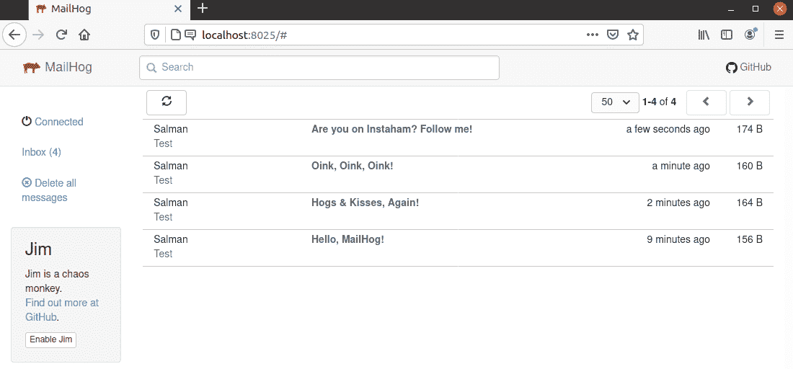

MailHog Web UI


MailHog 是一个开源的电子邮件测试工具，主要面向开发者。它使您能够更有效地测试您的 web 应用程序的电子邮件发送和接收功能。

MailHog 是用 Go 编程语言构建的，可以在多种操作系统上运行，包括 Windows、Linux、FreeBSD 和 macOS。MailHog 由伊恩·肯特维护，并在麻省理工学院的许可下发布，所以你可以自由地部署它用于个人和商业用途。

但是为什么你首先需要 MailHog 呢？


## 你为什么需要邮件猪

MailHog 解决了许多电子邮件测试的主要问题。

假设你正在本地开发环境中开发一个 WordPress 网站。如果你想测试一个联系表单或者任何其他从它发出的邮件，这可能是一个可怕的任务。

通常，web 应用程序的默认 SMTP 服务器负责这项任务。在本地开发环境中，由于多种原因，它几乎总是行不通。

你可以阅读我们关于免费 SMTP 服务器的广泛指南来了解更多关于 SMTP 服务器的工作原理。

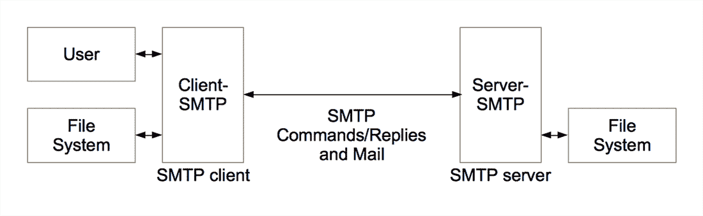

How an SMTP server works (Source: Wikimedia Commons)


首先，你需要设置你的操作系统、[网络服务器](https://kinsta.com/blog/nginx-vs-apache/)和[网络应用](https://kinsta.com/blog/php-frameworks/)，以便在本地环境下使用电子邮件。然后你必须确保邮件成功到达你的收件人的[收件箱](https://kinsta.com/blog/multiple-gmail-accounts/)，这会浪费你的时间(和收件箱空间)。

此外，还有使用真实电子邮件地址进行测试的问题。这会损害你私人邮件的可信度。

MailHog 解决了上述所有问题。它设置了一个假的 SMTP 服务器，您可以设置您的 web 应用程序来发送和接收电子邮件。它甚至将发送和接收的电子邮件存储在一个漂亮的 web [UI](https://kinsta.com/careers/product-designer/) 中，这样你就可以像使用真正的电子邮件收件箱一样浏览它们。

最后，MaiilHog 还允许您使用一个用于自动化测试的 [API](https://kinsta.com/blog/wordpress-http-api-part-1/) 来检索这些电子邮件。这是一个强大的特性，如何使用这个 API 取决于你自己。

## MailHog 功能

MailHog 配备了许多开箱即用的功能。以下是它的一些主要亮点:

*   **轻巧便携:**不需要安装 MailHog 就可以使用。这是 MailHog 的主要优势之一。这使得它具有高度的可移植性，几乎可以在任何操作系统或网络服务器上运行。
*   **扩展 SMTP 支持:【MailHog 不仅支持设置一个假的 SMTP 服务器，你还可以用它来设置一个 e SMTP 服务器(扩展 SMTP)。它还包括对 SMTP 认证和管道的支持。**
*   **API 支持:**可以使用 MailHog 内置的 [HTTP API](https://kinsta.com/blog/wordpress-http-api-part-2/) (或者 JSON API)来检索、列表、删除邮件。
*   **失败测试:**你可以邀请[吉姆](https://github.com/mailhog/MailHog/blob/master/docs/JIM.md)，MailHog 的混乱猴子(是的，它实际上是这么叫的)，来测试你的网络应用的电子邮件传送能力。这是通过随机创建常见的电子邮件送达问题来实现的，如拒绝连接/身份验证和限速连接。
*   **实时更新:** MailHog 使用 [EventSource](https://developer.mozilla.org/en-US/docs/Web/API/EventSource) web 界面提供即时更新。
*   **电子邮件捕获和存储:**捕获的电子邮件可以存储在内存消息存储中，并持久存储在 MongoDB [数据库](https://kinsta.com/blog/adminer/)和基于文件的存储系统中。
*   **下载附件:** MailHog 支持单个 MIME 部分的下载。
*   **网络用户界面:**你可以使用 MailHog 的网络用户界面以纯文本、 [HTML](https://kinsta.com/blog/html-email/) 或源文件的形式查看电子邮件。它还支持多部分 MIME 和编码头。
*   **认证:** MailHog 对其 Web UI 和 API 都支持 [HTTP 基本认证](https://github.com/mailhog/MailHog/blob/master/docs/Auth.md)。
*   **释放捕获的邮件:**您可以配置 MailHog 将捕获的邮件释放到真实的 SMTP 服务器上进行发送。

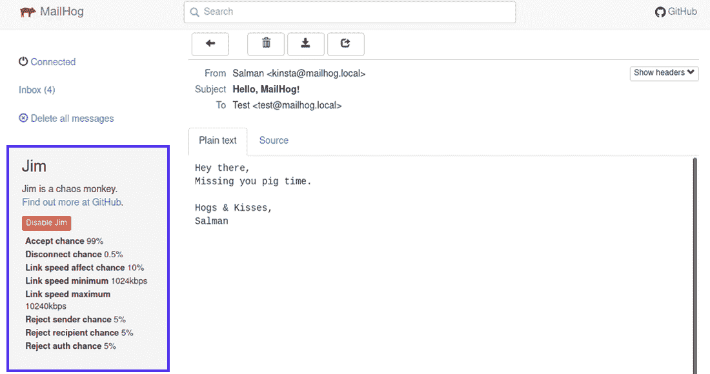

Jim is MailHog’s “Chaos Monkey”


除了上述特性之外，MailHog 目前有两个客户端库，分别用于 [PHP](https://github.com/rpkamp/mailhog-client) 和 [NodeJS](https://github.com/blueimp/mailhog-node) 环境，以便轻松地与 MailHog API 进行交互。


## 在各种平台上部署 MailHog

如前所述，MailHog 不需要安装。但是，您仍然需要下载它，并在您的开发环境中进行设置。

让我们开始下载 MailHog。然后我们将向您展示如何在各种平台上设置它。有许多方法可以着手做这件事。

### Windows 上的 MailHog

首先，前往 GitHub 上的 [MailHog releases](https://github.com/mailhog/MailHog/releases) 页面下载其最新的 Windows 稳定版。下载 MailHog 后，您可以在没有任何外部依赖的情况下运行它。

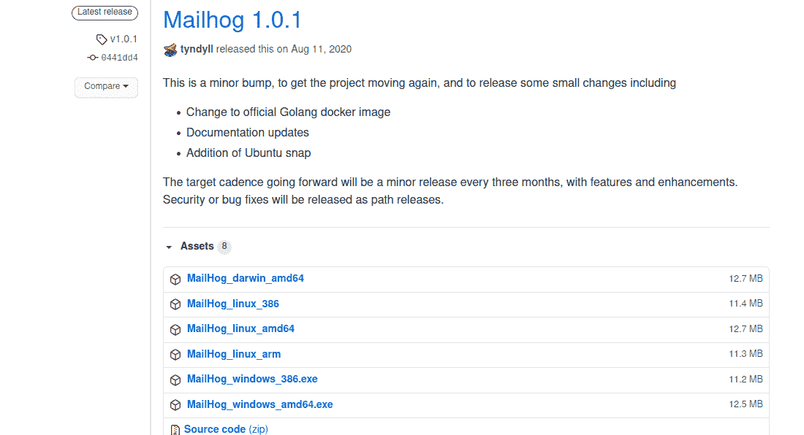

MailHog GitHub releases page


**注:**截至撰写本文时， [MailHog 1.0.1](https://github.com/mailhog/MailHog/releases/tag/v1.0.1) 是最新发布的版本。您可以下载为 Windows、Linux 和 Darwin (macOS)平台预编译的版本。如果你正在使用一个利基平台，你也可以下载它的[源代码](https://kinsta.com/blog/code-review-tools/)并为你的特定用例编译它。

由于 MailHog for Windows 是一个简单的自执行程序，你可以运行下载的`**.exe**`文件。如果您收到任何安全警报，请确保允许 MailHog 在您的[本地主机环境](https://kinsta.com/knowledgebase/what-is-localhost/)上运行，而没有[防火墙](https://kinsta.com/blog/what-is-a-firewall/)的限制。

下面是 MailHog 在 Windows 10 上的样子。

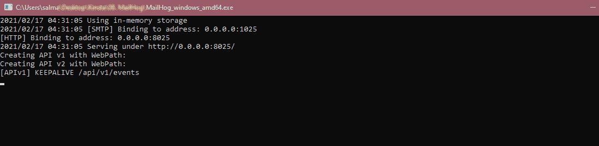

MailHog running on Windows 10


您可以看到 SMTP 服务器在端口`**1025**`上，HTTP 服务器在端口`**8025**`上。

还没有什么特别的，但是已经确认 MailHog 正在你的系统上运行。

现在，你可以在你的[网页浏览器](https://kinsta.com/browser-market-share/)中访问`**localhost:8025**`或`**127.0.0.1:8025**`来查看 MailHog 网页界面。

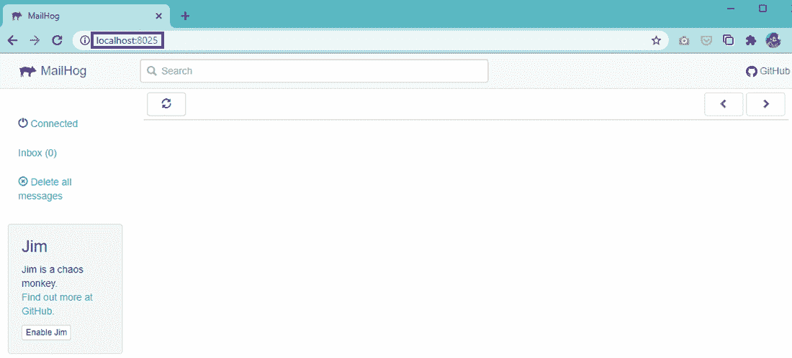

MailHog Web UI on Windows


您还不能[找到这里列出的任何电子邮件](https://kinsta.com/blog/find-email-address/)，因为我们还没有配置任何 web 应用程序来使用 MailHog。我们将在本文的后面讨论这个问题。

### Linux 上的 MailHog

如果您使用的是 Linux (Ubuntu/Debian ),下面是部署 MailHog 的方法:

```
sudo apt-get -y install golang-go
sudo apt-get install git
go get github.com/mailhog/MailHog
```

第一个 [Linux 命令](https://kinsta.com/blog/linux-commands/)在您的开发环境中安装 [Golang](https://kinsta.com/blog/php-editor/#2-komodo-ide) 编程语言(如果您还没有的话)。如果你已经安装了 Go，你可以跳过这一行。下一个命令将在您的机器上安装`**git**`(如果已经安装了，您也可以跳过这一步)。

第三个命令使用 Go 的指令从其 [GitHub](https://kinsta.com/knowledgebase/git-vs-github/) 存储库中获取 MailHog 的最新稳定版本。

接下来，您可以通过您的[终端](https://kinsta.com/blog/wp-cli/)运行`**/path/to/MailHog**`来启动 MailHog。确切的路径可能因您的 Linux 风格而异。由于 Go 在 Ubuntu 上的 bin 文件存储在`**~/go/bin/**`目录下，你可以运行下面的代码来启动 MailHog:

```
~/go/bin/MailHog
```

差不多就是这样。MailHog 现在运行在您的 Linux 机器上。这是它看起来的样子。

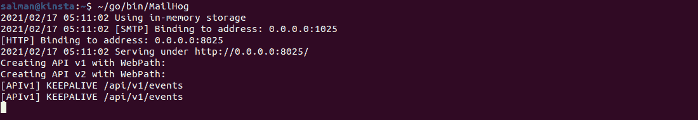

MailHog running on Linux (Ubuntu)


如果您想在每次登录时自动启动 MailHog，您可以使用 supervisord、upstart 等将它设置为作为守护程序服务器启动。你也可以使用 [geerlingguy](https://github.com/geerlingguy) 提供的 [init 脚本](https://github.com/geerlingguy/ansible-role-mailhog/blob/master/templates/mailhog.init.j2)或者 [Ansible 角色](https://github.com/geerlingguy/ansible-role-mailhog)来做同样的事情。

就像 Windows 一样，你可以看到 SMTP 服务器从端口`**1025**`开始，HTTP 服务器从端口 **`8025`** 开始。

在您的网络浏览器中访问`**localhost:8025**`或`**127.0.0.1:8025**`以查看 MailHog 网络用户界面。

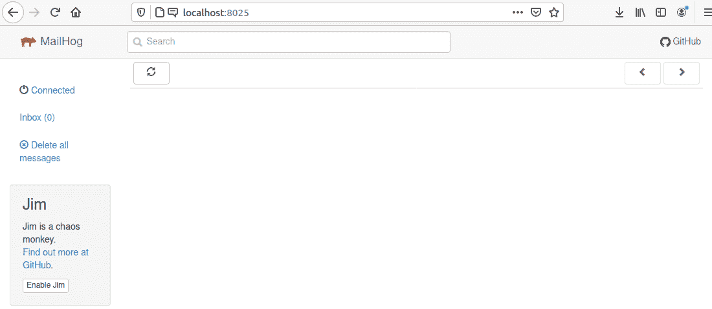

MailHog Web UI on Linux (Ubuntu)


### macOS 上的 MailHog

苹果用户可以使用自制软件安装 MailHog。打开您的终端并运行以下命令:

```
brew install mailhog
```

这会在你的 macOS 上安装 MailHog。接下来，您可以使用以下命令启动 MailHog:

`mailhog`

如果您希望 MailHog 在登录时自动启动并作为后台服务运行，您可以改为运行以下命令:

```
brew services start mailhog
```

差不多就是这样。MailHog 现已安装在您的 macOS 上。您可以通过在浏览器中访问`**127.0.0.1:8025**`或`**localhost:8025**`来查看其 Web UI。

### 密霍加码头

Docker 是跨任何平台设置 MailHog 的最简单的方法之一。

首先，确保你的机器上安装了 Docker。接下来，您可以通过运行以下命令直接从 Docker Hub 启动 MailHog:

```
docker run -d -p 1025:1025 -p 8025:8025 mailhog/mailhog
```

让我们来分解上面的命令及其指令:

*   启动一个 docker 容器。

*   `**-d**`指令在后台运行 docker 容器。

*   `**-p 1025:1025**`和`**-p 8025:8025**` 指令将 MailHog 的默认 SMTP 端口暴露给本地端口。

*   从 Docker Hub 获取最新的 MailHog 版本。

或者，如果您想将 MailHog 的`**Maildir**`挂载到您的本地[文件系统](https://kinsta.com/knowledgebase/wordpress-files/)(而不是 Docker 容器内)，您可以运行以下命令:

## 注册订阅时事通讯


### 想知道我们是怎么让流量增长超过 1000%的吗？

加入 20，000 多名获得我们每周时事通讯和内部消息的人的行列吧！

[Subscribe Now](#newsletter)

```
docker run -d -e "MH_STORAGE=maildir" -v $PWD/maildir:/maildir -p 1025:1025 -p 8025:8025 mailhog/mailhog
```

像以前一样，你可以在浏览器中访问`**localhost:8025**`或`**127.0.0.1:8025**`来使用 MailHog Web UI。

### MailHog on Docker 复合材料

Docker Compose 是 Docker 的扩展，它使得用一个命令运行多个 Docker 容器变得容易。您可以通过在 YAML 文件中定义所有要运行的容器来实现这一点。

默认情况下，Docker Compose 要求您将这个文件命名为`**docker-compose.yaml**`。

要使用 Docker Compose 运行 MailHog，您的`**docker-compose.yaml**`文件应该是这样的:

```
version: "3"
services:
  mailhog:
    image: mailhog/mailhog:latest
    restart: always
    ports:
      - 1025:1025
      - 8025:8025
```

在此文件所在的文件夹中，运行以下命令在后台启动 MailHog:

```
docker-compose up -d mailhog
```

它的工作方式与 Docker 完全一样。除此之外，您不需要提及许多指令，因为您已经定义了它们。

您现在可以在浏览器中输入`**localhost:8025**`或`**127.0.0.1:8025**`来查看 MailHog Web UI。

除了以上方法，MailHog 的 GitHub repo 还包括了在 [AWS](https://kinsta.com/aws-alternative/) [弹性豆茎](https://github.com/mailhog/MailHog/blob/master/docs/DEPLOY.md#elastic-beanstalk)上部署 MailHog 的指南。


## 用 xhsendmail 配置 mailhog

MailHog [使用](https://kinsta.com/blog/wordpress-redirect/) [mhsendmail](https://github.com/mailhog/mhsendmail) ，一个专门为 MailHog 创建的`**sendmail**`替代品，将电子邮件从网络应用重定向到它的 SMTP 服务器。它确保您的 web 应用程序的电子邮件使用`**localhost:1025**` SMTP 服务器发送和接收，默认情况下 MailHog 配置为处理该服务器。

要开始使用，你需要下载并安装`**mhsendmail**`。根据您的平台，您可以通过各种方式来实现这一点。

例如，如果你正在使用 Ubuntu，你可以使用下面的命令从它的 [GitHub 库](https://github.com/mailhog/mhsendmail/releases/download/v0.2.0/mhsendmail_linux_amd64)下载`**mhsendmail**`:

```
wget https://github.com/mailhog/mhsendmail/releases/download/v0.2.0/mhsendmail_linux_amd64
```

接下来，使这个文件可执行，并将其移动到您的用户目录。为此，请使用以下命令:

```
sudo chmod +x mhsendmail_linux_amd64
sudo mv mhsendmail_linux_amd64 /usr/local/bin/mhsendmail
```

或者，您也可以通过运行以下命令在 Golang 或 Homebrew 上获得`**mhsendmail**`:

```
go get github.com/mailhog/mhsendmail
```

在运行上述命令之前，请确保安装了 Go。如果您使用的是 Linux，请参考上面的 *MailHog on Linux* 部分。要安装 Go with Homebrew，请运行以下命令:

想马上使用 MailHog 吗？DevKinsta 使用 MailHog 来增强其电子邮件收件箱，以进行无障碍的本地电子邮件测试。使用 DevKinsta 在几分钟内构建、测试和部署 WordPress 站点。[现在就试试 DevKinsta】！](https://kinsta.com/devkinsta)

```
brew install go
```

下载完`**mhsendmail**`后，您现在可以继续安装它了:

```
go get github.com/mailhog/mhsendmail
```

接下来，您需要配置您的 web 应用程序，以使用 MailHog 的`**mhsendmail**`作为其电子邮件路由服务。默认情况下，大多数 Linux 系统将它设置为使用`**sendmail**`。

您可以通过编辑您的`**php.ini**`文件来做到这一点。在大多数服务器上，你可以在根目录下找到 php.ini 文件。您也可以执行以下命令来查找它的位置:

```
php -i | grep 'php.ini'
```

对于运行 Ubuntu 的 Linux 机器，需要将`**sendmail_path**`的值设置为:

```
sendmail_path = /usr/local/bin/mhsendmail
```

除了上面的值，您还可以使用下面显示的值来获得相同的结果:

```
sendmail_path = /usr/sbin/sendmail -S mail:1025
```

如果您使用 Go 来安装`**mhsendmail**`，或者如果您使用任何其他版本的 Linux，路径可能会根据您的平台/配置略有不同。确保链接到正确的`**mhsendmail**`目录。

Mac 用户需要编辑他们的`**Postfix**`配置文件来正确设置 MailHog。您可以使用以下后缀配置:

```
myhostname = localhost
relayhost = [127.0.0.1]:1025
```

对于 WordPress 站点，你可以使用免费的 MailHog for WordPress 插件将你站点的邮件发送到 MailHog。要使用它，在你的 WordPress 管理面板中安装并激活插件。更好的选择是使用 [DevKinsta](https://kinsta.com/devkinsta/) 。我们稍后将深入讨论它。

阅读 [MailHog 文档](https://github.com/mailhog/MailHog/tree/master/docs)了解如何在各种其他平台/配置上设置它的信息。

### 其他 MailHog 配置选项

您可以使用它的各种[环境变量](https://kinsta.com/knowledgebase/what-is-an-environment-variable/)或[命令行](https://kinsta.com/blog/how-to-use-ssh/)选项来配置 MailHog。

例如，您可以使用`**MH_HOSTNAME**` [环境](https://kinsta.com/feature-updates/wp_get_environment_type-function/)变量或`**-hostname**`命令行选项将其默认主机名从`**mailhog.example**`更改为自定义名称。

要了解更多信息，您可以查看 [MailHog 配置选项](https://github.com/mailhog/MailHog/blob/master/docs/CONFIG.md)文档。

## 使用 MailHog 进行本地电子邮件测试

最后，让我们[测试一下](https://kinsta.com/blog/website-speed-test/)我们的 MailHog 设置，看看它是否配置正确。

您可以使用 Mailhog 的 CLI 通过使用以下`**mhsendmail**`指令发送电子邮件:

```
mhsendmail [[email protected]](/cdn-cgi/l/email-protection) <<EOF
From: Salman <[[email protected]](/cdn-cgi/l/email-protection)>
To: Test <[[email protected]](/cdn-cgi/l/email-protection)>
Subject: Hello, MailHog!

Hey there,
Missing you pig time.

Hogs & Kisses,
Salman
EOF
```

在上面的代码中，`**<<EOF**`指令设置了一个自定义分隔符，这样您就可以在终端内部交互地输入测试电子邮件的详细信息。当您再次键入分隔符时，它会执行所有输入。这里，它使用`**mhsendmail**`命令发送一封邮件。

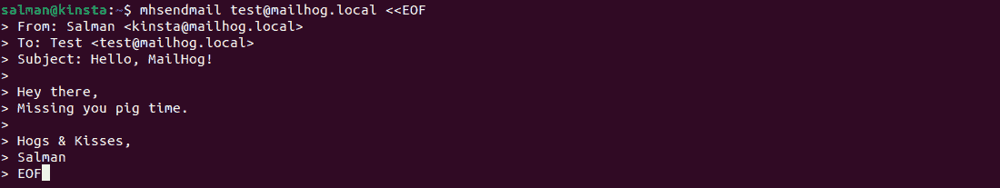

Sending a test email using ‘mhsendmail’


您可以通过访问 MailHog Web UI 来验证电子邮件是否已成功发送。

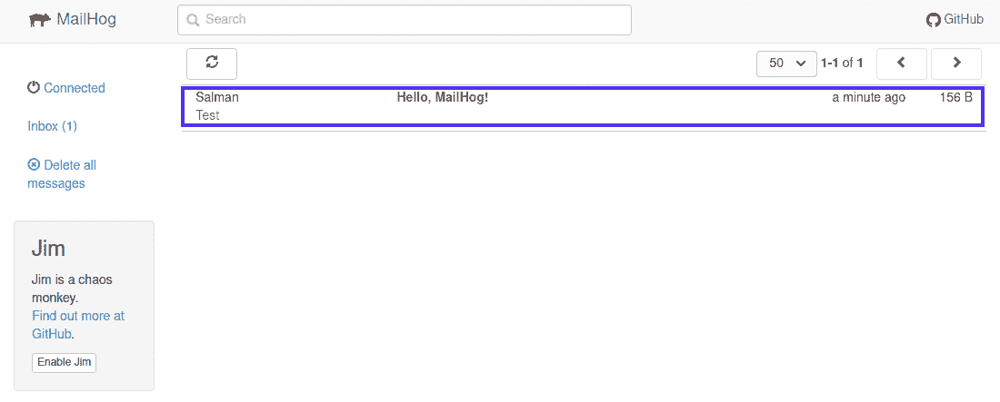

The test email has been delivered successfully


您也可以点击测试邮件来验证其正文内容。

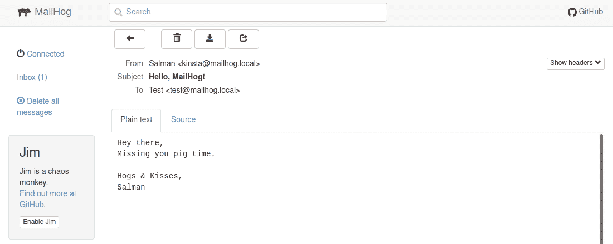

Verifying the test email’s body content


这是一个总结！我们现在可以得出结论，MailHog 已经配置成功。

除了上述方法，还有其他方法可以发送测试邮件。例如，在 macOS 上，您可以通过在终端中运行以下命令来发送测试电子邮件:

```
date | mail -s "Hello, MailHog!" [[email protected]](/cdn-cgi/l/email-protection)
```

在 Windows 上，您可以通过执行以下代码使用 PowerShell 发送电子邮件:

```
Send-MailMessage -To "[[email protected]](/cdn-cgi/l/email-protection)" -From "[[email protected]](/cdn-cgi/l/email-protection)" -Subject "Hello, MailHog!" -SmtpServer "localhost" -Port 1025
```

您还可以用所有邮件数据定义一个 [PHP](https://kinsta.com/knowledgebase/what-is-php/) 脚本，并使用 PHP 的`**mail()**`函数发送一封测试邮件。为此，如下定义您的 PHP 脚本，并从终端执行它:

```
<?php
$to = "[[email protected]](/cdn-cgi/l/email-protection)";
$subject = "Hey, I’m Pi Hog Pi!";
$body = "Hello, MailHog!";
$headers = "From: [[email protected]](/cdn-cgi/l/email-protection)" . "\r\n";
mail($to,$subject,$body,$headers);
?>
```

最后，您可以使用 MailHog API 来测试电子邮件是否已经成功发送。如果你专门在一个非 GUI 环境中工作(例如 Linux 终端，Windows PowerShell)，MailHog API 非常方便地列出、[检索和删除电子邮件](https://kinsta.com/blog/gmail-search-operators/)。

## DevKinsta 和 MailHog:轻松的本地电子邮件测试

我们的本地 WordPress 开发工具， [DevKinsta](https://kinsta.com/devkinsta/) ，使用 MailHog 来增强其电子邮件测试功能。因为它也可以容器化单独的站点，你将有一个单独的 MailHog 收件箱用于你正在开发的每个本地站点。

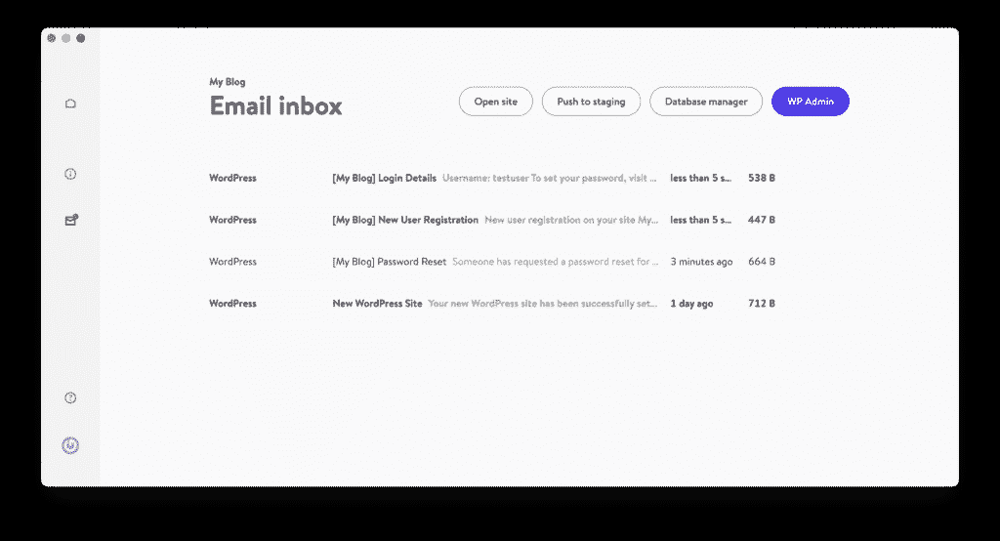

DevKinsta’s ‘Email Inbox’ is powered by MailHog


像 MailHog Web UI 一样，可以使用 DevKinsta 的本地电子邮件收件箱来查看和操作电子邮件(删除、标记为已读、查看源)。

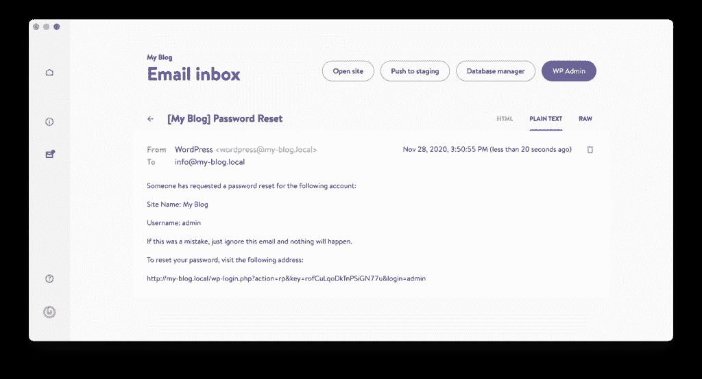

View and manipulate emails in DevKinsta


您还可以通过运行以下 Docker 命令来检查 DevKinsta 的 MailHog [日志](https://kinsta.com/blog/analyzing-log-entries/):

```
docker logs -f devkinsta_mailhog
```

前往 [DevKinsta 的知识库](https://kinsta.com/knowledgebase/devkinsta/email-inbox/)部分了解更多信息。

[Get to know MailHog 📧 The email testing tool that'll make your local development experience much simpler 😌Click to Tweet](https://twitter.com/intent/tweet?url=https%3A%2F%2Fkinsta.com%2Fblog%2Fmailhog%2F&via=kinsta&text=Get+to+know+MailHog+%F0%9F%93%A7+The+email+testing+tool+that%27ll+make+your+local+development+experience+much+simpler+%F0%9F%98%8C&hashtags=MailHog%2CDevKinsta)

## 摘要

MailHog 让电子邮件测试变得轻而易举。这是一个伟大的，实用的解决方案来测试您的网站或网络应用程序的电子邮件。此外，MailHog 在几乎所有流行的平台上都易于设置，并且具有易于使用的 Web UI。

像 MailHog 一样，DevKinsta 是一个开始本地 WordPress 开发的好方法。它不仅包括用于本地测试电子邮件的 MailHog，还预装了用于轻松管理数据库的 [Adminer](https://kinsta.com/blog/adminer/) 。

有了 MailHog(和 DevKinsta)的支持，您会发现在本地测试电子邮件从未如此简单。

如果你想分享你在本地测试电子邮件的经验或挑战，请在下面的评论区给我们留言。

* * *

让你所有的[应用程序](https://kinsta.com/application-hosting/)、[数据库](https://kinsta.com/database-hosting/)和 [WordPress 网站](https://kinsta.com/wordpress-hosting/)在线并在一个屋檐下。我们功能丰富的高性能云平台包括:

*   在 MyKinsta 仪表盘中轻松设置和管理
*   24/7 专家支持
*   最好的谷歌云平台硬件和网络，由 Kubernetes 提供最大的可扩展性
*   面向速度和安全性的企业级 Cloudflare 集成
*   全球受众覆盖全球多达 35 个数据中心和 275 多个 pop

在第一个月使用托管的[应用程序或托管](https://kinsta.com/application-hosting/)的[数据库，您可以享受 20 美元的优惠，亲自测试一下。探索我们的](https://kinsta.com/database-hosting/)[计划](https://kinsta.com/plans/)或[与销售人员交谈](https://kinsta.com/contact-us/)以找到最适合您的方式。