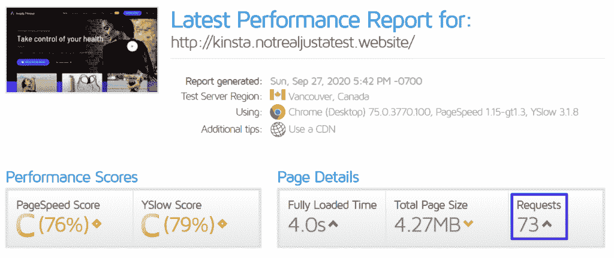
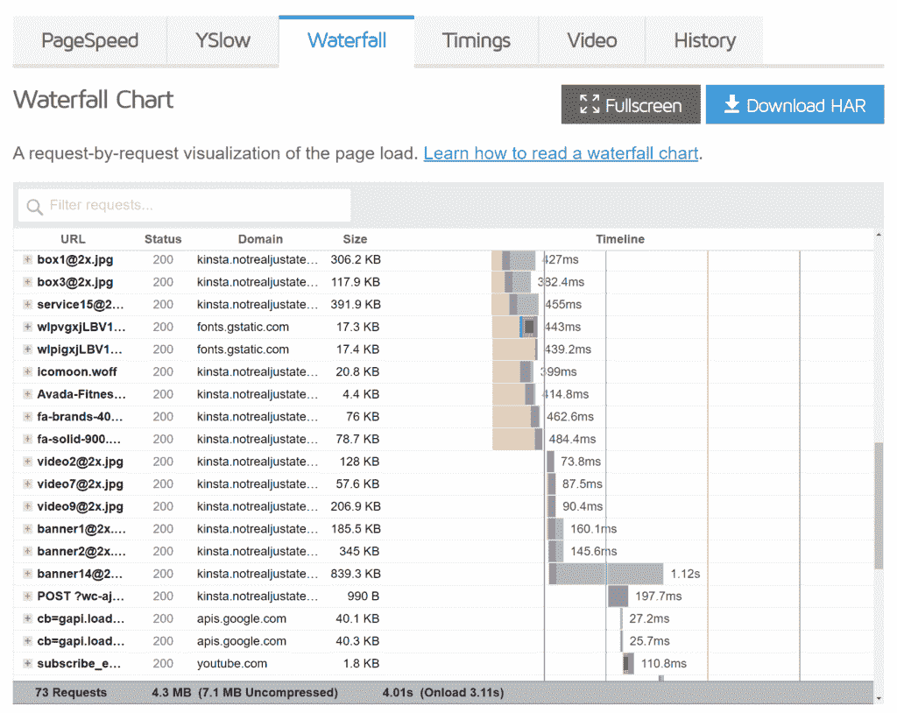
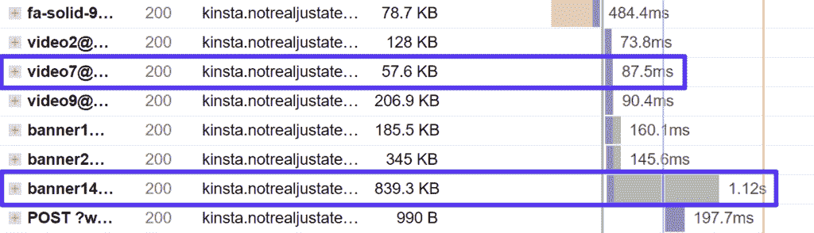
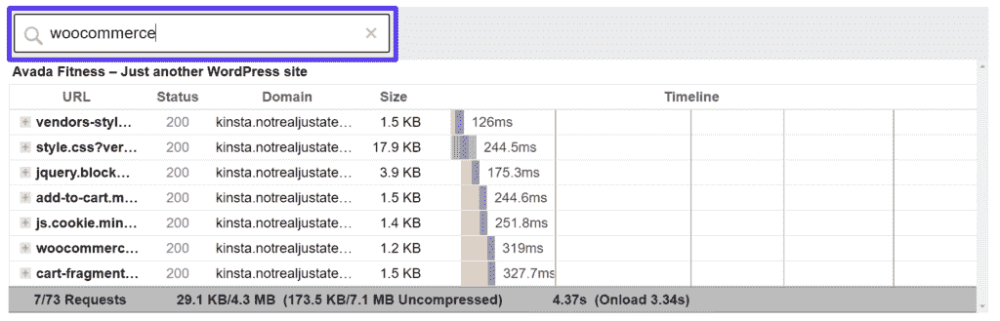
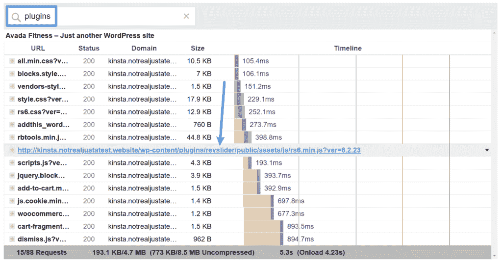
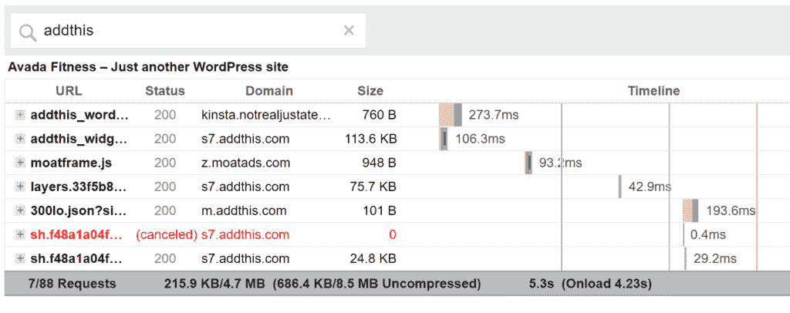
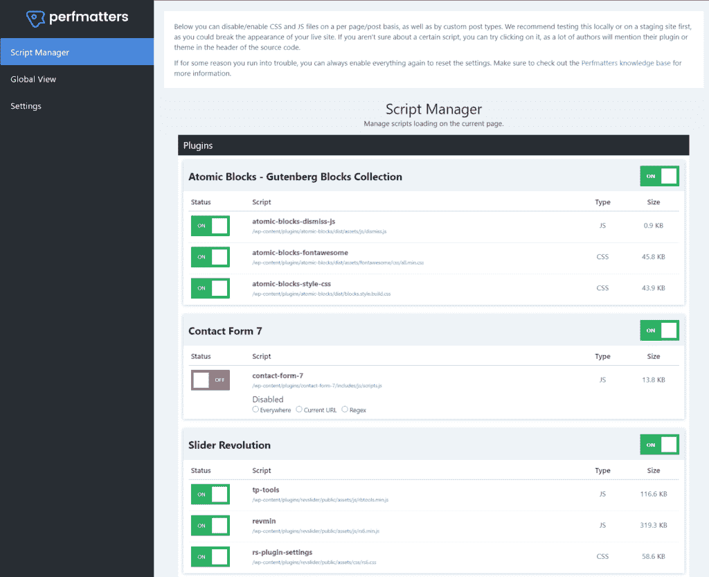
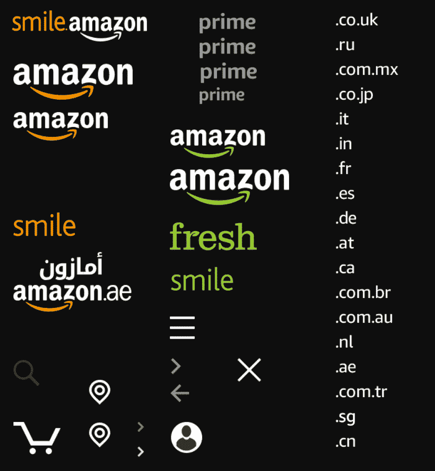
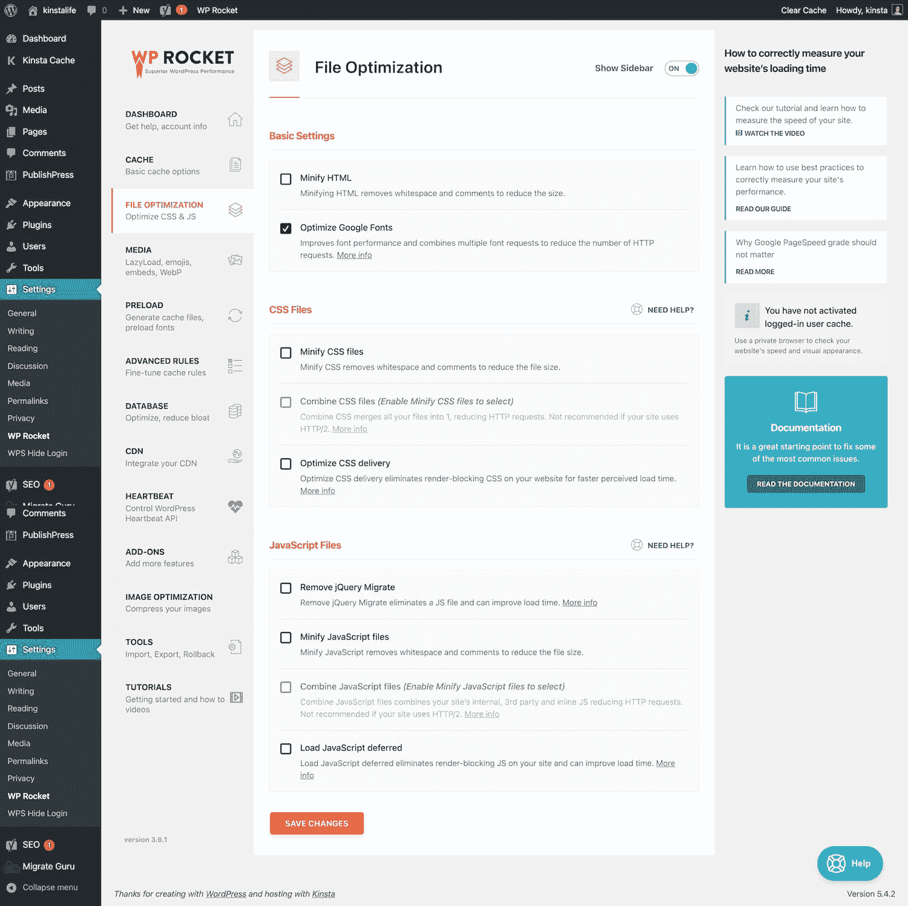

# 如何在 WordPress 中减少 HTTP 请求(轻松提升网站速度)

> 原文：<https://kinsta.com/blog/make-fewer-http-requests/>

你的网站的 HTTP 请求越多，它的加载速度就越慢。因此，如果你能减少 HTTP 请求的数量并优化它们的加载方式，你就能提高网站的性能。

在这篇文章中，我们将带你了解如何在 WordPress 上减少 HTTP 请求。

我们将从 HTTP 请求的基本介绍开始，为什么它们很重要，以及如何分析你的 WordPress 站点的请求。

然后，我们将分享一些技巧和策略，你可以实施，以减少您的网站的请求。除了帮助您处理 GTmetrix 中的“减少 HTTP 请求”消息之外，这些策略还将帮助您处理 Google PageSpeed Insights 中的“避免链接关键请求”消息。

[Slow site? ⏱ Too many HTTP requests could be the culprit. Check out this guide to making fewer requests right here 💥Click to Tweet](https://twitter.com/intent/tweet?url=https%3A%2F%2Fkinsta.com%2Fblog%2Fmake-fewer-http-requests%2F&via=kinsta&text=Slow+site%3F+%E2%8F%B1+Too+many+HTTP+requests+could+be+the+culprit.+Check+out+this+guide+to+making+fewer+requests+right+here+%F0%9F%92%A5&hashtags=WordPress%2CHTTPRequest)

### 更喜欢看[视频版](https://www.youtube.com/watch?v=M-Bx2lKpbcQ)？

> 需要在这里大声喊出来。Kinsta 太神奇了，我用它做我的个人网站。支持是迅速和杰出的，他们的服务器是 WordPress 最快的。
> 
> <footer class="wp-block-kinsta-client-quote__footer">
> 
> 
> 
> <cite class="wp-block-kinsta-client-quote__cite">Phillip Stemann</cite></footer>

[View plans](https://kinsta.com/plans/)

## 什么是 HTTP 请求？

当你[建立一个网站](https://kinsta.com/blog/cms-software/)时，它有很多不同的部分。您有在页面上使用的[不同的图像文件](https://kinsta.com/blog/regenerate-thumbnails/)，控制内容外观的 [CSS 样式表](https://kinsta.com/blog/wordpress-css/)，添加所有酷功能的 JavaScript 文件，等等。

当某人[访问您的网站](https://kinsta.com/blog/how-to-drive-traffic-to-your-website/)时，他们的浏览器需要一种方法从您的服务器下载该页面所需的所有资源。为此，它为每个单独的资源向服务器发出 **HTTP 请求**。

例如，它可能会说，“嘿，服务器，我需要那个**coolimage.png**文件”和“嘿，服务器，我还需要那个[联系人表单插件](https://kinsta.com/blog/wordpress-contact-form-plugins/)的 CSS 样式表”。然后服务器**用有问题的文件响应**这些请求。

一旦网络浏览器得到这些文件，它就可以为你的访问者组装网页。当然，比这要复杂一点，但这是基本的想法。

HTTP，超文本传输协议的缩写，是这些计算机(访问者的浏览器和你的网络服务器)如何通信。

需要理解的重要一点是，每个单独的元素都是一个单独的 HTTP 请求。例如，如果一个网页上有五个[图像文件](https://kinsta.com/blog/image-file-types/)，浏览器需要发出五个单独的 HTTP 请求，每个图像一个。

类似地，如果你使用四个 [WordPress 插件](https://kinsta.com/best-wordpress-plugins)并且每个插件添加自己的 CSS 样式表，访问者的浏览器将需要发出四个单独的 HTTP 请求，每个插件的样式表一个。

## 为什么减少 HTTP 请求很重要？

一般来说，你网站的 HTTP 请求越多，[加载](https://kinsta.com/blog/debugging-wordpress-performance/)就越慢。所以如果你想让你的网站加载更快，你需要优化和减少你的网站需要的 HTTP 请求的数量。

虽然这有点过于简单，但基本思想是，一旦完成所有 HTTP 请求的下载，web 浏览器将只向您的访问者显示网站(尽管有一些策略告诉浏览器可以等待某些文件)。

因此，如果一个网站必须发出 70 个 HTTP 请求才能显示页面，那么它将比发出 40 个 HTTP 请求花费更长的时间。

此外，一些 HTTP 请求会“阻止”其他 HTTP 请求，这意味着浏览器在完成下载之前不能开始下载某些 HTTP 请求。

底线是:当你发出更少的 HTTP 请求时，[你会让你的网站加载得更快。
T3】](https://kinsta.com/blog/fastest-wordpress-hosting/)

## 如何查看和分析站点的 HTTP 请求

上面，你知道了在所有条件相同的情况下，减少 HTTP 请求的数量将会加速你的站点。然而，所有的 HTTP 请求并不总是“相等”的。有些 HTTP 请求比其他的要大。有些人比其他人慢。

例如，请求一个 3 MB 的大图像文件比请求一个 20 KB 的小图像要长得多。

如果你想对你的站点做最大的改进，首先关注大的、缓慢加载的 HTTP 请求将会有最大的投资回报。

为了分析你的站点的 HTTP 请求，你可以使用叫做[瀑布分析](https://kinsta.com/blog/gtmetrix-speed-test/#gtmetrix-waterfall)的东西。

大多数速度测试工具都提供这个，但是在 [GTMetrix](https://kinsta.com/blog/gtmetrix-speed-test/) 和 [Pingdom](https://kinsta.com/blog/pingdom-speed-test/) 的接口非常方便。您也可以使用浏览器的开发工具。但是，我们将使用 GTmetrix 进行截图。

一旦你插入你的 [URL](https://kinsta.com/knowledgebase/what-is-a-url/) ，你会在顶部看到一个基本的摘要框。这向您显示了您的站点有多少 HTTP 请求，但它并没有对单个请求进行细分:

要分析您的个人请求，请转到下面的**瀑布**选项卡。

在这里，您将看到站点上每个 HTTP 请求的列表，以及下载该 HTTP 请求所需时间的信息:

您可以看到并非所有的 HTTP 请求都是相同的。例如，839.3 KB 的映像需要 1.12 秒，而 57.6 KB 的映像只需要 87.5 毫秒:

你也可以通过在你的服务器上搜索插件文件夹的名称来找到来自你正在使用的不同 WordPress 插件的 HTTP 请求。例如，您可以看到 [WooCommerce](https://kinsta.com/blog/woocommerce-tutorial/) 添加了七个自己的 HTTP 请求:

通过这种方式，你可以看到你正在使用的插件是否增加了大量的 HTTP 请求(尤其是缓慢加载的请求)。

## 如何优化和减少 WordPress 中的 HTTP 请求

概括地说，有两种策略可以减少 HTTP 请求:

*   **删除 HTTP 请求。**如果可能的话，应该彻底删除每一个不必要的 HTTP 请求。例如，如果你有一个插件，它没有给你的站点增加任何价值，并且正在加载它自己的 CSS 和 JavaScript，只要完全删除这个插件，去掉它所有的 HTTP 请求。
*   **合并 HTTP 请求。**如果您有必须加载的 HTTP 请求，您可以将它们合并到一个文件中。例如，代替六个小的 CSS 文件，你可以将它们合并成一个更大的 CSS 文件，这仍然会加载得更快，因为浏览器需要发出更少的请求(对于 [HTTP/2](https://kinsta.com/learn/what-is-http2/) ，这并不总是正确的，我们将在下面讨论)。

我们将从关注移除 HTTP 请求的策略开始，然后我们将进入如何组合剩余的 HTTP 请求。基本的想法是去掉你能去掉的，然后把剩下的组合起来。

### 1.删除不必要的 WordPress 插件

首先，您需要使用瀑布分析从您的插件中提取所有请求。你可以通过搜索“插件”来做到这一点，这将调出来自 **wp-content/plugins** 文件夹的每个 HTTP 请求。

如果你将鼠标悬停在文件名上，你可以看到它来自哪个插件。例如，这里你可以看到一个来自你可能正在使用的[滑块插件](https://kinsta.com/blog/wordpress-slider/)的请求。

进一步挖掘会发现 [Slider Revolution](https://kinsta.com/blog/wordpress-slider/#1-slider-revolution) 添加了三个自己的 HTTP 请求，尽管这个测试页面不包含任何滑块:

How to see where an HTTP request comes from

如果您使用滑块旋转作为关键滑块，那么您可能需要保留它。但是如果你安装它是为了测试它，然后后来移除了滑块，你现在并没有真正使用它…那么[你应该移除它](https://kinsta.com/blog/uninstall-wordpress-plugin/)来摆脱那些 HTTP 请求。

基本上，你想浏览整个列表，问问自己每个插件是否真的给你的网站增加了价值。如果一个插件不是(但是增加了 HTTP 请求)，那么你最好移除它。

### 2.用更轻量级的插件替换笨重的插件

一旦你删除了任何不必要的插件，下一步就是看看你是否可以用更轻量级的插件来替换你正在使用的插件。

例如，假设你想在你的网站上添加社交分享按钮。这是一个很好的特性，但是一些社交分享插件会增加很多 HTTP 请求。

例如，流行的 AddThis 插件添加了六个自己的 HTTP 请求(包括一些外部请求——稍后会详细介绍):

你可以通过使用更优化的替代品来削减大量的脂肪，比如 NovaShare 或 T2 的 Grow by MediaVine。

### 3.有条件地加载站点范围内不需要的脚本

在这一点上，你应该已经删除了你的网站上所有不需要的插件。然而，还有另一类插件可能会引起问题——只在你的站点的特定部分需要的插件，但是在任何地方都会加载它们的脚本。

就拿现在流行的[联系人表单 7 插件](https://kinsta.com/blog/contact-form-7/)来说吧。你可能只在几个页面上需要这个插件(比如你的“联系我们”页面)。但是，Contact Form 7 会在您站点的每个页面上加载它的脚本。例如，Contact Form 7 仍然向您的博客帖子添加一些 HTTP 请求，即使您的博客帖子没有任何联系表单。

另一个例子是 [WooCommerce](https://kinsta.com/blog/ecommerce-platforms/#1-woocommerce) ，如果你只是把它作为一个[支付处理器](https://kinsta.com/blog/woocommerce-payment-gateways/)。WooCommerce 仍然会在任何地方加载它的脚本，即使在这个用例中你只需要在购物车和结账页面上使用它们。

这里的一个高级策略是[有条件地只在需要的地方加载插件](https://kinsta.com/blog/disable-wordpress-plugins-loading/)。例如，您可以让 Contact Form 7 加载到您的“联系我们”页面，但在其他地方禁用它。

如果你不是开发人员，你可以使用像[资产清理](https://wordpress.org/plugins/wp-asset-clean-up/)或[性能](https://perfmatters.io/)这样的插件，不需要代码。对于 Perfmatters，您首先需要启用脚本管理器。然后，您可以打开脚本管理器来查看页面上加载的所有脚本，并禁用任何不需要的脚本:

The script manager in the Perfmatters plugin

**小心，如果你不小心禁用了一个真正需要的脚本，你可能会引起问题**。虽然这是一种有用的策略，但也是一种高级策略。

如果你没有信心，你可能想跳过这一步，或者[雇佣一个开发者](https://kinsta.com/blog/hire-wordpress-developer/)来帮你。

### 4.删除不必要的图像(并优化其余的)

如果使用得当，图片会让你的网站更加用户友好和吸引人。他们给你的网站增加价值。

## 注册订阅时事通讯

### 想知道我们是怎么让流量增长超过 1000%的吗？

加入 20，000 多名获得我们每周时事通讯和内部消息的人的行列吧！

[Subscribe Now](#newsletter)

然而，网站上的每个图像都是一个单独的 HTTP 请求。因此，如果您有没有增加价值的图像，最好删除它们，以消除那些 HTTP 请求。

比如那个搞笑的 [GIF](https://kinsta.com/blog/wordpress-gifs/) 值得吗？可能是…但也可能不是——每当你向你的内容添加更多的[图片时，你都需要考虑权衡。](https://kinsta.com/blog/visual-content-strategy/)

最后，确保[调整剩余的](https://kinsta.com/blog/optimize-images-for-web/)图像的大小并进行压缩。虽然这本身不会减少 HTTP 请求的数量，但会减少这些 HTTP 请求的大小，从而加快它们的加载速度。

### 5.对图像和视频使用延迟加载

使用惰性加载，你的网站将等待加载文件夹下的图片、[视频](https://kinsta.com/blog/video-hosting/)和 [iframes](https://kinsta.com/blog/wordpress-iframe/) ，直到用户开始向下滚动。

因为这些资源不会立即加载，所以不需要为初始页面加载发出 HTTP 请求。

从 WordPress 5.5 开始， [WordPress 现在包括使用 HTML **加载**属性的图片](https://kinsta.com/blog/wordpress-5-5/#native-image-lazyloading-in-wordpress-core)的本地惰性加载。关于实现延迟加载的其他方法(包括视频文件)，你可以查看[我们的 WordPress 延迟加载完整指南](https://kinsta.com/blog/wordpress-lazy-load/)。

### 6.限制自定义字体使用和/或使用系统字体(图标字体也一样)

自定义字体对于改善网站的设计和用户体验来说非常有用。但是，您需要小心使用它们，因为您使用的每个自定义字体类型都会添加另一个 HTTP 请求。

如果你打算使用自定义字体，请确保使用较小的字体。你真的需要不同的文章标题和正文字体吗？或者你可以用同样的字体吗？你真的需要全部五种字体粗细吗？或者你可以只选择两个？

同样的道理也适用于[图标字体](https://kinsta.com/blog/wordpress-icon-fonts/)如字体 Awesome 和 IcoMoon。图标字体可能很有用，但是你可能不需要加载多个图标字体库。最好只选择一个图标字体库并坚持使用。

最后，如果您想更进一步，完全消除与站点字体相关的 HTTP 请求，您可以考虑使用系统字体堆栈。虽然这将减少你的设计灵活性，但也意味着你的访问者不必加载任何字体文件来渲染你的网站。

(建议阅读:[如何在 WordPress](https://kinsta.com/blog/how-to-change-font-in-wordpress/) 中改变字体)。

### 7.禁用 WordPress 表情符号

默认情况下，WordPress 为表情符号添加了自己的 HTTP 请求。虽然它只是一个 5.1 KB 的 HTTP 请求，但这个文件一直是 WordPress 性能爱好者的眼中钉。在 Kinsta，我们热爱 WordPress 的性能，这就是为什么我们有一个关于如何禁用 WordPress 表情符号的完整指南。

最简单的选择是安装并激活[免费禁用表情符号(GDPR 友好)插件](https://wordpress.org/plugins/disable-emojis/)。然而，你可以阅读我们的完整指南，了解一些其他选项。

这样做之后，你的 HTTP 请求数将减少一个，你仍然可以使用表情符号😃

### 8.减少/消除第三方 HTTP 请求

到目前为止，我们主要关注于减少你的 WordPress 站点服务器上文件的 HTTP 请求。然而，访问者的浏览器可能也需要从第三方服务器请求文件。

这些请求可能会更加麻烦，因为你的网站受制于第三方服务器的速度。

一些例子:

*   谷歌分析(Google Analytics)——追踪脚本托管在谷歌的服务器上，但访问者的浏览器仍然需要下载该文件。
*   [嵌入式 YouTube 视频](https://kinsta.com/blog/embed-youtube-video-wordpress/)——你会看到很多对 YouTube 服务器的 HTTP 请求。
*   [第三方广告服务](https://kinsta.com/blog/adsense-alternatives/)–你会看到大量与你的广告服务相关的第三方请求。
*   [谷歌字体](https://kinsta.com/blog/best-google-fonts/)(在谷歌的 CDN 上)——你会看到第三方请求谷歌服务器加载你的字体文件。

您可以将上述许多相同的策略应用到这些第三方 HTTP 请求中。

需要一个给你带来竞争优势的托管解决方案吗？Kinsta 为您提供了令人难以置信的速度、一流的安全性和自动伸缩功能。[查看我们的计划](https://kinsta.com/plans/?in-article-cta)

例如，如果一个插件添加了它自己的第三方请求(就像上面的 AddThis 插件一样)，你可以删除它并使用一些更优化的东西。

对于 YouTube 视频，您可以延迟加载它们，并用图像缩略图替换初始页面加载。这将延迟添加这些 HTTP 请求，直到访问者想要播放视频。

对于必要的第三方脚本，如谷歌分析或脸书像素，你可以尝试在本地托管这些脚本。

WP Rocket 有内置的插件，可以在本地托管谷歌分析和脸书像素，或者你可以使用像 [CAOS(完整的分析优化套件)](https://wordpress.org/plugins/host-analyticsjs-local/)这样的插件。

我们还有一些指南可能会有所帮助:

*   [如何在本地托管字体](https://kinsta.com/blog/local-fonts/)
*   [如何在本地托管谷歌分析](https://kinsta.com/blog/google-analytics-wordpress/#4-sync-google-analytics-locally-for-performance-reasons)

### 9.将图像与 CSS 精灵结合

在这一点上，您应该希望能够从您的站点发出更少的 HTTP 请求。现在，是时候研究如何组合剩下的 HTTP 请求了，从图像开始。

另一种优化网站图片的方法是将不同的图片合并成一个图片文件。然后，您可以[使用 CSS](https://kinsta.com/blog/wordpress-css/) 在需要的地方显示图像文件的一部分。这是一种叫做 **CSS 小精灵**的战术。

CSS 精灵最适合装饰图像，如标志变化或图标。您不应该将 CSS 精灵用于信息图像(如博客文章正文中的图像),因为这有两大缺点:

*   **SEO**——因为你将图片组合成一个单一的图片文件，你不能在[谷歌搜索](https://kinsta.com/blog/google-search-operators/)中对单个图片进行排名。
*   **可访问性**——因为你不能给图片添加[alt-text](https://kinsta.com/blog/wordpress-seo/#9-add-alt-text-to-your-images)，使用屏幕阅读器的人将无法理解加载了 CSS 精灵的图片(尽管有一些策略可以解决这个问题)。

如果你仍然对这个话题感到困惑，这里有一个亚马逊的 CSS sprite 文件的例子——你可以看到它是如何包括一堆徽标变体和一些图标的。Amazon 使用 CSS 来确保在每个位置只显示图像文件的相关“部分”:

An example of CSS sprites from Amazon. You use CSS to “target” just a specific part of the combined image.

不幸的是，没有针对 CSS 精灵的“设置好就忘了”插件。然而，你可以找到一些工具来帮助你，比如这个 CSS Sprite 工具:

1.  将您想要合并的图像上传到工具。
2.  然后，该工具将为您提供一个组合图像文件，以及您上传的每张图像的一些 CSS 代码。
3.  将合并后的图片文件上传到你的 WordPress 网站。
4.  使用 CSS 代码在内容中显示图像。所提供的 CSS 将只自动选择组合图像文件的适当部分。

### 10.组合 CSS 和 JavaScript 文件

在你的 WordPress 主题和你的插件之间，你的网站可能会加载多个 CSS 样式表和 JavaScript 文件，这意味着浏览器需要多个 HTTP 请求来下载渲染页面所需的 CSS 和 JavaScript。

为了减少所有这些单独的请求，可以将这些单独的文件/样式表合并成一个文件/样式表。这被称为**文件组合**或**文件连接**，取决于你使用的工具。

许多 [WordPress 缓存插件](https://kinsta.com/blog/wordpress-caching-plugins/)包括组合 CSS 和 JavaScript 文件的特性。例如，你可以在 Kinsta 使用的 WP Rocket，让你只需点击几下就可以启用这两个功能。

进入 WP Rocket 设置中的**文件优化**标签。然后，启用缩小，然后合并文件:

How to combine CSS and JavaScript in WP Rocket

为了更详细的了解，请查看我们完整的 WP 火箭指南。

您还可以使用自动优化来组合 CSS 和 JavaScript 文件。要合并文件，进入**设置→自动优化**并选择选项:

*   聚合 JS 文件
*   聚合 CSS 文件

为了更详细的了解，请查看我们完整的自动优化教程。

文件组合的好处不太明显[与 HTTP/2](https://kinsta.com/learn/what-is-http2/) ，这是[什么你的网站使用如果你在 Kinsta](https://kinsta.com/help/technical-faq/#do-you-support-http2-http2) 主机。HTTP/2 被设计成在传输多个小文件时更有效，这意味着一个大的 CSS/JS 文件和多个小文件之间的差别更小。

基本上，如果你在 Kinsta 托管，你可能不需要做这个步骤来改善你的页面加载时间。这是因为 Kinsta 客户可以在他们的 [MyKinsta 仪表板](https://kinsta.com/mykinsta/)中直接访问[代码缩小功能](https://kinsta.com/help/kinsta-cdn-code-minification)。这将有助于提高整体优化，让客户只需点击一下鼠标就能实现 CSS 和 JavaScript 的自动缩小。

我们建议仍然测试它，因为它仍然有利于一些网站，但你也可能不会注意到任何实际页面加载时间的差异。

然而，许多性能测试工具，如 GTmetrix，仍然不能识别 HTTP/2，因此 GTmetrix 可能仍然会显示“减少 HTTP 请求”消息并降低您的分数。但是请记住，分数没有真正的页面加载时间重要。

### 11.推迟呈现阻塞 JavaScript

推迟呈现阻塞 JavaScript 本身并没有消除 HTTP 请求。然而，它优化了它们的加载方式，这对你网站的感知加载时间有同样的影响。

它还可以帮助解决 Google page speed Insights/light house 中的“避免链接关键请求”消息。

通过推迟对某些文件的请求或异步加载它们，可以防止某些不重要的资源“阻塞”快速加载站点可见部分所需的资源。

关于为什么会发生这种情况，你可以阅读我们关于理解网页的关键渲染路径的指南。

然后，你可以遵循我们的详细指南[来消除 WordPress 上的渲染阻塞资源](https://kinsta.com/blog/eliminate-render-blocking-javascript-css/)。

## 减少 HTTP 请求的最佳 WordPress 插件

如果你正在寻找一些“一体化”的 WordPress 插件来减少 HTTP 请求，我们推荐上面教程中的两个插件:

*   [WP 火箭](https://wp-rocket.me/)
*   [性能](https://perfmatters.io/)

虽然你仍然需要手动评估你的主题和插件，看看它们是否发出了太多的 HTTP 请求，但一旦你完成了清理，这两个插件都可以帮助你优化你网站上的所有内容。

[More HTTP requests = slower site loading time. ⏳ Break that cycle with this guide to reducing your requests 📉Click to Tweet](https://twitter.com/intent/tweet?url=https%3A%2F%2Fkinsta.com%2Fblog%2Fmake-fewer-http-requests%2F&via=kinsta&text=More+HTTP+requests+%3D+slower+site+loading+time.+%E2%8F%B3+Break+that+cycle+with+this+guide+to+reducing+your+requests+%F0%9F%93%89&hashtags=HTTP%2CWordPress)

## 摘要

站点上的每个独立资源都会添加一个 HTTP 请求。一个图像是一个 HTTP 请求，一个 CSS 样式表是一个 HTTP 请求，一个字体文件是一个 HTTP 请求，依此类推。

如果你使用 WordPress ，你的主题当然会添加自己的 HTTP 请求，许多插件也会添加自己的 HTTP 请求。您还会收到来自您使用的任何[图像和您添加的第三方脚本(如](https://kinsta.com/blog/image-file-types/)[分析工具](https://kinsta.com/blog/google-analytics-alternatives/))的 HTTP 请求。

更多和/或更大的 HTTP 请求会导致网站速度变慢。这就是为什么当您使用 GTmetrix 或 PageSpeed Insights 等速度测试工具时，您会经常看到类似“减少 HTTP 请求”、“优化 HTTP 请求”或“避免链接关键请求”的消息。

要减少站点上 HTTP 请求的数量，您可以遵循我们上面详述的步骤。

关于如何在 WordPress 中进行更少的 HTTP 请求，你还有什么问题吗？请在评论中告诉我们！

* * *

让你所有的[应用程序](https://kinsta.com/application-hosting/)、[数据库](https://kinsta.com/database-hosting/)和 [WordPress 网站](https://kinsta.com/wordpress-hosting/)在线并在一个屋檐下。我们功能丰富的高性能云平台包括:

*   在 MyKinsta 仪表盘中轻松设置和管理
*   24/7 专家支持
*   最好的谷歌云平台硬件和网络，由 Kubernetes 提供最大的可扩展性
*   面向速度和安全性的企业级 Cloudflare 集成
*   全球受众覆盖全球多达 35 个数据中心和 275 多个 pop

在第一个月使用托管的[应用程序或托管](https://kinsta.com/application-hosting/)的[数据库，您可以享受 20 美元的优惠，亲自测试一下。探索我们的](https://kinsta.com/database-hosting/)[计划](https://kinsta.com/plans/)或[与销售人员交谈](https://kinsta.com/contact-us/)以找到最适合您的方式。