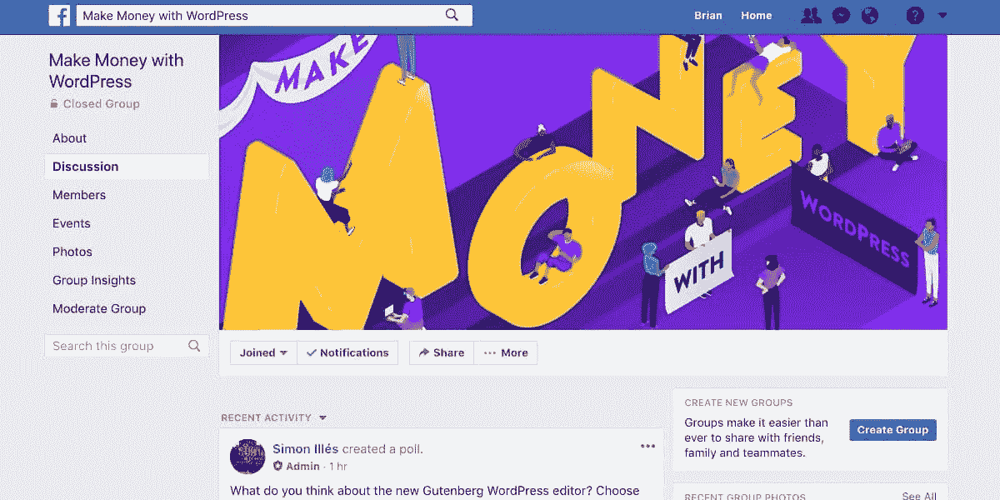
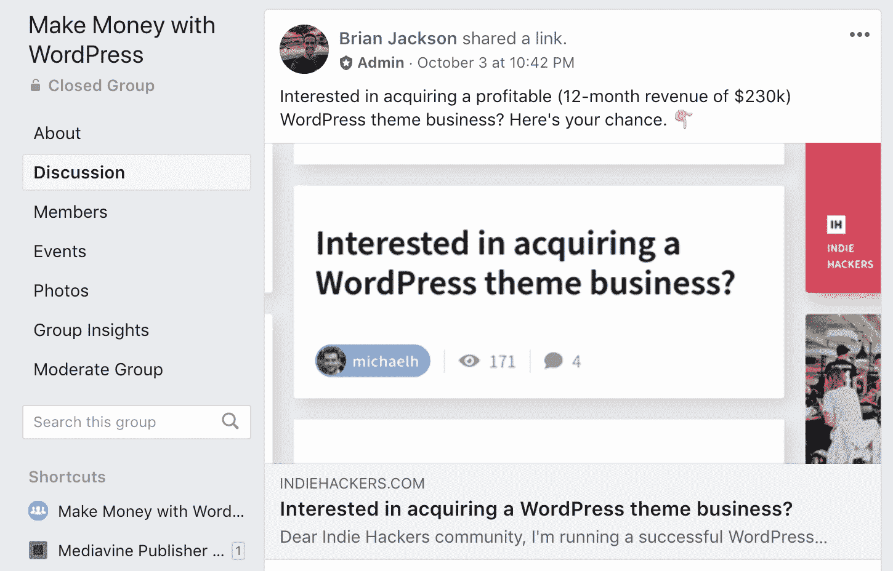
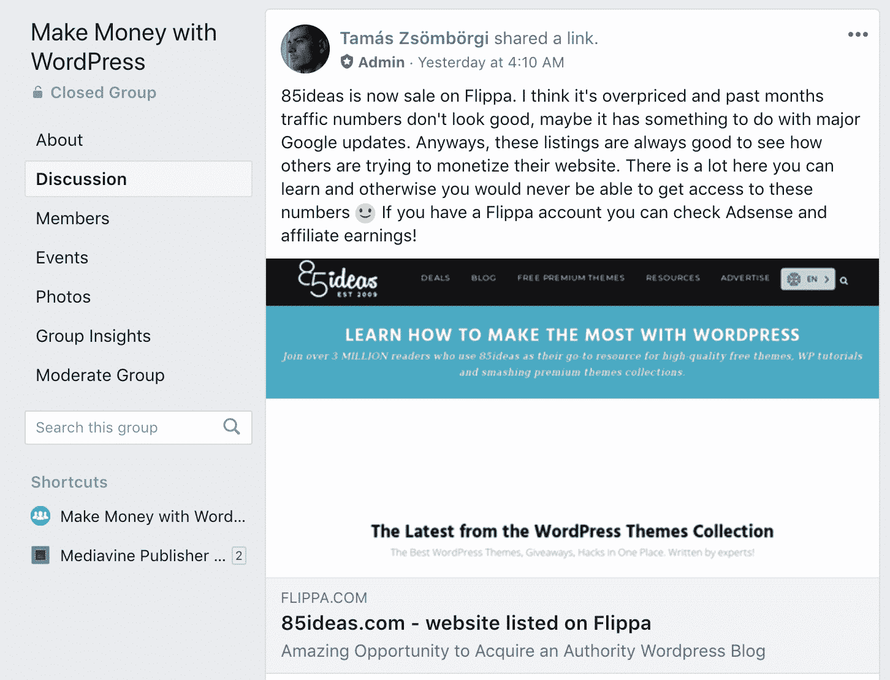

# 加入金斯塔的 WordPress 脸书集团赚钱

> 原文：<https://kinsta.com/blog/make-money-wordpress-facebook-group/>

我们希望你们所有人都能以 WordPress 为平台取得成功，不管你是不是 Kinsta 的客户。你们中的许多人经营联盟利基网站，高流量博客，管理大型电子商务(WooCommerce 和 EDD)商店。不管你在做什么，WordPress 可能在你的收入中扮演着关键的角色。

找出其他赚钱或增加收入的方法可能是你一直在想的事情。🤑令人沮丧的是，许多新的策略和方法需要时间来测试，而时间是你们很多人所没有的。

因此，我们决定发起[用 WordPress 脸书集团](https://www.facebook.com/groups/263423794308573/)赚钱，完全专注于如何用这个星球上最好的 CMS 增加你的收入！学习联盟营销技巧，并与他人聊天，谁看到了成功，并获得适用的捷径，以获得更高的收入。

Make money with WordPress Facebook group

## 为什么你应该加入脸书集团

我们将是第一个承认大多数脸书团体只是浪费时间的人。它们要么充满了垃圾邮件，要么是完全无用的信息。然而，我们可以向你保证，这一个是不同的。让我们来看几个原因。

1.  [与 Kinsta 营销团队聊天](#chat-with-kinsta-marketing-team)
2.  [了解盈利的 WordPress 网站和待售企业](#wordpress-sites-for-sale)
3.  [与其他成功的 WordPress 博客作者讨论策略](#strategies-other-bloggers)
4.  [无垃圾邮件保证](#no-spam)

### 1.与 Kinsta 营销团队聊天

首先，脸书集团的成员可以直接与金斯塔营销团队聊天。真的！问我们三个(如下图)任何你想要的。

*   首席财务官([汤姆·松博吉](https://twitter.com/tomzur)
*   主编([马特奥·杜奥](https://twitter.com/matteoduo)

当然，我们的专长是 WordPress 托管，但我们三个加起来有几十年的 WordPress 网站和博客工作经验。我们中的一些人运营着亚马逊利基网站、基于谷歌广告的博客、翻转网站，甚至建造/销售高级 WordPress 插件。

> 需要在这里大声喊出来。Kinsta 太神奇了，我用它做我的个人网站。支持是迅速和杰出的，他们的服务器是 WordPress 最快的。
> 
> <footer class="wp-block-kinsta-client-quote__footer">
> 
> 
> 
> <cite class="wp-block-kinsta-client-quote__cite">Phillip Stemann</cite></footer>

[View plans](https://kinsta.com/plans/)

不仅如此，我们还帮助[将 Kinsta 的收入从 0 美元提高到 7 位数](https://kinsta.com/blog/bootstrapping-startup/)。所以我们会想，**通过反复试验**，我们对如何建立一个成功的 WordPress 业务略知一二；无论是与 SaaS 的产品，内容营销，或战略广告合作伙伴关系。

利用我们这些年来学到的东西，开始你的成功。

## 注册订阅时事通讯

### 想知道我们是怎么让流量增长超过 1000%的吗？

加入 20，000 多名获得我们每周时事通讯和内部消息的人的行列吧！

[Subscribe Now](#newsletter)[Let's support each other by sharing knowledge and experience to earn more money with WordPress. 🤘Click to Tweet](https://twitter.com/intent/tweet?url=https%3A%2F%2Fbit.ly%2F38mq6Gn&via=kinsta&text=Let%27s+support+each+other+by+sharing+knowledge+and+experience+to+earn+more+money+with+WordPress.+%F0%9F%A4%98&hashtags=affiliatemarketing%2Cmakemoneyonline)

### 2.了解有利可图的 WordPress 网站和待售企业

我们总是在寻找新的盈利的 WordPress 网站(博客、插件商店、主题商店等),在市场上出售。你可能会惊讶于你每天访问的一些大型网站有多少次是在幕后交易的。对于你们中的一些人来说，这可能是一项伟大的投资，或者可能是你一直想要的 WordPress 行业全职工作的一个即时开始。又或许，你只是想要内容。😏

WordPress business for sale

在脸书小组，你可以谈论一个网站的潜力，或者流量的变化会如何影响你应该在 Flippa 上支付的费用。

Struggling with downtime and WordPress problems? Kinsta is the hosting solution designed to save you time! [Check out our features](https://kinsta.com/features/)

WordPress blog for sale

### 3.与其他成功的 WordPress 博客作者讨论策略

在不到一个月的时间里**有超过 250 名新成员**，在这个群体中已经发生了很多很棒的讨论。许多成功的 WordPress 博客作者和企业主正在分享他们自己的技巧和策略。以下是您可能会在小组中看到的众多话题中的几个:

*   我如何增加我的联盟营销收入？
*   我应该加入哪些好的 WordPress 联盟项目？
*   我想开始我的联盟事业，我在哪里可以买到 WordPress 业务？
*   如果我的 WordPress 站点只有一点点流量，那么增加收益最好关注什么？
*   我怎样才能增加我的谷歌广告收入？
*   Google AdSense 有更好的替代品吗？
*   什么是更好的联盟计划:经常性佣金或一次性佣金？
*   哪个 WordPress 插件最适合重定向和屏蔽附属链接？
*   我如何外包内容创作来增加代销商的收入？
*   我要卖我的 WordPress 网站，我应该在哪里卖，卖多少钱？
*   什么类型的流量转换更好？
*   我应该多样化联盟计划还是坚持一个或两个利基？
*   广告拦截器如何影响代销商行业？
*   我能做些什么来增加会员转化率？
*   我的网站速度会影响我的收入吗？

[The only stupid question is the one you don't ask. 😉Click to Tweet](https://twitter.com/intent/tweet?url=https%3A%2F%2Fbit.ly%2F38mq6Gn&via=kinsta&text=The+only+stupid+question+is+the+one+you+don%27t+ask.+%F0%9F%98%89&hashtags=affiliatemarketing%2Cmakemoneyonline)

### 4.无垃圾邮件保证

我们可以向你保证，没有人比我们更讨厌垃圾邮件！虽然我们总是鼓励富有成效的主题讨论，但在我们的脸书小组中，您永远不必担心垃圾邮件。就像我们的 Kinsta 博客一样，我们希望每个成员从脸书的对话中学到一些东西。最好的脸书小组是那些成员分享适用技巧的小组，每个人都可以应用到他们自己的 WordPress 网站上。

## 摘要

你准备好加入最好的和发展最快的脸书集团之一了吗？[点击这里加入](https://www.facebook.com/groups/263423794308573/)。我们很乐意和你更多地讨论在你的 WordPress 网站上赚钱时什么是有效的，什么是无效的。不要害羞。加入对话或向小组成员提问。

有什么想法吗？我们很想听听您对我们新成立的脸书集团的看法，或者对我们如何提供帮助有什么建议。别忘了去看看 [Kinsta 的加盟计划](https://kinsta.com/affiliates/)。每推荐一个人，您就可以赚取高达 500 美元的佣金+ **10%的每月定期终身佣金**。

* * *

让你所有的[应用程序](https://kinsta.com/application-hosting/)、[数据库](https://kinsta.com/database-hosting/)和 [WordPress 网站](https://kinsta.com/wordpress-hosting/)在线并在一个屋檐下。我们功能丰富的高性能云平台包括:

*   在 MyKinsta 仪表盘中轻松设置和管理
*   24/7 专家支持
*   最好的谷歌云平台硬件和网络，由 Kubernetes 提供最大的可扩展性
*   面向速度和安全性的企业级 Cloudflare 集成
*   全球受众覆盖全球多达 35 个数据中心和 275 多个 pop

在第一个月使用托管的[应用程序或托管](https://kinsta.com/application-hosting/)的[数据库，您可以享受 20 美元的优惠，亲自测试一下。探索我们的](https://kinsta.com/database-hosting/)[计划](https://kinsta.com/plans/)或[与销售人员交谈](https://kinsta.com/contact-us/)以找到最适合您的方式。