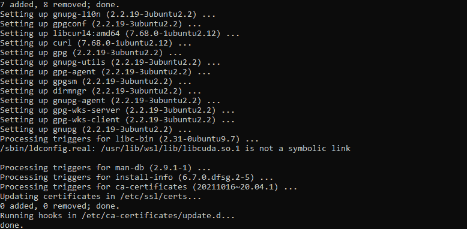
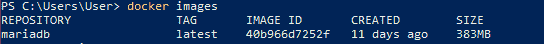
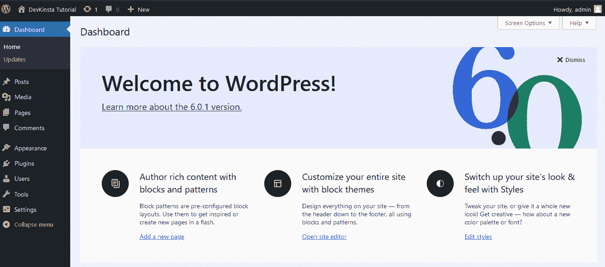
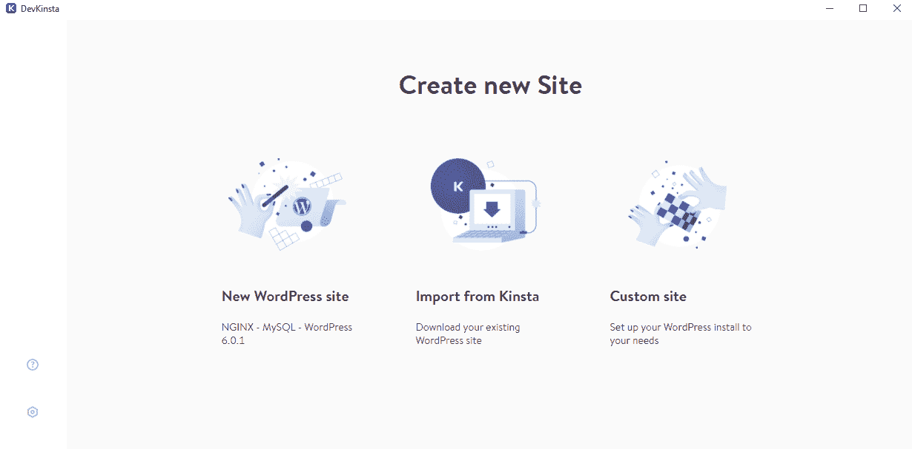
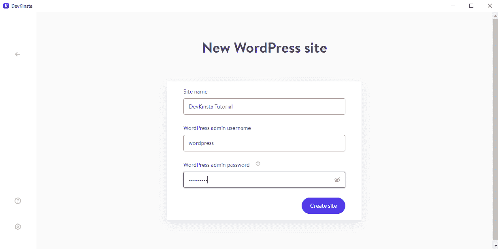

# 包含您的数据:用 Docker 运行 MariaDB

> 原文:# t0]https://kinta . com/blog/mariadb-docker/

MariaDB 是一个免费的数据库服务器，它使用结构化查询语言(SQL)提供数据访问。它提供了密码、基于角色的访问控制等安全功能来保护您的数据。

要部署 MariaDB 并向您的用户授予数据访问权限，您需要托管数据库服务器。你可以选择云提供商或使用托管或共享托管服务。

本文将教你如何使用 Docker 容器运行 MariaDB，配置和运行数据库服务器，并将其连接到 WordPress 网站。

## Docker 是什么？

Docker 是一个免费的开发工具，它使你能够在一个被称为容器的受控环境中运行应用程序。容器包含应用程序代码、依赖项和运行应用程序的关键系统工具。这允许您在整个软件开发生命周期中交付健壮的应用程序。

通常，容器使用您的操作系统作为宿主。这意味着主机的内核提供了对 CPU、内存和文件系统等资源的访问。因此，这不需要像虚拟机那样的传统虚拟化。使用 Docker 运行 MariaDB 实例有几个优点:

*   它的数字足迹很小，确保了系统资源的有效利用。
*   它是一致的，允许开发人员在生产和测试部署中运行应用程序，只需进行最小的更改。
*   它为资源共享提供了一种灵活的机制。
*   它是可扩展的——您可以在一台主机上运行许多容器。

## 如何用 Docker 部署 MariaDB

在本节中，您将使用 Docker 创建容器化的环境来运行 MariaDB。您将了解 Docker 提供的容器技术。Docker 适用于大多数版本的 Windows、macOS 和 Linux 发行版。对于本教程，你需要有 Windows 10/11，Ubuntu 20.04，或 macOS X 机器跟随。


> 需要在这里大声喊出来。Kinsta 太神奇了，我用它做我的个人网站。支持是迅速和杰出的，他们的服务器是 WordPress 最快的。
> 
> <footer class="wp-block-kinsta-client-quote__footer">
> 
> 
> 
> <cite class="wp-block-kinsta-client-quote__cite">Phillip Stemann</cite></footer>

[View plans](https://kinsta.com/plans/)

### 1.安装 Docker

Docker 最好的特性之一是它的可移植性。它使用主机的操作系统，使其成为测试和发布环境的理想选择。本节将教你如何在三个操作系统上安装 Docker。

#### Ubuntu 20.04

首先更新 Ubuntu 的包列表。

```
sudo apt-get update
```

然后，允许通过 HTTPS 访问在线知识库。

```
sudo apt-get install apt-transport-https ca-certificates curl gnupg-agent software-properties-common
```




接下来，添加 Docker 的 GPG 键。


```
sudo mkdir -p /etc/apt/keyrings

curl -fsSL https://download.docker.com/linux/ubuntu/gpg | sudo gpg --dearmor -o /etc/apt/keyrings/docker.gpg
```

现在，添加 Docker 的存储库。

```
echo deb [arch=$(dpkg --print-architecture) signed-by=/etc/apt/keyrings/docker.gpg] https://download.docker.com/linux/ubuntu $(lsb_release -cs) stable" | sudo tee /etc/apt/sources.list.d/docker.list > /dev/null
```

然后，更新 Ubuntu 的包以包含 Docker 的库。

```
sudo apt-get update
```

最后，安装 Docker 引擎。

```
sudo apt-get install docker-ce
```

如果您使用的是不同的 Linux 发行版，如 Debian 或 Fedora，请遵循官方文档中关于在 Linux 中安装 Docker 的说明。

#### Windows 10/11

Docker 可以在 Windows 10 或 11 上使用 Windows Subsystem for Linux version 2(WSL 2)作为后端。使用以下步骤安装 Docker。

首先，在您的 Windows 系统上启用[虚拟机平台特性](https://docs.microsoft.com/en-us/windows/wsl/install-manual#step-2---check-requirements-for-running-wsl-2)。这使您能够安装 WSL 2，并在 Windows 机器上安装和运行虚拟化的 Linux 实例。

接下来，[安装 WSL](https://docs.microsoft.com/en-us/windows/wsl/install) 。

然后，访问[微软商店](https://www.microsoft.com/store/productId/9MTTCL66CPXJ)下载 Ubuntu 20.04。

最后，下载 [Docker Desktop for Windows](https://docs.docker.com/desktop/install/windows-install/) 。打开下载的文件，启动安装过程。

安装完成后，从任务栏中搜索“Docker 桌面”并打开它。

(**注意:**您需要使用 PowerShell 作为您的终端来使用 Docker 命令。)


#### mac os x

Docker 可通过苹果应用商店在 macOS 机器上获得。有两个安装程序可以同时针对英特尔和 T2 的苹果芯片。

首先，从上面的链接之一下载合适的安装程序。然后，双击打开下载的**。dmg** 文件。

接下来，将 Docker 图标拖放到**应用程序**文件夹中。

现在，从**应用**文件夹打开 Docker 应用，按照提示完成配置。

安装过程完成后，双击桌面状态栏中的 Docker 图标将其打开。

## 注册订阅时事通讯


### 想知道我们是怎么让流量增长超过 1000%的吗？

加入 20，000 多名获得我们每周时事通讯和内部消息的人的行列吧！

[Subscribe Now](#newsletter)

使用默认终端运行 Docker 命令。

### 2.下载一个 MariaDB 映像

Docker 映像提供了一组命令和配置来创建 Docker 容器。它负责安装运行应用程序所需的一切。可以从 [Docker Hub](https://hub.docker.com/_/mariadb) 找到 MariaDB 官方形象。

要从 Docker Hub 下载 MariaDB 的映像，您需要使用`docker pull`命令:

```
docker pull mariadb
```

您还可以通过运行以下命令来查看下载的 Docker 映像列表:

```
docker images
```

这是命令输出:




列出码头工人的图片。


### 3.创建一个容器

容器是一个软件单元，包含运行进程或程序所需的所有代码、依赖项和系统工具。您将使用之前下载的映像来创建一个 MariaDB 容器。

```
docker create mariadb --name mariadb-wp -i –t
```

这创建了一个名为`mariadb-wp`的 MariaDB 容器。`–i`标志允许交互式会话，而`–t`选项创建一个伪终端。官方文件提供了所有可用变量的信息。

### 4.运行、暂停和停止容器

Docker 为开发人员提供了可配置环境的灵活性。在本节中，我们将使用环境变量配置 MariaDB 的容器，以便为您的容器设置特定的系统属性。

MariaDB 有许多变量可以设置，比如数据库名称、密码和数据库用户。有关支持的环境变量的更广泛列表，请参考 MariaDB 的 Docker 文档。

Struggling with downtime and WordPress problems? Kinsta is the hosting solution designed to save you time! [Check out our features](https://kinsta.com/features/)

```
docker run -d --name mariadb-wp -p 3306:3306 -v '/path/on/host/:/var/lib/mysql' -e "MARIADB_ROOT_PASSWORD=" -e "MARIADB_DATABASE=wordpress" -e "MARIADB_USER=wordpress" -e "MARIADB_PASSWORD=" mariadb
```

上面的命令配置 MariaDB 的 root 密码、数据库用户和相关密码。然后它在端口 3306 上运行 MariaDB。您可以使用以下命令决定暂停容器应用程序的运行:

```
docker pause mariadb-wp
```

最后，您还可以使用以下命令停止在容器内运行的应用程序:

```
docker stop mariadb-wp
```

### 5.将容器化的 MariaDB 连接到一个 WordPress 站点

现在，我们需要将 MariaDB 连接到一个外部 WordPress 网站。你可以在这里了解更多关于[在本地创建 WordPress 网站的信息。](https://kinsta.com/blog/install-wordpress-locally/)

在 WordPress 网站的根目录下，在你的代码编辑器中打开**wp-config.php**文件。找到为数据库定义变量的代码部分并编辑它，如下所示。确保在创建 MariaDB 容器时使用数据库名称、密码和端口号。

```
define('DB_NAME', 'wordpress');

define('DB_USER', 'wordpress’);

define('DB_PASSWORD', '');

define('DB_HOST', 'http://localhost:3306’);
```

接下来，您需要将 WordPress 网站的数据库转储导入容器化的 MariaDB。首先，确保您已经导出了网站的当前数据库。要了解更多，请查看我们的 [MySQL 数据库备份](https://kinsta.com/knowledgebase/mysql-backup-database/)教程。

导出数据库后，在容器中安装数据库转储。

```
docker exec -i mariadb-wp sh -c 'exec mysql -u root -p "$MARIADB_ROOT_PASSWORD" < /some/path/on/your/host/all-databases.sql'
```

`docker exec`命令允许开发人员在容器内部运行 shell 命令。我们在上面的命令中使用导出的文件将数据库导入到 MariaDB 中。


## 6.在你的 WordPress 站点上添加一篇新文章

我们将使用 WordPress admin 帐户创建一个示例帖子来测试这个集成。

首先，登录 WordPress，点击**帖子** > **添加新的**。如下图所示填写详细信息，然后点击**发布**。创建帖子后，点击**查看帖子**查看新添加的帖子。




在 WordPress 编辑器中添加新帖子。


这就是全部了！

## 7.MariaDB 和 Docker 与 DevKinsta

Kinsta 的免费应用程序 [DevKinsta](https://kinsta.com/devkinsta/) ，可以让开发者高效地创建容器化的 WordPress 站点。该应用程序使用 Docker 来配置 PHP 版本、数据库服务器和 web 服务器。DevKinsta 应用程序支持使用 macOS、Windows 和 Ubuntu/Linux 的开发人员。

首先，在本地机器上下载、安装并启动 DevKinsta。这个应用程序给你三个选项:创建一个新的 WordPress 站点，从 Kinsta 导入一个现有的站点，或者创建一个自定义站点。




DevKinsta 的 new create new site 屏幕。


创建一个新的 WordPress 站点就像填写一个简单的表格并点击**创建站点**一样简单。




DevKinsta 的新 WordPress 站点创建屏幕。


祝贺你——你现在已经使用 DevKinsta 创建了一个容器化的 WordPress 网站！

## 摘要

Docker 是一个开发人员友好的工具，用于将运行 MariaDB 等数据库服务器的软件容器化。它的简约环境有助于在不牺牲功能的情况下保持系统资源的效率。

本教程教你如何安装 Docker，设置 MariaDB，并连接 WordPress 站点和容器化的 MariaDB 数据库。另外，你学习了如何使用 DevKinsta 创建一个完全容器化的 WordPress 网站。

WordPress 网站创建及其众多的托管解决方案还有很多值得探索的地方。如果你想知道你的网站管理有多简单，那么 Kinsta 的[托管 WordPress 主机](https://kinsta.com/blog/managed-wordpress-hosting/)可以满足你。

* * *

让你所有的[应用程序](https://kinsta.com/application-hosting/)、[数据库](https://kinsta.com/database-hosting/)和 [WordPress 网站](https://kinsta.com/wordpress-hosting/)在线并在一个屋檐下。我们功能丰富的高性能云平台包括:

*   在 MyKinsta 仪表盘中轻松设置和管理
*   24/7 专家支持
*   最好的谷歌云平台硬件和网络，由 Kubernetes 提供最大的可扩展性
*   面向速度和安全性的企业级 Cloudflare 集成
*   全球受众覆盖全球多达 35 个数据中心和 275 多个 pop

在第一个月使用托管的[应用程序或托管](https://kinsta.com/application-hosting/)的[数据库，您可以享受 20 美元的优惠，亲自测试一下。探索我们的](https://kinsta.com/database-hosting/)[计划](https://kinsta.com/plans/)或[与销售人员交谈](https://kinsta.com/contact-us/)以找到最适合您的方式。