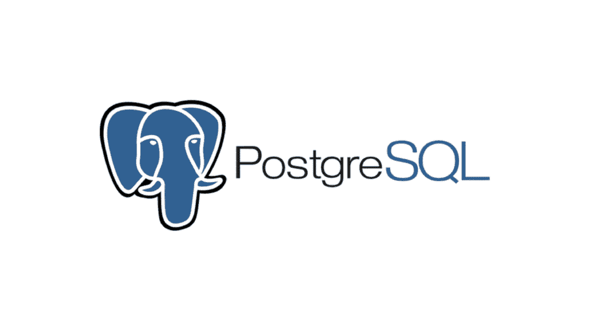
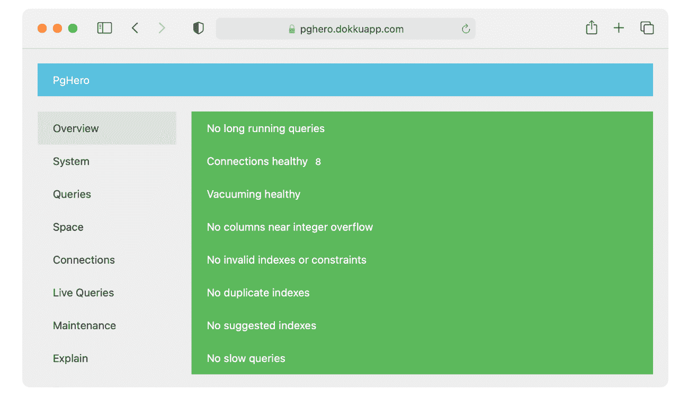

# MariaDB 与 PostgreSQL: 14 个关键差异

> 原文：<https://kinsta.com/blog/mariadb-vs-postgresql/>

数据库本质上是任何软件的支柱。随着几个数据库出现在市场上，以及开源数据库越来越受欢迎，许多开发者和企业都有一个共同的问题:如何选择正确的数据库？

在本文中，我们将讨论两个最流行的开源数据库——Maria db 和 PostgreSQL。
[你知道这两个流行的开源数据库相比如何吗？🤔潜入这里⬇️ 点击发布推文](https://twitter.com/intent/tweet?url=https%3A%2F%2Fkinsta.com%2Fblog%2Fmariadb-vs-postgresql%2F&via=kinsta&text=Do+you+know+how+these+two+popular+open-source+databases+compare%3F+%F0%9F%A4%94+Dive+in+here+%E2%AC%87%EF%B8%8F&hashtags=MariaDB%2CWebDev)
虽然 PostgreSQL 已经存在了 20 年，并且在其稳定性方面非常出色，但 MariaDB 也证明了自己是一个伟大的数据库系统，它是从最常用的数据库系统 MySQL 中分出来的。MariaDB 和 PostgreSQL 都支持大量的特性，比如复制、[良好的安全性](https://kinsta.com/blog/wordpress-security/)，以及更多免费的特性。

如果你在 MariaDB 和 PostgreSQL 之间左右为难，不要担心。我们将探索数据库的各种特性，以及它们的使用情形，最重要的是它们的区别。

让我们开始吧！

## 什么是 MariaDB？

MariaDB logo. (Image source: [MariaDB](https://mariadb.com/about-us/logos/))

MariaDB 是一个开源的、高度可扩展的数据库，由 MySQL 的创始人在 2009 年被 Oracle 收购后创建。虽然它与 MySQL 很相似，但自诞生以来，它已经有了很大的发展。

首先，MariaDB 在大多数情况下提供了改进的性能，并且是完全 GPL 许可的。您可以使用开源社区版本，也可以请求企业版报价，如果您要在大规模平台或云上实现您的软件，您可能需要考虑这一点。但是，所有功能都可以在开源包中获得，而不是企业版独有的。
 除了作为 MySQL 的高度稳定的替代产品之外，MariaDB 还支持 JSON 和混合数据格式，允许轻松地存储、检索和操作数据。MariaDB 总线和路线图的文档也可以免费访问。

## PostgreSQL 是什么？

PostgreSQL. (Image source: [Uberconf](https://uberconf.com/blog/bruce_snyder/2013/06/installing_postgresql_9_0_on_mac_os_x_10_6_8_via_macports))

PostgreSQL 是一个高级的关系数据库系统，自 1997 年就出现了。它支持符合标准的事务隔离形式，包括序列化、读取、提交和可重复读取。这些方法提供了完全的 ACID 遵从性，从而使 PostgreSQL 成为一个高度稳定的数据库，几乎可以做任何事情——包括对 NoSQL、React 和 Redis 等的强大扩展支持。

它得到了开源社区 20 多年发展的支持，并经历了频繁的更新，包括不断添加新的文档。该文档不仅可以帮助排除故障或跟踪问题，而且也是开发或改进 PostgreSQL 特性以用于未来文档的很好的参考工具。此外，PostgreSQL 是一个非常安全可靠的数据库，因为所有的错误修复都经过了几轮严格的测试。

## MariaDB 的主要特性

MariaDB 有几个特性使它成为一个伟大的数据库，包括它的大量存储引擎选择、线程池、SQL 兼容性和并行查询执行。

以下是亮点:

*   **存储引擎:**让 MariaDB 脱颖而出的特性之一是可供选择的存储引擎种类繁多。PBXT、XtraDB、Maria 和 FederatedX 是几种可行的发动机选项，可以根据您的要求进行定制。它还包含 InnoDB，这是一个通用存储引擎，以平衡高可靠性和高性能而闻名。
*   线程池:线程池是代表应用程序有效执行异步回调的工作线程的集合。当发出请求时，MariaDB 可以简单地获得一个已经在池中的先前创建的线程。这节省了创建线程的时间，并为线程周期开销提供了一个解决方案，允许查询运行得更快并返回更快的结果。
*   **SQL 兼容性:** MariaDB 通过客户端程序(如 mysqldump、mysqladmin)和[插件](https://kinsta.com/blog/wordpress-database-plugin/)(如审计插件)为大多数 SQL 语句、变量、定义和函数提供支持。开发人员还可以利用 MariaDB 中的 JSON 函数、窗口函数和公共表表达式(cte)。
*   **虚拟列:**对虚拟列的支持是 MariaDB 的主要特性之一，可以用来执行数据库级别的计算。当多个 app 访问一列时，用户不必在每个 app 中单独编写计算；数据库代表他们做这件事。
*   **并行查询执行:**从 10.0 版本开始，您可以同时执行多个查询而不会降低性能，从而加快任务执行速度。

## PostgreSQL 的主要特性

除了开源之外，PostgreSQL 还拥有各种各样的特性。分区、负载平衡和连接池都与 PostgreSQL 一起工作，使它比同时代的产品有相当大的优势。

以下是 PostgreSQL 的一些显著特性:

*   **对 JSON 数据的支持:**查询和存储 JSON 的能力允许 PostgreSQL 运行 NoSQL 工作负载。如果您正在设计一个数据库来存储来自多个传感器的数据，并且您不确定您将需要哪些特定的列来支持传感器，那么您可以构建一个表，使其中一个列遵循 JSON 格式来存储不断变化的或非结构化的数据。
*   **强大的扩展:** PostgreSQL 拥有令人印象深刻的特性集，包括时间点恢复、多版本并发控制(MVCC)、表空间、粒度访问控制、预写日志和在线/热备份。PostgreSQL 在区分大小写、排序和格式方面也是区域设置敏感的。它在可管理的数据量和可容纳的并发用户数量方面都具有高度的可扩展性。
*   **数据更新:**多种形式的联合与复制相结合，为几乎任何类型的数据系统提供了推和拉技术。这些可以在不同的配置中组合，以桥接数据库存储解决方案，而不需要 ELT/ETL 处理包。数据根本不会从源系统中移出，这意味着数据总是最新的。
*   **测试驱动开发:** PostgreSQL 遵循测试驱动开发，每一个 bug 都会遇到一次测试，编写代码来满足测试。这些测试是集成的，这样 bug 就不会在 PostgreSQL 的未来版本中再次出现。PostgreSQL 的新更新只有在所有回归测试用例通过后才会发布。

## MariaDB 用例

随着 MariaDB 越来越受欢迎，它已经被证明是一个出色而可靠的数据库系统。它被用作三星、诺基亚甚至沃尔格林的后台数据库系统！

更何况可以利用现有的几个软件从 MySQL 迁移到 MariaDB，比如 [phpMyAdmin](https://kinsta.com/blog/install-phpmyadmin/) 和 [WordPress](https://kinsta.com/knowledgebase/what-is-wordpress/) ，世界上最[流行的内容管理系统(CMS)](https://kinsta.com/wordpress-market-share/) 。这些软件允许您进一步扩展已经非常灵活的数据库解决方案。

以下是 MariaDB 的一些优秀应用:

*   **智能事务:** MariaDB Enterprise 通过将针对快速事务优化的行存储与针对快速分析优化的列存储相结合，支持智能事务(即混合事务/分析处理或 HTAP)。借助智能交易，开发人员可以通过实时分析丰富 web 和移动应用程序，这使您能够通过引人注目的数据创造更具洞察力的客户体验。
*   **分析:**使用列存储和大规模并行处理(MPP)可以将 MariaDB 部署为数据仓库或分析数据库，以便在不创建索引的情况下，使用标准 SQL(包括连接)对数千亿行执行交互式即席查询。此外，MariaDB Enterprise 实现了云原生存储架构，可以选择使用亚马逊 S3 兼容对象存储来降低成本和利用无限的容量。用户可以分析大量数据，而不必为每个潜在的查询创建索引。

## PostgreSQL 用例

由于 PostgreSQL 的多功能性，像优步、网飞和 Instagram 这样的巨头在后端使用 PostgreSQL 就不足为奇了。以下是数据库的一些重要使用案例:

*   **地理空间数据库:**当与 PostGIS 扩展一起使用时，PostgreSQL 支持地理对象，并可用作地理信息系统(GIS)和基于位置的服务的地理空间数据存储。这在基于位置的应用程序的开发中是非常宝贵的。
*   **LAPP 栈的后端数据库:**作为 LAMP 栈的替代，LAPP 代表 Linux、Apache、PostgreSQL 和 PHP(或者 Python 和 Perl)。PostgreSQL 是 LAPP 堆栈的一部分，用作运行动态应用程序和网站的强大后端数据库。
*   **通用 OLTP 数据库:**许多大型企业和初创公司使用 PostgreSQL 作为主要的数据存储，以支持其互联网规模的应用程序、产品和解决方案。

## MariaDB 与 PostgreSQL:势均力敌的比较

现在是时候让这两种数据库解决方案相互竞争了。让我们探索一下 MariaDB 如何与 PostgreSQL 相抗衡，反之亦然。

### 架构/文档模型

MariaDB 和 PostgreSQL 都将关系数据库管理系统(DBMs)作为它们的主要数据库模型。

他们的辅助数据库模型是文档存储；然而，只有 MariaDB 还可以合并图形 DBMs。

MariaDB 和 PostgreSQL 都采用客户机/服务器体系结构模型，其中服务器负责管理数据库文件，接受客户机应用程序到数据库的连接，并代表客户机执行数据库操作。客户端或前端应用程序通常执行数据库操作。

### 展开性

MariaDB 和 PostgreSQL 都包含用于定制的可扩展架构。需要某些额外功能的用户可以使用共享库来实现，这允许开发人员根据自己的喜好定制代码。

MariaDB 支持许多不同的 SQL 模式、分区、数据库备份和恢复过程、服务器监控和日志记录。你甚至可以创建你的函数、数据类型、操作符、窗口函数或者其他任何东西。没有看到您喜欢的功能？由于它的开源许可，您可以从源代码本身创建和定制它。

尽管 PostgreSQL 提供了对 JSON 和 XML 的原生支持，但它很容易扩展。因此，如果您想构建一个 web 服务，并使用 PostgreSQL 作为后端数据库系统，或者利用 Python 地图支持您的业务用例，您可以放心大胆地去做。

PostgreSQL 如此具有可扩展性的原因是其目录驱动的操作。PostgreSQL 保留关于列和表的所有信息，以及关于数据类型、函数和访问方法的详细信息。

### 指数

MariaDB 中的索引主要有四种，分别是:主键(唯一且不为空)；唯一索引(唯一的，可以为空)；普通索引(不一定是唯一的)；和全文索引(用于全文搜索)。

PostgreSQL 提供了更广泛的唯一索引类型来高效地匹配任何查询工作负载，例如 B 树、hash、GiST、SP-Gist、GIN 和 BRIN。PostgreSQL 进一步支持函数驱动的索引、部分索引和不互斥的覆盖索引，这意味着您也可以同时使用它们。

此外，MariaDB 和 PostgreSQL 都支持全文索引和搜索。

### 语言和句法

MariaDB 和 PostgreSQL 都支持各种 SQL 语句、规则、函数和过程，以及各种数据库连接器，包括 C、C++、Perl、PHP 和 Python 等等。

PostgreSQL 还可以实现通用表表达式(CTE)、语言控制结构(if、for、case 等)。)，以及结构化错误处理。

### 分割

MariaDB 通过 Galera 集群/Spider 存储引擎的分片以及表的水平分区来提供分区支持。这有助于提高 MariaDB 的查询性能。使用 MariaDB，您还可以将经常访问的最近数据与很少引用的历史数据存储在单独的分区中，从而提高访问速度。

另一方面，PostgreSQL 不支持这些。尽管我们对未来的发展充满希望，但是 PostgreSQL 中还没有表分区的选项。

### 速度

数据库是你网站的核心，由于服务器经常访问它，你的数据库的速度反映了你的 WordPress 网站的速度。一个快速的网站加上快速的加载时间可以帮助提高您的访问者数量和网站性能，从而进一步支持您的业务。

各种插件可以帮助你去掉多余的东西，优化，修复，整理你的网站，但是建议你从一个很棒的主机开始完善你的数据库。例如，Kinsta 提供了[备份](https://kinsta.com/help/wordpress-backups/)和[每周自动数据库优化](https://kinsta.com/feature-updates/auto-db-optimize/#automatic-mysql-database-optimizations)。因此，有了像 Kinsta 这样的主机提供商，你就不需要大部分的数据库插件了。

最重要的是，借助 Kinsta 的[托管，您不再需要审查优化或检查备份。](https://kinsta.com/wordpress-hosting/)

PostgreSQL 具有提供更快读写速度的能力，这使得它成为在业务运营中周转时间和数据访问速度起主要作用的情况下的推荐选择。当数据库要处理大量数据时，PostgreSQL 也是必不可少的选择。

另一方面，MariaDB 拥有一个高级线程池，能够运行得更快，支持多达 200，000+个连接，并配有 12 个新的存储引擎，这使它能够在查询处理速度方面与 PostgreSQL 并驾齐驱。

## 注册订阅时事通讯

### 想知道我们是怎么让流量增长超过 1000%的吗？

加入 20，000 多名获得我们每周时事通讯和内部消息的人的行列吧！

[Subscribe Now](#newsletter)

### 监控和管理工具

由于数据库是关键的软件组件，因此有大量的工具可供选择，用于监控、管理、[管理](https://kinsta.com/blog/adminer/)和故障排除目的。

#### 基本管理工具

以下命令行应用程序非常适合基本管理任务:

*   psql (PostgreSQL)
*   mysql (MariaDB，mysql)

由于这些工具内置于它们各自的服务器中，所以从安装开始， **psql** 和 **mysql** 就一直可用。 **psql** 和 **mysql** 都有一个命令历史，允许你重新运行以前执行的命令和查询，以及一组内置命令，可以方便与数据库的交互。例如， **psql** 使用 **\d** 命令列出所有数据库，而 **mysql** 使用 **status** 命令提取服务器正常运行时间和版本等信息。

MariaDB 和 PostgreSQL 还提供了以下官方绘图工具:

*   pgAdmin4 (PostgreSQL)
*   MySQL 工作台(MariaDB，MySQL)

#### 绩效仪表板工具

除了前面提到的命令行和图形应用程序，MariaDB 和 PostgreSQL 还提供了其他更高度专业化的工具。一个这样的工具是 PgHero，由 PostgreSQL 创建，作为一个全面的性能仪表板。

PGHero dashboard. (Image source: [PgHero](https://github.com/ankane/pghero?ref=stackshare))

在 MariaDB 中，您可以利用 MySQL Tuner 达到与 PgHero 相同的目的。MySQL Tuner 是一个 Perl 脚本，它可以分析您的数据库统计数据和设置，以生成配置建议。

#### 日志解析工具

您可以使用像 MariaDB 的 pt-query-digest 这样的日志解析工具来帮助您查明缓慢的查询。Pt-query-digest 可以分析您的日志并运行测试查询来识别最慢的查询，以便您可以相应地优化它们。

PostgreSQL 为类似的日志解析目的提供了 pgBadger。这是一个快速简单的工具来分析您的 SQL 流量，并生成 HTML5 报告完成动态图表。

### 表演

MariaDB 被认为适合于较小的数据库，并且能够在内存中存储数据，这是 PostgreSQL 所不提供的功能。另一方面，PostgreSQL 利用内部缓存和服务器的页面缓存来提取频繁访问的数据，这使得它的性能优于 MariaDB 的查询缓存。

PostgreSQL 还提供了各种高级特性，如部分索引和物化视图，以优化数据库性能。使用实例化视图，您可以预先计算昂贵的聚合和连接操作，并将结果存储在数据库的表中，从而提高频繁触发的复杂查询的性能，并访问大量数据以获得结果。

部分索引是在查询结果上生成的，而不是在表的每一行上生成的。在大多数情况下，基于高活动性/新近性，查询只涉及表中行的子集。如果为来自那些被频繁访问的行的查询结果生成部分索引，可以大大加快查询的执行速度。

当您有一个包含各种巨大表的大型数据集，需要频繁地连接这些表以生成聚合时，这些功能就很方便了。然而，值得注意的是，这些特性在 MariaDB 中是不存在的。

Struggling with downtime and WordPress problems? Kinsta is the hosting solution designed to save you time! [Check out our features](https://kinsta.com/features/)

### 价格

对于 MariaDB，许可成本约为每年 4，000 美元。实际价格根据你发帖的数量和你选择的软件而定。MariaDB 还提供了一个自托管的开源选项，非常适合希望熟悉 MariaDB 广阔世界的初学者。

PostgreSQL 是一个内部部署的开源平台，因其易操作性、多功能性和可伸缩性而被世界各地的开发人员广泛利用。但是，如果您觉得您可能需要频繁的支持，您可以尝试 PostgreSQL 的商业版本，也称为 EnterpriseDB。

### 数据类型化

在数据类型方面，MariaDB 比 PostgreSQL 更灵活。它可以自动更正数据以匹配目标数据类型，接受数据并触发警报。因此，MariaDB 是需要对数据输入中的差异做出直观反应的应用程序的首选。

另一方面，PostgreSQL 的类型更加严格，这意味着如果传入数据与目标数据类型稍有不同，PostgreSQL 将抛出错误，并且不允许插入。PostgreSQL 倾向于严格的数据完整性。

### 复制和集群

对于延迟复制，您可以定义复制辅助节点落后于主节点的时间(以秒为单位)。这是为了确保次映像反映主映像在最近某个时间的状态。

MariaDB 支持异步多源复制和主从复制。因此，可以通过 MariaDB Galera 集群执行半同步复制、多主集群、延迟复制和并行复制。

另一方面，PostgreSQL 提供了主-从[复制](https://kinsta.com/blog/postgresql-replication/)以及级联复制、流复制和同步复制。通过利用最新的 BDR 包，您甚至可以在 PostgreSQL 中执行双向复制。

同步复制的 Quorum commit 通过允许您指定任何给定数量的备用数据库回复后每次提交进行的时间，而不考虑它们的顺序，在同步复制中提供了更大的灵活性。这允许您持续部署和更新数据库。

使用逻辑复制，您可以将每个表或每个数据库级别的修改发送到不同的 PostgreSQL 数据库，这允许您微调如何将数据复制到数据库集群。

### 安全性

MariaDB 频繁发布安全补丁，体现了安全对于 MariaDB 社区的重要性。

类似地，PostgreSQL 全球开发组(PGDG)发布了一个广泛的活动常见暴露和漏洞列表，由一个大型活跃的社区定期解决。

### 重要的

出于安全和性能的原因，你必须[用最新的版本和补丁保持开源软件最新](https://kinsta.com/blog/mysql-version/)。

### 大小

与 PostgreSQL 相比，MariaDB 的大小要小得多，这适用于各种操作系统版本。MariaDB 也明显更轻，如果内存分配不足，它是首选。

### 支持和社区

MariaDB 通过工程师提供支持，这些工程师通常是软件开发人员和数据库管理员，他们也是 MySQL 和 MariaDB 的技术专家。对于拥有企业级订阅的用户，MariaDB corporation 提供了广泛的 24/7/365 支持。

也可以通过 MariaDB 知识库获得支持，在那里您可以筛选教程、文档、教程和其他有用的资源。

MariaDB 依赖并致力于一个活跃的社区，包括开发人员、贡献者和非开发人员团体。您将找到不同的方式[通过社交媒体、邮件列表、活动和会议与社区成员](https://mariadb.com/kb/en/community/)互动，并且鼓励您自己帮助调试、记录和开发 MariaDB。

PostgreSQL 也拥有一个活跃而广泛的社区，它通过用户组、文档、邮件列表和补充资源为用户提供支持，包括一个 IRC 通道，用户可以方便地向有知识和活跃的 PostgreSQL 社区成员提出问题。还有几个 PostgreSQL 的国际站点，因此您可以在您的国家和/或语言中找到社区参与机会和资源。

在 PostgreSQL 社区页面上，有各种参与方式，包括邮件列表、学习机会和职位发布。开发人员页面为您提供了了解更多信息或成为 PostgreSQL 项目活跃开发人员的途径。补充的社区资源，在那里你可以找到其他交流和参与的方式，包括 [Planet PostgreSQL](https://planet.postgresql.org/) 和 [PostgreSQL Wiki](https://wiki.postgresql.org/wiki/Main_Page) 。

### 挑战

尽管 MariaDB 已经成为市场上最安全、最易于使用的数据库解决方案之一，但与任何解决方案一样，您可能最终还是会遇到困难。

以下是利用 MariaDB 作为业务运营数据库的一些挑战:

*   **缺少调试函数的工具:** MariaDB 不提供调试函数和程序的专用工具。这些 MariaDB 过程的稳定性，包括用于扩展数据库在线事务的稳定性，远非完美。
*   **缺少专用的复制服务器:**拥有专用的复制服务器将有助于简化用户的复制过程。您需要设计一个定制的解决方案，用于在实时环境中镜像您的数据库，以便在生产环境中写入的记录可以跨服务器复制。如果 MariaDB 为其用户简化主-主复制，它也可以得到很大的改进，但这还没有发生。

作为 MariaDB 的竞争者，PostgreSQL 已经为自己赢得了一个完整的开源数据库解决方案的名字，并在激烈的竞争环境中继续这样做。尽管 PostgreSQL 提供了各种优势，但是它在一些方面还是有不足。

以下是您在使用 PostgreSQL 时可能会面临的一些挑战:

*   **时间:**确保无缝执行 PostgreSQL 迁移或开发项目可能会比预期花费更长的时间。意外的问题通常需要额外的研究，这可能会延迟进度。因此，从一开始就必须在项目进度中留出时间进行持续研究。
*   成本:一个常见的误解是，作为开源的 PostgreSQL 解决方案是 100%免费的。然而，尽管安装、下载和使用该解决方案是免费的，但几乎总是会有与支持、迁移和维护相关的成本，而且这些成本不容忽视。
*   **部署规模:**对于拥有小型数据库的小型企业来说，切换到 PostgreSQL 可能很容易，但是大型企业和中型企业可能会面临迁移挑战，甚至最终需要迁移服务或支持供应商的帮助。
*   **内部专业知识:**维护任何数据库都需要专业知识，PostgreSQL 也不例外。公司需要比较雇佣内部专家和让内部团队自下而上学习 PostgreSQL 的相关成本。

## MariaDB vs PostgreSQL:你该选哪个？

MariaDB 通过将数据转换为正确的类型，在更新和插入时提供了数据类型的灵活性。这在速度和资源分配方面是有益的，但是需要更加注意确保数据符合模式。

MariaDB 对主-主复制的支持对于需要低延迟和高可用性的应用程序来说也很方便。如果这听起来像是你在下一个项目中需要的，那么 MariaDB 将是更明智的选择。

PostgreSQL 是一个经过时间考验的强大的关系数据库系统，它一直是小型企业、企业和个人的重要开源选择。它特别适合依赖低成本维护和部署，但即使在高容量环境中也需要稳定性、可靠性和响应能力的公司和应用程序。
[感觉在 MariaDB 和 PostgreSQL 之间被撕裂？不要再看了👀 点击推文](https://twitter.com/intent/tweet?url=https%3A%2F%2Fkinsta.com%2Fblog%2Fmariadb-vs-postgresql%2F&via=kinsta&text=Feeling+torn+between+MariaDB+and+PostgreSQL%3F+Look+no+further+%F0%9F%91%80&hashtags=OpenSource%2CWebDev)

## 摘要

在本文中，我们已经详细讨论了 MariaDB vs PostgreSQL。这些因素包括关键因素，如速度、性能、语法、可扩展性、安全性、支持和社区、索引和架构，以帮助您就最适合您独特业务需求的数据库工具做出明智的决策。

如你所见，MariaDB 和 PostgreSQL 各有优缺点。最终，在 MariaDB 和 PostgreSQL 之间做出选择需要仔细考虑您的系统需求，并充分理解给定的数据库如何满足这些需求。

在 MariaDB 和 PostgreSQL 之间，你计划在你的下一个项目中使用哪个，为什么？我们很想听听你的想法！请在下面的评论区分享它们。

* * *

让你所有的[应用程序](https://kinsta.com/application-hosting/)、[数据库](https://kinsta.com/database-hosting/)和 [WordPress 网站](https://kinsta.com/wordpress-hosting/)在线并在一个屋檐下。我们功能丰富的高性能云平台包括:

*   在 MyKinsta 仪表盘中轻松设置和管理
*   24/7 专家支持
*   最好的谷歌云平台硬件和网络，由 Kubernetes 提供最大的可扩展性
*   面向速度和安全性的企业级 Cloudflare 集成
*   全球受众覆盖全球多达 35 个数据中心和 275 多个 pop

在第一个月使用托管的[应用程序或托管](https://kinsta.com/application-hosting/)的[数据库，您可以享受 20 美元的优惠，亲自测试一下。探索我们的](https://kinsta.com/database-hosting/)[计划](https://kinsta.com/plans/)或[与销售人员交谈](https://kinsta.com/contact-us/)以找到最适合您的方式。