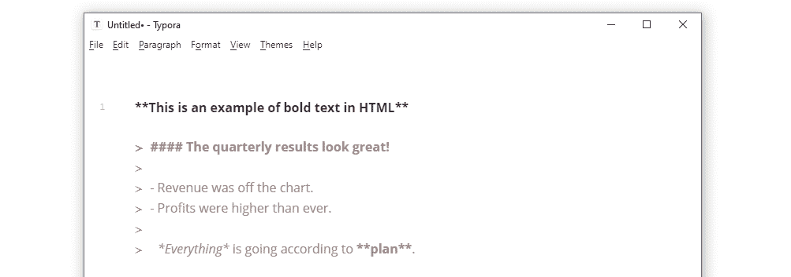
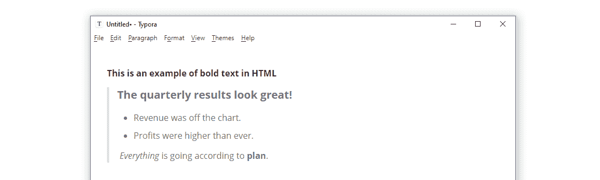
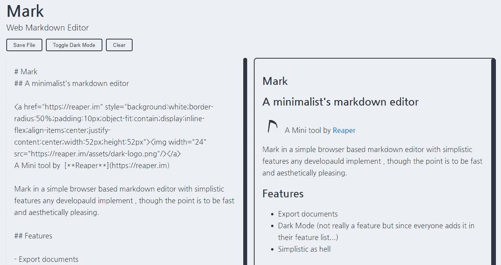
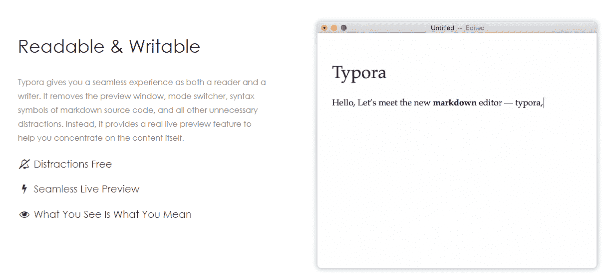
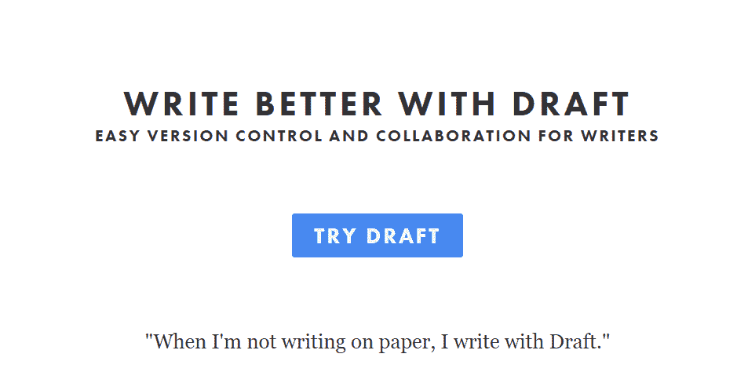
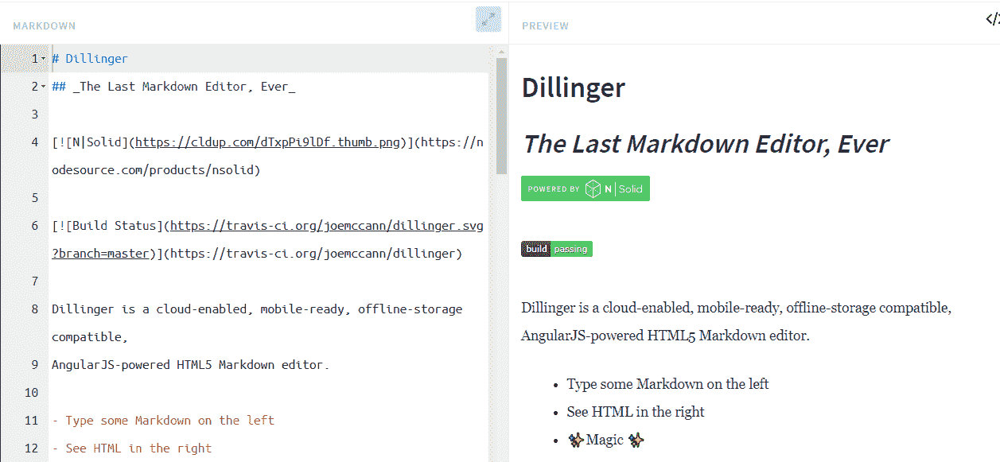
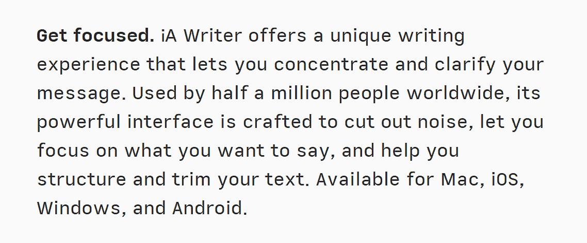
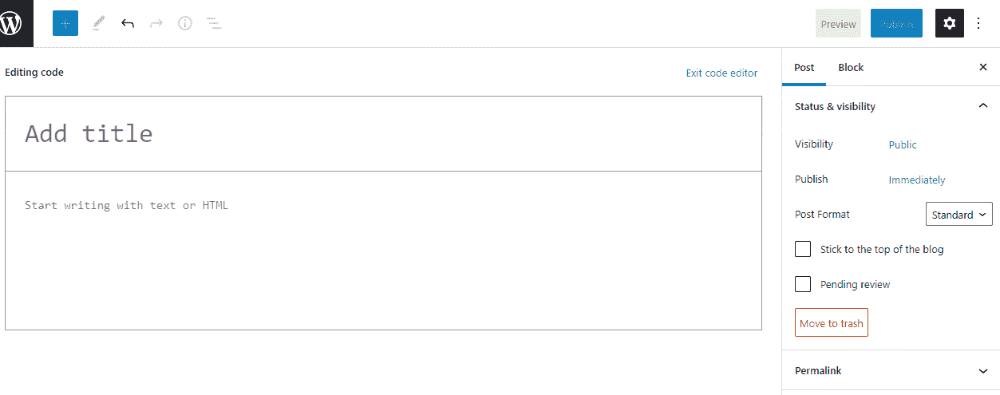
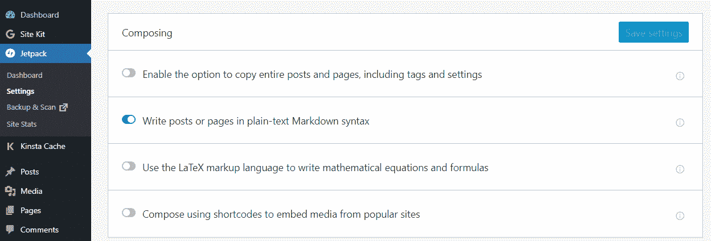
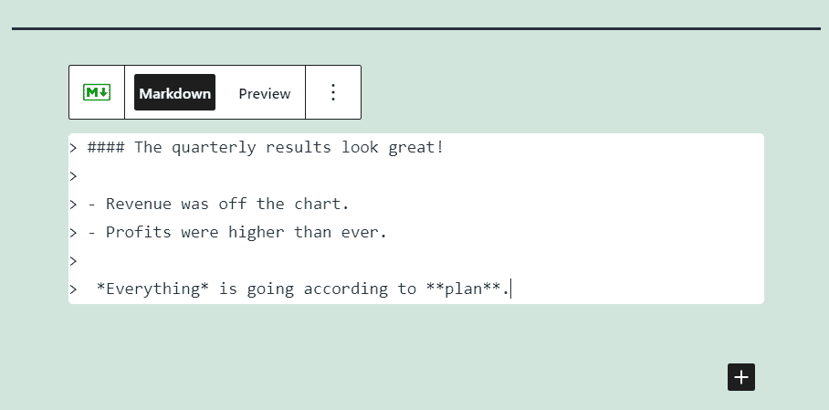

# WordPress 超级用户的 5 个最佳降价编辑器

> 原文：<https://kinsta.com/blog/markdown-editor/>

在将文本导入网站时，使用第三方编辑器编写 WordPress 内容可能会有问题。此外，传统的文本文件格式不能很好地转换成 HTML。这就是 markdown 编辑器的用武之地！

使用正确的 markdown 编辑器，您可以编写无缝转换为 HTML 的内容，而无需处理任何复杂的代码。你有很多很棒的在线减价编辑器可供选择，包括免费选项。如果你不想使用其他软件，你甚至可以使用 WordPress markdown 编辑器。

在本文中，我们将探讨什么是 markdown 编辑器及其优势。我们还将向您介绍适用于多种操作系统的最佳降价编辑器。这些包括在线和离线选项，以及一个 WordPress 选项。

我们走吧！

### 查看我们的[视频指南](https://www.youtube.com/watch?v=w5qoL4EkqyY)给最好的降价编辑


## 什么是降价编辑器？

Markdown 是一种文本格式语法，使您能够编写可以轻松转换为 HTML 的内容。你在网上看到的所有内容(包括这篇文章)都是 HTML 格式的。如果您使用浏览器的检查工具来检查任何页面的代码，您会看到它的文本出现在 HTML 中。


例如，假设您想要加粗一行文本。在 HTML 中要做到这一点，你需要使用`**<b>**`标签:

```
<b>This is an example of bold text in HTML</b>
```

markdown 语法中的确切文本如下所示:

```
**This is an example of bold text in HTML**
```

Markdown 语法包括翻译成你需要的每一个 HTML 组件的元素。段落、标题、列表、链接和任何你能想到的东西都有特定的语法元素。下面是一个降价文本文档的快速示例:




一个简单的降价例子。


现在，当您将该语法转换为 HTML 时会发生什么，任何 markdown 编辑器都应该能够做到这一点:




将 markdown 转换成 HTML。


用 markdown 编写比用 HTML 容易得多。markdown 编辑器是一个软件，它可以识别这种类型的语法，并将其转换为其他文件类型，包括(但不限于)HTML。

[The right markdown editor can help you write content that transforms seamlessly into HTML... without dealing with any complex code 😲 Learn more here 👇Click to Tweet](https://twitter.com/intent/tweet?url=https%3A%2F%2Fbit.ly%2F3wLFOVT&via=kinsta&text=The+right+markdown+editor+can+help+you+write+content+that+transforms+seamlessly+into+HTML...+without+dealing+with+any+complex+code+%F0%9F%98%B2+Learn+more+here+%F0%9F%91%87&hashtags=WordPress%2CHTML)

## 使用降价编辑器的好处

使用 markdown 的主要好处是可移植性。任何高质量的降价编辑者都能够获得降价文档(**)。md** 或**。mkd** )并将其转换成其他格式，包括:

*   超文本标记语言
*   便携文档格式
*   纯文本
*   Epub
*   Docx

Markdown 会转换成任何一种文件类型，你最终会得到一个格式完美的文档。如果你试图将一个[谷歌文档](https://kinsta.com/blog/google-docs-to-wordpress/) [文件转换成 HTML](https://kinsta.com/blog/google-docs-to-wordpress/) 或 PDF，你通常会以一个格式混乱而告终，这将需要时间和精力来修复(取决于文档的复杂性)。

使用 markdown 的另一个好处是语法很简单。你已经看到了一些 markdown 语法的例子，你可以在 [Markdown Guide](https://www.markdownguide.org/basic-syntax/) 上查看对它的完整介绍。

这种简单程度是至关重要的，因为这意味着使用 markdown 语法的学习曲线是最小的。此外，markdown 在开发人员中很受欢迎，它是许多平台的标准语言，[包括 GitHub](https://kinsta.com/knowledgebase/what-is-github/) 。

如果你能轻松地编写 markdown，你就能创建无缝转换成你可能需要的任何文件格式的内容。对于 WordPress，你可以把 markdown 文件转换成 HTML，然后在几分钟内把 HTML 导入你的网站。你所需要的只是一个 markdown 编辑器。

## 2022 年 5 个最佳降价编辑

在这篇综述中，我们将为每个操作系统(OS)和几个在线选项提供降价编辑器。我们将讨论哪种编辑器最适合您的特定需求，并且我们将概述您需要知道的任何定价信息。

请记住，如果你习惯使用 markdown，你可以使用几乎任何文本或代码编辑器作为你的主要工具。然而，专用的 markdown 编辑器通常包括许多功能，可以使您的工作更容易。我们将在这一部分讨论其中的一些特性。

### 1.标记




马克降价编辑。


Markdown 编辑器不需要打包大量的功能来提供帮助。如果你是极简主义者[文本编辑器](https://kinsta.com/blog/best-text-editors/)的粉丝，你会喜欢[马克](https://mark.reaper.im/)。

Mark 是一个在线降价编辑器，不提供任何复杂的功能。在左边，你有你的 markdown 编辑器，在屏幕的右边，你可以预览文本在[浏览器](https://kinsta.com/browser-market-share/)中的样子。编辑器也有一个黑暗模式选项。

您可以将文件保存为 HTML 格式，或者手动复制降价代码并将其粘贴到您的网站上。WordPress 不能识别现成的 markdown 语法，但是在我们检查了更多的编辑器后，我们将向您展示如何解决这个问题。

**价格:**免费

### 2.你这个白痴




The Typora markdown editor。


Typora 是一个用户友好的 markdown 编辑器，它可以自动获取你的语法，并显示你的内容在导出时的样子。您可以在“代码编辑器”和“可视化预览”模式之间来回切换，从而轻松发现和修复语法中的错误。

## 注册订阅时事通讯


### 想知道我们是怎么让流量增长超过 1000%的吗？

加入 20，000 多名获得我们每周时事通讯和内部消息的人的行列吧！

[Subscribe Now](#newsletter)

使用 Typora，您可以将 markdown 文档导出为多种文件格式，包括 Word 文档、HTML、pdf 和纯文本文件。该软件还允许你使用[键盘快捷键](https://kinsta.com/blog/wordpress-keyboard-shortcuts/)添加降价元素，使这个过程更快。

最后，Typora 包括一个主题系统，如果你经常使用该软件，这是很有帮助的。有了主题，你就可以调整 Typora 的风格，这样在写内容的时候感觉更舒服。

**价格:** Typora 仍处于测试阶段，在正式推出之前将保持免费。

### 3.起草




草稿减价编辑。


[Draft](https://draftin.com/) 是一款在线 markdown 编辑器，因其协作工具而脱颖而出。使用草稿，您可以用 markdown 语法或 HTML 编写文档并共享它们，以便其他用户可以编辑这些文件。

当您使用草稿进行协作时，该平台会保存您的所有文档版本，并使您能够发现不同草稿之间的更改。您还可以从多个[云存储平台](https://kinsta.com/knowledgebase/wordpress-google-cloud-storage/)将图像导入您的文档，或者从您的计算机上传图像。

草稿还允许您向文档添加注释和脚注，并创建特定于文件的待办事项列表。有了待办事项列表，您可以在完成任务时进行核对，您的其他合作者也可以这样做。

一旦您准备好导出文稿，草稿会提供多个选项。您可以将 markdown 文件导出为 Word 或 Google 文档、pdf、HTML 文件，或者保持 markdown 格式。

**价格:**免费，但需要[注册账户](https://draftin.com/draft/users/sign_up)才能使用汇票。

### 4.迪林杰




The Dillinger markdown 编辑。


如果你喜欢使用 Mark 的简单性，但你希望它有更多的功能，你会喜欢上 [Dillinger](https://dillinger.io/) 。这个 live markdown 编辑器向您显示文本的预览，它会随着您的书写而更新。此外，您可以将预览切换到 HTML 模式，这样您就可以看到您的降价文本是如何转换成 HTML 代码的。

Dillinger 使你能够将你的减价文件导出为多种格式，包括 HTML 和 PDF。您还可以在导出之前预览那些格式为*的降价文档，这可以节省您很多时间。*

需要一个给你带来竞争优势的托管解决方案吗？Kinsta 为您提供了令人难以置信的速度、一流的安全性和自动伸缩功能。[查看我们的计划](https://kinsta.com/plans/?in-article-cta)

有了 Dillinger，你可以将你的 markdown 文件直接保存到多个云存储平台和 GitHub(这使得这个工具非常适合编写文档)。您还可以将这些平台上的文件导入到 Dillinger，或者从您的计算机上传标记文档。

**价格:**免费

### 5.iA 作家




iA 作家 markdown 编辑。


如果你正在寻找一个可以在 Android 和 iOS 上工作的 markdown 编辑器，这样你就可以从你的移动设备上创建内容，你会爱上 iA Writer。该软件还提供 Windows 和 macOS 版本，在所有平台上都具有相同的整洁界面。

iA Writer 使用颜色突出显示您的 markdown 语法，从而更容易跟踪每个元素。该软件还包括一个内置的风格检查器，可以帮助你消除写作中的冗余，你可以将它与专注模式配对，以避免分心。

该软件可以让你预览 HTML 或 PDF 格式的降价文件，并将其导出。您还可以将[元数据](https://kinsta.com/blog/meta-description-wordpress/)添加到您的文档中，这在您处理 web 内容时尤其有用。

**价格:** [许可价格](https://ia.net/downloads)因您使用的操作系统而异。

## 你的 WordPress Markdown 编辑器有哪些选项？

WordPress 使你能够使用简单的可视化编辑器或 HTML 来编写内容。然而，你不能把 markdown 语法导入 WordPress，因为 CMS 不能解析它。

下面是一个简单的例子，说明如果我们将 markdown 文本添加到代码编辑器中会发生什么:




在 WordPress 中使用 markdown。


WordPress 将获取你的 markdown 代码，并按原样呈现。这意味着如果你使用 markdown，你需要将你的文件导出到 HTML，复制代码，并粘贴到 WordPress 页面或文章的代码编辑器中。

或者，有一个插件我们可以推荐给 WordPress 增加 markdown 支持，那就是 [Jetpack](https://kinsta.com/knowledgebase/wordpress-jetpack/#how-to-install-jetpack) 。Jetpack 为 WordPress 增加了数量惊人的功能，从增加安全性到自动备份和媒体优化。

如果你想了解如何设置和配置 Jetpack，[我们有详细的指南](https://kinsta.com/knowledgebase/wordpress-jetpack/)来指导你。要启用 Jetpack 的 WordPress markdown 编辑器，你需要激活插件并导航到 **Jetpack** > **设置** > **编写**。

查找名为**的组成**的部分，并启用设置说**以纯文本减价语法写文章或页面**:




在 WordPress 中启用 markdown 语法。


启用 markdown 语法设置后，打开块编辑器，您将看到您可以访问一个新的 **Markdown** 块:




使用 Jetpack Markdown block。


使用这个代码块，您将能够用 markdown 语法编写代码。如果你点击**预览**标签，你可以看到你的语法在前端是什么样子。

如果你想访问一个内置的 WordPress markdown 编辑器，Jetpack 是你最好的选择。唯一的缺点是你需要用一个[WordPress.com](https://kinsta.com/blog/wordpress-com-vs-wordpress-org/)账户来连接这个插件。然而，在 Jetpack 的免费版本中可以使用 markdown 功能，所以你不需要支付任何费用就可以开始使用 WordPress 中的语法。

[Ready to explore what markdown editors are, the best ones for multiple operating systems, and more? ✅ This post has you covered ⬇️Click to Tweet](https://twitter.com/intent/tweet?url=https%3A%2F%2Fbit.ly%2F3wLFOVT&via=kinsta&text=Ready+to+explore+what+markdown+editors+are%2C+the+best+ones+for+multiple+operating+systems%2C+and+more%3F+%E2%9C%85+This+post+has+you+covered+%E2%AC%87%EF%B8%8F&hashtags=WordPress%2CWPTips)

## 摘要

使用 markdown 语法可以使您将文件导出为 HTML 或其他标准格式(如 Word 文档和 pdf)的工作变得更加容易。如果你使用 [Jetpack 插件](https://wordpress.org/plugins/jetpack/)，你将可以访问 WordPress markdown 编辑器，不用离开你的网站就可以使用。

或者，你可以使用一个成熟的 markdown 编辑器，将你的文件导出为 HTML，然后将代码上传到 WordPress。我们在这里分享了我们的五个最佳选择。

开始写作！

你有使用其他 markdown 编辑器的经验吗？请在下面的评论中告诉我们！

* * *

让你所有的[应用程序](https://kinsta.com/application-hosting/)、[数据库](https://kinsta.com/database-hosting/)和 [WordPress 网站](https://kinsta.com/wordpress-hosting/)在线并在一个屋檐下。我们功能丰富的高性能云平台包括:

*   在 MyKinsta 仪表盘中轻松设置和管理
*   24/7 专家支持
*   最好的谷歌云平台硬件和网络，由 Kubernetes 提供最大的可扩展性
*   面向速度和安全性的企业级 Cloudflare 集成
*   全球受众覆盖全球多达 35 个数据中心和 275 多个 pop

在第一个月使用托管的[应用程序或托管](https://kinsta.com/application-hosting/)的[数据库，您可以享受 20 美元的优惠，亲自测试一下。探索我们的](https://kinsta.com/database-hosting/)[计划](https://kinsta.com/plans/)或[与销售人员交谈](https://kinsta.com/contact-us/)以找到最适合您的方式。