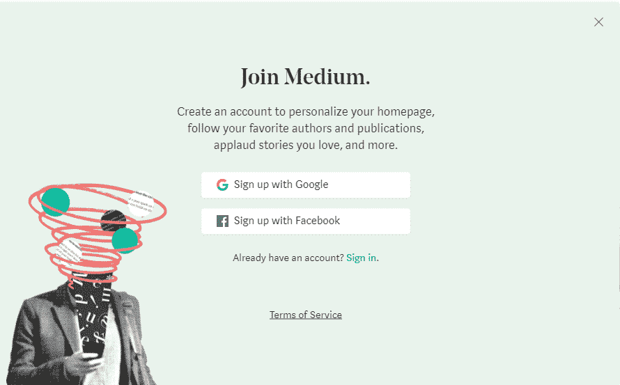
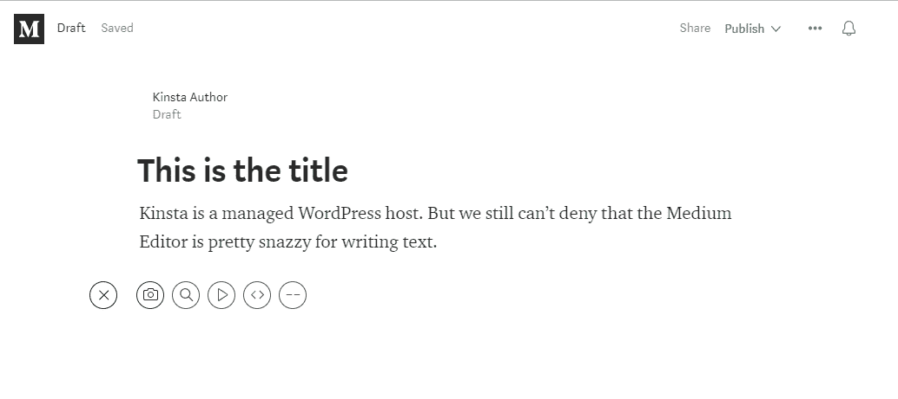
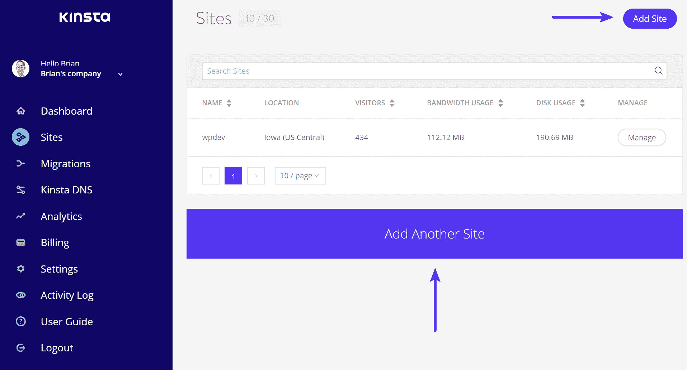
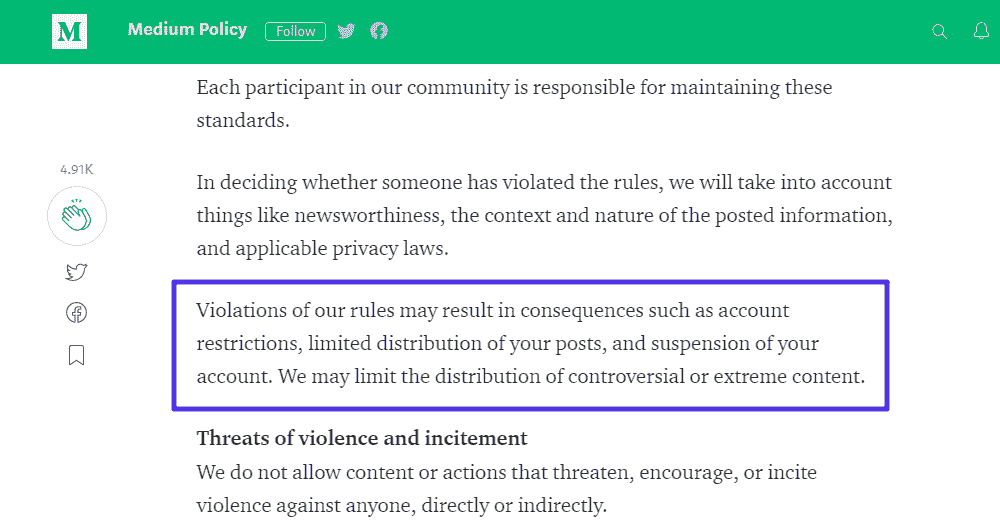

# Medium vs WordPress:你应该从哪里开始写博客？

> 原文：<https://kinsta.com/blog/medium-vs-wordpress/>

试图在 Medium 和 WordPress 之间选择你的博客或网站？在某种程度上，这是一个有缺陷的论点，因为这两者是完全不同的工具。一个并没有天生比另一个更好，它们只是…不同而已。您甚至可以同时成功地使用这两者！

在接下来的 1000 字左右的时间里，我们希望让您更深入地了解这些基本差异，以便您可以选择适合您的平台。

*   [Medium vs WordPress 简介](#intro)
*   [选择 WordPress 的优势](#wordpress)
*   [选择介质的优势](#medium)
*   你应该选择哪一个？

## 中型 vs WordPress:介绍球员

**媒介**是一个“故事”的平台。这是一种称之为博客平台的奇特方式。但是“故事”品牌确实对[媒体](https://medium.com/)构建网站和吸引观众的方式产生了一些实际影响。

[T2】](https://medium.com/)

你有更多的人寻找实际的内容和想法，而不是像 Tumblr 这样的 GIF-fest。

要创建自己的内容，您可以注册一个 Medium 帐户，并使用 Medium 的用户友好的编辑器开始发布。不需要自己创建网站，方便。但这也意味着你不拥有任何东西。你都是在 Medium 的平台上做的。

**WordPress*** 则是全方位的内容管理系统。在一个非常基本的层面上，[内容管理系统](https://kinsta.com/knowledgebase/content-management-system/)是一个工具，它使管理一个实际的网站变得容易，而不需要知道如何编码。

[T2】](https://wordpress.org/)

> 需要在这里大声喊出来。Kinsta 太神奇了，我用它做我的个人网站。支持是迅速和杰出的，他们的服务器是 WordPress 最快的。
> 
> <footer class="wp-block-kinsta-client-quote__footer">
> 
> 
> 
> <cite class="wp-block-kinsta-client-quote__cite">Phillip Stemann</cite></footer>

[View plans](https://kinsta.com/plans/)

你可以用它来创建一个博客(这是 WordPress 的根所在)，但是你也可以很容易地添加一个电子商务商店、论坛或者只是一个普通的静态网站。

***[*WordPress.org 和 WordPress.com 是两码事*](https://kinsta.com/blog/wordpress-com-vs-wordpress-org/) *。我们在谈论 WordPress，因为那是真正的 WordPress 软件。*

### 如何在媒体上开博客

有了 Medium，只需几秒钟就能上手。你需要做的就是创建一个帐户，然后开始写:

The Medium signup page

媒体编辑器是很多人喜欢的东西，因为它提供了一个很好的写文章的不受干扰的体验:

The Medium Editor interface

现在，大多数人可能会认为 Medium 编辑器是比 WordPress 编辑器**更好的工具，特别是对于写博客文章**(不过 WordPress 编辑器在管理网站的其他方面更加灵活)。

WordPress 的新编辑器将于 2018 年某个时候发布，它与媒体编辑器有很多相似之处，所以我们应该会看到这种写作体验的差距很快就会缩小。

一旦你写完了，你就发表你的文章，它就在世界上了。就是这样！

### 如何用自托管 WordPress 创建博客

当你使用自托管的 WordPress 时，开始写博客的过程肯定有点长。您需要:

*   注册托管(如 Kinsta)
*   [找到并购买自己的域名](https://kinsta.com/blog/how-much-does-a-domain-name-cost/)
*   安装和配置 WordPress
*   用主题和插件定制你的站点

An example of how you add WordPress themes to control how your site looks

现在，因为 [WordPress 如此受欢迎](https://kinsta.com/wordpress-market-share/)，这个过程变得简单多了。有些主机，像 [Kinsta](https://kinsta.com/) ，甚至会让你点击一个按钮就可以安装 WordPress，这样事情几乎就像 Medium 一样简单。

Add WordPress site

尽管 WordPress 需要更多的前期投资，但是这种方式有一些主要的优势，我们将在下面的章节中介绍。

## 选择 WordPress 而不是 Medium 的 4 个理由

我们将从 WordPress 相对于 Medium 的优势开始，因为在下一节指出 Medium 的优势会更简单。

### 1.WordPress 让你拥有自己的网站

还记得一秒钟前关于主机和域名的技术术语吗？

**这就是为什么它很重要:**

当你在自己的主机上设置 WordPress 时，你 100%拥有你的网站和你发布的所有内容。

这意味着:

*   没有人可以“关闭”你的账户，把你踢出平台(当然，除非你违反了实际法律！)
*   你可以对你的网站做任何你想做的改变
*   您的数据和内容始终 100%属于您自己。虽然 Medium 使导出文章变得容易，但是当你在 Medium 上写作时，你的内容仍然“活”在 Medium 的服务器上。

### 2.WordPress 使得添加新功能和改变网站外观变得容易

因为你拥有自己的网站，你可以利用 WordPress 庞大的插件和主题生态系统:

*   插件(Plugins)——这些插件让你无需了解任何代码就能轻松地为你的博客添加额外的功能。[联系方式](https://kinsta.com/blog/wordpress-contact-form-plugins/)、[论坛](https://kinsta.com/blog/wordpress-forum-plugins/)、[社交媒体分享按钮](https://kinsta.com/blog/wordpress-social-media-plugins/) …应有尽有。
*   主题(Themes)——这些可以让你轻松改变博客的外观，而不需要知道任何代码。建议阅读:[如何安装一个 WordPress 主题](https://kinsta.com/blog/how-to-install-a-wordpress-theme/)。

结合起来，这两种类型的扩展可以让你完全控制你的网站的外观和功能，而不需要知道如何编码，这给了你一个 Medium 无法比拟的定制级别。

## 注册订阅时事通讯

### 想知道我们是怎么让流量增长超过 1000%的吗？

加入 20，000 多名获得我们每周时事通讯和内部消息的人的行列吧！

[Subscribe Now](#newsletter)

这也是 Slack 在 2018 年将他们的博客从 Medium 搬到 WordPress 的一个原因。

Slack blog on WordPress

### 3.WordPress 不会限制你的内容

这可能是一个较小的考虑，因为媒体的内容限制不是过于繁重。但事实是，你可以在媒体上创作的内容类型有一些限制:

An example of Medium’s content rules

大多数用户会遇到这些限制吗？大概不会。但事实是它们存在于媒体上，而不在 WordPress 上。如果你和他们发生冲突，你可能会以你的中介账户被关闭而告终。

### 4.WordPress 让你随心所欲地赚钱

最后，如果你渴望从你的内容中赚钱，你绝对应该选择 WordPress 而不是 Medium。

虽然 Medium 确实有一个合作项目，允许人们从他们的内容中赚取一些钱，但它并没有支付太多，这就是为什么许多大出版商离开 Medium 的原因。

此外，它只是一个单一的 set 方法，而 WordPress 允许你:

*   [投放广告](https://kinsta.com/blog/wordpress-advertising-plugin/)
*   接受赞助
*   使用[加盟计划](https://kinsta.com/affiliates/)
*   …任何你想赚钱的事情

> 事实证明，掌管你自己的开源平台是有道理的:这永远不会发生在你身上。https://t.co/Cf3eFoqXly
> 
> 因此，虽然媒体“转向别处”，我们将继续修复互联网，真的。
> 
> -@ jdyk 的约略[2018 年 5 月 10 日](https://twitter.com/jdevalk/status/994664408365371392?ref_src=twsrc%5Etfw)