# 如何在 WordPress 中添加元描述(将点击率提高到 5.8%)

> 原文：<https://kinsta.com/blog/meta-description-wordpress/>

如果你没有给你的网站添加元描述，你就错过了一个吸引和转化新访客的好机会。这看起来没什么大不了的，但是出现在搜索引擎结果中的[目标片段可以产生巨大的差异。没有一个，你可能会失去点击量。](https://kinsta.com/blog/featured-snippets/)

元描述是出现在谷歌和必应等搜索结果页面上的简短片段。你可以自定义它们来更好地描述每个页面，吸引新用户，使你的搜索结果从竞争网站中脱颖而出。

添加元描述可以像填写一个框或插入一行代码一样简单。

准备好获得更多点击了吗？我们将向你展示如何使用和不使用插件在 WordPress 中添加元描述。

### 更喜欢看[视频版](https://www.youtube.com/watch?v=mjmO65ssdFM)？


## 什么是元描述？

像谷歌这样的搜索引擎使用一种叫做网络爬虫的机器人来索引你的网站。这给他们的信息允许他们在搜索结果中正确显示，这样当人们搜索与[相关的关键词](https://kinsta.com/blog/keyword-research/)时，就能找到你。


但是因为这个程序只是一个程序，它不会自动知道你的站点是关于什么的。你必须使用不同的元素来告诉它，比如[站点地图](https://kinsta.com/blog/wordpress-sitemap/)、[模式标记](https://kinsta.com/blog/best-wordpress-review-plugins/)和[元标签、](https://support.google.com/webmasters/answer/79812)等等。这就是元描述如此重要的原因。

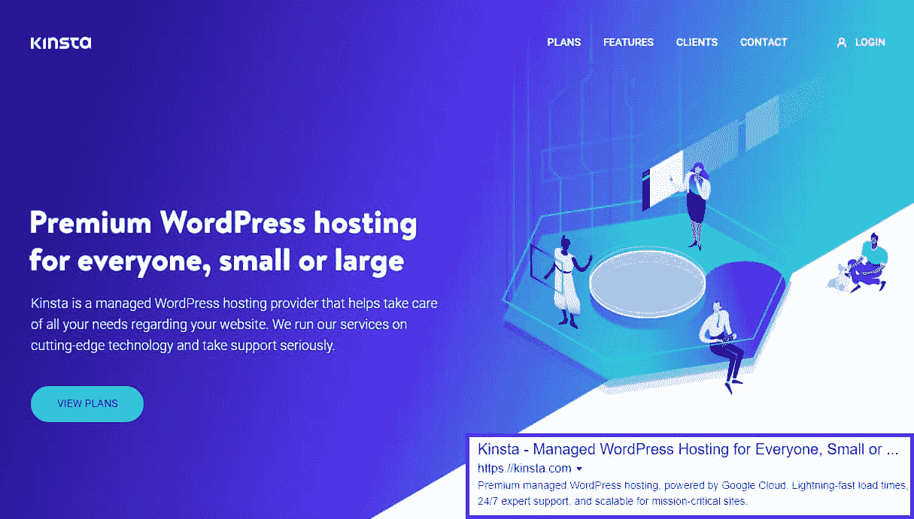

Example of a meta description


用户可以在搜索结果的标题下看到页面的元描述。元描述是为了告诉他们网页的内容和目的，这样他们就可以决定是否点击它。在本例中，您还可以看到[站点链接](https://kinsta.com/blog/google-sitelinks/):

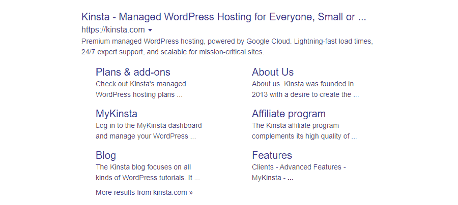

Example of sitelinks


谷歌的爬虫比以前更好了。事实上，他们现在可以自动提取标题和元描述，并计算出页面的主题，而无需您手动定义关键字。

如果你没有写你自己的元描述，Google 会从页面中提取内容为你生成一个。但你可能会错过一个机会，说服人们点击带有定制的目标片段的链接，以赚取转换。


## 元描述如何影响你的搜索引擎优化

元描述实际上对你在 T2 的搜索引擎优化排名没有直接影响，然而谷歌仍然建议为你网站的每个页面创建独特的元描述。对于 SEO 来说，在你的内容中自然出现的关键词才是重要的。

元描述影响的是点击率，或者有多少人决定点击你的网站。

想想你最后一次用谷歌搜索东西的时候。是什么让你选择了某个环节？可能是标题，描述，或者两者都说服了你。

[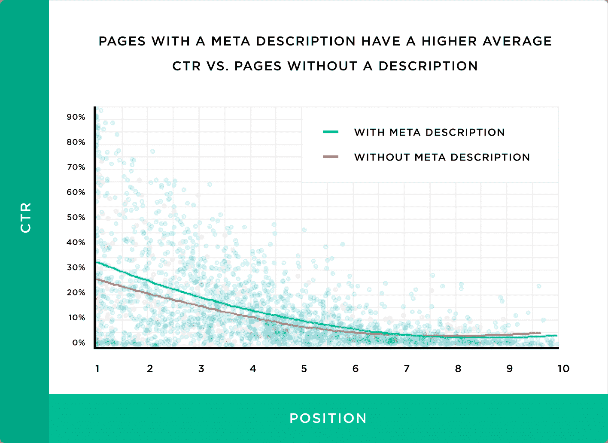](https://backlinko.com/google-ctr-stats)

Meta descriptions positively impact CTR (Image source: Backlinko.com)


根据[反向链接](https://backlinko.com/google-ctr-stats)的说法，独特的元描述对 CTR 有重大影响:

> 为每个页面写独特的元描述可以增加你网站的有机点击率。我们发现，与没有描述的页面相比，带有元描述的**页面的点击率**要高 5.8%。”

搜索引擎可能会自动生成一个摘录，但如果这个描述不能很好地传达你的内容，人们会忽略它，选择另一个网站。

编写自己的元描述可以确保你对人们看到的东西有更多的控制。

我说的是“更多控制”，不是“完全控制”然而，谷歌不会总是使用你的元描述。

有时它会显示与用户搜索更相关的部分页面内容。但是在大多数情况下，它更喜欢使用您提供的代码片段，而不是使用自动生成的代码片段。

一个写得好的元描述在吸引和转化访问者方面起着很大的作用。它可能不会直接影响搜索引擎优化，但它会让你获得更多感兴趣的访问者，更高的点击率确实会提高你的排名。

## 元描述与元关键字

元数据作为一个整体是一组 HTML 标签，告诉搜索引擎和网络爬虫你的站点是关于什么的。这些包括标题、描述和关键字。

你已经知道元描述是描述网页内容和目的的 HTML 元素。

元关键词是旧互联网的遗迹。换句话说，**它们已经被废弃，不再使用**。在过去，它们被用来告诉搜索引擎一个页面覆盖了什么主题，类似于你如何标记一个社交媒体或博客帖子。

然而，一旦人们意识到你可以放入任何不相关的关键词，并从与你的网站无关的主题中获得免费流量(你好“免费色情”和“免费 mp3”)，搜索引擎就会取消对该功能的支持。你仍然可以添加元关键词，但是对于[最流行的搜索引擎](https://kinsta.com/blog/alternative-search-engines/)，它不会做任何事情。

现在，谷歌使用更复杂的网络爬虫来检查网站的内容，这些爬虫可以自动找出哪些主题与你在页面上写的内容相关。它完全忽略了 meta keywords 属性。

现在，改进 SEO 不再使用元关键词，而是优化内容中自然关键词的使用，并解决其他技术问题，如网站的 T2 速度。


## 在 WordPress 中编写和优化元描述的 5 个技巧

当涉及到元描述时，没有硬性的规则可以遵循。但是仍然有一些你应该记住的最佳实践。这些可以帮助你在竞争中脱颖而出，增加你的点击率。

让我们回顾一下这些最佳实践，这样您就可以编写更好的元描述。

### 更喜欢看[视频版](https://www.youtube.com/watch?v=eJK9WldqVo4)？


### 1.理想片段长度

您不能让您的代码片段长度无限制。如果超过一定的字符数，它将被截断。你的元描述可以想多短就多短，但是不要超过 155-160 个字符，否则很可能会被突然截断。这看起来不太好。

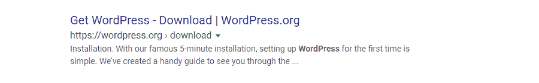

Another example of a meta description


### 2.聚焦于一个关键词

在你写的每个片段中包含一个关键词是个好主意。如果你正在为一篇博客文章创建一个片段，你可以使用你写文章时使用的关键词。否则，做一些[关键词研究](https://kinsta.com/blog/keyword-research/)，选择一个与你的目标一致的。

包含一个关键词将有助于你以一种引人注目的方式组织你的描述。此外，谷歌有时会突出显示与用户搜索词匹配的关键词。瞄准一个流行的关键词，并把它包含在你的描述中，可能会产生醒目的粗体字。

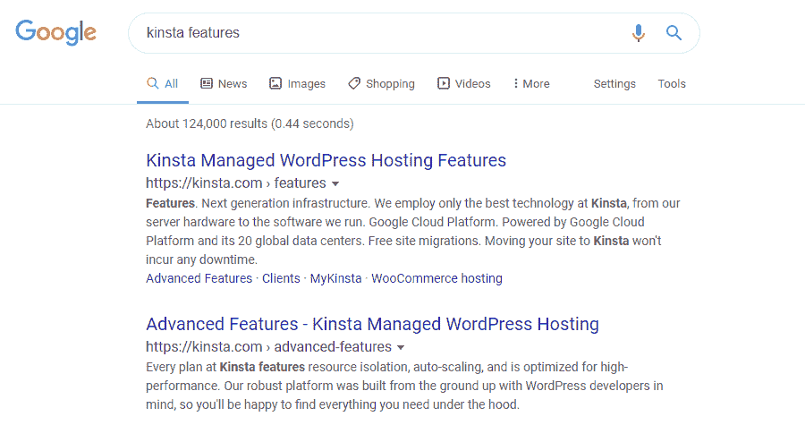

Bolded text when related to the query


### 3.写清楚、连贯、吸引人的描述

你的元描述就像一个免费的广告，所以把它作为一个转换潜在访客的机会。直接面对读者，通过提出问题来吸引他们，然后概述点击你的链接的好处。使用生动的图像，吸引眼球的陈述，或信息丰富的句子。

最重要的是，通过证明你的网站有人们正在寻找的东西来赢得你的点击。你有最好的服务或产品，或者他们一直在寻找的信息吗？你有什么是你的竞争对手没有的？

确保你的片段是高质量的，没有令人尴尬的措辞，重复，或者可能会让人拒绝的语法错误。

考虑加入行动号召，如“省钱”、“阅读我们的评论”或“了解更多关于元标签的信息”。然而，避免像“点击这里”这样听起来别扭的 CTA。许多网站选择跳过行动号召，专注于提供有价值的信息；看看什么听起来对你合适。

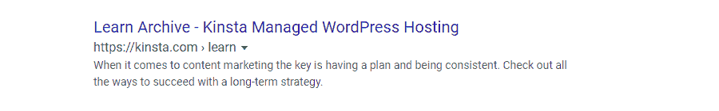

Make your meta description appealing


最后，弄清楚当你的链接被点击时会发生什么。他们会阅读博客文章、浏览商店或登陆专题页面吗？他们要去哪里，到了那里会发现什么，应该很明显。

### 4.避免重复的片段

元描述提供了一个接触潜在客户并转化他们的免费机会，所以不要浪费它来创建重复或副本片段，即多个网页上相同或几乎相同的元描述。

当你的网站上有成百上千的页面时，使用一个模板并去掉一些细节似乎是个好主意。但是重复的描述看起来不太好，尤其是当它们覆盖了很多页的时候。人们会很快忽略你网站的结果。

一个默认的元描述比一个坏的要好。如果你没有时间为每一页添加一个精心编写的、引人注目的片段，最好让谷歌来做这项工作，专注于几个关键页面。

### 5.别骗人了

元描述可能不会[提高你的搜索引擎优化](https://kinsta.com/blog/what-does-seo-stand-for/)，但如果你从事故意欺骗行为，它们肯定会损害你的点击率。

确保你的描述是准确的。首先要诚实地面对人们点击的内容。不要谎报页面内容。

避免关键词填充。它读起来很别扭，会降低点击率，而且可能会让你受到惩罚，或者导致谷歌完全忽略你的自定义描述。

记住这些提示，你会创造出更好的元描述。

## 为特定页面编写元描述

制作元描述的技术在本质上是相似的，但是每种类型的页面都需要有自己特殊的风格。为博客帖子、主页和产品页面编写片段的方式有很大不同。

这里有一些为一些关键类型的页面编写元描述的技巧。

### 主页元描述

主页描述得到特殊对待。这是你网站的脸面，所以你必须让它有价值。许多网站写一个简短的一句话的推介，甚至从未达到 160 个字符的限制。

## 注册订阅时事通讯


### 想知道我们是怎么让流量增长超过 1000%的吗？

加入 20，000 多名获得我们每周时事通讯和内部消息的人的行列吧！

[Subscribe Now](#newsletter)

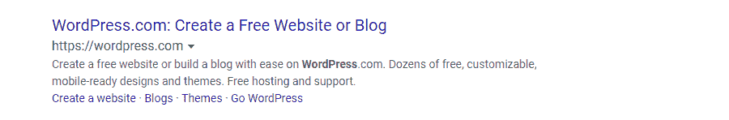

WordPress.com meta description


你在这里的工作是销售你的品牌。用一篇短小精悍、写得很好的文章，简明扼要地解释你做了什么以及为什么他们应该选择你。这适用于类似的页面，就像你的“关于”和“使命陈述”一样。

### 博客帖子元描述

对于主要是信息性的页面，比如博客帖子，你可能不希望你的描述读起来像一个明显的广告。当然，你是在做推销，可以包括行动号召，但要把重点放在信息上。

当人们去寻找一个问题的解决方案时，他们不想被宣传。他们想要答案。告诉人们当他们点击这个链接时他们会学到什么，并证明你知道你在说什么。


Meta description for a blog post


### 类别页面元描述

还有分类页面要考虑。这是一个很难写的。大多数搜索不会出现一个[类别档案](https://kinsta.com/knowledgebase/what-is-taxonomy/)，但是你不应该错过一个创造一个引人注目的转换片段的机会。

你最好的办法是通过暗示人们在这个类别中会找到什么类型的文章来吸引他们，让他们有阅读的心情。

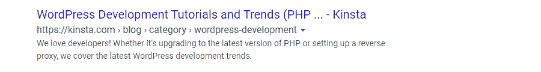

Meta description for a category page


对于基于新闻的网站和电子商务商店，分类页面起着关键作用，因为如果优化得当，它们可能是能够获得更高排名和更多流量的关键页面。

### 产品页面元描述

说到网上商店……当人们想快速买东西时，产品页面会在搜索结果中弹出。

不要推广你的网站，而是把重点放在单个产品上。使用类似的策略:写一些东西，快速解释这是什么，为什么他们需要它。

你也可以包括诸如价格和其他产品信息的规格。


Meta description for a product page


理想情况下，你应该为每个产品写一个独特的元描述。仅仅使用一个模板并替换掉产品名称可能很有诱惑力，但是这种通用的方法没有手写的效果好。


## 如何用 Yoast SEO 添加元描述

如果你想给你的网站添加自定义的元描述，你最好的选择是安装一个 SEO 插件。任何流行的 SEO 插件都会让你很容易为你所有的页面和博客文章编写代码片段。

虽然可以手动添加它们，但这意味着编辑站点文件。在一些设置中，没有 [FTP 访问](https://kinsta.com/blog/best-ftp-clients/)这可能是不可能的，这使得事情更加复杂。另外，如果没有插件，很难给每个页面添加单独的描述。所有最简单的解决方案只是为整个网站设置了一个默认的代码片段。

对于大多数人来说，最好只是安装一个 WordPress 插件，而不是处理令人头痛的问题。

你可以使用一个简单直接的插件，比如 [WP Meta SEO](https://wordpress.org/plugins/wp-meta-seo/) 或者一个功能更全的 SEO 套件。一些流行的 SEO 插件包括 [Yoast SEO](https://kinsta.com/blog/yoast-seo/) 和[SEO 框架](https://kinsta.com/blog/best-seo-plugins-for-wordpress/#the-seo-framework)。由于 Yoast 是使用最广泛的，我们将向您展示如何用它来添加元描述。

厌倦了 WordPress 的问题和缓慢的主机？我们提供世界一流的支持，由 WordPress 专家提供 24/7 服务和超快的服务器。[查看我们的计划](https://kinsta.com/plans/?in-article-cta)

现在让我们安装 Yoast。你可以访问它的[插件库页面](https://wordpress.org/plugins/wordpress-seo/)或者登录你的 WordPress 后端，前往**插件>添加新的**。搜索 Yoast 并下载，或者上传之前安装的 zip 文件。

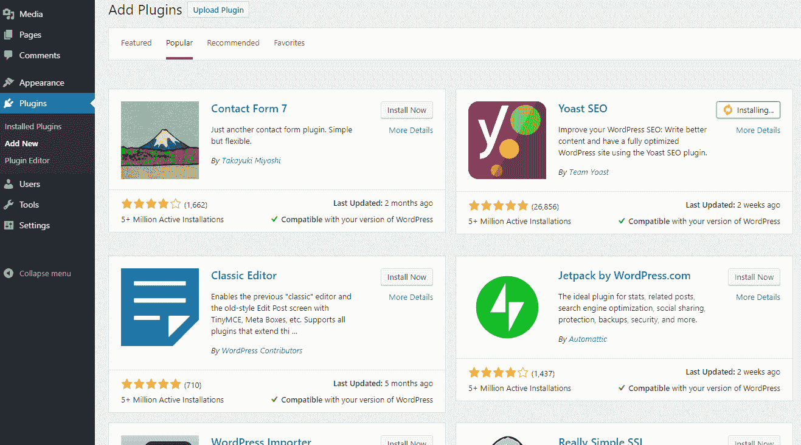

Install Yoast SEO plugin


然后只需激活**插件>已安装插件**中的插件就可以让它工作了。

### 使用 Yoast SEO 为帖子和页面添加元描述

Yoast 将在你的管理后台添加一个新的 **SEO** 标签。你可以转到此处配置设置，包括默认值和你的页面在社交媒体上的外观。但是要进入单独的元描述编辑器，你需要打开一个现有的帖子或页面，或者创建一个新的。

向下滚动到编辑区域下方，您会看到新的 **Yoast** 部分。点击**编辑片段**，开始在**元描述**部分输入。一旦达到最佳字符长度，底部的栏会变成绿色。您还可以添加动态变量来显示标题或类别等元素。

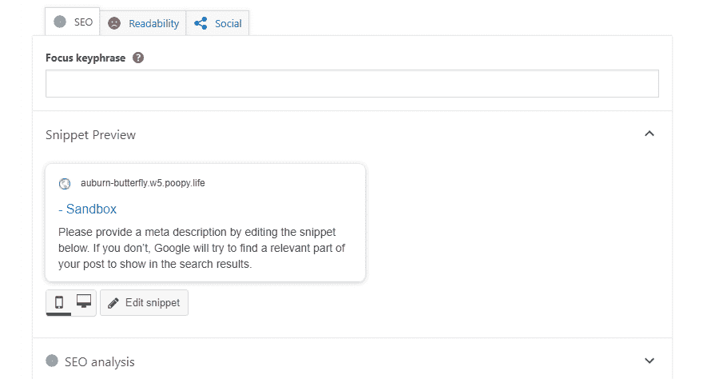

How to add a meta description in Yoast SEO


这就是为你网站上的任何帖子或页面创建自定义元描述所需要做的全部工作。

### 用 Yoast SEO 给你的主页添加一个元描述

在 Yoast 中，为您的主页添加一个代码片段的工作方式与普通方式略有不同。进入 **SEO >搜索外观**。

就在那里，你会看到**主页**部分，带有普通的编辑器 UI。像之前一样写个描述和标题就行了。

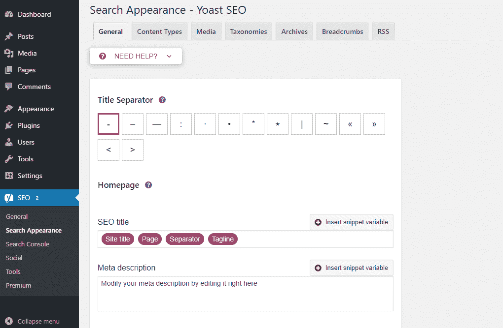

Yoast SEO’s settings


请记住，编写主页片段是对整个网站的推销。描述你的公司或博客，你做什么，你能提供什么。完成后，点击**保存更改**。

这样，你的主页搜索结果应该会很快更新，显示新的元描述。

### 用 Yoast SEO 添加默认元描述

如果您想添加一个默认的元描述，当您设置一个自定义描述失败时，该怎么办？那很简单。在 **SEO >搜索外观>内容类型**(查看搜索外观页面顶部的选项卡)下，您会看到两个下拉列表，一个是帖子，一个是页面。

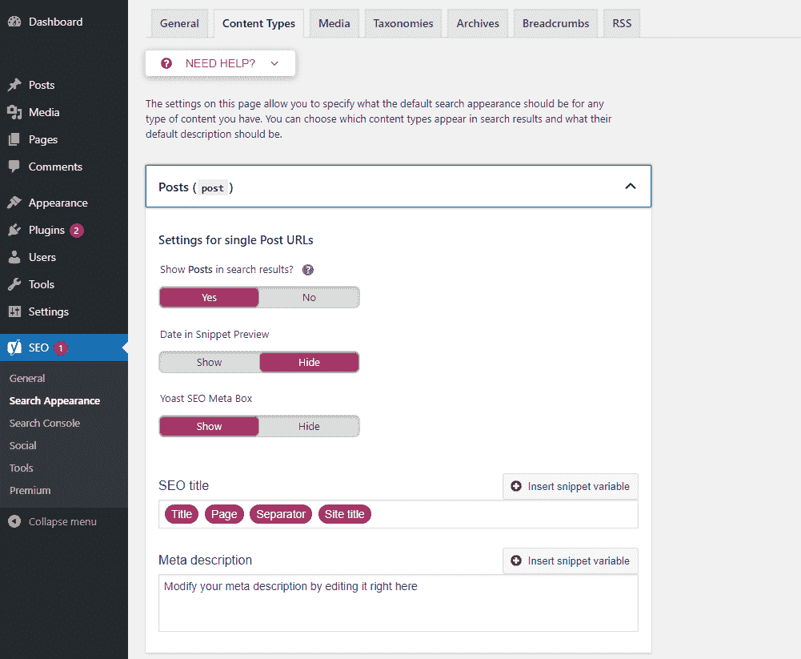

Adding a default meta description


这些也使用典型的元数据编辑器，所以继续为文章和页面添加默认片段。

现在，当你创建一个新的帖子或页面时，元描述将自动使用你放在这里的信息。这样，如果你发表了一篇博客文章，但忘记添加一个片段，它将会回到你在这里写的内容。

如果你喜欢基于一个模板，你也可以把它粘贴到这里，它会出现在编辑屏幕上，当你发表一个新的帖子时就可以填写了。

### 使用 Yoast SEO 为类别档案添加元描述

你的分类页面呢？这些小档案没有很多文本内容，这可能会使谷歌感到困惑，并导致它显示一个破碎的或看起来奇怪的片段。您可以自己添加一个简短的摘录来避免这种情况。

进入 **SEO >搜索外观>分类法**并在编辑器中创建你的描述。或者你可以去**发帖>分类**为每个单独的分类存档页面写一个新的。

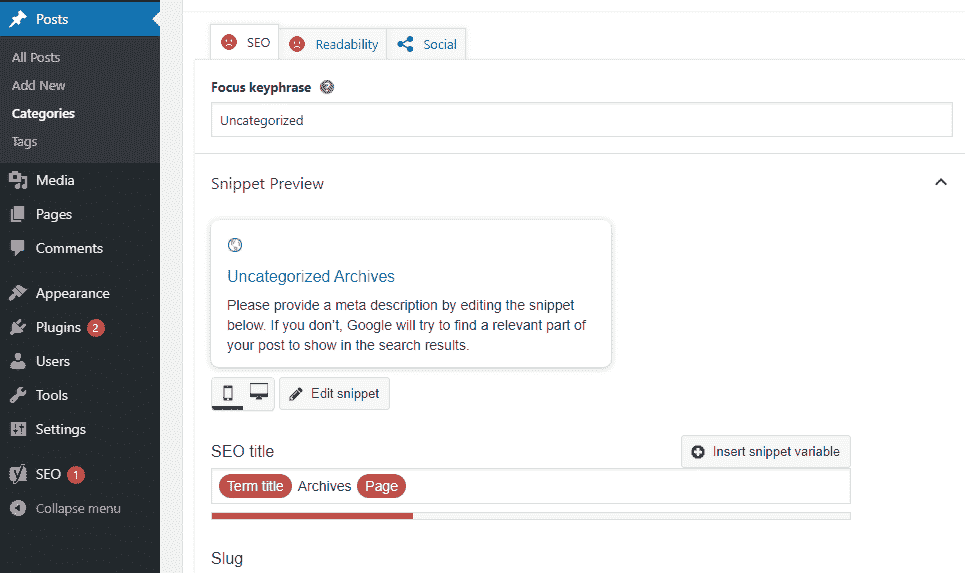

Example of a meta description for a category page


这个片段不需要太复杂。你仍然可以像“在这里发现几十个(类别)帖子”这样做，但是你不需要这么严格，因为这个页面不太可能在搜索结果中频繁出现。

这就包含了您需要知道的关于用 Yoast 添加元描述的所有内容。

## 如何在没有插件的情况下添加元描述

如果你不想安装 SEO 插件来创建自定义元描述，你可以编辑你的主题文件。然而，这可能有点麻烦，尤其是当您想要向单个页面添加描述时。

下载一个插件对你来说可能会更容易。但是如果你真的不愿意，下面是手动操作的方法。

在编辑你网站上的任何文件之前，[确保做好备份](https://kinsta.com/help/wordpress-backups/)。另外，[创建一个子主题](https://kinsta.com/blog/wordpress-child-theme/)也是一个好主意，因为如果你犯了一个错误，它会保护你的网站，并且当 [WordPress 更新](https://kinsta.com/blog/wordpress-automatic-updates/)时不会重置你的更改。

我们将创建一些通用元标签,应用于你网站的每一页。首先，你要去**设置>常规**。在**标语**下，写下你想要用来代表你的网站的元描述。

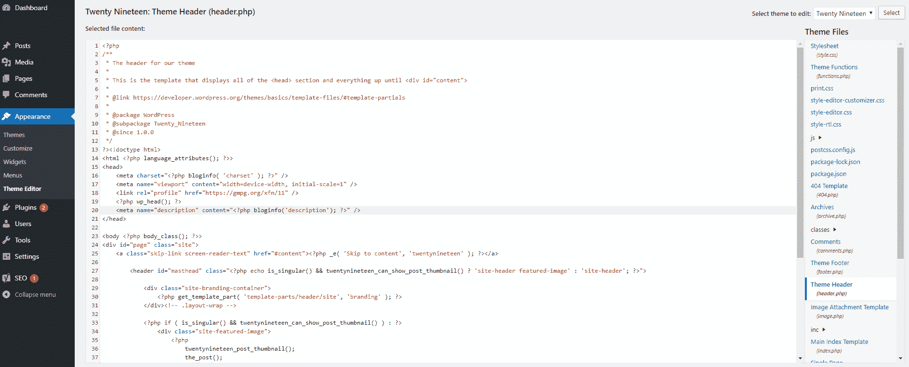

Editing your theme files to add a meta description


接下来进入**外观>主题编辑器**。如果您看不到它，您可能需要使用 FTP 访问您的 header.php。在工具条中找到**主题标题(header.php)**，点击编辑。将此代码粘贴到<头>和</头>之间的任何位置。

```
<meta name="description" content="" />
```

这将把标语添加到你网站的每个页面上。

显然，这对你的博客文章来说不是很理想。如果人们知道每个帖子是关于什么的，你更有可能得到点击，而不是得到一个通用的描述。

使用这些代码，搜索引擎将会像平常一样从文章中抓取内容用于元描述。

```
<meta name="description" content="<?php if ( is_single() ) {
        single_post_title('', true); 
    } else {
        bloginfo('name'); echo " - "; bloginfo('description');
    }
```

有了这两个程序，你将在主页和分类档案等普通页面上获得定制的描述，但你的帖子将有一个正常的片段。

如果您想为每个页面添加单独的描述，该怎么办？这往往会变得更加复杂，最好使用一个插件来解决这个问题。但是你可以用一个条件标签或者用[自定义字段](https://orbitingweb.com/blog/wordpress-meta-descriptions/)来实现。

[Meta descriptions are powerful tools in your hands to increase your click-through rate. Learn how to add them to your #WordPress site and improve your conversions! ✍️🎯Click to Tweet](https://twitter.com/intent/tweet?url=https%3A%2F%2Fkinsta.com%2Fblog%2Fmeta-description-wordpress%2F&via=kinsta&text=Meta+descriptions+are+powerful+tools+in+your+hands+to+increase+your+click-through+rate.+Learn+how+to+add+them+to+your+%23WordPress+site+and+improve+your+conversions%21+%E2%9C%8D%EF%B8%8F%F0%9F%8E%AF&hashtags=seo%2Ccopywriting)

## 摘要

如果没有有针对性的、精确的元描述，你可能会错过点击和转化。让谷歌生成代码片段是不可靠的。通过写你自己的，你得到了一个“推销”的机会，并确保用户可以做出完全知情的决定。

研究表明，自定义的元描述能够将你的点击率提高 5.8%，考虑到你可能需要的资源很少，这是一个不错的结果。事实上，要在 WordPress 中添加元描述，你既可以手动编辑你的 WordPress 文件，也可以使用 SEO 插件来控制你的代码片段。

我知道，自定义元描述可能比您预期的需要更多的时间，但从长期结果来看，这是一项值得做的活动。

* * *

让你所有的[应用程序](https://kinsta.com/application-hosting/)、[数据库](https://kinsta.com/database-hosting/)和 [WordPress 网站](https://kinsta.com/wordpress-hosting/)在线并在一个屋檐下。我们功能丰富的高性能云平台包括:

*   在 MyKinsta 仪表盘中轻松设置和管理
*   24/7 专家支持
*   最好的谷歌云平台硬件和网络，由 Kubernetes 提供最大的可扩展性
*   面向速度和安全性的企业级 Cloudflare 集成
*   全球受众覆盖全球多达 35 个数据中心和 275 多个 pop

在第一个月使用托管的[应用程序或托管](https://kinsta.com/application-hosting/)的[数据库，您可以享受 20 美元的优惠，亲自测试一下。探索我们的](https://kinsta.com/database-hosting/)[计划](https://kinsta.com/plans/)或[与销售人员交谈](https://kinsta.com/contact-us/)以找到最适合您的方式。