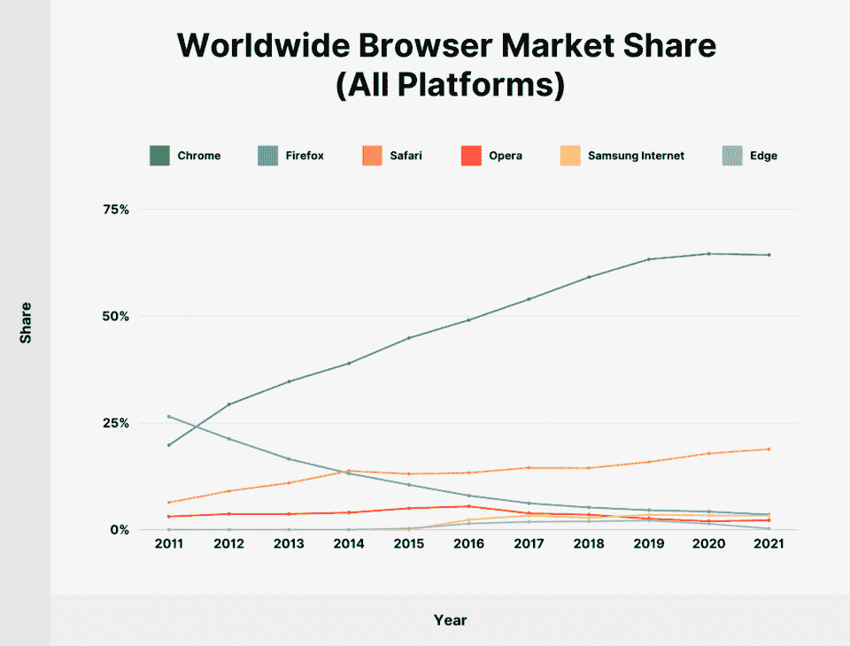
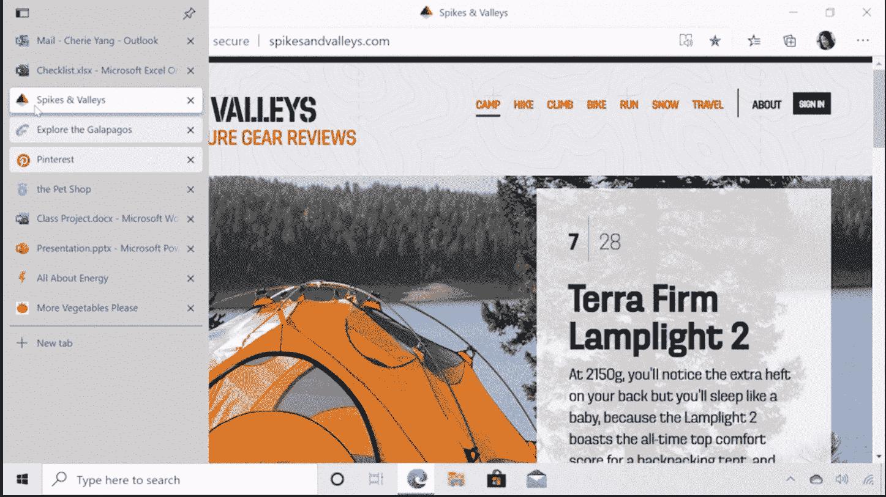
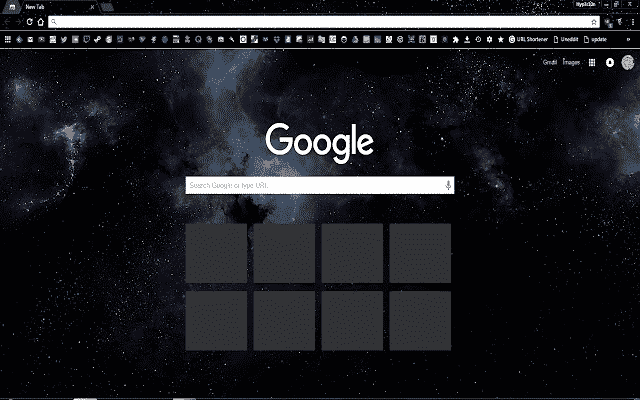
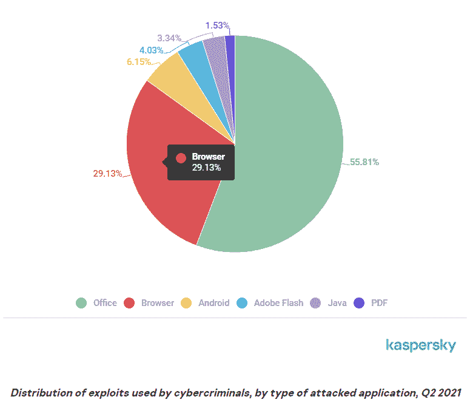
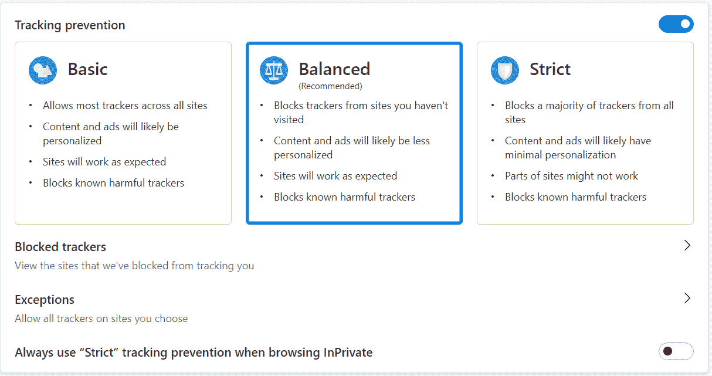
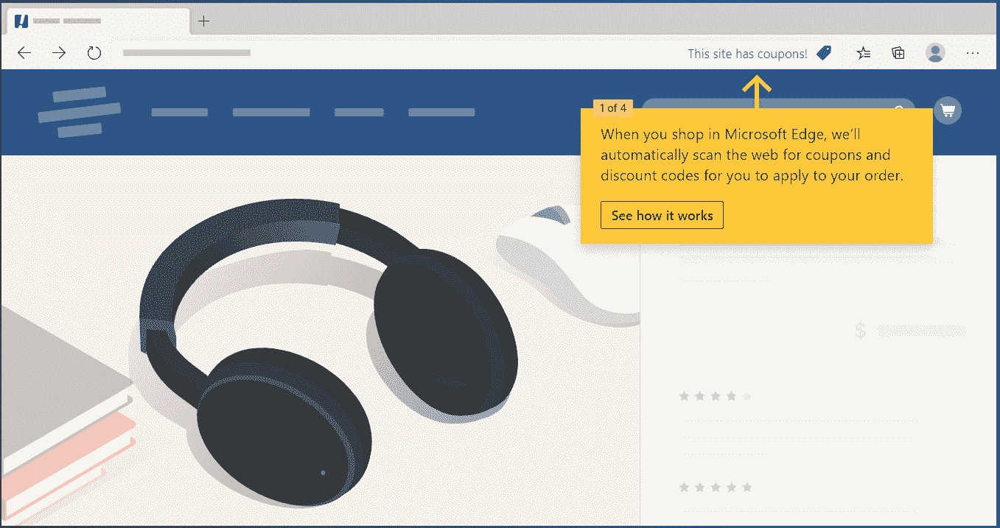

# 浏览器之战:微软 Edge vs Chrome

> 原文：<https://kinsta.com/blog/microsoft-edge-vs-chrome/>

你最喜欢哪个浏览器？

考虑到普通人每天花将近七个小时在互联网上，你很有可能会有所偏好。

对于你们中的大多数人来说，这种偏好将是谷歌浏览器，这是迄今为止最受欢迎的桌面和移动浏览器。

但这能使它成为最好的浏览器吗？

另一个顶级竞争者是 Edge，这是微软首次随 Windows 10 发布的浏览器。

为了找出哪种浏览器是最好的，我们将对微软 Edge 和谷歌 Chrome 进行对比。

T3】

## 谷歌浏览器概述

世界上最流行的浏览器诞生于 2008 年。在发布之前，Edge 的前身 IE 以 95%的最高市场份额独占鳌头。

谷歌 Chrome 在几年内超越了 ie 浏览器和 Mozilla Firefox，成为市场领导者。如今，它拥有 65.27%的市场份额，而 ie 浏览器的市场份额已经下降到 0.61%。

> 需要在这里大声喊出来。Kinsta 太神奇了，我用它做我的个人网站。支持是迅速和杰出的，他们的服务器是 WordPress 最快的。
> 
> <footer class="wp-block-kinsta-client-quote__footer">
> 
> 
> 
> <cite class="wp-block-kinsta-client-quote__cite">Phillip Stemann</cite></footer>

[View plans](https://kinsta.com/plans/)

全球浏览器市场份额。(**来源:** [反向链接](//backlinko.com/browser-market-share%E2%80%9D) )

Chrome 最初是为在 Windows 上运行而构建的，后来发布了适用于 Linux、macOS、iOS 和 Android 的版本。谷歌 Chrome 的大部分源代码都基于 Chromium，这是谷歌的一个免费开源软件项目。这两种浏览器和许多其他浏览器一直在争夺市场份额。

## Microsoft Edge 概述

微软在 2015 年随 Windows 10 和 Xbox One 发布了 Edge。Edge 取代微软 IE 浏览器成为默认浏览器，2022 年 IE 将彻底退役。

Edge 最初是基于 HTML 的浏览器，但 2020 年微软发布了基于 Chromium 的新版本 Edge，Chrome 使用的是同一款谷歌开源软件。

Microsoft Edge 适用于 Windows、macOS、Android、iOS 和 Linux。

微软转向 Chrome 使得 Edge 在几个方面比 Chrome 更具竞争力，我们稍后会谈到。

然而，它仍然只有 3.4%的市场份额，因此要赶上 Chrome 还有相当长的路要走。

## 谷歌 Chrome 和微软 Edge 浏览器的主要特性

在我们深入了解 Chrome 和 Edge 之前，先来快速概述一下它们各自的关键特性。

### Chrome 的主要特性

*   跨设备同步
*   水平标签
*   选项卡组
*   书签
*   参考书目
*   浏览器历史记录
*   扩展ˌ扩张
*   主题，包括黑暗模式
*   [密码管理器](https://kinsta.com/blog/password-managers/)
*   网站任务管理器
*   私人浏览

### 边缘关键特征

*   跨设备同步
*   水平和垂直选项卡
*   收藏夹
*   收集
*   浏览器历史记录
*   扩展ˌ扩张
*   多个隐私级别
*   密码管理器
*   沉浸式阅读器
*   私人浏览

## Edge 与 Chrome 的比较

微软 Edge 和谷歌 Chrome 有很多相似之处。作为竞争对手，微软和谷歌通常不允许两个产品之间的差距持续太久。他们几乎并驾齐驱。你可以用它们私下浏览，无缝网上冲浪，而且清除你在两者上的缓存很简单。

也就是说，有一些不同之处。让我们一个一个地看一下这些特性。

### 用户界面

如果你习惯了谷歌浏览器，微软 Edge 的用户界面会很熟悉(反之亦然)。例如，您可以在每个窗口中打开多个标签，并且可以将您喜欢的页面加入书签。

差异很小，主要归结于个人偏好。

#### 制表符

默认情况下，Chrome 和 Edge 都将标签页放在屏幕顶部的一行中。

但是，Edge 让您可以选择切换到页面左侧的一行垂直标签。

微软 Edge 垂直标签页。

Chrome 没有相应的内置垂直标签功能。Chrome 网络商店中有一些扩展可以产生类似的效果，但没有一个像微软 Edge 的原生垂直标签那样流畅。

Edge 和 Chrome 也允许你创建标签组。这里没有太大的区别——两种浏览器都允许你为每个组选择一种颜色和名称，并且会自动调整标签，使同一组中的标签相邻。

#### 书签和收藏夹

Chrome 称之为书签，Edge 称之为收藏夹，但概念是一样的。您可以将您最喜爱的页面加入书签，以便以后访问。

这两种浏览器都允许你将这些收藏夹中的一些放在顶部栏中，而将其他的放在一个下拉列表中。您可以将书签或收藏夹组织到文件夹中。

Microsoft Edge 提供了一个名为“收藏”的功能，这是将链接组织成组的另一种方式。您可以将链接、图像或文本副本添加到收藏中。您也可以将笔记添加到您的收藏。

收藏可以发送到 Microsoft Docs、Excel、OneDrive 或 Pinterest。在您的设备上同步收藏。

谷歌也有一个类似的功能，也称为收藏。谷歌收藏不是 Chrome 特有的——你可以从 Edge 轻松访问和添加。

Google 收藏通过允许其他 Google 帐户访问来共享。

#### 主题和黑暗模式

如果你不喜欢 Edge 或 Chrome 的默认外观，你有很多自定义主题可供选择。

Chrome 主题可以从 Chrome 网上商店获得。没有具体的黑暗模式设置，但许多可用的主题是黑暗的。

谷歌 Chrome 的黑暗空间主题。

如果您使用的是 Edge，您可以从外观设置页面定制浏览器的外观。选择整体外观是亮、暗还是默认，然后选择一个主题。

您可以在设置中选择 14 种基本颜色主题。如果你想要一些不同的东西，你可以从微软 Edge 商店或 Chrome 网络商店获得一个主题。

#### 沉浸式阅读器

沉浸式阅读器是 Microsoft Edge 独有的功能。它将你正在阅读的页面转换成类似电子书的格式，布局简单，不杂乱。

Chrome 没有沉浸式阅读器。然而，与 Chrome 缺少的大多数功能一样，您可以通过扩展来添加它。

#### 搜索引擎

默认情况下，谷歌 Chrome 使用谷歌作为其搜索引擎，微软 Edge 使用必应。

但是你可以很容易地[改变任一浏览器的默认搜索引擎](https://kinsta.com/blog/how-to-change-search-engine/)，所以这不应该成为你决定的因素。
T3】

### 手机版

谷歌 Chrome 和微软 Edge 都有安卓和 iOS 版本。

然而，边缘在手机上并不太受欢迎。虽然 Chrome 在台式机上的市场份额为 [68.79%](https://backlinko.com/browser-market-share) ，在手机上为 63.72%，但 Edge 在台式机上为 8.1%，在手机上仅为 0.1%。

这种差异可能是因为 Edge 是 Windows 电脑的默认浏览器，而 Chrome 是 Android 设备的默认浏览器。

但是哪个浏览器的手机 app 比较好呢？

有一些不同之处。例如，Chrome 允许你在手机应用程序上访问屏幕顶部的菜单和标签，而 Edge 则将其放在底部。总的来说，应用程序的质量是相似的，选择取决于用户的偏好。

### 表演

让我们来谈谈谷歌 Chrome 和微软 Edge 在速度方面的差异。

微软声称 Edge 刚出来的时候比 Chrome 快 [112%](https://www.firstpost.com/tech/news-analysis/microsoft-edge-is-faster-than-other-browsers-up-to-112-percent-faster-than-chrome-3669713.html) 。很难确定这个统计数据有多准确，但网上很多用户都进行了自己的测试，并得出了相同的结论:Edge 比 Chrome 快。

例如， [Avast](https://www.avast.com/c-fastest-web-browsers) 测试了许多浏览器，发现 Edge 运行速度比 Chrome、Firefox、Opera 和 Vivaldi 都快。

Chrome 也有大量消耗资源的名声。

汤姆的指南对此进行了测试，发现 Chrome 在各种测试中使用了更多的 RAM。比如打开 60 个标签页，Chrome 用了 [3.7](https://www.tomsguide.com/news/chrome-firefox-edge-ram-comparison) GB，Edge 只用了 2.9。

### 备份和同步

直到最近，Edge 的同步功能还很有限。例如，没有跨设备同步历史的选项。

然而，微软在 2021 年开始推出这些功能。Edge 现在可以同步 Chrome 可以同步的所有内容，包括:

*   书签/收藏夹
*   扩展ˌ扩张
*   历史
*   设置
*   打开标签
*   密码
*   地址
*   支付方式

使用 Edge，您必须在设置中手动启用跨设备同步。默认情况下，Chrome 会同步你的设备，但如果你愿意，也可以关闭它。

启用同步是确保在出现问题时备份您的偏好设置和个人收藏的最佳方式。

### 跨设备可访问性

谷歌 Chrome 可以在 Windows、macOS、iOS、Android、Linux 和 Chrome OS(Chrome book 上的操作系统)上运行。

## 注册订阅时事通讯

### 想知道我们是怎么让流量增长超过 1000%的吗？

加入 20，000 多名获得我们每周时事通讯和内部消息的人的行列吧！

[Subscribe Now](#newsletter)

微软 Edge 可以在除 Chrome OS 之外的所有平台上运行。

如果你想在 Chromebook 上安装 Edge，可以使用 Linux 版本的浏览器。

### 安全性和隐私

浏览器是恶意软件最常见的目标之一。 [29.13%](https://securelist.com/it-threat-evolution-in-q2-2021-pc-statistics/103607/) 对应用的 PC 漏洞攻击攻击浏览器。

分布攻击应用的漏洞。(**来源:** [卡巴斯基](//securelist.com/it-threat-evolution-in-q2-2021-pc-statistics/103607/%E2%80%9D) )

选择具有[强安全特性](https://kinsta.com/blog/most-secure-browser/)的浏览器至关重要。

除了防止网络攻击之外，浏览器还应该有隐私设置，让用户可以控制如何使用他们的数据。

让我们先澄清一下:Chrome 和 Edge 都不是市场上最安全或最隐私的浏览器。如果隐私是你的优先考虑，像 Tor，Brave 和 Firefox 这样的浏览器是更好的选择。

但 Edge 和 Chrome 确实有一些有用的安全功能。

Edge 的隐私设置更容易理解和管理。您可以在三种级别的跟踪预防中进行选择，并查看被阻止的跟踪器列表。

微软防边缘跟踪设置。

Chrome 只允许你向网站发送“请勿追踪”的请求。这两种浏览器都允许你从你访问的网站管理 cookies。

在针对[恶意软件和网络钓鱼](https://kinsta.com/blog/types-of-malware/)的安全性方面，微软 Edge 通过 Windows Defender SmartScreen 保护用户。Chrome 还内置了反恶意软件功能。这些都很有效，如果保持更新，任何一种浏览器都应该相对安全。

Chrome 以快速推出更新而闻名，这意味着恶意软件的任何漏洞都可以快速修复。Edge 也定期更新，但没有 Chrome 那么快。

谷歌收集的数据比微软还多，而且正面临一场[诉讼](https://www.searchenginejournal.com/google-to-face-5b-lawsuit-over-tracking-users-in-incognito-mode/399113/#:~:text=Google%20Chrome's%20Incognito%20Mode%20is,tracked%20during%20private%20browsing%20sessions.&text=%E2%80%9CThe%20court%20concludes%20that%20Google,is%20in%20private%20browsing%20mode.%E2%80%9D)指控谷歌收集用户匿名浏览的数据。

### 扩展ˌ扩张

直到最近，Edge 和 Chrome 在浏览器扩展方面还没有可比性。

Chrome 的扩展商店要好得多，有超过 150，000 个扩展可以增强您的体验。这包括从允许你暂时屏蔽网站的扩展到允许你将网络上的内容保存到脸书的扩展。

Edge 提供了一个较短的扩展列表(称为附加组件)。

但那已经不重要了。

既然 Edge 是基于 Chrome 的，你就可以在 Edge 上使用谷歌 Chrome 扩展了。只需在 Edge 中打开 Chrome 网络商店，“添加到 Chrome”按钮就会将扩展添加到微软 Edge 中。

给 Chrome 添加微软 Edge 插件就没那么简单了。你必须下载扩展的。crx 文件，Edge 并不容易，并重新加载到 Chrome。

幸运的是，在微软的商店里没有什么东西是你在 Chrome 网上商店里找不到的。

无论你喜欢使用哪种浏览器，你都有成千上万的扩展可用。

### 集成

Chrome 是庞大的谷歌生态系统的一部分，包括 Gmail、谷歌日历、谷歌驱动、谷歌地图等等。

需要一个给你带来竞争优势的托管解决方案吗？Kinsta 为您提供了令人难以置信的速度、一流的安全性和自动伸缩功能。[查看我们的计划](https://kinsta.com/plans/?in-article-cta)

许多谷歌工具与 Edge 配合使用也很好，尤其是现在可以添加 Chrome 扩展了。

然而，它与谷歌生态系统的整合在一些方面给了 Chrome 优势。

例如，两种浏览器都允许你翻译其他语言的页面，但 Chrome 使用的是谷歌翻译，这是一个比 Edge 的微软翻译工具优越得多的工具。

如果你使用 Google Drive，你可以直接从 Chrome 搜索栏中搜索你的驱动器中的项目。

微软 Edge 与微软产品进行了集成。最值得注意的是，你现在可以在 Edge 中打开和编辑微软 Office 文档。

### 其他功能

这两种浏览器都有更多的功能，尤其是当您从扩展中添加功能时。

但是我们想提一些你可能不知道你可以用浏览器做的更酷的事情。

#### Microsoft Edge 优惠券查找器

如果你使用浏览器进行网上购物，Edge 有一项功能适合你。

转到销售产品的页面，点击搜索栏中的蓝色购物图标。这将让您知道页面上的产品是否有优惠券代码。

微软 Edge 优惠券查找器。

到目前为止，Chrome 没有任何东西可以与这个功能相提并论。

#### 铸造

Chrome 可以让你将你的浏览器或者你的整个桌面投射到 Chromecast 设备上。例如，如果您将 Chromecast 设备连接到电视的 HDMI 端口，您可以将手机或笔记本电脑中的视频传输到电视。

Edge 甚至有更多的选角选择。你可以向任何支持 Miracast 或 DLNA 的设备播放媒体，甚至可以向 Chromecast 播放。

#### 任务管理器

Chrome 和 Edge 都有内置的任务管理器，可以让你监控标签和扩展的资源使用情况。

## Chrome 和 Edge 哪个浏览器好？

查看 Chrome 与 Edge 的旧对比，他们通常会指出 Chrome 做得好，但 Edge 缺乏的功能。

但是剩下的不多了。

微软一直在努力将 Chrome 的最佳功能添加到 Edge 中。自从 Edge 转到 Chromium 之后，浏览器都非常相似，哪个更适合你是个人选择。

但是，在少数地区，*边有*边。如果你优先考虑速度或低资源消耗，你应该选择微软 Edge 而不是 Chrome。
T3】

## 微软 Edge 和谷歌 Chrome 的替代品

Chrome 和 Edge 并不是你唯一的浏览器选择。

以下是微软 Edge 和谷歌 Chrome 的五大替代品——有些你听说过，有些你可能没有。

### 火狐浏览器

Mozilla Firefox 的市场份额接近微软 Edge，是最受欢迎的非 Chrome 浏览器之一。它有一个与 Chrome 或 Edge 非常相似的功能集。

许多人选择 Firefox 是因为它是开源的，由一个非营利组织所有，而不是像谷歌或微软这样的大公司。也可以安装 Firefox 扩展来增强浏览器。

它的隐私功能比 Chrome 或 Edge 要好。

与 Edge、Chrome 和列表中的大多数其他浏览器不同，Firefox 不是基于 Chrome 的，而是基于其名为 Gecko 的引擎。

### 突岩

Tor 擅长匿名浏览。它通过世界各地的中继反弹数据，所以没有人可以跟踪你的位置或浏览活动。它拥有丰富的安全和隐私功能，远远超过 Chrome 和 Edge 提供的功能。

但是 Tor 应该只在你对隐私很认真的情况下才是你的选择，因为它的性能还有待改进。网站经常加载缓慢或阻塞足够的元素来正常运行。

### Vivaldi

像谷歌 Chrome 和微软 Edge 一样，Vivaldi 也是基于 Chromium 的浏览器。

Vivaldi 的突出之处在于用户界面的定制。例如，您可以将标签放在浏览器的顶部、底部、左侧或右侧。你可以设计你自己的主题和移动 UI 元素。你甚至可以选择你的 UI 元素是尖角还是圆角。

一个巧妙的技巧是你可以并排查看多个标签。例如，您可以在一个选项卡上做笔记，而在另一个选项卡上进行视频会议。

### 歌剧

Opera 不是最流行的浏览器，但它是最老的浏览器之一，于 1995 年发布。

它基于 Chromium，拥有和其他 Chromium 浏览器一样多的功能。这是一个比 Chrome 或 Edge 更好的隐私选择，因为它内置了广告拦截器和虚拟专用网。

一个方便的功能是为 Facebook Messenger 和 WhatsApp 等聊天应用添加快捷方式。

### 勇敢的

勇敢者非常注重隐私。它最独特的特点是它的广告网络和勇敢的注意力令牌(BAT)。

浏览器会屏蔽广告，并向您显示来自其自身网络的不同广告。观看广告，你会得到蝙蝠，一种可以返还给创作者的加密货币。

[微软 Edge vs Chrome🥊💥哪一个会胜出？](https://twitter.com/intent/tweet?url=https%3A%2F%2Fkinsta.com%2Fblog%2Fmicrosoft-edge-vs-chrome%2F&via=kinsta&text=Microsoft+Edge+vs+Chrome+%F0%9F%A5%8A%F0%9F%92%A5+Which+one+will+come+out+on+top%3F&hashtags=Microsoft%2CChrome)

## 摘要

几年前，微软似乎不可能再次成为互联网浏览器领域的有力竞争者。

Edge 要赶上谷歌 Chrome 还有很长的路要走，但它是一款优秀的浏览器，市场份额不断增长。如果你在转换到 Chromium 之前还没有尝试过，那就值得再看一眼！

当然，谷歌 Chrome 非常受欢迎是有原因的，谷歌肯定会不断提高性能，并更新新功能。

想知道你的其他选择吗？[了解六种最安全的浏览器。](https://kinsta.com/blog/most-secure-browser/)T3】

* * *

让你所有的[应用程序](https://kinsta.com/application-hosting/)、[数据库](https://kinsta.com/database-hosting/)和 [WordPress 网站](https://kinsta.com/wordpress-hosting/)在线并在一个屋檐下。我们功能丰富的高性能云平台包括:

*   在 MyKinsta 仪表盘中轻松设置和管理
*   24/7 专家支持
*   最好的谷歌云平台硬件和网络，由 Kubernetes 提供最大的可扩展性
*   面向速度和安全性的企业级 Cloudflare 集成
*   全球受众覆盖全球多达 35 个数据中心和 275 多个 pop

在第一个月使用托管的[应用程序或托管](https://kinsta.com/application-hosting/)的[数据库，您可以享受 20 美元的优惠，亲自测试一下。探索我们的](https://kinsta.com/database-hosting/)[计划](https://kinsta.com/plans/)或[与销售人员交谈](https://kinsta.com/contact-us/)以找到最适合您的方式。