# 微软 Teams vs Slack:哪个协作 App 更好？

> 原文：<https://kinsta.com/blog/microsoft-teams-vs-slack/>

2019 年，全球团队协作软件市场规模达到[95 亿美元](https://www.grandviewresearch.com/industry-analysis/team-collaboration-software-market)。

随着[新冠肺炎局势](https://kinsta.com/knowledgebase/coronavirus-covid-19/)导致向[远程工作](https://kinsta.com/webinars/working-from-home/)的重大转变，协作和聊天工具比以往任何时候都更加重要。

在这个不确定的时代，企业都在争先恐后地实施协作软件，以保持高生产率。

正如你可能已经知道的，除了[替代品](https://kinsta.com/blog/slack-alternatives/)之外，这个领域的两个明显的市场领导者是 Slack 和微软团队。

这是一场激烈的市场竞争——下文将详细介绍——它超越了用户数量，因为 Slack 在 2020 年在欧洲对微软提起了[竞争投诉，指控微软“非法将其团队产品捆绑到其市场主导的办公生产力套件中”。](https://investor.slackhq.com/news/news-details/2020/Slack-Files-EU-Competition-Complaint-Against-Microsoft/default.aspx)

简而言之:这是两家公司之间的博弈。

暂且将法律纠纷放在一边，重新关注生产力，这两个选项中哪一个对您的企业来说是最佳选择？

在本帖中，我们将比较微软团队和 Slack，并深入探讨他们的功能、定价、用户体验和市场份额，以帮助您回答这个关键问题并选出赢家。

## 微软团队与 Slack —市场份额

如果你看看几年前协作软件领域的市场份额，就会发现情况完全不同。

> 需要在这里大声喊出来。Kinsta 太神奇了，我用它做我的个人网站。支持是迅速和杰出的，他们的服务器是 WordPress 最快的。
> 
> <footer class="wp-block-kinsta-client-quote__footer">
> 
> 
> 
> <cite class="wp-block-kinsta-client-quote__cite">Phillip Stemann</cite></footer>

[View plans](https://kinsta.com/plans/)

随着微软团队在企业客户中的增长，Slack 明显处于领先地位，但增长速度并不快，Slack 对此感到担忧。2022 年，就不一样了。

2019 年，微软团队的日活跃用户数量超过了 Slack 在 7 月份达到了 1300 万。

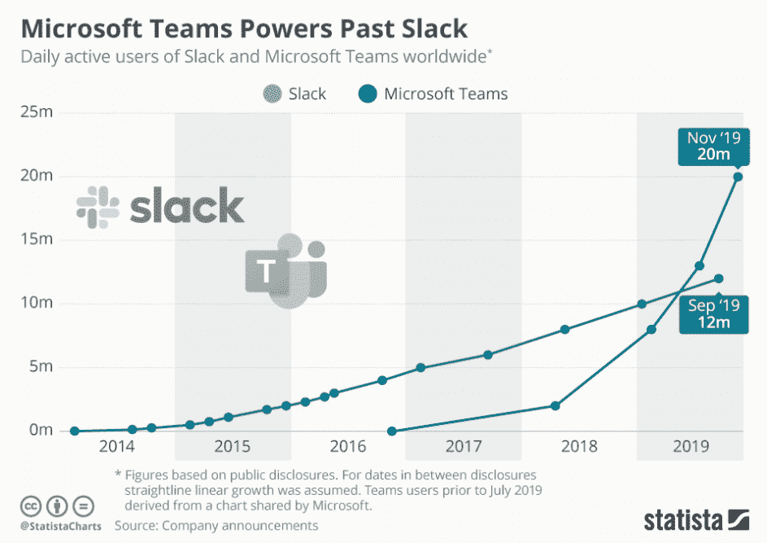

Microsoft Teams vs Slack users 2014–2019 (Source: Statista.com)

新的增长率没有显示出放缓的迹象。

与新冠肺炎相关的在家订单导致了更多的远程工作，据报道，2020 年上半年微软团队的用户数量飙升至 7500 万。

当然，Slack 也在增长，但速度不一样了。

### 微软团队会干掉 Slack 吗？

Slack 有输掉协作市场之战的危险吗？让我们检查数据。

微软团队正在通过大型组织、学校、政府工作人员及其现有的 [Office 365](https://kinsta.com/knowledgebase/office-365-smtp/) 客户群增加大量用户。

如果你很懒散，这是一个非常可怕的图表:

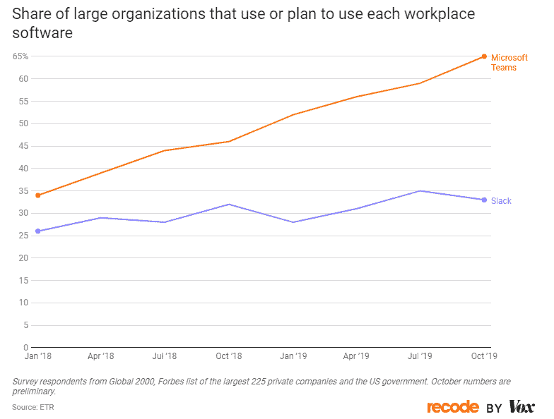

Microsoft Teams and Slack enterprise market share 2019

截至 2019 年底，微软在企业和政府机构中明显占据领先地位，65%的受访者使用这一优势。

但 Slack 仍然是初创企业、开发人员和其他懂技术的年轻员工中的明显领导者。

如果你是微软团队，这是一个非常可怕的图表:

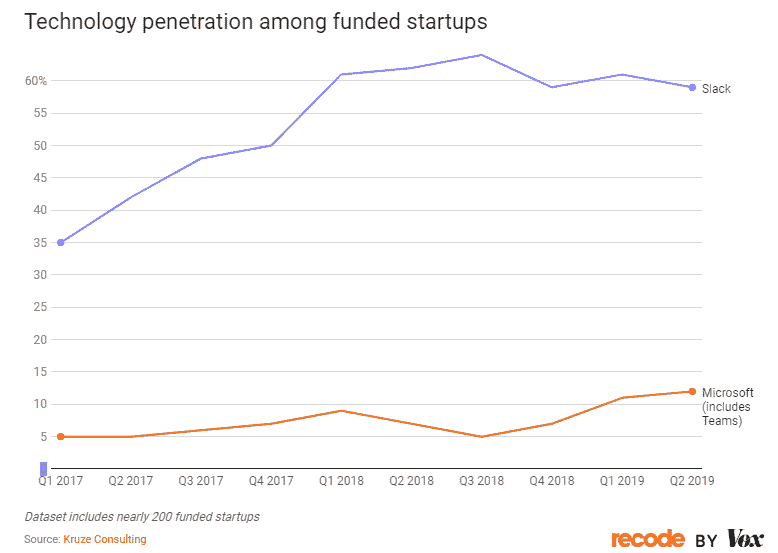

Slack Microsoft Teams startup market share 2017–2019

微软在这个细分市场进展甚微，Slack 也没有显示出任何迹象表明它会在短期内放松对初创公司的控制。

微软可能有更多的用户，一次从大公司招募数千人，但受资助的初创公司的前卫技术人员仍然青睐 Slack。所以看起来办公室沟通和团队合作的战斗还没有结束。

[With #remotework in the cards for the foreseeable future, tools like @SlackHQ and @MicrosoftTeams are essential for everyday life. 🌎 💻 But which one should your team use? Read on for the full comparison...⬇️Click to Tweet](https://twitter.com/intent/tweet?url=https%3A%2F%2Fkinsta.com%2Fblog%2Fmicrosoft-teams-vs-slack%2F&via=kinsta&text=With+%23remotework+in+the+cards+for+the+foreseeable+future%2C+tools+like+%40SlackHQ+and+%40MicrosoftTeams+are+essential+for+everyday+life.+%F0%9F%8C%8E+%F0%9F%92%BB++But+which+one+should+your+team+use%3F+Read+on+for+the+full+comparison...%E2%AC%87%EF%B8%8F&hashtags=WFH%2Cremotework)

## Microsoft 团队与时差—功能概述

| 特征 | 微软团队 | 松弛的 |
| 渠道(团队) | ✔ | ✔ |
| 私人信息 | ✔ | ✔ |
| 用户数量 | 免费计划最高 500k | 无限的 |
| 无限消息 | ✔ | ✔ |
| 全面的邮件搜索 | ✔ | ✔(免费计划最多 10，000 条消息) |
| 文件共享 | ✔ | ✔ |
| 访客访问 | 即使是付费计划，每个帐户也仅限 5 英镑 | 与外部用户就付费计划进行无限协作 |
| 屏幕共享 | ✔ | ✔(不包含在免费计划中) |
| 视频和音频通话(一对一) | 无限的 | 无限的 |
| 视频会议 | 多达 250 名付费用户 | 最多 15 个付费用户 |
| 网络、桌面和移动应用 | ✔ | ✔ |
| 快捷方式和生产力工具 | (40 多个桌面应用程序快捷方式) | (50 多个桌面应用程序的快捷方式，大多数也可用于 web 应用程序。) |
| 机器人和工作流工具 | ✔聊天机器人(仅付费)和第三方聊天机器人 | ✔·懒汉机器人 |
| 集成 | 472 款应用可供选择 | 多达 10 个免费计划，有 2000 多个应用程序可供选择 |

微软团队和 Slack 都提供了一个全面的功能列表，可以帮助您的团队协作并完成更多工作。

私人和公共渠道(或团队)消息传递、可搜索的消息历史、视频电话会议、屏幕共享、文件共享(通过 SharePoint 等 Office 365 套件的权限控制)等功能有助于公司紧密合作，即使[他们实际上不在同一个办公室](https://kinsta.com/blog/working-remotely/)。

就功能而言，两种解决方案势均力敌。Slack 在某些领域有优势，而微软团队在其他领域有优势。

一个关键的区别是，微软团队与外部团队的协作非常有限。即使是付费计划，它也有五个用户的限制，除非你购买更多的许可证，Slack 允许付费计划的无限外部合作。

微软团队提供更强大的视频会议。它可以支持多达 250 个用户的视频会议或多达 10，000 人的现场活动(使用团队、Microsoft Stream 和 Yammer 的组合)。

Microsoft Teams live events

这展示了团队的真正实力 Office 365 套件的其余部分支持并扩展了其功能。然而，许多团队独有的特性只对大型企业或组织有用，所以这不是一个客观的优势。

## 微软团队 vs Slack —比较自由计划

但是，当你仔细观察微软团队和 Slack 的免费计划时，哪一个是最好的呢？

首先，Slack 为所有计划提供无限的用户和消息，微软团队提供高达 50 万(大多数公司基本上是无限的)和无限的消息。

一个很大的区别是 Slack 只允许你在免费的工作区中搜索多达 10，000 条存档的消息。

Slack 10,000 messages prompt

微软没有人为的限制，让你自由地搜索你的整个信息历史。

免费的微软团队计划还包括屏幕共享，而你需要升级到付费计划才能在 Slack 中使用该功能。

团队视频通话和小规模视频会议也是微软团队免费版的一部分。但是使用 Slack，你只能和免费版进行一对一的音频和视频通话。

当然，许多公司已经在视频会议中使用了 Zoom 这样的独立解决方案，所以这并不妨碍交易。

总的来说，微软团队的免费计划比 Slack 拥有更多的解锁功能和更少的限制。

但除非你的团队严重依赖屏幕共享或视频通话，否则 Slack 的用户体验不会感觉受到限制。

## 微软团队 vs Slack —定价

是时候深入了解微软团队与 Slack 付费计划和定价了。哪个付费方案最超值？

让我们先来仔细看看 Slack 的计划。

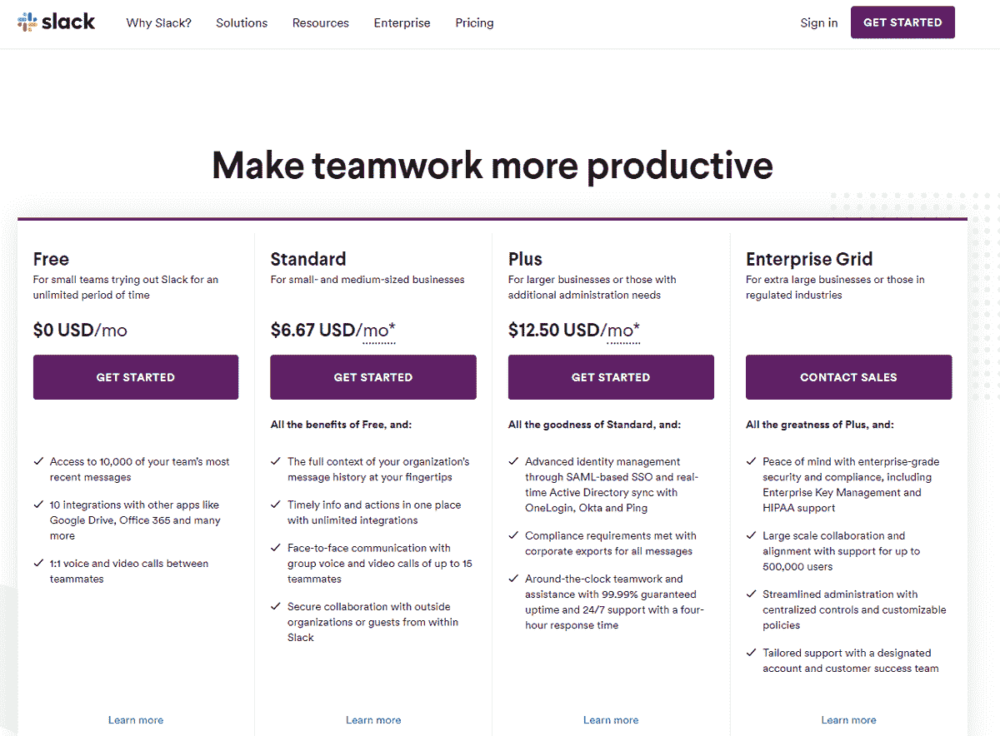

Slack plans and pricing

Slack 的基本计划“标准”起价为每个用户每月 6.67 美元。

它取消了对可搜索信息、应用程序和集成以及视频通话的限制。它还包括每个用户 10GB 的文件存储，而不是工作区总共 5GB 的文件存储。

它还允许您的工作区添加客人和外部合作者，非常适合与合作伙伴和客户密切合作的[机构](https://kinsta.com/blog/wordpress-agency/)和[顾问](https://kinsta.com/webinars/from-freelance-to-agency/)。

您可以为邮件和文件设置自定义保留策略，以确保符合任何行业或当地法规。

最后，它使“用户组”成为可能，这是一种在渠道之外对用户进行分组的方式，可以向整个团队或部门发送消息。

“Plus”每个用户的费用为 12.50 美元，包括更高级的合规性和安全性选项、优先 4 小时响应时间支持以及每个用户 20 GB 的存储空间。

接下来，让我们仔细看看微软团队的计划和定价。

请注意，没有专门针对微软团队的付费计划，而是包括团队高级版本和其他应用程序的微软 365 计划。

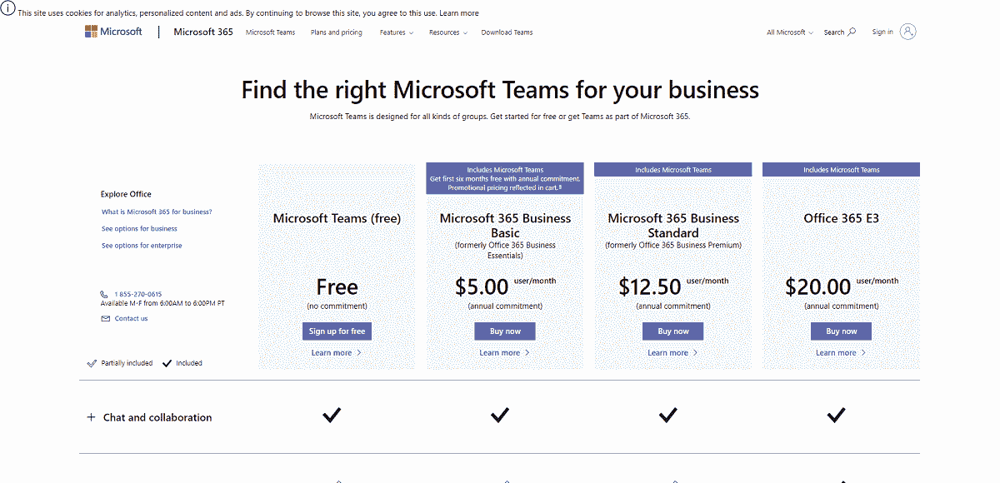

Microsoft Teams plans and pricing

微软的付费计划从“微软 365 商业基础”开始，每个用户每月 5 美元，用于收集他们的协作工具，包括团队和 SharePoint。该计划不包括访问 Office 365 套件的桌面版本，如 Word 和 PowerPoint。

您可以安排和记录会议，为每个用户提供 1TB one drive 存储，以及单点登录和强制[多重身份验证](https://kinsta.com/blog/wordpress-two-factor-authentication/)等[安全](https://kinsta.com/blog/wordpress-security/)功能。

最便宜的层还包括用于管理用户和合规性的管理工具。

“微软 365 商业标准版”定价为 12.50 美元，不影响可用的团队功能。相反，它让您的团队能够访问 Word、Excel 和 PowerPoint 的完整桌面版本。

微软最便宜的计划比 Slack 的略便宜，但每个用户只需 150 美元。价格优势不足以使其成为小型企业的明显选择。

第二层计划的费用相同，为 12.50 美元，优势是两种计划都有更先进的功能。

如果你的公司已经在购买微软 365 套件，真正的价格优势就来了。商业和企业计划已经包括了对高级团队的访问。

因此，如果你的公司已经为微软 365 付费，你可以不用支付更多就能获得 Teams 的高级版本。

## Microsoft 团队与时差—用户界面

接下来，让我们仔细看看 UI。具体来说，我们将考虑新用户从一无所知到有效地使用平台来协作和管理项目有多容易。

Slack 的用户界面圆滑，已经成为行业标准。

不仅如此，近年来，Slack 加倍努力创建一个自然的入职流程，为新用户提供一步一步的教程。

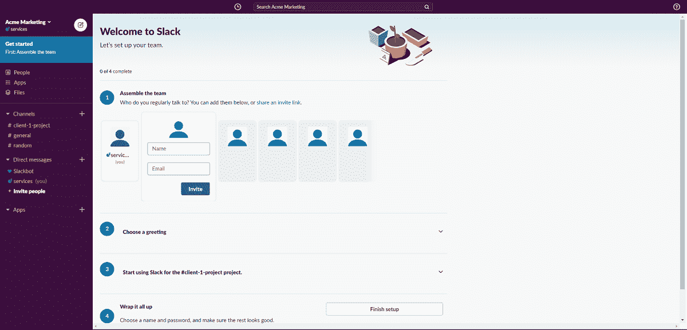

Onboarding experience with Slack

当然，即使没有指南，入门也没什么复杂的。您可以在“人员”选项卡中管理新用户并向您的工作区添加新用户。

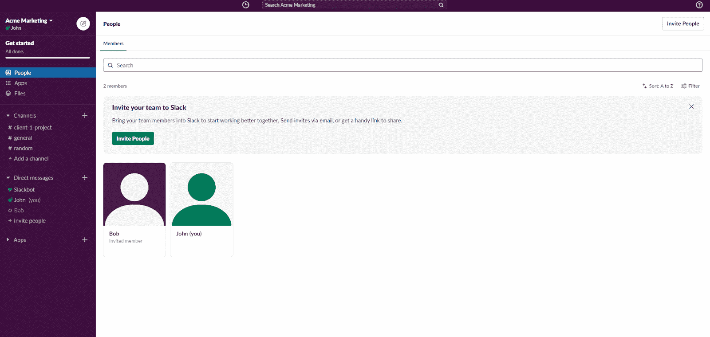

Slack workspace

潜在用户将通过电子邮件收到邀请。如果他们已经有一个 Slack 帐户，您的工作区将被添加到他们现有的帐户中，无需创建或记住新密码。

## 注册订阅时事通讯

### 想知道我们是怎么让流量增长超过 1000%的吗？

加入 20，000 多名获得我们每周时事通讯和内部消息的人的行列吧！

[Subscribe Now](#newsletter)

您可以通过点击侧边栏菜单中的“添加频道”链接(在频道部分)轻松添加一个[松弛频道](https://kinsta.com/blog/how-to-use-slack/#what-is-a-channel)。

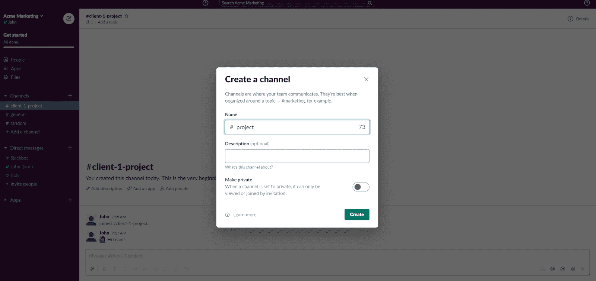

Slack workspace — create a channel

向您的团队发送消息就像进入频道并开始输入一样简单。您可以使用@和他们的用户名通过[将频道中的消息发送给特定的人(或多人)。](https://kinsta.com/blog/how-to-use-slack/#slack-mentions)

这将确保 Slack 通知他们您发送给他们的消息。

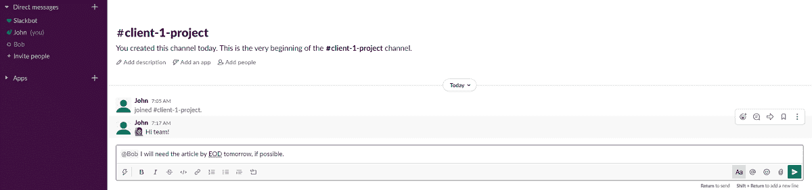

Slack mentions

Slack 还有很多，我们将在下面关于机器人和快捷方式的章节中讨论 UI 的其他部分。

接下来，让我们仔细看看微软团队的用户界面。

大多数 Slack 竞争对手都会模仿，微软团队也不例外。用户界面的触感和感觉没有太大的不同。

微软团队在注册后以文档和教程视频的形式提供一些指导。但不包括 Slack 这样的循序渐进的互动教程。

Microsoft Teams’ UI

“团队”取代了 Slack 中的“频道”菜单部分。每个团队可以有不同的渠道来保持不同项目的沟通(Slack 的主要卖点之一)。

如果你以前用过 Slack，当你第一次打开它时，频道并不是 UI 提醒你 Slack 的唯一方式。当你点击一个按钮或菜单时，它会打开一个灯箱，而不是一个全新的页面。

例如，您可以通过单击任何团队页面上的“创建更多频道”按钮来创建新频道。

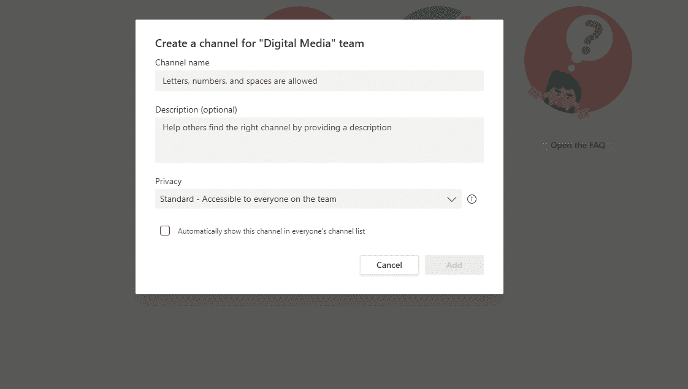

Creating a new channel in Microsoft Teams

和 Slack 一样，你也可以@某人来确保他们注意到你的消息。

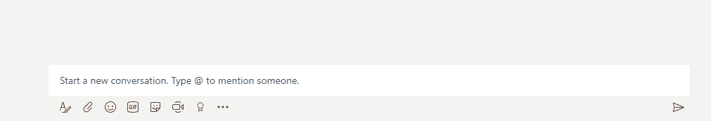

Microsoft teams message

创建拥有自己渠道的多个团队的能力对大型公司和组织很有帮助。

这两个工具都很容易使用，但 Slack 在一步一步的教程和通用 UX 方面稍有优势。

## 微软团队与懈怠——捷径与生产力

接下来，我们来看看哪个工具的键盘快捷键和其他生产力工具最好。

Slack 是一个生产力创新者，几乎任何事情都有捷径和生产力诀窍。甚至 Slack 的 web 应用程序也有一个完整的键盘快捷键列表，你可以用它来提高你的工作效率。

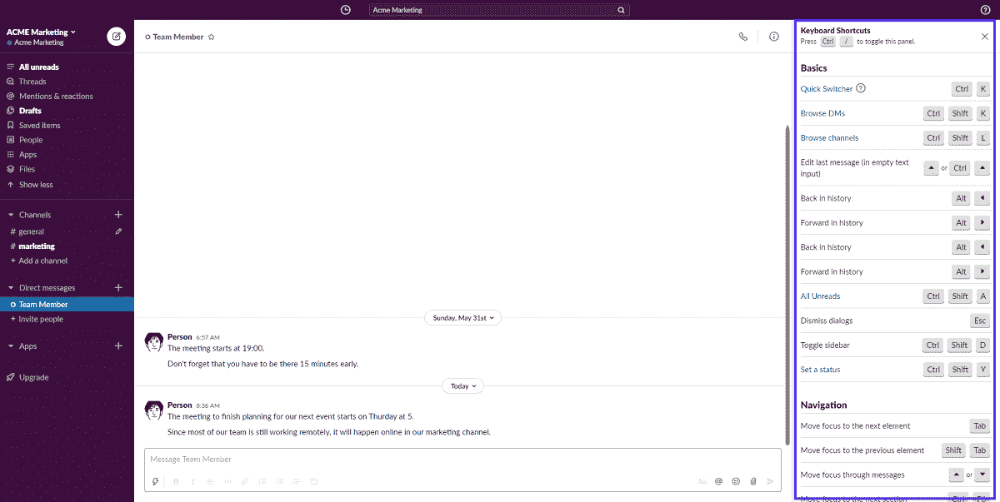

Keyboard shortcuts in Slack

您可以通过在 Mac 上按下 Command + /和在其他电脑上按下 CTRL + /来切换此列表。

**我们最喜欢的一些快捷键是:**

*   只需按↑键即可编辑已发送的信息。
*   通过按 CTRL(⌘) + SHIFT + A 阅读所有未读邮件
*   用 ctrl(⌘+shift+s 查看所有带星号的邮件
*   用 ALT +左键单击(鼠标)将任何邮件标记为未读。
*   使用 SHIFT + ALT (Option) + ↓跳转到最新的未读邮件。

除了快捷方式，Slack 还有高级搜索选项，可以帮助你更快地找到你想要的信息。

例如，您可以通过带有“有:”搜索参数的表情符号来查找消息。如果您的团队使用特定的表情符号来标识已达成的交易或优先信息，这将非常有用)

如果你已经是用户，但还没有掌握 Slack，一定要看看我们关于如何使用 Slack 的指南[，包括 18 个鲜为人知的生产力诀窍](https://kinsta.com/blog/how-to-use-slack/)。

厌倦了 WordPress 的问题和缓慢的主机？我们提供世界一流的支持，由 WordPress 专家提供 24/7 服务和超快的服务器。[查看我们的计划](https://kinsta.com/plans/?in-article-cta)

当然，微软团队也紧随其后，试图实现类似的提高生产率的快捷方式，但它们不像 Slack 的一些更好的方式那样有组织或直观有用。

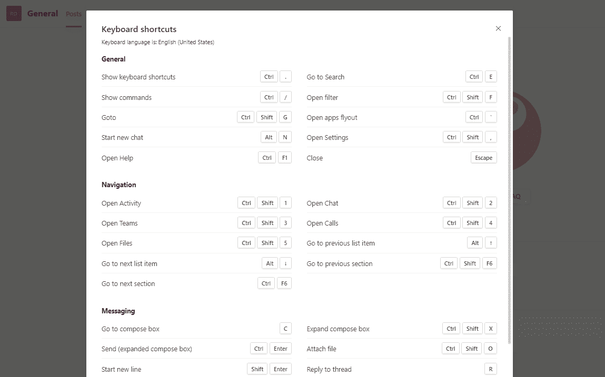

Microsoft Teams’ keyboard shortcuts

请注意，大多数快捷方式只是打开一个特定的标签，而不是帮助您快速完成一项基本任务。

我们错过了快捷方式，比如用一个键编辑最近的消息，轻松地将消息标记为未读，以及类似的可以加快我们工作速度的方式。

就快捷方式和生产率而言，Slack 是明显的赢家。

## 微软团队 vs Slack —机器人和工作流

在本节中，我们将深入探讨机器人和每种工具可能实现的高级工作流。

Slack 值得信赖的“Slackbot”自动包含在每个工作空间中。

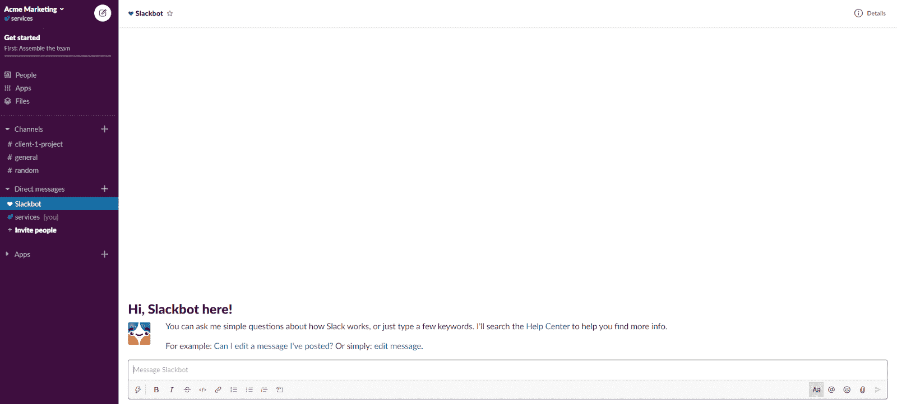

Slack Slackbot

您可以询问如何使用时差、设置提醒等问题。一般来说，Slackbot 只是让你的懈怠生活更轻松。好机器人。**🤖**

Slackbot 很聪明，有许多有用的特性，可以帮助你立即自动化简单的工作流程。它还具有许多不同的集成功能，可以帮助您自动化基本的工作流程。

例如，您可以设置与项目相关的基本问题的自动答案，如“X 的截止日期是什么？”它还集成了大多数任务管理应用程序，如 [Asana、Trello](https://kinsta.com/blog/trello-vs-asana/) 和 [Pipefy](https://kinsta.com/blog/trello-alternative/#12-pipefy) 。例如，通过这些应用程序，您可以安排自动提醒和更新。

总而言之，对于任何不喜欢手动复制粘贴信息的专业人士来说，Slackbot 都是一个值得信赖的盟友。

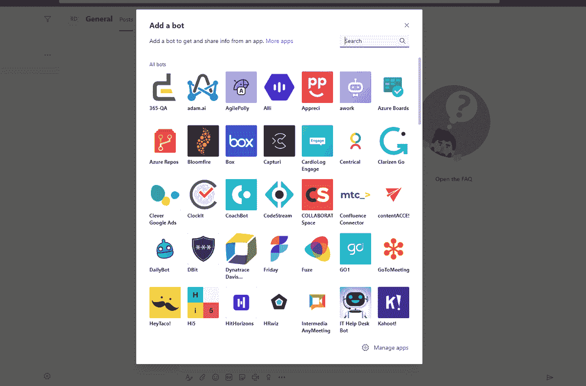

Adding bots to Microsoft Teams

另一方面，微软团队却没有同样的聊天机器人。你可以从一个备选列表中选择，但其中许多只完成第三方应用程序的特定任务。

幸运的是，有像 Workbot 这样的替代品可以帮助你建立先进的自动化工作流程。它与多个应用程序通信并整合数据，如 Slackbot。

虽然 bot 的功能相当，但如果你在微软团队中安装了正确的一个，那么使用 Slack 的 Slackbot 会容易得多。

## 微软团队 vs Slack —集成

Slack 拥有超过 2，000 个用于扩展其功能的应用程序，在集成和应用程序方面是明显的领导者。

此时，AppSource 商店中有 [530+微软团队](https://appsource.microsoft.com/en-us/marketplace/apps?src=wnblogmar2018&product=teams)相关的应用和集成可用。但是，如果你的公司已经使用 Office 365，你可能会认为微软团队在这方面有优势。

没那么快。

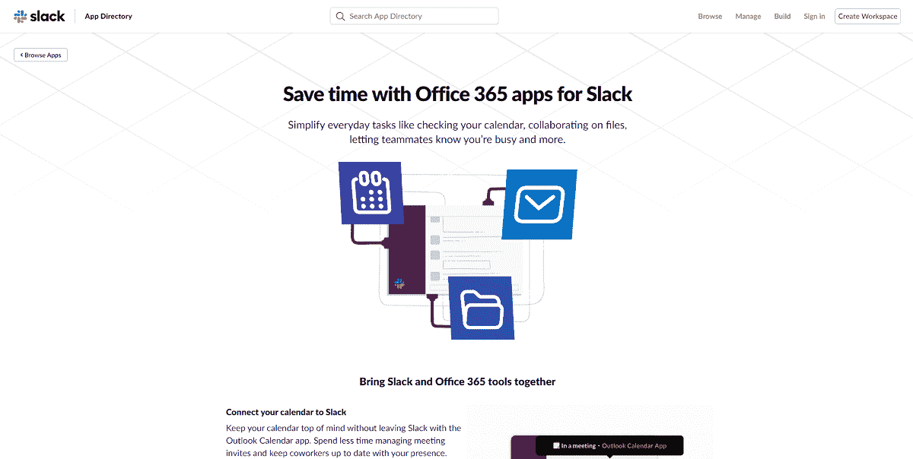

Slack’s Office 365 integrations

Slack 为所有重要的 Office 365 应用程序集成了应用程序，包括 Outlook、日历、OneDrive 和 SharePoint。

Slack 还有 2000 多个其他应用和集成，包括整个谷歌工作空间。

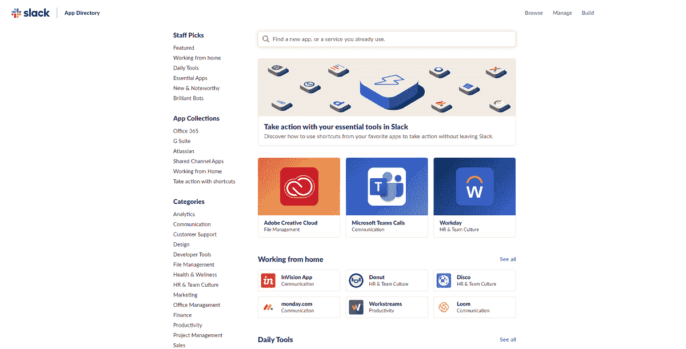

Slack apps

有了大量不同的集成，你必须让 Slack 也有优势。

如果你需要和 Slack 一起使用的工具，看看我们用来成长的 [40+ SaaS 产品](https://kinsta.com/blog/saas-products/)。

## 微软团队 vs Slack —安全性和合规性

Slack 和微软团队都为他们的所有计划提供了基本的安全特性，如[双因素认证](https://kinsta.com/blog/wordpress-two-factor-authentication/)。

你可能会认为，作为以企业为中心的业务，微软是至高无上的，但 Slack 在过去几年里也改进了它的游戏。

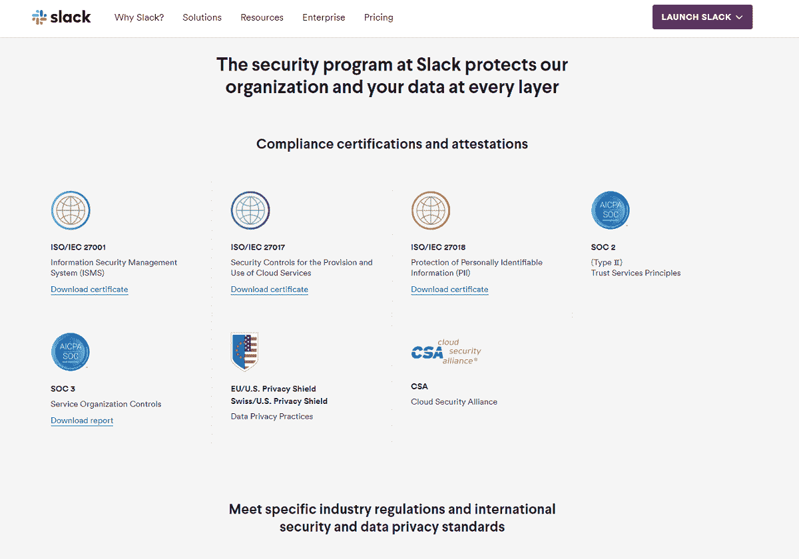

Slack security

事实上，Slack 符合大多数基本的 ISO 认证，您还可以请求符合 HIPAA 的特定配置的工作区(HIPAA-compliance 仅适用于企业计划。)

这使得 Slack 成为大多数行业中寻找协作应用程序但担心安全性或合规性的公司的合适选择。

然而，通过其本地集成，微软团队提供了稍好的访问控制、信息管理和安全性。

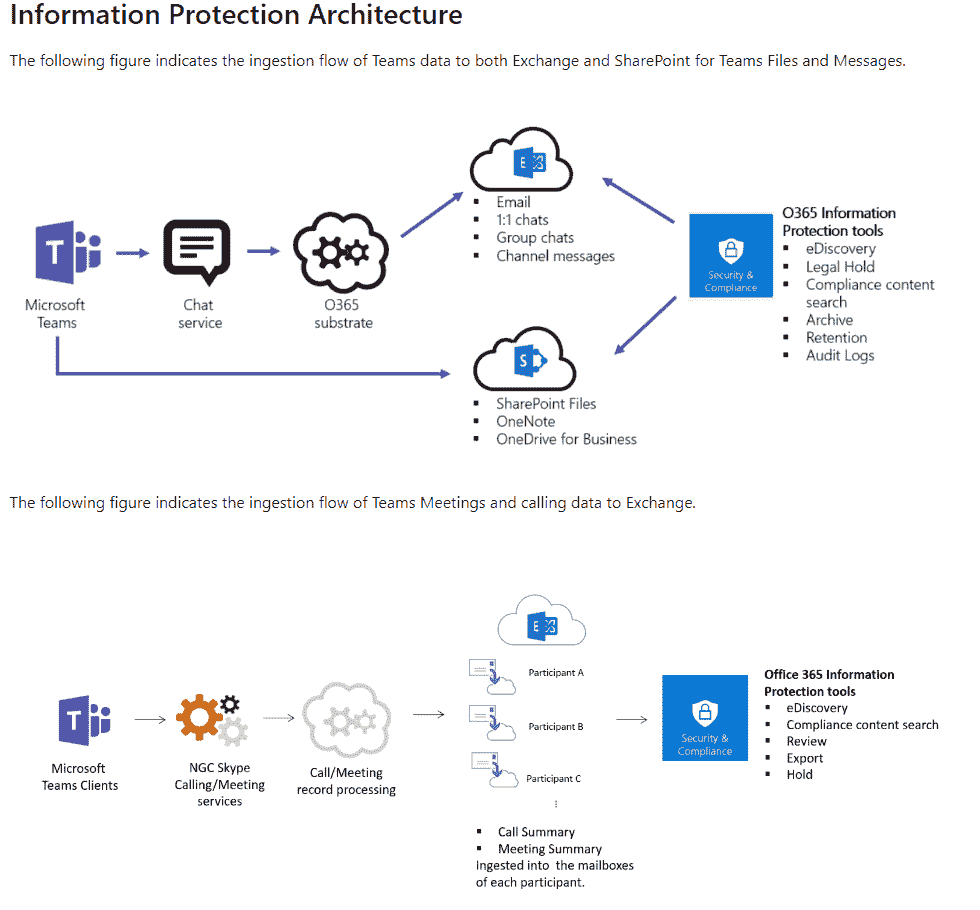

Microsoft Teams’ information architecture

IT 经理还可以使用许多高级管理选项来确保微软团队遵守公司的内部政策和法规。

很难说谁是明显的赢家，因为两家公司都非常重视安全性和合规性。

需要注意的一点是，虽然 Slack 的管理工具是为 Plus 和 enterprise 计划保留的，但即使是基本的 Microsoft Teams 计划也包含了大部分功能。

## 哪种工作流协作产品最适合您的企业？

如果你已经走了这么远，你可能只剩下一个问题了。

> 微软团队和 Slack 哪个协作工具最适合我？

答案取决于您当前的场景和需求:

如果你的公司已经在使用 Office 365 并为其付费，那么微软团队可能会有意义。它提供了许多与 Slack 相同的功能，而专业计划不会让你额外花费任何东西，因为你已经为此付费了。

但如果你不这样做，就没有理由做出改变。

如果你只是想要一个直观的聊天工具，具有强大的生产力功能和集成，Slack 是一个可靠的选择。

总的来说，两种解决方案的结果相当一致，Slack 在 UX、机器人和生产率方面略有优势。

微软团队有一个稍微更通用的免费计划(有屏幕共享和视频会议)，它的基本计划更便宜。

[The great #remotework matchup: @SlackHQ 🥊 vs @MicrosoftTeams 🥊. Which one has your vote? Click for the full analysisClick to Tweet](https://twitter.com/intent/tweet?url=https%3A%2F%2Fkinsta.com%2Fblog%2Fmicrosoft-teams-vs-slack%2F&via=kinsta&text=The+great+%23remotework+matchup%3A+%40SlackHQ+%F0%9F%A5%8A+vs+%40MicrosoftTeams+%F0%9F%A5%8A.+Which+one+has+your+vote%3F+Click+for+the+full+analysis&hashtags=productivity%2Cremoteteams)

## 摘要

就活跃用户的绝对数量而言，微软团队显然已经取代 Slack 成为市场领导者，并迅速成为企业间首选的协作平台。

另一方面，Slack 仍然是更具创新性和易用性的工具，这使它成为初创公司和较小公司的中流砥柱。

Slack 有更多的集成，一个更好的机器人，和略好的可用性。微软团队稍微便宜一点，提供稍微好一点的免费计划，并且与 Office 365 工具原生集成。

在微软团队和 Slack 之间，哪个工具是你的企业的正确选择？

这完全取决于你是否使用 Office 365 和/或你的团队对其中一个平台的经验。

这两者之间你更喜欢的沟通工具是什么？在评论里告诉我们吧！

* * *

让你所有的[应用程序](https://kinsta.com/application-hosting/)、[数据库](https://kinsta.com/database-hosting/)和 [WordPress 网站](https://kinsta.com/wordpress-hosting/)在线并在一个屋檐下。我们功能丰富的高性能云平台包括:

*   在 MyKinsta 仪表盘中轻松设置和管理
*   24/7 专家支持
*   最好的谷歌云平台硬件和网络，由 Kubernetes 提供最大的可扩展性
*   面向速度和安全性的企业级 Cloudflare 集成
*   全球受众覆盖全球多达 35 个数据中心和 275 多个 pop

在第一个月使用托管的[应用程序或托管](https://kinsta.com/application-hosting/)的[数据库，您可以享受 20 美元的优惠，亲自测试一下。探索我们的](https://kinsta.com/database-hosting/)[计划](https://kinsta.com/plans/)或[与销售人员交谈](https://kinsta.com/contact-us/)以找到最适合您的方式。