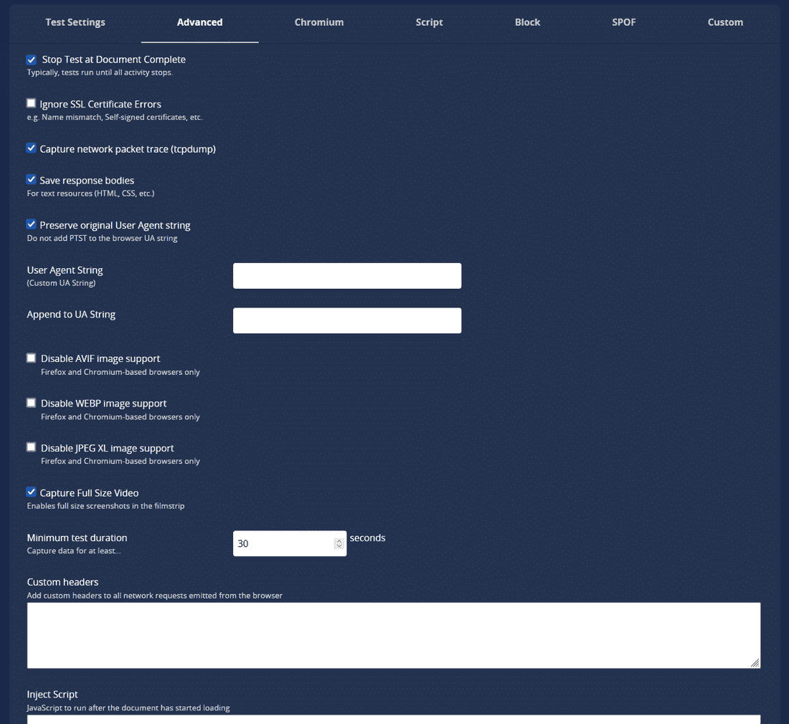
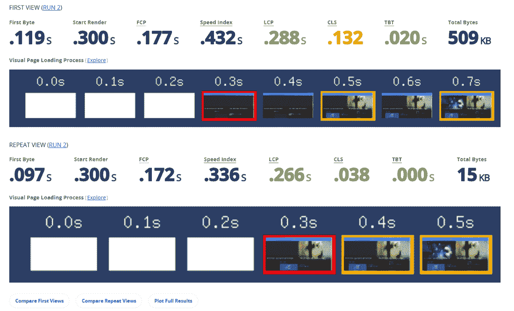
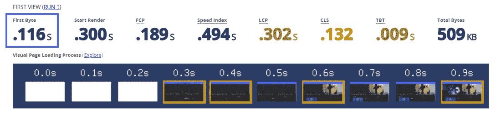
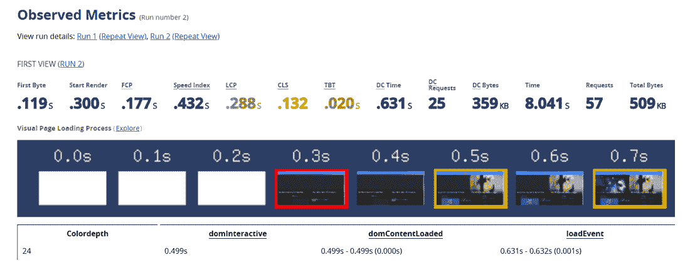

# 迁移到 Kinsta，免费获得 20%的速度提升——由统计数据支持

> 原文：<https://kinsta.com/blog/migrate-to-kinsta/>

每个人都喜欢访问一个快速的网站！拥有一个快速的网站也有助于提升你的搜索引擎排名、抓取率、转化率和停留时间。此外，它还会降低你的跳出率。

在金塔，我们痴迷于速度！不出所料，许多网站所有者和网络机构通过迁移到金塔来升级他们的网站。

如果你仍然犹豫不决，你可能想知道迁移到 Kinsta 后网站速度是否有显著提高。通过这个广泛的迁移数据项目，我们着手测试这一点。

该项目涵盖了来自 3200 多个网站的 32000 多个数据点，我们从超过 23 台主机迁移到了 Kinsta，我们进行了三个多月的测试。

我们对每个迁移的域名进行了网站速度测试——在迁移之前和之后。然后我们开始处理这些数字。这篇文章将详细介绍所有的测试方法和结果。

激动吗？开始吧！

## 网站速度测试方法

在我们开始看结果之前，我们必须记下我们的网站速度测试方法。下面我们来详细介绍:

### 现场速度测试平台

对于我们的测试，我们使用了 [WebPageTest](https://kinsta.com/blog/website-speed-test/#5-webpagetest) ，这是一个开源项目，允许我们使用[真实浏览器](https://kinsta.com/browser-market-share/)在全球多个地点运行免费网站测试。

The WebPageTest site speed testing tool.

尽管 WebPageTest 和任何其他[网站速度测试工具](https://kinsta.com/blog/website-speed-test/#website-speed-test-tools)一样简单易用，但它为高级用户提供的功能是一流的，允许您捕捉许多深入的指标，并在多个测试中进行比较。

WebPageTest’s advanced testing options.

例如，您可以在**测试设置**中设置测试次数。启用此选项将使用相同的参数从头开始重复测试。

WebPageTest 执行的测试的默认数量是三个，但是对于高强度的重复测试，您可以将其设置为九个。我们将这个数字设置为 3，以获得可靠的结果，并让 WebPageTest 选择中间结果。

Comparing the WebPageTest’s First View and Repeat View results.

WebPageTest 还允许您分别记录首次查看和重复查看指标。如果启用重复视图选项，每个测试加载没有[浏览器缓存](https://kinsta.com/knowledgebase/how-to-clear-browser-cache/)的页面(第一个视图)，然后使用存储的缓存再次加载它(重复视图)。

速度测试的第一次查看和重复查看指标可以让您更好地了解新用户和老用户如何加载页面。

最后，WebPageTest 提供了自动化测试的 API 访问，以及一个内置的测试比较工具。这两个特性都非常适合我们的用例。

### 我们如何进行测试

一旦我们设置了标准的测试程序——位置、浏览器、连接、测试次数、重复查看——使用 WebPageTest 的自动化工具运行测试就轻而易举了。

我们现在需要的是真正的网站进行迁移和测试。

幸运的是，我们不断有客户从不同的主机提供商迁移到 Kinsta 从[便宜的共享主机方案](https://kinsta.com/blog/cheap-wordpress-hosting/)到[昂贵的自管理云服务器](https://kinsta.com/blog/cloud-market-share/)。

[我们顶尖的迁移团队](https://kinsta.com/wordpress-migration/#h-learn-how-we-perform-migrations-at-kinsta)与网站速度测试团队密切合作，顺利获得结果。

我们在迁移站点之前执行了一个测试，在完成迁移之后立即执行了下一个测试。如前所述，我们通过让 WebPageTest 选择中间结果，将测试数量设置为 3，以获得可靠的度量。

总而言之，我们在三个月内迁移和测试了 3200 多个网站。每个工作日每小时完成 2 次以上的迁移！

### 相关的速度测试指标

WebPageTest 为每个测试记录多个指标。为了比较迁移网站的相对性能，我们认为以下四个指标最相关:

#### 1.首字节时间(TTFB)

此指标衡量从初始请求到响应的第一个字节之间的时间。 [TTFB](https://kinsta.com/blog/ttfb/) 领先于所有其他指标，主要由服务器的响应时间决定。

TTFB is a critical metric for measuring server responsiveness.

最大限度地减少 TTFB 始于选择一个高正常运行时间和响应速度的快速主机提供商。将它与 CDN 结合也可以进一步改进它。

#### 2.最大含量涂料(LCP)

此指标衡量在浏览器视窗(折叠上方)中加载最大图像或文本块的时间。通常，这些项目将是一个英雄形象，横幅，标题，或大文本块。

Largest Contentful Paint (LCP) is one of Google’s Core Web Vitals metrics.

较低的 [LCP 分数](https://kinsta.com/blog/core-web-vitals/#largest-contentful-paint-lcp)表示更好的用户体验。因此，它也是[谷歌的核心网络指标](https://kinsta.com/blog/core-web-vitals/#what-are-core-web-vitals)之一。任何具有良好 LCP 分数的页面都可以在搜索结果中排名更高。如果这些页面符合适当的标准，它们也可以出现在谷歌的其他服务中(例如谷歌新闻)。

在比较测试结果时，我们建议您给予 LCP 指标最大权重。

#### 3.总阻塞时间(TBT)

我们无法通过 WebPageTest 等实验室可测量的速度测试工具来跟踪页面的[首次输入延迟(FID)](https://kinsta.com/blog/core-web-vitals/#first-input-delay-fid)——另一个核心的 Web 生命指标。这是因为 FID 只能在现场评估，测量它需要一个真正的用户与页面进行交互。

TBT is a lab-measurable alternative to measuring FID.

但是，我们可以通过 WebPageTest 这样的速度测试工具来衡量一个页面的 TBT。[根据 Google](https://web.dev/fid/#how-to-measure-fid) ，TBT 在该领域与 FID 有很好的相关性。它还捕捉交互性问题。

改进 TBT 主要涉及优化网站代码——第三方代码、JavaScript 执行时间、主线程工作、 [HTTP 请求数量](https://kinsta.com/blog/make-fewer-http-requests/)和传输大小。这些任务是面向开发的，不属于托管服务提供商的主要服务范围。

通常情况下，提高 TBT 的页面速度优化也会提高用户的 FID。

#### 4.满载时间(FLT)

该指标衡量加载所有页面资产的时间——文本、图像、视频、CSS 样式表、JS 脚本、[第三方资源](https://kinsta.com/blog/third-party-performance/)、嵌入等。

WebPageTest’s detailed metrics view shows fully loaded time.

从用户体验的角度来看，我们最好只采用 LCP 指标。然而，由于迁移后的网站在两次测试中几乎保持不变，[测量 FLT](https://docs.webpagetest.org/metrics/page-metrics/) 很大程度上表明了新的托管服务器与旧的相比表现如何。

## 注册订阅时事通讯

### 想知道我们是怎么让流量增长超过 1000%的吗？

加入 20，000 多名获得我们每周时事通讯和内部消息的人的行列吧！

[Subscribe Now](#newsletter)

你应该注意到服务器不仅仅是它的硬件。它还包括各种优化—服务器级缓存、特定平台优化、数据库优化、内置安全功能、CDN 集成等。

### 比较测试结果

我们这个项目的目标是[看看 Kinsta 如何将](https://kinsta.com/kinsta-alternatives/)与其他主机提供商进行比较——它为我们的潜在客户、新客户和老客户提供了一个数据支持的比较平台。

 
我们也想知道我们能带来多大的改变——积极的还是消极的。如果我们带来的改变是积极的，那就太好了。如果是负面的，我们会知道哪里可以进一步改进。

我们迁移站点的一些主机只有少数几个域参与——有些甚至只迁移了一个域。这些主机没有很多数据点来得出可靠的指标。因此，我们排除了所有少于十个域名的主机——也就是十几个主机提供商。随着更多的站点从这些主机迁移到 Kinsta，我们可能会考虑在将来添加这些主机。

现在让我们来看看测试结果。

## 金士塔与替代品:测试结果

金斯塔在竞争中表现如何？是时候找出答案了。

除非另有说明，否则所有指标都以秒(sec)为单位列出。由于这些指标衡量的是网站速度和交互性，所以速度越慢越好。因此，如果有任何改进，您将在差异量(**δ**)前看到一个负号。

这些列的含义如下:

*   **原始** =迁移前测试结果
*   **Kinsta** =迁移后测试结果
*   **δ**=原始指标和 Kinsta 指标之间的差异
*   **%**

我们将用 [Kinsta 紫色](https://kinsta.com/press/)突出显示迁移后的指标改进，以便于您发现差异。

您会注意到大多数指标都被涂成了紫色。简而言之，将您的站点迁移到 Kinsta 会让您受益匪浅。

### 金斯塔 vs 蓝主机

| [**Kinsta vs blue host**T3】](https://kinsta.com/bluehost-alternative/) |
| **公制** | **第一次查看** | **重复查看** |
| **原件** | **金斯塔** | **Δ** | **%Δ** | **原件** | **金斯塔** | **Δ** | **%Δ** |
| **TTFB(秒)** | Two point seven five | Zero point five five | **-2.19** | **-79.82%** | One point two four | Zero point three four | **-0.90** | **-72.88%** |
| **LCP(秒)** | Four point one seven | Two point two | **-1.97** | **-47.20%** | One point eight eight | One point one five | **-0.73** | **-38.68%** |
| **三丁基锡化合物(秒)** | Zero point one eight | Zero point two nine | Zero point one one | 60.66% | Zero point one one | Zero point one three | Zero point zero two | 22.48% |
| **FLT(秒)** | Six point one five | Three point two two | **-2.93** | **-47.67%** | Three point four seven | One point two seven | **-2.20** | **-63.40%** |

### 金塔 vs 梦幻主机

| [**金塔 vs 梦幻主机**](https://kinsta.com/dreamhost-alternative/) |
| **公制** | **第一次查看** | **重复查看** |
| **原件** | **金斯塔** | **Δ** | **%Δ** | **原件** | **金斯塔** | **Δ** | **%Δ** |
| **TTFB(秒)** | Zero point nine two | Zero point seven three | **-0.18** | **-19.94%** | Zero point three | Zero point three | **-0.01** | **-2.21%** |
| **LCP(秒)** | Two point five two | Two point three five | **-0.17** | **-6.57%** | One point four three | One point two eight | **-0.16** | **-11.01%** |
| **三丁基锡化合物(秒)** | Zero point two nine | Zero point one five | **-0.14** | **-48.82%** | Zero point two | Zero point zero seven | **-0.13** | **-65.60%** |
| **FLT(秒)** | Six point six five | Four point nine | **-1.75** | **-26.36%** | Three point eight nine | Three point three five | **-0.55** | **-14.00%** |

### Kinsta vs HostGator

| [**金斯塔 vs host gator**T3】](https://kinsta.com/hostgator-alternative/) |
| **公制** | **第一次查看** | **重复查看** |
| **原件** | **金斯塔** | **Δ** | **%Δ** | **原件** | **金斯塔** | **Δ** | **%Δ** |
| **TTFB(秒)** | Two point zero two | Zero point five five | **-1.47** | **-72.94%** | One point zero eight | Zero point two four | **-0.84** | **-77.56%** |
| **LCP(秒)** | Three point seven | Two point four two | **-1.28** | **-34.51%** | Two point zero four | One point four four | **-0.60** | **-29.35%** |
| **三丁基锡化合物(秒)** | Zero point two two | Zero point two six | Zero point zero three | 14.64% | Zero point one one | Zero point one two | Zero point zero one | 6.02% |
| **FLT(秒)** | Five point zero seven | Three point two nine | **-1.78** | **-35.15%** | Two point five seven | One point five | **-1.08** | **-41.86%** |

### Kinsta vs 灵动网络

| [**金士达 vs 灵动网**](https://kinsta.com/liquid-web-alternative/) |
| **公制** | **第一次查看** | **重复查看** |
| **原件** | **金斯塔** | **Δ** | **%Δ** | **原件** | **金斯塔** | **Δ** | **%Δ** |
| **TTFB(秒)** | One point one three | Zero point five five | **-0.58** | **-51.28%** | Zero point nine two | Zero point three nine | **-0.53** | **-57.65%** |
| **LCP(秒)** | Two point eight | Two point one six | **-0.64** | **-22.83%** | One point seven five | One point one nine | **-0.57** | **-32.24%** |
| **三丁基锡化合物(秒)** | Zero point two six | Zero point two seven | Zero point zero one | 3.46% | Zero point one nine | Zero point two two | Zero point zero four | 20.14% |
| **FLT(秒)** | Four point four five | Three point six six | **-0.79** | **-17.71%** | Two point eight three | One point eight three | **-1.00** | **-35.21%** |

### Kinsta vs 亚马逊 AWS

| [**Kinsta vs 亚马逊 AWS**](https://kinsta.com/aws-alternative/) |
| **公制** | **第一次查看** | **重复查看** |
| **原件** | **金斯塔** | **Δ** | **%Δ** | **原件** | **金斯塔** | **Δ** | **%Δ** |
| **TTFB(秒)** | One point two two | Zero point nine six | **-0.27** | **-21.88%** | One point one six | Zero point five one | **-0.64** | **-55.69%** |
| **LCP(秒)** | Three point zero five | Three point two nine | Zero point two four | 7.71% | Two point zero nine | One point five five | **-0.54** | **-25.75%** |
| **三丁基锡化合物(秒)** | Zero point three | Zero point three three | Zero point zero three | 10.05% | Zero point two four | Zero point one seven | **-0.07** | **-28.73%** |
| **FLT(秒)** | Four point one seven | Four point four six | Zero point two nine | 7.00% | Two point eight two | One point nine one | **-0.90** | **-32.08%** |

### 金士塔 vs 云威

| [**金斯塔 vs 云道**](https://kinsta.com/cloudways-alternative/) |
| **公制** | **第一次查看** | **重复查看** |
| **原件** | **金斯塔** | **Δ** | **%Δ** | **原件** | **金斯塔** | **Δ** | **%Δ** |
| **TTFB(秒)** | Zero point seven one | Zero point six three | **-0.08** | **-11.47%** | Zero point four four | Zero point three eight | **-0.07** | **-15.12%** |
| **LCP(秒)** | Two point four three | Two point four seven | Zero point zero four | 1.71% | One point two six | One point two three | **-0.03** | **-2.26%** |
| **三丁基锡化合物(秒)** | Zero point four four | Zero point five | Zero point zero five | 11.93% | Zero point two seven | Zero point two two | **-0.05** | **-18.52%** |
| **FLT(秒)** | Four point seven nine | Five point one five | Zero point three five | 7.36% | one point three seven | One point six four | Zero point two seven | 19.68% |

### 金斯塔 vs 数字海洋

| [**金士达 vs 数字海洋**](https://kinsta.com/digitalocean-alternative/) |
| **公制** | **第一次查看** | **重复查看** |
| **原件** | **金斯塔** | **Δ** | **%Δ** | **原件** | **金斯塔** | **Δ** | **%Δ** |
| **TTFB(秒)** | Zero point nine three | Zero point five four | **-0.39** | **-42.45%** | Zero point seven five | Zero point one nine | **-0.56** | **-74.84%** |
| **LCP(秒)** | Three point two six | Four point two one | Zero point nine five | 29.25% | Two point three seven | One point seven five | **-0.62** | **-26.15%** |
| **三丁基锡化合物(秒)** | Zero point three nine | Zero point four | Zero point zero one | 3.33% | Zero point four two | Zero point three nine | **-0.03** | **-7.03%** |
| **FLT(秒)** | Five point one two | Five point three eight | Zero point two six | 5.12% | Four point three seven | One point nine four | **-2.42** | **-55.46%** |

### 金士塔 vs 场地

| [**【kinta 诉场地场地】**](https://kinsta.com/siteground-alternative/) |
| **公制** | **第一次查看** | **重复查看** |
| **原件** | **金斯塔** | **Δ** | **%Δ** | **原件** | **金斯塔** | **Δ** | **%Δ** |
| **TTFB(秒)** | Zero point six two | Zero point eight eight | Zero point two seven | 43.41% | Zero point six two | Zero point four | **-0.23** | **-36.46%** |
| **LCP(秒)** | Two point two one | Two point seven five | Zero point five three | 24.01% | One point four four | One point two five | **-0.19** | **-13.09%** |
| **三丁基锡化合物(秒)** | Zero point one nine | Zero point two six | Zero point zero seven | 36.74% | Zero point one one | Zero point one three | Zero point zero two | 17.46% |
| **FLT(秒)** | Three point one six | Three point four nine | Zero point three three | 10.56% | One point eight nine | One point seven | **-0.19** | **-10.11%** |

### 金斯塔对其他人

“其他”主机提供商类别包括不是我们主要竞争对手的利基主机。

Struggling with downtime and WordPress problems? Kinsta is the hosting solution designed to save you time! [Check out our features](https://kinsta.com/features/)

| **金斯塔 vs 其他** |
| **公制** | **第一次查看** | **重复查看** |
| **原件** | **金斯塔** | **Δ** | **%Δ** | **原件** | **金斯塔** | **Δ** | **%Δ** |
| **TTFB(秒)** | One point four | Zero point nine one | **-0.49** | **-35.05%** | One point zero three | Zero point four six | **-0.57** | **-55.75%** |
| **LCP(秒)** | Three point three three | Three point one six | **-0.17** | **-5.15%** | One point nine four | One point four five | **-0.49** | **-25.11%** |
| **三丁基锡化合物(秒)** | Zero point three one | Zero point three six | Zero point zero five | 15.80% | Zero point two one | Zero point two one | Zero | 0.86% |
| **FLT(秒)** | Four point nine nine | Four point seven five | **-0.23** | **-4.71%** | Two point eight nine | Two point three three | **-0.56** | **-19.34%** |

## 结果中的关键要点

你会注意到，我们在第一次查看结果的一些指标上表现不佳，但在重复查看结果中我们表现得非常好。这充分说明了我们的服务器级缓存解决方案和 CDN 集成。

我们的 TTFB 游戏在所有结果中都是正确的——唯一的例外是对 SiteGround 的第一次查看结果。在重复观看的结果中，我们确实令人信服地击败了他们。

LCP 是提高网站感知性能的最相关的以用户为中心的指标。同样，我们在大多数结果中表现出色，尤其是重复查看结果。根据 LCP 统计，平均而言，通过迁移到 kin sta，客户端站点的加载速度加快了**20%。**

我们不会详细讨论 TBT 结果，因为它们比托管服务提供商更依赖于网站代码。然而，窥视 TBT 分数可能会为我们新迁移的客户提供[网站优化机会](https://kinsta.com/blog/core-web-vitals/#how-to-improve-first-input-delay-scores)，以进一步加速他们的网站。

最后，还有 FLT 指标。总体而言，我们在 FLT 指标的重复观看结果中遥遥领先，在第一次观看结果中，我们击败或几乎赶上了我们的竞争对手——唯一的例外是 Cloudways。

以下是你的网站能跑多快(以及竞争有多慢):

*   从 BlueHost 到 Kinsta: **+39%** 改进的页面加载时间(平均。)
*   从亚马逊 AWS 到 Kinsta: **+26%** 页面加载次数平均提升。)
*   从数字海洋到 Kinsta: **+26%** 页面加载时间(平均。)
*   从灵动网络到 Kinsta: **+32%** 页面加载时间(平均。)
*   从 Cloudways 到 Kinsta: **+2%** 改进的页面加载时间(平均。)
*   从 HostGator 到 Kinsta: **+29%** 改进的页面加载时间(平均。)
*   从 Dreamhost 到 Kinsta: **+11%** 页面加载时间(平均。)
*   从 SiteGround 到 Kinsta: **+13%** 改善页面加载时间(平均。)
*   从 Other 到 Kinsta: **+25%** 改善页面加载时间(平均。)

这怎么可能？这是因为 Kinsta 的所有顾客都喜欢:

*   最快的[通过谷歌云平台优化计算的 C2 虚拟机](https://kinsta.com/blog/fastest-wordpress-hosting/)
*   一个为 WordPress 微调了 8 年多的堆栈
*   [谷歌的顶级网络](https://kinsta.com/blog/google-cloud-network/#googles-premium-vs-standard-tier-networks)更快地提供网站数据
*   由 [Cloudflare 遍布全球 275 多个地点的网络支持的免费 CDN](https://kinsta.com/cloudflare-integration/)
*   难以超越的[服务器级缓存解决方案](https://kinsta.com/blog/wordpress-cache/)

我们对这里的结果很满意。但是我们知道我们还有提升的空间！

我们对网站速度的痴迷迫使我们不知疲倦地定期推出新功能。请访问我们的[功能更新](https://kinsta.com/feature-updates/)页面，获取我们所有最新工具和升级的最新列表。

## 摘要

有很多好的 WordPress 主机，但是我们已经开始让 Kinsta 的托管解决方案成为你网站的最佳选择。许多[世界上最大的品牌和网络机构](https://kinsta.com/clients/)依靠 Kinsta 来增强他们的网站。

经过三个多月的严格测试，我们证明了为什么迁移到 Kinsta 可以给你的网站带来免费的性能提升。

虽然提高站点速度是迁移到新主机时要注意的最重要的标准，但您也应该考虑其他重要因素。例如，我们向所有客户提供许多更有价值的功能:

*   免费 [Kinsta CDN](https://kinsta.com/help/kinsta-cdn/) ，自动 [Cloudflare 通配符 SSL](https://kinsta.com/help/how-to-install-ssl-certificate/)，[免费高级 DNS](https://kinsta.com/help/dns/) 由 Amazon Route53、 [staging environments](https://kinsta.com/help/staging-environment/) 和[自动每日备份](https://kinsta.com/help/wordpress-backups/)(可选择随时创建手动备份)。
*   [服务器级的全页面缓存](https://kinsta.com/help/full-page-caching/)将内容即时传递给访问者。我们将其与我们内部的 Kinsta MU 插件结合起来，以提供对缓存的粒度控制。
*   支持最新的 PHP 版本
*   免费修复我们托管的所有网站。如果你的 [WordPress 网站被黑](https://kinsta.com/blog/wordpress-hacked/)，我们会立即优先修复。
*   [面向 WooCommerce 和轻松数字下载的服务器级规则和优化](https://kinsta.com/blog/wordpress-cache/#page-cache),确保更顺畅的结账体验。
*   MyKinsta——我们的[定制仪表板](https://kinsta.com/mykinsta/)——帮助您快速管理和改进您的网站。[发布我们 MyKinsta 仪表盘的免费现场演示](https://kinsta.com/mykinsta-demo/),并试驾一下。
*   MyKinsta [分析报告](https://kinsta.com/help/mykinsta-analytics/)用于数据分析和性能洞察。
*   [具有细粒度权限的多用户访问](https://kinsta.com/blog/manage-users-hosting-account/)。向您的团队添加任意数量的用户。让他们访问您的所有网站，只需付费，或将他们作为开发人员或管理员添加到您的网站子集。
*   免费的 [Kinsta APM 工具](https://kinsta.com/apm-tool/)用于调试您站点上的性能问题。
*   [SSH 访问](https://kinsta.com/help/connect-to-ssh/)、 [Git](https://kinsta.com/help/git/) 和 WP-CLI 支持。
*   与我们的本地开发工具 [DevKinsta](https://kinsta.com/devkinsta/) 完全集成。您可以将您的实时或临时站点克隆到本地环境，进行任何更改，并快速将更新推送到您的实时或临时 Kinsta 站点。

*金士达提供* [*免费无限制迁移*](https://kinsta.com/wordpress-migration/) *的一切计划。只需注册一个* [*我们的计划*](https://kinsta.com/plans/) *即可开始。测试服务和速度无风险，我们提供 30 天的退款保证。如果你不给我们一次机会，你就输了！*

* * *

让你所有的[应用程序](https://kinsta.com/application-hosting/)、[数据库](https://kinsta.com/database-hosting/)和 [WordPress 网站](https://kinsta.com/wordpress-hosting/)在线并在一个屋檐下。我们功能丰富的高性能云平台包括:

*   在 MyKinsta 仪表盘中轻松设置和管理
*   24/7 专家支持
*   最好的谷歌云平台硬件和网络，由 Kubernetes 提供最大的可扩展性
*   面向速度和安全性的企业级 Cloudflare 集成
*   全球受众覆盖全球多达 35 个数据中心和 275 多个 pop

在第一个月使用托管的[应用程序或托管](https://kinsta.com/application-hosting/)的[数据库，您可以享受 20 美元的优惠，亲自测试一下。探索我们的](https://kinsta.com/database-hosting/)[计划](https://kinsta.com/plans/)或[与销售人员交谈](https://kinsta.com/contact-us/)以找到最适合您的方式。