# 2022 年，你的网站将使用 50 多种现代字体

> 原文：<https://kinsta.com/blog/modern-fonts/>

创建网站时，你需要准备好所有合适的工具来产生有效的影响。这包括一系列现代字体！

然而，你的[主题](https://kinsta.com/best-wordpress-themes/)可能没有你需要选择的 [HTML 字体](https://kinsta.com/blog/html-fonts/)。或者，你可能对那些为你挑选的人不满意。

由于这些因素，能够[安装一些自定义字体](https://kinsta.com/blog/how-to-change-font-in-wordpress/)是必不可少的。今天我们将在这里讨论各种字体选项。但是首先，让我们把技术问题解决掉。

## 是什么让字体变得现代？

现代字体一点都不新鲜。这种风格最初是在 18 世纪发展起来的。尽管如此，他们的设计仍然与现代世界息息相关。事实上，你可以在任何地方看到它们。

那么，现代字体是什么样子的呢？

现代字体清晰、圆滑、大胆、专业、时尚。它们通常也是无衬线字体(但不总是如此)，有时也属于草书字体(T2 字体)的范畴。他们的设计立刻与众不同，他们经常被用于标题和标志。他们可以很有团队精神，但不咄咄逼人。相反，他们很大胆，需要关注。

这里有一个使用现代字体的[作品集网站](https://kinsta.com/blog/wordpress-portfolio-plugins/)的例子。


> Kinsta 把我宠坏了，所以我现在要求每个供应商都提供这样的服务。我们还试图通过我们的 SaaS 工具支持达到这一水平。
> 
> <footer class="wp-block-kinsta-client-quote__footer">
> 
> 
> 
> <cite class="wp-block-kinsta-client-quote__cite">Suganthan Mohanadasan from @Suganthanmn</cite></footer>

[View plans](https://kinsta.com/plans/)

注意到它有多浓缩和狭窄了吗？

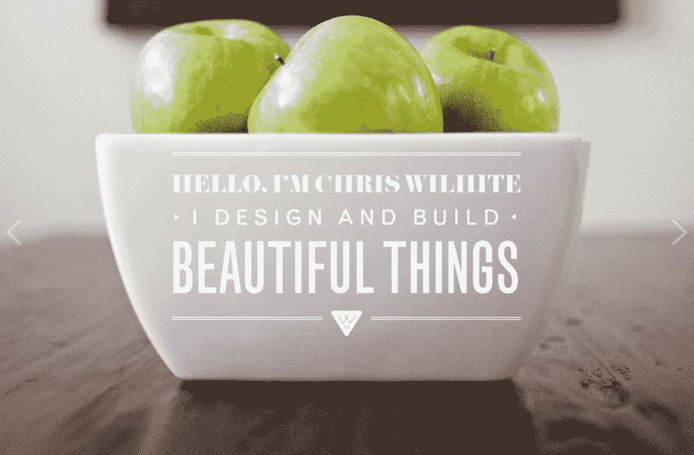

chriswilhitedesign.com


当然，这些都是泛泛而谈。现代印刷术已经发展，你也可以经常找到更多的风格的例子。但希望这能让你对什么是现代字体有一个大致的概念(以及为什么你会想使用它)。

[Get fancy with your ✨ fonts ✨ thanks to this list of 50+ modern options ⬇️Click to Tweet](https://twitter.com/intent/tweet?url=https%3A%2F%2Fkinsta.com%2Fblog%2Fmodern-fonts%2F&via=kinsta&text=Get+fancy+with+your+%E2%9C%A8+fonts+%E2%9C%A8+thanks+to+this+list+of+50%2B+modern+options+%E2%AC%87%EF%B8%8F)

## **如何将下载的字体上传到 WordPress**

从网上下载的自定义字体需要做一些额外的工作来运行，因为你不能像对谷歌字体这样的在线服务那样导入它们。相反，你需要手动[上传你的字体](https://kinsta.com/blog/local-fonts/)或者使用插件来完成这项工作。

但是在你上传之前，你需要首先确保你的字体可以上网。我们这样说是什么意思？嗯，并不是所有的字体都是网页安全的或者与所有的浏览器兼容的。

但这不是一个巨大的麻烦。只需使用免费的 [Webfont Generator](https://www.fontsquirrel.com/tools/webfont-generator) 工具就可以将你在网上找到的任何自定义字体转换成所有 web 浏览器都可读和可用的格式。

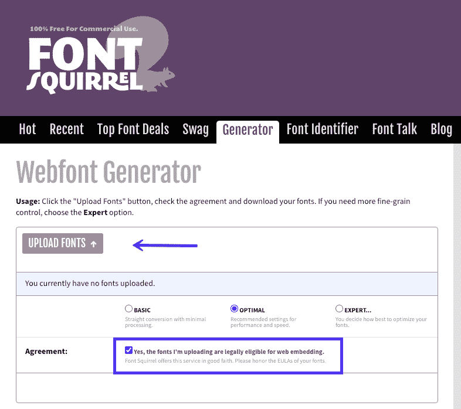

Turn any fonts into web-safe fonts


完成这一步对优化你的字体速度也有很大的帮助。然而，这还不是*所有*的全部。你也应该遵循一些提示来确保你的自定义字体不会消耗资源或者不必要地减慢你的站点的加载时间:

*   **检查性能** **。**使用 [GTmetrix](https://kinsta.com/blog/gtmetrix-speed-test/) ，监控 HTTP 请求的[数量](https://kinsta.com/blog/make-fewer-http-requests/)。如果有很多，这可能意味着你的网站使用的字体比你意识到的要多得多。我这里说的是自动安装在插件和主题旁边的字体(不是你手动添加的)。
*   检查你的分析。在这里，您可以看到哪些字体容器格式在您的网站上最常被访问。最常见的选择是 EOT、TTF、WOFF 和 WOFF2。当考虑支持哪些时，这可以帮助您确定优先支持哪些。
*   确保字体缓存在本地。又不是每隔一天就更新字体。这意味着字体可以安全地缓存在经常访问的浏览器中。随着时间的推移，这将限制 HTTP 请求的数量。

手动上传字体需要一点技术技巧，但对大多数网站所有者来说并不是遥不可及的。

1.  下载你选择的自定义现代字体(下面有很多例子)。
2.  保存你网站的[备份(包括所有内容和](https://kinsta.com/help/wordpress-backups/)[数据库](https://kinsta.com/knowledgebase/wordpress-database/))和/或使用[子主题](https://kinsta.com/blog/wordpress-child-theme/)进行以下更改。
3.  将. zip 格式的字体文件上传到文件夹 WP-content/themes/your-theme-name/fonts。如果没有“字体”文件夹，那就创建一个，然后上传你的。zip 字体文件。使用您选择的任何[FTP 客户端](https://kinsta.com/blog/best-ftp-clients/)来完成此操作。
4.  在 [WordPress 仪表盘](https://kinsta.com/knowledgebase/wordpress-admin/)中，导航到**外观>主题编辑器**并访问 [style.css 文件](https://kinsta.com/blog/wordpress-css/#wordpress-and-css)。您需要向该文件添加一个自定义代码片段。将适当的字体系列和 [URL](https://kinsta.com/knowledgebase/what-is-a-url/) 添加到代码片段中，然后单击**更新文件**。

```
@font-face { 
font-family: YOUR FONT NAME; 
src: url(http://sitename.com/wp-content/themes/themename/fonts/font-name.ttf); 
font-weight: normal; 
}
```

上面的代码将字体添加到您的站点中。接下来，你需要告诉 WordPress 应该在哪里使用字体。为此，再次打开 **style.css** 并使用以下代码片段:

```
.SITE ELEMENT {
font-family: "FONT NAME", Helvetica, sans-serif; 
}
```

在这个代码片段中，您需要确定您希望字体应用到站点的哪个方面，并在更新文件之前指定字体名称。

相反，如果你想跳过所有这些手动上传的东西，你可以使用插件将字体添加到 WordPress。实心选项包括[使用任何字体](https://wordpress.org/plugins/use-any-font/)。顾名思义，您可以使用它将任何自定义字体上传到您的站点，并将其分配给 CSS 元素。
T3】

## **2022 年将使用的 56 种最现代的字体**

既然你已经知道了如何优化和上传自定义字体，我们现在可以提供一个健康的现代字体和选项列表供你选择。

### 1.介绍

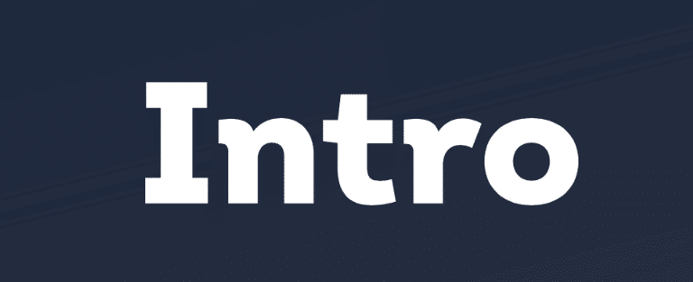

Intro


[Intro](https://www.fontfabric.com/fonts/intro/) 是一种标准外观的现代字体，提供粗体线条和演示，可轻松用于标题。该字体系列包括 72 种字体，从细到粗有 8 种不同的粗细，给您极大的灵活性。

### 2\. Komoda

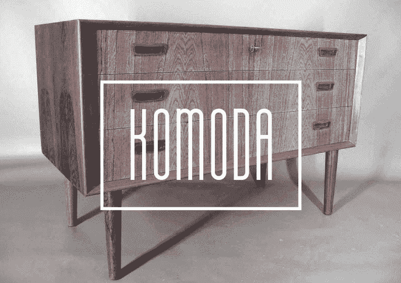

Komoda


另一个选择是 [Komoda](https://www.behance.net/gallery/11623957/KOMODA-Font) 。这个字体是浓缩的，看着超级有意思。这是所有的大写字母和无衬线的块状外观，每个字母的中线被抬高。它的连字说明了一点。这是标识的完美选择。

### 3.煽动

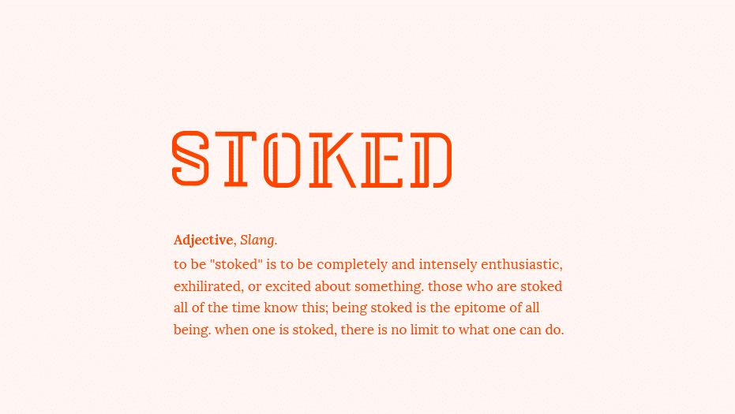

Stoked


[Stoked](https://www.behance.net/gallery/24597223/STOKED-(free-font)) 是另一个全大写字母系列，为标题和徽标提供了独特的外观。保持清晰的同时很有趣。它的定义特征是在每个字母上包含双线，以及给它一种模版外观的换行符。

### 4.经典玛丽莎

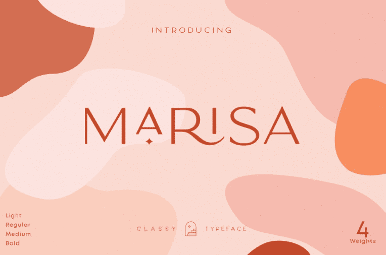

Marisa


还有优雅的玛丽莎。这种现代字体优雅流畅，为你的标识和[标题](https://kinsta.com/knowledgebase/add-code-wordpress-header-footer/)提供了一种更细更精致的字体选择。它有非常有趣的连字、替代符号和装饰，可以为你想要分享的任何文本添加更多的字符。

### 5 .中心

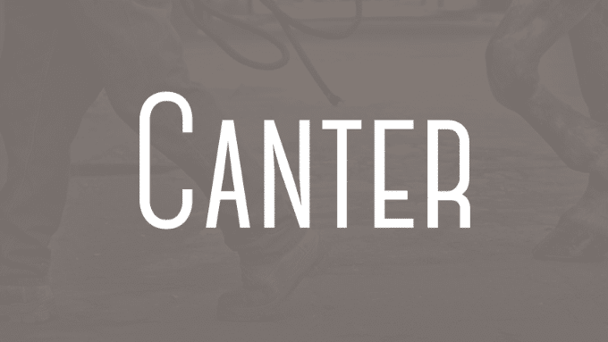

Canter


慢跑是另一个不错的选择。这是一种无衬线字体，特点是全部大写，并有压缩的间距。它还有六种不同的重量，包括一个 3D 选项和一个突出的投影选项。

### 6.幸运

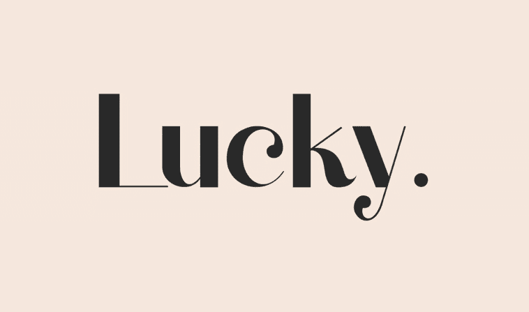

Lucky


[Lucky](https://dribbble.com/shots/8769790-Lucky-Modern-San-Serif-Font) 是另一种值得考虑的现代字体。这是另一个无衬线选择，可以很好地作为一个标志或标题。它还具有独特的编辑品质，可以很容易地应用于[杂志](https://kinsta.com/clients/open-plan-media/)和[在线出版物](https://kinsta.com/blog/how-to-start-a-fashion-blog/)。

### 7.扎菲尔


Zafir


Zafir 提供了另一种值得考虑的现代字体选择。在演示中它是超级小的。Zafir 是另一个全大写选项。这是一种带有曲线的衬线字体，整体看起来很有趣，可以很好地用于徽标和[标题](https://kinsta.com/blog/headline-analyzer/)。

### 8.小海湾

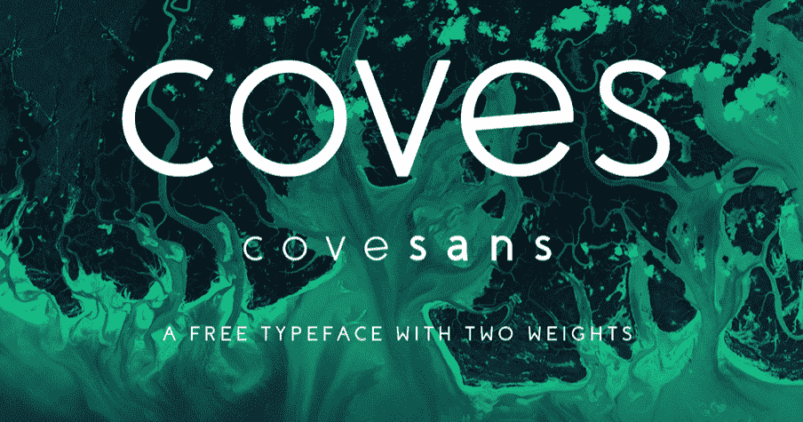

Coves


或者你可以使用[凹槽](https://www.behance.net/gallery/32715299/Coves-Free-Font)。它有两种重量，轻和大胆，并为您的最新项目提供了一个优雅和精简的字体选项。它也可以用于标准文本和标题。它确实是多用途的。

### 9\. Azonix

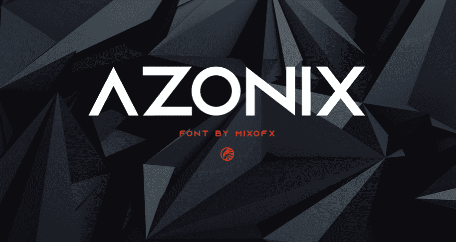

Azonix


Azonix 提供了另一种现代字体选择，这次是未来风格。这是一种强调几何外观的无衬线字体。它全是大写字母，看起来很容易被用在科幻电影的片头字幕中。

### 10.方舟

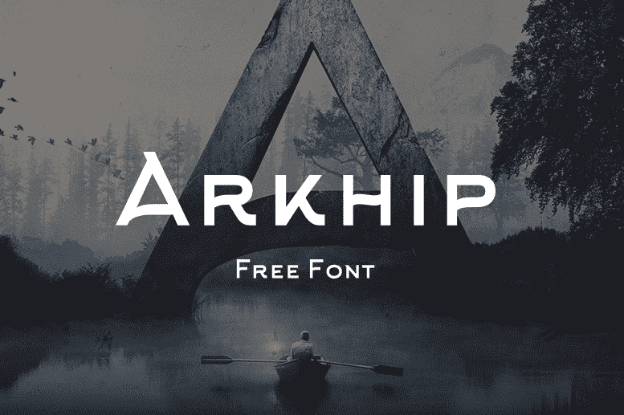

Arkhip


Arkhip 是另一个免费的字体选择，它保持了[的现代设计](https://kinsta.com/blog/web-design-trends/)，同时回忆起过去的时代。它使用俄罗斯印刷元素来创造一些现代和真正新的东西。

### 11.最好的

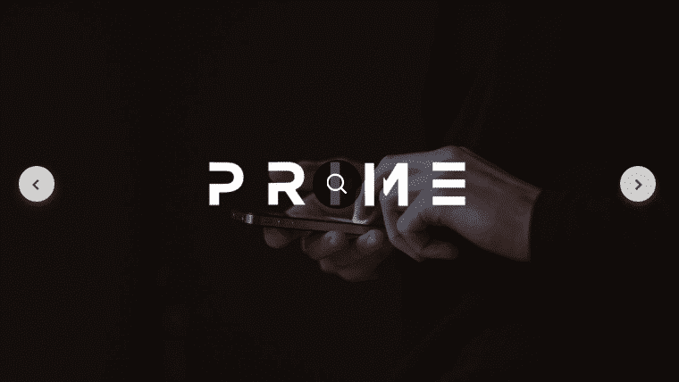

Prime


还有一种字体可以考虑，叫做 [Prime](https://creativemarket.com/MoonBandit/4269603-Prime-modern-bold-Sans-Serif-Font) 。这是一种现代的无衬线字体，具有粗体线条和整体未来感。它有几何角，看起来非常适合未来派或科技主题的网站。

### 12.地球仪

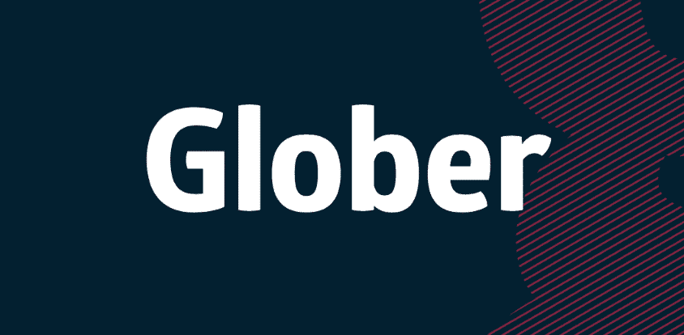

Glober


Glober 是另一种你应该看看的现代字体。该字体系列包括 18 种粗细字体，平均分为 9 种竖排字体和 9 种斜体字。这是一种 san serif 字体，易于阅读，易于应用于许多不同的情况，包括标题以及[正文](https://kinsta.com/blog/long-form-articles/)。

### 13.变得温柔

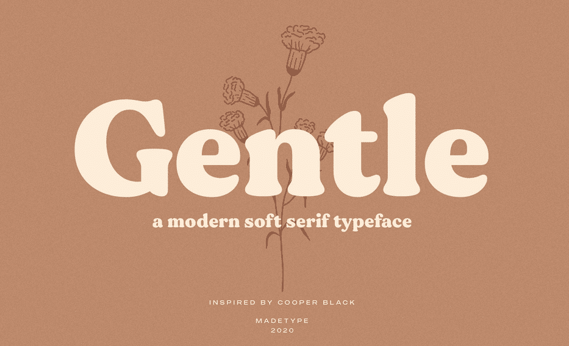

MADE Gentle


[造得温柔](https://www.behance.net/gallery/95687103/MADE-Gentle-Font)是另一种值得考虑的现代字体。它被认为是一种软衬线，灵感来自库珀黑色字体。这是一种大胆而圆润的[复古字体](https://kinsta.com/blog/retro-font/)，看起来让人想起 20 世纪 70 年代的旧书封面和标牌。

### 14.北欧的

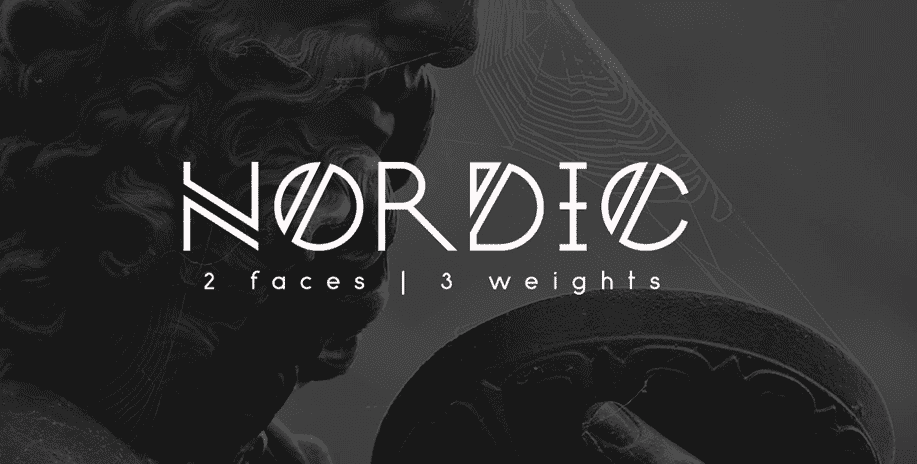

Nordic


[Nordic](https://www.behance.net/gallery/22172647/Nordic-(Free-Font)) 既现代又经典，提供两种字体和三种重量可供选择。这个设计的灵感来自挪威的符文，非常适合用在标题和标志上。

### 15.马达克

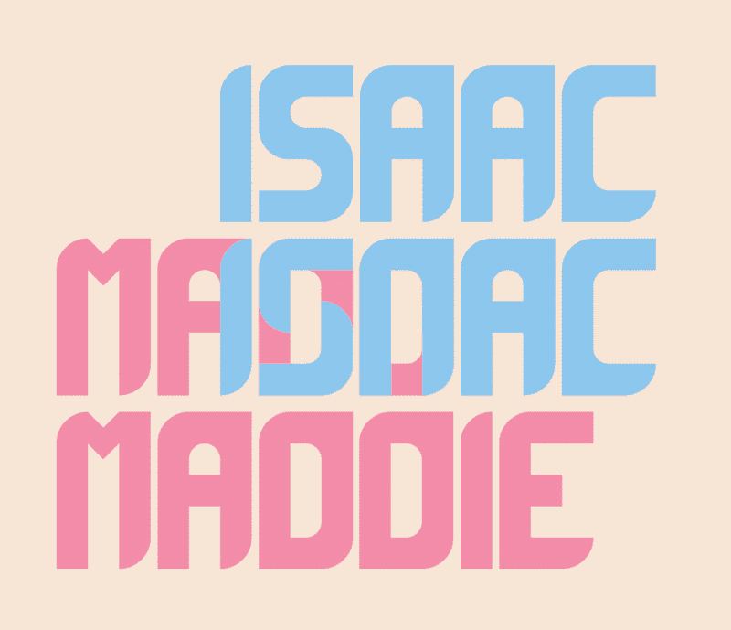

Maddac


Maddac 字体为你的网站提供了一个 T2 风格的选择。它是粗体，块状，无衬线。它设计现代，制作独特。每个字母对其设计的一个方面都有轻微的角度或倾斜，为等式提供了一点风格。

### 16.鳄鱼

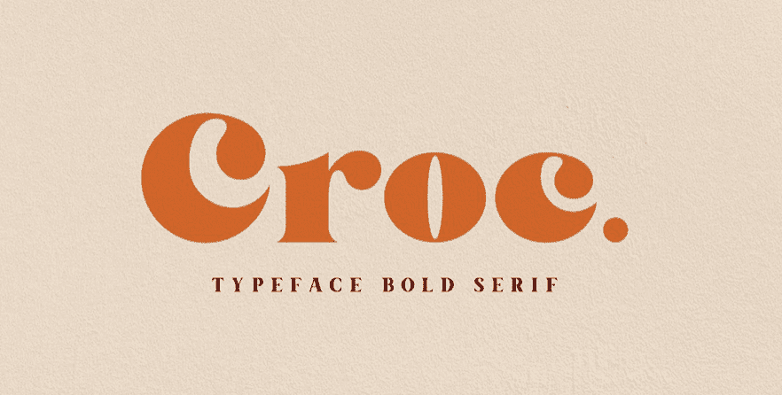

Croc


[Croc](https://www.behance.net/gallery/97966295/Croc-Typeface-Bold-Serif) 不就是这么酷的字体吗？这是一种大胆的衬线字体，具有标志性的风格，既怀旧又不失清新。

### 17.浅绿色

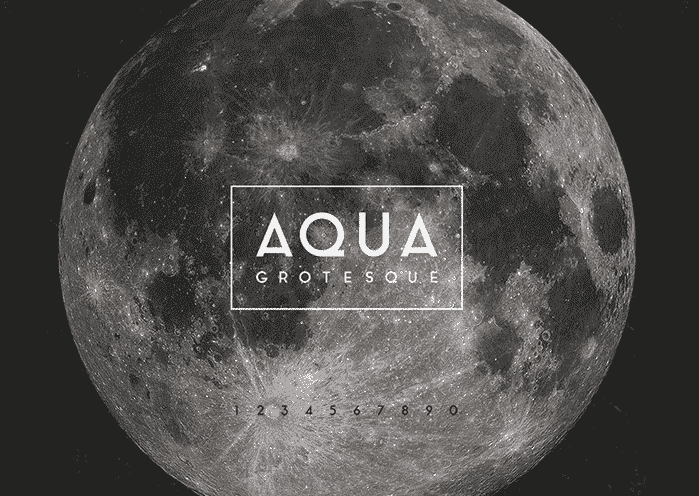

Aqua


Aqua 是你应该看看的另一种字体。这一个有它的新艺术品质，使它看起来永恒。这是一种大胆而简单的字体，它的特色是装饰和连字，使它从其他类似的字体中脱颖而出。

### 18.宣言

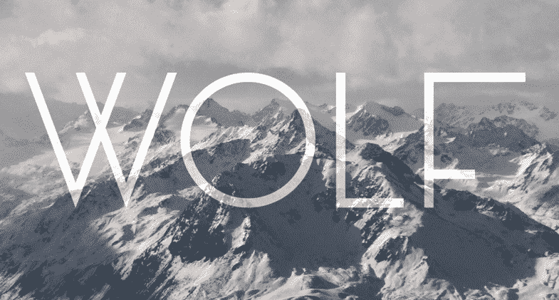

Manifesto


用[宣言](https://www.behance.net/gallery/21065399/MANIFESTO-vector-free-font)做一个大胆的声明。这种字体的灵感来自意大利理性主义运动，并具有明显的编辑性质。将其用于标题、徽标和标题。将其用于印刷和在线设计。在这方面，它确实是多功能的。

### 19.奥克尼群岛

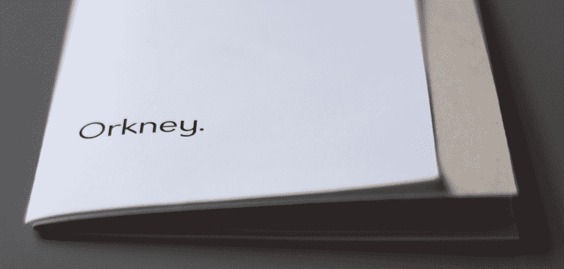

Orkney


奥克尼是一种可爱的看起来很专业的字体。字体是几何设计，可用于多种用途。将其用于标题或徽标。将其用于标准文本。在印刷媒体或[数字媒体](https://kinsta.com/blog/wordpress-media-library/)中使用。这里没有限制。

### 20.埃尔帕

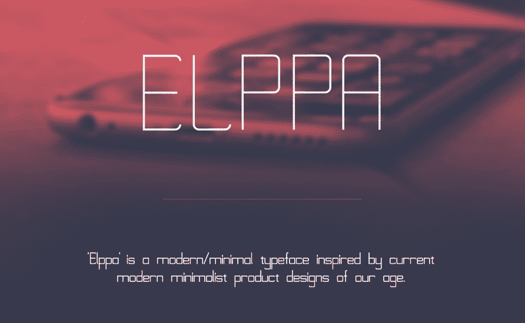

Elppa


Elppa 拥有迷人的多面未来外观。字体很小，但也捕捉到了一种太空时代的感觉。用它来印刷和[网页设计](https://kinsta.com/blog/web-design-best-practices/)。它适用于徽标和标题，可能不适用于正文，但肯定对图形等有用。

### 21.玉米

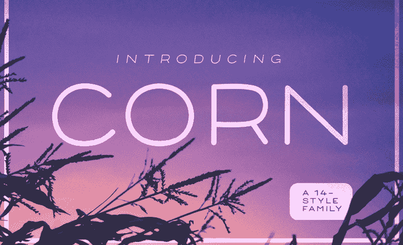

Corn


玉米是一种有趣的字体，有着圆角和农场风格的感觉。它由 14 种不同的样式组成，您可以立即开始将它们用于标题、页眉和徽标。如果您愿意，有些样式甚至可以用于正文。你可以用它来构建一个完整的网站设计。

### 22\. Koliko

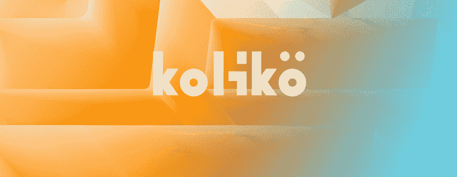

Koliko


或者你可以选择 Koliko T1，这是一种非常有趣的字体，具有广泛的吸引力。它有三种风格，每一种都包含了形式和功能的完美结合。

### 23.怪癖

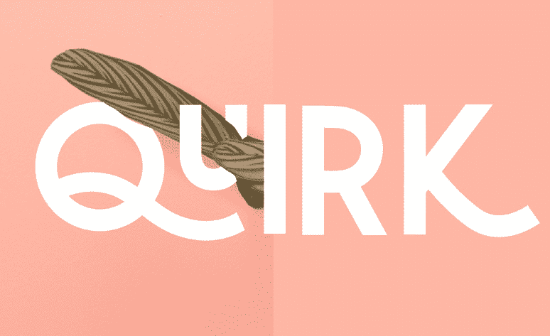

Quirk


古怪的字体实际上是一种看起来很古怪的字体。它的名字是个不错的选择。这是一种全大写字体，包括有趣的连字和可堆叠元素。

### 24.法语

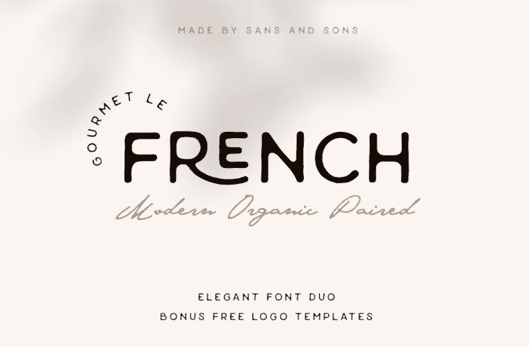

Le French


Le French 是一种复杂的字体选择，尤其是如果你想要复制那种复古的法国咖啡馆风格。菜单和[美食相关网站](https://kinsta.com/blog/how-to-start-a-food-blog/)的绝佳选择。它也可以用于标题、页眉、徽标和正文。

## 注册订阅时事通讯


### 想知道我们是怎么让流量增长超过 1000%的吗？

加入 20，000 多名获得我们每周时事通讯和内部消息的人的行列吧！

[Subscribe Now](#newsletter)

### 25.慕尼黑

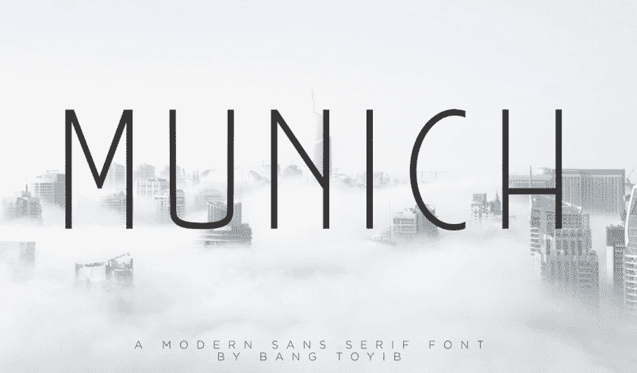

Munich


慕尼黑是一个可爱的无衬线字体选择，这将是一个标志或标题图形的绝佳选择。它巍然屹立，气势磅礴，不具威胁性。

### 26.西北

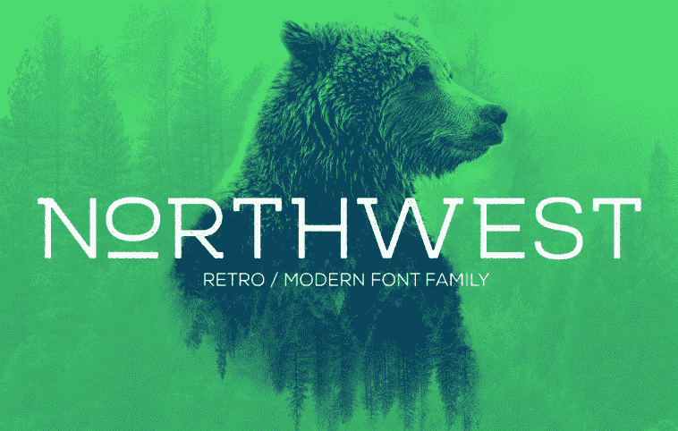

Northwest


[西北](https://creativemarket.com/iamtirado/1171916-NORTHWEST-RETROMODERN-FONT-FAMILY)是一种现代风格的字体，有复古的感觉。这让人想起运动装备标志和户外杂志标题。有了方形衬线和装饰元素，这种字体可以很好地用于任何户外主题的内容。

### 27.莫德卡

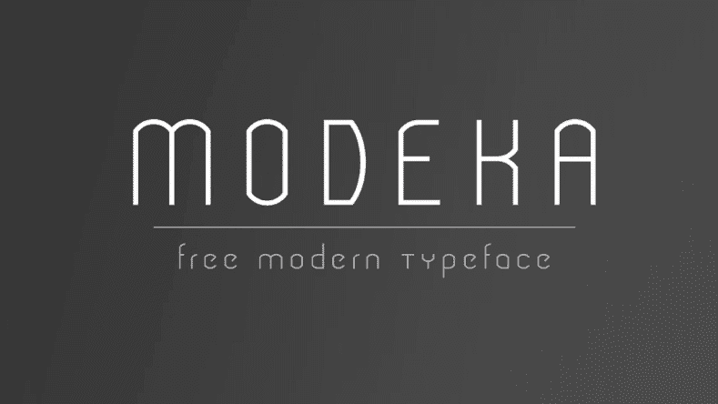

Modeka


Modeka 四四方方的，现代的，说实话超级酷。这是一个现代的选择，可以适应多种用途。每个字母都添加了角度，这提供了一种独特的风格，可能正好适合你的下一个项目。

### 28.放弃

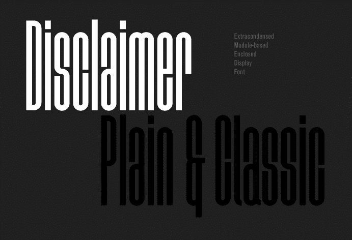

Disclaimer


[免责声明](https://www.behance.net/gallery/15024825/Disclaimer-free-font)是一种窄而粗的字体选择，非常适合各种用途。它有一个超级浓缩的风格，使字母挺立，气势磅礴。这对于页眉或标题来说非常有用。

### 29.第五大道

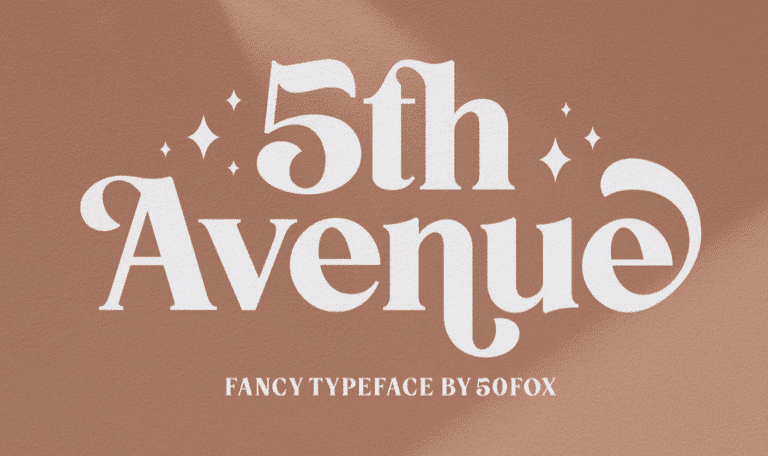

5th Avenue


第五大道非常别致，古典气息非常适合官方标志和品牌。这是一种带有衬线的粗体字体，由于大量的替代字母增加了风格和兴趣，因此非常突出。

### 30.魁克斯

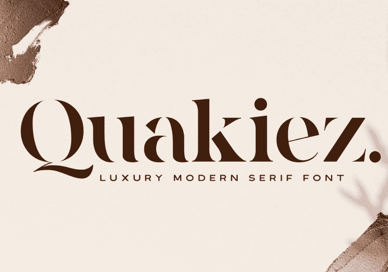

Quakiez


Quakiez 是另一个现代字体选择，为我们的列表提供了衬线选项。它的设计考虑到了奢华，但仍然保留了极简主义的元素。它有两种样式，可用于徽标、标题、标题等。

### 31.现代户外

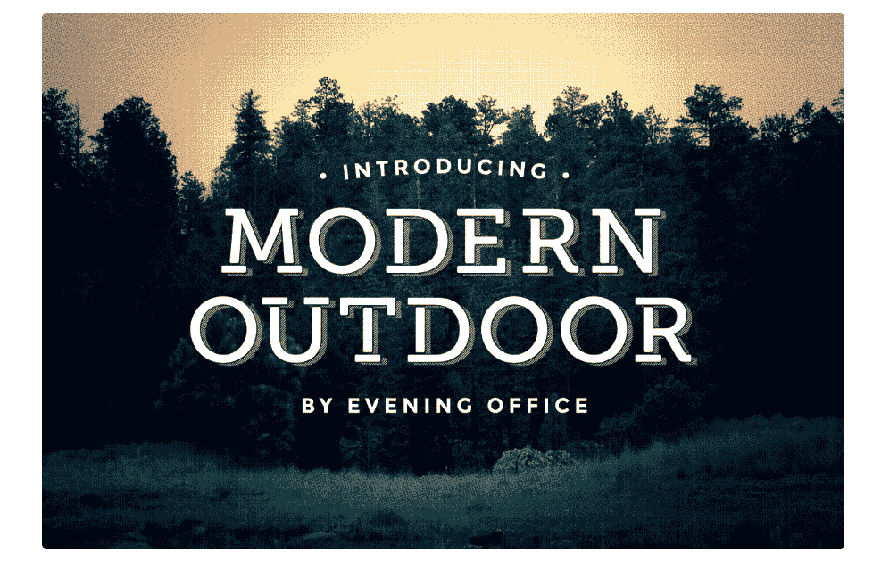

Modern Outdoor


或者你可以选择[现代户外](https://creativemarket.com/TypeCargo/519363-Modern-Outdoor-Font)并且一看到就立即调用露营和户外。这种字体非常适合标题、页眉和徽标，并且会对海报产生真正的影响。它需要关注，漂亮的帽子进一步保证了它的户外感觉。

### 32.双曲线

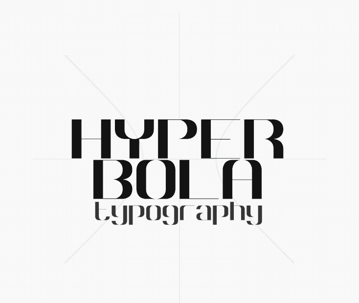

[双曲线](https://www.behance.net/gallery/801635/Hyperbola)圆润，充满未来感。事实上，它看起来非常太空——从好的方面来说。这种字体有圆形的柜台，同时保持了整体的盒子形状。

### 33.拳击

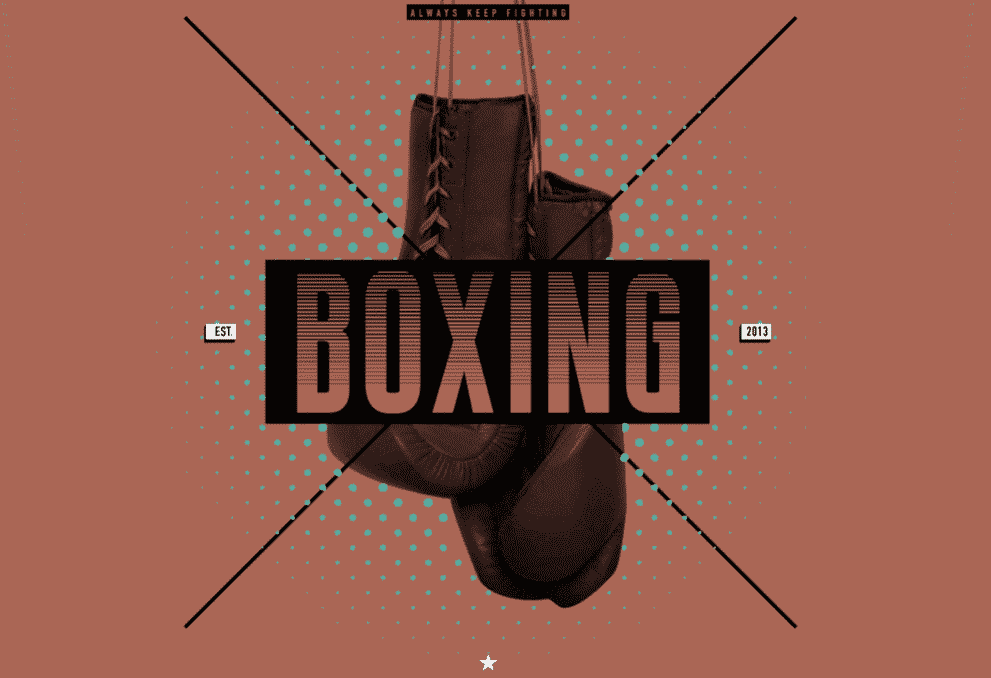

Boxing


[Boxing](https://www.behance.net/gallery/11857709/BOXING-Free-Font) 字体方方正正、干净利落，非常适合标题、标题和标志。都是大写的，高大上的，看着挺有意思的。最重要的是，它非常实用，可以以无数种方式重新利用。

### 34\. Sonder

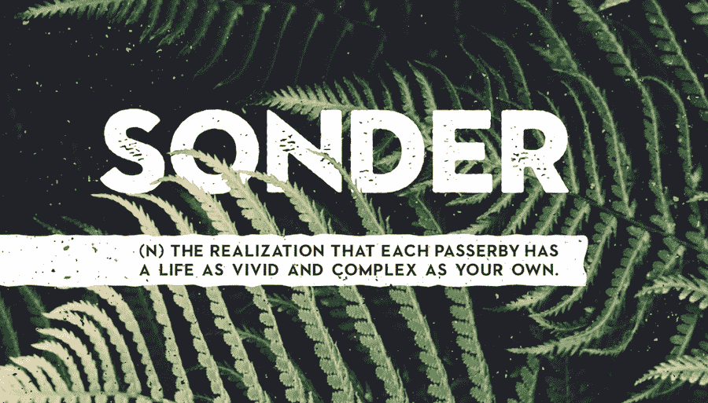

Sonder


Sonder 是另一种多面字体，真的。它带有一个平板和无衬线字体选项。它有多种重量以及规则和粗糙的风格。粗糙风格的特点是字母之间有一些间隙，营造出质朴自然的外观。

### 35.龙目岛

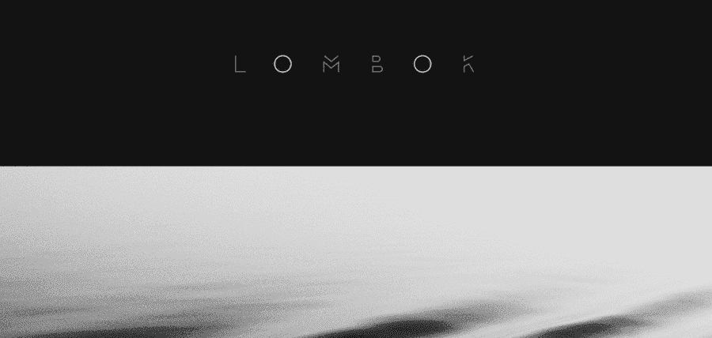

Lombok


Lombok 是一种非常优雅的细字体。这是一个无衬线选项，带有几何元素，使其脱颖而出，显得非常独特。这是页眉、徽标和标题的理想选择。

厌倦了慢热的主持人？Kinsta 的设计考虑了速度和性能。[查看我们的计划](https://kinsta.com/plans/?in-article-cta)

### 36.地区

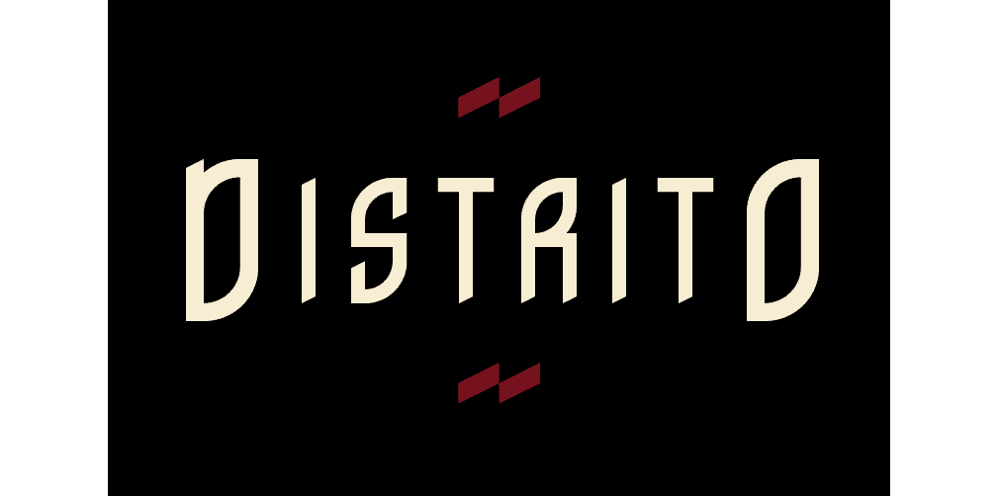

Distrito


[Distrito](https://www.dafont.com/distrito-caps.font) 是一种风格独特的全大写字体。每个字母稍微倾斜，提供了一个独特的外观，可以很好地翻译用于标志和标题。这也是一种受哥伦比亚模块化设计启发的全大写字体。

### 37.副翼

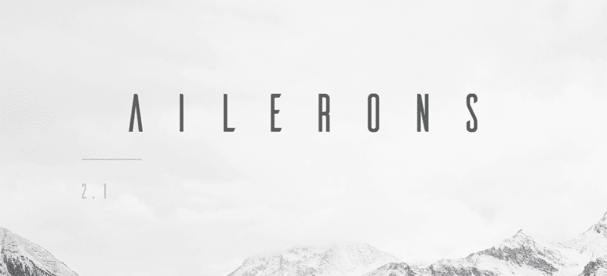

Ailerons


副翼看起来像是外星人标志上出现的字体。它很好地实现了这种美感。它是无衬线和全大写的，无论你把它放在哪里都会产生影响，尽管标题和页眉是最好的。

### 38.埃特纳

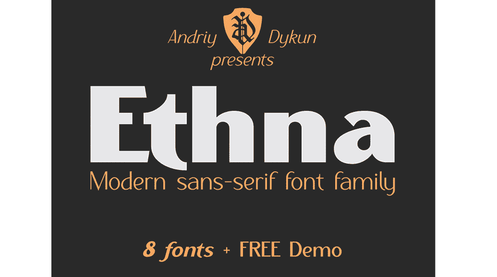

Ethna


Ethna 外观经典，但又不失现代风格。这是一个受人文主义设计启发的无衬线字体系列，很好地将复古和现代设计元素结合起来，创造出新的东西。这个在任何用例中都能很好地工作。

### 39.罗亚路

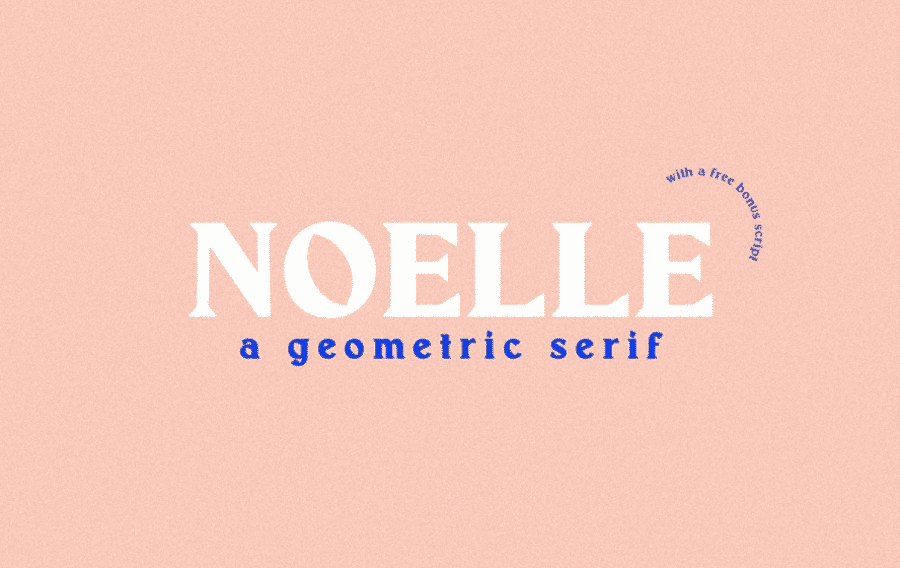

Noelle


Noelle 是一种几何衬线字体，旨在给人留下积极的第一印象。它的设计非常简约，适合任何行业的标题和页眉。它有一些复古元素，但看起来仍然很新鲜。在网上或书面上使用它。另外，它附带了一个脚本字体作为奖励。

### 40.后果

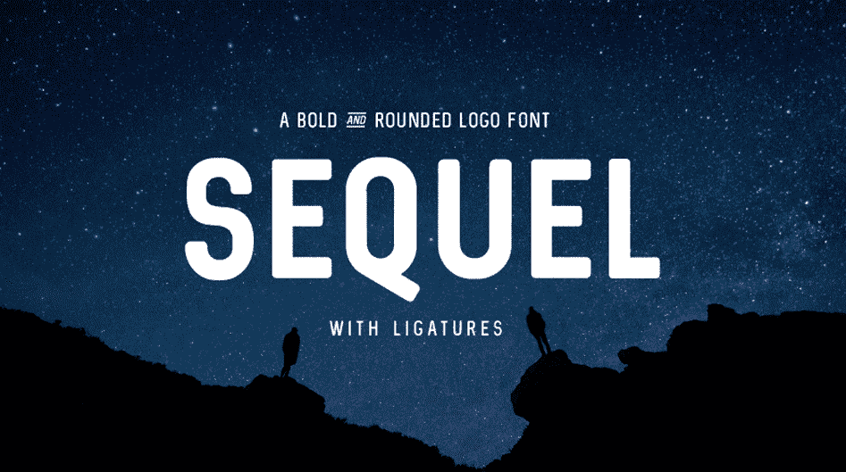

Sequel


[Sequel](https://www.behance.net/gallery/54422287/Sequel-Free-Modern-Font) 是一种圆形字体，非常适合标识和标题。最重要的是，它配有一系列连字，为您用它们创作的任何东西提供了风格和趣味。这里的设计很大胆，但不气派。

### 41.高等级的；级别较高的；较重要的


[更高的](https://www.behance.net/gallery/6797841/Higher-Free-Font)是另一种精致的字体选择，提供了经典的外观。这种全大写字体非常简洁，要求很高，可以为你使用它的任何东西提供即时的风格。

### 42.毫微；纤（10 的负九次方）

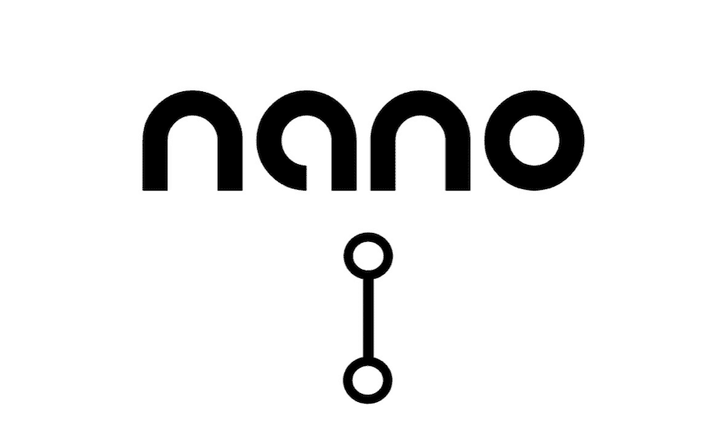

Nano


Nano 是一种非衬线字体，具有未来主义的外观，并且全部是小写字母，这使它成为这个列表中的一个独特选项。字母本身非常现代，易于识别，是标识和其他品牌材料的绝佳选择。然而，它最适合短短语，因为长句子可能有点难以辨认。

### 43.我叫 joliet

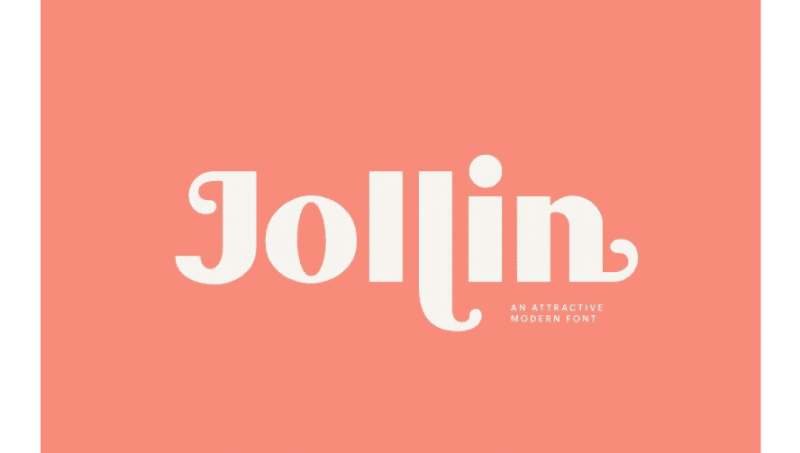

Jollin


Jollin 是一种现代字体，在一些字母上有卷曲的线索，看起来很厚实。这种无衬线字体有常规和斜体版本，包括各种替代字母，因此您可以根据自己的心情让您的文本看起来更简单或更花哨。

### 44.现象


Phenomena


[现象](https://www.fontfabric.com/fonts/phenomena/)是一种窄而块状的字体，边缘呈圆形。它是一种声明，可以很容易地用于标题、标志或页眉。它有 7 种不同的风格，从细到粗，提供了大量的标准文本使用机会。

### 45.口径

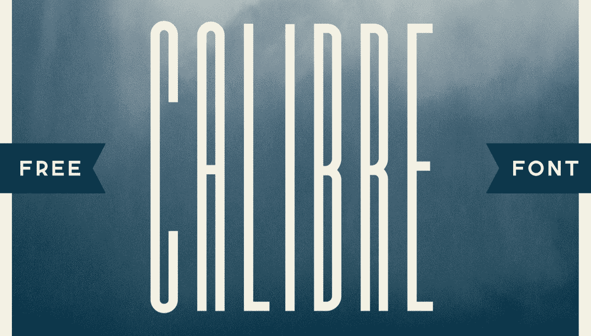

Calibre


Calibre 是一种超级浓缩字体，如果你愿意的话，它可以盖过[你的内容](https://kinsta.com/learn/content-marketing/)——以一种好的方式。这是一个全大写的选项，另外还包括数字、字形和[西文字符](https://kinsta.com/blog/western-fonts/)。

### 46.星期天

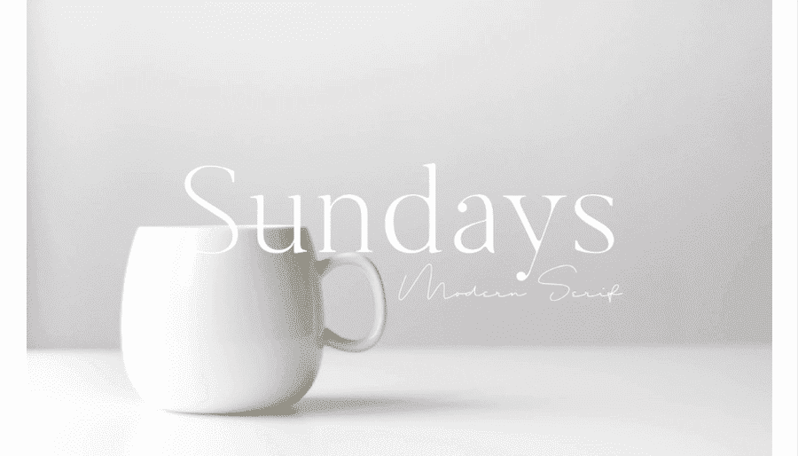

Sundays


Sundays 是一种衬线字体，绝对属于当今时代，但也有一种不可否认的经典感。它比经典的类似字体更薄、更弯曲，并且具有适合杂志标题、网站徽标、页眉等的样式。

### 47.基础

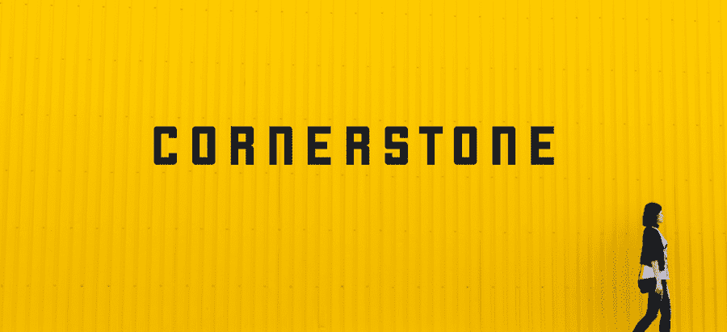

Cornerstone


基石是另一种块状字体，它提供了模块化设计，可以在从徽标到标题的许多不同应用中工作。

### 48.有一天

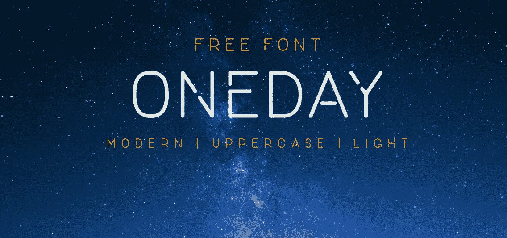

One Day


[有一天](https://www.behance.net/gallery/23792563/ONE-DAY-Free-Font)是一种细字体，带有有趣的断开线，使其独一无二。这是另一种全大写字体，具有轻薄的风格。它包括数字和字形，感觉几何而不太方方正正。

### 49\. Kollektif

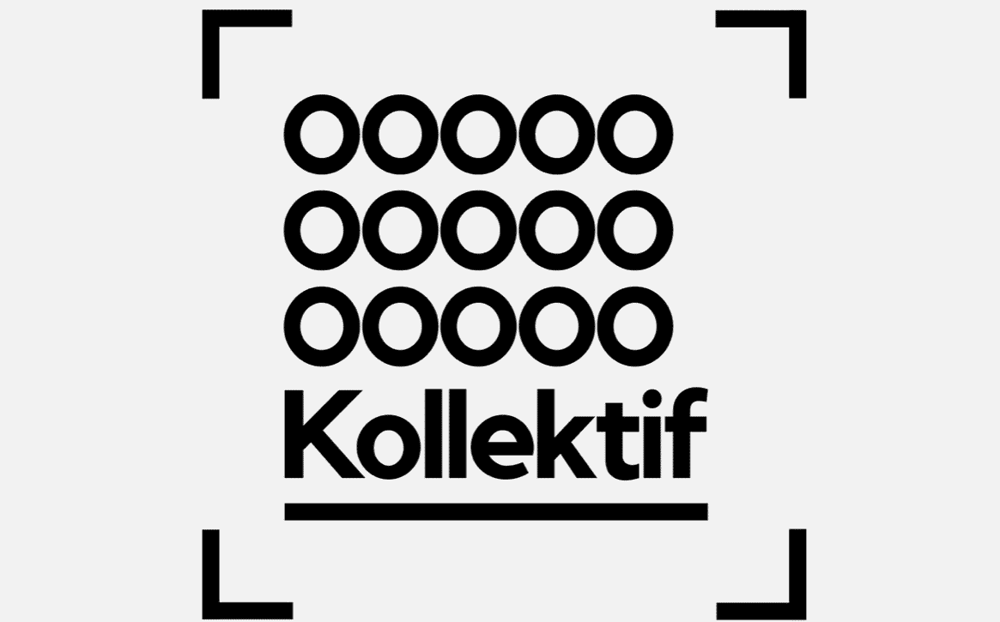

Kollektif


Kollektif 是一种古典现代字体，可以有多种用途。它的设计是几何的，有两种重量。它也是为印刷和网络使用而优化的。

### 50.乡愁

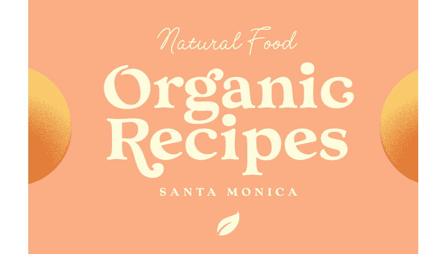

Nostalgia


然后是[怀旧](https://dribbble.com/shots/10852574-Nostalgia-Modern-Font)，一种具有足够复古吸引力的现代字体，让人感觉仿佛是几十年前创作的。它包括 3 种字体，以及替代字形，连字和花。这将是一个伟大的选择标志，标题，海报，或邀请函。

### 51.埃利夏

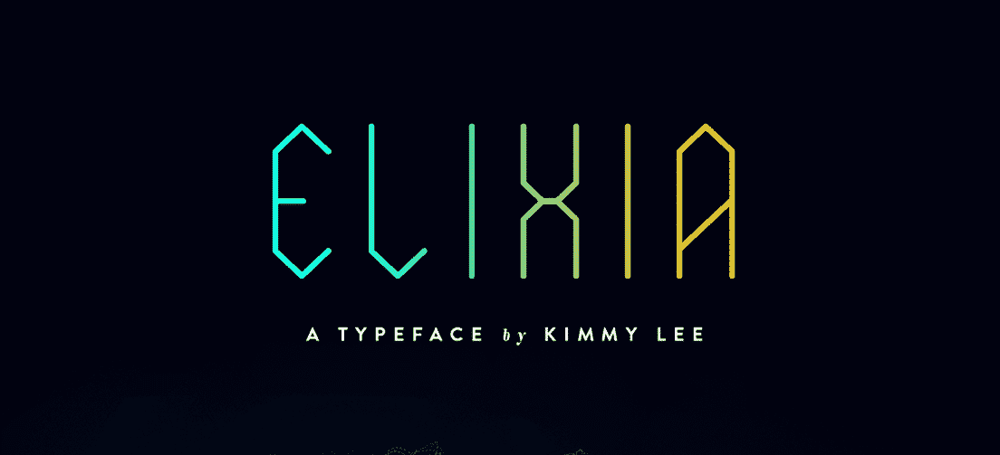

Elixia


Elixia 有着适合炼丹师巢穴的缥缈外观。它是几何图形，每个字母上都有额外的线角，提供了独特的风格。

### 52.鲑

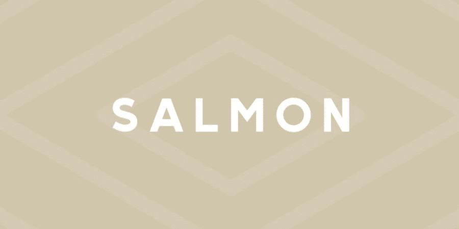

Salmon


或者你可以选择三文鱼。这种无衬线字体是大胆和最小的。它是标题、徽标和页眉的理想选择。这是一个全大写的设计，包括一个填充和轮廓的版本，可以很好地搭配在一起。

### 53.Thinoo

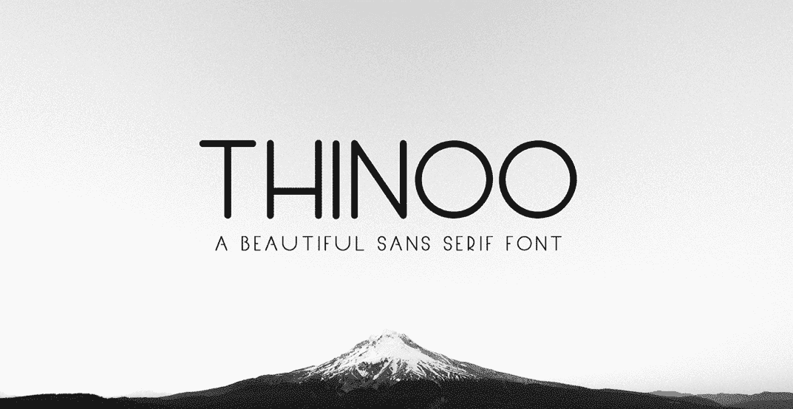

Thinoo


[Thinoo](https://www.behance.net/gallery/80029995/THINOO-FREE-MODERN-FONT) 是另一种 san serif 字体。它有一个薄和大胆的风格，并包括所有的字母风格，包括数字，符号和标点符号。既专业又干净。简单却引人注目。这一款适用于任何类型的网站和印刷材料。

### 54.热爱夏天

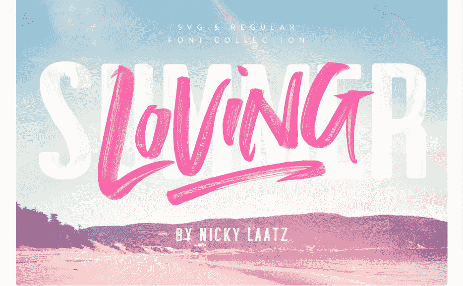

Summer Loving


或者你可以使用[夏日爱好](https://creativemarket.com/Nickylaatz/2666916-Summer-Loving-Font-Collection)，这是一种超级有趣的现代字体，包括多种字体样式，这样你就可以只用一种字体来创建一个完整的设计。它带有 sans 字体和画笔细节，可以立即为您的项目添加维度。它还包括连字和替代字母。

### 55.Silverfake

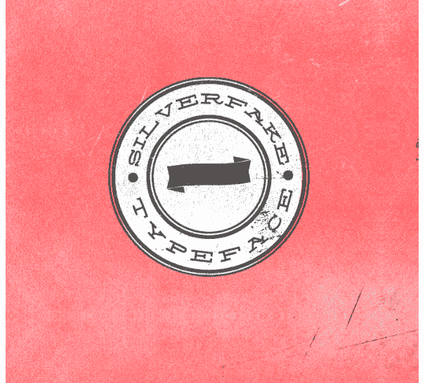

Silverfake


Silverfake 为标题、徽标、页眉和印刷材料提供宽间距衬线字体选项。举例来说，这个作为 t 恤标志会很好看。

### 56.维也纳

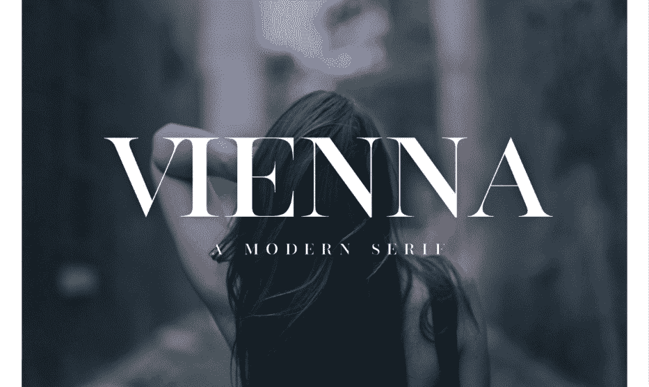

Vienna


最后，还有维也纳。这种现代字体是一种衬线字体，具有杂志封面上使用的经典字体的所有吸引力，并经过足够的修改以迎合当今的审美。它很简单，包括所有大写字母、数字和标点符号。

[If modern fonts are just what your website needs 📝, you'll want to check out this guide to 50+ fresh options✨Click to Tweet](https://twitter.com/intent/tweet?url=https%3A%2F%2Fkinsta.com%2Fblog%2Fmodern-fonts%2F&via=kinsta&text=If+modern+fonts+are+just+what+your+website+needs+%F0%9F%93%9D%2C+you%27ll+want+to+check+out+this+guide+to+50%2B+fresh+options%E2%9C%A8&hashtags=SiteDesign%2CWPTips)

## **总结**

在你的网站上使用自定义字体有很多原因。无论你是想更好地适应你的品牌，还是想让你的内容在所有浏览器上都更具可读性，上传你自己的 T2 现代风格字体是值得的。

即便如此，这个过程初看起来可能令人望而生畏。你必须找到一种字体，下载它，把它放到一个. zip 文件中，然后用一个 [FTP 客户端](https://kinsta.com/blog/best-ftp-clients/)把它上传到你网站上的正确目录。你需要将代码片段粘贴到你的主题的 CSS 文件的[的适当区域。你可以选择手动或者通过使用插件来完成(或者你可以](https://kinsta.com/blog/wordpress-css/)[雇佣一个开发者](https://kinsta.com/blog/hire-wordpress-developer/))。

然而，无论你如何处理这个过程，你都可以放心，最终的结果将是时尚的，并为你的网站的整体外观增添特色。希望我们在这里收集的现代字体能够帮助你找到适合你网站的字体。无论是粗或细，圆或粗，点缀或平原，你选择的字体将产生影响！

(建议阅读:[如何隐藏 WordPress](https://kinsta.com/knowledgebase/hide-page-title-wordpress/) 中的页面和帖子标题)

* * *

让你所有的[应用程序](https://kinsta.com/application-hosting/)、[数据库](https://kinsta.com/database-hosting/)和 [WordPress 网站](https://kinsta.com/wordpress-hosting/)在线并在一个屋檐下。我们功能丰富的高性能云平台包括:

*   在 MyKinsta 仪表盘中轻松设置和管理
*   24/7 专家支持
*   最好的谷歌云平台硬件和网络，由 Kubernetes 提供最大的可扩展性
*   面向速度和安全性的企业级 Cloudflare 集成
*   全球受众覆盖全球多达 35 个数据中心和 275 多个 pop

在第一个月使用托管的[应用程序或托管](https://kinsta.com/application-hosting/)的[数据库，您可以享受 20 美元的优惠，亲自测试一下。探索我们的](https://kinsta.com/database-hosting/)[计划](https://kinsta.com/plans/)或[与销售人员交谈](https://kinsta.com/contact-us/)以找到最适合您的方式。