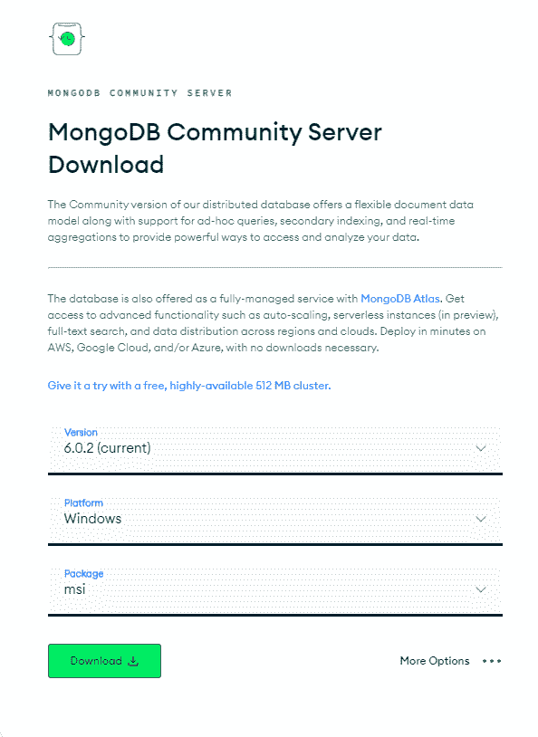
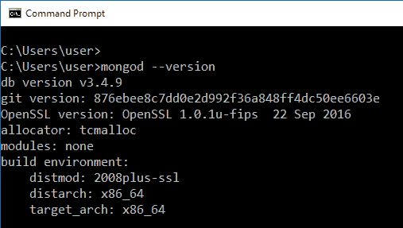
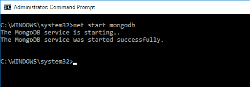
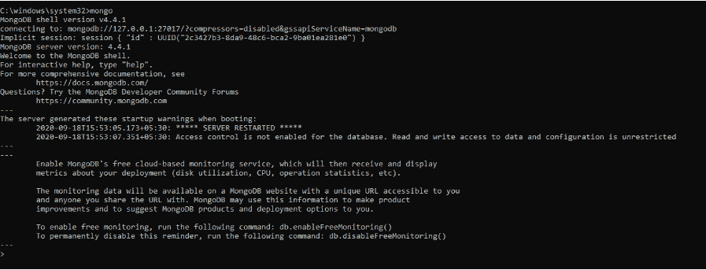
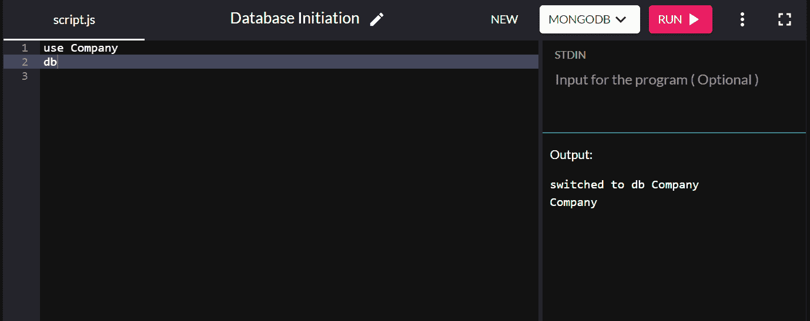
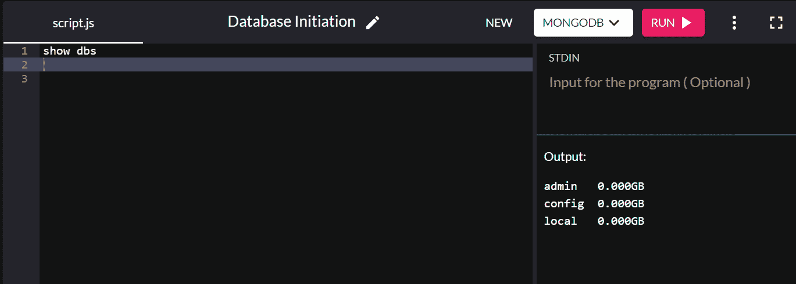
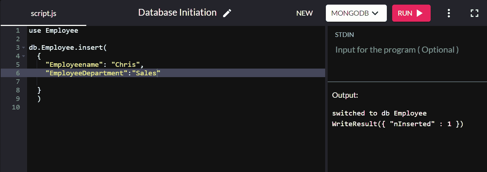
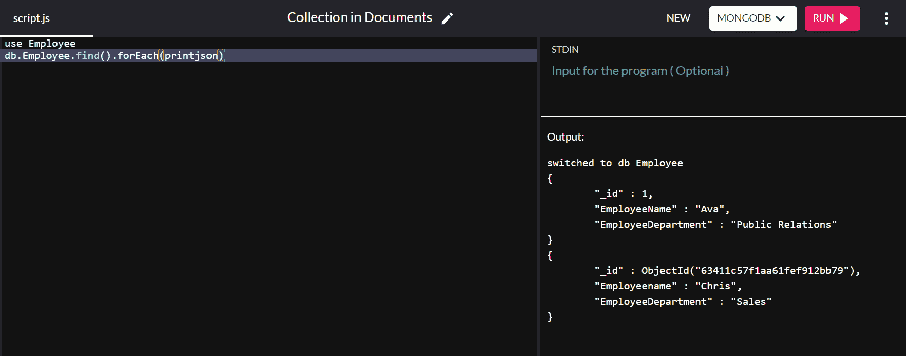
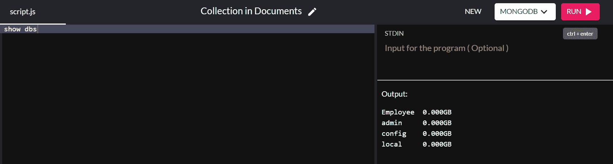
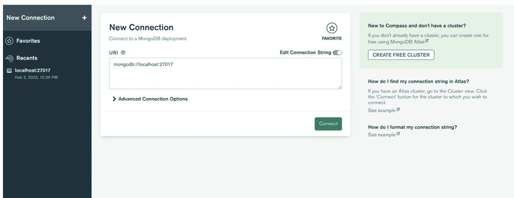

# 如何创建 MongoDB 数据库:需要了解的 6 个关键方面

> 原文：<https://kinsta.com/blog/mongodb-create-database/>

根据您对软件的需求，您可以优先考虑灵活性、可伸缩性、性能或速度。因此，开发人员和企业在选择他们需要的数据库时经常感到困惑。如果您需要一个提供高度灵活性和可伸缩性的数据库，以及用于客户分析的数据聚合，MongoDB 可能是您的最佳选择！
[在这本有用的指南中了解更多关于 MongoDB 数据库的结构以及如何创建、监控和管理您的数据库🛠 点击发推文](https://twitter.com/intent/tweet?url=https%3A%2F%2Fkinsta.com%2Fblog%2Fmongodb-create-database%2F&via=kinsta&text=Learn+more+about+the+structure+of+the+MongoDB+database+and+how+to+create%2C+monitor%2C+and+manage+your+database+in+this+helpful+guide+%F0%9F%9B%A0&hashtags=MongoDB%2CDatabase)
在本文中，我们将讨论 MongoDB 数据库的结构以及如何创建、监控和管理您的数据库！让我们开始吧。

## MongoDB 数据库是如何构造的？

MongoDB 是一个无模式的 NoSQL 数据库。这意味着您不像为 SQL 数据库那样为表/数据库指定结构。
 您知道 NoSQL 数据库实际上比[关系型](https://kinsta.com/blog/mongodb-vs-mysql/)数据库更快吗？这是由于索引、分片和聚合管道等特征。MongoDB 还以其快速的查询执行而闻名。这就是谷歌、丰田和福布斯等公司青睐它的原因。

下面，我们将探讨 MongoDB 的一些关键特征。

### 文档

MongoDB 有一个文档数据模型，将数据存储为 JSON 文档。文档自然地映射到应用程序代码中的对象，使得开发人员使用起来更加简单。

在关系数据库表中，必须添加一列才能添加新字段。JSON 文档中的字段就不是这样了。JSON 文档中的字段可能因文档而异，所以它们不会被添加到数据库中的每条记录中。

文档可以存储像数组这样的结构，这些结构可以嵌套起来表达层次关系。此外，MongoDB 将文档转换成二进制 JSON (BSON)类型。这确保了更快的访问和对各种数据类型的支持，如字符串、整数、布尔数等等！


### 副本集

当您在 MongoDB 中创建新数据库时，系统会自动为您的数据创建至少 2 个副本。这些副本被称为“副本集”，它们不断地在它们之间复制数据，确保提高数据的可用性。它们还提供系统故障或计划维护期间的停机保护。

### 收集

集合是与一个数据库相关联的一组文档。它们类似于关系数据库中的表。

然而，集合要灵活得多。首先，它们不依赖于模式。其次，文档不必是相同的数据类型！

要查看属于一个数据库的集合列表，使用命令`listCollections`。

### 聚合管道

你可以使用这个框架来组合几个操作符和表达式。它很灵活，因为它允许您处理、转换和分析任何结构的数据。

正因为如此，MongoDB 允许跨 150 个操作符和表达式的快速数据流和特性。它还有几个阶段，比如 Union 阶段，可以灵活地将多个集合的结果放在一起。

### 指数

您可以索引 MongoDB 文档中的任何字段，以提高效率和查询速度。索引通过扫描索引来限制检查的文档，从而节省了时间。这难道不比阅读集合中的每个文档好得多吗？

您可以使用各种索引策略，包括多个字段的复合索引。例如，假设您有几个文档，在不同的字段中包含员工的名字和姓氏。如果希望返回名字和姓氏，可以创建一个同时包含“姓氏”和“名字”的索引。这比在“姓”上有一个索引，在“名”上有另一个索引要好得多。

您可以利用 Performance Advisor 之类的工具来进一步了解哪个查询可以从索引中受益。

### 分片

分片将单个数据集分布在多个数据库中。然后，该数据集可以存储在多台机器上，以增加系统的总存储容量。这是因为它将较大的数据集分割成较小的块，并将它们存储在不同的数据节点中。

MongoDB 在集合级别对数据进行分片，将集合中的文档分布到集群中的各个分片上。这通过允许架构处理最大的应用程序来确保可伸缩性。

## 如何创建 MongoDB 数据库

您需要首先安装适合您的操作系统的 MongoDB 软件包。进入'[下载 MongoDB 社区服务器](https://www.mongodb.com/try/download/community)'页面。从可用选项中，选择最新的“版本”、“打包”格式作为 zip 文件，选择“平台”作为您的操作系统，然后单击“下载”，如下所示:



MongoDB community server download process. (Image source: [MongoDB Community Server](https://www.mongodb.com/try/download/community2))


这个过程非常简单，所以您很快就可以在系统中安装 MongoDB 了！

一旦你完成了安装，打开你的命令提示符并输入`mongod -version`来验证它。如果您没有得到以下输出，而是看到一串错误，您可能需要重新安装它:



Verifying MongoDB version. (Image source: [configserverfirewall](https://www.configserverfirewall.com/mongodb/check-mongodb-version/))


### 使用 MongoDB Shell

在我们开始之前，请确保:

*   您的客户端具有传输层安全性，并且在您的 IP [允许列表](https://docs.atlas.mongodb.com/security/ip-access-list/)中。
*   您在所需的 MongoDB 集群上有一个用户帐户和密码。
*   您已经在设备上安装了 MongoDB。

#### 步骤 1:访问 MongoDB Shell

要访问 MongoDB shell，请键入以下命令:

```
net start MongoDB
```

这将产生以下输出:



MongoDB server initialization. (Image source: [c-sharpcorner](https://www.c-sharpcorner.com/article/configure-a-windows-service-for-mongodb/))


前面的命令初始化了 MongoDB 服务器。要运行它，我们必须在命令提示符下键入`mongo`。



Running MongoDB server. (Image source: [bmc](https://www.bmc.com/blogs/mongodb-create-database/))


在 MongoDB shell 中，我们可以执行命令来创建数据库、插入数据、编辑数据、发出管理命令和删除数据。

#### 步骤 2:创建数据库

与 SQL 不同，MongoDB 没有数据库创建命令。取而代之的是一个名为`use`的关键字，它切换到一个指定的数据库。如果数据库不存在，它将创建一个新的数据库，否则，它将链接到现有的数据库。

例如，要启动名为“公司”的数据库，请键入:

```
use Company
```



Creating database in MongoDB.


您可以输入`db`来确认您刚刚在系统中创建的数据库。如果您创建的新数据库弹出，则您已经成功地连接到它。

如果您想检查现有的数据库，输入`show dbs`，它将返回您系统中的所有数据库:



Viewing databases in MongoDB.


默认情况下，安装 MongoDB 会创建管理、配置和本地数据库。

您是否注意到我们创建的数据库没有显示出来？这是因为我们还没有将值保存到数据库中！我们将在数据库管理部分讨论插入。

### 使用 Atlas 用户界面

您还可以开始使用 MongoDB 的数据库服务 Atlas。虽然您可能需要付费才能使用 Atlas 的一些功能，但大多数数据库功能都可以通过免费层获得。免费层的特性足以创建一个 MongoDB 数据库。

在我们开始之前，请确保:

1.  你的 IP 在黑名单上。
2.  您在想要使用的 MongoDB 集群上有一个用户帐户和密码。

要用 AtlasUI 创建一个 MongoDB 数据库，打开一个浏览器窗口并登录到[https://cloud.mongodb.com](https://cloud.mongodb.com/)。从你的集群页面，点击**浏览收藏**。如果集群中没有数据库，您可以通过点击**添加我自己的数据**按钮来创建您的数据库。

提示将要求您提供数据库和集合名称。给它们命名后，点击**创建**，就大功告成了！您现在可以输入新文档或使用驱动程序连接到数据库。

## 管理您的 MongoDB 数据库

在这一节中，我们将介绍一些有效管理 MongoDB 数据库的好方法。您可以通过使用 MongoDB Compass 或通过集合来实现这一点。

### 使用集合

关系数据库拥有定义良好的表，具有指定的数据类型和列，而 NoSQL 拥有集合而不是表。这些集合没有任何结构，并且文档可以不同—您可以有不同的数据类型和字段，而不必在同一集合中匹配另一个文档的格式。

为了演示，让我们创建一个名为“Employee”的集合，并向其中添加一个文档:

```
db.Employee.insert(
  {
   	"Employeename" : "Chris",
   	"EmployeeDepartment" : "Sales"
  }
)
```

如果插入成功，将返回`WriteResult({ "nInserted" : 1 })`:



Successful insertion in MongoDB.


这里，“db”指的是当前连接的数据库。“雇员”是公司数据库中新创建的集合。

我们在这里没有设置主键，因为 MongoDB 会自动创建一个名为“_id”的主键字段，并为它设置一个默认值。

运行以下命令以 JSON 格式签出集合:

```
db.Employee.find().forEach(printjson)
```

输出:

```
{
  "_id" : ObjectId("63151427a4dd187757d135b8"),
  "Employeename" : "Chris",
  "EmployeeDepartment" : "Sales"
}
```

虽然“_id”值是自动分配的，但您可以更改默认主键的值。这一次，我们将在“雇员”数据库中插入另一个文档，其“_id”值为“1”:

```
db.Employee.insert(
  {  
   	"_id" : 1,
   	"EmployeeName" : "Ava",
   	"EmployeeDepartment" : "Public Relations"
  }
)
```

在运行命令`db.Employee.find().forEach(printjson)`时，我们得到以下输出:



Documents in the collection with their primary key.


在上面的输出中,“艾娃”的“_id”值被设置为“1 ”,而不是自动赋值。

现在我们已经成功地将值添加到数据库中，我们可以使用以下命令检查它是否出现在系统中现有的数据库中:

```
show dbs
```



Displaying the list of databases.


瞧啊。您已经在系统中成功创建了一个数据库！

### 使用 MongoDB 指南针

虽然我们可以在 Mongo shell 中使用 MongoDB 服务器，但有时会很繁琐。您可能会在生产环境中遇到这种情况。

然而，有一个由 MongoDB 创建的 compass 工具(适当地命名为 Compass)可以使它变得更容易。它有一个更好的 GUI，并增加了一些功能，如数据可视化、性能分析和对数据、数据库和集合的 CRUD(创建、读取、更新、删除)访问。

你可以为你的操作系统下载 [Compass IDE](https://www.mongodb.com/docs/compass/current/install/) 并通过简单的过程安装它。

接下来，打开应用程序，通过粘贴连接字符串来创建与服务器的连接。如果找不到，可以点击**单独填写连接字段**。如果您在安装 MongoDB 时没有更改端口号，只需单击 connect 按钮，您就可以进入了！否则，只需输入您设置的值并点击**连接**。



New Connection window in MongoDB.. (Image source: [mongodb](https://www.mongodb.com/docs/compass/current/connect/))


接下来，在新的连接窗口中提供主机名、端口和身份验证。

在 MongoDB Compass 中，您可以创建一个数据库并同时添加它的第一个集合。你可以这样做:

1.  点击**创建数据库**打开提示。
2.  输入数据库及其第一个集合的名称。
3.  点击**创建数据库**。

您可以通过点击数据库的名称，然后点击收藏的名称来查看 **Documents** 选项卡，将更多的文档插入到您的数据库中。然后，您可以单击**添加数据**按钮，将一个或多个文档插入您的收藏。

添加文档时，您可以一次输入一个文档，或者作为一个数组中的多个文档输入。如果要添加多个文档，请确保这些逗号分隔的文档用方括号括起来。例如:

```
{ _id: 1, item: { name: "apple", code: "123" }, qty: 15, tags: [ "A", "B", "C" ] },
{ _id: 2, item: { name: "banana", code: "123" }, qty: 20, tags: [ "B" ] },
{ _id: 3, item: { name: "spinach", code: "456" }, qty: 25, tags: [ "A", "B" ] },
{ _id: 4, item: { name: "lentils", code: "456" }, qty: 30, tags: [ "B", "A" ] },
{ _id: 5, item: { name: "pears", code: "000" }, qty: 20, tags: [ [ "A", "B" ], "C" ] },
{ _id: 6, item: { name: "strawberry", code: "123" }, tags: [ "B" ] }
```

最后，单击**插入**将文档添加到您的收藏中。这是文档正文的样子:

```
{
  "StudentID" : 1
  "StudentName" : "JohnDoe"
}
```

这里，字段名是“学生 ID”和“学生名”。字段值分别为“1”和“JohnDoe”。

### 有用的命令

您可以通过角色管理和用户管理命令来管理这些集合。

#### 用户管理命令

MongoDB 用户管理命令包含与用户相关的命令。我们可以使用这些命令创建、更新和删除用户。

##### dropUser

此命令从指定的数据库中删除单个用户。下面是语法:

```
db.dropUser(username, writeConcern)
```

这里，`username`是一个必需字段，它包含带有关于用户的认证和访问信息的文档。可选字段`writeConcern`包含创建操作的写关注级别。写关注级别可由可选字段`writeConcern`决定。

在删除具有`userAdminAnyDatabase`角色的用户之前，确保至少有一个其他用户具有用户管理权限。

在本例中，我们将在测试数据库中删除用户“user26 ”:

```
use test
db.dropUser("user26", {w: "majority", wtimeout: 4000})
```

输出:

```
> db.dropUser("user26", {w: "majority", wtimeout: 4000});
true
```

##### 创建用户

该命令为指定的数据库创建新用户，如下所示:

```
db.createUser(user, writeConcern)
```

这里，`user`是一个必需字段，包含要创建的用户的认证和访问信息的文档。可选字段`writeConcern`包含创建操作的写关注级别。写关注级别可由可选字段`writeConcern`确定。

如果数据库中已经存在用户，`createUser`将返回重复用户错误。

您可以在测试数据库中创建新用户，如下所示:

```
use test
db.createUser(
  {
    user: "user26",
    pwd: "myuser123",
    roles: [ "readWrite" ]  
  }
);
```

输出如下所示:

```
Successfully added user: { "user" : "user26", "roles" : [ "readWrite", "dbAdmin" ] }
```

##### grantRolesToUser

您可以利用此命令向用户授予额外的角色。要使用它，您需要记住以下语法:

```
db.runCommand(
  {
    grantRolesToUser: "<user>",
    roles: [ <roles> ],
    writeConcern: { <write concern> },
    comment: <any> 
  }
)
```

您可以在上述角色中指定用户定义的角色和内置角色。如果您想要指定一个存在于运行`grantRolesToUser`的同一个数据库中的角色，您可以使用一个文档来指定角色，如下所述:

```
{ role: "<role>", db: "<database>" }
```

或者，您可以简单地用角色的名称指定角色。例如:

```
"readWrite"
```

如果您想要指定存在于不同数据库中的角色，您必须使用不同的文档来指定角色。

要在数据库上授予角色，您需要在指定的数据库上执行`grantRole`操作。

这里举个例子给你一个清晰的画面。例如，以 products 数据库中具有以下角色的用户 productUser00 为例:

```
"roles" : [
  {
    "role" : "assetsWriter",
    "db" : "assets"
  }
]
```

`grantRolesToUser`操作为“productUser00”提供了股票数据库上的`readWrite`角色和产品数据库上的读取角色:

```
use products
db.runCommand({
  grantRolesToUser: "productUser00",
  roles: [
    { role: "readWrite", db: "stock"},
    "read"
  ],
  writeConcern: { w: "majority" , wtimeout: 2000 }
})
```

产品数据库中的用户 productUser00 现在拥有以下角色:

```
"roles" : [
  {
    "role" : "assetsWriter",
    "db" : "assets"
  },
  {
    "role" : "readWrite",
    "db" : "stock"
  },
  {
    "role" : "read",
    "db" : "products"
  }
]
```

##### 用户信息

您可以使用`usersInfo`命令返回一个或多个用户的信息。下面是语法:

```
db.runCommand(
  {
    usersInfo: <various>,
    showCredentials: <Boolean>,
    showCustomData: <Boolean>,
    showPrivileges: <Boolean>,
    showAuthenticationRestrictions: <Boolean>,
    filter: <document>,
    comment: <any> 
  }
)
{ usersInfo: <various> }
```

在访问方面，用户可以随时查看自己的信息。要查看另一个用户的信息，运行该命令的用户必须拥有对另一个用户的数据库执行`viewUser`操作的权限。

运行`userInfo`命令时，根据指定的选项，您可以获得以下信息:

```
{
  "users" : [
    {
      "_id" : "<db>.<username>",
      "userId" : <UUID>, // Starting in MongoDB 4.0.9
      "user" : "<username>",
      "db" : "<db>",
      "mechanisms" : [ ... ],  // Starting in MongoDB 4.0
      "customData" : <document>,
      "roles" : [ ... ],
      "credentials": { ... }, // only if showCredentials: true
      "inheritedRoles" : [ ... ],  // only if showPrivileges: true or showAuthenticationRestrictions: true
      "inheritedPrivileges" : [ ... ], // only if showPrivileges: true or showAuthenticationRestrictions: true
      "inheritedAuthenticationRestrictions" : [ ] // only if showPrivileges: true or showAuthenticationRestrictions: true
      "authenticationRestrictions" : [ ... ] // only if showAuthenticationRestrictions: true
    },
  ],
  "ok" : 1
} 
```

现在您已经对使用`usersInfo`命令可以完成什么有了大致的了解，接下来可能会出现的一个明显的问题是，对于查看特定用户和多个用户，什么命令会很方便？

这里有两个简单的例子来说明这一点:
要查看特定用户的特定权限和信息，而不是凭证，对于在“office”数据库中定义的用户“Anthony ”,执行以下命令:

```
db.runCommand(
  {
    usersInfo:  { user: "Anthony", db: "office" },
    showPrivileges: true
  }
)
```

如果您想查看当前数据库中的某个用户，您只能通过名称来提及该用户。例如，如果您在主数据库中，并且主数据库中存在名为“Timothy”的用户，您可以运行以下命令:

```
db.getSiblingDB("home").runCommand(
  {
    usersInfo:  "Timothy",
    showPrivileges: true
  }
)
```

接下来，如果希望查看不同用户的信息，可以使用数组。您可以包含可选字段`showCredentials`和`showPrivileges`，也可以选择不包含它们。该命令如下所示:

```
db.runCommand({
usersInfo: [ { user: "Anthony", db: "office" }, { user: "Timothy", db: "home" } ],
  showPrivileges: true
})
```

##### revokeRolesFromUser

您可以利用`revokeRolesFromUser`命令从角色所在的数据库上的用户中删除一个或多个角色。`revokeRolesFromUser`命令的语法如下:

```
db.runCommand(
  {
    revokeRolesFromUser: "<user>",
    roles: [
      { role: "<role>", db: "<database>" } | "<role>",
    ],
    writeConcern: { <write concern> },
    comment: <any> 
  }
)
```

在上述语法中，您可以在`roles`字段中指定用户定义的和内置的角色。与`grantRolesToUser`命令类似，您可以在文档中指定要撤销的角色或使用其名称。
 要成功执行`revokeRolesFromUser`命令，需要在指定的数据库上有`revokeRole`动作。

这里有一个例子来说明这一点。产品数据库中的`productUser00`实体具有以下角色:

```
"roles" : [
  {
    "role" : "assetsWriter",
    "db" : "assets"
  },
  {
    "role" : "readWrite",
    "db" : "stock"
  },
  {
    "role" : "read",
    "db" : "products"
  }
]
```

下面的`revokeRolesFromUser`命令将删除用户的两个角色:来自`products`的“读取”角色和来自“资产”数据库的`assetsWriter`角色:

```
use products
db.runCommand( { revokeRolesFromUser: "productUser00",
  roles: [
    { role: "AssetsWriter", db: "assets" },
    "read"
  ],
  writeConcern: { w: "majority" }
} )
```

产品数据库中的用户“productUser00”现在只剩下一个角色:

```
"roles" : [
  {
    "role" : "readWrite",
    "db" : "stock"
  }
]
```

#### 角色管理命令

角色授予用户对资源的访问权限。管理员可以使用几个内置角色来控制对 MongoDB 系统的访问。如果角色不包含所需的特权，您甚至可以在特定的数据库中创建新的角色。

##### 水滴角色

使用`dropRole`命令，您可以从运行该命令的数据库中删除用户定义的角色。要执行此命令，请使用以下语法:

```
db.runCommand(
  {
    dropRole: "<role>",
    writeConcern: { <write concern> },
    comment: <any> 
  }
)
```

为了成功执行，您必须对指定的数据库执行`dropRole`操作。以下操作将从“产品”数据库中删除`writeTags`角色:

## 注册订阅时事通讯


### 想知道我们是怎么让流量增长超过 1000%的吗？

加入 20，000 多名获得我们每周时事通讯和内部消息的人的行列吧！

[Subscribe Now](#newsletter)

```
use products
db.runCommand(
  {
    dropRole: "writeTags",
    writeConcern: { w: "majority" }
  }
)
```

##### 创建角色

您可以利用`createRole`命令来创建一个角色并指定其权限。该角色将应用于您选择运行命令的数据库。如果角色已经存在于数据库中，那么`createRole`命令将返回一个重复的角色错误。

要执行此命令，请遵循给定的语法:

```
db.adminCommand(
  {
    createRole: "<new role>",
    privileges: [
      { resource: { <resource> }, actions: [ "<action>", ... ] },
    ],
    roles: [
      { role: "<role>", db: "<database>" } | "<role>",
    ],
    authenticationRestrictions: [
      {
        clientSource: ["<IP>" | "<CIDR range>", ...],
        serverAddress: ["<IP>" | "<CIDR range>", ...]
      },
    ],
    writeConcern: <write concern document>,
    comment: <any> 
  }
)
```

角色的权限将应用于创建该角色的数据库。该角色可以从其数据库中的其他角色继承权限。例如，在“admin”数据库上创建的角色可以包括应用于集群或所有数据库的权限。它还可以从其他数据库中的角色继承权限。

要在数据库中创建角色，您需要具备以下两点:

1.  对数据库的`grantRole`操作，以提及新角色的特权以及要继承的角色。
2.  数据库资源上`createRole`动作。

下面的`createRole`命令将在用户数据库上创建一个`clusterAdmin`角色:

```
db.adminCommand({ createRole: "clusterAdmin",
  privileges: [
    { resource: { cluster: true }, actions: [ "addShard" ] },
    { resource: { db: "config", collection: "" }, actions: [ "find", "remove" ] },
    { resource: { db: "users", collection: "usersCollection" }, actions: [ "update", "insert" ] },
    { resource: { db: "", collection: "" }, actions: [ "find" ] }
  ],
  roles: [
    { role: "read", db: "user" }
  ],
  writeConcern: { w: "majority" , wtimeout: 5000 }
})
```

##### grantRolesToRole

使用`grantRolesToRole`命令，您可以将角色授予用户定义的角色。`grantRolesToRole`命令会影响执行该命令的数据库中的角色。

该`grantRolesToRole`命令的语法如下:

```
db.runCommand(
  {
    grantRolesToRole: "<role>",
    roles: [
     { role: "<role>", db: "<database>" },
    ],
    writeConcern: { <write concern> },
    comment: <any> 
  }
)
```

访问权限类似于`grantRolesToUser`命令——为了正确执行命令，您需要对数据库执行`grantRole`操作。

在下面的例子中，您可以使用`grantRolesToUser`命令更新“产品”数据库中的`productsReader`角色，以继承`productsWriter`角色的权限:

```
use products
db.runCommand(
  { 
    grantRolesToRole: "productsReader",
    roles: [
      "productsWriter"
    ],
    writeConcern: { w: "majority" , wtimeout: 5000 }
  }
)
```

##### revokeprivalegesfromrole

您可以使用`revokePrivilegesFromRole`从执行命令的数据库上的用户定义角色中删除指定的特权。为了正确执行，您需要记住以下语法:

```
db.runCommand(
  {
    revokePrivilegesFromRole: "<role>",
    privileges: [
      { resource: { <resource> }, actions: [ "<action>", ... ] },
    ],
    writeConcern: <write concern document>,
    comment: <any> 
  }
)
```

要撤销权限，“资源文档”模式必须与该权限的“资源”字段相匹配。“操作”字段可以是完全匹配或子集。

例如，假设 products 数据库中的角色`manageRole`具有以下权限，该权限将“managers”数据库指定为资源:

```
{
  "resource" : {
    "db" : "managers",
    "collection" : ""
  },
  "actions" : [
    "insert",
    "remove"
  ]
}
```

您不能仅从 managers 数据库中的一个集合撤销“插入”或“删除”操作。以下操作不会导致角色发生变化:

```
use managers
db.runCommand(
  {
    revokePrivilegesFromRole: "manageRole",
    privileges: [
      {
        resource : {
          db : "managers",
          collection : "kiosks"
        },
        actions : [
          "insert",
          "remove"
        ]
      }
    ]
  }
)
```

```
db.runCommand(
  {
    revokePrivilegesFromRole: "manageRole",
    privileges:
      [
        {
          resource : {
          db : "managers",
          collection : "kiosks"
        },
        actions : [
          "insert"
        ]
      }
    ]
  }
)
```

要撤销角色`manageRole`的“插入”和/或“移除”操作，您需要精确匹配资源文档。例如，以下操作仅从现有权限中撤销“删除”操作:

```
use managers
db.runCommand(
  {
    revokePrivilegesFromRole: "manageRole",
    privileges:
      [
        {
          resource : {
            db : "managers",
            collection : ""
        },
        actions : [ "remove" ]
      }
    ]
  }
)
```

以下操作将删除经理数据库中“执行”角色的多个权限:

```
use managers
db.runCommand(
  {
    revokePrivilegesFromRole: "executive",
    privileges: [
      {
        resource: { db: "managers", collection: "" },
        actions: [ "insert", "remove", "find" ]
      },
      {
        resource: { db: "managers", collection: "partners" },
        actions: [ "update" ]
      }
    ],
    writeConcern: { w: "majority" }
    }
)
```

##### 角色信息

`rolesInfo`命令将返回指定角色的特权和继承信息，包括内置和用户定义的角色。您还可以利用`rolesInfo`命令来检索数据库范围内的所有角色。

为了正确执行，请遵循以下语法:

```
db.runCommand(
  {
    rolesInfo: { role: <name>, db: <db> },
    showPrivileges: <Boolean>,
    showBuiltinRoles: <Boolean>,
    comment: <any> 
  }
)
```

要从当前数据库返回角色的信息，可以按如下方式指定其名称:

```
{ rolesInfo: "<rolename>" }
```

要从另一个数据库返回某个角色的信息，您可以在提及该角色和数据库的文档中提及该角色:

```
{ rolesInfo: { role: "<rolename>", db: "<database>" } }
```

例如，以下命令返回经理数据库中定义的角色执行者的角色继承信息:

```
db.runCommand(
   {
      rolesInfo: { role: "executive", db: "managers" }
   }
)
```

下一个命令将返回执行该命令的数据库上的角色继承信息:`accountManager`:

```
db.runCommand(
   {
      rolesInfo: "accountManager"
   }
)
```

以下命令将返回经理数据库中定义的角色“executive”的权限和角色继承:

```
db.runCommand(
   {
     rolesInfo: { role: "executive", db: "managers" },
     showPrivileges: true
   }
)
```

要提到多个角色，可以使用一个数组。您还可以将数组中的每个角色作为字符串或文档来提及。

仅当执行命令的数据库中存在该角色时，才应使用字符串:

```
{
  rolesInfo: [
    "<rolename>",
    { role: "<rolename>", db: "<database>" },
  ]
}
```

例如，以下命令将返回三个不同数据库中三个角色的信息:

```
db.runCommand(
   {
    rolesInfo: [
      { role: "executive", db: "managers" },
      { role: "accounts", db: "departments" },
      { role: "administrator", db: "products" }
    ]
  }
)
```

您可以获得权限和角色继承，如下所示:

```
db.runCommand(
  {
    rolesInfo: [
      { role: "executive", db: "managers" },
      { role: "accounts", db: "departments" },
      { role: "administrator", db: "products" }
    ],
    showPrivileges: true
  }
)
```

## 嵌入 MongoDB 文档以获得更好的性能

像 MongoDB 这样的文档数据库允许您根据自己的需要定义模式。要在 MongoDB 中创建最佳模式，可以嵌套文档。因此，您可以构建一个与您的用例相匹配的数据模型，而不是将您的应用程序与数据模型相匹配。

Struggling with downtime and WordPress problems? Kinsta is the hosting solution designed to save you time! [Check out our features](https://kinsta.com/features/)

嵌入式文档让您能够[存储一起访问的相关数据](https://kinsta.com/knowledgebase/mysql-backup-database/)。在为 MongoDB 设计模式时，建议您默认嵌入文档。只有在值得的时候才使用数据库端或应用程序端的连接和引用。

确保工作负载可以根据需要经常检索文档。同时，文档还应该有它需要的所有数据。这对于您的应用程序的卓越性能至关重要。

下面，您会发现一些不同的嵌入文档的模式:

### 嵌入式文档模式

您可以使用它在文档中嵌入复杂的子结构。在单个文档中嵌入连接的数据可以减少获取数据所需的读取操作次数。通常，您应该构建您的模式，以便您的应用程序在一次读取操作中接收所有需要的信息。因此，这里要记住的规则是**一起使用的应该一起存储**。

### 嵌入子集模式

嵌入子集模式是一种混合情况。您可以将它用于一长串相关项目的单独集合，您可以将其中一些项目放在手边以供展示。

下面是一个列出电影评论的例子:

```
> db.movie.findOne()
{   
  _id: 321475,   
  title: "The Dark Knight"
}  
> db.review.find({movie_id: 321475})
{   
  _id: 264579,   
  movie_id: 321475,   
  stars: 4   
  text: "Amazing"   
}
{   
  _id: 375684,   
  movie_id: 321475,   
  stars:5,   
  text: "Mindblowing"
}
```

现在，想象一千条相似的评论，但是你只打算在放映电影时显示最近的两条。在这种情况下，将子集作为列表存储在电影文档中是有意义的:

```
> db.movie.findOne({_id: 321475})   
{   
  _id: 321475,   
  title: "The Dark Knight",   
  recent_reviews: [   
    {_id: 264579, stars: 4, text: "Amazing"},   
    {_id: 375684, stars: 5, text: "Mindblowing"}   
  ]   
}</code
```

简而言之，如果您经常访问相关项目的子集，请确保嵌入它。

### 独立访问

您可能希望将子文档存储在它们的集合中，以将其与父集合分开。

比如拿一个公司的产品线来说。如果公司销售少量产品，您可能希望将它们存储在公司文档中。但是如果你想在公司之间重用它们，或者通过他们的库存单位(SKU)直接访问它们，你也想把它们存储在他们的集合中。

如果您独立地操作或访问一个实体，则创建一个集合来单独存储它，这是最佳做法。

### 无界列表

在他们的文档中存储相关信息的短列表有一个缺点。如果你的列表继续增长，你不应该把它放在一个单独的文档中。这是因为你无法支撑很长时间。

这有两个原因。首先，MongoDB 对单个文档的大小有限制。第二，如果你访问文档的频率太多，你会看到不受控制的内存使用带来的负面结果。

简单地说，如果一个列表开始无限制地增长，就创建一个集合来单独存储它。

### 扩展参考模式

扩展参考模式类似于子集模式。它还优化了您经常访问并存储在文档中的信息。
 在这里，它不是一个列表，而是当一个文档引用同一个集合中的另一个文档时使用的。同时，它还存储了另一个文档中的一些字段，以便于访问。

例如:

```
> db.movie.findOne({_id: 245434})
{   
  _id: 245434,   
  title: "Mission Impossible 4 - Ghost Protocol",   
  studio_id: 924935,   
  studio_name: "Paramount Pictures"   
}
```

如您所见，存储了“studio_id ”,以便您可以查找制作这部电影的工作室的更多信息。但是为了简单起见，工作室的名字也被复制到这个文档中。

若要定期嵌入修改过的文档中的信息，请记住在文档被修改时更新您复制了该信息的文档。换句话说，如果您经常访问引用文档中的一些字段，请嵌入它们。

## 如何监控 MongoDB

你可以使用[监控工具](https://kinsta.com/blog/apm-tools/)比如 [Kinsta APM](https://kinsta.com/apm-tool/) 来调试长时间的 API 调用、缓慢的数据库查询、长时间的外部 URL 请求等等。您甚至可以利用命令来提高数据库性能。您还可以使用它们来检查您的数据库实例的[健康状况。](https://kinsta.com/knowledgebase/wordpress-repair-database/)

### 为什么应该监控 MongoDB 数据库？

[数据库管理规划](https://kinsta.com/mykinsta/)的一个关键方面是监控集群的性能和健康状况。MongoDB Atlas 通过其容错/伸缩能力处理大部分管理工作。

尽管如此，用户需要知道如何跟踪集群。他们还应该知道如何在危机爆发前调整或调整他们所需要的一切。

通过监视 MongoDB 数据库，您可以:

*   观察资源的利用情况。
*   了解数据库的当前容量。
*   对实时问题做出反应并进行检测，以增强您的应用堆栈。
*   观察是否存在性能问题和异常行为。
*   符合您的治理/数据保护和服务级别协议(SLA)要求。

### 要监控的关键指标

在监控 MongoDB 时，您需要记住四个关键方面:

#### 1.MongoDB 硬件指标

以下是监控硬件的主要指标:

##### 标准化进程 CPU

它被定义为 CPU 花费在维护 MongoDB 进程的应用软件上的时间百分比。

您可以将它除以 CPU 核心数，从而将其调整到 0-100%的范围内。它包括内核和用户等模块利用的 CPU。

高内核 CPU 可能通过操作系统操作显示 CPU 耗尽。但是与 MongoDB 操作相关联的用户可能是 CPU 耗尽的根本原因。

##### 标准化系统 CPU

它是 CPU 花费在服务于此 MongoDB 进程的系统调用上的时间百分比。通过除以 CPU 核心的数量，您可以将其调整到 0-100%的范围内。还包括 iowait、user、kernel、steal 等模块使用的 CPU。

用户 CPU 或高内核可能通过 MongoDB 操作(软件)显示 CPU 耗尽。高 iowait 可能与导致 CPU 耗尽的存储耗尽有关。

##### 圆盘 IOPS

磁盘 IOPS 是 MongoDB 磁盘分区上每秒消耗的平均 IO 操作。

##### 磁盘延迟

这是 MongoDB 中磁盘分区的读写磁盘延迟，以毫秒为单位。高值(> 500ms)表明存储层可能会影响 MongoDB 的性能。

##### 系统内存

使用系统内存来描述使用的物理内存字节与可用的空闲空间。

可用指标近似于可用系统内存的字节数。您可以使用它来执行新的应用程序，而无需交换。

##### 可用磁盘空间

这被定义为 MongoDB 的磁盘分区上空闲磁盘空间的总字节数。MongoDB Atlas 提供了基于这一指标的自动伸缩能力。

##### 交换用法

您可以利用交换使用图来描述交换设备上放置了多少内存。此图中的高使用率指标表明正在利用交换。这表明当前工作负载的内存供应不足。

#### MongoDB 集群的连接和操作指标

以下是操作和连接指标的主要指标:

##### 操作执行次数

在所选采样周期内执行的平均操作时间(写入和读取操作)。

##### 操作计数器

它是在所选采样周期内每秒执行操作的平均速率。操作计数器图表/度量显示实例的操作类型和速度的操作细分。

##### 连接

此度量指的是实例的打开连接数。高峰值或高数量可能表明没有响应的服务器或客户端的连接策略不理想。

##### 查询目标和查询执行器

这是扫描文档的选定样本周期内每秒的平均速率。对于查询执行者，这是在查询计划评估和查询期间。查询目标显示扫描的文档数和返回的文档数之间的比率。

较高的数字比率表明操作不理想。这些操作扫描大量文档以返回较小的部分。

##### 扫描和订购

它描述了在选定的查询采样周期内每秒的平均速率。它返回无法使用索引执行排序操作的排序结果。

##### 行列

队列可以描述等待锁的操作数量，包括写操作和读操作。高队列可能表明存在非最佳模式设计。它还可能指示冲突的写入路径，引发对数据库资源的激烈竞争。

#### MongoDB 复制指标

以下是复制监控的主要指标:

##### 复制操作日志窗口

此指标列出了主节点的复制操作日志中可用的大致小时数。如果辅助节点的延迟超过这个数量，它将无法跟上，需要完全重新同步。

##### 复制滞后

复制延迟定义为在写入操作中，辅助节点落后于主节点的大约秒数。高复制延迟表明辅助节点在复制时面临困难。考虑到连接的读/写问题，这可能会影响操作的延迟。

##### 复制扩展空间

此指标指的是主复制的操作日志窗口和辅助复制的复制延迟之间的差异。如果该值变为零，可能会导致辅助节点进入恢复模式。

##### Opcounters -repl

Opcounters -repl 定义为在选定的采样周期内每秒执行的复制操作的平均速率。使用 opcounters -graph/metric，您可以查看指定实例的操作速度和操作类型的细分。

##### 操作日志 GB/小时

这被定义为主服务器每小时生成千兆字节操作日志的平均速率。意外的大量操作日志可能表明写入工作负载严重不足或存在模式设计问题。

### MongoDB 性能监控工具

MongoDB 在 Cloud Manager、Atlas 和 Ops Manager 中内置了用户界面工具，用于性能跟踪。它还提供了一些独立的命令和工具来查看更多基于原始数据的数据。我们将讨论一些工具，您可以从具有访问权限和适当角色的主机上运行这些工具来检查您的环境:

#### 蒙古顶

您可以利用这个命令来跟踪 MongoDB 实例在每个集合中读写数据所花费的时间。使用以下语法:

```
mongotop <options> <connection-string> <polling-interval in seconds>
```

#### rs.status()

此命令返回副本集状态。它是从执行方法的成员的角度来执行的。

#### 蒙古统计局

您可以使用`mongostat`命令快速了解 MongoDB 服务器实例的状态。为了获得最佳输出，您可以使用它来观察特定事件的单个实例，因为它提供了一个实时视图。

利用这个命令来监控基本的服务器统计信息，比如锁队列、操作分解、MongoDB 内存统计信息和连接/网络:

```
mongostat <options> <connection-string> <polling interval in seconds>
```

#### dbStats

该命令返回特定数据库的存储统计信息，例如索引数量及其大小、总集合数据与存储大小以及与集合相关的统计信息(集合和文档的数量)。

#### db.serverStatus()

您可以利用`db.serverStatus()`命令来了解数据库的状态。它为您提供了一个表示当前实例度量计数器的文档。定期执行此命令以整理有关实例的统计信息。

#### collStats

`collStats`命令在收集级别收集类似于`dbStats`提供的统计信息。它的输出包括集合中的对象计数、集合消耗的磁盘空间量、集合的大小以及关于给定集合的索引的信息。

您可以使用所有这些命令来提供对数据库服务器的实时报告和监视，这使您可以监视数据库性能和错误，并帮助做出明智的决策来优化数据库。

## 如何删除 MongoDB 数据库

要删除您在 MongoDB 中创建的数据库，您需要通过 use 关键字连接到它。

假设您创建了一个名为“工程师”的数据库。要连接到数据库，您将使用以下命令:

```
use Engineers
```

接下来，键入`db.dropDatabase()`删除这个数据库。执行后，这是您可以预期的结果:

```
{ "dropped"  :  "Engineers", "ok" : 1 }
```

您可以运行`showdbs`命令来验证数据库是否仍然存在。

## 摘要

要想从 MongoDB 中榨出最后一滴价值，你必须对基本面有很强的理解。因此，对 MongoDB 数据库了如指掌是非常重要的。这需要你先熟悉[创建数据库](https://kinsta.com/devkinsta/)的方法。
[在寻找一个具有高度灵活性和可扩展性的数据库吗？🛠·蒙戈 DB 可能是答案...👀 点击发送推文](https://twitter.com/intent/tweet?url=https%3A%2F%2Fkinsta.com%2Fblog%2Fmongodb-create-database%2F&via=kinsta&text=Looking+for+a+database+that+provides+high+flexibility+and+scalability%3F+%F0%9F%9B%A0+MongoDB+could+be+the+answer...+%F0%9F%91%80&hashtags=MongoDB%2CDatabase)
在本文中，我们将介绍在 MongoDB 中创建数据库的不同方法，然后详细描述一些漂亮的 MongoDB 命令，帮助您掌握数据库最后，我们讨论了如何利用 MongoDB 中的嵌入式文档和性能监控工具来确保工作流功能达到最高效率，从而结束了讨论。

你对这些 MongoDB 命令有什么看法？我们是否错过了您希望在这里看到的某个方面或方法？请在评论中告诉我们！

* * *

让你所有的[应用程序](https://kinsta.com/application-hosting/)、[数据库](https://kinsta.com/database-hosting/)和 [WordPress 网站](https://kinsta.com/wordpress-hosting/)在线并在一个屋檐下。我们功能丰富的高性能云平台包括:

*   在 MyKinsta 仪表盘中轻松设置和管理
*   24/7 专家支持
*   最好的谷歌云平台硬件和网络，由 Kubernetes 提供最大的可扩展性
*   面向速度和安全性的企业级 Cloudflare 集成
*   全球受众覆盖全球多达 35 个数据中心和 275 多个 pop

在第一个月使用托管的[应用程序或托管](https://kinsta.com/application-hosting/)的[数据库，您可以享受 20 美元的优惠，亲自测试一下。探索我们的](https://kinsta.com/database-hosting/)[计划](https://kinsta.com/plans/)或[与销售人员交谈](https://kinsta.com/contact-us/)以找到最适合您的方式。