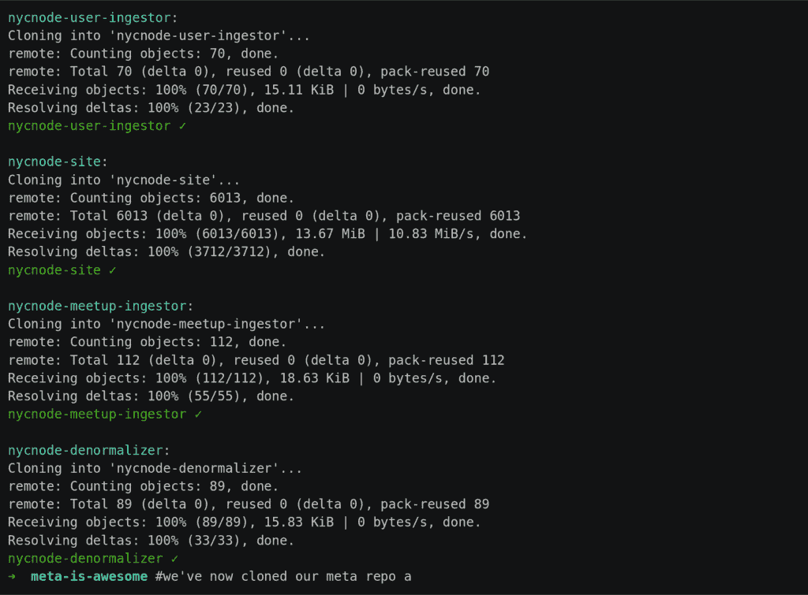

# mono Repo vs . Multi Repo:代码库策略的利弊

> 原文：<https://kinsta.com/blog/monorepo-vs-multi-repo/>

[通过 Git 托管](https://kinsta.com/plans/)和管理代码主要有两种策略:mono repo vs multi repo。这两种方法各有利弊。

我们可以对任何语言的任何代码库使用任何一种方法。您可以对包含几个[库](https://kinsta.com/blog/javascript-libraries/)到几千个库的项目使用这些策略。即使它涉及几个或数百个团队成员，或者您想要托管私有或开源代码，您仍然可以基于各种因素选择 monorepo 或 multi repo。

每种方法的优缺点是什么？我们应该在什么时候使用其中之一？让我们来了解一下！

T3】

## 什么是回购？

repo(repository 的缩写)是来自项目的所有变更和文件的存储，使开发人员能够在整个开发阶段“版本控制”项目的资产。

我们通常指的是 [Git](https://kinsta.com/help/git/) 仓库(如 [GitHub](https://kinsta.com/knowledgebase/git-vs-github/) 、 [GitLab](https://kinsta.com/blog/gitlab-vs-github/) 或 [Bitbucket](https://kinsta.com/blog/bitbucket-vs-github/) 所提供的)，但这个概念也适用于其他版本控制系统(如 Mercurial)。

[通过 Git 托管和管理我们的代码库有两种主要策略:单一回购方法和多重回购方法。🚀探索本指南中的每一个⬇️ 点击推文](https://twitter.com/intent/tweet?url=https%3A%2F%2Fkinsta.com%2Fblog%2Fmonorepo-vs-multi-repo%2F&via=kinsta&text=There+are+two+main+strategies+for+hosting+and+managing+our+codebase+through+Git%3A+the+monorepo+approach+and+the+multi+repo+approach.+%F0%9F%9A%80+Explore+each+in+this+guide+%E2%AC%87%EF%B8%8F&hashtags=Coding%2CCodebase)

## 什么是单向回购？

monorepo 方法使用单个[存储库](https://kinsta.com/blog/bitbucket-vs-github/)来托管组成公司项目的多个库或服务的所有代码。在最极端的情况下，一个公司的整个代码库——跨越不同的项目，用不同的语言编码——都托管在一个存储库中。
T3】


> Kinsta 把我宠坏了，所以我现在要求每个供应商都提供这样的服务。我们还试图通过我们的 SaaS 工具支持达到这一水平。
> 
> <footer class="wp-block-kinsta-client-quote__footer">
> 
> 
> 
> <cite class="wp-block-kinsta-client-quote__cite">Suganthan Mohanadasan from @Suganthanmn</cite></footer>

[View plans](https://kinsta.com/plans/)

## 单一回购的好处

将整个代码库托管在一个存储库中有以下好处。

### 降低进入壁垒

当新员工开始为一家公司工作时，他们需要下载代码并安装所需的工具来开始工作。假设项目分散在许多存储库中，每个存储库都有其安装说明和所需的工具。在这种情况下，最初的设置将会很复杂，而且文档往往不完整，需要这些新的团队成员向同事寻求帮助。

单一回购简化了事情。由于有一个包含所有代码和[文档](https://kinsta.com/knowledgebase/devkinsta/)的单一位置，您可以简化初始设置。

### 集中代码管理

拥有一个单一的存储库可以让所有开发人员看到所有的代码。它简化了代码管理，因为我们可以使用单个问题跟踪器来监视整个应用程序生命周期中的所有问题。

例如，当一个问题跨越两个(或更多)子库，并且依赖库上存在 bug 时，这些特征是有价值的。对于多个存储库来说，[找到发生问题的那段代码](https://kinsta.com/blog/inspect-element/)可能是一个挑战。

最重要的是，我们需要找出使用哪个存储库来创建问题，然后邀请并交叉标记其他团队的成员来帮助解决问题。

然而，使用 monorepo，定位代码问题和协作解决问题变得更容易实现。

### 无痛的应用范围重构

当创建应用程序范围的代码重构时，多个库将受到影响。如果您通过多个存储库托管它们，管理所有不同的拉请求以保持它们彼此同步可能是一个挑战。

monorepo 使得对所有库的所有代码执行所有修改并在一个单一的 pull 请求下提交变得容易。

### 更难破坏相邻的功能

使用 monorepo，我们可以设置所有库的所有测试，以便在任何单个库被修改时运行。因此，在一些库中进行更改的可能性已经最小化了对其他库的负面影响。

### 团队共享开发文化

尽管并非不可能，但使用 monorepo 方法，在不同的团队中激发独特的亚文化变得具有挑战性。由于他们将共享同一个库，他们很可能会共享相同的[编程](https://kinsta.com/blog/best-programming-language-to-learn/)和管理方法，并使用相同的[开发工具](https://kinsta.com/blog/apm-tools/)。


## 单一回购方法的问题

为我们所有的代码使用一个单一的存储库有几个缺点。

### 较慢的开发周期

当库的代码包含导致依赖库测试失败的重大更改时，也必须在合并更改之前修复代码。

如果这些库依赖于其他团队，而这些团队正忙于其他任务，并且不能(或者不愿意)调整他们的代码以避免破坏性的变化并通过测试，那么新特性的开发可能会停滞。

更重要的是，项目可能会以公司中最慢的团队的速度开始推进。这种结果可能会让最快团队的成员感到沮丧，为他们想要离开公司创造条件。

此外，一个库也需要为所有其他库运行测试。运行的[测试越多，运行它们花费的时间就越多，从而降低了我们迭代代码的速度。](https://kinsta.com/blog/website-speed-test/)

### 需要下载整个代码库

当 monorepo 包含一家公司的所有代码时，它可能会非常庞大，包含数十亿字节的数据。为了对托管在内的任何库做出贡献，任何人都需要下载整个库。

处理一个庞大的代码库意味着对硬盘空间的低效利用，以及与它的缓慢交互。例如，像执行`git status`或用正则表达式在代码库中搜索这样的日常操作可能比使用多次回复要多花几秒甚至几分钟的时间。

### 未修改的库可能是新版本的

当我们[标记](https://kinsta.com/knowledgebase/wordpress-tags/)mono repo 时，其中的所有代码都被赋予新的标记。如果此操作触发了新的版本，那么存储库中托管的所有库都将使用标签中的版本号进行新的发布，即使这些库中的许多库可能没有任何更改。

### 工作更加困难

开源项目必须让贡献者尽可能容易地参与进来。有了多个存储库，贡献者可以直接前往他们想要贡献的项目的特定存储库。然而，在 monorepo 托管各种项目的情况下，贡献者必须首先导航到正确的项目，并且需要了解他们的贡献如何影响所有其他项目。


## 什么是多重回购？

多回购方法使用几个存储库来托管一个公司开发的项目的多个库或服务。在最极端的情况下，它将在其存储库下托管每个最小的可重用代码集或独立功能(如微服务)。

## 多重回购的好处

独立于所有其他库托管每个库有很多好处。

### 独立库版本控制

当标记一个存储库时，它的整个代码库被分配了“new”标记。由于存储库中只有特定库的代码，所以该库可以独立于托管在其他地方的所有其他库进行标记和版本控制。

每个库都有一个独立的版本有助于定义应用程序的依赖树，允许我们配置每个库使用的版本。

### 独立的服务版本

由于存储库只包含某些服务的代码，没有其他内容，所以它可以有自己的部署周期，独立于访问它的应用程序所取得的任何进展。

服务可以使用快速发布周期，比如连续交付(在通过所有测试后部署新代码)。一些访问该服务的图书馆可能使用较慢的发布周期，例如那些每周只发布一次新版本的图书馆。

### 帮助定义整个组织的访问控制

只有参与开发库的团队成员需要被添加到相应的存储库中并下载其代码。因此，[应用程序](https://kinsta.com/blog/application-performance-monitoring/)中的每一层都有一个隐式的访问控制策略。那些与库相关的人将被授予编辑权限，其他人可能没有访问库的权限。或者他们可能被授予阅读权限，但没有编辑权限。

## 注册订阅时事通讯


### 想知道我们是怎么让流量增长超过 1000%的吗？

加入 20，000 多名获得我们每周时事通讯和内部消息的人的行列吧！

[Subscribe Now](#newsletter)

### 允许团队自主工作

团队成员可以独立于所有其他团队设计库的架构并实现其代码。他们可以根据库在一般环境中的作用做出决策，而不会受到外部团队或应用程序的特定需求的影响。

## 多重回购方法的问题

使用多个存储库会导致几个问题。

### 库必须不断地重新同步

当包含重大变更的库的新版本发布时，依赖于该库的库将需要进行调整以开始使用最新版本。如果库的发布周期比其依赖库的发布周期快，那么它们很快就会变得不同步。

团队需要不断赶上来使用其他团队的最新版本。考虑到不同的团队有不同的优先级，这有时可能很难实现。

因此，一个跟不上的团队可能会坚持依赖库的过时版本。这一结果将对应用程序产生影响(在安全性、速度和其他考虑方面)，跨库开发的差距只会越来越大。

### 可能会分裂团队

当不同的团队不需要交互时，他们可能会在自己的筒仓中工作。从长远来看，这可能导致团队在公司内部产生他们的亚文化，例如采用不同的编程或管理方法，或者利用不同的开发工具集。

如果一些团队成员最终需要在不同的团队工作，他们可能会遭受一点文化冲击，并学习一种新的工作方式。

## 单一回购与多重回购:主要区别

这两种方法最终处理相同的目标:管理代码库。因此，他们都必须解决相同的挑战，包括发布管理、促进团队成员之间的合作、处理问题、运行测试等等。

他们的主要区别在于团队成员做出决策的时机:要么在前期进行单一回购，要么在后期进行多重回购。

让我们更详细地分析这个想法。

因为在 multi-repo 中所有的库都是独立版本化的，所以一个团队发布一个带有重大变更的库时，可以通过为最新的版本分配一个新的主要版本号来安全地完成。其他组可以让他们的依赖库坚持旧版本，一旦他们的代码被修改，就切换到新版本。

这种方法将何时调整所有其他库的决定留给了每个负责团队，他们可以随时这样做。如果他们做得太晚，新的库版本发布了，那么缩小库之间的差距将变得越来越困难。

因此，当一个团队可以快速迭代他们的代码时，其他团队可能无法跟上，最终产生分歧的库。

另一方面，在 monorepo 环境中，我们不能发布一个库的新版本来破坏其他一些库，因为它们的测试会失败。在这种情况下，第一个团队必须与第二个团队沟通，以合并这些更改。

厌倦了低于 1 级的 WordPress 托管支持而没有答案？试试我们世界一流的支持团队！[查看我们的计划](https://kinsta.com/plans/?in-article-cta)

这种方法迫使团队在单个库必须发生变化时，一起调整所有的库。所有团队都被迫相互交流，共同达成解决方案。

结果，第一个团队将不能像他们希望的那样快速迭代，但是跨不同库的代码将不会在任何时候开始分离。

总之，多回购方法可以帮助在团队中创建一种“快速行动和打破常规”的文化，灵活的独立团队可以按照他们的速度生产产品。相反，monorepo 方法支持一种意识和关怀的文化，在这种文化中，团队不应该独自处理问题。

## 混合多单方法

如果我们不能决定是使用多回购还是单回购方法，还有一种中间方法:使用多个存储库并使用一些工具来保持它们同步，使其类似于单回购，但更具灵活性。

Meta 就是这样一个工具。它在子目录下组织了多个存储库，并提供了一个[命令行界面](https://kinsta.com/blog/how-to-use-ssh/)，可以同时对所有存储库执行相同的命令。

元存储库包含关于哪些存储库构成项目的信息。通过 meta 克隆这个存储库将会递归地克隆所有需要的存储库，使得新的团队成员更容易立即开始他们的项目工作。

要克隆一个元存储库及其所有已定义的多个存储库，我们必须执行以下操作:

```
meta git clone [meta repo url] 
```

Meta 将为每个存储库执行一个`git clone`,并将其放在一个子文件夹中:

[](https://kinsta.com/wp-content/uploads/2021/07/meta-cloning.png)

Cloning a meta-project. (Image source: [github.com/mateodelnorte/meta](https://github.com/mateodelnorte/meta))


从那时起，执行`meta exec`命令将在每个子文件夹上执行该命令。例如，在每个存储库上执行`git checkout master`是这样完成的:

```
meta exec "git checkout master" 
```

## 混合单聚方法

另一种方法是通过 monorepo 管理代码进行开发，但是将每个库的代码复制到其独立的存储库中进行部署。

这种策略在 PHP 生态系统中很普遍，因为[打包师](https://packagist.org/)(主要的[作曲者](https://getcomposer.org/)库)需要一个公共库 [URL](https://kinsta.com/knowledgebase/what-is-a-url/) 来发布一个包，并且不可能指出这个包位于这个库的子目录中。

考虑到 Packagist 的限制， [PHP 项目仍然可以使用 monorepo 进行开发](https://graphql-api.com/blog/extending-the-monorepo-builder/)，但是它们必须使用 multi-repo 方法进行部署。

为了实现这种转换，我们可以[用`git subtree split`](https://stackoverflow.com/questions/359424/detach-move-subdirectory-into-separate-git-repository/17864475#17864475) 执行一个脚本，或者使用执行相同逻辑的可用工具之一:

*   [Git 子树拆分器](https://github.com/splitsh/lite)
*   [Git Subsplit](https://github.com/dflydev/git-subsplit)
*   [单回购分割的 GitHub 动作](https://github.com/symplify/monorepo-split-github-action)

## 谁在使用单一回购和多重回购

几家大型科技公司倾向于单一回购方式，而其他公司则决定使用多重回购方式。

谷歌、[脸书](https://www.facebook.com/atscaleevents/videos/systems-scale-2019-monorepos-moving-fast-in-a-huge-repository/457153524992062/)、[推特](https://blog.twitter.com/engineering/en_us/a/2016/the-release-of-pants-10)和[优步](https://www.youtube.com/watch?v=lV8-1S28ycM)都公开支持单一回购方式。微软[运行着地球上最大的 Git mono repo](https://devblogs.microsoft.com/bharry/the-largest-git-repo-on-the-planet/)来托管 Windows 操作系统的源代码。

另一方面，[网飞](https://netflixtechblog.com/towards-true-continuous-integration-distributed-repositories-and-dependencies-2a2e3108c051)、[亚马逊和 Lyft](https://dl.acm.org/doi/pdf/10.1145/3328433.3328435) 都是使用多重回购方法的著名公司。

在混合的 poly-as-mono 方面， [Android](https://source.android.com/setup/create/coding-tasks) 更新多个存储库，这些存储库像 monorepo 一样被管理。

在混合单作为多方面， [Symfony](https://kinsta.com/blog/php-frameworks/#symfony) 在一个单回购中保存其所有组件的代码。他们将其拆分成独立的库进行部署(比如 [`symfony/dependency-injection`](https://github.com/symfony/dependency-injection) 和 [`symfony/event-dispatcher`](https://github.com/symfony/event-dispatcher) )。)

## 单回购和多回购的例子

GitHub 上的 [WordPress 账户提供了单边回购和多边回购的例子。](https://github.com/WordPress/WordPress)

WordPress 块编辑器[古腾堡](https://kinsta.com/blog/gutenberg-wordpress-editor/)，由几十个 [JavaScript](https://kinsta.com/knowledgebase/what-is-javascript/) 包组成。这些包都托管在 [`WordPress/gutenberg` monorepo](https://github.com/WordPress/gutenberg) 上，并通过 [Lerna](https://github.com/lerna/lerna) 进行管理，以帮助在 [npm](https://kinsta.com/knowledgebase/what-is-node-js/#what-is-npm) 存储库中发布它们。

[Openverse](https://wordpress.org/news/2021/05/welcome-to-openverse/) ，公开授权媒体的搜索引擎，[将其主要部分](https://github.com/WordPress/openverse/blob/918b7cf1b6323291ab16c1ad5a27f3733709ec17/README.md#openverse)托管在独立的存储库中:[目录](https://github.com/wordpress/openverse-catalog)和 [API](https://github.com/wordpress/openverse-api) 。

## 单一回购 vs 多重回购:如何选择？

与许多开发问题一样，对于应该使用哪种方法，没有预先定义的答案。不同的公司和项目将受益于基于其独特条件的一种策略或另一种策略，例如:

*   代码库有多大？它包含千兆字节的数据吗？
*   有多少人会从事代码库的工作？是 10 左右，100 左右，还是 1000 左右？
*   会有多少个包裹？是 10 左右，100 左右，还是 1000 左右？
*   在给定的时间里，团队需要处理多少个包？
*   包之间的耦合有多紧密？
*   是否涉及不同的编程语言？它们需要安装特定的软件或特殊的硬件来运行吗？
*   需要多少部署工具，设置这些工具有多复杂？
*   公司的文化是什么？是否鼓励团队合作？
*   团队知道如何使用哪些工具和技术？

[你应该为你的代码库采用哪种方法？🤔在此了解更多信息👇](https://twitter.com/intent/tweet?url=https%3A%2F%2Fkinsta.com%2Fblog%2Fmonorepo-vs-multi-repo%2F&via=kinsta&text=Which+approach+should+you+take+for+your+codebase%3F+%F0%9F%A4%94+Learn+more+here+%F0%9F%91%87&hashtags=Coding%2CCodebase)

## 摘要

托管和管理代码有两种主要策略:单回购和多回购。monorepo 方法需要将不同库或项目的代码——甚至是来自一个公司的所有代码——存储在一个存储库中。而 multi-repo 系统将代码划分为单元，比如库或服务，并将它们的代码托管在独立的存储库中。

使用哪种方法取决于多种条件。这两种策略都有一些优点和缺点，我们刚刚在本文中详细介绍了它们。

关于单回购或多回购，你还有什么问题吗？请在评论区告诉我们！

* * *

让你所有的[应用程序](https://kinsta.com/application-hosting/)、[数据库](https://kinsta.com/database-hosting/)和 [WordPress 网站](https://kinsta.com/wordpress-hosting/)在线并在一个屋檐下。我们功能丰富的高性能云平台包括:

*   在 MyKinsta 仪表盘中轻松设置和管理
*   24/7 专家支持
*   最好的谷歌云平台硬件和网络，由 Kubernetes 提供最大的可扩展性
*   面向速度和安全性的企业级 Cloudflare 集成
*   全球受众覆盖全球多达 35 个数据中心和 275 多个 pop

在第一个月使用托管的[应用程序或托管](https://kinsta.com/application-hosting/)的[数据库，您可以享受 20 美元的优惠，亲自测试一下。探索我们的](https://kinsta.com/database-hosting/)[计划](https://kinsta.com/plans/)或[与销售人员交谈](https://kinsta.com/contact-us/)以找到最适合您的方式。