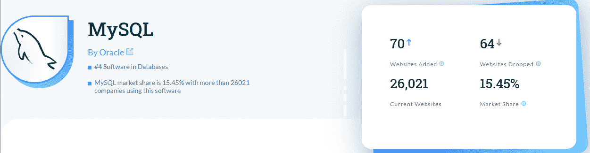
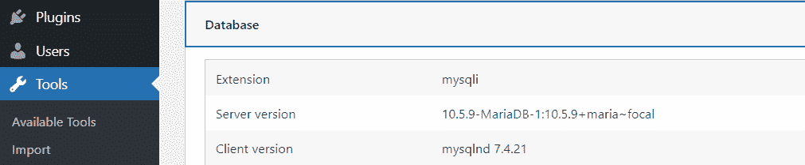
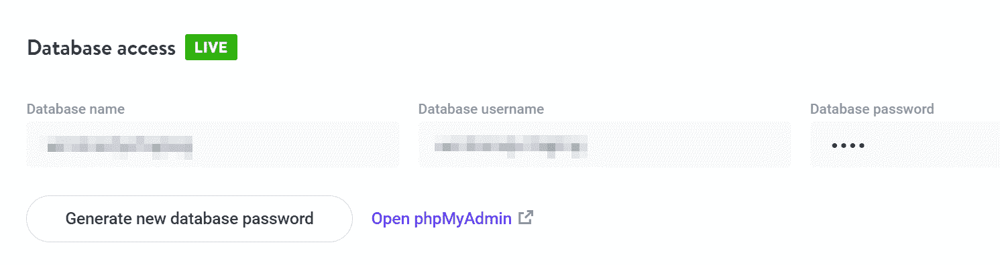
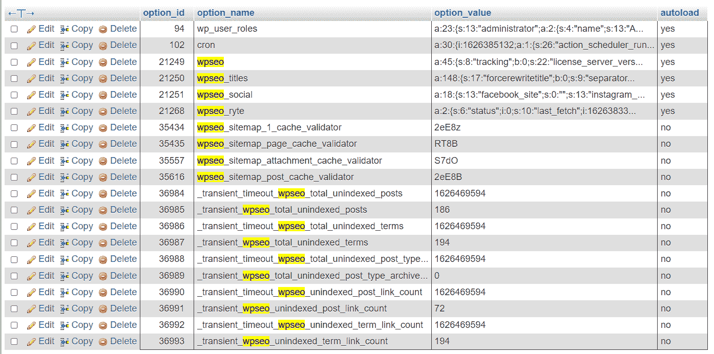
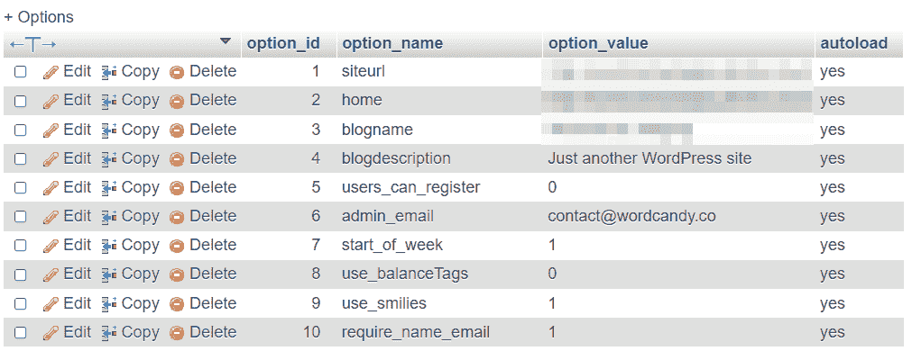
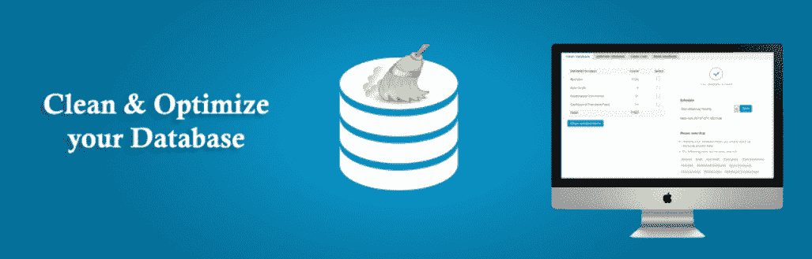

# 如何完成 MySQL 性能调优(4 个关键技巧)

> 原文：<https://kinsta.com/blog/mysql-performance-tune/>

MySQL 是 web 服务器上最流行的数据库管理系统之一。如果你运行一个 WordPress 网站，它很有可能使用 MySQL 作为数据库。这使得您有必要了解如何完成 MySQL 性能调优。

通过“调整”MySQL，我们的意思是优化您的数据库，以便软件可以更快地响应查询。最终，这会导致[更短的加载时间](https://kinsta.com/learn/page-speed/)和一个整体更快的网站。此外，如果您正确维护您的数据库，它应该继续[提供高性能](https://kinsta.com/blog/performance-testing-tools/)，即使它的大小在增长。

在本文中，我们将简要介绍什么是 MySQL 以及它是如何工作的。然后，我们将探索如何使用四个基本技巧来执行 MySQL 性能调优。

我们开始吧！

### 查看我们的 MySQL 性能调优视频指南


T3】

## 什么是 MySQL 以及它是如何工作的

动态网站在数据库中存储信息，这是一个包含大量信息的复杂表格结构的术语。数据库使您能够存储变量并“查询”它们以获得您需要的信息。例如，当你加载一个 WordPress 网站时，[内容管理系统(CMS)](https://kinsta.com/knowledgebase/content-management-system/) 会连接到它的数据库以获取它需要的信息。

如果出于某种原因，WordPress 无法连接到数据库，你可能会遇到错误，如“ [MySQL 服务器已经离开](https://kinsta.com/knowledgebase/mysql-server-has-gone-away/)”或“ [MySQL 1064](https://kinsta.com/knowledgebase/mysql-error-1064/) ”。MySQL 是开源软件，它使你能够[创建和管理数据库](https://kinsta.com/knowledgebase/mysql-community-server/)。它远不是唯一的在线数据库管理系统。然而，就市场份额而言，它确实占主导地位，大约有 15%的网站在使用它。




MySQL 的市场份额。


数据库管理有不同的方法，MySQL 使用“关系”和“客户机-服务器”模型。这意味着:

*   **关系数据库—** 这种类型的数据库将信息分解成表格。由于关系模型，您能够使用“键”或唯一标识符连接多个表中的数据。
*   **客户端-服务器模式** —在这种模式下，您的数据库驻留在服务器上，而您的网站就是客户端。浏览器向你的网站发出请求，反过来查询数据库。

由于 MySQL 是开源软件，所以有很多分叉可用。例如，在 Kinsta 这里，我们使用的是 MySQL 的一个分支 [MariaDB](https://kinsta.com/blog/mariadb-vs-mysql/) 。我们选择使用 MariaDB，因为它提供了优于其母软件的性能。

如果你是 Kinsta 用户，你不必担心执行 MySQL 性能调优，因为[我们会为你处理](https://kinsta.com/feature-updates/auto-db-optimize/)。

然而，学习如何让 MySQL 自己运行得更快仍然是一项有价值的技能，主要是如果你的 web 主机没有为你进行优化的话。让我们来谈谈这种优化需要什么。

[MySQL 是最流行的 web 服务器数据库管理系统之一📊...这意味着知道如何完成一个演奏曲调是很重要的💪 点击推文](https://twitter.com/intent/tweet?url=https%3A%2F%2Fbit.ly%2F3mBsNMT&via=kinsta&text=MySQL+is+one+of+the+most+popular+database+management+systems+for+web+servers+%F0%9F%93%8A...+which+means+that+it%27s+essential+to+know+how+to+complete+a+performance+tune+%F0%9F%92%AA&hashtags=MySQL%2CSiteSpeed)


## 完成 MySQL 性能调优的 4 个技巧

如果你使用 WordPress 并想学习如何让 MySQL 运行得更快，你最好的选择不是专注于特定的配置。相反，你会想要微调你的数据库来匹配你使用 WordPress 的方式。我们来谈谈这意味着什么。

### 1.让你的 MySQL 版本保持最新

大多数网络主机会自动为你更新 MySQL 到最新版本。但是，如果您完全控制您的服务器，您将需要手动更新您的数据库管理系统。既然你在使用 WordPress，你可能理解保持软件更新的好处。MySQL 性能调优有很多优势，比如:

*   更新的版本[修补了软件中的安全漏洞](https://kinsta.com/cheatsheets/site-security-cheat-sheet/)。
*   MySQL 的最新版本得到了更好的优化，因此速度更快。

更快的数据库管理软件直接转化为更短的加载时间。然而，可能你不知道你使用的是什么版本的 MySQL。如果您对服务器拥有完全访问权限，则可以启动命令行并运行以下命令:

```
mysql -v
```

`*-v*`参数将返回关于服务器使用的 MySQL 版本的信息。你可以将这些信息与 MySQL 官方网站上的最新版本进行比较，看看有没有更新的版本。如果你不习惯使用命令行，你可以通过 WordPress 仪表盘找到你正在使用的 MySQL 版本。

首先，访问控制面板并转到**工具** *>* **站点健康**。接下来，打开**信息**选项卡，点击**数据库**:




在 WordPress 中查看 MySQL 版本。


根据您的 MySQL 版本，软件可能会自动更新。如果没有，可以使用命令行[将 MySQL](https://kinsta.com/blog/mysql-version/) 更新到最新版本。如果你用的是 Kinsta，你就不用担心更新数据库管理软件了。相反，我们会自动将客户端更新到 MariaDB 的最新稳定版本。
T3】

## 注册订阅时事通讯


### 想知道我们是怎么让流量增长超过 1000%的吗？

加入 20，000 多名获得我们每周时事通讯和内部消息的人的行列吧！

[Subscribe Now](#newsletter)

### 2.检查数据库中的孤立表

通常，你从网站上卸载的插件和网站主题会留下数据。这可能是因为糟糕的编码标准，或者是因为插件/主题决定存储这些数据，以防你想重新安装它们。这种方法背后的想法是，将设置和配置存储在数据库中可以节省您的时间和精力。

然而，所有这些未使用的表会导致数据库膨胀，这反过来会降低查询速度，具体取决于服务器的能力。理想情况下，您将在卸载插件后进行清理，这样可以防止孤立的表和数据累积。有两种方法可以完成这项任务:手动或使用插件。


### 重要的

在你对你的数据库做任何改变之前，我们建议你[完全备份你的 WordPress 站点](https://kinsta.com/blog/backup-wordpress-site/)。即使你的主机每天都做备份(就像我们一样)，这也是适用的，所以如果需要的话，你会有一个站点的副本可以恢复。


一旦有了备份，就可以通过 phpMyAdmin 访问数据库[。如果你是 Kinsta 用户，登录你的](https://kinsta.com/blog/install-phpmyadmin/) [MyKinsta 仪表盘](https://my.kinsta.com/)并进入**网站**。选择你想要工作的站点，并跳转到它的**信息**标签。在那里，您将找到一个链接，它将通过 phpMyAdmin 直接访问您的数据库[:](https://kinsta.com/help/wordpress-phpmyadmin/)




通过 MyKinsta 访问 phpMyAdmin。


一旦进入 phpMyAdmin，就可以使用该软件的**搜索**特性来查找与特定插件相关的孤立表。这种方法的问题是，除非你试图清理的插件有全面的文档，否则很难知道使用什么查询。

例如， [Yoast SEO](https://kinsta.com/blog/yoast-seo/) 推荐在卸载插件后，使用`wpseo`查询来查找与插件*相关的表。使用 phpMyAdmin 运行快速搜索将返回包含不同表中该术语的条目列表:*




在你的数据库中寻找与 Yoast SEO 相关的条目。


尽管手动方法有效，我们鼓励您使用[数据库清理插件解决方案](https://kinsta.com/blog/wordpress-database-plugin/)。使用其中的一些插件，您甚至可以从仪表板中找到孤立的表并删除它们，而不必通过 phpMyAdmin 进行挖掘。
T3】

需要为你的 WordPress 站点提供超快的、可靠的、完全安全的托管服务吗？Kinsta 提供所有这些以及 WordPress 专家提供的 24/7 世界级支持。[查看我们的计划](https://kinsta.com/plans/?in-article-cta)

### 3.确定 MySQL 正在自动加载哪些数据

每个 WordPress 数据库都包含了大量的表格。其中一个表叫做`wp_options`，它包含如下信息:

*   插件和主题设置
*   您的网站 URL、[博客名称](https://kinsta.com/blog/blog-name-ideas/)、描述等等

如果使用 phpMyAdmin 检查`wp_options`表，您会注意到一个名为`autoload`的列。WordPress 在`autoload`下检查带有`yes`条目的行，然后每当有人访问你的网站和访问它的任何页面时加载这些数据:




检查自动加载数据的 wp_options。


开箱即用，WordPress 应该只自动加载关键数据。但是有些插件和主题会给`wp_options`添加数据，并配置为自动加载。随着时间的推移，自动加载数据会降低响应时间，就好像您设置了太多的程序在您打开计算机时自动启动一样。

如果你的 WordPress 网站感觉很慢，你可以在`wp_options`中看到许多插件相关的条目，我们建议你检查一下有多少数据[自动加载到 WordPress](https://kinsta.com/knowledgebase/wp-options-autoloaded-data/) 中，并且[确定哪些插件](https://kinsta.com/blog/wordpress-caching-plugins/)你可以禁用。

### 4.清理修订、草稿、垃圾评论和帖子

随着你使用 WordPress，你的网站会积累大量未使用的数据。例如，WordPress 会自动为你的文章保存几个修改版本和草稿，这取决于你对它们做了多少修改。随着时间的推移，所有这些数据都会使您的数据库膨胀，所以定期清理这些条目是一个好习惯。最好的方法是使用插件，比如[高级数据库清理器](https://kinsta.com/blog/wordpress-database-plugin/#7-advanced-database-cleaner):




高级数据库清理器 WordPress 插件。


对于这个任务，你不需要使用插件的高级版本(不像处理孤立的表)。一旦你启用了这个插件，你就可以进入 **WP 数据库清理器**标签并查看**常规清理**部分。在那里，您会发现插件可以帮助您从数据库中删除的所有瞬态数据的完整列表:


使用高级数据库清理器清理你的数据库。


您可以选择要“清理”或清空的表，然后手动运行该过程。或者，该插件使您能够为您选择的表安排清理，并配置它们定期运行。最后一个选项是你的最佳选择——这意味着你少了一项需要担心的任务。但是，我们建议您不要过于频繁地重新配置数据库清理。这样，如果需要的话，你仍然可以访问以前的草稿。

[‘调’MySQL 是什么意思？👀想想更短的加载时间和更快的网站💥了解如何从这里开始👇](https://twitter.com/intent/tweet?url=https%3A%2F%2Fbit.ly%2F3mBsNMT&via=kinsta&text=What+does+it+mean+to+%27tune%27+MySQL%3F+%F0%9F%91%80+Think+shorter+loading+times+and+a+snappier+website+%F0%9F%92%A5+Learn+how+to+get+started+right+here+%F0%9F%91%87&hashtags=MySQL%2CSiteSpeed)

## 摘要

MySQL 性能调优的好处有很多。然而，你想要优化数据库的主要原因是提高它的性能，所以你的网站总是尽可能快地加载。因为你使用的是 WordPress，所以有很多方法可以在不改变软件配置的情况下进行 MySQL 性能调优。如果你有兴趣学习如何让 MySQL 运行得更快，这里有四个小贴士可以帮助你开始:

1.  让您的 MySQL 版本保持最新。
2.  检查数据库中的孤立表。
3.  确定 MySQL 正在自动加载哪些数据。
4.  清理修订、草稿、垃圾帖子和评论。

你有其他微调 MySQL 数据库的技巧吗？请在下面的评论中与我们的社区分享它们！

* * *

让你所有的[应用程序](https://kinsta.com/application-hosting/)、[数据库](https://kinsta.com/database-hosting/)和 [WordPress 网站](https://kinsta.com/wordpress-hosting/)在线并在一个屋檐下。我们功能丰富的高性能云平台包括:

*   在 MyKinsta 仪表盘中轻松设置和管理
*   24/7 专家支持
*   最好的谷歌云平台硬件和网络，由 Kubernetes 提供最大的可扩展性
*   面向速度和安全性的企业级 Cloudflare 集成
*   全球受众覆盖全球多达 35 个数据中心和 275 多个 pop

在第一个月使用托管的[应用程序或托管](https://kinsta.com/application-hosting/)的[数据库，您可以享受 20 美元的优惠，亲自测试一下。探索我们的](https://kinsta.com/database-hosting/)[计划](https://kinsta.com/plans/)或[与销售人员交谈](https://kinsta.com/contact-us/)以找到最适合您的方式。