# 网络延迟——比较对你的 WordPress 网站的影响

> 原文：<https://kinsta.com/blog/network-latency/>

网络上的许多文章倾向于主要关注前端优化和加快网站速度的快速方法。网络延迟等服务器优化有时会被忽视或忽略。正因为如此，我们认为深入了解网络延迟的重要性以及它在加载不同区域时对你的 WordPress 站点的影响会很有趣。

虽然 CDN 肯定有助于减少网络延迟，但您的**主机服务器位置仍然非常重要**，尤其是如果您在一个非常具体的地理位置为访问者提供服务。延迟很重要，我们将向您展示几个原因。

[Kinsta uses Google Cloud Platform's premium tier network. Because your websites deserve the best. ⚡Click to Tweet](https://twitter.com/intent/tweet?url=https%3A%2F%2Fkinsta.com%2Fblog%2Fnetwork-latency%2F&via=kinsta&text=Kinsta+uses+Google+Cloud+Platform%27s+premium+tier+network.+Because+your+websites+deserve+the+best.+%E2%9A%A1&hashtags=webhosting%2Cgooglecloud)

## 什么是网络延迟？

网络延迟是指通过网络传输数据所涉及的时间和/或延迟。换句话说，一个数据包从一点到另一点需要多长时间。如今，这通常以毫秒为单位，然而，根据网络的不同，也可能是秒。越接近零越好。

> “延迟是信号通过地理距离和各种通信设备时产生的等待时间。”–[Whatis.com](http://whatis.techtarget.com/definition/latency)

换句话说，距离越远，延迟越大，这相当于更长的延迟。当通过光缆传输数据时，你无法超越光速。例如，下面是谷歌云平台网络的地图。他们有数千英里的电缆在海底横跨整个地球。这就是为什么它是世界上最快的网络之一的原因之一。即使有了如此先进的网络，仍然会有延迟。

Latency over fiber optics cables

有几个不同的因素会导致网络延迟，包括:

*   **传输延迟:**不同类型的介质，如无线或光纤连接都会引入某种类型的延迟，因为它们只能推出这么多位。例如，光纤连接的传输延迟将低于 T1 线路。你还必须考虑数据包的大小。
*   **传播延迟:**这是数据包传播所需的时间。这可能包括距离、网络延迟等。
*   **排队延迟:**如果超出带宽，可能会出现排队延迟，数据必须在主机或路由器上等待。这可能会受到网络拥塞的影响。

### 为什么网络延迟很重要

有些人可能会认为网络延迟不是很重要，但是，它可能与您选择托管站点的位置有关。对于媒体和你的资产(比如图像、JavaScript、CSS、视频)，一个 [CDN](https://kinsta.com/blog/wordpress-cdn/) 可以通过从一个更近的服务器传送一个副本来修复很多额外的延迟。然而，在大多数配置中，您仍然需要查询您的托管服务器来进行初始文档加载。这就是为什么**延迟很重要**！

> 该铁路线将他们的漏斗中的延迟减少了 0.3 秒，客户一年多花了 800 万英镑(约 1150 万美元)。–[WPO 统计数据](https://wpostats.com/2016/05/04/trainline-spending.html)

对于在特定地理位置为访问者提供服务的企业来说，延迟尤为重要。举个例子，假设你在悉尼有一家电商店铺，90%的客户来自澳大利亚。将你的网站放在澳大利亚的服务器上，而不是放在欧洲或美国，你的企业肯定会从中受益。我们将在下面讨论它对你的网站有多大影响。
T3】

## 比较谷歌云网络延迟

距离是延迟的主要原因之一。然而，重要的是要记住，延迟不仅受距离的影响，还受跳数、中间的路由器等的影响。测量网络延迟的几种方法包括 Ping、Traceroute 和 MTR。在本例中，我们将简单地使用 ping 时间并运行一些 traceroute 测试。如果你真的想挖掘数据，你可以运行 [traceroute 命令](https://www.keycdn.com/support/traceroute-command/)。

因此，我们在位于不同地理区域的谷歌云平台上安装了一些测试机器。在 Kinsta，我们将谷歌云平台的**高级层网络纳入所有托管计划**。许多其他主机提供商使用谷歌云的标准层网络，这导致速度较慢。

*   perf1.kinsta.com(位于美国爱荷华州)
*   perf2.kinsta.com(位于澳洲悉尼)
*   perf3.kinsta.com(位于德国法兰克福)

了解更多:[谷歌云平台网络:高级层与标准层](https://kinsta.com/blog/google-cloud-network/)

然后，我们利用了 KeyCDN 的免费 [Ping 测试工具](https://tools.keycdn.com/ping)，它允许我们从 14 个位置同时进行测试。请记住，**ping 时间越短越好**，因为这直接关系到数据通过互联网传输到目的地址，然后返回给你的延迟时间(毫秒)。我们还利用了他们的[追踪工具](https://tools.keycdn.com/traceroute)。

### Perf1(美国爱荷华州)

对于位于美国衣阿华州的测试服务器，ping 时间比位于美国的位置要低得多(**到达拉斯**的平均 ping 时间为 16 毫秒)。随着你开始向欧洲或新加坡更远的地方走，你开始体验到更高的 ping 时间平均值(**到新加坡**的平均 ping 时间为 244 毫秒)。

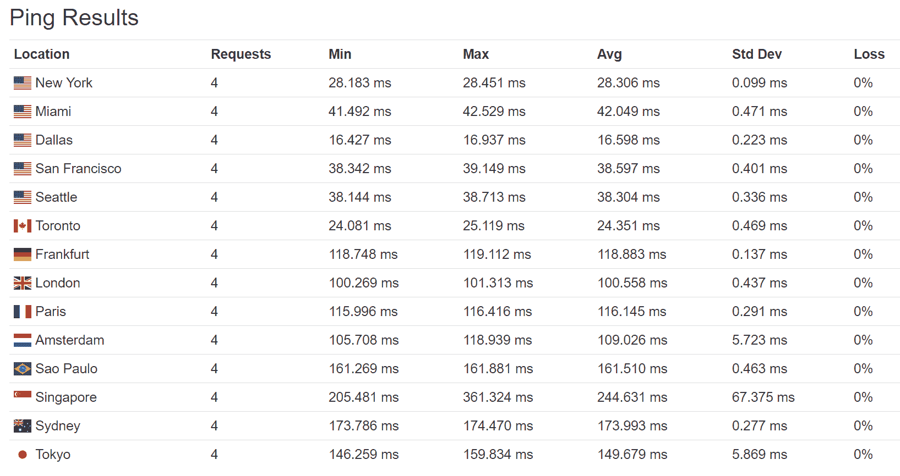

Ping times perf1 (USA)

如果我们比较 Traceroute，您可以看到一个示例:从美国爱荷华州到德国法兰克福需要 7 个额外的网络跳(相比之下，从达拉斯需要 10 跳)。这就是为什么要记住网络跳数也是网络延迟的一个重要因素。

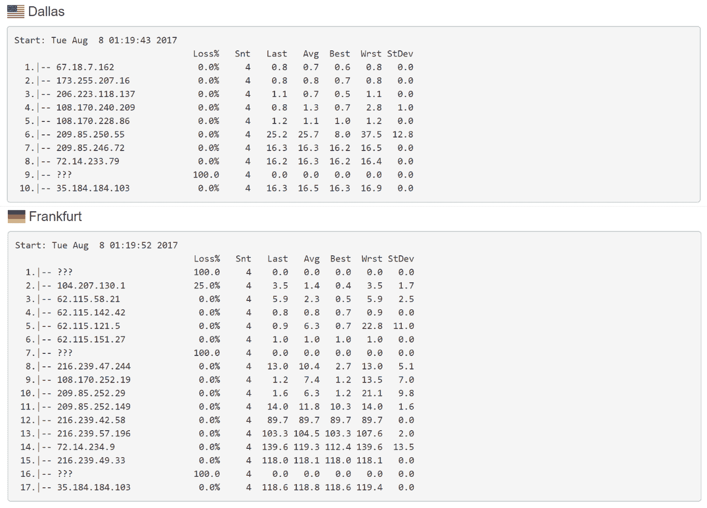

【跟踪路线 perf1(美国)

### Perf2(澳大利亚悉尼)

对于位于澳大利亚悉尼的测试服务器，从澳大利亚和亚太地区的 ping 时间要低得多(**到悉尼的平均 ping 时间为 1 ms**)。当你开始进一步向欧洲或南美进发时，你会开始体验到更高的 ping 时间平均值(**到圣保罗**的 ping 时间平均值为 319 毫秒)。

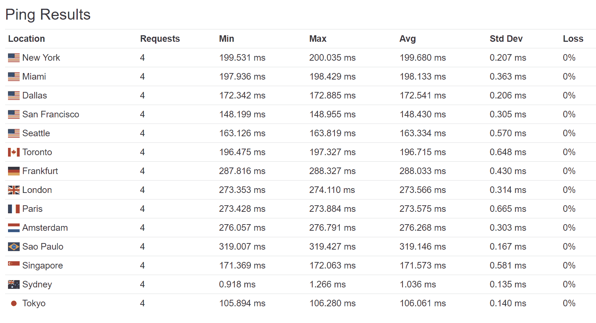

Ping times perf2 (Australia)

如果我们比较一下 Traceroute，您可以看到一个例子:从澳大利亚悉尼到德国法兰克福需要 14 个额外的网络跳。

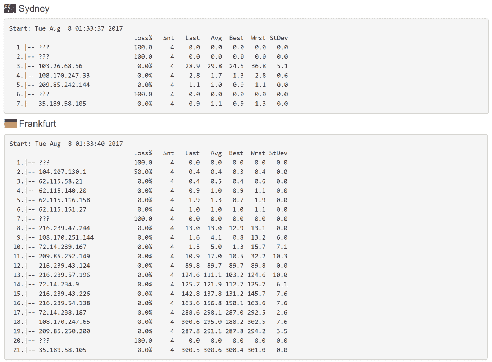

Traceroute perf2 (Australia)

### Perf3(德国法兰克福)

对于位于德国法兰克福的测试服务器，ping 时间比欧洲甚至美国的服务器要低得多，这可能是由于两者之间的快速主干连接(到阿姆斯特丹的平均 ping 时间为**7 ms**)。随着您开始向亚太地区或南美进一步深入，您会开始体验到更高的 ping 时间平均值(**到新加坡**的平均 ping 时间为 308 毫秒)。

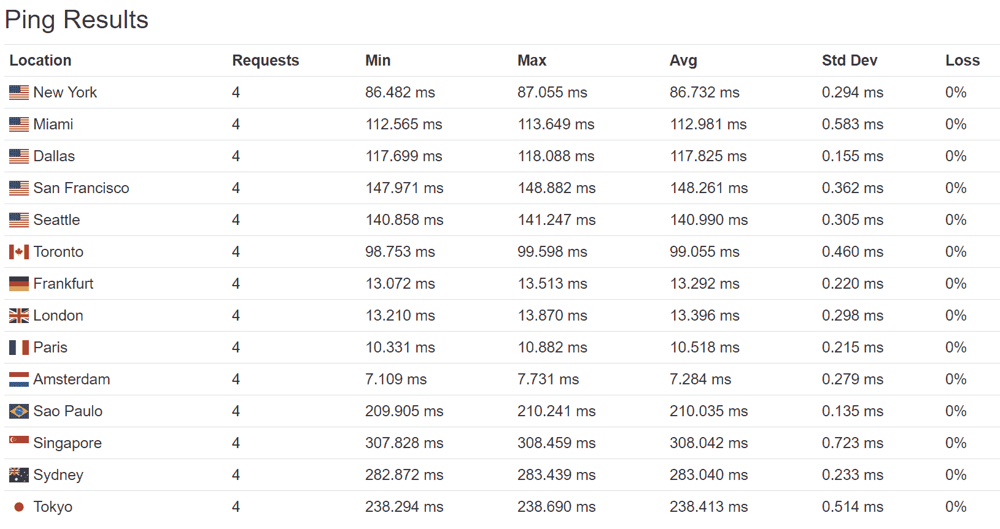

Ping times perf3 (Germany)

如果我们比较一下 Traceroute，您可以看到一个例子:从德国法兰克福到巴西圣保罗需要 11 个额外的网络跳。

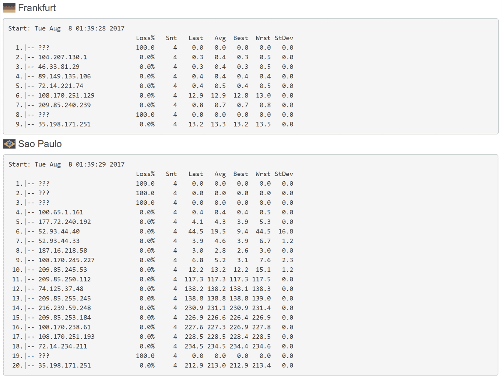

Traceroute perf3 (Germany)

正如您在上面看到的，距离越大，ping 次数越多，T2 越多，这就构成了网络延迟。这就是为什么你应该战略性地定位你的网站来减少这两个因素。

## 比较不同地区的谷歌云延迟

上面我们测试了服务器所在位置的 ping 时间，与 Ping 服务器相关。但是 Google 云平台区域之间的延迟呢？ [Geek Flare](https://geekflare.com/google-cloud-latency/) 在 9 个不同地区进行了一次大测试。这可以让您快速了解放置在一个区域与另一个区域时由于延迟而发生的延迟。

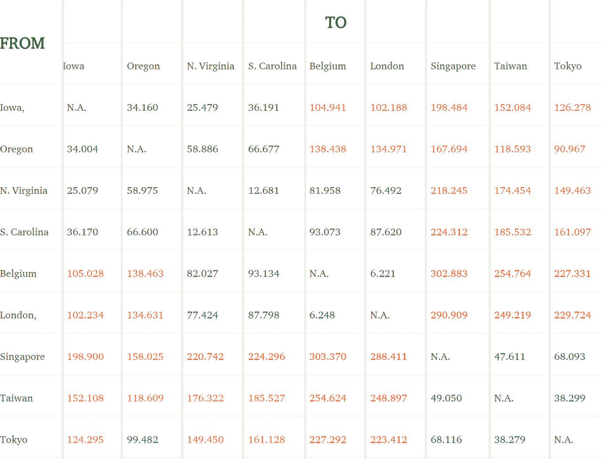

Google Cloud Platform latency (Source Geek Flare)

请务必查看我们关于 [Google Cloud 与 AWS](https://kinsta.com/blog/google-cloud-vs-aws/) 的文章，了解网络延迟的差异。
T3】

## 注册订阅时事通讯

### 想知道我们是怎么让流量增长超过 1000%的吗？

加入 20，000 多名获得我们每周时事通讯和内部消息的人的行列吧！

[Subscribe Now](#newsletter)

## 比较页面加载时间

当然，我们忽略了总的页面加载时间。事实上，这是一些最有趣的数据所在。但是，请记住，这包括其他因素，如 [TTFB](https://kinsta.com/blog/ttfb/) 。所有三个测试站点都是一样的，运行一个新安装的 WordPress，安装了[2017 主题](https://kinsta.com/blog/twenty-seventeen-theme/)。我们也在使用 [Pingdom](https://kinsta.com/blog/pingdom-speed-test/) ，所以时间是从他们的测试服务器位置开始计算的。

### 性能 1(美国爱荷华州)

我们在三个不同的测试地点对位于美国爱荷华州的服务器进行了速度测试，结果如下。

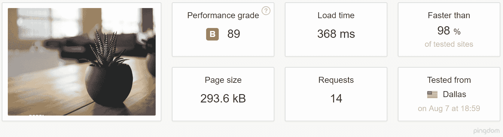

[Speed test](https://tools.pingdom.com/#!/ewQwQc/https://perf1.kinsta.com) perf1 Dallas

[Speed test](https://tools.pingdom.com/#!/cDocaK/https://perf1.kinsta.com) perf1 Australia

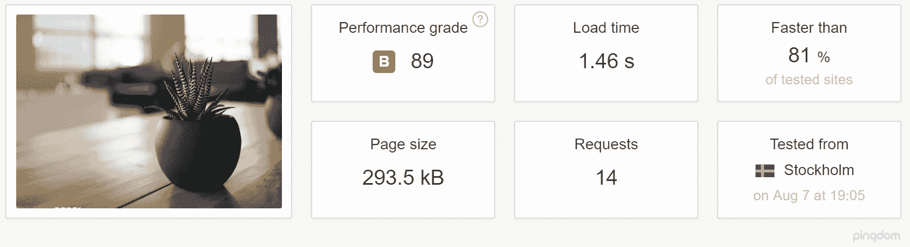

[Speed test](https://tools.pingdom.com/#!/drbsoO/https://perf1.kinsta.com) perf1 Stockholm

正如我们在上面看到的，从美国国内(靠近主机服务器)加载一个站点和从全球加载有很大的不同。

### 性能 2(澳大利亚悉尼)

我们在三个不同的测试地点对位于澳大利亚悉尼的服务器进行了速度测试，结果如下。

[Speed test](https://tools.pingdom.com/#!/zPBKv/https://perf2.kinsta.com) perf2 Dallas

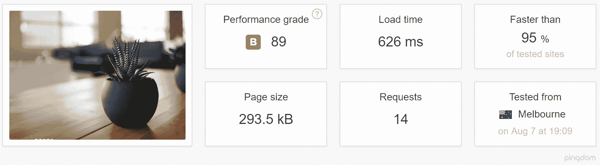

[Speed test](https://tools.pingdom.com/#!/dLBGX9/https://perf2.kinsta.com) perf2 Melbourne

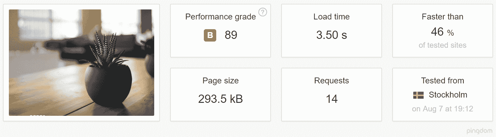

[Speed test](https://tools.pingdom.com/#!/d6aEbH/https://perf2.kinsta.com) perf2 Stockholm

正如我们在上面看到的，从澳大利亚境内(靠近主机服务器)加载一个站点和从全球加载有很大的不同。

Struggling with downtime and WordPress problems? Kinsta is the hosting solution designed to save you time! [Check out our features](https://kinsta.com/features/)

### 性能 3(德国法兰克福)

我们在三个不同的测试地点对位于德国法兰克福的服务器进行了速度测试，结果如下。

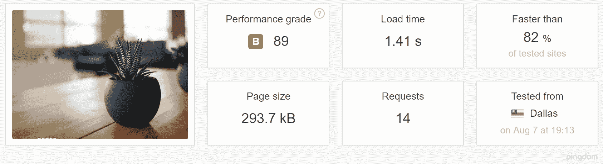

[Speed test](https://tools.pingdom.com/#!/ddkh2C/https://perf3.kinsta.com) perf3 Dallas

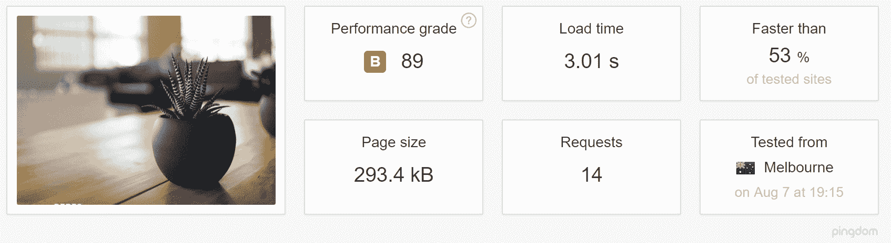

[Speed test](https://tools.pingdom.com/#!/cMtldz/https://perf3.kinsta.com) perf3 Melbourne

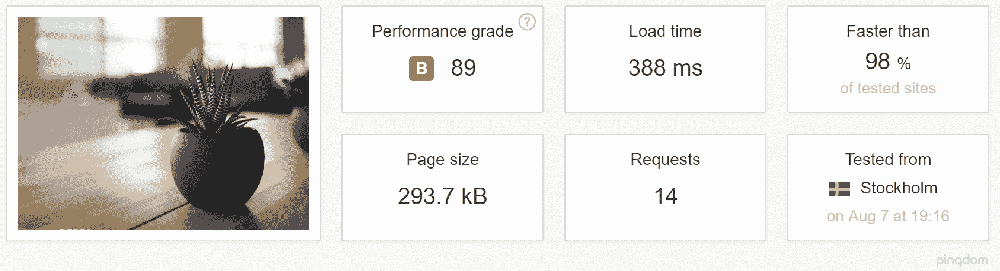

[Speed test](https://tools.pingdom.com/#!/VWzQK/https://perf3.kinsta.com) perf3 Stockholm

正如我们在上面看到的，从欧洲(靠近主机服务器)加载一个站点和从全球加载有很大的不同。

如果那些页面负载测试不能说服你，我们不知道什么能说服你！比如美国爱荷华州的考点，从达拉斯加载只需要 368 ms。但是从澳大利亚悉尼装货用了 2.14 秒。这就是为什么**位置很重要**！同样，你可以通过 [CDN](https://kinsta.com/blog/wordpress-cdn/) 让你的媒体资产更接近你的访客，从而帮助减少总加载时间。Kinsta 包括一个面向所有客户的 CDN！但是您总是会遇到来自主机服务器的加载时间和延迟，所以要明智地选择。

## 选择合适的位置来托管你的 WordPress 站点

大多数主机提供商通常允许你选择不同的位置来托管你的网站。在金斯塔这里，我们有所有 35 个[谷歌云平台位置](https://kinsta.com/knowledgebase/google-cloud-data-center-locations/)现在可用。这使您可以战略性地将您的站点放置在您需要确保低延迟和 TTFB 以及极快加载时间的地方。您也可以为每个单独的站点选择不同的位置。

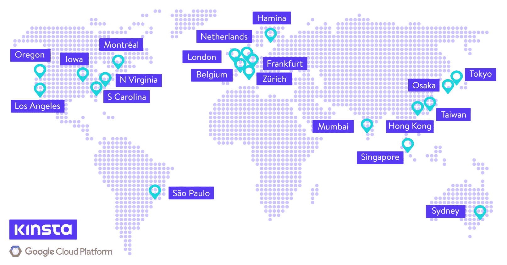

Google Cloud data center locations

不确定选哪个？以下是一些建议。

### 技巧 1——查看谷歌分析

你可以做的第一件事就是在谷歌分析中查看[访客的地理位置。在下面的示例中，您可以看到 90%以上的流量来自美国。所以在大多数情况下，你会想把你的网站放在美国的服务器上。您可以将数据过滤到城市，但我们通常会推荐一个中心位置，如美国爱荷华州。](https://kinsta.com/blog/google-analytics-wordpress/)

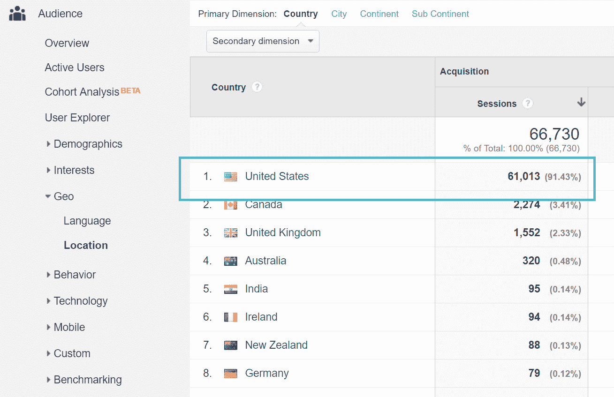

Geo data in Google Analytics

### 技巧 2——检查电子商务数据

如果你经营一家电子商务商店，一定要查看你的顾客来自哪里。这当然是你创收的方式，所以这些是你最重要的访客。这应该与你上面的流量相吻合，然而，这并不总是如此。如果您有电子商务数据设置或目标，您可以轻松地将该信息叠加到地理数据之上，以做出更明智的决策。

### 技巧 3——做一个快速延迟测试

有很多方便的免费工具可以为不同的云提供商测量从**你当前位置**的延迟。这可以帮助您快速评估哪个地区可能是您站点的最佳选择。

*   [GCP Ping](http://www.gcping.com/) (测量谷歌云平台区域的延迟)
*   [CloudPing.info](http://www.cloudping.info/) (测量亚马逊网络服务区域的延迟)
*   [Azure 延迟测试](http://www.azurespeed.com/)(测量 Azure 区域的延迟)

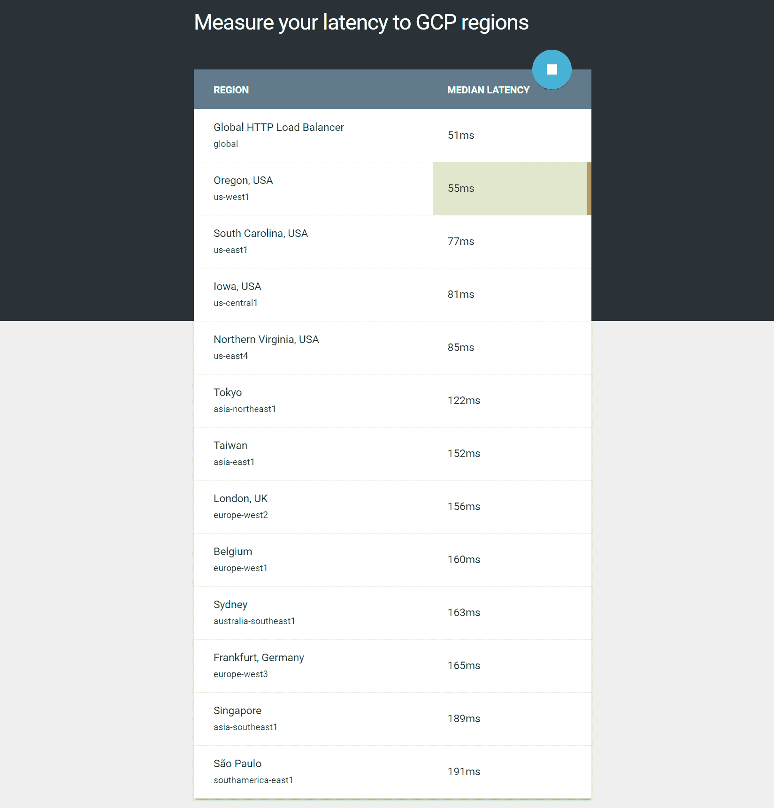

Measure Google Cloud Platform latency

你也可以利用 [CloudHarmony](https://cloudharmony.com/speedtest) ，这是一个云比较工具。您可以测试延迟、DNS、上行链路和下行链路等内容。

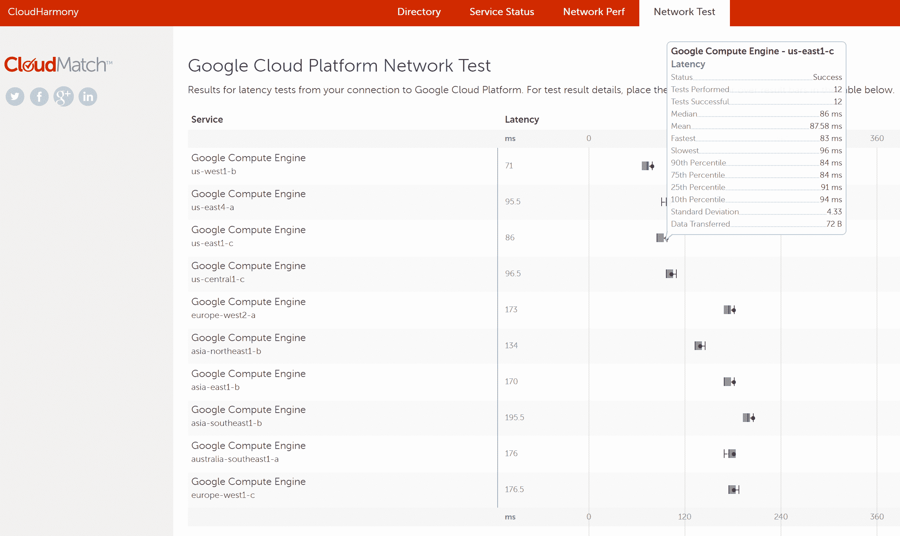

CloudHarmony network test

## 缩短网络延迟的快速方法

总而言之，这里有一些快速减少网络延迟的方法。

*   正如我们上面向你展示的，把你的网站放在一个离你的访问者更近的服务器上应该是第一位的。这有助于减少 ping 次数和网络跳数。
*   利用[内容交付网络](https://kinsta.com/blog/wordpress-cdn/) (CDN)提供来自全球 pop 的缓存资产。这有助于消除可能不靠近您的主机服务器的访问者的网络延迟。查看如何在你的 WordPress 网站上[启用 Kinsta CDN](https://kinsta.com/help/kinsta-cdn/) 。
*   由于并行化，利用 [HTTP/2](https://kinsta.com/learn/what-is-http2/) 协议来最小化往返次数。所有 Kinsta 服务器上都启用了 HTTP/2。唯一的要求是，你的网站是运行在 HTTPS。
*   [减少外部 HTTP 请求的数量](https://kinsta.com/blog/make-fewer-http-requests/)。根据其服务器的位置，每种服务器都有自己的额外延迟。查看我们关于[分析第三方表现](https://kinsta.com/blog/third-party-performance/)的帖子。
*   使用具有快速查找时间的[高级 DNS 提供商](https://kinsta.com/blog/premium-dns/)。
*   当页面加载时，利用[预取和预渲染](https://medium.com/reloading/preload-prefetch-and-priorities-in-chrome-776165961bbf)在后台执行任务。
*   实施我们在这本大型指南[中提供的一些高级技巧，如何加速你的 WordPress 网站](https://kinsta.com/learn/speed-up-wordpress/)(终极指南)

## 摘要

希望现在您对网络延迟有了更多的了解，为什么它很重要，以及它如何影响您的站点。为了确保快速加载，请确保选择一台离您的访客和客户最近的服务器。你有什么想法？你是否经历过由于网站被放置在错误的位置而导致的缓慢加载时间？请在评论中告诉我们。

* * *

让你所有的[应用程序](https://kinsta.com/application-hosting/)、[数据库](https://kinsta.com/database-hosting/)和 [WordPress 网站](https://kinsta.com/wordpress-hosting/)在线并在一个屋檐下。我们功能丰富的高性能云平台包括:

*   在 MyKinsta 仪表盘中轻松设置和管理
*   24/7 专家支持
*   最好的谷歌云平台硬件和网络，由 Kubernetes 提供最大的可扩展性
*   面向速度和安全性的企业级 Cloudflare 集成
*   全球受众覆盖全球多达 35 个数据中心和 275 多个 pop

在第一个月使用托管的[应用程序或托管](https://kinsta.com/application-hosting/)的[数据库，您可以享受 20 美元的优惠，亲自测试一下。探索我们的](https://kinsta.com/database-hosting/)[计划](https://kinsta.com/plans/)或[与销售人员交谈](https://kinsta.com/contact-us/)以找到最适合您的方式。