# 19 个强大的时事通讯例子，帮助你掌握电子邮件营销

> 原文：<https://kinsta.com/blog/newsletter-examples/>

寻找时事通讯的例子来帮助你掌握电子邮件的力量？

在 2022 年，电子邮件营销不是你可以忽视的事情——电子邮件订户成为付费客户的可能性是来自[有机搜索的访客的 19 倍。](https://kinsta.com/blog/wordpress-seo/)

这是有道理的，对吗？毕竟，他们是回来的，感兴趣的，潜在的买家，而不仅仅是随机的访客。

但是如果你想利用这种力量，你需要每周写一份值得一读的时事通讯。只有拥有正确的新闻稿内容、设计和交付方式，您才能创建一份能够吸引受众并推动销售的新闻稿。

在本帖中，我们将涵盖不同类别中的 19 个简讯示例，并详细解释它们为什么如此有效。

T3】

## 一份好的时事通讯的关键要素

完美的简讯没有单一的公式。

你必须考虑你的目标受众、行业以及过去对你有效的方法。

但是伟大的电子邮件通讯通常有一些共同的元素。它们包括:

*   一个标志
*   清除 CTA
*   引人注目的相关主题
*   精彩的特色图片

我们将逐一介绍，从徽标开始。

[你知道吗，✨19 times✨的电子邮件订户比有机搜索的访客更有可能成为付费客户？😮点击此处查看如何提升你的电子邮件简讯👇 点击推文](https://twitter.com/intent/tweet?url=https%3A%2F%2Fkinsta.com%2Fblog%2Fnewsletter-examples%2F&via=kinsta&text=Did+you+know+that+email+subscribers+are+up+to+%E2%9C%A819+times%E2%9C%A8+more+likely+to+become+paid+customers+than+visitors+from+organic+search%3F+%F0%9F%98%AESee+how+you+can+level+up+your+email+newsletter+here+%F0%9F%91%87&hashtags=EmailTips%2CEmailMarketing)

### 从标志开始(品牌是至关重要的)

你在你的简讯中投入了大量的工作和思想，你希望每个订阅者都将它与你的品牌和公司联系起来。

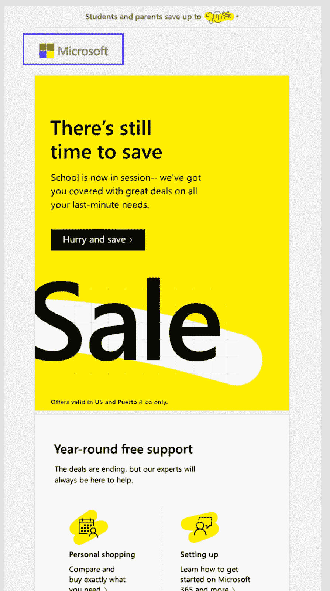

带有标志的微软简讯。

像微软或苹果这样的大品牌明白，与潜在客户的每一次互动都是宣传他们公司的机会，他们不会忽视电子邮件沟通。

这些巨头都不回避把他们的商标贴在所有促销邮件的最上面。

还有其他方法可以给你的电子邮件简讯打上品牌，比如使用品牌颜色和用一致的声音写作。

### 清除 CTA 推动销售

根据最新的电子邮件营销统计数据，电子邮件营销的投资回报率高达 42 美元。但前提是你能利用电子邮件建立关系并推动销售。

行动号召(CTA)是将电子邮件收件人从被动的读者转变为采取行动的人，比如购买你的产品。

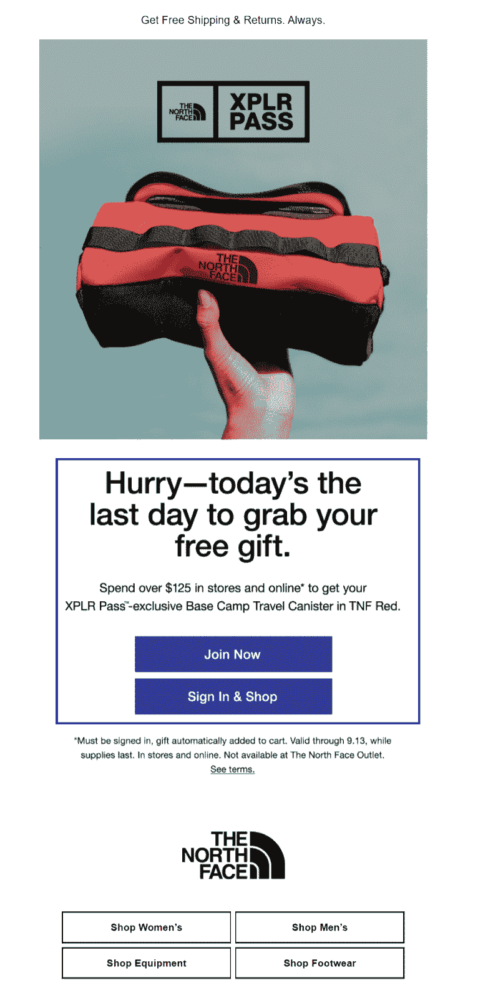

The North Face email newsletter with CTAs.

这些是至关重要的，主要是如果电子邮件的目标是推广产品或服务，而不是进一步建立关系。

### 相关的、引人注目的主题(和主题)

每个主题行(以及时事通讯的主题)都应该吸引注册接收它的读者。

但这对于一个注册电子商务网站获得 20%折扣优惠券的人来说，与注册 SaaS 行业状况信息通讯的人来说，意味着非常不同的事情。

因此，在构思主题和主题句时，要把你的受众放在心上。当他们[第一次注册](https://kinsta.com/blog/how-to-build-an-email-list/)你的时事通讯时，他们在寻求什么好处？

如果你有很多因各种原因注册的用户，如果你想最大化参与度，你应该对这些用户进行细分。

例如，您可以根据用户注册的登录页面对他们进行分类。这是向每个人发送更多相关电子邮件的简单方法。

列表细分只是电子邮件营销最佳实践的众多伟大建议之一。

### 专业特色图片(或 gif)提高参与度

试图仅用文本来抓住读者的注意力是一个挑战。最好的时事通讯知道如何使用特色图片(甚至是 gif 图片)来吸引你。

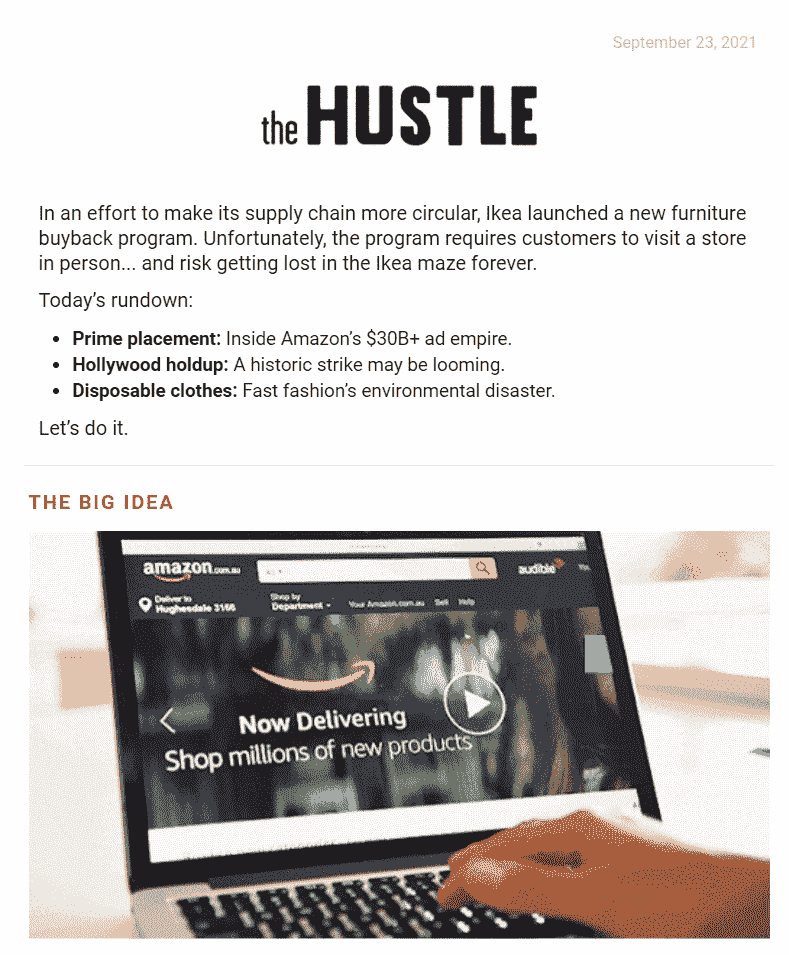

奔忙的邮件通迅。

电子邮件营销软件，如 [Mailchimp](https://kinsta.com/blog/how-to-use-mailchimp/) 或其他[流行的替代品](https://kinsta.com/blog/mailchimp-alternatives/)，在创建简讯活动时会很有帮助。从有很多[好选项可供选择。](https://kinsta.com/blog/email-marketing-software/)

## 5 个吸引您注意力的产品更新简讯示例

让客户了解新产品、功能或即将举行的活动是电子邮件简讯的基本用途。

一份成功的产品更新简讯会抓住读者的注意力，并解释他们为什么应该关注最新的产品发布。

这里有五个我们喜欢的。

### 1.三星电子

三星最近发布了三星 Z Flip3 和 Fold3 可折叠手机。这份时事通讯公布了新产品，并提供了一些特别优惠。

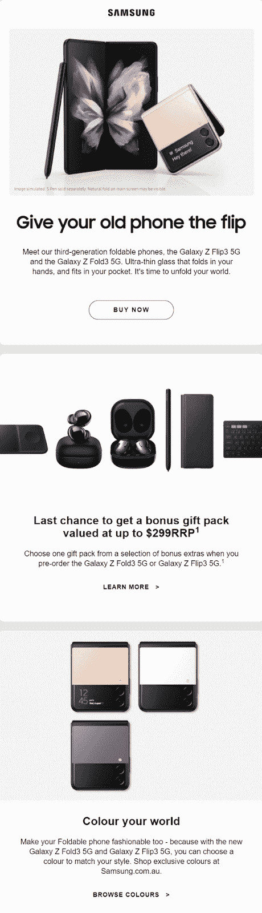

三星产品公告邮件。

#### 为什么会被淘汰

时事通讯以高质量的图片和醒目的大标题吸引您的注意力。每个部分都有明确的 CTA。

虽然新闻简报有几个部分，但它将最重要的内容和主要的 CTA 按钮(产品发布和“立即购买”按钮)放在折页上方。

### 2.星巴克

星巴克的粉丝们每年都热切期待南瓜香料拿铁和其他秋季饮品的到来。这份时事通讯让订户知道时机已到。

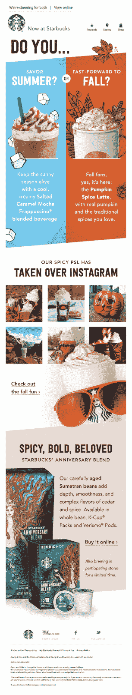

星巴克秋季产品发布简讯。

#### 为什么会被淘汰

这封邮件通过给读者一个选择来吸引他们。它不只是提供信息，而是要求他们思考:夏天还是秋天？

时事通讯也有一个有趣的流行色彩的布局，星巴克的标签在顶部清晰可见。

### 3.金斯塔

嘿，那是我们！

我们最新的[电子邮件简讯](https://kinsta.com/wordpress-newsletter/)首先宣布推出我们的选择性推送功能，然后提供精选的博客和视频内容。

稍后，我们将向您展示更多内容推广电子邮件简讯的示例。

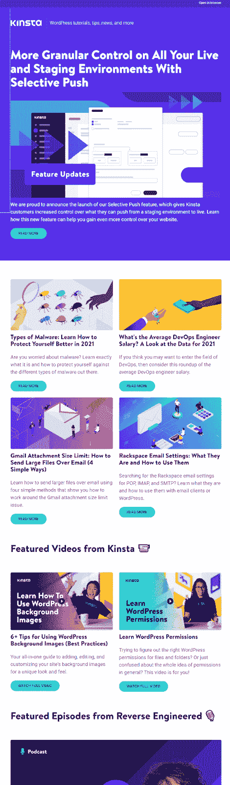

金士达产品功能发布邮件简讯。

#### 为什么会被淘汰

金斯塔品牌并没有停止在标志之后。熟悉该品牌的人都能认出这封邮件的颜色和风格。

这封邮件里有适合每个人的东西。如果读者对产品功能更新不感兴趣，他们可能会被吸引到 Kinsta 网站，以了解更多关于恶意软件或如何发送大型附件的信息。
T3】

### 4.斯巴鲁

斯巴鲁宣布斯巴鲁 STI S209 采用这种圆滑的电子邮件设计。主题是，“等等……有多少台 S209 正在生产？”

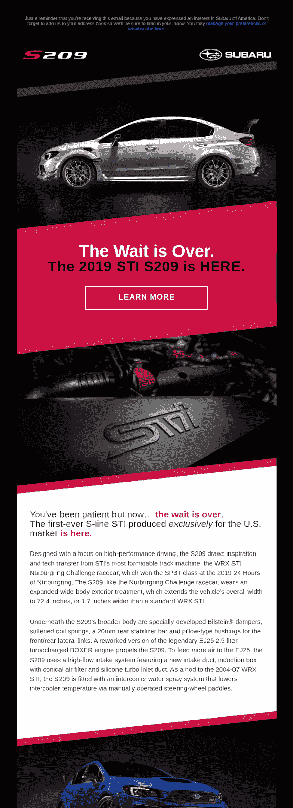

斯巴鲁产品公告邮件简讯。

#### 为什么会被淘汰

首先，光是主题行就很引人注目。答案是什么？是个小数字吗？想买一台 S209 要抓紧时间吗？

时事通讯的设计具有精致的高科技外观，并使用高质量的照片。这封电子邮件强调了这样一个观点，即你应该迅速行动以获得这一独家产品。

### 5.联想（电脑的品牌名）

与上面的斯巴鲁电子邮件一样，联想选择了黑色背景下的大胆颜色来宣布军团 7。

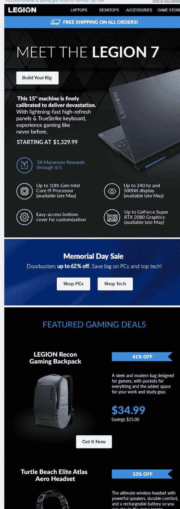

联想产品发布邮件简讯样本。

#### 为什么会被淘汰

这是一个有吸引力的，现代的电子邮件设计，有很好的图像。

该电子邮件还介绍了其他几款产品，但军团 7 规格、免费送货和 CTA 都在顶部附近。“建立你的装备”是一个整洁的 CTA，将吸引喜欢定制他们的笔记本电脑的读者。

## 6 个推动销售的电子商务简讯示例

如果你发送电子邮件来推广你的电子商务业务，竞争是激烈的。你的订户每天都会收到大量电子商务邮件，敦促他们购买这个或那个。

你必须鹤立鸡群。

以下六个电子邮件简讯向你展示了如何创建一个引人注目的电子商务电子邮件简讯。

### 1.沃比·帕克

这封来自 Warby Parker 的电子邮件简讯是电子邮件营销极简主义的一课。你不需要五页的长篇大论来销售一个消费品。

有了合适的视觉效果，你可以让产品自己说话。

沃比帕克电子商务邮件简讯。

#### 为什么会被淘汰

Warby Parker 明白，在做出购买眼镜的决定时，外观很重要。

这就是为什么它会抓住每一个机会，在营销邮件中突出公司最有信心的设计。

该公司还充分利用 gif 来展示一系列不同的产品，或者像这里一样，展示每种可能颜色的单个框架。

### 2.芙蓉和蜜蜂

Fleur and Bee 是一家护肤品公司，致力于生产自然、道德的产品。对 Fleur 和 Bee 及其顾客来说，素食、无虐待和环境友好对于拥有有意识的、容光焕发的皮肤至关重要。

## 注册订阅时事通讯

### 想知道我们是怎么让流量增长超过 1000%的吗？

加入 20，000 多名获得我们每周时事通讯和内部消息的人的行列吧！

[Subscribe Now](#newsletter)

芙蓉与蜜蜂电子商务邮件简讯。

**为什么会被淘汰**

通过这封邮件，Fleur 和 Bee 忠于品牌。吸引人的主图像给人一种印象，即展示的产品是由简单、天然的成分制成的，文案强调了公司的价值观。

CTA 上的促销代码总是吸引更多点击的好方法。

### 3.告密

Tattly 出售临时纹身——但不是你记得的童年纹身。Tattly 纹身是由专业艺术家设计的，他们从每笔销售中提成。

这封电子邮件简讯宣布了 Tattly 的“Laboryay”销售的最后一天。

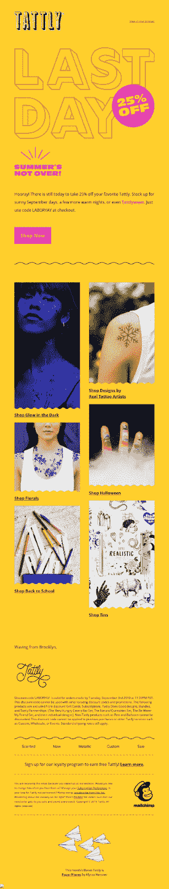

公开出售促销邮件简讯。

#### 为什么会被淘汰

这封邮件在制造紧迫感方面做得很好。你不能忘记这是你告密的最后一天。

明亮的色彩吸引你的注意力，艺术照片是一家专注于高品质可穿戴艺术的公司的品牌。

### 4.珀洛东

Peloton 具有非常一致的品牌外观和感觉，这封电子邮件简讯也不例外。

像斯巴鲁和联想——其他品牌希望传达他们的产品是复杂的，强大的，高科技的——Peloton 采用了黑色背景和高对比度的文字。

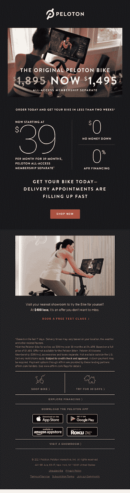

Peloton 电子邮件简讯。

#### 为什么会被淘汰

Peloton 吸引你的承诺是你可以在这辆车上省下一大笔钱。

不仅降价是你看到的第一件事，而且$0 和$0 APR 的会员价也用[大字体](https://kinsta.com/blog/best-fonts-for-email/)强调。

然后，这封邮件会告诉你送货预约很快就满了，从而产生一种紧迫感。整个通讯设计是美丽的，有吸引力的抱负的照片。

### 5.布鲁克斯在跑步

很难让鞋子的照片看起来有趣，但布鲁克斯做到了。

这封邮件宣传跑鞋和运动胸罩，并提供一些有用的工具。

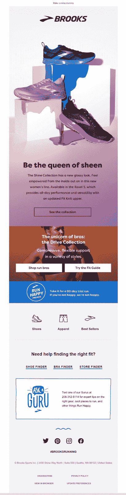

布鲁克斯运行电子商务邮件简讯。

#### 为什么会被淘汰

图像不仅仅是产品的图片。很耐人寻味，很有艺术性。这些颜色增加了吸引力，并与鞋子的光泽相得益彰。

这封邮件不只是向你展示产品。它提供了一个在线鞋子和胸罩搜索工具来帮助你找到合适的。

如果这些有价值的工具没有说服你去看看布鲁克斯的网站，也许你会打电话给公司，从一位大师那里获得额外的技巧，就像电子邮件底部宣传的那样。

### 6.臀部

你知道什么是旅行吗？

与我们世界一流的支持团队一起体验卓越的 WordPress 托管支持！与支持我们财富 500 强客户的同一个团队聊天。[查看我们的计划](https://kinsta.com/plans/?in-article-cta)

这封邮件没有告诉你。但它确实有一个很棒的产品在屏幕上跳舞的 GIF。如果你还是不明白，你会想要点击并找到答案。

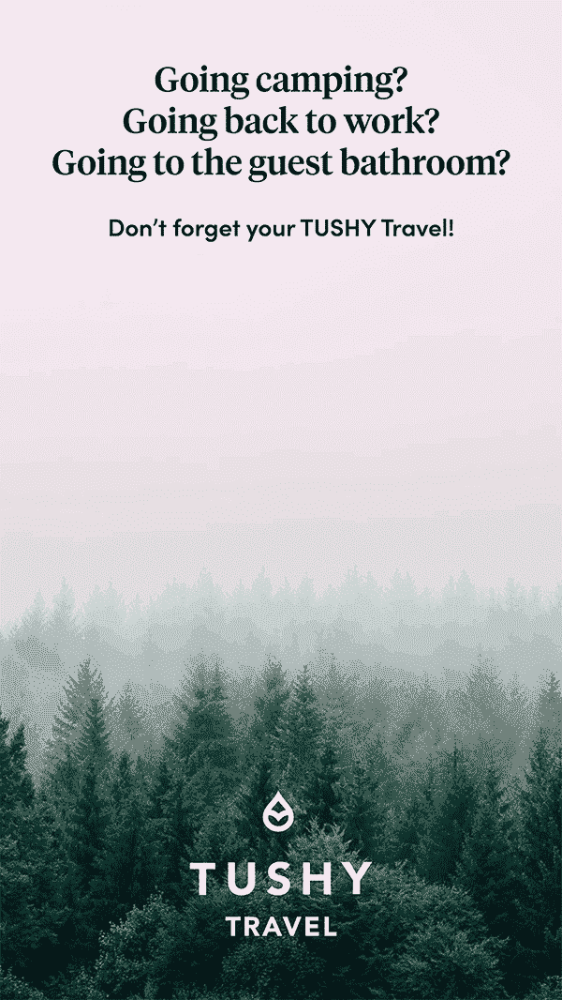

TUSHY 电子邮件通迅样本配 GIF。

#### 为什么会被淘汰

这封邮件的正文只有 18 个字(不包括底部巧妙的退订提示)，但是非常有效。

读者会情不自禁地观看亮粉色便携式坐浴盆的动画。对于不熟悉该产品的订户来说，它肯定会引起兴趣。对于那些已经了解 TUSHY 的人来说，这封有趣的邮件让这家公司更令人难忘。

## 5 个推广内容的时事通讯示例

电子邮件简讯是分享内容的好方法。一些电子邮件时事通讯也从网络上收集内容与读者分享。

重要的是记住你的听众。他们对阅读什么感兴趣？为什么订阅你的公司时事通讯对他们有价值？

这五个电子邮件简讯提供相关的，有价值的信息给他们的目标读者。

### 1.居住

Dwell 是一个杂志和在线中心，面向家居设计爱好者和专业人士。这份来自 Dwell 的时事通讯介绍了网站上的购物指南、特色产品和热门文章。

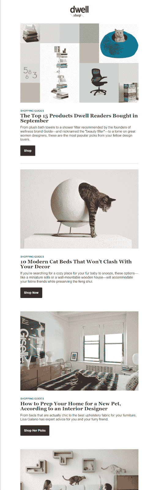

详解内容推广邮件快讯

#### 为什么会被淘汰

[社交证明](https://kinsta.com/blog/trust-badges/)获得点击量。人们对受欢迎和受他人喜爱的东西感兴趣。

这就是为什么 Dwell 作出了一个很好的选择，它以“Dwell 读者在九月份购买的 15 种产品”开始了这篇通讯。

九月和十月排名靠前的文章也有同样的效果。其他人喜欢这些文章，所以你也应该看看。

另外，这封邮件设计得很好，有高质量的照片。

### 2.蚊子

Moz Top 10 并不像这个列表中的一些电子邮件通讯那样华丽，但它给了人们他们想要的东西——互联网上最有价值的 SEO 和营销技巧。

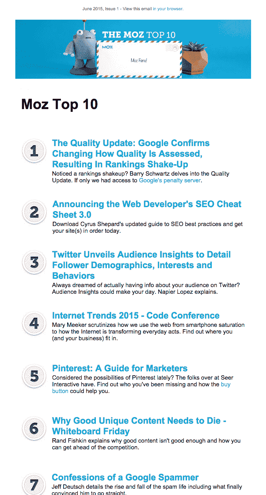

墨子十大策展内容邮件快讯

这种电子邮件设计简单明了。如果你对搜索引擎优化和在线营销感兴趣，你一定会找到一些值得点击的东西。每个链接对典型的 Moz 读者来说都是相关的和有价值的。

Moz 证明了花里胡哨并不总能让邮件变得更好。

### 3.美国防止虐待动物协会(American Society for the Prevention of Cruelty to Animals)

美国防止虐待动物协会是一个非营利组织，自 1866 年以来致力于动物福利。

这个话题很严肃，但是这个以万圣节为主题的电子邮件时事通讯很有趣。

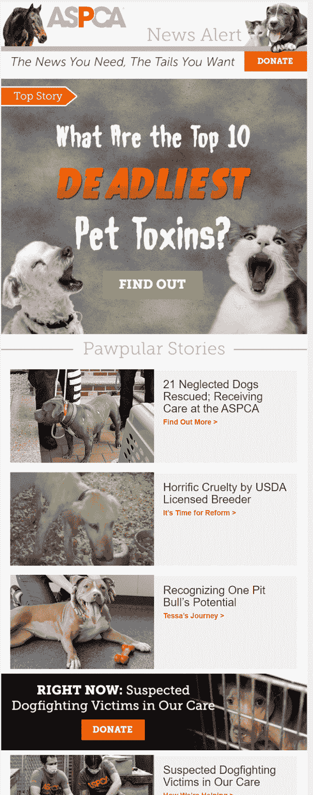

ASPCA 邮件简讯示例

#### 为什么会被淘汰

我们知道这份时事通讯的订户都是动物爱好者，所以可爱的主角形象是一个好的开始。读者也一定会对“pawpular”和“你想要的尾巴”这样的短语微笑

ASPCA 是一个非盈利组织，所以寻求捐赠总是很重要的。这封电子邮件上的[捐赠按钮以橙色粗体显示在最上方。阅读第一篇博文的 CTA 也很引人注目，位于折叠上方。时事通讯提供各种内容和特别优惠。](https://kinsta.com/blog/wordpress-donation-plugins/)

这封电子邮件简讯有一个干净的布局，并符合 ASPCA 的品牌颜色。

### 4.国家地理

《国家地理》以其令人惊叹的照片而闻名，这份电子邮件时事通讯符合标准。

它还提出了一个旨在让你停下来思考的问题:行星还是塑料？

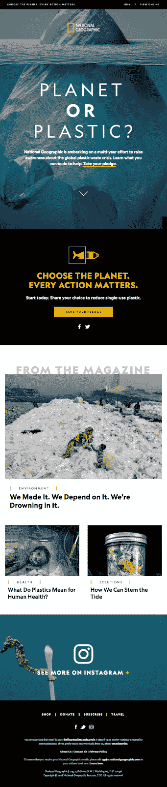

国家地理邮件通迅示例

**为什么会被淘汰**

这是一封从上到下都很漂亮的邮件。这张图片乍一看像一座冰山，但实际上是一个漂浮的塑料袋，吸引读者不仅仅是看一眼。

时事通讯的内容集中在一个主题上，并为点击 CTA 提供了一个强有力的理由:它可能有助于拯救地球。

邮件的最后部分要求订阅者参与国家地理的社交媒体。

### 5.每日收入

每日摘要是新闻故事的每日摘要，以简单、易读、有时幽默的方式解释。

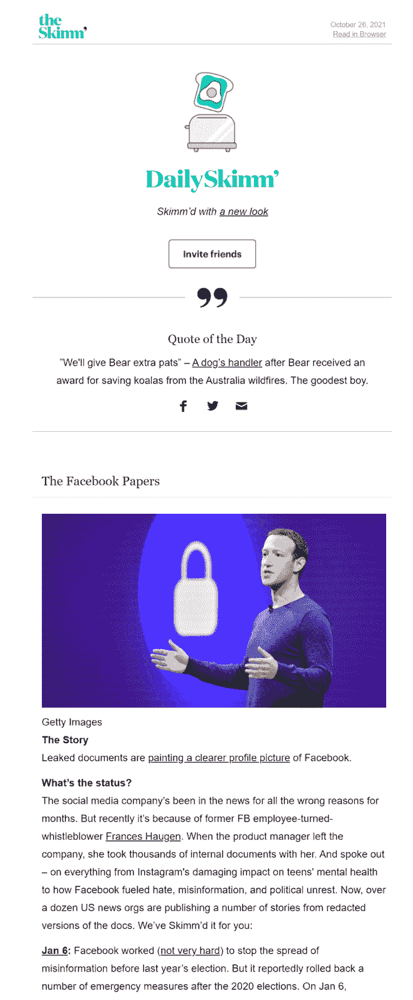

每日克扣’邮件简讯。

#### 为什么会被淘汰

每日 Skimm 有一个一致的和可识别的品牌声音。

每天的浏览覆盖了相当多的新闻故事，但对于一封邮件来说并不过分，因为文本被分成了易于管理的片段，并配有巧妙的标题。

## 哪里可以找到更多的灵感——无需订阅数百份时事通讯

如果你不想设置一个一次性的电子邮件帐户并注册数百份简讯，我们为你提供了一个有趣的内幕提示，它将帮助你轻松获得数千个品牌的简讯。

是一个电子邮件时事通讯的搜索引擎。您可以键入品牌名称(或类别)并浏览各种行业、语言和国家的时事通讯。

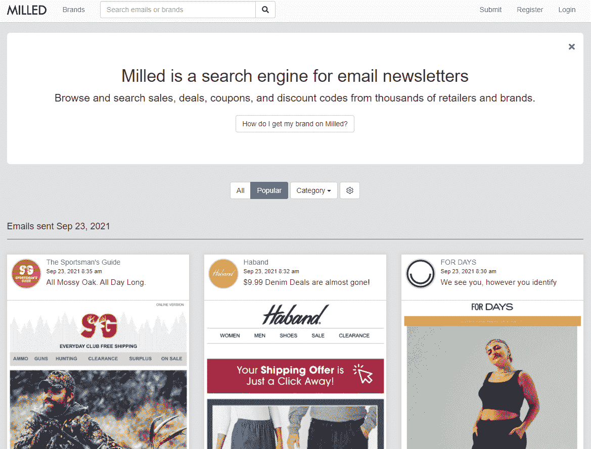

胎记邮件简讯搜索引擎。

你甚至可以找到直接的竞争对手(尽管理想情况下，你应该已经订阅了他们的时事通讯)。

[真正好的邮件](https://reallygoodemails.com/)是另一个邮件数据库。该网站不仅仅包括任何旧的营销电子邮件。它们都是(你猜对了)非常好的邮件。

这是一个为你的品牌寻找时事通讯想法的好地方。

[在本指南的帮助下，驾驭电子邮件营销的力量📧⬇️ 点击推文](https://twitter.com/intent/tweet?url=https%3A%2F%2Fkinsta.com%2Fblog%2Fnewsletter-examples%2F&via=kinsta&text=Harness+the+power+of+email+marketing+with+help+from+this+guide+%F0%9F%93%A7%E2%AC%87%EF%B8%8F&hashtags=EmailTips%2CEmailMarketing)

## 摘要

无论你是想卖一个科技产品，还是想建立一个专业顾问的形象，制作一份成功的时事通讯都需要许多相同的元素。

探索你的竞争对手在做什么，遵循良好的设计实践，包括基本的时事通讯元素，永远不要忘记谁是你的目标受众。

使用他们的语言，说出他们的问题，并提供他们需要的解决方案。电子邮件时事通讯不仅仅是你应该扔在一起的东西。

简讯是一个无价的营销渠道，你可以用它来建立你的品牌和业务。从这些时事通讯的例子中学习，然后[为你的观众创造更好的东西](https://kinsta.com/blog/email-marketing-tips/)。

* * *

让你所有的[应用程序](https://kinsta.com/application-hosting/)、[数据库](https://kinsta.com/database-hosting/)和 [WordPress 网站](https://kinsta.com/wordpress-hosting/)在线并在一个屋檐下。我们功能丰富的高性能云平台包括:

*   在 MyKinsta 仪表盘中轻松设置和管理
*   24/7 专家支持
*   最好的谷歌云平台硬件和网络，由 Kubernetes 提供最大的可扩展性
*   面向速度和安全性的企业级 Cloudflare 集成
*   全球受众覆盖全球多达 35 个数据中心和 275 多个 pop

在第一个月使用托管的[应用程序或托管](https://kinsta.com/application-hosting/)的[数据库，您可以享受 20 美元的优惠，亲自测试一下。探索我们的](https://kinsta.com/database-hosting/)[计划](https://kinsta.com/plans/)或[与销售人员交谈](https://kinsta.com/contact-us/)以找到最适合您的方式。