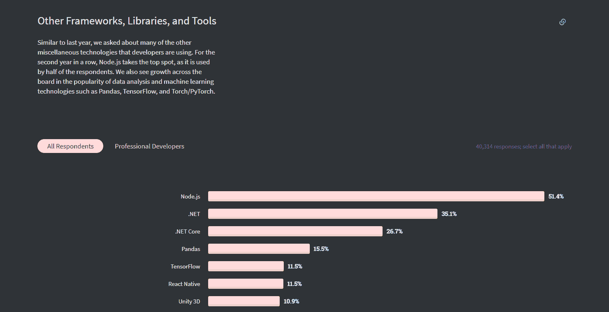
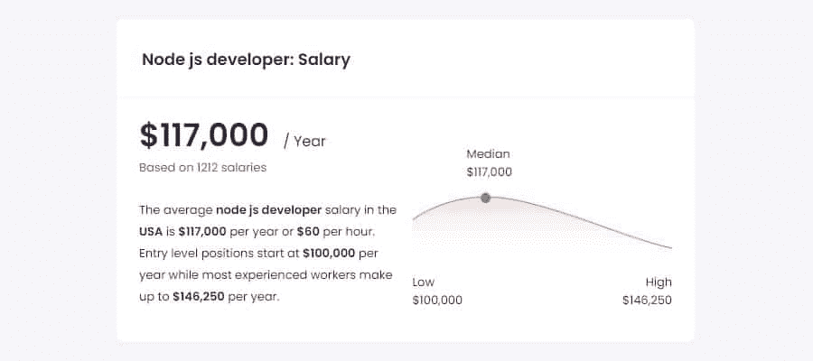
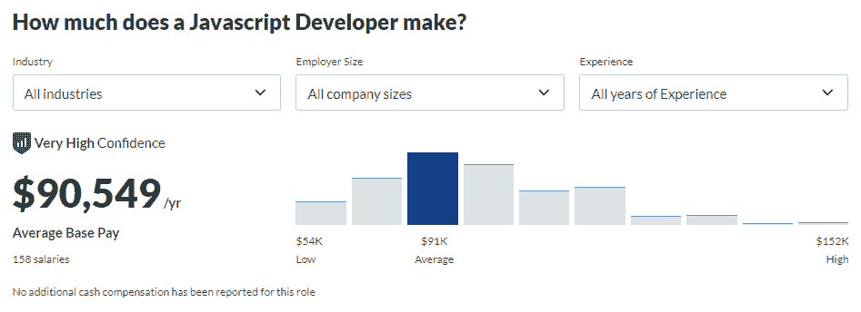
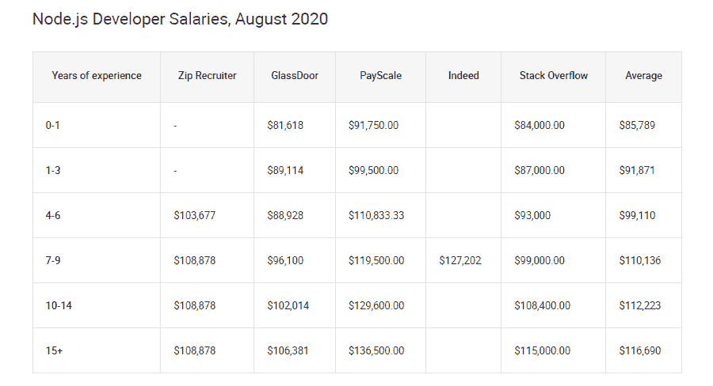
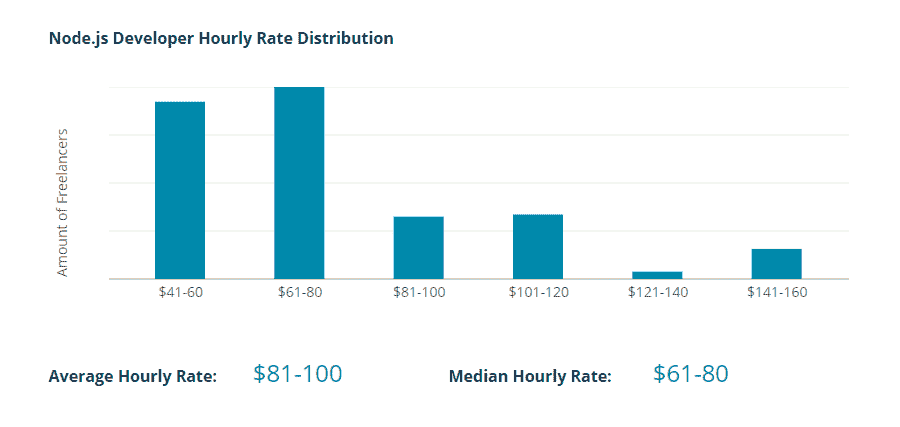
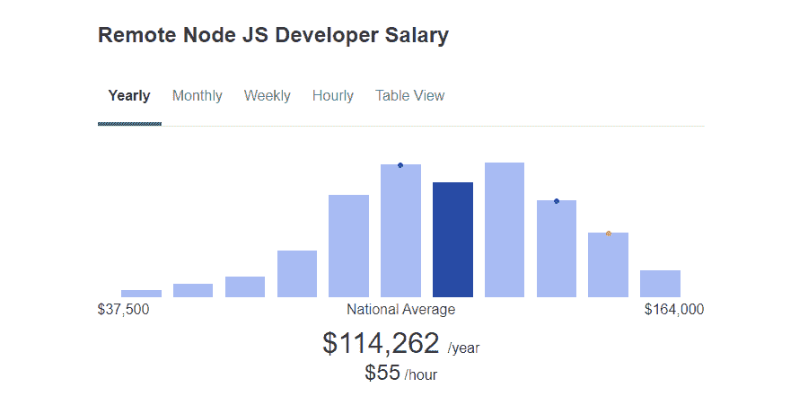

# Node.js 开发者工资平均多少？看看 2022 年的数据

> 原文：<https://kinsta.com/blog/node-js-developer-salary/>

需要高薪工作的开发者应该看看 [Node.js](https://kinsta.com/knowledgebase/what-is-node-js/) 。这种流行的 JavaScript 工具已经存在了几十年，但是对掌握它的人的需求仍然很大。

您有兴趣成为 Node.js 开发人员并进一步探索 [JavaScript](https://kinsta.com/knowledgebase/what-is-javascript/) 吗？薪水值得你花时间吗？本文将回答许多关于 Node.js 的常见问题。我们还包括各种统计数据，以帮助您决定这是否是您的职业道路。

激动吗？我们开始吧！

## Node.js 是什么？如何使用？

JavaScript 一直以来都是一种通用的编程语言，这也是为什么它是世界上最流行的语言之一，如果不是 T2 最流行的话。虽然它以创建高级客户端脚本的能力而闻名，但您也可以使用它通过合适的工具在服务器端创建后端应用程序。

Node.js 是一个后端 JavaScript 运行时环境——一个允许您在 web 浏览器之外编写服务器端和客户端 JavaScript 的程序。

Node.js.

与 PHP 和 [Python](https://kinsta.com/blog/nodejs-vs-python/) 相比，这种方法有几个显著的[优势——node . js 函数不会阻塞(它们并发运行)。相比之下，每个 PHP 或 Python 命令都会停止其他命令，直到它执行完毕。换句话说，JavaScript 服务器应用程序可以更快，实时性更好。](https://kinsta.com/blog/php-vs-javascript/)

Node.js 是开源的，免费的，所以开发人员喜欢它，尤其是那些想把他们的编码提升到一个新水平的 JavaScript 开发人员。雇用这些开发人员的人对今天更快、实时、事件驱动的服务器感兴趣，因此 Node.js 开发人员需求量很大。

[Interested in working as a Node.js developer? 👀 Read this before you start applying for jobs 👩‍💻Click to Tweet](https://twitter.com/intent/tweet?url=https%3A%2F%2Fkinsta.com%2Fblog%2Fnode-js-developer-salary%2F&via=kinsta&text=Interested+in+working+as+a+Node.js+developer%3F+%F0%9F%91%80+Read+this+before+you+start+applying+for+jobs+%F0%9F%91%A9%E2%80%8D%F0%9F%92%BB&hashtags=Nodejs%2CDeveloper)

### Node.js 开发者是做什么的？

Node.js 开发人员有一套独特的职责和技能。作为一份要求你了解各种技术的更复杂的工作，学习必要的技能更具挑战性，但报酬也更高。

下面，我们列出了 Node.js 开发人员的主要需求。你需要了解 Node.js(以及 JavaScript)，但是如果你想被雇佣的话，还有更多。如果你想得到一份 Node.js 开发人员的工作，请研究一下这些技能:

*   精通 JavaScript 和 Node.js 技术，以及关于流行框架和其他扩展的工作知识
*   了解后端技术，能够使用 Node.js 构建服务器端应用程序
*   使用[数据库](https://kinsta.com/blog/mariadb-vs-mysql/)的能力
*   前端技术(如 [HTML 和 CSS](https://kinsta.com/knowledgebase/edit-wordpress-code/) )和在客户端使用 JavaScript 的技能
*   安全编程标准
*   沟通和组织能力以及与其他开发人员合作的能力

你可能还需要一个计算机科学领域的学士学位或更好的学位，尽管不是所有的工作都需要这个，如果你有实践经验来弥补的话。

作为 Node.js 开发人员，您通常会在服务器端工作，但是您可能会与前端开发人员合作。这样看来，Node.js 开发就非常像是[全栈开发](https://kinsta.com/blog/full-stack-developers-salary/)的一种更加专业化的形式。

您可能不只是在使用 Node.js，而是在使用整个服务器。因此，如果你对后端或全栈开发以及 JavaScript 感兴趣，这可能是适合你的工作。

也可以使用 Node.js 开发前端应用；只是程序的一个不太常见的用法。如果你觉得这个想法更吸引人，你还是可以找到工作的。

### Node.js 需求量大吗？

Node.js 一直很受欢迎，但是最近你可能越来越多地听说它。

JavaScript 本身是一种很有潜力的脚本语言。它一直在 TIOBE 指数的[前十名中排名，所以如果你想挑选一门有就业前景的语言，这是一个不错的选择。](https://www.tiobe.com/tiobe-index/)

Node.js 在 2019 年和 2020 年[栈溢出开发者调查](https://insights.stackoverflow.com/survey/2020)中成为最常用的框架，超过 50%的受访者使用该框架。在 [2021](https://insights.stackoverflow.com/survey/2021) 中，受欢迎程度有所下降，但它仍然是第六大最受欢迎的技术，而[对 Node.js 的工作搜索增长了 57%](https://www.hiringlab.org/2018/11/29/hottest-skills-tech-job-searches1/) 。

Job searches for Node.js.

尽管如此，[寻找 Node.js 开发者的雇主](https://blog.hackerrank.com/early-tech-talent-trends/)经常发现他们无法雇佣足够的开发者来满足他们的需求。这里的高需求和低供给会导致高于平均水平的工资，更容易找到工作。

Node.js 可能不是最热门的职业，但很明显这不仅仅是一种趋势。如果你想学习一门能提供稳定高薪工作的技术，Node.js 将是一个绝佳的选择。

## Node.js 开发者平均薪资是多少？

Node.js 开发人员的工资较高。这是由于熟练的 Node.js 开发人员和希望雇佣他们的人之间的差距。自己看:

*   [人才](https://www.talent.com/salary?job=node+js+developer):11.7 万美元/年，低的 10 万美元，高的 14.6 万美元。
*   [glass door](https://www.glassdoor.com/Salaries/node-js-developer-salary-SRCH_KO0,17.htm):88k/年，低的 68k，高的 114k。
*   [zip recruiter](https://www.ziprecruiter.com/Salaries/Node-JS-Developer-Salary):11.4 万美元/年，低的 7.3 万美元，高的 15.5 万美元。
*   [工资等级](https://www.payscale.com/research/US/Job=Node.JS_Developer/Salary):10.5 万美元/年，最低 6.7 万美元，最高 11.3 万美元。

把这些放在一起，你会得到 10.6 万美元/年的平均估计工资。除了一个来源之外，所有来源都列出了超过 10 万美元的年薪，这是一个好迹象。

这一工资比业内类似的开发工作略高，也比求职者过饱和的热门职位高很多，如 [PHP 开发人员](https://kinsta.com/blog/php-developer-salary/)或 [WordPress 开发人员](https://kinsta.com/blog/wordpress-developer-salary/)。

Average Node.js developer salary.

但是类似的工作比如全栈或者 JavaScript 开发呢？以及 Node.js 开发者薪资看起来如何取决于地点和经验水平？我们来看看数据。

### Node.js 开发人员薪资与 JavaScript 开发人员薪资

如果你已经打算学习 JavaScript，你可能想知道 JavaScript 开发人员的工资与 Node.js 开发人员相比如何。专业化的工作往往比一般的工作，如[网络开发员](https://kinsta.com/blog/web-developer-salary/)工资高，数字也支持这一点。以下是统计数据:

## 注册订阅时事通讯

### 想知道我们是怎么让流量增长超过 1000%的吗？

加入 20，000 多名获得我们每周时事通讯和内部消息的人的行列吧！

[Subscribe Now](#newsletter)

*   实际上:11 万美元/年，基于 400+报告的工资
*   glass door:91，000 美元/年，最低 5.4 万美元，最高 15.2 万美元
*   zip recruiter:7.1 万美元/年，最低 2.4 万美元，最高 13.4 万美元
*   工资等级:8.2 万美元/年，最低 5.4 万美元，最高 12.7 万美元

Average salary a Javascript developer makes.

平均年薪为 8.9 万美元，而 Node.js 的平均年薪为 10.6 万美元。如你所见，如果你想赚更多的钱，专精会好很多。利基技能集更难开发，但它比学习一门编程语言能让你走得更远。

### 按经验划分的 Node.js 开发人员工资

经验水平会对你的最终薪水产生重大影响。雇主愿意为有几十年经验的开发人员支付高价，而且你可以期待你的薪水随着你花更多的时间练习你所选择的技能而增加。

但有时，初级工资与平均工资相比微不足道，以至于很难获得足够的技能来赚取体面的工资。Node.js 也是这样吗？

根据 [FullStack Labs](https://www.fullstacklabs.co/blog/node-js-developer-salaries) 的数据，初级 Node.js 开发者平均收入 86k 美元/年；拥有 4-6 年经验的中级开发人员年薪为 99k 美元，高级开发人员年薪为 117k 美元。

Average Node.js developer salaries as of August 2020.

在你的整个职业生涯中，从初级到高级，你的工资可能会跃升至每年 3 万美元。即使是初级开发人员的工资也比许多类似的开发工作高一点，但请记住 Node.js 是一个需要大量技术技能的专业职业，因此对初学者来说更具挑战性。

### Node.js 按地点列出的薪金

如果有一件事会对你的薪水产生巨大影响，那就是你在世界上的居住地。许多薪资统计数据都是以美国为中心的，所以如果你住在美国以外的地方，看看 Node.js 的薪资列表:

*   瑞士:9.7 万美元/年。/年)
*   美国:9.2 万美元/年
*   挪威:6.3 万美元/年(54.9 万克朗/年)
*   德国:6.3 万美元/年(5.4 万欧元/年)
*   加拿大:5.8 万美元/年(7.3 万加元/年)
*   澳大利亚:5.8 万美元/年(7.9 万澳元/年)
*   瑞典:57000 美元/年(498000 克朗/年)
*   荷兰:5.6 万美元/年(4.8 万欧元/年)
*   奥地利:5.6 万美元/年(4.8 万欧元/年)
*   英国:5.4 万美元/年(3.9 万美元/年)
*   芬兰:5.2 万美元/年(4.4 万欧元/年)
*   爱尔兰:5.2 万美元/年(4.4 万欧元/年)
*   比利时:4.9 万美元/年(4.2 万欧元/年)
*   法国:4.7 万美元/年(4 万欧元/年)
*   中国:4.4 万美元/年(28.2 万美元/年)
*   新加坡:4.3 万美元/年(5.9 万新元/年)
*   丹麦:4.2 万美元/年(36.8 万克朗。/年)
*   意大利:3.5 万美元/年(3 万欧元/年)
*   西班牙:3.5 万美元/年(3 万欧元/年)
*   保加利亚:2.3 万美元/年(BGN 3.8 万美元/年)
*   葡萄牙:2.3 万美元/年(2 万欧元/年)
*   墨西哥:1.5 万美元/年(30.6 万美元/年)
*   俄罗斯:14，000 美元/年(1m₽/year)
*   印度:每年 9 万美元(₹665k/year)
*   印度尼西亚:6000 美元/年(9200 万印尼盾/年)
*   罗马尼亚:5000 美元/年(19000 卢比/年)
*   乌克兰:千美元/年(₴28k/year)

### 自由职业者 Node.js 开发者工资

自由职业者会给你的潜在薪水带来一些变数。当你被一家公司聘用时，更安全的保证是你的工资数字将更接近平均水平，你将永远知道你每个月都有工资。

需要一流的，快速的，安全的主机为您的新电子商务网站？Kinsta 提供超快的服务器和来自 WooCommerce 专家的 24/7 世界级支持。[查看我们的计划](https://kinsta.com/plans/?in-article-cta)

但是如果你选择自由职业，你能得到多少客户，以及你的收费都取决于你。不能保证你能吸引足够多的客户来养活自己。

另一方面，如果你能建立一个成功的自由职业企业，你可能会发现你的收入远远超过你在一家支付固定工资的公司的收入。

那么，这些数字看起来如何？

根据 ZipRecruiter 的说法，[自由职业 Node.js 开发者](https://www.ziprecruiter.com/Salaries/Freelance-Node-JS-Developer-Salary)每年挣 113，000 美元或每小时 54 美元。CodeMentor 的估计甚至更为慷慨:它列出了 81-100 美元(16.8 万-20.8 万美元/年，假设每周工作 40 小时)的平均时薪[和 61-80 美元(12.7 万-16.6 万美元/年)的中值时薪。](https://www.codementor.io/freelance-rates/nodejs-developers)

Average hourly rate for Node.js developers.

这些估计值远远高于 Node.js 的平均工资，即使是高级 Node.js 开发人员也是如此。作为一名自由职业者起步可能很有挑战性，但是如果你有办法并且愿意尝试，它可能会最终导致一个利润丰厚的职业生涯。

### 远程 Node.js 薪水

随着远程工作越来越受欢迎，尤其是在科技行业，你可能会想，你是否会和远程工作挣得一样多，或者是否从事一份有薪的、面对面的工作更好。

它还与自由职业密切相关，而自由职业往往更为遥远，这可能会使数据有些失真。但是，传统的有薪工作也越来越遥远，公司正在寻找更多在家工作的人来填补空缺。

ZipRecruiter 列出了远程工作的平均年薪为 11.4 万美元，比 Node.js 开发人员的平均年薪高得多。 [Talent.com 的估计](https://www.talent.com/salary?job=Remote+Node+Developer)甚至更高，为 135，000 美元/年，有经验的开发人员年薪高达 145，000 美元/年，入门级职位起薪为 88，000 美元/年。

Arc 的估计更残酷一些:它列出的远程 Node.js 开发人员的平均工资仅为 7.3 万美元/年，高年级学生仅为 8.6 万美元/年，低年级学生甚至更低，为 6 万美元/年。

Average Node.js developer salary for those who work remotely.

就目前情况来看，远程工作似乎仍在行业中找到了立足之地，其可用性可能会因许多情况而有很大差异。你最终可能会比平均水平挣得多，也可能挣得少得多。最好的建议是让你的选择保持开放，寻找报酬合理的工作。

### Node.js 工资与前端、后端和全栈开发人员工资

您可能想知道 Node.js 与前端、后端和全栈开发人员等类似工作相比如何。您可能会对全栈开发特别感兴趣，因为 Node.js 的体验在许多方面是相同的。

由于 Node.js 开发是一个更专业化的工作，所以很有可能有更高的工资。但是让我们比较数据，看看它看起来怎么样。

根据工资等级，前端开发人员每年挣[75k 美元](https://www.payscale.com/research/US/Job=Front_End_Developer_%2F_Engineer/Salary)，而后端开发人员每年挣[81k 美元](https://www.payscale.com/research/US/Job=Back_End_Developer%2F_Engineer/Salary)。最后，我们有[全栈开发人员工资](https://kinsta.com/blog/full-stack-developers-salary/)，平均每年 97k 美元，比 Node.js 开发少 9k 美元。

Back-end developer salaries according to Payscale.

您可能已经知道，前端开发人员在工资方面往往吃亏，而全栈开发人员的工资通常不足以补偿他们更广泛的技能。

如果你想在学习 Node.js 的过程中获得公平的报酬，那么专攻 node . js 开发或类似的工作通常是最好的选择。

[Node.js has been around for decades, but the demand for people who can master it is still going strong. 👩‍💻 Learn how much you could make as a Node.js developer here ⬇️Click to Tweet](https://twitter.com/intent/tweet?url=https%3A%2F%2Fkinsta.com%2Fblog%2Fnode-js-developer-salary%2F&via=kinsta&text=Node.js+has+been+around+for+decades%2C+but+the+demand+for+people+who+can+master+it+is+still+going+strong.+%F0%9F%91%A9%E2%80%8D%F0%9F%92%BB+Learn+how+much+you+could+make+as+a+Node.js+developer+here+%E2%AC%87%EF%B8%8F&hashtags=WebDev%2CNodejs)

## 摘要

平均年薪为 10.6 万美元，从事 Node.js 开发是值得的。如果你对 JavaScript 感兴趣，想从事专门的技术工作，并对全栈工作感兴趣，它可能适合你。

不确定从哪里开始？你可以随时查看 Node.js 文档，或者寻求 OpenJS 提供的 [Node.js 认证](https://openjsf.org/certification/)。或者，如果你还没有开始学习 JavaScript，看看我们的[JavaScript](https://kinsta.com/knowledgebase/what-is-javascript/)入门指南，从我们的列表中挑选出你最喜欢的[代码编辑器](https://kinsta.com/blog/best-text-editors/)。

你现在正在寻找 Node.js 和/或 JavaScript 开发人员的职位吗？加入我们不可思议的完全远程的全球团队。Kinsta 总是有[个 JavaScript 开发人员职位](https://kinsta.com/developer-roles/)空缺！

* * *

让你所有的[应用程序](https://kinsta.com/application-hosting/)、[数据库](https://kinsta.com/database-hosting/)和 [WordPress 网站](https://kinsta.com/wordpress-hosting/)在线并在一个屋檐下。我们功能丰富的高性能云平台包括:

*   在 MyKinsta 仪表盘中轻松设置和管理
*   24/7 专家支持
*   最好的谷歌云平台硬件和网络，由 Kubernetes 提供最大的可扩展性
*   面向速度和安全性的企业级 Cloudflare 集成
*   全球受众覆盖全球多达 35 个数据中心和 275 多个 pop

在第一个月使用托管的[应用程序或托管](https://kinsta.com/application-hosting/)的[数据库，您可以享受 20 美元的优惠，亲自测试一下。探索我们的](https://kinsta.com/database-hosting/)[计划](https://kinsta.com/plans/)或[与销售人员交谈](https://kinsta.com/contact-us/)以找到最适合您的方式。