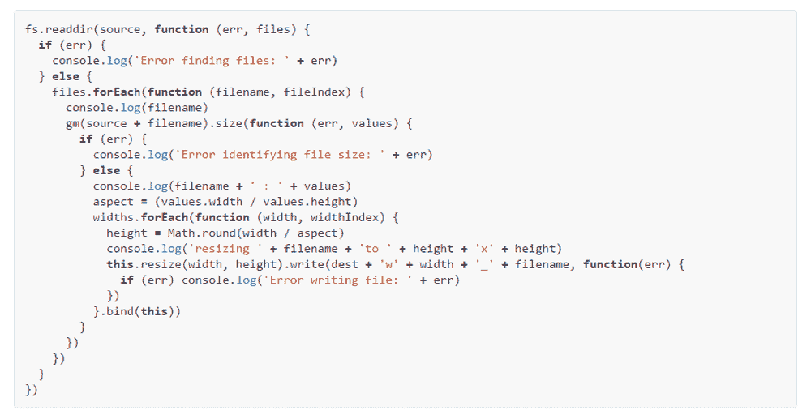
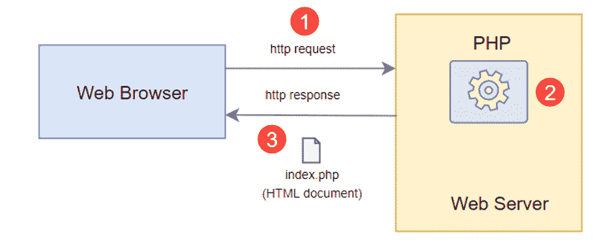
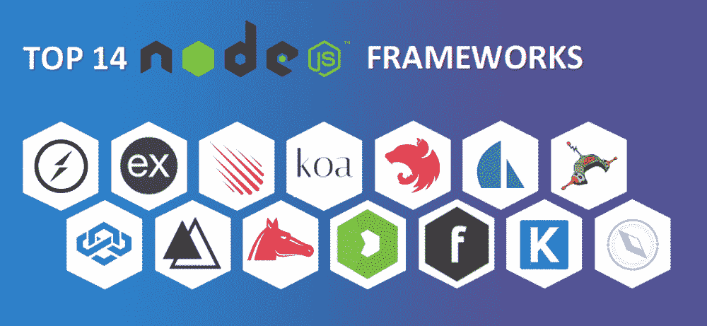
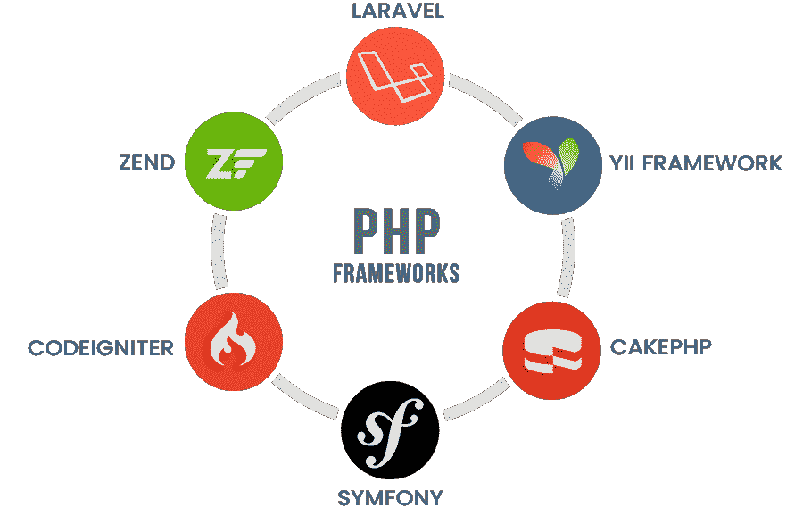
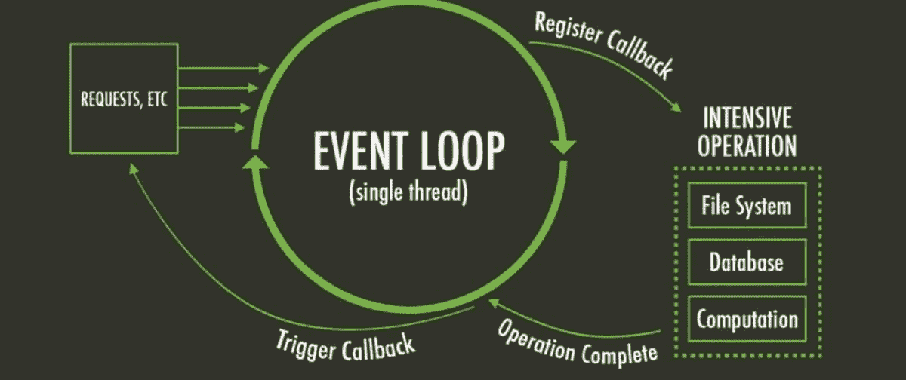
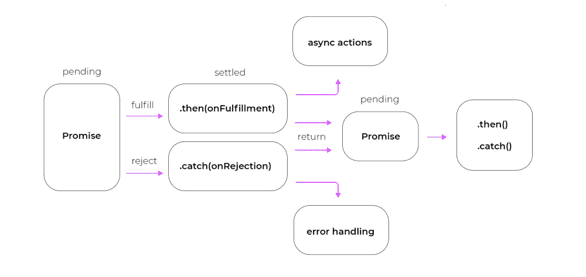
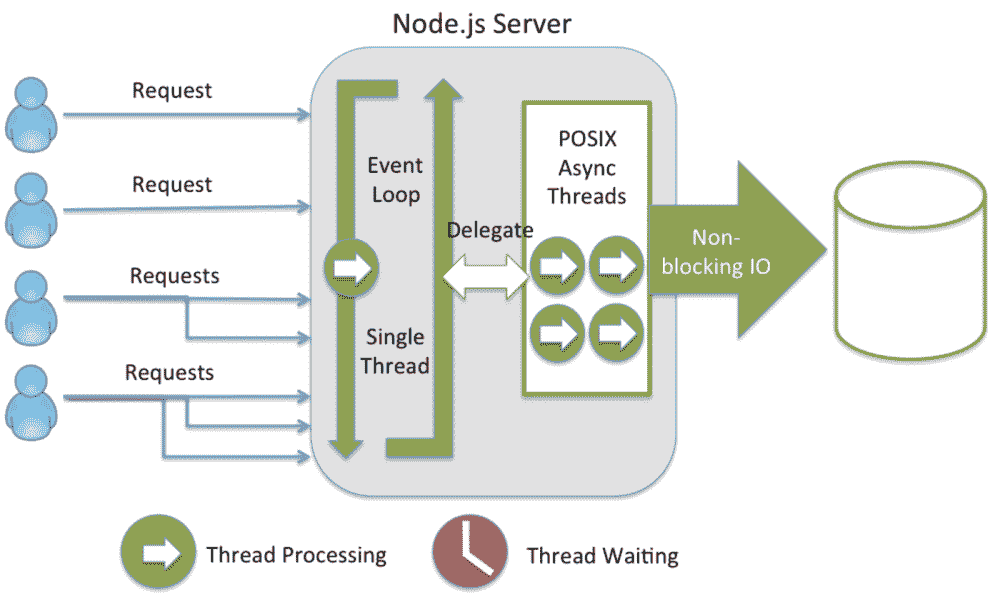
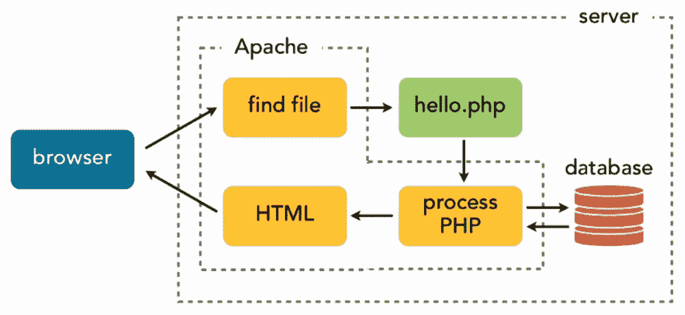
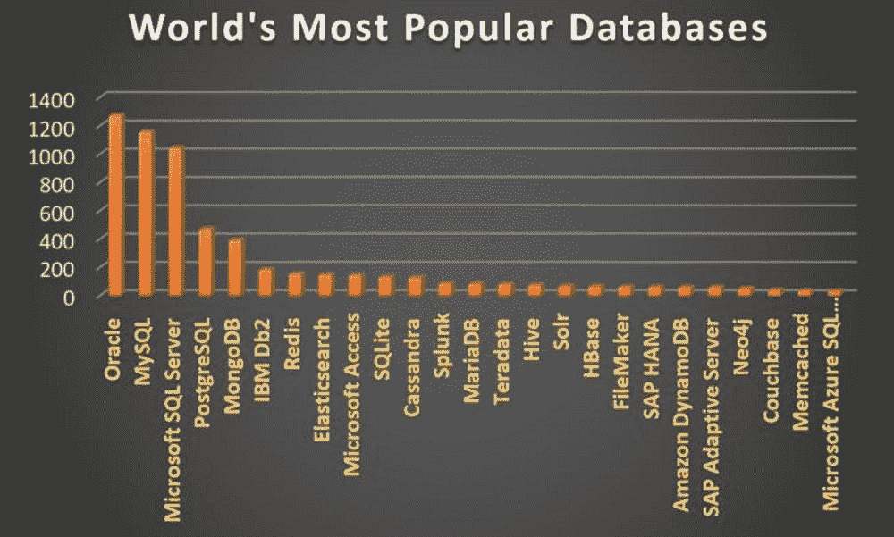
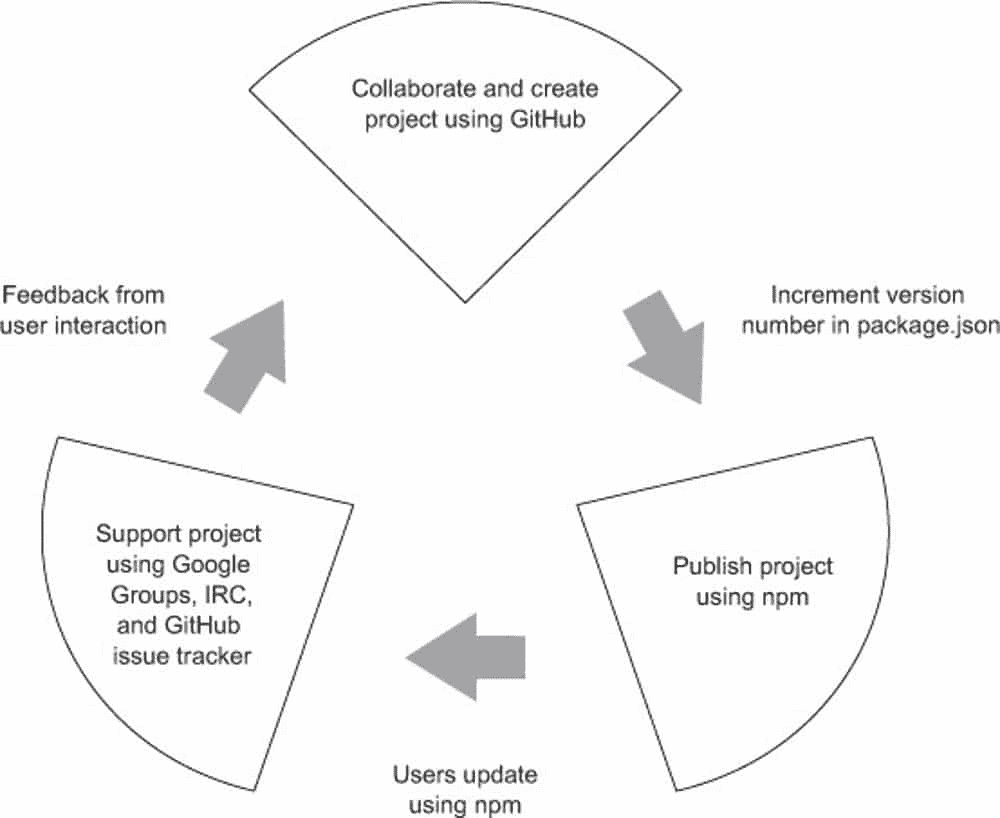

# Node.js 与 PHP:势均力敌的比较

> 原文：<https://kinsta.com/blog/node-js-vs-php/>

Node.js 和 PHP 是两种基本的 web 技术，在 [web 开发工作中很常见](https://kinsta.com/blog/web-development-tools/)。两者都对服务器端开发做出了贡献，Node.js 甚至同时服务于客户端和服务器端开发。

PHP 已经为开发者服务了近三十年，现在它为 78%的网络提供支持。相比之下，Node.js 相对较新，但扩展速度非常快，由于其全栈开发能力，成为一种流行的选择。

有一个大问题:你应该为你的下一个项目选择哪一个——新鲜、健壮、快速的 Node.js，还是老化但仍然可靠、高效的 PHP？

嗯，在许多不同的层面上，两者都是很好的选择。但是，你需要了解他们两个，才能明白哪一个是你下一个项目或者你后续学习的更好选择。

### 查看我们的视频指南 [Node.js vs PHP](https://www.youtube.com/watch?v=CPtXfIkmywg)

在本文中，我们将深入探讨 Node.js 和 PHP，讨论这两种 web 技术的所有特性、特征和优势。

为什么我们要比较这两种技术？尽管它们看起来没有直接的相似性，但我们注意到很多用户搜索了“Node.js vs PHP”本文将通过查看它们的关键特性、主要差异和用例来帮助回答这个问题。

我们开始吧！

## Node.js 是什么？

令人惊讶的是，一些网络资源提到 Node.js 是 JavaScript 编程语言(js)的一个框架，这无疑在现有和潜在用户中引起了很多困惑。所以我们澄清一下:Node.js 既不是编程语言，也不是 JavaScript 框架。

> 需要在这里大声喊出来。Kinsta 太神奇了，我用它做我的个人网站。支持是迅速和杰出的，他们的服务器是 WordPress 最快的。
> 
> <footer class="wp-block-kinsta-client-quote__footer">
> 
> 
> 
> <cite class="wp-block-kinsta-client-quote__cite">Phillip Stemann</cite></footer>

[View plans](https://kinsta.com/plans/)

Node.js 更像是一个环境，您可以将 JavaScript 作为服务器端脚本工具来执行。打个比方，如果 Node.js 是 Ironman，那么 Node 就是套装，JavaScript 就是里面的人。

Node.js 是一个单线程、开源、跨平台的运行时环境，用于开发快速、可扩展的服务器端和网络应用。它由事件驱动的非阻塞 I/O 架构组成，在 Google V8 JavaScript 运行时引擎上运行。因此，对于实时应用程序开发来说，它是一个高效而理想的工具。

### 信息

Node.js 在过去几年中有了很大的改进。但是和所有后端技术一样，说服用户升级到最新最好的版本需要很大的努力——我们甚至在 PHP 中看到了这一点。本文只是不比较 Node.js 和 PHP 的最新版本，而是比较它们最流行的版本(以及它们的特性)。

此外，Node.js 是用 C 和 C++编程语言与 JavaScript 一起编写的。这是因为低级 C 语言是构建操作系统、数据库引擎和所有其他与系统编程相关的代码的最有效的编程语言之一。

 另一方面，C++有几个特质允许 Node.js 与操作系统通信，直接与服务器建立内部连接，这对于 JavaScript 这样的客户端编程语言来说是不可想象的。

因此，它与 C++交互来管理这些计算机特征，并产生 Node.js，这是一个对服务器端和客户端都非常高效的编程环境。

[Should you pick fresh, robust, and fast Node.js, or the aging yet still dependable and efficient PHP? 🤔 Learn more here ✅Click to Tweet](https://twitter.com/intent/tweet?url=https%3A%2F%2Fkinsta.com%2Fblog%2Fnode-js-vs-php%2F&via=kinsta&text=Should+you+pick+fresh%2C+robust%2C+and+fast+Node.js%2C+or+the+aging+yet+still+dependable+and+efficient+PHP%3F+%F0%9F%A4%94+Learn+more+here+%E2%9C%85&hashtags=Nodejs%2CPHP)

## 为什么要用 Node.js？

根据 [StackOverflow 的 2021 年开发者调查](https://insights.stackoverflow.com/survey/2021#overview)，去年/2021 年有 36.19%的职业开发者使用 Node.js 进行粗放式开发，今年/2022 年有保证数字在增长。这是因为 Node.js 提供了全面的功能，例如:

*   **全栈 JS:** Node.js 允许你用 Javascript 在客户端和服务器端都进行编码，产生强大的前端和后端开发组合。这可以说是 node.js 最大的好处。同样，它克服了雇佣两个资源团队的限制，同时您可以为整个项目开发节省大量的资源。
*   简单: Node.js 学习起来非常简单。如果你是 web 编程的新手，这是一个很好的开始技术。在大量教程和庞大的用户社区的帮助下，你可以快速开始学习。
*   **非阻塞代码:**这是选择 node.js 作为你的服务器的最有说服力的理由之一。Node.js 主要是事件驱动的，大部分代码依赖于回调。因此，它允许程序在其他请求可用时暂停或休眠。
    此外，node.js 库和核心 API 提供了开发高性能应用程序的非阻塞调用。此外，这些程序利用 I/O 等待时间来满足其他请求。

*   快速和可伸缩:它带来了应用程序的大量可伸缩性。因为 Node.js 是单线程的，所以它可以高性能地处理大量并发连接。同样，非阻塞线程执行也让 Node.js 更快更高效。
*   **强大的后端连接:** Node.js 是用 C 和 C++开发的，可以直接和服务器建立健壮的连接。
*   **庞大的生态系统:**有许多开源 Node.js 包可以帮助您的项目。值得注意的是， [NPM 生态系统](https://www.npmjs.com/)为你提供了超过一百万个开源 Node.js 包的集合。
*   **物联网协议:** Node.js 不需要大量的服务器端内存和资源。因此，软件开发人员可以利用物联网开发来实现跨多个设备的并发链接。此外，Node.js 支持大多数物联网应用程序使用的消息队列遥测传输(MQTT)协议。因此，在后端级别集成独立的第三方设备变得更加容易。
*   **社区支持:** Node.js 接受全球用户的支持和贡献，以开源项目的形式即兴扩展平台。因此，社区在不断扩大，为初学者和专业人士提供更多的帮助和资源。

## 谁用 Node.js？

自 2009 年推出以来，Node.js 已经为几个行业领导者重新创造了一个至关重要的角色。现在各种业务，从创业公司到顶尖公司，都在依托 Node.js。

让我们来认识一些使用 Node.js 的业界大腕:

*   [推特](https://kinsta.com/blog/twitter-marketing/)
*   [LinkedIn](https://kinsta.com/blog/linkedin-statistics/)
*   网飞
*   Spotify
*   通过易趣网购买
*   [PayPal](https://kinsta.com/blog/paypal-donate-button-wordpress/)
*   超级的
*   沃尔玛
*   特雷罗

## Node.js 的利与弊

目前，Node.js 是应用最广泛的软件开发技术之一，因为它具有前端和后端开发以及跨平台的能力。

### Node.js 的优点

让我们看看使用 Node.js 的所有优点:

*   **可伸缩性:** [Node.js 集群模块](https://nodejs.org/api/cluster.html)在几个 CPU 内核上提供负载平衡，使得通过更小的模块实现所需的结果变得简单，而不会耗尽您的 RAM。此外，Node.js 实现了一个非阻塞事件循环架构，该架构提供了出色的可伸缩性，并使服务器能够实时执行请求。此外，Node.js 将应用程序分配给多个团队，并使您能够同时定义和分配任务。总的来说，您可以使用更少的资源获得高性能的框架。
*   **跨平台功能:**开发者可以将 NW.js 和 Electron 结合起来，创建实时的跨平台 app，不需要为多个平台编写不同的代码。相应地，如果你的开发团队缺乏对 Objective-C 和 C#的深入理解，你也不需要担心；Node.js 可以在没有它们的情况下构建原生应用。此外，谷歌工具可以很好地帮助开发者[编码和调试](https://kinsta.com/blog/node-debug/)。

*   **JSON 支持:**PHP、Ruby on Rails 等后端技术利用 JSON 格式进行通信；Node.js 做同样的事情，不需要在二进制模型之间转换，而是使用 JavaScript。因此，为 NoSQL 数据库支持创建 RESTful APIs 变得很简单，比如 MongoDB。此外，javaScript 环境通过数据传输标准提供了简单的数据传输连接，从而提高了效率。
*   **缩短上市时间:**由于 Node.js 是全栈的、轻量级的、快速的，所以你可以抢时间。除此之外，您的团队还可以从 GitHub 获得大量 Node.js 库、即用型程序和资产。它将减少大量的开发时间和工作。因此，您更有可能缩短上市时间。
*   **Google 支持:** Node.js 是在 Google 的 V8 JavaScript 引擎上做的，作为前端和后端的开发工具。此外，Google V8 引擎允许 Node.js 在前端同时运行大量 JavaScript 脚本。因此，用 Node.js 检测前端和后端的错误很简单。

Google 将 Node.js 列为最快的运行时系统引擎之一。此外，Google Cloud 为 JavaScript 开发者提供了构建云原生应用的工具。您可以在[云运行](https://kinsta.com/blog/benefits-of-cloud-computing/)、云函数和 GKE 上使用 SDK、IDE 内协助和原生运行时支持，以加快应用开发流程。此外，[谷歌云](https://kinsta.com/blog/wordpress-on-google-cloud/)可以从头到尾执行你的应用。

### Node.js 的缺点

让我们看看使用 Node.js 的所有可能的缺点:

*   **无法处理繁重的计算:**到目前为止，Node.js 还不支持多线程编程。然而，它可以处理比 Ruby 复杂得多的应用程序，尽管它并不打算执行长时间运行的计算。同样，多线程密集型计算也会降低性能。因此，Node.js 适合单线程复杂系统；否则会浪费处理能力和时间。
*   **API 不稳定:**node . js 应用编程接口(API)定期变化，保持不稳定。此外，对于每个新的 API 版本，一些向后不兼容的更改迫使开发人员定期更改他们的访问代码，以应对 Node.js API 的最新版本。
*   **回调地狱:** JavaScript 严重依赖回调，因为它的异步本质。因此，分配了一个功能，从一个长队列中一个接一个地执行任务。每个在后台排队的带有单独回调的任务都会产生一个被称为“回调地狱”的大规模回调它直接降低了代码的质量，并且由于一个回调嵌套在另一个回调中，多个级别的回调造成了难以编码的情况。

Node.js callback hell. (Image source: [Altexsoft](https://www.altexsoft.com/))

## PHP 是什么？

[PHP](https://kinsta.com/knowledgebase/what-is-php/) 代表超文本预处理器，最初代表个人主页。PHP 是一种面向对象、开源的服务器端脚本语言，主要用作 web 开发工具。

PHP 主要用于创建 web 服务器。然而，它可以在浏览器中执行，也可以通过命令行执行。如果不想在浏览器中显示代码输出，可以在终端中显示。

PHP 使用 Zend 引擎，这是经常使用的最广泛的实现。然而，脸书构建了 PHP 的各种实现，如 parrot、HipHop 虚拟机(HPVM)和 JPHP。

PHP architecture (image source: PHPTutorial)

如果你想显著提高性能、速度和安全性，你应该使用 PHP [8.0](https://kinsta.com/blog/php-8/) 或 [8.1](https://kinsta.com/blog/php-8-1/) 。除了我们的自我修复设置，Kinsta 还支持 PHP 8.0、8.1。

## 为什么要用 PHP？

根据 StackOverflow 的 2021 年开发者调查，去年超过 22%的[专业开发者使用 PHP](https://kinsta.com/blog/php-developer-salary/) 进行繁重的编程。许多网络专家预测 [PHP 将会成为一种死亡的编程语言](https://kinsta.com/blog/is-php-dead/)，但是它经受住了时间的考验。相当多的用户仍然依赖 PHP 及其一些优秀的特性，包括:

*   **跨平台:** PHP 适合大多数主流操作系统，包括 Linux、Windows 和 macOS。同样，PHP 兼容所有主要的 web 服务器，包括 Nginx、OpenBSD 和 Apache。此外，一些云平台，如微软 Azure 和亚马逊 AWS，都支持 PHP。
*   HTML 友好:任何熟悉 HTML 的人都可以很快转向 PHP。在一个页面中，PHP 和 HTML 是可以互换的。PHP 可以放在 HTML 的外部或内部。虽然 PHP 为您的站点增加了额外的功能，但核心设计仍然是 HTML。
*   **服务器端脚本语言:**迄今为止，PHP 是使用最多的服务器端脚本语言。它在服务器端而不是客户端解释脚本(比如 JavaScript)。此外，它为每个用户创建了个性化的界面，并将功能扩展到 HTML 之外。除了处理 HTML，它还帮助创建 PDF、GIF、JPEG 和 PNG 文件。
*   **连接所有数据库:** PHP 是一种自适应语言。PHP 几乎支持所有数据库，包括 MySQL、 [PostgreSQL](https://kinsta.com/knowledgebase/what-is-postgresql/) 、MS SQL、db2、Oracle 数据库、 [MongoDB](https://kinsta.com/blog/mongodb-vs-postgresql/#what-is-mongodb) 。因此，它允许开发人员更自由地为正在开发的应用程序确定最合适的数据库。
*   web 兼容性: PHP 兼容大多数 Web 技术，从云服务到无缝 HTML 集成。相应地，所有的主机服务都默认采用 PHP。PHP 的多功能性和灵活性与其他编程语言相当，可以在许多应用程序开发栈中找到。

## 谁用 PHP？

PHP 象征性地拥有整个互联网。超过 78%的网站都使用 PHP，毫无疑问，PHP 在开发领域的普及率仍然很高。同样，它仍然是一些最大的全球科技公司的关键技术。

让我们看看一些依赖 PHP 的顶级公司:

1.  [脸书](https://kinsta.com/blog/facebook-statistics/)
2.  [WordPress](https://kinsta.com/knowledgebase/what-is-wordpress/)
3.  维基百科(一个基于 wiki 技术的多语言的百科全书协作计划ˌ也是一部用不同语言写成的网络百科全书ˌ 其目标及宗旨是为全人类提供自由的百科全书)ˌ开放性的百科全书
4.  [Tumblr](https://kinsta.com/blog/import-tumblr-to-wordpress/)
5.  [松弛](https://kinsta.com/blog/slack-integrations/)
6.  Etsy
7.  [Mailchimp](https://kinsta.com/blog/mailchimp-alternatives/)
8.  日常运动
9.  闪烁（光）
10.  Spotify

## PHP 的利与弊

就像任何脚本语言一样，尽管 PHP 在市场上占主导地位，但它也有很多优点和缺点。接下来我们将详细探讨这些。

### PHP 的优点

让我们来看看使用 PHP 的所有可能的优势:

*   不贵: PHP 是一个免费的开源开发工具，它的工具也是免费的。此外，多种框架，包括 Laravel 和 CodeIgniter，以及诸如 WordPress 和 Drupal 之类的 CMSs，增强了 PHP 的特性，并有助于方便的开发环境。
*   **丰富的文档和资源:**你可以访问大量关于 [PHP 开发的教程、手册、参考资料和演示项目](https://kinsta.com/blog/php-developer-salary/)。无论你是初学程序员还是专业人士，这些资料都会在你困难的时候帮助你。
*   **维护更少:** PHP 框架支持模型-视图-控制器(MVC)架构，简化了 web 应用程序的创建和维护。例如，您可以使用 MVC 架构将 web 应用程序划分为模型、视图和控制器。您还可以使用 PHP MVC 框架来分离应用程序的用户界面和业务逻辑。
*   **自动化:**您可以将 PHP 绑定用于开发人员基于浏览器的自动化测试场景。该框架适应性强，Selenium web 驱动程序在所有主流浏览器中都能高效工作。此外，PHP 框架的功能和工具可以帮助您自动化日常的 web 开发任务，如缓存、认证、会话管理和 URL 映射，而不会影响效率。
*   **用户友好:** PHP 的学习曲线较短，可以快速超越。如果你知道像 C 这样的初级语言，你可以很快掌握 PHP 来进行应用程序开发。即使 PHP 是你的第一语言，你也可以[在任何操作系统](https://kinsta.com/blog/install-phpmyadmin/)上安装 PHP 或者[在任何服务器](https://kinsta.com/blog/install-php/)上轻松安装 PHP，然后自己尝试一下。

大多数用户选择 PHP 是因为它简单易学，容易理解，并且很受欢迎。相当多的[编程语言](https://kinsta.com/blog/best-programming-language-to-learn/)对于初学者来说是复杂和令人畏惧的，但是 PHP 是组织良好、清晰和流畅的。

### PHP 的缺点

让我们看看使用 Node.js 的所有可能的缺点:

*   **过时的方法论:**机器学习越来越受欢迎，它是技术的未来。因此，像 Python 这样的语言正在吸引用户。然而，虽然 PHP 有自己的库，但它无法与 Python 的 TensorFlow、Scikit-learn、Theano 和 Keras 库竞争，以构建由机器学习或其旧方法的类似修改支持的 web 应用程序。因此，如果你的应用需要机器学习，PHP 并不是理想的解决方案。
*   安全缺陷:由于新程序员的准入门槛较低，PHP 在安全方面的声誉不佳。缺乏经验的开发人员创建的网站和应用程序存在潜在的漏洞。因此，这些结果经常会使 PHP 成为一种不太安全的语言。然而，如果你确切地了解 PHP 并且是一个有经验的开发人员，你将获得坚如磐石的 web 安全性。
*   **框架质量:**大多数流行的 PHP 框架都是开源的，可以免费使用。因此，web 开发人员可以使用这些 web 框架，而不会增加项目成本。然而，并不是每个框架都在社区中提供相似的优势或特性，并吸引许多开发人员。因此，一些 PHP 框架缺乏适当的支持和资源。

## Node.js 与 PHP:势均力敌的比较

现在，我们已经对这两种技术、它们的特性和应用有了一些了解，是时候根据一些特定的参数来比较 Node.js 和 PHP 了。这将有助于您确定特定应用程序开发的最佳选择，方法是说明使用它们是多么有效和简单，以及哪种方法可以为您的开发工作和时间提供最大的回报。

让我们来比较一下它们——node . js 和 PHP。

### 类似

Node.js 和 PHP 之间的相似之处包括:

*   **应用类型:** Node.js 和 PHP 运行在服务器上，处理路由请求。在帮助静态内容、动态网页和数据请求时，可以将它们重叠起来。虽然 PHP 引入了 web 套接字服务器，但 Node.js web 套接字是当今最流行的。Node.js 使用 [socket.io](https://socket.io/) ，PHP 使用[棘轮](https://github.com/ratchetphp/Ratchet)。此外，它们都服务于流(Node.js 使用 Stream API 来完成这项工作，您需要为 PHP 编写一些自定义代码)。
*   **可扩展性:**你可以扩展 Node.js 和 PHP，因为它们是开源的，并且每个都有一个繁荣的附加组件生态系统。同样，您可以调整源代码，并按照您认为最适合您的项目的方式进行派生。
*   **解释的:**node . js 和 PHP 都是解释的，它们都允许您在不中断您的过程的情况下在确切的实现页面上执行开发任务。容易调试、最小化程序大小和动态类型是解释语言提供的好处。
*   **跨平台:**node . js 和 PHP 都是平台无关的。它们都可以在 Linux、macOS 或 Windows 上运行，Node.js 甚至可以在 SunOS 上运行。Node.js 的 Docker hub 上有官方的 Docker 镜像，不过你需要直接从命令行运行 PHP。您还可以编译 Node.js 和 PHP 的源代码。
*   服务:node . js 和 PHP 都服务于 web 请求，并且在服务于 web 套接字方面非常高效。它们可以流畅地管理动态 web 内容，并提供一个交互式的用户友好界面。

### 目标受众

每种技术都有精确的用户和受众基础。同样，Node.js 和 PHP 也有其特定的受众。Node.js 以更少的努力和更高的 [Node.js 薪水](https://kinsta.com/blog/node-js-developer-salary/)吸引对全栈开发感兴趣的现代学习者。与此同时，PHP 面向来自网络上的广泛受众。

这是因为仅 PHP 就驱动了 78.9%的在线网站。嗯，这几乎是整个互联网！另一方面，Node.js 是一个快速增长的潜在全栈 JavaScript 环境，在开发人员和用户中日益流行。

但是，PHP 太庞大了，至今无法攻克。因此，预测最终的赢家很有挑战性。

### 结构

编程语言框架越好，需要编码的就越少。捆绑的代码、预制的建模 API 和其他元素使您的编程过程变得更加简单和简短。PHP 和 Node.js 都提供不同类型的框架来服务不同的目的。

#### 节点. js

Node.js 在短时间内遇到了库的显著增加，包括 Meteor、Derby、Express、Koa、 [Nest](https://kinsta.com/knowledgebase/nestjs/) 、Sails 等等。这些框架通过减少开发时间和资源使用来提高生产率。值得注意的是，Node.js 在数量上超过了 PHP 框架。

Node.js frameworks. (Image source: [MindInventory](https://www.mindinventory.com/))

#### 服务器端编程语言（Professional Hypertext Preprocessor 的缩写）

在其 27 年的生命周期中，PHP 已经为不同的利基市场积累了丰富的框架库。像 Laravel、CodeIgniter、Symfony、CakePHP 和 Phalcon 这样的 PHP 框架已经为专业开发人员和主流开发机构服务了很长时间。此外，像脸书这样的行业巨头也实现了他们的 PHP 框架版本，如 HipHop。

PHP frameworks. (Image source: [MindInventory](https://www.mindinventory.com/))

尽管 PHP 几十年来一直以其丰富的框架为全球开发人员服务，但 Node.js 因其现代方法和数量迅速增加的框架而在专业人员中变得越来越受欢迎。

### 学习曲线

如果你已经知道 JavaScript，你会很快掌握 Node.js 的价值。但如果你从未接触过该语言，更明智的做法是先[学习 JavaScript](https://kinsta.com/topic/javascript-tutorials/) ，然后采用 [Node.js 环境](https://kinsta.com/topic/node-js/)。事先了解另一种语言有助于掌握 JavaScript 的基础知识，并使用 Node.js 并行构建服务器。

PHP 很容易学，但是掌握起来很有挑战性。此外，PHP 的怪癖，比如不一致的函数或返回值，比 JavaScript 和 Node.js 的怪癖更容易学习和掌握。

然而，您在学习 Node.js 上投入的时间和精力将会得到回报。因为 Node.js 正变得比 PHP 更流行，知道它将是有价值的。

## 注册订阅时事通讯

### 想知道我们是怎么让流量增长超过 1000%的吗？

加入 20，000 多名获得我们每周时事通讯和内部消息的人的行列吧！

[Subscribe Now](#newsletter)

### 速度和性能

在开发一个基本项目时，处理或执行速度通常是无关紧要的；大多数技术足以快速处理执行。但是，如果运行需要更好的算法、编译器或语言的高成本(处理方式)函数，性能就成了一个问题。如果您正在构建运行在低功耗机器上的实时系统，速度和性能就变得至关重要。

我们来看看 Node.js 和 PHP 是如何执行和处理程序的执行的。

#### 节点. js

Node.js 由于其轻量级、高效、事件驱动、非阻塞的 I/O 模型而具有高速的执行速率。然而，就性能而言，它依赖于三个编程“向导”:异步、并发和并行编程。

A Node.js event loop. (Image source: [Cloudinary](https://cloudinary.com/))

异步事件驱动的设计风格确保在运行应用程序时同时执行几个动作。Node 的 events 系统使它更加可行和快速，允许服务器响应之前的 API 请求。简而言之，这就是异步编程范式。

The Node.js async function. (Image source: [RisingStack](https://risingstack.com/))

并发功能允许同时运行多个任务。具有不同目的的不同功能以并发方式执行。此外，并行性使用 Web Workers API 来同时执行各种进程。

#### 服务器端编程语言（Professional Hypertext Preprocessor 的缩写）

另一方面，PHP 使用较慢的同步代码实现方法，按照代码中指示的顺序执行每个模块函数。如果一个查询执行失败，下一个查询将不会运行，直到并发查询完成。

因此，这种语言保持性能稳定，无论速度如何，都能准确地执行程序。与 [HHVM 虚拟机](https://hhvm.com/)配对提高了 PHP 性能，但 Node.js 依然更胜一筹。

通过结合现代编程函数，Node.js 可以比 PHP 和大多数其他编程语言(如 Python、Java、Go 等)更快地执行程序。

### 安全性

当然，没有哪种编程语言是不可攻击的，也没有哪种语言没有一个安全漏洞。但是你可以建立一个系统，它可以潜在地免疫最具攻击性的安全攻击。

Node.js 和 PHP 都有各自的漏洞(也有解决方案)。也就是说，网站或应用程序的安全性相应地依赖于开发者的编码方式。

#### 节点. js

作为 Node.js 用户，您可能会遇到诸如中间机器(MITM)攻击、代码注入和高级持久威胁之类的漏洞。例如，Node.js 面临 XSS 攻击、数据泄露、[跨站点请求伪造](https://github.com/pillarjs/understanding-csrf) ( [CSRF](https://github.com/pillarjs/understanding-csrf) )和 HTTP 响应头问题等安全问题。

A Node.js machine-in-the-middle (MIDM) attack. (Image source: [Medium](https://medium.com/))

然而，该系统还提供了安全实践、认证工具(Okta、Firebase、OAuth)、OWASP 依赖性检查和 [Acutinex](https://www.acunetix.com/) 来舒适地处理问题，减少漏洞，为您创建一个安全的系统。

#### 服务器端编程语言（Professional Hypertext Preprocessor 的缩写）

使用 PHP 时，您可能会面临安全问题，如 [SQL 注入攻击](https://www.php.net/manual/en/security.database.sql-injection.php)、XSS(跨站点脚本)、会话劫持、目录遍历等等。

PHP 提供了对抗所有这些问题的预防措施和途径。但在这里，我们从瓶子里放出了真相精灵:

你的 PHP 代码和你写的一样安全。

如果编码正确，您的程序就像使用其他几种编程语言一样安全。但是如果你是一个没有经验的程序员，你的网站或应用程序有安全漏洞的可能性相对较高。

如果您在构建系统时彻底考虑了安全问题，那么您应该仔细考虑安全设计。您可以使用名为 Cryptography 的 OpenSSL 函数扩展在 PHP 中加密和解密字符串，还可以实现基于语言的安全性(LBS)来增强应用程序的安全性。

### 请求处理

请求处理指的是 web 应用程序与用户或客户端的通信。执行任务首先从 UI 接收请求，然后将其发送到服务器端并执行。同样，一个熟练的请求处理过程决定了系统的性能、精度和结果。

Node.js 和 PHP 处理客户端请求的方式不同。

Struggling with downtime and WordPress problems? Kinsta is the hosting solution designed to save you time! [Check out our features](https://kinsta.com/features/)

#### 节点. js

Node.js 接受大量的客户端请求，并将它们在 EventQueue 中排队，因为它具有事件驱动的架构。因此，Node.js 有它的 event loop——一个同时接收和处理请求的无限循环，节省了计算能力。

如果 Node.js 可以在没有 I/O 阻塞的情况下处理请求，那么事件循环将处理请求，并自己将响应返回给客户机。使用 Node.js *集群模块*或者 *worker_threads* ，你也可以让你的系统并行处理多个请求。

Node.js request handling. (Image source: [Medium](https://medium.com/))

#### 服务器端编程语言（Professional Hypertext Preprocessor 的缩写）

PHP 一次可以处理一个请求。例如，如果你输入 10 个请求，它会在 10 个不同的提交中一个接一个地执行它们，每次使用相同的计算能力。

虽然您可以使用 PHP 库或 web 服务器让 PHP 处理多个请求，但 Node.js 仍然更胜一筹，因为它具有本地请求处理特性。

PHP Request Handling (image source: github user content)

### 数据库集成

Node.js 和 PHP 都支持各种数据库。但是，有一些特定的数据库最适合他们，并且在同一个应用程序中运行时可以减少可能的攻击威胁。

Most popular databases (image source: c-sharpcorner)

#### 节点. js

Node.js 适合各种数据库，你可以根据你程序的复杂程度和目标来选择数据库。通常，Node.js 不仅可以有效地处理 SQL (NoSQL)数据库，如 [MongoDB](https://kinsta.com/blog/mongodb-vs-mysql/) 和 CouchDB，也可以有效地处理图形数据库系统，如 Neo4j。

然而，NoSQL [注入攻击](https://kinsta.com/blog/sql-injection/)是一个众所周知的漏洞。此外，与 SQL 注入相比，它们的数量更大，因为 SQL 代码架构使其自然地免受此类攻击。

#### 服务器端编程语言（Professional Hypertext Preprocessor 的缩写）

PHP 采用与传统/关系数据库的协作，包括 MySQL、 [MariaDB](https://kinsta.com/blog/mariadb-vs-mysql/) 、Db2、MongoDB、Oracle、PostgreSQL 和 SQLite。然而，MySQL 似乎是使用最多的 PHP 数据库。

MySQL 是 SQL 兼容的，并提供各种优势。它简单、功能强大、快速、安全且可扩展。此外，MySQL 可以在多种平台上运行，包括 UNIX 或 Linux、微软 Windows、苹果 Mac OS X 等。

### 模块和扩展性

模块是作为子程序提供一个或多个相关功能/类的程序组件。

几个独立的模块可以构建一个程序。如果您想扩展技术能力，可以利用这些模块提供的帮助。

#### 节点. js

Node.js 中的模块是独立的代码单元，根据它们的相关功能与外部应用程序进行交互。这些模块可以是单个文件，也可以是几个文件/文件夹的组合。您可以使用模块，因为它们的可重用性和将有问题的代码分解成易于理解的部分的能力。

Node.js NPM modules. (Image source: [Medium](https://medium.com/))

#### 服务器端编程语言（Professional Hypertext Preprocessor 的缩写）

PHP 模块有三种类型:核心扩展；默认情况下， [PHP 安装](https://kinsta.com/blog/install-php/)的捆绑扩展；以及完全外部的扩展——完全外部的扩展不包含在核心 PHP 或任何包中。

PHP 扩展模块大多是用 C 编程语言编写的。然而，你可以用 PHP 编译它们，以允许静态加载(作为二进制文件的一部分)或动态加载(通过 *php.ini* 指令 *extension=modulename.so* )。

PHP 已经获得了一个充满活力的扩展模块集合，提供了大量的可扩展性。尽管 Node.js 像滚雪球一样越滚越大，PHP 模块仍然比 Node.js 多。

### 生态系统(社区和支持)

开源平台的社区丰富了它的生态系统。用户和爱好者对可用的库、框架、预制项目、资源和对新来者的支持负责。因此，社区的扩张也以积极的方式影响着生态系统。

#### 节点. js

像其他成功的开源项目一样，Node.js 有一个活跃的在线社区，这意味着你会发现大量的在线资料，以及通过在线参考、Google Groups、IRC 或 [GitHub](https://kinsta.com/knowledgebase/what-is-github/) 问题队列对你所关心的问题的快速响应。

The Node.js ecosystem. (Image source: [Livebook](https://livebook.dev/))

#### 服务器端编程语言（Professional Hypertext Preprocessor 的缩写）

[WordPress](https://kinsta.com/cheatsheets/wordpress-update-php/) ，Drupal，Jumla，脸书等。对 PHP 生态系统做出了巨大贡献。这些公司直接负责运行互联网上数百万个网站，它们共同展示了 PHP 非凡的影响力。

此外，PHP 社区多年来开发了大量的培训材料和支持技术来吸引新的开发人员。如果你想寻求帮助，请访问 Github、StackOverflow 或类似的平台。

### 托管机会

Node.js 和 PHP 在最著名的全球主机提供商中很常见，所以你不难找到支持它们的主机。

有趣的是，托管价格往往取决于所说的托管公司的可用性。因此，在选择一个之前做好你的研究。然而，当[选择网络主机](https://kinsta.com/blog/managed-wordpress-hosting/)时，你必须[优先考虑速度](https://kinsta.com/cheatsheets/site-speed-cheat-sheet/)，性能和安全性。

## Node.js 与 PHP:并列比较表

让我们看一下 Node.js 与 PHP 的对比，并检查一些核心编程参数:

|  | **Node.js** | **PHP** |
| --- | --- | --- |
| **从**开始 | Two thousand and nine | One thousand nine hundred and ninety-four |
| **类型** | JavaScript 运行时环境 | 程序设计语言 |
| **编码** | 长的 | 简明的 |
| **用途** | 1.8% | 所有网站的 78.1% |
| **发动机** | 谷歌的 V8 JavaScript | Zend 发动机 |
| **包管理器** | Composer 包管理器 | 节点程序包管理器(NPM) |
| **执行** | 异步的 | 同步的 |
| **执行速度** | 更快、更轻便 | 比 Node.js 慢 |
| **并发** | 事件驱动的非阻塞 I/O | 多线程阻塞 I/O |
| **性能** | 更快的 | 慢的 |
| **网络服务器** | 不需要 | Apache 和 IIS |
| **数据库** | 任何数据库 | 关系型和传统型 |
| **JSON** | *JSON.stringify()* 和 *JSON.parse()* | *json_encode()* 和 *json_decode()* |
| **社区** | 小而活跃 | 庞大的在线社区 |

## Node.js vs PHP:应该选哪个？

毫无疑问，这是我们在这里一直试图用一个恰当的答案来解决的问题。所以让我们试着把我们画的所有点连接起来。

事实上，这两种技术都提供了数百种特性，可以让您的开发变得轻松、有趣和稳定。然而，选择您的技术更多地取决于您的需求和您计划进行的开发类型。

 您应该根据您的目标和需求来分析您的需求，然后确定最适合您的技术，而不是根据随机参数或其他人的意见来选择最佳技术。

### 何时使用 Node.js

让我们来看看会让您选择 Node.js 而不是 PHP 的需求:

1.  **FullStack:** 如果您希望同时进行服务器端和客户端开发，请选择 Node.js。选择 Node.js 的另一个坚实的原因是排除不同[前端和后端](https://kinsta.com/blog/backend-vs-frontend/)团队之间协作的麻烦。
2.  **速度和性能:** Node.js 执行程序的速度比其他大多数编程语言都要快。此外，theNode.js 应用程序显示了巨大的性能增益和稳定性。如果希望应用程序同时处理多个指令和请求，请选择 Node.js。
3.  现代开发方法学: Node.js 是一个新的、现代的、更新的环境，有几个包、优秀的框架和一个相当现代的库的熟练集合。总的来说，它让你进行创新开发。
4.  **实时数据:** Node.js 由于其非阻塞架构和服务器端与客户端的特殊连接，在同步实时数据方面很精通。因此，如果您需要应用程序服务上的实时数据同步，请选择 Node.js。

### 何时使用 PHP

现在，让我们看看可能会促使您选择 PHP 而不是 Node.js 的条件:

1.  灵活和动态: PHP 编程的在线应用程序和网站非常安全，因为它们经过加密并可快速扩展，这有助于它们的动态性和适应性。此外，在线应用和网页会自动刷新，无需人工干预。因此，如果你想要一种动态语言，你可以选择 PHP。
2.  **可移植性:** PHP 在连接服务器和数据库时具有出色的可移植性和效率。您可以随时将您的 web 应用程序移植到任何支持 apache 的服务器上，而不必重新构建它。此外，大多数内容管理系统(CMS)如 WordPress、Jumla 和 Drupal 都使用 PHP，这使得它更容易访问。

[Node.js or PHP- decide for yourself with help from this guide 😄Click to Tweet](https://twitter.com/intent/tweet?url=https%3A%2F%2Fkinsta.com%2Fblog%2Fnode-js-vs-php%2F&via=kinsta&text=Node.js+or+PHP-+decide+for+yourself+with+help+from+this+guide+%F0%9F%98%84&hashtags=Nodejs%2CPHP)

## 摘要

简而言之，就其特征和服务目的而言，这些 web 技术各有千秋。多年来，这两家公司都在帮助数百万专业人士方面表现出色。

但是最终的结论更多地依赖于用户需求，而不是 Node.js 或 PHP 可能提供的特性。一个可能拥有你发展所需的所有重要元素，而另一个可能没有。

无论是为了发展还是作为潜在的职业道路，这两者都值得一试。不断增长的 Node.js 和长期持续的 PHP 仍然受到开发社区的极大关注，并带来更高的薪水。

因此，无论您选择哪一种，在未来很长一段时间内，Node.js 和 PHP 都将是开发人员的热门选择。

在你最近的项目中，你选择了这两种网络技术中的哪一种？请在下面的评论区告诉我们！

* * *

让你所有的[应用程序](https://kinsta.com/application-hosting/)、[数据库](https://kinsta.com/database-hosting/)和 [WordPress 网站](https://kinsta.com/wordpress-hosting/)在线并在一个屋檐下。我们功能丰富的高性能云平台包括:

*   在 MyKinsta 仪表盘中轻松设置和管理
*   24/7 专家支持
*   最好的谷歌云平台硬件和网络，由 Kubernetes 提供最大的可扩展性
*   面向速度和安全性的企业级 Cloudflare 集成
*   全球受众覆盖全球多达 35 个数据中心和 275 多个 pop

在第一个月使用托管的[应用程序或托管](https://kinsta.com/application-hosting/)的[数据库，您可以享受 20 美元的优惠，亲自测试一下。探索我们的](https://kinsta.com/database-hosting/)[计划](https://kinsta.com/plans/)或[与销售人员交谈](https://kinsta.com/contact-us/)以找到最适合您的方式。