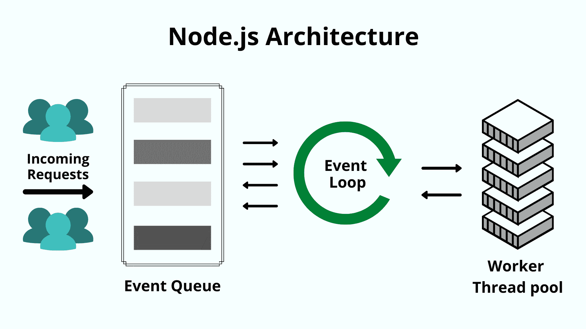
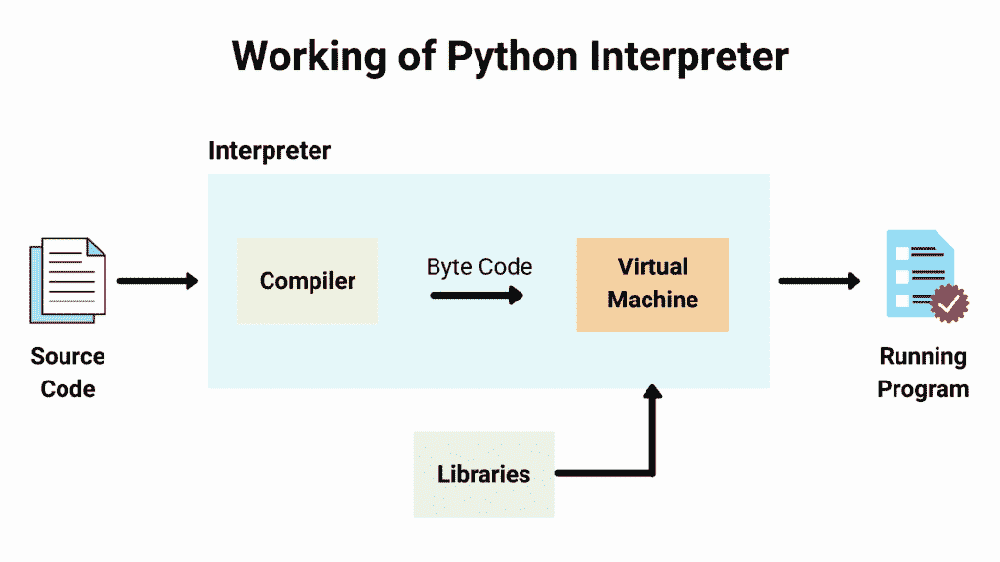
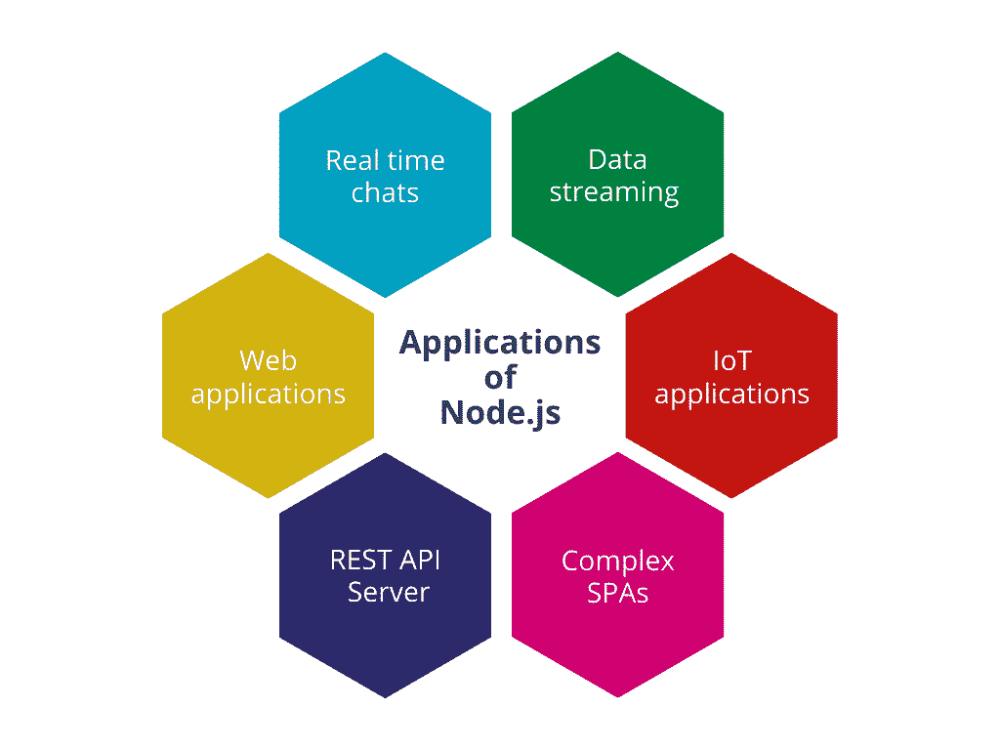
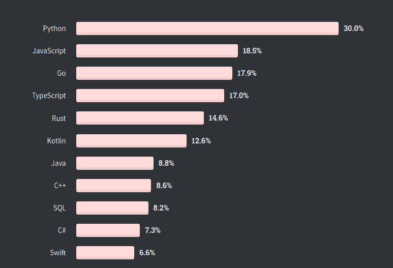

# Node.js 与 Python:为您的 Web 应用选择最佳技术

> 原文:# t0]https://kinta . com/blog/nodejs-vs-python/

Node.js 和 Python 是后端开发最流行的两种技术。当涉及到 web 开发时，在 Node.js 和 Python 之间做出选择可能很有挑战性。两者各有利弊。

为您的项目选择正确的技术组合至关重要。它将决定项目的成本和启动时间表，以及维护和扩展的效率。为一个受欢迎的技术堆栈雇佣开发人员也比为一个不太受欢迎的堆栈雇佣开发人员更容易管理。

在本文中，我们将介绍 Node.js 和 Python 之间的主要区别，以帮助您决定下一个项目的选择。

## Node.js 和 Python 概述

Python 是一种流行的编程语言，而 [Node.js 不是](https://kinsta.com/knowledgebase/what-is-node-js/#is-nodejs-a-programming-language)(但它是基于 JavaScript 的)。因此，在我们比较 Node.js 和 Python 之前，有必要了解它们的基础知识。稍后，我们将在九个不同的标准上讨论它们的差异。

### 节点. js


Node.js


Node.js 是一个单线程、开源、跨平台的运行时环境，用于构建快速、可伸缩的服务器端和网络应用。与编程语言 Python 不同，Node.js 是一个在浏览器外运行 JavaScript 的运行时环境。


> Kinsta 把我宠坏了，所以我现在要求每个供应商都提供这样的服务。我们还试图通过我们的 SaaS 工具支持达到这一水平。
> 
> <footer class="wp-block-kinsta-client-quote__footer">
> 
> 
> 
> <cite class="wp-block-kinsta-client-quote__cite">Suganthan Mohanadasan from @Suganthanmn</cite></footer>

[View plans](https://kinsta.com/plans/)

它是用 C、C++和 JavaScript 编写的，运行在 V8 JavaScript 运行时引擎上。Node.js 使用事件驱动的非阻塞 I/O 架构，这使得它适合开发实时应用程序。

#### 关键 Node.js 特性

Node.js 的一些关键特性包括:

1.  Node.js 有大量的教程和一个大型社区，相对来说比较容易上手——它是 web 开发初学者的首选。
2.  **可伸缩:** Node.js 是单线程的，这意味着它可以以高吞吐量处理大量的同时连接，并为应用程序提供巨大的可伸缩性。
3.  **速度:**非阻塞线程执行让 Node.js 快速高效。
4.  **包:**大量的开源 Node.js 包可以简化您的工作。如今，NPM 生态系统中有超过一百万个包裹。
5.  **强大的后端:** Node.js 是用 C 和 C++编写的，可以更快地运行服务器，并添加像网络支持这样的功能。
6.  多平台:跨平台支持允许您为 SaaS 产品、桌面应用程序甚至移动应用程序创建网站。
7.  **可维护:** Node.js 对于[开发者](https://kinsta.com/blog/hire-wordpress-developer/)来说是一个很容易的选择，因为前端和后端都可以使用 JavaScript。

### 计算机编程语言


Python logo


[Python](https://kinsta.com/blog/php-vs-python/#what-is-python) 是一种开源、面向对象、高级、动态编程语言。它的语法和带有解释性质的动态类型使它成为脚本语言的理想语言。

Python 的第一个版本是在 1991 年由吉多·范·罗苏姆发布的，他也被认为是 Python 编程语言的创造者。根据 [GitHub](https://kinsta.com/knowledgebase/what-is-github/) 的说法，它现在是第二受欢迎的语言，也是最受机器学习欢迎的语言。

Python 主要运行在谷歌的应用引擎上。它还带来了由全球开发人员使用和维护的各种库和工具的好处。

#### Python 的主要特性

1.  开源:这是一种免费的、开源的高级语言。任何人都可以学习它，用它来构建应用程序，并对该语言及其软件包做出贡献。
2.  **包:** Python 提供了数千个模块，允许程序员轻松构建复杂的应用程序。
3.  **多范例:**既支持函数式和结构化编程方法，也支持面向对象编程。
4.  **跨平台支持:** Python 可以在任何操作系统上编写和运行，包括 Windows、Mac 或 Linux。
5.  **可扩展:** Python 是高度通用的，您可以轻松地将其与 C、C++、Java 和其他语言集成。
6.  支持 GUI:Python 支持大量的 GUI 框架。一些流行的 GUI 支持库包括 PyQT、Tkinter 和 Pygame。您可以使用它们创建各种各样的应用程序。

关于 Python 与其他语言的比较，Rossum 不得不说:

> “如果你特别谈论 Java，Python 可能是所有其他语言中最合适的。然而有趣的是，从语言的角度来看，JavaScript 和 Python 有很多共同点，但它是一个有限的子集。”

[Team Node.js or Team Python?💥 Decide with help from this guide 👇Click to Tweet](https://twitter.com/intent/tweet?url=https%3A%2F%2Fkinsta.com%2Fblog%2Fnodejs-vs-python%2F&via=kinsta&text=Team+Node.js+or+Team+Python%3F%F0%9F%92%A5+Decide+with+help+from+this+guide+%F0%9F%91%87&hashtags=Python%2CCoding)

查看我们的 [Python 教程](https://kinsta.com/blog/python-tutorials/)了解更多！
T3】

## Node.js 与 Python 的深入比较

Python 和 Node.js 是流行的后端技术，它们都支持许多特性。他们还带来了一个巨大的、专注的开发者社区。

在接下来的几节中，我们将仔细研究这两者，并根据各种参数对它们进行比较:

### 体系结构

软件[架构](https://kinsta.com/blog/boosting-wordpress-performance/#kinstas-infrastructure-and-the-new-gcp-computeoptimized-vms-c2)是指软件系统的结构或组织。换句话说，它解释了软件的行为。每个结构包括软件元素、它们之间的关系以及两者的属性。良好的架构对于大型应用程序至关重要。否则，随着时间的推移，系统会变慢，将来添加新功能会变得更加昂贵。

我们来探讨一下 Node.js 的架构与 Python 有何不同。

#### 节点. js



Node.js uses a single-threaded event loop architecture.


Node.js 使用单线程事件循环模型来同时处理多个客户端。它使用更少的线程和利用更少的资源，从而提高任务执行速度。

此外，Node.js 的非阻塞特性允许它处理数千个并发连接，这使它成为实时应用程序的完美选择。

#### 计算机编程语言

Python 的工作方式与 Node.js 不同，首先，Python 并不直接将其代码转换成机器码。相反，它将代码编译成字节码，然后使用解释器将字节码转换成机器代码。

第二，Python 不支持多线程。但是，您可以使用类似于 [asyncio](https://docs.python.org/3/library/asyncio.html) 的模块来构建异步和事件驱动的应用程序。

[](https://kinsta.com/wp-content/uploads/2021/06/working-of-python-interpreter.png)

How the Python interpreter works.


### 速度

[速度](https://kinsta.com/learn/speed-up-wordpress/)是选择编程语言前需要考虑的一个重要参数。应用程序的性能反映了软件完成任务的速度。当您扩展应用程序时，每一点效率都有助于降低运营成本。代码的执行速度越高，响应时间就越快。

#### 节点. js

Node.js 在 web 浏览器外执行代码；因此，该应用程序的资源效率更高，性能更好。Node.js 的非阻塞特性和 V8 引擎的执行使它更快。因此，Node.js 是实时应用程序的首选之一。

#### 计算机编程语言

与 Node.js 相比，Python 缺乏速度。Python 是一种解释型语言，这意味着它不会直接转换为机器代码，而是先将其编译为字节码，从而导致执行时间较长。

使用单流时，请求处理速度要慢得多。因此，对于优先考虑速度和性能或涉及许多复杂计算的应用程序，Python 不是最佳选择。

### 可量测性

想象一下，构建一个获得良好牵引力的应用程序。您不希望您的应用程序性能随着用户数量的增长而下降。[可扩展性](https://kinsta.com/google-cloud-wordpress/)是指系统在不影响性能的情况下，根据应用程序的变化提高或降低性能和成本的能力。

#### 节点. js

可伸缩性是 Node.js 运行时的核心。由于每个流程的轻量级通信和快速执行，扩展到多个微服务既高效又简单。

使用 Node.js 开发的应用程序可以在水平和垂直方向上快速扩展:

*   要水平扩展，向系统添加新节点。
*   对于垂直扩展，向现有节点添加额外的资源。

Node.js 还有一个内置的模块集群，使得在单个服务器上实现[克隆](https://kinsta.com/knowledgebase/clone-wordpress-site/)策略变得更加容易。克隆是扩展应用程序的最佳技术之一。

#### 计算机编程语言

谈到伸缩性，Python 并不是最好的。原因还是 Python 解释器导致的较慢的执行速度。它不支持多线程，因为它使用全局解释器锁(GIL)，不允许 Python 解释器同时执行任务。相反，它使 Python 一次只运行一个线程。

### 展开性

可扩展性是对扩展系统和实现附加功能所需工作量的度量。如果应用程序不受新的或修改的功能的影响，它就是可扩展的。Node.js 和 Python 都很容易扩展，并提供了几个包来支持可扩展性。

#### 节点. js

Node.js 可以轻松定制、扩展，并与各种包和工具集成。Node 提供了一个[内置 API](https://kinsta.com/blog/wordpress-http-api-part-1/) 用于开发 HTTP 和 DNS 服务器。你可以扩展 Node.js，用 Express，Angular， [Vue](https://kinsta.com/blog/vue-js/) 等框架构建 web 应用。它扩展到使用 [Log.io](http://logio.org/) 进行部署监控和故障排除，使用 [Webpack](https://webpack.github.io/) 等工具进行数据迁移、流程管理和模块捆绑。

#### 计算机编程语言

Python 通过允许用其他语言(如 C、C++和 Java)编写 Python 代码来支持可扩展性。Python 绑定将使您能够调用函数并将数据从 Python 传递到 C 或 C++，从而使您获得两种语言的优势。

Python 还提供了很多库和框架，如 Django、Flask、Web2Py 或 Pyramid。

### 图书馆

像 Node.js 和 Python 这样的编程语言增长的主要原因之一是它们的[庞大库](https://kinsta.com/blog/javascript-libraries/)支持。这为开发人员提供了可以直接使用的模块，无需深入细节。良好的库支持也提高了整体开发速度。

## 注册订阅时事通讯


### 想知道我们是怎么让流量增长超过 1000%的吗？

加入 20，000 多名获得我们每周时事通讯和内部消息的人的行列吧！

[Subscribe Now](#newsletter)

#### 节点. js

Node 有数百万个包支持开发。这些库和包由节点包管理器 NPM 管理。

[NPM](https://kinsta.com/knowledgebase/what-is-node-js/#what-is-npm) 是全球最大的开源库生态系统，拥有超过 100 万个软件包，并且还在不断增长。NPM 可以免费使用，每天都有成千上万的开源开发者为其贡献力量。Node.js 吸引了大量的开发者主要是因为它出色的包支持。

以下是一些受欢迎的 NPM 套餐:

*   [快递](http://expressjs.com)
*   [洛达什](https://www.npmjs.com/package/lodash)
*   [异步](https://www.npmjs.com/package/async)
*   [时刻](https://www.npmjs.com/package/moment)
*   [护照](https://github.com/jaredhanson/passport)

#### 计算机编程语言

Python 中的库和包由 *pip* 管理，代表“pip 安装 Python”。换句话说，它是 Python 的包安装程序。 *pip* 快速、可靠、易于使用，带来高效的开发。

以下是一些流行的 Python 包:

*   [Scikit- learn](https://scikit-learn.org/)
*   [Pipenv](https://pypi.org/project/pipenv/)
*   [Numpy](https://numpy.org/)
*   熊猫

### 用例

每种后端技术都有其优缺点，这两种也不例外。Node.js 被推荐用于构建快速、实时的应用程序，而 Python 是一种用于机器学习和数据分析的流行语言。

也就是说，两种语言都有很多用例。我们将在下一节探讨它们。

#### 节点. js



Applications of Node.js.


由于其基于事件的架构，Node.js 最适合具有大量并发请求的实时应用程序。

以下是许多使用 Node.js 的应用程序中的一些:

*   I/O 绑定的应用程序
*   数据流应用
*   数据密集型实时应用程序(DIRT)
*   基于 JSON API 的应用程序
*   单页应用程序

#### 计算机编程语言

Python 是涉及数据分析和可视化、图像处理软件、神经网络和机器学习系统的数据科学应用程序的首选之一。

Python 也用一些框架支持 web 开发，比如 [Django](https://www.djangoproject.com/) 和 [Flask](https://flask.palletsprojects.com/en/1.1.x/) 。您可以使用 Python 创建桌面和商业应用程序，甚至游戏。

### 社区

Node.js 和 Python 都得到了广泛而繁荣的社区的支持。我们将仔细看看每一个。

需要为你的 WordPress 站点提供超快的、可靠的、完全安全的托管服务吗？Kinsta 提供所有这些，并由 web 开发专家提供 24/7 世界一流的支持。[查看我们的计划](https://kinsta.com/plans/?in-article-cta)

#### 节点. js

Node.js 是最活跃的编程社区之一。有各种各样的教程，视频，和社区为社区建立的模块。

NPM 有超过一百万个包裹，全部由社区管理。此外，当你发现自己陷入一个问题时，很有可能有人已经解决了这个问题，并分享了关于堆栈溢出的解决方案。

你可以加入 [Node.js 社区](https://nodejs.org/en/get-involved/)并从今天开始寻找答案——或者贡献你自己的答案。

#### 计算机编程语言

Python 有一个拥有数百万开发者的大型社区。作为一种较老的语言，与 Node.js 相比，它自然拥有更大的群体。

Python 专用论坛，包括那些关于堆栈溢出的论坛，是发布查询的好地方。Python 在线社区为全球各地发生的学习和会议提供了极好的资源，俗称 PyCon。

这样一个大规模社区的另一个优势是很容易找到开发者。各种使用 Python 的公司利用社区来寻找优秀的开发人员。

### 流行

受欢迎程度是需要考虑的一个重要方面。特定语言的开发人员数量取决于该语言的流行程度。

流行语言自然会产生更大的社区，有更多的贡献和积极的发展。这对于企业来说尤为重要——如果你的技术很受欢迎，就更容易找到合适的人才。

#### 节点. js

Node.js 的受欢迎程度在最近几年有了显著的增长，因为它非常轻量级，高度灵活，并且拥有大量的库，使得开发更加容易。此外，它被数千家公司使用，包括像 Twitter、Spotify、Reddit、T2、Linkedin 和其他许多公司。

即使在 Github 上，Node.js 也有着惊人的 75.9k 星，19k 叉，3k 观察者。根据 2020 年的[栈溢出调查，它也是最广泛使用的非语言、非操作系统、非数据库工具。](https://insights.stackoverflow.com/survey/2020)

#### 计算机编程语言

根据衡量编程语言受欢迎程度的 T2 Tiobe 指数 T3，Python 是第二受欢迎的语言 T1。根据前面提到的堆栈溢出调查，Python 是第三大最受欢迎的程序和最受欢迎的语言。超过 66%的开发者表示有兴趣继续用 Python 开发。

Python 也是数据科学和机器学习项目的首选之一。

[](https://kinsta.com/wp-content/uploads/2021/06/most-loved-languages-stackoverflow.png)

Most loved languages as per a Stack Overflow survey


### 易于学习

Python 和 Node.js 都很好学。然而，Python 可读性更强，甚至非开发人员也能理解。

接下来，我们将通过用 Node.js 和 Python 创建一个“Hello World”服务器来探索基本语法。

#### Node.js 中的 Hello World

让我们在 Node.js 中创建一个服务器，它将根据服务器请求返回“Hello World”输出。

```
// server.js
const http = require('http');
const hostname = '127.0.0.1';
const port = 3000;

const server = http.createServer((req, res) => {
    res.statusCode = 200;
    res.setHeader('Content-Type', 'text/plain');
    res.end('Hello World! Welcome to Node.js');
});

server.listen(port, hostname, () => {
    console.log(`Server running at http://${hostname}:${port}/`);
}); 
```

将该文件另存为 **server.js** 。

现在转到终端，使用以下命令启动服务器:

```
node server.js 
```

服务器现在应该开始运行了。要验证输出，在浏览器中打开`http://localhost:3000`。如果成功，您应该会看到以下消息:

```
Hello World! Welcome to Node.js 
```

#### Python 中的 Hello World

我们将使用 Python 框架 Flask 来创建我们的“Hello world”服务器:

```
from flask import Flask
app = Flask(__name__)

@app.route('/')
def hello_world():
	return 'Hello World! Welcome to Python'

if __name__ == '__main__':
	app.run() 
```

将该文件另存为 **server.py** 。在终端中使用以下命令运行服务器:

```
python server.py 
```

您可以验证服务器是否正在您的浏览器中运行。转到`http://127.0.0.1:5000/`，应出现以下输出:

```
Hello World! Welcome to Python 
```

## Node.js vs Python:你该选哪个？

Python 和 Node.js 都有各自的优缺点。此外，每一种都有多个用例。

下面是我们在本文中讨论的差异的总结:

| **Node.js** | **Python** |
| 用于构建快速、可伸缩的服务器端和网络应用程序的运行时环境。 | 面向对象，高级，动态，多用途，高级编程语言。 |
| 它运行在谷歌的 V8 JavaScript 运行时引擎上。 | Python 使用 PyPy 作为解释器。 |
| Node.js 最初由 Ryan Dahl 在 2009 年编写。 | 相对老一些。第一个 Python 版本发布于 30 年前，即 1981 年 2 月。 |
| Node.js 易于纵向和横向扩展。 | Python 对于大型项目来说不那么具有可扩展性。尽管它是动态类型的，但管理大型 Python 代码库仍然很困难。 |
| Node.js 由于其底层强大的 V8 引擎而速度更快。 | 由于单一流，Python 速度较慢。它首先把代码转换成字节码，然后解释器把它转换成机器码。 |
| 高度灵活并提供全栈开发，使其适用于后端和前端。 | Python 通常是服务器端开发的首选，尽管也有支持前端开发的库。它还可以用于开发桌面和移动的独立应用程序。 |
| Node.js 是构建实时 web 应用程序、游戏和电子商务平台的理想平台。 | Python 是构建服务器端、数据科学、商业和桌面应用程序的好选择。 |

[When it comes to web development, it can be challenging to choose between Node.js or Python — this guide makes it simple 💥Click to Tweet](https://twitter.com/intent/tweet?url=https%3A%2F%2Fkinsta.com%2Fblog%2Fnodejs-vs-python%2F&via=kinsta&text=When+it+comes+to+web+development%2C+it+can+be+challenging+to+choose+between+Node.js+or+Python+%E2%80%94+this+guide+makes+it+simple+%F0%9F%92%A5&hashtags=Python%2CNodejs)

## 摘要

Python 和 Node.js 都是开发 web 和后端应用程序的非常流行和强大的选项。没有直接的赢家；这取决于您试图解决的用例或问题。它也有助于考虑您使用这些技术的舒适程度。

Kinsta 选择了一条不同的路线来为其高速和性能优化的基础设施提供动力。但是，您可能会发现 Node.js、Python 甚至 [Apache](https://kinsta.com/knowledgebase/what-is-apache/) 更适合您的项目。

我们希望这篇文章已经给了你一些关于 Python 和 Node.js 的背景知识。你现在应该会发现为你的下一个项目选择正确的选项更容易了。

关于 Python 或 Node.js，你还有什么我们没有提到的问题吗？请在评论区告诉我们！

* * *

让你所有的[应用程序](https://kinsta.com/application-hosting/)、[数据库](https://kinsta.com/database-hosting/)和 [WordPress 网站](https://kinsta.com/wordpress-hosting/)在线并在一个屋檐下。我们功能丰富的高性能云平台包括:

*   在 MyKinsta 仪表盘中轻松设置和管理
*   24/7 专家支持
*   最好的谷歌云平台硬件和网络，由 Kubernetes 提供最大的可扩展性
*   面向速度和安全性的企业级 Cloudflare 集成
*   全球受众覆盖全球多达 35 个数据中心和 275 多个 pop

在第一个月使用托管的[应用程序或托管](https://kinsta.com/application-hosting/)的[数据库，您可以享受 20 美元的优惠，亲自测试一下。探索我们的](https://kinsta.com/database-hosting/)[计划](https://kinsta.com/plans/)或[与销售人员交谈](https://kinsta.com/contact-us/)以找到最适合您的方式。