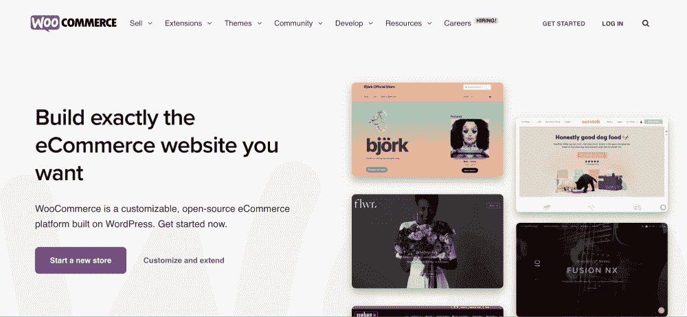
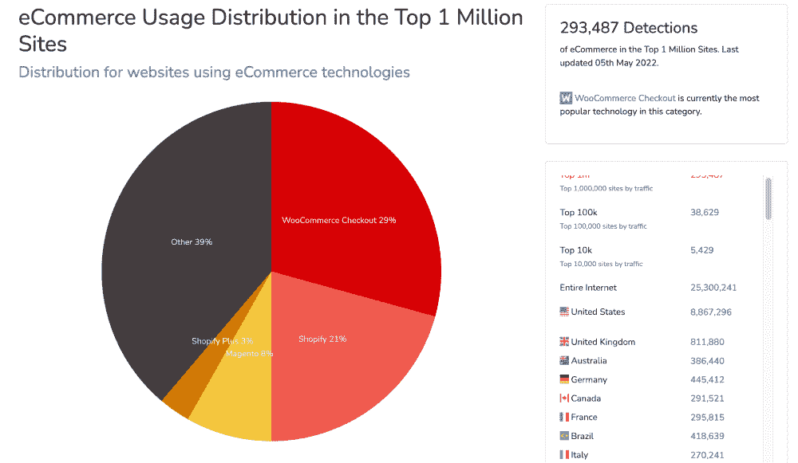
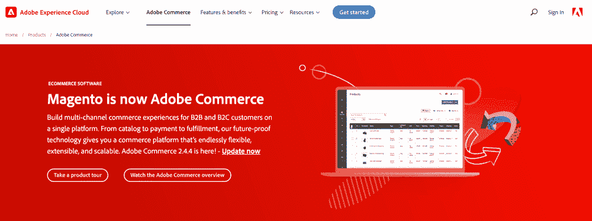
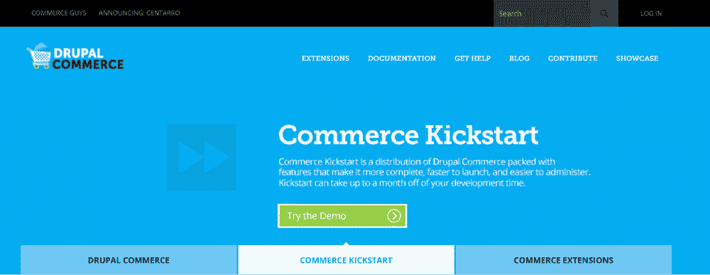
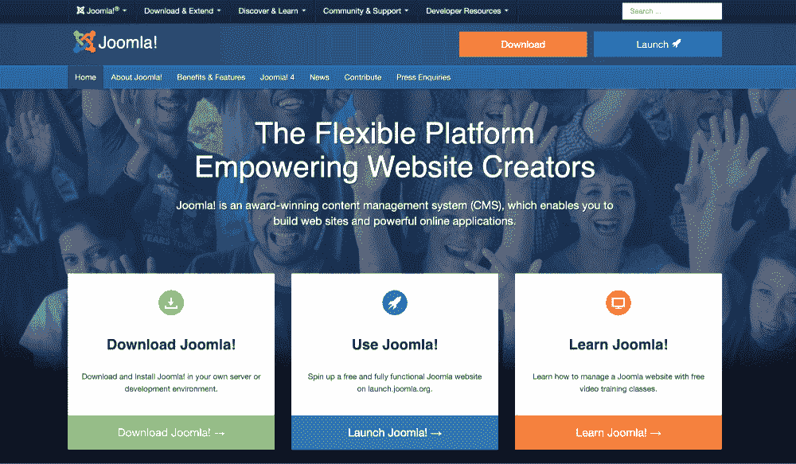
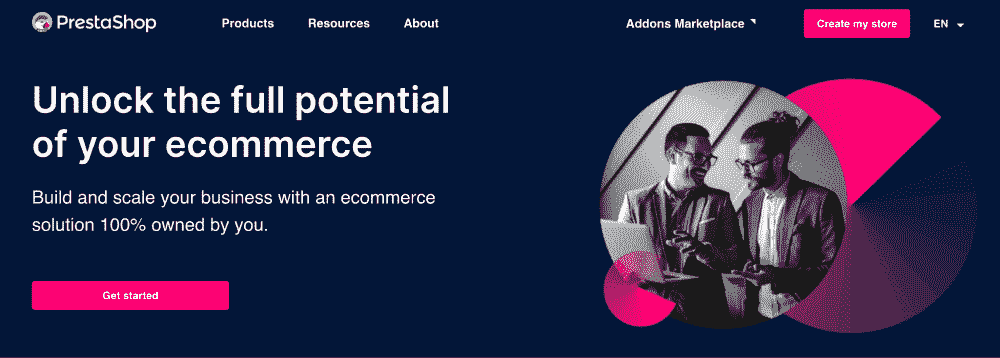
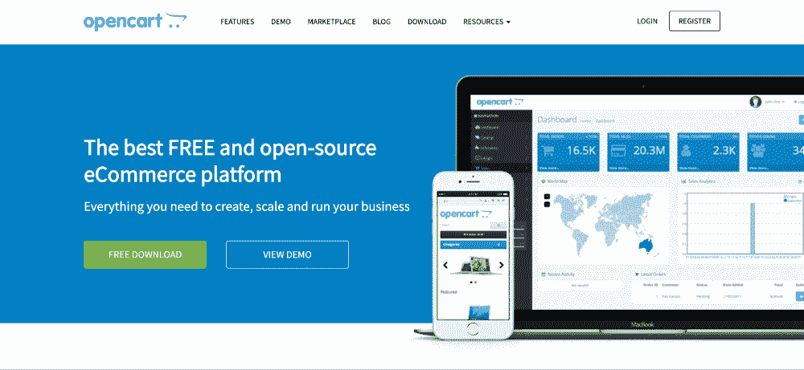
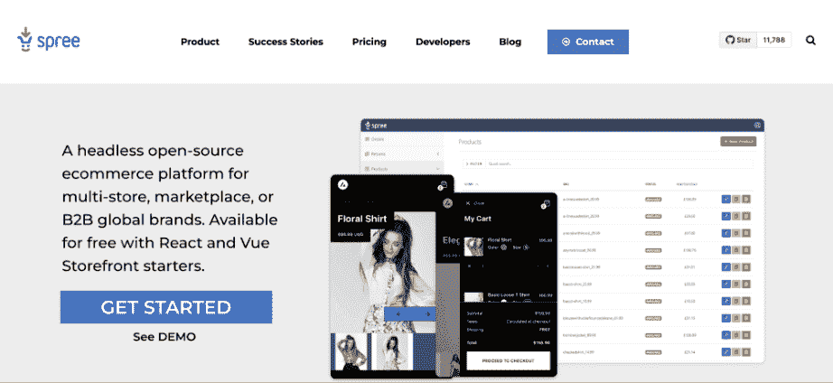
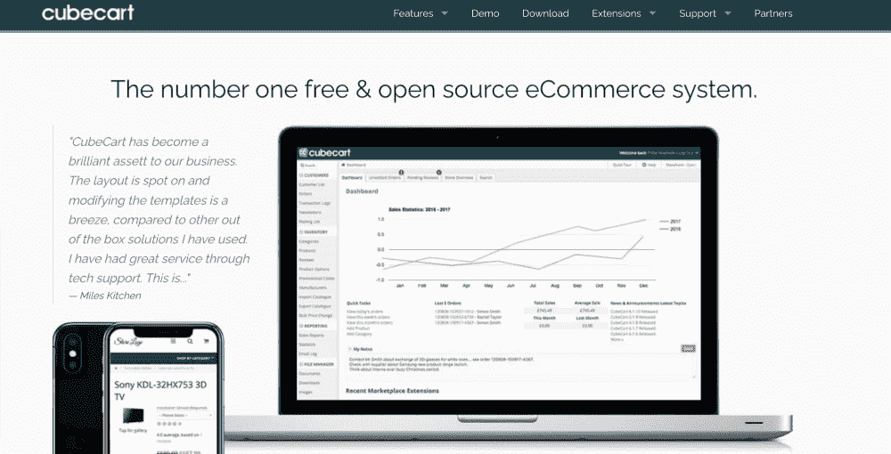
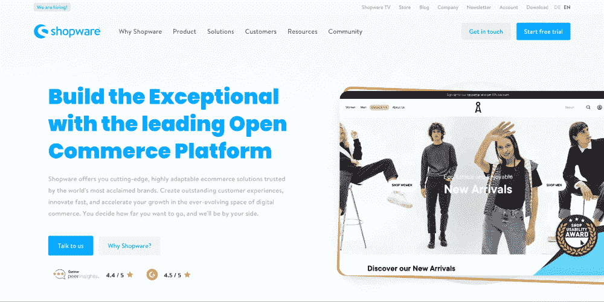

# 十大最佳开源电子商务平台

> 原文：<https://kinsta.com/blog/open-source-ecommerce/>

电子商务发展迅速。事实上， [eMarketer](https://www.emarketer.com/content/global-ecommerce-forecast-2022) 预计 2022 年全球电子商务销售额将达到 5.542 万亿美元。

如果你想开一家网店，从这种增长中获益，选择合适的电子商务平台是你要做的最重要的决定之一。有几种电子商务解决方案可供选择，正确的选择取决于您的需求。
[全球电子商务销售额预计将达到 5.542 万亿美元💰-因此，为您的企业选择合适的平台比以往任何时候都更加重要📈 点击发布推文](https://twitter.com/intent/tweet?url=https%3A%2F%2Fkinsta.com%2Fblog%2Fopen-source-ecommerce%2F&via=kinsta&text=Global+ecommerce+sales+are+expected+to+hit+%245.542+trillion+%F0%9F%92%B0-+so+choosing+the+right+platform+for+your+business+is+more+crucial+than+ever+%F0%9F%93%88&hashtags=Ecommerce%2CWooCommerce)
[NeilsenIQ](https://nielseniq.com/global/en/insights/commentary/2021/consumer-behavior-in-the-covid-recovery/)表示，自疫情事件以来，67%的购物者报告他们的购物方式发生了变化。您可以从定制的、可扩展的电子商务解决方案中受益，以迎合新一代客户的需求。

**查看我们的[最佳开源电子商务平台视频指南](https://www.youtube.com/watch?v=y5Swxmeoy-Q)**

 请继续阅读，了解更多关于最佳电子商务平台和你应该考虑的因素。

## 电子商务平台 101

电子商务平台是使企业能够管理其在线商店的软件，包括销售、营销和运营。
电子商务平台通常具有支持以下功能的特性:

*   [内容管理](https://kinsta.com/blog/cms-software/)
*   存货管理
*   支付方式
*   购物车
*   检验

 在寻找[电子商务平台](https://kinsta.com/blog/ecommerce-platforms/)时，你会遇到软件即服务(SaaS)和**开源**电子商务解决方案**。**

> 需要在这里大声喊出来。Kinsta 太神奇了，我用它做我的个人网站。支持是迅速和杰出的，他们的服务器是 WordPress 最快的。
> 
> <footer class="wp-block-kinsta-client-quote__footer">
> 
> 
> 
> <cite class="wp-block-kinsta-client-quote__cite">Phillip Stemann</cite></footer>

[View plans](https://kinsta.com/plans/)

在深入每个解决方案的细节之前，让我们看看选择电子商务平台时的常见考虑因素。

## 电子商务平台:寻找什么

选择一个电子商务平台并不像挑选午餐吃什么那么简单。你需要考虑你的团队的能力，你的业务增长的未来，前端和后端的易用性，当然，还有成本。

在决定平台之前，请确定您的优先事项:

*   **易用性:**平台的界面直观吗？你必须花很多时间学习如何使用它吗？
*   **可扩展性** **:** 理想情况下，你将受益于一个与你的业务一起成长的电子商务平台。您关注的解决方案是否支持小型企业到大型企业？
*   **自主:**你对平台有完全的控制权，还是依赖某个提供商？例如，SaaS 的电子商务解决方案会像社交媒体平台一样定期更新，你需要适应这些变化才能继续运营。
*   **维护和安全:**考虑维护和安全。你自己有管理这些的技术能力吗？你有资源雇人做这件事吗？或者您更愿意让平台团队为您维护和保护东西？
*   **成本:**该平台的计划是否在您的短期和长期预算范围内？例如，SaaS 解决方案使经营一个电子商务商店更容易，但随着你的电子商务商店的增长，成本可能会大幅上升。
*   **支持:**你能解决你遇到的软件问题吗？或者您需要平台的客户支持吗？
*   **功能和** **可定制性** **:** 平台是否提供你想要的功能？如果您被该平台所束缚，您会愿意使用它的内置特性吗，或者您希望使用第三方工具吗？如果你想使用第三方工具，你应该寻找一个易于定制和开放集成的电子商务解决方案。

## SaaS vs 开源电子商务平台

在 SaaS 和开源电子商务平台之间的选择归结为你需要什么样的电子商务解决方案。

|  | **SaaS** | **开源** |
| --- | --- | --- |
| 易用性 | 专为初学者打造 | 可能需要广泛的技术知识 |
| --- | --- | --- |
| 可量测性 | SaaS 平台适用于不同的规模 | 可攀登的 |
| --- | --- | --- |
| 自治 | 有限的控制，因为第三方提供商管理您的业务 | 允许您使用扩展和插件自定义和扩展功能 |
| --- | --- | --- |
| 维护和安全 | SaaS 平台负责维护和安全 | 你必须注意你的维护和安全更新。 |
| --- | --- | --- |
| 支持 | 有空的 | 无可用。一些平台提供额外费用的客户支持。 |
| --- | --- | --- |
| 费用 | 每月固定成本从每月 29 美元(基本)到每月 2，500 美元(企业) | 免费平台。虚拟主机+高级功能扩展可能会产生额外费用。 |
| --- | --- | --- |

### SaaS 电子商务平台

在 SaaS，服务提供商在云上托管电子商务[软件](https://kinsta.com/blog/cloud-market-share/) [，并通过订阅向你发放许可。月费从小型企业每月 29 美元到大型企业每月 2500 美元不等。](https://kinsta.com/blog/cloud-market-share/)

除了托管，SaaS 还包括安全，维护，更新和技术支持，当你购买一个计划。

如果你想快速启动你的网站，并节省基础设施、安装、安全和维护成本，SaaS [模式](https://kinsta.com/blog/saas-products/)是完美的选择。

流行的 SaaS 电子商务平台包括 Shopify、BigCommerce、Wix 和 Squarespace。

### 开源电子商务平台

开源电子商务解决方案让你访问源代码，根据自己的喜好修改平台。你可以免费使用源代码，但是[电子商务托管](https://kinsta.com/blog/ecommerce-hosting/)和扩展可能会产生额外的费用，所有这些都在你的其他[网站费用](https://kinsta.com/blog/wordpress-website-cost/)之上。

如果你是一个想从头开始建立自己的网上商店的企业家，开源平台为你实现这个梦想提供了灵活性、可定制性和可伸缩性。

虽然开源平台使你能够定制你的电子商务商店，但它们将安装、管理、安全、托管、维护和更新留给你，这意味着开源平台可能比 SaaS 平台需要更多的关注。

由于开源平台陡峭的学习曲线，你可能会听说一些公司从 SaaS 解决方案开始，当他们超越 SaaS 平台时就转向开源。

也就是说，开源电子商务平台并不局限于拥有大批网络开发者的大公司。您也可以在开源平台上从小处着手，并在此基础上不断发展。

此外，一些开源电子商务平台提供托管选项，为您提供两全其美的服务。

## 2022 年最佳开源电子商务平台

让我们来看看市场上一些最好的开源电子商务平台。

### 1.伍尔科贸易公司

WooCommerce homepage. (Image source: [WooCommerce](https://woocommerce.com/))

WooCommerce 是一个流行的[电子商务](https://kinsta.com/blog/wordpress-ecommerce-plugins/) [插件](https://kinsta.com/blog/wordpress-ecommerce-plugins/)，它为 WordPress 内容管理系统(CMS)提供电子商务功能，比如库存管理。它支持超过 500 万个电子商务网站，包括新百伦和斯巴鲁。

WooCommerce [和](https://kinsta.com/blog/woocommerce-vs-shopify/) [Shopify](https://kinsta.com/blog/woocommerce-vs-shopify/) 是排名前 100 万的电子商务网站中使用最多的电子商务平台，WooCommerce 拥有 [29%的市场份额](https://trends.builtwith.com/shop)(而 Shopify 的市场份额为 21%)。

WooCommerce vs Shopify market share. (Image source: [BuiltWith](https://trends.builtwith.com/shop))

WooCommerce 可以免费使用，但需要 [WordPress](https://kinsta.com/wordpress-hosting/) [托管](https://kinsta.com/wordpress-hosting/)。你可以从 Kinsta 的 [WooCommerce](https://kinsta.com/woocommerce-hosting/) [主机](https://kinsta.com/woocommerce-hosting/)中受益，该主机具有为 WooCommerce 量身定制的功能。
 虽然开源电子商务平台通常需要专业技术知识，但 WooCommerce 非常容易学习，而且[针对速度进行了优化](https://kinsta.com/blog/speed-up-woocommerce/)。

**特性:**

*   灵活和可定制的，像 WordPress
*   免费和付费的广泛选择 [WooCommerce](https://kinsta.com/blog/fastest-woocommerce-theme/) [主题](https://kinsta.com/blog/fastest-woocommerce-theme/)
*   庞大的扩展库
*   内置安全功能
*   支持多种集成

**定价:**免费

### 信息

如果你想了解更多关于 WooCommerce 的信息，请查看我们的 [WooCommerce](https://kinsta.com/learn/woocommerce-guide/) [指南](https://kinsta.com/learn/woocommerce-guide/)。

### 2.Adobe Commerce(前身为 Magento)

The homepage of Adobe Commerce (formerly Magento). (Image source: [Adobe](https://business.adobe.com/products/magento/magento-commerce.html))

[Adobe Commerce](https://business.adobe.com/sea/products/magento/features.html) (之前的 Magento)是一款电子商务软件，是 [Adobe 体验云](https://business.adobe.com/)的一部分。

Adobe Commerce 是一个强大、灵活、可扩展和可定制的开源平台，被全球 250，000 多家企业级在线商店使用，这些商店处理多种产品和大量流量。例如，[惠普](https://blog.adobe.com/en/publish/2019/03/25/how-hp-delivers-a-local-experience-with-magento)，前身为惠普，也使用 Adobe Commerce。

由于它是从 Magento 派生出来的，众所周知 Magento 是面向开发人员的，因此 Adobe Commerce 需要高级技术技能。

**特性:**

*   全天候客户支持
*   通过 Magento marketplace 的多个扩展
*   API 集成
*   原生 SEO 特性
*   内置分析

**定价:** [Magento 开源](https://business.adobe.com/products/magento/open%20source.html)免费；Adobe 的定价可应要求提供

### 信息

你在 Magento 和 WooCommerce 之间做选择吗？查看我们的[对比指南](https://kinsta.com/blog/magento-vs-woocommerce/)。

### 3.Drupal 商务

Drupal Commerce’s homepage. (Image source: [Drupal](https://drupalcommerce.org/))

Drupal Commerce 是一个建立在 [Drupal CMS](https://kinsta.com/drupal-market-share/) 之上的电子商务平台，后者是一个类似于 [WordPress](https://kinsta.com/blog/wordpress-vs-drupal/) 的开源 CMS [。](https://kinsta.com/blog/wordpress-vs-drupal/)

随着[谷歌算法](https://moz.com/google-algorithm-change)转变为更喜欢和优先考虑内容营销，单靠电子商务平台是不够的。如果你想对内容进行排名，你的电子商务平台必须包含一个体面的 CMS 功能。这是 Drupal Commerce 提供的东西。

Drupal Commerce 很受企业网站的欢迎，比如卡地亚。

**特性:**

*   搜索引擎优化和营销功能
*   订单管理工具
*   报告和分析
*   通过 RESTful API 与其他系统集成

**定价:**免费

### 4.网站架站软件

Joomla’s homepage. (Image source: [Joomla](https://www.joomla.org/))

Joomla T1 于 2005 年推出，是 T2 第二大流行的开源 CMS T3。它为 [2.5%的网站](https://w3techs.com/technologies/history_overview/content_management/ms/y)提供动力，其社区拥有超过 20 万名成员。像 WordPress 一样，你可以通过添加扩展来使用 Joomla 进行电子商务。

## 注册订阅时事通讯

### 想知道我们是怎么让流量增长超过 1000%的吗？

加入 20，000 多名获得我们每周时事通讯和内部消息的人的行列吧！

[Subscribe Now](#newsletter)

作为一个开源的 CMS，Joomla 为你提供了优化你喜欢的在线商店的灵活性。您可以为每一部分内容使用不同的模板。然而，与 Adobe Commerce 一样，它也需要高级技术技能。

Joomla 受到宜家、立顿和假日酒店等品牌的青睐。

**特性:**

*   市场上有 6，000 多种扩展可用于增加功能
*   响应式设计
*   无限产品
*   支持多种语言和货币

**定价:**免费

### 5.预车间

Homepage of PrestaShop open source ecommerce platform. (Image source: [PrestaShop](https://www.prestashop.com/en))

[PrestaShop](https://www.prestashop.com/en) 是一个基于 [Symfony](https://accesto.com/blog/what-is-php-framework-symfony-explained-for-executives/) 的开源电子商务平台，这是一个框架，通过让你挑选和添加你需要的模块到你的网站或应用程序来提高灵活性。

PrestaShop 拥有 600 多项功能和 5000 多个模块，但其中许多附加组件需要额外付费。除此之外，如果你不精通技术，PrestaShop 提供了一个完全托管的解决方案，将托管和维护与他们的开源软件结合起来。

Zippo 打火机和 Fashion Stork 是使用 PrestaShop 的 300，000 多家在线商店之一。

如果您计划使用 PrestaShop，请注意它不支持几种流行的集成，因此您必须使用它的内部解决方案。

**特性:**

*   数以千计的模块和附件，增加了功能
*   3000 多个移动优化模板
*   集成的搜索引擎优化和营销工具
*   多种货币支持

**定价:**免费；托管解决方案计划起价为每月 450 欧元(473 美元)。

### 信息

你在 WooCommerce 和 PrestaShop 之间做决定吗？查看我们的[对比指南](https://kinsta.com/blog/prestashop-vs-woocommerce/)。

### 6.开放式购物车

Homepage of the OpenCart ecommerce platform. (Image source: [OpenCart](https://www.opencart.com/))

[OpenCart](https://www.opencart.com/) 是一个开源电子商务平台，全球有超过 400，000 个网站所有者使用，包括英国红十字会。它提供了一系列功能——从一个界面的多商店管理到充满主题和扩展的市场。

然而，OpenCart 提供有限的搜索引擎优化和营销功能，这可能会限制你发展你的电子商务网站。此外，您需要技术知识才能从 OpenCart 中受益，因为它不提供客户支持。

**特性:**

*   管理控制面板—快速概述功能
*   备份和恢复工具
*   拥有 13，000 多个附件和扩展的大型市场
*   支持[废弃的](https://kinsta.com/blog/shopping-cart-abandonment/) [购物车](https://kinsta.com/blog/shopping-cart-abandonment/)和折扣券
*   移动应用程序

**定价:**免费

Struggling with downtime and WordPress problems? Kinsta is the hosting solution designed to save you time! [Check out our features](https://kinsta.com/features/)

### 7.狂欢式商业

Homepage of the Spree Commerce platform. (Image source: [Spree Commerce](https://spreecommerce.org/))

[Spree Commerce](https://spreecommerce.org/) 成立于 2008 年，是一个[无头](https://www.shopify.com/ph/enterprise/headless-commerce) [电子商务](https://www.shopify.com/ph/enterprise/headless-commerce)平台，既可作为开源平台，也可作为 SaaS 使用。

无头电子商务平台可以让你将前端(网站客户的头部或数字店面)与后端(确保你的商店平稳运行的后台软件)分开。您可以单独准备您的前端，并将其连接到无头平台，提供丰富的客户体验。

自 2007 年以来，Spree Commerce 的 850 多名贡献者已经帮助了超过 50，000 家企业，包括 Blue 围裙和 Everlane。开源版本是免费的，但功能有限，而 Spree as a Service 为您提供了额外的功能，并让您从云托管中受益。

**特性:**

*   多供应商市场
*   支持 B2B 和 B2C 电子商务
*   50 多个第三方集成
*   支持 Next.js 商务和[Vue](https://kinsta.com/blog/headless-wordpress/)T2】店面
*   分析仪表板、库存管理系统和搜索引擎优化工具

**定价:**免费开源；如有要求，可提供 SaaS 价格。

### 信息

你想增加你的电子商务销售额吗？实施这些[电子商务战略](https://kinsta.com/blog/ecommerce-strategies/)，看着你的销售飙升。

### 8.立方体手推车

Homepage of CubeCart’s open source ecommerce platform. (Image source: [CubeCart](https://www.cubecart.com/))

成立于 2003 年的, [CubeCart](https://www.cubecart.com/) 是一个英国开源电子商务平台，在英国内外广受欢迎

CubeCart 使用模板驱动的响应皮肤，使在线商店在不同设备上具有视觉吸引力。然而，它的灵活性仅限于如何在设备上显示在线商店——由于缺乏功能，它不适用于企业。虽然它与一些应用程序集成，但它不像 OpenCart 那样可扩展。

与 PrestaShop 一样，CubeCart 也提供其软件的托管和自托管版本，尽管它在 2015 年免费发布了所有软件版本。CubeCart 的粉丝包括库拉卡和哈里斯有机葡萄酒。

作为一个开源电子商务平台，CubeCart 缺乏实时支持，但你可以通过每月支付最低费用获得有偿技术支持。

**特性:**

*   无限的产品、订单、类别和管理员
*   100%模板驱动的响应皮肤
*   社交媒体和各种插件
*   礼券、优惠券和凭证功能
*   支持 PayPal 和 SagePay 等多种支付网关
*   销售报告

**定价:**免费，无客户支持。付费计划每月起价 33 美元。

### 9.商店用品

Homepage of Shopware open source ecommerce platform. (Image source: [Shopware](https://www.shopware.com/en/))

Shopware 是一个德国开源电子商务平台，成立于 2000 年。

像 Spree Commerce 一样，Shopware 是由 Symfony 驱动后端和前端的 [Vue.js 构建的。它有一个庞大的开发者社区，在全球拥有超过 100，000 名客户，包括像阿斯顿马丁和 M & Ms 这样的品牌](https://kinsta.com/blog/vue-js/)

值得注意的商店软件特性包括 4000 多个扩展、完全集成的 CMS 功能(如 Drupal)以及集成的 SEO 和营销工具。

然而，免费版本提供有限的功能，并且与 CubeCart 一样，客户支持需要额外的订阅。

**特性:**

*   完全集成的 CMS 功能
*   拖放界面，方便在线商店的定制
*   搜索引擎优化和营销工具
*   与谷歌购物和社交媒体的整合
*   自主托管或云托管变体之间的选择

**定价:**免费，功能有限。高级计划每月起价 199 欧元(210 美元)。
T3】

### 10.Solidus

Homepage of the Solidus open source ecommerce platform. (Image source: [Solidus](https://solidus.io/))

Solidus 是一个开源的电子商务平台，由 Ruby on Rails 提供支持，确保了安全性和灵活性。

Solidus 既可以作为一个整体平台(前端和后端捆绑在一起)，也可以作为一个像 Spree 这样的无头电子商务平台。

Solidus 具有广泛的集成功能，并有一个关于 Slack 和 Stack Overflow 的活跃社区。使用 Solidus 的著名品牌包括 MeUndies、Bonobos 和 Ace & Tate。

**功能:** 

*   [库存管理](https://kinsta.com/blog/woocommerce-inventory-management/)
*   促销引擎根据订单历史提供折扣和其他复杂的促销
*   多种支付集成和商店信用支持
*   支持多承运商运输

**定价:**免费
[想确保电子商务商店成功建立？🛒查看本指南✅ 点击推文](https://twitter.com/intent/tweet?url=https%3A%2F%2Fkinsta.com%2Fblog%2Fopen-source-ecommerce%2F&via=kinsta&text=Want+to+make+sure+ecommerce+store+is+set+up+for+success%3F+%F0%9F%9B%92+Check+out+this+guide+%E2%9C%85&hashtags=Ecommerce%2CWooCommerce)

## 摘要

选择一个电子商务平台是你作为电子商务企业主所做的最重要的决定之一。

SaaS 平台易于使用，并会为你处理一切，但像 WooCommerce 这样的开源平台提供了急需的灵活性，以扩展和增强客户体验。

如果你在权衡你的选择，考虑你的产品、技术专长和企业规模。

换句话说，评估您对定制、特性和可伸缩性的需求。如果你正在开始或经营一个中小型企业，WooCommerce 将为你提供很好的服务。另一方面，如果你正在为一家企业开一个网上店面，你可能会从 Magento 的功能中受益。

你更喜欢哪个平台？请在评论中告诉我们。

通过以下方式优化您的电子商务网站:

*   Cloudflare 企业集成
*   自动数据库优化
*   谷歌云平台
*   内置性能监控工具

与 Kinsta 一起享受所有这些和更多好处。[查看我们的计划](https://kinsta.com/plans/)或[与销售人员交谈](https://kinsta.com/contact-us/)找到适合您的计划，并使用我们的 30 天退款保证进行尝试。

* * *

让你所有的[应用程序](https://kinsta.com/application-hosting/)、[数据库](https://kinsta.com/database-hosting/)和 [WordPress 网站](https://kinsta.com/wordpress-hosting/)在线并在一个屋檐下。我们功能丰富的高性能云平台包括:

*   在 MyKinsta 仪表盘中轻松设置和管理
*   24/7 专家支持
*   最好的谷歌云平台硬件和网络，由 Kubernetes 提供最大的可扩展性
*   面向速度和安全性的企业级 Cloudflare 集成
*   全球受众覆盖全球多达 35 个数据中心和 275 多个 pop

在第一个月使用托管的[应用程序或托管](https://kinsta.com/application-hosting/)的[数据库，您可以享受 20 美元的优惠，亲自测试一下。探索我们的](https://kinsta.com/database-hosting/)[计划](https://kinsta.com/plans/)或[与销售人员交谈](https://kinsta.com/contact-us/)以找到最适合您的方式。