# 2022 年要尝试的 11 大前景选择

> 原文：<https://kinsta.com/blog/outlook-alternative/>

如今，我们对电子邮件客户的期望很高。仅仅撰写、发送和接收电子邮件是不够的。最好的电子邮件客户端帮助我们组织收件箱，管理日程安排，跟踪联系人等等。它们还与我们的其他工具集成，如视频会议应用程序。

微软 Outlook 有丰富的这些额外功能，所以它拥有 [2 亿](https://techcommunity.microsoft.com/t5/office-365/office-365-hits-200-million-monthly-active-users/m-p/942813)月用户也就不足为奇了。

但它是最好的电子邮件客户端吗？

本文研究了 11 种 Outlook 替代产品，它们的特性，它们的价格，以及你是否应该选择它们而不是 Microsoft Outlook。

## Microsoft Outlook 概述

Microsoft Outlook 是一个电子邮件客户端或应用程序，让您可以访问和管理您的电子邮件。

但也不止于此。

Outlook 提供日历、约会设置、任务管理、网页浏览等功能。它有桌面版、网络版和手机版。

> 需要在这里大声喊出来。Kinsta 太神奇了，我用它做我的个人网站。支持是迅速和杰出的，他们的服务器是 WordPress 最快的。
> 
> <footer class="wp-block-kinsta-client-quote__footer">
> 
> 
> 
> <cite class="wp-block-kinsta-client-quote__cite">Phillip Stemann</cite></footer>

[View plans](https://kinsta.com/plans/)

### Microsoft Outlook 的历史

我们今天所知的微软 Outlook 是从几个来源演变而来的。

当 Outlook 首次与 Microsoft Office 97 一起发布时，它取代了微软以前的电子邮件客户端 Microsoft Exchange Client 及其时间管理软件 Microsoft Schedule+。

Office 365 和 Exchange Online 订阅者可以使用的基于 web 的 Outlook 版本称为 Web 上的 Outlook。它于 1997 年作为 Exchange Client 5.0 的一部分首次推出，当时名为 Outlook Web Access(现在仍常缩写为 OWA)。

此外，1997 年，微软收购了 Hotmail，这是首批免费的基于网络的电子邮件服务之一。Hotmail 变成了 MSN Hotmail，然后是 Windows Live Hotmail，最后是 Outlook.com。Outlook.com 不是一个桌面邮件客户端，而是一个免费的电子邮件服务。

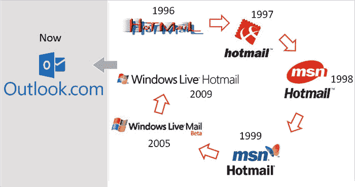

How Hotmail became Outlook (**Source:** [IndianWeb2](//www.indianweb2.com/2010/01/a-brief-history-of-hotmail.html%E2%80%9D))

### 展望市场份额

有很多电子邮件客户端(我们稍后会向您介绍其中的几个)，但大多数人使用的是苹果、谷歌或微软的电子邮件产品。

那么，与谷歌和苹果的电子邮件客户端相比，微软 Outlook 的市场份额如何呢？这取决于你用的是哪种设备。

Outlook 在桌面上表现最好，电子邮件打开份额为 37.2% 。这仅次于苹果邮箱，其打开率为 61.8%，其他客户端仅占 1%。

在移动领域，情况有所不同。苹果 iPhone 和 iPad 合计占有 90.8%的市场份额。谷歌安卓(Google Android)以 7.4%的份额远远落后于第二名，其他移动客户端都没有占据很大份额。

Outlook.com 拥有 3.2%的网络邮件市场份额，而 Gmail 以 89.1%的份额统治着网络邮件服务。

### 关键特征

在将 Microsoft Outlook 与其主要竞争对手进行比较之前，让我们看看它提供了什么。Outlook 有太多的功能需要在这里介绍，但这些是您应该了解的一些主要内容。

#### 电子邮件

电子邮件是 Outlook 的核心功能。它具有典型的电子邮件客户端功能，如接收、撰写和发送电子邮件。您可以将邮件组织到文件夹中，并设置自动将邮件发送到正确文件夹的规则。

#### 日历

Outlook 日历允许您一次查看多个日历，并安排会议和约会。虽然你可以单独使用它，但它对团队最有用。您可以邀请成员参加会议、查看冲突、回复或建议其他时间。

#### 任务/待办事项

Outlook 的经典任务功能正被逐步淘汰，以与微软的待办事项集成。

“待办事项”允许您创建任务列表、设置截止日期、获取提醒以及与他人共享您的待办事项列表。

#### 笔记

您可以为自己创建数字笔记，并在 Outlook 或桌面上显示它们。您还可以对笔记进行颜色编码，或者将其整理成列表。

#### 集成

Outlook 与流行的应用程序集成，包括:

*   微软团队
*   [松弛](https://kinsta.com/blog/slack-integrations/)
*   阿萨纳
*   一款云视频会议软件
*   微软 OneDrive

### 定价

您可以免费使用 Microsoft Outlook mobile 应用程序和 Outlook.com。

大多数 Windows 电脑都附带了 Outlook 应用程序，但如果你的电脑没有，你就必须购买桌面客户端。你可以一次性付款，花 159.99 美元购买独立版 Outlook，或者花 249.99 美元购买办公家庭和商业版。你也可以选择微软 365 订阅计划。

微软 365 个人版为每年 69.99 美元或每月 6.99 美元。微软 365 商业计划从每个用户每月 5 美元开始。

订阅 Microsoft 365 还可以让您访问 Outlook for Web。

## 为什么选择 Outlook 替代品？

尽管有很多好处，微软 Outlook 也有一些缺点。

### 价格

Outlook 没有免费的桌面电子邮件客户端。仅此一点就导致许多人寻求替代方案。

### 系统需求

微软的应用程序是为 Windows 开发的，它们在 Windows 中工作得最好。Outlook 确实有 Mac 版本，但如果你运行的是 Linux，你需要找到一个不同的电子邮件客户端。

### 易用性

这是一个见仁见智的问题，但有些人认为 Outlook 很难设置和使用。例如，在软件评测网站 G2 上，Outlook 的易用性评分为 [8.7](https://www.g2.com/products/microsoft-outlook/reviews) ，设置评分为 8.0。

谷歌工作空间在这两个类别中都得到了 9.2 分，而斯派克得到了 9.5 分和 9.7 分的 T2。

### 临时演员

Outlook 比大多数电子邮件客户端有更多的功能，但是它不能做所有的事情。

也许您正在寻找 Outlook 所没有的独特功能，例如向队友发送电子邮件的功能。

请继续阅读，找出 11 种优秀的 Microsoft Outlook 替代方案。

## 2022 年 11 大前景选择

### 1.雷鸟

雷鸟是 Mozilla 的一个开源电子邮件客户端。它可以免费使用，有 Windows、Mac 和 Linux 版本。人们普遍认为它比 Outlook 更容易安装。

它没有像 Outlook 那样附带日历，但你可以下载 Mozilla 的闪电日历，它与雷鸟完全集成。

Thunderbird 的界面从 Mozilla Firefox 和其他流行的浏览器中得到启示，让你在不同的标签中打开多封电子邮件。有很多选项可以定制收件箱的外观和感觉，还有一些附加组件可以增加功能。

然而，与 Outlook 相比，雷鸟的外观有点过时和杂乱。另一个缺点是它没有移动版本。

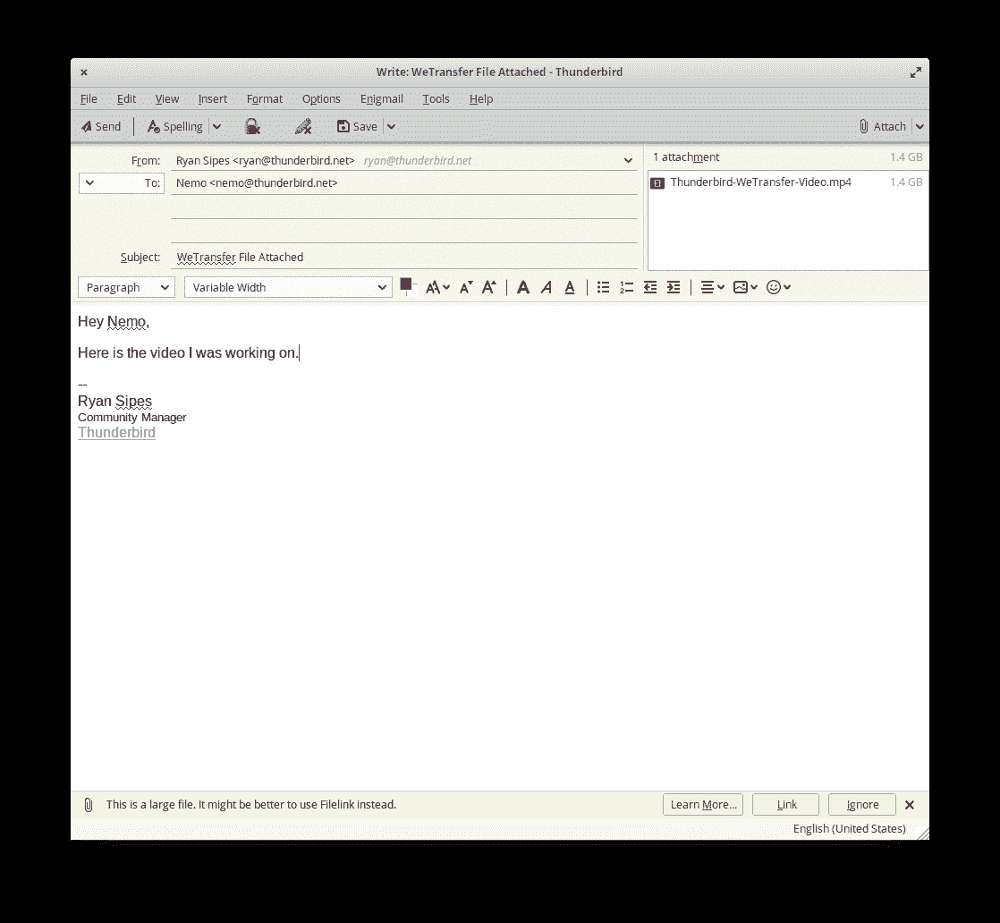

Thunderbird inbox

**主要特征**

*   桌面电子邮件客户端
*   支持 IMAP、POP3 和 SMTP 协议
*   多标签电子邮件界面
*   住址名册
*   搜索栏和电子邮件过滤器
*   邮件存档
*   不要跟踪和远程阻止内容
*   网络钓鱼防护
*   [垃圾邮件过滤器](https://kinsta.com/blog/email-deliverability-manager/)
*   定制选项和附加组件

**它最擅长做什么**

雷鸟有许多与 Outlook 相同的功能，但它是免费的。

**定价**

我们提到过它是免费的吗？

### 2.Gmail/谷歌工作区

我们先来澄清一下 Gmail 和 [Google Workspace](https://kinsta.com/blog/google-workspace/) 的区别。

Gmail 是谷歌的一项免费电子邮件服务，在免费电子邮件客户端中一直排名很高。Google Workspace 是 G Suite 商务版。使用 Google Workspace，管理员可以在他们的组织内创建、编辑和删除帐户。

Google Workspace 用户可以创建带有自定义域名的电子邮件地址，如[【电子邮件保护】](/cdn-cgi/l/email-protection)，而 Gmail 用户只能创建 Gmail 地址。Google Workspace 提供共享驱动器和更多存储空间。

根据你的需要，Gmail 和 Google Workspace 都可以作为 Outlook 的替代产品。

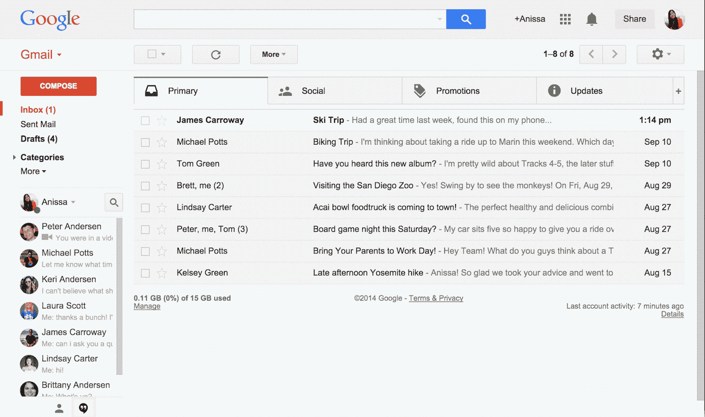

Gmail inbox

虽然 Gmail 通常用作电子邮件服务，但您也可以将其用作多个电子邮件帐户的电子邮件客户端，包括非 Google 地址。

Google Workspace 商业计划的定价与 Outlook 相当，但你得到的是不同的。Google Workspace 没有桌面版。

另一方面，免费网页版(Gmail)可以作为邮件客户端接收来自多家供应商的电子邮件，而 Outlook.com 只能与微软的电子邮件地址配合使用。

Google Workspace 也有自己的日历——Google Calendar。像电子邮件一样，这只能通过浏览器访问，而 Outlook 有桌面版。

**关键特征**

*   基于网络的电子邮件
*   日历
*   视频会议
*   自动电子邮件过滤器和类别
*   智能写作建议
*   用于创建日历事件的电子邮件中的事件详细信息
*   垃圾邮件过滤器
*   更高层计划的增强安全性

**它最擅长做什么**

Gmail 和 Google Workspace 是 Google 生态系统的一部分，如果你的公司已经使用了 Google Drive、Google Docs 或 Google Calendar 等解决方案，这将非常方便。

**定价**

*   Gmail:免费
*   创业:6 美元/月/用户
*   商业标准:12 美元/月/用户
*   商务加:18 美元/月/用户
*   企业:自定义

### 3.eM 客户端

eM Client 是一款适用于 Windows 和 Mac 的电子邮件客户端，提供了许多与 Microsoft Outlook 相同的功能，包括日历、任务和笔记。

它有一个干净、现代的界面，使用起来很直观。

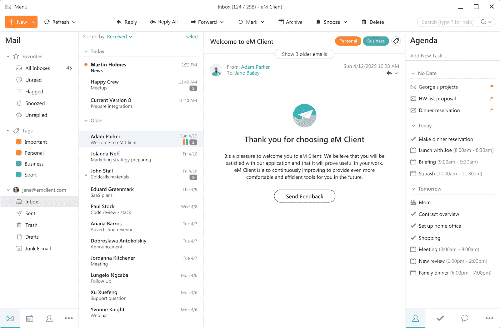

eM Client inbox

eM Client 承诺提供“超快的”搜索，甚至可以在 pdf 等文档中使用。它集成了 Dropbox、Gmail、谷歌日历和谷歌驱动。

总的来说，eM Client 和 Microsoft Outlook 类似，关于哪个更好，评论不一。

eM Client 的优势之一是它的免费版本。然而，它的功能非常有限。例如，您只能使用两个电子邮件地址，唯一的客户支持选项是用户论坛。

**主要特征**

*   桌面电子邮件客户端
*   日历
*   任务
*   笔记
*   电子邮件的即时翻译
*   暂停电子邮件
*   可定制界面
*   聊天即时消息
*   PGP 加密

**它最擅长做什么**

eM Client 是一个电子邮件客户端，很像 Outlook，但安全性稍好，界面不受干扰。

**定价**

*   自由的
*   个人版:49.95 美元
*   面向公司的专业版:188.95 美元

### 4.邮鸟

Mailbird 是一款用于 Windows 的电子邮件客户端。它有一个免费版本，你可以使用一个单一的电子邮件帐户和个人和商业用途的付费计划。

还有一个高度可定制的整洁界面。

虽然 Mailbird 可以让你将电子邮件组织到文件夹中，但它没有 Outlook 的自动排序选项。

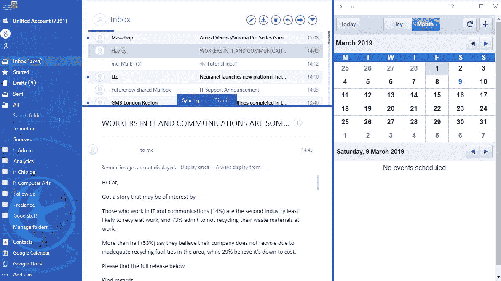

Mailbird inbox

Mailbird 与多种应用程序集成，包括但不限于:

*   谷歌服务
*   脸谱网
*   松弛的
*   推特
*   Dropbox
*   阿萨纳
*   Whatsapp
*   微博
*   商务化人际关系网
*   [电子邮件营销软件](https://kinsta.com/blog/email-marketing-software/)如 ZeroBounce

Mailbird 的 macOS 版本正在开发中。

## 注册订阅时事通讯

### 想知道我们是怎么让流量增长超过 1000%的吗？

加入 20，000 多名获得我们每周时事通讯和内部消息的人的行列吧！

[Subscribe Now](#newsletter)

**主要特征**

*   Windows 电子邮件客户端
*   支持 IMAP 和 POP3 帐户
*   暂停电子邮件
*   与许多应用程序集成
*   可定制的主题
*   多语言支持

**它最擅长做什么**

Mailbird 提供了大量有用的集成。

**定价**

*   自由的
*   个人:每月 3.25 美元
*   商务:每月 99.75 美元或 4.92 美元

### 5.火花

Spark 是一款适用于 Mac、iOS 和 Android 的电子邮件客户端。

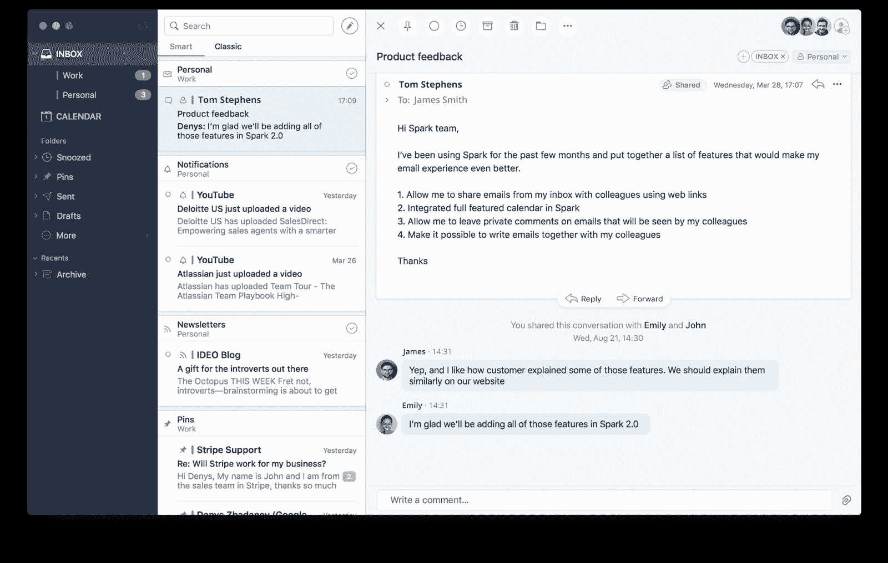

Spark inbox

Spark 一边学习，一边自动对收件箱中的电子邮件进行分类和优先排序。

团队协作是它最大的优势——你可以和其他人一起写一份共享的电子邮件草稿，或者在只有你的团队成员才能看到的电子邮件上留下评论。您还可以将电子邮件委托给特定的人，设置截止日期，并在完成时收到通知。

并非每个用户都对 Spark 的隐私做法感到兴奋。例如，一旦你在一台设备上设置了电子邮件帐户，你就再也不用输入所有的密码或其他详细信息了。当你在另一台设备上安装 Spark 时，你输入其中一个账户的详细信息，你所有的收件箱就会自动同步。

这非常方便，但也意味着你的电子邮件密码存储在服务器上。这意味着如果黑客进入了你的一个电子邮件账户，他们就可以进入所有的账户。

Spark 个人使用是免费的，但是团队协作功能需要付费。

**主要特征**

*   用于 Mac、iOS 和 Android 的电子邮件客户端
*   IMAP 和 POP3 支持
*   跨设备帐户同步
*   自动分类
*   电子邮件 pin
*   电子邮件暂停

**它最擅长做什么**

高级版提供了一组强大的协作功能。

**定价**

*   自由的
*   高级:6.39 美元/用户/月
*   企业:自定义

### 6.邮件春天

Mailspring 是一款适用于 Windows、Mac 和 Linux 的电子邮件客户端。它有一个相对简单的设计，易于理解，而且往往比 Outlook 运行得更快。

它有多种布局和主题可供选择。

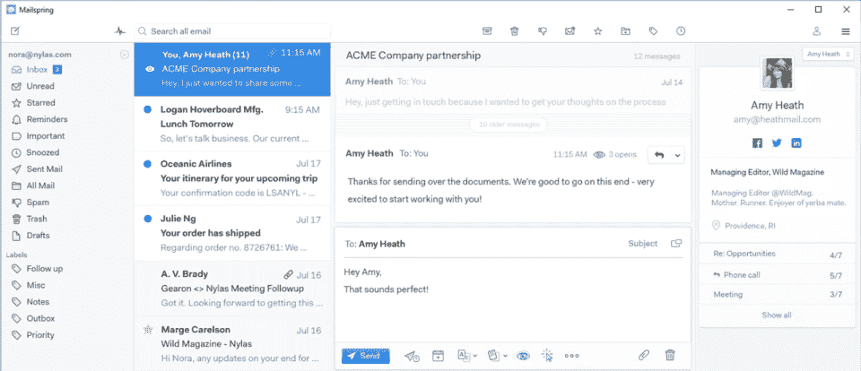

Mailspring inbox

Mailspring 提供了活动跟踪，这意味着当联系人阅读你的电子邮件时你会得到通知，还提供了链接跟踪，所以你可以看到谁在跟踪你的链接。

Mailspring 的免费版本可以让你连接多达四个电子邮件帐户。它缺少一些更花哨的功能，比如阅读回执和电子邮件打盹。

**主要特征**

*   用于 Windows、Mac 和 Linux 的桌面电子邮件客户端
*   连接 IMAP 和 Office 365 帐户
*   活动跟踪
*   链接跟踪
*   电子邮件暂停
*   可定制的布局和主题
*   本地化为九种语言

**它最擅长做什么**

Mailspring 有一个直观的设计，没有 Outlook 的臃肿。

**定价**

*   自由的
*   保费:8 美元/月

### 7.变化

[Shift](https://tryshift.com/) 旨在帮助你在[多个 Gmail 账户](https://kinsta.com/blog/multiple-gmail-accounts/)之间切换。它后来发展了，可以连接到微软的电子邮件和其他应用程序，如 Slack 和 Facebook Messenger。

需要一流的，快速的，安全的主机为您的新电子商务网站？Kinsta 提供超快的服务器和来自 WooCommerce 专家的 24/7 世界级支持。[查看我们的计划](https://kinsta.com/plans/?in-article-cta)

你可以一次搜索你所有的账户或者快速浏览它们。

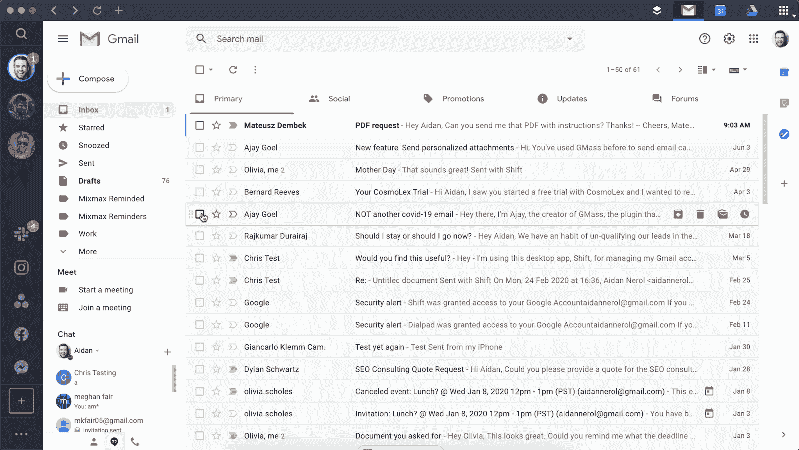

Shift inbox

虽然大多数评论者喜欢 Shift 及其集成的概念，但许多人发现它有很多缺陷，而且运行缓慢。

Shift 有一个免费版本，允许两个电子邮件帐户、一个应用程序和共享工作区。高级版本还允许你添加 Chrome 扩展和谷歌服务等功能。

如果您使用多个帐户通过电子邮件进行销售和营销，请查看我们在[电子邮件营销最佳实践](https://kinsta.com/blog/email-marketing-best-practices/)上的帖子。

**主要特征**

*   电子邮件和其他服务的桌面应用程序
*   多标签显示
*   搜索所有客户
*   创建共享工作区

**它最擅长做什么**

Shift 是一款用户友好的桌面应用，用于统一 Gmail、微软电子邮件以及其他应用和服务。

**定价**

*   自由的
*   高级:99.99 美元/年
*   团队:99.99 美元/年/用户

### 8.长钉

到目前为止，我们提到的许多电子邮件客户端都有类似的外观。

[秒杀](https://www.spikenow.com/)不一样。

用户界面的设计看起来和感觉上都像聊天。您收到的电子邮件被转换成聊天气泡，并显示为一个单独的对话。

你回复的邮件对收件人来说就像普通邮件一样(假设他们没有使用 Spike)。

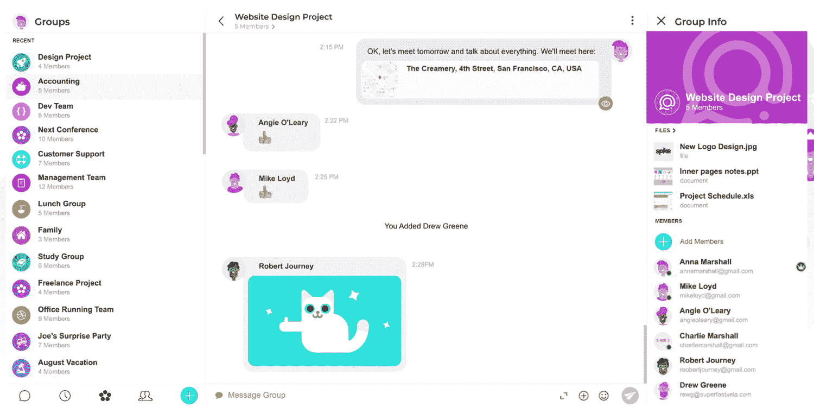

Spike inbox

Spike 还提供笔记、任务和视频聊天。

Spike 适用于 Windows、Mac、iOS 和 Android。有多种定价方案，包括一个免费的。这项免费计划让你可以连接无限的个人账户，并使用其他客户认为是高级的一些功能，包括电子邮件打盹和共享笔记。

**主要特征**

*   适用于 Windows、Mac、iOS 和 Android 的聊天式电子邮件客户端
*   @提及次数
*   电子邮件暂停
*   电子邮件 pin
*   自定义模板
*   任务
*   笔记
*   音频和视频通话

**它最擅长做什么**

斯派克把你的电子邮件变成一个单独的聊天对话。

**定价**

*   个人:免费
*   单人:12 美元/用户/月
*   团队:8 美元/用户/月
*   企业:7 美元/用户/月
*   企业:自定义

### 9.飞马星座

早在微软 Outlook 出现的几年前，就有了 [Pegasus](http://www.pmail.com/) 。在其网站上，Pegasus 吹嘘它是“互联网上服务时间最长的个人电子邮件系统”

Pegasus 创建于 1990 年，用于现已不存在的 NetWare 服务器操作系统，现在是一个 Windows 专用的客户端，仍然由其最初的创建者维护。

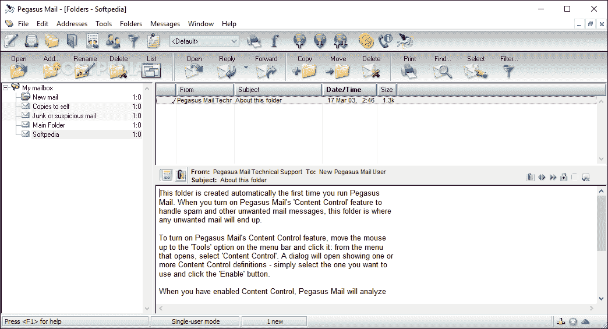

Pegasus Mail inbox

老实说，没有太多理由让你在 2022 年使用 Pegasus(也称为 Pmail)而不是 Microsoft Outlook。但它可以免费试用，而且它确实具有基于规则的过滤和搜索等现代功能。

**主要特征**

*   桌面 Windows 电子邮件客户端
*   管理多个帐户
*   支持 POP3 和 IMAP
*   过滤

**它最擅长做什么**

Pegasus Mail 是一个桌面 Windows 客户端，适合喜欢复古 Windows XP 体验的人。

**定价**

完全免费。

### 10.质子机

ProtonMail 是一个电子邮件提供商，而不是客户端，但是如果你对 Outlook 的安全功能不满意，它是一个很好的选择。

ProtonMail 位于瑞士，开源，为你的电子邮件提供端到端的加密。

ProtonMail 提供的众多安全功能之一是自毁电子邮件。您为您的电子邮件指定一个到期日期，该日期将从收件人的收件箱中删除。

ProtonMail inbox

使用 ProtonMail，您的电子邮件甚至可以免受 ProtonMail 的攻击。您的数据使用零访问加密存储，因此 ProtonMail 本身不知道您的密码，也无法解密您的电子邮件。

ProtonMail 是一款基于网络的电子邮件，为 Android 和 iOS 提供移动应用。

**主要特征**

*   基于网络、Android 和 iOS 的电子邮件
*   端到端加密
*   零访问加密
*   自毁邮件
*   付费计划的自定义域名

**它最擅长做什么**

ProtonMail 是现存最安全的电子邮件客户端之一。

**定价**

*   自由的
*   另外:每月 5 美元或每年 48 美元
*   专业:8 美元/月或 75 美元/年
*   愿景:每月 30 美元或每年 288 美元

### 11.前面

[Front](https://front.com/) 是一款电子邮件应用，旨在改善与您的团队和客户的沟通。

它提供协作功能，如共享收件箱和向队友发送电子邮件的能力，所以你知道谁会回复什么。

您可以在电子邮件线程上评论和@提及其他用户，以便与您的团队进行讨论。

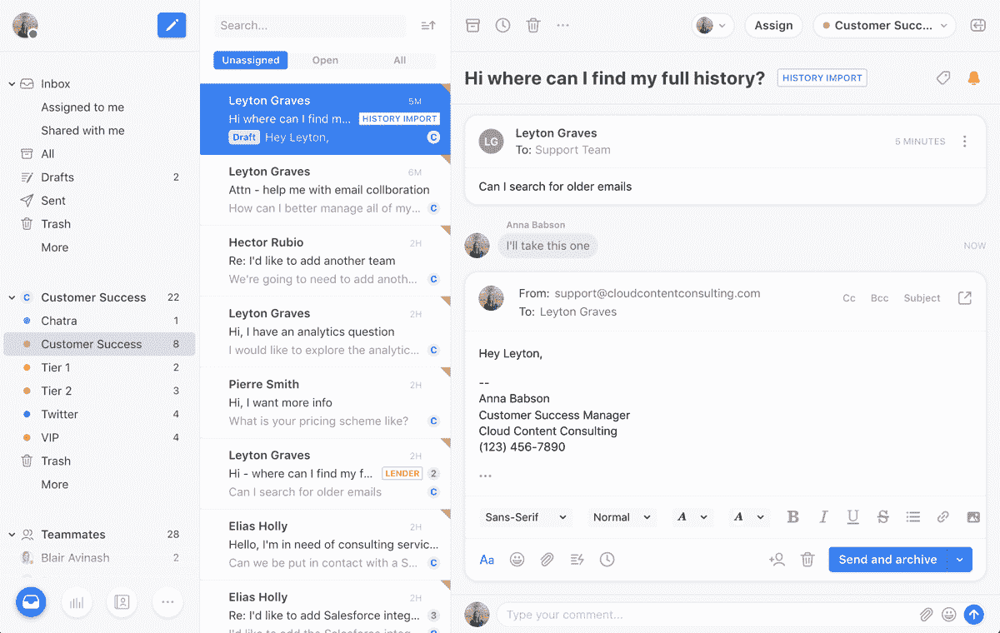

Front inbox

Front 不仅汇集了电子邮件帐户，还汇集了社交媒体和其他应用程序。

分析可以让经理实时洞察团队的表现。

正如你可能知道的，Front 是针对商业用途的，所以没有免费或个人的计划。非常适合 [B2B 电子邮件营销。](https://kinsta.com/blog/email-marketing-tips/)

**关键特征**

*   适用于 Windows、Mac、iOS 和 Android 的电子邮件客户端
*   共享电子邮件草稿
*   评论和@提及
*   向团队成员分配电子邮件
*   消息模板
*   定制自动化
*   分析学

**它最擅长做什么**

Front 是一个功能丰富的团队协作平台。

**定价**

*   入门:19 美元/用户/月
*   prime:49 美元/用户/月
*   企业:自定义

[Is Microsoft Outlook the right email client for you? 🤔 Explore more options in this guide 📧Click to Tweet](https://twitter.com/intent/tweet?url=https%3A%2F%2Fkinsta.com%2Fblog%2Foutlook-alternative%2F&via=kinsta&text=Is+Microsoft+Outlook+the+right+email+client+for+you%3F+%F0%9F%A4%94+Explore+more+options+in+this+guide+%F0%9F%93%A7&hashtags=EmailTips%2CMicrosoftOutlook) ## 摘要

微软 Outlook 是全球顶级电子邮件客户端之一，但它并不适合所有人。

首先，如果你需要一个桌面客户端，它会变得很贵。根据你的需要，你可能会更关注团队协作或安全性。

幸运的是，有很多可供选择的方法可以尝试。

选定了电子邮件客户端，并准备好开始让电子邮件为您的企业服务了吗？请在评论中告诉我们你打算尝试哪一种。

* * *

让你所有的[应用程序](https://kinsta.com/application-hosting/)、[数据库](https://kinsta.com/database-hosting/)和 [WordPress 网站](https://kinsta.com/wordpress-hosting/)在线并在一个屋檐下。我们功能丰富的高性能云平台包括:

*   在 MyKinsta 仪表盘中轻松设置和管理
*   24/7 专家支持
*   最好的谷歌云平台硬件和网络，由 Kubernetes 提供最大的可扩展性
*   面向速度和安全性的企业级 Cloudflare 集成
*   全球受众覆盖全球多达 35 个数据中心和 275 多个 pop

在第一个月使用托管的[应用程序或托管](https://kinsta.com/application-hosting/)的[数据库，您可以享受 20 美元的优惠，亲自测试一下。探索我们的](https://kinsta.com/database-hosting/)[计划](https://kinsta.com/plans/)或[与销售人员交谈](https://kinsta.com/contact-us/)以找到最适合您的方式。