# 2022 年使用的 9 个最佳密码管理器

> 原文：<https://kinsta.com/blog/password-managers/>

有时候你可能会觉得自己疯了。

你会在你的[登录屏幕](https://kinsta.com/blog/wordpress-login-url/)前坐几分钟，绞尽脑汁寻找一个你已经使用了一百万次的密码。

更糟糕的是，如果你想不起来，你将不得不通过[重置你的密码](https://kinsta.com/blog/change-wordpress-password/)的练习，并试图记住你的安全问题的答案到底是什么。

这种经历对很多人来说都很常见。超过 78% 的人在过去 90 天内重置了他们的一个密码。

为了抵消这一繁琐的过程，许多人转向密码管理器来保存和存储他们的敏感信息。

在本帖中，我们将概述你需要知道的关于密码管理器的一切，并强调你应该考虑的最佳密码管理器。

[You changed your password to something you swore you'd never forget... so why are you drawing a blank now? 😭 Make life much easier with these 9 great password managers 🔒Click to Tweet](https://twitter.com/intent/tweet?url=https%3A%2F%2Fbit.ly%2F3hZJPQJ&via=kinsta&text=You+changed+your+password+to+something+you+swore+you%27d+never+forget...+so+why+are+you+drawing+a+blank+now%3F+%F0%9F%98%AD+Make+life+much+easier+with+these+9+great+password+managers+%F0%9F%94%92&hashtags=SiteSecurity%2CPasswords)

## 密码管理器是如何工作的？

密码管理器是一种基于网络的安全软件或可在您的设备上下载的软件，使您能够存储密码，从而更容易登录到您最喜爱的帐户。一些密码管理器存储其他敏感信息，包括[信用卡信息](https://kinsta.com/help/update-card-information/)、地址、安全笔记等等。

许多人使用密码管理器来消除记住所有个人密码的需要。

想象一下，你再也不用经历所有的步骤来重新设置你的密码。相反，你只需点击几下鼠标就可以登录你的账户。

当您登录网站时，只要您登录到密码管理器，您的密码就会自动填充。

此外，您可以利用[浏览器插件](https://kinsta.com/blog/best-chrome-extensions/)来简化这一过程。

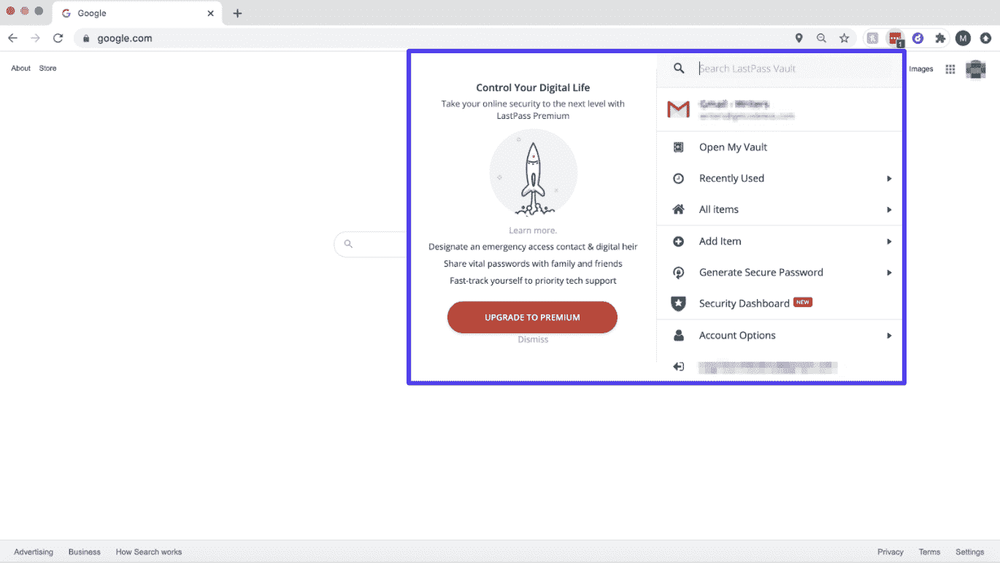

LastPass Chrome extensions

密码管理器帮助全球数百万用户实现了这一点，并消除了他们登录过程中的摩擦。大约 22%的美国人使用密码应用程序来管理他们的安全信息。

你所需要做的就是记住你的密码管理器使用的主密码，你应该已经准备好了。

密码管理器还有助于用户有一个更安全，更安全的在线足迹。可以生成密码，并向帐户可能受损的用户发送警报。

用户也将能够创建独特的密码，因为他们不必记住它们。

例如，一项研究发现，4400 万微软用户不止一个账户使用同一个密码。

专家会建议你多样化你的密码以防一个账户被泄露。

有了密码管理器，你可以。

## 密码管理器有多安全？

可以想象，许多消费者关心的是密码管理器的安全性。

简短的回答是:非常安全。

大多数密码管理器使用高级加密标准(AES)和 256 位随机生成的密钥。

这是密码管理员可以用来加密和保护安全信息的最高形式的安全协议之一。随机生成的密钥对存储在软件中的信息进行加密。

此外，大多数密码管理器在本地加密，这意味着它们不会存储或查看您的信息。在你的密码被保存在密码管理器之前，它们是被加密的，所以公司甚至不知道敏感信息。

最重要的是，记住密码管理器是比笔记本、Google Sheets 或 word 文档更好的选择。

它们更安全，甚至有助于消费者安全措施。他们用密码生成器帮助你制作更复杂的密码，最终使你的[登录程序更加安全](https://kinsta.com/blog/change-wordpress-password/)。

不管你喜不喜欢，其他人可能正试图进入你的账户。事实上，超过 27% 的人曾试图猜测别人的密码，而 17%的人猜对了。

一旦有人进入你的一个帐户，如果你使用相同的密码，他们就可以进入所有的帐户。

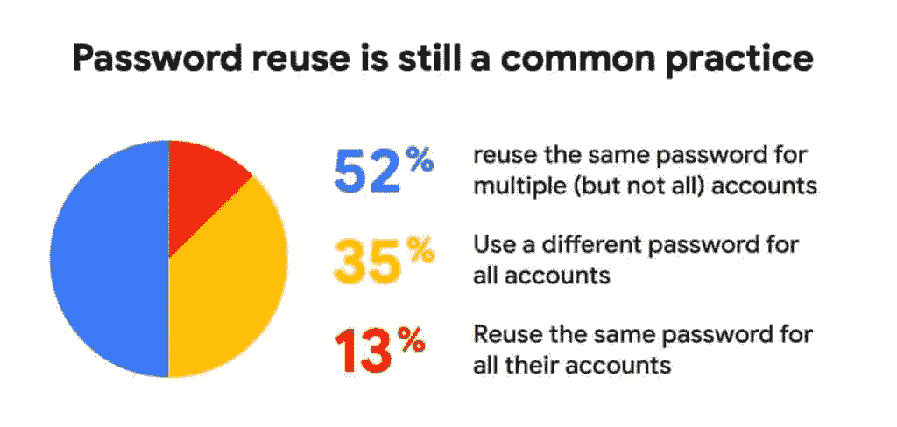

Password reuse statistics (Image source: [google.com](http://services.google.com/fh/files/blogs/google_security_infographic.pdf))

这就是为什么使用复杂密码的组合来增加您的在线帐户和云安全至关重要。

如果没有多重密码，你的所有账户都有遭受毁灭性攻击的风险。

密码管理器迫使您加强您的数字安全，同时安全地存储您的敏感信息并保护它免受不良行为者的侵害。

## 如何使用密码管理器

密码管理器是如此容易使用后，快速安装过程。

您需要做的就是:

1.  注册你选择的密码管理器。
2.  下载桌面版和浏览器插件。
3.  选择主密码并登录。
4.  开始链接您的帐户。

从那里，当你访问一个你有帐户的网站时，你只需点击几下就可以登录。

无论您使用密码应用程序还是在线浏览器，都可以让您轻松添加、编辑和存储密码。

只需登录，您就可以开始了:

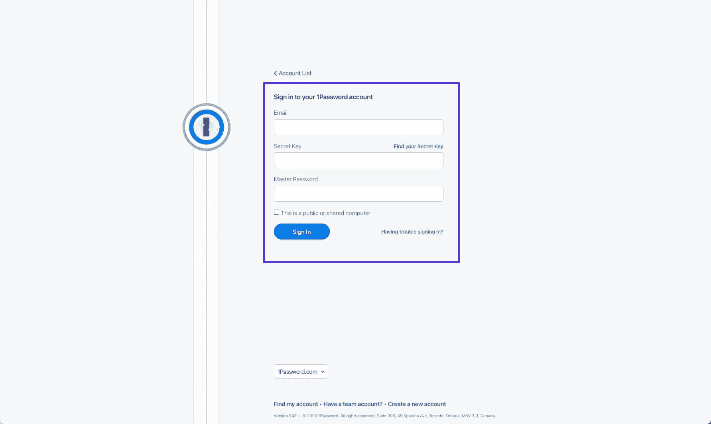

Password manager example

当你所有的密码都被存储后，你只需点击几下鼠标就可以登录你的账户了。

## 9 个最佳密码管理器可供选择(免费和付费工具)

也许你是密码管理器的新手，只是想知道什么是满足你密码需求的一体化解决方案。

下面我们重点介绍了市场上最佳密码管理器的主要竞争者。这考虑了安全性、可用性、价格和功能。

如果您想要所有领先的密码管理器的安全性，但不想为它们付出代价，请考虑这些免费选项。

虽然大多数都提供某种形式的免费增值模式，但这些竞争者免费提供了最广泛的功能。

### 1.比特监狱长

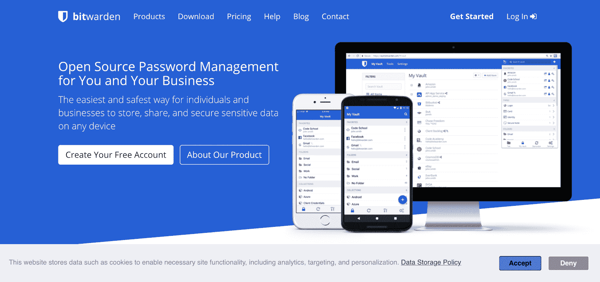

Bitwarden

Bitwarden 是一款密码管理解决方案，可以在信息离开您的设备之前对其进行加密。通过利用开源软件，来自世界各地的开发者可以改进其基础设施。

作为一款免费软件，Bitwarden 提供了确保密码安全存储所需的基础知识。只需每年支付几美元，你就可以选择加入报告，如果某些密码不够复杂，它会向你发出警告，并包括关于你账户的额外安全数据。

**定价:** Bitwarden 是免费的，除非你想升级到每年 10 美元的精选高级功能，包括[双因素认证](https://kinsta.com/blog/wordpress-two-factor-authentication/)，安全报告等等。

### 2.诺德帕斯

NordPass

由著名的 VPN 解决方案[nord VPN](https://nordpass.com/)的创造者带来的[nord VPN](https://kinsta.com/blog/proxy-vs-vpn/#2-nordvpn)是一个相对较新的密码管理器，允许用户即使在离线时也能访问他们的密码——不管是什么设备。这是一个简单的密码管理应用程序，没有其竞争对手的所有花哨功能。

如果您只是在寻找一种存储密码的方式，并且不需要太多其他东西，NordPass 可能是您的正确选择。它提供独特的功能，包括通过指纹扫描或 FaceID 功能的生物识别保护。

**定价:**免费版本应该更适合大多数使用案例，但你可以每月花 2.49 美元升级，以评估密码健康，跨多个设备同步等等。

## 注册订阅时事通讯

### 想知道我们是怎么让流量增长超过 1000%的吗？

加入 20，000 多名获得我们每周时事通讯和内部消息的人的行列吧！

[Subscribe Now](#newsletter)

### 3.KeePass

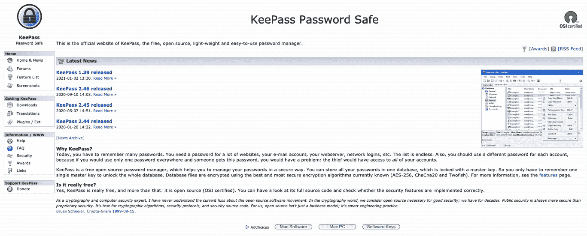

KeePass

[KeePass](https://keepass.info/) 带你回到基础。你不会发现这一个花哨的用户界面，但开源软件让你“在一个数据库中存储你所有的密码”，你可以用你的密钥访问。

该平台声称受到 NASA 的信任，新版本似乎在不断发布。这对于只想安全存储密码的用户来说是完美的。

使用 KeePass，您可以绕过其他一些可能会分散注意力的功能，只需安全地存储您的密码，因此您不必担心它们。

**定价:** KeePass 是一款免费的开源软件。

### 4.机器人形态

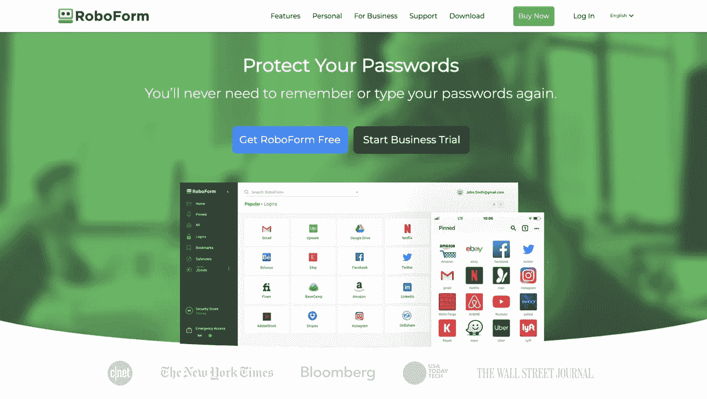

RoboForm

RoboForm 是一个存储密码的直接解决方案。密码管理器提供了广泛的功能，包括主密码生成器、密码表单自动填充、多平台支持等等。

RoboForm 还使您能够安全地发送登录信息，这通常是竞争对手密码管理器解决方案中的一项付费功能。该应用程序与所有浏览器集成，你可以导入或导出你的密码，以击中地面运行。

**定价:** RoboForm 的高级版本每人每年 16.70 美元，解锁双因素身份验证、安全共享文件夹、优先支持等其他功能。

### 5.粘性密码

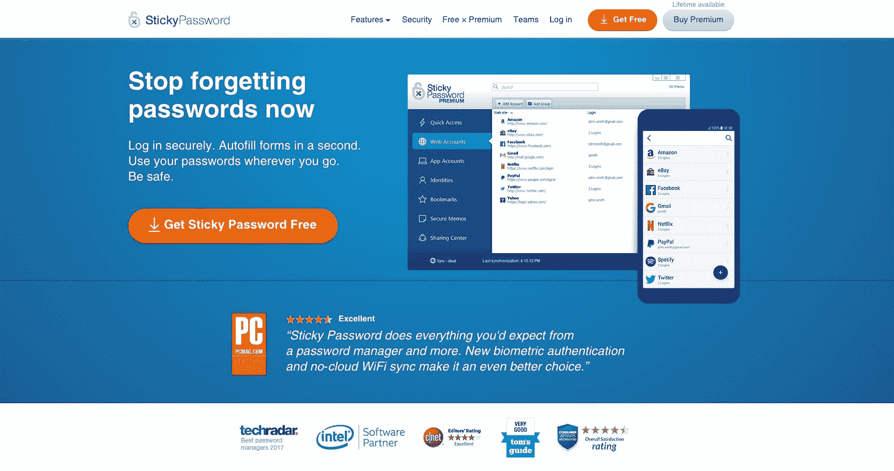

Sticky Password

粘性密码已经上市，可以帮助你安全登录，并且“现在就不要忘记你的密码”这个密码管理器有一个加密的保险箱，可以安全地保存您的登录信息。通过使用单点登录，您将能够在几秒钟内通过几次点击来访问您的所有密码。

由于有一个基本的界面和必要的功能，粘性密码提供了多种设备共享，所以你可以在你的在线帐户或离线应用程序上访问你的密码。该平台具有无云 WiFi 同步和生物认证功能，安全可靠。

Sticky Password 还提供了一个智能安全仪表板，突出显示哪些已保存的登录帐户具有弱密码，需要更改为更复杂的密码。这对于那些希望增强安全措施的用户来说是一个额外的奖励。

**定价:**粘性密码免费。如果你想选择高级密码管理器选项来解锁无限制的密码共享、同步和备份，你需要每年支付 29.99 美元，或者选择 159.99 美元的终身服务。

### 6.最后一遍

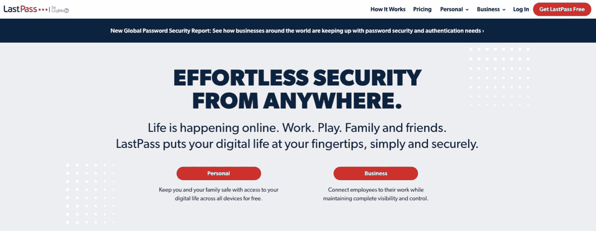

LastPass

[LastPass](https://www.lastpass.com/) 是市场上首批密码管理器之一，与 1Password 一起被广泛认为是行业领导者。

LastPass 的工作原理是让用户注册一个安全的主密码，他们可以使用该密码登录并开始添加他们的密码。“保险库”可以用来存储密码、安全笔记，甚至地址。

为了方便保存和访问你的密码，LastPass 为几乎所有的浏览器都提供了扩展功能。但是，为了登录，用户可以设置多因素身份验证作为附加的安全功能。这是对仅在您的设备上发生的 AES-256 位加密的补充。

虽然 LastPass 起初并不是最直观的密码管理器，但它独特的工具集，捆绑在免费版本中，使它成为用户中使用最多的密码管理器之一。然而，该公司在 2021 年引入的巨大变化可能会对 LastPass 未来的市场份额产生负面影响。

与宕机和 WordPress 问题做斗争？Kinsta 是一款考虑到性能和安全性的托管解决方案！[查看我们的计划](https://kinsta.com/plans/?in-article-cta)

截至 2021 年 3 月 16 日，LastPass 正在[将对其服务](https://blog.lastpass.com/2021/02/changes-to-lastpass-free/)的访问限制为一种活动设备类型。这意味着，如果你在他们的免费计划中，你将被要求选择**电脑**或**移动设备**作为你访问密码、金库和笔记的首选方式。具体来说，您的首次登录将设置您的活动设备类型，您只有三次机会来决定哪种活动设备类型适合您。

**定价:**提供了一个免费版本，允许您存储自己的密码，但不能共享，并且仅限于一种活动设备类型。高级版起价为每人每月 3 美元。它开启了包括共享、安全仪表板、黑暗网络监控等高级功能。

### 7.仪表板

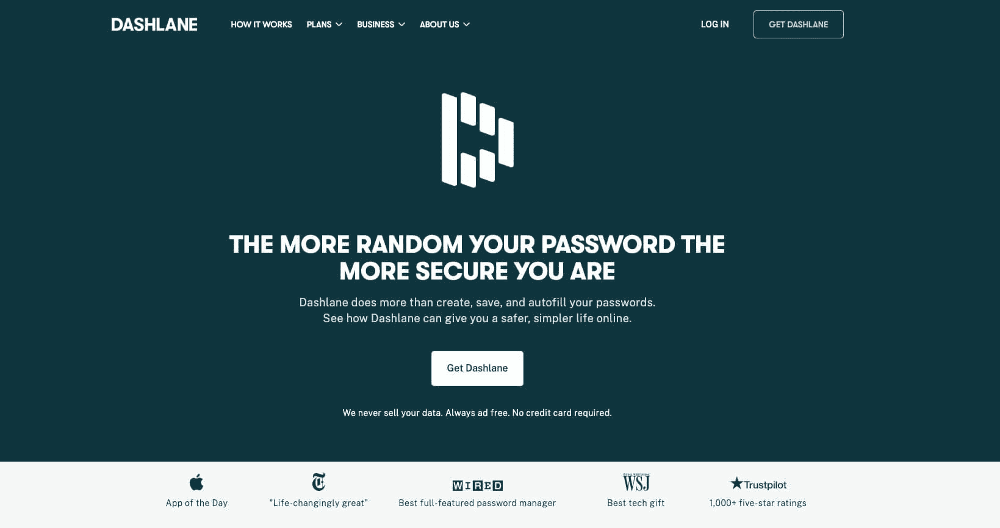

Dashlane

Dashlane 的存在是为了“给你一个更安全、更简单的在线生活”除了密码管理，Dashlane 还会检查您的整个数字足迹，寻找保护您的在线信息安全的方法。

与其他密码管理器应用程序非常相似，Dashlane 会在您浏览时存储您的密码信息，并具有密码自动填充功能，使您能够在第一次[登录账户](https://kinsta.com/blog/wordpress-login-url/)时输入密码。

Dashlane 还提供了一个密码生成器，这是一个为每个帐户创建唯一密码并将其存储在密码管理器中的工具。这些密码是字符、符号和数字的随机组合，这使得[黑客](https://kinsta.com/blog/wordpress-hacked/)更难猜出它们。

Dashlane 的[黑暗网络监控功能](https://support.dashlane.com/hc/en-us/articles/360000230240-Dark-Web-Monitoring-FAQ)是真正让它们与众不同的地方。这种高级功能只扫描网络，并交叉引用您帐户的最新漏洞和黑客攻击。如果你的账户有任何问题或者你需要修改密码，它会提醒你。

**定价:**有一个免费的计划以及个人每月 4.99 美元(如果按年付费)起的高级选项。

### 8.1 密码

[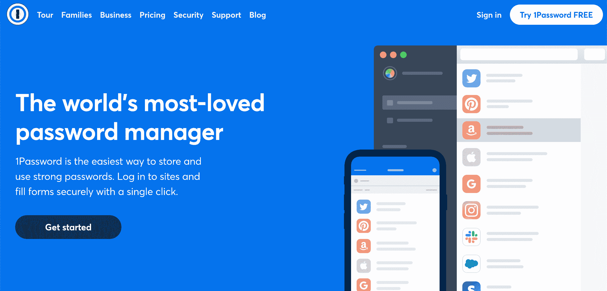](https://kinsta.com/wp-content/uploads/2021/01/1pass.png)

1Password

[1Password](https://1password.com/) 是一个密码管理器，它强调只需要“一个密码”就够了。该平台提供基于网络、移动和桌面的应用程序，使您可以在任何设备上轻松找回密码。

1Password 的核心功能包括自动填表功能，使您只需点击、查看或触摸即可登录您的帐户。此外，它还提供了了望塔，可以扫描网页，如果你的密码不够复杂，还会提醒你。它会检查您的密码，并在您需要为任何网站设置双因素身份验证时向您发送警报。

1Password 还会为用户生成一个“密钥”。此密钥通过 1 密码服务器进行身份验证，但它由用户存储在本地，以增加加密级别。

**定价:** 1Password 不提供免费选项。它的价格选项从每人每月 2.99 美元(按年计费)开始。

### 9.饲养员

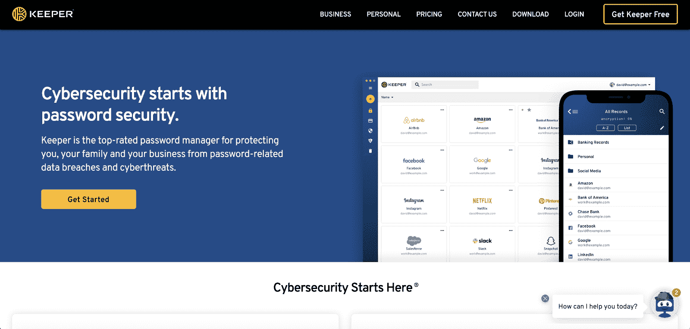

Keeper

[Keeper](https://www.keepersecurity.com/) 存储您的密码数据，同时保护您免受[密码相关数据泄露和威胁](https://kinsta.com/blog/password-protect-wordpress-site/)。使用 Keeper，您可以添加不同的角色，为每个帐户分配不同的权限和特权。

Keeper 的用户体验是它区别于竞争对手的地方。布局易于掌握，应用程序的蓝白对比使其成为一种简单、有吸引力的视觉体验。

**定价:** Keeper 提供 5 种不同的计划(企业、商业、个人、家庭、学生)，每人每月 2.91 美元起。

## Mac 和 Windows 预装密码管理器怎么办？

大多数计算机设备都装有软件，可以存储密码。

### macOS 钥匙串访问

当您使用 Safari 并首次登录网站、电子邮件帐户或任何受密码保护的项目时，系统会询问您是否要存储密码:

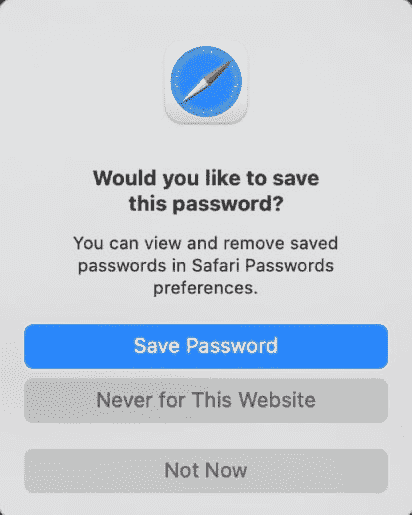

Storing password on macOS

这已经成为互联网浏览体验的一个标准部分，也将成为几乎所有网络消费者的第二天性。

通过点按“存储密码”，您将在“钥匙串访问”中储存您的登录凭据。

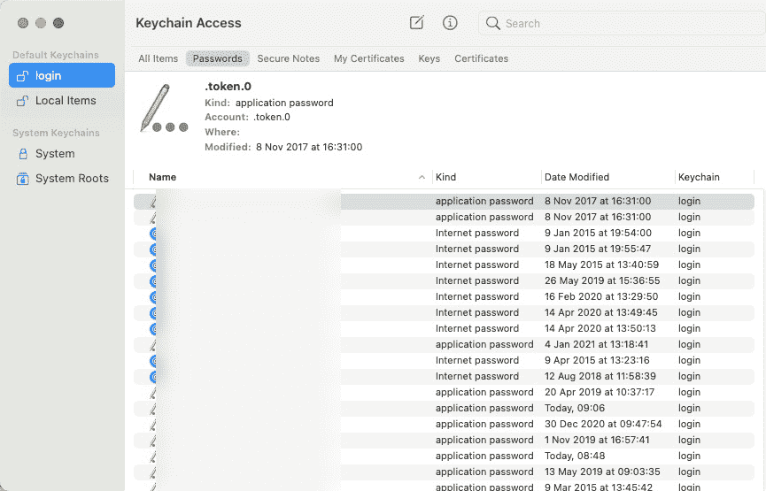

Keychain Access

“钥匙串访问”使用与大多数密码管理器相同的 AES-256-GCM 密钥，甚至允许用户创建加密的便笺来访问他们的帐户。

当将“钥匙串访问”与其他密码管理器进行比较时，差异几乎不明显，因为除了存储和检索加密信息之外，没有太多其他功能。

对于 Windows 凭据管理器来说也是如此。

### Windows 凭据管理器

如果您使用的是 PC，Windows 凭据管理器相当于 macOS 的钥匙串软件。它将登录信息存储在设备和安全服务器上。

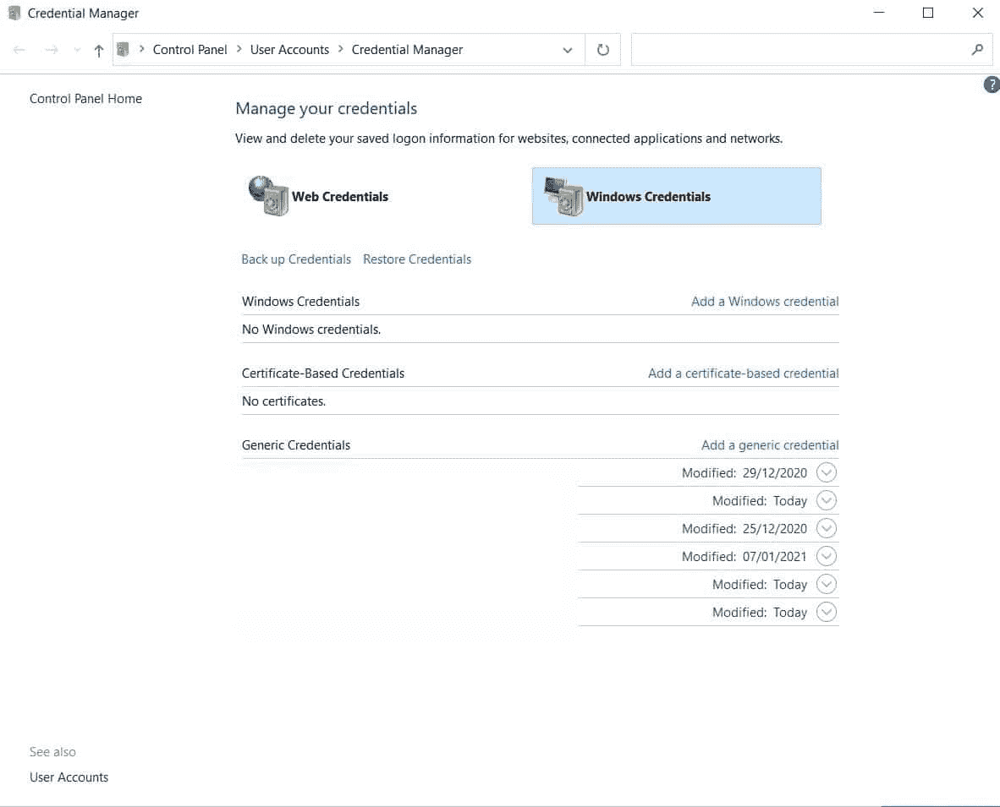

Windows Credential Manager

然而，这些年来，用户对这款应用的安全级别有一些[安全担忧。](https://security.stackexchange.com/questions/93437/how-to-read-password-from-windows-credentials/177686#177686)

因此，为了确保你的数据安全，我建议绕过这两个选项，直接选择一个密码管理器应用程序。

为什么？有各种各样的原因，最重要的是，这些基于操作系统的应用程序的加密级别可能会有所不同，这使得它们不如主要为该用例开发的密码管理器安全。

你仍然可以使用这些作为你的一些密码的基本存储“单元”,因为它可以快速轻松地检索它们，但是如果你想要更安全，更强大，更方便的功能，你将需要一个密码管理器。

[More than 78% of people have reset one of their passwords in the past 90 days. 🤯 Stop the cycle with one of these password managers 💪Click to Tweet](https://twitter.com/intent/tweet?url=https%3A%2F%2Fbit.ly%2F3hZJPQJ&via=kinsta&text=More+than+78%25+of+people+have+reset+one+of+their+passwords+in+the+past+90+days.+%F0%9F%A4%AF+Stop+the+cycle+with+one+of+these+password+managers+%F0%9F%92%AA&hashtags=Login%2CSiteSecurity)

## 摘要

密码管理器是一项受欢迎的技术，用户开始采用它。它们是存储敏感数据和登录凭据的更安全的方式。

只需点击几下就可以下载一个并且只需要记住一个主密码，密码管理器是一个方便有用的软件，应该成为你的工具集的一部分。

与其他类型的应用程序一样，根据您的具体需求、预算和使用情况选择合适的应用程序。这篇博文中概述的那些都是有效的解决方案，可以适应大多数用例以及个人偏好。

现在轮到你了:你使用任何密码管理器吗？你有什么经验？请在评论中告诉我们！

* * *

让你所有的[应用程序](https://kinsta.com/application-hosting/)、[数据库](https://kinsta.com/database-hosting/)和 [WordPress 网站](https://kinsta.com/wordpress-hosting/)在线并在一个屋檐下。我们功能丰富的高性能云平台包括:

*   在 MyKinsta 仪表盘中轻松设置和管理
*   24/7 专家支持
*   最好的谷歌云平台硬件和网络，由 Kubernetes 提供最大的可扩展性
*   面向速度和安全性的企业级 Cloudflare 集成
*   全球受众覆盖全球多达 35 个数据中心和 275 多个 pop

在第一个月使用托管的[应用程序或托管](https://kinsta.com/application-hosting/)的[数据库，您可以享受 20 美元的优惠，亲自测试一下。探索我们的](https://kinsta.com/database-hosting/)[计划](https://kinsta.com/plans/)或[与销售人员交谈](https://kinsta.com/contact-us/)以找到最适合您的方式。