# PayPal 替代品:2022 年你应该考虑的 22 种支付处理器

> 原文：<https://kinsta.com/blog/paypal-alternative/>

对于一些企业来说，PayPal 没有提供他们需要的支付处理器。这款支付应用收取高额退款费用，而且没有提供许多企业所寻求的卖家保护水平。

更糟糕的是，它没有提供最顺畅的支付体验，这可能会分散试图在你的网站上购物的消费者的注意力。

令人欣慰的是，市场上有大量的 PayPal 替代品，企业可以使用它们高效、安全地发送和接收付款。

但是哪一个适合你的业务呢？

在这篇文章中，我们将概述 PayPal 的几个主要选择，你应该看一看，并开始使用它们来接受渴望在你的网站上下单的购物者的付款。

## 哪种支付处理器适合我的企业？

在当今社会，消费者正在寻求无摩擦的、立竿见影的支付方式。

支付处理商为传统的在线交易引入了一种新的现代方法，使购买更加容易和方便。

> Kinsta 把我宠坏了，所以我现在要求每个供应商都提供这样的服务。我们还试图通过我们的 SaaS 工具支持达到这一水平。
> 
> <footer class="wp-block-kinsta-client-quote__footer">
> 
> 
> 
> <cite class="wp-block-kinsta-client-quote__cite">Suganthan Mohanadasan from @Suganthanmn</cite></footer>

[View plans](https://kinsta.com/plans/)

### 支付处理器的基本特征

在我们深入了解每个网关的细节之前，了解大多数支付处理器提供的基本功能是很重要的。

大多数支付处理商都提供:

*   在线支付门户或链接
*   直接存款银行转账
*   移动支付兼容性
*   货币兑换
*   商户账户仪表板

当你评估支付平台选项时，考虑一下什么对你的网站最重要。市场上有这么多，其中许多都提供重叠的功能。

通过了解它们的不同之处，您将能够评估和选择适合您业务的支付提供商。

### PayPal 最大的竞争对手是什么？

据该公司称，实物现金是贝宝最大的竞争对手。PayPal 试图让消费者进行更多的无现金在线交易。

其他拥有巨大市场份额的公司，如 Square、Shopify Payments 和 Apple Pay，也可以被视为直接竞争对手。

然而，与现金不同的是，PayPal 和其他支付网关使得在流行的电子商务网站和在线市场如易贝上进行交易变得容易。

#### 不使用 Paypal，你能在易贝上销售吗？

许多消费者认为 PayPal 必须在易贝开设店面，但事实并非如此。易贝也接受信用卡和借记卡。

Paypal 是 20 世纪 90 年代末易贝流行的支付方式，但自那以后，该网站允许消费者使用更多选择。

据[易贝](https://www.ebay.com/help/selling/listings/choosing-get-paid?id=4106)，

> “当你在易贝上列出一件商品时，你就选择了买家付款的方式。在大多数类别中，你必须接受 PayPal 或信用卡和借记卡。”

现在，回到正题:贝宝有什么好的替代品吗？

[PayPal is popular... but that doesn't necessarily mean it's the right choice for your business. 💳 Find options with tighter security and lower fees in this roundup ⬇️Click to Tweet](https://twitter.com/intent/tweet?url=https%3A%2F%2Fkinsta.com%2Fblog%2Fpaypal-alternative%2F&via=kinsta&text=PayPal+is+popular...+but+that+doesn%27t+necessarily+mean+it%27s+the+right+choice+for+your+business.+%F0%9F%92%B3++Find+options+with+tighter+security+and+lower+fees+in+this+roundup+%E2%AC%87%EF%B8%8F&hashtags=MakeMoneyOnline%2CPayPal)

## 2022 年 22 个最佳 PayPal 替代品

繁重的工作和研究已经为你完成了。我们已经编制了一份清单，列出了 PayPal 的主要功能，最重要的是，它们的费用。浏览所有内容，或单击下面的链接跳转到您想要查看的特定内容:

### 1.不要动

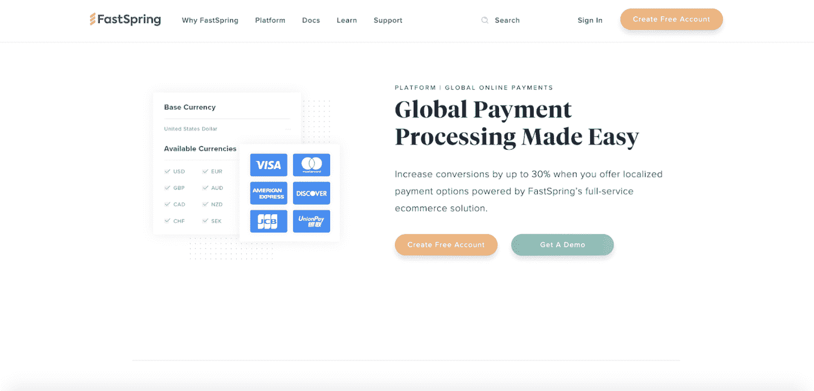

FastSpring

FastSpring 是一个电子商务支付解决方案，通过专注于本地化的支付处理来宣传其提高转化率的能力。

FastSpring 目前通过 15 种不同语言的流行支付方式接受 20 多种不同的货币。结账语言会根据购物者的位置自动更新。

此外，FastSpring 是一家[PCI 1 级服务提供商](https://kinsta.com/knowledgebase/pci-compliant-hosting/)，这是目前最高的安全等级。

FastSpring 最重要的特性之一是它能够更高效地处理支付。与一些支付处理器不同，FastSpring 会自动将交易重新路由到其他参与银行，并在第一家银行失败时再次尝试交易。

FastSpring 提供固定费用模式和可变费用模式，前者每笔交易收取 8.9%的固定费用，后者根据总交易的 5.9%+0.95 美元收取费用。

### 2.亚马逊支付

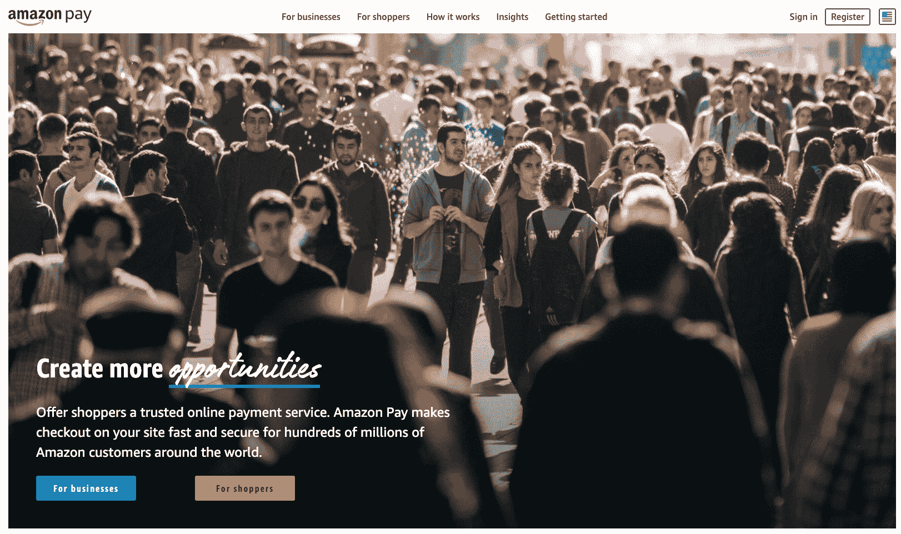

Amazon Pay

[Amazon Pay](https://pay.amazon.com/) 通过支持亚马逊账户持有人在您的网站上无缝结账，简化了支付流程。通过 Amazon Pay 处理的付款被授予“全程担保”，确保您购买的商品的最佳交付和条件。

由于 Amazon Pay 要求消费者拥有一个 [Amazon 账户](https://kinsta.com/affiliate-academy/amazon-affiliate-website/)，因此顾客在购买前需要经过验证。这个过程，连同它的[欺诈检测服务](https://kinsta.com/blog/ecommerce-fraud-prevention/)，有助于减少你在结账时遇到的问题。

Amazon Pay 以其一键订购界面而闻名，这使其易用性成为竞争优势。

亚马逊支付对每笔美国国内交易收取 2.9%+0.30 美元的费用。

### 3.种类

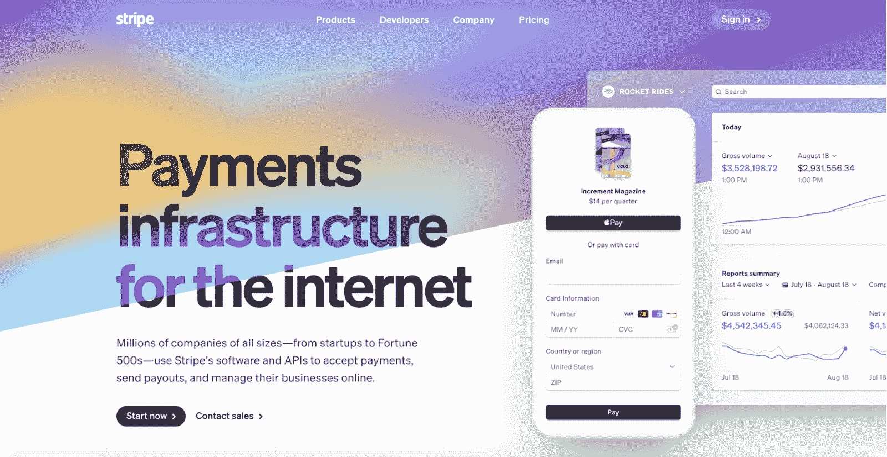

Stripe

Stripe 认为自己是“互联网的支付基础设施”各种规模的公司都使用 Stripe 来轻松管理交易和支付。 [Stripe 的爆炸性收入](https://kinsta.com/stripe-revenue/)和不断增长的市场份额使其位居第二，仅次于 Paypal。

[Stripe 为企业主提供了很大的灵活性](https://kinsta.com/blog/stripe-for-wordpress/)。他们可以将 Stripe 集成到他们的店面中，并通过仅向他们的站点添加一个集成来接受全球交易。一些竞争对手要求在您希望开展业务的每个国家进行多项整合。所有处理都在本地进行，为了安全起见，卡号和密钥被加密并分开存储。

Stripe 是支付流程各个方面的综合平台。企业主可以定制客户支付体验，评估优化机会，[审查欺诈警报](https://kinsta.com/blog/credit-card-fraud-stripe/)，协调供应商，并执行报告。

Stripe 提供多种集成，包括与 QuickBooks 和 NetSuite 的集成，将您的支付方式直接连接到您的会计分类账。

Stripe 每笔交易收取 2.9% + $0.30 的费用。请务必阅读我们的 [Stripe 与 PayPal 的深度对比](https://kinsta.com/blog/stripe-vs-paypal/)。

### 4.Google Pay

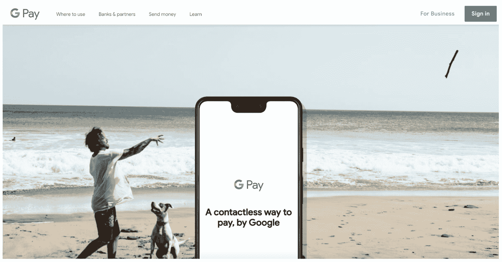

Google Pay

[Google Pay](https://pay.google.com/about/) 是一种非接触式支付方式，被全球[数百万家商店](https://kinsta.com/blog/ecommerce-platforms/)使用。处理器为顾客使用一个加密的号码来代替他们的信用卡号码。这增加了[的安全性](https://kinsta.com/blog/cloud-security/)，并开辟了一些新的交易方式。

消费者可以通过[电子邮件地址](https://kinsta.com/blog/professional-email-address/)或电话号码来收发钱款。企业可以使用 Google Pay 作为顾客在网上商店结账的另一种方式。

此外，企业可以利用 Google Pay 与 Passes 应用程序的集成。这使他们能够直接在套票应用程序中推广忠诚度计划、优惠和礼品卡。他们还可以通过基于位置的通知来锁定消费者。

Google Pay 不收取任何商户费用，但收取标准的信用卡费用。

### 5\. WePay

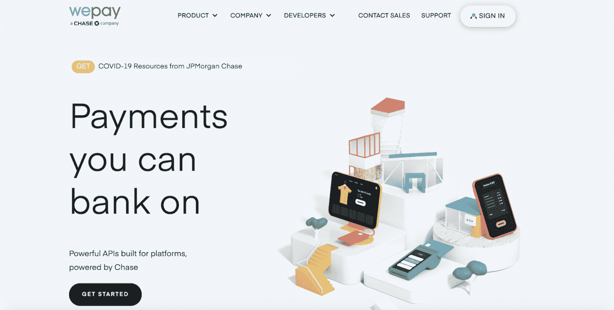

WePay

WePay 为企业处理支付，并与他们已经在使用的许多软件程序集成。大通银行在 2017 年收购了 WePay。

WePay 为企业提供当日存款，并能够将支付信息与您当前正在运行的其他报告相集成。

WePay 可以很容易地添加到你的网站上，只需要几行代码。此外，企业可以使用其物理终端和移动读卡器进行当面支付。

WePay 为您的员工工资单提供业务保障，包括损失保护和承包商管理功能。

WePay 收取每笔交易 2.9% + $0.30 的费用。

### 6.Apple Pay

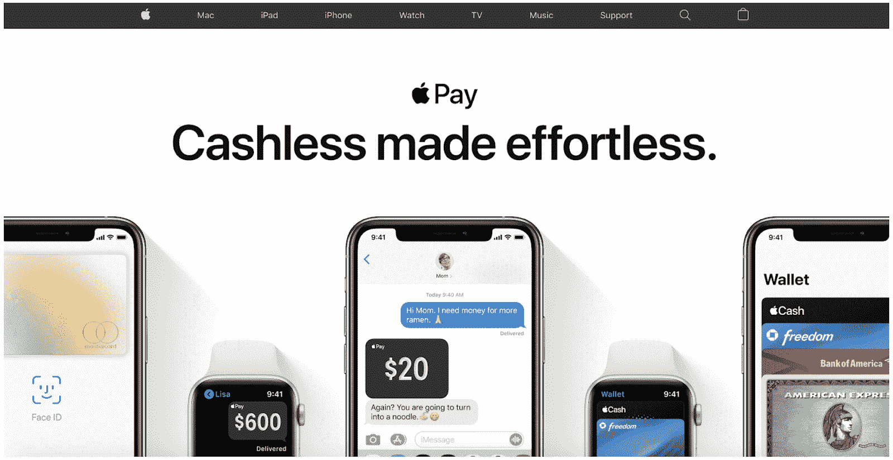

Apple Pay

Apple Pay 使企业能够从拥有苹果设备的顾客那里收取非现金付款。除了使用 Apple Pay 购买商品，用户还可以发送和接收资金，这使其成为一种几乎无处不在的交易方式。

Apple Pay 对用户来说很直观。他们只需点击一下就可以在线支付，或者在你的商店用他们的 iPhone 或 Apple watch 支付。它与 Mac 上的触控 ID 兼容，增加了他们购买的便利性和效率。

企业可以只通过 Apple Pay 进行交易，也可以与其他支付方式结合使用。此外，商家可以通过 Apple Pay 直接使用和填充他们的奖励计划。

Apple Pay 兼容大多数发卡机构和支付提供商。没有费用转嫁给企业。

### 7.2 结账

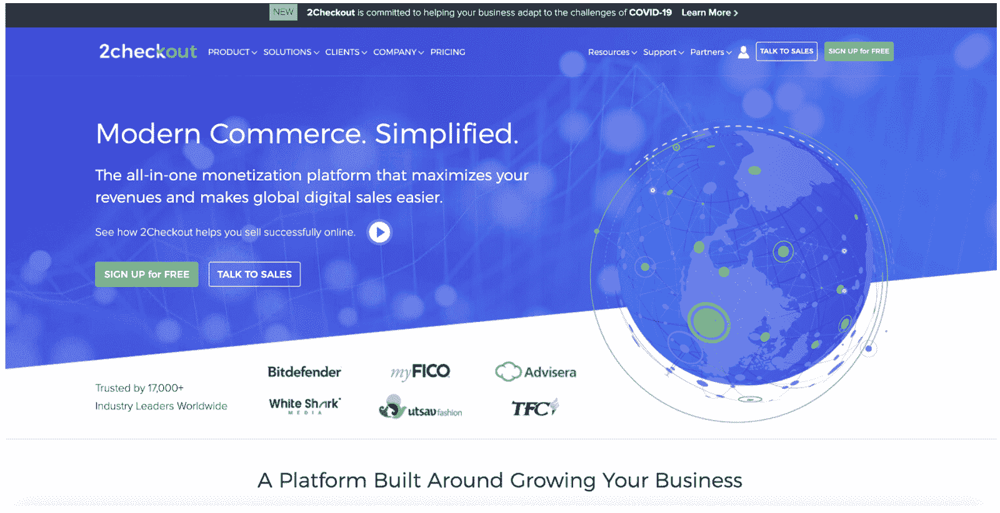

2Checkout

[2Checkout](https://www.2checkout.com/) 是一个“货币化平台”,可以更轻松地发送和接收来自全球客户、供应商和销售商的付款。

2Checkout 提供订阅计费、[购物车模板](https://kinsta.com/blog/abandoned-cart-email/#abandoned-cart-email-templates)、自定义结账字段，以及与主要[电子商务平台](https://kinsta.com/blog/ecommerce-platforms/)如 [Shopify 和替代平台](https://kinsta.com/blog/shopify-alternatives/)如 BigCommerce 的集成。

该处理器还提供财务和税务支持，包括管理美国销售税的能力。它甚至可以为你计算和支付税款。

凭借其国际处理能力，2Checkout 可提供指导，确保您遵守各个国家的金融法规和法律。

2 每笔交易的结账费用为 3.5% + $0.35。

### 8.Authorize.Net

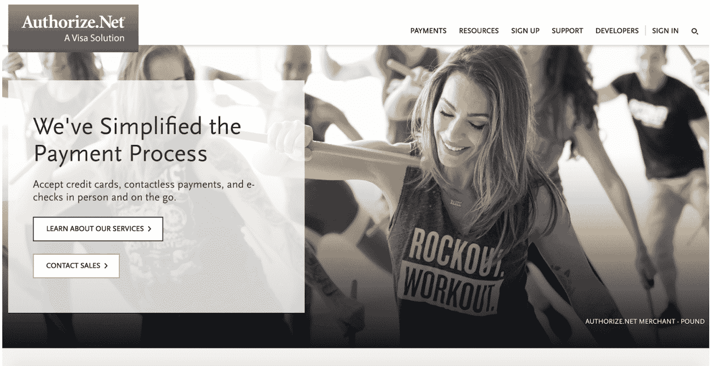

Authorize.Net

[Authorize.Net](https://www.authorize.net/)处理在线、移动和店内支付，确保每位顾客都能顺利购物。Visa 在 2010 年收购了 Authorize.Net。

Authorize.Net 关注消费者交易的便利性。它提供了一个简单、可定制的“立即购买”按钮，用于一次性付款。

Authorize.Net 接受多种支付方式，包括借记卡、信用卡和数字支付。

它提供了欺诈过滤器，允许企业设置某些规则(例如，限制交易数量、送货地址与账单地址不一致等。)这将标记一个订单以供审查。

此外，它还提供可定制的[发票模板](https://kinsta.com/blog/saas-products/#billing-and-accounting)，带有自动提醒功能，可在特定时间或特定事件后触发。

Authorize.Net 每月收费 25 美元+ 2.9% +每笔交易 0.30 美元。

### 9.转移方式

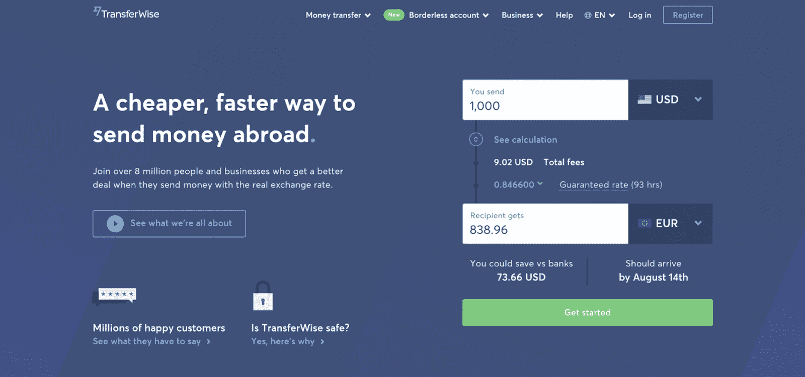

TransferWise

TransferWise 是一项支付服务，它以提供跨国货币的真实汇率而自豪。

TransferWise 的核心竞争优势是它能够计算真实的当前汇率。在大多数情况下，这比 PayPal 提供的服务便宜 19 倍。

TransferWise 还提供了一些功能，包括商户自动支付/发送发票以及收取免费款项的能力。

该处理器集成了 Xero 会计软件，便于记账，以及其他一些软件。

TransferWise for Business 收取 31 美元的设置费+1.40 美元的交易费+货币兑换费

## 注册订阅时事通讯

### 想知道我们是怎么让流量增长超过 1000%的吗？

加入 20，000 多名获得我们每周时事通讯和内部消息的人的行列吧！

[Subscribe Now](#newsletter)

### 10.支付线

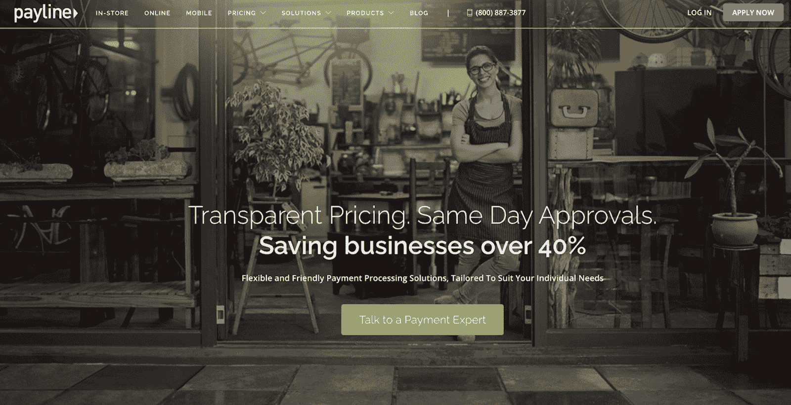

Payline

[Payline](https://paylinedata.com/) 为面对面、在线和移动支付提供灵活的支付解决方案。

Payline 最受欢迎的一些功能包括定制发票、[重复计费](https://kinsta.com/blog/recurring-revenue-model/)功能、ACH 支付和定制支付页面。

它集成了一些销售点(POS)系统、购物车、QuickBooks 和读卡器。Payline 不收取任何取消费用，其交易费用低于 PayPal。

Payline 对其虚拟终端收取 10 美元/月+ 2.25%的交易费。

### 11.平方

Square

[Square](https://squareup.com/us/en) 是一个支付处理器，使企业能够通过其安全网关接受多种形式的支付。

Square 使企业能够自动向客户收费，并可以轻松提取现有客户的存储信息以加速购买。

Square 有硬件选项可用于无缝的面对面交易。消费者通过网上交易、刷卡或点击方形阅读器，或者使用键入的支付设备来结账。

Square 对每笔卡交易收取 2.65%的费用，对每笔在线交易收取 2.9% + $0.30 的费用。请务必查看我们的[条纹对比方形对比](https://kinsta.com/blog/stripe-vs-square/)。

### 12.Intuit 的 QuickBooks 支付

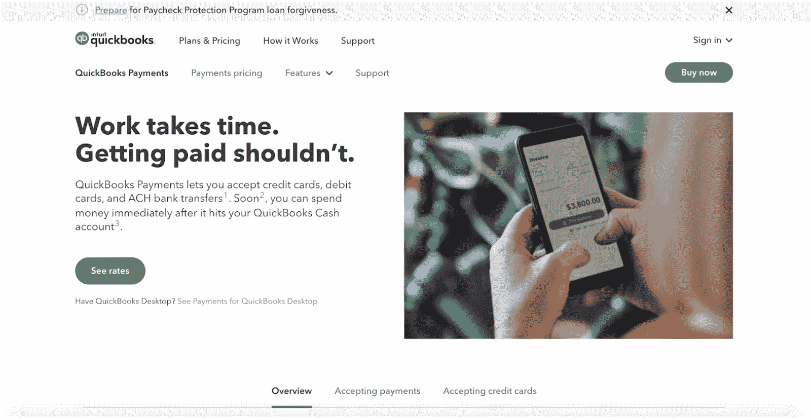

Quickbooks

[QuickBooks 支付](https://quickbooks.intuit.com/payments/)促进您和您的供应商或客户之间的交易，以确保您得到应得的报酬。如果你已经在用 [QuickBooks](https://kinsta.com/blog/saas-products/#36-quickbooks) 记账，并且主要是开发票，这是一个不错的选择。

QuickBooks Payments 接受信用卡、借记卡和 ACH 银行转账。

支付可以通过手机和读卡器在线处理。一旦钱打到你的银行账户，你几乎可以立即花掉它或者从自动取款机里取出来。

QuickBooks 支付收取每笔交易 2.4%+0.25 美元的费用。

### 13.德沃拉

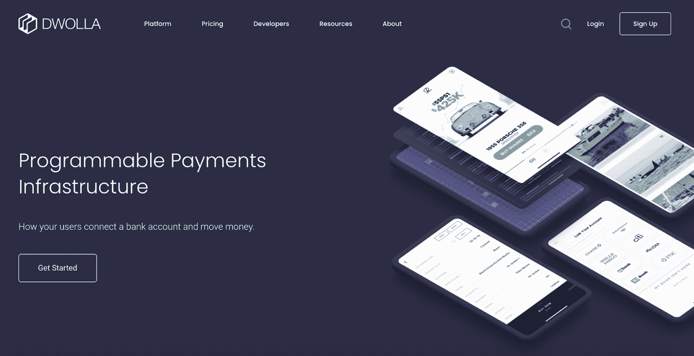

Dwolla

[Dwolla](https://www.dwolla.com/) 是一款完全可定制的支付处理器，可以轻松集成到您当前的店面和业务中。

Dwolla 认为自己是“银行不可知论者”，这意味着它能够与您使用的任何银行合作。

Dwolla 使用令牌化(一种加密)来消除数据问题，并为多个来源提供批量支付选项。

注册 Dwolla 的客户可以控制他们提供多少信息，这将他们分为不同的客户类型，以确保安全性。

Dwolla 每笔交易收取 0.5%的费用(最低。最多 5 个。5 美元)或 2，000 美元/月的固定月定价。

### 14.购物支付

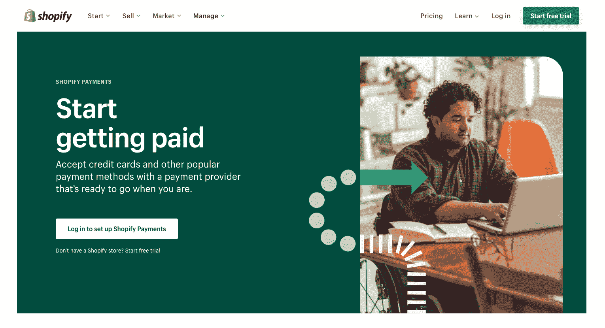

Shopify Payments

[Shopify Payments](https://www.shopify.com/payments) 是全球领先电子商务平台之一的支付处理网关。

Shopify 支付注重简单。该公司的定位说明了一切，“从设置到销售，一键完成。”

Shopify Payments 支持所有常用的支付方式和当地货币。该平台受到数十万企业的信任，并提供 3D 安全结账。

如果你已经使用 [Shopify 作为你的电子商务平台](https://kinsta.com/blog/ecommerce-platforms/#3-shopify)，你可以在一个屋檐下跟踪订单和处理支付。

Shopify 支付收取每月 29 美元+ 2.9% +每笔交易 0.30 美元的费用。

与宕机和 WordPress 问题做斗争？Kinsta 是一款考虑到性能和安全性的托管解决方案！[查看我们的计划](https://kinsta.com/plans/?in-article-cta)

### 15.阿德延

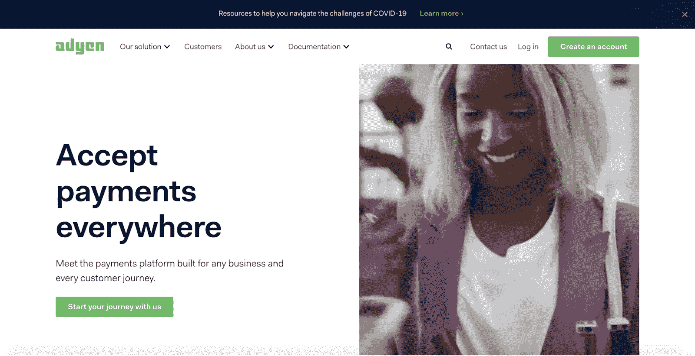

Adyen

Adyen 是一个支付平台，重视增长、收入和与商家的真正合作关系。Adyen 为世界各地的客户提供[语言](https://kinsta.com/blog/wordpress-multilingual/)和货币识别，让他们可以轻松地从您的商店购物。

此外，Adyen 提供独特的客户体验，能够在结账时识别常客。

通过购买数据，Adyen 创建了购物者档案，以揭示关于您的客户的丰富见解。

Adyen 每笔交易收费 3.95% + $0.12。

### 16\. BlueSnap

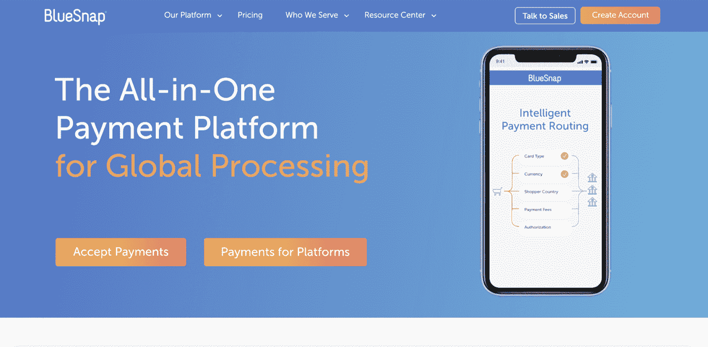

BlueSnap

[BlueSnap](https://home.bluesnap.com/) 为领先企业提供全球加工服务，如 Monday.com 的[，即蓝战士、OutBrain、Wheels Up 等。](https://kinsta.com/blog/wordpress-project-management-plugins/#1-wp-project-manager)

BlueSnap 使用“智能支付路由”来提高交易的成功率。这是通过与 30 多家接受本地交易的全球银行合作实现的。

BlueSnap 接受 100 多种购物者货币，并以 17 多种货币结算。此外，该公司被评为最高安全级别。

该处理器集成了 QuickBooks、Xero 和 Salesforce，因此您可以自动处理应收账款和其他业务交易。

BlueSnap 每笔交易收取 2.9% + $0.30 的费用。

### 17.无卡

GoCardless

想象一下没有有形信用卡的生活，它的支付处理器是为经常性和一次性支付而设计的。GoCardless 非常适合直接从你的账户中扣款的[循环交易](https://kinsta.com/blog/wordpress-membership-plugins/)。

该处理器支持订阅和发票支付，是其与 Zuora 和 Xero 集成的最佳选择。

通过 GoCardless 自己的集成，您可以在 30 多个国家收款。

他们也很可靠。他们的[成功+支付重试功能](https://gocardless.com/blog/success-plus/)计算出交易最有可能成功的日期和时间。这平均降低了 15%的支付失败率。

gocradless 每笔交易收取 1-2%+0.25 美元的费用。

### 18.Thryv

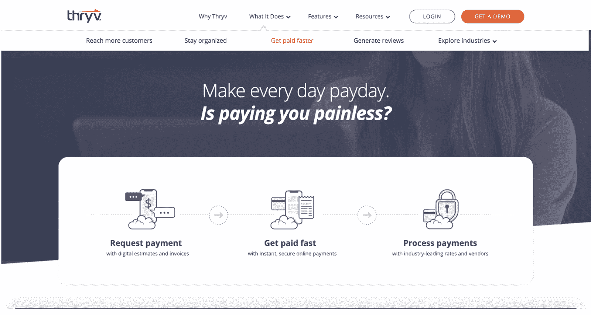

Thryv

[Thryv](https://www.thryv.com/get-paid-faster/) 通过无缝的交易体验和快速的支付处理，帮助小型企业更快获得支付。超过 350，000 家小企业使用它。

使用 Thryv，您可以发送交互式评估、发票和提醒。你甚至可以在智能手机上扫描信用卡。

Thryv 提供安全的支付处理。一个缺点是它没有很多集成。相反，Thryv 依靠 Zapier 来连接其他软件。它有一些其他产品可以与其支付处理器一起工作，包括营销和客户审查平台。

Thryv 每笔交易收费 2.6% + $0.30。

### 19.简单支付

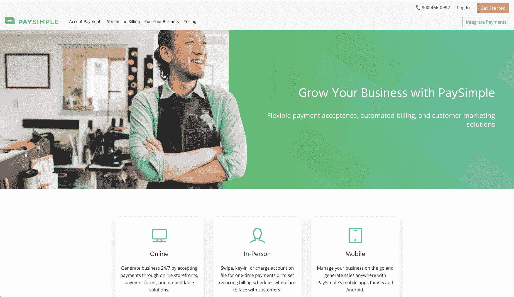

PaySimple

PaySimple 不像其他一些支付处理商那样有那么多花哨的功能，但它仍然能以相对较低的交易费用完成工作。

使用 PaySimple，您可以通过[在线支付表格](https://kinsta.com/blog/wordpress-forms/)收集注册信息，设置重复计费，并发送发票。

PaySimple 有现金流管理报告来跟踪收到的付款。对于那些你还没有收到的，你可以设置自动通知，自动触发，这样你就不用去追发票了。

PaySimple 收取每笔交易 2.49%的费用+月费。

### 20.奥帕约(旧称萨基佩)

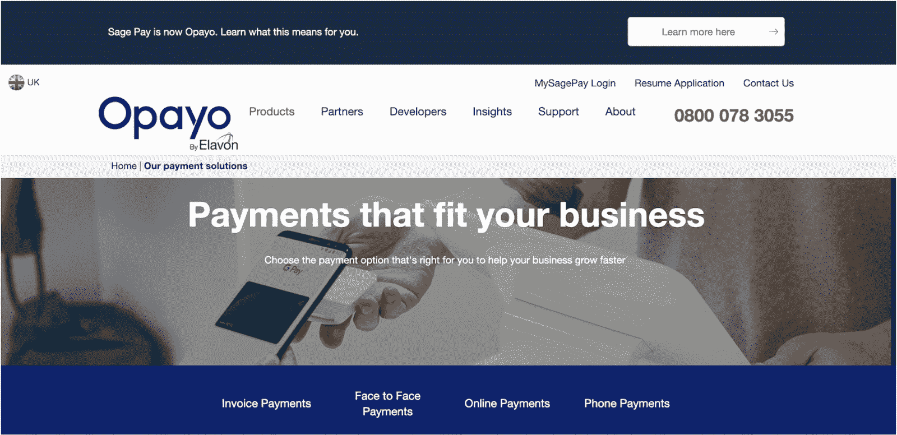

Opayo

Opayo 原名 Sage Pay，是一家在线支付处理公司，由其母公司 Elavon 运营。Opayo 为企业提供发票、面对面、在线和电话支付。

该处理器与 Elavon Financial Services DAC 会计软件相集成，并配备了欺诈甄别工具来[确保交易安全](https://kinsta.com/knowledgebase/woocommerce-ssl/)。

Opayo 让您的客户只需点击一次结账即可轻松购买发票和在线支付。

Opayo 每月收费 35 美元/月。

### 21.行贿者

Payoneer

[Payoneer](https://www.payoneer.com/) 关注发送和接收全球支付的便利性。他们的口号是“全球增长的通行证”

Payoneer 允许您通过即时网络内支付免费向供应商付款。一次点击和两个小时后，你的钱就会被转移。

Payoneer 接受多种货币以提供国际支付选项。此外，它还有一个亚马逊商店管理器功能，可以汇编你在多个店面的所有亚马逊交易数据，让你很容易看到[你有多少收入](https://kinsta.com/blog/bootstrapping-startup/)。

付款人对信用卡收取 3%的费用，或对美元 ACH 银行借记收取 1%的费用。

### 22.拴住

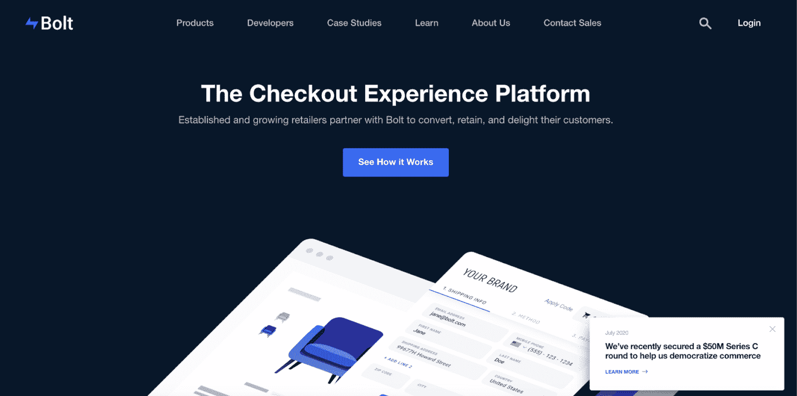

Bolt

借助与领先平台和信用卡的无数集成，Bolt 可与您的业务无缝协作。它通过微授权和人工审查欺诈保护来增强您的安全性。

此外，您还可以获得对[欺诈退款](https://kinsta.com/blog/ecommerce-fraud-prevention/#2-identity-theft)的 100%保障，使贵公司的交易更加安全。

Bolt 领先于潮流，接受各种支付方式——从数字钱包到分期付款。

Bolt 收取的月费起价为 16 美元/月。

## 选择合适的 PayPal 替代品

正如你所看到的，有大量的贝宝替代品可供选择。虽然每个平台都有优点和缺点，但有几个是突出的。

### 国际支付的最佳 PayPal 选择

如果你希望进行国际交易，不妨再考虑一下 Stripe、2Checkout 和 BlueSnap。

### 安全性的最佳 PayPal 替代方案

大多数平台都通过了基本的安全测试。根据我们的研究，FastSpring、Shopify Payments 和 Bolt 因其安全措施而脱颖而出。

### 低费用的最佳 PayPal 替代方案

Payline 宣称其收费结构为 2.25%，低于 2.9%的平均水平。根据你的订单量，这可能会在假期发生巨大变化[，你也可以看看像 FastSpring 这样提供固定价格的支付平台。](https://kinsta.com/blog/ecommerce-strategies/)

[Want better protection and lower fees from your payment processor? 💳 This list of #PayPal alternatives has you covered 💰Click to Tweet](https://twitter.com/intent/tweet?url=https%3A%2F%2Fkinsta.com%2Fblog%2Fpaypal-alternative%2F&via=kinsta&text=Want+better+protection+and+lower+fees+from+your+payment+processor%3F+%F0%9F%92%B3++This+list+of+%23PayPal+alternatives+has+you+covered+%F0%9F%92%B0&hashtags=PayPal%2CPayOnline)

## 摘要

贝宝是最著名的支付网关吗？我们会说是的。是最好的吗？可能不会，因为商业世界中有如此多的用例及需求，一个单一的工具很难解决所有的问题。幸运的是，有可靠的 PayPal 替代品可供选择。

如果你对它不满意，现在是时候开始考虑从 PayPal 转换到一个不同的支付应用程序，它可能会更好地为你的在线业务工作。这样做，你可能会有更好的费用，更多的功能，更安全的交易与您的客户。

一旦你完成了转变，一定要回到这里，在评论区分享你的经历！

* * *

让你所有的[应用程序](https://kinsta.com/application-hosting/)、[数据库](https://kinsta.com/database-hosting/)和 [WordPress 网站](https://kinsta.com/wordpress-hosting/)在线并在一个屋檐下。我们功能丰富的高性能云平台包括:

*   在 MyKinsta 仪表盘中轻松设置和管理
*   24/7 专家支持
*   最好的谷歌云平台硬件和网络，由 Kubernetes 提供最大的可扩展性
*   面向速度和安全性的企业级 Cloudflare 集成
*   全球受众覆盖全球多达 35 个数据中心和 275 多个 pop

在第一个月使用托管的[应用程序或托管](https://kinsta.com/application-hosting/)的[数据库，您可以享受 20 美元的优惠，亲自测试一下。探索我们的](https://kinsta.com/database-hosting/)[计划](https://kinsta.com/plans/)或[与销售人员交谈](https://kinsta.com/contact-us/)以找到最适合您的方式。