# 2022 年将使用的 27 大性能测试工具

> 原文：<https://kinsta.com/blog/performance-testing-tools/>

性能测试工具对于优化包括网站在内的软件至关重要。为什么？因为性能直接影响用户体验、[转化率](https://kinsta.com/blog/wordpress-ab-testing-tools/)，并最终影响你的底线。这是市场所熟知的。

2019 年，软件测试的全球市场规模(性能测试工具是其中的一部分)超过了 400 亿美元(T1)，并且还在快速增长。因此，您可以找到大量的性能测试工具来满足不同的需求、用例以及预算。

在本文中，我们将看看一些最好的性能测试工具，它们的特性和优点，并帮助您选择最适合您需求的工具。

我们开始吧！

## 什么是软件性能测试？

性能测试是一种软件测试，它可以帮助你确定软件在给定工作负载下的速度、响应时间、可伸缩性、资源使用和稳定性等方面的[性能](https://kinsta.com/blog/php-benchmarks/)。

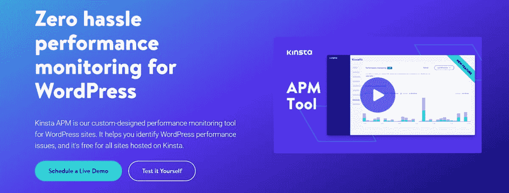

Kinsta APM is a built-in performance testing tool for Kinsta clients

性能测试的目标是识别应用程序中所有的性能瓶颈。
[网站表现直接影响 UX、转化率，并最终影响你的底线📈用这些测试工具⬇️ 点击推文](https://twitter.com/intent/tweet?url=https%3A%2F%2Fkinsta.com%2Fblog%2Fperformance-testing-tools%2F&via=kinsta&text=Site+performance+directly+affects+UX%2C+conversions%2C+and+ultimately%2C+your+bottom+line+%F0%9F%93%88+Keep+it+in+check+with+these+testing+tools+%E2%AC%87%EF%B8%8F&hashtags=UX%2CWordPress)

> 需要在这里大声喊出来。Kinsta 太神奇了，我用它做我的个人网站。支持是迅速和杰出的，他们的服务器是 WordPress 最快的。
> 
> <footer class="wp-block-kinsta-client-quote__footer">
> 
> 
> 
> <cite class="wp-block-kinsta-client-quote__cite">Phillip Stemann</cite></footer>

[View plans](https://kinsta.com/plans/)

## 6 种常见的性能测试

有六种主要类型的性能测试:

### 1.负载测试

负载测试决定了在给定时间内，随着工作负载的增加，软件的性能如何。这种工作负载可以是并发用户、事务数量、软件行为等。

它旨在观察[响应时间](https://kinsta.com/blog/ttfb/)、吞吐率、资源利用率等等。通过识别这些属性中的任何性能瓶颈，您可以在启动应用程序之前对其进行故障排除，以确保更好的最终用户体验。

由于负载测试，开发人员可以了解一个软件应用程序在给定时间可以处理多少并发用户。

### 2.耐久性测试

也称为浸泡测试，耐久性测试评估软件在一段较长的时间内，在固定的常规工作负载下的性能。换句话说，它决定了软件可以承受多长时间的恒定工作负载，以提供长期的可持续性。

在这个测试过程中，测试团队监控 KPI，比如内存泄漏、内存使用、[内存短缺](https://kinsta.com/knowledgebase/php-memory-limit/)等等。耐久性测试还分析长时间使用后的响应时间和吞吐量，以显示这些指标是否一致。

### 3.压力测试

压力测试测量超出正常工作参数的软件性能。这意味着软件被置于[更高的流量负载](https://kinsta.com/blog/how-to-drive-traffic-to-your-website/)(更多用户、交易等)下。)来帮助开发人员了解软件在超出其容量限制时的预期表现。

该测试的目标是确定软件的稳定性。它帮助您了解软件的故障点以及如何从故障中恢复。它会占用 CPU、内存、磁盘空间等硬件资源。，根据资源利用率测量应用程序的断点。

例子:公司在一些重大事件前进行压力测试，如黑色星期五，以检查他们的电子商务应用程序的性能。

### 4.尖峰测试

尖峰测试是一种压力测试，它测量软件在显著和突然的“尖峰”或[增加的工作负载下的性能，如模拟用户](https://kinsta.com/woocommerce-hosting/)。它告诉你软件是否能反复快速地处理突然增加的工作量。

### 5.容量测试

在开发阶段，只有少量数据用于测试代码。容量测试(也称为“洪水测试”)测试软件在处理大量数据时的效率。它检查数据丢失、系统响应时间、[数据存储](https://kinsta.com/blog/disk-space-wordpress-hosting/)可靠性等等。

### 6.可扩展性测试

可伸缩性测试测量软件在处理不断增加的工作量时的效率。当你增加或减少软件的性能属性时，测试会告诉你它的行为。

您可以通过逐渐增加数据量或用户来执行[可扩展性](https://kinsta.com/clients/gadget-flow/)测试，同时监控软件的性能。
T3】

## 性能测试的好处

根据 2019 年 3 月发布的[报告](https://www.ccn.com/facebooks-blackout-90-million-lost-revenue/),[脸书](https://kinsta.com/blog/facebook-statistics/)遭遇灾难性停电，损失约 9000 万美元收入。同样，App Store 的宕机导致了 2500 万美元的损失，另一份来自 2015 年 3 月的[报告](https://www.macobserver.com/tmo/article/app-store-downtime-cost-apple-25m-in-sales)称。

尽管有强大的 IT 基础设施和安全保障，这些科技巨头还是遭受了巨大的损失。它证明了性能测试对于您的应用程序是多么重要。它确保所有特性、功能和系统以最佳方式运行，以提供更好的用户体验。

现在，让我们讨论一下性能测试的一些好处。

### 1.衡量软件的速度、稳定性和准确性

速度、稳定性和准确性是软件性能的一些重要属性。因此，测试你的应用程序的这些方面可以让你[监控](https://kinsta.com/blog/query-monitor/)软件在压力下的表现，并为你提供关于它如何处理可伸缩性的关键细节。

查看测试结果，开发人员可以了解他们必须将哪些更改合并到软件中，以克服缺点并使其更加高效。

### 2.验证软件的基本功能

你的应用程序的成功取决于它的基础有多强。衡量软件基本特性和功能的性能有助于您做出明智的决策，并在软件设置上规划您的业务战略。

您可以在您的研究和开发部门中使用您的性能测试结果，并相应地集中您的资源来增强您的软件性能和产品供应。

### 3.发现问题并解决它们

性能测试将告诉你在启动你的网站或应用程序之前可以纠正的关键问题。这意味着你可以快速解决所有发现的问题，并专注于[改进其技术](https://kinsta.com/blog/types-of-cloud-computing/),而不是在发布后解决问题。

### 4.增强软件的加载和优化能力

通过性能测试，您可以更好地处理容量和负载能力，并以帮助软件承受大量并发用户的方式优化您的软件。它还将检测您可以尽快解决的可伸缩性问题，并允许测试人员定制容量来处理[高需求](https://kinsta.com/knowledgebase/high-availability-hosting/)。

### 5.提高代码质量和软件功能

当您可以检测到软件中的问题时，您可以快速消除它们。因此，您的开发人员可以维护[质量代码](https://kinsta.com/blog/code-review-tools/)并改进应用程序的功能，提供预期的速度、可靠性、可伸缩性和稳定性。

### 6.满足用户期望

你的客户不会喜欢缓慢、落后的软件，这些软件会浪费他们的时间，让他们烦恼。他们希望它能在 2 到 3 秒内快速加载，并流畅运行，不会出现任何混乱。你的软件的第一印象对于决定用户是想继续使用它还是点击卸载按钮是至关重要的。

性能测试有助于您满足期望的软件属性，并让您的用户高兴地继续使用您的软件，从而增加您的收入。

额外提示:性能测试最好在代码发布后进行。这将有助于开发人员获得实时反馈，以便尽早解决问题。

## 性能测试流程

每个软件的性能测试的目标都是一样的，尽管方法会有一些不同。因此，下面是一个典型的性能测试流程:

*   **选择测试环境**:首先，选择您的测试环境、性能测试工具和生产环境。选择合适的软件、硬件、[网络](https://kinsta.com/blog/google-cloud-network/)配置等。，用于您的测试。
*   **确定性能指标**:接下来，确定软件性能指标，如响应时间、吞吐量、事务、加载时间和资源分配，如 CPU、内存和磁盘空间。
*   **计划测试**:识别覆盖用户可变性、目标度量和测试数据的测试场景。它将帮助您计划和设计一些性能测试的模型。
*   **配置选择的测试环境**:除了不同测试用例所需的性能测试工具之外，还要组织测试环境的元素。例如，为了测试你的网站的性能，像 [Kinsta APM](https://kinsta.com/blog/membership-website-speed/) 这样的性能测试工具会有所帮助。
*   **实现测试设计**:根据你的测试设计创建你的性能测试，这将帮助你的团队在整个测试过程中保持在正确的轨道上，而不是混乱。
*   **执行性能测试:**现在，您可以开始测试了。当它运行时，监控试验并收集结果数据，以便您的开发人员可以使用它来提高软件性能。
*   **分析、报告和重新测试**:拿到测试结果后，分析数据并计划需要克服的突出问题。最后，排除问题并再次执行性能测试来跟踪改进。继续重新测试，直到排除所有检测到的问题。

现在，让我们看看市场上一些最好的性能测试工具。

## 27 大性能测试工具

我们收集了市场上可用的最佳性能测试工具，以帮助您决定哪些工具可以满足您独特的测试需求。

### 1.金斯塔 APM

[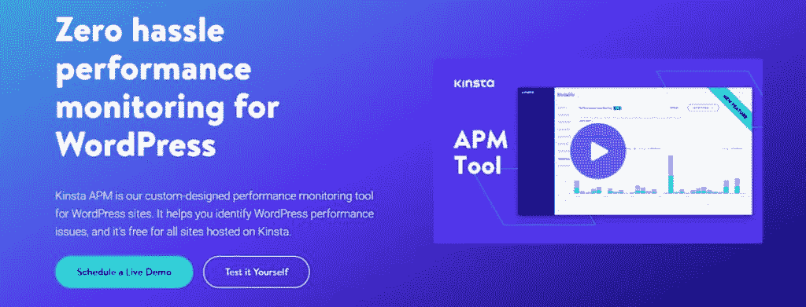](https://kinsta.com/wp-content/uploads/2021/06/kinstaapm.jpg)

Kinsta APM

你的 WordPress 网站需要一个简单的性能监控解决方案吗？试试 [Kinsta APM](https://kinsta.com/apm-tool/) 。它旨在让您发现并解决您的 Kinsta 托管的网站上的性能问题。凭借简单易用的用户界面，Kinsta APM 适合所有人，无论他们是初学者还是专家。另外，它在 MyKinsta 下有 10 种语言版本。

Kinsta APM 提供了关于慢速 PHP 事务、外部请求、 [MySQL](https://kinsta.com/blog/mariadb-vs-mysql/) 查询等的见解。您可以调试数据库查询、非优化主题或插件、较长的 API 调用和外部 URL 请求，以及识别最慢、中等和平均事务。

这对每个人都有帮助，从代理和电子商务网站所有者到开发者，帮助他们快速发现和解决性能问题，同时减少他们在昂贵的 APM 工具上的支出。

#### 特点和优势:

*   **客户支持团队**:凭借十多年的经验，Kinsta 经验丰富的客户支持团队将全天候为您解决所有网站问题，解决率达 100%。你可以直接通过 MyKinsta 和他们聊天，得到即时回复。
*   **定价**:该工具对 Kinsta 托管的所有网站都是免费的，不管你选择了什么方案。您也可以[预订一个现场演示](https://kinsta.com/schedule-demo/)来亲自测试性能。

### 2.WebLOAD

[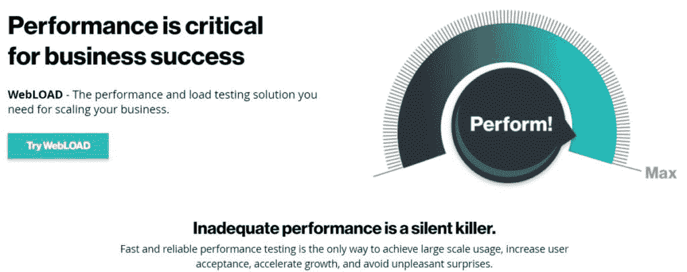](https://kinsta.com/wp-content/uploads/2021/06/webload.jpg)

WebLOAD

RadView 于 1997 年发布的 [WebLOAD](https://www.radview.com/) 是一款针对您的软件的性能和负载测试工具，可帮助您扩展业务。它提供了性能、完整性和可伸缩性测试等功能。

这款企业级工具能够同时模拟数千个用户，因此您可以测试繁重的流量负载，并报告应用程序中的弱点、限制和性能瓶颈。

使用 WebLOAD 进行网站负载测试、持续测试、云负载测试等等。该工具可以从云或本地机器生成负载，并提供一个集成开发环境(IDE)来可视化地记录、编辑和调试测试脚本。

它的基于代理的记录器还记录你的 HTTP 活动，并以 [JavaScript](https://kinsta.com/blog/javascript-libraries/) 生成测试。您还可以使用 IDE 中的多种工具来编辑或增强它。WebLOAD 提供性能数据的分析报告，帮助用户识别瓶颈。

#### 特点和优势

*   **关联**:像会话 id 一样自动关联动态值，并使脚本能够与不同的虚拟客户机一起执行。
*   **协议支持**:支持 HTTPS、HTTP 和 XML。
*   **集成**:与 Selenium、Jenkins 等工具集成。
*   客户支持团队:你可以通过电话、传真或联系方式联系他们。
*   **定价**:最多 50 个用户可以选择免费试用。联系他们的团队获取报价。

### 3.阿帕奇 JMeter

Apache JMeter

接下来是一个著名的负载测试工具: [Apache JMeter](https://jmeter.apache.org/) 。Apache JMeter 帮助您测量和分析软件性能。这是一个基于 Java 的开源工具，人们主要用来测试 web 应用程序的性能，但它也可以在其他服务上使用。

它可以测试动态和静态资源以及动态 web 应用程序的性能。此外，您可以使用它来模拟服务器、网络/对象或一组[不同服务器](https://kinsta.com/blog/nginx-vs-apache/)上的重负载，以测试其强度并分析不同负载类型下的总体性能。

该工具易于使用，不需要非常复杂的基础设施来进行测试，并且与许多负载注入器兼容，可以用一个控制器进行管理。此外，与其他负载测试工具相比，它有一个用户友好的 GUI，需要较少的脚本。其简单的图形和图表足以分析与负载相关的主要数据和资源利用率统计。

它的全功能 IDE 允许更快的测试创建、记录和调试。JMeter 支持 CLI 从兼容 Java 的操作系统加载性能测试，包括 Linux、Mac OSX、Windows 等。

#### 特点和优势

*   **协议支持** : HTTPS、HTTP、SAOP、XML、FTP 等。
*   **支持的技术** : [PHP](https://kinsta.com/blog/php-vs-javascript/) ，NodeJS，ASP.NET，[数据库](https://kinsta.com/blog/install-phpmyadmin/)，MOM，LDAP，Java objects，TCP 等。
*   **关联**:提供轻松的关联，让您从顶级响应格式如 HTML、XML、JSON 等中提取数据。
*   **可扩展性**:它是高度可扩展的，可以与可插入的采样器、可脚本化的样本如 Groovy、可插入的定时器、[数据可视化](https://kinsta.com/blog/data-visualization-tools/)和分析插件等一起工作。
*   **集成**:与 Jenkins、Gradle、Maven 等开源库集成。
*   客户支持:他们有一个庞大的开发者和贡献者社区，你可以和他们互动。他们还维护了教程，所以你可以更好地理解这个工具。
*   **定价** : JMeter 是免费开源的。

### 4.LoadNinja

[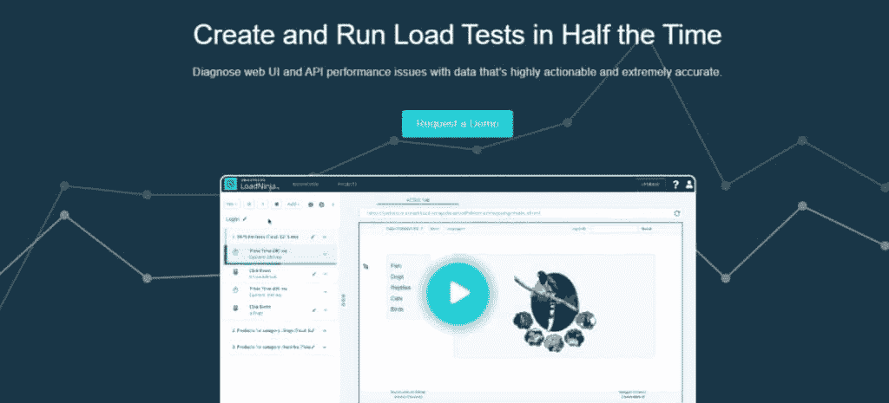](https://kinsta.com/wp-content/uploads/2021/06/loadninja.jpg)

LoadNinja

使用 SmartBear 的 [LoadNinja](https://loadninja.com/) 创建您的负载测试并快速运行它们。它通过高度准确且可操作的数据帮助您诊断应用性能问题。它提供了易于阅读的结果，并且不需要大量的编程。

这个工具帮助产品团队、测试人员和工程师专注于构建他们的可伸缩软件，同时花费更少的时间创建测试脚本。

LoadNinja 允许您记录客户端交互，快速识别性能问题，并通过消除脚本清理、[翻译](https://kinsta.com/blog/wordpress-multilingual/)和动态关联工作，在不牺牲测试质量的情况下进行实时调试。凭借其 TrueLoad 技术，它还可以让您在多种浏览器上测试实际的最终用户体验，从而节省 60%以上的精力。它在记录负载测试方面非常高效和精确，并且无需编码就可以立即重放它们。

分析软件性能数据，如 strep 时间、异步调用、处理的资源、web 界面上的导航计时，并使用机器学习助手诊断问题。

执行连续的软件性能测试，提高质量和测试覆盖率，并自动化测试。它不需要设置或维护，因为该服务是基于云的。

**注意:** SmartBear 提供了一个类似的产品，以前叫做 [LoadComplete](https://support.smartbear.com/loadcomplete/docs/general-info/introducing-loadcomplete.html) 。虽然它仍然可以使用，但自 2019 年以来就没有更新过。我们建议您避免使用它。

#### 特点和优势

*   **集成**:使用他们定制的 CI/CD 插件或者 [REST API](https://kinsta.com/blog/wordpress-rest-api/) 进行自动化测试。
*   **客户支持**:你可以联系 LoadNinja 用户社区寻找答案，或者浏览他们全面的文档和常见问题。
*   **定价**:该工具的入门价格为 1439 美元/年，100 个虚拟用户，100 个负载小时。

### 5.洛德罗

Loadero

Loadero 是一个基于云的性能和负载测试工具，允许您创建更快的性能测试并有效地发现系统问题。

可以使用 Selenium，用 [Java](https://kinsta.com/blog/best-programming-language-to-learn/) ，JavaScript，或者 Python 编写测试脚本进行大规模的负载测试或者性能测试，记录 web 会话进行调试。通过添加测试用户、摸索、浏览器、位置、假冒数据馈送、网络条件等来配置测试。

Loadero 允许您设置多个网络设置，并在不同的网络条件下测试您的软件。Loadero 的云基础设施提供了更好的可扩展性，让您不必担心维护问题。

这个性能测试工具还可以通过全面的性能测试报告、机器统计数据、加载时间、[截图](https://kinsta.com/blog/how-to-screenshot-on-windows/)和记录来帮助您检测系统限制。此外，Loadero 具有内置的验证功能，可以在测试运行完成后自动执行断言。

#### 特点和优势

*   浏览器支持:Loadero 支持五个最新的 Google Chrome 版本以及 Mozilla Firefox。
*   **可重用的测试代码**:它允许您利用现有的测试设置来运行负载测试。
*   **假媒体**:您可以加入人工媒体，模拟麦克风和网络摄像头输入。
*   **全球覆盖**:在全球 12 个地点中的任何一个进行测试。
*   **定价**:现收现付模式下每月 250 美元。

### 6.SmartMeter.io

SmartMeter.io

如果你正在寻找一个企业级的性能测试工具，那么 [SmartMeter](https://www.smartmeter.io/) 是一个不错的选择。它具有同类最佳的功能和特性，而且价格合理。该工具帮助您使用嵌入式浏览器轻松创建测试用例。

通过分析验收参数，如最大响应时间、错误和吞吐量，您可以很容易地将测试添加到持续集成过程中，以自动确定测试是否成功。

SmartMeter 为您提供高级、深入的报告、带有图表比较的实时测试结果、趋势分析等。，对[软件性能](https://kinsta.com/blog/application-performance-monitoring/)进行微调。

#### 特点和优势

*   **与 JMeter 的兼容性** : SmartMeter 与 JMeter 兼容，为您提供该工具中您喜欢的所有特性，并完善您的测试。
*   **分布式负载测试**:使用负载生成器在不同的全球位置创建无数的虚拟用户。
*   **定价**:39 美元/月起。

### 7.暴风城

[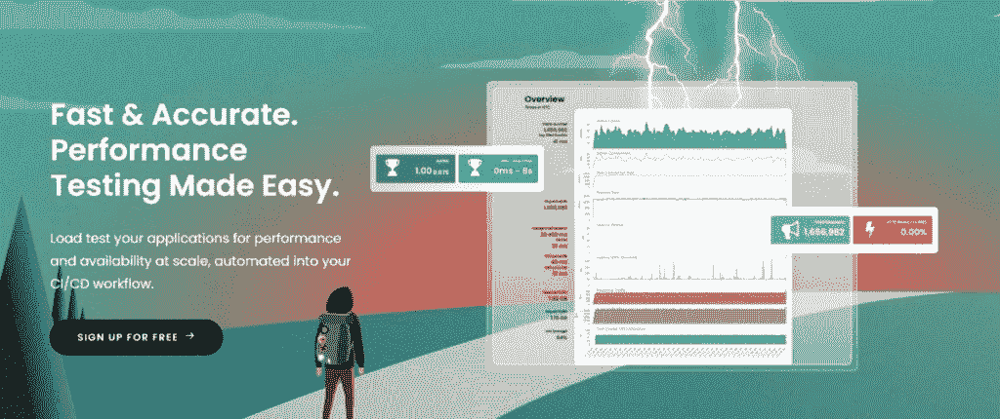](https://kinsta.com/wp-content/uploads/2021/06/stormforge.jpg)

StormForge

[StormForge](https://www.stormforge.io/performance-testing/) 允许您以可承受的成本对您的应用执行负载测试，以自动将性能和可扩展性纳入 CI/CD 工作流。它可以帮助您增加应用程序正常运行时间、吞吐量、减少延迟和应用程序错误，并扩展到更多用户。

该工具以更少的资源提供所有这些功能，不涉及手动流程，提供环境可持续性，并帮助您减少每月的云账单。您可以捕获实际的生产流量，并确保测试提供真实的流量模式。

它在开放的工作负载模型中工作，准确地模拟真实世界的场景，并提供更好的错误检测问题。

StormForge 还通过确保应用在负载下的性能并满足 SLA 要求，让您最大限度地减少问题并改善最终用户体验。它提供广泛的分析和报告来帮助轻松地解释、[基准测试](https://kinsta.com/blog/php-benchmarks/)和比较结果。

#### 特点和优势

*   **可重复**:使用性能测试作为 CI/CD 管道上的代码。
*   云原生的:在 Kubernetes 上运行良好。
*   **支持的编程语言**:包括 Java、 [Nginx](https://kinsta.com/blog/reverse-proxy/) 、Go、Python。
*   **集成**:它与您的生态系统完美集成，如云提供商(AWS、DigitalOcean、GCP、IBM、Azure)、监控工具(Prometheus、Dynatrace、Datadog、New Relic 和 Circonus)、 [DevOps 工具](https://kinsta.com/blog/devops-tools/) (Jenkins、Puppet、Chef 和 Rancher Labs)。
*   **定价**:每个月有三次免费测试，而每个应用的付费计划起价为每月 150 美元。

### 8\. LoadView

[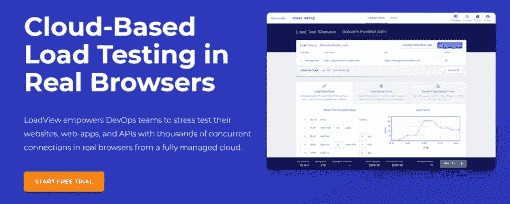](https://kinsta.com/wp-content/uploads/2021/06/loadview.jpg)

LoadView

支持您的 IT 团队使用企业级平台 [LoadView](https://www.loadview-testing.com/) 在实际浏览器中对您的网站、API 和具有数千个连接的 web 应用同时进行压力测试。

LoadView 利用 [AWS 和 Azure](https://kinsta.com/blog/aws-vs-azure/) 来管理其云网络，因此您可以设计多个测试，甚至是在复杂的应用上。您可以使用各种场景定义用户、持续时间和行为，并使用来自美国、南美、加拿大、APAC 和欧洲的 30 个全球位置的负载注入器虚拟地模拟用户。

该工具提供了三种负载曲线，负载阶跃曲线、动态可调曲线和基于目标的曲线，用于检查流量峰值、可扩展性和基础设施限制。

#### 特点和优势

*   **高级防火墙**:在[防火墙](https://kinsta.com/blog/what-is-a-firewall/)后运行测试，因为 LoadView 提供了您可以允许和配置的专用 IP。
*   **视频录制**:用视频录制捕捉网站或 app 渲染，以便更好地分析和查看。
*   **其他特性**:参考服务器、详细的瀑布图、动态变量和负载注入器控件。
*   **定价**:1000 个并发用户每月 199 美元起。

### 9.新负载

NeoLoad

NeoLoad 是一个持续的性能测试工具，用于自动化您的应用程序和 API 负载测试。它提供了测试的直观设计和维护，并提供了真实的用户行为模拟。

它通过条件、循环和拖放控制简化了测试创建，并具有健壮的无代码设计。对于高级情况，可以使用 JavaScript。它使用一种基于 YAML 的格式，这种格式是人类可读的，并且是特定于领域的。

NeoLoad 还在测试完成后为您提供详细的报告，允许您执行[基础架构监控](https://kinsta.com/feature-updates/kinsta-apm-tool/)，您还可以集成 APM 以获得更好的分析，并通过自动 SLA 验证构建。

#### 特点和优势

*   **支持的技术**:支持 [HTML](https://kinsta.com/blog/html-vs-html5/) 、Angular、 [HTTP/2](https://kinsta.com/learn/what-is-http2/) 、WebSocket 等 web 框架和协议。；像 Salesforce、SAP、Oracle、IBM 等打包应用。
*   **高级关联**:将动态参数与自动处理相关联，并检测特定于应用程序的参数以及预定义的规则，如。Net、西贝、JSF 等。
*   **集成**:集成 DevOps 工具，如 Jenkins、Bamboo、TeamCity、Git 等。；SOAP/REST 支持，Selenium，Tricentis Tosca，Dynatrace，Azure，Jenkins，Git 等。
*   **定价**:联系他们定制方案。

### 10\. LoadUI Pro

LoadUI Pro

您可以使用 [LoadUI Pro](https://smartbear.com/blog/new-names-one-brand-readyapi/) 对您的 SOAP 和 REST APIs、微服务和数据库进行负载测试，这是 SmartBear 的 ReadyAPI 产品的一部分。有了它，您可以检查 API 的可伸缩性和速度，并预览它们的性能。它于 2011 年发布，用 Java、Groovy 和 JavaFX 编写。

它的标准版是开源的，但是 Pro 版是 SmartBear 带给你的。忘记维护或投资太多，因为 LoadUI Pro 是一个完全基于云的性能测试工具。

除了这些功能，LoadUI Pro 还提供并行负载测试、端点负载测试、独立负载测试、服务器监控等等。此外，您可以使用第三方[插件](https://kinsta.com/blog/divi-vs-elementor/)在运行时添加更多功能。

#### 特点和优势

*   **兼容性**:与 Mac OS、Windows 和 Linux 兼容。
*   测试重用:您可以重用已经存在于您的管道中的功能测试来节省时间。
*   **集成**:与功能测试工具 SoapUI 集成。
*   **定价**:4999 美元/年起。

### 11.丝绸表演者

Silk Performer

使用 [Silk Performer](https://www.microfocus.com/en-us/products/silk-performer/overview) 对您的移动、网络和企业应用进行强大而真实的压力和负载测试。它可以查明问题的原因和位置，并确保服务器和应用程序在流量高峰期正常运行。

通过设计脚本提供更好的用户体验，帮助发现问题，并使用端到端诊断来检测、监控、解决和隔离问题。它具有可定制的报告，因此您可以生成图表和报告，并根据您的喜好进行定制。

借助云可伸缩性，您可以毫不费力地模拟任何规模的峰值负载，通过重用现有的性能测试并在不同的场景中运行它们来加快测试速度，而无需更改脚本。

Silk Performer 有三个组件，即 Performance Explorer、True Log Explorer 和 Workbench。它提供内置的虚拟专用网络，允许你在高负载下测试和解决基于互联网的应用。

Silk Performer 的其他基本功能包括用户友好的参数化和关联、代理健康控制、资源管理、集成服务器监控、版本控制等等。

Micro Focus 还提供了另一个基于项目的负载和性能测试工具，名为 [LoadRunner](https://www.microfocus.com/en-us/products/loadrunner-professional/overview) 。它测试应用程序并测量系统在负载下的性能和行为。模拟成千上万的并发用户，您可以记录和分析应用程序性能。

#### 特点和优势

*   **支持的协议** : HTTPS，HTTP，HTML， [SMTP](https://kinsta.com/blog/free-smtp-server/) ，POP，TCP，IP，FTP，。NET、SOAP、XML、LDAP 等等。
*   **全球位置**:在 50 多个国际位置执行测试。
*   **支持的技术**:谷歌云平台、 [Azure](https://kinsta.com/blog/aws-vs-azure/) 和 AWS。
*   **定价**:联系他们报价。也可以免费试用。

### 12.应用程序加载器

AppLoader

Automai 的 AppLoader 是一款自动化性能工具，无需编码或安装在您的应用服务器/VDI 上。这个前端工具可以让你使用机器人来查看实际的应用程序性能，这些机器人使用它们的桌面 GUI 来访问你的应用程序。

## 注册订阅时事通讯

### 想知道我们是怎么让流量增长超过 1000%的吗？

加入 20，000 多名获得我们每周时事通讯和内部消息的人的行列吧！

[Subscribe Now](#newsletter)

AppLoader 让你摆脱协议限制，让你测试你想要的东西。使用预设脚本和登录时间轻松创建自定义工作流，并定义适合您工作负载的工作流。

您可以通过在一分钟内构建自动化测试用例来执行测试，使用该工具生成的无代码脚本，回放并查看机器人导航过程，然后随时向您的用例添加或编辑逻辑。测试过程通过接入点涉及多个应用，你不需要插件或[API](https://kinsta.com/blog/wordpress-rest-api/)。

当测试未能检测到原因并解决问题时，快速查看屏幕截图。此外，您还可以在单个控制面板中看到总体性能指标和加速时间。

AppLoader 提供了简单的维护，您可以重用它现有的组件、部分和场景；重新拍摄图像，根据需要编辑台词动作，并更改脚本部分以满足应用程序的更改和升级。

#### 特点和优势

*   **机器人自动化**:通过机器人自动化测试，您无需在应用服务器或 VDI 上安装任何东西。
*   **用户友好的测试场景**:一目了然地查看场景组件，随时查找操作、定义事务等。
*   **定价**:告诉他们你的要求以获得报价。有免费试用版和演示版。

### 13.格林机关枪

[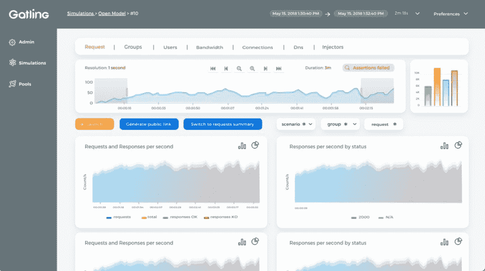](https://kinsta.com/wp-content/uploads/2021/06/gatling.jpg)

Gatling

2012 年发布，用 Scala 编写， [Gatling](https://gatling.io/) 是一个开源的性能和负载测试工具，用于 web 服务，主要是应用程序。它让您通过预测崩溃和缓慢的响应时间来避免崩溃，及早发现问题以缩短上市时间，增强用户体验，并[促进您的业务](https://kinsta.com/blog/bootstrapping-startup/)。

Gatling 的代码链接脚本让您可以轻松地维护测试场景并实现自动化。它是为持续负载测试而构建的，可以很容易地与您的开发管道集成。它还包括一个网络记录器。

#### 特点和优势

*   可读的 DSL:他们的领域特定语言(DSL)使得每个人都能轻松阅读测试场景。
*   **分析**:轻松模拟每秒数以千计的用户请求，并获得高度准确的指标，您可以在丰富多彩的动态报告中查看这些指标。
*   **定价**:免费。

除了开源工具之外，Gatling 还提供了一个商业工具 Gatling Frontline，它具有测试自动化和[集成](https://kinsta.com/help/domain-configuration-cloudflare-mykinsta/)的高级特性和指标。其内部计划每月花费 485 美元，而云计划每小时 3 美元起

### 14.火焰测量器

[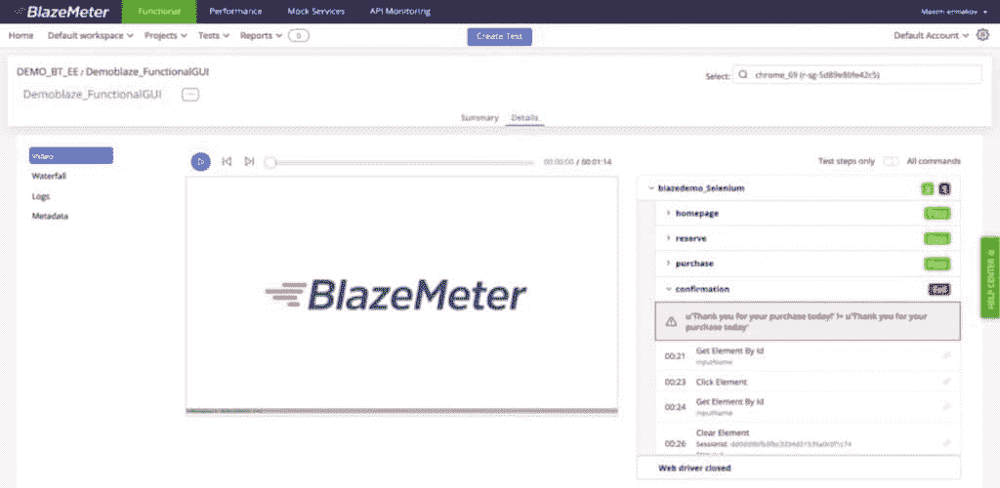](https://kinsta.com/wp-content/uploads/2021/06/blazemeter.jpg)

BlazeMeter

[BlazeMeter](https://www.blazemeter.com/) 是一款企业级负载测试工具，成立于 2011 年，允许你进行轮班测试。它被授予 Gartner peer insights 软件测试自动化客户选择 2020。

其直观的 UI 允许您创建负载测试或重用现有的[脚本](https://kinsta.com/blog/scripting-languages/)来在您的连续测试管道中运行它们。通过利用开源工具链，您可以模拟全球 56 个地点的数千名虚拟用户。此外，您还可以实时控制到达率、每秒点击数和线程数。

BlazeMeter 为您提供详细的报告，以查看历史趋势并提高您的软件性能。您可以获得模拟服务来可视化您的整个系统，模拟缓慢的网络延迟和缓慢的响应，以确保软件性能和质量。

#### 特点和优势

*   **360 度 API 测试**:快速监控[API](https://kinsta.com/blog/wordpress-http-api/)，清晰了解代码健康状况，确保 API 调用内容和结构按预期返回数据。
*   **集成**:集成 Apache JMeter、Taurus、Gatling、Selenium 等等。
*   **定价**:50 个并发用户和 10 次测试的免费计划，而 1000 个并发用户和 200 次测试/年的付费计划起价为 99 英镑/月。

### 15.理性性能测试器

Rational Performance Tester

顾名思义，IBM 的 Rational Performance Tester 是一个自动化的性能测试工具，用于基于服务器和基于 web 的应用程序。它验证应用程序，检测性能瓶颈，并帮助减少负载测试。

Rational Performance Tester 允许您使用 IBM Tivoli 的产品，通过查明 J2EE 界面和应用程序速度变慢的原因，来执行完整的环境分析。这个高级的测试工具让您无需编码就可以创建测试脚本，从而降低复杂性并节省时间。另外，您可以通过访问文本编辑器来查看测试细节。

您可以使用 Rational Performance Tester 来执行根本原因分析，以识别应用层和源代码中的瓶颈，并从序列图中跟踪活动，以及查看资源统计。

#### 特点和优势

*   **支持的技术** : [HTTP](https://kinsta.com/blog/make-fewer-http-requests/) ，SIP，SAP，Citrix，Siebel，TCP Socket 等等。该工具具有一个图形化的测试调度程序，并提供自动化的数据关系管理。
*   **实时报告**:获取实时吞吐量和性能报告，设置配置和过滤选项，并通过对响应时间和其他方面的详细了解来查看性能趋势。
*   **定价**:联系他们报价。

### 16.k6

k6 load testing tool

以前被称为负载影响， [k6](https://k6.io/) 是一个开源的 [SaaS](https://kinsta.com/blog/saas-products/) 和负载测试工具，用于开发团队测试他们的网站和 API。它提供失败/通过行为，轻松集成和自动化到 CI 管道中。

他们的社区还开发了转换器和浏览器记录器来促进测试的创建。k6 是一个灵活、易用、功能丰富的 CI 工具。k6 允许您使用它的测试构建器、转换器(Postman、Swagger 和 JMeter)和记录器创建更快的测试和 QA。另外，它提供了大量的文档和最好的支持。

k6 对云和本地测试使用相同的脚本，测试可以模拟真实世界的情况。它还使用 ES6 JS 中强大的脚本，没有 DSL 或 XML。性能测试工具自动化测试，以确保应用程序和基础设施的性能。此外，您可以在 k6 脚本中配置 SLO 来检查软件的健康状况。

#### 特点和优势

*   **支持的协议** : HTTP/1.1、HTTP/2、WebSocket 等等。
*   **兼容性**:与 Mac OS、Linux 和 Windows 兼容。
*   **集成**:集成 20+服务，包括 Kafka，Azure，GraphQL，Grafana，Datadog， [GitLab](https://kinsta.com/blog/gitlab-vs-github/) ，CircleCI， [GitHub](https://kinsta.com/blog/bitbucket-vs-github/) 等等。
*   定价:他们提供 50 次免费试用，而付费计划则是 200 名用户每月 59 美元，每年 1200 次测试。

### 17.茄子

[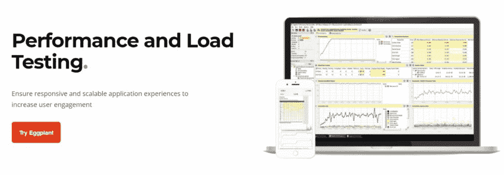](https://kinsta.com/wp-content/uploads/2021/06/eggplant.jpg)

Eggplant

通过使用[茄子](https://www.eggplantsoftware.com/performance-and-load-testing)为终端用户提供可扩展且响应迅速的应用负载测试，增加[终端用户参与度](https://kinsta.com/blog/website-usability-testing/)。这个负载和性能测试工具很简单，并且提供实际的和以用户为中心的测试。

茄子展示了出色的模拟能力。它在网络协议和应用程序 UI 级别上模拟用户，以完全理解 UI 的影响。除此之外，它还是一个高度可扩展的、开放的、支持多协议的工具，可以帮助您解决测试挑战。

#### 特点和优势

*   **测试控件**:您可以在测试运行时轻松控制测试。
*   **有效分析**:有效的实时测试分析和报告让我们能够快速发现问题并有效解决。
*   **定价**:尝试他们的演示并联系他们报价。

### 18.装货工

[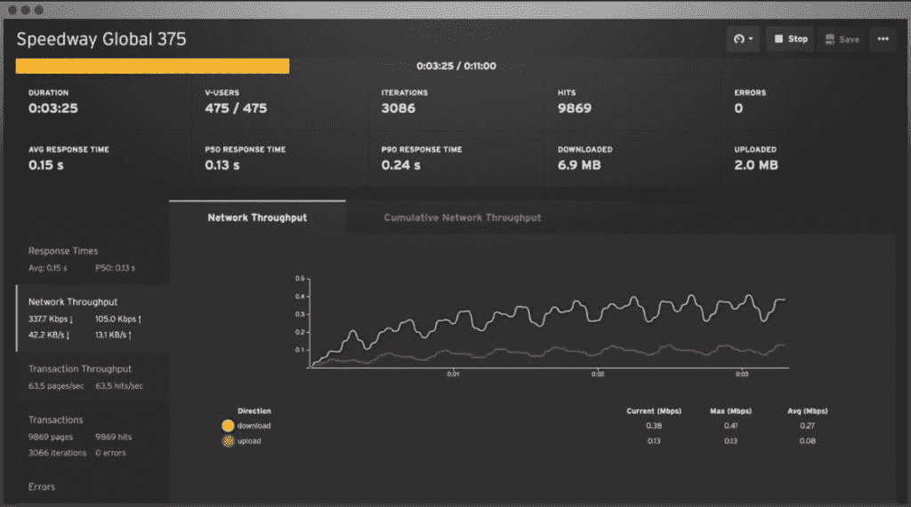](https://kinsta.com/wp-content/uploads/2021/06/loadster.jpg)

Loadster

使用 [Loadster](https://loadster.app/) 对 web 应用进行负载测试可以处理繁重的负载，并帮助您优化应用性能，防止停机，以及控制成本。您可以测试任何类型的 HTTP APIs，比如 REST、JSON-RPC、GraphQL 和 XML-RPC。

它提供了先进的验证规则来[发现错误](https://kinsta.com/knowledgebase/wordpress-error-log/)并记录值以备后用。您还可以使用 Loadster Recorder(一个免费的浏览器扩展)记录脚本，并在浏览器中编辑它们。

您可以使用 Loadster 快速启动云测试。它可以通过少量设置在全球范围内运行分布式云测试，并跨云实例建立 1000 个 bot。

需要一流的，快速的，安全的主机为您的新电子商务网站？Kinsta 提供超快的服务器和来自 WooCommerce 专家的 24/7 世界级支持。[查看我们的计划](https://kinsta.com/plans/?in-article-cta)

#### 特点和优势

*   **实时指标**:在错误、吞吐量和响应时间的测试中获得实时结果，以及自动报告。
*   **定价**:他们的现收现付模式是 1000 bot 小时 119 美元/月起，而月计划是 299 美元起。

### 19.阿卡迈云测试

[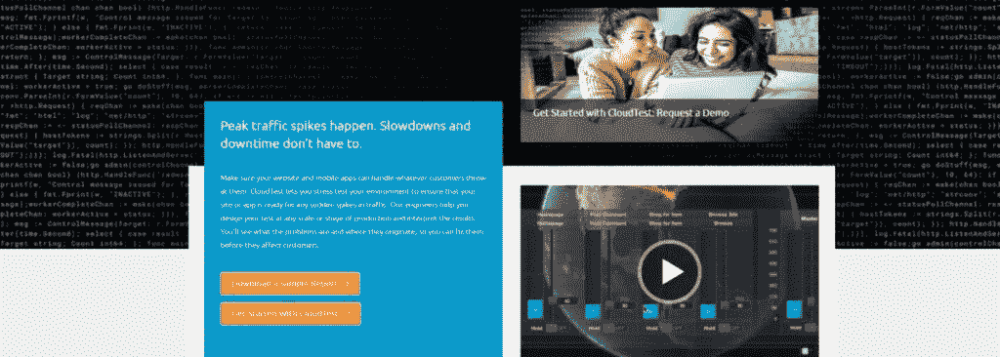](https://kinsta.com/wp-content/uploads/2021/06/akamai-cloudtest.jpg)

Akamai CloudTest

Akamai 的 CloudTest 允许您对您的环境进行压力测试，并确保您的应用程序或网站为突然的流量高峰做好准备。这是一个高度可扩展和强大的工具，让您可以用精确的控制来模拟大型活动，并提供现场分析来帮助您检测[瓶颈](https://kinsta.com/blog/wordpress-performance-new-relic/)。

超级好用。您可以轻松地开发、供应、执行测试并获得详细的见解。这种性能测试工具需要较少的资源分配，但可以产生高性能的结果。

#### 特点和优势

*   **快速测试创建**:无需编码，更快地创建测试。
*   **定价**:100 并发用户免费，按需计划 2500 美元起。

### 20.Parasoft 负载测试

[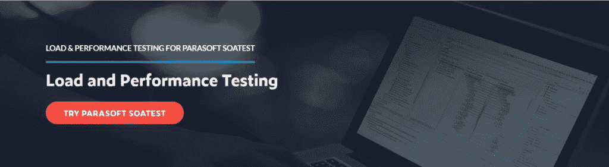](https://kinsta.com/wp-content/uploads/2021/06/parasoftloadtest.jpg)

Parasoft Load Test

[Parasoft 负载测试](https://www.parasoft.com/products/parasoft-soatest/load-performance-testing/)是一个简单易用的负载和性能测试工具，具有智能用户界面，使配置变得轻松。它可以通过脚本扩展来添加自定义功能。

该工具提供多种性能测试类型，包括压力测试、耐久性测试、组件测试、峰值测试、基础设施测试和可扩展性测试。

通过在负载测试中导入 JUnit 测试，您可以实现早期负载测试，隔离代码库的特定部分。此外，您可以使用 QoS 指标自动化测试结果分析，并将其与主要 APM 系统集成以进行关联。

#### 特点和优势

*   **经济高效**:使用 AWS 等云服务按需运行测试，降低性能测试的硬件要求。
*   **定价**:联系他们报价。

### 21.蝗虫

[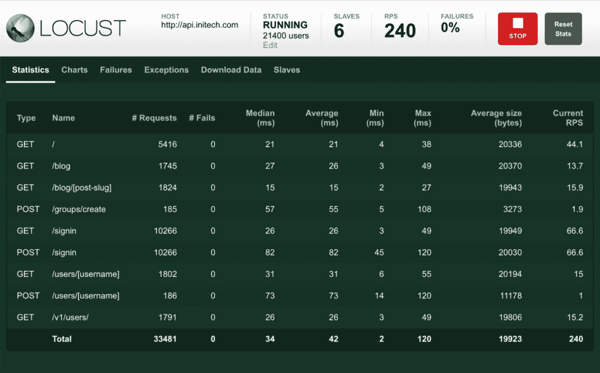](https://kinsta.com/wp-content/uploads/2021/06/locust.jpg)

Locust

[Locust](https://locust.io/) 是一个开源的负载测试工具，它可以让你使用 Python 代码定义用户行为，并让数百万用户同时涌入你的系统。这是一个高度分布式和可伸缩的性能测试工具，支持跨多台机器运行测试，并让您[轻松模拟大量用户](https://kinsta.com/blog/ddos-attack/)。

此外，该工具经过实战检验，具有弹性，即使在交通高峰期也能轻松承受沉重的负荷。它的特点是简单明了的编码，不涉及笨拙的用户界面或丰富的 XML。相反，您可以编写简单的 Python 代码。

#### 特点和优势

*   **安装**:使用 PyPI 的 pip 轻松安装。
*   **定价**:免费。

### 22.nGrinder

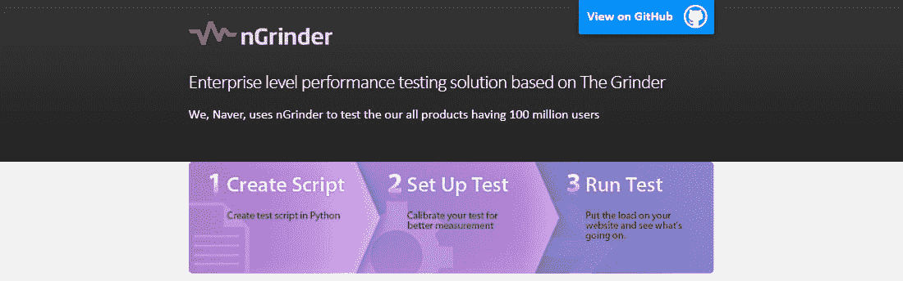

nGrinder

[n rinder](https://github.com/naver/ngrinder)是一款[企业级](https://kinsta.com/enterprise-wordpress-hosting/)性能测试工具，可以轻松执行测试脚本创建，顺利执行测试，监控您的网站和应用程序，并生成测试结果。它使用 Jython 脚本来创建利用多个代理的测试场景。

它是一个开源压力测试工具，提供了集成的测试环境，同时消除了整个过程中的不便。它起源于 Grinder，包括架构中的特定变化和更易访问的测试执行。

您可以分配预安装代理，将它们部署在不同的网络区域，并在多个网络位置执行测试。此外，通过嵌入 subversion 和监控代理状态来管理脚本，以测量机器上的压力。

#### 特点和优势

*   可扩展的(Extensible):它可以使用自定义库无限扩展测试，并适应并发测试，而不会表现出任何低效。
*   **兼容性**:保持向后兼容性，可以在 Docker 上运行。
*   **定价**:免费。

### 23\. Loader.io

Loader.io

使用 [Loader.io](https://loader.io/) 执行简单的基于云的性能和负载测试，这是一款针对您的 web 应用和 API 的免费工具，能够处理数千个同时连接。

只需注册您的应用程序，使用 API 或 web 界面开始测试，并让它们在特定的持续时间内模拟连接。

您可以使用 Loader.io 实时监控您的压力或[负载测试](https://kinsta.com/knowledgebase/load-testing/)，并与您的同事分享报告。它的特点是以图形和统计数据的交互式数据表示，您可以随时随地访问这些数据。

#### 特点和优势

*   **集成**:将 Loader.io 与您的部署管道集成，以扩展功能。
*   **定价**:免费计划支持 10，000 个客户端/测试，而付费计划为 100，000 个客户端/测试每月 99.95 美元起。

### 24.负载风暴

LoadStorm

LoadStorm 是一款功能强大的负载测试工具，适用于您的移动和 web 应用程序。这个云测试工具可以让你发现应用的可扩展性，创建浏览器记录，上传它们，并对它们进行参数化，从而在几分钟内开始测试。

它也是执行负载测试的最具成本效益和最易管理的性能工具之一。他们提供带有[图](https://kinsta.com/blog/wordpress-charts/)的直观报告来测试应用性能，如响应时间、错误率、用户等。

#### 特点和优势

*   **无编码**:你不需要任何脚本技能来使用这个测试工具。
*   **兼容性** : [Windows OS](https://kinsta.com/blog/how-to-screenshot-on-windows/) 。
*   **定价**:联系他们报价。

### 25.网络安全管理软件产品

[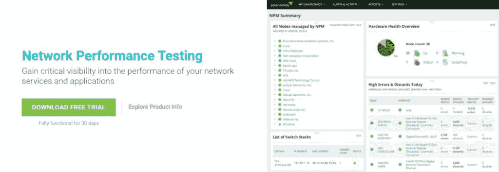](https://kinsta.com/wp-content/uploads/2021/06/solarwinds.jpg)

SolarWinds

借助[网络安全管理软件产品](https://www.solarwinds.com/network-performance-monitor/use-cases/network-performance-test)，更好地了解您的应用和网络服务性能。它可以让您发现问题的根本原因，以便快速解决问题。

利用从该性能测试工具中获得的可操作的见解，您可以减少网络停机时间。此外，该软件提供广泛的网络性能测试，持续监控设备性能和网络可用性。

当关键性能指标超过预定义的阈值时，该工具会通过智能网络警报功能向您发出警报。

#### 特点和优势

*   **数据分析**:利用[数据分析](https://kinsta.com/blog/google-analytics-alternatives/)监控您的网络，以便您可以更快地解决问题。
*   **定价【1,638 美元起。**

### 26.测试工作室

Test Studio

由 Telerik 提供的 [Test Studio](https://www.telerik.com/teststudio) 是一个完整的自动化工具，用于测试您的 web、移动和基于桌面的应用程序的 GUI、负载和性能。它提供了基于代码和无代码的自动化，具有直观的测试用户界面。

Test Studio 通过更快的测试记录器使测试更加可靠和稳定，同时只需要最少的测试维护。此外，它最大化了性能测试覆盖率，以确保最佳性能。

使用它内置的调度程序或者在您的 CI/CD 设置中集成测试套件，您可以执行稳定而快速的测试运行。您还可以记录您的性能测试，并利用自动回放来更快更容易地创建测试，然后运行它来测试不同的[浏览器](https://kinsta.com/browser-market-share/)。

#### 特点和优势

*   **仪表板**:通过基于网络的报告、结果和仪表板监控应用质量。
*   **定价**:每位开发者每月 39 美元起。

### 27.金牛星座

[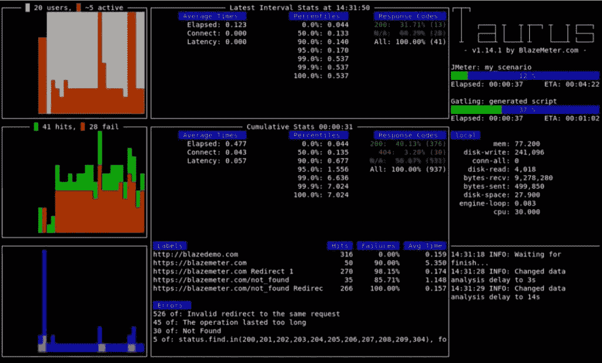](https://kinsta.com/wp-content/uploads/2021/06/taurus.jpg)

Taurus

Taurus 是一个用于持续测试的自动化工具，让你消除那些烦人的、重复的测试。它还改善了使用 Selenium、JMeter 等的体验。

Taurus 是一个简单的性能测试工具，它使得构建、运行和查看测试毫不费力，无需编写大量代码。此外，您可以利用统一的、控制友好的 DSL 从头开始创建新的测试。

#### 特点和优势

*   **集成**:与 JMeter、Selenium 等无缝集成。
*   **定价**:该工具是免费的，并附带有用的文档。

**其他性能测试工具** : OpenSTA、The Grinder、nGrinder、ApacheBench、Tsung、Experitest、ZebraTester、cannon、plateau、J-hawk、Paessler Security、Dynatrace、Zabbix。

不要随便挑东西。相反，根据您的网站和 web 应用程序的独特测试需求来选择性能测试工具。并从本质上比较它们的功能和定价。

但是如果你有一个由 Kinsta 提供支持的网站，那么你就不用去别的地方找了。只需通过 [MyKinsta](https://kinsta.com/mykinsta/) 免费使用 Kinsta APM 进行性能测试即可。

| **网络性能的性能测试工具** | **自动化性能测试的测试工具** | **Web 应用性能测试工具** | **网站性能测试工具** |
| 

*   [Network Security Management Software Product]
*   P
*   network monitoring
*   Dynatrace
*   扎比克斯

 | 

*   新负载
*   Taurus
*   aubergine
*   Rational performance tester

 | 

*   web 负载
*   阿帕奇 JMeter
*   Silk artist
*   风暴使者
*   locust

 | 

*   【金塔 APM】
*   【加载视图】
*   【加载测试】
*   [Applause]
*   【风暴锻造】

 |

## 如何选择最适合您需求的性能测试工具

如你所见，有很多选择。为了帮助您选择最适合您需求的解决方案，我们编制了一份清单，列出了您在评估选项时可能需要考虑的一些重要方面。

### 1.易用性

您使用的性能测试工具必须足够简单，不会给测试人员带来比他们解决的问题更多的问题。如果您的 IT 团队熟悉特定的工具，您可以询问他们这些工具是什么以及它们的性能如何。这将减少学习新软件的时间。

或者你可以使用一个新的但是有效的工具，只要它有一个简单易用的 GUI，并且你已经找到了可扩展的分析插件。

### 2.可用的测试环境

您选择的性能测试工具必须访问足够的网络和硬件资源，以产生足够可用的性能测试环境。我们提到的大多数工具都为您配备了测试环境。

如果它不能生成一个测试环境来正确模拟预期的网络流量，那么这个工具可能不适合满足您公司的需求。

### 3.工具效率

性能测试工具的效率取决于当前在单个操作设备上执行测试所能容纳的虚拟用户数量。

如果它需要更少的设备并产生大规模的测试，效率会更高。为此，it 必须能够在当前硬件上生成预期数量的虚拟用户。

### 4.可量测性

性能测试工具的可伸缩性取决于所选择的协议以及您的测试环境的部署配置。为了检查工具的可伸缩性，您可以对您的性能测试工具进行概念验证测试。

最好进行概念验证测试，以验证产品或想法是否可行。你将在测试阶段获得有价值的信息，如客户反馈、商业分析、竞争对手研究、预期财务状况、[营销策略](https://kinsta.com/blog/saas-marketing/)等等。

### 5.协议支持

不同的厂商提供不同的 app 协议，如 HTTPS、HTTP、SSH、 [FTP/STFP](https://kinsta.com/knowledgebase/ftp-vs-sftp/) 等。根据您喜欢使用的应用程序协议的性质选择工具。

如果您有该工具的可用文档无法解答的问题，请询问您的供应商该工具是否支持该协议，尤其是对于像 Citrix 这样的复杂协议。

### 6.许可证及其成本

对于许多性能测试工具来说，许可可能是一个挑战。商业工具通常提供更好的协议支持，但有一定的限制。在使用该工具之前，请查看并了解其许可情况。如果它是一个付费工具，检查他们的价格，和其他人比较，选择那些在你的预算范围内，有基本功能的。

### 7.综合

当与其他监控、诊断、缺陷管理和需求管理集成时，性能测试工具工作得非常好。它将帮助您了解该工具可以为您带来的关于诊断和监控的指标的性质。此外，您将了解如何跟踪这些测试并容易地发现缺陷。

例如，StormForge 与 AWS、GCP、IBM 等云提供商无缝集成。；像 Prometheus、Datadog、Circonus 等监控工具。； [DevOps 工具](https://kinsta.com/blog/devops-tools/)像 Jenkins，Puppet，Rancher Labs 等。

### 8.扩展性和适应性

一个性能测试工具并不具备您在测试中可能需要的所有功能。因此，了解该工具的灵活性和可扩展性，以便您可以将其与其他第三方工具集成并增加其功能。

例如，Apache JMeter 是高度可扩展的，可以与可插入的采样器、可脚本化的样本(例如 Groovy)、可插入的定时器、数据可视化插件、分析[插件](https://kinsta.com/knowledgebase/wordpress-plugin/)等等一起工作。

### 9.支持

找出你可以从工具供应商那里得到的用户支持的级别。通常，商业供应商通过各种沟通渠道、文档等为[提供高质量的支持](https://kinsta.com/kinsta-support/)。

如果你使用开源软件，检查他们的社区支持、论坛、活跃成员等等。

[Which performance testing tool is right for you? 👀 Find out in this guide ⬇️Click to Tweet](https://twitter.com/intent/tweet?url=https%3A%2F%2Fkinsta.com%2Fblog%2Fperformance-testing-tools%2F&via=kinsta&text=Which+performance+testing+tool+is+right+for+you%3F+%F0%9F%91%80+Find+out+in+this+guide+%E2%AC%87%EF%B8%8F&hashtags=UX%2CWordPress)

## 摘要

没有人喜欢等待网站或应用程序加载。当它发生时，他们可能会考虑其他可行的选择，导致你失去业务。这就是为什么对更快的网站和应用程序有巨大的市场需求。

对你的网站或应用程序进行[性能测试是至关重要的](https://kinsta.com/blog/application-performance-monitoring/),以确保它们尽可能快地加载和运行，以便你的用户可以依赖它们。通过测试实现必要的变更，您可以实现更多的转换。

正如我们所展示的，市场上有大量的性能测试工具可供选择。选择你认为最适合测试你的网站或应用需求的。

我们是否遗漏了您在性能测试中使用的任何工具？请在评论区告诉我们。

* * *

让你所有的[应用程序](https://kinsta.com/application-hosting/)、[数据库](https://kinsta.com/database-hosting/)和 [WordPress 网站](https://kinsta.com/wordpress-hosting/)在线并在一个屋檐下。我们功能丰富的高性能云平台包括:

*   在 MyKinsta 仪表盘中轻松设置和管理
*   24/7 专家支持
*   最好的谷歌云平台硬件和网络，由 Kubernetes 提供最大的可扩展性
*   面向速度和安全性的企业级 Cloudflare 集成
*   全球受众覆盖全球多达 35 个数据中心和 275 多个 pop

在第一个月使用托管的[应用程序或托管](https://kinsta.com/application-hosting/)的[数据库，您可以享受 20 美元的优惠，亲自测试一下。探索我们的](https://kinsta.com/database-hosting/)[计划](https://kinsta.com/plans/)或[与销售人员交谈](https://kinsta.com/contact-us/)以找到最适合您的方式。