# 20 个精彩的摄影网站(以及如何在 2022 年建立自己的网站)

> 原文：<https://kinsta.com/blog/photography-website/>

如果你想知道如何创建一个能吸引潜在客户注意力的摄影网站，你来对地方了。

随着超过 93%的消费者使用互联网寻找当地企业和服务提供商，这是你可以为你的摄影业务做的最好的事情之一。

但是，当已经有数百万其他摄影师在宣传他们的作品时，想要脱颖而出并不容易。你需要正确的设计和方法。

在本文中，我们将涵盖 20 多个获奖的摄影网站示例，将它们提炼为几个核心课程，并向您展示如何一步一步地创建您的网站。

## 2022 年 20 个前沿摄影网站实例

让我们仔细看看 20 个摄影网站，它们举例说明了摄影师应该如何在网上定位自己。

### 1 .品牌工具

布兰迪图雷摄影网站

Brandi Toole 是一名来自纽约的婚礼摄影师，她的网站是让作品自己说话的完美例子。

这些图片放在最前面和中间，有严格的[基本导航](https://kinsta.com/blog/website-navigation/)和一个光滑的，只有名字的标题。图像的选择立刻突出了 Brandi 的专长，这在接触你的目标受众时是至关重要的。

### 2.亚历山大·罗曼诺

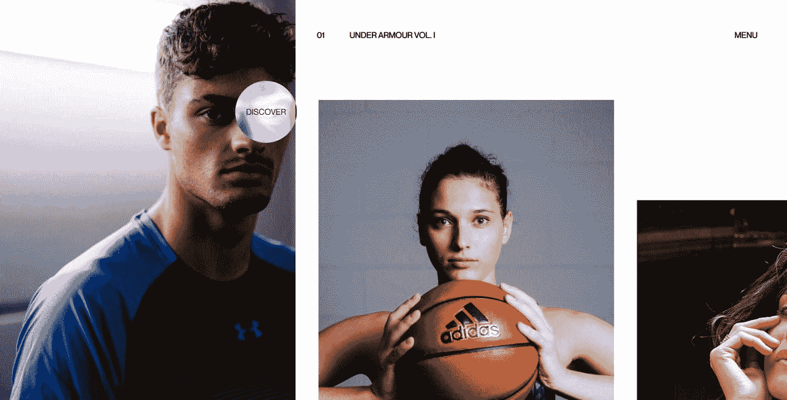

亚历山德罗·罗马尼奥利摄影网站

Alessandro Romagnoli 是一位意大利时尚与生活摄影师。该网站突出了他的工作，为作品集提供了独特的[用户体验](https://kinsta.com/blog/website-usability-testing/)。将鼠标悬停在一张照片上可以显示照片的负面效果，你可以对角地拖动照片，而不是向左或向右。

### 3.北欧人

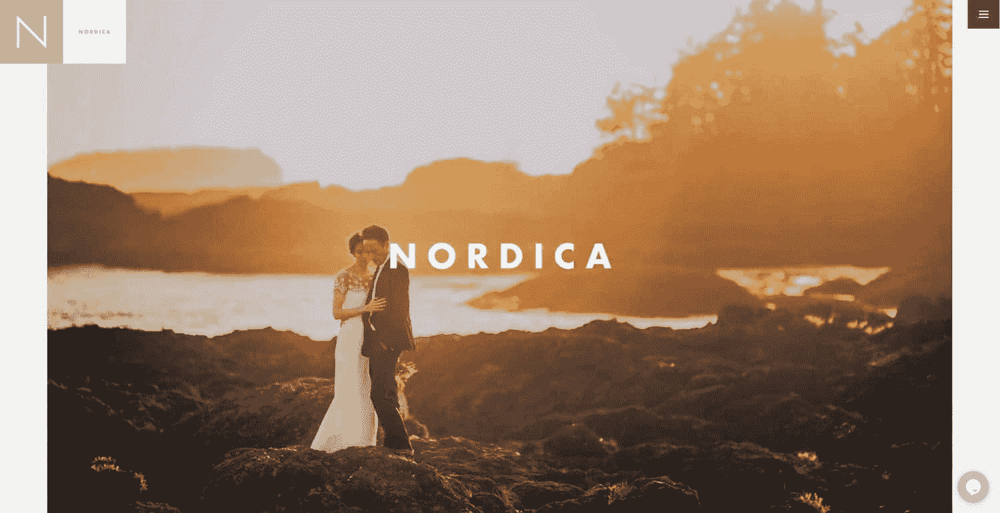

诺德卡摄影网站

诺尔迪卡婚纱摄影二人组科尔和雅各布用一套电影胶片来吸引第一次来的游客和潜在顾客。

他们的[故事页面](https://nordicaphotography.com/nordica-story/)也很鼓舞人心，告诉游客他们是如何成为的故事。

### 4.拉起驳船缆绳

路德·路易登摄影网站

Ruud Luijten 在安特卫普的家中专门从事自然和风景摄影。他的网站展示了动画在建立第一印象时的强大力量。

### 5.克莱门特·梅鲁阿尼

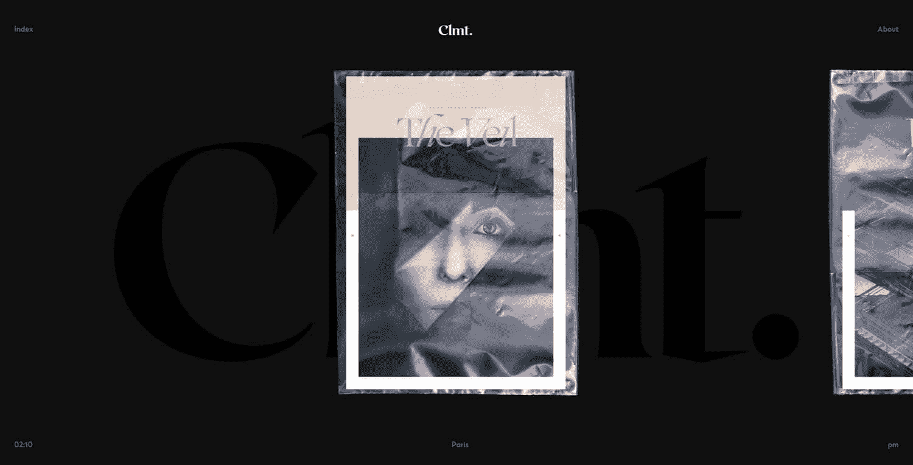

Clement Merouani 摄影网站

克莱门特·梅鲁安尼是一位居住在巴黎的摄影师兼艺术总监。他将每个项目作为杂志封面展示，完美地突出了他所做的工作类型。

这个网站是动画如何有助于独特体验的另一个例子(但只有拥有足够快的主机，才不会让他们的网站永远加载不完)。

### 6.猎本摄影

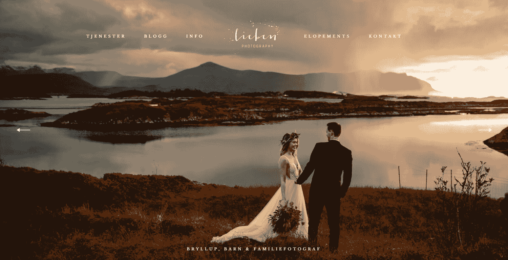

【猎本摄影】摄影网站

[Lieben Photography](https://www.lieben.no/) 由一位挪威婚礼摄影师经营，他专门拍摄婚礼前的风景照。

该网站的简单设计表明，任何摄影师的网站最重要的部分是一个引人注目的图片集。

### 7\. Mack Eveland

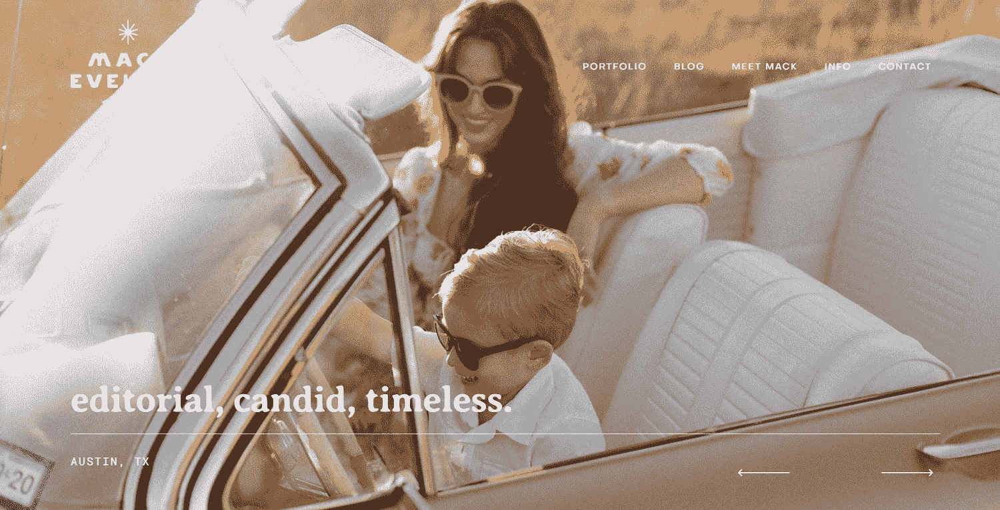

麦克·埃维兰摄影网站

Mack Eveland 是德克萨斯州奥斯汀的一名编辑摄影师。她的网站首页有一个自动播放的全屏图库，里面有精心挑选的照片。

她还强调了她拍摄的照片类型(社论)和吸引潜在客户的地点。

### 8.大卫·威廉·鲍姆

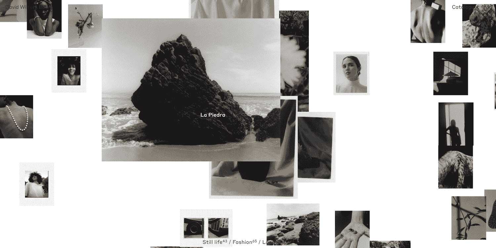

大卫威廉鲍姆摄影网站

大卫·威廉·鲍姆的网站是一个互动画廊，利用了大量的空白空间和一个可以覆盖不同照片的动画界面。

对于专攻多个专业领域的摄影师来说，这是一个鼓舞人心的例子。

### 9.多莉大街

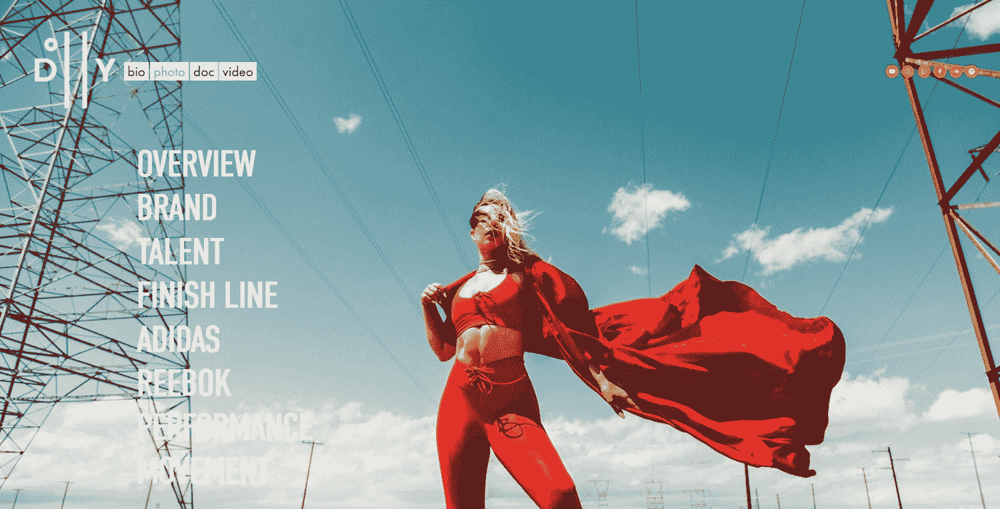

多利大街摄影网站

Dolly Ave 的网站是品牌力量的一个很好的例子。多么强大的第一印象。

所选的照片突出了她拍摄的独特风格。通过文字，她突出了过去项目中的大品牌。

### 10.罗伯特·克拉克

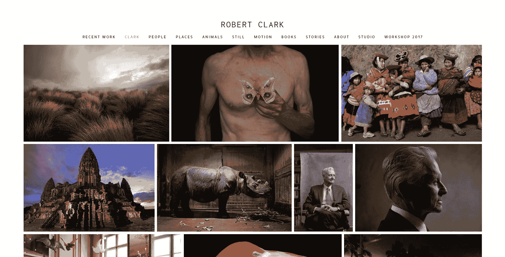

罗伯特·克拉克摄影网站

罗伯特·克拉克是纽约的一名编辑兼广告摄影师。有了合适的照片，即使是一个简单的[网格画廊](https://kinsta.com/blog/wordpress-photo-gallery-plugins/)也能给人留下深刻的印象。

没有比在你的主页上展示你的摄影作品集更好的方式了。
T3】

### 11.伊格纳西奥·帕拉西奥斯

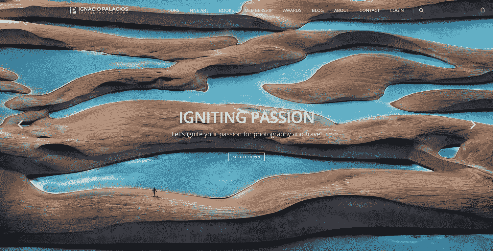

Ignacio Palacios 摄影网站

对于[旅游摄影师来说，Ignacio Palacios](https://kinsta.com/blog/how-to-start-a-travel-blog/) 是一个独特的例子，因为他通过自己的网站展示了不同的品牌和商业策略。

该网站不是迎合杂志和其他潜在客户，而是专注于吸引和教授初学者摄影师，并推广摄影之旅。

### 12.克拉拉·巴尔扎里

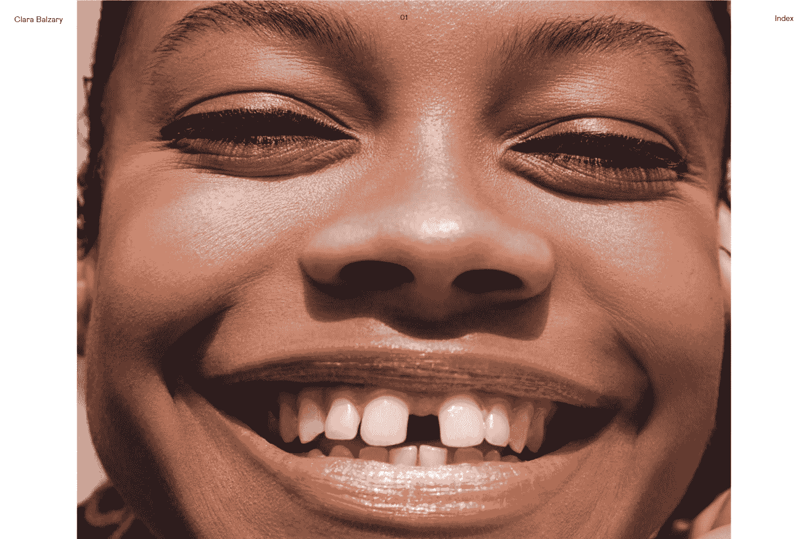

克拉拉·巴尔扎里摄影网站

一张照片胜过千言万语，尤其是当它是一张肖像照或时尚照的时候。克拉拉 [巴尔扎里](http://www.clara-balzary.com/)的网站就是一个很好的例子。

它有一个客户名称的联系页面，但除此之外，整个网站是一系列的图片。

### 13.哈里斯·努克姆

哈里斯·努肯摄影网站

Haris Nukem 是一位居住在英国伦敦的摄影师和视觉艺术家，他可以在一张照片中传达自己独特的风格。

虽然你应该在你的网站上展示你最好的一面，但你永远不应该试图隐藏你的风格或你是谁。试图融入是最容易失败的方法。

### 14.克里斯·伯克德

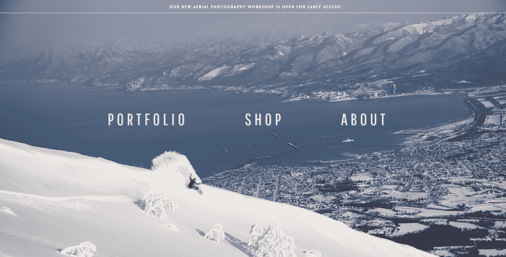

克里斯·伯克摄影网站

克里斯·伯克德是一名探险家和旅行摄影师，他在非常偏远的地方拍摄和旅行。

对于探险摄影网站来说，展示你可以捕捉激动人心的时刻是至关重要的。克里斯用他选择的照片完美地做到了这一点。

### 15.安德烈亚斯·古尔斯基

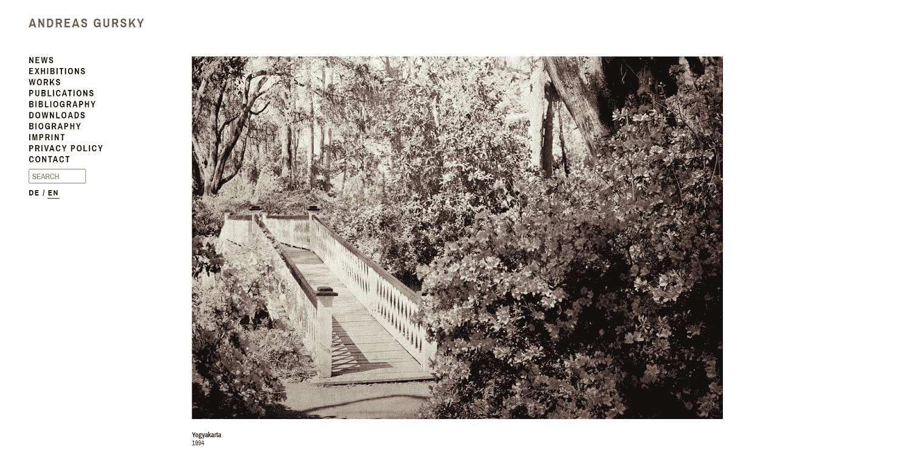

安德烈亚斯·古尔斯基摄影网站

安德烈亚斯·古尔斯基是一名德国摄影师和艺术家。每次访问该网站时，你看到的不是一张精心挑选的照片，而是一张他以前作品的随机选择。

### 16\. Levon Biss

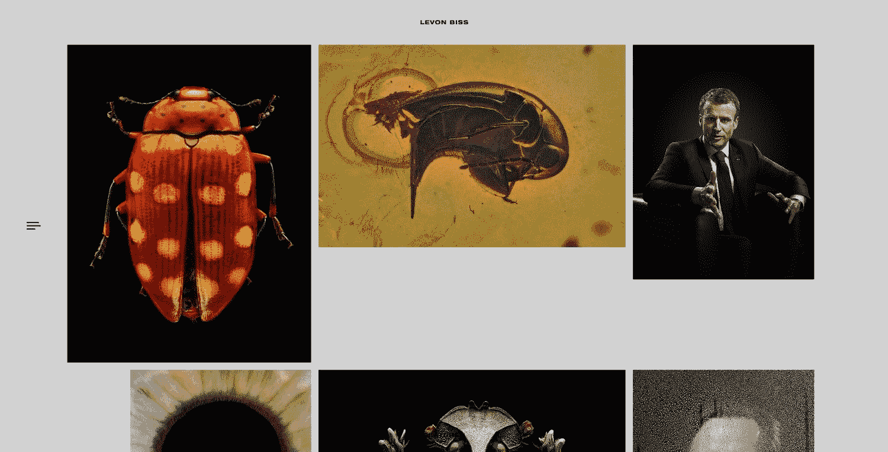

Levon Biss 摄影网站

Levon Biss 是一名肖像摄影师，为人类和昆虫拍摄肖像，他的网站展示了他的独特技能和各种摄影作品。

### 17.莎拉·E

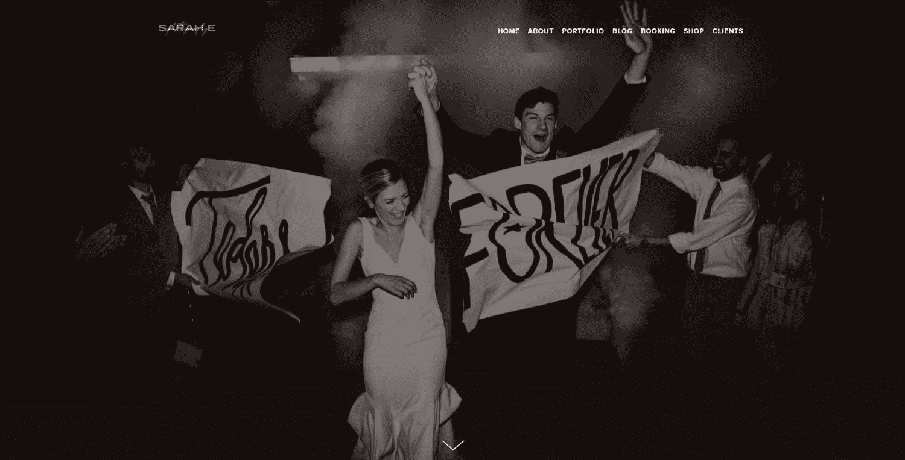

莎拉 E 摄影网站

萨拉 E 是科罗拉多州的一名婚礼摄影师，她有着独特的纪录片风格。

虽然她不回避一个完美的舞台镜头，如上图，她的画廊突出了她的真实性。

### 18.克里斯汀·米特莱斯特

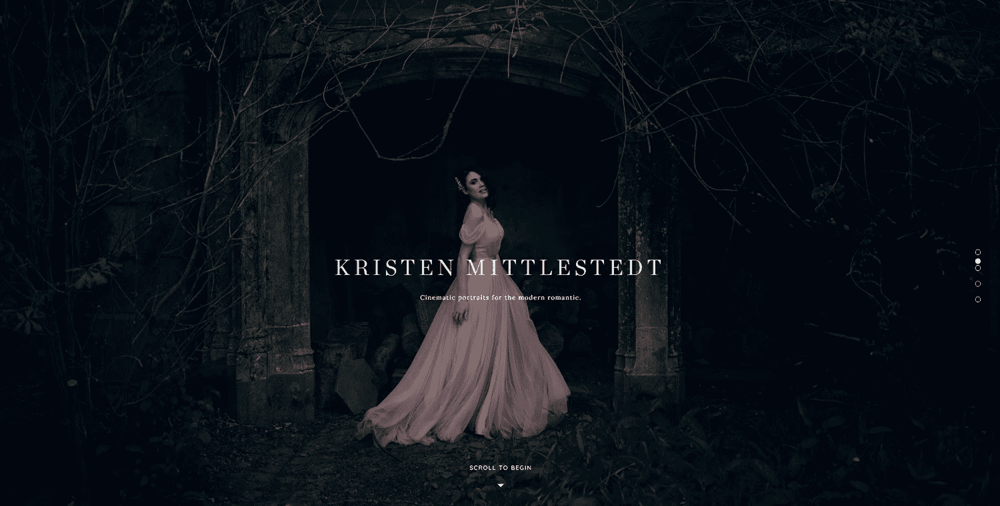

克里斯汀·米特莱斯特摄影网站

克里斯汀·米特莱斯特不仅仅是另一位婚礼或肖像摄影师。她的电影风格在网站上随处可见，从简单的滚动画廊到突出的图片。

### 19.阿列克谢·泰坦琴科

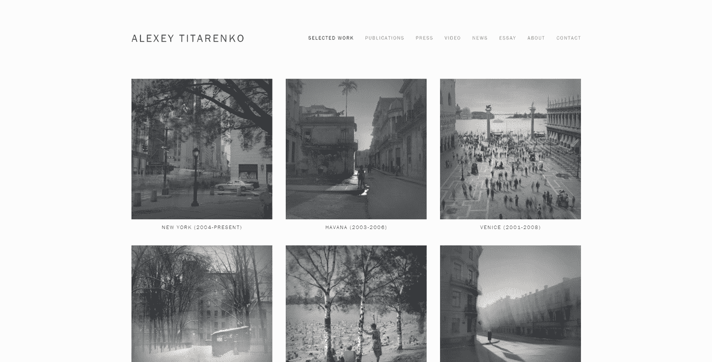

阿列克谢·季塔连科摄影网站

Alexey Titarenko 是现代艺术界最成功的摄影师之一。他的网站显示了空白的价值。

您的图库不需要使用 jQuery 将所有内容都强制放入混合网格中。有了正确的比例和选择的图片，你就可以创建一个有组织的、引人注目的布局，而不那么死板。

### 20.蒂姆·霍利

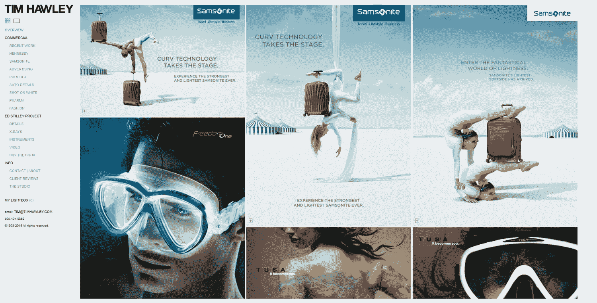

蒂姆·霍利摄影网站

蒂姆·霍利是一名商业摄影师和视觉艺术家。他的网站展示了产品摄影的独特创意，以耐人寻味的方式突出了他的产品。

通过加入他合作过的公司的标志，他也为潜在客户增加了强有力的社会证明。

## 7 个基本的摄影网站设计原则

如果你关注了上面的网站，你可能已经注意到了下面的一些基本原则。

### 1.让你的作品自己说话

你的[图片应该放在网站的最前面和中心](https://kinsta.com/blog/visual-content-strategy/)。

你的形象选择也应该反映出你提供的服务和你想要的顾客类型。

## 注册订阅时事通讯

### 想知道我们是怎么让流量增长超过 1000%的吗？

加入 20，000 多名获得我们每周时事通讯和内部消息的人的行列吧！

[Subscribe Now](#newsletter)

记住时尚摄影师克莱门特是如何用杂志封面突出他的作品的，或者婚礼摄影师是如何展示婚礼上不可错过的情感瞬间的。

### 2.吻:保持简单，傻瓜

不要试图创造一个复杂的设计来突出你的艺术实力。作为一名摄影师，你能做的最好的事情就是保持设计的时尚和简单。

坚持预制的模板或主题，以获得最佳效果。

### 3.使用您的“关于”页面来推销体验

你的[“关于”页面](https://kinsta.com/about-us/)不应该主要是关于你的狗(除非你是宠物摄影师)或者你不寻常的爱好。

用它来解释为什么有人应该选择你作为他们的摄影师。展示你的工作经验或哲学，并说明他们作为客户可以期待什么。

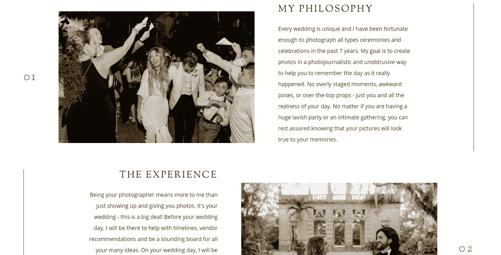

摄影网站【关于】页面示例

布兰迪·图尔在这里做得很好。她的“关于”页面涵盖了她的哲学和与她一起工作的经历。以此为目标。

### 4.清晰导航

保持你的导航菜单清晰简洁。如果用户找不到他们要找的页面，他们就会离开你的网站，再也不会回来。

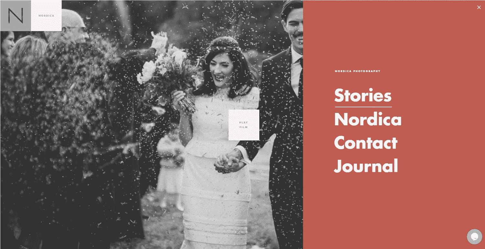

摄影网站导航

Nordica 的这个例子强调了一些基本的东西:一个可扩展的菜单，带有指向“投资组合”、“联系人”和“关于”页面的链接。

### 5.从客户开始

当挑选图片和设计网站时，一定要从潜在客户开始考虑。

它不应该是关于你的自我或创造性的驱动力，而是与你的理想客户产生共鸣。

### 6.不要试图重新发明轮子

如果你不是网页设计师或开发者，你不应该尝试从零开始。相反，依靠现有的工具，如模板和插件来帮助你建立你需要的网站。

查看我们精心挑选的最好的 WordPress 插件列表开始吧。

### 7.让联系你变得容易

首先考虑一下你为什么要创建一个网站。建立知名度，接触潜在客户，对吗？

这意味着，让感兴趣的用户以一种简单明了的方式联系你是成功的关键。

你应该在你的网站上突出显示以下方法中的至少一种:

*   访问者可以联系到您的联系方式
*   电话号码(例如，VoIP 重定向号码，这样您就不会共享您的私人号码)
*   [预约或呼叫调度插件](https://kinsta.com/blog/wordpress-booking-plugins/)

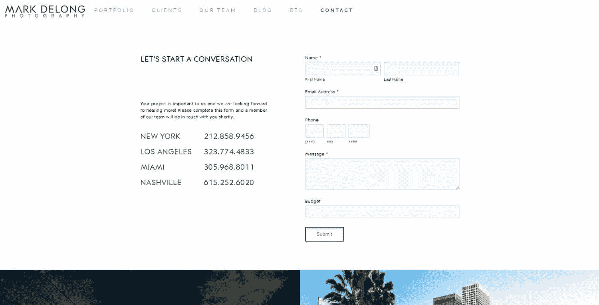

摄影网站【联系】页面

[马克德龙](https://www.markdelong.com/)的网站有一个很好的联系页面。它有一张联系表，以及所有当地办事处的电话号码。

当然，如果你是一个人的商店，你不需要多个电话号码。

## 如何创建一个摄影网站

创建一个摄影网站有很多方法。你可以用静态 HTML 和 CSS 来构建它，使用免费服务，或者使用 [CMS(内容管理系统)](https://kinsta.com/knowledgebase/content-management-system/)来托管和构建网站。

### 建立一个摄影网站最好的方法是什么？

对于我们来说，[自托管 WordPress](https://kinsta.com/blog/wordpress-com-vs-wordpress-org/#wordpresscom-vs-wordpressorg-which-should-you-choose) 是摄影师建立网站的最佳方式。

厌倦了体验你的摄影网站的问题？通过 Kinsta 获得最好、最快的主机支持！[查看我们的计划](https://kinsta.com/plans/?in-article-cta)

为什么？

*   **完全的内容所有权和控制权:**你对你所有的内容拥有完全的权利([不像网站建设者](https://kinsta.com/blog/wix-vs-wordpress/#data))。
*   **可用性和特性:**拖放式内容创建，以及完全定制您的网站外观和体验。
*   **扩展性:**数以千计的插件(包括数百个摄影相关的插件)帮助你传递你想要的体验。
*   **一分钱一分货的专业设置:**从数百种廉价免费的专业模板和插件中选择。
*   **更好的站点管理:**易于备份、迁移和移动。

当 WordPress 为 40%的互联网提供动力时，你知道他们在做正确的事情。

### 一键创建您的网站

Kinsta(以及 2021 年的大多数其他主机)使得创建一个新的 WordPress 站点变得非常容易。

在我们的例子中，只需要点击*一下*就可以开始了。

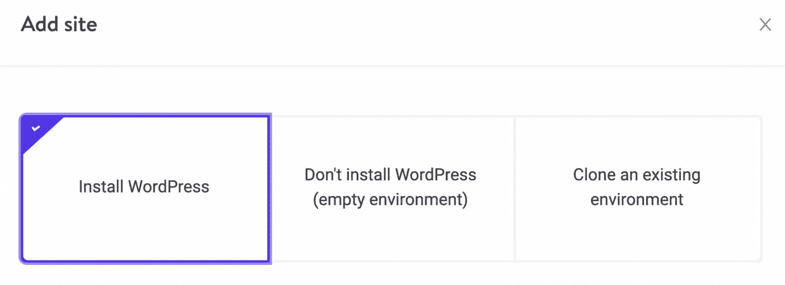

金斯塔的【安装 WordPress】按钮

不需要复杂的手动设置过程。

### 从成千上万的摄影网站模板中选择(WordPress 主题)

官方的 [WordPress 主题目录](https://wordpress.org/themes/)中有超过 370 个免费的摄影主题。

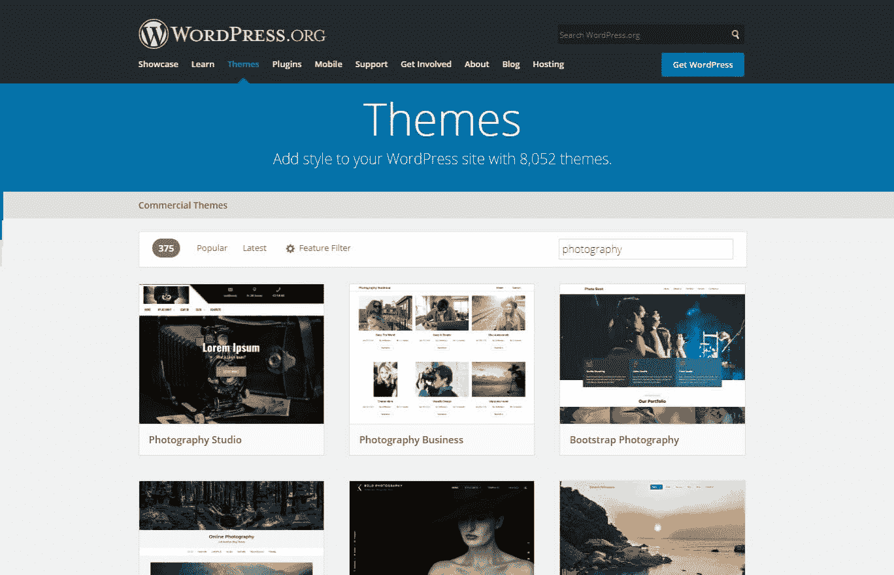

WordPress 主题目录

第三方网站和开发者也有数千种主题可供选择。

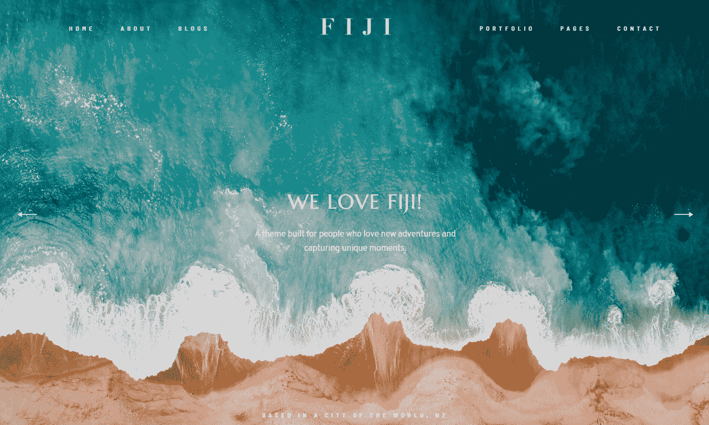

斐济 II 摄影主题

例如，[斐济 II 主题](https://flothemes.com/themes/fiji-2/)对于任何摄影师来说都是一个很好的起点。你可以用你选择的图片来改变 180 度的气氛。

想了解更多的想法，请查看我们的帖子，突出了[最佳 WordPress 主题](https://kinsta.com/best-wordpress-themes/)。

### 从吸引眼球的主页开始

一旦你有了一个主题，是时候开始创建你网站的实际页面了。从访问者登陆你的网站时看到的第一样东西开始:[主页](https://kinsta.com/blog/wordpress-change-homepage/#what-the-wordpress-homepage-is-and-why-you-may-want-to-change-yours)。

**首页应该:** 

*   引人注目
*   突出你的主要摄影专业
*   展示你最好的作品
*   直接与潜在客户交谈

要创建你的第一个页面，点击菜单中的**页面**将其展开，然后点击**添加新的**链接。

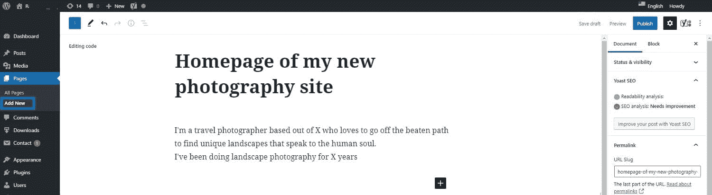

创建新 WordPress 页面

然后，您必须在定制器中设置您的主页。在菜单中选择**外观>定制**，点击进入主页设置。

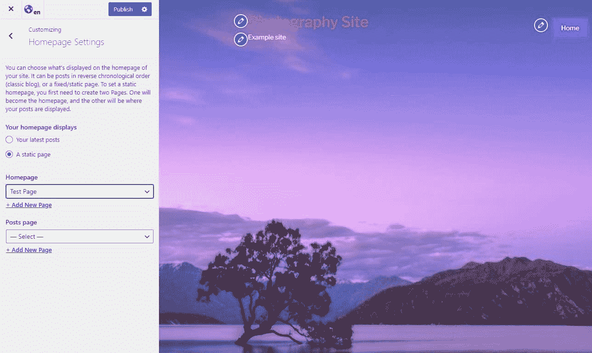

WP 定制器主页设置

选择您刚刚创建的页面并**发布**以保存更改。

在 WordPress 中，有了摄影主题，你最有可能在定制器中编辑首页。

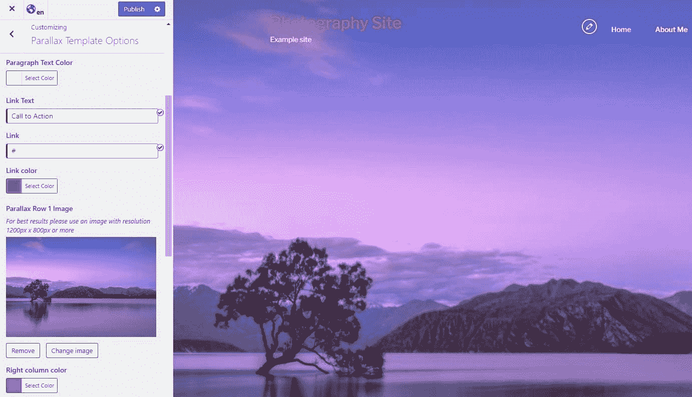

WP Customizer template options

在这个特殊的主题中，你可以编辑**视差模板选项**中的设置。

无论你拍摄的是哪种类型的照片，都要仔细选择照片，以抓住潜在客户的注意力。注意菜单或标题中的颜色不要与照片冲突。

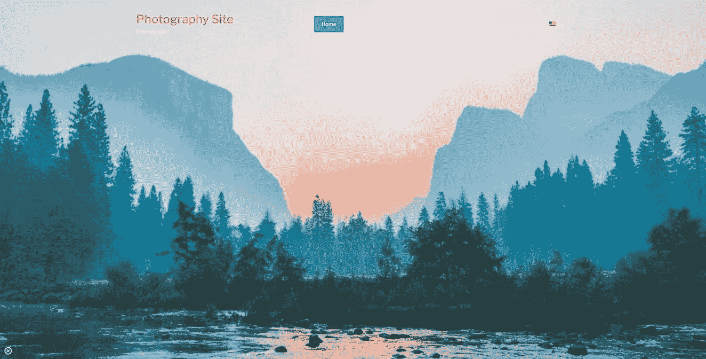

摄影网站首页示例

一些错误的举动会导致网站看起来不专业。

使用自然主题的照片，吸引任何游客的注意。将标题或徽标着色，以与您选择的照片(或多张图片中的任何一张)相融合。

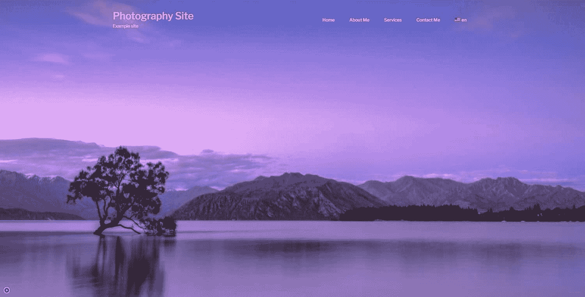

新增背景照片示例

这就是为什么我们报道的几乎所有摄影网站都使用黑白文字的原因。在这种情况下，书面内容不是主角。

### 任何摄影网站的 3 个基本页面

接下来，你要重复这个过程。为至少三个以上的部分创建一个新页面(但跳过主页设置)。

*   联系页面:访客(和潜在客户)可以在这里找到你。
*   **关于页面:**这是你突出你的体验和客户可以期待的(不是你最喜欢的食物或颜色)。
*   作品集或画廊页面:作品集或画廊是你展示过去作品的地方。您还可以基于不同的类别创建多个页面。如果你的主页本身就是作品集，你可以跳过这一步。

对于“关于我”的页面，你可以很容易地使用 WordPress 的拖放编辑器来创建你想要的布局。

WP【关于我】页面编辑

要创建联系页面，你需要一个 [WordPress 联系表单插件](https://kinsta.com/blog/wordpress-contact-form-plugins/)。安装后，您可以从编辑器中拖放一个联系人表单框。

创建一个好看的作品集页面有点复杂，但是使用合适的工具，你可以在几分钟内完成。

### 使用图库插件创建交互式图库或作品集

接下来，是时候用最重要的元素来完成你的摄影作品集网站了:作品集。

第一步是仔细选择并上传你最好的图片，放入图库或作品集页面。

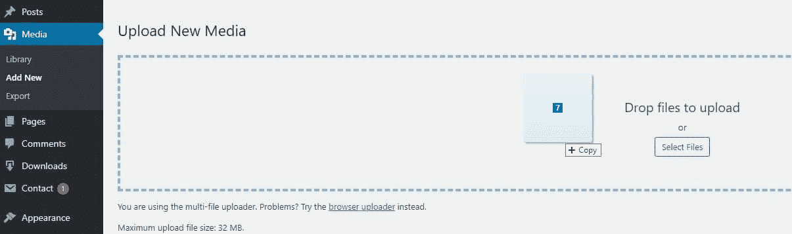

WordPress【上传新媒体】栏目

然后你需要找到合适的 [WordPress 图片库插件](https://kinsta.com/blog/wordpress-photo-gallery-plugins/)来满足你的特定需求。他们将允许你创建灵活的，自由流动的网格画廊，展示你的照片风格。

以 [Modula](https://wp-modula.com/) 为例。它使用 JQuery 创建了一个网格样式的图库，让人感觉栩栩如生。

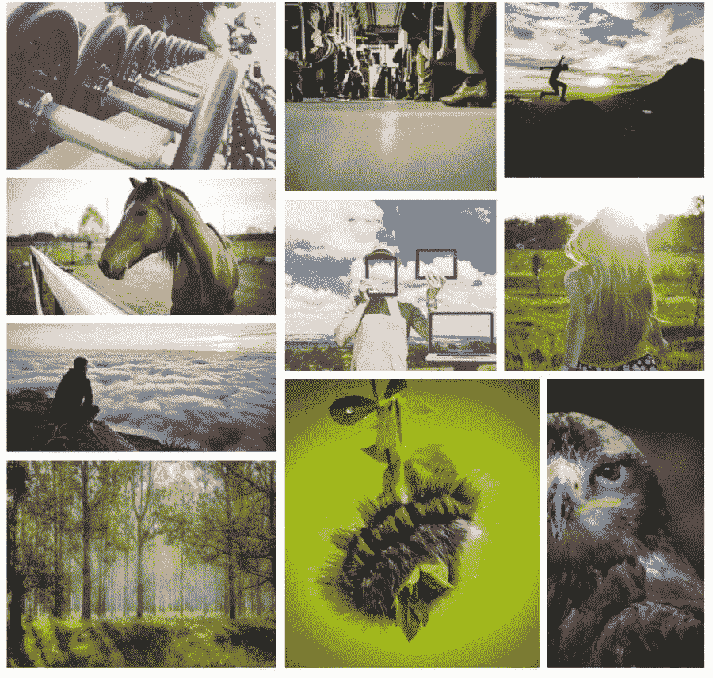

Modula WordPress 图库插件

根据插件的不同，它会生成自己的页面，或者你需要将一个短代码复制并粘贴到你创建的作品集页面上。

### 不要让缓慢的加载速度破坏了你的第一印象

如果你让你的访问者在你能看到网站之前等待，他们更有可能立即离开。即使只需要五秒钟，他们[就有 90%的可能](https://kinsta.com/blog/speed-up-woocommerce/#why-speed-matters-for-an-online-store)离开。

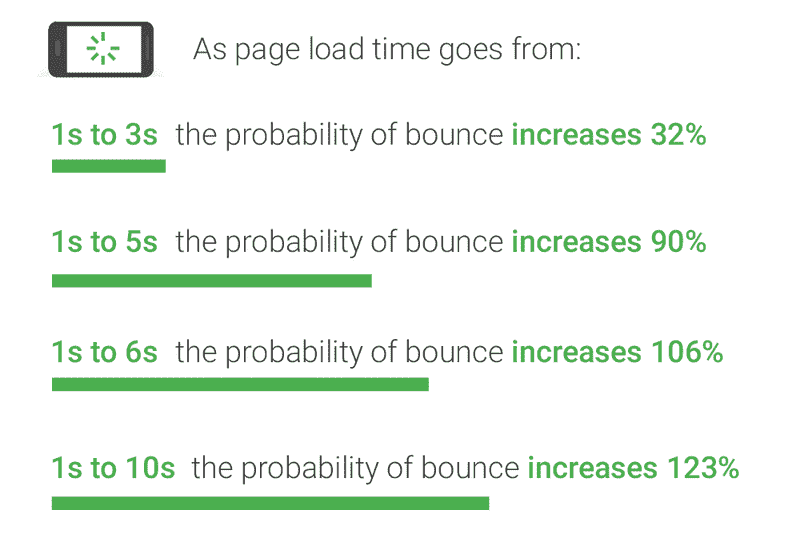

页面加载时间和跳出率(来源:[thinkwithggoogle](https://www.thinkwithgoogle.com/marketing-strategies/app-and-mobile/mobile-page-speed-new-industry-benchmarks/))

摄影网站不可避免地有很多大的、[富媒体文件](https://kinsta.com/blog/image-file-types/)。低分辨率的图像无法给人以同样的专业印象。如果你能采取对策来确保快速的装载速度，那将是最好的。这些可以包括:

*   找到一个可靠的托管服务，知道如何让 WordPress 运行得更快，即使在负载很重的情况下([那是 Kinsta 的专长](https://kinsta.com/blog/fastest-wordpress-hosting/))。
*   使用 [WordPress 惰性加载](https://kinsta.com/blog/wordpress-lazy-load/)先加载可见图片和视频。
*   选择一个最快的 WordPress 主题。
*   [针对网络和性能优化您的图像](https://kinsta.com/blog/optimize-images-for-web/)。
*   按照我们的逐步指南来加速你的 WordPress 站点。

第一步是最重要的。有了一个[不可靠的共享托管计划](https://kinsta.com/blog/cheap-wordpress-hosting/)，你做的任何事情都不会让你的网站像你希望的那样快速加载。

在金斯塔，速度是第一位的。我们定制的环境运行在快如闪电的谷歌云虚拟机上。我们还使用最新的缓存和其他性能优化来确保快速运行。

[如果你是一名摄影师，你应该已经知道漂亮布局的重要性📷...因此，请确保您的网站在这些获奖例子的帮助下反映出这一点。✅ 点击推文](https://twitter.com/intent/tweet?url=https%3A%2F%2Fkinsta.com%2Fblog%2Fphotography-website%2F&via=kinsta&text=If+you%27re+a+photographer%2C+you+already+know+the+importance+of+beautiful+layouts+%F0%9F%93%B7...+so+make+sure+your+website+reflects+that+with+help+from+these+award-winning+examples.+%E2%9C%85&hashtags=Photography%2CPhotographers)

## 摘要

创建一个摄影网站是你在你的行业和当地立足的关键一步。

通过从上面的例子中学习，保持简单，并从一个合适的主题开始，你可以在几个小时内完成一个伟大的网站并建立你的在线形象。

采取这些措施，让你从竞争对手中脱颖而出，开始快速获得更多客户。

* * *

让你所有的[应用程序](https://kinsta.com/application-hosting/)、[数据库](https://kinsta.com/database-hosting/)和 [WordPress 网站](https://kinsta.com/wordpress-hosting/)在线并在一个屋檐下。我们功能丰富的高性能云平台包括:

*   在 MyKinsta 仪表盘中轻松设置和管理
*   24/7 专家支持
*   最好的谷歌云平台硬件和网络，由 Kubernetes 提供最大的可扩展性
*   面向速度和安全性的企业级 Cloudflare 集成
*   全球受众覆盖全球多达 35 个数据中心和 275 多个 pop

在第一个月使用托管的[应用程序或托管](https://kinsta.com/application-hosting/)的[数据库，您可以享受 20 美元的优惠，亲自测试一下。探索我们的](https://kinsta.com/database-hosting/)[计划](https://kinsta.com/plans/)或[与销售人员交谈](https://kinsta.com/contact-us/)以找到最适合您的方式。