# 最终的 PHP 7.2、7.3、7.4、8.0 和 8.1 基准测试(2022)

> 原文：<https://kinsta.com/blog/php-benchmarks/>

对于 PHP 来说，2021 年是多事之秋。PHP 8.0 已经一岁了，备受期待的 PHP 8.1 于 2021 年 11 月 25 日发布，带来了许多令人兴奋的特性。你可以在我们的深度文章中了解所有最新的 [PHP 8.1 特性](https://kinsta.com/blog/php-8-1/)。

每年，我们都会发布针对各种 PHP 平台的深入性能基准，以了解不同 PHP 版本之间的对比情况。今年，我们**在 **14 个独特的 PHP 平台/配置**中对 5 个不同的 PHP 版本**进行了基准测试，包括 [WordPress](https://kinsta.com/knowledgebase/what-is-wordpress/) 、 [Drupal](https://kinsta.com/blog/wordpress-vs-drupal/) 、 [Joomla](https://kinsta.com/blog/joomla-vs-wordpress/) 、 [Laravel](https://kinsta.com/blog/laravel-tutorial/) 、Symfony 等等。我们还测试了其他流行的 PHP 平台，如 WooCommerce、Easy Digital Downloads 和 Grav。

在 Kinsta，我们总是鼓励使用最新的[支持的 PHP 版本](https://kinsta.com/blog/php-versions/)。它们不仅是最安全的，而且还提供了许多性能改进。今天，我们将向你展示 PHP 8.0 和 8.1 是如何对抗几乎所有我们让它们对抗的东西的。

你兴奋吗？开始吧！

## PHP 的现状

PHP(PHP:Hypertext Preprocessor 的递归首字母缩写)是使用最广泛的服务器端[脚本和编程语言](https://kinsta.com/blog/scripting-languages/)之一。它是开源的，主要用于 web 开发。由于 PHP 驱动了大量的核心 WordPress 软件，它是 WordPress 社区非常重要的语言。


PHP logo.


虽然有些人可能认为 [PHP 已经死了](https://kinsta.com/blog/is-php-dead/)，但事实远非如此。[根据 W3Techs](https://w3techs.com/technologies/details/pl-php) 的调查， **78.1%** 的网站使用 PHP，这些网站的服务器端编程语言都是他们知道的。这几乎是 5 个网站中的 **4 个！**


PHP 比以往任何时候都更活跃、更快、更好。

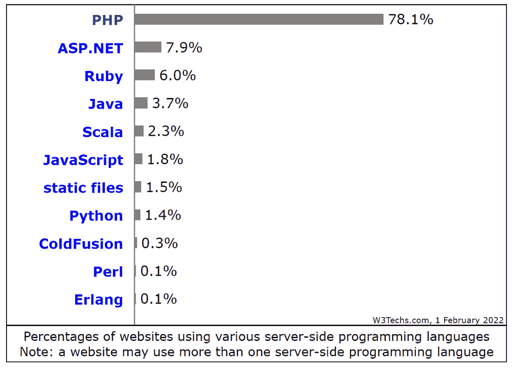

PHP sits at the very top of server-side programming languages.


如果你觉得那是死的，我们想知道什么是活的！甚至当[与 JavaScript](https://kinsta.com/blog/php-vs-javascript/) 及其新的服务器端实现相比时，PHP 在它面前依然傲视群雄。

然而，PHP 社区有一个大问题。许多网站仍在使用过时的版本和不受支持的 [PHP 安装](https://kinsta.com/blog/install-php/)。[根据 W3Techs](https://w3techs.com/technologies/details/pl-php) ， **29.9%** 的网站还在 PHP 5.6 及以下。

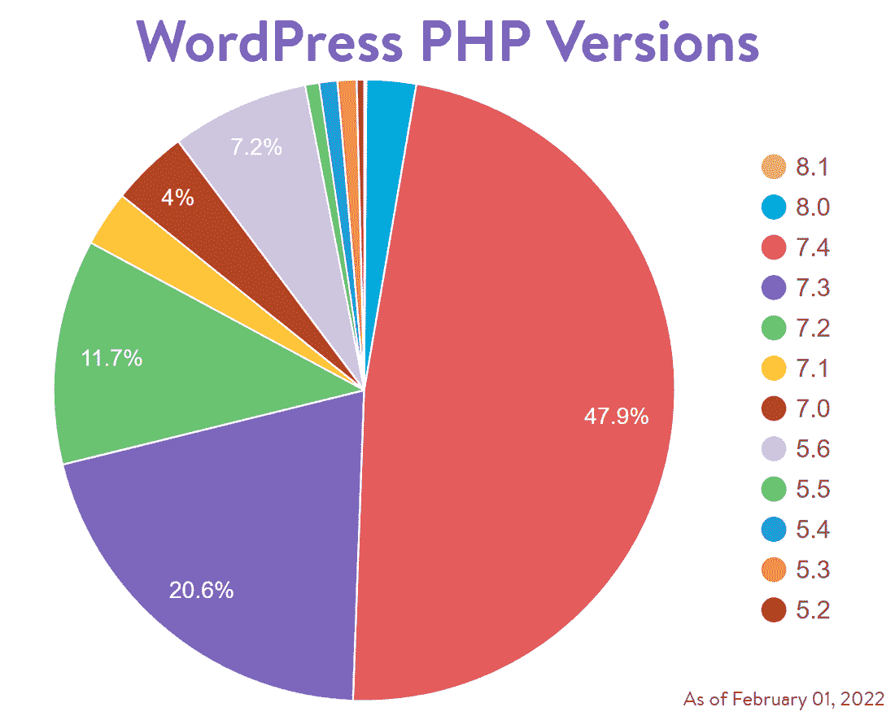

WordPress PHP versions (as of February 01, 2022).


说到 [WordPress 统计](https://wordpress.org/about/stats/)，只有 **50.6%** 的网站运行在[支持的 PHP 版本](https://www.php.net/supported-versions.php)上。更糟糕的是，所有 WordPress 网站中有 **10.2%** 运行在 PHP 5.6 或更低版本上。它比整个 PHP 社区要好，但是许多网站的后门都是敞开的。

我们认为这个难题有很多原因:

*   WordPress 社区缺乏关于 PHP 及其在 WordPress 中的关键作用的教育。
*   在较新的 PHP 版本(尤其是 PHP 8.0 及以上)上运行的插件和主题的兼容性问题。
*   WordPress 主机提供商不愿意推出新的 PHP 版本，因为害怕给他们的客户带来问题。

Kinsta 遵循与 PHP 相同的[寿命终止(EOL)时间表](https://www.php.net/supported-versions.php)来解决这个令人困扰的问题。它有助于让我们托管的所有 WordPress 网站尽可能的快速和安全。

Kinsta 的客户与一般的 WordPress 社区相比如何？我们自己也很好奇，就看了一下数字。

以下是概要:

*   Kinsta 有 62.22% 的 WordPress 网站运行的是 PHP 7.4。
*   Kinsta 的 WordPress 网站中有 27.27% 在运行 PHP 8.0。
*   Kinsta 有 10.51% 的 WordPress 网站运行的是 PHP 8.1

**截至 2022 年 12 月 1 日*。

我们为这些数据感到骄傲和兴奋。这意味着 Kinsta 客户中 PHP 的采用率远高于一般的 WordPress 和 PHP 社区。这让我们非常高兴！

**注:** PHP 8.0 带来了很多突破性的变化，所以很多用户还没有转向它。然而，我们预计更多的网站将很快转向它。

如果你想[学习 PHP](https://kinsta.com/blog/best-programming-language-to-learn/#php) ，我们已经整理了一些优秀的 [PHP 教程](https://kinsta.com/blog/php-tutorials/)(免费和付费)。


## PHP 基准测试(2022)

尽管 PHP 7.2、7.3 和 7.4 [没有得到积极的支持](https://kinsta.com/blog/php-versions/)，但是许多网站仍然在它们上面运行。因此，我们决定测试五个不同的 PHP 版本，这样您就可以看到新的 PHP 版本在性能方面是多么令人印象深刻。

今年的热门当然是新发布的 PHP 8.1。这是 PHP 世界中最新也是最激动人心的发展，这是有原因的。并非所有基于 PHP 的框架和 [CMS](https://kinsta.com/blog/cms-software/) 都完全支持它，但是我们已经对尽可能多的框架和 CMS 进行了测试。

我们在每次测试中使用了每个平台的最新版本，并针对**的 1000 个请求**用 **15 个并发用户**对其中一个 URL 进行了基准测试。我们进行了多次基准测试，以确保结果一致。此外，我们只考虑了前 3 个结果的平均值。

您可以在下面找到我们测试环境的详细信息:

*   **机器:**英特尔至强(30 核 CPU)，120GB 内存，1TB 硬盘。这是一个由谷歌云平台驱动的[计算优化(C2)](https://kinsta.com/blog/boosting-wordpress-performance/) 虚拟机，运行在一个隔离的容器中。所有金斯塔托管计划有 C2 机器可用。
*   **OS:** Ubuntu 20.04.1 LTS(焦点窝)
*   **Web 服务器:**[Nginx](https://kinsta.com/knowledgebase/what-is-nginx/)1 . 21 . 6(Nginx/1 . 21 . 6)
*   **数据库:** [玛利亚 DB](https://kinsta.com/blog/mariadb-vs-mysql/) 10.6.7(玛利亚 db-1:10 . 6 . 7+玛利亚~焦点)
*   PHP 版本: 7.2，7.3，7.4，8.0，8.1
*   **页面缓存:**在所有平台和配置上禁用。
*   **OPcache:** 使用[推荐的 php.ini 设置](https://www.php.net/manual/en/opcache.installation.php)在所有平台和配置上启用 OPcache，除了我们从 **4000** 提高到 **50000** 的`**opcache.max_accelerated_files**`值。使用的 OPcache 设置有:

```
opcache.memory_consumption=128
opcache.interned_strings_buffer=8
opcache.max_accelerated_files=50000
opcache.revalidate_freq=2
opcache.fast_shutdown=1
opcache.enable_cli=1
```

由于 [OPcache](https://www.php.net/manual/en/intro.opcache.php) 通过将预编译的脚本字节码存储在服务器的共享内存中提高了 PHP 的性能，它消除了 PHP 为每个请求加载和解析脚本的需要。

### 测试 PHP 平台和配置

我们的基准测试包括以下 14 个 PHP 平台/配置。点击下面的任何一项，直接跳到测试结果和注释。我们以每秒的**个请求来度量数据。要求越多越好。**

 由于每个平台上的演示内容可能会有很大差异，我们测试了它们的准系统安装的原始性能。这里的目标是对各种 PHP 版本进行基准测试 CMSs 和框架只是作为一种工具。您不应该使用这些基准测试结果来衡量一个平台与另一个平台的优劣，而应该衡量它在不同 PHP 版本上的竞争情况。

我们还包括了它们的大小和截图，让你对测试的页面有更好的了解。有些很小，有些很大。

事不宜迟，我们开始吧！

## RC2

WordPress 是我们测试的第一个平台。毕竟，它为你正在阅读的博客和互联网上 43.3%的网站[提供动力。这是一个免费的开源软件，你可以用它来创建漂亮的网站、博客和应用程序。](https://kinsta.com/wordpress-market-share/)


我们从 WordPress 5.9-RC2(Release Candidate 2)开始，这是本文基准测试的最新版本。它带有新安装的 222 主题。我们用 **15 个并发用户**对 **1000 个请求**的 URL 进行了基准测试。所有其他测试都使用了相同的方法。

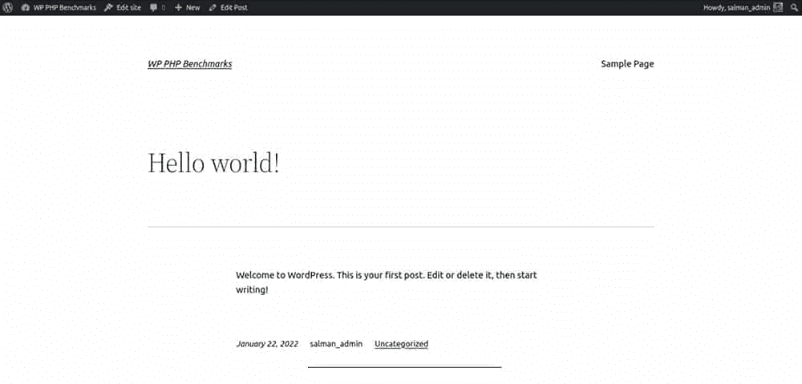

The tested WordPress page.


**被测网址:** `**/hello-world/**`

*   **主题:**二十二十二
*   **注意:**博客页面包括一个带有文本徽标的页眉、导航菜单、文章正文、一条评论和页脚小部件，如搜索、最近的帖子和最近的评论。
*   **图片来源:**【WordPress.org T2】


### 信息

基准数据以每秒请求数来衡量。要求越多越好。


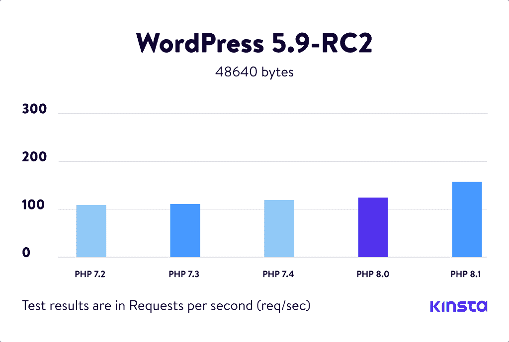

WordPress 5.9-RC2 PHP Benchmarks.


### 基准测试结果

*   WordPress 5.9-RC2 PHP 7.2 基准测试结果:106.56 请求/秒
*   WordPress 5.9-RC2 PHP 7.3 基准测试结果:108.45 请求/秒
*   WordPress 5.9-RC2 PHP 7.4 基准测试结果:110.24 请求/秒
*   WordPress 5.9-RC2 PHP 8.0 基准测试结果:111.10 请求/秒
*   WordPress 5.9-RC2 PHP 8.1 基准测试结果:163.43 请求/秒🏆

PHP 8.1 显然是赢家，证明了比 PHP 8.0 快 47.10%。考虑到所有其他结果是如此接近，这是一个令人惊讶的突出。如果你将它与 PHP 7.2 相比，它每秒可以处理超过 50% 的**请求(或事务)。**


### 重要的

PHP 8.1 在更广泛的 WordPress 生态系统中的支持状态(插件、主题、开发工具等)。)几乎不可能知道。如果你计划将一个生产或关键任务站点的环境升级到 PHP 8.1，请[预先彻底测试](https://kinsta.com/help/staging-environment/)以确保它不会崩溃。


[WordPress on PHP 8.1 can handle 47.10% more requests per second than PHP 8.0\. Make sure you update today! 🤘🏽🚀Click to Tweet](https://twitter.com/intent/tweet?url=https%3A%2F%2Fbit.ly%2F2GeGKx1&via=kinsta&text=WordPress+on+PHP+8.1+can+handle+47.10%25+more+requests+per+second+than+PHP+8.0.+Make+sure+you+update+today%21+%F0%9F%A4%98%F0%9F%8F%BD%F0%9F%9A%80&hashtags=wordpress%2Cwebperf)

## RC2 + WooCommerce

WooCommerce 是一个为 WordPress 开发的[开源电子商务](https://kinsta.com/blog/open-source-ecommerce/)解决方案。与其他流行的电子商务平台不同，它是完全可定制和可扩展的。WooCommerce 也是 WordPress 社区中[最受欢迎的电子商务插件](https://kinsta.com/blog/woocommerce-vs-easy-digital-downloads/)之一，为互联网上 14%的电子商务网站提供支持。


对于我们的下一个测试，我们在 WordPress 上安装了 WooCommerce。我们使用免费的[店面主题](https://woocommerce.com/storefront/)和 WooCommerce 的默认数据来设置测试站点。测试的 URL 是单个产品页面。

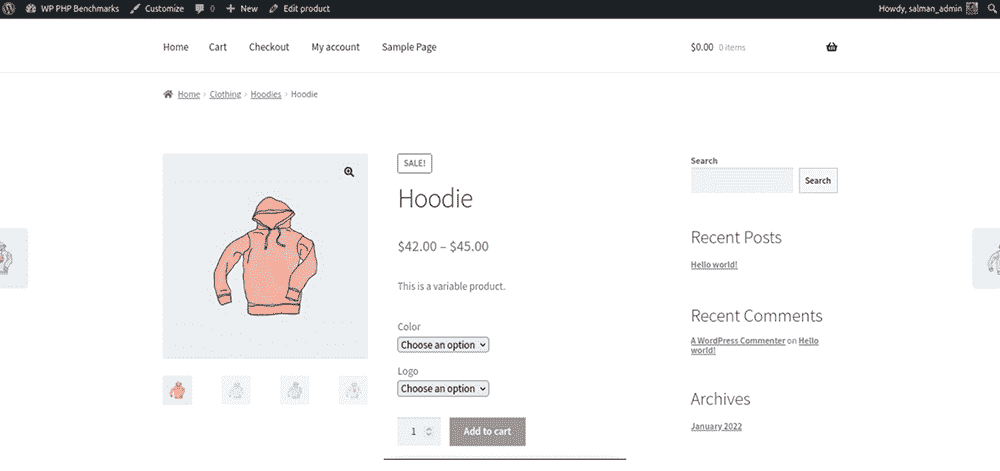

The tested WooCommerce page.


*   **测试的网址:** `**/product/hoodie/**`
*   **主题:**店面 3.9.1
*   **注意:**单个产品页面包括一个带有徽标的标题、标语、导航菜单、搜索小部件和购物车。主体有一个产品，包括图像、描述、添加到购物车按钮、评论和多个侧栏小部件。底部是包含三种产品的相关产品小部件。它还包括一个展示更多产品的侧面拉出部件。
*   **图片来源:** [WordPress 插件库](https://wordpress.org/plugins/woocommerce/)

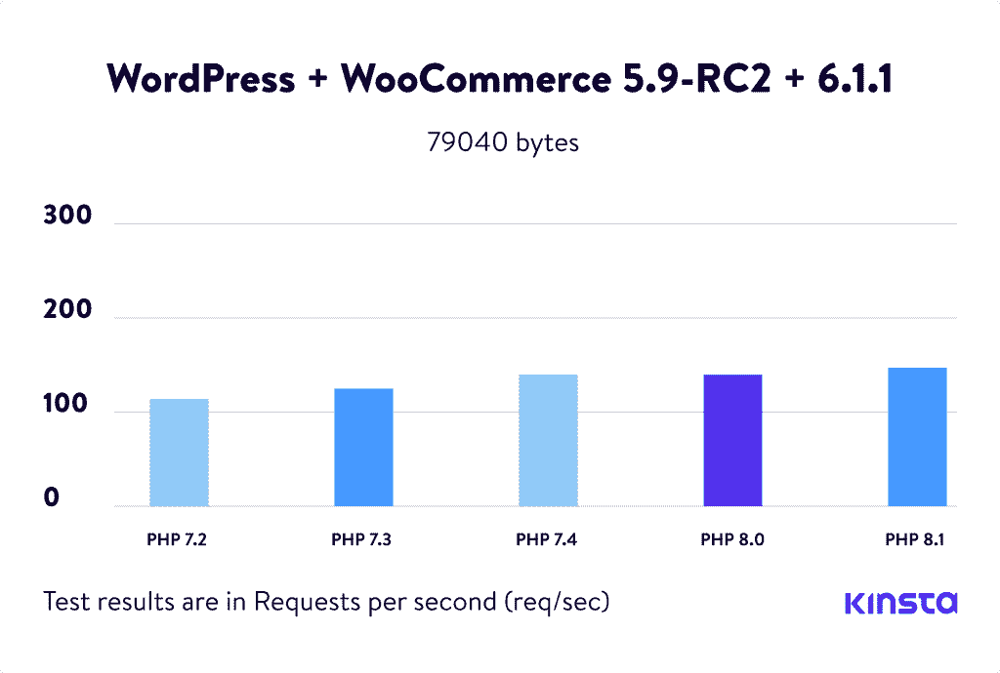

WordPress 5.9-RC2 + WooCommerce 6.1.1 PHP Benchmarks.


### 基准测试结果

*   WordPress 5.9-RC2+woo commerce 6 . 1 . 1 PHP 7.2 基准测试结果:130.73 请求/秒
*   WordPress 5.9-RC2+woo commerce 6 . 1 . 1 PHP 7.3 基准测试结果:137.52 请求/秒
*   WordPress 5.9-RC2+woo commerce 6 . 1 . 1 PHP 7.4 基准测试结果:141.48 请求/秒
*   WordPress 5.9-RC2+woo commerce 6 . 1 . 1 PHP 8.0 基准测试结果:141.71 请求/秒
*   RC2 + WooCommerce 6.1.1 PHP 8.1 基准测试结果:147.67 请求/秒🏆

PHP 8.1 也是 WooCommerce 的明显赢家。它以微弱优势击败了 PHP 8.0。

[Your WooCommerce store running on PHP 7.2 is 11.47% slower than your competitor's store on PHP 8.1! Make sure you upgrade ASAP! 🛒🚀Click to Tweet](https://twitter.com/intent/tweet?url=https%3A%2F%2Fbit.ly%2F2GeGKx1&via=kinsta&text=Your+WooCommerce+store+running+on+PHP+7.2+is+11.47%25+slower+than+your+competitor%27s+store+on+PHP+8.1%21+Make+sure+you+upgrade+ASAP%21+%F0%9F%9B%92%F0%9F%9A%80&hashtags=wordpress%2Cwebperf)

## 2.11.4.1 RC2+简易数字下载

轻松数字下载是 WordPress 的免费电子商务插件。由 [Pippin 的插件](https://pippinsplugins.com/)(现在归 Awesome Motive 所有)创建，它完全专注于帮助你销售数字产品(例如电子书、软件、视频游戏)。


为了方便数字下载，我们使用了免费的主题和默认内容来建立测试网站。测试的页面是单一产品页面。

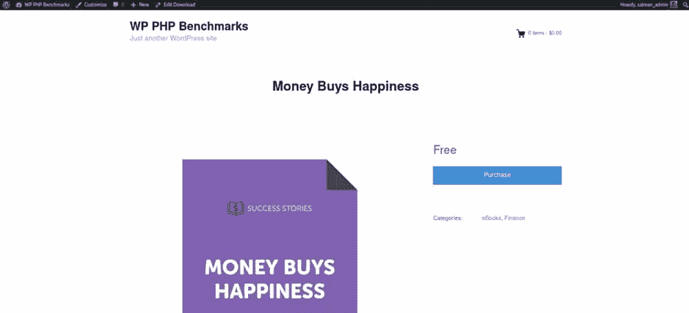

The tested Easy Digital Downloads page.


*   **测试的网址:** `**/downloads/money-buys-happiness/**`
*   主题:主题
*   **注意:**EDD 的单个产品页面是轻量级的，包含图片、描述、购买按钮和一些类别链接。页眉有徽标、标语和购物车，而页脚有基本的版权文本。
*   **图片来源:** [轻松数码下载官方网站](https://easydigitaldownloads.com/getting-started/)

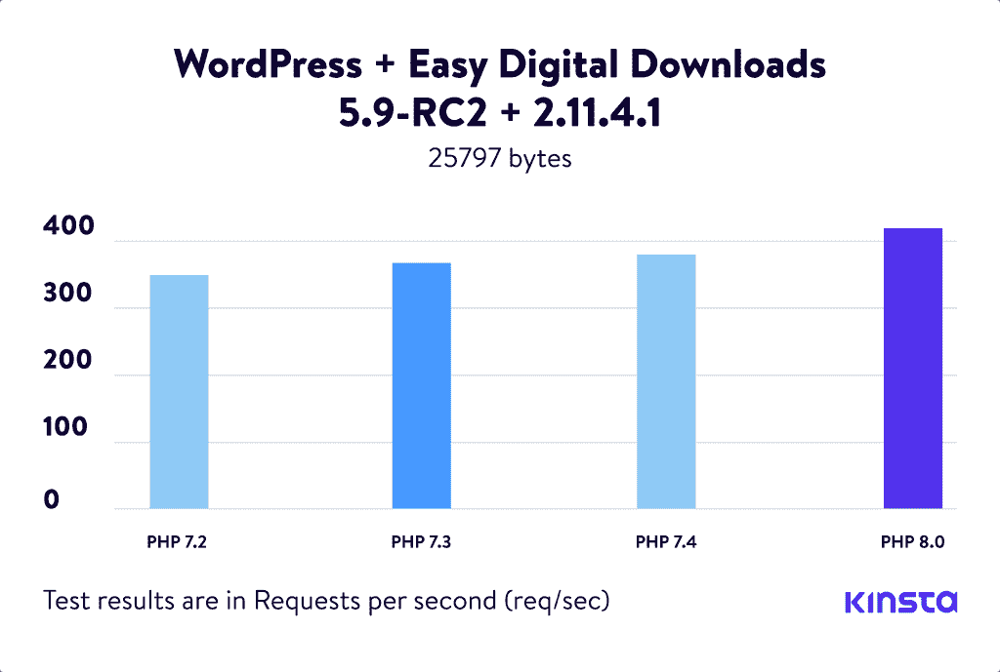

WordPress 5.9-RC2 + Easy Digital Downloads 2.11.4.1 PHP Benchmarks.


### 基准测试结果

*   2.11.4.1 PHP 7.2 基准测试结果:352.87 请求/秒
*   2.11.4.1 PHP 7.3 基准测试结果:382.17 请求/秒
*   2.11.4.1 PHP 7.4 基准测试结果:392.07 请求/秒
*   **2.11.4.1 PHP 8.0 基准测试结果:407.59 请求/秒**🏆
*   2.11.4.1 PHP 8.1 基准测试结果:不支持🚫

在基准测试时，最新的 EDD 版本还不支持 PHP 8.1。像前一年的基准测试一样，PHP 8.0 凭借 WordPress 和简单的数字下载使所有其他 PHP 版本一枝独秀。


### 信息

事实证明，PHP 8.0 和 8.1 在 WordPress、WooCommerce 和简单的数字下载方面速度更快。如果你正在使用 WordPress 运行你的任何网站，你应该计划尽快转移到 PHP 8.0 及以上版本。


## Drupal 9.3

Drupal 是一个免费的开源内容管理软件。它因其灵活和模块化的特性而广受欢迎。[根据 W3Techs](https://w3techs.com/technologies/overview/content_management) 的数据，1.3%的网站使用 Drupal，其中包括 2.0%使用[内容管理系统](https://kinsta.com/knowledgebase/content-management-system/)的网站。


我们用它的[鲜味安装配置文件](https://www.drupal.org/docs/umami-drupal-demonstration-installation-profile)安装了 Drupal，这是一个演示食品杂志网站，展示了 Drupal 的核心特性。


The tested Drupal page.


*   **测试的网址:** `**/en/articles/dairy-free-and-delicious-milk-chocolate/**`
*   **主题:**鲜味美食杂志
*   **注意:**测试页面是一篇文章，包括许多功能，如搜索部件、语言转换器部件、登录模块、面包屑、特色文章侧栏部件、食谱收藏部件、注册表单。
*   **图片来源:**【Drupal.org T2】

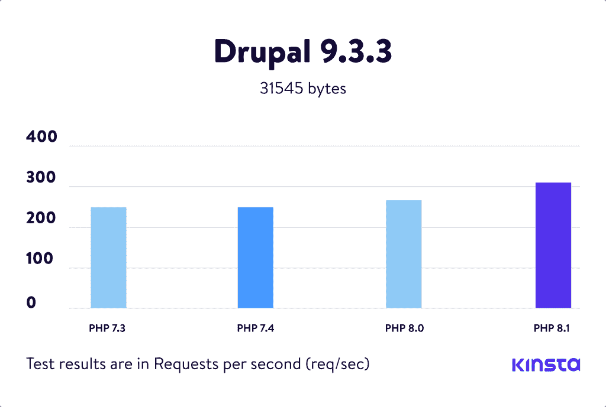

Drupal 9.3.3 PHP Benchmarks.


### 基准测试结果

*   Drupal 9.3.3 PHP 7.2 基准测试结果:不支持🚫
*   Drupal 9.3.3 PHP 7.3 基准测试结果:267.62 请求/秒
*   Drupal 9.3.3 PHP 7.4 基准测试结果:268.84 请求/秒
*   Drupal 9.3.3 PHP 8.0 基准测试结果:289.04 请求/秒
*   **Drupal 9.3.3 PHP 8.1 基准测试结果:302.27 req/sec🏆**

自从我们上次对 Drupal 9.x.x 进行基准测试以来，它已经取得了很大的进步。它不仅与较新的 PHP 版本兼容，而且性能非常好。我们很高兴看到它如何向前发展！

## 珠姆拉。4.0.6

[Joomla！](https://kinsta.com/blog/joomla-vs-wordpress/)是另一个免费开源的内容管理系统。它于 2005 年首次发布，是当今第二大流行的开源 CMS。据 W3Techs 报道，Joomla！被[追踪的所有网站中的 1.7%使用。](https://w3techs.com/technologies/details/cm-joomla)


为了 Joomla！基准测试，我们使用了所有 Joomla 附带的免费仙后座模板！4.x 发行版。


The tested Joomla page.


*   **测试网址:** `**/**`(首页)
*   **主题:**仙后座
*   **备注:** Joomla！与“默认英语(GB)示例数据”一起安装，这为站点添加了重要内容。主页包含几段内容、一个搜索小部件和边栏上的其他基本小部件，如登录表单、流行标签和最新文章。
*   **图片来源:**【Joomla.org T2】

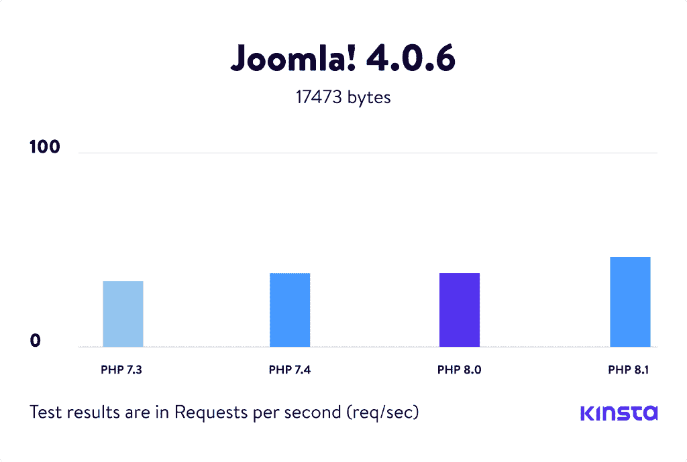

Joomla! 4.0.6 PHP Benchmarks.


### 基准测试结果

*   珠姆拉。4.0.6 PHP 7.2 基准测试结果:38.18 请求/秒
*   珠姆拉。4.0.6 PHP 7.3 基准测试结果:39.41 请求/秒
*   珠姆拉。4.0.6 PHP 7.4 基准测试结果:39.57 请求/秒
*   珠拉。4.0.6 PHP 8.0 基准测试结果:39.84 请求/秒
*   **Joomla！4.0.6 PHP 8.1 基准测试结果:41.97 请求/秒**🏆

在[有些打嗝](https://forum.joomla.org/viewtopic.php?f=803&t=977128)之后，Joomla！已经回到正轨。结果遵循一个预期的模式——PHP 8.1 是无可争议的冠军，紧随其后的是 PHP 8.0，然后是其他。

## 重力 1.7.29

Grav 是一个开源的平面文件 CMS。它不需要数据库来操作，但是它有丰富的特性。Grav 从文本文件中查询内容。这使得它重量轻，易于安装在几乎任何服务器上。


在执行这个测试时，Grav 需要 PHP 7.3 和更高版本才能工作。我们使用了为测试提供默认登录页面的基础 Grav 包。

## 注册订阅时事通讯


### 想知道我们是怎么让流量增长超过 1000%的吗？

加入 20，000 多名获得我们每周时事通讯和内部消息的人的行列吧！

[Subscribe Now](#newsletter)

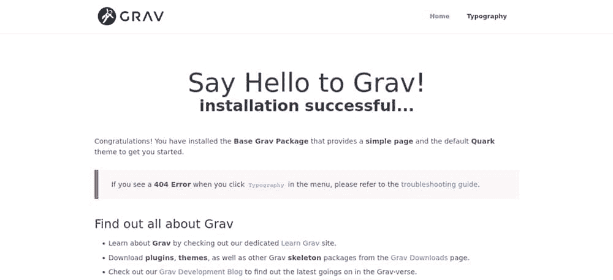

The tested Grav page.


*   **测试网址:** `**/**`(首页)
*   **主题:**夸克
*   **注意:**测试页面是一个简单的页面，有很多内容，包括页眉、徽标、导航菜单和页脚。 [Grav 核心缓存](https://learn.getgrav.org/17/advanced/performance-and-caching)已经被禁用来测试 PHP 的原始性能。
*   **图片来源:** [Grav 官方网站](https://getgrav.org/)

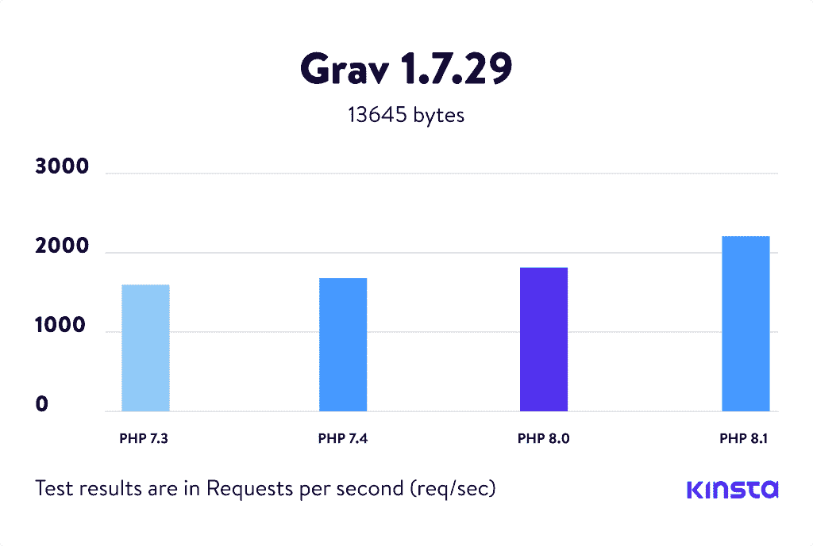

Grav 1.7.29 PHP Benchmarks.


### 基准测试结果

*   Grav 1.7.29 PHP 7.2 基准测试结果:不支持🚫
*   Grav 1.7.29 PHP 7.3 基准测试结果:1800.07 请求/秒
*   Grav 1.7.29 PHP 7.4 基准测试结果:1848.02 请求/秒
*   Grav 1.7.29 PHP 8.0 基准测试结果:1931.72 请求/秒
*   Grav 1.7.29 PHP 8.1 基准测试结果:2137.43 请求/秒🏆

PHP 8.1 是 Grav 无可争议的赢家，紧随其后的是 PHP 8.0 和其他版本。

作为一个相对较新的内容管理系统，它的市场份额比 WordPress 小。因此，它可以很快放弃对旧版本 PHP 的支持。这是现代 CMS 最显著的优势之一。

## 10 月 1 日

[OctoberCMS](https://octobercms.com/) 是一个基于 Laravel PHP 框架的 CMS。OctoberCMS 最初是免费和开源的，在[于 2021 年改变其许可模式](https://octobercms.com/blog/post/october-cms-moves-become-paid-platform)后，现在是一个付费平台。利用 Laravel 的力量制作动态网站在开发人员中很流行。[根据 W3Techs](https://w3techs.com/technologies/details/cm-octobercms) 的数据，OctoberCMS 只占网站的 **0.1%** 。


我们为测试站点使用了 OctoberCMS 的默认演示主题。这是一个具有明确布局的响应主题。

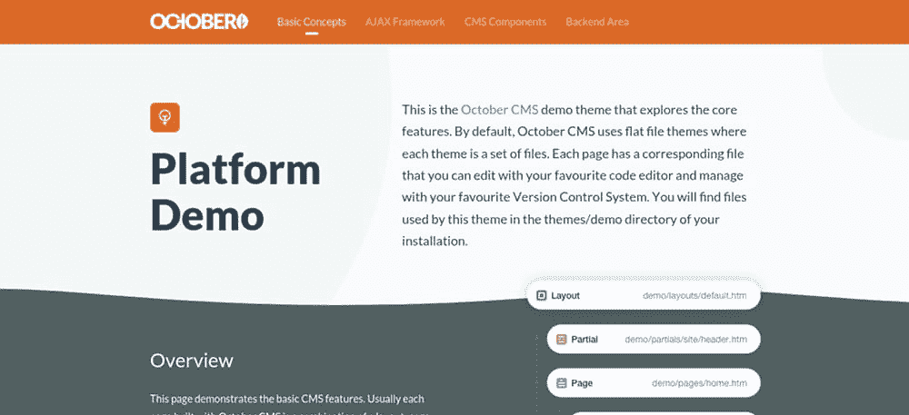

The tested OctoberCMS page.


*   **测试的网址:** `**/**`
*   **主题:**演示主题
*   **注意:**测试的页面有很多元素，包括 Logo、导航菜单、文本部分、代码嵌入等。我们遵循了关于[提高性能](https://docs.octobercms.com/2.x/setup/deployment.html#improving-performance)的文档，以确保它尽可能高效地运行。在撰写本文时，OctoberCMS [需要 PHP 7.2+](https://octobercms.com/docs/setup/installation) 才能运行，还不支持 PHP 8.1。
*   **图片来源:** [OctoberCMS 官方网站](http://octobercms.com/download)

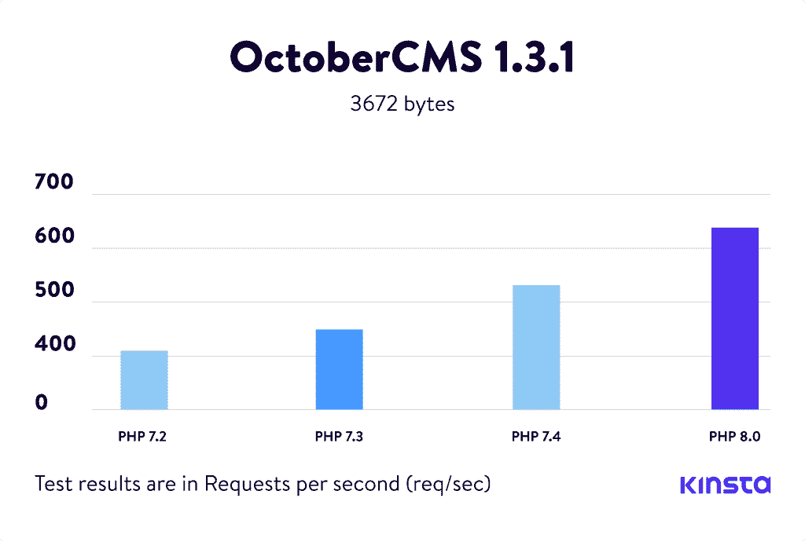

OctoberCMS 1.3.1 PHP Benchmarks.


### 基准测试结果

*   10 月 CMS 1.3.1 PHP 7.2 基准测试结果:417.13 请求/秒
*   10 月 CMS 1.3.1 PHP 7.3 基准测试结果:458.63 请求/秒
*   10 月 CMS 1.3.1 PHP 7.4 基准测试结果:532.65 请求/秒
*   **OctoberCMS 1.3.1 PHP 8.0 基准测试结果:640.08 请求/秒🏆**
*   OctoberCMS 1.3.1 PHP 8.1 基准测试结果:不支持🚫

PHP 8.0 显然是这里的赢家。OctoberCMS 在 PHP 8.0 上每秒处理的请求比在 PHP 7.4 上多 20.16% 。我们渴望看到它的下一个主要更新在 PHP 8.1 上的表现。

## Laravel 8.80.0

Laravel 是目前最流行的 [PHP 框架](https://kinsta.com/blog/php-frameworks/)。由泰勒·奥特威尔创作，于 2011 年 6 月发行。您可以使用 Laravel 开发几乎任何 web 应用程序，包括 CMS、电子商务网站、应用程序等等。


我们使用默认的 Laravel 登录页面对 Laravel 进行基准测试。

正如 Laravel 创始人 [Taylor Otwell 在](https://medium.com/@taylorotwell/benchmarking-laravel-symfony-zend-2c01c2b270f8)之前指出的，你不应该用这些基准测试结果来比较 Laravel 和其他 PHP 框架。这里的目标是看看当一切都不变时，Laravel 在不同 PHP 版本上的表现如何。

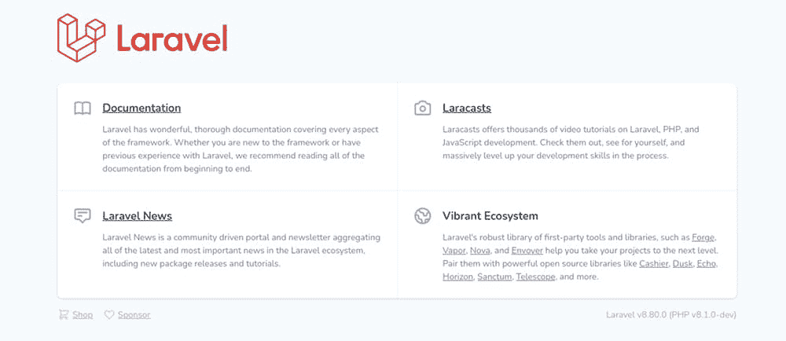

The tested Laravel page.


*   **被测网址:** `**/**` (主页)
*   主题:普通 HTML
*   **注意:**被测试的页面有很多必不可少的 HTML 元素。虽然它不是一个成熟的 web 应用程序，但它的目标是对 PHP 而不是 Laravel 进行基准测试。
*   **图片来源:** [Laravel 官方知识库](https://laravel.com/)

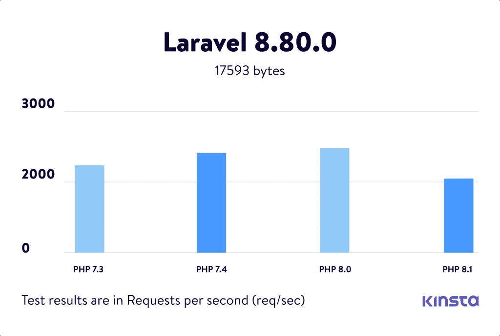

Laravel 8.80.0 PHP Benchmarks.


### 基准测试结果

*   Laravel 8.80.0 PHP 7.2 基准测试结果:不支持🚫
*   Laravel 8.80.0 PHP 7.3 基准测试结果:2278.86 请求/秒
*   Laravel 8.80.0 PHP 7.4 基准测试结果:2303.23 请求/秒
*   Laravel 8.80.0 PHP 8.0 基准测试结果:2376.40 请求/秒🏆
*   Laravel 8.80.0 PHP 8.1 基准测试结果:2002.94 请求/秒

很高兴看到 Laravel 支持最新的 PHP 版本。PHP 8.0 和 Laravel 是毫无争议的冠军，而 PHP 8.1 排在最后。这里还有改进的余地。也许刚刚发布的 Laravel 9 可能会产生有趣的结果，但那是我们下一个基准测试的结果。

## 5.4.2 号交响曲

[Symfony](https://symfony.com/) 是一套可重用的 PHP 组件和 PHP 框架，用于构建 web 应用、API、微服务和 web 服务。这是一个免费的开源软件，于 2005 年 10 月 22 日发布。


虽然 Symfony 已经发布了 6.x 版本，但它只支持 PHP 8.0 及以上版本。因此，我们决定使用它最新的 5.4.2 版本来测试 PHP。

你可以用一个[演示应用](https://github.com/symfony/demo)来安装 Symfony。这是一个参考 CMS 应用程序，演示了如何最好地使用 Symfony 及其各种功能。我们使用这个演示应用程序的主页来测试 Symfony。

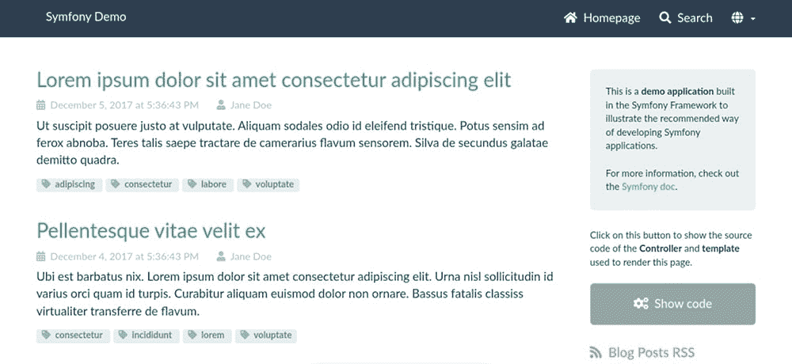

The tested Symfony page.


*   **测试网址:** `**/**`(首页)
*   主题: Symfony 演示
*   **注意:**测试的页面包含一个带有 Logo 的页眉，主页链接，搜索小部件，语言转换器小部件，以及有很多帖子的 blogroll。还有一个侧边栏，上面有小文本框、“显示代码”和“博客帖子 RSS”等小部件。
*   **图片来源:** [Symfony 官方知识库](https://github.com/symfony/demo)

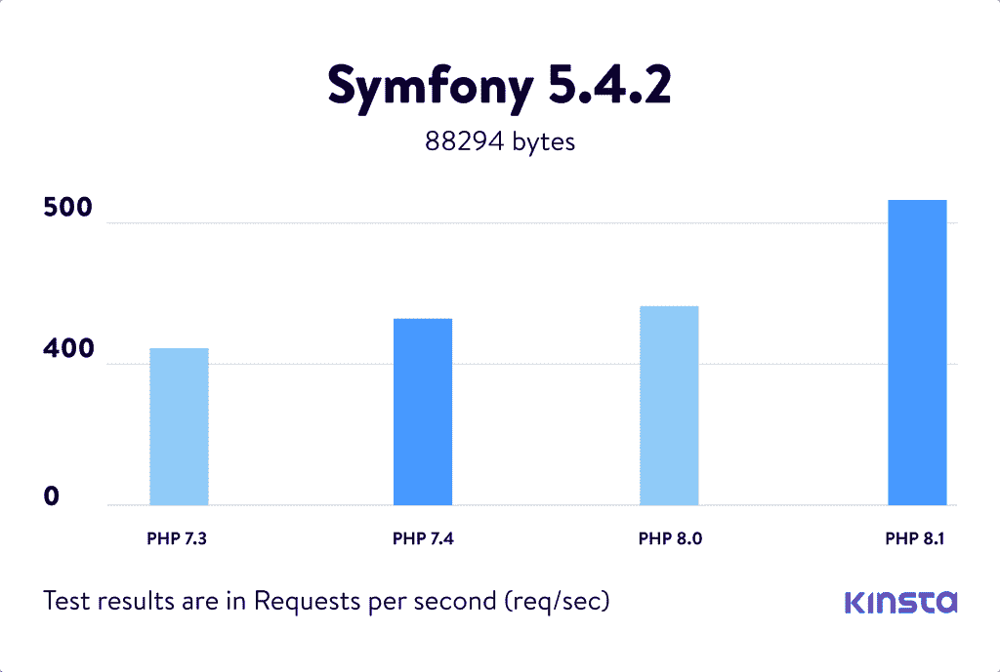

Symfony 5.4.2 PHP Benchmarks.


### 基准测试结果

*   Symfony 5.4.2 PHP 7.2 基准测试结果:不支持🚫
*   Symfony 5.4.2 PHP 7.3 基准测试结果:416.18 请求/秒
*   Symfony 5.4.2 PHP 7.4 基准测试结果:434.95 请求/秒
*   Symfony 5.4.2 PHP 8.0 基准测试结果:443.79 请求秒
*   Symfony 5.4.2 PHP 8.1 基准测试结果:524.78 请求/秒🏆

使用 Symfony，PHP 8.1 和其他版本有很大的不同。例如，Symfony 在 PHP 8.1 上的运行速度比 PHP 7.4 快 20.65%。

厌倦了慢热的主持人？Kinsta 的设计考虑了速度和性能。[查看我们的计划](https://kinsta.com/plans/?in-article-cta)

[Symfony on PHP 8.1 can handle 20.65% more requests per second than PHP 7.4 ⏩⚡Click to Tweet](https://twitter.com/intent/tweet?url=https%3A%2F%2Fbit.ly%2F2GeGKx1&via=kinsta&text=Symfony+on+PHP+8.1+can+handle+20.65%25+more+requests+per+second+than+PHP+7.4+%E2%8F%A9%E2%9A%A1&hashtags=symfony%2Cwebperf)

## 代码点火器 4.1.8

CodeIgniter 是一个占用空间很小的 PHP 框架。例如，它的最新版本是 1.2 兆下载。它由[埃利斯拉普](https://www.ellislab.com/)创造，由[不列颠哥伦比亚理工学院](https://www.bcit.ca/)培养。尽管 CodeIgniter 很大，但您仍然可以使用它来开发功能全面的 web 应用程序。


为了对 CodeIgniter 进行基准测试，我们使用他们的官方教程建立了一个演示应用程序。它使用一个基本的 HTML 主题，并输出许多“新闻”项目。

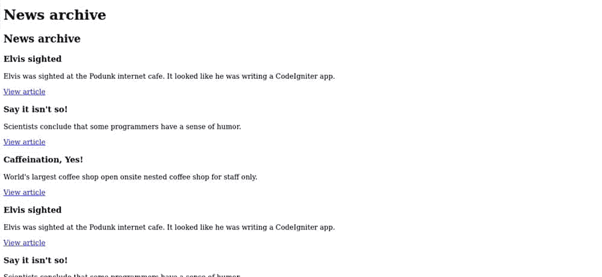

The tested CodeIgniter page.


*   **测试的网址:** `**/news/**`
*   主题:普通 HTML
*   **注意:**被测试的页面包含一个新闻条目列表，包括标题、内容和到主要内容的链接。该数据库包括 1 表“新闻”与 1000 行新闻项目，列- > id，标题，鼻涕虫，身体。该页面连接到数据库，并显示了表上的所有帖子。CodeIgniter 应用程序包含 1 个路由和 1 个控制器来显示这些内容。
*   **图片来源:**[CodeIgniter.com 官方网站](https://www.codeigniter.com/)

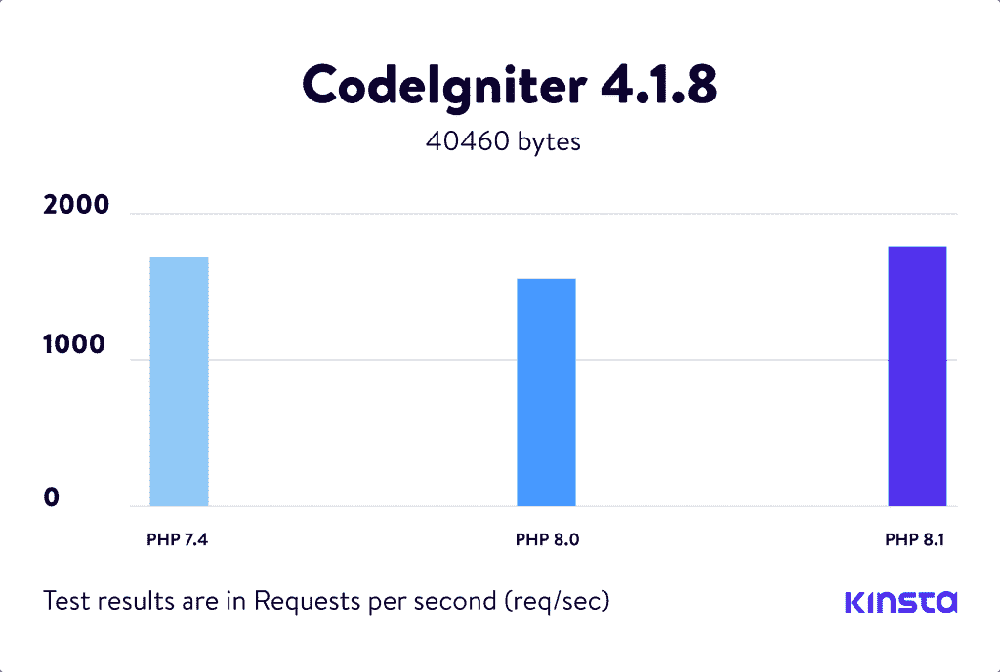

CodeIgniter 4.1.8 PHP Benchmarks.


### 基准测试结果

*   CodeIgniter 4.0.4 PHP 7.2 基准测试结果:不支持🚫
*   CodeIgniter 4.0.4 PHP 7.3 基准测试结果:不支持🚫
*   CodeIgniter 4.0.4 PHP 7.4 基准测试结果:1907.33 请求/秒
*   CodeIgniter 4.0.4 PHP 8.0 基准测试结果:1770.33 请求/秒
*   **CodeIgniter 4.0.4 PHP 8.1 基准测试结果:1920.51 请求/秒🏆**

PHP 8.1 是使用 CodeIgniter 最快的，每秒执行的请求比 PHP 8.0 多 **8.48%** 。然而，令人惊讶的是，发现 PHP 7.4 的性能比 PHP 8.0 好得多——它几乎与 PHP 8.1 不相上下。

## CakePHP 4.3.4

CakePHP 是一个开发 PHP 应用的开源 web 框架。它有望使构建 web 应用程序更简单、更快、代码更少。


为了对 CakePHP 进行基准测试，我们使用了它的默认登录页面。在基准测试之前，我们将它连接到一个数据库。

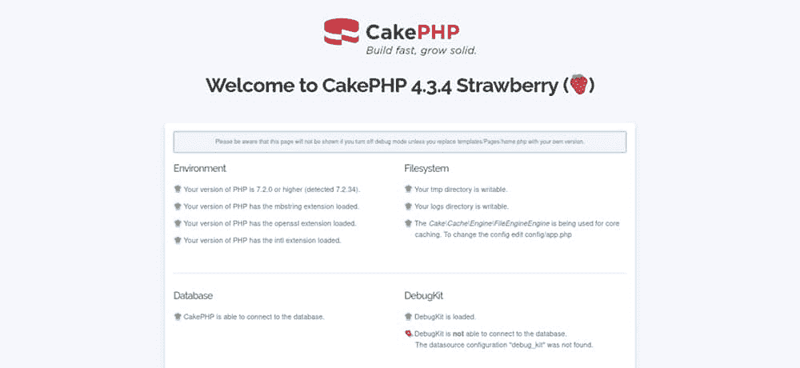

The tested CakePHP page.


*   **测试网址:** `**/**`(首页)
*   主题:普通 HTML
*   **注意:**测试的页面是一个简单的 HTML 登陆页面，有一些样式。它给出了当前 CakePHP 安装的简要信息。
*   **图片来源:** [CakePHP 官方知识库](https://github.com/cakephp/cakephp/releases)

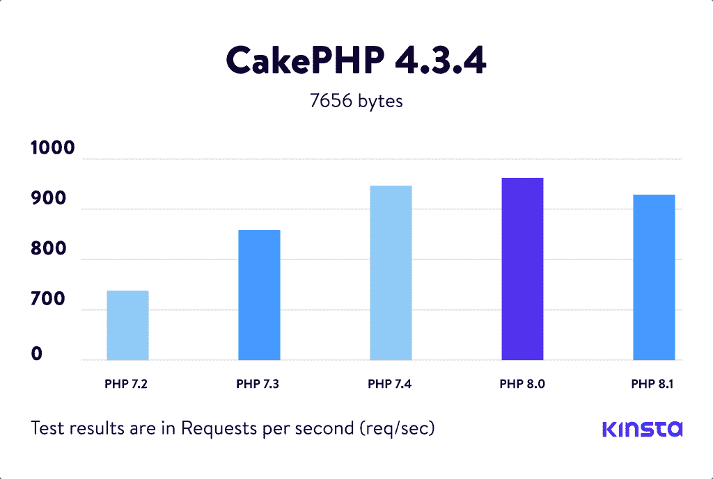

CakePHP 4.3.4 PHP Benchmarks.


### 基准测试结果

*   CakePHP 4.2.2 PHP 7.2 基准测试结果:743.46 请求/秒
*   CakePHP 4.2.2 PHP 7.3 基准测试结果:874.69.28 请求/秒
*   CakePHP 4.2.2 PHP 7.4 基准测试结果:954.30 请求/秒
*   CakePHP 4.2.2 PHP 8.0 基准测试结果:973.02 请求/秒🏆
*   CakePHP 4.2.2 PHP 8.1 基准测试结果:918.21 请求/秒

令人惊讶的是，PHP 8.0 与 CakePHP 旗鼓相当。然而，所有的基准测试结果都非常接近，无法称之为绝对的赢家。PHP 8.1 只比 PHP 8.0 慢 **5.6%** 。CakePHP 4.3.x 的未来更新可能会解决这个问题。

## 工艺 CMS 3.7.30.1

Craft CMS 是一个专注于用户友好的开源内容管理系统。它的后端是完全可定制的。Craft CMS 有一个内置的工具，可以为不同的内容类型设计定制字段布局，这使得使用[定制内容类型](https://kinsta.com/blog/wordpress-custom-post-types/)变得非常简单。

如果你打算创建一个定制的电子商务商店，可以去看看 T2 的手工艺品商店。对于一个[本地开发环境](https://kinsta.com/feature-updates/local-wordpress-development/)来说，也有 [Craft Nitro](https://craftcms.com/blog/craft-nitro) 。


对于 Craft CMS 基准，我们使用其默认的管理员登录页面。这是一个简单的登录页面，包括一个登录表单来访问网站的后端。

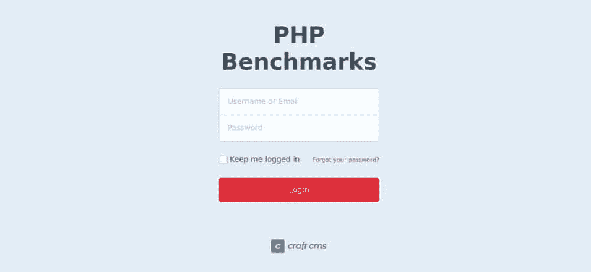

The tested Craft CMS page.


*   **测试的网址:** `**/admin/login/**`
*   **主题:**默认
*   **注意:**测试的页面是一个简单的带有表单的登录页面。
*   **图片来源:** [Craft CMS 官方知识库](https://github.com/craftcms/demo)

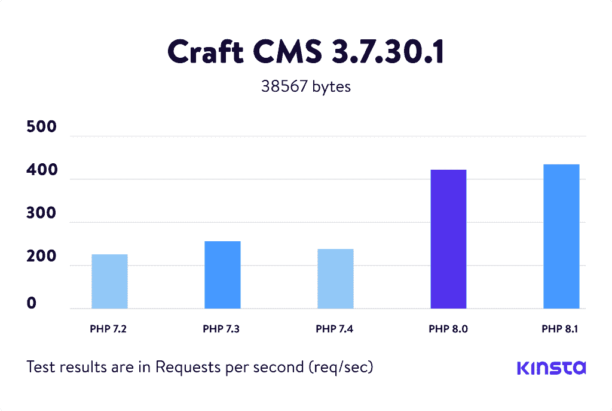

Craft CMS 3.7.30.1 PHP Benchmarks.


### 基准测试结果

*   craft CMS 3.5.17.1 PHP 7.2 基准测试结果:75.32 请求/秒
*   craft CMS 3.5.17.1 PHP 7.3 基准测试结果:74.69 请求/秒
*   craft CMS 3.5.17.1 PHP 7.4 基准测试结果:81.68 请求/秒
*   craft CMS 3.5.17.1 PHP 8.0 基准测试结果:417.21 请求/秒
*   **Craft CMS 3.5.17.1 PHP 8.1 基准测试结果:443.18 请求/秒🏆**

PHP 8.1 凭借 Craft CMS 拔得头筹。与我们之前的基准不同，Craft CMS 现在同时支持 PHP 8.0 和 PHP 8.1——这太棒了！

## 科比·3.6.1.1

Kirby 是一个专注于内容创建和发布的平面文件 CMS。虽然它的源代码是公开的，但它不能在公共服务器上免费使用。您可以使用 Kirby 定制您的表单、文章、图库、电子表格等编辑界面。


您可以用 Starterkit 安装 Kirby，它会建立一个功能齐全的演示站点。我们使用它的[关于我们的页面](https://kinsta.com/blog/about-us-page/)作为基准。


The tested Kirby page.


*   **被测网址:** `**/about/**`
*   主题: Starterkit
*   **注意:**测试页面是一个关于我们的页面，有特色图像、文本、小部件、页眉、导航菜单、社交媒体图标和页脚。
*   **图片来源:** [柯比官网](https://getkirby.com/try)

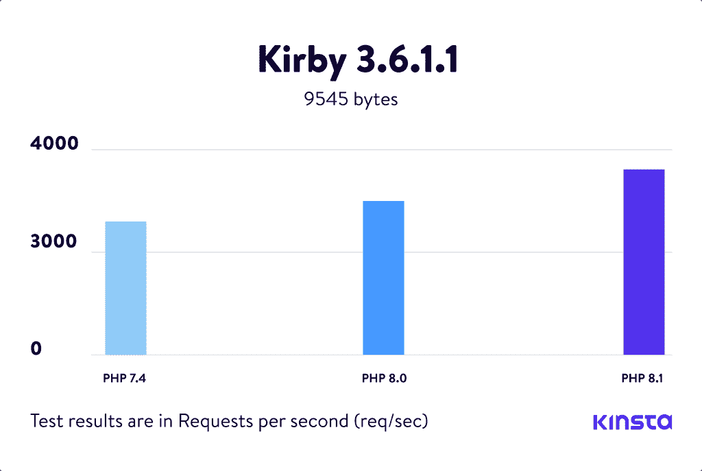

Kirby 3.6.1.1 PHP Benchmarks.


### 基准测试结果

*   科比·3.6.1.1 PHP 7.2 基准测试结果:不支持🚫
*   科比·3.6.1.1 PHP 7.3 基准测试结果:不支持🚫
*   柯比 3.6.1.1 PHP 7.4 基准测试结果:3326.72 请求/秒
*   科比·3.6.1.1 PHP 8.0 基准测试结果:3514.96 请求/秒🏆
*   柯比 3.6.1.1 PHP 8.1 基准测试结果:3922.77 请求/秒🏆

PHP 8.1 在 Kirby 的基准测试中表现出色。值得一提的是，在我们测试的所有 PHP 平台中，Kirby 每秒处理的请求最多。尽管这是一个苹果和橘子的比较，但仍然值得一试。它的主要缺点是不能免费使用。

## Flarum 1.2.0

[Flarum](https://flarum.org/) 是一款免费开源的在线讨论论坛软件。


你可以用一个演示网站来安装 Flarum。我们还添加了三个线程和几段文本。

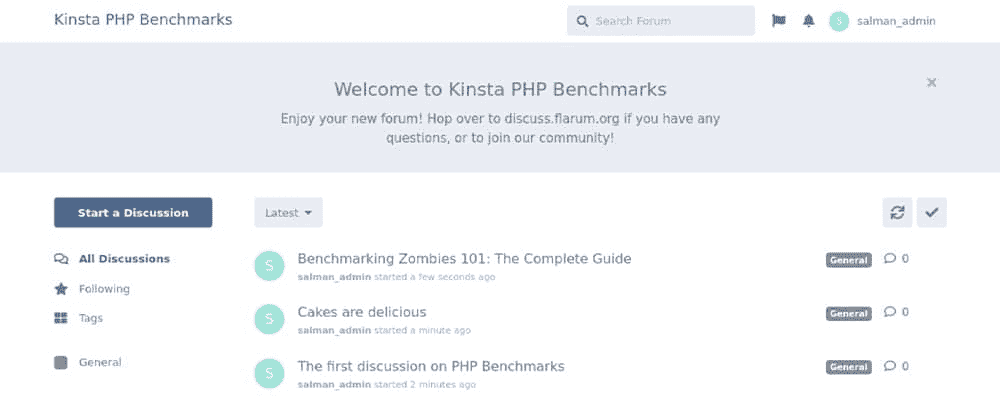

The tested Flarum page.


*   **已测试网址:** `**/**`(首页)
*   **主题:**默认主题
*   **注意:**测试的页面是论坛主页，有一个页眉、一个徽标、搜索小部件、特色文本块、导航菜单、通知图标、侧菜单、讨论线程列表、其他小部件和页脚。最新的 Flarum 版本还不支持 PHP 8.1，所以我们无法进行基准测试。
*   **图片来源:** [Flarum 官网](https://flarum.org/)

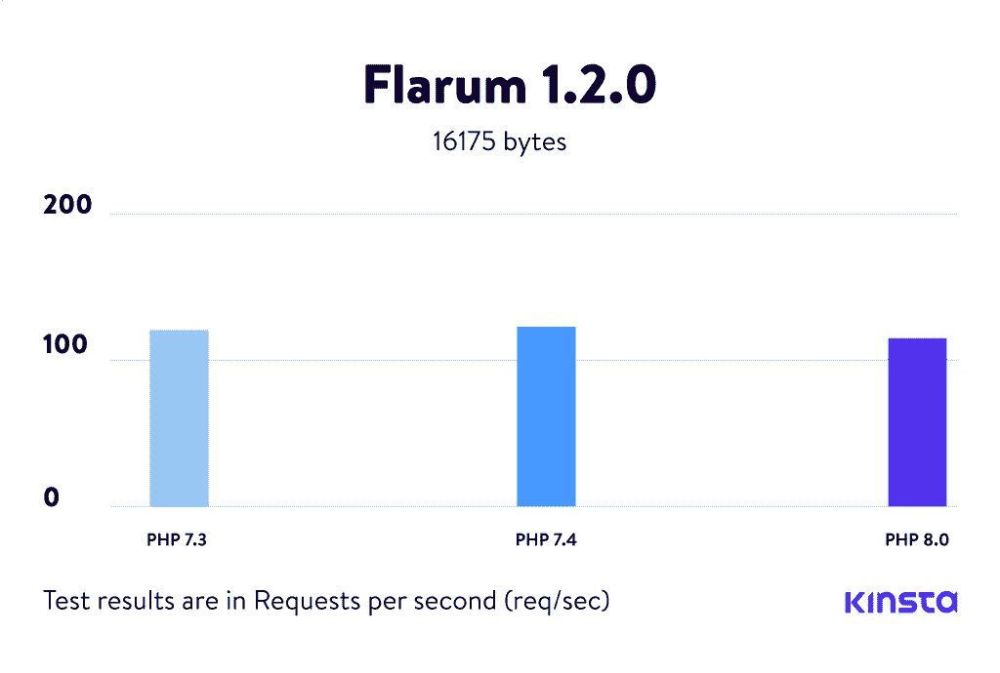

Flarum 1.2.0 PHP Benchmarks.


### 基准测试结果

*   Flarum 1.2.0 PHP 7.2 基准测试结果:不支持🚫
*   Flarum 1.2.0 PHP 7.3 基准测试结果:120.21 请求/秒
*   **Flarum 1.2.0 PHP 7.4 基准测试结果:122.06 请求/秒🏆**
*   Flarum 1.2.0 PHP 8.0 基准测试结果:119.67 请求/秒
*   Flarum 1.2.0 PHP 8.1 基准测试结果:不支持🚫

Flarum 是我们 PHP 基准测试的新成员。由于这是一个流行的 PHP 论坛软件，我们很高兴能测试它，看看它的表现如何。虽然 PHP 7.4 在 Flarum 上表现最好，但在我们进行基准测试的所有其他 PHP 版本上几乎都是一样的。

## 在 Kinsta 更新到 PHP 8.1

PHP 8.1 引入了许多令人兴奋的特性。其中一些是激进的，打破了与以前的 PHP 版本(主要是< PHP 8.0)不兼容的改变。

如果你的网站的所有功能都可以很好地运行，你没有理由不升级到 PHP 8.1。如果以上结果还不能说服你，我们不确定还有什么能说服你！

作为一个友好的提醒，所有的 Kinsta 客户端都可以使用 PHP 8.0、8.1 和我们定制的[自我修复数据库配置](https://kinsta.com/feature-updates/auto-db-optimize/)。


Kinsta supports PHP 8.0 and 8.1.


如果你担心由于与第三方插件不兼容而破坏你的网站(这是可能发生的),我们有[暂存站点](https://kinsta.com/help/staging-environment/)👍

您可以使用我们的临时站点功能进行无休止的测试，而不必担心破坏您的生产站点。一旦你确定一切都运行良好，你就可以按下一个按钮来进行实时修改。

## PHP 基准测试结果总结

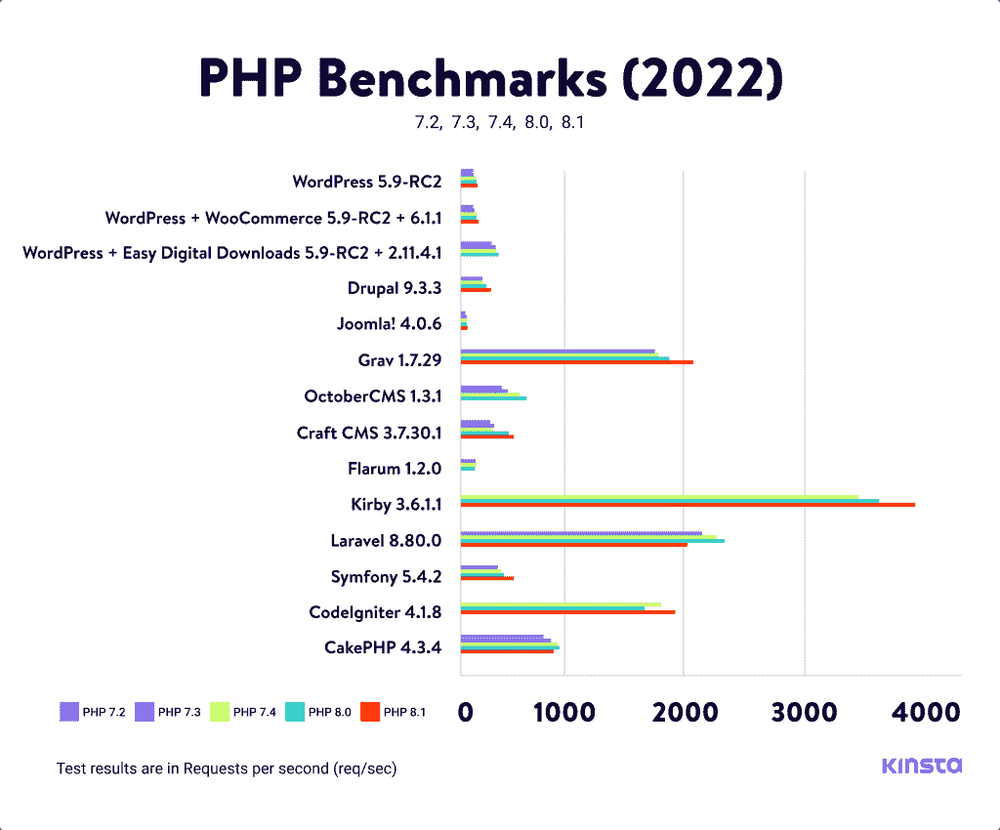

The compiled PHP Benchmarks.


从上面的基准测试结果中，您可以看到 PHP 8.1 在大多数 PHP 平台和配置中领先，紧随其后的是 PHP 8.0。

以下是我们对 2022 年 PHP 基准测试结果的扩展总结:

*   **对于 WordPress，PHP 8.1 是所有基准测试中最快的**(股票 WordPress 5.6 和 WooCommerce)。轻松数字下载还不支持 PHP 8.1，但我们可以期待类似的性能改进。
*   如果你正在使用 WordPress，并且你所有的主题和插件都与 PHP 8.1 兼容，你没有理由不把你的 PHP 版本升级到 PHP 8.1。您将会体会到它带来的性能优势。
*   PHP 8.0 最快的是 Laravel framework，这是构建 web 应用程序最流行的 PHP 框架。在基准测试时，Laravel 9 还没有发布。我们将在下面的基准测试中使用它。
*   如果你使用的任何插件或主题与 PHP 8.0 不兼容，更不用说 PHP 8.1 了，我们建议你联系他们的开发者并告知他们。
*   随着对 PHP 7.4 的支持在 2022 年末即将结束，你应该计划尽快将你的站点迁移到 PHP 8.0 和更高版本。
*   PHP 8.0 预示着 PHP 的新黎明，就像 PHP 5.6 独领风骚时的 PHP 7.0 一样。PHP 8.1 将火炬向前推进了一大步。我们希望以后的 PHP 8.x 版本在性能和安全性方面得到进一步优化。
*   我们没有在启用 JIT 的情况下测试 [PHP 8.x。虽然 PHP 的新 JIT 编译器不会给 WordPress 等真正的应用程序带来任何显著的性能优势，但看看它在实际使用中的表现会很有趣。](https://kinsta.com/blog/php-8/#jit--the-just-in-time-compiler)
*   如果你的主机提供商跟不上新的 PHP 版本，重新考虑一下他们。
*   如前所述，在将你的网络服务器环境升级到 PHP 8.0 和 PHP 8.1 之前，请彻底测试你的网站。
*   除了升级到最新的 PHP 版本之外，WordPress 用户还可以通过其他网络性能增强技术来进一步提高他们网站的速度。我们已经将它们全部编入了关于如何加速你的 WordPress 站点的终极指南中。

这是一次对各种 PHP 平台的基准测试。我们对 PHP 8.1 非常兴奋。我们希望你也是！

如果你对我们升级 PHP 版本的基准或体验有任何想法，我们很乐意倾听。把它们放在评论里吧！

* * *

让你所有的[应用程序](https://kinsta.com/application-hosting/)、[数据库](https://kinsta.com/database-hosting/)和 [WordPress 网站](https://kinsta.com/wordpress-hosting/)在线并在一个屋檐下。我们功能丰富的高性能云平台包括:

*   在 MyKinsta 仪表盘中轻松设置和管理
*   24/7 专家支持
*   最好的谷歌云平台硬件和网络，由 Kubernetes 提供最大的可扩展性
*   面向速度和安全性的企业级 Cloudflare 集成
*   全球受众覆盖全球多达 35 个数据中心和 275 多个 pop

在第一个月使用托管的[应用程序或托管](https://kinsta.com/application-hosting/)的[数据库，您可以享受 20 美元的优惠，亲自测试一下。探索我们的](https://kinsta.com/database-hosting/)[计划](https://kinsta.com/plans/)或[与销售人员交谈](https://kinsta.com/contact-us/)以找到最适合您的方式。