# 2022 年最流行的 PHP 框架

> 原文：<https://kinsta.com/blog/php-frameworks/>

当你想到 web 开发时，除了 HTML、CSS 和 [JavaScript](https://kinsta.com/blog/php-vs-javascript/) ，PHP 语言是想到的名字之一。

与普遍的看法相反， [PHP 并没有死](https://kinsta.com/blog/is-php-dead/)。它仍然被很多网站广泛使用，包括像脸书和维基百科这样的大网站。

根据 W3Techs 的数据，大约 79%的网站使用 PHP。它的受欢迎程度是 ASP.NET(T3)的八倍，后者是它在服务器端编程语言(T5)方面最接近的竞争对手[。](https://kinsta.com/blog/scripting-languages/)

PHP 的使用份额在去年保持稳定。

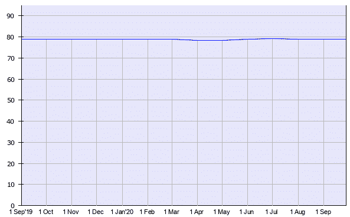

Historical use of PHP

PHP 程序员经常求助于 PHP 框架来编写他们的代码。让我们看看什么是 PHP 框架，为什么使用它们，并研究一些最流行的框架。

## 什么是 PHP 框架？

PHP 框架是一个创建 PHP web 应用程序的平台。PHP 框架提供了常用函数的代码库，减少了您需要编写的原始代码量。

## 为什么要使用 PHP 框架？

使用 PHP 框架有很多好的理由，而不是从零开始编码。

### 1.更快的发展

因为 PHP 框架有内置的库和工具，所以开发所需的时间更少。

例如，CakePHP 框架有 Bake 命令行工具，可以快速创建应用程序中需要的任何框架代码。

一些流行的 PHP 框架集成了 PHPUnit 库，以便于测试。

### 2.需要编写的代码更少

使用框架内置的函数意味着你不需要写那么多原始代码。

### 3.常见任务的库

开发人员需要在 web 应用程序中完成的许多任务都是常见的。例如表单验证、数据清理和 CRUD 操作(创建、读取、更新和删除)。不必为这些任务编写自己的函数，您可以简单地使用框架中的函数。

### 4.遵循良好的编码实践

PHP 框架通常遵循编码最佳实践。例如，他们根据功能将代码整齐地划分到多个目录中。

[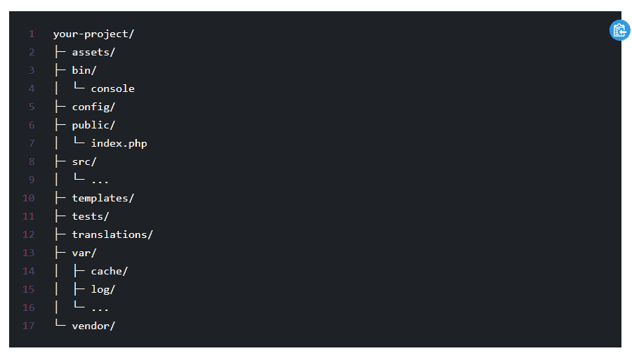](https://kinsta.com/wp-content/uploads/2020/09/symfony-default-directory-structure.png)

Symfony default directory structure

它们迫使你以一种更干净、更整洁、更易维护的方式组织代码。

框架也有自己的实体命名约定，您应该遵循。

### 5.比编写自己的应用程序更安全

PHP 安全威胁有很多[，包括跨站脚本、](https://docs.php.earth/security/intro/) [SQL 注入攻击](https://kinsta.com/blog/sql-injection/)，跨站请求伪造。除非你采取正确的措施来保护你的代码，[否则你的 PHP 网络应用将会很容易受到攻击](https://kinsta.com/knowledgebase/disclose-security-vulnerability/)。

使用 PHP 框架并不能代替编写安全代码，但是它将黑客利用 T1 的机会降到了最低。好的框架具有内置的数据净化和对上述常见威胁的防御。

### 6.更好的团队合作

如果不清楚以下几点，有多个开发人员的项目可能会出错:

*   证明文件
*   设计决策
*   [代码标准](https://kinsta.com/blog/code-review-tools/)

使用框架为你的项目设定了清晰的基本规则。即使另一个[开发人员](https://kinsta.com/blog/hire-wordpress-developer/)不熟悉这个框架，他们也应该能够很快学会诀窍并协同工作。

### 7.更易于维护

PHP 框架鼓励代码重构，提倡干开发(不要重复自己)。由此产生的更精简的代码库需要更少的维护。

您也不必担心维护核心框架，因为这是由开发人员为您完成的。

[PHP 远未消亡。💀事实上，大约 79%的网站都在使用它！🤯在本指南中了解更多关于 PHP 框架的信息⤵️ 点击推文](https://twitter.com/intent/tweet?url=https%3A%2F%2Fkinsta.com%2Fblog%2Fphp-frameworks%2F&via=kinsta&text=PHP+is+far+from+dead.+%F0%9F%92%80+In+fact%2C+it%27s+used+by+about+79%25+of+all+websites%21+%F0%9F%A4%AF++Learn+more+about+PHP+frameworks+in+this+guide+%E2%A4%B5%EF%B8%8F&hashtags=PHP%2Cwebdev)

## 在使用 PHP 框架之前你需要知道什么

在使用一个 PHP 框架之前，你首先需要知道的是 PHP 本身！如果你没有很好地掌握这门语言，你将很难找到一个框架。大多数框架运行在 PHP 7.2 或更高版本上。

如果您需要复习 PHP，请阅读以下文章:

*   [最佳 PHP 教程](https://kinsta.com/blog/php-tutorials/)
*   [PHP 8.1](https://kinsta.com/blog/php-8-1/) (当前版本)
*   [PHP 8.2](https://kinsta.com/blog/php-8-2/) (下一版本)

接下来，您应该已经构建了一些自己的 PHP 应用程序，因此您对前端和后端的需求有一个清晰的了解。

了解[面向对象的 PHP](https://www.killerphp.com/tutorials/object-oriented-php/) 也是必须的，因为大多数现代 PHP 框架都是面向对象的。确保你理解像类、对象、继承、方法、特征和访问修饰符这样的概念。

由于许多 web 应用程序都连接到数据库，所以你应该知道[数据库](https://kinsta.com/knowledgebase/wordpress-database/)和 [SQL 语法](https://kinsta.com/blog/mariadb-vs-mysql/)。每个 PHP 框架都有自己支持的数据库列表。

理解一个[对象关系映射](https://blog.bitsrc.io/what-is-an-orm-and-why-you-should-use-it-b2b6f75f5e2a) (ORM)模型是很有用的。ORM 是一种使用面向对象的语法而不是使用 SQL 来访问数据库数据的方法。这意味着您可以用熟悉的 PHP 编写数据库查询，尽管有时您可能需要使用 SQL。

许多 PHP 框架都内置了自己的 ORM。例如， [Laravel](https://kinsta.com/blog/laravel-tutorial/) 使用雄辩的 ORM。其他人使用开源 ORM，如[主义](https://www.doctrine-project.org/)。

理解像 Apache 和 Nginx 这样的 web 服务器是如何工作的是很有帮助的。您可能需要在服务器上配置文件，以便您的应用程序以最佳方式工作。

你可能会在本地完成大部分[开发，所以你也需要了解](https://kinsta.com/blog/install-wordpress-locally/)[本地主机](https://kinsta.com/knowledgebase/what-is-localhost/)。另一个选择是在虚拟环境中使用 vagger 和 VirtualBox 创建和测试你的应用程序。

### 模型视图控制器架构

PHP 框架通常遵循[模型视图控制器](https://medium.com/@anshul.vyas380/mvc-pattern-3b5366e60ce4) (MVC)设计模式。这个概念将数据的操作与数据的表示分离开来。

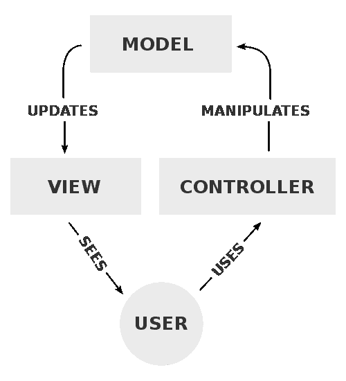

Model View Controller Process (Image source: [Wikimedia Commons](https://commons.wikimedia.org/wiki/File:MVC-Process.svg))

**模型**存储业务逻辑和应用程序数据。它将数据传递给**视图**，即表示层。**用户**与视图交互，可以通过**控制器**输入指令。控制器向模型发出这些命令，循环继续。

简而言之，模型是关于数据的，视图是关于外观的，控制器是关于行为的。

MVC 模式的一个类比是在酒吧点一杯鸡尾酒。

用户是到达酒吧(风景)需要茶点的顾客。用户将他们的饮料订单交给酒保(控制器)。

控制器根据模型制定订单——配方、配料和设备。根据鸡尾酒的不同，他们可能会使用以下任何一种或其他物品:

*   酒精
*   果汁
*   冰
*   柠檬
*   玻璃
*   鸡尾酒摇壶
*   橄榄
*   搅拌器

成品鸡尾酒放在吧台上，供使用者享用。如果用户想要另一种饮料，他们必须首先与控制器通话。他们不允许接近模型和混合他们自己的饮料。

就 PHP 应用程序而言，MVC 可能对应于以下内容:

*   **型号**:数据库
*   **视图**:一个或多个 HTML 页面
*   **控制器**:访问和更新数据库的功能

在使用 PHP 框架时，习惯使用**命令行界面** (CLI)会有所帮助。Laravel 有自己的 CLI，Artisan 控制台。使用 Artisan 中的“制作”命令，可以为项目快速构建模型、控制器和其他组件。

熟悉命令行也是使用 [Composer](https://getcomposer.org/) PHP 包管理器的关键。Yii 框架是使用 Composer 来安装和管理**依赖关系**的几个框架之一，这些依赖关系是应用程序运行所必需的包。

Packagist 是您可以用 Composer 安装的软件包的主要存储库。一些最受欢迎的 Composer 包运行在 Symfony 框架上。

[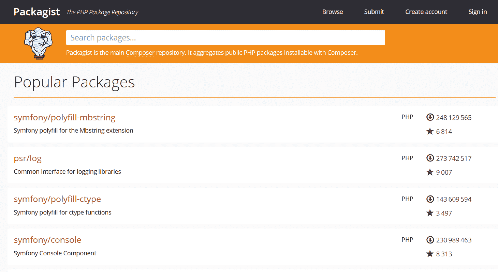](https://kinsta.com/wp-content/uploads/2020/09/packagist-popular-packages.png)

Packagist popular packages

## 你应该在 PHP 框架中寻找什么？

在为您的项目选择最佳 PHP 框架时，您需要考虑以下一些因素。

首先，如果你是 PHP 框架的新手，那么**学习曲线不应该太陡**。如果一个框架太难掌握，你就不想花宝贵的时间去学习它。幸运的是，PHP 是学习最好的编程语言之一。

接下来，你想要一个易于使用并且节省时间的框架。

一个 PHP 框架应该满足你对一个项目的技术需求。大多数框架都会有一个[最低 PHP 版本](https://kinsta.com/blog/php-versions/)和它们使用的某些 PHP 扩展。确保您的框架支持您选择的数据库，并且您可以将该框架用于您想要部署到的 web 服务器。

选择一个平衡了**特性**的框架。一个功能丰富的框架对一些项目来说是一个福音。另一方面，如果你不需要很多特性，选择一个精简的框架。

一些理想的特征是:

*   测试
*   [缓存存储](https://kinsta.com/blog/wordpress-cache/)
*   模板引擎:一种使用 PHP 类在 HTML 中输出 PHP 的方法
*   [安全](https://kinsta.com/secure-wordpress-hosting/)

如果你需要构建一个**可伸缩**的应用，选择一个支持它的框架。

最后，**好的文档和支持**很重要，这样你就可以充分利用你的 PHP 框架。一个拥有**大型且充满活力的社区**的框架也更有可能经受住时间的考验，并且能够在你遇到困难时帮助你。

建议阅读:[如何在 WordPress](https://kinsta.com/knowledgebase/php-memory-limit/) 中提高 PHP 内存限制。
T3】

## 2022 年最好的 PHP 框架有哪些？

很难获得 PHP 框架的明确列表。维基百科列出了 40 个 PHP 框架，但是其中一些被更好地描述为内容管理系统，无疑还有更多。

[早期的 PHP 框架](https://github.com/pmjones/php-history)包括 PHPlib、Horde、Pear。大多数知名品牌都是在 2005 年或之后推出的。

这里有一些当今使用的最好的 PHP 框架。

### 拉勒韦尔

[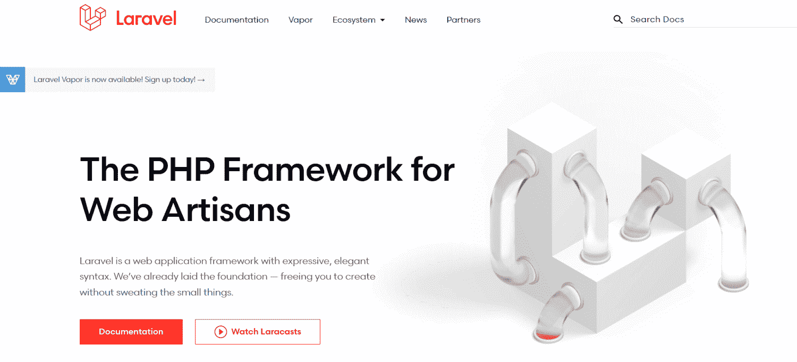](https://kinsta.com/wp-content/uploads/2020/09/laravel.png)

Laravel

Laravel 被宣传为“Web 工匠的 PHP 框架”它是由 Taylor Otwell 开发的，他想要一个具有 CodeIgniter 所没有的元素的框架，比如用户认证。

#### 快速规格

发布时间:2011 年 6 月

当前版本:8，2020 年 9 月 8 日发布。

技术要求:

*   PHP >= 7.2.5(或使用 Laravel Homestead)
*   已安装作曲家
*   数据库支持 MySQL 5.6+，PostgreSQL[9.4+，SQLite 3.8.8+，SQL Server 2017+。](https://kinsta.com/knowledgebase/what-is-postgresql/)

#### Laravel 的优点

从 Laravel Homestead 开始很容易，这是一个为你做的虚拟开发环境。

Laravel Homestead 是一个官方的、预打包的流浪者盒子，它为您提供了一个美妙的开发环境，而不需要您在本地机器上安装 PHP、web 服务器和任何其他服务器软件。再也不用担心搞乱你的操作系统了！

如果你是 Mac 用户，你也可以选择使用 **Laravel Valet** 作为你的开发环境。顺便说一下，Laravel Valet 支持 Symfony、CakePHP 3、Slim 和 Zend，以及 WordPress。

Laravel 使用一个名为 **Blade** 的模板引擎。与其他模板引擎相比，它的一个优势是你可以在 Blade 中使用 PHP，这是其他引擎无法做到的。

Laravel 包的集合 Packalyst ，有超过 15，000 个包可以在你的项目中使用。

Laravel 提供了一系列**安全特性**和方法，包括以下内容:

*   证明
*   批准
*   电子邮件验证
*   加密
*   散列法
*   密码重置

Laravel 的**雄辩的 ORM** 和**流畅的查询生成器**使用 PDO 参数绑定来防范 SQL 注入攻击。默认情况下，使用隐藏的 CSRF 表单令牌的跨站点请求伪造(CSRF)保护也是启用的。

Laravel 拥有的 **Artisan 控制台**命令行工具允许开发人员自动执行重复任务并快速生成框架代码，从而加快了开发速度。

当我们进行 PHP 基准测试时， [Laravel 是我们测试过的最快的 PHP 框架](https://kinsta.com/blog/php-benchmarks/#laravel-benchmarks)。

Laravel 生态系统有几个有用的工具，比如用于编译 CSS 和 JS 资产的 **Mix** ，以及用于 OAuth 认证的**sociate**。

Laravel 受益于一个庞大的开发者社区(像 WordPress 一样)。您可以在以下网址找到它们:

1.  Laracasts :一个学习门户，包含课程、博客、[播客](https://kinsta.com/blog/what-is-a-podcast/)和论坛。
2.  Laravel.io :一个拥有超过 45000 名用户的社区门户网站。
3.  Laravel subreddit:5 万名 Laravel 工匠的家园。

#### 谁用 Laravel？

*   [时尚档案](https://archive.vogue.com/)——时尚
*   [阿斯科特](https://ascot.co.uk/)–赛马场
*   [露营世界房车&户外](https://rv.campingworld.com/)——零售
*   [Restaurants.com](https://www.restaurants.com/)——餐馆搜索引擎
*   [条形图](https://www.barchart.com/)–股票和股份
*   [游览缅因州](https://visitmaine.com/)–旅游
*   [菲舍尔住宅](https://www.fischerhomes.com/)–建筑
*   [探索格鲁吉亚](https://www.exploregeorgia.org/)–旅游

### **symphony**

[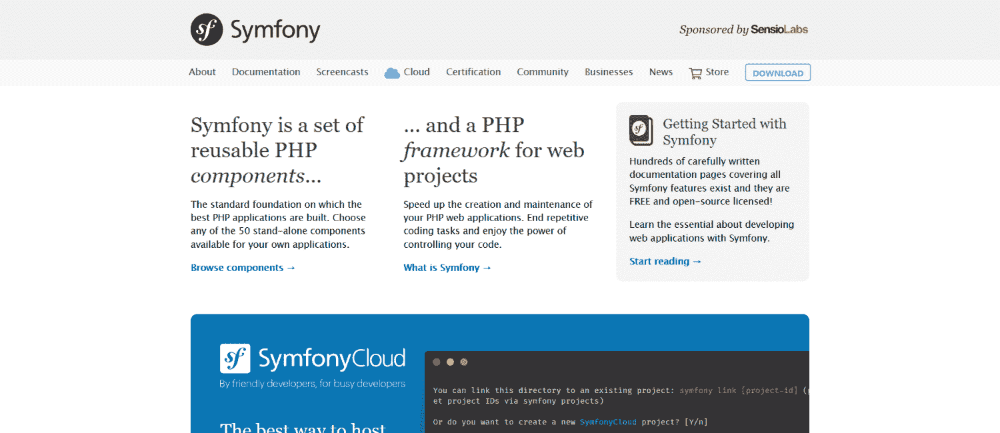](https://kinsta.com/wp-content/uploads/2020/09/symfony.png)

Symfony

[Symfony](https://symfony.com/) 既是一个 PHP 框架，也是一个用于构建网站的 PHP 组件集合。

#### 快速规格

发布时间:2005 年 10 月

当前版本:5.1.4

技术要求:

*   PHP >= 7.2.5
*   已安装作曲家

#### Symfony 的优点

Symfony 是需要可扩展的网站和应用程序的绝佳选择。它的**模块化组件系统**非常灵活，可以让你选择项目所需的组件。

Symfony 支持流行的 PHP 框架中的大多数数据库:

*   下毛毛雨
*   [MySQL](https://kinsta.com/knowledgebase/what-is-mysql/) 的实现
*   神谕
*   一种数据库系统
*   SAP Sybase SQL Anywhere
*   SQLite
*   SQLServer

与数据库交互的最佳方式是通过**教条** ORM。Symfony 使用数据映射器将对象映射到数据库。这使您的对象模型和数据库模式保持分离，这意味着如果您更改数据库列，您不需要在代码库中做很多更改。

使用内置工具栏调试 Symfony 项目非常简单。

Symfony 使用的是 **Twig** 模板引擎，易学、快速、安全。

Packagist 列出了超过 4000 个 Symfony 软件包供您下载和使用。

Symfony 有 Sensio Labs 的商业支持。这意味着有专业支持可用，不像大多数其他 PHP 开发框架。它还有长期支持版本，支持期为 3 年。

Symfony 开发人员可以通过多种渠道获得培训和帮助:

*   [完整文档](https://symfony.com/doc/current/index.html)
*   [Sensio Labs 大学](https://university.sensiolabs.com/)，Symfony 电子学习平台
*   [SymfonyCasts](https://symfonycasts.com/)
*   [Symfony 认证](https://certification.symfony.com/)
*   Symfony 会议

此外， [Symfony 社区](https://symfony.com/community)规模庞大，有超过 600，000 名开发者积极参与其中。

#### 谁用 Symfony？

*   [塞恩斯伯里杂志](https://www.sainsburysmagazine.co.uk/)–出版
*   [Intelius](https://www.intelius.com/)–搜索关于人的公共数据
*   [索尼 VAIO 英国工厂](https://uk.vaio.com/)–零售
*   [萨巴蒂埃商店](https://www.sabatier-shop.com/)–零售
*   [Foot District](https://footdistrict.com/)–零售
*   [诺贝尔和平奖](https://www.nobelpeaceprize.org/)

其他大公司在他们的项目中使用 Symfony 组件，包括 [Drupal](https://kinsta.com/blog/wordpress-vs-drupal/) 、 [Joomla](https://kinsta.com/blog/joomla-vs-wordpress/) 和 [Magento](https://kinsta.com/magento-market-share/) 。

### 代码点火器

[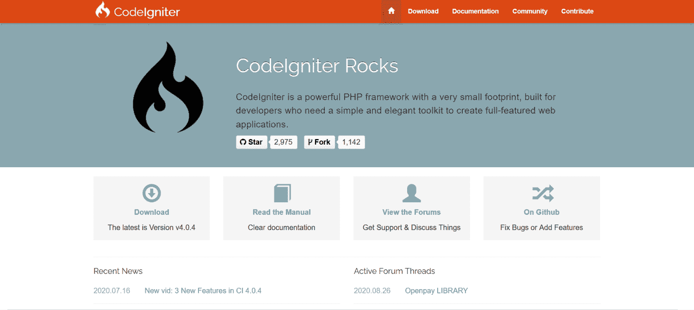](https://kinsta.com/wp-content/uploads/2020/09/codeigniter.png)

CodeIgniter

CodeIgniter 框架帮助你快速构建网络应用，因为它只需要最少的配置。

#### 快速规格

发布时间:2006 年 2 月

当前版本:4.0.3

技术要求:

*   PHP >= 7.2
*   对 MySQL、PostgreSQL、SQLite3 的数据库支持

#### CodeIgniter 的优点

CodeIgniter 以**速度**著称。在我们的 PHP 基准测试中，它是四个 PHP 框架中速度第二快的[。](https://kinsta.com/blog/php-benchmarks/#codeigniter)

该框架的**轻足迹**(它是 1.2MB 的下载)意味着没有膨胀。您可以准确地添加您需要的组件。

CodeIgniter**灵活**:它鼓励使用 MVC 架构进行开发，但是您也可以编写非 MVC 应用程序。

该框架包括对 CSRF 和 XSS 攻击的防御，加上上下文敏感的转义和内容安全策略。

CodeIgniter 支持多种方式的**缓存**，加速你的应用程序。

## 注册订阅时事通讯

### 想知道我们是怎么让流量增长超过 1000%的吗？

加入 20，000 多名获得我们每周时事通讯和内部消息的人的行列吧！

[Subscribe Now](#newsletter)

如前所述，与其他框架相比，CodeIgniter 有一个简单的学习曲线，并且非常具有可扩展性。

CodeIgniter 的社区由一个[论坛](https://forum.codeigniter.com/)和 [Slack group](https://codeigniterchat.slack.com/) 组成。

#### 谁使用 CodeIgniter？

*   [重力冲击](https://www.gshock.com/)–零售
*   [WooBox](https://woobox.com/)–营销
*   [缓冲器](https://buffer.com/)–技术
*   [测试和跟踪](https://www.testandtrack.io/)–教育
*   卡西欧–技术
*   [轻松骑自行车](https://bikeeasy.org/)–户外
*   [梭鱼](https://www.barracuda.com/)–IT 安全
*   [燃料管理系统](https://www.getfuelcms.com/)–内容管理系统

### Zend 框架/层板项目

[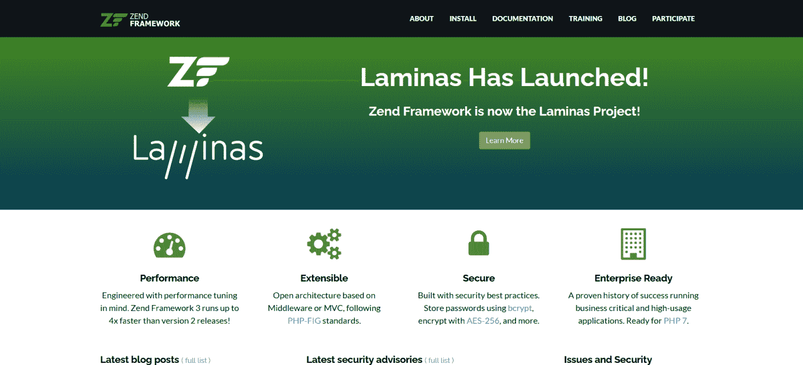](https://kinsta.com/wp-content/uploads/2020/09/zend.png)

Zend Framework

Zend 框架是一个历史悠久的 PHP 框架，现在正在向 T2 的 Laminas 项目过渡。强烈建议迁移到 Laminas，因为 Zend 不再更新。

Laminas 项目由 3 部分组成:

1.  薄层组件和 MVC
2.  女中音
3.  Laminas API 工具

#### 快速规格

发布时间:2006 年 3 月

当前版本:3.0.0 (Zend)或 1.3.0 (Laminas)

技术要求:

*   PHP >= 5.6 (Zend)或> = 7.3(laminates)
*   已安装作曲家
*   对 MariaDB、MySQL、Oracle、IBM DB2、Microsoft SQL Server、PostgreSQL、SQLite 和 Informix Dynamic Server 的数据库支持。

#### Zend/lamps 的优点

Zend 框架已经安装了超过 5 . 7 亿次。它也是[企业](https://kinsta.com/enterprise-wordpress-hosting/)使用最多的 PHP 框架。

Zend 遵循 PHP Framework Interop Group(PHP-FIG)标准，这意味着它的代码可以毫无困难地移植到其他框架。

像 Symfony 一样，您可以只使用您需要的组件。

你可以使用 Zend 来构建 RESTful API。

lamps 社区有一个用于协作和支持的论坛和 [Slack 组](https://laminas.slack.com/)。

#### 谁用 Zend/Laminas？

根据 Zend 的主页，这个框架已经被很多大公司使用，包括

*   英国广播公司–媒体
*   [法国巴黎银行](https://group.bnpparibas/en/)–金融
*   [思科 Webex](https://www.webex.com/)–视频会议

### Yii(框架)

[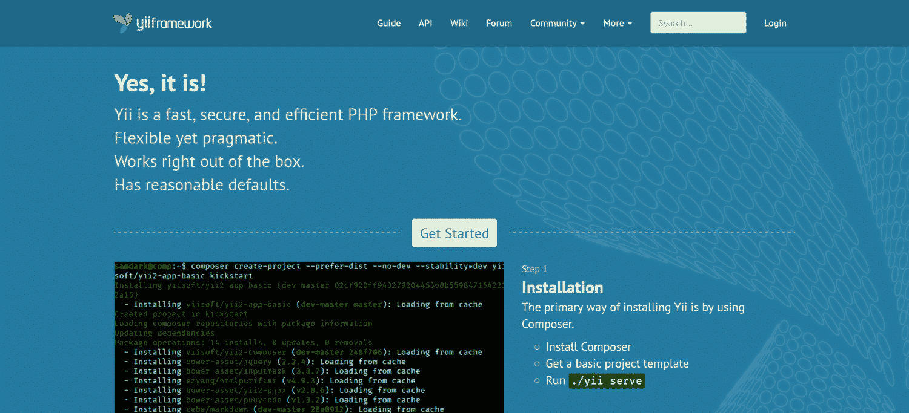](https://kinsta.com/wp-content/uploads/2020/09/yii-framework.png)

Yii Framework

这个框架的名字 [Yii](https://www.yiiframework.com/) ，中文意思是“简单进化”。它也代表“是的，它是！”

#### 快速规格

发布时间:2008 年 12 月

当前版本:2.0.35

技术要求:

*   PHP >= 5.4.0，推荐 7+版本
*   已安装作曲家
*   数据库支持 SQLite、MySQL、PostgreSQL、MSSQL 或 Oracle 数据库

#### Yii 的优点

您可以在几分钟内启动并运行 Yii。文档写得很好，很容易理解。

Yii 框架有几个[安全措施](https://kinsta.com/blog/wordpress-security/)，比如 bcrypt 密码散列、加密、认证和授权。该文档提供了防止 T2、SQL 注入、XSS 和 CSRF 攻击的最佳实践。

**Gii 代码生成器**可以快速为你构建骨架代码，节省时间。

[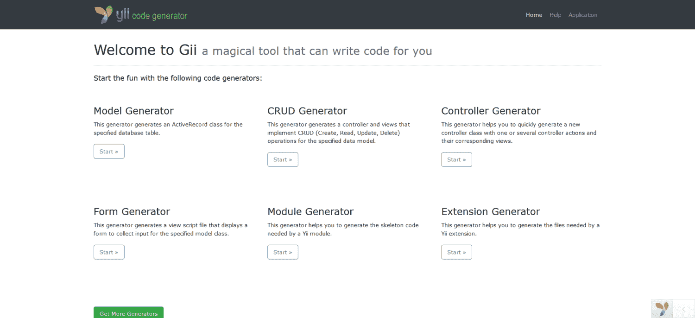](https://kinsta.com/wp-content/uploads/2020/09/Gii-code-generator-e1599232207871.png)

Gii code generator

Yii 支持四种类型的**缓存**来加速 web 应用:数据缓存、片段缓存、[页面缓存](https://kinsta.com/blog/wordpress-cache/#page-cache)和 HTTP 缓存。

你可以在 Yii 项目中运行第三方代码。

Yii 社区通过 Slack 或 IRC 提供实时支持。还有一个[论坛和社交媒体渠道](https://www.yiiframework.com/community)。该社区奖励其活跃成员徽章和名人堂的条目。

#### 谁用 Yii？

*   [crowd cube](https://www.crowdcube.com/)——众筹平台
*   [字数统计器](https://wordcounter.net/)–编辑工具
*   [哪个？](https://www.which.co.uk/)–消费者网站
*   [紫色](https://purple.com/)–零售
*   基督教青年会-非营利组织
*   [Pastebin](https://pastebin.com/)–在线工具
*   [快速公司活动](https://events.fastcompany.com/)–现场和虚拟活动

### CakePHP

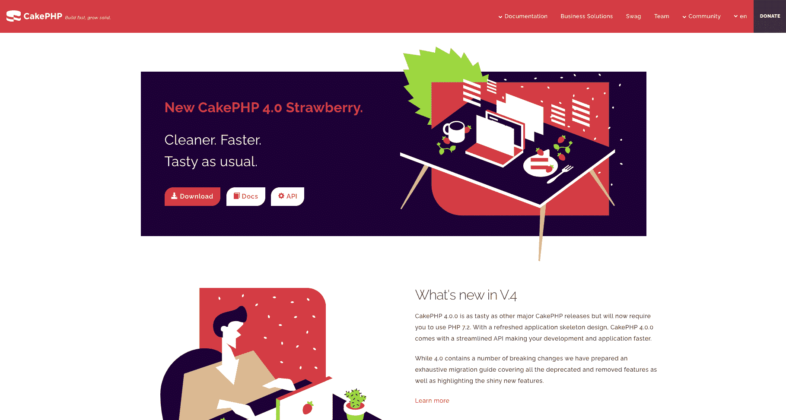

CakePHP

CakePHP 提供快速干净的 PHP 开发。

#### 快速规格

启动时间:2005 年 4 月

当前版本:4.1.1

技术要求:

需要为您的客户站点提供一个非常快速、安全且对开发人员友好的托管服务吗？Kinsta 是为 WordPress 开发者设计的，提供了大量的工具和强大的仪表板。[查看我们的计划](https://kinsta.com/plans/?in-article-cta)

*   PHP 7.2(最低)，推荐 7.4
*   首选带有 mod_rewrite 的 HTTP 服务器
*   数据库支持 MySQL 5.6+，MariaDB 5.6+，PostgreSQL 9.4+，SQLite 3.8，SQL Server 2012+。

#### CakePHP 的优点

**配置最低**。您不必摆弄 XML 或 YAML 文件。一旦你建立了你的数据库[，你就可以开始编码](https://kinsta.com/blog/code-review-tools/)。

CakePHP 有自己的**内置 ORM** ，使用起来快捷简单。

**安全特性**包括加密、密码散列、保护表单数据和 CSRF 保护的方法。

CakePHP 的**组件和助手**简化了开发，减少了你必须做的日常工作。

Github 上有一个有用的 CakePHP 资源和插件列表。

你可以通过菜谱(文档)、在线培训和 CakeFest 会议来学习 CakePHP。

你可以通过他们的论坛、Stack Overflow、IRC 和 Slack 找到友好的 CakePHP 烘焙师。CakePHP 创始人拉里·马斯特斯经营的[蛋糕 DC](https://www.cakedc.com/) 也提供专业支持。

#### 谁用 CakePHP？

*   [参观 NC](https://www.visitnc.com/)–旅游
*   [10 个快速手指](https://10fastfingers.com/)–教育
*   [Coconala](https://coconala.com/)–电子学习市场
*   [好公司](https://www.goodfirms.co/)–软件市场
*   [printi VO](https://printivo.com/)–电子商务
*   [公民公司](https://citizensinc.com/)–金融

### 微小的

[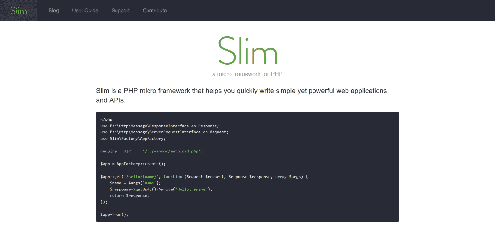](https://kinsta.com/wp-content/uploads/2020/09/slim.png)

Slim Framework

Slim 是一个精简、敏捷的微型 PHP 框架，由 Josh Lockhart 创建。它主要接收一个 [HTTP 请求](https://kinsta.com/blog/make-fewer-http-requests/)，调用一个回调，并返回一个 HTTP 响应。

#### 快速规格

发布时间:2010 年 9 月

当前版本:4.5.0

技术要求:

*   PHP 7.2 以上
*   使用 [URL](https://kinsta.com/knowledgebase/what-is-a-url/) 重写的 Web 服务器

#### 苗条的优点

Slim 的**代码库是精简的**，因为它没有第三方依赖。因此，它的**非常快**。

Slim 特别适合构建小型应用程序和 API。如果你需要更多的框架，Slim 集成了第一方和第三方组件。

Slim 是**易学**易懂。你可以在几分钟内运行一个“Hello World”应用程序。

Slim 在 Slant 比较网站上被开发者评为[最佳 PHP 框架](https://www.slant.co/topics/1183/~best-php-frameworks)。

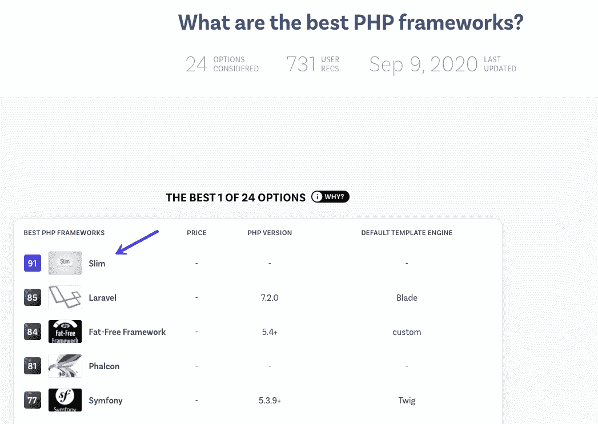

What are the best PHP frameworks?

从 [Tidelift](https://tidelift.com/subscription/pkg/packagist-slim-slim) 可获得对 Slim 的专业支持。

#### 谁用 Slim？

*   [顶级网络漫画](http://topwebcomics.com/)–出版
*   [犬类原则](https://www.canineprinciples.com/)–训练
*   [CG 锻造](https://www.cgforge.com/)–教育
*   [Betterplace 学院](https://www.betterplace-academy.org/)–教育

### 法尔孔

[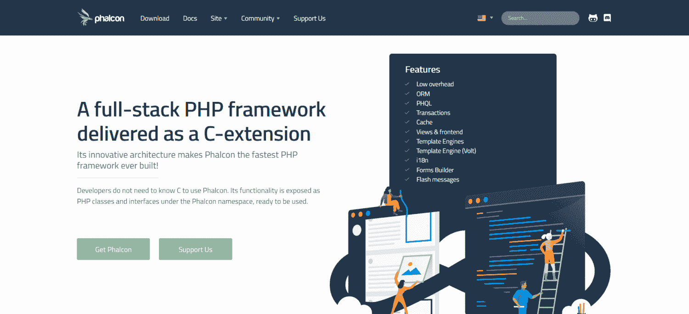](https://kinsta.com/wp-content/uploads/2020/09/phalcon.png)

Phalcon

[Phalcon](https://phalcon.io/en-us) 是一个为速度而构建的 PHP 框架[。它是作为一个用](https://kinsta.com/learn/speed-up-wordpress/) [Zephir](https://github.com/phalcon/zephir) 和 C 语言编写的 web 服务器扩展交付的。开发人员使用框架生成的 PHP 类和名称空间。

#### 快速规格

发布时间:2012 年 11 月

当前版本:4.0.6

技术要求:

*   PSR 扩展
*   PHP 7.2 +(推荐最新版本)

#### 费尔康的优点

Phalcon 被设计为运行**快速**，因为它具有以下特性:

*   底层架构。
*   Zephir、C 扩展和 PHP 的一次性加载。
*   代码是编译的而不是解释的，所以速度更快。
*   常驻内存，这意味着它可以在任何需要的时候被调用。
*   与大多数其他 PHP 框架不同，它不使用文件读取和文件统计，从而提高了性能。

由于 Phalcon 是松散耦合的，您可以创建自己的目录结构。Phalcon 的代码不存在于项目目录中，这使得代码是轻量级的。

Phalcon 的**安全**组件有助于密码哈希和 CSRF 保护。

Phalcon 的模板引擎 **Volt** 非常快，并且附带了助手类，可以轻松创建视图。

你可以通过他们的[文档](https://phalcon.io/docs)、[论坛](https://phalcon.io/forum)、[不和谐聊天](https://phalcon.io/discord)、[栈溢出](https://phalcon.io/so)以及多个社交媒体平台来寻求对 Phalcon 的支持。

#### 谁使用 Phalcon？

根据 [Phalcon 建造的](https://builtwith.phalcon.io/)站点，Phalcon 的用途是:

*   [在线学习](https://learny.online/)–学习
*   [智胜](https://outsmart.io/)–分析
*   [马尔基汽车](https://marchiauto.it/)-汽车经销商

### 燃料电池

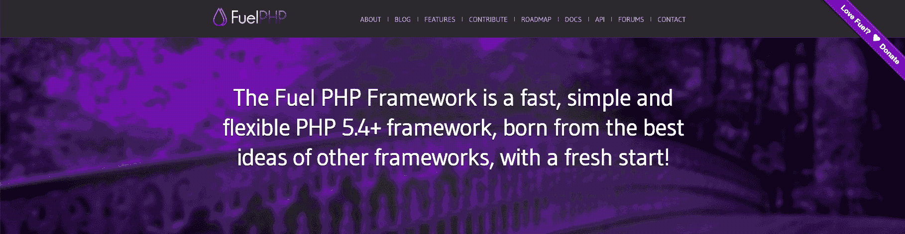

FuelPHP

FuelPHP 是一个社区驱动的 PHP 框架，在其生命周期中有超过 300 个贡献者。

#### 快速规格

发布时间:2011 年 6 月

当前版本:1.8.2

技术要求:

*   PHP 5.4 以上
*   任何 web 服务器

#### 燃料的优点

FuelPHP 使用 MVC，但也支持 **HMVC(层次模型视图控制器)**。这在控制器和视图之间增加了另一层。HMVC 设计模式的优点是:

*   更好的代码组织
*   更大的模块化
*   更具可扩展性
*   鼓励代码重用

你可以**为你的项目选择你想要的文件和文件夹结构**,因为限制很少。FuelPHP 非常重视**的安全性**，具有以下特点:

*   输出编码
*   CSRF 保护
*   输入、URI 和 XSS 滤波
*   传递给 SQL 语句的转义用户输入

FuelPHP 有自己的**命令行实用程序**、 [oil](https://fuelphp.com/features) ，可以用来运行任务、调试代码、生成通用组件。

FuelPHP ORM 功能强大，但很轻便。

你可以在他们的[论坛](http://fuelphp.com/forums)以及脸书和推特上加入 FuelPHP 社区。

#### 谁用 FuelPHP？

*   [万巫师](https://wanwizard.eu/)——哈罗·弗顿，FuelPHP 的开发者之一
*   [前台](https://github.com/logicent/frontdesk)–物业管理系统

### 无脂肪框架

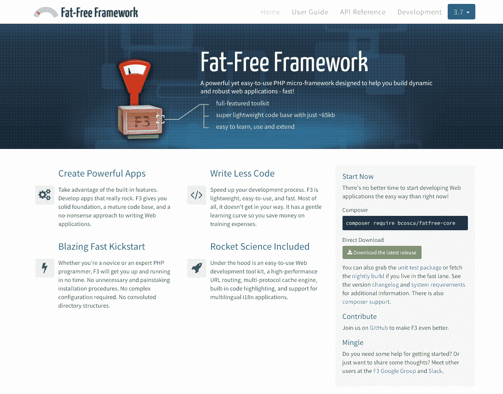

Fat-Free Framework

和 Slim 一样，[无脂框架](https://fatfreeframework.com/) (F3)是微框架。它的目标是在有用的特性、简单性、易用性和速度之间取得平衡。

#### 快速规格

发布时间:2009 年

当前版本:3.7.2

技术要求:

*   PHP 5.4 以上
*   任何 web 服务器
*   数据库支持 MySQL、SQLite、MSSQL/Sybase、 [PostgreSQL 和 MongoDB](https://kinsta.com/blog/mongodb-vs-postgresql/) 。

#### 无脂肪框架的优点

代码库在 65Kb 左右，所以**快**。然而 F3 仍然拥有你所期望的所有功能。你可以用可选插件**扩展**它。

用无脂肪框架很容易学会。开始时不需要使用 Composer、curl 或依赖注入器。您可以在几分钟内创建一个 Hello World 应用程序。

几乎所有的框架都是模块化的，所以你可以使用你需要的部分来构建你的网络应用。默认情况下，F3 不会添加您不需要的代码，从而保持您的应用程序最少。

**文档清晰明了**,易于理解，有大量的例子。Fat-Free Framework 提供了模板引擎的选择:你可以使用 PHP，F3 自带的模板引擎，或者其他的比如 Smarty 或者 Twig。

F3 开发人员在 [Slack](https://fatfreeframework-slack.herokuapp.com/) 和[无脂肪框架 Google Group](https://groups.google.com/forum/#!forum/f3-framework) 上闲逛。

#### 谁用无脂框架？

*   [Malwarebytes 工作岗位](https://jobs.malwarebytes.com/)–招聘
*   [Eve 大学开发探路者](https://devpathfinder.eveuniversity.org/)–游戏
*   [Andiamo](https://www.andiamogo.com/)–招聘
*   [贝克在线](https://bakeronline.uk)–零售
*   [延期](https://www.eloquens.com/)–商务
*   [电脑规格](http://www.pc-specs.com/)–技术

[Want to cut down on the amount of code you need to write? 💡 A PHP framework could be just what you need. Learn more about the best ones in this guide!Click to Tweet](https://twitter.com/intent/tweet?url=https%3A%2F%2Fkinsta.com%2Fblog%2Fphp-frameworks%2F&via=kinsta&text=Want+to+cut+down+on+the+amount+of+code+you+need+to+write%3F+%F0%9F%92%A1+A+PHP+framework+could+be+just+what+you+need.+Learn+more+about+the+best+ones+in+this+guide%21&hashtags=PHP%2CWordPress)

## 新手用哪个 PHP 框架最好？

对于初学者来说，最好的框架是那些更简单、更精简的框架。一旦你掌握了其中的一个，你就准备好升级到一个更有特色的了，如果你需要的话。

Yii 将是我为初学者设计的 PHP 框架的首选。Yii 的文档指导你制作一个查看国家的应用程序，教你 MVC 模式，以及如何在这个过程中使用数据库。

[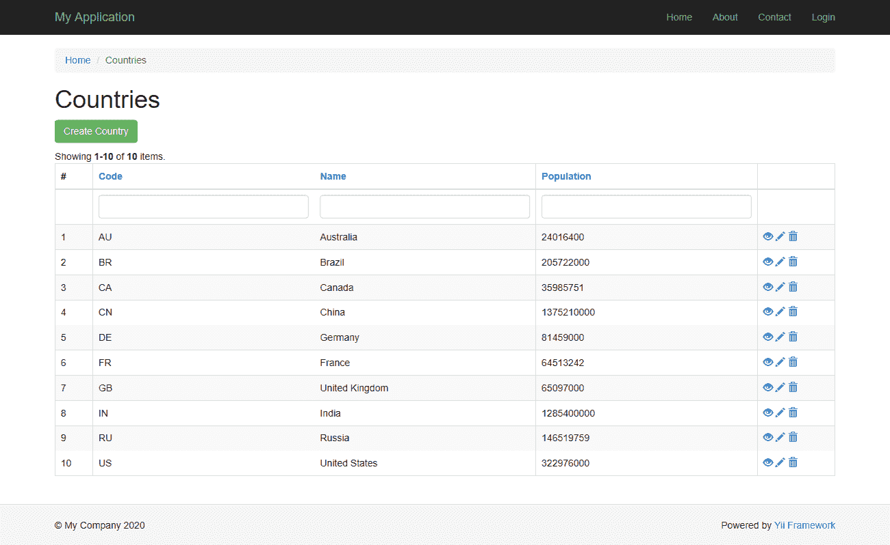](https://kinsta.com/wp-content/uploads/2020/09/yii-countries-app.png)

Yii Countries web app

如果你犯了一个错误，错误是清楚的，[帮助你调试](https://kinsta.com/blog/wordpress-debug/)并快速继续。

[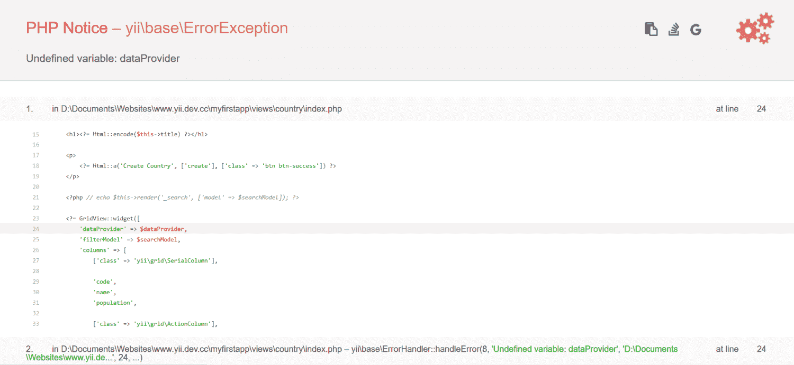](https://kinsta.com/wp-content/uploads/2020/09/yii-exception-error-undefined-variable.png)

Yii error for undefined variable

**超薄**框架安装快捷方便。Slim 有框架第 3 版的第一个应用教程。可惜还没有更新到 Slim 版本 4，也就是现在的版本。

[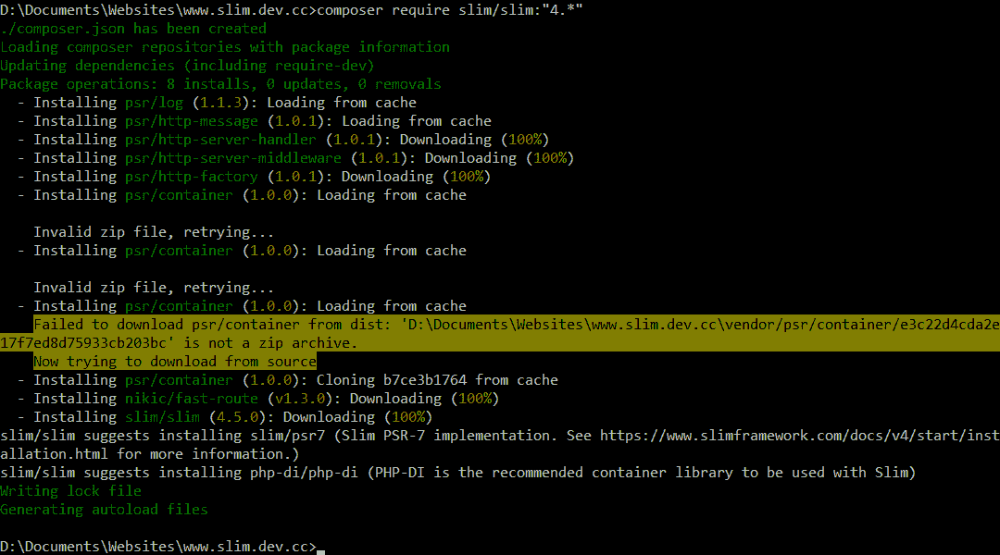](https://kinsta.com/wp-content/uploads/2020/09/install-slim-via-composer.png)

Installing Slim 4 via Composer

对于 **Fat-Free Framework** ，你可以选择通过 Composer 安装或者简单地下载并解压一个 zip 文件。这个框架是用一个简单的“Hello，world”程序建立的。

用户指南带你一步一步地了解你需要知道的事情，从路由到单元测试。还有一个 CMS 演示，这样你就可以看到所有的部分是如何组合在一起的。

CodeIgniter 也有一个相当简单的设置和很好的文档。他们的第一个应用程序教程构建了一个[简单的 CMS](https://kinsta.com/blog/cms-software/) ，带有以新闻故事为特色的 CRUD 函数。

[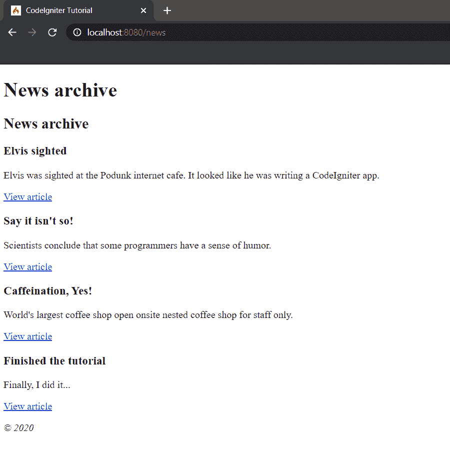](https://kinsta.com/wp-content/uploads/2020/09/codeigniter-news-cms-tutorial.png)

CodeIgniter news archive page

## 摘要

如果您想减少开发 PHP web 应用程序的时间，使用框架是一个明智的选择。

为了最大限度地利用 PHP 框架，并避免挫折，请确保您对 PHP 有足够的了解，并理解框架背后的基本概念:MVC 架构、面向对象的语法、数据库和 ORM 以及命令行。

你选择哪种框架将取决于你正在构建的应用程序的类型。有适合各种口味的 PHP 框架，从极简到“除了厨房水槽之外的一切”希望这篇文章能帮助你找到最适合你的 PHP 框架。

现在回到你的问题上:哪一个是你首选的 PHP 框架，为什么？请在下面的评论中告诉我们！

* * *

让你所有的[应用程序](https://kinsta.com/application-hosting/)、[数据库](https://kinsta.com/database-hosting/)和 [WordPress 网站](https://kinsta.com/wordpress-hosting/)在线并在一个屋檐下。我们功能丰富的高性能云平台包括:

*   在 MyKinsta 仪表盘中轻松设置和管理
*   24/7 专家支持
*   最好的谷歌云平台硬件和网络，由 Kubernetes 提供最大的可扩展性
*   面向速度和安全性的企业级 Cloudflare 集成
*   全球受众覆盖全球多达 35 个数据中心和 275 多个 pop

在第一个月使用托管的[应用程序或托管](https://kinsta.com/application-hosting/)的[数据库，您可以享受 20 美元的优惠，亲自测试一下。探索我们的](https://kinsta.com/database-hosting/)[计划](https://kinsta.com/plans/)或[与销售人员交谈](https://kinsta.com/contact-us/)以找到最适合您的方式。