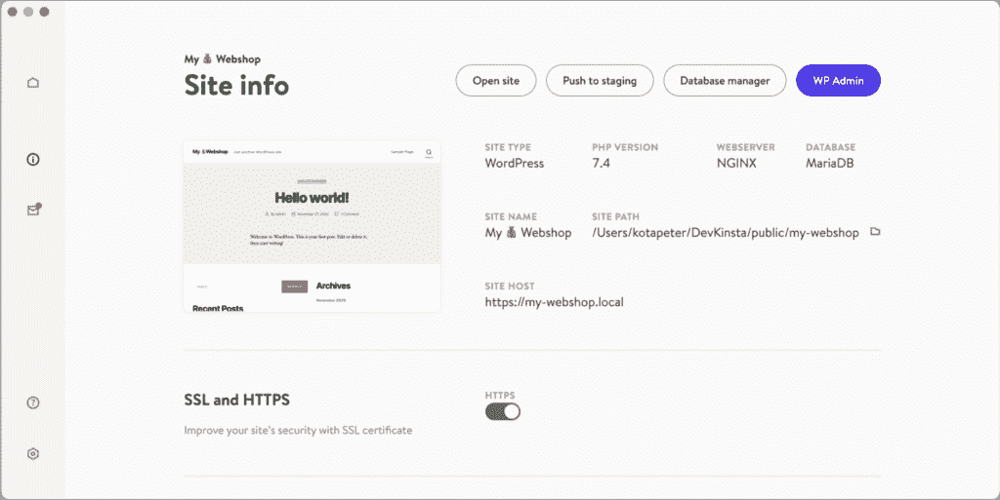
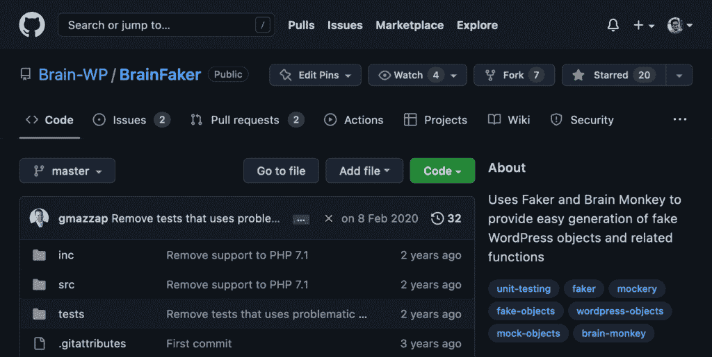
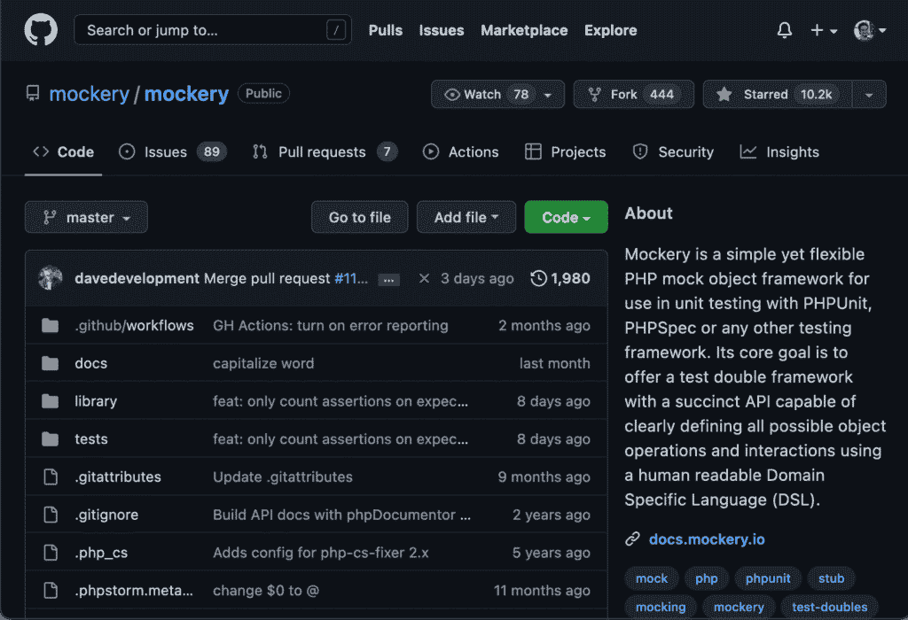
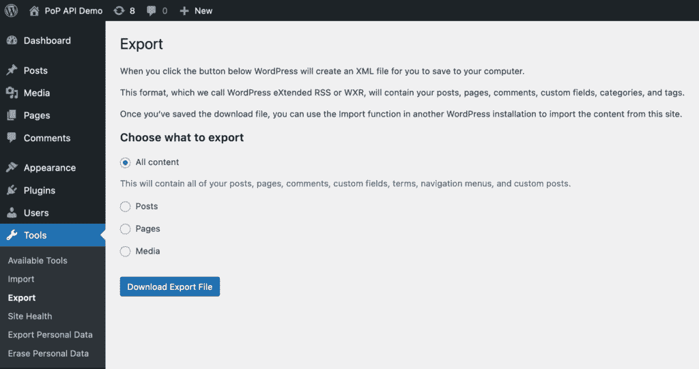

# WordPress 插件的 10 个 PHP 测试工具

> 原文：<https://kinsta.com/blog/php-testing-tools/>

没有一个软件是没有漏洞的。这是一个适用于所有编程语言和应用程序的公理。

当这些 bug 被部署到您的生产网站中时，您可能会遭受不同严重程度的不良后果。以下是一些例子，从恼人到经济损失不等:

*   轻度:用户无法点击断开的链接。
*   严重:联系人表单的“提交”按钮不起作用，用户只有在撰写完邮件后才发现这一点。
*   严重:支付网关配置不当，导致用户无法在您的电子商务商店购买产品，从而放弃该网站。

*   [可访问性](https://kinsta.com/blog/wordpress-accessibility/)和[可用性](https://kinsta.com/blog/website-usability-testing/)
*   [可接受的性能](https://kinsta.com/blog/performance-testing-tools/)
*   [交通和负载处理](https://kinsta.com/knowledgebase/load-testing/)

在这篇文章中，我们将回顾开源社区创建的 10 个工具，它们可以帮助我们在 WordPress 插件中测试 [PHP 代码](https://kinsta.com/knowledgebase/what-is-php/)。其中一些工具是专门为测试 PHP 代码而设计的；其他的是用来测试 WordPress 代码的；还创建了一些其他工具来处理一些对测试有用的通用功能。

## 1.德夫金斯塔

Details for a local WordPress site in DevKinsta.

DevKinsta 是一个 WordPress 网站的本地开发套件。只需提供一些基本的细节，WordPress 站点的本地实例就会被立即安装，它还捆绑了一些有用的开发工具，如电子邮件收件箱、数据库管理器和日志，以便于故障排除。

> Kinsta 把我宠坏了，所以我现在要求每个供应商都提供这样的服务。我们还试图通过我们的 SaaS 工具支持达到这一水平。
> 
> <footer class="wp-block-kinsta-client-quote__footer">
> 
> 
> 
> <cite class="wp-block-kinsta-client-quote__cite">Suganthan Mohanadasan from @Suganthanmn</cite></footer>

[View plans](https://kinsta.com/plans/)

DevKinsta 通常由开发者和设计者在创建他们的 WordPress 主题和插件时使用。但是它也可以用作执行集成和功能测试的本地 web 服务器。这是通过一个 HTTP 工具来完成的，该工具可以帮助您验证您的响应内容和标题是否正确。

DevKinsta 的主要特点是:

*   很容易建立一个新的 WordPress 环境，一旦不再需要就删除它
*   允许测试 PHP 和 WordPress 的任何[支持版本，以及它们的任何组合](https://kinsta.com/blog/php-versions/)
*   与 MyKinsta 无缝集成，用户可以为他们的站点和数据创建外部备份

## 2.PHPUnit

PHPUnit logo.

PHPUnit 是一个面向程序员的 PHP 测试框架。它是在 PHP 代码中执行单元测试最流行的框架，目标是验证源代码的单个单元。

PHPUnit 测试允许开发人员在开发周期中尽可能早地发现问题，有助于确保没有引入代码退化(例如，对某段代码的更改没有在其他地方引起问题)。

PHPUnit 的主要特性是:

*   新功能测试
*   新重构的代码验证
*   可以完全自动化，并在选择的[持续集成](https://kinsta.com/blog/devops-tools/#2-continuous-integration-ci--continuous-delivery-cd)流程中执行
*   排除故障
*   通过功能调用和约束自动记录预期用途
*   支持[测试驱动的开发](https://en.wikipedia.org/wiki/Test-driven_development) (TDD)方法，开发人员首先创建第一个测试，然后创建功能

## 3.大脑猴

Brain Monkey logo.

[脑猴](https://github.com/Brain-WP/BrainMonkey/)是 PHP 和 WordPress 的测试工具。它提供了与框架无关的工具，允许您重新定义 PHP 方法并测试任何 PHP 应用程序的行为。它还提供了专门测试 WordPress 代码的工具。

脑猴的顶级特征是:

*   允许单元测试与外部未加载的库进行交互
*   允许调用 WordPress 函数，而不需要加载 WordPress 环境
*   可以断言 WordPress 函数(如`add_filter`或`do_action`)会按预期调用功能

## 4.大脑骗子

Brain Faker on GitHub.

[Brain Faker](https://github.com/Brain-WP/BrainFaker) 使用 [Faker](https://github.com/fzaninotto/Faker) (一个流行的用于生成假数据的 PHP 库)和 Brain Monkey 提供轻松生成假 WordPress 对象和相关功能供您测试，包括:

*   `WP_Post`实例，并模仿相关函数，如`get_post`和`get_post_field`
*   `WP_User`实例，以及模拟相关函数，如`get_userdata`、`get_user_by`、`user_can`等等
*   `WP_Term`实例，并模仿相关函数，如`get_term`和`get_term_by`
*   `WP_Comment`实例
*   `WP_Site`实例，并模仿类似`get_site`的相关函数
*   `WP_Post_Type`实例，并模仿相关函数，如`get_post_type_object`和`post_type_exists`
*   `WP_Taxonomy`实例，并模仿相关函数，如`get_taxonomy`和`taxonomy_exists`
*   `WP_Error`实例

Brain Faker 的顶级特性是:

*   将虚假但真实的 WordPress 数据注入到单元测试中——访问虚假帖子的修改日期将表现为日期(例如`2022-04-17T13:06:58+00:00`)，用户名将是合适的(例如`"John Smith"`)，虚假帖子实例由虚假用户实例创作，等等
*   虚假数据可以是预先提供的或随机生成的
*   可扩展——开发者可以模仿他们自己的 WordPress 插件中的类和函数

## 5.笑柄

Mockery on GitHub.

mock 是一个简单而灵活的 PHP mock 对象框架，旨在与 PHPUnit、 [PHPSpec](https://www.phpspec.net/en/stable/) 或任何其他单元测试框架一起使用。它提供了一个双重测试框架，能够使用人类可读的[领域特定语言](https://en.wikipedia.org/wiki/Domain-specific_language) (DSL)定义所有可能的对象操作和交互。

嘲弄的主要特点是:

## 注册订阅时事通讯

### 想知道我们是怎么让流量增长超过 1000%的吗？

加入 20，000 多名获得我们每周时事通讯和内部消息的人的行列吧！

[Subscribe Now](#newsletter)

*   支持灵活生成模拟对象和存根(为测试期间的特定调用提供预定义的固定答案)
*   增强 PHPUnit 的测试隔离能力
*   灵活的 API 来表达被嘲笑的期望，尽可能模仿自然语言描述(例如`$mock->shouldReceive('myMethod')->once()->andReturn('Hello world!');`)
*   使用内存中的模拟对象进行单元测试，以避免访问较慢的系统(如数据库、文件系统或外部服务)
*   可以模仿确定性和非确定性行为

## 6.WordPress 本地导出工具

The WordPress export tool.

WordPress 的本地导出工具将网站的 WordPress 数据以 XML 文件的形式下载到你的设备上，包括帖子、页面、自定义帖子类型、评论、自定义字段、类别、标签、自定义分类、用户和媒体。XML 文件有一个自定义格式(称为 WordPress 扩展 RSS 或 WXR 文件),可以导入任何 WordPress 站点。
 这个工具不是专门为测试而设计的。然而，它的用处在于能够创建包含合适数据集的 WordPress 数据库的快照，然后可以用于测试。这意味着包含真实数据的生产中的 WordPress 站点可以被导出并导入到一个[开发或试运行实例](https://kinsta.com/help/staging-environment/)中来测试新的功能。

WordPress 导出工具的主要特点是:

*   使用实际的 WordPress 站点创建测试数据
*   整个数据库的可共享导出文件
*   对集成和单元测试都有用

## 7.狂饮

Guzzle logo.

Guzzle 是一个 PHP HTTP 客户端，可以很容易地发送 HTTP 请求并与 web 服务集成。

Guzzle 是一个通用工具，所以测试只是它可能的用例之一。与 DevKinsta 等本地 web 服务器[一起，Guzzle 使执行集成测试成为可能:您可以使用 Guzzle 发送针对开发 web 服务器的 HTTP 请求，然后将响应传递给 PHPUnit 中的单元测试，该单元测试验证内容和头是否按预期设置。](https://kinsta.com/devkinsta/features/)

Guzzle 的主要特点是:

*   满足 [PHP 标准建议“PSR-7”](https://www.php-fig.org/psr/psr-7/)(用于 HTTP 消息接口)，排除供应商锁定
*   简单快捷
*   测试是在实际的 WordPress 站点上进行的，增加了可靠性
*   可以在 PHPUnit 中轻松快速地执行
*   集成测试可以自动化，并添加到持续集成过程中

## 8.WP-CLI

WP-CLI logo.

WP-CLI 是 WordPress 的命令行界面。有了它，你可以更新插件，配置多站点安装等等，而不需要使用[网络浏览器](https://kinsta.com/blog/most-secure-browser/)。

Struggling with downtime and WordPress problems? Kinsta is the hosting solution designed to save you time! [Check out our features](https://kinsta.com/features/)

WP-CLI 不是一个专门的测试工具，但是测试是它的众多用例之一。例如，在启动一个新的开发 web 服务器之后，您可以执行一个包含 WP-CLI 命令的 bash 脚本，将测试数据导入 WordPress 站点，创建具有适当角色和能力的用户，安装所需的第三方插件，以及其他类似的任务。

由于带有 WP-CLI 命令的脚本可以存储在您的 [Git 存储库](https://kinsta.com/blog/git-for-web-development/)中，因此执行集成测试的过程可以自动化并集成到您的持续集成过程中:

1.  使用 WordPress 导出工具来生成真实的测试数据，并将其存储在 Git 存储库中。
2.  使用 DevKinsta 启动一个带有新 WordPress 实例的 web 服务器。
3.  使用 WP-CLI 将测试数据导入 WordPress 站点(DevKinsta [可以通过 WP-CLI](https://www.smashingmagazine.com/2021/06/multiple-wordpress-sites-locally-devkinsta/#using-wp-cli) 操作)。
4.  在 PHPUnit 中创建一个单元测试，让 Guzzle 对 web 服务器执行一个 HTTP 请求，以验证您的响应内容和头。

WP-CLI 的主要功能有:

*   允许通过命令行界面对 WordPress 实例远程执行命令
*   可通过其他工具扩展
*   增强测试堆栈的功能
*   允许过程的完全自动化

## 9\. XDebug

XDebug logo.

XDebug 是 PHP 的一个扩展，它提供了一系列特性来改善 PHP 的开发体验，包括调试、PHP 错误报告的改进、跟踪、剖析和代码覆盖分析。

XDebug 不会帮助你测试你的代码，但是会帮助你找出 bug 在哪里。将 XDebug 和 PHPUnit 结合使用特别有效:如果一个测试失败了，而你又找不到问题的根源，你可以使用 XDebug 在单元测试代码中添加断点。当再次运行单元测试时，PHP 脚本将在每个断点处暂停，允许您检查执行的当前状态(调用堆栈、属性和对象值等)。)并尝试发现问题所在。

XDebug 的主要特性是:

*   为流行的 [PHP 编辑器](https://kinsta.com/blog/php-editor/)提供集成，包括 VS 代码、PHPStorm 和 Sublime
*   分析每个函数调用花费的时间和消耗的内存
*   比简单地使用`var_dump`来调试代码要强大得多
*   允许在断点处暂停时动态修改变量值

## 10.PHPStan

PHPStan logo.

PHPStan 是一个 PHP 的静态分析工具，设计用来在编写测试之前发现代码中的 bug。

PHPStan 的目标是减少开发人员必须编写的测试数量。这个工具是测试堆栈中执行的第一个工具，抢先捕捉尽可能多的 bug。只有那些不能从静态分析中推断出来的错误(例如，那些有缺陷的逻辑)必须通过单元测试来验证。

PHPStan 的工作原理是扫描整个代码库，寻找不匹配的地方。例如，不能将返回浮点数的函数的响应值赋给整数类型的函数参数。每当代码中出现这种情况时，这就是一个潜在的 bug，PHPStan 会在开发阶段提醒您，就在您编写应用程序代码的时候。

PHPStan 的主要特性是:

*   现有持续集成流程中的自动化和集成
*   定位许多棘手的错误，例如类型不匹配
*   扫描整个代码库，在很少执行的代码部分查找 bug
*   以越来越复杂的层次进行组织，以允许逐渐集成
*   为最流行的 PHP 框架和 CMSs 提供扩展，包括 Symfony、 [Laravel、Doctrine、Nette 和 WordPress](https://kinsta.com/knowledgebase/what-is-laravel/)

## 摘要

在生产环境中，不经意间将错误带入你的应用程序的代价可能会对你的声誉和收入造成损害，所以你必须在它们影响到你的用户之前尝试根除它们。
[看看这 10 个有用的工具，它们可以帮助你在 WordPress 插件✨ 中构建一个强大的测试 PHP 代码的堆栈【点击发推](https://twitter.com/intent/tweet?url=https%3A%2F%2Fkinsta.com%2Fblog%2Fphp-testing-tools%2F&via=kinsta&text=Check+out+these+10+helpful+tools+that+can+help+you+build+a+powerful+stack+for+testing+PHP+code+in+WordPress+plugins+%E2%9C%A8&hashtags=PHP%2CWordPress)
在复杂的应用程序中，几乎不可能有 100%的把握它不会包含 bug。因此，您必须建立一个流程，在最初的开发周期中找到并消除尽可能多的 bug。

有了一个设计良好的测试工具包，您可以极大地减少应用程序以意想不到的方式运行的可能性。开源社区已经创建并提供了大量工具来测试应用程序的不同方面，您可以这样做，也应该这样做！—利用生成全面的测试堆栈。
 在这篇文章中，我们回顾了 10 个工具来帮助你完成在 [WordPress 插件](https://kinsta.com/best-wordpress-plugins/)中测试 PHP 代码的目标。

你在最近的项目中使用了哪些工具？请在下面的评论区告诉我们你用它做了什么！

* * *

让你所有的[应用程序](https://kinsta.com/application-hosting/)、[数据库](https://kinsta.com/database-hosting/)和 [WordPress 网站](https://kinsta.com/wordpress-hosting/)在线并在一个屋檐下。我们功能丰富的高性能云平台包括:

*   在 MyKinsta 仪表盘中轻松设置和管理
*   24/7 专家支持
*   最好的谷歌云平台硬件和网络，由 Kubernetes 提供最大的可扩展性
*   面向速度和安全性的企业级 Cloudflare 集成
*   全球受众覆盖全球多达 35 个数据中心和 275 多个 pop

在第一个月使用托管的[应用程序或托管](https://kinsta.com/application-hosting/)的[数据库，您可以享受 20 美元的优惠，亲自测试一下。探索我们的](https://kinsta.com/database-hosting/)[计划](https://kinsta.com/plans/)或[与销售人员交谈](https://kinsta.com/contact-us/)以找到最适合您的方式。