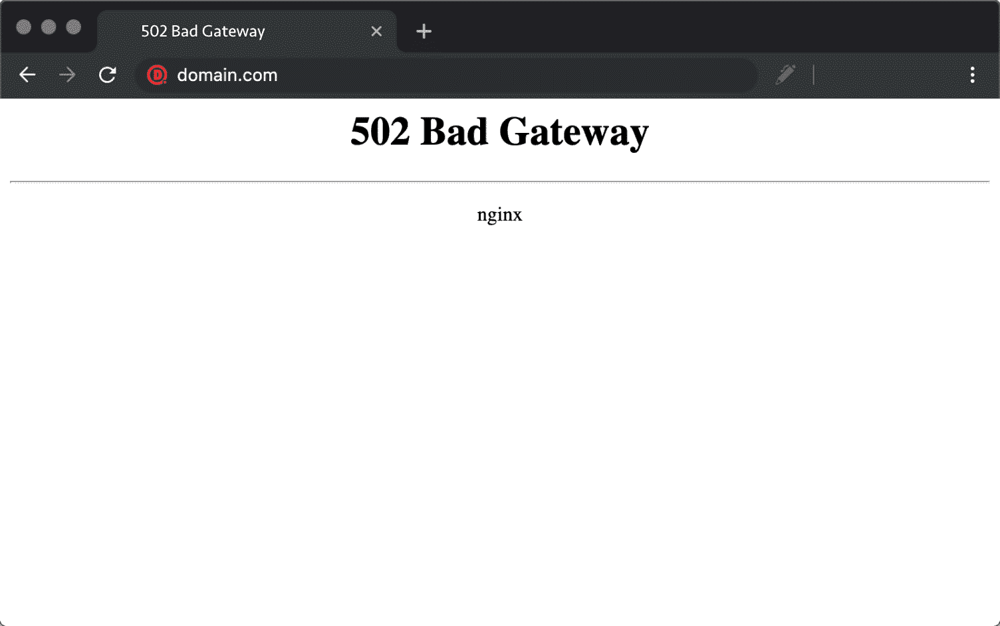
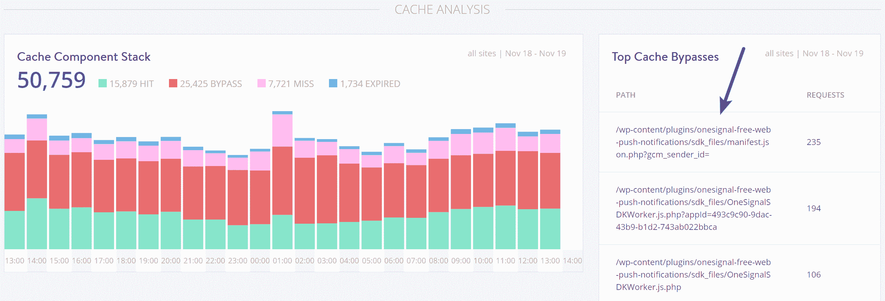
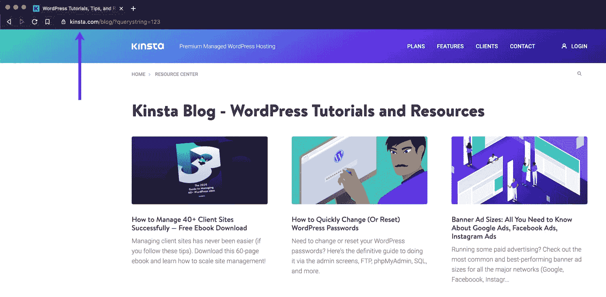

# PHP 工作人员:他们是什么和你需要多少(高级指南)

> 原文：<https://kinsta.com/blog/php-workers/>

当谈到选择一个[主机方案](https://kinsta.com/plans/)的时候，选择一个最符合你的 WordPress 网站需求的方案是很重要的。

例如，一个每月有 50，000 名访客的电子商务网站通常会比一个拥有相同流量的简单博客对资源的需求更高。

这仅仅是因为电子商务网站本质上通常是动态的，需要更多的 PHP 和数据库查询资源。

这就是 PHP 工作人员发挥作用的地方。阅读下面更多关于什么是 PHP 工作器以及如何使用它们来加速你的站点上的请求处理的内容。

## 什么是 PHP 工作者？

在 WordPress 的上下文中，PHP 工作人员构建页面，处理预定的后台任务，等等。由于 PHP 工作人员直接负责生成 HTML 页面以服务于您站点的访问者，他们决定了您的站点在任何给定的时间可以处理多少个并发的未缓存请求。

例如，假设你的 WordPress 站点配备了两个 PHP 工作器，没有[页面缓存设置](https://kinsta.com/blog/wordpress-cache/#page-cache)。如果有四个请求同时到达您的站点，其中两个请求将被立即处理，而另外两个请求必须在队列中等待，直到前两个请求处理完毕。

在 Kinsta，我们使用 PHP workers 作为不同计划层级的变量之一。例如，企业 1 计划每个站点有 4 个 PHP 工作人员，而企业 4 计划有 14 个。

> 需要在这里大声喊出来。Kinsta 太神奇了，我用它做我的个人网站。支持是迅速和杰出的，他们的服务器是 WordPress 最快的。
> 
> <footer class="wp-block-kinsta-client-quote__footer">
> 
> 
> 
> <cite class="wp-block-kinsta-client-quote__cite">Phillip Stemann</cite></footer>

[View plans](https://kinsta.com/plans/)

虽然[我们实现了服务器级缓存](https://kinsta.com/blog/wordpress-cache/)，但是对于缓存被绕过或错过的请求，PHP 工作人员变得非常重要，因为他们必须为每个请求做工作。

通常我们会在电子商务和社区论坛网站上看到很多未缓存的请求。因此，这些站点将需要额外的 PHP 工作人员来确保每个请求都得到处理，没有延迟或超时。

如果你的网站是高度优化的或者没有很多 PHP 代码(例如，一个复杂的主题或者很多的 WordPress 插件，那么处理每个请求应该几乎是立即发生的。即使有 2 个 PHP 工作器和 4 个请求，这四个请求也能很快得到处理。

简单来说，**PHP worker 就是运行 PHP 代码**的服务器上的后台进程。

## WordPress 如何使用 PHP Workers？

在我们进入如何优化 WordPress 的 PHP 工作器使用之前，我们必须首先了解 WordPress 是如何使用 PHP 工作器的。

非缓存环境中的典型请求如下:

1.  网络服务器( [Nginx 或 Apache](https://kinsta.com/blog/nginx-vs-apache/) )接收来自访问者的请求。
2.  Nginx 将请求传递给 PHP。
3.  PHP 根据需要查询 [MySQL 数据库](https://kinsta.com/knowledgebase/what-is-mysql/)，并使用你的主题的 PHP 模板生成一个 HTML 页面。
4.  PHP 将呈现的 HTML 页面送回 web 服务器。
5.  这一页是提供给访问者的。

在上面强调的过程中，步骤 3 是最耗费时间和资源的(CPU 和 RAM)。一个具有最少数据库查询和高效 PHP 代码的高度优化的网站将相对较快地完成第三步。

相反，如果一个站点的 PHP 代码写得很差，会产生大量不必要的数据库查询，那么它在完成第 3 步时会花费更多的时间，这意味着请求会占用 PHP 工作人员更长的时间。

## PHP 工作人员和 CPU 是什么关系

当谈到 WordPress 性能时，PHP 工作人员和可用 CPU 之间的关系是一个需要考虑的重要因素。

如果缺乏 CPU 资源是你的站点的瓶颈，增加 PHP 工作人员的数量不会提高你的站点的性能——它只会让你的站点同时处理更多的请求，降低每个请求的性能。

让我解释一下。

想象一个只有一根软管的消防栓。只有一个软管连接，消防栓能够提供足够的水压。现在，如果我们在消防栓上接上十根水管会怎么样？

有限的水压分布在十根软管上，这意味着每根软管完成工作所需的水压更小。在这个类比中，消防栓是 CPU，水管是 PHP 工作人员。

记住以上几点，如果你的主机不断建议你增加 PHP 工作人员**而没有提到 CPU**，你应该小心。

在 Kinsta，我们的定制 LXD 容器配置了充足的 CPU 和 RAM 资源。我们还使用计算优化的 [C2 虚拟机](https://kinsta.com/feature-updates/google-cloud-platform-c2-vms/)配备谷歌云最快的 CPU，帮助您网站的 PHP 工作人员更有效地运行。我们可扩展的基础设施确保你的 WordPress 站点的 PHP 工作人员有足够的 CPU 资源以最高性能运行。

让我们暂时回到消防栓的类比。

想象一下，你处在一个需要用五根水龙带扑灭十场大火的情况下。连接完所有五根软管后，您意识到消防栓仍在提供充足的水压。

在这种情况下，连接更多的软管是有意义的，因为消防栓的水压不是瓶颈。

类似地，如果你的站点即使有足够的 CPU 和 RAM 开销也表现不佳，这时你应该考虑增加 PHP 工作人员的数量，作为提高性能的一个选择。

## 如何优化你的站点的 PHP 工作器的使用

我们已经解释过 PHP 工作器是后台进程，它用 PHP 代码生成 HTML 页面。现在，减少和优化 PHP 工作线程使用的最显而易见的方法是减少满足站点请求所需的 CPU 和 PHP 资源的数量。

下面是怎么做的。

### 1.为你的 WordPress 站点设置缓存

减少 PHP 工作器使用的第一步是为你的 WordPress 站点设置缓存层。默认情况下， [WordPress 是一个动态的 CMS](https://kinsta.com/blog/wordpress-vs-static-html/) ,按需满足每个页面请求。

对于许多像博客、在线杂志和[作品集](https://kinsta.com/blog/wordpress-portfolio-plugins/)这样的网站，使用 PHP 为每个请求动态生成页面是没有必要的。

#### 页面缓存

你正在阅读的博客文章是一个不需要动态生成的页面的完美例子。和我们的许多[其他帖子](https://kinsta.com/blog/)一样，这篇帖子的内容被设计成静态的，所以不需要花费 CPU 资源来连续生成相同的页面。

相反，最好让 PHP 生成一次页面，然后缓存它。与用 PHP 动态生成页面相比，页面缓存有许多明显的优势。

例如，想象一下，如果你网站上的一篇[博客帖子像病毒一样传播](https://kinsta.com/clients/dartdrones-shark-tank-effect/),并在发布后几个小时内获得 100，000 的页面浏览量。如果没有页面缓存，您的 PHP 工作人员可能会不知所措，您的服务器可能会崩溃。

使用页面缓存，只有第一页视图会动态生成。其他 99，999 个请求将由您的页面缓存提供服务，这使用了相对较少的 CPU 资源。

有两种方法可以为你的 WordPress 站点设置页面缓存。

1.  使用类似 Nginx 的 [web 服务器进行服务器级页面缓存。](https://kinsta.com/knowledgebase/what-is-nginx/)
2.  基于插件的页面缓存，带有像 [WP-Rocket](https://kinsta.com/blog/wp-rocket/) 这样的 WordPress 插件。

为了获得最佳性能，我们建议尽可能使用服务器级页面缓存。在 Kinsta 上，我们所有的网站都使用 [Nginx 的 FastCGI 缓存模块](https://kinsta.com/blog/wordpress-cache/#page-cache)来实现超快的性能。

如果你的主机没有提供服务器级的页面缓存选项，下一个最好的选择是使用一个 [WordPress 缓存插件](https://kinsta.com/blog/wordpress-caching-plugins/)来实现应用程序级的页面缓存。

#### 对象缓存

对于不能有效利用页面缓存的 WooCommerce 商店、社区论坛和其他 WordPress 网站来说，在 MySQL 数据库前添加一个像 Redis 这样的 T2 持久对象缓存可以提高性能并减轻 PHP 工作人员的负担。

如果没有持久对象缓存， [MySQL 数据库查询](https://kinsta.com/knowledgebase/what-is-mysql/)将为每个请求执行，即使结果与之前的查询相同。

例如，一个绕过页面缓存的[社区论坛站点](https://kinsta.com/blog/wordpress-forum-plugins/)将对数据库进行单独的相同查询，以获取帖子数据来构建页面。

对于[高流量](https://kinsta.com/blog/how-to-drive-traffic-to-your-website/)和数据库繁重的网站，这种查询数据库的方法效率很低，因为它使用 PHP 工作器为不同的请求生成相同的查询结果。这就是 Redis 的用武之地。

Redis 将数据库查询的结果存储在 RAM 中，这允许 PHP 获取已经执行的查询的结果。这种对象缓存方法允许 PHP 工作人员节省 CPU 资源，减少完成请求的时间，因为它消除了重复数据库查询的需要。

### 2.优化你的 PHP 代码

除了设置页面缓存，另一个有助于减少 PHP 工作器使用的策略是优化您的 [PHP 代码](https://kinsta.com/blog/is-php-dead/)。在 WordPress 的上下文中，“优化 PHP 代码”可能意味着各种不同的事情，所以让我们更深入地了解一下。

WordPress 最受欢迎也最受讨厌的特性之一(取决于你问谁)是它通过插件和代码片段的可扩展性。

如果你想在你的 WordPress 站点上添加一个股票行情插件，有一个插件可以做到。类似地，如果你想[添加自定义字体](https://kinsta.com/blog/how-to-change-font-in-wordpress/)，也有一个`functions.php`代码片段。

用额外的功能扩展 WordPress core 已经变得如此容易，以至于我们经常走极端而没有考虑对网站性能的潜在影响。

因此，优化您的 PHP 代码的第一个方法是执行站点范围的审计，以确定哪些插件和代码片段是真正必要的。

## 注册订阅时事通讯

### 想知道我们是怎么让流量增长超过 1000%的吗？

加入 20，000 多名获得我们每周时事通讯和内部消息的人的行列吧！

[Subscribe Now](#newsletter)

#### 选择优质插件

通常情况下，WordPress 网站上插件的数量没有插件的质量重要。如果一个插件在过去六个月内没有更新，我们建议选择另一个符合要求的插件。

这样做的原因是 [WordPress 在不断改进](https://kinsta.com/blog/wordpress-5-4/)。如果一个插件已经很多年没有更新了，很可能它的代码没有利用最新的 WordPress 开发和安全最佳实践。

相反，如果一个[插件每隔几周就不断更新](https://kinsta.com/knowledgebase/manually-update-wordpress-plugin/)，那么开发者很有可能对质量很认真，这使得它成为你的 WordPress 站点的一个好选择。

#### 仅在需要时使用插件

如果你想在你的网站上执行一个简单的任务，比如添加 JavaScript 或 CSS，你并不总是需要一个插件。相反，[你可以将代码](https://kinsta.com/knowledgebase/edit-wordpress-code/)直接添加到[你的主题的 PHP 模板或者带有](https://kinsta.com/blog/wordpress-css/#wordpress-and-css)[子主题](https://kinsta.com/blog/wordpress-child-theme/)的`style.css` 文件中。

下一次当你在考虑[安装一个插件](https://kinsta.com/knowledgebase/how-to-install-wordpress-plugins/)的时候，先花点时间看看它是否 100%有必要。有时，没有办法安装另一个插件，这没关系。其他时候，您可以通过不安装不必要的插件来避免增加额外的代码膨胀。

#### 选择轻量级主题

根据我们监控数千个 WordPress 站点的经验，我们发现主题有时是 PHP 性能差的原因。为了迎合 WordPress 作为通用 CMS 的多功能性，一些开发者为各种用例编写主题。

通常，这导致代码繁重和臃肿的主题，没有以有效的方式利用 PHP 和数据库查询。

当建立一个 WordPress 网站时，重要的是[选择一个最具性能和可定制的主题](https://kinsta.com/best-wordpress-themes/#fast)—[generate press、OceanWP 和 Astra](https://kinsta.com/blog/fastest-wordpress-theme/) 就是三个例子。

### 3.选择注重性能的 WordPress 主机

信不信由你，[选择正确的 WordPress 主机](https://kinsta.com/features/)会对你网站的表现产生巨大的影响。由于 PHP 工作人员的效率与 CPU 和 RAM 直接相关，所以将您的站点托管在一个拥有最新硬件的现代服务器上可以帮助您优化 PHP 工作人员的使用。

这里有两个例子说明为什么选择一个注重性能的主机对你的 WordPress 站点很重要。

#### 高性能 CPU

PHP 使用 CPU 资源来执行代码。更快的 CPU 意味着更快的代码执行。在 Kinsta，我们使用谷歌云最快的服务器——计算优化的 C2 虚拟机。

这些虚拟机配备了最新的英特尔至强处理器，能够以 3.8 GHz 的全核睿频运行。在我们的[基准测试](https://kinsta.com/feature-updates/google-cloud-platform-c2-vms/#paving-the-way-for-unrivaled-wordpress-performance)中，我们看到 C2 机器的性能比传统的 N1 机器高出 2-4 倍。

#### 快速固态硬盘存储

磁盘 I/O 速度会对代码执行和数据库查询产生直接影响。如果你的数据库存储在一个缓慢的机械磁盘或基于云的固态硬盘上，没有足够的 IOPS(每秒输入/输出操作)，你的 PHP 工作人员将被迫花更多的时间来完成一个请求。

我们使用谷歌云平台的[高性能固态硬盘存储](https://kinsta.com/feature-updates/more-disk-space/)来确保你的 WordPress 站点可以访问快速磁盘 I/O。

厌倦了慢热的主持人？Kinsta 的设计考虑了速度和性能。[查看我们的计划](https://kinsta.com/plans/?in-article-cta)

### 4.与性能专家合作(可选)

如果您不确定如何解决您站点上的性能问题，我们建议您与一位[合格的性能专家](https://kinsta.com/partners/)合作来诊断问题。

专家可以通过使用先进的监控工具，如 [New Relic](https://kinsta.com/blog/wordpress-performance-new-relic/) 或[查询监控器](https://kinsta.com/blog/query-monitor/) WordPress 插件，帮助你识别代码中的具体瓶颈。

通过放大和检查单个 PHP 进程和数据库查询，有可能识别给站点的 PHP 工作人员带来高负载的特定代码块及其相关特性。

总结 PHP 工作器优化，请记住以下提示。

1.  CPU 和 RAM 应该和 PHP 工作人员一起按比例增加。如果 CPU 使用率被锁定在 100%，增加更多的 PHP 工作线程不会提高性能。
2.  用一个注重性能的主机来托管你的站点可以解决很多性能问题。
3.  [页面缓存](https://kinsta.com/help/full-page-caching/)和[对象缓存](https://kinsta.com/help/redis-cache/)可以显著降低 PHP 工作负载。
4.  使用高质量的 WordPress 插件和主题可以减少网站上不必要的代码膨胀。
5.  如有必要，[与绩效专家](https://kinsta.com/partners/)一起确定并解决复杂的问题。

## PHP 工作人员不足的结果

为了让你的 WordPress 站点达到[快速可靠的性能，确保它有足够的 PHP 工作人员是很重要的。当 PHP 工作人员已经忙于一个站点时，他们开始建立一个队列。](https://kinsta.com/blog/debugging-wordpress-performance/)

一旦达到 PHP 工作线程的极限，队列就开始推出旧的请求，这可能导致 [504 错误](https://kinsta.com/blog/504-gateway-timeout/)或不完整的请求。

我们看到的另一个由于缺乏 PHP 工作人员而导致的常见错误是 [502 坏网关错误](https://kinsta.com/blog/502-bad-gateway/)。这些错误与 504 错误略有不同，因为该错误发生在 PHP 工作队列超时 60 秒之后。

这些错误不仅会给你的访问者带来糟糕的用户体验，还会对你网站的 SEO 产生负面影响。

A 502 (Bad Gateway) error.

有许多不同的因素会导致页面加载缓慢或出错。例如，如果一个未缓存的请求需要来自数据库的大量数据，则结果查询可能需要 20-30 秒才能完成。

在这种情况下，一个 PHP 工作人员至少会被占用半分钟。如果您的站点只有两个 PHP 工作人员，那么仅仅两三个这样长的请求就足以引发错误。

为了解决这个问题，[优化 MySQL 数据库](https://kinsta.com/knowledgebase/wp-options-autoloaded-data/)并增加 PHP 工作线程(如果 CPU 还没有达到极限)可以提高性能。

## 估计所需 PHP 工作人员的数量

Kinsta 的每个托管计划都包括一定数量的 PHP 工作人员。包含的 PHP 工作人员数量是基于我们在过去几年中收集的历史资源使用指标。一般来说，以静态内容为主的网站——文章、静态页面和作品集——不需要很多 PHP 工作人员。

对于像[电子商务](https://kinsta.com/learn/woocommerce-guide/)或[论坛](https://kinsta.com/knowledgebase/bbpress/)这样的更大的 WordPress 网站，我们发现 4 个 PHP 工作者是一个很好的起点。然而，这可能因网站而异，因为每个网站都有自己独特的主题、插件、数据库查询和缓存与未缓存的比率。

在某些情况下，可能需要更多的 PHP 工作人员来获得快速可靠的性能。如果你不确定你的网站在 Kinsta 上需要多少 PHP 工作人员，我们的[销售和支持团队](https://kinsta.com/kinsta-support/)可以帮你找到。

### PHP 工作进程限制图表

MyKinsta analytics 中的 PHP 工作线程限制图表可以让您看到 PHP 引擎在其错误日志中报告达到最大分配工作线程数的次数。这个图表可以帮助您判断性能优化是否影响了 PHP 工作线程的使用。

Top cache bypasses.

例如，如果您将站点的 [PHP 版本从 5.6 切换到 7.4](https://kinsta.com/blog/php-7-4/) ，您可能会看到 PHP 工作线程限制的下降，因为 PHP 7.4 比 5.6 快得多。

类似地，如果您与一位性能专家一起修复长数据库查询，并将[切换到一个更轻量级的主题](https://kinsta.com/blog/change-wordpress-theme/)，那么您可以使用 PHP 工作线程限制图表来查看优化前后的差异。

### 高速缓存分析图表

您还可以使用 [MyKinsta](https://kinsta.com/MyKinsta) 中的缓存分析报告来确定缓存命中、绕过、[未命中](https://kinsta.com/knowledgebase/cache-miss/)和过期的数量。当优化您的站点对 PHP 工作器的使用时，这些数据尤其有用。

#### 使用查询字符串绕过缓存

默认情况下，带有类似于`https://kinstalife.com/?query=123`的查询字符串的[URL](https://kinsta.com/knowledgebase/what-is-a-url/)会绕过页面缓存。在某些情况下，查询字符串会导致大量不必要的 PHP 和 CPU 使用。

例如，如果你访问一个来自脸书的链接，你经常会在 URL 的末尾看到`?fbclid=`查询字符串。同样，你可以在点击[电子邮件简讯](https://kinsta.com/wordpress-newsletter/)中的链接后看到 UTM 跟踪参数。

A URL with a query string (?querystring=123).

如果你的站点上的一个帖子像病毒一样传播，并且不断地被查询字符串访问，你将能够通过缓存分析报告识别特定的 URL。

有了这些关键信息，您就可以[联系我们的支持团队](https://kinsta.com/kinsta-support/)来强制缓存这个特定的 URL，以减轻您的 PHP 工作人员的负担。

### 识别资源密集型插件

在某些情况下，缓存分析图表还可以用于识别资源密集型插件和进程。

例如，如果您看到顶部缓存绕过 URL 指向一个特定插件目录中的文件，那么很有可能是该插件导致了 PHP 工作线程的高使用率。

如果你在缓存绕过列表中看到很多插件相关的请求，你可以[与开发者](https://kinsta.com/blog/hire-wordpress-developer/)合作解决这个问题，或者切换到使用更少资源的插件。

## 摘要

维护一个快速的站点的目标是最大化后端的效率。当 PHP 工作器通过在工作器数量、CPU 使用和代码优化之间找到平衡而被正确利用时，WordPress 可以成为一个非常高效的 CMS。

如果您是[金士达的客户](https://kinsta.com/plans/?plan=visits-business1&interval=month)，请考虑使用[代码缩减功能](https://kinsta.com/help/kinsta-cdn/#code-minification-1)。该功能直接内置在 [MyKinsta](https://kinsta.com/mykinsta/) 仪表盘中，客户只需点击一下就可以轻松实现 CSS 和 JavaScript 的自动缩小。

如果你有任何关于你可能需要多少 PHP 工作人员的问题，或者你认为你可能会因为缺少 PHP 工作人员而看到错误，请[向我们的支持团队开一张票](https://kinsta.com/help/wordpress-support-ticket/)寻求帮助。

现在轮到你了:你使用什么优化策略来保持你的 WordPress 网站平稳运行？请在评论中告诉我们！

* * *

让你所有的[应用程序](https://kinsta.com/application-hosting/)、[数据库](https://kinsta.com/database-hosting/)和 [WordPress 网站](https://kinsta.com/wordpress-hosting/)在线并在一个屋檐下。我们功能丰富的高性能云平台包括:

*   在 MyKinsta 仪表盘中轻松设置和管理
*   24/7 专家支持
*   最好的谷歌云平台硬件和网络，由 Kubernetes 提供最大的可扩展性
*   面向速度和安全性的企业级 Cloudflare 集成
*   全球受众覆盖全球多达 35 个数据中心和 275 多个 pop

在第一个月使用托管的[应用程序或托管](https://kinsta.com/application-hosting/)的[数据库，您可以享受 20 美元的优惠，亲自测试一下。探索我们的](https://kinsta.com/database-hosting/)[计划](https://kinsta.com/plans/)或[与销售人员交谈](https://kinsta.com/contact-us/)以找到最适合您的方式。