# 如何为你的品牌建立定位策略

> 原文：<https://kinsta.com/blog/positioning-strategy/>

当你想到像优步和 Instagram 这样的标志性品牌时，你会想到什么词？也许你会想到优步的“快速”和“实惠”，或者 Instagram 的“分享”和“朋友”。

我们与品牌的关联看起来可能是良性的，但它们对品牌的长期成功至关重要。

客户将你的品牌与什么联系起来会影响他们与你公司的互动。如果这种关联是积极的，他们可能会重复购买或向朋友推荐你。如果关联是负面的，他们可能会避开你的品牌或选择竞争对手。

为了控制消费者如何看待你的品牌，你需要正确定位你的公司。

当然，如果你有一个强有力的定位策略来建立长期的忠诚客户，这将会有所帮助。这篇文章将教你什么是定位策略，以及如何创建一个。

让我们开始吧。

## 什么是品牌定位战略？

定位策略有助于你勾勒出你希望客户如何看待你的品牌。本质上，它概述了你的品牌所熟知的“事物”。

> Kinsta 把我宠坏了，所以我现在要求每个供应商都提供这样的服务。我们还试图通过我们的 SaaS 工具支持达到这一水平。
> 
> <footer class="wp-block-kinsta-client-quote__footer">
> 
> 
> 
> <cite class="wp-block-kinsta-client-quote__cite">Suganthan Mohanadasan from @Suganthanmn</cite></footer>

[View plans](https://kinsta.com/plans/)

尽管我们经常将品牌定位与营销联系在一起，但你的定位策略会影响你业务的许多方面。这包括销售、客户服务、客户关系和订单执行。

制定定位策略有许多优势，因为它可以帮助您:

*   塑造您的客户体验
*   确保你制作的内容符合你的品牌愿景和目标
*   建立品牌认知度
*   设计高质量的[营销策略](https://kinsta.com/learn/content-marketing/)
*   推销你的品牌
*   精心打造可识别的公众形象
*   为你的品牌创造一个利基市场
*   展示你的竞争优势

像任何与品牌相关的东西一样，这些优势只有在定位策略有效时才适用。有效的策略通常会仔细考虑客户的愿望和需求。此外，它们说明了品牌的优势和劣势，并概述了它们的竞争优势。

许多品牌通过 10-50 个词的定位陈述来分享他们的定位策略。这些就像一个使命宣言，除了使命宣言回答了“我们是谁？”定位陈述回答了这个问题:“我们做什么？”

我们将在*“如何设计定位策略”*一节中更深入地阐述定位陈述。

[想让您的业务更上一层楼？📈从这份品牌定位指南开始🚀 点击推文](https://twitter.com/intent/tweet?url=https%3A%2F%2Fkinsta.com%2Fblog%2Fpositioning-strategy%2F&via=kinsta&text=Want+to+take+your+business+to+the+next+level%3F+%F0%9F%93%88Get+started+with+this+guide+to+brand+positioning+%F0%9F%9A%80&hashtags=Branding%2CBrandPositioning)

### 定位策略示例

虽然我们不知道每个品牌在内部是如何定位的，但你可以从他们的营销中看出大多数品牌的策略。

为了使定位策略概念化，让我们分析五个知名品牌的品牌案例。

#### 1.充气屋（塑料等制，充气后竖立）

[AirHouse](https://www.airhouse.io/) 是一个物流平台，帮助人们组织和管理产品运输。

如果你看看 AirHouse 的主页，你会发现该品牌将自己定位为迎合向客户运送产品的零售和电子商务企业。

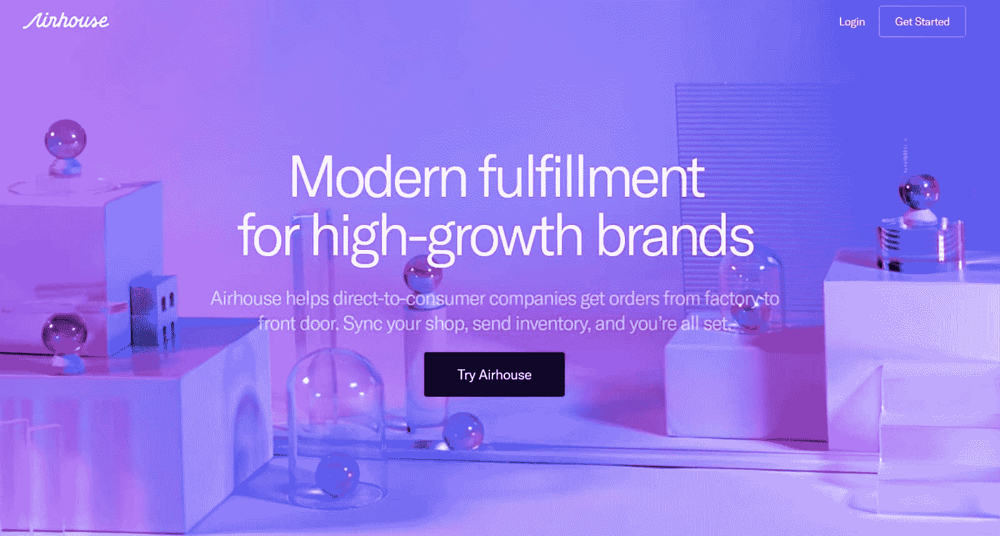

Airhouse.

这个页面上的营销还告诉我们:

*   AirHouse 以提供快速简单的体验而自豪
*   AirHouse 可以帮助品牌增加订单履行规模
*   AirHouse 的“东西”是提供一个基于云的解决方案，实时同步您的履行数据

#### 2.松弛的

[Slack](https://slack.com/intl/en-au/) 是一款为团队设计的专业交流聊天工具。看看 Slack 的主页，你会发现 Slack 将自己定位为公司的“数字总部”。

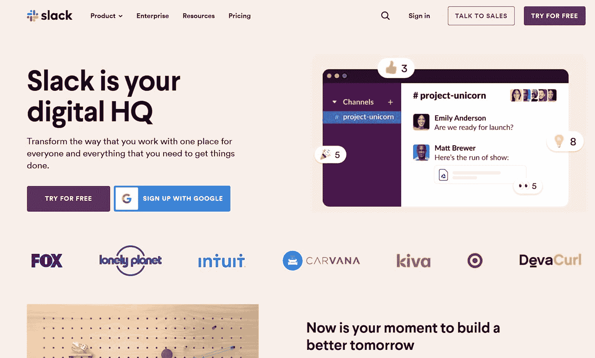

Slack.

此外，Slack 将自己定位为:

*   值得信赖的品牌，如首页提到的 Fox，Lonely Planet，Intuit，Carvana，Kiva，Target，DevaCurl 使用 Slack
*   未来的工具，Slack 用“建设更美好的明天”这样的短语来描述你可以用 Slack 做什么
*   一个与谷歌兼容的工具，Slack 会提示访问者“注册谷歌”

#### 3.中环

[RingCentral](https://www.ringcentral.com/) 是一家云通信公司，为小型、中型和大型企业提供语音、文本、传真和会议解决方案。

如果你看一下 RingCentral 的主页，你会发现该公司将自己定位为一个全方位的提供商，优先考虑让客户“连接”

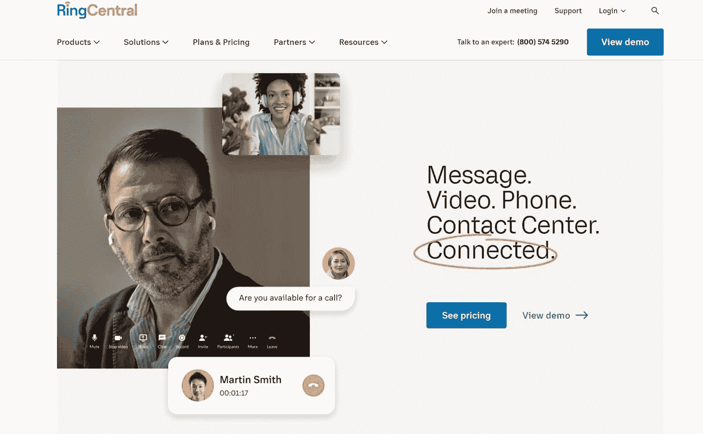

RingCentral.

向下滚动 RingCentral 的主页还显示，该公司通过提供“快速解决”的 24 小时支持、“更快投资回报”的专业服务、“加速业务增长”的集成解决方案以及提供“业务驱动洞察”的实时分析，使自己与竞争对手区分开来。

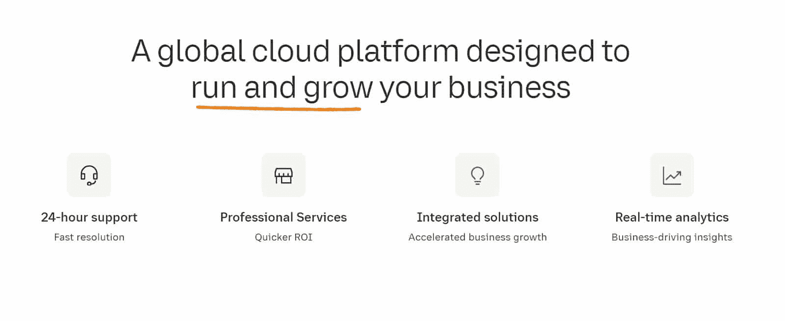

RingCentral 24-hour support.

#### 4.蜂蜜

PayPal 旗下的 [Honey](https://www.joinhoney.com/) 是一个浏览器扩展，收集热门网站的折扣券，并自动应用于用户的交易。

Honey 的营销是建立在社会证明扩展是值得信赖的基础上的。这份证据包括 Honey 在“30，000 多个网站”上工作，拥有“167，000 条 Chrome 商店评论”，并为“1700 万会员服务，并且还在增加。”

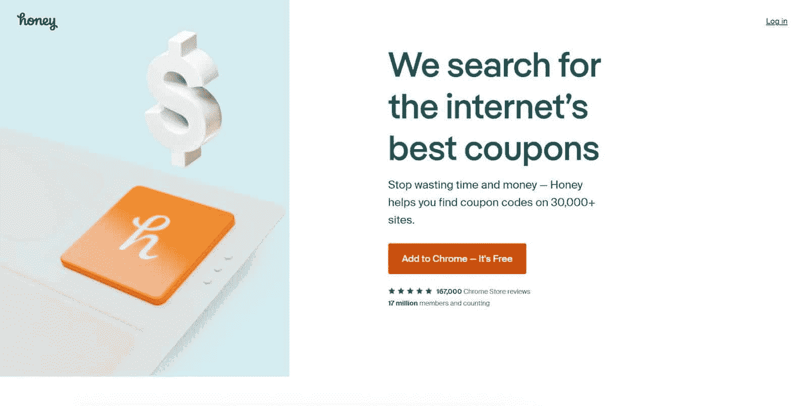

Honey.

如果你看看 Honey 的脸书页面，你也可以看到 Honey 把自己定位成顾客的朋友，用“一起更聪明地购物”和“加入 Honey”这样的语言 Honey 的客服邮箱，“[【邮箱保护】](/cdn-cgi/l/email-protection)”也是用的这个定位。

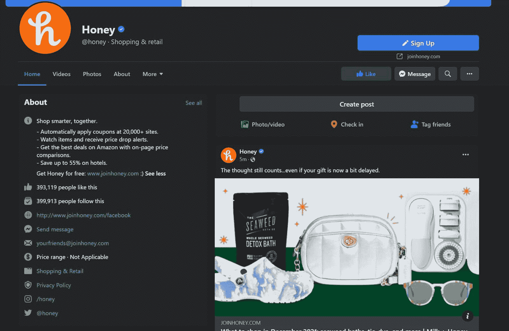

Honey Facebook page.

#### 5.美的功能

[美容功能](https://www.functionofbeauty.com/)根据每位顾客的喜好生产个性化的美容、护肤和护发产品。

如果你看看 Function of Beauty 的网站，你会发现该品牌将自己定位为“可定制美容的世界领导者”这种定位很聪明，因为它提供了社会证明，同时强调美丽的功能是不同的，因为它允许定制产品。

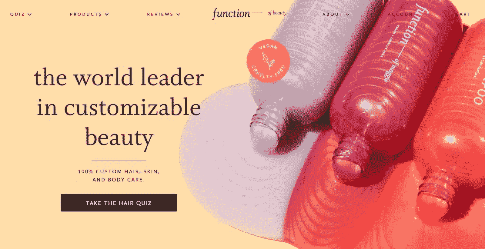

Function of Beauty.

### 定位感知地图

看了 RingCentral 和 Function of Beauty 的营销后，您可能已经注意到竞争对手在良好的定位策略中起着至关重要的作用。有效的定位策略描述了为什么你的品牌是独一无二的，从而将你与你的竞争对手区分开来。

当然，在设计定位策略时，并不总是容易看出你的品牌是如何独特的。

这就是定位感知图的用武之地。

定位感知图(也称为“品牌图”或“魔力象限”)是一种视觉表现，一次使用两个或更多因素来展示您的品牌与竞争对手相比的情况。当营销人员创建感知地图时，他们从目标客户的角度进行思考。

以下是感知地图的样子:

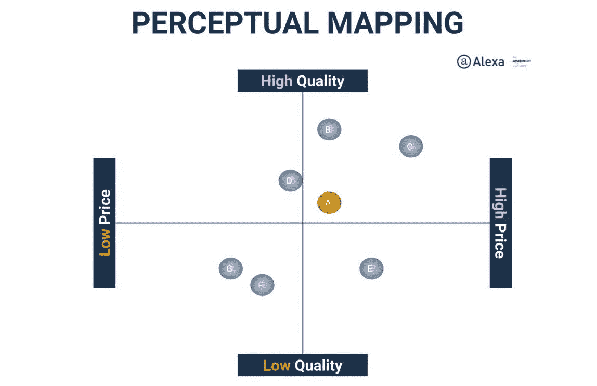

A perceptual map.

虽然您可以在地图中使用任何您喜欢的因素，但以下是许多品牌使用的一些常见因素:

*   费用
*   时间投资
*   易用性
*   产品质量
*   客户服务
*   可信赖
*   供应链伦理
*   收益性

虽然许多品牌使用感知地图作为内部工具来指导运营和营销决策，但一些品牌也选择分享其感知地图作为营销工具。例如，RingCentral 在其网站上发布了这张感知地图:

A magic quadrant comparing businesses in the communications field.

## 定位策略的类型

到目前为止，我们已经从整体上介绍了定位策略。然而，有七种不同“类型”的定位策略，每一种都使用独特的角度。

这些战略是:

### 1.基于定价的策略

基于定价的策略根据成本、定价模式或你提供的资金价值来定位你的品牌。

例如，一个采用定价策略的品牌可能会将自己描述为“家庭负担得起”或“低价零售商”

然而，基于定价的策略并不总是玩到最后的竞争，因为像 Mouawad(出售[380 万美元](https://www.theguardian.com/business/2017/oct/17/top-of-the-rocks-worlds-most-expensive-handbag-goes-on-sale)的手提包)这样的高级品牌也使用基于定价的策略将产品营销为奢侈品。

或者，像网飞和 Hulu 这样的品牌在他们的定位中使用他们的[基于订阅的定价](https://kinsta.com/blog/recurring-revenue-model/)模式，因为基于订阅的定价允许消费者灵活地观看大量的内容目录，而不仅仅是一次租一部电影或一个节目。

### 2.基于产品的战略

基于产品的策略围绕产品和服务的质量来建立你的品牌定位。例如，产品定位策略可能强调产品是耐用的、可靠的、可靠的、时尚的、环保的、不残忍的、犹太的或纯素食的。

或者，基于产品的策略可能会用[关键特征或优势](https://kinsta.com/blog/features-vs-benefits/)来推销你的品牌。[在语法上](https://kinsta.com/blog/grammarly-alternative/#overview-of-grammarly)就是这么做的，因为它围绕提供一个程序来建立自己的品牌定位，这个程序给人们“实时建议以加强他们的写作”

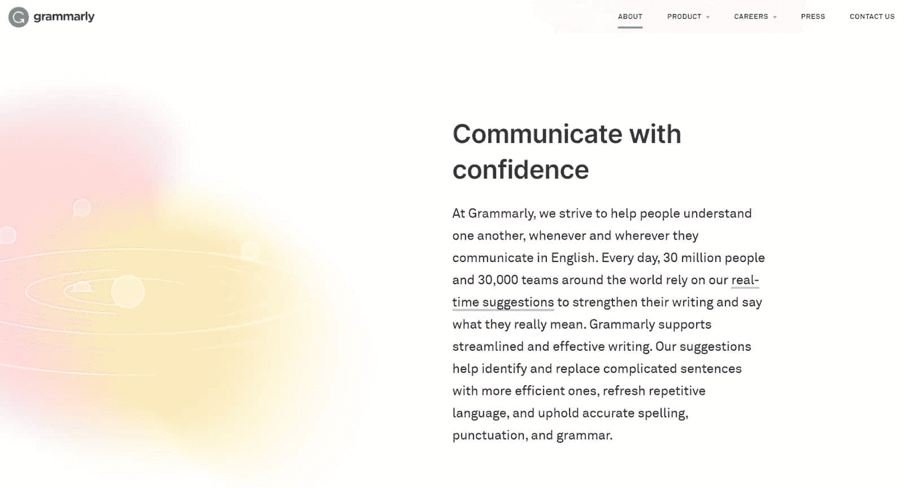

Grammarly “About” page.

### 3.基于使用的策略

基于使用的策略通过你的产品或服务为顾客做什么来定位你的品牌。

例如，Lawyer.com 法律服务将自己定位为他们所在地区的人和律师之间的中介，并打出“今天就与律师联系”的品牌或者，房地产网站 Zumper 承诺帮助用户“找到你的新开始”。

### 4.基于情境的策略

基于情境的策略将你的品牌定位为利基情境中的完美解决方案。本质上，这些策略说，“(品牌)对于需要(结果)的(小众用户)来说是完美的。”

生产笔记本外壳或手机壳等利基产品的品牌使用基于情境的策略，因为他们的产品只适用于特定的设备。

知名品牌也用这个定位。例如，Tylenol 将其旗舰产品 Tylenol 定位为基于情境的策略。该公司专门为那些希望通过对乙酰氨基酚来缓解疼痛的人设计了这种药物。

### 5.基于影响者的策略

基于影响者的策略将品牌定位为由名人、影响者或知名行业人士选择的公司。

## 注册订阅时事通讯

### 想知道我们是怎么让流量增长超过 1000%的吗？

加入 20，000 多名获得我们每周时事通讯和内部消息的人的行列吧！

[Subscribe Now](#newsletter)

利用名人进行定位的一个最著名的例子是 Raycon。Raycon 是一家无线耳机公司，由音乐家 Ray J。

影响者拥有的企业也使用这种类型的定位。例子包括 Cloud9 Scrubs 和 HudaBeauty。

### 6.基于符号的策略

基于符号的策略使用流行的或有文化意义的符号来定位品牌，使其与符号背后的含义相一致。

例如，像卡塔尔航空这样的品牌通过使用与财富、奢侈和显赫联系在一起的紫色和红色来传达一种皇室感。

基于奖项或行业认可营销自己的品牌也使用基于符号的定位策略。像符号一样，这些奖项将品牌与奖项的声望联系在一起。

### 7.基于竞争对手的战略

基于竞争对手的战略将品牌定位为著名品牌的替代品。这些策略经常使用“名牌的免费替代品”或“名牌的环保版本”来强调为什么他们是更好的选择。

你可以在 [Rocket 中看到一个基于竞争对手定位的例子。聊天](https://rocket.chat/)。火箭。Chat 将自己定位为一个交流平台，使用类似“Rocket”这样的语言。Chat 做其他平台做的一切，除了暴露你的数据。”

搜索引擎 [DuckDuckGo](https://kinsta.com/blog/duckduckgo-privacy/) 使用类似的定位来营销自己，作为雅虎、谷歌和必应的替代者。DuckDuckGo 的口号是“你的个人数据不关任何人的事。”

## 创建有效的定位策略

创建一个稳固的定位策略对于树立你的品牌走向成功并带来高转化率至关重要。

例如，考虑一下 Tato Nano 汽车的定位——Tato 只将这种汽车作为低成本产品进行营销。Nano 的价格大约为 2500 美元(尽管 Tato 主要在印度销售)。

汽车本身并不是一个可怕的产品，但将它推销为“廉价”会让人们认为对于买不起不同汽车的人来说，这是一个低质量的投资。因此，Tato 在 2016 年和 2017 年期间仅销售了[7591 辆](https://www.hotcars.com/cheapest-car-world-tato-nano/)nano，该项目[未能为 Tato 带来显著的投资回报](https://web.archive.org/web/20170119022652/http://pixr8.com/tata-motors-says-nano-investment-significantly-written-off/)。

为了帮助您设计更好地为您服务的定位策略，我们将在本节中介绍定位策略的关键组成部分以及如何创建定位策略。

### 定位战略营销的关键组成部分

每个定位策略都有三个关键组成部分。这些有时被称为品牌和定位的“3c”。

如果你认识“3c”这个短语，那是因为大前研一(Kenichi Ohmae)提出的一个流行理论与之同名。大前研一的模型概述了一个公司的成功是因为它的客户、公司和竞争对手。

定位战略的三个 c 是相似的，因为它们包括:

**客户**

“客户”部分涵盖了客户的需求、希望和愿望。由于这些因素在与贵公司的每次互动中都激励着客户，因此将它们纳入您的定位将有助于您更好地为他们服务。

考虑客户的定位时，问自己以下问题会有所帮助:

*   什么能激励你的顾客？
*   忠诚客户和过去客户的区别是什么？
*   是什么促使顾客重复购买？
*   顾客喜欢(品牌)的什么？
*   顾客想改变(品牌)什么？
*   消费者对(品牌)有哪些广泛的认知？

**频道**

“渠道”包括运营、销售和营销渠道，客户通过这些渠道来接触您的品牌。这些渠道包括你的销售团队、[内容营销](https://kinsta.com/learn/content-marketing/)、社交媒体简介、广告、客户服务代表、[电子邮件营销](https://kinsta.com/blog/email-marketing-best-practices/)，以及其他形式的[数字营销](https://kinsta.com/blog/digital-marketing-strategy/)。

考虑客户对你的渠道的看法是至关重要的，因为他们塑造了客户的互动(因此，他们对你的品牌的印象)。

Struggling with downtime and WordPress problems? Kinsta is the hosting solution designed to save you time! [Check out our features](https://kinsta.com/features/)

**比赛**

“竞争”部分指的是你的品牌与你所在的领域和行业中的其他品牌相比如何。

将您的品牌与您的竞争对手进行比较时，询问以下问题会有所帮助:

*   (品牌)做了什么别人没有做的事？
*   (竞争对手的)劣势和优势是什么？
*   (品牌)在供应链道德、可持续性、多样性和包容性方面如何比较？
*   (品牌)的产品和服务与同类产品相比如何？

位置图对于了解你相对于竞争对手的位置至关重要。

## 如何设计定位策略

按照以下步骤设计您的定位策略。

### 第一步。定义你的目标受众

没有顾客，你的公司就无法存在。当然，[确定你的目标受众](https://kinsta.com/blog/ad-retargeting/)是你制定定位策略的第一步。

确定你的目标市场的最简单的方法是通过他们的人口统计，购买行为和品味来描述你的买家。您可能希望以买家的身份展示这些信息。买家角色是对目标市场的描述，如下所示:

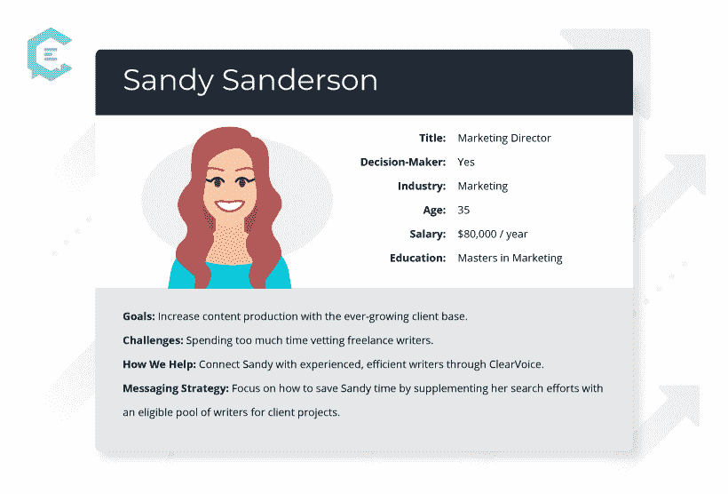

Example of a buyer persona.

在此阶段，您还应该确定您品牌的营销合格线索(MQL)和销售合格线索(SQL)是什么样的。mql 对你的商品有需求，但不像 SQL 那样准备购买。

将您的 MQLs 与 SQL 分开将有助于您在正确的时间将您的品牌定位到目标销售线索。

### 第二步。研究你的竞争对手

接下来，你需要彻底研究你的竞争对手，以确定他们的定位策略。识别竞争对手的策略将帮助你确定是什么让你的品牌与众不同。

你可能想用 SWOT 和 PESTEL 分析来使这个市场调查更容易。

SWOT 分析着眼于公司的优势、劣势、机会和威胁。这里有一个你可以使用的 SWOT 分析模板:

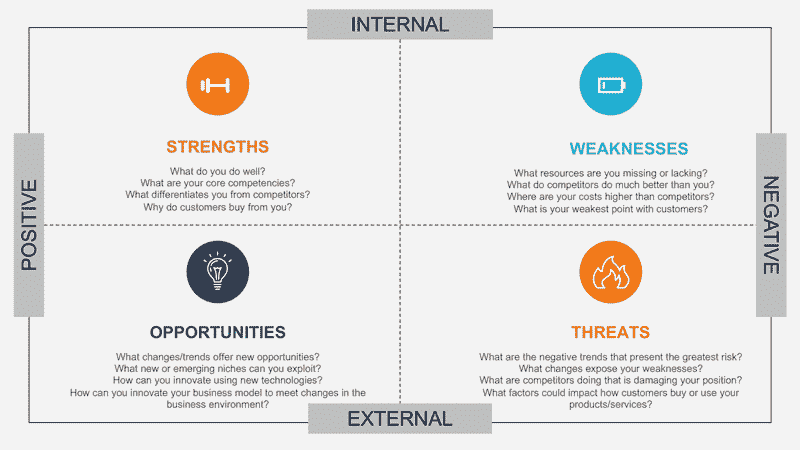

A SWOT analysis breakdown. (**Source:** [GaryFox](//www.garyfox.co/swot-analysis-free-templates/%E2%80%9D))

PESTEL 分析(有时称为“外部因素分析”)关注的是公司周围的环境。它着眼于政治、经济、社会、技术、环境和法律等因素:

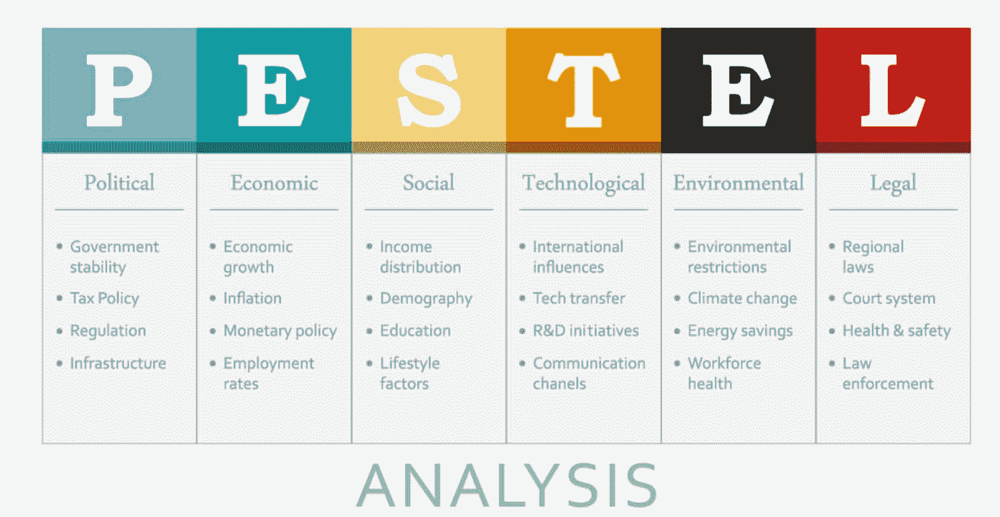

A PESTEL analysis breakdown. (**Source:** [YourTarget](//blog.yourtarget.ch/en/whats-pestel-analysis%E2%80%9D))

### 第三步。脑猝病

一旦你了解了你的受众和竞争对手，开始头脑风暴你的品牌可能使用的潜在定位策略。参考*“定位策略的类型”*部分的这些策略可能会有所帮助:

*   基于定价的策略
*   基于产品利益的战略
*   基于使用的策略
*   基于情境的策略
*   基于影响者的策略
*   基于符号的策略
*   基于竞争对手的战略

你也可以尝试头脑风暴技术，如单词联想、思维导图或像客户一样思考。或者，你可以阅读客户反馈，寻找常见的关键词(如“良好的客户服务”或“环保”)。

无论你选择哪种头脑风暴方法，都要让你的销售、营销和管理团队参与讨论。每个群体对顾客的看法不同，因此他们会提出不同的想法。

### 第四步。缩小你的选择范围

创建选项列表后，您可以通过两种主要方式对其进行排序:

1.  消除与你的品牌价值或目标不一致的想法
2.  突出最强的想法

这也可能有助于结合类似的想法。

这一步会给你留下一些潜在的定位或重新定位策略。请教你的同事找到合适的。

### 第五步。写下你的定位陈述

写一份定位声明会给你一个重新审视的准确参考点。它还将帮助你以一种你和你的同事容易向他人传达的方式清楚地定义你的定位策略。

虽然每个定位陈述都是主观的，但有四件事你应该包括在内:你的目标受众、你做什么(或者你的产品或服务是什么)、你与众不同，以及你帮助客户达到的“最终目标”。

如果您遇到困难，请尝试以下模板:

*   “(品牌)利用(让你与众不同的东西)来帮助(目标受众)达到(最终目标)。”
*   “(目标受众)在需要(最终目标)时会转向(品牌)寻求(让你与众不同的东西)。”

或者，你可以从现有的品牌中汲取灵感。例如，PayHlip 的简短立场声明是，“[我们帮助创作者在网上做他们喜欢的事情来谋生](https://payhip.com/about)”更详细的版本如下:

Payhip 是一个电子商务平台，任何人都可以直接向粉丝和追随者出售数字产品或会员资格。您可以将 Payhip 直接嵌入到您的网站中，或者使用我们的店面来销售您的作品。Payhip 负责一切。我们为创作者提供一体化的电子商务解决方案。”

在写陈述时，请记住以下几点:

*   让您的信息与您的品牌价值保持一致
*   保持陈述简洁
*   用[数据和关键绩效指标(KPI)](https://kinsta.com/blog/saas-marketing/)来支持你的陈述

就是这样！你现在有了一个定位策略，可以应用于你的运营和营销。

## 有效定位策略的最后几个问题

在我们结束这篇文章之前，我们想谈谈支撑大多数定位策略的三个问题。这些问题包括:

*   “什么是(品牌)？”
*   “您为什么应该从(品牌)购买？”
*   “您为什么不应该从(品牌)的竞争对手那里购买？"

虽然很容易陷入精心撰写的定位陈述的华丽辞藻中，但你如何有效地回答这些简单的问题将决定你的策略是否奏效。

同样，很容易将您的定位陈述转变为独特的销售主张(USP)。USP 描述了为什么潜在客户选择你的产品或服务而不是竞争对手。USPs 侧重于产品和服务，而定位声明侧重于品牌。

例如，麦当劳的市场定位策略是，它是一家适合家庭的快餐店，而快乐餐的 USP 是一种价格实惠的儿童餐，附带一个玩具。

重温这三个问题，防止你的定位陈述变成 USP。

[在本指南的帮助下，掌控消费者如何看待你的品牌&正确定位你的公司😎](https://twitter.com/intent/tweet?url=https%3A%2F%2Fkinsta.com%2Fblog%2Fpositioning-strategy%2F&via=kinsta&text=Take+control+of+how+consumers+view+your+brand+%26amp%3B+position+your+company+correctly+with+help+from+this+guide+%F0%9F%98%8E&hashtags=Branding%2CBrandPositioning)

## 摘要

制定成功的定位战略对于 2022 年的竞争至关重要，因为良好的战略定位将帮助您:

*   让你的品牌从竞争对手中脱颖而出
*   创建强有力的营销信息
*   将您的品牌价值与您的营销计划结合起来
*   建立有效的商业策略

建立一个稳固的定位策略可能看起来很复杂，但比你想象的要容易。记得把你的陈述集中在客户身上，坚持你的价值观，并采取基于研究的方法。

既然我们已经详细介绍了定位策略，我们希望听取您的意见。你是如何设计你的定位策略的，你有什么技巧来写一份可靠的定位陈述吗？请在下面的评论中分享它们。

* * *

让你所有的[应用程序](https://kinsta.com/application-hosting/)、[数据库](https://kinsta.com/database-hosting/)和 [WordPress 网站](https://kinsta.com/wordpress-hosting/)在线并在一个屋檐下。我们功能丰富的高性能云平台包括:

*   在 MyKinsta 仪表盘中轻松设置和管理
*   24/7 专家支持
*   最好的谷歌云平台硬件和网络，由 Kubernetes 提供最大的可扩展性
*   面向速度和安全性的企业级 Cloudflare 集成
*   全球受众覆盖全球多达 35 个数据中心和 275 多个 pop

在第一个月使用托管的[应用程序或托管](https://kinsta.com/application-hosting/)的[数据库，您可以享受 20 美元的优惠，亲自测试一下。探索我们的](https://kinsta.com/database-hosting/)[计划](https://kinsta.com/plans/)或[与销售人员交谈](https://kinsta.com/contact-us/)以找到最适合您的方式。