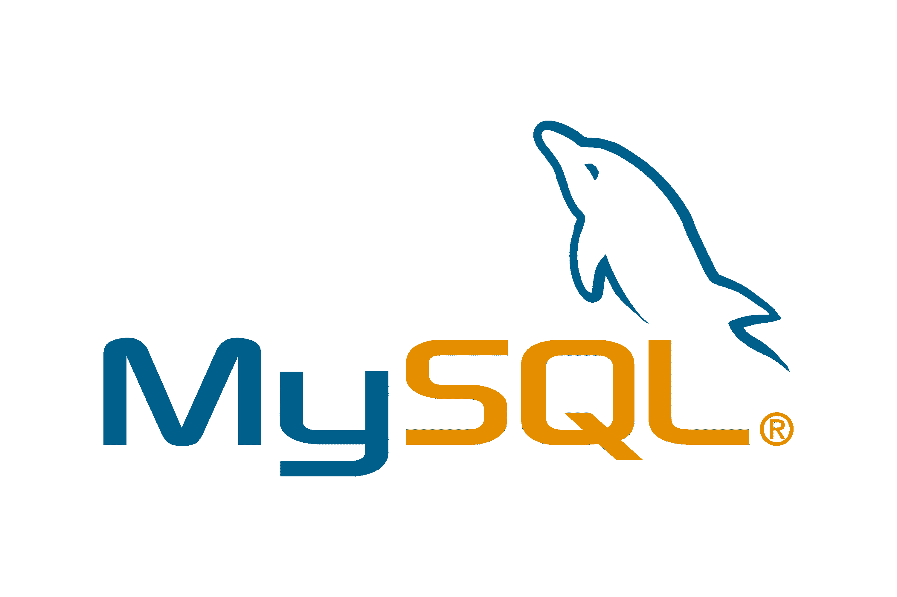

# PostgreSQL 与 MySQL:探索它们的 12 个关键区别

> 原文：<https://kinsta.com/blog/postgresql-vs-mysql/>

数据本质上只是不同事实和观察的集合。随着时间的推移，开发人员意识到管理数据不仅仅是一个可选的跟踪系统，而且随着世界逐渐通过互联网变得更加紧密，管理数据是必要的。

今天，企业利用数据来分析潜在客户，实现他们的潜力，降低风险等。

随着全球数据量的增加，对能够帮助更高效地管理数据的强大而灵活的数据库的需求也在不断增长。本文将研究 WordPress 最常用的两个开源数据库及其区别:PostgreSQL 和 MySQL。

但是首先，什么是 WordPress 数据库？

让我们来了解一下！

## 什么是 WordPress 数据库？

不少企业使用 WordPress 托管他们的网站，这一数字高达互联网上所有网站的 43%!除此之外，它占所有部署的内容管理系统(CMS)的 60%左右。其易于使用的布局使其成为初学者的完美选择。虽然使用 WordPress 并不需要事先有编码知识，但它确实有助于[理解不同的元素](https://kinsta.com/knowledgebase/wordpress-files/)，包括数据库。


> Kinsta 把我宠坏了，所以我现在要求每个供应商都提供这样的服务。我们还试图通过我们的 SaaS 工具支持达到这一水平。
> 
> <footer class="wp-block-kinsta-client-quote__footer">
> 
> 
> 
> <cite class="wp-block-kinsta-client-quote__cite">Suganthan Mohanadasan from @Suganthanmn</cite></footer>

[View plans](https://kinsta.com/plans/)

没有一个 [WordPress 数据库](https://kinsta.com/knowledgebase/wordpress-database/)，你的网站将无法运行。数据库系统本质上是你网站的主干。它确保一切都被跟踪，从您博客上的内容到不同用户的评论和更改。它甚至增强了网站的加载和执行能力。

理想的数据库应该是灵活的、成本友好的和可伸缩的。你可以高枕无忧，因为有各种各样的[开源数据库](https://kinsta.com/blog/open-source-database/)可以帮助你在 WordPress 中跟踪你的数据。我们现在将把重点放在 PostgreSQL 和 MySQL 上。

[Discover the two most used open-source databases for WordPress and their differences: PostgreSQL and MySQL. ✅Click to Tweet](https://twitter.com/intent/tweet?url=https%3A%2F%2Fbit.ly%2F3ww5Hed&via=kinsta&text=Discover+the+two+most+used+open-source+databases+for+WordPress+and+their+differences%3A+PostgreSQL+and+MySQL.+%E2%9C%85&hashtags=MySQL%2CPostgreSQL)

## PostgreSQL 是什么？


PostgreSQL logo (Image source: [Uberconf](https://uberconf.com/blog/bruce_snyder/2013/06/installing_postgresql_9_0_on_mac_os_x_10_6_8_via_macports))


PostgreSQL 是一个开源的对象关系数据库管理系统。它完全符合 SQL，功能丰富。它也是可扩展的，对任何需要企业工具的人都很有用。它是专为效率而设计的，可以集成到几乎任何软件中。

PostgreSQL 是面向对象的，这使得扩展数据类型来创建您的自定义类型成为可能，并且它支持几乎任何数据库。本节将详细介绍它的历史、特性和用例。

### 历史

40 年前，少年先锋 Ingres 项目组的组长迈克尔·斯通布雷克离开 Berkley，去开发 Ingres 的专有版本。然后，他回到 Berkley，启动了一个后 Ingres 项目，解决了当时其他数据库遇到的几个问题。

这个项目，也就是我们现在知道的 PostgreSQL，配备了支持多种“对象关系”数据类型所需的几个特性，包括支持维护表之间一致关系的规则和跨服务器的数据复制。PostgreSQL 的第一个版本于 1997 年 1 月 29 日形成了 6.0 版。从那时起，开发人员、支持公司，甚至志愿者都在免费和开放的许可下继续维护数据库软件。

### 主要特征

PostgreSQL 作为一个数据库管理系统有很多优点。它以功能强大、高可靠性、高性能、灵活性和易于复制而闻名。

让我们来看看是什么让 PostgreSQL 成为您企业不可或缺的工具。

#### 高度可靠

PostgreSQL 支持多种语言的外键、存储过程、连接和视图。它包括各种数据类型，并支持大型对象的存储，包括图片、声音和视频。由于它是开源的，它得到了开发者的支持，这些开发者通过定期尝试发现错误和改进软件来提供无与伦比的维护系统。

由于预写日志功能，它还具有容错能力，这使得支持在线备份和时间点恢复成为可能。通过安装先前的物理备份数据库，我们可以支持恢复到 WAL 数据覆盖的任何时间点。

此外,“物理备份”不必是数据库状态的即时快照——如果它是在过去创建的，重放特定时间的 WAL 日志将解决任何内部不一致。

#### 灵活的

PostgreSQL 是开源的，因此代码可以跨平台自由修改——它可以适用于任何平台，包括 Windows、Solaris、OS X 和 Linux。除此之外，它可以同时容纳几个用户，只阻塞同一行的并发更新。

#### 展开性

可扩展性是软件工程的一个原则，是关于未来发展的。PostgreSQL 提供了高度的可扩展性，因为它的操作是目录驱动的，即信息存储在数据库、列、表等中。表达式的实时(JIT)编译使您能够用不同的编程语言编写代码，而无需重新编译数据库和定义数据类型。这种自发修改任何操作的能力使它特别适合于快速实施新的存储结构和应用程序。

#### 分身术

PostgreSQL 包括内置的同步[复制](https://kinsta.com/blog/postgresql-replication/)，它确保主节点会等待每次写入，直到复制节点将数据写入其事务日志。可以为每个数据库、会话和用户指定事务的持久性，而不考虑其同步性。这有助于加速事务，因为它不需要确认事务是否到达同步备用状态，特别是当一些流不需要这些保证时。

### 用例

PostgreSQL 几乎无处不在——它位列当今最常用数据库的前五名，仅次于 MySQL。像彭博、高盛和诺基亚这样的大公司都在后端运行 PostgreSQL。

PostgreSQL 可以用于各种行业，而不仅限于一个领域。这里有几个 PostgreSQL 现在可以使用的例子。

*   **政府 GIS 数据** : PostgreSQL 包含一个名为“PostGIS”的强大扩展。该扩展提供了许多功能，可以帮助处理不同的几何形式，如点、线串，并经过优化以减少磁盘和内存占用，从而提高查询性能。电力、应急服务和水基础设施服务主要依靠 GIS 来定位船员并指引他们到达准确的目的地，通常是在具有挑战性的条件下，因此对政府来说很方便。
*   **制造业**:许多制造业需要大量高效的数据存储设施。PostgreSQL 是优化供应链性能和存储的合适选择。这是首选，因为它符合 ACID 标准，并且可以配置为自动故障转移、完全冗余和几乎零停机升级。由于 Oracle 的新许可政策使得小型企业难以承受使用 Oracle 的成本，因此 PostgreSQL 是首选。
*   **Web 技术** : PostgreSQL 不仅仅是关系数据库；它也可以作为 NoSQL 风格的数据存储。您可以在一个产品中同时拥有关系世界和面向文档的世界。它可以在许多现代框架中运行，如 Django (Python)、Hibernate (Java)、Ruby on Rails、PHP 等。由于其复制能力，网站可以很容易地向外扩展，以纳入尽可能多的数据库服务器，你需要的。
*   **科学数据**:研究和科学项目会产生万亿字节的数据，必须以尽可能实用的方式处理这些数据。PostgreSQL 具有出色的分析能力，并提供强大的 SQL 引擎，因此处理大量数据不会造成问题。PostgreSQL 也很容易扩展。可以集成 Matlab 和 R 来执行几个数学和聚合函数。

## 什么是 MySQL？



MySQL logo (Image source: [Mecdata](https://mecdata.it/en/2021/01/spostare-un-database-mariadb-da-un-server-windows-ad-un-altro-server-windows/))


MySQL 是一个简单的关系数据库系统。它非常高效和用户友好，使其成为最受认可的技术之一。使用 SQL，可以快速掌握几个结构化查询语言概念(SQL)概念，构建强大的数据存储系统。它是免费的，并且是开源的，尽管它也可以在各种专有许可下使用。

本节将讨论它的历史、主要特性和用例。让我们开始吧！

### 历史

MySQL 是由瑞典公司 MySQLAB 于 1995 年由 Michael“Monty”wide nius、瑞典人 David Axmark 和 Allan Larsson 创建的。Sun Microsystems 随后收购了 MySQLAB。

MySQL 的目的是为企业和家庭用户提供高效可靠的数据管理选项。该平台的 Alpha 和 beta 版本于 2000 年发布，大多数版本都与主流平台兼容。

大约在同一时间，它开始开源。这允许第三方开发者对系统进行重大修改。然而，开源意味着收入的损失，但随着 MySQL 开始流行，这种损失最终得到了弥补。

截至 2001 年底，活跃安装数量高达 200 万。客观地说，这几乎是斯洛文尼亚的人口！2002 年初，公司扩大业务，在美国开设了总部。到那时，该平台已经拥有 300 万用户，收入总计 650 万美元，而且从那以后，它还在继续流行。

### 主要特征

MySQL server 是多线程、多任务的，设计用于高负载的生产系统。它有事务性和非事务性引擎，是最容易安装的数据库系统之一。MySQL 深受用户喜爱，因为它易于使用、可靠且快速。

既然你已经知道了 MySQL 是如何产生的，让我们来讨论一下它的一些关键特性。

#### 易用性

MySQL 因其易用性而广受欢迎。它保证了一些特性，比如触发器、存储过程等等。它还包括各种实用程序，如崩溃时的备份程序、mysqladmin、管理客户端和用于管理的 GUI (MySQL workbench)。对于初学者来说，它通过一个全面的 GUI 提供了广泛的选项，有助于使它成为当今使用的五大数据库之一。

#### 高灵活性

MySQL 为大容量项目提供了有效和安全的交易。它足够灵活，可以在动态环境中工作。因为它是开源的，所以代码是免费的，可以根据你的喜好进行修改。

#### 可靠性和安全性

就像 PostgreSQL 一样，MySQL 也坚持 ACID 模型。因此，在处理事务时无需担心:由于时间点恢复和自动提交功能，它确保了数据保护。

如果系统崩溃，它将恢复到上一个检查点，从而确保没有数据丢失。此外，由于它是开源的，有一个庞大的开发者社区来确保系统正常工作，在论坛中扩展他们的支持，并修复各种错误。

此外，它通过支持外键约束提供了数据完整性，避免了跨表的数据不一致。因为它有一个密码系统，所以它提供了一个安全的接口，并保证在访问数据库之前根据主机验证密码。密码在连接到服务器时会被加密。

#### 高性能

MySQL 非常快速、可靠，而且便宜，因为它的存储引擎架构非常出色。这意味着它可以提供高性能，而不会失去软件的重要功能。它能够快速加载，因为它的高速缓冲存储器。

随着时间的推移，MySQL 通过确保具有索引压缩的 B 树磁盘表、优化的嵌套循环连接和基于线程的内存分配等特性，提高了性能。存储引擎中的行级锁定和常量读取为多用户并发提供了额外的性能优势。

#### 可攀登的

除了免费和开源之外，MySQL 程序可以用多种语言编写。MySQL connector/NET 允许开发人员将他们的数据链接到数据库。连接器/J 接口为使用 JDBC 关联的 Java 客户端程序提供了 MySQL 支持。用 C 编写的客户端库可用于用 C 或 C++或任何提供 C 绑定的语言编写的客户端。

也可以访问 C、C++、Eiffel、Java、Perl、PHP、Python、Ruby 和 Tcl 的 API。它也是最受欢迎的跨平台数据库系统之一，可以在 Linux、Windows、Solarix 等平台上使用。这一切都表明，它适用于几乎任何软件和操作系统，这使得它具有很高的可扩展性。

#### 开源许可证

MySQL 在开源许可下对用户开放。这使得用户可以自由地使用和修改代码，使其与其他领域兼容。

由于它是开源的，它得到了开发人员的大量支持，这些开发人员确保错误和安全问题得到快速修复。MySQL 拥有用户组、论坛和支持，以提供一个内置的网络来尽快解决问题，同时传授数据库方面的知识。

### 用例

MySQL 被证明对 web 应用程序很有用，因为大多数服务器都依赖于 MySQL。除了被用作 WordPress 数据库之外，许多非 WordPress 企业，如 Joomla、TYPO3 和 Drupal，也使用 MySQL 作为他们的主要数据库。

以下是 MySQL 的几个用例，证明它是一个可靠而高效的数据库系统:

*   **OLTP 事务**:事务要求速度和准确性。MYSQL 可以轻松高效地扩展到每秒 1000 次查询。事务需要确保原子性、一致性、隔离性和持久性(ACID)。MySQL 也坚持 ACID 原则，使其对于关键事务是安全的。如果系统在事务期间出现故障，它将回滚到一个检查点。
*   **LAMP 开源栈** : MySQL 对于运行在 LAMP 开源软件栈(LAMP 代表 Linux、Apache、MySQL 和 PHP/Python/Perl)上的众多应用来说是必不可少的。LAMP 是 web 服务的通用解决方案堆栈，被广泛认为是动态网站和高性能 web 应用程序的首选媒介。
*   电子商务应用 : MySQL 是电子商务平台上最流行的交易机器之一。它有利于管理客户数据、交易和产品目录。在电子商务解决方案中，MySQL 通常与其他非关系数据库同时使用，包括用于同步订单数据和存储非产品数据的文档和键值存储。

## PostgreSQL 与 MySQL 的比较

如果您不确定适合您业务的数据库，本节将帮助您选择最佳途径。虽然 PostgreSQL 和 MySQL 方便、实用且受欢迎，但选择更适合您需求的数据库是势在必行的。

## 注册订阅时事通讯


### 想知道我们是怎么让流量增长超过 1000%的吗？

加入 20，000 多名获得我们每周时事通讯和内部消息的人的行列吧！

[Subscribe Now](#newsletter)

本节将深入探讨这两个数据库之间的不同之处。

### 句法

说到语法，Postgresql 和 MySQL 都很相似。以下是两者的选择查询:

```
SELECT * FROM STUDENTS;
```

然而，MySQL 不支持几个子查询，比如“LIMIT”或“ALL”它也不支持标准的 SQL 子句，如“INTERSECT”或“OUTER JOIN”

MySQL 不像 PostgreSQL 那样完全符合 SQL，PostgreSQL 的*不支持上面提到的所有子查询。如果您的业务需要经常使用这些子查询，那么 PostgreSQL 将是更合适的选择。*

### 支持的语言

PostgreSQL 和 MySQL 支持许多相同的语言，只是有一些差异。

另一方面，PostgreSQL 支持更广泛的编程语言:

*   C/ C++
*   德尔斐
*   占线小时
*   去
*   Java 语言(一种计算机语言，尤用于创建网站)
*   java 描述语言
*   咬舌
*   。网
*   计算机编程语言
*   稀有
*   TCL 集团股份有限公司（TCL Corporation 的缩写）
*   其他编程语言

以下是 MySQL 支持的语言列表:

*   C/C++
*   德尔斐
*   占线小时
*   去
*   Java 语言(一种计算机语言，尤用于创建网站)
*   咬舌
*   节点. js
*   Perl 语言
*   服务器端编程语言（Professional Hypertext Preprocessor 的缩写）
*   稀有

### 速度

[在为您的业务需求选择最佳数据库时，速度是一个不可或缺的因素](https://kinsta.com/blog/website-speed-test/)。一个快速的数据库不仅可以确保你的网站运行得更快，还可以通过指出你可以删除的未使用的数据来帮助减轻服务器的压力。

PostgreSQL 和 MySQL 都以市场上最快的 DBMS 解决方案而闻名。然而，在这个类别中没有明确的赢家。您可以很容易地找到基于配置、测试和硬件推荐一个数据库的基准。一个可能在并发性上占上风，而另一个可能在内存很少的单核机器上表现得更好。

最终，这取决于你如何使用它们。众所周知，MySQL 的只读命令速度更快，但代价是并发性，而 PostgreSQL 在读写操作、海量数据集和复杂查询方面表现更好。

### 体系结构

MySQL 是纯关系数据库，而 PostgreSQL 是对象关系数据库。PostgreSQL 提供了更复杂的数据类型，并允许对象继承属性。另一方面，这也使得使用 PostgreSQL 变得更加复杂。PostgreSQL 包含一个单一的、符合 ACID 的存储引擎。除了默认的存储引擎 InnoDB 之外，MySQL 还支持 15 种不同的存储引擎。大量的存储引擎允许您快速将它们用于其他使用情形。

PostgreSQL 通过为每个建立的客户端连接分配内存来生成一个新的系统进程。这在有许多客户端连接的系统上需要大量内存。另一方面，MySQL 使用单个进程，并为每个连接维护一个线程。这使得 MySQL 更适合企业范围之外的应用程序。

### 表演

PostgreSQL 符合标准，功能丰富，可扩展。以前，PostgreSQL 的性能相当稳定——读取速度通常比 MySQL 慢，但它可以更高效地写入大量数据。最重要的是，PostgreSQL 比 MySQL 更好地处理了并发性。

在过去的几年里，他们之间的能力差距已经大大缩小。如果您使用旧的 MyISAM 引擎，MySQL 读取数据的速度仍然很快。它还经过优化，在大量数据写入方面赶上了 PostgreSQL。

在为您的目的选择合适的工具时，性能不应该成为大多数普通应用程序的约束因素。PostgreSQL 和 MySQL 在大多数情况下性能相当。

Struggling with downtime and WordPress problems? Kinsta is the hosting solution designed to save you time! [Check out our features](https://kinsta.com/features/)

### 复制和集群

复制是一个让开发人员将数据从一个数据库复制到其副本数据库的过程。这确保了每个用户都拥有相同级别的信息。复制还带来了各种好处，如容错、可伸缩性、自动备份，以及在不影响主群集的情况下执行长时间查询的能力。


### 信息

除了数据库备份，一些主机还提供全站点自动备份。金斯塔也不例外。看看[我们的灾难恢复协议](https://kinsta.com/help/disaster-recovery/)如何保护您和您的数据安全。


MySQL 和 PostgreSQL 都支持复制。PostgreSQL 提供同步复制，这意味着它有两个数据库同时运行，主数据库与副本数据库同步。您甚至可以使用 PostgreSQL 执行同步和级联复制。然而，在 MySQL 中，复制是单向异步的。这意味着一个数据库服务器充当主服务器，其他服务器是副本服务器。

MySQL 和 PostgreSQL 也支持集群。群集利用共享存储将一组相同的数据复制到环境中的每个节点。这使得数据库能够容忍故障，因为在一个环境中的不同节点之间复制数据会产生冗余。

### 数据和表格结构

JSON 支持仍然是 MySQL 包含的主要 NoSQL 特性之一。相比之下，PostgreSQL 支持用户定义的类型、数组、hstore 和 XML。能够处理更多数据类型的主要好处是增加了功能。例如，通过接受数组作为数据类型，PostgreSQL 还可以提供与这些数组兼容的主机函数。

然而，尽管使用替代格式存储数据有很多优点，但是执行这种数据格式可能会更复杂，因为它们不遵循长期的基准。因此，与数据库一起使用的组件可能并不总是符合 PostgreSQL 格式。

就 SQL 符合性而言，MySQL 只是部分符合 SQL，因为它不支持像 no check 约束这样的所有特性。也就是说，它确实提供了很多扩展。

相比之下，PostgreSQL 比 MySQL 更符合 SQL，支持大多数主要的 SQL 特性——准确地说，是 179 个必需特性中的 160 个。

### 展开性

PostgreSQL 被认为是一个高度可扩展的工具，因为它支持 MySQL 中没有的各种高级数据类型。这将包括网络地址类型、本地 UUID、几何/GIS、可被索引的 JSON 以及时区感知时间戳。如果这没有使 PostgreSQL 成为这一轮的明显赢家，您可以添加您的操作符、数据类型和索引类型。

因此，如果您的应用程序正在处理非结构化数据或任何可用的独特数据类型，PostgreSQL 可能是更好的选择。但是，如果您只处理基本的数字和字符数据类型，这两个数据库都应该工作得很好。

### 指数

为了提高数据库性能，在处理大型数据表时，可以通过加速 SQL 查询来使用索引。如果没有索引，查询将会很慢，并成为 DBMS 的主要负担。

PostgreSQL 和 MySQL 都提供了不同的索引选项。PostgreSQL 索引类型包括以下几种:

*   仅排列表中某一部分信息的部分索引
*   b 树索引和散列索引
*   由表达式函数而不是列值生成索引的表达式索引

另一方面，MySQL 提供了以下索引选项:

*   存储在 R 树上的索引，例如空间数据类型上的索引
*   存储在 B 树上的索引，如主键、索引、全文和唯一
*   使用全文索引时的倒排列表和散列索引

### 安全性

PostgreSQL 和 MySQL 都支持组和用户管理，并向各种角色授予 SQL 特权。MySQL 支持原生窗口服务、PAM 和 LDAP 进行用户认证，而 PostgreSQL 支持基于 IP 的客户端认证和使用 Kerberos 和 PAM 的过滤。所以，这两个数据库在安全性方面并驾齐驱。

### 支持和社区

PostgreSQL 和 MySQL 都有有用的社区为用户提供支持。

PostgreSQL 拥有一个庞大的志愿者社区，他们通过邮件列表和 IRC 向用户提供免费建议。此外，您甚至可以通过第三方提供商购买付费支持。您甚至可以通过浏览市场上各种有用的 PostgreSQL 书籍和手册来排除故障。

MySQL 也有一个庞大的志愿者社区，他们会花时间为你提供免费的建议和支持。您可以在 Percona 和 MySQL 网站上获得这种支持。除了免费的社区支持，Oracle 还为其所有产品的商业版本提供 24/7 付费支持。像 PostgreSQL 一样，您也可以通过钻研大量免费且有用的 MySQL 指南、书籍和教程来进行故障排除。

总而言之，对 PostgreSQL 的支持可能有点挑战性，因为它需要更多的技术专业知识来设置和使用。此外，PostgreSQL 专家的数量比您现在可以支配的 MySQL 专家的数量要少。所以，在用户支持和管理的简易性方面，MySQL 稍微好一点。

## PostgreSQL vs MySQL vs 替代品

当然，MySQL 和 PostgreSQL 并不是您可以使用的唯一数据库选择，甚至也不是您仅有的两个开源数据库选择。关于 PostgreSQL 和 MySQL 已经说得够多了。让我们介绍一些其他的选择，可以让这两个运行他们的钱！

### 1.MongoDB


MongoDB logo (Image source: [Kubirds](https://kubirds.com/))


MongoDB 是一个免费使用的、源代码可用的、面向文档的、跨平台的数据库程序。这个 NoSQL 数据库程序利用带有可选方案的类似 JSON 的文档来有效地运行。MongoDB 确保您可以使用适合任何用例的统一内部查询接口和灵活的文档数据模型，将发布和迭代速度提高 3-5 倍。

MongoDB 是每个行业的基础，无论您是在构建任务关键型应用程序，还是在拓展客户体验的极限。以下是 MongoDB 的一些关键特性，这些特性帮助它成为 PostgreSQL 和 MySQL 的可行替代品:

*   **分片** : MongoDB 允许其用户通过分片来水平扩展应用程序，分片是一种用于将大型数据集分布到多个数据集的方法。MongoDB 用户可以利用一个分片键(包含单个或多个副本的主键)来确定集合中的数据分布，并将数据划分到分片的不同范围。
*   **即席查询**:即席查询是为实现查询提供不同回报的替代命令。MongoDB 还支持正则表达式(Regex)、范围查询和字段搜索。
*   **文件存储**:你可以利用 MongoDB 作为一个文件系统，称为 GridFS，它带有负载平衡和数据复制功能，可以让多台计算机存储文件。GridFS 或网格文件系统由 MongoDB 驱动程序组成，可以通过 Lighttpd 插件和 [Nginx](https://kinsta.com/knowledgebase/what-is-nginx/) 或 mongofiles 实用程序访问这些驱动程序。

### 2.MariaDB


MariaDB logo (Image source: [Docker Hub](https://hub.docker.com/_/mariadb))


[MariaDB](https://kinsta.com/blog/mariadb-vs-mysql/) 是 MySQL 关系数据库管理系统的商业支持分支，其专门构建的可插拔存储引擎支持以前需要各种特殊数据库的工作负载。对于分析、事务或混合用例，您可以在几分钟内部署 MariaDB。

MariaDB 拥有由纳斯达克(Nasdaq)、德意志银行(Deutsche Bank)、星展银行(DBS Bank)、ServiceNow、威瑞森和沃尔格林(Walgreens)等公司组成的杰出客户群，以提供无与伦比的运营灵活性而闻名，同时又不放弃完全 SQL 和 ACID 合规性等关键企业功能。

以下是 MariaDB 的一些关键特性，这些特性使它成为一个不可或缺的工具:

*   **虚拟列**:对虚拟列的支持是 MariaDB 的关键特性之一。虚拟列可用于在数据库级别执行计算。当多个应用程序访问一列时，用户不必在每个应用程序中单独编写计算。相反，数据库代表他们做这件事。
*   **数据库视图**:视图是很好的数据库性能优化特性。当在视图查询期间涉及虚拟表时，MariaDB 采取了与 MySQL 不同的方式。
*   线程池(Thread pooling):在处理管道中的多个数据库连接时，线程池有助于加速 MariaDB 的工作。线程池为您提供了一个开放线程池，而不是为每个连接打开一个单独的线程。

## PostgreSQL vs MySQL:你该选哪个？

总结一下，在两个数据库之间做出选择并不总是简单明了的。因为这里没有错误的答案，所以归结为上下文。

如果您正在寻找一个功能丰富的数据库，它可以顺利地处理大量的数据库和复杂的查询，同时允许您将任何应用程序扩展到企业范围，那么您应该选择 PostgreSQL。

另一方面，如果你是一个初学者，正在寻找一个更容易管理和设置，同时又可靠、快速和容易理解的数据库，你可以试试 MySQL。

如果你只是不能决定，一个选择是在做最后决定之前把它们都拿去试驾。你可以下载并使用 [DevKinsta，我们的免费本地开发工具](https://kinsta.com/devkinsta/)来试用 MySQL，以及一个[不同的本地开发工具](https://kinsta.com/blog/mamp-alternative/)或服务来试用 PostgreSQL。

[PostgreSQL vs. MySQL: what makes these two open source databases difference? 🤔 Read on to learn more...🚀Click to Tweet](https://twitter.com/intent/tweet?url=https%3A%2F%2Fbit.ly%2F3ww5Hed&via=kinsta&text=PostgreSQL+vs.+MySQL%3A+what+makes+these+two+open+source+databases+difference%3F+%F0%9F%A4%94+Read+on+to+learn+more...%F0%9F%9A%80&hashtags=MySQL%2CPostgreSQL)

## 摘要

在本文中，我们讨论了 PostgreSQL 和 MySQL 之间的主要区别。其中包括关键因素，如速度、性能、语法、可扩展性、安全性、支持和社区、索引和架构等，以帮助您就适合您独特业务需求的工具做出明智的决策。

我们得出结论，这是两者之间的一场势均力敌的战斗，PostgreSQL 和 MySQL 各有不同的优点和挑战。“正确”的选择最终将取决于你和你计划如何经营你的企业。

在 PostgreSQL 和 MySQL 之间，你打算在你的下一个项目中使用哪一个，为什么？我们很想听听你的想法！请在下面的评论区分享它们。

* * *

让你所有的[应用程序](https://kinsta.com/application-hosting/)、[数据库](https://kinsta.com/database-hosting/)和 [WordPress 网站](https://kinsta.com/wordpress-hosting/)在线并在一个屋檐下。我们功能丰富的高性能云平台包括:

*   在 MyKinsta 仪表盘中轻松设置和管理
*   24/7 专家支持
*   最好的谷歌云平台硬件和网络，由 Kubernetes 提供最大的可扩展性
*   面向速度和安全性的企业级 Cloudflare 集成
*   全球受众覆盖全球多达 35 个数据中心和 275 多个 pop

在第一个月使用托管的[应用程序或托管](https://kinsta.com/application-hosting/)的[数据库，您可以享受 20 美元的优惠，亲自测试一下。探索我们的](https://kinsta.com/database-hosting/)[计划](https://kinsta.com/plans/)或[与销售人员交谈](https://kinsta.com/contact-us/)以找到最适合您的方式。