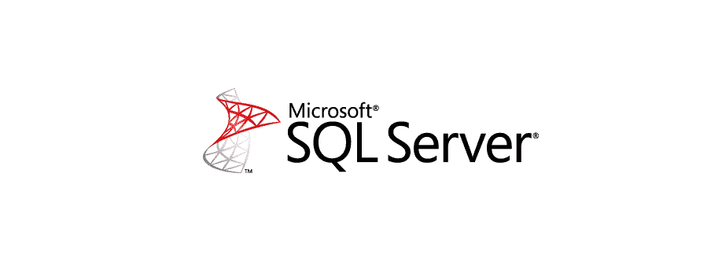
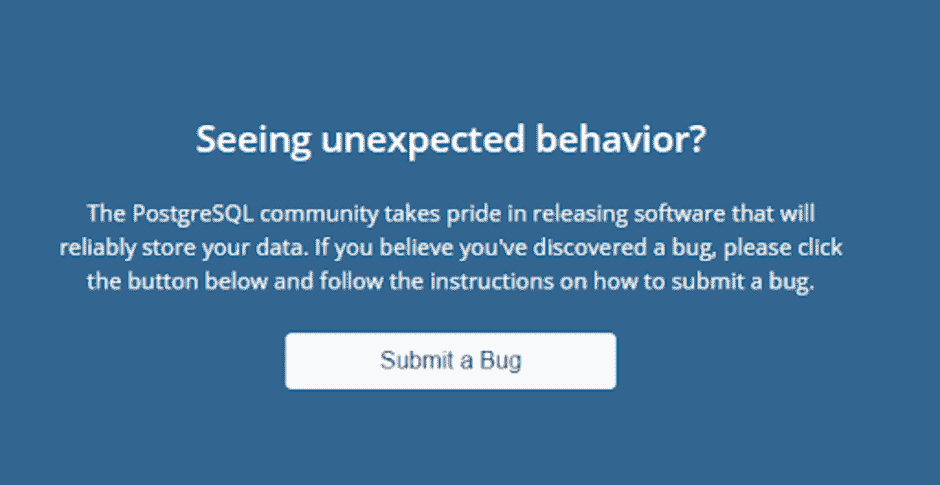

# PostgreSQL 与 SQL Server: 16 个关键差异

> 原文：<https://kinsta.com/blog/postgresql-vs-sql-server/>

市场上有各种各样的[数据库](https://kinsta.com/knowledgebase/wordpress-database/)可供选择，用户通常可以仔细考虑 PostgreSQL 和 SQL Server，以选择更适合他们用例的选项。利用 PostgreSQL 进行运营的组织可能希望转换到 Microsoft SQL Server 这样的数据库，因为它主要满足不同的数据仓库解决方案、电子商务和其他业务线的需求。

从历史上看，Microsoft SQL Server 一直是依赖于其他 Microsoft 产品的组织的最爱，但 PostgreSQL 已经迅速崛起，不仅因为开源的好处，还因为其活跃的用户社区和方便的功能。

这就是我们进行这次讨论的原因。比较 PostgreSQL 和 SQL Server 将有助于您更好地了解两种系统的可能优势和权衡，以及哪一种更适合您的目的。

让我们开始吧！

## PostgreSQL 是什么？

PostgreSQL logo (Image Source: [Uberconf](https://uberconf.com/blog/bruce_snyder/2013/06/installing_postgresql_9_0_on_mac_os_x_10_6_8_via_macports))

PostgreSQL 已经成为一个企业级的高级[开源数据库](https://kinsta.com/blog/open-source-database/)，支持 JSON(非关系)和 SQL(关系)查询。这个强大而稳定的数据库管理系统得到了三十多年活跃的社区开发的支持，这有助于它在完整性、可靠性、弹性、性能和正确性方面的声誉。
 PostgreSQL 被用作各种移动、web、分析和地理空间应用的主要数据仓库或数据存储。PostgreSQL 还拥有支持高级数据类型以及性能优化的丰富历史，这在它的商业数据库同行中很常见，如 Microsoft SQL Server 和 Oracle。

除了免费和开源，PostgreSQL 还具有高度的可扩展性。例如，您可以生成自定义函数，定义数据类型，甚至用各种编程语言编写代码，而不必重新编译数据库！

> 需要在这里大声喊出来。Kinsta 太神奇了，我用它做我的个人网站。支持是迅速和杰出的，他们的服务器是 WordPress 最快的。
> 
> <footer class="wp-block-kinsta-client-quote__footer">
> 
> 
> 
> <cite class="wp-block-kinsta-client-quote__cite">Phillip Stemann</cite></footer>

[View plans](https://kinsta.com/plans/)

### 历史

以下是历年来 PostgreSQL 的简要概述:

*   Ingres 最初是在 1977 年开发的。
*   迈克尔·斯通布雷克和他的同事在 1986 年开发了 Postgres。
*   1990 年，PostgreSQL 中增加了对 PL/ pgSQL 和 ACID 遵从性的支持。
*   NYCPUG(纽约市 PostgreSQL 用户组)早在 2013 年就加入了 PgUS(美国 PostgreSQL 协会)。
*   2014 年，PGconf 为 PostgreSQL 用户开启了一个新时代。

### 主要特征

现在，让我们继续来看看 PostgreSQL 的一些特性，这些特性使它成为市场上不可或缺的工具:

*   **标准符合性和可靠性:** PostgreSQL 的预写日志功能使其成为一个高度容错的数据库。PostgreSQL 也是 ACID 兼容的，并以各种语言提供对视图、外键、触发器、连接和存储过程的全面支持。它包括大多数 SQL: 2008 数据类型，包括布尔、数字、整数、日期、VARCHAR、时间戳、间隔和 CHAR。
*   **健壮的扩展:** PostgreSQL 拥有健壮的特性集，如时间点恢复、多版本并发(MVCC)、表空间、粒度访问控制和在线/热备份。PostgreSQL 在区分大小写、排序和格式方面也是区域设置敏感的。它在可管理的数据量和可容纳的并发用户数量方面都具有高度的可扩展性。
*   **开源许可:**您可以在开源许可下使用 PostgreSQL 源代码，让您可以自由地修改、使用和实现它，而无需支付任何费用。最重要的是，PostgreSQL 不会产生许可成本，这消除了过度部署的风险。PostgreSQL 的爱好者和贡献者社区定期发现修复和错误，有助于数据库系统的整体安全性。

### 用例

PostgreSQL 的多功能性允许它在广泛的用例中使用，例如:

*   **联邦中心数据库:** PostgreSQL 的 JSON 支持和外来数据包装器允许它与其他数据存储(包括 NoSQL 数据类型)链接，并作为多语言数据库系统的联邦中心。
*   **通用 OLTP 数据库:**大型企业和初创公司都使用 PostgreSQL 作为主要的数据存储，以支持其互联网规模的应用程序、产品和解决方案。
*   **地理空间数据库:** PostgreSQL 在与 PostGIS 扩展一起使用时支持地理对象。它还可以用作地理信息系统(GIS)和基于位置的服务的地理空间数据存储。
*   LAPP 开源堆栈: PostgreSQL 也可以运行动态应用和网站，作为 LAMP 堆栈的强大替代方案的一部分。LAPP 代表 Linux、Apache、PostgreSQL、Perl、PHP 和 Python。

[If you're confused by the difference between ll PostgreSQL and SQL Server 🤔, this post will help you decide which one is the right choice for your needs. 🚀Click to Tweet](https://twitter.com/intent/tweet?url=https%3A%2F%2Fkinsta.com%2Fblog%2Fpostgresql-vs-sql-server%2F&via=kinsta&text=If+you%27re+confused+by+the+difference+between+ll+PostgreSQL+and+SQL+Server+%F0%9F%A4%94%2C+this+post+will+help+you+decide+which+one+is+the+right+choice+for+your+needs.+%F0%9F%9A%80&hashtags=PostgreSQL%2CSQL)

## 什么是 SQL Server？

SQL Server logo (Image Source: [Software Engineering Stack Exchange](https://softwareengineering.stackexchange.com/tags/sql-server/info))

SQL Server 是由微软开发的关系数据库管理系统，拥有悠久的历史，准确地说有 32 年。Microsoft SQL Server 被认为是一种软件产品，其主要功能是根据其他软件应用程序的请求检索和整理数据。

这些应用程序可能运行在网络中的不同计算机上，也可能运行在同一台计算机上。多年来，Microsoft SQL Server 经历了许多更新，成为当今市场上最受支持和最负盛名的 RDBMSs 之一。

SQL Server 的受欢迎程度很大程度上要归功于它的创造者微软。当 MS SQL Server 处于萌芽阶段时，微软已经确立了自己作为科技巨头的地位。

SQL Server 凭借其广泛的应用程序和工具简化了数据处理工作，成功地成为一种数据库管理系统。其全面的图形用户界面(GUI)允许直观、轻松地使用数据库，同时允许您为报告生成统计数据。

### 历史

以下是这些年来 Microsoft SQL Server 的简要概述:

*   SQL Server 的发展始于 1988 年，当时微软与 Sybase 和 Ashton-Tate 合作开发数据库维护和创建软件，为微软的商业数据库市场提供了动力。
*   SQL Server 1.0 于 1989 年推出。当时，它利用系统管理员工具(SAF)来生成数据库。它没有任何文档，但仍然允许用户运行 SQL 查询和设置参数。Microsoft SQL Server 的第一个代码片段是由 Sybase 编写的。
*   渐渐地，更新的版本发布了更多的改进和特性。SQL Server 2019 或 Aries 是综合版本万神殿的最新成员，因为它专注于使数据库功能更加直观。这包括大数据集群选项，让用户可以选择使用巨型数据集。

### 主要特征

历史谈够了。让我们来看看使 SQL Server 如此受欢迎的几个关键特性:

*   **强大的安全平台:** SQL Server 通过内置的数据保护、数据分类、警报和监控功能，让您能够保护动态和静态数据。使用 SQL Server，您可以轻松加密敏感数据并对加密数据执行丰富的计算，并允许基于角色的自定义数据访问以及复杂的行筛选。
*   **行业领先的性能:** SQL Server 在 Linux 和 Windows 上拥有破纪录的性能，因为它在 TPC-H 数据仓库工作负载、TPC-E OLTP 工作负载和实际应用程序性能基准测试中一直领先。您还可以使用 SQL Server 的内存数据库功能(如内存优化的 tempdb 和持久内存支持)来提高关键任务工作负载的性能。
*   **通过大数据集群实现所有数据的智能化:** SQL Server 允许您通过查询整个数据资产(Azure SQL 数据库、SQL Server、Teradata、 [MongoDB](https://kinsta.com/blog/mongodb-vs-postgresql/) 、Azure Cosmos DB 等)中的数据，从所有数据中获得有价值的见解，而无需复制或移动数据。您甚至可以通过将 SQL Server 中的非结构化和结构化数据结合起来，并通过 Spark 或 T-SQL 访问数据，来构建一个共享数据湖。

### 用例

SQL Server 的可扩展性和性能使其能够在广泛的使用案例中得到利用，例如:

*   **复制服务:** SQL Server 利用 SQL Server 复制服务来协调和复制数据库对象，或者作为现有对象的子集，或者作为其整体。复制服务遵循订阅者/发布者模型，即修改由一个数据库服务器(发布者)发出，由其他服务器(订阅者)收集。
*   **Notification services:**Notification services 最初是作为 SQL Server 2000 发布后的附加组件发布的。它是一种创建数据驱动的修改的机制，然后将这些修改发送给 notification services 订阅者。
*   **机器学习服务:** SQL Server 机器学习服务在 SQL Server 实例中运行，使人们能够执行数据分析和机器学习，而不必在网络上移动数据或受到计算机内存的阻碍。
*   **分析服务:**SQL Server Analysis Services(SSAS)为 SQL Server 数据库增加了数据挖掘和 OLAP 功能。OLAP 引擎支持数据的关系联机分析处理(ROLAP)、多维联机分析处理(MOLAP)和混合联机分析处理(HOLAP)存储模式。SQL Server analysis services 还支持 XML 作为分析标准的基本通信协议。

## PostgreSQL 与 SQL Server 的比较

既然我们已经对 SQL Server 和 PostgreSQL 的突出方面有了一个概念，那么让我们深入研究一下两者之间的区别。您可以使用下面提到的因素来确定哪个数据库管理系统最适合您的需求。

### 有效性

PostgreSQL 提供了各种各样的解决方案来确保用户的高可用性，包括预写日志传送、共享磁盘故障转移、数据分区和各种[复制方法](https://kinsta.com/blog/postgresql-replication/)。像 EDB Postgres 故障转移管理器这样的工具通过监控和识别数据库故障来提供自动故障转移以确保高可用性。

另一方面，SQL Server 包括各种高可用性工具，如日志传送、故障转移群集和复制。当满足特定条件时，全天候工作的 SQL Server 可用性组提供自动故障转移。但是，此产品只能在 SQL Server 企业版中访问。

### 数据和表格结构

为简单起见，PostgreSQL 为其用户提供了 PL/pgSQL 过程编程语言。PostgreSQL 中标准 SQL 的附加功能包括用户定义的类型、自定义模块、扩展、JSON 支持以及触发器和其他功能的额外选项。

SQL Server 使用 T-SQL，它与标准 SQL 有相似之处。T-SQL 包括对数据和字符串处理、过程编程和局部变量的额外支持。

如果您想更好地了解系统如何缓存和处理请求，PostgreSQL 通过将进程视为独立的操作系统进程来隔离它们。每个数据库都有单独的内存，并运行自己的进程。这使得监控和管理变得非常容易，但同时也增加了扩展多个数据库的难度。

SQL Server 使用的缓冲池可以根据处理需要进行限制或增加。所有的工作都在单个池中进行，没有多个页面，不像 PostgreSQL。

PostgreSQL 和 SQL Server 都支持临时表，因为它允许您存储来自分支复杂逻辑和复杂过程的中间结果。通过将中间信息与基本信息隔离开来，临时表有助于改进数据库的组织和性能。

### 碎片整理

当开发人员修改 SQL 数据库的不同部分时，修改发生在系统的不同点，并且可能难以跟踪、读取和管理。因此，维护还应该包括碎片整理—通过分配索引、生成新页面和重新访问结构来整理更新的数据库的过程。然后，数据库可以释放未被适当利用的磁盘空间，以便数据库可以以更快的速度运行。

PostgreSQL 扫描数据层的表以寻找空行并去除不必要的元素。通过这样做，系统释放了磁盘空间。但是，这种方法需要大量的 CPU，并且会影响应用程序的性能。

另一方面，SQL Server 提供了高效的垃圾收集器，不会产生超过 15-20%的开销。从技术上来说，开发人员也可以连续运行垃圾收集器，因为它非常有效。总而言之，SQL Server 提供了比 PostgreSQL 更多的碎片整理方法。

### 指数

数据库处理索引的方式证明了它的可用性，因为索引用于精确定位数据，而不是查找特定的行。您还可以使用索引来引用多列或多行。您可以为文件分配相同的索引，将它们呈现在数据库的不同位置，并通过一次搜索收集所有这些片段。

PostgreSQL 支持基于索引的表组织，但早期版本不使用自动索引更新。它还允许您在一次搜索中查找许多索引，这意味着您可以发现大量信息。

SQL Server 为索引管理提供了丰富的自动化功能。它们可以组织成簇，并保持正确的行顺序，无需人工干预。SQL Server 还支持部分索引和多索引搜索。

### 特征

与其他 SQL 数据库不同，PostgreSQL 不提供内置的作业调度程序。重复性任务需要外部工具，如 Linux 上的 cron、pgAgent 或 pg_cron，以及 Windows 上的 SQLBackupAndFTP 或任务调度器。

另一方面，SQL Server 中的任务可以通过 SQL Server Management Studio 轻松安排。

PostgreSQL 有完善的多版本并发控制(MVCC)来同时处理多个过程。MVCC 提供了数据库信息的快照，以避免显示由于其他数据库系统中发生的同时事务或数据锁定而导致的不一致。PostgreSQL 利用可序列化快照隔离(SSI)来确保事务隔离。

SQL Server 的多版本并发控制系统开发程度较低，默认情况下，它依赖数据锁定来避免并发事务导致的错误。SQL Server 还提供了开放式并发功能，该功能假定这种问题很少发生。因此，与锁定行相反，它会根据缓存的版本进行验证，以确定是否发生了任何更改。

### 分区和分片

当性能提升对于大型数据库至关重要，并且存储过程已经达到极限，并且硬件也进行了升级时，您需要将工作分配到不同的服务器上。这就是分区和分片发挥作用的时候了。

虽然分片和分区本质上都是将大型数据集分成较小的子集，但分片意味着数据分布在多台计算机上，而分区则不是。

从 10.0 版开始，PostgreSQL 支持声明性分区，即按范围、列表或散列进行分区。

MS SQL Server 支持水平分区，即将一个多行的表分成几个行数较少的表。

MS SQL Server 还通过联合支持分片。“联邦分区视图”是表分布在不同服务器上以平衡处理负载的视图。

要从服务器检索记录，您需要某些命令。这些命令称为分布式分区视图。他们使用典型的 SQL 语句和关键字 UNION 从所有分布式服务器中提取数据。

同样，当在底层表上观察到特定的规则时，可以使用 DML 语句(INSERT、UPDATE 和 DELETE)。另外，请注意，只有企业版支持联合分区视图。

虽然联邦分区视图可以在任何其他版本上实现，因为它们没有明显的语法，但是它们不会被识别为联邦分区视图。将视图识别为跨服务器分区的规则仅适用于企业版。

使用这种分区技术，大多数应用程序的性能通常会提高 20%到 30%。因此，如果您的企业管理大量数据，这是一个非常有用的工具。

### 分身术

分区是将数据库分成更小的子集，并将分区表分布到不同的节点，而复制是在多个数据库之间复制数据库，以提供快速查看和更短的响应时间。

## 注册订阅时事通讯

### 想知道我们是怎么让流量增长超过 1000%的吗？

加入 20，000 多名获得我们每周时事通讯和内部消息的人的行列吧！

[Subscribe Now](#newsletter)

PostgreSQL 提供主从复制。这可以是异步或同步的。预写日志(wal)允许与副本节点共享更改，因此支持异步复制。

其他类型的复制主要包括逻辑复制、流复制和物理复制。

*   **逻辑复制**遵循发布和订阅模型。更改基于数据复制的身份，如其主键，而不是其物理位置。
*   **流式复制**本质上是在文件创建后立即对 wal 进行流式复制，从而使备用服务器能够快速更新，而不是等待文件被填满。
*   最后，**物理复制**通常使用文件和目录来实现，不考虑物理位置中的内容。PostgreSQL 本身不提供多主复制，但是可以在其他第三方工具的帮助下执行。

SQL Server 复制将数据从发布服务器复制到订阅服务器。它可以是异步的，也可以是异步的，具体取决于 SQL Server 版本。它提供三种类型的复制，即:事务复制、快照复制和合并复制。

*   **事务复制**通常在服务器到服务器的环境中实现，在这种环境中，修改在发生时从发布者传递到订阅者。
*   **合并复制**通常在服务器到客户端环境中可能发生冲突的情况下实现，或者在订阅服务器或发布服务器上可以更改和跟踪数据并随后进行同步的情况下实现。
*   **快照复制**在数据不经常更新、不需要增量更改或者数据完全按照特定时刻出现的样子复制的情况下实施。此外，企业版提供对等复制作为多主节点复制的替代解决方案。

### 语言和语法

PostgreSQL 用 C 语言写，MS SQL 用 C 和 C++写。在语言绑定方面，PostgreSQL 非常容易使用和连接，因为它的外部 API **libpq** ，这是非常好设计和记录的。

但是，SQL Server 外部语言绑定可能取决于其他几个因素。您可能需要安装额外的驱动程序或创建类来存储被查询的数据；因此，你必须知道数据在编译时是什么样子。您可能需要参考文档，并且后续工作可能相当耗时。

谈到过程语言特性，PostgreSQL 和 SQL Server 都提供了强大的支持。PostgreSQL 支持 JSON 数据类型，用户可以轻松地将 Python、Java、PHP、Perl 和 R 与 SQL 一起使用，因为它们受到过程语言特性的支持。

虽然 SQL Server 确实提供了支持，但该功能还有待改进，因为会出现一些小错误，并且由于速度较慢，可能需要一些时间来实现。用户需要将代码编译成一个**。dll** 文件。

在 PostgreSQL 中，不需要创建一个**。dll** 文件。PostgreSQL 还提供了大量的正则表达式(regex)作为分析工作的基础。

相比之下，MS SQL Server 的正则表达式较少，并且支持某些命令，如 substring 和 pattern index，它们可能不如 PostgreSQL。

### 表演

说到性能，PostgreSQL 在几个方面胜过 SQL Server。我们谈到了分区，虽然 PostgreSQL 和 SQL Server 都提供分区，但 PostgreSQL 免费提供，效率更高。

PostgreSQL 还提供了更好的并发性，这是多个进程可以同时访问和修改共享数据的一个重要特性。PostgreSQL 的 MVCC 特性确保了死锁的可能性较小，只有当两个查询试图同时修改同一行并序列化对该行的更新时才会阻塞。

为查询数据而获取的 MVCC 锁与为写入数据而获取的锁并不冲突。这最大限度地减少了锁争用，并在多用户环境中提供了更好的性能。

另一方面，SQL Server 具有欠发达的并发性，一些进程甚至可能被死锁。与 MVCC 功能相反，每当更新一行时，都会创建该行的新版本，而不是覆盖同一行，并且两者都被维护。渐渐地，旧版本转移到名为 **tempdb** 的系统数据库中。但是，它的并发性还有很长的路要走。

PostgreSQL 还为几个扩展提供了索引支持，这提高了数据库的性能。

另一方面，SQL servers 还没有改进它们的索引实现，它们还没有包括数组——最常用的变量类型之一。

### 定价

PostgreSQL 是在 PostgreSQL 许可证下发布的，这是一个自由的开源许可证。PostgreSQL 全球开发小组一直致力于使 PostgreSQL 永远成为免费的开源软件。没有计划在不同的许可证下修改或发布 PostgreSQL。

MS SQL Server 是在商业许可下作为 Microsoft 产品的一部分发布的。2016 年初，该数据库作为开发人员的免费工具提供，但它只支持一个处理器和 1GB 的最大内存。虽然它是免费的，但它缺少一些你做生意可能需要的功能。如果您需要更多的服务器，您可能需要为每台服务器支付 899 美元。最近，SQL Server 企业版的价格为 13，748 美元。

### 可量测性

当数据增加以满足用户需求时，数据库系统在不影响其性能的情况下继续良好运行的能力称为可伸缩性。

PostgreSQL 在可伸缩性方面提供了许多特性，并且可以使用几个 CPU 内核来快速并行实现查询。

Struggling with downtime and WordPress problems? Kinsta is the hosting solution designed to save you time! [Check out our features](https://kinsta.com/features/)

SQL Server 也可以使用核心，但是，标准版本仅限于 24 个核心的 CPU。企业版允许使用无限的 CPU 内核。SQL Server 还拥有超大规模特性，您可以确定上限和下限，从而根据需要向下和向上扩展。

### 安全性

随着数据盗窃、黑客和盗版的增加，[安全性](https://kinsta.com/blog/wordpress-security/)确实成为数据库系统中最重要的需求。然而，SQL Server 和 PostgreSQL 都提供了出色的数据加密和身份验证。

#### 认证方法

在服务器端，PostgreSQL 提供了高级认证方法，包括轻量级目录访问协议(LDAP)和可插拔认证模块(PAM)，这可能会减少 PostgreSQL 数据库服务器的攻击面。PostgreSQL 的其他服务器级安全性增强包括 PostgreSQL 服务器监听地址、基于主机的身份验证和证书身份验证。

在 MS SQL Server 中，有两种服务器级安全增强功能:Windows 身份验证模式和混合模式，混合模式包括 Windows Server 和 MS SQL Server 的身份验证过程。MS SQL Server 的安全模型是 Windows Server 的 Windows 身份验证模式和数据库之间的紧密集成。

#### 数据加密

PostgreSQL 提供数据加密，并允许您在数据通过 web 或公共网络高速公路传输时使用安全套接字层(SSL)证书。它还允许您将客户端证书身份验证工具作为一个选项来实现。此外，您可以使用 cryptogenic 函数在 PostgreSQL 中存储支持对称密钥和公钥加密的加密数据。

在 MS SQL Server 中，可用的数据加密功能包括透明数据加密(TDE)、始终加密和列级加密。TDE 使用高级加密标准(AES)算法来加密物理文件，包括数据和日志文件。始终加密功能允许您在静态或动态两种状态下加密某些列(即数据在内存中也保持加密)。

#### 用户级权限

此外，您可以在 PostgreSQL 和 SQL Server 中管理不同的用户及其权限(读、写)。

PostgreSQL 包括作为角色分配的用户级权限、通过角色的表级权限和角色继承。审计选项允许您检查数据库中用户和组的数据访问活动，这提供了一层额外的安全性。

SQL Server 通过用户组和角色来实现这一点。资源权限直接授予用户帐户，权限继承自父资源。

您还可以通过监视和审核 SQL Server 中的活动来识别并发问题、长时间运行的查询和常规工作负载指标。

### 储存；储备

存储是任何数据库系统性能的关键因素之一。随着服务器处理能力和大规模内存支持的增加，数据库在系统中允许更多的存储能力变得几乎是必不可少的。

PostgreSQL 是对象关系数据库，而 Microsoft SQL Server 是关系数据库系统。这意味着 PostgreSQL 提供了更复杂的数据类型，并允许对象继承，尽管这也使使用 PostgreSQL 变得更加复杂。它有一个与 ACID 兼容的存储引擎，并使用为每个客户端连接分配的内存来初始化一个新的系统进程。因此，随着系统上客户端连接的增加，需要分配更多的内存。

SQL Server 2016 及更高版本最多可以使用一百台计算机或虚拟机，每台计算机最多运行五个实例。然而，这也取决于它的版本。企业版允许最大的带宽，因此将授予更多的存储能力。虽然最新的标准版允许使用高达 128GB 的内存，但您可以在企业版中使用无限的内存。

### 支持和社区

PostgreSQL 定期免费发布更新版本。最近，PostgreSQL 全球开发组[发布了对数据库系统所有支持版本的更新](https://www.postgresql.org/about/news/postgresql-142-136-1210-1115-and-1020-released-2402/)，[修复了过去三个月报告的超过 55 个 bug](https://www.postgresql.org/docs/release/)。PostgreSQL 拥有一个庞大的开发人员、第三方公司和爱好者社区，他们提供支持，并试图通过修复报告的错误来开发系统。

SQL Server 每隔几年就会发布一个新版本。支持费用取决于许可证的条款和条件。Microsoft SQL Server 还有一个支持社区，数据库分析师、开发人员、系统管理员或任何对该平台感兴趣的人都可以在这里提问，或者通过播客和网络广播(如 Guy Glantser 和 Eitan Blumin 主持的 SQL Server Radio)了解更多有关 SQL Server 的信息，在这里用户可以了解许多有关 SQL Server 及其与其他 Microsoft 工具的兼容性的信息。

PostgreSQL 和 SQL Server 都可以配备插件。价格和兼容性取决于插件。插件有助于管理、清理、备份数据库等等。

例如， [Adminer](https://kinsta.com/blog/adminer/) 是一个数据管理工具，可以用来管理 PostgreSQL 和 MS SQL Server 中的数据。其他几个[数据库插件](https://kinsta.com/blog/wordpress-database-plugin/)也可以用来提高数据库的效率，例如:WP 优化、更好的搜索替换、WP 数据库备份等等。当您升级任何数据库系统时，可能会有数据迁移成本，但这对于任何其他标准 DBMS 来说都是正常的。

PostgreSQL bug discovery message (Image Source: [PostgreSQL](https://www.postgresql.org/))

### 触发器和事件

PostgreSQL 有各种高级触发器，您可以根据自己的使用情况进行选择。支持的触发事件有 AFTER、BEFORE 和 INSTEAD OF，它们可用于插入、更新和删除事件来操作数据。如前所述，PostgreSQL 可以动态运行这些触发器，不需要将它们编译成一个**。执行前的 dll** 文件。当触发器被调用时，上述函数可用于执行复杂的查询。

SQL Server 为不同类型的数据库事件提供了各种触发器，即 DML 触发器、DDL 触发器和登录触发器:

*   **DML 触发器**或数据操作语言触发器是用于通过插入、更新或删除记录来操作数据的触发器。
*   **DDL 触发器**用于数据定义语言(DDL)事件，如创建、删除或更改数据库。
*   **登录触发器**用于登录事件，如用户会话建立时。这些触发器在身份验证成功之后、建立用户会话之前触发。它们对于审计和控制登录活动非常有用。

### 视图

视图本质上是虚拟表，并不在物理上存储数据。它们通常用于安全目的，以限制用户对数据的访问。PostgreSQL 和 SQL Server 都支持可更新视图。

但是，在 PostgreSQL 中，除非满足以下先决条件，否则更新不会自动进行:

*   在该视图的查询中，FROM 子句中应该有一个部分。该节可以来自表或另一个可更新的视图。
*   选择列表中不应有窗口函数、聚合函数或集合返回函数。
*   查询不能在顶级包含命令 HAVING、LIMIT、DISTINCT、WITH、INTERSECT、EXCEPT、OFFSET 或 LIMIT。

简而言之，用简单查询创建的视图可以更新，而用复杂查询创建的视图几乎不可能更新。另一方面，复杂视图可以通过使用规则来更新。虽然 PostgreSQL 可能没有提供运行物化视图的工具，但它有一个名为 **matviews** 的模块，可以帮助重建任何物化视图。

在 SQL Server 中，视图可以自动更新，同时支持用户定义的视图和系统定义的视图。此外，如果两个表视图有不同的键，并且 update 语句不涉及多个表，那么它们会被同时更新。

此外，用户可以利用触发器来更新复杂视图。SQL Server 还提供了运行物化视图(也称为索引视图)的工具。与其他关系数据库中的物化视图不同，索引视图与底层数据同步，因此可以自动更新。

### SQL Server 和 PostgreSQL 的缺点

虽然我们已经讨论了 PostgreSQL 和 SQL Server 的所有细节，但它们都有各自的缺点。

虽然 PostgreSQL 是免费的，但它并不归某个组织所有。正因为如此，尽管它被大量报道，却很难在大众中找到立足之地。PostgreSQL 也更注重兼容性而不是速度。因此，为提高速度而进行的修改需要更多的工作。

另一方面，SQL Server 经常因其糟糕的用户界面而受到批评。它具有复杂的性能调优特性，并且不支持源代码控制。如果你为你的公司使用它，企业版可能会在你的口袋里烧一个洞。仅 SQL Server 2019 企业版就需要 13，748 美元，相当于 13 个房间的宜家家具！此外，许可可能很难理解，并且在不断变化。

如果 PostgreSQL 和 SQL Server 不太合您的胃口，您可以针对您的独特用例尝试使用 [MongoDB](https://kinsta.com/blog/mongodb-vs-mysql/) 或 [MariaDB](https://kinsta.com/blog/mariadb-vs-mysql/) 。

MongoDB 是一个面向文档、免费使用的跨平台数据库程序，可以轻松利用类似 JSON 的文档。

另一方面，MariaDB 是 MySQL 的商业支持分支，其可插拔和专门构建的存储引擎支持通常需要大量不同数据库的工作负载。

## PostgreSQL vs SQL Server:应该选择哪个数据库？

PostgreSQL 和 SQL Server 都是广泛使用的关系数据库，但是谁拿走了蛋糕？从上面的比较来看，PostgreSQL 在几个场景中胜过 SQL Server。它不仅是开源和免费的，而且它还具有几个易于使用和可以自动实现的功能，这与 Microsoft SQL Server 不同。

而且 PostgreSQL 有更适合的并发管理系统。它可以出色地处理多个进程可以同时访问和修改共享数据的情况。

如果你正在经营一个小企业，PostgreSQL 可能是一个适合你的选择，因为它是免费的，并提供了几个有用的功能来管理数据。它易于安装，可以在几乎所有类型的操作系统中实现。然而，对于在 Microsoft SQL Server 堆栈上有大量投资的企业来说，SQL Server 比 PostgreSQL 更有优势。
[对比 PostgreSQL 和 SQL Server 有助于你了解两个系统的优势，以及哪一个最适合你。🤝让我们开始吧！✅ 点击推文](https://twitter.com/intent/tweet?url=https%3A%2F%2Fkinsta.com%2Fblog%2Fpostgresql-vs-sql-server%2F&via=kinsta&text=Comparing+PostgreSQL+and+SQL+Server+will+help+you+understand+the+advantages+of+the+two+systems%2C+and+which+one+is+best+suited+for+you.%F0%9F%A4%9D+Let%27s+dive+in%21+%E2%9C%85&hashtags=PostgreSQL%2CSQL)

## 摘要

总而言之，PostgreSQL 和 SQL Server 都是功能性和多面性的数据库。虽然 PostgreSQL 几乎可以用于任何操作系统，并且适合于需要最大功能的小型企业，但是 SQL Server 最适合于大型企业，尤其是那些需要使用 Microsoft 产品的企业。

在本文中，我们讨论了 PostgreSQL 和 SQL Server 之间的主要区别及其功能。“正确”的选择最终将取决于你计划如何经营你的企业。

在 PostgreSQL 和 SQL Server 之间，你计划在你的下一个项目中使用哪个数据库，为什么？我们很想听听你的想法！请在下面的评论区分享它们。

* * *

让你所有的[应用程序](https://kinsta.com/application-hosting/)、[数据库](https://kinsta.com/database-hosting/)和 [WordPress 网站](https://kinsta.com/wordpress-hosting/)在线并在一个屋檐下。我们功能丰富的高性能云平台包括:

*   在 MyKinsta 仪表盘中轻松设置和管理
*   24/7 专家支持
*   最好的谷歌云平台硬件和网络，由 Kubernetes 提供最大的可扩展性
*   面向速度和安全性的企业级 Cloudflare 集成
*   全球受众覆盖全球多达 35 个数据中心和 275 多个 pop

在第一个月使用托管的[应用程序或托管](https://kinsta.com/application-hosting/)的[数据库，您可以享受 20 美元的优惠，亲自测试一下。探索我们的](https://kinsta.com/database-hosting/)[计划](https://kinsta.com/plans/)或[与销售人员交谈](https://kinsta.com/contact-us/)以找到最适合您的方式。