# PrestaShop 与 WooCommerce:并列比较

> 原文：<https://kinsta.com/blog/prestashop-vs-woocommerce/>

如果你想建立一个网上商店，你对电子商务平台的选择将对你能使用的功能起到决定性的作用。在 PrestaShop 和 WooCommerce 之间做出选择是一个挑战，尤其是如果你不熟悉电子商务平台的话。理解每个选项之间的差异是做出正确决策的关键。

当比较电子商务软件时，你需要考虑几个因素。这些包括定价、易用性、总体功能和支持。

我们将对 PrestaShop 和 WooCommerce 在这些方面进行比较，以帮助您为自己的商店选择完美的电子商务平台。我们将根据您的需求来分析每个平台提供的功能和最佳选项。

我们开始吧！

### 查看我们的视频指南[比较 PrestaShop 和 WooCommerce](https://www.youtube.com/watch?v=WPMrDFQRn8Y)

## 预铺(主要特点和缺点)

PrestaShop 是一个开源电子商务平台，几乎可以推出任何类型的在线商店。您可以在任何网络主机上安装 PrestaShop，并访问广泛的社区模板和模块，以扩展您商店的功能:

PrestaShop

如果你不熟悉电子商务，PrestaShop 与一些网络主机和代理合作，提供全面的入职体验。这个过程可能意味着一切，从简单地设置 PrestaShop 到帮助你定制商店，包括你选择的产品。

使用 PrestaShop(以及大多数其他开源电子商务平台)的一个缺点是，你无法获得专门的支持。有大量的在线文档可以帮助您排除错误并实现您的目标。不过，除非你愿意花钱请专家帮忙，否则你基本上只能靠自己了。

## WooCommerce(主要特点和缺点)

如果你[使用 WordPress](https://kinsta.com/blog/why-use-wordpress/) ，你很可能熟悉 [WooCommerce](https://kinsta.com/blog/woocommerce-tutorial/) 。这是 WordPress 提供的最受欢迎的电子商务插件，有超过五百万的活跃安装。

该插件向 WordPress 添加了一个完整的电子商务平台，而没有删除任何[内容管理系统(CMS)](https://kinsta.com/cms-market-share/) 的核心功能:

WooCommerce

结果是，你得到一个混合系统，它可以启动一个在线商店，并添加几乎任何你能想象到的功能。WooCommerce 和 WordPress 一样，都是开源软件。因此，一个充满活力的用户和开发人员社区创建了独特的主题和扩展来增强各种类型的商店。

和 PrestaShop 一样，WooCommerce 的开源特性意味着你无法获得专门的支持。然而，你也不必为使用软件付费。此外，有大量的文档可以帮助你学习如何充分利用 WooCommerce(包括我们的博客)。

[想开网店？您对电子商务平台的选择将在您可以访问哪些功能方面发挥重要作用💪在这里了解更多⬇️ 点击推文](https://twitter.com/intent/tweet?url=https%3A%2F%2Fkinsta.com%2Fblog%2Fprestashop-vs-woocommerce%2F&via=kinsta&text=Want+to+set+up+an+online+store%3F+Your+choice+of+ecommerce+platform+will+play+a+major+role+in+which+features+you+can+access+%F0%9F%92%AA+Learn+more+here+%E2%AC%87%EF%B8%8F&hashtags=WooCommerce%2CEcommerce)

## PrestaShop vs WooCommerce:面对面的比较

既然你已经对每个电子商务平台能提供什么有了一个概念，是时候并排比较 PrestaShop 和 WooCommerce 了。先说价格。

### 定价

PrestaShop 和 WooCommerce 都是开源软件。你可以下载任一电子商务平台，并安装在任何服务器上。如果你想在预算有限的情况下开一家电子商务商店，这种便利性让 WooCommerce 和 PrestaShop 都成为了绝佳的选择。

要建立 WooCommerce，你需要一个现有的 WordPress 网站。这意味着你还需要主机和一个域名。不同公司的主机价格相差很大。在 Kinsta，我们提供每月 35 美元起的[计划](https://kinsta.com/plans/)。

平均来说，如果你支付[便宜的共享主机](https://kinsta.com/blog/cheap-wordpress-hosting/)和**。com** 域名，你可以花 15-20 美元用 WooCommerce 建立一个 WordPress 网站或者安装 PrestaShop。不过，这是基本方法，你可能还想购买高级主题(或模板)和插件来扩展商店的功能:

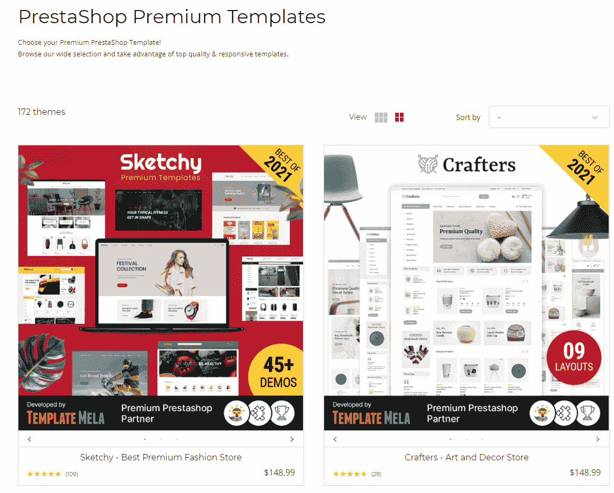

Premium templates from PrestaShop.

PrestaShop 模板和插件往往比 WordPress 主题和插件更贵。如果你使用 WordPress，你也可以访问大量的插件和主题来选择。

WooCommerce 和 PrestaShop 都提供免费和付费的插件和主题/模板。您不需要使用它们，但在许多情况下，它们可以扩展您商店的功能。

### 装置

有几种方法可以同时安装 PrestaShop 和 WooCommerce。首先，你可以从它们各自的网站(或[WordPress.org 库](https://wordpress.org/plugins/))下载这两个软件选项，上传到你的服务器，然后手动安装:

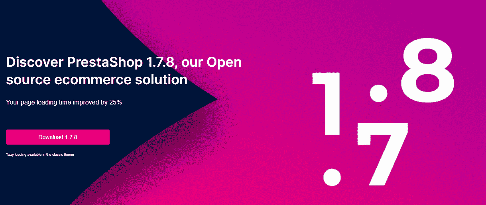

PrestaShop download page.

这个过程听起来可能很复杂，但是如果您有在服务器上安装软件的经验，应该不会有任何问题。如果你使用的是 WordPress，这个过程会变得简单得多，因为你可以从仪表盘安装 WooCommerce:

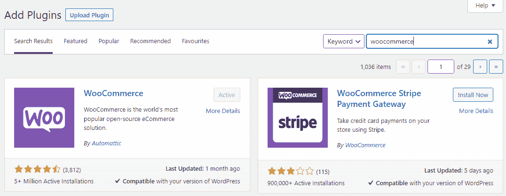

Installing WooCommerce.

根据你使用的网络主机，你可能会在启动一个新网站时选择安装 WordPress + WooCommerce。例如，Kinsta 在创建新网站时提供了这一选项:

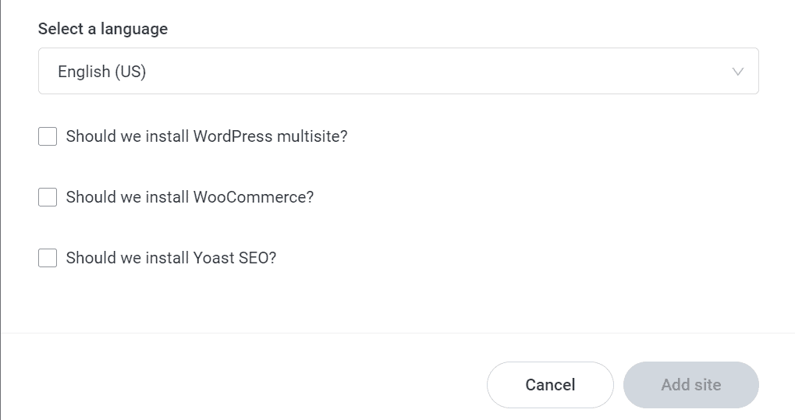

Easily install WooCommerce in MyKinsta.

对于大多数其他网络主机，你可以使用软件安装程序，如 [Softaculous](https://www.softaculous.com/) 。有了 Softaculous，你只需点击几下就可以安装 WordPress 或 PrestaShop。这样，您就不必手动下载、上传和安装软件:

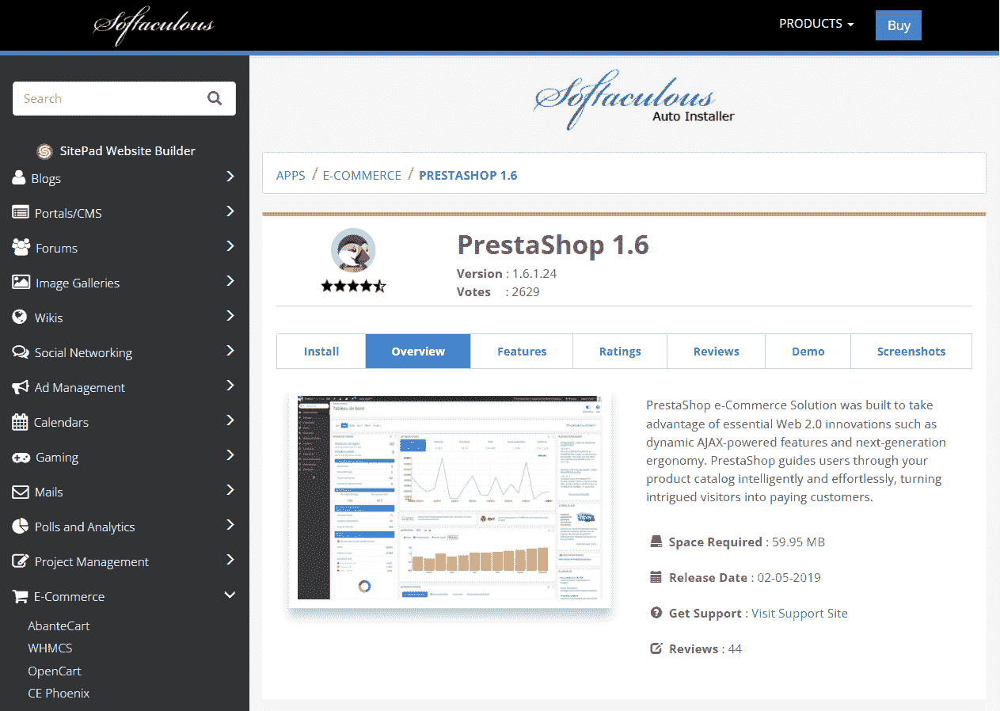

Softaculous to install PrestaShop.

WooCommerce 和 PrestaShop 都是新电子商务商店非常受欢迎的选择。这意味着大多数网络主机将提供简化的安装选项，使商店设置更容易。现在我们来谈谈你安装软件后会发生什么。

### 易用性

安装 WooCommerce 和 PrestaShop 都相对简单。然而，您还需要考虑配置这两个平台并使用它们来发布产品有多容易。

PrestaShop 和 WooCommerce 都可以让你轻松地使用带有启动向导的平台。使用 PrestaShop，向导将引导您创建您的第一个产品，定制您的商店，并对其进行配置:

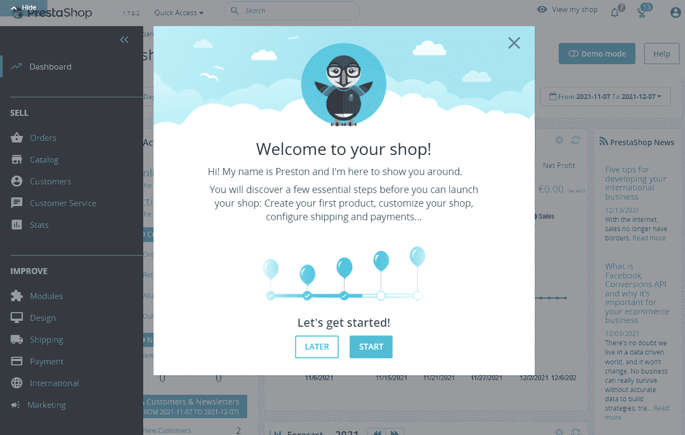

PrestaShop onboarding wizard.

当使用 PrestaShop 发布产品时，您有一个编辑器，它使您能够定制该项目的每个方面。您可以添加产品图片、描述、变化、功能、运输选项等:

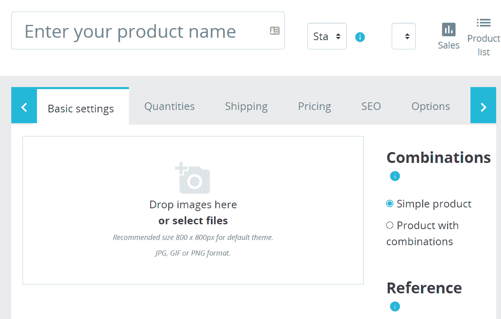

PrestaShop product editor.

同样，WooCommerce 也提供了全面的产品编辑器。如果你熟悉 WordPress 经典编辑器，创建 WooCommerce 产品应该是你的第二天性:

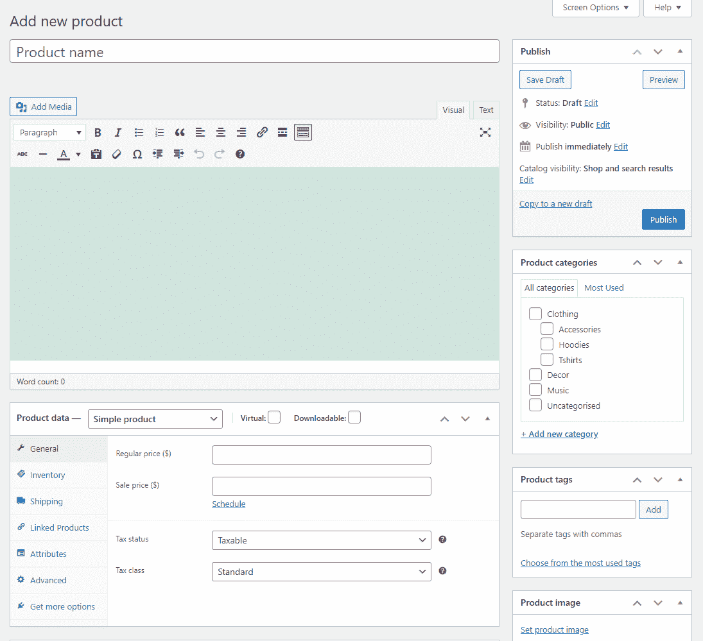

WooCommerce product editor.

WooCommerce 和 PrestaShop 都可以让你将产品配置到最细微的细节。每个产品编辑器之间的主要区别来自它们的界面。

PrestaShop 通过商店配置更容易为您的商店找到单独的设置。大多数设置类别都可以从 PrestaShop 主导航菜单中获得:

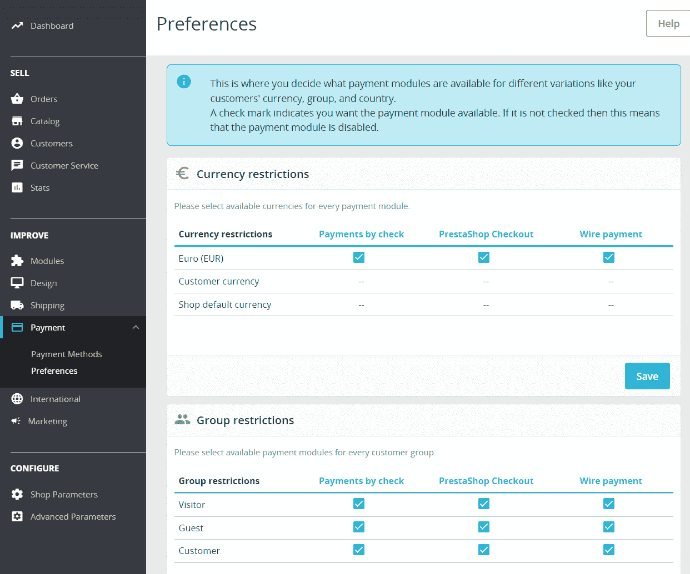

Configure PrestaShop payment options.

有了 WooCommerce，你的商店设置不会被隐藏，但也不容易访问。你必须在仪表盘中进入 **WooCommerce** 并跳转到**设置**页面。在这里，您可以找到每组配置选项的单独选项卡:

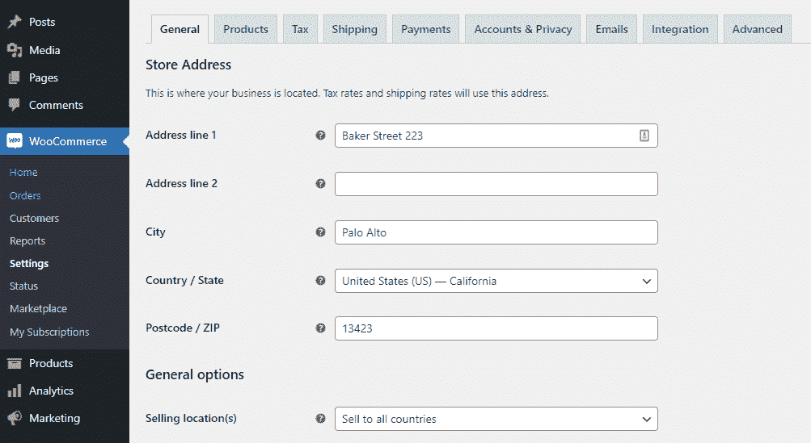

Configuring WooCommerce general settings.

与 PrestaShop 相比，WooCommerce 提供了更多的配置选项。然而，值得注意的是，您可以使用模块和插件来扩展 WooCommerce 和 PrestaShop 的功能。

总的来说，如果这是你第一次使用电子商务平台，你将需要查看 WooCommerce 或 PrestaShop 的文档。这两个选项都是用户友好的，但有太多的功能和设置，你可能会浪费时间试图自己搞清楚一切。

有了 WooCommerce，你可以查看我们关于[启动和配置新店](https://kinsta.com/blog/woocommerce-tutorial/)的完整指南。

### 性能和可扩展性

对于一个成功的电子商务商店，它需要快。这意味着整个商店的页面需要快速加载，当对网站进行更改时，软件不应该感觉很慢。

## 注册订阅时事通讯

### 想知道我们是怎么让流量增长超过 1000%的吗？

加入 20，000 多名获得我们每周时事通讯和内部消息的人的行列吧！

[Subscribe Now](#newsletter)

由于 PrestaShop 和 WooCommerce 都是[开源软件](https://kinsta.com/blog/open-source-ecommerce/)，你获得的性能将在很大程度上取决于你的托管平台。如果你为一个有数百种产品和大量流量的商店使用共享主机，你不会在[获得像样的业绩](https://kinsta.com/blog/debugging-wordpress-performance/)。

有多种手动方法[来优化 WooCommerce](https://kinsta.com/blog/woocommerce-apm/) 和 PrestaShop 商店的性能。例如，由于 PrestaShop 和 WooCommerce 需要 PHP，[更新您的 PHP 版本](https://kinsta.com/knowledgebase/how-to-update-php-in-wordpress/)会显著影响您商店的性能。

使用 Kinsta，您可以从 MyKinsta 仪表板轻松更改 [PHP 版本](https://kinsta.com/knowledgebase/what-is-php/):

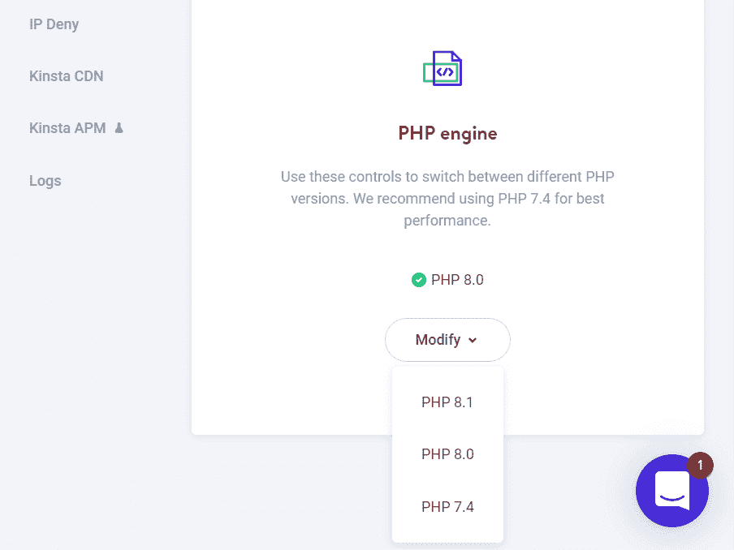

PHP versions in MyKinsta.

您选择的托管提供商和计划将显著影响您可以访问的性能配置。由于您无法配置真实的服务器设置，因此您通常无法通过预算共享计划来提高性能。

从可伸缩性的角度来看，PrestaShop 和 WooCommerce 都可以处理数百甚至数千种产品。然而，这种扩展只有在正确的主机主干和配置下才有可能。

### 安全性

如果你打算经营一家网上商店，你需要尽力保护你网站上存储的任何客户数据。考虑到 WooCommerce 和 PrestaShop 如此受欢迎，这两个软件选项都是攻击者的大目标也就不足为奇了。

看看过去几年公开披露的这两个平台的漏洞，PrestaShop 比 WooCommerce 发生了更多的安全事件。自 2017 年以来，已有 [69 个已披露的 PrestaShop 漏洞](https://www.cvedetails.com/vulnerability-list/vendor_id-8950/Prestashop.html)，相比之下，WooCommerce 有 [18 个。同样值得注意的是，这些漏洞大多排名不高。](https://www.cvedetails.com/vulnerability-list/vendor_id-16011/Woocommerce.html)

安全性的另一个重要方面是更新频率。过时的软件更容易受到攻击，使您的商店面临潜在的攻击。

在这方面，PrestaShop 和 WooCommerce 都获得了近乎完美的分数。这两种软件选项通常每月(或在某些情况下几乎每月)发布更新和补丁程序:

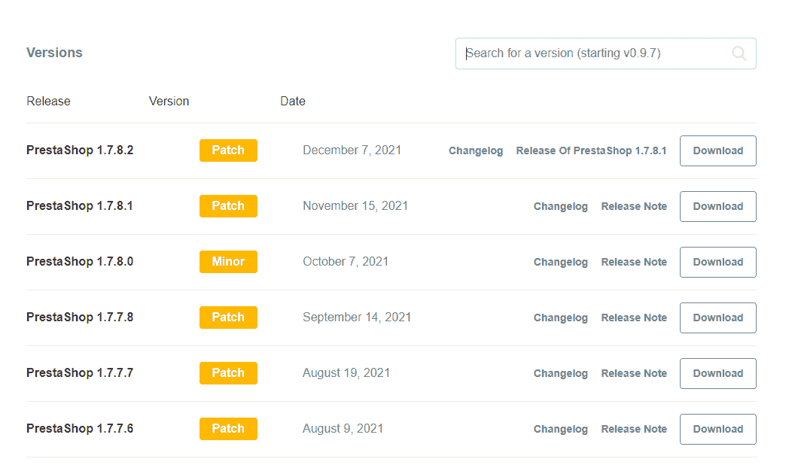

A list of PrestaShop releases.

谈到安全性，使用 PrestaShop 或 WooCommerce 应该不会有太大的不同，除非你不更新软件。理想情况下，我们建议你[在新版本或补丁一出来就更新你的电子商务软件](https://kinsta.com/blog/woocommerce-update/)(最好使用[升级网站](https://kinsta.com/add-ons/?plan=visits-business1&interval=month#h-premium-staging-environments))。

这个最佳实践同样适用于扩展、主题、模板和附加组件。如果您使用这些组件中的任何一个，并且不更新它们，随着时间的推移，它们会使您的商店更容易受到攻击。

### 展开性

在功能方面，PrestaShop 和 WooCommerce 可以独树一帜。在这两种情况下，基础软件使您能够创建一个功能齐全的在线商店，可以托管数百种产品。

然而，如果你想获得额外的功能，你总是可以求助于扩展和附加组件。WooCommerce 扩展也是 WordPress 插件。然而，它们更为人所知的是作为电子商务软件的扩展。

浏览[WordPress.org 插件库](https://wordpress.org/plugins/)和 WooCommerce 官方网站，你可以很容易地找到数百个扩展。官方的 [WooCommerce 扩展目录](https://woocommerce.com/products/)有超过 700 个选项:

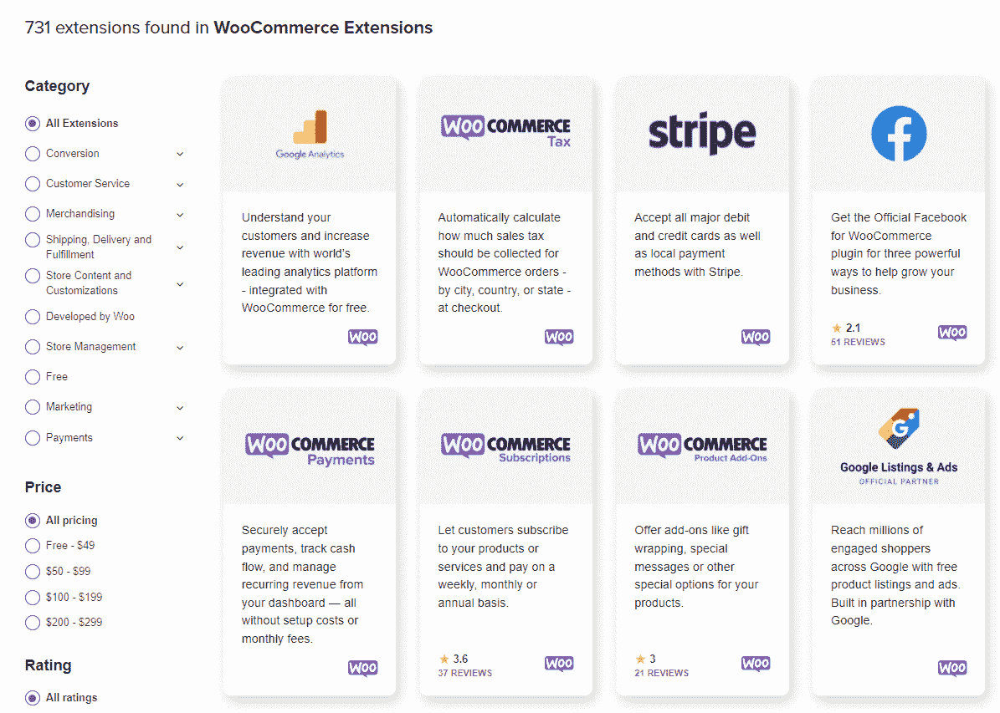

WooCommerce extensions.

WooCommerce 扩展有免费和付费两种。高级选项的费用各不相同，一个年度许可证的平均费用在 70-130 美元左右。这意味着在此期间，您还可以获得支持和更新:

需要一个给你带来竞争优势的托管解决方案吗？Kinsta 为您提供了令人难以置信的速度、一流的安全性和自动伸缩功能。[查看我们的计划](https://kinsta.com/plans/?in-article-cta)

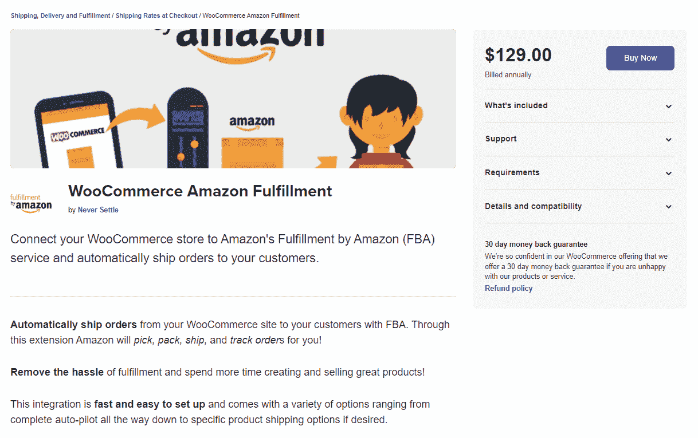

WooCommerce Amazon Affiliate extension.

需要注意的是，我们讨论的是特定于 WooCommerce 的扩展。如果你考虑到 WordPress 插件，有超过一千个选项。很多插件与电子商务无关，但它们同样可以帮助你为你的商店添加新功能。

PrestaShop 在附加组件和模块方面毫不逊色，有超过 4，000 个免费和优质的 PrestaShop 模块。你可以在[官方附加数据库](https://addons.prestashop.com/en/2-modules-prestashop)中找到它们:

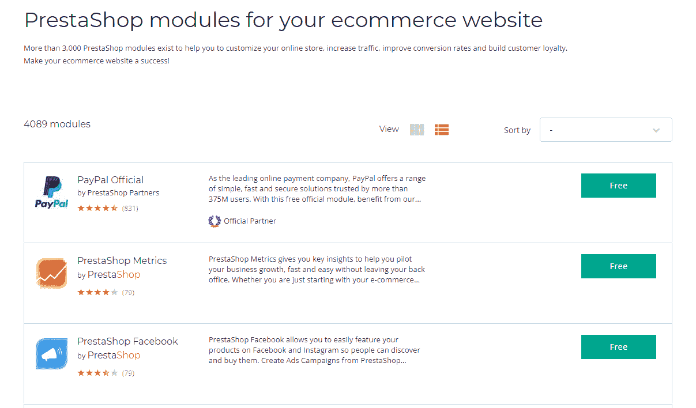

PrestaShop add-ons.

PrestaShop 模块的价格差异很大。通常，附加软件的年度许可起价约为 80 美元。不过，它们的价格可能高达 250 美元，这取决于你想要的功能。

WooCommerce 在扩展价格上有优势，尽管 PrestaShop 在选择数量上胜出。然而，一旦你考虑到 WordPress 插件，你会发现你有更多的选择来定制 WooCommerce。

举个例子，最流行的 [WordPress 页面生成器](https://kinsta.com/blog/wordpress-page-builders/)也可以创建和定制 WooCommerce 产品和商店页面。你不会在官方的 WooCommerce 扩展目录中找到这些页面生成器。不过，它们可以帮助扩展电子商务平台的功能。

### 营销和搜索引擎优化

开箱即用，PrestaShop 为电子商务提供了比 WooCommerce 更多的选择[搜索引擎优化(SEO)](https://kinsta.com/blog/what-does-seo-stand-for/) 。产品编辑器使您能够为每个产品添加自定义元标题和描述。您还可以配置产品重定向，这对于整合您的目录非常方便:

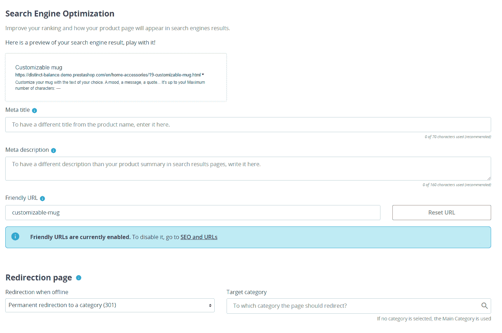

PrestaShop SEO settings.

您可以使用 [WordPress SEO 插件](https://kinsta.com/blog/best-seo-plugins-for-wordpress/)轻松地为 WooCommerce 添加类似的功能。最流行的搜索引擎优化插件都与 WooCommerce 兼容。

例如，Yoast SEO 可以让你设置元描述和标题。您还可以预览产品在社交媒体网站上的显示方式，并向您的页面添加模式标记:

Yoast SEO.

说到营销，PrestaShop 和 WooCommerce 都能让你追求你想要的任何类型的推广。换句话说，你只能靠自己了。

PrestaShop 推出了几款附加软件，让你更容易在搜索引擎和社交媒体上为自己的产品做广告。[例如，PrestaShop Marketing](https://www.prestashop.com/en/prestashop-marketing) 是一个免费的附加软件，可以将您商店中的产品与 Google Merchant Center 链接起来:

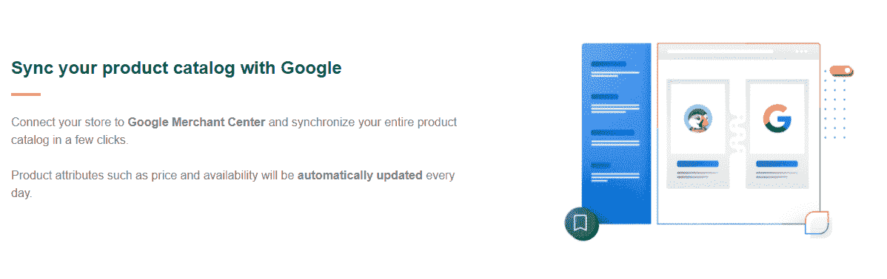

PrestaShop marketing.

类似的 WooCommerce 工具还有很多，比如[Product Feed PRO for woo commerce](https://wordpress.org/plugins/woo-product-feed-pro/)。然而，WooCommerce 并没有推广很多具体的附加产品。相反，它让您找到您需要的扩展并决定使用哪一个。

值得注意的是，你*不需要*扩展和附加产品来推销你的商店产品。你可以依靠[内容营销](https://kinsta.com/learn/content-marketing/)、付费广告、[邮件营销](https://kinsta.com/blog/email-marketing-software/)，以及社交媒体来推广你的店铺。使用推荐的 PrestaShop 和 WooCommerce 扩展并不能保证任何销售——它只是让你更容易推销你的产品(在某些情况下)。

### 支持

因为 WooCommerce 和 PrestaShop 都是流行的开源平台，所以它们不缺少文档。您可以找到几乎任何您能想到的问题的在线故障排除指南。相同的文档可用于实现特性。

如果你是一个喜欢自己动手的人，这种设置可能是完美的。然而，如果您正在寻找专门的支持，这两个平台都提供了几个选项。

WooCommerce 主页可以让您与来自 [Codeable](https://www.codeable.io/) 的合作伙伴机构和电子商务开发商联系:

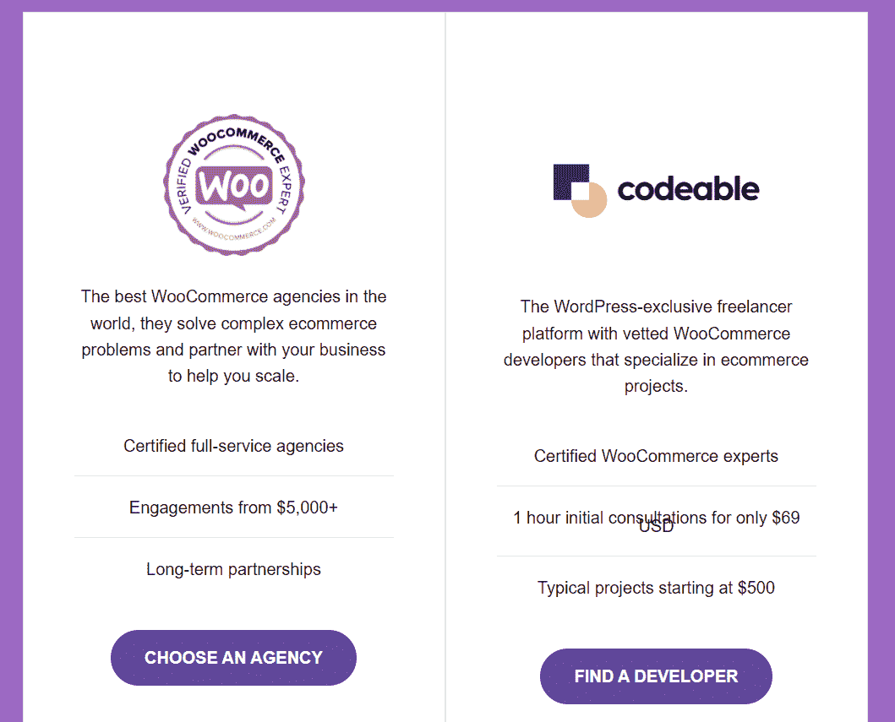

WooCommerce support partners.

无论哪种情况，你都不会得到 WooCommerce 开发团队的支持。相比之下，PrestaShop 提供[直接支持计划](https://addons.prestashop.com/en/support/16298-prestashop-support-plan.html#specifications)，但他们的起价为每月 280 美元，最多支持三个小时:

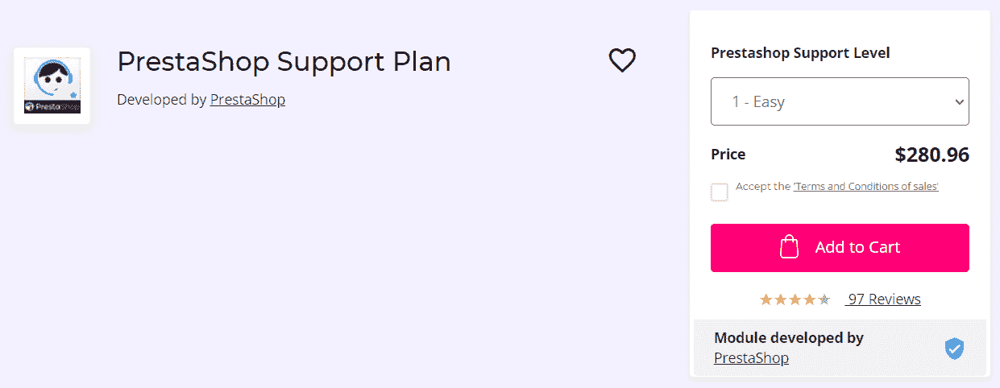

PrestaShop support plans.

简而言之，WooCommerce 和 PrestaShop 的大多数专用支持选项对于小型商店来说都过于昂贵。如果您需要获得直接支持，最好考虑 Shopify 等[托管电子商务选项。](https://kinsta.com/blog/woocommerce-vs-shopify/)

无论如何，如果你使用的是 WordPress 友好的网络主机，它应该能够提供大多数一般技术问题的支持(包括 WooCommerce 特有的问题)。但是，您的里程数将因您的主机提供商而异。

## PrestaShop vs WooCommerce:概述

我们已经介绍了很多关于 PrestaShop vs WooCommerce 的信息。现在，让我们简要总结一下这两个电子商务系统的独特之处:

|  | **WooCommerce** | **预铺** |
| **价格** | 免费(但需要付费托管) | 免费(但需要付费托管) |
| **流线型安装** | 是的，取决于你的网络主机 | 是的，取决于你的网络主机 |
| **所需的专业知识水平** | 初学者友好，具有高级功能 | 初学者友好，具有高级功能 |
| **SEO 工具** | 访问 WordPress SEO 插件 | 基本产品搜索引擎优化选项和对附加模块的访问 |
| **支持** | 没有官方支持 | 官方支持需要额外付费 |
| **扩展性** | 数百个 WooCommerce 特定扩展和数千个 WordPress 插件 | 数千个模块 |
| **电子商务模块的平均价格** | $70-130 | $80-250 |

理论上，WooCommerce 和 PrestaShop 看起来几乎一样。谈到这些电子商务平台，最大的区别是 WordPress。

如果你使用 WooCommerce，你就是在选择 WordPress。WordPress 的灵活性使你可以建立几乎任何类型的网站，同时还可以使用 WooCommerce 访问电子商务功能。

使用 PrestaShop，您只能进行电子商务。这不一定是一件坏事，但这是一个值得指出的区别。

[PrestaShop or WooCommerce — which one is right for you? 👀Click to Tweet](https://twitter.com/intent/tweet?url=https%3A%2F%2Fkinsta.com%2Fblog%2Fprestashop-vs-woocommerce%2F&via=kinsta&text=PrestaShop+or+WooCommerce+%E2%80%94+which+one+is+right+for+you%3F+%F0%9F%91%80&hashtags=WooCommerce%2CEcommerce)

## 摘要

没有一个适合所有商店的电子商务平台。PrestaShop 和 WooCommerce 都是小型和大型商店的预算友好和高度可扩展的选择。

不幸的是，这两个平台都没有提供专门的支持。然而，对于开源软件来说，这是意料之中的事情。当谈到 PrestaShop vs WooCommerce 时，他们不仅仅是用简单的安装、大量的附加选项和用户友好性来弥补。

然而，WooCommerce 在扩展性方面胜出，因为 WordPress 提供了大量的插件和主题来定制你的商店。WooCommerce 用户也可以使用专门满足他们需求的网络主机。

例如，当你建立一个新网站时，每一个 Kinsta 计划都能让你自动安装 WordPress + WooCommerce。另外，如果你遇到任何问题，你可以从 WordPress 专家那里获得[的专门帮助。](https://kinsta.com/contact-us/)

*你对 PrestaShop vs WooCommerce 有什么疑问吗？请在下面的评论区告诉我们！*

* * *

让你所有的[应用程序](https://kinsta.com/application-hosting/)、[数据库](https://kinsta.com/database-hosting/)和 [WordPress 网站](https://kinsta.com/wordpress-hosting/)在线并在一个屋檐下。我们功能丰富的高性能云平台包括:

*   在 MyKinsta 仪表盘中轻松设置和管理
*   24/7 专家支持
*   最好的谷歌云平台硬件和网络，由 Kubernetes 提供最大的可扩展性
*   面向速度和安全性的企业级 Cloudflare 集成
*   全球受众覆盖全球多达 35 个数据中心和 275 多个 pop

在第一个月使用托管的[应用程序或托管](https://kinsta.com/application-hosting/)的[数据库，您可以享受 20 美元的优惠，亲自测试一下。探索我们的](https://kinsta.com/database-hosting/)[计划](https://kinsta.com/plans/)或[与销售人员交谈](https://kinsta.com/contact-us/)以找到最适合您的方式。