# 如何获得一个自定义域的专业电子邮件地址

> 原文：<https://kinsta.com/blog/professional-email-address/>

电子邮件仍然存在。尤其是在专业环境中，美国员工平均每周要花 28%的时间阅读、回复和发送电子邮件。

尽管有 Slack T1 或其他协作工具等替代的交流方式，90%接受调查的 15 岁以上的美国人仍然积极使用电子邮件。

底线是:电子邮件是工作场所的主要沟通渠道。

因此，如果你正在考虑创业，开自己的公司，或者自由职业者，拥有一个正确的专业邮箱是必不可少的。

在本文中，我们将解释为什么这很重要，提供一些例子，并带您了解如何获得一个带有自定义域的专业电子邮件。

我们开始吧！

### 更喜欢看[视频版](https://www.youtube.com/watch?v=Jj8tCns1mtE)？

## 为什么创建一个专业的电子邮件地址很重要？

你会定期给潜在客户和现有客户发邮件的几率非常高。这通常是在网上建立关系的第一步。

这使得你的电子邮件地址成为你品牌的重要组成部分，你应该尽可能地保护和改进它。

作为一名自由职业者或企业主，你无法承受像“[【电子邮件保护】](/cdn-cgi/l/email-protection)”这样的电子邮件地址给人的第一印象。

首先，很难一眼就判断出邮件来自谁。第二，即使是像“[【邮件保护】](/cdn-cgi/l/email-protection)”这样更严肃的邮件，你的邮件收件人也没有简单的方法来确认你的身份。

任何人都可以用任何名字创建 Gmail 或 Outlook 地址。除非你的电子邮件地址支持你，否则一个潜在的客户怎么能确认你就是你所说的那个人呢？

不愿意投资一个专业的电子邮件地址表明你对你的事业不是很认真。这就是为什么你想要一个像[【电子邮件保护】](/cdn-cgi/l/email-protection)或[【电子邮件保护】](/cdn-cgi/l/email-protection)
这样的电子邮件地址

## 专业电子邮件地址创意

下面，我们将为您的商务电子邮件地址提供一个完整的示例列表。你应该选择的电子邮件地址的风格取决于你为你的企业注册的域名。

如果您使用公司名称作为域名和电子邮件地址，您应该将其与您的名、姓或首字母混合搭配。如果你需要额外的授权，你也可以在邮件地址中注明你在公司的职位。

*   [【邮件保护】](/cdn-cgi/l/email-protection)(例如[【邮件保护】](/cdn-cgi/l/email-protection))
*   [【邮件保护】](/cdn-cgi/l/email-protection)(例如[【邮件保护】](/cdn-cgi/l/email-protection))
*   [【邮件保护】](/cdn-cgi/l/email-protection)(例如[【邮件保护】](/cdn-cgi/l/email-protection))
*   [【邮件保护】](/cdn-cgi/l/email-protection)(例如[【邮件保护】](/cdn-cgi/l/email-protection))
*   [【邮件保护】](/cdn-cgi/l/email-protection)(例如[【邮件保护】](/cdn-cgi/l/email-protection))
*   [【邮件保护】](/cdn-cgi/l/email-protection)(例如[【邮件保护】](/cdn-cgi/l/email-protection))
*   [【邮件保护】](/cdn-cgi/l/email-protection)(例如[【邮件保护】](/cdn-cgi/l/email-protection))
*   [【邮件保护】](/cdn-cgi/l/email-protection)(例如[【邮件保护】](/cdn-cgi/l/email-protection))

一般来说，任何包含你真实姓名或首字母的东西都足够好了，没有必要把事情搞得太复杂。如果你曾经在一家大公司工作过，你很可能会有一封这样的邮件。

如果[你注册的域名](https://kinsta.com/blog/best-domain-registrar/)是你的全名或者姓，那就没必要加倍。你可以使用一个填充词，如联系人或邮件，或者你可以使用你的职位或姓名首字母来完成一个个人域名电子邮件地址。

*   [【邮件保护】](/cdn-cgi/l/email-protection)(例如[【邮件保护】](/cdn-cgi/l/email-protection))
*   [【邮件保护】](/cdn-cgi/l/email-protection)(例如[【邮件保护】](/cdn-cgi/l/email-protection))
*   [【邮件保护】](/cdn-cgi/l/email-protection)(例如[【邮件保护】](/cdn-cgi/l/email-protection))
*   [【邮件保护】](/cdn-cgi/l/email-protection)(例如[【邮件保护】](/cdn-cgi/l/email-protection))
*   [【邮件保护】](/cdn-cgi/l/email-protection)(例如[【邮件保护】](/cdn-cgi/l/email-protection))

你的商务邮件中最重要的变量是你选择的域名。如果你想被其他公司当作生意认真对待，你最起码能做的就是注册正确的域名。

### 当你的名字被盗用时，如何创建一个专业的电子邮件地址

我们介绍了许多模板和备选方案，您可以使用它们来创建电子邮件地址。但是大多数都依赖于你能够在[上得到你的名字或者你的公司名称。com 或其他高度信任的域](https://kinsta.com/blog/how-much-does-a-domain-name-cost/)。

如果你的全名和首字母，以及你的公司名称的所有变体都被采用，不要放弃希望。

最好的方法是将您的公司名称或名称与您的位置结合起来。

这不仅会让人们更容易在网上找到你，还会间接地帮助你的网站进行本地搜索的搜索引擎优化(SEO)和谷歌企业名录(Google Business listings)的搜索引擎优化(SEO)。即使在 2022 年，仍有如此多的企业被称为“你的城镇+水管工”和其他变体，这是有原因的。

如果你的公司不在一个地方，你也不会在你现在的城市呆很长时间，那么你必须有点创造力。

你可以先将首字母和你的名字混合搭配，或者将你的名字或首字母加到你公司的名字上，然后看看你觉得怎么样。

[美国工人平均每周花 28%的时间在电子邮件上...这意味着使用自定义电子邮件地址对您的业务和品牌至关重要。💻在这里了解如何设置一个⬇️ 点击推文](https://twitter.com/intent/tweet?url=https%3A%2F%2Fkinsta.com%2Fblog%2Fprofessional-email-address%2F&via=kinsta&text=The+average+U.S.+worker+spends+28%25+of+their+workweek+on+email...+which+means+that+using+a+custom+email+address+is+essential+for+your+business+and+your+brand.+%F0%9F%92%BB++Learn+how+to+set+one+up+here+%E2%AC%87%EF%B8%8F&hashtags=Email%2CBranding)

## 什么是最好的专业电子邮件托管选项？

好了，你已经决定了一个自定义的电子邮件域。但是，存放和处理电子邮件的最佳选择是什么呢？

你有几个不同的选择，从使用你的主机提供商提供的选项到选择一个高级解决方案，比如 [Google Workspace(以前的 G Suite)](https://kinsta.com/blog/google-workspace/) ，这就是我们在 Kinsta 使用的。

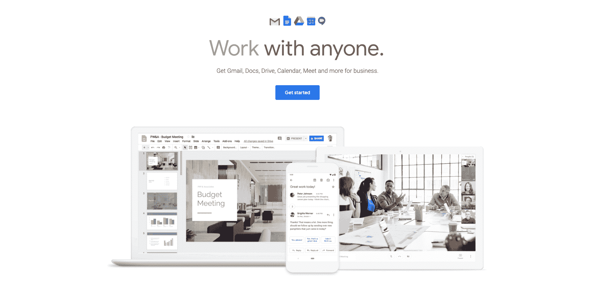

Google Workspace

我们的整个团队获得了值得信赖的品牌电子邮件地址，但他们也可以使用熟悉的 Gmail UX 进行业务交流。

这只是冰山一角。

### 为什么 Google Workspace 是专业品牌邮箱的最佳选择？

凭借同类最佳的垃圾邮件过滤器、智能搜索、直观整洁的收件箱体验以及[广泛的附加集成](https://kinsta.com/blog/gmail-add-ons/)，Gmail 是最好的电子邮件服务之一。

最棒的是，我们得到的不仅仅是电子邮件。我们所有的团队成员都获得了 30gb 的存储空间，并可以访问整个谷歌云应用套件中的高级功能。

您还可以使用 [Google Hangouts Chat 作为 Slack](https://kinsta.com/blog/slack-alternatives/#13-google-hangouts-chat) 的替代方案，甚至可以使用 Google Apps 脚本扩展和创建自定义工作流。阅读我们关于[Google Workspace](https://kinsta.com/blog/google-workspace/)优势的专题文章，了解更多深入信息。

## 如何用 Google Workspace 制作专业邮箱

创建和注册你的第一个专业邮箱地址可能会让人不知所措。但是当你一步一步分解的时候就变成了一个简单的过程。

首先，如果你还没有域名，[你需要注册一个](https://kinsta.com/blog/best-domain-registrar/)。你还需要有 [DNS 支持的高级虚拟主机](https://kinsta.com/help/dns/)。

如果你已经有了域名和网站，你可以直接跳到第三步。

### 1.注册你的域名

选择一个可靠的域名注册商，比如谷歌域名或 T2 域名。搜索可用的。com，[。co](https://kinsta.com/knowledgebase/co-vs-com/) ，或其他流行域名与您的全名或您的公司名称的组合。

远离不可信或廉价的域名，如。biz 和其他。当你选择了你的域名后，去结帐，你将会成为一个新域名的骄傲的拥有者。

### 2.创建您的 Google Workspace 商业帐户

首先，前往[谷歌工作区](https://workspace.google.com/)，点击“开始”按钮。完成后，您将开始注册过程。

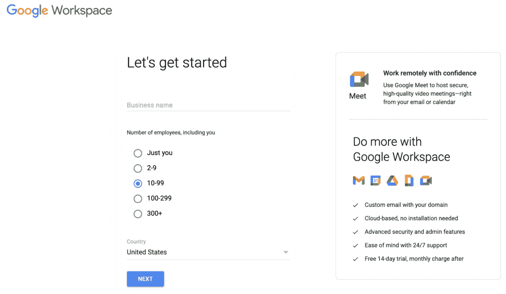

填写所需的基本信息，包括员工数量、公司名称和国家。选择你公司注册的国家很重要。

不要因为希望语言是英语而选择美国。

单击“下一步”继续。

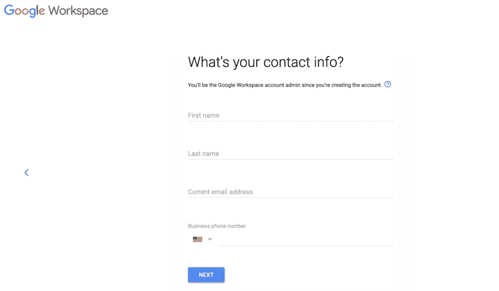

Google Workspace contact info

下一步是填写您的姓名和现有的电子邮件地址。完成后，单击“下一步”按钮。

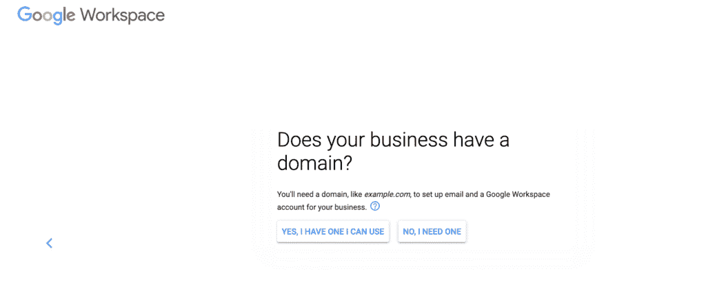

接下来，确认你是否已经有了自己的域名。如果没有，您可以在继续之前向 Google 域名注册机构注册一个。

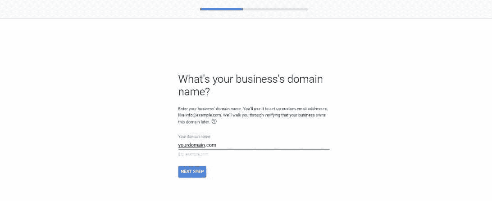

如果您已经有一个域，请填写该域，然后单击“下一步”继续。

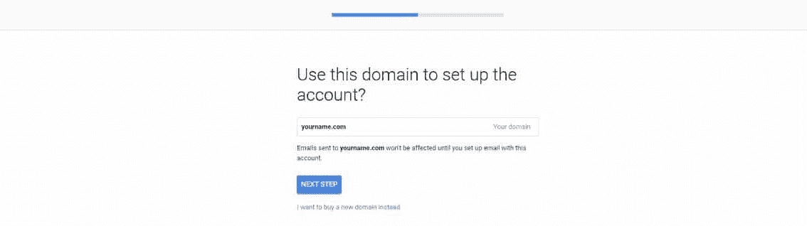

仔细检查域是否正确，然后单击“下一步”确认您的选择。

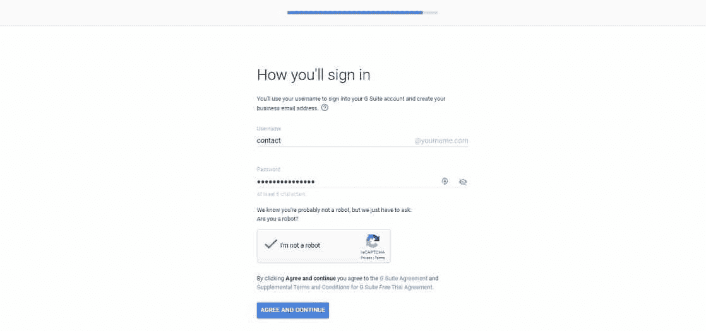

最后，创建用户名和密码，以完成您的 Google Workspace 帐户。检查验证码，然后按“同意并继续”按钮进入下一步。

**注意:**如果您已经有了专业电子邮件的电子邮件提供商，请确保您输入了正确的用户名。

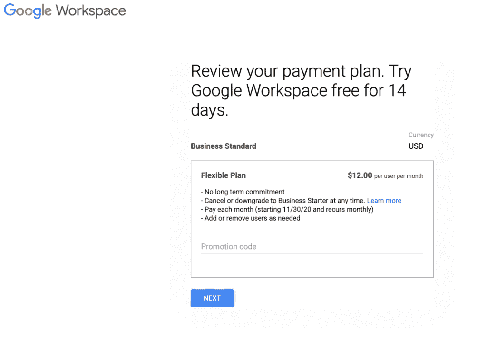

Reviewing payment plan on Google Workspace

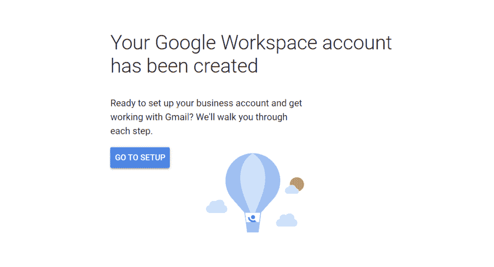

在继续之前，请确认您为 Google Workspace 选择了正确的支付计划。

如果您顺利地跟随我们到目前为止，那么您已经成功创建了您的 Google Workspace 帐户。

### 3.验证您的 Google Workspace 域

现在你已经创建了一个用户，进入[谷歌管理控制台](https://admin.google.com/Dashboard)，用你的新凭证登录。

登录后，会有一个教程帮助你设置 Google Workspace。您将从验证您的 Google Workspace 域开始。

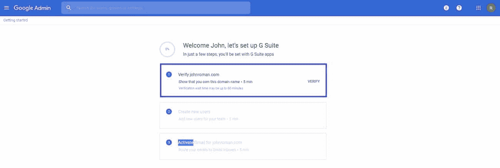

Verifying a domain in Google Workspace

单击“验证”按钮打开您的域验证选项。

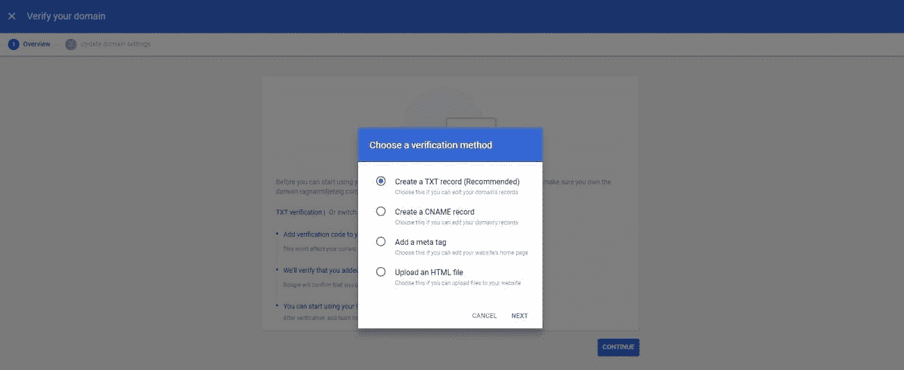

Choosing a verification method for Google Workspace

默认选项是将 TXT 记录添加到业务站点的 DNS 记录中。将 TXT 记录添加到您的 DNS 不会以任何方式影响您的网站或域名。

如果你使用的是 Kinsta DNS，一定要看看这篇关于如何[在 MyKinsta 中添加你的 Google MX 记录](https://kinsta.com/help/google-mx-records/)的教程。

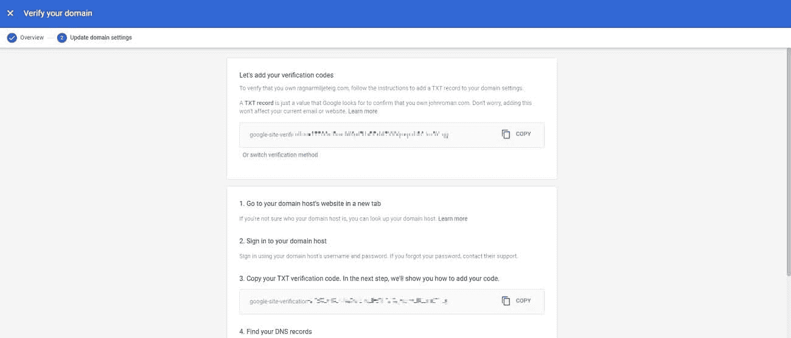

Google Workspace TXT record

一旦你选择了 TXT 选项，Google 就会生成一个以 *google-site-verify* 开头的代码。单击“复制”按钮将代码复制到剪贴板。

现在你需要在一个新的标签或窗口中访问你的主机提供商的 DNS 工具。**不要关闭谷歌工作区标签。**

现有的 Kinsta 客户应该使用 [Kinsta DNS 工具](https://kinsta.com/help/dns/)。

Kinsta DNS

单击页面顶部的“添加新的 DNS 记录”按钮。这将打开一个新的选项卡，您可以在其中添加记录。

从“类型”下拉菜单中选择“TXT”。

复制并粘贴验证码到，并按下“添加 DNS 记录”按钮。

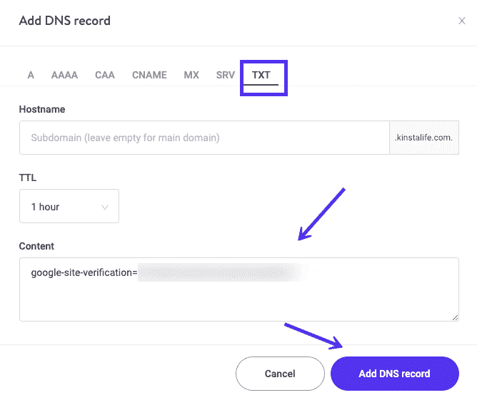

Adding a TXT record

完成后，返回到带有 Google Workspace 注册页面的标签页。

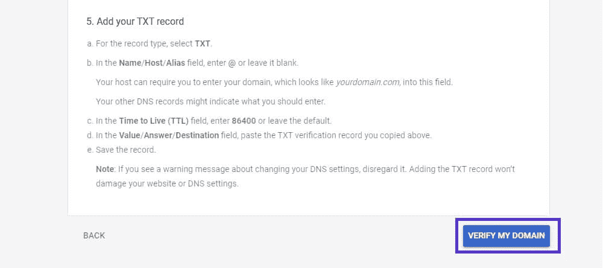

Verifying your domain

滚动到页面底部，然后单击“验证我的域”按钮完成验证。

注意:DNS 记录可能需要几分钟的时间才能生效，所以 Google 需要一段时间才能完成认证。

### 4.添加 Google Workspace 用户

如果您不是公司的唯一员工，这是添加其他用户的最佳时机。尤其是如果你已经使用不同的电子邮件服务来处理电子邮件。

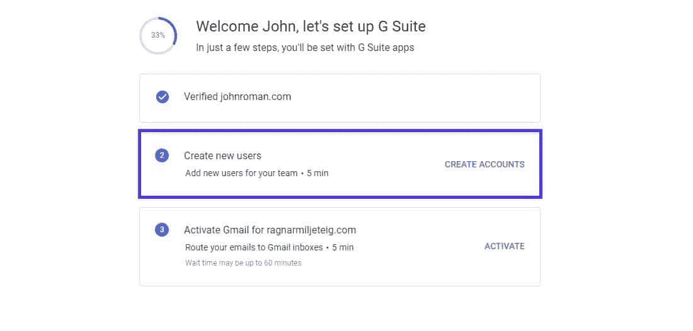

Creating new Google Workspace users

单击“创建帐户”按钮继续。

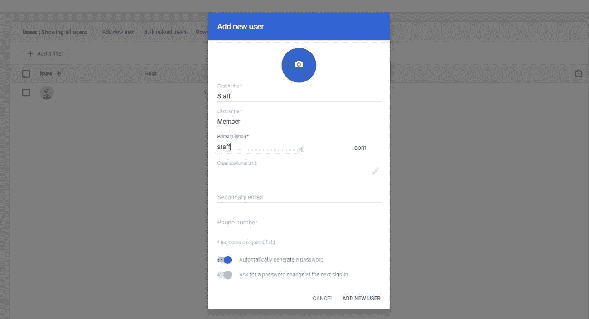

Adding new Google Workspace users

填写名称和用户名，然后单击“添加新用户”按钮。

对所有员工重复上述步骤。

## 注册订阅时事通讯

### 想知道我们是怎么让流量增长超过 1000%的吗？

加入 20，000 多名获得我们每周时事通讯和内部消息的人的行列吧！

[Subscribe Now](#newsletter)

如果您的公司已经有了[个电子邮件地址](https://kinsta.com/blog/find-email-address/)，请确保每个用户名都与现有的完全匹配。

### 5.为您的 Google Workspace 帐户激活 Gmail

最后一步是为您的 Google Workspace 帐户激活 Gmail。

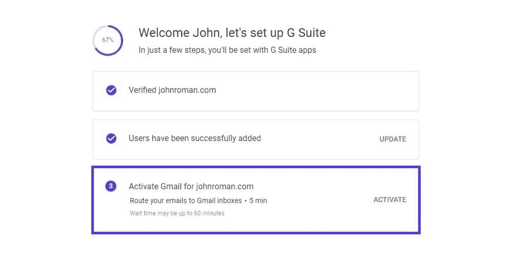

Activating Gmail

单击“激活”按钮继续下一步。

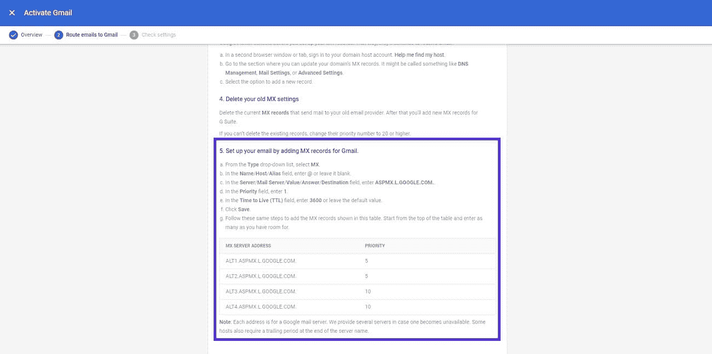

Google Workspace MX Records

在页面上，您将看到以下 MX 记录:

*   aspmx.l.google.com/优先级= 1
*   alt1.aspmx.l.google.com/优先级= 5
*   alt2.aspmx.l.google.com/优先级= 5
*   alt3.aspmx.l.google.com/优先级= 10
*   alt4.aspmx.l.google.com/优先级= 10

您需要打开一个新标签，并转到您的主机的 DNS 工具，或重新打开之前的 DNS 工具标签。

通常，您需要手动复制和粘贴，但不需要使用 Kinsta。由于我们是 Google Workspace 的忠实粉丝，我们创建了一个一键式解决方案来帮助我们的客户快速设置。

只需通过 [MyKinsta](https://kinsta.com/MyKinsta/) 访问 Kinsta DNS，点击页面顶部的[“添加 Gmail MX 记录”按钮](https://kinsta.com/help/google-mx-records/#existing-domain)。

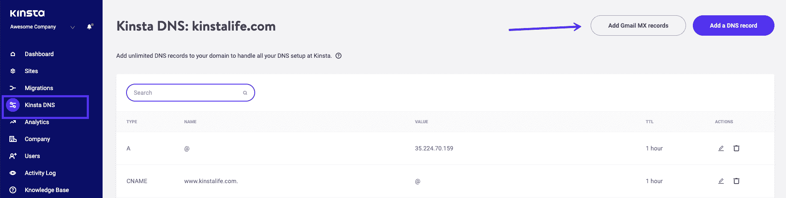

Easily add MX records through MyKinsta

MX 记录和名称服务器一样，无论用户是谁，都是相同的，因此您不必做任何更改。按“添加 5 条记录”按钮继续。

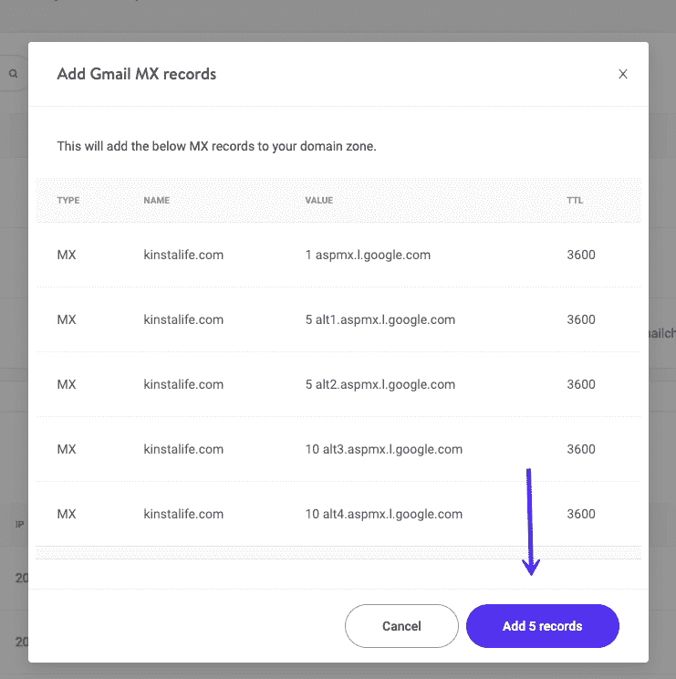

Gmail MX records confirmation

由于这些更改可能需要一段时间才能生效，所以您可以在继续之前喝点茶或咖啡休息一下。

#### 其他主机的替代方法

对于其他主机，您需要访问您的 DNS 工具，例如，通过登录到您的 [cPanel](https://kinsta.com/knowledgebase/what-is-cpanel/) 并打开 DNS 区域编辑器。

选择适当的域，然后单击“添加记录”按钮打开一个新窗口。

填写适当的优先级，然后复制并粘贴目的地。仔细检查所有内容是否正确，然后单击“添加记录”完成。对四个备选 MX 目的地重复该过程。

如果您的主机默认启用了电子邮件，您可能需要删除现有的 MX 记录。

完成后，您应该返回到 Google Workspace 注册选项卡，滚动到页面底部，然后按下“激活”按钮。

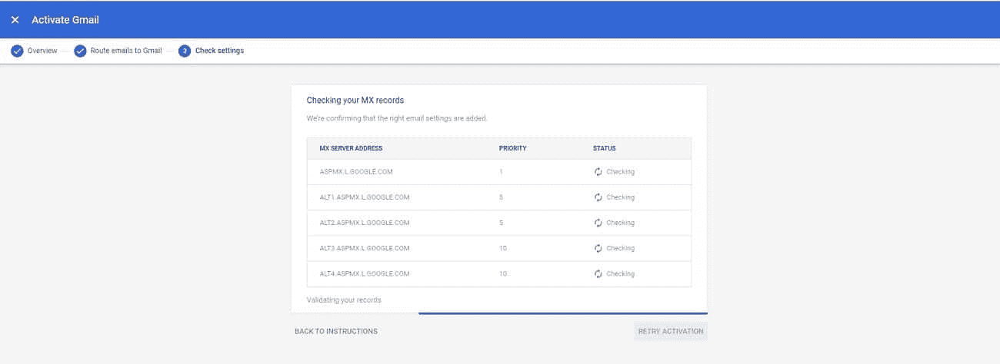

Activating Gmail in Google Workspace

需要一点时间来验证。如果一开始，它没有检测到新的记录，给它几分钟，然后按下“重试激活”按钮。

一旦更改生效，Google 将找到 MX 记录并带您进入最终屏幕。

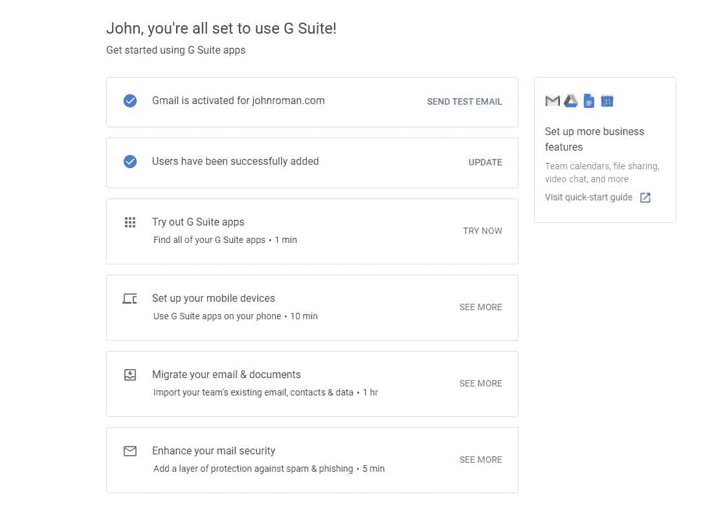

Google Workspace business email finalized

您现在已经通过 Google Workspace 设置好了您的专业电子邮件地址，可以通过 Gmail 登录来访问和发送电子邮件。

现在剩下的就是测试你新的专业邮箱地址是否正常工作。

### 7.测试您的电子邮件地址

由于 Google 确认您正确地输入了 MX 记录，这在技术上不是一个必要的步骤。

但这是让你的新品牌邮件在 Gmail 收件箱中转一圈的最快方式。

再开个邮箱，Gmail，Outlook，AOL，都没关系。撰写一封新邮件，并在“收件人”栏中输入您的新电子邮件地址。

写一个类似“第一封邮件”的随机主题，然后发送出去。

现在，前往 Gmail，使用您的 Google Workspace 凭据登录。

需要一个给你带来竞争优势的托管解决方案吗？Kinsta 为您提供了令人难以置信的速度、一流的安全性和自动伸缩功能。[查看我们的计划](https://kinsta.com/plans/?in-article-cta)

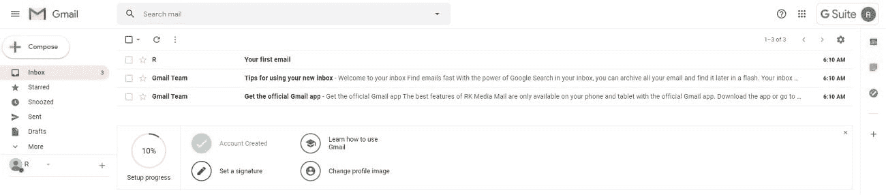

Testing your new Gmail address

如果你做的一切都正确，你应该会在收件箱里看到你从另一个账户发送的测试邮件。

你也可以试着反过来撰写和发送电子邮件，以确认你也可以顺利发送邮件。

## 如何在桌面/移动应用程序中接收发送到专业邮箱的电子邮件

在这一部分，我们将快速介绍如何使用新的专业电子邮件设置不同的应用程序。

### 在 Mail for Windows 10 中设置新的 Google Workspace 电子邮件

如果你更喜欢使用你的 Windows 10 邮件应用而不是你的浏览器，设置起来很轻松。

如果你还没有设置电子邮件帐户，你所要做的就是打开应用程序。它会自动提示您“添加帐户”

如果您已经有一个活动帐户，请注销，然后单击“添加新帐户”链接。

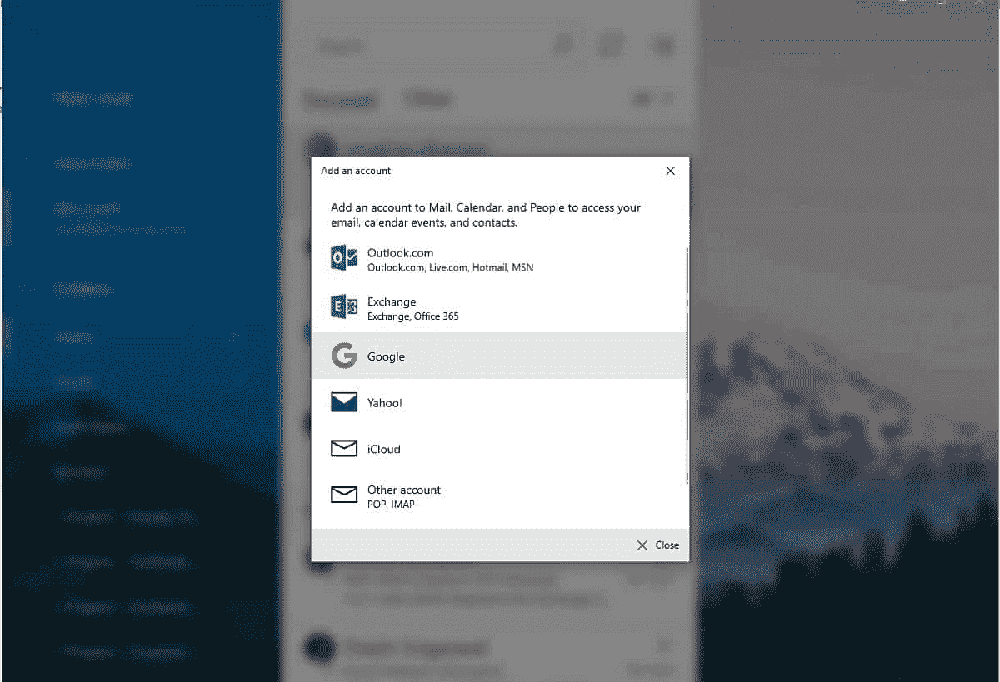

Windows Mail’s add Google account window

接下来，单击“Google”按钮，使用您的 Google Workspace 凭据登录。

Google 会提示你确认是否允许 windows 访问这些数据。

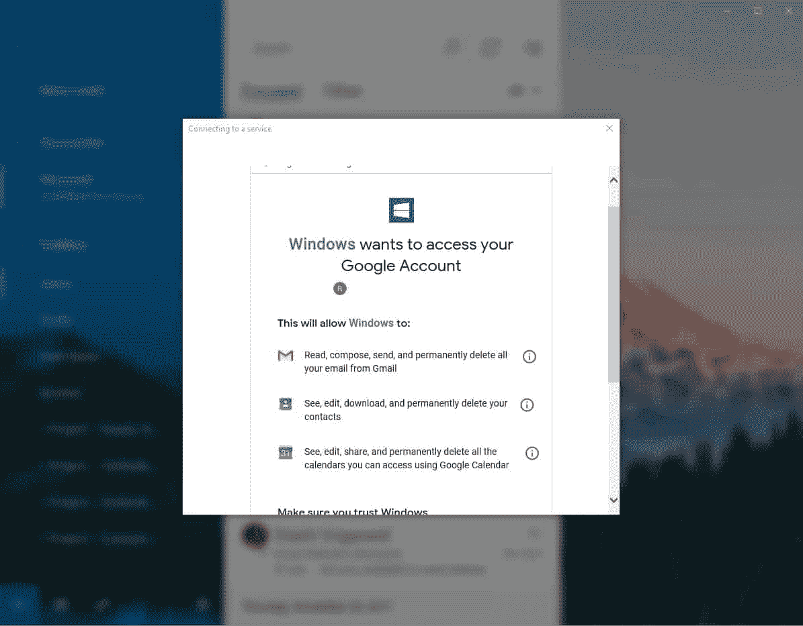

Google integration prompt

只需滚动到底部并点击“允许”

完成后，你就可以在 Windows 10 邮件应用中阅读和发送电子邮件了。

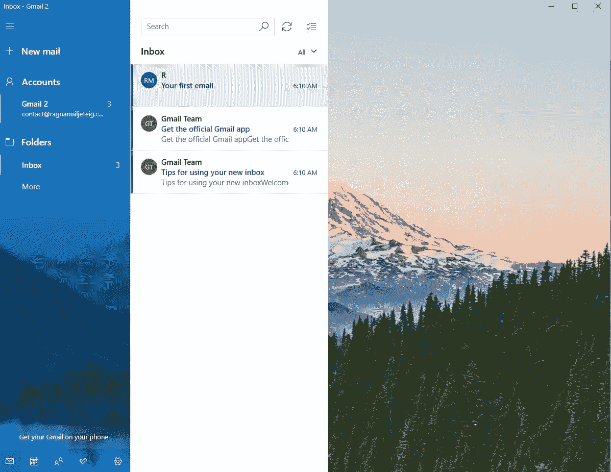

Google Workspace email in Windows Mail

设置已经完成，您根本不需要做任何其他事情。

### 在 Mac 上设置新的 Google Workspace 电子邮件

如果您不想通过浏览器访问 Gmail web 应用程序，您可以轻松地将新的 Google Workspace 电子邮件地址添加到邮件应用程序中。

首先，打开您的邮件应用程序。然后单击顶部菜单中的“邮件”选项，展开主首选项。

选择“添加帐户”选项，选择“Google”，然后点按“继续”。

从那时起，您将开始简单的激活过程。

Adding Gmail to Mail app

如果你愿意，你现在甚至可以选择要与帐户同步的应用程序，不仅是邮件，还有日历和笔记。

现在，您可以使用 Mail 应用程序从新地址发送和接收电子邮件。

### 如何在移动设备上使用您的专业电子邮件地址

由于你已经通过 Google Workspace 设置了你的电子邮件地址，在你的手机上访问它非常简单。

#### 使用 Gmail 官方应用程序

如果你还没有使用 Gmail 应用程序，该应用程序在 [iOS](https://apps.apple.com/us/app/gmail-email-by-google/id422689480) 和 [Android](https://play.google.com/store/apps/details?id=com.google.android.gm&hl=en) 上都可用，下载它并用你新创建的 Google Workspace 凭证登录。很简单。

如果您已经使用了另一个地址，则需要添加新的专业电子邮件地址。

为此，请打开手机上的 Gmail 应用程序。

在 Android 设备上，按汉堡图标展开菜单，滚动到底部，点击“设置”。

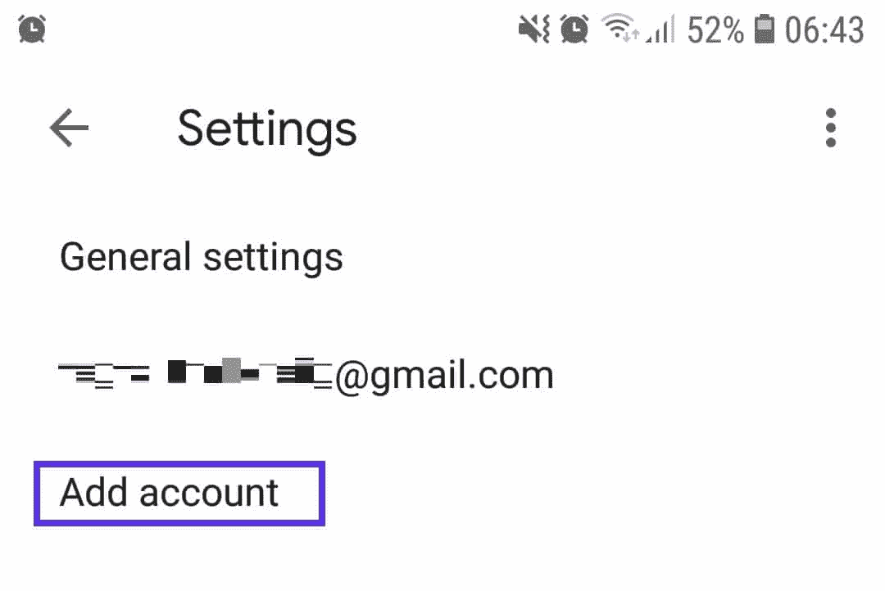

Gmail App settings – add account

在这里，你需要做的就是点击“添加帐户”链接。

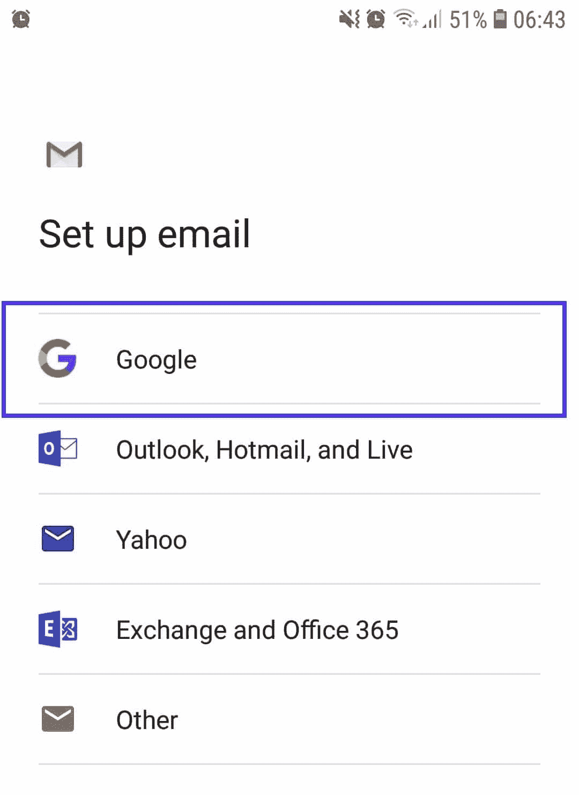

Gmail App login

接下来，单击“Google”按钮打开 Google 帐户登录页面。

您可能需要输入智能手机的 pin 码才能继续。

看到“设置电子邮件”页面后，使用您的 Google Workspace 帐户登录。

就是这样。

如果你用的是 iPhone，步骤非常相似。点击 Gmail 应用程序右上角的缩略图

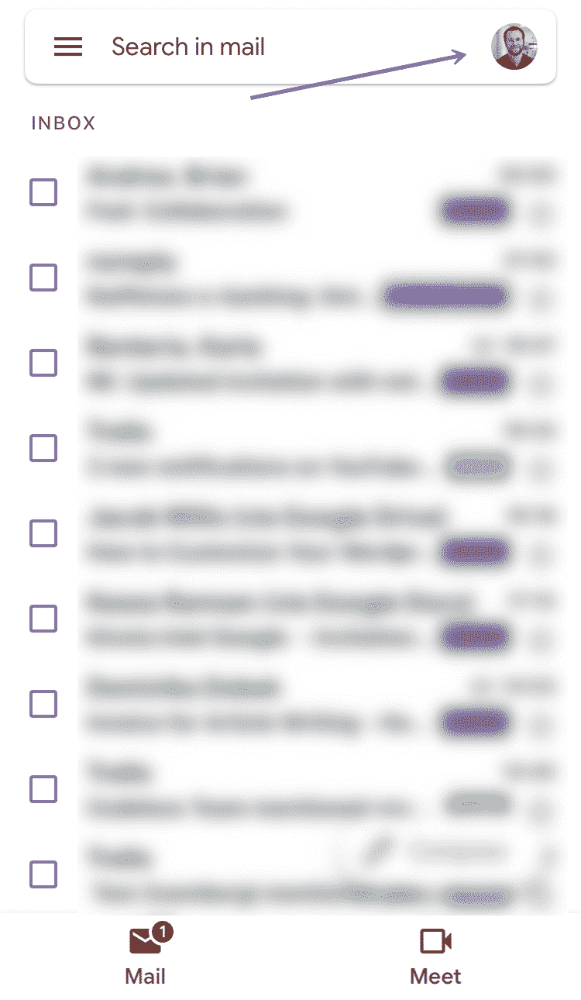

Adding a new email address in Gmail (iOS)

这将打开一个新窗口，您需要选择“添加另一个帐户”选项:

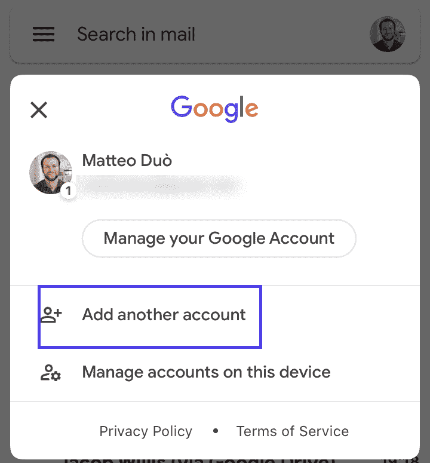

Adding a new email account in Gmail (iOS)

现在，您应该可以添加新创建的专业电子邮件地址，只需在此选择 Google 作为您的首选:

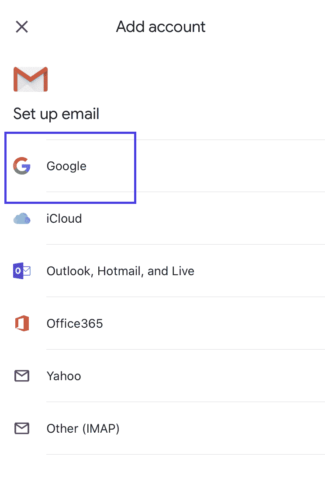

Adding Gmail address to iOS device

如果您不想使用 Gmail 应用程序，而是使用设备上的标准邮件应用程序，该怎么办？好吧，下面就告诉你怎么把你的专业邮箱地址加进去。

#### 使用标准的 Android 电子邮件应用程序

要从 Android 手机上默认的“邮件”应用程序访问您的 Gmail 电子邮件地址，您需要做的第一件事就是进入帐户设置。

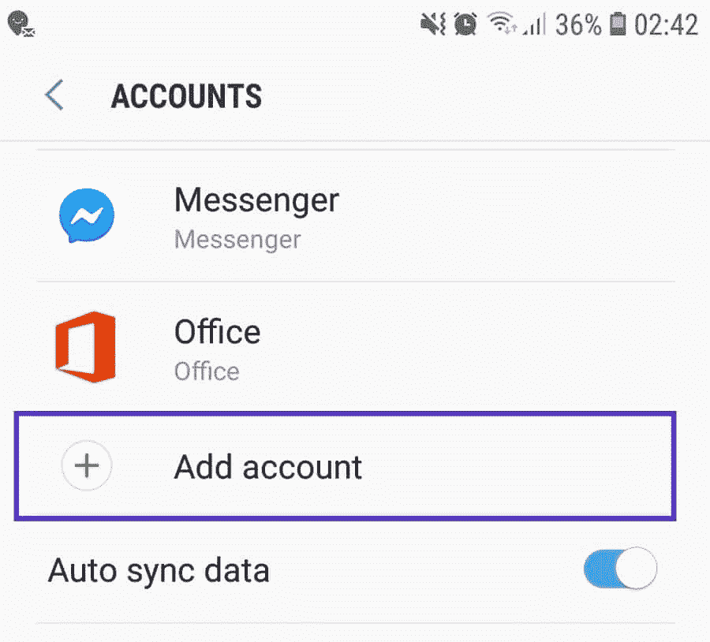

Android – add account

接下来，点击“添加帐户”选项，选择“邮件”或“电子邮件”应用程序(电子邮件是三星手机的默认设置)。

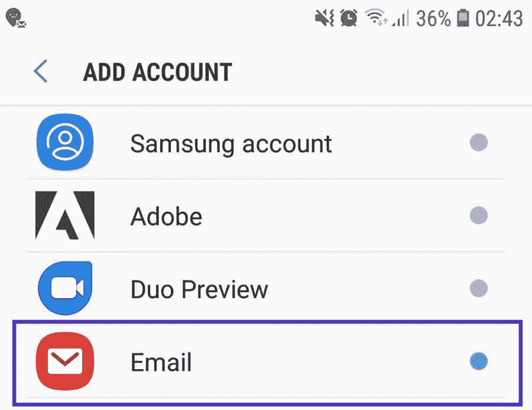

Samsung Email – add account

最后，选择 Gmail/Google Workspace，登录新的 Google Workspace 帐户。

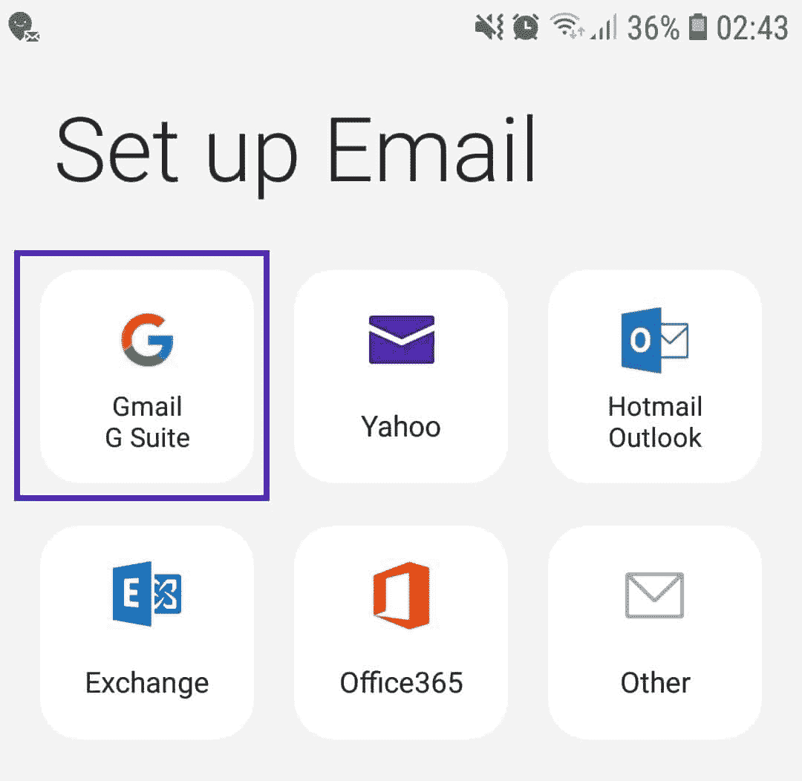

Samsung Email – Google Workspace

登录后，您将收到来自您的专业地址的电子邮件和通知。

#### 在 iOS 设备上使用邮件应用程序

在 iPhones 上，你也可以遵循同样的过程。

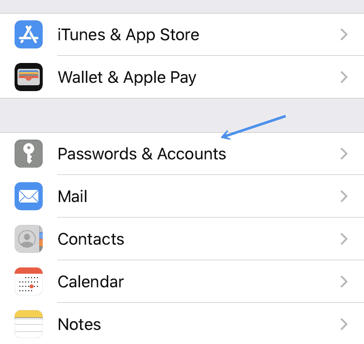

Password and Accounts options in iOS

打开 iOS 通用设置中的“密码与帐户”菜单。

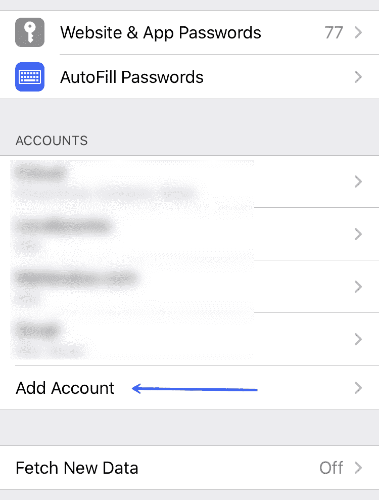

Adding a new account (iOS)

点击“添加账户”选项，然后选择谷歌:

Adding a new Google account in iOS

完成登录，并等待邮件应用程序验证您的登录。

最后，选择附加设置，如联系人和地址簿，并保存新帐户。

现在，您可以从 iOS 驱动的设备上访问您的 Google Workspace professional 电子邮件地址。

[Want to instantly make your business look more professional? 💡Add a custom email address with this easy guide⚡️Click to Tweet](https://twitter.com/intent/tweet?url=https%3A%2F%2Fkinsta.com%2Fblog%2Fprofessional-email-address%2F&via=kinsta&text=Want+to+instantly+make+your+business+look+more+professional%3F+%F0%9F%92%A1Add+a+custom+email+address+with+this+easy+guide%E2%9A%A1%EF%B8%8F&hashtags=Email%2CBrand)

## 摘要

建立一个专业的电子邮件地址就像是为你未来的商务交流打下基础。您可以选择通过传统主机及其 cPanel 仪表板设置您的电子邮件地址。或者你可以选择[托管选项](https://kinsta.com/blog/managed-wordpress-hosting/)，只需点击几下鼠标就可以整合你的 Google Workspace 账户。

简单地试着不要花太多时间纠结于电子邮件地址，只要确保它包括你的真实姓名或首字母，让你的业务开始。这才是重要的部分！

* * *

让你所有的[应用程序](https://kinsta.com/application-hosting/)、[数据库](https://kinsta.com/database-hosting/)和 [WordPress 网站](https://kinsta.com/wordpress-hosting/)在线并在一个屋檐下。我们功能丰富的高性能云平台包括:

*   在 MyKinsta 仪表盘中轻松设置和管理
*   24/7 专家支持
*   最好的谷歌云平台硬件和网络，由 Kubernetes 提供最大的可扩展性
*   面向速度和安全性的企业级 Cloudflare 集成
*   全球受众覆盖全球多达 35 个数据中心和 275 多个 pop

在第一个月使用托管的[应用程序或托管](https://kinsta.com/application-hosting/)的[数据库，您可以享受 20 美元的优惠，亲自测试一下。探索我们的](https://kinsta.com/database-hosting/)[计划](https://kinsta.com/plans/)或[与销售人员交谈](https://kinsta.com/contact-us/)以找到最适合您的方式。