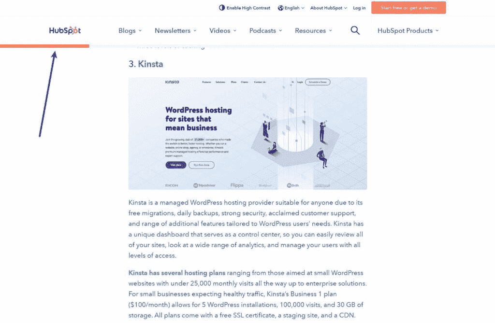
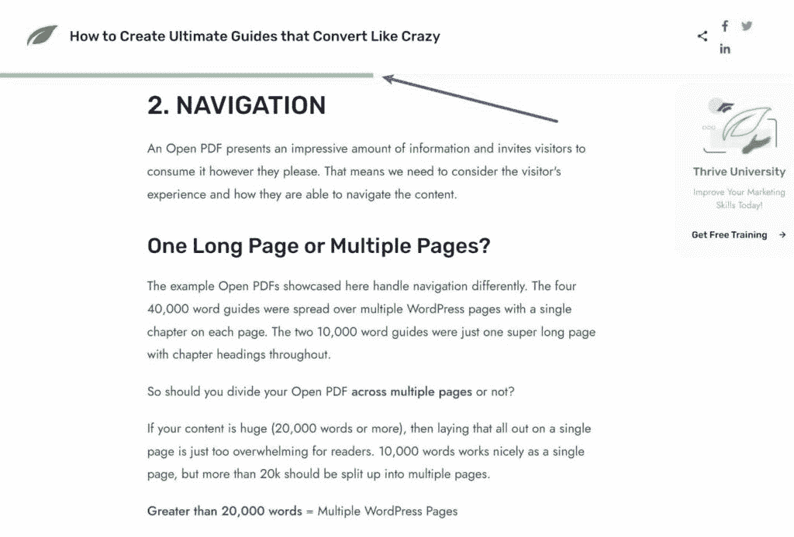
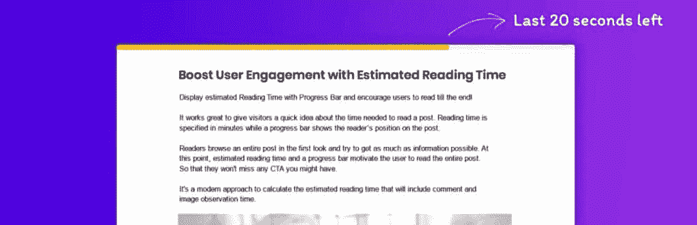
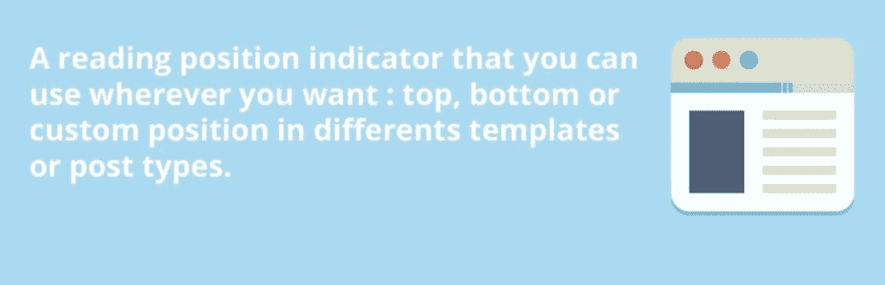
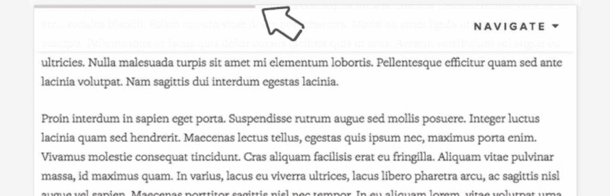
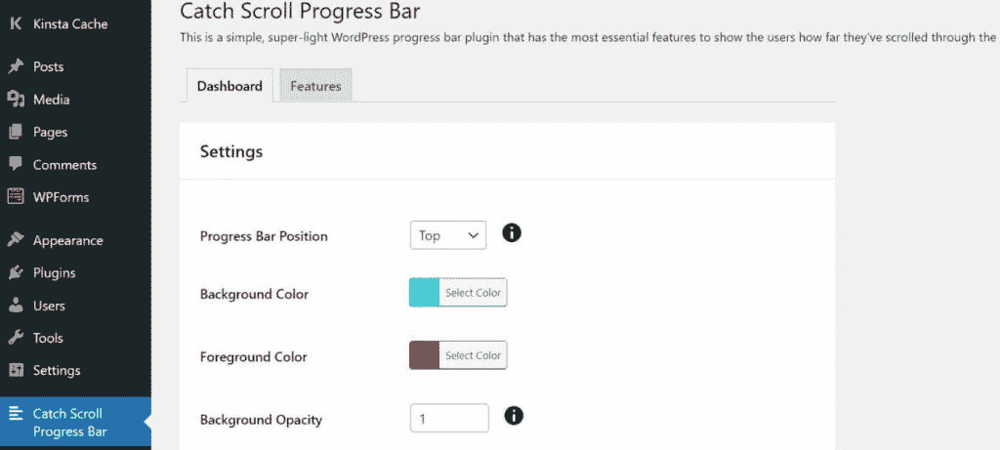
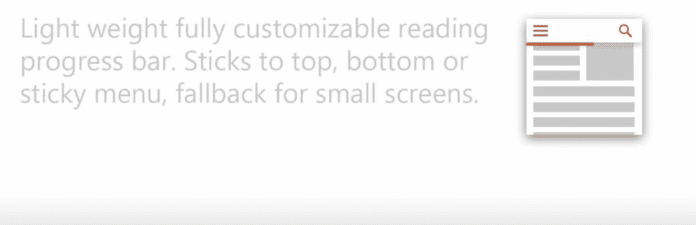
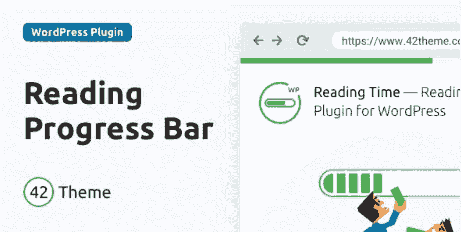
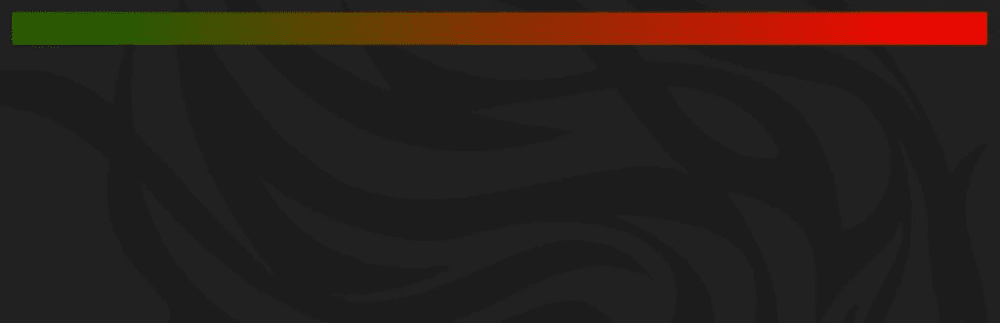
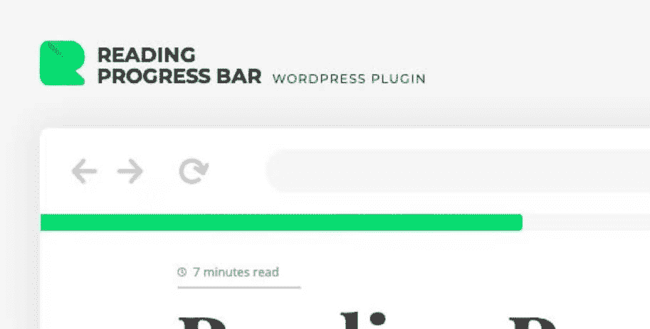

# 8 个最佳阅读进度条插件(大多数是免费的)

> 原文：<https://kinsta.com/blog/progress-bar-wordpress/>

想给 WordPress 添加一个阅读进度条？

阅读进度条是改善网站用户体验的一个很好的方式，它通过一篇文章给读者一个可视化的进度指示器。

如果你想在你的网站上添加一个，有大量免费或便宜的插件可以帮助你添加一个进度条，并使它的设计与你网站的其他部分相匹配。

在本帖中，我们收集了 8 个首选，其中 6 个是完全免费的。

下面，我们将分享每个插件的细节，以及进度条如何工作的快速介绍，以及为什么它们对你的网站有益。

## 什么是阅读进度条？

阅读进度条就像它的名字一样——它让你网站的访问者看到他们通过你文章的内容已经前进了多远。

通常，你会在页面的顶部或底部贴一个水平条。当用户在文章中滚动时，滚动条会“填满”以显示他们离文章的结尾还有多远。

一些插件也给你在内容的左边或右边创建一个垂直进度条的选项。在这些情况下，它看起来几乎像一个滚动条。然而，关键的区别在于进度条将基于实际内容的长度，而浏览器滚动条基于页面的全长。

这里有两个网站使用阅读进度条的典型例子…

HubSpot 增加了一个橙色的进度条，出现在它的[粘性标题](https://kinsta.com/blog/sticky-header/)的正下方:

A reading progress bar example from HubSpot.

Thrive Themes 有一个绿色的阅读进度条，它也出现在粘滞标题的下方:

A reading progress bar example from Thrive Themes.

但是，您可以根据您的站点尝试不同的进度条位置。

[A simple way to instantly improve your site's UX? 👀 Adding a reading progress bar! Get started here ⬇️Click to Tweet](https://twitter.com/intent/tweet?url=https%3A%2F%2Fkinsta.com%2Fblog%2Fprogress-bar-wordpress%2F&via=kinsta&text=A+simple+way+to+instantly+improve+your+site%27s+UX%3F+%F0%9F%91%80+Adding+a+reading+progress+bar%21+Get+started+here+%E2%AC%87%EF%B8%8F&hashtags=UX%2CWordPress)

## 为什么要给 WordPress 添加阅读进度条？

从高层次来说，阅读进度条是提高网站可用性和用户体验的一种方式，它对重要指标有更直接的影响，如页面停留时间和跳出率。

首先从总体上说一下用户体验。

大多数人在花时间阅读你的文章之前，都想知道他们将会进入什么样的领域。这是一篇他们可以在任务间隙阅读的 5 分钟的文章，还是一篇需要认真关注的 20 分钟的冗长文章？

当读者开始阅读时，进度条可以让他们很好地了解你的文章会带来什么。为了帮助解决这个问题，一些网站除了进度条之外还增加了估计阅读时间，下面的几个插件都支持。

一旦你的访问者开始阅读，进度条也可以鼓励他们完成文章。例如，如果读者看到他们已经完成了 80%的内容，他们会被鼓励完成最后的 20%,因为他们已经完成了文章的大部分。

用户体验的这些改进可以对两个关键指标产生积极影响:

*   停留时间(Dwell time)–鼓励读者在开始阅读后就完成一篇文章，这样可以增加他们在页面上停留的时间。
*   **跳出率**——通过增加访问者在你的页面上停留的时间，你将增加访问者继续关注你的网站的机会(也许通过阅读另一篇帖子)，这可以[帮助降低你的跳出率](https://kinsta.com/blog/how-to-reduce-bounce-rate/)。

如果你把进度条和其他提升用户体验的策略结合起来，比如 T2 的优质导航结构和 T4 的分页使用，你可以为访问者创造一个非常好的、吸引人的体验。

## 8 个最佳阅读进度条插件

现在，让我们进入 8 个最好的进度条插件来帮助你添加一个阅读进度条到你的网站。

虽然你可以找到通用的进度条插件，让你为任何事情创建一个自定义的进度条，但这篇文章特别关注那些根据页面内容的长度添加阅读进度指示器的插件。

在定价方面，其中 6 个插件是完全免费的，而剩下的 2 个插件是负担得起的，并增加了一些额外的灵活性，你不会在大多数免费选项中找到。

最棒的是，所有这些插件应该可以与几乎所有的 WordPress 主题兼容。

### 读取仪表

Read Meter

[Read Meter](https://wordpress.org/plugins/read-meter/) 是 Brainstorm Force 的一个阅读进度条插件，这是流行的 Astra WordPress 主题背后的同一个团队(这使得[成为我们最快的 WordPress 主题列表](https://kinsta.com/blog/fastest-wordpress-theme/))。

这个插件可以让你自动添加一个阅读进度条，贴在页面的顶部或底部。你也可以选择显示文章的预计阅读时间和进度条。

以下是您可以从 Read Meter 获得的所有信息:

*   **顶部或底部放置**–在用户屏幕的顶部或底部显示进度条。
*   **帖子类型定位**——您可以选择只添加某些帖子类型的阅读进度(包括[自定义帖子类型](https://kinsta.com/blog/wordpress-custom-post-types/))。例如，您可以将它显示在博客帖子上，但不能显示在页面上。
*   **阅读时间**–自动将预计阅读时间添加到文章的各个部分(如标题下方)，或使用短代码手动放置。
*   **可定制的颜色**——你可以[定制每个元素的颜色](https://kinsta.com/blog/website-color-schemes/)和风格，使其与你的网站相匹配。

**价格**:抄表 100%免费。

### 阅读进度条

Reading progressbar

与 Read Meter 一起， [Reading progressbar](https://wordpress.org/plugins/reading-progress-bar/) 是 WordPress.org 最受欢迎的进度条插件之一。然而，与 Read Meter 不同的是，这个插件没有给你添加估计阅读时间的选项——它只用于进度条。

然而，它确实给了你一些 Read Meter 所没有的额外的目标灵活性。例如，除了后期类型定位之外，您还可以将进度栏定位到特定的模板。

以下是你通过阅读 progressbar 可以获得的一切:

*   **灵活定位**–你可以自动将进度条贴在页面的顶部或底部。或者，也有一个自定义的定位选项，让您坚持任何 CSS 元素。例如，如果[你有一个粘性标题](https://kinsta.com/blog/sticky-header/)，你可以把它放在标题导航菜单的下面，而不是一直放在页面的顶部(就像上面的 HubSpot 例子)。
*   **可定制的设计**–改变进度条的高度和颜色，以匹配您的网站。
*   **定位选项**–您只能在[的某些模板](https://kinsta.com/blog/wordpress-template-hierarchy/)和/或帖子类型上显示您的进度条。

**价格**:阅读进度条 100%免费。

### 值得一读

Worth the Read

[值得一读](https://wordpress.org/plugins/worth-the-read/)是最可定制的进度条 WordPress 插件之一，如果你发现以前的插件太局限，这是一个很好的选择。

## 注册订阅时事通讯

### 想知道我们是怎么让流量增长超过 1000%的吗？

加入 20，000 多名获得我们每周时事通讯和内部消息的人的行列吧！

[Subscribe Now](#newsletter)

它包括一些其他插件没有提供的独特的位置和定位选项，以及一些其他独特的东西。如果愿意，它还可以让您选择添加一个估计的阅读时间。

以下是值得一读的所有内容:

*   **水平或垂直定位选项**–包括屏幕顶部或底部的水平进度条或屏幕左侧或右侧的垂直进度条。垂直选项是独一无二的，因为大多数其他插件不支持它。
*   **文章类型定位**–仅在某些文章类型上包含您的阅读进度条。
*   **设备定位**–您可以选择关闭移动设备和平板电脑(或台式机)的进度条。
*   **评论进度**–你可以选择在阅读进度中加入评论，如果你有[活跃的评论区](https://kinsta.com/blog/wordpress-comment-plugins/)提供有用的信息，那就太好了。
*   RTL 支持-这是少数几个允许你切换到 RTL 的插件之一，这对于 RTL 语言的网站来说是个好消息。
*   **样式选项**–自定义颜色、厚度、不透明度等。如果您启用了注释，您甚至可以使用单独的颜色来指示进度条上的注释部分何时开始。
*   **预计读取时间**–如果您启用了读取时间，您可以自定义其功能，并使用短代码自动或手动设置。

**价格**:值得一读 100%免费。

### 捕捉滚动进度条

Catch Scroll Progress Bar

捕捉滚动进度条是另一个为你的网站添加一个基本进度条的轻量级选项。

它让事情变得非常简单，只有你需要放置和样式进度条的最少选项。

以下是您将从“捕捉滚动进度条”中获得的所有内容:

*   **顶部或底部位置**–将进度条贴在页面的顶部或底部。
*   **文章类型定位**–仅将您的进度条添加到某些文章类型。
*   **模板定位**–在那些帖子类型中，只在某些模板上显示。例如，您可以将其添加到单个帖子中，但不能添加到存档页面中。
*   **颜色和样式选项**–定制进度条的颜色、不透明度和高度。

**价格**:抓滚动进度条 100%免费。
T3】

### WP 阅读进度

WP Reading Progress

WP 阅读进度是另一个免费的进度条插件，可在 WordPress 获得。

像之前的插件一样，它只给你定制阅读进度条所需的最小设置。但对大多数人来说，这就是你所需要的，这使它成为另一个可靠的选择。

以下是你在 WP 阅读进度中得到的一切:

Struggling with downtime and WordPress problems? Kinsta is the hosting solution designed to save you time! [Check out our features](https://kinsta.com/features/)

*   **灵活定位**–自动将横条贴在页面的顶部或底部。或者，你可以手动将它粘到任何一个 [CSS 选择器](https://kinsta.com/blog/wordpress-css/)上。
*   **文章类型定位**–仅在某些文章类型上包含进度条。在存档页面上还有一个启用/禁用选项。
*   **风格定制**–可以定制进度条的颜色和粗细。*然而*，*你只能选择一种颜色，没有不透明度选项。*

**价格** : WP 阅读进度 100%免费。

### 阅读时间

[阅读时间](https://codecanyon.net/item/reading-time-reading-progress-bar-for-wordpress/19773718)是这个列表中第一个只有高级版本的阅读进度插件。

然而，它仍然很实惠，并通过 Envato 的 CodeCanyon marketplace 提供终身更新。

有两个主要原因让你考虑阅读时间而不是免费的替代品:

*   8+预设样式–你可以得到一些独特的样式选项，比如在进度条中使用竖条代替纯色填充(如上图)。
*   **高级定位规则**-除了定位帖子类型和模板，您还可以通过非常具体的规则定位您的进度条，例如[用户角色](https://kinsta.com/blog/wordpress-user-roles/)、URL、设备等等。

您还可以获得您期望从插件中获得的所有“标准”特性:

*   **灵活定位**–除了自动顶部或底部放置，你还可以使用自定义定位将你的进度条粘贴到任何 CSS 选择器上。
*   **样式选项**–除了 8 种以上的预设样式，您还可以使用通用选项来定制进度条的颜色和高度。

价格:阅读时间花费 15 美元，附带单个网站的终身更新和 6 个月的支持。

### 读数位置指示器

Reading Position Indicator

阅读位置指示器是 WordPress.org 的另一个轻量级免费进度条插件。

它没有给你太多的设置，但一个独特的选项是，它可以让你为你的阅读进度条使用自定义渐变(除了纯色)。

以下是阅读位置指示器带给您的一切:

*   **顶部或底部位置**–没有 CSS 选择器目标，但您可以添加偏移量。
*   **文章类型定位**–将你的进度条定位到特定的文章类型。
*   **风格定制选项**–从纯色或渐变色风格中选择。您也可以调整进度条的粗细。

**价格**:读数位置指示器 100%免费。

### 钢筋

ReBar

ReBar 是另一个高级阅读进度条插件，通过 Envato 的 CodeCanyon 市场出售。

与阅读时间一样，这里有一些它提供的独特功能，可能值得花这笔钱:

*   **8+预设样式**–您可以获得许多超越纯色填充的独特样式，如塑料、渐变、iOS 风格等。
*   **高级定位规则**–除了定位帖子类型，您还可以通过非常具体的规则定位您的进度条，例如用户角色、[URL](https://kinsta.com/knowledgebase/what-is-a-url/)、设备等等。
*   无限滚动支持–ReBar 仍然支持无限滚动布局，这使得它成为这些网站的一个很好的选择。你可以定义基于 CSS 选择器的滚动区域，它会为无限滚动中的每篇文章生成一个独特的进度条。

以下是其他一些值得注意的特征:

*   **水平和垂直样式**–在页面的顶部或底部放置一个水平进度条，或者在页面的左侧或右侧放置一个垂直进度条。
*   **可定制的样式**–除了 8 种以上的预设样式，您还可以定制进度条的颜色和高度/宽度。
*   **RTL 支持**–您可以反转 RTL 语言的进度条。

**价格** : ReBar 售价 15 美元，附带单个站点的终身更新和 6 个月的支持。

看看这些免费且易于使用的阅读进度条插件——其中 6 个是完全免费的！😄 点击推文

## 摘要

这就是我们收集的 8 个最佳阅读进度条插件。

对于添加基本进度条的最简单的选项，您可以考虑插件，如 Read Meter 或 Reading progressbar。

另一方面，如果你想免费获得最大的可定制性，你可能想从值得一读开始，因为它包含了许多其他插件没有的独特选项和特性。

如果你想超越进度条的纯色填充，你也可以考虑 CodeCanyon 的高级选项——阅读时间或 ReBar。同样，这些插件最独特的细节是它们都有 8 种以上的预设样式和更高级的目标选项。

每个插件都有自己独特的风格和特性，所以值得一探究竟，找到适合你网站的选项。

他们中的大多数在 WordPress.org 都有免费版本，这使得测试变得很容易。如果你用 Kinsta 托管你的站点[，你可以](https://kinsta.com/)[轻松地创建一个临时站点](https://kinsta.com/blog/wordpress-staging-site/)来安全地测试每个插件在你的站点上会是什么样子。

为了找到其他可以改进你网站的插件，你也可以浏览我们的最佳 WordPress 插件列表。

* * *

让你所有的[应用程序](https://kinsta.com/application-hosting/)、[数据库](https://kinsta.com/database-hosting/)和 [WordPress 网站](https://kinsta.com/wordpress-hosting/)在线并在一个屋檐下。我们功能丰富的高性能云平台包括:

*   在 MyKinsta 仪表盘中轻松设置和管理
*   24/7 专家支持
*   最好的谷歌云平台硬件和网络，由 Kubernetes 提供最大的可扩展性
*   面向速度和安全性的企业级 Cloudflare 集成
*   全球受众覆盖全球多达 35 个数据中心和 275 多个 pop

在第一个月使用托管的[应用程序或托管](https://kinsta.com/application-hosting/)的[数据库，您可以享受 20 美元的优惠，亲自测试一下。探索我们的](https://kinsta.com/database-hosting/)[计划](https://kinsta.com/plans/)或[与销售人员交谈](https://kinsta.com/contact-us/)以找到最适合您的方式。