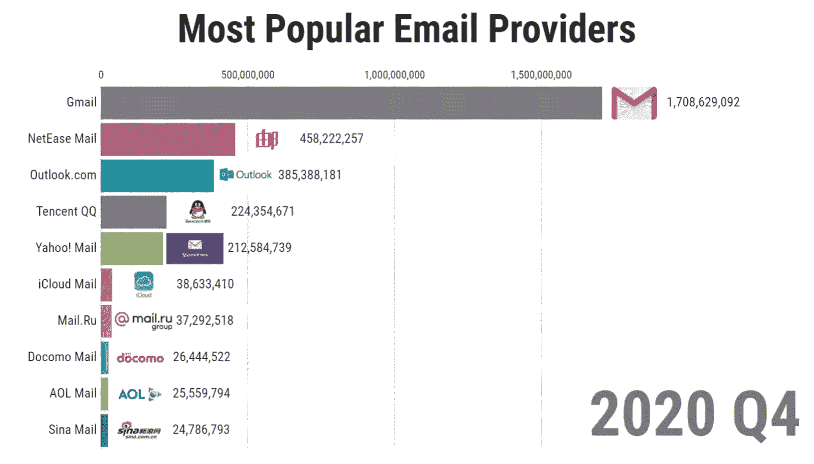
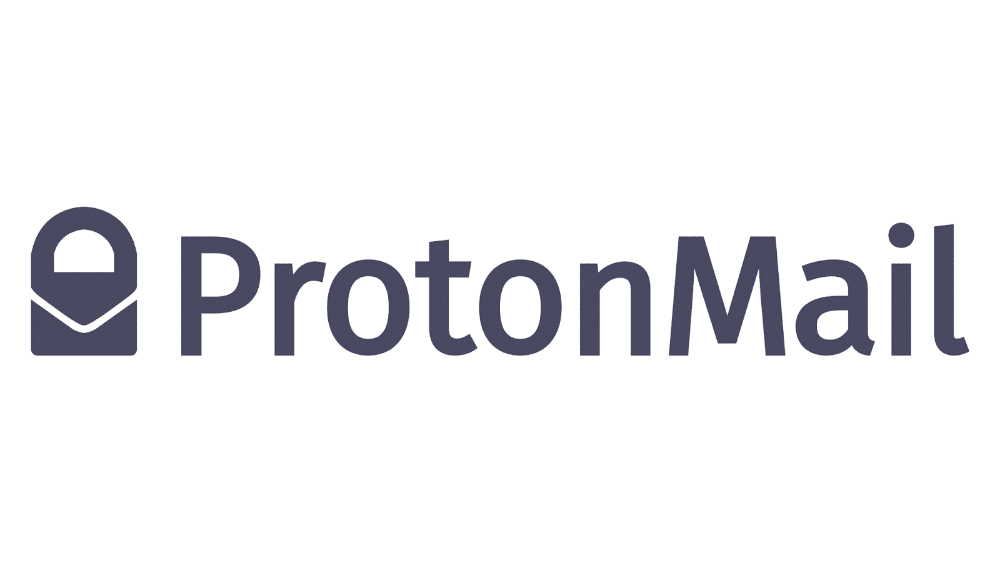
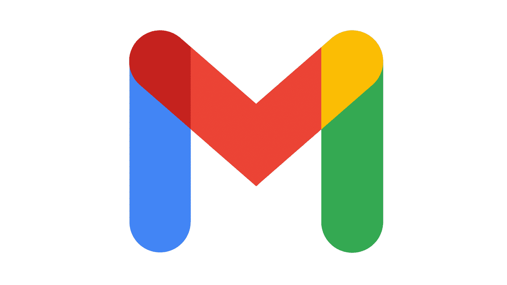
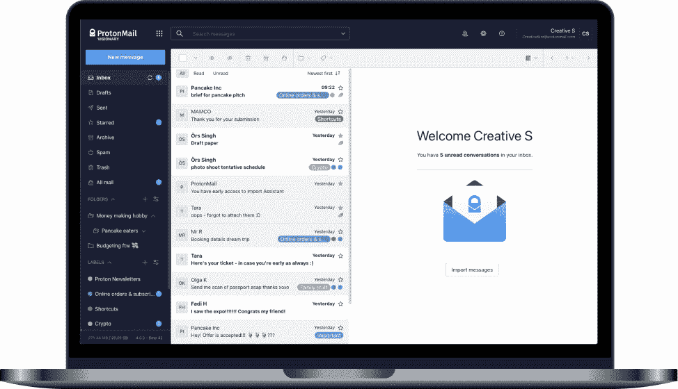
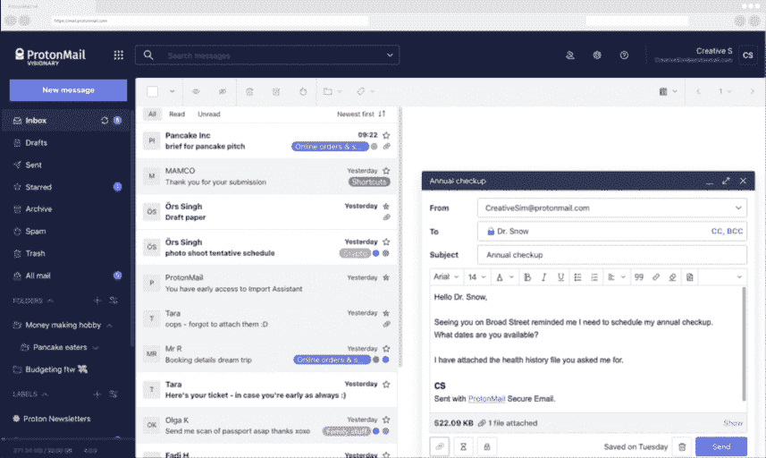
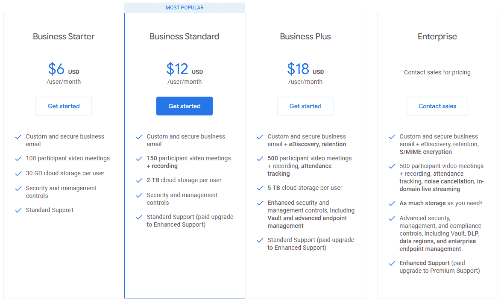
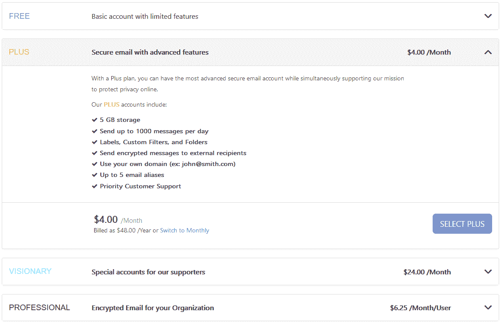

# ProtonMail 与 Gmail:终极比较指南

> 原文：<https://kinsta.com/blog/protonmail-vs-gmail/>

虽然 Gmail 可能是世界上最受欢迎的电子邮件提供商，但 ProtonMail 的安全性是否让它成为更好的选择？

答案并不总是如此清晰。

虽然许多用户已经因为其出色的安全和隐私功能而转向 ProtonMail，但许多 Gmail 用户根本看不到它的好处。虽然 ProtonMail 肯定是两个提供商中更安全的，但一些用户可能会认为额外的安全性不是完全必要的。

但这真的是一个安全的假设吗，尤其是在安全风险不断增加的情况下？那么其他电子邮件功能呢，比如易用性或可扩展性？虽然这两个提供商各有所长，但每个都有独特的优点，也有独特的缺点。

请继续阅读，在这场势均力敌的比较中，了解更多关于 ProtonMail 和 Gmail 的信息。

## ProtonMail 与 Gmail 的主要区别

Gmail 是迄今为止世界上最受欢迎的电子邮件提供商，拥有超过 15 亿用户。

Gmail is the world’s most popular email provider

虽然使用(甚至知道)ProtonMail 的人少得多，但很多研究它的人倾向于做出改变。对于一个“小”电子邮件提供商来说，这是相当令人印象深刻的——但是为什么会这样呢？

答案因用户和他们的偏好而异。然而，[隐私和安全](https://kinsta.com/cheatsheets/site-security-cheat-sheet/)往往是那些转向使用 ProtonMail 的人普遍关心的问题。虽然 Gmail 在这些方面并不一定“缺乏”,但 ProtonMail 的额外保护级别使它非常有吸引力。

这并不是说 Gmail 没有其他优势，或者说 ProtonMail 没有缺点。

一般来说， **ProtonMail 更安全，而 Gmail 更灵活。**正如我们将在快速对比中看到的，Gmail 的灵活性使其成为使用其他[谷歌服务(如 Docs)](https://kinsta.com/blog/google-docs-to-wordpress/) 的绝佳选择。同样，当发送敏感数据时，ProtonMail 的安全性是无价的。

请继续阅读，了解更多细节。

[While Gmail may be the world’s most popular email provider, does ProtonMail’s security make it the better option? 👀 Learn more here 🤓Click to Tweet](https://twitter.com/intent/tweet?url=https%3A%2F%2Fkinsta.com%2Fblog%2Fprotonmail-vs-gmail%2F&via=kinsta&text=While+Gmail+may+be+the+world%E2%80%99s+most+popular+email+provider%2C+does+ProtonMail%E2%80%99s+security+make+it+the+better+option%3F+%F0%9F%91%80+Learn+more+here+%F0%9F%A4%93&hashtags=Gmail%2CEmailTips)

### ProtonMail 概述

总部位于瑞士的 ProtonMail 是世界上最隐私和安全的电子邮件提供商之一。

ProtonMail

虽然许多电子邮件提供商会收集大量个人数据，但 ProtonMail 不会。除了匿名注册和没有 IP 地址记录，ProtonMail 是少数几个允许用户完全匿名的电子邮件提供商之一。他们的付费计划甚至允许用户使用匿名或分散的支付方式[，如比特币](https://kinsta.com/blog/bitcoin-donate-button/)。

ProtonMail 还提供了非常强大的安全功能——至少对电子邮件提供商来说是这样。在其他安全功能中，ProtonMail 提供了完整的端到端加密，使得任何人(甚至 ProtonMail 本身)都不可能阅读[你的电子邮件](https://kinsta.com/blog/email-design/)。

如果这还不够，他们还提供地址验证来保证你的电子邮件被发送到预定的收件人。凭借强大的密码术和加密方法等其他功能，ProtonMail 的隐私和安全级别在免费电子邮件提供商中是无与伦比的。

这并不是说没有缺点或限制。

虽然 ProtonMail 用户可以享受顶级的隐私和安全性，但它也有一些限制。其中一些限制包括每天发送 150 条消息的限制和只有 500 MB 的[云存储空间](https://kinsta.com/blog/best-cloud-storage/)。我们将在下面进一步探讨这些限制。

#### ProtonMail Pros

寻找无与伦比的隐私和强大的安全性？只需看看 ProtonMail。

*   **完全隐私和匿名。** ProtonMail 允许其用户保持完全匿名，注册时不需要任何个人信息。ProtonMail 也不会跟踪用户的 [IP 地址](https://kinsta.com/blog/dedicated-ip-address/)或审查他们发送的电子邮件，允许完全匿名的通信——这在任何电子邮件提供商中都是罕见的功能。付费用户也可以使用比特币等匿名方式支付。
*   **强大的加密和安全性。作为隐私功能的延伸，ProtonMail 还会加密每封邮件。截至 2022 年，ProtonMail 使用[非常好隐私(PGP)](https://www.varonis.com/blog/pgp-encryption) 加密来保护电子邮件和发送的文件。椭圆曲线加密技术也于 2019 年 4 月推出，为用户提供了更快速度和额外安全性的双重优势。**
*   **私人信件。**虽然从技术上讲，这是上述优势的一部分，但也值得一提。有了 ProtonMail 的加密功能，除了你和你的记者，任何人都不可能阅读你的邮件——甚至 ProtonMail 本身。该提供商还包括[地址验证](https://kinsta.com/blog/why-are-my-emails-going-to-spam/)，这样你就能知道谁会收到你的邮件。

#### 质子邮件缺点

尽管 ProtonMail 有很多安全优势，但它并不是最灵活的电子邮件服务提供商。

*   **150 条消息的限制。** ProtonMail 每天只允许用户发送 150 封邮件。虽然这对于某些人来说可能是一个相当高的限制，但企业用户将需要付费订阅或另一个服务提供商来进行大规模通信。对于付费用户，这一限制增加到每天 1，000 封电子邮件。
*   **只有 500 MB 的存储空间。【Gmail 和其他电子邮件提供商提供大量(如果不是“无限”)数据上限，ProtonMail 只提供 500 MB 的[安全云存储](https://kinsta.com/blog/cloud-security/)。然而，那些寻求隐私和安全的人通常对远程存储他们的文件不感兴趣。**
*   最小的组织工具。如果消息和数据上限还不够，ProtonMail 提供了最基本的组织工具(如果不是更少的话)。由于没有过滤器或标志，对于希望保持有序的用户来说，这不是一个很好的选择。然而，用户仍然可以使用提供商的[免费 SMTP 服务器](https://kinsta.com/blog/free-smtp-server/)访问 [Outlook 中的 ProtonMail 和其他应用](https://kinsta.com/blog/outlook-alternative/)。

### Gmail 概述

谷歌的 Gmail 成立于 2004 年，是世界上最受欢迎的电子邮件提供商之一。

Gmail

Gmail 拥有超过 15 亿用户，并且还在增长，是最受欢迎的电子邮件提供商。唯一的挑战者是电子邮件客户端部门，苹果 iPhone 的邮件在移动安装中略微领先。

即便如此，Gmail 的流行也不无道理。

像许多谷歌产品和服务一样，Gmail 提供了一个直观、易用的界面，去除了杂乱和不必要的工具。因此，即使是第一次使用 Gmail 的用户也可以轻松地浏览 Gmail 界面来发送和阅读电子邮件。此外，正如你对搜索引擎的期望一样，Gmail 还能让你轻松搜索收件箱和其他文件夹。

Gmail 最大的优势之一是它的动态邮件。这个强大的功能允许用户在邮件中完成某些操作(比如评论 Google 文档),节省了宝贵的时间。动态邮件通过[谷歌工作区](https://kinsta.com/blog/google-workspace/)支持额外的应用和[附加软件](https://kinsta.com/blog/gmail-add-ons/)，包括谷歌表单和谷歌文档。

当然，所有这些便利和灵活性都是有代价的——而且代价是隐私。

除了收集你的个人信息之外，谷歌还会密切关注你在使用它的应用程序时所做的一切。这不仅限于电子邮件。无论你是在 Gmail 中发送邮件，还是在谷歌文档上回复评论，或者填写谷歌表格，谷歌都在关注。

然而，这并不是说谷歌将你的数据用于某种邪恶的目的。如果有的话，谷歌收集你的数据主要是为了定制你的体验，或者在最坏的情况下，为你提供广告。此外，数据收集在大多数电子邮件提供商中很常见，包括微软 Outlook 和[雅虎！邮件](https://kinsta.com/blog/yahoo-smtp-settings/)。

即便如此，对于一个易于使用且与其他应用高度兼容的免费电子邮件来说，这也不是一个糟糕的权衡。

#### Gmail 专业版

Gmail 的流行很大程度上是因为它的灵活性和易用性。

*   **简单直观的界面。** Gmail 的精简界面使发送电子邮件变得简单。动态邮件和其他强大的功能使大多数操作变得直观，即使是第一次使用的用户也能找到路。
*   **高度兼容。** Gmail 与 Google Workspace 高度兼容，其中包括 Google Docs 和 [Google Forms](https://kinsta.com/blog/google-forms-alternative/) 等应用。因此，Gmail 是任何使用这些服务的人的绝佳选择。用户还可以访问 [Gmail SMTP 服务器](https://kinsta.com/blog/gmail-smtp-server/)，通过 Outlook 和其他第三方电子邮件客户端发送和接收电子邮件。
*   没有垃圾邮件的收件箱。Gmail 收件箱以无垃圾著称，这部分要归功于谷歌尖端的垃圾邮件过滤技术。对于从雅虎等其他垃圾邮件提供商那里转移过来的用户来说，这通常是一种解脱。邮件。

#### Gmail 缺点

虽然 Gmail 是可用性的一个很好的选择，但它也有一些缺点，对一些用户来说可能不是很有吸引力。

*   可疑的隐私。无论对错，谷歌和 Gmail 都会收集你的数据。这包括您的个人信息、应用程序使用情况以及您发送的任何电子邮件的内容。虽然这对一些用户来说并不是一个障碍，但那些寻求完全匿名和隐私的人应该考虑 ProtonMail。
*   **没有自定义文件夹。Gmail 的用户界面非常棒，唯一的缺点是缺少文件夹。与其他提供自定义文件夹来分类邮件的电子邮件服务不同，Gmail 使用了一个标签系统。虽然许多用户更喜欢它，但它需要一些时间来适应。**
*   **昂贵的付费层级。** Gmail 的付费计划比竞争对手稍贵，最基本的计划每月 6 美元起。虽然这还不算多，但与 Google Workspace 集成的企业级计划的价格增长很快。当然，大多数用户对免费选项非常满意。

### TL；DR:隐私与灵活性

不用说，Gmail 和 ProtonMail 是两个非常不同的电子邮件提供商。虽然两者都有自己的优点和缺点，但它们的主要区别在于隐私和灵活性。

*   ProtonMail 更私密，但灵活性较差。虽然 ProtonMail 用户拥有完全的匿名和隐私，但他们每天只能发送这么多消息。
*   Gmail 不太隐私，但更灵活。 Gmail 易于使用，与其他应用高度兼容，但它远没有那么私密。

显然，一个不一定比另一个“更好”。但是哪个更适合*你*？

虽然您现在可能已经知道了，但考虑隐私和灵活性之外的一些其他因素会有所帮助。在你作出最终决定之前，看看下一部分关于选择电子邮件提供商的一些有用的提示。

## 注册订阅时事通讯

### 想知道我们是怎么让流量增长超过 1000%的吗？

加入 20，000 多名获得我们每周时事通讯和内部消息的人的行列吧！

[Subscribe Now](#newsletter)

## 如何选择电子邮件提供商

你需要从电子邮件提供商那里得到什么？

A ProtonMail inbox shown on a laptop

虽然有些人只想要一种简单的发送电子邮件的方式，但其他人可能有更特殊的要求。无论是完全的隐私还是与现有工具的兼容性[(或其他完全的东西)](https://kinsta.com/blog/professional-email-address/)，了解您的需求是选择正确提供商的关键。

当然，还有其他因素需要考虑——没有一家供应商能满足所有这些因素。

### 1.评估你的需求

你打算如何使用你的电子邮件？例如，虽然 Gmail 是个人通信的绝佳选择，但它可能不太适合发送医疗记录和其他敏感数据。

[内容营销](https://kinsta.com/learn/content-marketing/)也提出了几个独特的需求。虽然大多数[电子邮件营销](https://kinsta.com/blog/email-marketing-statistics/)活动使用专门的[电子邮件营销软件](https://kinsta.com/blog/email-marketing-software/)，但他们仍然依赖强大的电子邮件提供商来发送和接收电子邮件。在这里，更灵活的选项，如 Gmail 和私人电子邮件服务器，通常更有能力支持电子邮件营销活动和最佳实践。

无论如何，评估你的需求是选择电子邮件提供商的最好方法。例如，一些用户可能需要能够进行企业级部署的电子邮件提供商。虽然 ProtonMail 有一个商业版本，但对于某些组织来说，它的可扩展性或可用性可能不够。

相反，一个组织可能更喜欢 Gmail，仅仅是因为它的易用性和可扩展性。虽然它不像 ProtonMail 那样私密或安全，但对更简单、更灵活的提供商的需求超过了这些因素。

### 2.优先考虑隐私和安全

虽然电子邮件本质上是隐私的，但许多用户惊讶地发现，电子邮件提供商实际上并不一定是隐私的。

通常，注册一个电子邮件账户意味着牺牲一些个人数据。虽然这些数据通常只是你的姓名、电话号码和其他联系信息，但 Gmail 等提供商也会扫描你的电子邮件内容。

安全性也是一个关键因素，尤其是当你使用电子邮件处理银行业务或其他敏感任务时。在这里，最安全的电子邮件提供商提供强大的加密功能，以及多重或双因素认证(MFA 或 2FA)和其他形式的访问控制。

当然，无论你如何使用你的电子邮件，安全和隐私总是很重要的。虽然使用 Gmail、ProtonMail 或任何其他主要提供商不会出错，但有些提供商比其他提供商更安全。

### 3.检查与现有工具的兼容性

如果你经常使用电子邮件以及文字处理软件和其他应用程序，那么你可能需要找一个兼容的电子邮件提供商。

Gmail 和微软 Outlook 是两个很好的例子。正如我们之前报道的，Gmail 与 Google Workspace 高度兼容，为用户提供了一个直接链接到 Google Docs、Google Sheets 和许多其他工具的链接。微软 Outlook 对 [Office 365](https://kinsta.com/knowledgebase/office-365-smtp/) 也是如此。

### 4.确保易用性

虽然大多数电子邮件服务都很容易使用，但原因却各不相同。

Struggling with downtime and WordPress problems? Kinsta is the hosting solution designed to save you time! [Check out our features](https://kinsta.com/features/)

Gmail 和 ProtonMail 为这种对比提供了一个完美的例子。虽然两者都提供了一个“简单”的用户界面，但是它们简单的原因不同。Gmail 的简单是因为它的[直观设计](https://kinsta.com/blog/email-design/)，而 ProtonMail 的简单是因为它几乎没有任何功能。你认为哪个会更容易使用？

企业用户也要考虑别人的可用性需求。例如，虽然提供商可能会提供某些好处，但如果很难让员工参与进来，他们可能就不值得了。在这里，重要的是要考虑普通用户适应新界面的难易程度，以及这会如何影响生产率、培训成本等等。

### 5.考虑成本

虽然大多数电子邮件提供商提供免费计划，但他们很少满足专业和企业用户的要求。随着付费计划成为唯一可行的选择，成本很快成为一个主要考虑因素。

像任何软件一样，成本取决于用户数量和使用范围。例如，Gmail 的基本计划从每个用户每月 6 美元开始，其商业计划将这一费用提高到近 20 美元。随着企业计划可能有更高的费用，电子邮件可能很快成为任何组织的主要开支。

### 6.尝试免费版本

无论你打算如何使用你的电子邮件，有时最好的选择是尝试每一个供应商。由于大多数提供商提供免费计划，比较不同的提供商是容易和负担得起的。

虽然企业用户可能无法在没有演示的情况下体验全面的部署，但尝试免费版本仍然是一个很好的策略。

## ProtonMail 与 Gmail:详细比较

既然你已经知道要找什么(或者至少是你想要的)，是时候看看 Gmail 和 ProtonMail 的真正优势了。虽然您现在可能已经知道了主要的区别，但是下一节将会更深入地探讨各个特性。

### 可用性

Gmail 和 ProtonMail 都提供简单的界面。虽然 ProtonMail 并不总是最用户友好的，但 2021 年的一次更新带来了一些重大改进。

*   两家供应商都提供简单易用的界面。截至 2021 年，ProtonMail 和 Gmail 的布局非常相似。尽管相比之下，ProtonMail 仍然非常简单，但是用户可以毫不费力地找到任何一个界面。

ProtonMail user interface

*   **邮件分类:**在 ProtonMail 使用标签和文件夹分类邮件的地方，Gmail 只使用标签。虽然这让事情变得简单了一点，但对于那些习惯更传统收件箱的人来说，这可能是一个很难的调整。
*   **兼容性:**作为 Google Workspace 的一部分，Gmail 可以立即与 Google Docs 和其他生产力工具兼容。虽然 ProtonMail 没有这种兼容性，但它允许用户在 ProtonDrive、ProtonCalendar 和 ProtonVPN 之间快速切换。
*   定制:尽管两家提供商提供不同的主题和布局，但 Gmail 提供的要多得多。Gmail 用户也可以为完全自定义的收件箱创建自己的主题。
*   **设备:【Gmail 和 ProtonMail 都可以在桌面、[、网络浏览器](https://kinsta.com/blog/microsoft-edge-vs-chrome/)和移动应用上使用。**

### 隐私与安全

虽然 ProtonMail 无疑更加隐私和安全，但 Gmail 仍然提供了大量的安全功能。

*   **多因素身份验证(MFA):** 两家提供商都提供双因素和多因素身份验证，以增加一层安全性。在这里，每次登录都需要在单独的设备上进行验证，比如移动电话。
*   **数据收集和记录:**谷歌收集[大量数据](https://www.avast.com/c-how-google-uses-your-data)已经不是什么秘密，Gmail 也不例外。虽然这些数据主要用于识别趋势和定制体验，但对一些用户来说可能有点太具侵入性。相比之下，ProtonMail 不收集数据、 [IP 地址](https://kinsta.com/blog/ip-spoofing/)或日志。
*   **加密:** ProtonMail 提供强大的[端到端加密](https://protonmail.com/support/knowledge-base/what-is-encryption/)，这样只有你和收件人才能阅读你的邮件。虽然 Gmail 也提供基本加密，但它只有在收件人使用相同类型的加密时才有效。
*   **电子邮件隐私:**虽然两家供应商都没有兴趣阅读你所有电子邮件的有趣细节，但只有 ProtonMail 可以保证完全的隐私。使用他们的加密方案，即使是 ProtonMail 或其员工也看不到你发送的内容。

### 可量测性

Gmail 和 ProtonMail 都提供商务和企业级计划。然而，ProtonMail 的额外安全性也有局限性。

*   **用户数量:**两家提供商对 Gmail 和【ProtonMail 的用户数量分别为 300 名和 50 名。然而，Gmail 的企业计划可以支持无限的用户，尽管需要大量的额外费用。
*   **电子邮件限制:** Gmail 允许用户每天发送多达【2,000 封电子邮件。这比仅允许 150 个的 ProtonMail 多得多。虽然用户可以支付额外费用将这个数字提高到 1000 英镑，但这仍然远远低于 Gmail。
*   存储限制: Gmail 的存储限制也很宽松，允许用户拥有高达 15 GB 的免费存储空间。相比之下，ProtonMail 只提供 500 MB，付费用户的最大容量为 5 GB 或 20 GB。

### 支持

虽然两家提供商都提供基本支持，但只有 Gmail 为其付费用户提供实时支持。

*   **知识库:**两家提供商都提供免费的[知识库](https://kinsta.com/knowledgebase/)。在这里，客户可以自我诊断并回答他们可能遇到的大多数问题。
*   **客户支持:**两家提供商还提供不同层次的客户支持。虽然对大多数用户的支持通常仅限于联系方式，但 Gmail 也为付费计划提供 24/7 的实时支持。不幸的是，在撰写本文时，ProtonMail 还不提供实时支持。

### 定价和计划

Gmail 提供免费和企业级计划，以及定制的企业级计划。然而，升级的唯一方法是注册 Google Workspace，其中包括 Google Docs 和其他 Google apps 的升级版本。

Google Workspace plans and pricing as of April 2022

ProtonMail 也提供免费账户，尽管功能非常有限。虽然 ProtonMail 的入门级“Plus”计划比 Gmail 的最低付费计划便宜，但它仍然比 Gmail 的免费帐户更受限制。

ProtonMail plans and pricing as of April 2022

[ProtonMail and Gmail go head-to-head in this guide 💪Click to Tweet](https://twitter.com/intent/tweet?url=https%3A%2F%2Fkinsta.com%2Fblog%2Fprotonmail-vs-gmail%2F&via=kinsta&text=ProtonMail+and+Gmail+go+head-to-head+in+this+guide+%F0%9F%92%AA&hashtags=Gmail%2CEmailTips) ## 摘要

Gmail 和 ProtonMail 都是优秀的电子邮件提供商。虽然两者都提供免费计划和类似的界面，但权衡归结为隐私和 T2 的灵活性。

*   ProtonMail 提供无与伦比的隐私和安全性，但灵活性非常有限。
*   Gmail 提供了高度的灵活性和大容量的存储空间，但隐私少得多，而且电子邮件分类也非常规。

无论你选择哪一个，你的网站都需要一个单独的托管包，尤其是在使用基于网络的电子邮件提供商的时候。要了解更多关于 Kinsta 托管包的信息，[请联系我们](https://kinsta.com/schedule-demo/)与我们的专家交流并安排演示。

* * *

让你所有的[应用程序](https://kinsta.com/application-hosting/)、[数据库](https://kinsta.com/database-hosting/)和 [WordPress 网站](https://kinsta.com/wordpress-hosting/)在线并在一个屋檐下。我们功能丰富的高性能云平台包括:

*   在 MyKinsta 仪表盘中轻松设置和管理
*   24/7 专家支持
*   最好的谷歌云平台硬件和网络，由 Kubernetes 提供最大的可扩展性
*   面向速度和安全性的企业级 Cloudflare 集成
*   全球受众覆盖全球多达 35 个数据中心和 275 多个 pop

在第一个月使用托管的[应用程序或托管](https://kinsta.com/application-hosting/)的[数据库，您可以享受 20 美元的优惠，亲自测试一下。探索我们的](https://kinsta.com/database-hosting/)[计划](https://kinsta.com/plans/)或[与销售人员交谈](https://kinsta.com/contact-us/)以找到最适合您的方式。