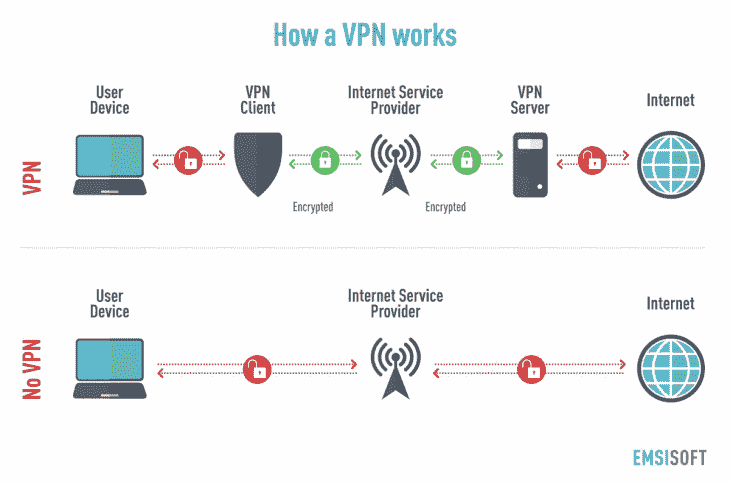
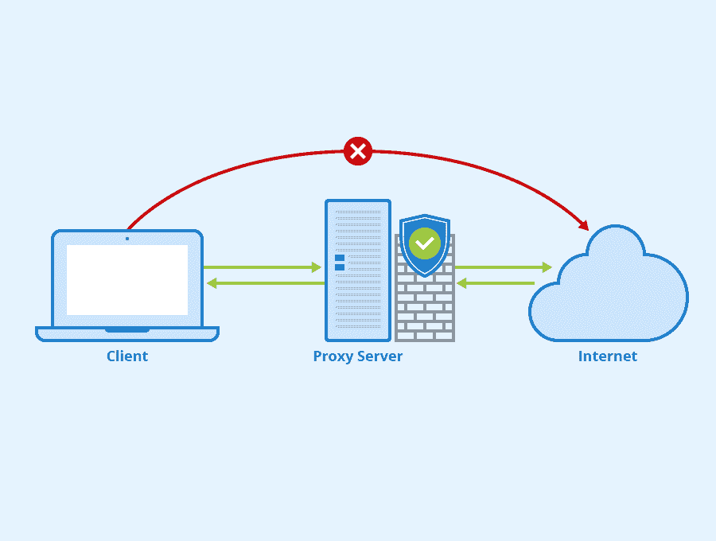
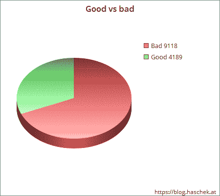
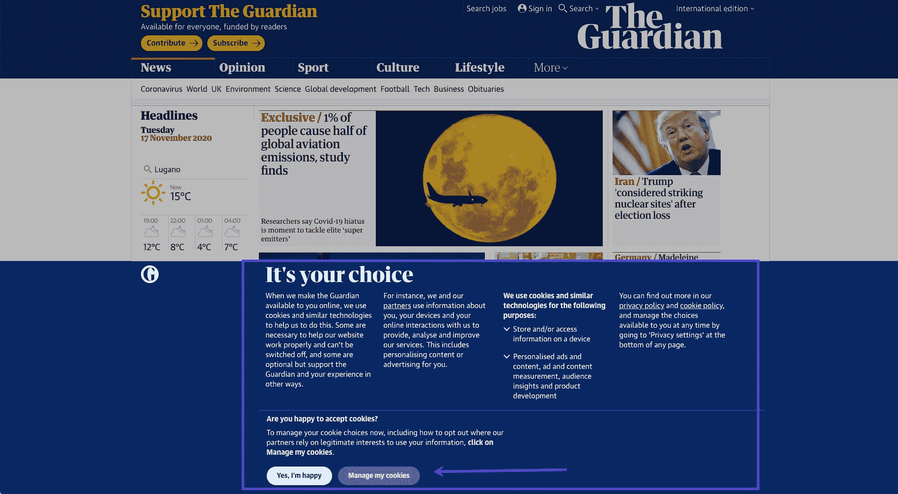
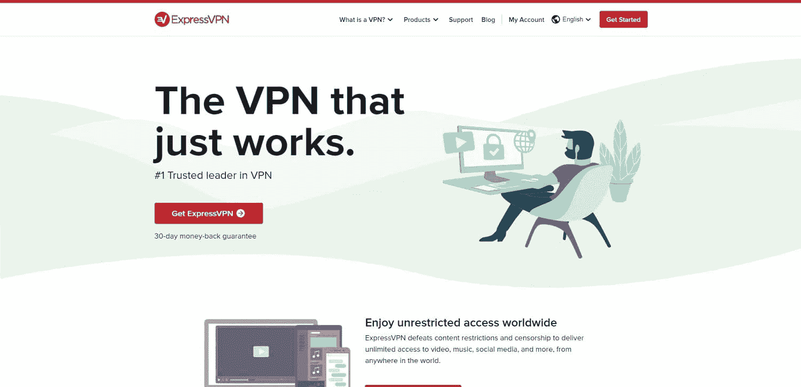
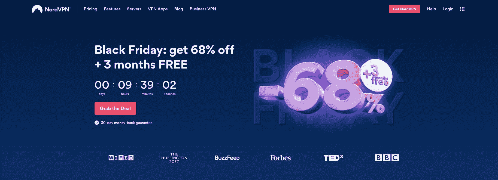
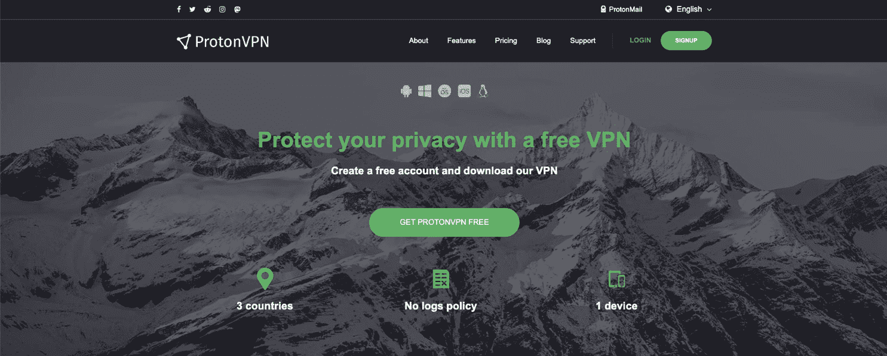

# 代理与 VPN:你必须知道的 5 个关键区别

> 原文：<https://kinsta.com/blog/proxy-vs-vpn/>

现在，许多互联网用户比较代理和 VPN，想知道他们在浏览时应该使用什么来保护自己。

2020 年， [84%](https://www.cisco.com/c/en/us/products/security/ciso-benchmark-report-2020.html) 的消费者表示，他们关心自己的隐私和数据，80%的人愿意采取行动保护隐私和数据。

虚拟专用网络(VPN)和代理是一个潜在的解决方案，因为它们在浏览器和任何数据跟踪公司或政府之间增加了一个额外的层。

但是代理和 VPN 有什么区别呢？如果您想提高您的在线隐私和安全性，哪个选项是最好的？

在本文中，我们将回答您的所有问题，并强调两者之间的重要区别。

## 什么是虚拟专用网络(VPN)？

虚拟专用网络(VPN)是一种专用网络，它对发送到互联网或从互联网接收的任何数据进行加密。它可以帮助您安全、私密地访问网站并使用您的程序和应用程序，无论您使用的是什么网络。

你可以把它想象成一个安全的信使，从网站上获取网站数据并安全地传送到你的电脑上。就像一辆运钞车在自动取款机上来回运送现金一样。

> 需要在这里大声喊出来。Kinsta 太神奇了，我用它做我的个人网站。支持是迅速和杰出的，他们的服务器是 WordPress 最快的。
> 
> <footer class="wp-block-kinsta-client-quote__footer">
> 
> 
> 
> <cite class="wp-block-kinsta-client-quote__cite">Phillip Stemann</cite></footer>

[View plans](https://kinsta.com/plans/)

它还隐藏了你的 IP 地址(这里有[如何检查你的 IP 地址](https://kinsta.com/tools/what-is-my-ip/what-is-my-ip/)，并允许你改变你的位置，这样你就可以访问地理限制的内容。比如，如果你最喜欢的节目在你所去的国家的网飞频道上看不到。

您还可以使用“办公室 IP 地址”远程访问您公司的文件系统

VPN 工作在操作系统级别，对所有进出的互联网流量进行加密。

### VPN 是如何工作的？

How a VPN works (Image source: yellowstonecomputing.com)

当与 VPN 服务器通信时，VPN 客户端使用数据加密，这可以远程访问您想到的网站或数据。双方都有一个中间人。客户端对您的路由器和互联网服务提供商( [ISP](https://kinsta.com/knowledgebase/what-is-isp/) )隐藏您的查询，而 VPN 服务器对您正在使用的网页或服务隐藏您的身份。

当你使用任何类型的公共 WiFi 网络时，它对安全性有很大的影响。有了 VPN，网上购物、银行业务，甚至通过开放网络发送工作邮件都要安全得多。

由于 VPN 加密了您的连接，潜在的黑客无法“窃听”传输来窃取易受攻击的数据，如您的帐号，或者更糟的是，您的密码。

它还可以防止您的 ISP 或雇主通过跟踪路由器流量来监视您的流量和您的在线活动。

如果您的公司使用支持 VPN 的路由器，您可以使用 VPN 远程连接到您的办公网络，并在旅途中访问办公文件、CRM 或其他软件。

## 什么是代理服务器？

代理服务器通常是通过代表您访问网页的 web 应用程序或桌面程序访问的远程公共服务器。

代理服务器工作在应用程序级别，一次充当一个应用程序(比如你的浏览器)的代理。

许多代理服务器不支持[安全的 HTTPS 数据传输](https://kinsta.com/blog/http-to-https/)，并且默认情况下是不安全的。

### 代理服务器是如何工作的？

当大多数人使用代理服务器这个词时，他们指的是 HTTP 代理。

这些代理服务器是通过互联网访问网页，然后将数据转发到您的浏览器的 web 服务器。

How a proxy server works (Image source: seobility.net)

您可以使用它们在浏览器中访问[受地域限制的网站和页面](https://kinsta.com/knowledgebase/great-firewall-of-china-google-cloud-platform/)。

与 VPN 不同，您的代理连接没有加密。它只是作为你的计算机和最终服务器之间的媒介。

因此，HTTP 代理会对网站隐藏你的身份，但不会保护任何敏感数据。

### SOCKS5 代理

SOCKS5 代理的工作方式类似于 HTTP 或 web 代理，但是您可以将它连接到其他应用程序，而不仅仅是您的 web 浏览器。

SOCKS5 代理将所有数据传输限制在第五层，有效地阻止了使用常见的[黑客工具](https://kinsta.com/blog/wordpress-hacked/)隧道或扫描您系统的企图。

因为您是在应用程序级别设置它，所以程序本身必须支持代理使用。它不像 VPN 那样控制所有的进出流量。但是你可以用它来进行点对点的文件共享、电子邮件、种子等等。

### 透明代理

透明代理是在网络上设置的代理，用于控制和监控[网络流量](https://kinsta.com/blog/how-to-drive-traffic-to-your-website/)。它是透明的，因为大多数用户不会注意到它的存在(直到它阻止他们访问某个页面)。

学校、办公室、甚至咖啡馆都用这些来限制对某些网站的访问，比如社交媒体或网飞。企业可能会使用它来让你专注于工作，或者确保你不会使用太多的带宽。

[Proxy vs VPN - what's the difference, and most importantly, which one is best for privacy and safety?🔐 Click to see the full breakdown of these two solutions 🔍Click to Tweet](https://twitter.com/intent/tweet?url=https%3A%2F%2Fkinsta.com%2Fblog%2Fproxy-vs-vpn%2F&via=kinsta&text=Proxy+vs+VPN+-+what%27s+the+difference%2C+and+most+importantly%2C+which+one+is+best+for+privacy+and+safety%3F%F0%9F%94%90+Click+to+see+the+full+breakdown+of+these+two+solutions+%F0%9F%94%8D&hashtags=VPN%2CSiteSecurity)

## 代理和 VPN 之间的 5 个主要区别

仅从技术定义来看，普通用户很难区分 VPN 和代理。为了帮助您理解 VPN 与代理服务器的不同，我们强调了 VPN 与代理在安全性、隐私、cookies、成本和速度方面的主要区别。

### 1.代理与 VPN:安全性

[93%](https://www.internetsociety.org/ota/) 的数据泄露本来可以通过基本的[数据安全措施](https://kinsta.com/blog/wordpress-security/)来避免。对于一个喜欢独处的人来说，这通常意味着在浏览互联网时要采取一些额外的预防措施。

尤其是当从公共网络使用互联网时。但是，在提高安全性方面，哪个选项是最佳选择呢？

让我们先来仔细看看代理服务器。

#### 代理安全吗？

简短的回答是:可能不会。特别是如果你喜欢代理服务器，因为它们相对于 VPN 来说是免费的。

公共的、未加密的代理服务器对您访问的网站隐藏您的身份。但是它们不会加密您到代理服务器本身的连接。

通过使用公共代理服务器，你可能会比通过浏览器直接连接到 web 服务器的安全性差。

Good vs bad proxies

在一项对超过 13，000 个代理的里程碑式研究中，79%的测试公共代理服务器要么不安全，不允许 HTTPS 流量，要么直接有害于注入的 HTML 或 JavaScript。

带 HTTPS 连接和密码保护的付费代理服务器通常是安全的。但与专业级 VPN 的端到端加密相比，它们仍然是有限的。

接下来，让我们仔细看看 VPN 以及它们如何影响您的安全。

#### VPN 安全吗？

是的，绝大多数商用 VPN 都是安全使用的。VPN 在服务器端加载数据，然后在将数据发送到您计算机上的客户端之前对数据进行加密。

只有在数据被发送到客户端后，它才解密数据以供其他程序使用。因此，不仅你的身份对你访问的网站或服务是隐藏的，你的 ISP，甚至网络也不知道你在加载什么数据。

他们所能看到的是你正在从一个 VPN 加载加密数据。它保护您的数据免受开放网络上任何恶意黑客的攻击，以及政府或雇主的窥探。

它还会保护你的 IP 地址不被泄露，保护你的电脑免受 T2 DDoS 攻击和其他暴力攻击。

所有这些保护听起来可能是一个漫长的过程，但这一切都发生在几微秒内。它不会显著影响你的浏览体验。您甚至可以流畅播放高清电影，没有任何延迟，也可以畅玩在线游戏，没有延迟问题。

唯一的警告是，VPN 服务的可靠性取决于它的提供商。所以在选择 VPN 的时候要做好自己的尽职调查。

请记住，你给了一家公司完全访问你的互联网流量。选择一个有良好声誉和隐私保护的 VPN 提供商。

### 2.代理与 VPN:隐私

74%的美国人出于隐私考虑限制了他们的网上活动。

本地安装的 VPN 从数据离开您的计算机到到达目的地，为您的数据提供完全的加密。这意味着人们很难窥探你的数据。

即使你在一个开放的 WIFI 网络上，加密也能保护你的数据不被恶意黑客截获。

由于 VPN 使用端到端加密，你的 ISP、路由器、雇主或政府也不能访问你的数据。

这也是中国政府试图限制公众访问 VPN 的部分原因。因为当连 ISP 都无法窥探流量时，就没有办法控制你是否在访问被屏蔽的网站。

VPN 还会对您访问的网站隐藏您的 IP 地址和位置，使您更难识别身份。

## 注册订阅时事通讯

### 想知道我们是怎么让流量增长超过 1000%的吗？

加入 20，000 多名获得我们每周时事通讯和内部消息的人的行列吧！

[Subscribe Now](#newsletter)

代理服务器只是充当中间人的角色，对你访问的网络服务器隐藏你的 IP 地址。

即使有了 VPN 或代理，你仍然容易受到设备指纹和其他技术的攻击，这些技术被谨慎的广告商用来显示“相关”广告。

但通过隐藏你的 IP 地址，你至少让公司更难将这些点联系起来。

### 3.代理与 VPN:cookie

随着法律(如 GDPR 和 CCPA)和对互联网隐私的日益关注，许多消费者担心网站和广告商如何使用 cookies 来跟踪他们的一举一动。

[GDPR 合规性](https://kinsta.com/blog/wordpress-gdpr-compliance/)是欧盟商界的新热门话题之一。有充分的理由。由于这项新法律，几乎每个用 cookies 跟踪你的网站都必须征得你的同意。

The Guardian cookie prompt

你可能已经看过几百次这样的提示了。

还有关于 [cookies](https://kinsta.com/blog/wordpress-cookies-php-sessions/) 的事情，它们储存在你电脑的硬盘上。Cookies 将通过代理服务器或 VPN 下载到您的计算机上。

但是有了虚拟专用网，cookie 会把虚拟专用网的 IP 地址误认为是你自己的，这将提供某种程度的保护，防止指纹和其他数字跟踪技术。

代理服务器还会欺骗网站存储一个不同 IP 地址的 cookie。

所以当你开始使用 VPN 或代理服务器时，你必须清除你电脑上的所有 cookies。

否则，现有的 cookies 可能会干扰增加的隐私层。该网站会将它与您的原始位置和 IP 地址连接起来，并使用它来帮助您的设备进行指纹识别。

### 4.代理与 VPN:成本

我们将在博客文章的后面研究一些解决方案，但是现在，你应该知道大多数可用的代理是公共的和免费的，而 VPN 服务通常每月花费 5 到 12 美元。

如果您想安全地使用代理服务器，您还需要使用可靠的高级服务。高级 SOCKS5 代理提供商 IPVanish 每月收费 5 美元，其他替代产品的价格也类似。

因此，如果你对安全性很认真，VPN 仍然是最划算的。

### 5.代理与 VPN:连接速度

代理和 VPN 的另一个关键区别是连接速度。

使用公共代理服务器，你可能很难达到每秒 1 兆比特的速度，而一些 VPN 提供 50 兆比特或更高的速度。

虽然 VPN 的加密可能会增加几毫秒的延迟，但这并不明显，除非你是最高级别的专业游戏玩家或流玩家。

在某些情况下，使用 VPN 甚至可以加快连接速度。大多数主要提供商使用遍布全球的数据中心网络。因此，如果网站不使用 [CDN](https://kinsta.com/blog/wordpress-cdn/) ，或者 CDN 最近的数据中心很远，VPN 连接可能会更快。

## 3 安全高级 VPN，您今天就可以开始使用，以实现更安全的浏览(以及一个免费选项)

为了认真对待您的数据安全，您可以使用这些 VPN 解决方案之一，从今天开始更安全地浏览。

与宕机和 WordPress 问题做斗争？Kinsta 是一款考虑到性能和安全性的托管解决方案！[查看我们的计划](https://kinsta.com/plans/?in-article-cta)

### 1.ExpressVPN

ExpressVPN VPN service

如果你收听[播客](https://kinsta.com/blog/wordpress-podcast/)或者观看任何主要的 YouTubers，你很可能已经听说过[快速 VPN](https://www.expressvpn.com/) 。

它是全球最大的 VPN 服务提供商之一，当然也是广告宣传最多的一家。但是，ExpressVPN 不仅仅是广告费用。其庞大的预算和客户群也意味着它拥有超过 3，000 台 VPN 服务器的强大产品。

ExpressVPN 不会限制您的带宽，快速服务器意味着您可以看到高达 50 Mbps 或更高的下载速度，这取决于您的互联网连接和位置。

ExpressVPN 每月收费 12.95 美元，每年收费 8.32 美元。

*   **连接速度:** 50 Mbps+
*   **带宽:**无限制
*   **Trustpilot** **评分:** 4.7 分(满分 5 分)，6100+评论
*   **设备限制:**最多 5 台设备
*   **价格:**$ 12.95/月
*   **免费试用:**无

### 2.NordVPN

NordVPN VPN service

NordVPN 是 VPN 领域的另一个市场领导者，这是有充分理由的。

NordVPN 被反复测试为美国用户可用的最快 VPN，在 60 多个不同国家拥有超过 5000 台服务器。

它经常在年度计划中提供巨额销售，使其成为市场上最便宜的 VPN 服务之一。除此之外，你还有[季节性黑色星期五/网络星期一交易](https://kinsta.com/blog/ecommerce-strategies/)(如果你经营电子商务，一定要看看[我们与 WooCommerce agency Sau/Cal 合作的主题为](https://kinsta.com/webinars/website-prep-black-friday-cyber-monday/)的网络研讨会)。

NordVPN 还提供 30 天退款保证。

*   **连接速度:** 50 Mbps+
*   **带宽:**无限制
*   **Trustpilot 评分:** 4.4 分，共 4，955+条评论
*   **价格:**$ 11.95/月
*   **设备限制:**最多 6 台设备
*   **免费试用:**是

### 3.冲浪者

Surfshark VPN service

Surfshark 是另一项出色的 VPN 服务，无论你身在何处，它都拥有快速可靠的连接。

SurfShark 在超过 63 个不同的国家拥有超过 1，700 个服务器位置。带宽和设备是无限的，这对于 VPN 提供商来说有些不常见。这个 VPN 解决方案还带有内置的[广告拦截功能](https://kinsta.com/blog/ad-blockers/)。

每月 12.95 欧元，与 ExpressVPN 的价格大致相同。

*   **连接速度:** 40 Mbps+
*   **带宽:**无限制
*   **Trustpilot 评分:** 4.3 分，共 6，410 多条评论
*   **价格:**$ 12.95/月(每年针对黑色星期五/网络星期一这样的季节性活动都会有特价)
*   **设备限制:**无
*   **免费试用:**无

### 免费选项:ProtonVPN

ProtonVPN free VPN service

ProtonVPN 提供 [100%免费和无广告计划](https://protonvpn.com/free-vpn)，支持一种设备和最多三个国家。

免费计划还保护您的隐私，政策是维护任何用户活动和浏览的 0 日志。

带宽和速度在技术上是无限的，但是由于你使用拥挤的免费服务器，速度相对较慢。

该高级计划包括 50 个国家的 1，077 台服务器，但一些用户报告说，美国等热门地点和服务器的速度很慢。

客户声誉不如上面提到的三种选择。

*   **连接速度:** 20 Mbps+(免费计划)
*   **带宽:**无限制(免费计划)
*   **Trustpilot 评分:** 3.0 分(满分 5 分)，有 54 条评论
*   **价格:**免费计划。起价 4 美元/月
*   **设备限制:**自由计划上 1 台设备

## 代理与 VPN:常见问题

### 有 VPN 需要代理吗？

不，如果你正在使用 VPN，你不需要代理服务器。VPN 已经对您访问的服务器屏蔽了您的 IP 地址。此外，它加密的数据，并隐藏它从您的 ISP 和潜在的黑客。

### 我可以同时使用 VPN 和代理吗？

是的，从技术上讲，两者同时使用是可能的。但这不是必须的，也不会对你的安全产生任何重大影响。相反，它可能会大大降低你的连接速度，增加延迟，并破坏你的浏览体验。

### 代理可以被追踪吗？

代理服务器会对你访问的网站和服务隐藏你的 IP 地址。有人仍可能通过指纹识别来识别你的电脑或设备，但这与代理无关。

### 代理会隐藏你的 IP 吗？

是的，代理服务器和 VPN 都会对您访问和使用的网站和服务隐藏您的 IP 地址。

### 有免费的代理服务器吗？

网上有成千上万的免费代理服务器，但是很多都不安全、速度慢或者不可靠。

### 我应该使用免费的代理服务器吗？

如果你关心连接的速度、可靠性和安全性，免费的代理服务器不是正确的选择。相反，选择高级 VPN 服务或代理。

如果你只是想访问地理限制的内容，那么一个免费的代理服务器可能就足够了。

[When it comes to keeping yourself safe and secure online, proxies and VPNs are two words you hear a lot - but what's the difference? 🔐 This guide dives deep into the privacy concerns of both solutions.Click to Tweet](https://twitter.com/intent/tweet?url=https%3A%2F%2Fkinsta.com%2Fblog%2Fproxy-vs-vpn%2F&via=kinsta&text=When+it+comes+to+keeping+yourself+safe+and+secure+online%2C+proxies+and+VPNs+are+two+words+you+hear+a+lot+-+but+what%27s+the+difference%3F+%F0%9F%94%90+This+guide+dives+deep+into+the+privacy+concerns+of+both+solutions.&hashtags=Proxy%2COnlinePrivacy)

## 摘要

说到安全和隐私，公共代理服务器比不上高级的加密 VPN。当然，VPN 要花一些钱，但它在可靠性、安全性、隐私性和连接速度方面弥补了这一点。

保护您的网络流量不仅仅是访问地理屏蔽的流媒体内容。它还可能对收集或分享在某人的国家无法获得的信息的自由产生更深层次的影响。

浏览互联网时，您是否使用 VPN 来提高您的隐私和安全性？你有什么经验？

* * *

让你所有的[应用程序](https://kinsta.com/application-hosting/)、[数据库](https://kinsta.com/database-hosting/)和 [WordPress 网站](https://kinsta.com/wordpress-hosting/)在线并在一个屋檐下。我们功能丰富的高性能云平台包括:

*   在 MyKinsta 仪表盘中轻松设置和管理
*   24/7 专家支持
*   最好的谷歌云平台硬件和网络，由 Kubernetes 提供最大的可扩展性
*   面向速度和安全性的企业级 Cloudflare 集成
*   全球受众覆盖全球多达 35 个数据中心和 275 多个 pop

在第一个月使用托管的[应用程序或托管](https://kinsta.com/application-hosting/)的[数据库，您可以享受 20 美元的优惠，亲自测试一下。探索我们的](https://kinsta.com/database-hosting/)[计划](https://kinsta.com/plans/)或[与销售人员交谈](https://kinsta.com/contact-us/)以找到最适合您的方式。