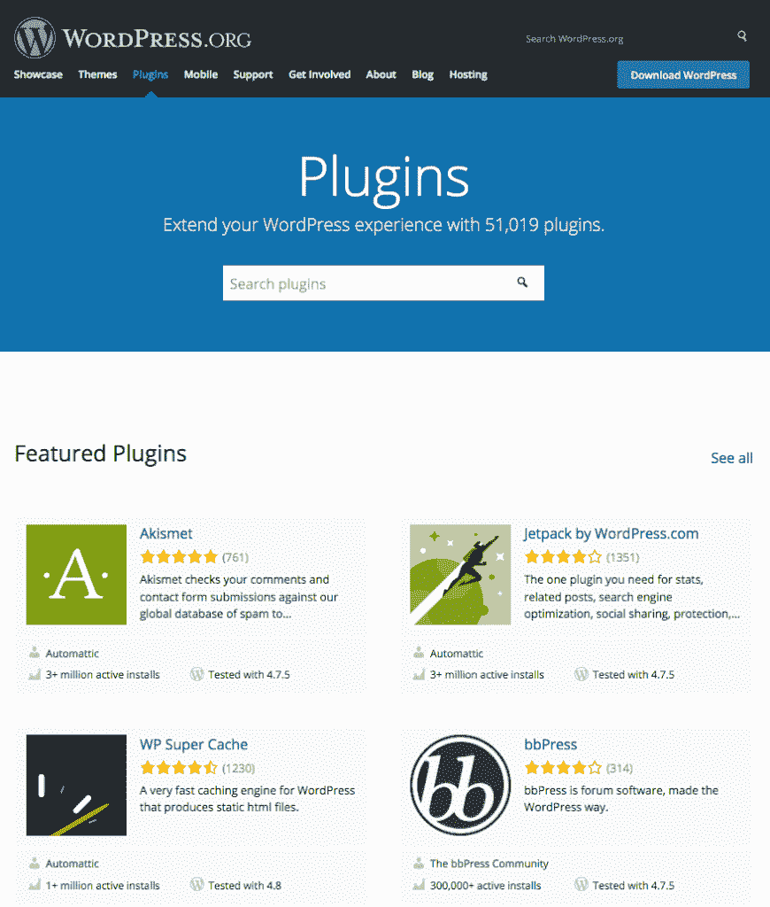
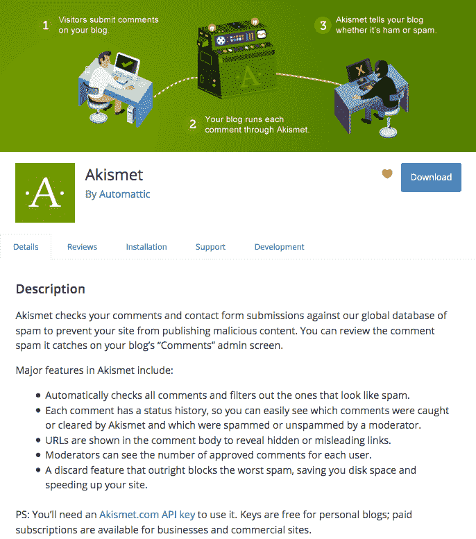
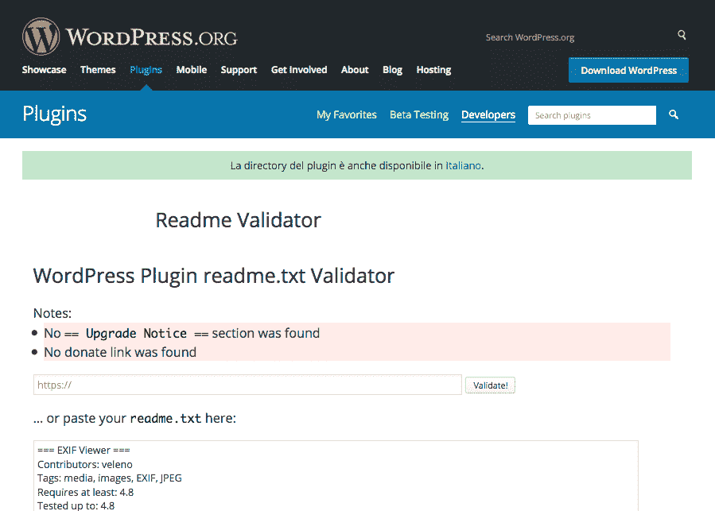
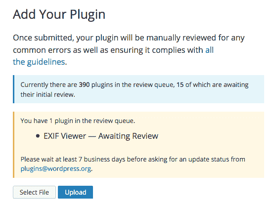
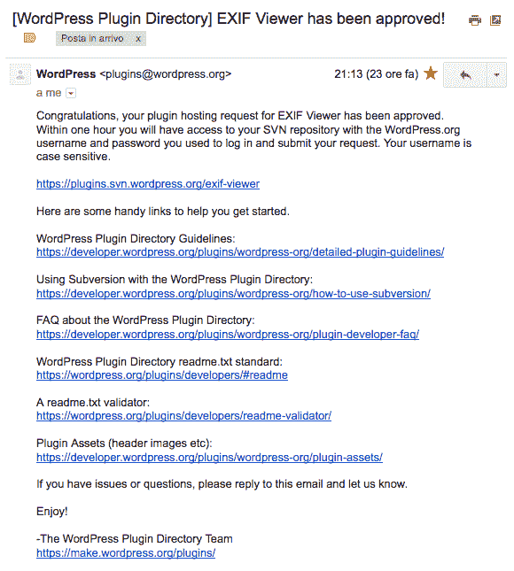
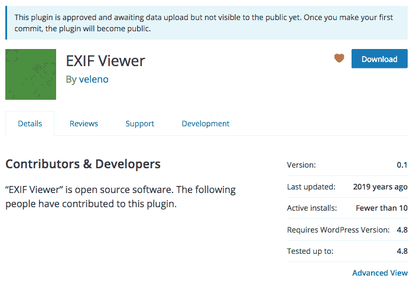
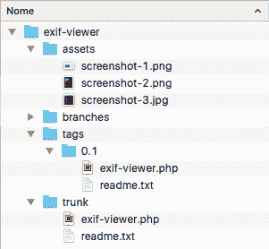
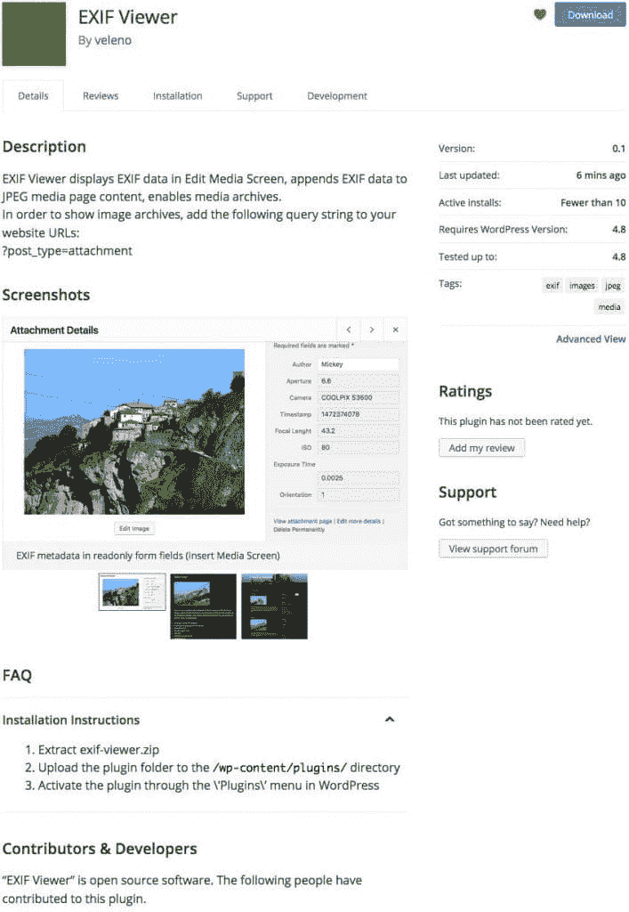

# 为什么以及如何发布一个插件到 WordPress 插件目录

> 原文：<https://kinsta.com/blog/publish-plugin-wordpress-plugin-directory/>

拥有超过 50，000 个免费插件，WordPress 插件目录是每个 WordPress 用户的城市购物中心，在那里你可以找到覆盖你下一个网站所有特性和功能的插件。然而，你很可能找不到一个插件来提供你的客户明确要求的功能。不管你喜不喜欢，你可能必须启动[你最喜欢的文本编辑器](https://kinsta.com/blog/best-text-editors/)并开始编码。但是你有没有考虑过与整个 WordPress 社区共享你的插件的可能性？

这篇文章的主要目的是和你的读者一起探索通过 WordPress.org 库分发插件的好处。我将快速总结建议和鼓励你遵循的最佳实践，然后我将带你了解当你计划发布一个插件到 [WordPress 插件目录](https://wordpress.org/plugins/)时你应该知道的 SVN 关键概念。

*   [为什么是 WordPress 插件目录？](#wordpress-plugin-directory)
*   [你应该关心什么](#why-care)
*   [插件结构](#plugin-structure)
*   [发布到 WordPress 插件目录](#publish-wordpress-plugin-directory)

## 为什么是 WordPress 插件目录？

将你的插件发布到 WordPress 插件目录的第一个原因是利用大量的免费工具和服务，比如插件描述、统计、主动安装、变更日志、支持论坛等等。此外，当有新版本可用时，用户会得到通知，并且可以直接从 WordPress 插件屏幕运行升级。WordPress.org 插件在搜索引擎中有更高的可见度，你可以利用一个强大的媒介来宣传你的身份，提高你作为开发者的声誉。

如果你不是一个优秀的营销者或者没有时间营销，WordPress 插件目录可以是一个很好的方式来为你的插件获得免费流量和眼球。



The WordPress Plugin Directory


发布插件的另一个好理由是为 WordPress 社区做贡献。WordPress 是免费软件，[有一个巨大的社区](https://kinsta.com/learn/wordpress-history/)免费提供大量的主题和插件。发布一个 WordPress 插件是感谢所有这些免费赠送他们作品的了不起的人的最好方式。

## 你应该关心的是

请记住，如果你的插件编码糟糕，如果你不定期更新它们，或者如果你不提供快速有效的支持(当然，如果你不是一个值得信任的开发者)，更大的可见性可能会毁了你的声誉。这里有一些关键的概念。


> Kinsta 把我宠坏了，所以我现在要求每个供应商都提供这样的服务。我们还试图通过我们的 SaaS 工具支持达到这一水平。
> 
> <footer class="wp-block-kinsta-client-quote__footer">
> 
> 
> 
> <cite class="wp-block-kinsta-client-quote__cite">Suganthan Mohanadasan from @Suganthanmn</cite></footer>

[View plans](https://kinsta.com/plans/)

### 编码

关于编码有很多要说的，你会在那里找到很多有用的读物。但是如果你是 WordPress 开发者，Codex 就是你的圣经，你应该在开始编码之前阅读[插件指南](https://developer.wordpress.org/plugins/wordpress-org/detailed-plugin-guidelines/)。以下是我个人列出的关键概念:

*   保持你的代码可读。这允许其他开发者理解你的插件做什么，可能帮助你发现错误，并在你的代码上开发他们自己的插件。为了促进开发者之间的合作，WordPress Codex 提供了 [WordPress 编码标准](https://make.wordpress.org/core/handbook/best-practices/coding-standards/)，这是所有 WordPress 开发者的最佳实践。
*   总是注释你的代码。内联文档是一个绝不能低估的重要资源。它允许任何人快速理解一个函数做什么，哪些参数被接受，哪些变量返回，等等。在评论中，您可以添加链接、脚本版本和其他描述，以便在您或其他人编辑您的脚本时派上用场。
    我想说 WordPress 人是一个学习社区，遵守[内联文档标准](https://make.wordpress.org/core/handbook/best-practices/inline-documentation-standards/)是让人们学习你已经知道的东西的一个好方法。
*   **尽可能使用 WordPress 函数而不是 PHP 函数**。WordPress 函数允许你构建安全有效的代码。尤其是当你需要从数据库中获取数据的时候， [API 函数](https://codex.wordpress.org/WordPress_APIs)让你免于构建复杂的查询，这可能比内置的 WordPress 查询更不安全。在核心的背后有许多伟大的开发人员，他们正在做着我们可以利用的出色工作。

### 特征

即使你的工作不会得到报酬，你也应该像销售产品一样考虑你的插件。你不需要成为营销专家:你只需要知道你的插件应该在某些方面是独一无二的和/或区别于类似的插件。给你的插件起一个容易记住的有意义的名字，和独特的功能，让人们说“我需要它！”。而且，如果你的插件提供了已经被其他插件覆盖的功能，那么就把重点放在可访问性和易用性上，给用户带来增值，让你的产品与其竞争对手有明显的区别。

### 支持

通过插件目录分发的每个插件都有一个特定的论坛，用户可以在那里联系你寻求帮助。为用户问题提供清晰的答案，并帮助他们解决问题。快速而恰当的回复对于建立您作为值得信赖的开发人员的声誉至关重要。考虑任何话题，获取任何可以帮助你改进插件的信息。

### 更新

定期更新你的插件，在需要的时候推送小的改动，但是不要超过。太多的更新会让你的用户失望。

### 批准

WordPress 是在 GNU 通用公共许可证下发布的，大多数插件都是在相同的 GPL 许可证下发布的。实际上，并不严格要求在同一个许可下发布插件，因为任何兼容的许可都是允许的。无论如何，GPLv2 是值得推荐的(阅读更多关于 [GPL 许可](https://kinsta.com/learn/wordpress-gpl/))。

为了给这篇文章提供一个工作示例，我们在[4 Handy WordPress Media Library Hacks](https://kinsta.com/blog/wordpress-media-library/)中剖析的插件已经发布到目录中。下载 [ExIF 浏览器](https://wordpress.org/plugins/exif-viewer/)并在你的文本编辑器中打开它的文件，然后回到这篇文章，进入插件结构。

## 插件结构

你的插件将被保存在 WordPress.org·SVN 库中。任何人都可以签出副本，但只有作者有权签入。一旦你发布了一个插件，你可以添加新文件，编辑或删除本地机器上的现有文件，然后将这些修改上传到服务器。subversion 会跟踪所有的更改，这样您就可以在以后回到旧版本或修订版。SVN 存储库提供了四个默认文件夹:

```
/assets/
/branches/
/tags/
/trunk/
```

*   [截图](https://kinsta.com/blog/how-to-screenshot-on-windows/)，标题和图标进入**资产**
*   **trunk** 是放置插件文件的目录
*   代码的分叉分支进入**分支**
*   插件版本将存储在**标签**中

每个插件必须提供至少两个文件:readme.txt 文件和主 PHP 脚本。或者，您可以添加一些图像(资产)来显示在插件的页面上。

### 插件资产

资产是插件标题、图标和屏幕截图。插件标题是你可以在插件页面顶部看到的 JPG 或 PNG 图像。文件名取决于图像的宽度和高度。目前，允许使用以下名称/维度:

*   常规:横幅-772×250。(jpg|png)
*   视网膜:横幅-1544×500。(jpg|png)

图标是具有以下名称/尺寸的方形图像:。

*   icon-128×128 .(jpg|png)
*   icon-256×256 .(jpg|png)
*   图标 svg

您不应该在文件名中指定 SVG 尺寸，因为这些图像可以按任意大小缩放。如果您使用 SVGs，您必须提供一个 PNG 图标作为后备。

截图是插件页面内容中显示的图像。允许 PNG 和 JPEG 格式，文件名必须小写，并遵循以下结构:

*   截图-1。(jpg|png)
*   截图-2。(jpg|png)

对于每个屏幕截图，您应该在自述文件中提供描述。所有这些图形应该被添加到你的插件本地目录的**资产**文件夹中(更多关于[你的插件资产如何工作](https://developer.wordpress.org/plugins/wordpress-org/plugin-assets/))。



Appealing and consistent assets make a great plugin page


### Readme.txt 文件

您应该在主脚本中为您的插件提供一个 **readme.txt** 文件和适当的标题。
首先，你需要一个包含以下信息的 readme.txt 文件:

*   **Plugin name**
*   **贡献者**:(wordpress.org 用户 id 列表)
*   **捐赠链接**:http://example.com/
*   **标记**:(插件标记)
*   **至少需要** : (WordPress 版本)
*   **测试到** : (WordPress 版本)
*   **稳定标签**:(插件版本)
*   **许可证** : GPLv2 或更高版本(或兼容)
*   https://www.gnu.org/licenses/gpl-2.0.html URI 牌照
*   **描述**
*   **安装**
*   **截图**
*   **变更日志**

截图部分允许你为任何你想添加到插件页面的图片添加描述。WordPress.org 提供了插件自述文件标准模板，它将帮助你建立你的自述文件。此外，您可以使用[自述验证器](https://wordpress.org/plugins/developers/readme-validator/)来检查您的文件是否正确。



The Readme Validator outputs notes and warnings on readme files


### 插件标题注释

标题注释告诉 WordPress 一个文件是一个插件。如果你不打算发布你的插件，唯一需要的字段是插件名称。相反，如果你打算发布插件，你添加的信息越多越好。以下是可用字段的列表:

*   **插件名称**:(必需)您的插件名称必须是唯一的。发布之前，在插件目录中搜索同名的插件
*   **插件 URI** :插件的主页
*   **描述**:一行插件描述(少于 140 个字符)
*   **版本**:当前插件版本(必须高于上一版本)
*   **作者**:一个或多个作者姓名，用逗号分隔
*   **作者 URI** :作者主页
*   **License** :插件许可证的 slug(即 GPL2)
*   **许可证 URI** :许可证全文链接(即 https://www.gnu.org/licenses/gpl-2.0.html)
*   文本域:插件的文本域
*   域路径:在哪里可以找到翻译文件(参见[如何国际化你的插件](https://developer.wordpress.org/plugins/internationalization/how-to-internationalize-your-plugin/)

下面是最流行的 WordPress 插件之一的标题评论:

```
<?php
/**
 * @package Akismet
 */
/*
Plugin Name: Akismet Anti-Spam
Plugin URI: https://akismet.com/
Description: Used by millions, Akismet is quite possibly the best way in the world to <strong>protect your blog from spam</strong>. It keeps your site protected even while you sleep. To get started: activate the Akismet plugin and then go to your Akismet Settings page to set up your API key.
Version: 3.3.2
Author: Automattic
Author URI: https://automattic.com/wordpress-plugins/
License: GPLv2 or later
Text Domain: akismet
*/
```

## 发布到 WordPress 插件目录

准备好后，[注册](https://wordpress.org/plugins/add/)和[提交你的插件](https://wordpress.org/plugins/developers/add/)。

## 注册订阅时事通讯


### 想知道我们是怎么让流量增长超过 1000%的吗？

加入 20，000 多名获得我们每周时事通讯和内部消息的人的行列吧！

[Subscribe Now](#newsletter)


The first plugin release has to be uploaded for a manual review


该插件将由 WordPress.org 的工作人员手动审查。这个过程可能需要一到十天。如果发现任何问题，您将会收到一封电子邮件，解释问题所在以及应该如何修复错误。



The revision process could take up to ten days


一旦插件被批准，您将收到一封电子邮件，通知您可以访问 SVN 库。



An e-mail will inform you that the plugin has been approved


目前，该插件不可下载，但你可以通过命令行(或任何 SVN 客户端)上传，编辑和删除文件。下图显示了当前的插件页面。



The plugin page is active, but the plugin is not available for download


### 上传插件

我们的第一个任务是将插件文件上传到 SVN 资源库，但是首先我们需要一个本地文件夹来存储插件文件:

```
$ mkdir localdir
```

现在，我们可以签出预构建存储库:

```
$ svn co https://plugins.svn.wordpress.org/plugin-name path/to/localdir
```

我们将得到以下响应:

```
> A    plugin-name/branches
> A    plugin-name/tags
> A    plugin-name/trunk
> Checked out revision 99999999.
```

**A** 表示文件夹已经从中央存储库添加到本地文件夹。
下一步是将文件添加到本地 **/trunk** 文件夹中，并将它们上传到存储库:

```
localdir/$ svn add trunk/*
```

你需要证明自己的身份。登录后，您将得到以下响应:

Struggling with downtime and WordPress problems? Kinsta is the hosting solution designed to save you time! [Check out our features](https://kinsta.com/features/)

```
> A    trunk/my-plugin.php
> A    trunk/readme.txt
```

> 注意:不要把主插件文件放在 trunk 的子文件夹中，因为这会中断下载。

现在将变更签回到存储库中:

```
localdir/$ svn ci -m 'First plugin version'
```

以下是最后的回应:

```
> Adding trunk/my-plugin.php
> Adding trunk/readme.txt
> Transmitting file data .
> Committed revision 9999999.
```



The file structure of the ExIF Viewer local copy


接下来，我们必须添加插件资产:

```
localdir/$ svn add assets/*
```

然后再次签入更改:

```
localdir/$ svn ci -m 'Assets upload'
```

就是这样！跳到你的插件页面，开始推广你的作品！



The final page of the ExIF Viewer plugin


### 发布新版本

在发布下一个版本之前，一定要记得更新 **trunk/readme.txt** 文件中的**稳定标签**字段和插件头注释中的**版本号**。当新版本准备好发布时，将文件复制到 **/tags** 的子文件夹中，并将子文件夹的名称设置为版本号(即 1.0.1):

```
localdir/$ svn cp trunk tags/1.0.1
> A tags/1.0.1
```

然后签入更改:

```
localdir/$ svn ci -m "tagging version 1.0.1"
> Adding         tags/1.0.1
> Adding         tags/1.0.1/my-plugin.php
> Adding         tags/1.0.1/readme.txt
> Committed revision 999999.
```

就是这样！新版本上线了。

### 编辑文件

有时，您可能需要做一些不需要新版本的小改动。首先，更新存储库的本地副本:

```
localdir/$ svn up
> At revision 999999.
```

然后编辑文件并检查更改:

```
localdir$ svn stat
> M       trunk/readme.txt
```

**M** 表示那些文件已经被修改。
下面，你可以看到两个版本之间有什么变化:

```
localdir$ svn diff
```

最后，签入对中央存储库的更改:

```
localdir$ svn ci -m "minor changes"
> Sending trunk/readme.txt
> Transmitting file data .
> Committed revision 999999.
```

## 摘要

无论你是决定发布一个商业插件的轻量级版本，还是发布这个插件来为社区做贡献，WordPress.org 目录都是分发你的作品的最好地方。它给你一个广泛的曝光，并提供了一些专业的工具来分发和推广你的插件。

如果你觉得你的销售和营销技能不够强，一定要看看 Bridget Willard 的“[如何营销你的插件](https://www.amazon.com/dp/B08Z4718W9)”来了解更多关于如何更好地销售你的插件。

那么，你考虑过这个机会吗？下面和我们分享一下你的经验。

* * *

让你所有的[应用程序](https://kinsta.com/application-hosting/)、[数据库](https://kinsta.com/database-hosting/)和 [WordPress 网站](https://kinsta.com/wordpress-hosting/)在线并在一个屋檐下。我们功能丰富的高性能云平台包括:

*   在 MyKinsta 仪表盘中轻松设置和管理
*   24/7 专家支持
*   最好的谷歌云平台硬件和网络，由 Kubernetes 提供最大的可扩展性
*   面向速度和安全性的企业级 Cloudflare 集成
*   全球受众覆盖全球多达 35 个数据中心和 275 多个 pop

在第一个月使用托管的[应用程序或托管](https://kinsta.com/application-hosting/)的[数据库，您可以享受 20 美元的优惠，亲自测试一下。探索我们的](https://kinsta.com/database-hosting/)[计划](https://kinsta.com/plans/)或[与销售人员交谈](https://kinsta.com/contact-us/)以找到最适合您的方式。